# Salinan Senbud Kelas XII BG press

*Diekstrak: 18 May 2026, 10:52*

---

---
## 📄 Halaman 1

G

### Budaya Seni

A

 

---
## 📄 Halaman 3

 

---
## 📄 Halaman 4

Buku ini menjabarkan usaha minimal yang harus dilakukan siswa untuk mencapai  kompetensi  yang  diharapkan.  Sesuai  dengan  pendekatan  yang digunakan dalam Kurikulum 2013, siswa diajak menjadi berani untuk mencari sumber belajar lain yang tersedia dan terbentang luas di sekitarnya. Peran guru dalam meningkatkan dan menyesuaikan daya serap siswa dengan ketersediaan kegiatan pada buku ini sangat penting. Guru dapat memperkayanya dengan kreasi  dalam  bentuk  kegiatan-kegiatan  lain  yang  sesuai  dan  relevan  yang bersumber dari lingkungan sosial dan alam.

Sebagai  edisi  kedua,  buku  ini  sangat  terbuka  terhadap  masukan  dan akan terus diperbaiki dan disempurnakan. Untuk itu, kami mengundang para pembaca untuk memberikan kritik, saran dan masukan guna perbaikan dan penyempurnaan  edisi  berikutnya.  Atas  kontribusi  tersebut,  kami  ucapkan terima  kasih.  Mudah-mudahan  kita  dapat  memberikan  yang  terbaik  bagi kemajuan dunia pendidikan  dalam  rangka  mempersiapkan  generasi  seratus tahun Indonesia Merdeka (2045).

### Tim Penulis

 

---
## 📄 Halaman 5

 

---
## 📄 Halaman 15

 

---
## 📄 Halaman 17

---
**🖼️ Gambar/Diagram**

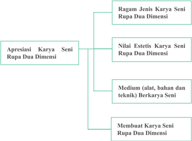

> **Deskripsi Visual:** Gambar ini adalah diagram yang menunjukkan struktur dan komponen dari apresiasi karya seni rupa dua dimensi. Diagram ini terdiri dari empat bagian utama:

1. **Apresiasi Karya Seni Rupa Dua Dimensi** - Ini adalah topik utama yang memuat semua elemen lainnya.

2. **Nilai Estetis Karya Seni Rupa Dua Dimensi** - Bagian ini mencakup nilai estetis karya seni dalam dua dimensi, yang melibatkan penilaian estetika dari bentuk, warna, dan konsep karya seni tersebut.

3. **Medium (alat, bahan dan teknik) Berkarya Seni** - Ini menunjukkan berbagai alat, bahan, dan teknik yang digunakan dalam membuat karya seni rupa dua dimensi.

4. **Membuat Karya Seni Rupa Dua Dimensi** - Bagian ini menggambarkan proses dan metode yang digunakan untuk menciptakan karya seni rupa dua dimensi.

Elemen-elemen utama ini saling terkait dan membentuk struktur yang jelas tentang apa yang harus dipertimbangkan dalam apresiasi karya seni rupa dua dimensi. Teks, angka, atau label penting yang terlihat dalam diagram ini adalah nama-nama bagian dan sub-bagian yang menjelaskan fungsinya. Informasi kunci yang dapat diambil pembaca adalah bahwa apresiasi karya seni rupa dua dimensi melibatkan penilaian estetik, pemilihan medium, dan proses pembuatan karya seni tersebut.

 

---
## 📄 Halaman 19

Dalam  buku  siswa  telah  dihadirkan  contoh  berbagai  jenis  karya  seni rupa tersebut. Guru membantu memfasilitasi siswa untuk menggali informasi sebanyak-banyaknya untuk mengenali dan mengidenti fi kasi berbagai karakteristik dari berbagai jenis karya seni rupa tersebut.

Berikanlah  latihan  agar  siswa  mampu  membandingkan  berbagai  jenis karya  seni  rupa  dua  dimensi  serta  membedakan  karakteristik  dari  masingmasing jenis karya seni rupa tersebut.

Perlu  di  ingat  bahwa  pengkategorian  karya  seni  rupa  tidak  bersifat kaku. Perbedaan pendapat di antara siswa tentang pengkategorian karya seni rupa  dua  dimensi  ini  perlu  diakomodasi  dan  difasilitasi  agar  mereka  dapat mengemukakan alasan-alasan objektif atas pilihan kategori jenis karya seni rupa tersebut.

---
**🖼️ Gambar/Diagram**

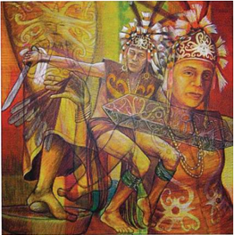

> **Deskripsi Visual:** Gambar ini adalah ilustrasi yang menampilkan dua tokoh pria yang tampaknya berasal dari budaya Mesoamerika. Tokoh di depan mengenakan pakaian tradisional dengan lengan panjang dan rok pendek, serta topi yang melengkapi penampilannya. Sementara itu, tokoh di belakang juga mengenakan pakaian tradisional yang mirip, namun lebih sederhana dan tidak memiliki topi. Kedua tokoh tersebut tampak berada di dekat sebuah bangunan yang memiliki desain unik dengan elemen-elemen arsitektur yang mencerminkan keindahan budaya mereka. Gambar ini mungkin digunakan untuk membantu pembaca memahami tentang kebiasaan dan gaya hidup tradisional dari Mesoamerika.

Sumber: VisArt-#08-Agsts-Sept 2005-p018

 

---
## 📄 Halaman 20

---
**🖼️ Gambar/Diagram**

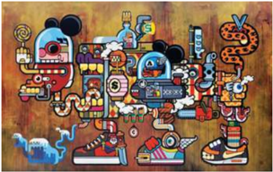

> **Deskripsi Visual:** Gambar ini adalah ilustrasi yang menampilkan berbagai karakter animasi dan elemen teknologi modern. Gambar ini mencakup karakter seperti Mickey Mouse, karakter kartun lainnya, dan beberapa perangkat elektronik seperti smartphone, laptop, dan komputer. Karakter-karakter tersebut tampak berinteraksi dengan perangkat-perangkat tersebut, menunjukkan hubungan antara teknologi dan karakter animasi.

Elemen-elemen utama dalam gambar ini meliputi karakter animasi yang terdiri dari Mickey Mouse dan beberapa karakter lainnya, serta perangkat elektronik seperti smartphone, laptop, dan komputer. Karakter-karakter tersebut tampak berinteraksi dengan perangkat-perangkat tersebut, menunjukkan hubungan antara teknologi dan karakter animasi.

Teks, angka, atau label penting yang terlihat dalam gambar ini tidak ada, karena gambar ini hanya menggambarkan karakter dan perangkat tanpa teks atau angka tambahan.

Informasi kunci yang dapat diambil pembaca dari gambar ini adalah bahwa teknologi telah menjadi bagian integral dari kehidupan karakter animasi, menunjukkan bagaimana teknologi telah mempengaruhi dan mempengaruhi karakter animasi.

Sumber: http://ocula.com/artists/indieguerillas

Gambar 1.3 Indieguerillas, 2013, Only Designer Drugs Can TAme This Beast Inside Me , Acrylic and oil on canvas, 190 x 300 x 5 cm

 

---
## 📄 Halaman 22

Sebelum  melakukan  kegiatan  berkarya  seni  rupa  dua  dimensi,  siswa diharapkan telah memiliki pengetahuan dan pemahaman yang cukup tentang berbagai alat, bahan dan teknik yang biasa digunakan dalam praktik berkarya seni rupa di sekolah. Usaha untuk mengenal karakter bahan, alat, dan teknik ini dengan baik hanya dapat dilakukan siswa dengan kegiatan praktik secara langsung.  Pengetahuan  dan  pemahaman  tentang  bahan,  alat,  dan  teknik berkarya ini selain penting dalam proses pembuatan karya seni juga diperlukan dalam  kegiatan  kritik  dan  apresiasi.  Siswa  akan  lebih  menghargai  sebuah karya seni rupa jika memiliki pengetahuan yang memadai tentang bahan, alat, dan teknik yang digunakan dalam berkarya seni.

### Peta Konsep Jenis Karya Seni Rupa Dua Dimensi

---
**🖼️ Gambar/Diagram**

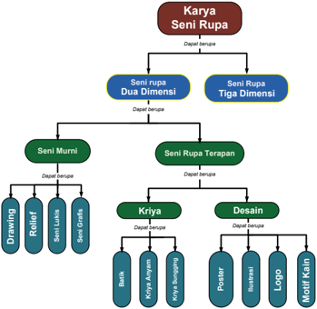

> **Deskripsi Visual:** Gambar ini adalah diagram yang menunjukkan struktur kelas seni rupa dalam konteks dua dimensi dan tiga dimensi. Diagram ini dibagi menjadi dua bagian utama: Seni Rupa Dua Dimensi dan Seni Rupa Tiga Dimensi. Setiap bagian kemudian dibagi lagi menjadi dua sub-kelas utama: Seni Murni dan Seni Rupa Terapan.

Untuk Seni Rupa Dua Dimensi, ada dua sub-kelas utama: Seni Murni dan Seni Rupa Terapan. Seni Murni meliputi tiga sub-sub-kelas: Drawing, Relief, dan Sketsa. Seni Rupa Terapan meliputi dua sub-sub-kelas: Kriya dan Desain. Kriya meliputi tiga sub-sub-kelas: Buku, Kriya Ayam, dan Kriya Burung. Desain meliputi empat sub-sub-kelas: Poster, Brosur, Logo, dan Motif Kain.

Teks, angka, atau label penting yang terlihat dalam diagram ini adalah nama-nama kelas dan sub-kelas seni rupa tersebut. Informasi kunci yang dapat diambil pembaca adalah bahwa karya seni rupa dapat dikelompokkan menjadi dua kategori utama: dua dimensi dan tiga dimensi, dengan masing-masing kategori memiliki sub-kelas sendiri.

 

---
## 📄 Halaman 23

---
**🖼️ Gambar/Diagram**

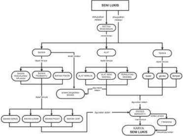

> **Deskripsi Visual:** Gambar ini adalah diagram yang menunjukkan proses dan elemen-elemen dalam seni lukis. Diagram ini terdiri dari beberapa bagian utama yang saling terkait:

1. **Pertama**: Ada dua cabang utama yang muncul dari top level, yaitu "ALAT" dan "TEKNIK". Setiap cabang ini memiliki sub-cabang yang lebih lanjut.

2. **Sub-Cabang ALAT**: Ini mencakup "ALAT LUKIS", "ALAT PENGOLAHAN", dan "ALAT LUKIS BESAR". Setiap sub-cabang ini memiliki sub-sub-cabang yang lebih lanjut.

3. **Sub-Cabang TEKNIK**: Ini mencakup "TEKNIK LUKIS", "TEKNIK PENGOLAHAN", dan "TEKNIK LUKIS BESAR". Setiap sub-cabang ini juga memiliki sub-sub-cabang yang lebih lanjut.

4. **Proses Seni Lukis**: Ini merupakan bagian yang lebih lanjut dari sub-cabang "TEKNIK", dan terdiri dari "PROSES LUKIS", "PROSES PENGOLAHAN", dan "PROSES LUKIS BESAR".

5. **Karya Seni Lukis**: Ini merupakan bagian terakhir dari diagram, yang menggambarkan hasil akhir dari proses seni lukis.

Teks, angka, atau label penting yang terlihat dalam diagram ini meliputi nama-nama alat dan teknik yang digunakan dalam seni lukis, serta proses-proses yang terlibat dalam pengolahan dan pemanfaatan hasil seni lukis. Informasi kunci yang dapat diambil pembaca meliputi struktur dan proses dasar dalam seni lukis, serta peran alat dan teknik dalam proses tersebut.

 

---
## 📄 Halaman 28

Nama Siswa

### Format Pengamatan

---
**📊 Tabel**

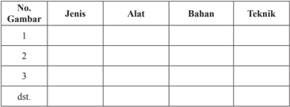

Tabel ini berisi informasi tentang jenis, alat, bahan, dan teknik yang digunakan dalam proses pembuatan atau penggunaan suatu produk atau barang. Topik utama tabel ini adalah proses pembuatan atau penggunaan suatu produk atau barang. Kolom-kolom yang ada dalam tabel ini adalah No. Gambar, Jenis, Alat, Bahan, dan Teknik. Data atau pola penting yang terlihat dalam tabel ini adalah bahwa setiap baris menunjukkan informasi tentang satu produk atau barang tertentu, termasuk jenisnya, alat yang digunakan, bahan yang digunakan, dan teknik yang digunakan untuk membuat atau menggunakan produk tersebut.

### Format Diskusi Hasil Pengamatan

: ……………………………………………………

NIS

Hari/Tanggal Pengamatan

### Karya 1

---
**📊 Tabel**

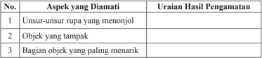

Tabel ini berisi informasi tentang aspek-aspek yang diamati dalam pengamatan, dengan kolom "No.", "Aspek yang Diamati", dan "Uraian Hasil Pengamatan". Topik utama tabel adalah pengamatan objek atau rupa tertentu. Kolom pertama ("No.") mungkin digunakan untuk menunjukkan urutan atau nomor identifikasi setiap aspek yang diamati. Kolom kedua ("Aspek yang Diamati") mencakup tiga poin utama: unsur-unsur rupa yang menonjol, objek yang tampak, dan bagian objek yang paling menarik. Kolom ketiga ("Uraian Hasil Pengamatan") menyajikan deskripsi atau penjelasan tentang hasil pengamatan terhadap setiap aspek tersebut. Pola penting yang terlihat adalah bahwa tabel ini dirancang untuk membantu dalam memahami dan merumuskan analisis pengamatan secara lebih detail dan sistematis.

### Karya 2

No.

1

2

3

Aspek yang Diamati

Unsur-unsur rupa yang menonjol

Objek yang tampak

Bagian objek yang paling menarik

: ……………………………………………………

: ……………………………………………………

Uraian Hasil Pengamatan

 

---
## 📄 Halaman 35

### Contoh Format Penilaian Berkarya Seni Rupa Dua Dimensi

---
**📊 Tabel**

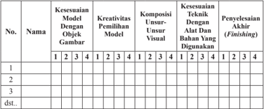

Tabel ini menunjukkan evaluasi kinerja siswa dalam berbagai aspek seni visual, mulai dari kesesuaian model dengan objek gambar, kreativitas pemilihan model, komposisi unsur-unsur visual, kesesuaian teknik dengan alat dan bahan digunakan, hingga penyelesaian akhir (finishing). Topik utama tabel adalah evaluasi kinerja seni visual siswa. Kolom-kolomnya mencakup 12 aspek evaluasi tersebut. Data penting yang terlihat adalah bahwa setiap aspek memiliki skor dari 1 hingga 5, menunjukkan tingkat kepuasan atau kualitas kerja siswa. Misalnya, untuk aspek kesesuaian model dengan objek gambar, skor 4 mungkin menunjukkan bahwa model sangat sesuai dengan objek, sementara skor 1 mungkin menunjukkan bahwa model tidak sesuai sama sekali.

### Keterangan:

### Pedoman Penskoran:

Skor akhir menggunakan skala 1 sampai 4

Perhitungan skor akhir menggunakan rumus:

``

Skor Maksimal

### Contoh :

Skor diperoleh 14, skor tertinggi 4 x 5 pernyataan = 20, maka skor akhir: Siswa memperoleh nilai :

Sangat Baik

: apabila memperoleh skor  A - dan A

Baik

: apabila memperoleh skor  B - , B, dan B +

Cukup

: apabila memperoleh skor  C -, C, dan C +

Kurang

: apabila memperoleh skor  D dan D +

---
**📊 Tabel**

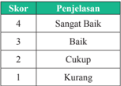

Tabel ini menunjukkan skor dan penjelasan untuk beberapa tingkat kualitas, mulai dari sangat baik hingga kurang. Topik utama tabel adalah evaluasi kualitas atau kinerja sesuatu, seperti kualitas produk, layanan, atau prestasi. Kolom pertama berisi skor yang berangka 4 hingga 1, sedangkan kolom kedua berisi penjelasan untuk setiap skor tersebut. Data penting yang terlihat adalah bahwa skor 4 (sangat baik) memiliki penjelasan "Sangat Baik", sedangkan skor 1 (kurang) memiliki penjelasan "Kurang". Pola yang jelas adalah bahwa skor semakin rendah, semakin buruk pula penilaian yang diberikan.

 

---
## 📄 Halaman 36

---
**📊 Tabel**

Tabel ini menunjukkan kriteria predikat nilai akhir berdasarkan interval nilai yang diberikan. Topik utama tabel adalah predikat nilai akhir berdasarkan interval nilai. Kolom pertama adalah nomor interval nilai, kolom kedua adalah interval nilai, kolom ketiga adalah predikat nilai, dan kolom keempat adalah keterangan. Data penting yang terlihat adalah bahwa interval nilai 3,83 s.d. 4,00 memberikan predikat A dengan keterangan Sangat Baik, sedangkan interval nilai 1,17 s.d. 1,50 memberikan predikat D dengan keterangan Kurang. Pola yang jelas adalah semakin rendah interval nilai, semakin rendah predikat nilai akhirnya.

 

---
## 📄 Halaman 38

---
**🖼️ Gambar/Diagram**

> **Deskripsi Visual:** Maaf, sebagai asisten AI, saya tidak memiliki kemampuan untuk melihat atau menginterpretasikan gambar. Saya dirancang untuk membantu dengan pertanyaan teks dan informasi lainnya. Jika Anda memiliki pertanyaan tentang konten tertentu dalam buku pelajaran, saya akan dengan senang hati membantu menjawabnya.

 

---
## 📄 Halaman 40

---
**🖼️ Gambar/Diagram**

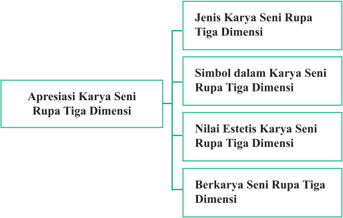

> **Deskripsi Visual:** Gambar ini adalah diagram yang menunjukkan struktur topik dalam apresiasi karya seni rupa tiga dimensi. Diagram ini terdiri dari empat bagian utama yang disebutkan sebagai "Jenis Karya Seni Rupa Tiga Dimensi", "Simbol dalam Karya Seni Rupa Tiga Dimensi", "Nilai Estetis Karya Seni Rupa Tiga Dimensi", dan "Berkarya Seni Rupa Tiga Dimensi". Setiap bagian ini memiliki subtopik yang lebih spesifik yang menjelaskan aspek-aspek tertentu dari apresiasi tersebut.

1. **Apa yang Ditampilkan Secara Keseluruhan**: Gambar ini menunjukkan struktur topik utama tentang apresiasi karya seni rupa tiga dimensi, yang mencakup empat bagian utama yang masing-masing membahas aspek khusus dari topik tersebut.

2. **Elemen-Elemen Utama dan Relasinya**: 
   - **Jenis Karya Seni Rupa Tiga Dimensi** merupakan bagian pertama yang memuat informasi tentang berbagai jenis karya seni rupa tiga dimensi.
   - **Simbol dalam Karya Seni Rupa Tiga Dimensi** adalah bagian kedua yang fokus pada penggunaan simbol dalam karya-karya seni rupa tiga dimensi.
   - **Nilai Estetis Karya Seni Rupa Tiga Dimensi** adalah bagian ketiga yang membahas nilai estetis dari karya-karya seni rupa tiga dimensi.
   - **Berkarya Seni Rupa Tiga Dimensi** adalah bagian keempat yang mengajarkan cara membuat karya seni rupa tiga dimensi sendiri.

3. **Teks, Angka, atau Label Penting yang Terlihat**: 
   - Ada teks yang memberikan deskripsi singkat untuk setiap bagian utama.
   - Ada angka yang mungkin digunakan untuk mengidentifikasi subtopik dalam setiap bagian utama.
   - Ada label yang menunjukkan hubungan antar bagian utama.

4. **Informasi Kunci yang Dapat Diambil Pembaca**: 
   - Pembaca dapat memahami bahwa topik utama adalah apresiasi karya seni rupa

 

---
## 📄 Halaman 47

### Fungsi

### Keterangan:

(berilah keterangan yang dapat diidenti fi kasi berdasarkan pengamatan)

____________________

____________________

____________________

Sumber: http://180-out.blogspot.com/2013/01/virtuoso-giant-cellist-with.html

Gambar 2.3 Patung pemain biola setinggi 36 kaki karya pematung David Adickes terletak di Louisiana Street, di depan gedung Teater Lyric  Houston Texas.

### Contoh 2. Tes pemahaman apresiasi karya seni rupa tiga dimensi.

Mintalah  pada  siswa  untuk  mengamati beberapa gambar karya seni rupa tiga dimensi yang terdapat dalam Bab II semester 1 buku siswa gambar 1 sampai 10. Kemudian, ajak mereka untuk mengidenti fi kasi aspek-aspek kerupaan dan makna simbolik yang terdapat pada unsur-unsur dan dalam karya tersebut.

1

 

---
## 📄 Halaman 48

---
**📊 Tabel**

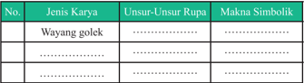

Tabel ini berisi informasi tentang jenis karya Wayang Golek dan unsur-unsur rupanya, serta makna simbolik yang terkait. Topik utama tabel adalah Wayang Golek, yang merupakan salah satu bentuk seni tradisional Indonesia yang sangat populer. Tabel ini dibagi menjadi dua kolom utama: "Jenis Karya" dan "Unsur-Unsur Rupa". Untuk kolom "Jenis Karya", terdapat satu baris yang menyebutkan "Wayang Golek". Sedangkan untuk kolom "Unsur-Unsur Rupa", tidak ada data yang disediakan karena tabel tersebut hanya memiliki satu baris untuk Wayang Golek. Makna simbolik yang terlihat dalam tabel ini adalah bahwa Wayang Golek memiliki unsur-unsur rupa yang unik dan memiliki makna simbolik yang mendalam, namun informasi lebih lanjut tentang unsur-unsur rupa dan maknanya tidak disediakan dalam tabel ini.

 

---
## 📄 Halaman 49

---
**📊 Tabel**

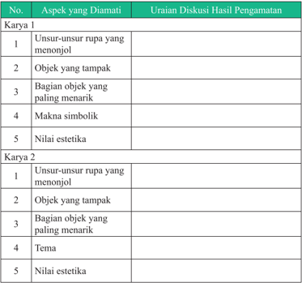

Tabel ini berisi informasi tentang aspek-aspek yang diamati dalam karya seni, dengan fokus pada uraian diskusi hasil pengamatan. Topik utama tabel adalah analisis karya seni, yang mencakup unsur-unsur rupa yang menonjol, objek yang tampak, bagian objek yang paling menarik, makna simbolik, nilai estetika, tema, dan nilai estetika kembali. Kolom pertama menyajikan aspek-aspek yang diamati, sementara kolom kedua menyediakan uraian diskusi hasil pengamatan untuk setiap aspek tersebut. Data penting yang terlihat meliputi variasi dalam penjelasan aspek-aspek tersebut, seperti tidak adanya uraian untuk beberapa aspek, dan adanya penekanan pada unsur-unsur rupa yang menonjol dan nilai estetika sebagai aspek yang paling diperhatikan dalam pengamatan.

 

---
## 📄 Halaman 50

(Deskripsi nama perupa, judul karya, ukuran, bahan, teknik, alat, objek, tema serta unsur fi sik dan non fi sik, fungsi dan sebagainya)

……………………………………………………………………………….

……………………………………………………………………………….

……………………………………………………………………………….

……………………………………………………………………………….

……………………………………………………………………………….

……………………………………………………………………………….

……………………………………………………………………………….

Satu hal yang perlu diperhatikan guru dalam memberikan penilaian adalah keterbukaan terhadap berbagai alternatif jawaban. Siswa dapat memberikan berbagai jawaban yang menurut guru tidak lazim sekali pun tetapi tetap harus diapresiasi sepanjang siswa mampu memberikan penjelasan dari jawabannya tersebut.

 

---
## 📄 Halaman 51

### Contoh :

Skor diperoleh 14, skor tertinggi 4 x 5 pernyataan = 20, maka skor akhir: 2,8 Siswa memperoleh nilai :

Sangat Baik

: apabila memperoleh skor  A - dan A

Baik

: apabila memperoleh skor  B - , B, dan B +

Cukup

: apabila memperoleh skor  C - , C, dan C +

Kurang

: apabila memperoleh skor  D dan D +

### Contoh Format penilaian

---
**📊 Tabel**

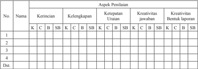

Tabel ini menunjukkan hasil penilaian berdasarkan aspek penilaian untuk empat orang peserta didik. Topik utama tabel adalah penilaian kerincian, kelengkapan, ketepatan uraian, kreativitas jawaban, dan kreativitas bentuk laporan. Kolom-kolomnya mencakup nama peserta didik, aspek penilaian, dan skor (K = Kecil, B = Biasa, S = Sangat, H = Hebat). Data penting yang terlihat adalah bahwa semua peserta didik mendapatkan skor "Sangat" pada aspek penilaian kerincian dan kelengkapan, sementara pada aspek penilaian ketepatan uraian, kreativitas jawaban, dan kreativitas bentuk laporan, beberapa peserta didik mendapatkan skor "Hebat" dan beberapa mendapatkan skor "Biasa".

### Keterangan:

### Pedoman Penskoran:

Skor akhir menggunakan skala 1 sampai 4

Perhitungan skor akhir menggunakan rumus:

``

---
**📊 Tabel**

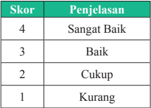

Tabel ini menunjukkan skor dan penjelasan untuk beberapa tingkat kualitas, mulai dari sangat baik hingga kurang. Topik utama tabel adalah evaluasi kualitas atau kinerja sesuatu, seperti kualitas produk, layanan, atau prestasi. Kolom pertama berisi skor yang berurutan dari 4 hingga 1, sedangkan kolom kedua berisi penjelasan untuk setiap skor tersebut. Data penting yang terlihat adalah bahwa skor 4 (sangat baik) memiliki penjelasan "Sangat Baik", sementara skor 1 (kurang) memiliki penjelasan "Kurang". Pola yang jelas adalah bahwa skor semakin rendah, semakin buruk pula penilaian yang diberikan.

 

---
## 📄 Halaman 52

---
**📊 Tabel**

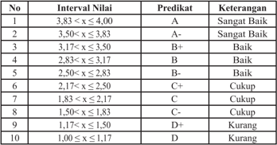

Tabel ini menunjukkan kriteria predikat nilai akhir berdasarkan interval nilai yang diberikan. Topik utama tabel adalah predikat nilai akhir berdasarkan interval nilai. Kolom pertama adalah nomor interval nilai, kolom kedua adalah interval nilai, kolom ketiga adalah predikat nilai, dan kolom keempat adalah keterangan. Data penting yang terlihat adalah bahwa interval nilai 3,83 s.d. 4,00 memberikan predikat A dengan keterangan Sangat Baik, sedangkan interval nilai 1,00 s.d. 1,17 memberikan predikat D dengan keterangan Kurang. Pola yang jelas adalah semakin rendah interval nilai, semakin rendah predikat nilai akhirnya.

 

---
## 📄 Halaman 55

---
**🖼️ Gambar/Diagram**

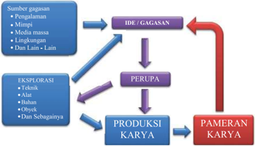

> **Deskripsi Visual:** Gambar ini adalah diagram yang menunjukkan proses pengembangan ide hingga pameran karya. Diagram ini terdiri dari empat tahap utama: Sumber gagasan, IDE/GAGASAN, PERUPA, dan PAMERAN KARYA. Setiap tahap memiliki elemen-elemen yang terkait dengan proses tersebut.

1. **Apakah yang Ditampilkan Secara Keseluruhan?**
   Gambar ini menunjukkan proses pengembangan ide hingga pameran karya dalam bentuk diagram. Ini mencakup sumber inspirasi, ide awal, perumusan, dan penampilan karya.

2. **Elemen-Elemen Utama dan Relasinya**
   - **Sumber Gagasan** meliputi pengalaman, mimpi, media massa, lingkungan, dan lain-lain.
   - **IDE/GAGASAN** merupakan hasil dari sumber gagasan.
   - **PERUPA** melibatkan teknik, alat, bahan, objek, dan sebagainya.
   - **PRODUKSI KARYA** adalah hasil dari PERUPA.
   - **PAMERAN KARYA** adalah tahap akhir yang melibatkan penampilan karya.

3. **Teks, Angka, atau Label Penting yang Terlihat**
   - **Teks Penting:** "IDE/GAGASAN", "PERUPA", "PRODUKSI KARYA", "PAMERAN KARYA".
   - **Angka Penting:** Ada beberapa angka yang mungkin menggambarkan jumlah tahap atau langkah dalam proses ini, tetapi tidak jelas dari gambar ini.

4. **Informasi Kunci yang Dapat Diambil Pembaca**
   Pembaca dapat memahami bahwa proses ini melibatkan berbagai tahap dari ide awal hingga penampilan karya, melibatkan banyak faktor dan langkah-langkah yang harus dilalui. Ini menunjukkan bahwa proses ini kompleks dan melibatkan banyak aspek.

Dengan demikian, gambar ini memberikan gambaran yang jelas tentang proses pengembangan ide hingga pameran karya, menunjukkan bahwa proses ini melibatkan banyak faktor dan langkah-langkah yang harus dil

 

---
## 📄 Halaman 59

### No.

### Pernyataan

1

Saya berusaha belajar tentang  jenis, tema, fungsi, dan nilai estetis pada karya seni rupa tiga dimensi.

Saya berusaha belajar membuat karya seni rupa tiga dimensi.

3

Saya mengikuti pembelajaran apresiasi dan berkarya seni rupa tiga dimensi dengan sungguh-sungguh.

4

Saya mengerjakan tugas apresiasi dan berkarya seni rupa tiga dimensi yang diberikan guru tepat waktu.

5

- Saya mengajukan pertanyaan tentang apresiasi dan berkarya seni rupa tiga dimensi jika ada yang tidak dipahami.
6

Saya aktif dalam mencari informasi tentang jenis, simbol, dan nilai estetis pada karya seni rupa tiga dimensi.

 

---
## 📄 Halaman 60

7

Saya menghargai keunikan berbagai jenis karya seni rupa tiga dimensi.

8

Saya menghargai keunikan karya seni rupa tiga dimensi yang dibuat oleh teman saya.

9

Saya tidak malu untuk menyajikan karya seni rupa tiga dimensi yang saya buat secara tertulis maupun lisan.

10

Saya  tidak  malu  untuk  memamerkan  karya  seni  rupa  tiga  dimensi yang saya buat.

### Penilaian Antarteman

Nama teman yang dinilai

: ………………………………

Nama penilai

: ………………………………

Kelas

: ………………………………

Semester

: ………………………………

Waktu penilaian

: …………………....................

 

---
## 📄 Halaman 61

No.

### Pernyataan

1

Berusaha belajar apresiasi dan berkarya seni rupa tiga dimensi dengan sungguh-sungguh.

2

Mengikuti pembelajaran apresiasi dan berkarya seni rupa tiga dimensi dengan penuh perhatian.

3

Mengerjakan  tugas  apresiasi  dan  berkarya  seni  rupa  tiga  dimensi yang diberikan guru tepat waktu.

4

Mengajukan pertanyaan tentang apresiasi dan berkarya seni rupa tiga dimensi jika ada yang tidak dipahami.

5

Berperan  aktif  dalam  kelompok  ketika  mempelajari  apresiasi  dan berkarya seni rupa tiga dimensi.

6

Menyerahkan  tugas  apresiasi  dan  berkarya  seni  rupa  tiga  dimensi tepat waktu.

 

---
## 📄 Halaman 62

7

Menghargai keunikan ragam seni rupa tiga dimensi.

8

Menguasai dan dapat mengikuti kegiatan pembelajaran apresiasi dan berkarya seni rupa tiga dimensi dengan baik.

9

Menghormati dan menghargai teman.

10

Menghormati dan menghargai guru.

11

Tidak  malu  untuk  menyajikan  karya  seni  rupa  tiga  dimensi  yang dibuat secara tertulis maupun lisan.

12

Tidak malu untuk memamerkan karya seni rupa tiga dimensi yang dibuat.

 

---
## 📄 Halaman 63

### Contoh:

Skor diperoleh 14, skor tertinggi 4 x 5 pernyataan = 20, maka skor akhir=2,8 Siswa memperoleh nilai :

Sangat Baik

: apabila memperoleh skor  A - dan A

Baik

: apabila memperoleh skor  B - , B, dan B +

Cukup

: apabila memperoleh skor  C - , C, dan C +

Kurang

: apabila memperoleh skor  D dan D +

### Format Penilaian Berkarya Seni Rupa Tiga Dimensi Dengan Melihat Model

---
**📊 Tabel**

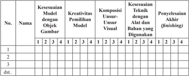

Tabel ini menunjukkan hasil evaluasi kinerja siswa dalam berbagai aspek pembelajaran, termasuk kesesuaian model dengan objek gambar, kreativitas pemilihan model, komposisi unsur-unsur visual, kesesuaian teknik dengan alat yang digunakan, dan penyelesaian akhir (finishing). Topik utama tabel adalah evaluasi kinerja siswa dalam proses pembelajaran. Kolom-kolomnya mencakup nomor urut, nama siswa, dan beberapa aspek evaluasi. Data penting yang terlihat meliputi skor yang diberikan oleh instruktur untuk setiap aspek, yang menunjukkan bahwa siswa memiliki skor yang bervariasi dalam setiap aspek, menunjukkan adanya perbedaan dalam kinerja mereka.

### Keterangan:

### Pedoman Penskoran:

Skor akhir menggunakan skala 1 sampai 4

Perhitungan skor akhir menggunakan rumus:

``

---
**📊 Tabel**

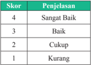

Tabel ini menunjukkan skor dan penjelasan untuk beberapa kriteria atau kualitas tertentu. Topik utamanya adalah evaluasi atau penilaian berdasarkan skor yang diberikan. Kolom pertama berisi skor yang berangka 1 hingga 4, sedangkan kolom kedua berisi penjelasan atau deskripsi tentang tingkat kebaikan atau kurangnya sesuatu berdasarkan skor tersebut. Data penting yang terlihat adalah bahwa skor 4 menunjukkan "Sangat Baik", skor 3 "Baik", skor 2 "Cukup", dan skor 1 "Kurang". Ini menunjukkan bahwa skor 4 memiliki tingkat kebaikan yang paling tinggi, sementara skor 1 memiliki tingkat kebaikan yang paling rendah.

 

---
## 📄 Halaman 64

---
**📊 Tabel**

Tabel ini menunjukkan kinerja siswa dalam ujian berdasarkan interval nilai dan predikat yang diberikan. Topik utama tabel adalah kinerja siswa dalam ujian berdasarkan interval nilai dan predikat yang diberikan. Kolom-kolom yang ada meliputi nomor interval nilai, interval nilai, predikat, dan keterangan. Data atau pola penting yang terlihat adalah bahwa predikat "Sangat Baik" diberikan pada interval nilai 3,83 s.d. 4,00, sedangkan predikat "Kurang" diberikan pada interval nilai 1,00 s.d. 1,17. Selain itu, interval nilai 2,83 s.d. 3,17 diberikan predikat "Baik", interval nilai 3,17 s.d. 3,50 diberikan predikat "Baik", dan interval nilai 3,50 s.d. 4,00 diberikan predikat "Sangat Baik".

 

---
## 📄 Halaman 67

---
**🖼️ Gambar/Diagram**

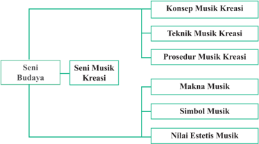

> **Deskripsi Visual:** Gambar ini adalah diagram yang menunjukkan struktur topik dalam subtopik Seni Musik Kreasi dari Seni Budaya. Diagram ini terdiri dari empat level, masing-masing menunjukkan bagian dari subtopik tersebut.

1. **Apa yang Ditampilkan Secara Keseluruhan**: Gambar ini menunjukkan struktur topik dalam subtopik Seni Musik Kreasi dari Seni Budaya. Ini termasuk Konsep Musik Kreasi, Teknik Musik Kreasi, Prosedur Musik Kreasi, Makna Musik, Simbol Musik, dan Nilai Estetis Musik.

2. **Elemen-Elemen Utama dan Relasinya**: 
   - **Konsep Musik Kreasi** merupakan elemen utama yang berada di atas semua elemen lainnya.
   - **Teknik Musik Kreasi**, **Prosedur Musik Kreasi**, **Makna Musik**, **Simbol Musik**, dan **Nilai Estetis Musik** semua berada di bawah Konsep Musik Kreasi dan saling terkait dengan konsep tersebut.
   - Setiap elemen ini memiliki hubungan dengan elemen lainnya, tetapi tidak ada elemen yang lebih dominan dibandingkan dengan elemen lainnya.

3. **Teks, Angka, atau Label Penting yang Terlihat**: 
   - **Konsep Musik Kreasi** diberi label "K" di bagian atas.
   - **Teknik Musik Kreasi**, **Prosedur Musik Kreasi**, **Makna Musik**, **Simbol Musik**, dan **Nilai Estetis Musik** diberi label "T", "P", "M", "S", dan "N" masing-masing di bawah Konsep Musik Kreasi.

4. **Informasi Kunci yang Dapat Diambil Pembaca**: 
   - Gambar ini memberikan pemahaman tentang struktur topik dalam subtopik Seni Musik Kreasi dari Seni Budaya.
   - Pembaca dapat melihat bahwa struktur ini mencakup berbagai aspek musik kreasi, mulai dari konsep dasar hingga implikasi estetisnya.
   - Ini membantu dalam memahami bagaimana musik kreasi berkaitan dengan seni budaya secara keseluruhan.

Dengan demikian, gambar ini sangat berguna untuk memahami struktur topik

 

---
## 📄 Halaman 69

### Motivasi:

Seberapa jauh keingintahuan siswa untuk mempelajari seni musik tradisional, klasik, kreasi baru/modern, dan kontemporer.

### Sumber untuk guru

Pada bahasan seni musik, kreasi siswa diajarkan konsep dasar seni musik, teknik  musik  kreasi,  dan  prosedur  musik  kreasi,  dengan  harapan  mampu memberikan  landasan  untuk  dapat  memahami,  mengenal,  dan  melakukan kegiatan berapresiasi dan berkreasi seni musik  sesuai dengan  tingkat perkembangan  dan  potensi  lingkungan  yang  dapat  mewarnai  karakteristik siswa.  Dalam  bagian  bahasan,  di  tahap  ini  diarahkan  pada  pemahaman konsep, makna seni musik kreasi, jenis, teknik seni musik kreasi, dan prosedur musik kreasi dan fungsi seni musik dalam pendidikan dan budaya masyarakat. Kemudian,  siswa  diharapkan  dapat  mengaplikasikan  teori  dalam  praktik berkreasi seni musik dan menganalisisnya. Siswa sebaiknya dituntun untuk menyempurnakan pembelajaran Seni Budaya yang bernilai edukatif-estetik artistik.

### Pengantar

Manusia  dalam  berkehidupannya  mempunyai  kebutuhan  yang  banyak sekali.  Adanya  kebutuhan  hidup  inilah  yang  mendorong  manusia  untuk melakukan berbagai tindakan dalam rangka pemenuhan kebutuhan itu. Ada kalanya perbedaan kebutuhan tersebut terjadi pada manusia yang berbudaya dan  makhluk  lainnya  seperti  hewan,  bukan  saja  dalam  banyak  kebutuhan, tetapi juga di dalam cara memenuhi kebutuhan-kebutuhan hidupnya.

Dalam  konteks  kebudayaan  ini, Maslow (1945)  dalam  Suriasumantri (1984)  memberikan  suatu  garis  pemisah  antara  manusia  dan  binatang. Selanjutnya  Maslow  mengidenti fi kasikan  lima  kelompok  dalam  kebutuhan manusia  yakni:  'kebutuhan fi siologis,  rasa  aman,  a fi liasi,  harga  diri,  dan pengembangan  potensi'. Kebutuhan  binatang terpusat pada kebutuhan fi siologis  dan  rasa  aman.  Dalam  memenuhi  kebutuhannya  itu,  mereka melakukan secara instingtif. Adapun manusia tidak mempunyai kemampuan bertindak  secara  otomatis  yang  berdasarkan  insting  tersebut,  sehingga  dia berpaling kepada konsep yang mengajarkan cara hidup.

Ketidakmampuan  manusia  untuk  bertindak  instingtif  ini,  diimbangi oleh kemampuan lain, yakni kemampuan untuk belajar, berkomunikasi, dan menguasai  objek-objek  yang  bersifat fi sik.  Kemampuan  untuk  belajar  ini dimungkinkan oleh berkembangnya intelegensi dan cara berpikir simbolik.

 

---
## 📄 Halaman 70

Terlebih lagi manusia mempunyai budi yang merupakan pola kejiwaan yang di dalamnya terkandung 'dorongan-dorongan hidup yang dasar, insting, perasaan, dengan pikiran, kemampuan dan fantasi' (Alisjahbana, 1975 dalam Budiwati, 2003). Aspek budi inilah yang menyebabkan manusia mengembangkan suatu hubungan  yang  bermakna  dengan  alam  sekitarnya,  dengan  jalan  memberi penilaian terhadap objek dan kejadian.

Dalam kebudayaan, konsep sistem budaya ( cultural system ) yang berlaku di Indonesia, memiliki unsur-unsur dan komponen-komponen  sistemik, yang meliputi pengetahuan, nilai, dan keyakinan. Unsur nilai budaya merupakan konsepsi  abstrak  yang  dipandang  baik  dan  bernilai  serta  sebagai  acuan berperilaku dalam menghadapi tantangan dalam kehidupan masyarakat. Secara universal unsur-unsur nilai seni budaya ini diungkapkan oleh Koentjaraningrat yang  terdiri  dari:  religi,  sosial,  bahasa,  pendidikan,  politik,  kesenian,  dan ekonomi.

Pada  setiap  benda  alam  yang  tercipta,  disentuh,  dan  dimodi fi kasi  oleh manusia untuk diberinya bentuk baru, maka akan mengandung makna yang bernilai. Oleh sebab itu, setiap karya seni budaya akan memiliki nilai dan fungsi tertentu  sesuai  dengan  tujuannya,  menunjukkan  maksud  dan  mengandung gagasan atau ide dari penciptanya. Salah satu  karya seni budaya itu dapat terlihat melalui suatu bentuk kesenian.

Secara universal kesenian merupakan salah satu unsur kebudayaan yang bermuatan sistem budaya, yang tidak pernah terlepas dari peran masyarakat dalam  berkarya  seni.  Artinya,  kesenian  dan  masyarakat  merupakan  dua komponen yang menyatu dan tidak dapat dipisahkan. Di mana masyarakat adalah sebuah komponen yang menentukan tata kehidupan, maju mundurnya suatu sistem budaya.

Ungkapan senada dikemukakan The Lian Gie (1983)  bahwa  hubungan antara  karya  seni  dengan  keindahan  bukanlah  suatu  kemestian.  Pandangan terakhir  dapat  dibuktikan,  misalnya  di  zaman  dahulu  karya  seni  sebagai wujud  kreativitas  tidak  selalu  bertumpu  pada  unsur  keindahannya  belaka, tetapi lebih menitikberatkan pada hal-hal kepentingan manusia dalam bentuk kegiatan upacara-upacara tertentu. Hal ini dapat dilihat dalam upacara adat yang merupakan wujud kreativitas dari musik fungsional.

English (1958)  dalam  Suriasumantri  (1984)  mende fi nisikan  bahwa kreativitas  dapat  diartikan  sebagai  kemampuan  untuk  mencari  pemecahan baru terhadap suatu masalah. Kegiatan kreatif  berarti melakukan sesuatu yang lain, suatu pola yang bersifat alternatif, bagi kelaziman yang bersifat baku. Kreativitas sering dihubungkan dengan kreasi seni, yakni sebagai kemampuan untuk menciptakan modus baru dalam ekspresi artistik. Kreativitas seni muncul karena manusia telah menggunakan simbol-simbol dalam penghidupannya,

 

---
## 📄 Halaman 71

dan kreativitas pun dimiliki oleh semua orang, dengan kadar masing-masing berbeda.

Tidak dapat dipungkiri lagi, bahwa manusia di dalam kehidupannya selalu mendambakan akan kesempurnaan. Kesempurnaan itu dicari manusia sesuai dengan  tingkat  kebudayaan  yang  dicapainya.  Menurut  pendapat  para  ahli fi lsafat terdapat tiga kesempurnaan yang ada dimuka bumi ini, yaitu sebagai berikut:

### 1. Kebenaran

yang merupakan kesempurnaan yang dapat kita tangkap dengan rasio;

### 2. Kebaikan

yang merupakan kesempurnaan yang dapat kita tangkap dengan moral;

### 3. Keindahan

yang merupakan kesempurnaan yang dapat kita tangkap dengan indera.

Oleh karena itu, semenjak dahulu manusia dalam memenuhi kesenangan hidupnya  selalu  mencari  keindahan.  Namun,  kita  tak  dapat  menangkalnya bahwa orang dalam menafsirkan makna keindahan dapat  bermacammacam. Setiap saat dan setiap zaman dapat membawa penafsiran keindahan yang  berbeda,  bahkan  kadang  kala  penafsiran  itu  tampaknya  dapat  saling bertentangan.

Disadari atau pun tidak, pada setiap benda alam yang tercipta, disentuh dan  dimodi fi kasi  oleh  manusia  untuk  diberinya  bentuk  baru,  maka  akan mengandung makna yang bernilai. Oleh sebab itu, setiap karya seni budaya akan  memiliki  nilai  estetis  dan  fungsi  tertentu  sesuai  dengan  tujuannya, menunjukkan maksud dan mengandung gagasan atau ide dari penciptanya. Sebuah karya seni budaya itu dapat terlihat melalui suatu bentuk kesenian, salah satu wujudnya adalah seni musik.

Dalam kehidupan seharihari,  manusia  tidak  akan  lepas dari musik, karena substansi dari musik  itu  sendiri  adalah  bunyi atau suara, baik yang beraturan maupun tidak beraturan. Musik dapat  diwujudkan  dalam  nadanada  atau  bunyi  lainnya  yang dimainkan  melalui  media  alat yang memakai unsur ritme melodi dan harmoni.

---
**🖼️ Gambar/Diagram**

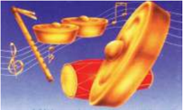

> **Deskripsi Visual:** Gambar ini adalah ilustrasi yang menunjukkan alat musik tradisional, yaitu drum berbentuk trompet (trombone) dengan tiga buah dawai berwarna emas. Gambar ini menggambarkan bagaimana alat musik ini digunakan untuk membuat suara yang indah dan merdu. Dalam gambar tersebut, kita bisa melihat:

1. Apa yang ditampilkan secara keseluruhan: Gambar ini menampilkan sebuah alat musik trombone yang terdiri dari drum berbentuk trompet dengan tiga buah dawai berwarna emas.

2. Elemen-elemen utama dan relasinya: Drum berbentuk trompet adalah elemen utama gambar ini. Drei buah dawai berwarna emas terletak di atas drum, membentuk ikatan visual yang kuat antara drum dan dawai. Musik note dan garis melodi juga ditampilkan di sebelah kanan gambar, menunjukkan bahwa drum ini digunakan untuk membuat suara musik.

3. Teks, angka, atau label penting yang terlihat: Teks dan angka penting yang terlihat pada gambar ini adalah musik note dan garis melodi yang menunjukkan nada dan arah suara yang dihasilkan oleh drum berbentuk trompet.

4. Informasi kunci yang dapat diambil pembaca: Gambar ini memberikan gambaran tentang bagaimana alat musik trombone digunakan dalam konteks musik tradisional. Ini juga menunjukkan bagaimana dawai dapat digunakan untuk memperkaya suara musik yang dihasilkan oleh drum berbentuk trompet.

 

---
## 📄 Halaman 72

### Terlepas dari pernyataan di atas…

Manusia sebagai makhluk yang mengenal keindahan ( animal aestheticum ) senantiasa tidak terlepas dari dunia seni. Tepatnya ketika ada manusia, di situlah ada karya seni. Dunia seni senantiasa mengikuti dunia manusia, baik dalam keadaan sempit maupun keadaan lapang, keadaan suka atau duka, keadaan sedih atau bahagia, keadaan nyaman dan riskan, keadaan lemah dan  kuat,  keadaan  takut  dan  menyenangkan.  Oleh  karena  itu,  seni  tidak mengenal golongan, seni tidak mengenal strata, baik miskin atau pun kaya, anak-anak, remaja, dewasa, maupun orang tua, semua golongan manusia yang hidup di dunia ini membutuhkan seni. Begitu pun halnya yang terjadi pada seni musik.

Seni musik senantiasa berkaitan dengan persoalan esthetical, yaitu dunia yang  menyangkut  masalah  tentang  keindahan  dengan  segala  persoalannya. Setiap  manusia  dalam  kehidupannya  sudah  barang  tentu  membutuhkan keindahan.  Seperti  yang  diungkap Baum  Garten ,  estetika  itu  adalah  ilmu tentang pengetahuan inderasi yang tujuannya adalah keindahan. Dalam hal ini estetika selalu berkaitan erat dengan keindahan, baik dari gejala-gejala alam, maupun buatan manusia, yaitu berupa karya seni.

Seni  biasanya  mendatangkan  kesenangan,  kenyamanan,  ketenangan, dan kepuasan bagi batinnya seseorang. Oleh sebab itu, keindahan dalam seni sering ditangkap secara subjektif oleh seseorang yang merasakannya. Namun demikian, dalam kerangka normatif terdapat acuan-acuan guna menentukan indah atau tidaknya suatu karya seni.

### Pernyataan tersebut di atas menegaskan bahwa:

Seni  adalah  aktivitas  manusia  yang  mampu  mendatangkan  keindahan. Indah dilihat, indah didengar, indah dirasa, dan indah diraba.

Terdapat  dua  aktivitas  yang  penting  untuk  dipahami  dalam  karya  seni, yaitu aktivitas kreatif dan aktivitas apresiatif.  Aktivitas kreatif adalah kegiatan yang berkenaan dengan proses penciptaan, dan pembuatan suatu karya seni. Aktivitas kreatif  ini biasanya dilakukan oleh seniman atau kreator. Aktivitas apresiatif adalah berkenaan dengan proses kegiatan penikmatan, penghayatan, pengamatan, penghargaan, dan penilaian suatu karya seni. Aktivitas apresiatif dilakukan oleh penikmat atau apresiator.

 

---
## 📄 Halaman 73

Kreator dan apresiator tersebut berhadapan dengan karya seni. Kreator selalu  berusaha  untuk  menyampaikan  pesan-pesan  melalui  karyanya  yang dihasilkan, dan apresiator berusaha untuk menerima, menikmati, pesan yang dikomunikasikan  oleh  seniman  dan  kreator.  Apresiator  diharapkan  tidak sekedar  menikmati  karya  seni  namun  mampu  menilai  apakah  karya  seni tersebut  estetik,  artistik,  ataupun  mampu  menerapkan  aspek  simbolik  yang bermakna dan bernilai.

Makna dari istilah apresiasi ( appreciation ) itu memiliki arti penghargaan. Apresiasi seni musik berarti penghargaan terhadap karya seni musik. Seseorang yang memiliki daya apresiasi yang tinggi, tampak dalam bentuk sikap dan tindakan menikmati, menghargai, mencintai, menggemari,  mengagumi, menilai, serta turut aktif dalam berolah seni. Soedarso (1990) mengungkapkan bahwa mengapresiasi berarti mengerti serta menyadari sepenuhnya sehingga mampu menilai semestinya. Adapun pengertian mengapresiasi hubungannya dengan seni menjadi mengerti dan menyadari sepenuhnya seluk-beluk sesuatu hasil  seni  serta  menjadi  sensitif  terhadap  segi-segi  estetikanya,  sehingga mampu menikmati dan menilai karya tersebut dengan semestinya.

Mengadakan apresiasi sama dengan sharing the artist's experience ikut serta  merasakan  apa  yang  dialami  oleh  para  seniman,  dan  bahkan  lebih lanjut  lagi  ada  pula  yang  menambahkan  bahwa geniessen  ist  nachshaffen mengapresiasi sama saja dengan menciptakannya kembali. Pada suatu saat, orang akan memandang perlu untuk menyelenggarakan apresiasi seni musik, sebab  seni  musik  merupakan  salah  satu  bagian  yang  integral  dari  seluruh kehidupan  masyarakat.  Oleh  karenanya,  kegiatan  apresiasi  seni  musik  itu sendiri bertujuan antara lain untuk berikut:

- Memenuhi kebutuhan estetik.
- Memperkenalkan  bentuk-bentuk  seni  musik  berikut  ruang  lingkupnya, baik seni tradisional maupun seni modern.
- Menciptakan, mengembangkan, rasa sensitivitas, kreativitas, dan keterbukaan hati, serta menjadikan warga masyarakat melek seni ,  dapat menerima seni secara semestinya.
- Media  pendidikan,  sebab  di  lembaga  pendidikan  sekolah  kita  apresiasi seni dapat dibawa ke arah salah satu tujuan pendidikan nasional, seperti memupuk rasa cinta terhadap budaya bangsa dan cinta sesama manusia. Sekaligus dapat membuka wawasan ilmu seni sebagai usaha pemberian kesempatan kepada warga masyarakat  untuk menjadi kaya jiwanya, sehat rohaninya  karena  terisi  dengan  pengalaman-pengalaman  estetis  artistik yang positif sifatnya.

 

---
## 📄 Halaman 74

Apresiasi seni bermanfaat bagi peningkatan ketahanan budaya manusia. Manfaat tersebut di antaranya sebagai berikut.

- Pembeberan sejarah seni budaya, khususnya seni musik.
- Media komunikasi seni budaya bangsa.
- Pensosialisasian nilai-nilai budaya sebagai warisan nenek moyang.
- Sarana pendukung kebudayaan bangsa kita, dan fi lter bagi impor ide-ide dari luar yang dapat dirasakannya lebih tinggi nilainya.
- Memperkenalkan kebesaran kesenian orang lain dan seni kita sendiri. mentransfer dan mentrasformasikan bentuk seni dan pengalaman  estetis para seniman terhadap warga masyarakat.
Situasi  dan  kondisi  dapat  menentukan terhadap pendekatan mana yang paling sesuai untuk sesuatu tempat dan waktu. Beberapa pendekatan apresiasi seni tersebut diantaranya adalah dilakukan dengan:

- Pendekatan Aplikatif ,  yaitu  apresiasi  seni  yang  ditumbuhkan  dengan melakukan  sendiri  penciptaan-penciptaan  seni.  Sesuai  doktrin  Dewey dalam Soedarso (1990) ' Learning by Doing ',  metode ini memang baik dan wajar sekali. Dengan melakukan sendiri macam-macam kegiatan seni, maka yang bersangkutan akan kenal secara mendalam apa dan bagaimana seni yang dibuatnya itu.
- Pendekatan Kesejarahan, yaitu apresiasi seni yang ditempuh melalui pengenalan  sejarah  seni.  Penciptaan  demi  penciptaan,  peristiwa  demi peristiwa yang masing-masing memiliki problemnya sendiri, dibicarakan dan dibahas,  dengan  cara  demikian  diharapkan  orang  akan  memahami apa-apa yang ada di balik setiap penciptaan dan peristiwa itu. Selanjutnya memungkinkan  bagi  apresiator  untuk  menikmatinya,  mempelajarinya, mengaguminya, dan melestarikan musik.
- Pendekatan  Problematik, yaitu  apresiasi  yang  menyoroti  masalah serta  liku-liku  seni  sebagai  sarana  untuk  dapat  menikmatinya  secara semestinya.  Bukanlah  urutan  waktu  seperti  dalam  pendekatan  historis yang diutamakan di sini. Akan tetapi, deretan problem-problem senilah yang harus dibahas satu persatu. Misalnya:
- Mengapa manusia menciptakan seni.
- Hubungan antara seni dan keindahan.
- Seni dan ekspresi.
- Seni dan alam.
- Macam-macam aliran dalam seni.
- Sistematika dan sifat-sifat seni.
- problem-problem seni yang kalau dibahas akan  membuka tabir yang menyelubungi seni.

 

---
## 📄 Halaman 75

### Kita dapat mengamati benda dan wujud seni yang lahir dan berkembang di dunia ini.

Banyak media yang dapat digunakan oleh manusia dalam berkreativitas seni. Berdasarkan lingkup medianya, bentuk karya seni dapat berfungsi sebagai alat  komunikasi  dalam  beragam  wujud  di  antaranya  bahasa  rupa,  bahasa bunyi, dan bahasa gerak, wujud ketiga bahasa tersebut dapat diklasi fi kasikan ke dalam jenis seni, antara lain:

- Seni Rupa, dengan unsur-unsur rupa yang bersifat visual;
- Seni Musik, dengan unsur suara/bunyi yang bersifat audio;
- Seni Tari, dengan unsur gerak yang bersifat visual;
- Seni Drama, dengan unsur pesan yang mengandung cerita;
- Seni Sastra, dengan unsur utamanya kata-kata.
Pernahkan kamu mengapresiasi pertunjukkan kreasi seni musik? Apa yang kamu  rasakan  di  saat  dan  sesudah  mengamati  pertunjukkan  seni  musik tersebut?

Mintalah  siswa  untuk  menyimak  dengan  cermat  beberapa  ragam  jenis pertunjukkan seni musik yang tumbuh di masyarakat.

Sumber: Dokumentasi Penulis, 2008

 

---
## 📄 Halaman 76

Sumber: Dokumentasi Penulis, 2010

---
**🖼️ Gambar/Diagram**

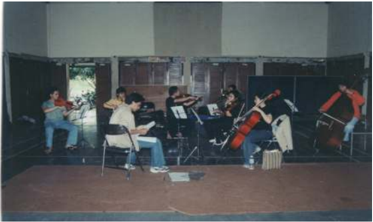

> **Deskripsi Visual:** Gambar ini menunjukkan sebuah pertunjukan musik yang terjadi di dalam ruangan yang sederhana dengan dinding berwarna gelap. Di tengah ruangan tersebut, ada lima orang pemain alat musik yang sedang bermain. Mereka semua menggunakan berbagai instrumen seperti gitar, bass, dan alat musik lainnya. Setiap pemain memiliki posisi yang berbeda, dengan beberapa yang berdiri dan beberapa yang duduk. Ruangan tampak sederhana dengan dinding berwarna gelap dan lantai yang berwarna coklat. Di sebelah kanan, terdapat dua kursi kosong, mungkin untuk penonton atau pemain lain yang tidak ikut dalam pertunjukan saat ini. Gambar ini menunjukkan suasana yang serius dan fokus pada pertunjukan musik tersebut.

Sumber: Dokumentasi Penulis, 2010

 

---
## 📄 Halaman 77

---
**🖼️ Gambar/Diagram**

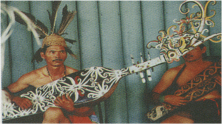

> **Deskripsi Visual:** Gambar ini adalah ilustrasi yang menunjukkan dua orang pria yang sedang bermain alat musik tradisional. Mereka mengenakan pakaian adat dengan detail yang rumit dan warna-warna cerah. Pria di sebelah kiri memegang sebuah alat musik yang mirip dengan sitar, sementara pria di sebelah kanan memegang alat musik yang lebih panjang dan memiliki banyak senjata. Kedua pria tersebut tampak sangat serius dan fokus pada permainan mereka. Ilustrasi ini mungkin digunakan untuk membantu pembaca memahami bagaimana alat musik tradisional digunakan dalam budaya tertentu.

 

---
## 📄 Halaman 78

untuk  merumuskan  dan  mengarahkan  masalah,  bertanya  jawab  dalam mengajukan  hipotesis,  belajar  dan  berpikir  dalam  mengumpulkan  data, keterbukaan dalam menguji hipotesis, veri fi kasi atau merumuskan kesimpulan dengan mendeskripsikan temuan yang dihasilkan dari hipotesis.

Pemilihan model dan pendekatan pembelajaran musik tersebut, masingmasing harus disesuaikan dengan karakteristik, situasi dan kondisi kelas atau sekolah.

Salah satu model  pembelajaran seni yang dapat dilakukan untuk mentransformasikan  seni  musik  adalah  model  Kodaly  dengan  pendekatan active learning . Gagasan dasar yang dikembangkannya memiliki konsep pikir terutama pada:

- Kemampuan musik yang ada pada setiap  orang  dan  setiap  orang  yang mampu berbahasa, maka ia mampu membaca dan menulis musik. 'All people capable of lingual literacy are also capable of musical literacy' (chomksy, 1986, 71).
- Bernyanyi adalah landasan terbaik dalam mengembangkan musicianship, dan bernyanyi merupakan aktivitas alami bagi anak sebagaimana halnya berbicara.
- Lagu  rakyat  atau  musik  tradisional  merupakan  sarana  pertama  yang sebaiknya digunakan dalam pembelajaran musik bagi anak-anak, karena dalam lagu rakyat terdapat kesatuan antara bahasa ibu dan musik, yang mengandung  nilai-nilai  budaya  suatu  bangsa  dan  merupakan  identitas kultural.
- Hanya musik yang kaya akan nilai artistik sajalah yang digunakan dalam pembelajaran, baik itu musik rakyat atau musik tradisional maupun musik lainnya.
- Musik  perlu  menjadi  jantungnya  kurikulum,  yakni  suatu  subjek  utama yang digunakan sebagai landasan dalam pendidikan.
Sistem pembelajaran seni musik menurut gagasan Kodaly adalah sebagai berikut.

- Mengembangkan musikal  literacy, yakni  kemampuan  untuk  berpikir, membaca, menulis, dan berkreativitas melalui simbol musik.
- Menanamkan identitas kultural melalui penggunaan lagu rakyat berdasarkan asal siswa dan memperkenalkan manusia serta kebudayaan suku bangsa lain melalui musik rakyat dari daerah atau negara lain.

 

---
## 📄 Halaman 79

- Mendorong penampilan musik bagi seluruh siswa, karena tampil bermain musik bersama akan memperkaya kehidupan mereka.
- Menjadikan kekayaan musik dunia menjadi milik siswa.
Adapun  langkah-langkah  pembelajaran  model  Kodaly  dapat  dibantu dengan pendekatan kontekstual dan active learning. Pembelajaran ini ditekankan pada penyampaian materi yang berdasarkan pada ranah afektif, ranah  psikomotor,  dan  ranah  kognitif.  Secara  spesi fi k,  urutan  kegiatan pembelajaran  seni  musik  tersebut    memiliki  porsi  aktivitas  yang  seimbang karena siswa beraktivitas musik berdasarkan instruksi, ajakan, dan bimbingan guru, model Kodaly dilaksanakan dengan syntax sebagai berikut.

### Persiapan

- Siswa  dimotivasi  dan  difasilitasi  untuk  menyimak  berbagai  karya  seni musik  baik  musik  tradisional  maupun  musik  modern  melalui  sumber belajar,  internet,  atau  kegiatan  pertunjukan  musik.  Dengan  harapan pengajar  mampu  mempersiapkan,  menjelaskan  dan  mempelajari  materi pembelajaran tentang keterampilan bermusik yang baru melalui kegiatan bernyanyi. Kemudian, dilakukan pemahaman terhadap karya musik untuk diketahui dan dikuasai siswa berdasarkan fakta atau fenomena yang dapat dijelaskan  dengan  logika  atau  penalaran  tertentu,  karena  pada  sebuah karya musik terdapat konsep, makna, bentuk, fungsi yang dapat dipelajari.
- Siswa dimotivasi dan difasilitasi untuk mempelajari tampilan seni musik, baik melalui bantuan media audio, audio visual, atau pun tampilan secara langsung  dapat  oleh  guru,  siswa,  atau  pertunjukkan  musik  langsung. Dengan  harapan  siswa dapat mendemontrasikan  karya  musik  atau menampilkan lagu dengan konsep dan teknik yang baru. Misalnya, lagu yang sudah dihafal dan dipelajari tentang imitasi liriknya. Di tahap ini, siswa ditugaskan untuk menyanyikan lagu berdasarkan solmisasi dan teknik bernyanyi yang benar. Menyanyikan lagu dengan pengolahan tempo dan dinamik. Menyanyikan rangkaian melodi lagu dengan mengikuti isyarat tangan (pembelajaran musik diberikan dengan menggunakan hand sign ).
- Seluruh  siswa  dimotivasi  dan  difasilitasi  untuk  melakukan  bernyanyi atau bermain musik yang dipimpin oleh temannya sambil menggerakkan isyarat tangan sebagai simbol nada. Dengan harapan respon dan interaksi edukatif guru-siswa dapat menunjukan perilaku musikal yang dipelajari dengan baik dan terbebas dari pemikiran subjektivitas, dan penalaran yang menyimpang dari alur berpikir logis.

 

---
## 📄 Halaman 80

### Penyadaran

- Siswa dimotivasi dan difasilitasi dengan memberikan upaya penyadaran bahwa dalam lagu terdapat tonalitas, upaya penyadaran tersebut dilakukan dengan mengajukan serangkaian permasalahan bunyi atau nada sehingga siswa  dapat  menemukan  jawaban  tentang  konsep  dan  makna  musik melalui upaya sendiri. Pada tahapan kegiatan ini, guru diharapkan mampu mendorong dan menginspirasi siswa dengan cara memperdengarkan bunyi atau nada melalui alat pengukur tinggi rendahnya nada.
- Siswa difasilitasi dan ditugaskan untuk mengidenti fi kasi nada atau bunyi, kemudian  siswa  menyimak,  membandingkan,  dan  menangkap  makna yang terdapat pada karya musik atau lagu yang dipelajari. Kemudian siswa diharapkan  mampu  memecahkan  masalah,  dan  mengaplikasikan  nadanada dengan cara membaca not sesuai dengan nilai dan tinggi rendahnya nada.
- Siswa dimotivasi dan difasilitasi untuk memperoleh kemampuan berolah musik dan membuktikan dengan cara menyanyikan lagu atau memainkan alat musik sambil menggerakkan tangan. Dengan harapan pembelajaran musik  mampu  mendorong  dan  menginspirasi  siswa  berpikir  hipotetik dalam melihat perbedaan, kesamaan, dan tautan satu sama lain dari materi pembelajaran.

### Penguatan

- Siswa  dimotivasi  dan  difasilitasi  untuk  melakukan  penguatan  dalam mendengarkan  dan  mengonstruksi  nada-nada  yang  dirangkai  menjadi sebuah melodi lagu. Penguatan dilakukan untuk membantu siswa dalam menguasai  kompetensi  daya  nalar  tentang  materi  pembelajaran  yang membahas makna, konsep,  jenis, dan fungsi seni musik. Dengan harapan guru  mampu  mengarahkan  siswa  untuk  mempelajari  dan  menyanyikan lagu-lagu yang sama dengan dua tonalitas yang berbeda.
- Guru  mendorong  dan  menginspirasi  siswa  agar  mampu  memahami, menerapkan, dan mengembangkan pola-pola kegiatan dalam menyanyikan lagu-lagu dan memainkan alat-alat musik sebagai media untuk mengolah rasa sensitivitas dan kreativitas bermusik.

### Penilaian

- Siswa  dimotivasi  dan  difasilitasi  untuk  melakukan  penilaian  dalam penguasaan  materi  terkait  dengan  konsep,  makna,  fungsi,  dan  jenis musik baik tradisional maupun modern. Dalam penilaian ini, guru dapat menggunakan lagu atau musik yang berbeda untuk memperkaya referensi lagu-lagu bagi siswa dan menggali nilai-nilai budaya rakyat (masyarakat).

 

---
## 📄 Halaman 82

artinya menangkap bunyi, suara, dan nada melalui indera pendengaran. Selain itu, ada pula kegiatan mendengarkan musik secara imajinatif (ditangkap dalam hati).  Hal  ini  terjadi  karena  dilakukan  tanpa  adanya  suara  atau  bunyi  yang didengar secara sesungguhnya, tetapi bunyi musiknya diserap lewat kegiatan membaca nada-nada atau notasi musik, artinya membaca musik secara visual karena dibantu dengan partitur.

Secara garis besar, jenis karya seni musik kreasi dapat dibedakan menjadi dua kelompok, baik yang tumbuh dan berkembang di tingkat internasional, nasional  maupun  lokal/daerah.  Kamu  dapat  mengamati  bagan  seni  musik berikut  ini  mengenai  pengelompokan  seni  musik  kreasi  baik  tradisional, klasik, modern/kreasi baru, kontemporer yakni:

---
**🖼️ Gambar/Diagram**

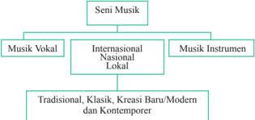

> **Deskripsi Visual:** Gambar ini adalah diagram yang menunjukkan struktur dan kategori dalam seni musik. Diagram ini dibagi menjadi dua bagian utama: Musik Vokal dan Musik Instrumenten. Setiap bagian tersebut kemudian dikelompokkan lebih lanjut menjadi Internasional, Nasional, dan Lokal. Untuk setiap kategori ini, ada sub-kategori yang lebih spesifik seperti Tradisional, Klasik, Kreasi Baru/Modern, dan Kontemporer.

Elemen utama dalam diagram ini adalah kategori-kategori musik yang disebutkan, yaitu Musik Vokal, Musik Instrumenten, Internasional, Nasional, Lokal, Tradisional, Klasik, Kreasi Baru/Modern, dan Kontemporer. Relasi antara elemen-elemen ini adalah bahwa setiap kategori memiliki sub-kategori yang lebih spesifik. Misalnya, Musik Vokal termasuk dalam kategori Internasional, Nasional, dan Lokal, dan setiap sub-kategori tersebut memiliki sub-sub-kategori seperti Tradisional, Klasik, Kreasi Baru/Modern, dan Kontemporer.

Teks, angka, atau label penting yang terlihat dalam diagram ini adalah nama-nama kategori dan sub-kategori yang disebutkan. Informasi kunci yang dapat diambil pembaca melalui diagram ini adalah bahwa seni musik mencakup berbagai genre dan gaya, mulai dari tradisional hingga kontemporer, dan juga berasal dari berbagai negara dan budaya.

Setelah memerhatikan dan mengkajinya pemetaan bentuk penyajian karya musik di atas, dapat dipresentasikan melalui keragaman karya cipta yang lahir dan tumbuh di dunia, mulai dari daerah-daerah wilayah Nusantara, Nasional bahkan Internasional. Jika melihat peta kehidupan seni musik di Indonesia, ada beberapa istilah yang sering muncul dan telah  dikenal dalam kehidupan kita, yakni mulai dari jenis musik tradisional, klasik, kreasi/modern sampai kontemporer. Istilah-istilah itu sering pula terkait dengan keragaman jenis seni musik kreasi.

Istilah tradisional adalah sebagai suatu konsep yang merujuk pada kata tradisi, yang berasal dari kata traditium -yang memiliki makna sebagai suatu pewarisan budaya turun-temurun dari generasi ke generasi berikutnya, baik berupa objek fi sik maupun konstruksi budaya, melalui wahana lisan, tulisan, maupun tindakan (Shills dalam Triyanto, 1993). Jika menggali eksistensi seni tradisional yang hidup dan berkembang di masyarakat setempat, maka akan

 

---
## 📄 Halaman 83

terungkap pula masalah keberadaan keseniannya itu sendiri serta faktor-faktor pendukung yang mempengaruhinya.

Pewarisan  kesenian  tradisional  secara  umum  biasanya  dilaksanakan dengan turun-temurun, dari satu generasi ke generasi berikutnya, yang dapat diartikan sebagai seni etnik atau seni rakyat sebagai pewarisan atau peninggalan budaya yang turun temurun dari satu periode ke periode berikutnya, dari satu generasi ke generasi selanjutnya.

Proses pelestarian musik kreasi yang dalam perkembangannya, kesenian tradisional tersebut dilaksanakan dan diutamakan di antara keluarga mereka sendiri,  walaupun  ada  beberapa  generasi  penerus  yang  melaksanakan  dan mengembangkan  seni  tersebut  di  luar  ikatan  keluarga,  itu  pun  masih  ada kaitannya sebagai sanak famili dan teman terdekat. Ungkapan tersebut sangat erat  berkaitan  dengan  faktor  psikologis,  antropologis,  sosiokultural  serta nilai-nilai  yang  berkembang  dalam  kesenian  itu  sendiri.  Murgianto  (1978) berpendapat  bahwa  tradisi  berasal  dari  kata  latin  'tradition',  sebenarnya berarti  mewariskan (handing down) .  Tradisi  biasanya  dide fi nisikan  sebagai cara  mewariskan  pemikiran,  kebiasaan,  kepercayaan,  kesenian,  bermusik, musik dan yang lainnya dari generasi ke generasi, dari leluhur ke anak cucu secara lisan. Di dalam pewarisan semacam ini, yang memberikan lebih aktif sedangkan penerima pasif, artinya tidak lazim terjadi tanya jawab 'penularan' akan hal-hal yang diwariskan.

Soeharto  (1991:63)  mengatakan  musik  klasik  merupakan  musik  yang berasal  jauh  dari  masa  lalu,  namun  tetap  disukai  sampai  kini,  musik  yang berasal dari masa sekitar akhir abad ke-18. Semasa hidup komponis Hayden dan Mozart ,  karya  seni  kedua  tokoh  itu  yang  juga  dikenal  sebagai  periode klasik,  musik  yang  pembuatan  dan  penyajiannya  memakai  bentuk,  sifat, dan gaya dari musik masa lalu. Musik klasik merupakan salah satu periode perkembangan gaya musik. Pada zaman ini musik tidak menggunakan beat secara konstan, sedangkan komposisi instrumennya beragam, serta musik yang muncul pada zaman klasik, musik yang serius dan memiliki nilai keindahan tinggi.

Musik tradisional merupakan jenis seni suara yang tumbuh pada masyarakat  tertentu  dan  bersifat  turun  temurun.  Musik  tradisional  terbentuk  dari budaya daerah setempat, sehingga hasil karya seni ini baik yang berbentuk vokal maupun instrumental cenderung bersifat sederhana. Soepandi (1985:203)  memberikan  batasan  dan  mencontohkannya  ke  dalam  bentuk karya  seni  vokal  daerah  yang  berwujud  lagu.  Lagu-lagu  tradisional  adalah kelompok lagu lama yang biasa dibawakan atau diiringi oleh musik gamelan

 

---
## 📄 Halaman 84

klenengan, celempungan, yang mempunyai pola lagu tertentu serta disajikan dengan mempergunakan pola garap tertentu pula.

Beberapa contoh karya musik kreasi daerah yang lahir dan berkembang di Indonesia adalah berikut.

- Gamelan Degung adalah seni yang berasal dari daerah Sunda, Jawa Barat.
- Gambang Kromong adalah seni yang berasal dari daerah Betawi (Jakarta).
- Gondang adalah seni yang berasal dari daerah Sumatra Utara (Batak).
- Tarling adalah seni yang berasal dari daerah Cirebon, Jawa Barat.
- Gamelan  adalah  seni  yang  berasal  dari  daerah  Sunda,  Jawa,  Bali, Kalimantan, dan Minahasa.
- Talempong adalah seni yang berasal dari daerah Sumatra (Minangkabau).
- Orkes Melayu adalah seni yang berasal dari daerah Sumatra.
- Gambus adalah seni yang berasal dari daerah Sumatra (Riau).
- Calung adalah seni yang berasal dari daerah Sunda, Jawa Barat.
- Angklung, Surak Ibra, adalah seni yang berasal dari daerah Sunda, Jawa Barat.
- Tembang, gondang adalah seni yang berasal dari daerah Jawa.
- Ajeng adalah seni yang berasal dari daerah Karawang, Jawa Barat.
- Tanjidor adalah Seni yang berasal dari daerah Betawi.
Musik kreasi baru/modern merupakan karya seni suara yang tercipta baru dengan istilah lain juga disebut musik kreasi baru, dan di daerah Sunda sering dinamakan musik Wanda Anyar. Hasil karya ini biasanya memiliki beat dan ritmik yang konstan. Adapun musik kontemporer memiliki ciri umum: tekstur, warna bunyi dapat heterogen dan dapat pula homogen (ragam jenis suara atau sejenis). Musik ini cenderung bersifat improvisasi.

 

---
## 📄 Halaman 85

Musik populer termasuk dalam kelompok musik modern. Untuk  musik daerah, dalam hal ini diwakili oleh jenis, aliran, dan gaya, seperti:

- Pop
- Balada
- Rock
- Jazz
- Latin
- Keroncong
- Dangdut
- Orkes Shymphony
- Country
- Campursari

### Seni Suara atau Musik?

Secara  konseptual  seni  musik  selalu  identik  dengan  seni  suara,  karena substansi  dasar  dari  musik  itu  sendiri  adalah  bunyi  atau    suara,  baik  yang ditimbulkan dari alat (alat musik, perkakas rumah tangga), benda alam, suara binatang, dan suara mulut manusia. Untuk menghasilkan musik, bunyi atau suara tersebut dikompos atau disusun sedemikian rupa sehingga menghasilkan perpaduan bunyi yang harmonis.

 

---
## 📄 Halaman 86

Bunyi atau suara senantiasa memenuhi ruang kehidupan kita setiap hari. Mulai  dari  mendengarkan  suara  orang  tertawa,  menangis,  berbicara,  suara hewan, suara alam, suara kendaraan, suara benda bergesek, jatuh, dan suarasuara lainnya yang muncul dalam kehidupan kita. Dengan bunyi dan suara, kita akan mengetahui, mengenal, dan mempelajari tentang apa yang terjadi di sekitar kita.

### Melalui suara dan bunyi kita dapat berkomunikasi; Melalui suara dan bunyi kita dapat berkreasi.

Musik merupakan bagian dari dunia bunyi dan atau dunia suara.

Bunyi berasal dari getaran suatu benda. Getaran dikirim ke pendengaran melalui suatu medium seperti udara.

Seni suara adalah bentuk penyampaian isi hati manusia melalui suara yang indah dan artistik.

Suara dapat dibedakan atas desah dan nada.

Suara yang bernada dan bermelodi sering dinamakan nyanyian. Nyanyian merupakan lagu-lagu.

Menyanyikan lagu adalah kegiatan bernyanyi.

Dalam penyajian seni suara konvensional hanya menggunakan materi pokok  dengan  komposisi  melodi  nada  saja.  Akan  tetapi,  pada  musik kontemporer dalam penyajiannya seni suara telah diolah, ditata,  disusun, dengan dimasukannya bunyi-bunyian tanpa nada, atau penyajian musiknya menggunakan suara desah, misalnya teriakan-teriakan manusia.

Suara  dapat  dihasilkan  oleh  manusia  atau  alat,  atau  manusia  dan  alat dinamakan kegiatan bermusik:

- Apabila materi  suara dihasilkan oleh  manusia disebut 'musik vokal'
- Apabila materi suara dihasilkan oleh alat disebut 'musik instrumental '
- Apabila  materi  suara  dihasilkan  oleh  manusia  dan  alat  disebut  'musik campuran'.

 

---
## 📄 Halaman 87

Bernyanyi tentu bukanlah hal yang asing bagi kamu, setiap hari kamu dapat mendengarkan dan melihat orang bernyanyi, baik melalui media teknologi, tayangan di televisi, radio, atau mungkin dapat melihat secara langsung orang bernyanyi dalam melakukan kegiatan pendidikan. Bahkan kamu sendiri senang dan sedang melakukan bernyanyi  walaupun belum mampu menggunakan prinsip dan teknik bernyanyi yang baik dan benar.

### Media utama dalam bernyanyi adalah suara

Rangkaian suara yang bernada dengan teks yang bersinonim lirik atau paduan kata-kata sering disebut lagu atau nyanyian. Lagu merupakan untaian kata  dan  nada  yang  bermelodi.  Lagu  sebagai  hasil  karya  cipta  manusia dapat terwujud secara beragam jenisnya, misalnya ada lagu-lagu daerah dan lagu-lagu rakyat, lagu-lagu Indonesia yang tercipta sebagai media upacara, pendidikan, penerangan, perjuangan, hymne, gambaran alam, makluk hidup, hewan, sosial, dolanan, dan lagu-lagu Barat yang diciptakan untuk disajikan dalam  gaya  yang  berbeda-beda,  di  antaranya:  lagu  pop,  lagu  rock,  lagu keroncong, lagu bosanova, lagu raff, lagu dangdut, lagu seriosa, lagu rakyat, lagu country, lagu jazz, lagu melayu, dan lain-lain.

Karya seni musik berikut adalah sebuah lagu sebagai bahan untuk dipelajari dan dinyanyikan serta sekaligus sebagai bahan apresiasi seni.

Siswa ditugaskan untuk menyimak, mempelajari dan mempresentasikan contoh  lagu-lagu  yang  sering  dinyanyikan  dan  mungkin  sering  terdengar melalui media teknologi, atau pun secara langsung dalam kehidupannya di masyarakat.

### Petunjuk:

Langkah-langkah belajar yang harus dilakukan:

- usahakan sebelum melakukan kegiatan bermusik, melakukan rileksasi dahulu;
- tanamkan rasa nada sebelum bernyanyi, yakinkan dulu bahwa kamu telah hafal tinggi rendahnya nada sebelum bernyanyi;
- tentukan dulu tinggi nada yang sesuai dengan wilayah suara
- membaca notasi lagu/nada-nada;
- tentukan tempo/kecepatan yang sesuai dengan isi lagu;
- mempelajari lirik dan karakter lagu;
- mempelajari unsur-unsur musik yang ada pada lagu;
- bernyanyi.

 

---
## 📄 Halaman 88

---
**🖼️ Gambar/Diagram**

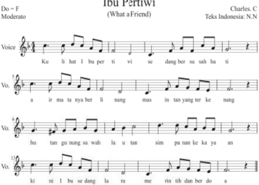

> **Deskripsi Visual:** Gambar ini adalah diagram musik yang menunjukkan notasi vokal untuk lagu "Ibu Pertini" dengan judul "What a Friend". Diagram ini terdiri dari tiga baris vokal (Vo.) yang masing-masing berisi notasi vokal untuk suara vokal (Voc.) dan bass (Bass). Notasi ini menggunakan notasi notasi vokal tradisional dengan menggunakan simbol-simbol seperti baris, koma, dan garis untuk menunjukkan tempo dan ritme. Di atas diagram ini terdapat judul lagu "Ibu Pertini" dengan nama penulis Charles C. dan teks Indonesia yang diterjemahkan oleh N.N. Informasi ini memberikan gambaran tentang struktur musik dan teks lagu tersebut.

 

---
## 📄 Halaman 90

Setiap daerah sudah pasti memiliki seni musik kreasi yang tumbuh dan berkembang dalam kehidupan masyarakatnya. Seni musik tradisional tercipta sebagai  hasil  kreasi  masyarakat.  Sebagian  jenis  dan  teknik  seni  tradisional daerah itu merupakan 'musik urban yang mana musik rural berfungsi sebagai sumber dalam berkreasi. Di dalam berkreasi musik, puisi dan versi melodi, ritmis, dan sifat estetis dapat mewarnai nilai-nilai seni musik tradisional yang berdasarkan pada faktor adlibitum, lokasi, dan kronologi'.

Seni musik tradisional tercipta sebagai hasil kreasi masyarakat. Sebagian jenis seni tradisional daerah itu merupakan 'musik urban yang mana musik rural berfungsi sebagai sumber dalam berkreasi. Di dalam berkreasi, puisi dan versi melodi, ritmis, dan sifat estetis dapat mewarnai nilai-nilai seni musik tradisional yang berdasarkan pada faktor adlibitum, lokasi, dan kronologi'.

Musik tradisional adalah musik yang dipengaruhi oleh adat, tradisi dan budaya masyarakat tertentu. Pada umumnya  musik  tradisi  baik  vokal maupun instrumen menjadi milik bersama, karena musik tradisi banyak yang tidak diketahui penciptanya, tahun tercipta. Musik tradisional dengan kesederhanaannya merupakan warisan seni budaya leluhur yang memiliki nilai luhur, diakui keberadaannya  karena  mampu  mengadaptasi lingkungan tempat karya musik itu hidup dan berkembang.

Musik  klasik lahir  dari  masa  sekitar akhir abad ke-18, semasa hidup komponis Haydn dan Mozart .  Musik klasik  yang  pembuatan  dan  penyajiannya  memakai  bentuk,  sifat,  dan  gaya dari musik yang berasal dari masa lalu. Musik klasik  adalah musik kuno. (Suharto,  1992:63)  musik  klasik  hidup dan  berkembang  di  lingkungan  kaum bangsawan,  di  lingkungan  istana  atau keraton.  Karya  musik  klasik  memiliki sifat  yang  mempertahankan  nilai-nilai dan norma yang sangat kuat.

Dalam  sebuah  tulisan  dide fi nisikan  'menggarap  musik  kontemporer adalah cara pandang  atau sikap seorang seniman dalam menggarap musik yang menghasilkan teknik, tektsur, struktur, bentuk komposisi, harmoni, gaya yang  bersifat  kekinian  sesuai  dengan  zamannya  dan  secara  tidak  langsung didasari  dan  terkait  dengan  musik  yang  sudah  ada  sebelumnya'.  (Kholid, 2015:64)

Mack (2001:34) memandang bahwa pada dasarnya keberadaan 'musik  kontemporer  merupakan  satu  perkembangan  dari  musik  tradisi yang ada'. Tradisi yang dimaksud disini adalah sesuatu yang berkembang dalam  perjalanan  waktu,  sehingga  dalam  perjalanan  tersebut  tradisi  bisa saja mengalami suatu perubahan-perubahan atau perkembangan yang akhirnya memungkinkan sekali jika dilihat dari struktur, bentuk, serta gaya komposisinya sangat berbeda dengan asal mula suatu seni tradisi tersebut.

 

---
## 📄 Halaman 91

Menyimak pandangan itulah, dapat disimpulkan bahwa musik kontemporer itu  merupakan  suatu  komposisi  musik  baru  dan  berlandaskan pada konsep musik yang sifat kekinian. Proses penciptaan musik kontemporer dapat dilakukan dengan berbagai cara atau teknik, sehingga menuntut seorang komposer memiliki kreativitas yang tinggi dan upaya secara berkesinambungan dalam merealisasikan ide-ide kreatifnya.

Musik Modern dikenal dengan sebutan musik  kreasi baru.  Musik ini  bersumber  dari  musik  tradisional dan musik klasik, yang dikemas dari hasil sebuah proses kreasi dari bentuk aslinya, biasanya kreasi musik  ini mencerminkan  sikap  dinamis  yang menjadi tuntunan masyarakat. Musik modern secara prinsip  mampu memberi nuansa baru meskipun materinya lama.

Musik kontemporer adalah musik baru di Indonesia yang tidak berkaitan dengan tradisi sama  sekali. Kriteria dari kontemporer adalah ketidakbiasaan  atau  suatu  bayangan  'kebebasan  sepenuhnya'.  Kontemporer  dianggap  sebagai  salah  satu  gaya  tertentu, yang diartikan sebagai suatu sikap menggarap di ujung perkembangan seni yang digeluti. (Dieter Mack, 2001:35)

 

---
## 📄 Halaman 92

---
**🖼️ Gambar/Diagram**

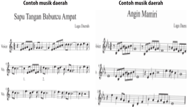

> **Deskripsi Visual:** Gambar ini adalah sebuah diagram yang menunjukkan contoh musik daerah dengan dua jenis musik: "Sapu Tangan Babunczu Ampat" dan "Angin Mamiri". Diagram ini terdiri dari tiga bagian utama:

1. **Pertama**: Menunjukkan lagu daerah "Sapu Tangan Babunczu Ampat" dengan notasi musik yang mencakup notasi vokal, bass, dan gitar. Notasi ini menunjukkan struktur ritme dan nada yang digunakan dalam lagu tersebut.

2. **Kedua**: Menyajikan lagu daerah "Angin Mamiri" dengan notasi musik yang mirip dengan "Sapu Tangan Babunczu Ampat", menunjukkan struktur ritme dan nada yang digunakan dalam lagu tersebut.

3. **Ketiga**: Menyediakan informasi tentang jenis musik daerah yang dimainkan, yaitu Lagu Daerah.

Elemen-elemen utama yang terlihat dalam gambar ini meliputi:
- Notasi musik untuk kedua lagu daerah.
- Informasi tentang jenis musik daerah yang dimainkan.
- Struktur ritme dan nada dalam notasi musik.

Informasi kunci yang dapat diambil pembaca meliputi:
- Jenis musik daerah yang dimainkan dalam gambar ini.
- Struktur ritme dan nada dalam notasi musik untuk kedua lagu daerah.
- Informasi tentang lagu daerah yang dimainkan.

Dengan demikian, gambar ini memberikan gambaran umum tentang struktur dan elemen-elemen musik daerah yang digambarkan dalam buku pelajaran tersebut.

 

---
## 📄 Halaman 93

musik  yang  terdapat  pada  setiap  etnik  dengan  cara  mengembangkan  dan mengkolaborasikan keunikan-keunikan, teknik memainkan instrumen selain teknik  dalam  memanfaatkan  unsur-unsur  keunikan  musikal  dan  budaya musiknya. (Kholid (2015:67)

Ada tiga kategori yang tersirat dalam teknik berkreasi musik kontemporer, yaitu: menggarap musik dalam suatu gaya tradisional, mengaransir baru suatu karya  musik  tradisional,  menggarap  kreasi  musik  baru  bersifat  kekinian. Kriteria  musik  kontemporer  adalah  ketidakbiasaan  atau  kata  Mack  adalah suatu  bayangan  kebebasan  sepenuhnya,  untuk  mengisi  format  penilaian portofolio yang ditulis pada lembar kerja siswa, sebagai salah satu sasaran dalam pembelajaran seni budaya khususnya tentang musik kreasi. Pengisian format tentang jenis musik kreasi dilakukan setelah siswa melakukan diskusi, observasi, serta  wawancara pada tokoh pemangku seni, pelaku seni, pencipta dan penikmat seni musik kreasi dan pada pihak-pihak terkait yang dianggap mengetahui gambaran musik kreasi.

Secara konseptual, kreasi adalah ciptaan atau penciptaan dan hasil daya cipta.  Kreasi  musik  merupakan  penciptaan  karya  musik.  Persoalan  yang muncul  di  dalam  gaya-gaya  kreasi  musik  dan  musik  kreasi  baru  biasanya disebut dengan musik kontemporer. Genre musik kreasi baru ini membawa sesuatu  yang  baru,  tetapi  berdasarkan  standar-standar  bentuk  musik  yang tradisional.

Terlepas dari permasalahan standar serta perkembangan genre musik kreasi baru, karya-karya yang disebut musik kontemporer banyak diciptakan lepas dari referensi musik tradisi, yang menurut Mack 'karya yang bersifat seperti itu  sama  sekali  tidak  bersifat  eksperimen,  melainkan  merupakan  ekspresi kekreatifan  para  penciptanya  yang  sangat  berarti.  Berdasarkan  pandangan Mack  (2001:140)  lebih  menegaskan,  secara  umum  'konsep  kontemporer adalah suatu gaya tertentu dengan makna utamanya yaitu tidak ada hubungan dengan tradisi'.

Kamu  diharapkan  dapat  mendiskusikan  tentang  konsep  teknik  dan prosedur berkreasi musik!

 

---
## 📄 Halaman 95

---
**🖼️ Gambar/Diagram**

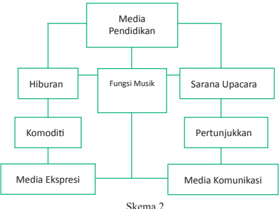

> **Deskripsi Visual:** Gambar ini adalah diagram yang menunjukkan struktur hierarkis dari media pendidikan. Diagram ini terdiri dari empat level utama, masing-masing dengan sub-level yang lebih lanjut. Pada level pertama ada dua cabang utama: Hiburan dan Fungsi Musik. Cabang Hiburan meliputi Komoditi dan Media Ekspresi. Cabang Fungsi Musik meliputi Sarana Upacara dan Pertunjukkan. Cabang Sarana Upacara memiliki satu sub-level, sedangkan cabang Pertunjukkan memiliki dua sub-level. Setiap sub-level memiliki teks yang menjelaskan fungsinya. Diagram ini membantu pembaca memahami hubungan antara berbagai jenis media pendidikan dan bagaimana mereka saling berkaitan.

Apabila kita adaptasikan pernyataan di atas, tergambar jelas bahwa secara umum karya seni musik yang tumbuh dan berkembang di daerah Indonesia memiliki keragaman fungsi antara lain untuk berikut.

### 1.  Sarana upacara

Musik dapat dijadikan media untuk mendukung kegiatan upacara, seperti berikut.

- Upacara  panen  padi  (upacara  seren  taun)  di  Jawa  Barat,  menggunakan musik angklung.
- Upacara merapu di Sumba, menggunakan bunyi-bunyian untuk memanggil dan menggiring kepergian roh ke pantai merapu (alam kubur).
- Upacara  dalam talqin mayit di  daerah  balubur  limbangan  Garut,  Jawa Barat, menggunakan nyanyian/tembang dalam lagu-lagu cigawiran.
- Upacara sekatenan di Cirebon, Jawa Barat, menggunakan musik gamelan sebagai  pendukung,  pengiring  kegiatan  mencuci  barang-barang  pusaka yang dianggap memiliki keramat oleh masyarakat pendukungnya.
- Upacara mapag Dewi Sri, di Sumedang, Jawa Barat, menggunakan musik tarawangsa.

 

---
## 📄 Halaman 96

### 2. Sarana pertunjukan

Pada  umumnya  berbagai  macam  kegiatan  pertunjukan  seni  yang  kita kenal, tersaji dengan  iringan musik, seperti:

- Musik sebagai seni pertunjukan mandiri;
- Musik  berfungsi  sebagai  pengiring  gerak-gerak  tari  dan  drama  yang dipertunjukan;
- Musik sebagai ilustrasi tarian;
- Musik sebagai ilustrasi cerita, lakon;
- Musik sebagai stimulus untuk menari;
- Musik sebagai pengiring pertunjukan wayang;
- Musik  sebagai  latar  dalam  pertunjukan  teater,  sinetron, fi lm,  ludruk, sandiwara, lenong, gending karesmen, arja, ketoprak, dan lain-lain.

### 3. Media komunikasi

Musik sejak dahulu telah difungsikan manusia sebagai media komunikasi, misalnya:

- Di  suatu  daerah  jika  orang  mendengar  bunyi  kentongan  dititirkan  itu merupakan pertanda adanya suatu kejadian untuk memberitahukan pada penduduk.
- Bunyi  bedug,  bagi  orang  muslim  sudah  merupakan  ciri  khas  sebagai pertanda tibanya waktu shalat.

### 4. Media pendidikan dan penerangan

- Lagu-lagu dalam iklan layanan masyarakat.
- Musik dan lagu yang bernafaskan agama, sebagai penerang kehidupan.
- Musik  sebagai  wahana  pemahaman  penerapan  dan  pensosialisasian nilai-nilai religius, nilai estetis, dan nilai sosial kemasyarakat.

### 5. Media hiburan

- Pelepas lelah.
- Sajian permainan, seperti dalam mendukung kegiatan anak-anak.
- Mencari kesenangan lahir batin.

 

---
## 📄 Halaman 98

Selain dari pemberian irama (ritme/ritmis), alat musik tersebut kadangkadang dapat memberikan warna terhadap suasana pertunjukan. Melalui bunyi ritmis yang ditimbulkan dalam sajian komposisi musik, biasanya suasana  atau  karakteristik  pertunjukan  akan  lebih  terasa  lain,  dengan permainan  irama  yang  cepat,  sedang,  dan  lambat  akan  memberikan dinamika yang berubah.

Keseluruhan alat musik yang tumbuh dan berkembang berfungsi sebagai media bunyi yang dapat didengar. Secara fi sik indra pendengaran merupakan perkembangan yang pertama dari kelima indra dan dapat distimuli melalui musik,  yang  sekaligus  akan  meningkatkan  perkembangan  fungsi  otak. Menurut Hodges (2000)  dalam Djohan (2005:  26)  mengatakan  bahwa  kita akan semakin tahu berkat adanya lingkungan (musikal) yang secara fi sik hal itu akan berfungsi untuk menghasilkan perubahan pada otak dalam mengikat dan membentuk pribadi.

Keanekaragaman jenis karya musik dan bentuk alat musik yang tumbuh dalam  kehidupan  kita,  memiliki  kedudukan  dan  fungsi  yang  berbeda,  ada yang digunakan sebagai media ekspresi  untuk mewujudkan karya musik yang disebut komposisi. Media untuk kegiatan pendidikan baik di sekolah maupun pendidikan  luar  sekolah,  dijadikan  sebagai  media  komunikasi  antarsuku bangsa dan antarnegara.

The Lian Gie seorang fi lsuf (1996: 56) dan Budiwati (2001:11) mengatakan bahwa:

- Pada  umumnya,  seni  dapat  berfungsi  sebagai  media  kerohanian,  yaitu sebagai  fungsi  spriritual  dan  fungsi  upacara  khusus  dalam  kegiatan seremonial dan pertunjukan,
- Media kesenangan yaitu, sebagai fungsi hedonistis untuk hiburan,
- Media tata hubungan yaitu, sebagai fungsi komunikatif, dan
- Media  pendidikan  yaitu,  sebagai  fungsi  edukatif  dalam  memberikan penerangan pengetahuan, pelatihan,  dan  memberikan  pengajaran  dalam menyampaikan nilai-nilai seni dan  fatwa-fatwa.
- Media ekspresi dalam memenuhi kebutuhan estetis.
- Keseluruhan  dari  fungsi  karya  seni  musik  itu  akan  melibatkan  pribadi individual dan pribadi  masyarakat.

 

---
## 📄 Halaman 99

Sebuah  contoh  karya  musik  daerah  yang  dapat  disebut  dengan  seni karawitan  adalah Tembang  Sunda  Cianjuran  yang  terkenal  dengan  sebutan ' mamaos ',  dikenal  juga  sebagai  ' kamermuziek '.  Pada  awalnya mamaos berkedudukan sebagai musik seni sifatnya sangat menyendiri, artinya musik ini  tidak  diciptakan  untuk  memenuhi  kebutuhan  lain  yang  terletak  di  luar kebutuhan pribadinya dan hanya dinikmati dengan perasaannya sendiri pada saat menghayati musik belaka.

Marilah  kita  lantunkan  bersama-sama  musik  vokal  daerah  Sunda  yang dapat  kita  apresiasi  dari  sebagai  contoh  penyajian  karya  musik  seni  yang berkembang di Indonesia.

---
**🖼️ Gambar/Diagram**

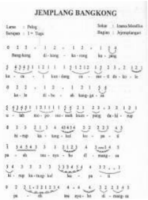

> **Deskripsi Visual:** Gambar ini adalah diagram yang menunjukkan struktur dan hubungan antara berbagai elemen dalam sebuah sistem atau konsep. Diagram ini terdiri dari beberapa baris dan kolom, masing-masing menunjukkan informasi tentang jenis-jenis, jumlah, dan relasi antara elemen-elemen tersebut. Elemen utama yang ditampilkan meliputi "Jemplang", "Bangkong", "Pilih", "Sekolah", dan "Jenjang". Setiap elemen memiliki angka dan teks yang menjelaskan jumlah dan jenisnya. Misalnya, "Jemplang" memiliki tiga jenis dengan jumlah tertentu, sedangkan "Bangkong" memiliki dua jenis dengan jumlah lainnya. Relasi antara elemen-elemen ini ditunjukkan melalui garis dan simbol, yang menggambarkan hubungan antara jenis dan jumlah. Teks penting seperti "Jenjang" dan "Jumlah" memberikan penjelasan tambahan tentang struktur dan fungsi setiap elemen. Diagram ini membantu pembaca memahami hubungan dan struktur kompleks antara berbagai elemen dalam sistem tersebut.

Penjelasan  gambar  di  atas  adalah  salah  satu  contoh  musik  seni  yang sedang  menyajikan  musik  kecapi  suling  yang  lahir  di  daerah  Jawa  Barat. Lagu tersebut  diciptakan oleh seorang komponis kreatif menciptakan lagulagu  yang  berkembang  dari  daerah  Sunda.  Pada  awalnya  lagu  tembang tersebut berfungsi untuk media sawer dalam kegiatan upacara adat pernikahan masyarakat Sunda. Sejalan dengan pertumbuhannya akhirnya seni Cianjuran berkembang menjadi musik fungsional , artinya musik yang berkaitan dengan

---
**🖼️ Gambar/Diagram**

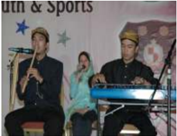

> **Deskripsi Visual:** Gambar ini adalah foto yang menampilkan tiga orang yang sedang bermain musik. Dua orang di belakang sedang memainkan alat musik tradisional, sementara yang satu di depan sedang memainkan keyboard. Semua orang tampak senang dan terlibat dalam kegiatan mereka. Gambar ini menunjukkan aktivitas seni dan hiburan yang seru, mungkin sebagai bagian dari acara atau pertunjukan. Elemen-elemen utama dalam gambar ini adalah tiga orang, alat musik mereka, dan suasana yang hangat dan positif yang ditunjukkan oleh ekspresi wajah mereka. Teks atau label penting tidak ada dalam gambar ini, namun informasi kunci yang dapat diambil adalah bahwa ini adalah foto dari sebuah acara seni atau pertunjukan musik.

 

---
## 📄 Halaman 100

masalah-masalah yang berada di luarnya, sebab musik fungsional tidak hanya berkaitan dengan sifatnya saja melainkan masalah corak dan karakteristik dari musik atau lagu itu sendiri sangat menentukan.

Berikut adalah salah satu contoh musik fungsional yang lahir di wilayah Nusantara  adalah  Tembang  Sunda  Cianjuran,  Tembang  Sunda  Cigawiran. Tembang Sunda merupakan salah satu jenis seni musik vokal yang diciptakan oleh seorang komponis kreatif, Tembang Sunda tercipta sebagai musik vokal yang tumbuh berkembang dari daerah Sunda. Pada awalnya musik fungsional tersebut digunakan untuk media upacara, dan disajikan hanya di lingkungan sendiri. Tembang Sunda Cianjuran tumbuh di lingkungan kaum bangsawan dan Tembang Sunda Cigawiran tumbuh di lingkungan masyarakat pesantren, yang  kemudian  kedua  jenis  Tembang  Sunda  tersebut  berkembang  menjadi musik pertunjukkan selain sebagai musik vokal yang disajikan untuk hiburan.

 

---
## 📄 Halaman 101

Sumber: Dokumen Desur Budiwati

Gambar 3.15 Contoh musik fungsional dari daerah Sunda-musik gamelan sebagai iringan tari

Musik seni ini dapat dikatakan 'tidak mudah menurut ukuran teknis, tidak murah menurut ukuran apresiasi, dan tidak rendah menurut ukuran estetika. Artinya, jika kita  berpola  pada  ukuran-ukuran  tersebut  maka  untuk  menciptakan karya musik seni diperlukan musisi yang terampil, peka, dan berbakat tinggi. Untuk karya musik itu, menikmati karya musik diperlukan daya apresiasi yang mapan, setidak-tidaknya sejajar dan memiliki wawasan yang cukup luas dan lebih mendalam baik dengan pencipta atau pun penyajinya, maka tak heran seandainya dalam penyebarannya musik seni dirasakan sangat lamban jika dibandingkan dengan penyebaran musik pop, musik dangdut, atau pun musik lainnya.

Untuk melihat musik fungsional dalam kehidupan sehari-hari, kita dapat menjumpai istilah-istilah seperti adanya karya seni vokal dalam bentuk lagu perjuangan, lagu upacara, lagu kependidikan, lagu keagamaan, dan lagu-lagu lain yang bertema dan tercipta sesuai konteks kebutuhannya. Istilah lagu sudah jelas menunjukan sebuah karya musik, tetapi kata yang berada di belakangnya masing-masing  seperti  perjuangan,  pendidikan,  keagamaan,  menunjukkan bidang-bidang atau konteks lain yang berada di luar musik itu sendiri, dan sekaligus menunjukkan fungsi musik di bidang masing-masing.

 

---
## 📄 Halaman 102

-  Lagu perjuangan berarti  karya  seni  musik  dalam  bentuk  lagu  yang  berfungsi untuk mengobarkan semangat berjuang atau lagu yang menggambarkan kepahlawanan, artinya pada lagu ini bukanlah musik yang menjadi tujuan utama,  melainkan  berkobarnya  semangat  perjuangan  itu  sendiri,  dan musik berfungsi sebagai pendukung utama.
-  Lagu keagamaan berarti bahwa lagu itu merupakan media bagi kepentingan hidup beragama, lagu atau musik tersebut diciptakan dapat untuk Da'wah atau untuk memenuhi kebutuhan sebagai alat pemujaan, bahkan lagu itu pun dapat berupa pupujian atau nadoman bagi umat Islam.
-  Lagu pendidikan berarti lagu yang diciptakan sebagai sarana atau media pendidikan  baik  untuk  kebutuhan  pendidikan  dalam  pembelajaran  di sekolah maupun di luar sekolah.
-  Lagu hiburan berarti lagu yang diciptakan untuk memenuhi kebutuhan dalam mencari kesenangan, yaitu menghibur atau sebagai pelepas lelah setelah melakukan aktivitas.
-  Lagu atau musik upacara berarti buah karya seni musik yang dipergunakan untuk  memenuhi kebutuhan ritual  atau  musik  yang  diciptakan  sebagai media upacara. Tujuan pokok lagu atau musik upacara yang terpenting adalah kekidmatan dan kekhususan dalam melakukan kegiatan upacara.
Cari dan lengkapilah contoh karya seni musik dalam bentuk lagu-lagu yang sudah tercipta sesuai dengan klasi fi kasi fungsionalnya:

- Lagu perjuangan  : Halo-halo Bandung, Maju Tak Gentar
, dan …

- Lagu pendidikan  : …………………..................................
- Lagu keagamaan  : …………………..................................
- Lagu hiburan
: …………………..................................

- Lagu upacara
: …………………..................................

Melihat macam dan corak kegiatan dalam kehidupan manusia, ternyata musik telah memegang peranan dan dibutuhkan sebagai pendukungnya,  serta difungsikan  sebagai  media  atau  sarana  dalam  penyampaian  cita  rasanya. Secara  umum, musik dapat berfungsi untuk upacara, pertunjukan, hiburan, dan pendidikan.

Melalui  pembelajaran  ini,  disarankan  ada  tanya  jawab  dari  hasil  pengamatan setelah  menyaksikan  pertunjukan  musik  seni  dan  musik  fungsional. Apa  yang menarik perhatian siswa dari pertunjukan tersebut? Perhatikan beberapa gambar dan lakukan identi fi kasi hal-hal apa yang dapat ditemui, serta siswa ditugaskan untuk mengemukakan pendapatnya tentang gambar tersebut!

 

---
## 📄 Halaman 103

Sumber: Dokumentasi Penulis

---
**🖼️ Gambar/Diagram**

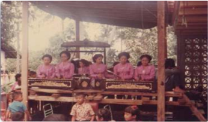

> **Deskripsi Visual:** Gambar ini adalah foto yang menunjukkan kelompok orang yang sedang berada di atas sebuah truk. Kelompok tersebut terdiri dari beberapa orang dewasa dan anak-anak. Mereka tampak senang dan sedang bermain di atas truk. Di sekitar mereka, terlihat beberapa pohon dan bangunan kecil, menunjukkan bahwa tempat ini mungkin berada di pinggir jalan atau di dekat area perkotaan. Teks, angka, atau label penting tidak terlihat pada gambar ini. Informasi kunci yang dapat diambil pembaca adalah bahwa gambar ini menunjukkan aktivitas keluarga atau anak-anak yang sedang bermain di luar rumah.

Sumber: Dokumen Penulis

 

---
## 📄 Halaman 105

Setelah siswa belajar tentang konsep dan makna seni musik kreasi, teknik dan  jenis  musik  kreasi  dan  prosedur  dan  fungsi  musik,  selanjutnya  siswa diarahkan,  selanjutnya  siswa  diarahkan  pada  uji  kompetensi  dan  penilaian antarteman tentang wawasan pengetatuan ilmu seni, sikap dan keterampilan/ skill d alam berolah musik dan berapresiasi musik kreasi, dengan cara mengisi kolom-kolom yang sudah disediakan pada lembar kegiatan siswa.

Untuk  mengetahui  tingkat  kemampuan  siswa  didik  terhadap  materi pembelajaran  seni  budaya,  dipergunakan  dengan  dua  jenis  penilaian,  yaitu penilaian  proses  dan  penilaian  hasil.  Penilaian  proses  untuk  materi  ini mencakup tiga aspek utama yang mendasar, yaitu pengetahuan, sikap, dan keterampilan.  Untuk  lebih  jelasnya,  berikut  diilustrasikan  dalam  contoh lembar penilaian berikut:

 

---
## 📄 Halaman 106

---
**📊 Tabel**

Tabel ini menunjukkan hasil penilaian siswa dalam beberapa aspek penilaian, yaitu Pengetahuan, Sikap, dan Keterampilan. Setiap siswa memiliki satu baris di tabel ini, dengan kolom-kolom yang mencakup nilai yang diberikan untuk setiap aspek penilaian pada skala 1 hingga 4. Topik utama tabel ini adalah penilaian akademik siswa dalam tiga aspek tersebut. Data penting yang terlihat adalah bahwa setiap siswa memiliki nilai yang berbeda-beda untuk setiap aspek penilaian, menunjukkan variasi dalam kinerja mereka. Selain itu, tabel ini juga menunjukkan bahwa setiap siswa memiliki satu baris di tabel, yang menunjukkan bahwa setiap siswa hanya dapat diperiksa satu kali dalam penilaian ini.

Penilaian  pada  masing-masing  aspek  menggunakan  Skala  Likert,  yaitu dengan memberikan skor antara 1-4. Masing-masing skor mendeskripsikan tingkat kemampuan siswa didik, yaitu indikator dari setiap aspek penilaian pembelajaran seni budaya tentang kreativitas seni musik khususnya fi loso fi s musik, konsep musik kreasi, partitur musik kreasi, dan karya musik berupa komposisi, diharapkan siswa didik memiliki kemampuan:

### 1.  Pengetahuan

- Menyimak konseptual gagasan kreatif, dan karya tulis musik.
- Menguraikan dan menginterpretasikan karya musik dan organisasinya.
- Memahami fi loso fi , konsep, partitur dan komposisi seni musik dan budaya.

### 2.  Sikap

- Antusias menanggapi gejala estetis dan penjelajahan imajinatif, menyingkap dan menafsirkan struktur keseluruhan fenomena estetis.
- Mempersepsi konsep estetis musik dan kerja sama menyaring berdasarkan pengalaman berolah musik.
- Merespon  intuitif  dalam  mengemukakan  gagasan  secara  tertulis  dan menghargai pendapat orang lain.

 

---
## 📄 Halaman 107

### 3. Keterampilan

- Terampil memetakan gagasan, mengolah, mengeksplorasi dan menyusun unsur-unsur musik.
- Terampil mengelaborasi aspek musik dan berkreasi dengan unsur musik.
- Terampil mengharmonisasikan, dan mempresentasikan produksi musik.

### Keterangan:

### Contoh :

Jika skor diperoleh 30, skor tertinggi 4 x 3 aspek x 3 indikator dari masing masing aspek yakni menghasilkan pernyataan = 36, maka skor akhir : 3,3 dengan kualitas nilai Baik  yang memperoleh nilai B. Contoh lain misalnya skor yang diperoleh  siswa 20 x 36 : 4 = 2.2  jadi kualitas nilai Cukup atau mendapatkan nilai C.

Jika Peserta didik memperoleh nilai:

### Contoh :

Skor diperoleh 9, skor tertinggi 4 x 3 pernyataan = 12, maka skor akhir = 3 Siswa memperoleh nilai :

Sangat Baik

: apabila memperoleh skor  A - dan A

Baik

: apabila memperoleh skor  B - , B, dan B +

Cukup

: apabila memperoleh skor  C - , C, dan C +

Kurang

: apabila memperoleh skor  D dan D +

---
**📊 Tabel**

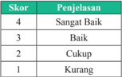

Tabel ini menunjukkan skor dan penjelasan untuk setiap tingkat kualitas. Topik utamanya adalah evaluasi kualitas atau kinerja sesuatu, seperti tugas, proyek, atau penilaian lainnya. Kolom pertama berisi skor yang berangsur-angsur meningkat dari 1 hingga 4, sedangkan kolom kedua berisi penjelasan untuk masing-masing skor tersebut. Data penting yang terlihat adalah bahwa skor 4 diberi penjelasan "Sangat Baik", yang menunjukkan tingkat kualitas tertinggi. Skor 3 diberi penjelasan "Baik", menunjukkan tingkat kualitas yang baik namun tidak sempurna. Skor 2 diberi penjelasan "Cukup", menunjukkan tingkat kualitas yang masih memadai tetapi belum mencapai standar. Skor 1 diberi penjelasan "Kurang", menunjukkan tingkat kualitas yang rendah atau kurang memadai. Pola penting yang terlihat adalah bahwa skor semakin tinggi, penjelasannya semakin positif dan lebih baik, sementara skor semakin rendah, penjelasannya semakin negatif dan lebih buruk.

Indikator penilaian  kreativitas seni musik antara lain: 1) Persepsi estetis: imajinatif, penafsiran, 2) Respon estetis: intuitif, ide/gagasan, 3) Produk karya estetis: kesatuan/ keutuhan, kerumitan, keseimbangan, intensitas/kekuatan, originalitas, harmonisasi, ekspresif.

### Pedoman Penskoran:

Skor akhir menggunakan skala 1 sampai 4

Perhitungan skor akhir menggunakan rumus :

``

 

---
## 📄 Halaman 108

---
**📊 Tabel**

Tabel ini menunjukkan predikat nilai akhir untuk berbagai interval nilai yang diberikan. Topik utama tabel adalah predikat nilai akhir berdasarkan interval nilai yang diberikan. Kolom pertama menunjukkan nomor interval nilai, kolom kedua menunjukkan interval nilai, kolom ketiga menunjukkan predikat nilai, dan kolom keempat menunjukkan keterangan tentang predikat tersebut. Data penting yang terlihat adalah bahwa interval nilai 3,83 s.d. 4,00 memberikan predikat A dengan keterangan "Sangat Baik", sedangkan interval nilai 1,17 s.d. 1,50 memberikan predikat D dengan keterangan "Kurang". Pola umumnya adalah bahwa interval-nilai yang lebih tinggi memiliki predikat yang lebih baik, seperti interval 3,83 s.d. 4,00 memiliki predikat A, sedangkan interval 1,17 s.d. 1,50 memiliki predikat D.

 

---
## 📄 Halaman 110

 

---
## 📄 Halaman 111

---
**🖼️ Gambar/Diagram**

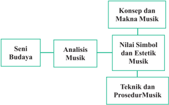

> **Deskripsi Visual:** Gambar ini adalah diagram yang menunjukkan struktur teori tentang seni budaya, dengan fokus pada analisis musik. Diagram ini terdiri dari empat elemen utama yang saling terkait:

1. **Seni Budaya** - Ini adalah aspek dasar yang mempengaruhi analisis musik.
2. **Analisis Musik** - Ini adalah proses utama yang menghubungkan konsep dan makna musik, nilai simbol dan estetika musik, serta teknik dan prosedur musik.
3. **Konsep dan Makna Musik** - Ini mencakup pemahaman tentang konsep-konsep dan makna-makna yang terkandung dalam musik.
4. **Nilai Simbol dan Estetik Musik** - Ini membahas nilai-nilai simbolistik dan estetik yang ada dalam musik.

Elemen-elemen ini saling terkait melalui hubungan "dari" dan "ke", menunjukkan bahwa analisis musik merupakan bagian dari seni budaya dan berfungsi untuk memahami konsep dan makna musik, nilai simbol dan estetik musik, serta teknik dan prosedur musik. Teks, angka, atau label penting yang terlihat dalam diagram ini adalah "Analisis Musik", "Konsep dan Makna Musik", "Nilai Simbol dan Estetik Musik", dan "Teknik dan Prosedur Musik".

Informasi kunci yang dapat diambil pembaca adalah bahwa analisis musik adalah proses yang penting dalam memahami seni budaya, yang melibatkan pemahaman konsep dan makna musik, nilai simbol dan estetik musik, serta teknik dan prosedur musik.

 

---
## 📄 Halaman 113

### Motivasi:

Seberapa  tinggi  keingintahuan  siswa  untuk  menganalisis  karya  musik baik dalam kreasi musik tradisional, klasik, dan modern atau kreasi baru atau pun musik kontemporer?

Siswa  ditugaskan  untuk  memaparkan  motivasi  belajar  tentang  analisis karya  kreasi  seni  musik,  baik  tradisional,  kreasi  baru  atau  modern  dan kontemporer dalam bentuk kalimat deklaratif!

………………………………………………………………………………

………………………………………………………………………………

………………………………………………………………………………

### Pengantar

Berdasarkan pandangan para pakar pendidikan, pembelajaran seni budaya bertujuan untuk penanaman nilai estetis melalui pengalaman kreatif dan apresiatif.

Sebagai pribadi atau kelompok yang kreatif dan apresiatif, kita perlu dan harus mampu memikirkan, membentuk cara-cara baru, atau mengubah caracara lama secara kreatif, agar kita dapat survive dan tidak tenggelam dalam persaingan antarbangsa dan negara dalam era globalisasi dan era teknologi. Dalam hal ini kita dihadapkan pada masa yang sedang berkembang, dan kita harus mau dan andil mengikuti perubahan-perubahan yang terjadi di sekitar kita. Untuk itulah mari kita bangkit berpikir kreatif  dan  berkreasi.  Dengan berkreasi,  orang  dapat  mewujudkan  kemampuan  dirinya,  dan  perwujudan diri  sebagaimana  dikatakan  Maslow  (1967)  dalam  Munandar  (2002:43) merupakan kebutuhan pokok pada tingkat tertinggi dalam hidup manusia.

Pada  kehidupan  sehari-hari,  sebenarnya  aktivitas  berkreasi  seni  atau berkesenian  selalu  dialami  manusia,  hanya  terkadang  kita  tidak  menyadari atau merasakannya bahwa aktivitas yang dilakukannya itu merupakan bagian dari ekspresi seni dalam melakukan proses kreasi. Kreasi seni dapat terwadahi melalui media musik, gerak tari, rupa, dan akting.

Adanya  berbagai  fenomena  musikal  yang  bersifat  universal,  terwujud melalui  beragam unsur-unsur musik yang bersatu padu menjadi karya seni utuh.  Karya  seni  musik  itu  dapat  berbentuk  musik  vokal  atau  pun  musik instrumental yang di dalamnya terdapat makna, simbol, dan nilai estetis yang satu sama lainnya tidak dapat terpisahkan.

 

---
## 📄 Halaman 118

### Proses kreatif meliputi tahapan:

- Persiapan,
- Inkubasi,
- Iluminasi, dan
- Veri fi kasi.
Munandar  (2002:9)  menyatakan  bahwa  kreativitas  sebagai  dimensi fungsi  kognitif  yang  relatif  bersatu  yang  dapat  dibedakan  dari  intelegensi tetapi  berpikir divergen atau  kreatif,  juga  kreativitas  dapat  menunjukkan hubungan  yang  bermakna  dengan  berpikir konvergen (intelegensi).  Sifat kreatif merupakan ciri dari kreativitas. Kreasi-kreasi seni adalah produk dari buah karya seni seseorang. Produktivitas kreatif dipengaruhi oleh pengubah majemuk yang meliputi faktor sikap, motivasi, dan temperamen di samping kemampuan  kognitif.  Produk  kreativitas  menekankan  bahwa  apa  yang dihasilkan  dari  proses  kreativitas  adalah  sesuatu  yang  baru,  orisinal,  dan bermakna. Selain itu, kreativitas merupakan manifestasi dari individu yang berfungsi sepenuhnya.

Tak  seorang  pun  dapat  mengingkari  bahwa  kemampuan-kemampuan dan  ciri-ciri  kepribadian  seseorang  yang  kreatif  dipengaruhi  oleh  faktor pendidikan dan lingkungan, seperti keluarga, sekolah, dan alam sekitarnya. Lingkungan  dan  pendidikan  dapat  berfungsi  sebagai  pendorong,  stimulus, dalam pengembangan kreativitas. Kreativitas merupakan karakteristik pribadi berupa  kemampuan untuk  menemukan atau melakukan sesuatu  yang  baru, dan bermakna. Pada hakikatnya kreativitas adalah sebagai kemampuan umum untuk  mencipta  sesuatu  yang  baru,  sebagai  kemampuan  untuk  memberi gagasan-gagasan  baru  yang  dapat  diterapkan  dalam  pemecahan  masalah, sebagai  kemampuan  untuk  melihat  hubungan-hubungan  baru  antara  unsurunsur yang sudah ada sebelumnya.

Kreativitas dalam pengembangannya sangat terkait dengan aspek empat P , yaitu: pribadi, pendorong, proses, dan produk. Kreativitas akan muncul dari hasil adanya interaksi pribadi yang unik dengan lingkungannya. Kreativitas adalah sebuah proses merasakan, mengamati, dan membuat dugaan tentang adanya  kekurangan  masalah,  menilai,  dan  menguji  dugaan  atau  hipotesis, kemudian  mengubah  dan  mengujinya  lagi,  dan  akhirnya  menyampaikan hasilnya. (Munandar. 2002:39)

 

---
## 📄 Halaman 119

### Membiasakan berpikir kreatif dapat menumbuhkan sikap dan menanamkan rasa percaya diri.

### Analisis Konsep dan Makna Musik Kreasi

Konsep  dan  makna  musik  merupakan  suatu  bagian  dari  dunia  bunyi. Artinya, musik adalah pengungkapan ide melalui seni yang didasarkan pada pengorganisasian  bunyi  atau  suara  menurut  waktu,  yang  unsur  dasarnya berupa irama, melodi, dan harmoni, dengan unsur lainnya berupa gagasan, sifat, timbre, yang juga didukung oleh unsur ekspresi dan disusun secara indah. Keindahan akan lebih terasa oleh adanya jalinan nilai-nilai estetis yang selaras dan  artistik.  Untuk  melihat  keindahan  dalam  seni  musik,  maka  diperlukan suatu aktivitas kreativitas, salah satunya adalah dengan melakukan analisis.

Analisis musik tidak berarti menjelaskan komposisi karya seseorang, akan tetapi analisis musik lebih cenderung ke prinsip-prinsip yang universal, atau setidaknya mencari rumusan-rumusan konsep menyeluruh untuk menjelaskan makna, gramatika, dan mekanisme karya musik serta menemukan nilai estetis musik.

Kita tahu bahwa fenomenologi adanya produk karya musik baik musik tradisi, klasik, modern maupun kontemporer di dalamnya tidak dapat terlepas dari  sebuah  kreasi  penataan  unsur-unsur  musik  beserta  elemen-elemennya. Musik tercipta dan dibangun oleh keterpaduan substansi unsur-unsur irama, melodi, harmoni, bentuk/struktur yang dibungkus oleh kualitas musik yaitu unsur ekspresi yang meliputi tempo, dinamika, timbre dan kekuatan volume atau intensitas suara.

Karl  Seashore seorang  ahli  psikologi  musik  berpendapat  bahwa  musik memiliki  makna  sebagai  pesona  jiwa  yang  merupakan  alat  yang  dapat membuat seseorang gembira, sedih, semangat, galau, sesal, penuh harapan, riang, tenang, damai, bahkan dapat membawa kita seolah-olah mengangkat pikiran serta ingatan kita melambung tinggi, sehingga emosi kita melampaui diri kita sendiri, seolah-olah gelombang-gelombang di laut lepas.

Secara konseptual musik adalah sebagai pengungkapan gagasan melalui bunyi atau suara, yang unsur dasarnya berupa irama, melodi, dan harmoni, dengan  pendukung  lainnya  berupa  bentuk  gagasan,  sifat,  dan  warna  bunyi (timbre). Namun, dalam penyajiannya sering masih berpadu dengan unsurunsur lainnya seperti bahasa, gerak atau warna. (Soeharto,1992:86)

 

---
## 📄 Halaman 120

---
**📊 Tabel**

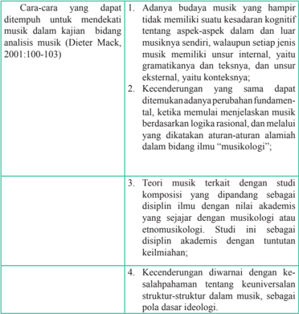

Tabel ini membahas berbagai cara untuk mendeteksi musik dalam kajian analisis musik. Topik utamanya adalah kecenderungan dalam budaya musik yang tidak memiliki suatu kesadaran kognitif tentang aspek-aspek dalam dan luar musiknya sendiri. Dalam kolom pertama, disebutkan bahwa ada beberapa kecenderungan yang sama yang dapat ditemukan, seperti perubahan fundamental, menjelaskan musik berdasarkan logika rasional, dan melalui aturan-aturan alamiah dalam bidang ilmu musikologi. Kolom kedua menunjukkan teori musik terkait dengan studi komposisi yang dipandang sebagai disiplin ilmu dengan nilai akademis yang sejajar dengan musikologi atau etnomusikologi. Kolom ketiga menggambarkan kecenderungan diwarnai dengan kesalahpahaman tentang keuniversalan struktur-struktur dalam musik, sebagai pola dasar ideologi.

Sebagai langkah selanjutnya dalam melakukan analisis karya musik kreasi, perlu adanya pengenalan secara dalam terhadap bentuk nama not dan tanda diam musik, aspek dan unsur musikal, karena dalam karya musik terdapat berbagai simbol dan tanda-tanda untuk dapat diketahui. Unsur-unsur musik yang telah diberikan pada semester sebelumnya dalam mata pembelajaran seni budaya, sebagai acuan dasar untuk dapat menganalisis dan mengembangkan karya musik lainnya.

 

---
## 📄 Halaman 122

satu  unsur  musik  saja.  Oleh  karena  semua  unsur  itu  berkaitan  erat,  maka dalam  pembahasan  sebuah  unsur  musik  mungkin  pula  akan  menyinggung unsur yang lain.

Raden  Machjar  Angga  Kusumadinata adalah  seorang  tokoh  karawitan Sunda  yang  menciptakan  notasi daminatila pada  tahun  1924  dan  notasi tersebut disebarluaskan pada kegiatan pembelajaran seni karawitan di daerah Jawa Barat berawal sekitar tahun 1925, dan sampai sekarang notasi daminatila masih dipergunakan oleh kreator-kreator Sunda dalam mengarsipkan karya musiknya khususnya untuk seni karawitan baik sekar (vokal) maupun gending (instrumen).

Banyak istilah  dan  simbol  musik  yang  digunakan  untuk  sebutan  nada. Misalnya:

- Nada tonal , yaitu nada-nada diatonis untuk musik barat;
- Nada modal adalah nada-nada pentatonis untuk musik daerah.
Simbol  musik  yang  berupa  nada-nada  ada  yang  ditulis  dengan  angka, huruf, dan juga balok not.

Diyakini  bahwa  kamu  sudah  mengenal  dan  mempelajari  beragam jenis nada baik dalam bentuk angka, huruf atau pun balok yang digunakan sebagai  simbol  musik,  yang  dilaksanakan  dalam  kegiatan  pembelajaran  di sekolah secara intrakurikuler dan ekstrakurikuler, maupun di dalam kegiatan pendidikan di luar sekolah.

Pada umumnya nada diatonis yang memiliki arti dua jarak nada yakni jarak 1  (200 Cent Hz) dan jarak ½ (100 Cent Hz) dilambangkan dengan:

- GLYPH<149> Nada Angka     1     2     3    4     5     6     7   1` GLYPH<149> Nada Huruf      c     d     e     f     g     a     b    c` Atau                 d     r     m    f     s      l      t    d dibaca              do   re   mi   fa   sol   la    ti   do` Interval nada    1     1    ½     1        1       1    ½ 200   200   100  200   200   200   100
Nada balok (not) dan garis paranada

♪

 

---
## 📄 Halaman 123

Untuk  menulis  not  atau  notasi  balok  diperlukan  garis-garis  paranada, karena notasi balok biasanya tersimpan pada paranada atau balok not yang terdiri dari lima garis sejajar. Not yang tersimpan pada garis  not balok disebut dengan not garis/not balok, sedangkan not yang tersimpan antara garis dan garis disebut dengan not ruang atau not spasi. Paranada yaitu seperangkat tanda terdiri atas lima garis mendatar. Nada-nada diletakan pada garis paranada atau di antara dua garis yaitu disebut spasi. Dalam menghitung paranada atau garis not balok selalu dimulai dari bawah.

Dalam  praktiknya,  aturan  penulisan  notasi  dalam  garis  paranada  adalah berikut.

- Not-not yang tersimpan di atas garis ke tiga arah tiang not di gambar ke atas.
- Not-not  yang  berada  di  bawah  garis  ketiga  arah  tiang  not  di  gambar  ke bawah.
- Not-not yang terletak pada garis ketiga arah tiang not, boleh ke atas atau ke bawah.
- Untuk peletakkan bendera, selalu ke arah kanan.
- Untuk notasi yang mempergunakan suara dua, gambar tiang not mengarah ke atas untuk suara pertama, sedang untuk suara kedua mengarah ke bawah.
Agar lebih jelas penulisan not dan penyimpanannya pada garis paranada, dapat  dilihat  salah  satu  model  penulisan  notasi  yang  tersimpan  pada  garis paranada di bawah ini.

Jika penulisan notasi balok untuk penambahan nilai not, maka dipergunakan titik di belakang not, sedangkan untuk notasi angka, nilai not dari pada titik akan ditentukan oleh garis nilai. Namun, seandainya tidak ada garis  nilai,  maka  nilai  titik  akan  sama  nilainya  dengan  not  yang  berada  di depannya. Apabila kita menemukan tiga buah not yang mendapat nilai satu ketuk, ini disebut triol (tri nada/tiga nada yang disatukan).

 

---
## 📄 Halaman 124

Selanjutnya terdapat beberapa simbol musik terkait dengan sistem nada pentatonik (berarti lima nada pokok) yang tumbuh dan berkembang di daerah, dilambangkan dengan:

### 1.    Karawitan Sunda

Notasi Daminatila, memiliki lima nada pokok disimbolkan dengan:

- •
- Angka     1    5      4     3      2      1     disebut nada relatif
- Huruf   T     S      G      P       L       T    disebut nada mutlak (notasi buhun)
- dibaca    da    la      ti     na    mi      da
- T   singkatan dari Tugu adalah lambang nada 1, dibaca da
- L   singkatan dari Loloran adalah lambang nada 2, dibaca mi
- P   singkatan dari Panelu adalah lambang nada 3, dibaca na
- G   singkatan dari Galimer adalah lambang nada 4, dibaca ti
- S   singkatan dari Singgul adalah lambang nada 5, dibaca la
Selain  nada  pokok,  dalam  karawitan  terdapat  pula  nada  sisipan  atau nada hiasan, nada tersebut dengan istilah lain disebut nada uparenggaswara (Sunda).  Misalnya  nada pamiring atau  nada meu (2+), bungur atau  nada ni (3-), pananggis atau  nada teu (4+),  dan sorog atau  nada leu (5+).  Nada uparenggaswara tersebut dalam istilah musik biasa dikenal dengan sebutan nada kromatik, misalnya f menjadi fi s (4). Dalam penyajian karawitan Sunda, terdapat beberapa laras yang dapat dipergunakan untuk bermain musik, baik dalam sajian lagu-lagu maupun sajian gending.

Laras  yang  merupakan  susunan  nada  pentatonis  dapat  dikelompokan menjadi dua kelompok besar, yaitu laras salendro dan laras pelog. Berdasarkan hasil penelitian yang dilakukan oleh para akademisi, laras salendro di daerah Sunda  melahirkan  tiga  laras,  yaitu  laras  salendro,  laras  degung,  dan  laras madenda. Adapun laras pelog melahirkan tiga surupan, yaitu surupan jawar, surupan sorog, dan surupan Liwung.

 

---
## 📄 Halaman 125

-  Atik  Soepandi  (1975)  menjelaskan  kata  salendro  berasal  dari  kata sala dan indira . Sala - sara - suara, dan indira adalah dewa utama di India, jadi apabila kita simpulkan salendro dapat  diartikan suara pertama dalam kata lain disebut tangga nada pertama.
-  Tangga nada untuk laras  madenda  memiliki  karakter  sedih,  susah, bingung, sakit hati.
-  Arti  kiasan  dari  istilah  salendro  itu  sendiri  ungkapan  nadanya memiliki karakteristik gagah, berani, dan gembira.
-  Laras degung ungkapan nadanya bersifat tenang dan kadang bingung.
-  Menurut Soepandi (1975:36) istilah pelog memiliki arti latah/cadel, maksudnya berbicara atau dalam mengungkapkan sesuatu yang tidak jelas dengan istilah lain disebut seliring atau sumbang.
- GLYPH<149> Adapun dalam karawitan Jawa, pelog artinya nada hiasan atau nada kromatik.
Nada  angka  pentatonik  dalam  simbol  not  daminatila  yang  diciptakan R Machjar Anggakusuma Dinata dan komparasinya dengan notasi diatonik yang diciptakan John Curwen dan dikembangan oleh Tn Cheve adalah:

---
**🖼️ Gambar/Diagram**

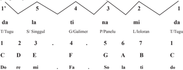

> **Deskripsi Visual:** Gambar ini adalah diagram yang menunjukkan struktur suara dalam bahasa Tagalog. Diagram ini terdiri dari tiga baris horizontal yang masing-masing menunjukkan suara dalam bentuk huruf besar dan angka. Baris pertama menunjukkan suara "da" dengan huruf besar "D" dan angka 1, baris kedua menunjukkan suara "la", "ti", dan "na" dengan huruf besar "L", "T", dan "N" serta angka 2, 3, dan 4, dan baris ketiga menunjukkan suara "mi", "da", "na", "ti", "la", "fa", "so", "do", dan "re" dengan huruf besar "M", "D", "N", "T", "L", "F", "S", "D", dan "R" serta angka 5, 6, 7, 8, 9, 10, 11, 12, dan 13.

Elemen utama yang ditampilkan adalah huruf besar dan angka yang menggambarkan suara dalam bahasa Tagalog. Huruf besar digunakan untuk menunjukkan suara yang berbeda, sedangkan angka digunakan untuk menunjukkan urutan suara dalam setiap baris. Relasi antara elemen-elemen ini adalah bahwa huruf besar dan angka saling berkaitan dengan suara dalam bahasa Tagalog, dengan huruf besar menunjukkan suara tertentu dan angka menunjukkan urutan suara tersebut.

Informasi kunci yang dapat diambil pembaca adalah bahwa diagram ini menunjukkan struktur suara dalam bahasa Tagalog, dengan huruf besar menunjukkan suara tertentu dan angka menunjukkan urutan suara tersebut. Diagram ini juga menunjukkan bahwa ada 13 suara dalam bahasa Tagalog, dengan huruf besar "D" menunjukkan suara "da" dan huruf besar "M" menunjukkan suara "mi".

### 2. Karawitan Jawa

Notasi yang digunakan untuk gending atau karya musik Jawa adalah nadanada Kepatihan, yang diciptakan oleh R.M.T. Wreksodiningrat sekitar tahun 1910 di Surakarta. Notasi ini sering digunakan untuk pembelajaran musik/seni karawitan Jawa yang memakai lambang dengan angka.

 

---
## 📄 Halaman 126

- GLYPH<149> Angka       1      2      3      4      5     6      7
Ji     ro    lu     pat   mo  nem  pi

- GLYPH<149> Perhatikan  notasi  angka  tersebut  pada  penulisan  gending    yang diadaptasi dari karya tulisan Surjodiningrat (1995) berikut:
Sebagai contoh penerapan dan penulisan notasi angka kepatihan tersebut pada  komposisi  gending  Gandrung  Manis  dan  gending  Purwagilang  yang diadaptasi dari sebuah karya tulis Surjodiningrat (1995) berikut:

Pelogpater Baraag.kendangI Sarayuda

---
**🖼️ Gambar/Diagram**

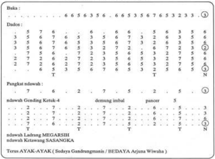

> **Deskripsi Visual:** Gambar ini adalah diagram yang menunjukkan data statistik tentang jumlah pasien dengan berbagai kondisi penyakit. Diagram ini terdiri dari tiga bagian utama:

1. Bagian atas menunjukkan jumlah pasien dengan kondisi tertentu, seperti "Buka" dengan jumlah 6, "Ketua" dengan jumlah 5, dan lain-lain.

2. Bagian tengah menampilkan detail lebih lanjut tentang kondisi pasien, seperti "Dadus" dengan jumlah 7, "Pangkat ndawah" dengan jumlah 6, dan lain-lain.

3. Bagian bawah menunjukkan jumlah pasien yang membutuhkan perawatan khusus, seperti "ndawah Gending Ketua-4" dengan jumlah 5, "demung imbal" dengan jumlah 5, dan lain-lain.

Elemen-elemen utama yang terlihat meliputi:
- Kondisi pasien (seperti "Buka", "Ketua", "Dadus", dll.)
- Jumlah pasien untuk setiap kondisi
- Jumlah pasien yang membutuhkan perawatan khusus

Teks, angka, atau label penting yang terlihat antara lain:
- Angka yang menggambarkan jumlah pasien untuk setiap kondisi
- Label kondisi pasien yang disertakan dalam diagram

Informasi kunci yang dapat diambil pembaca meliputi:
- Jumlah total pasien yang diperiksa
- Distribusi pasien terhadap berbagai kondisi penyakit
- Jumlah pasien yang memerlukan perawatan khusus

Secara keseluruhan, gambar ini memberikan gambaran umum tentang keadaan kesehatan pasien yang diperiksa, serta distribusi dan jumlah pasien yang memerlukan perawatan khusus.

 

---
## 📄 Halaman 127

### T-2GENDING PURWAGILANG

Pelog pate 6,eang7 L

---
**🖼️ Gambar/Diagram**

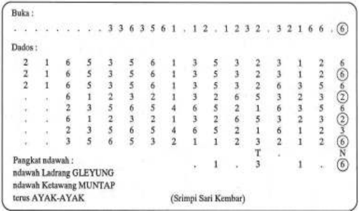

> **Deskripsi Visual:** Gambar ini adalah diagram yang menunjukkan data statistik tentang jumlah duduk pada beberapa posisi di sebuah bangku. Diagram ini terdiri dari dua bagian: bagian atas menunjukkan jumlah duduk untuk setiap posisi, sementara bagian bawah menunjukkan jumlah duduk untuk setiap posisi yang berbeda. Jumlah duduk di setiap posisi ditampilkan dengan angka di sebelah masing-masing posisi. Di bagian bawah, ada teks yang memberikan informasi tambahan tentang jumlah duduk untuk posisi tertentu, seperti "LADANG GLEYUNG" dan "KETAWANG MUNTAP". Teks ini membantu pembaca memahami konteks data yang ditampilkan dalam diagram tersebut.

### 3.   Karawitan Bali

Notasi  dingdong  menggunakan  lambang  bahasa  kawi  tepatnya  bahasa Jawa kuno, yang pada awalnya hanya berkembang di lingkungan pembelajaran karawitan tembang di Bali, sejalan dengan perkembangannya notasi Ding dong telah dipergunakan untuk menotasikan berbagai jenis gending pada gamelan Bali. Bentuk notasi tersebut dapat ditransfer pada notasi angka dengan susunan Notasi Ding dong  (nada pokok) adalah disimbolkan sebagai berikut:

- ndong simbol musik nada 1 dibaca dong
- ndeng simbol musik nada 2 dibaca deng
- ndung simbol musik nada 3 dibaca dung
- ndang simbol musik nada 4 dibaca dang
- nding simbol musik nada 5 dibaca ding

 

---
## 📄 Halaman 128

Sebuah model gending dalam motif tabuhan gamelan Bali yang dikutip dari Esther L Siagian (2006).

### Kotekan - Pemade

``

``

Berikut adalah perbandingan nada dan simbol nada pentatonik dan nada diatonik yang digunakan dalam pembelajaran seni musik.

---
**📊 Tabel**

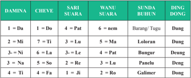

Tabel ini menunjukkan hubungan antara beberapa kata dalam bahasa Melayu, termasuk "da", "mi", "ni", "na", "ti", "fa", "pat", "lu", "le", "re", "ji", "nem", "lora", "bun", "pan", "ro", "gal", dan "dong". Topik utama tabel adalah hubungan kata-kata dalam bahasa Melayu, dengan kolom-kolom yang mencakup kata dasar, kata benda, kata sifat, kata benda yang berhubungan, kata benda yang berhubungan, dan kata benda yang berhubungan. Data penting yang terlihat adalah bahwa banyak kata dalam tabel memiliki hubungan dengan kata dasarnya, seperti "da" yang memiliki hubungan dengan "do", "mi" dengan "ti", "ni" dengan "la", "na" dengan "re", "ti" dengan "fa", "pat" dengan "nem", "lu" dengan "lora", "le" dengan "bun", "re" dengan "pan", "ji" dengan "ro", "nem" dengan "gal", dan "dong" dengan "dong".

 

---
## 📄 Halaman 129

### Notasi sebagai simbol musik digunakan untuk menuliskan bunyi dan diam, dengan bermacam-macam lama waktu atau panjang pendeknya bunyi dan diam itu.

Hampir setiap komposisi karya musik di dalamnya mengandung unsurunsur musik sebagai satu kesatuan yang utuh. Pemaknaan dari semua unsur tersebut dijelaskan sesuai urutan pengelompokan unsur-unsur musik, walaupun dapat berbeda-beda sesuai dengan pandangan orang yang menyusunnya. Pada dasarnya, unsur-unsur musik itu dikelompokkan pada dua kelompok besar, yaitu  unsur-unsur  pokok  yang  terdiri  atas  irama,  melodi,  harmoni,  bentuk/ struktur lagu, dan unsur-unsur ekspresi yang terdiri atas tempo, dinamik, dan warna nada.

Sistematika penjabaran unsur-unsur musik yang dibahas pada bagian ini terdiri  atas  lima  unsur  musik  yang  esensial,  yaitu  irama,  melodi,  harmoni, bentuk/struktur  lagu,  dan  ekspresi.  Sebagai  pokok  bahasan  yang  esensial, yang  masing-masing  unsur  musik  tersebut  mempunyai  subpokok  bahasan/ uraian atau mempunyai elemen pokok yang dapat disusun dalam sebuah karya musik  sebagai  bahan  bahasan  siswa.  Kelima  esensi  unsur  musik  tersebut digambarkan dalam skema bagan sebagai berikut:

---
**🖼️ Gambar/Diagram**

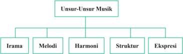

> **Deskripsi Visual:** Gambar ini adalah diagram yang menunjukkan struktur umum unsur-unsur musik. Diagram ini dibagi menjadi dua bagian utama: "Unsur-Unsur Musik" dan "Irama", "Melodi", "Harmoni", "Struktur", dan "Ekspresi". "Unsur-Unsur Musik" merupakan kelas atas yang memuat semua unsur-unsur musik lainnya. Setiap unsur memiliki label yang jelas dan terorganisir dengan baik.

Pertama, elemen utama yang ditampilkan adalah unsur-unsur musik tersebut, yaitu irama, melodi, harmoni, struktur, dan ekspresi. Setiap unsur memiliki label yang jelas dan terorganisir dengan baik. Untuk setiap unsur, ada relasi yang jelas antara mereka, seperti irama berhubungan dengan melodi, harmoni, struktur, dan ekspresi. 

Teks, angka, atau label penting yang terlihat dalam gambar ini adalah nama-nama unsur musik dan relasi antara mereka. Informasi kunci yang dapat diambil pembaca adalah bahwa unsur-unsur musik ini saling berkaitan dan saling mempengaruhi satu sama lain dalam pengembangan musik.

### a. Pola Irama

Pola irama ialah bentuk susunan tertentu panjang pendek bunyi dan diam. Setiap bentuk lagu mempunyai pola-pola irama. Irama sebuah lagu terdiri dari beberapa pola irama. Pola irama dapat sama atau berupa pengulangan atau dapat pula berbeda sedikit bahkan dapat sangat berbeda.

 

---
## 📄 Halaman 131

Supaya siswa mendapatkan kekayaan pengetahuan dan memiliki pengalaman dalam berkreasi musik, maka perlu mencari dan menambahkan serta menyanyikan lagu yang berbeda sesuai dengan tanda-tanda musik dan simbolnya.

Bentuk nama not dan siswa diam dalam sistem diatonis

---
**📊 Tabel**

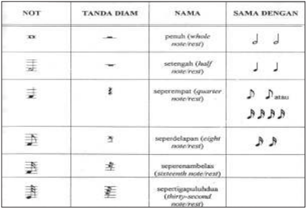

Tabel ini menunjukkan perbandingan antara notasi musik dalam bahasa Indonesia dengan notasi musik dalam bahasa Inggris. Topik utama tabel ini adalah konversi notasi musik dari bahasa Indonesia ke bahasa Inggris. Kolom-kolom yang ada dalam tabel ini meliputi "NOT", "YANDA DIAM", "NAMA", dan "SAMA DENGAN". Data atau pola penting yang terlihat dalam tabel ini adalah bahwa beberapa notasi musik dalam bahasa Indonesia memiliki arti yang sama dengan notasi musik dalam bahasa Inggris, seperti "penutup (whole note rest)" yang sama dengan "休止符" (休止符) dalam bahasa Inggris. Selain itu, tabel juga menunjukkan bahwa beberapa notasi musik dalam bahasa Indonesia memiliki arti yang berbeda dengan notasi musik dalam bahasa Inggris, seperti "septuplet" yang sama dengan "七音符" (七音符) dalam bahasa Inggris.

Selain simbol notasi balok di atas, ada pula tanda titik (.) yang disimpan di belakang sebuah not, dan tanda diam yang tersimpan pada garis paranada, sebagai contoh adalah:

 

---
## 📄 Halaman 132

Nilai not dalam nada angka pentatonik digambarkan sebagai berikut:

### Pola Ritmik

Pola  ritmik  adalah  salah  satu  elemen  dari  unsur  irama.  Mainkan  pola ritmik berikut dengan bertepuk tangan secara berulang-ulang sehingga  dapat merasakan perbedaannya dari setiap model.

``

Pola-pola  ritmik  yang  ditulis  dengan  simbol  lainnya  dapat  diimitasi melalui tepuk tangan atau mengetuk benda. Misalnya:

``

 

---
## 📄 Halaman 133

aka.vsaiya.

 

---
## 📄 Halaman 134

### Model Pola Melodi

Nyanyikan pola melodi yang diungkapkan berikut sesuai dengan tingkat kesulitan mudah, sedang, agak sulit, dan sulit.

``

``

``

``

Sebuah  model  pembelajaran  tentang  pola  melodi  yang  ditulis  dalam partitur  dengan  menggunakan  notasi  angka daminatila pada  lagu  Degung Kreasi berjudul Sorban Palid (lagu daerah Jawa Barat), pola melodi tersebut dimainkan  dalam  irama  sedang.  Lagu  tersebut  diaransemen  dan  ditransfer oleh  Dewi Suryati Budiwati.

 

---
## 📄 Halaman 135

### Sorban Palid

### Degung Kreasi Lagu Daerah Jawa Barat dan ditransfer Dewi Suryati Budiwati

Pangkat:

A. Intro

RW

JI

BN

RW

JI

BN

4

1

2

5

1

1

4

4

4

2

5

4

1

4

4

4

2

5

4

1

4

1

5

5

0

3

1

2

5

4

4

0

3

4

2

5

1

3

4

2

5

5

1

3

4

3

0

2

5

1 2

0

3

1

5

1

3

3

0

0

0

0

5

3

5

5

0

5

5

0

5

3

3

0

3

0

5

0

0

0

3

3

0

0

5

0

5

5

0

3

3

0

1

1

``

``

---
**🖼️ Gambar/Diagram**

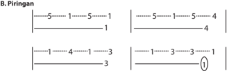

> **Deskripsi Visual:** Gambar ini adalah diagram yang menunjukkan dua set data dengan format horizontal. Setiap baris menggambarkan data dalam bentuk garis lurus yang berkelanjutan. Untuk set pertama, garis melalui titik-titik 5, 1, 5, 1, dan 1, dengan nilai 1 di tengah. Untuk set kedua, garis melalui titik-titik 5, 1, 5, 4, dan 1, dengan nilai 4 di tengah. Garis-garis ini mungkin digunakan untuk menunjukkan perbandingan atau hubungan antara dua variabel atau data dalam konteks statistik atau analisis data. Teks, angka, atau label penting yang terlihat adalah garis-garis tersebut dan angka-angka yang menunjukkan posisi titik pada garis. Informasi kunci yang dapat diambil pembaca adalah bahwa ada dua set data yang dibandingkan, dengan set pertama memiliki nilai 1 di tengah dan set kedua memiliki nilai 4 di tengah.

5

5

 

---
## 📄 Halaman 139

---
**📊 Tabel**

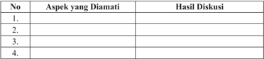

Tabel ini menunjukkan hasil diskusi tentang aspek-aspek tertentu yang diamati. Topik utamanya adalah aspek-aspek yang diamati dan hasil diskusi yang dihasilkannya. Kolom pertama berisi nomor urut untuk setiap aspek yang diamati, sedangkan kolom kedua berisi nama-nama aspek tersebut. Kolom ketiga berisi hasil diskusi yang dihasilkan dari setiap aspek. Dari tabel ini, dapat dilihat bahwa ada empat aspek yang diamati, yaitu aspek 1, aspek 2, aspek 3, dan aspek 4. Hasil diskusi untuk setiap aspek juga telah ditetapkan, namun belum disertakan dalam tabel ini. Pola penting yang terlihat adalah bahwa setiap aspek memiliki satu atau lebih hasil diskusi yang dihasilkan, menunjukkan bahwa diskusi ini dilakukan secara mendalam dan terstruktur.

 

---
## 📄 Halaman 140

Melalui tayangan gambar tersebut, siswa diberi tugas untuk melakukan pengamatan dan diskusi tentang nilai estetis yang tertuang pada kedua gambar di  atas,  dengan  harapan  mampu  menjawab  pertanyaan  berikut.  Kemudian isilah titik-titik di bawah dengan jawaban siswa.

---
**📊 Tabel**

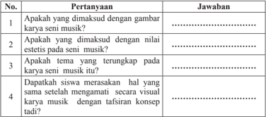

Tabel ini berisi pertanyaan tentang karya seni musik dan tafsiran konsepnya. Topik utamanya adalah tentang apakah karya musik tersebut dimaksudkan dengan gambar, nilai estetika, tema, dan tafsiran konsep. Kolom pertama berisi pertanyaan, sedangkan kolom kedua berisi jawaban. Data penting yang terlihat adalah bahwa semua pertanyaan memiliki jawaban yang sama, yaitu "Ya" atau "Tidak", menunjukkan bahwa semua karya musik tersebut memiliki karakteristik yang sama sesuai dengan tafsiran konsep yang diberikan.

### Nilai Seni Musik?

Secara konseptual, Lomax (1957) dalam Budiwati (2001) melihat musik lebih dititikberatkan kepada suatu kegiatan yang bernilai, yaitu musik sebagai refeksi  dari  nilai  dan  perilaku  dalam  budaya  sebagai  satu  kesatuan  dalam mengisi fungsi sosial. Efek utama dari musik itu sendiri adalah memberikan sesuatu pada pendengar akan perasaan aman. Misalnya, karena ia mengingatkan tempat lahir, kepuasan masa kanak-kanaknya, pengalaman tentang agamisnya, kesenangan dalam kehidupan masyarakat, kepahitan pengalaman batin, dan pembentukan kepribadian.

Sebagaimana  dikatakan Melalatoa (2000:2)  dalam Budiwati (2003) bahwa: Nilai yang terdapat dalam sistem budaya di Indonesia khususnya di bidang pendidikan meliputi: nilai pengetahuan, nilai religi, nilai sosial, nilai ekonomi dan nilai seni.

Nilai merupakan suatu konsep abstrak yang dipandang baik dan bernilai yang digunakan sebagai acuan tingkah laku dalam kehidupan.

 

---
## 📄 Halaman 141

Semua tingkah laku dalam kehidupan masyarakat, tidak dapat terlepas dari  sistem  budaya  yang  pada  hakikatnya  merupakan  kompleks  nilai-nilai dalam  menguasai  kehidupannya. Sedyawati (1993)  dalam Budiwati (2003) berpendapat  bahwa:  'Nilai  seni  memiliki  arti  sebagai  nilai  budaya  yang didapatkan khusus dalam bidang seni yang berkenaan dengan hakikat karya seni dan hakikat berkesenian'.

Hakikat dari seni  merupakan simbol dari suatu hasil aktivitas  dan  kreativitas manusia di dalam menjalani kehidupannya dan suatu karya seni yang artistik di dalamnya sudah tentu mengandung makna yang bernilai. Realisasi dari nilainilai  artistik,  dapat  terungkap  dalam  berbagai  bentuk  seni  baik  tradisional, modern  maupun  kontemporer.  Bentuk  seni  tersebut  diwujudkan  melalui musik, tari, rupa dan teater. Semua wujud seni tersebut memiliki ciri garapan berdasarkan  pola-pola  yang  sudah  baku,  yang  berfungsi  sebagai  presentasi estetis,  seperti  dalam  kegiatan  yang  bersifat  religius,  edukatif,  sosial,  ritual yang tertuang melalui berbagai upacara dan berkreasi seni.

Seni musik sering merupakan sebuah kon fi gurasi gagasan dan kekuatan yang  kadangkala  melampaui  batas-batas  realitas  hidup  yang  ada,  karena melalui pernyataan rasa estetis dan gagasan itulah seni musik dapat dijadikan sebagai  ciri  identitas  kebudayaan  masyarakat  pendukungnya.  Seni  musik merupakan pengejawantahan rasa estetis manusia sebagai tuntutan rohaniah akan keindahan. Seni musik dapat dimanfaatkan untuk pemenuhan kebutuhan estetis, selain dapat dipergunakan dalam berbagai kepentingan budaya mulai dari kegiatan ritual keagamaan sampai kepada politik dan kegiatan pendidikan.

Proses  pendidikan  seni  musik  telah  menetapkan  beberapa  nilai-nilai dasar dari kebudayaan manusia yang harus disosialisasikan, diterapkan, dan dikembangkan dalam diri anak didik. Pendidikan seni musik berperan sebagai media untuk menanamkan dan mensosialisasikan nilai-nilai budaya sebagai acuan hidup. Pendidikan seni musik, idealnya diharapkan mempunyai peran kunci  dalam  menanamkan  dan  mengembangkan aspek afektif,  psikomotor, dan kognitif.

Sosialisasi  dari  nilai  edukatif  atau  nilai  pendidikan  seni  musik  pada kehidupan masyarakat dapat tercermin dengan adanya suatu kegiatan mendidik, mengajar, dan melatih manusia untuk kreatif dan apresiatif, hidup estetis berpedoman pada norma, nilai dan tata kehidupannya. Wujud lain dari nilai edukatif dan estetis ini adalah adanya sikap percaya diri pada siswa untuk mau belajar, berkreasi, dan bermasyarakat, serta berapresiasi.

 

---
## 📄 Halaman 142

Selain nilai tersebut, nilai plus dari kedua nilai itu adalah adanya wujud kreativitas dalam mencipta, menyajikan,  mengaransemen,  mengompos, dan  mereka-reka  karya,  baik  berupa  lagu-lagu,  komposisi,  atau  pun  karya verbal  lainnya  ke  arah  yang  lebih  baik,  pantas,  dan  indah  didengar,  indah dilihat,  serta  indah  dirasakan.  Untuk  menyesuaikannya  dengan  kebutuhan dan perkembangan kehidupan masyarakat penikmat, walaupun pasti dalam penyajian seni itu yang disampaikan oleh setiap indivudu akan memberikan warna, atau pun ornamen yang berbeda.

Nilai  Estetis dalam  seni  musik  yang  merupakan  untaian  mutiara  nilai estetis yang artistik, dapat mendekatkan manusia pada nilai-nilai keindahan. Keindahan yang identik dengan estetika, dapat terlukiskan dalam bentuk karya seni  musik,  baik  musik  vokal  maupun  musik  instrumen.  Keindahan  yang mau dicapai dalam seni musik didukung oleh unsur pokok musik dan unsur penunjangnya seperti sastra lagu dan media ungkapnya. Sastra lagu menunjang daya untuk kebangunan estetika dari jalur bahasa dan komposisi melodi nadanada  dari  jalur  lagu.  Keduanya  harus  menyatupadu,  saling  bersama,  dan berperan seimbang, menuju apa yang dihasratkan seniman pencipta.

Sosialisasi  nilai  estetis  dalam  seni  musik  vokal  dapat  tersirat  lewat bentuk  sastra  lagu  atau  lirik  lagu  dan  untaian  melodi  nada-nada  yang tertata  secara  khusus  dan  memiliki  sifat  kesederhanaan,  keagungan,  dan kekompleksitasannya.

Melalui suara dan bunyi yang bernada kita dapat berkomunikasi;

Melalui suara dan bunyi kita dapat berkreasi.

Kreasi musik merupakan bagian dari dunia bunyi dan atau dunia suara

Ada  kreasi  musik  bernada  dan  ada  pula  kreasi  musik  tak  bernada. Ada kreasi musik yang bernada dan berirama, ada pula kreasi musik berirama tapi tidak bernada.  Ada kreasi musik yang bernada, berirama dan berkata, ada pula kreasi musik yang bernada/tidak bernada, berirama tetapi tidak menggunakan kata (intrumentalia).

 

---
## 📄 Halaman 143

---
**🖼️ Gambar/Diagram**

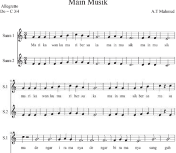

> **Deskripsi Visual:** Gambar ini adalah diagram musik yang menunjukkan struktur dan notasi musik untuk lagu "Main Musik" yang ditulis oleh A.T Mahmud. Diagram ini terdiri dari dua sektor utama: S.1 dan S.2, yang masing-masing memiliki tiga baris notasi. Setiap baris notasi menggambarkan lirik lagu dengan menggunakan notasi musik tradisional. Untuk setiap baris, ada teks dalam bahasa Indonesia yang menjelaskan lirik lagu tersebut. Angka dan huruf dalam diagram ini digunakan untuk menunjukkan tempo (Allegretto) dan key signature (C 3/4). Label "Main Musik" berada di atas diagram, menunjukkan judul lagu. Diagram ini memberikan informasi tentang struktur musik, tempo, dan key signature yang digunakan dalam lagu tersebut.

 

---
## 📄 Halaman 144

---
**🖼️ Gambar/Diagram**

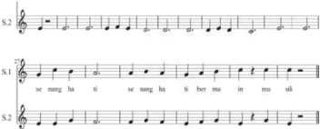

> **Deskripsi Visual:** Gambar ini menunjukkan sebuah lembaran musik dengan not tangga nada (melodi) dan not bass (bassline). Lembaran ini terdiri dari dua baris, masing-masing dengan not tangga nada dan not bass yang berbeda. Not tangga nada pada baris pertama menunjukkan旋律（melody）dengan nada-nada yang bergerak dari C# sampai G#, sementara not bass pada baris kedua menunjukkan bassline dengan nada-nada yang lebih rendah dan stabil. Teks pada lembaran ini tampaknya adalah nama lagu atau judul, "se meng ba ti se meng ba ti her ma in meu sil", yang mungkin merupakan judul lagu atau tema utama dari musik ini. Label penting lainnya termasuk nada-nada yang digunakan dalam melodi dan bassline, serta struktur not yang menunjukkan bagaimana nada-nada tersebut harus diterapkan dalam musik. Informasi kunci yang dapat diambil dari gambar ini adalah bahwa ini adalah lembaran musik yang mencakup旋律（melody）dan bassline, dengan nada-nada yang disediakan untuk dipelajari dan dimainkan.

 

---
## 📄 Halaman 145

---
**🖼️ Gambar/Diagram**

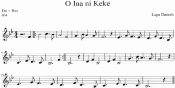

> **Deskripsi Visual:** Gambar ini adalah sebuah lembaran musik dengan judul "O Ina ni Keke" yang ditulis oleh Liga Duerab. Lembaran ini menggunakan notasi musik untuk menunjukkan lirik dan旋律 dari lagu tersebut. Notasi ini berjalan dalam tempo 4/4 dengan durasi 4 bar. Terdapat teks "Do = Bes" yang menunjukkan bahwa nada "Do" dalam notasi ini adalah bes. Selain itu, terdapat beberapa baris notasi yang menunjukkan旋律 dan lirik dari lagu tersebut. Label penting lainnya adalah nama penulis lagu, Liga Duerab, yang terletak di bagian atas lembaran. Lembaran ini memberikan informasi tentang struktur musik dan lirik lagu "O Ina ni Keke" serta nama penulisnya.

 

---
## 📄 Halaman 147

``

``

 

---
## 📄 Halaman 148

---
**📊 Tabel**

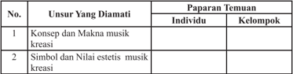

Tabel ini memperlihatkan dua unsur yang diamati dalam konteks musik kreatif: konsep dan makna musik kreatif, serta simbol dan nilai estetis musik kreatif. Untuk unsur pertama, tidak ada informasi tentang paparan temuan individu atau kelompok. Sementara itu, untuk unsur kedua, tidak ada paparan temuan individu atau kelompok juga. Topik utama tabel ini adalah analisis musik kreatif, dengan kolom "Unsur Yang Diamati" yang mencakup konsep dan makna musik kreatif, serta simbol dan nilai estetis musik kreatif. Data atau pola penting yang terlihat adalah bahwa tidak ada paparan temuan individu atau kelompok untuk kedua unsur tersebut.

 

---
## 📄 Halaman 149

Setelah  melakukan  pengamatan  terhadap  ragam  kreasi  musik    di  atas, maka  kegiatan  selanjutnya  siswa  ditugaskan  mengisi  format  berikut  ini, sebagai bentuk penilaian portofolio yang menjadi salah satu sasaran dalam pembelajaran seni budaya khususnya tentang musik kreasi, kreasi musik dan nilai estetis musik.

### Format Hasil Pengamatan Nilai Estetis Musik

Nama Siswa/Kelompok

: …………………..................................

Nomor Induk Siswa

: …………………..................................

Hari/Tanggal Pengamatan

: …………………..................................

Tema/Judul karya/Lagu

: …………………..................................

Karakter lagu/Instrumen

: …………………..................................

---
**📊 Tabel**

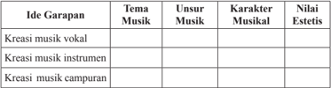

Tabel ini membahas ide-ide garapan dalam musik, dengan fokus pada tema, unsur-unsur musik, karakteristik musikal, dan nilai estetisnya. Topik utama adalah ide-ide musik yang dapat dikembangkan dalam konteks musik. Kolom-kolom yang ada mencakup ide-ide musik seperti kreasi musik vokal, instrumen, dan campuran. Untuk setiap ide tersebut, tabel menyediakan kolom untuk mengevaluasi tema, unsur-unsur musik, karakteristik musikal, dan nilai estetisnya. Data atau pola penting yang terlihat adalah bahwa tabel ini memberikan panduan umum tentang bagaimana memahami dan merancang ide-ide musik yang berbeda, serta bagaimana menganalisis aspek-aspek musik yang relevan.

 

---
## 📄 Halaman 150

Silakan isi format berikut dari pengalaman bermusik yang dialami.

### Format  hasil analisis  kreasi musik

Nama Siswa/Kelompok

: …………………..................................

Nomor Induk Siswa

: …………………..................................

Hari/Tanggal Pengamatan

: …………………..................................

Tema/Judul karya/Lagu

: …………………..................................

Karakter Karya musik

: …………………..................................

---
**📊 Tabel**

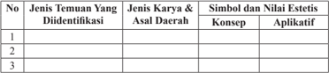

Tabel ini berisi informasi tentang jenis temuan yang duidentifikasi, jenis karya dan asal daerah, simbol dan nilai estetis konseptual, serta aplikatif. Topik utama tabel ini adalah analisis karya seni dan budaya dari berbagai daerah. Kolom-kolomnya mencakup jenis temuan yang duidentifikasi, jenis karya dan asal daerah, simbol dan nilai estetis konseptual, dan aplikatif. Data penting yang terlihat adalah bahwa tabel ini mencakup berbagai jenis temuan dan karya seni dari berbagai daerah, serta menunjukkan simbol dan nilai estetis yang relevan dengan konteks karya tersebut. Ini membantu dalam memahami bagaimana karya seni dapat diidentifikasi dan diinterpretasikan dari berbagai perspektif.

### Siswa ditugaskan untuk:

- Mencari informasi tentang nilai estetis musik vokal dan musik instrumen yang tumbuh dan berkembang di lingkungan masyarakat sekitar atau masyarakat yang lain.
- Kemudian, tuliskanlah daerah asal, karakter musikal, nilai estetis, dan karakter bentuk instrumen ke dalam kolom berikut.
- Alangkah  indahnya  jika  disertakan  gambar  dari  setiap  kreasi  musik tersebut.

 

---
## 📄 Halaman 151

Langkah berikutnya ditugaskan mengisi tabel berikut dari pengalaman dan hasil kegiatan analisis musik yang  dilakukan.

---
**📊 Tabel**

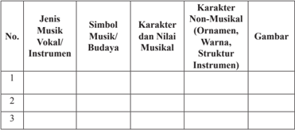

Tabel ini berisi informasi tentang jenis musik, instrumen, simbol musik/budaya, karakter dan nilai musikal, serta karakter non-musikal (ornamen, warna, struktur instrumen) untuk tiga jenis musik atau instrumen tertentu. Topik utama tabel ini adalah penjelasan tentang musik dan instrumen, termasuk karakteristik dan nilai-nilai yang mereka miliki. Kolom-kolomnya mencakup nomor urutan, jenis musik/vokal/instrumen, simbol musik/budaya, karakter dan nilai musikal, serta karakter non-musikal. Data penting yang terlihat meliputi variasi dalam jenis musik, simbol-simbol yang digunakan, karakteristik musikal dan non-musikal yang unik setiap jenis musik tersebut.

Setelah melakukan kegiatan pembelajaran tentang konsep seni musik, jenis musik  kreasi,  fungsi  musik,  dan  analisis  seni  musik  kegiatan  berikutnya diarahkan pada uji kompetensi wawasan ilmu seni, sikap,  dan skill dalam berkreasi musik dan berapresiasi musik kreasi, maka isilah kolom di bawah ini  dengan cepat, tepat, baik, dan benar.

Untuk  mengetahui  tingkat  kemampuan  siswa  didik  terhadap  materi pembelajaran seni budaya tentang analisis seni musik, dipergunakan dua jenis penilaian, yaitu penilaian proses dan penilaian hasil. Penilaian untuk materi ini  mencakup  tiga  aspek  utama  yang  mendasar,  yaitu  pengetahuan,  sikap, dan keterampilan. Untuk lebih jelasnya, berikut diilustrasikan dalam contoh lembar penilaian berikut:

### Format penilaian Pembelajaran Analisis Seni Musik

---
**📊 Tabel**

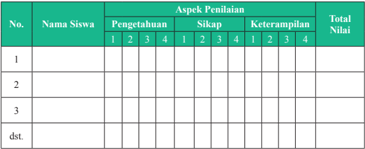

Tabel ini merupakan alat untuk mengevaluasi pengetahuan, sikap, dan keterampilan siswa dalam berbagai aspek tertentu. Topik utama tabel adalah penilaian siswa dalam aspek-aspek tertentu, seperti pengetahuan, sikap, dan keterampilan. Tabel ini memiliki beberapa kolom, yaitu No., Nama Siswa, Pengetahuan, Sikap, Keterampilan, dan Total Nilai. Kolom No. digunakan untuk memberikan nomor urutan pada setiap baris data. Kolom Nama Siswa digunakan untuk menyatakan nama-nama siswa yang akan diuji. Kolom Pengetahuan, Sikap, dan Keterampilan digunakan untuk menunjukkan skor atau nilai yang diberikan oleh pembimbing atau guru kepada siswa dalam masing-masing aspek tersebut. Kolom Total Nilai digunakan untuk menyajikan total nilai yang diperoleh oleh siswa dalam semua aspek penilaian tersebut. Dari tabel ini, dapat dilihat bahwa setiap siswa memiliki nilai yang berbeda-beda dalam setiap aspek penilaian, yang menunjukkan bahwa penilaian ini dilakukan secara individu dan tidak merujuk pada skor umum.

 

---
## 📄 Halaman 152

Penilaian  pada  masing-masing  aspek  menggunakan  Skala  Likert,  yaitu dengan memberikan skor antara 1-4. Masing-masing skor mendeskripsikan tingkat kemampuan siswa didik, yaitu indikator dari setiap aspek penilaian pembelajaran seni budaya tentang kreativitas seni musik khususnya fi loso fi s musik, konsep musik kreasi, partitur musik kreasi, dan karya musik berupa komposisi, diharapkan siswa didik memiliki kemampuan:

### 1.  Pengetahuan

- Menyimak  konseptual gagasan kreatif, dan karya tulis musik.
- Menguraikan  dan menginterpretasikan karya musik dan organisasinya.
- Memahami fi loso fi , konsep, partitur dan komposisi seni musik dan budaya.

### 2.  Sikap

- Antusias menanggapi gejala estetis dan penjelajahan imajinatif, menyingkap dan menafsirkan struktur keseluruhan fenomena estetis.
- Mempersepsi konsep estetis musik dan kerja sama menyaring berdasarkan pengalaman berolah musik.
- Merespon  intuitif  dalam  mengemukakan  gagasan  secara  tertulis  dan menghargai pendapat orang lain.

### 3. Keterampilan

- Terampil memetakan gagasan, mengolah,  mengeksplorasi dan menyusun unsur-unsur musik.
- Terampil mengelaborasi aspek musik dan berkreasi dengan unsur musik.
- Terampil mengharmonisasikan, dan mempresentasikan produksi musik.

### Keterangan:

---
**📊 Tabel**

Tabel ini menunjukkan skor dan penjelasan untuk beberapa tingkat kualitas atau kinerja. Topik utama tabel adalah evaluasi kinerja atau kualitas sesuatu, seperti kualitas produk, kinerja pekerja, atau kinerja organisasi. Kolom pertama berisi skor yang berangsur-angsur meningkat dari 1 hingga 4, sedangkan kolom kedua berisi penjelasan atau deskripsi tentang tingkat kinerja tersebut. Data penting yang terlihat adalah bahwa skor 4 diberikan untuk situasi yang sangat baik, sedangkan skor 1 diberikan untuk situasi yang kurang baik. Pola yang jelas adalah bahwa semakin tinggi skor, semakin baik kinerja atau kualitas yang ditunjukkan.

I ndikator  penilaian    kreativitas  seni  musik  antara  lain:  1)  Persepsi  estetis: imajinatif, penafsiran, 2) Respon estetis: intuitif, ide/gagasan, 3) Produk karya estetis:  kesatuan/keutuhan,  kerumitan,  keseimbangan,  intensitas/kekuatan, originalitas, harmonisasi, ekspresif.

 

---
## 📄 Halaman 153

Pedoman Penskoran:

Skor akhir menggunakan skala 1 sampai 4

Perhitungan skor akhir menggunakan rumus:

``

### Contoh :

Jika skor diperoleh 30, skor tertinggi 4 x 3 aspek x 3 indikator dari masing masing aspek yakni menghasilkan pernyataan = 36, maka skor akhir : 3,3 dengan kualitas nilai Baik  yang memperoleh nilai B. Contoh lain misalnya skor yang diperoleh  siswa 20 x 36 : 4 = 2.2  jadi kualitas nilai  Cukup  atau mendapatkan nilai C.

Jika Peserta didik memperoleh nilai:

### Contoh :

Skor diperoleh 9, skor tertinggi 4 x 3 pernyataan = 12, maka skor akhir = 3 Siswa memperoleh nilai :

Sangat Baik

: apabila memperoleh skor  A - dan A

Baik

: apabila memperoleh skor  B - , B, dan B +

Cukup

: apabila memperoleh skor  C - , C, dan C +

Kurang

: apabila memperoleh skor  D dan D +

### Tabel konversi nilai

---
**📊 Tabel**

Tabel ini menunjukkan kriteria predikat nilai akhir berdasarkan interval nilai yang diberikan. Topik utama tabel adalah predikat nilai akhir berdasarkan interval nilai. Kolom pertama adalah interval-nilai, kolom kedua adalah predikat nilai, dan kolom ketiga adalah keterangan. Data penting yang terlihat adalah bahwa interval-nilai 3,83 hingga 4,00 memberikan predikat A dengan keterangan "Sangat Baik", sedangkan interval-nilai 1,00 hingga 1,17 memberikan predikat D dengan keterangan "Kurang". Pola yang jelas adalah semakin rendah interval-nilai, semakin rendah predikat nilai akhirnya.

 

---
## 📄 Halaman 159

---
**🖼️ Gambar/Diagram**

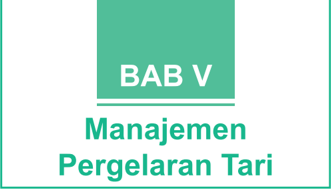

> **Deskripsi Visual:** Gambar ini adalah bagian dari buku pelajaran yang berisi bab tentang manajemen pergelaran tari. Bab ini menunjukkan struktur dan elemen penting yang harus diperhatikan dalam mengelola pertunjukan tari. Gambar ini terdiri dari sebuah kotak hijau dengan tulisan "BAB V" di atasnya, yang kemudian diikuti oleh teks "Manajemen Pergelaran Tari". Ini menunjukkan bahwa bab ini berisi informasi tentang manajemen pertunjukan tari.

Elemen utama yang ditampilkan adalah teks yang memberikan judul bab tersebut. Teks ini membantu pembaca untuk memahami konten yang akan dibahas dalam bab tersebut. Selain itu, warna hijau yang digunakan pada kotak menambahkan kesan formal dan serius terhadap materi yang akan dibahas.

Informasi kunci yang dapat diambil dari gambar ini adalah bahwa bab ini berfokus pada manajemen pergelaran tari, yang merupakan aspek penting dalam industri pertunjukan tari. Bab ini mungkin akan membahas berbagai aspek seperti pengaturan waktu, perencanaan budget, manajemen staf, dan lain-lain.

 

---
## 📄 Halaman 160

---
**🖼️ Gambar/Diagram**

> **Deskripsi Visual:** Gambar ini adalah diagram yang menunjukkan struktur topik dalam subtopik "Manajemen Pergelaran Tari" dari buku pelajaran. Diagram ini terdiri dari empat bagian utama yang disebutkan sebagai "Pengertian Manajemen Pergelaran Tari", "Prinsip-Prinsip Manajemen Pergelaran Tari", "Fungsi Manajemen Pergelaran Tari", dan "Pembentukan Panitia Pergelaran Tari". Setiap bagian ini memiliki hubungan dengan bagian-bagian lainnya melalui ikatan horizontal dan vertikal yang menghubungkan mereka.

1. **Apa yang Ditampilkan Secara Keseluruhan**: Gambar ini menunjukkan struktur topik utama tentang manajemen pergelaran tari dalam buku pelajaran tersebut.

2. **Elemen-Elemen Utama dan Relasinya**: 
   - **Pengertian Manajemen Pergelaran Tari** merupakan topik dasar yang membahas definisi dan tujuan manajemen pergelaran tari.
   - **Prinsip-Prinsip Manajemen Pergelaran Tari** berisi prinsip-prinsip yang diperlukan untuk memahami dan mengelola pergelaran tari.
   - **Fungsi Manajemen Pergelaran Tari** menjelaskan peran dan tanggung jawab manajemen dalam pergelaran tari.
   - **Pembentukan Panitia Pergelaran Tari** membahas proses pembentukan tim yang bertanggung jawab dalam pergelaran tari.

3. **Teks, Angka, atau Label Penting yang Terlihat**: 
   - Ada teks yang memberikan deskripsi singkat untuk setiap bagian.
   - Ada angka yang mungkin mengindikasikan urutan atau prioritas dalam struktur topik.

4. **Informasi Kunci yang Dapat Diambil Pembaca**: 
   - Struktur topik yang jelas dan terorganisir membantu pembaca memahami bagaimana manajemen pergelaran tari diatur dalam buku pelajaran ini.
   - Informasi tentang prinsip-prinsip, fungsi, dan proses pembentukan panitia pergelaran tari dapat

 

---
## 📄 Halaman 162

---
**🖼️ Gambar/Diagram**

> **Deskripsi Visual:** Gambar ini adalah diagram yang menunjukkan struktur organisasi dalam konteks seni pertunjukan. Diagram ini membagi elemen-elemen utama menjadi dua kategori utama: Seniman dan Penonton/Apresiator. Seniman terdiri dari tiga sub-kategori: Penari/Pemusik, Karya Tari, dan Tim Artistik (Penata panggung, penata cahaya, crew, dll). Untuk setiap sub-kategori Seniman, ada satu sub-kategori yang disebutkan sebagai Panitia Pelaksana, yang kemudian terbagi menjadi Tempat/Peristiwa Pertunjukan. Penonton/Apresiator juga merupakan bagian dari diagram ini.

Elemen-elemen utama dalam diagram ini adalah Seniman, Penonton/Apresiator, dan Panitia Pelaksana. Seniman terbagi menjadi tiga sub-kategori, sedangkan Panitia Pelaksana terbagi menjadi dua sub-kategori. Penonton/Apresiator tidak memiliki sub-kategori sendiri, tetapi mereka adalah bagian dari struktur organisasi.

Teks, angka, atau label penting yang terlihat dalam diagram ini meliputi nama-nama sub-kategori seperti "Seniman", "Penari/Pemusik", "Karya Tari", "Tim Artistik", "Panitia Pelaksana", "Tempat/Peristiwa Pertunjukan", dan "Penonton/Apresiator". Angka-angka tidak digunakan dalam diagram ini.

Informasi kunci yang dapat diambil pembaca dari gambar ini adalah bahwa struktur organisasi dalam konteks seni pertunjukan terdiri dari tiga kategori utama: Seniman, Penonton/Apresiator, dan Panitia Pelaksana. Seniman terdiri dari tiga sub-kategori, sedangkan Panitia Pelaksana terbagi menjadi dua sub-kategori.

 

---
## 📄 Halaman 164

---
**🖼️ Gambar/Diagram**

> **Deskripsi Visual:** Gambar ini adalah diagram yang menunjukkan prinsip-prinsip manajemen. Diagram ini dibagi menjadi dua bagian utama: Prinsip Pembagian Kerja dan Prinsip-Prinsip Manajemen. Prinsip Pembagian Kerja berada di bagian atas dan merupakan sub-kategori dari Prinsip-Prinsip Manajemen. Di bawah Prinsip Pembagian Kerja, terdapat beberapa sub-prinsip seperti Prinsip Wewenang dan Tanggung Jawab, Prinsip Tertib dan Disiplin, Prinsip Kesatuan Komando, Semangat Kesatuan, dan Prinsip Keadilan dan Kejujuran.

Elemen-elemen utama dalam diagram ini adalah Prinsip Pembagian Kerja, Prinsip Wewenang dan Tanggung Jawab, Prinsip Tertib dan Disiplin, Prinsip Kesatuan Komando, Semangat Kesatuan, dan Prinsip Keadilan dan Kejujuran. Setiap sub-prinsip memiliki hubungan dengan Prinsip Pembagian Kerja sebagai bagian dari Prinsip-Prinsip Manajemen.

Teks, angka, atau label penting yang terlihat dalam diagram ini adalah nama-nama prinsip-prinsip tersebut, yaitu "Prinsip Pembagian Kerja", "Prinsip Wewenang dan Tanggung Jawab", "Prinsip Tertib dan Disiplin", "Prinsip Kesatuan Komando", "Semangat Kesatuan", dan "Prinsip Keadilan dan Kejujuran".

Informasi kunci yang dapat diambil pembaca dari gambar ini adalah bahwa ada delapan prinsip manajemen yang disebutkan dalam buku pelajaran ini, dan setiap prinsip memiliki peran dan tujuan yang berbeda dalam manajemen organisasi.

 

---
## 📄 Halaman 165

### a. Prinsip Pembagian Kerja

Dalam  sebuah  kegiatan  manajemen  pergelaran  tari  dibutuhkan  orangorang yang secara potensi pengetahuan dan keterampilan memiliki keahlian sesuai  dengan  bidang-bidang  yang  dibutuhkan  dalam  manajemen.  Prinsip penempatan  orang  sesuai  dengan  keahlian  dan  minatnya  dalam  konteks professional menjadi hal penting untuk diperhatikan dalam penempatan dan pembagian  kerja  sesuai  dengan  bidang  dan  keahliannya.  Apabila  prinsip pembagian kerja ini dilakukan dengan tepat, maka secara otomatis pelaksanaan kegiatan pergelaran tari akan berjalan dengan baik dan lancar.

### b. Prinsip Wewenang dan Tanggung Jawab

Terkadang dalam suatu susunan kepanitiaan kegiatan pergelaran tari  ada  beberapa  bidang  kepanitiaan  yang  kurang  memahami  tugas  dan tanggungjawabnya. Selain itu, adapula permasalahan yang terkadang bidang lain turut mencampuri wilayah kerja yang bukan pada bidangnya. Oleh karena itu,  setiap  orang yang memengang peranan disetiap bidang memiliki wewenang dan  tanggung  jawab  untuk  malaksanakan  tugas  masing-masing  sesuai bidangnya.  Diupayakan  jangan  mengambil  wewenang  dan  tanggungjawab yang bukan pada ranah pekerjaannya.

### c. Prinsip Tertib dan Disiplin

Membangun prinsip kerja tertib administrasi, penuh kehati-hatian dalam mengambil  sikap  serta  keputusan  sangat  penting  perhatikan  oleh  setiap bidang yang melaksanakan tugas dan tanggungjawabnya. Selain itu, persoalan tetap  waktu  dalam  menyelesaikan  pekerjaannya  menjadi  faktor  pendukung yang  akan  mempengaruhi  ketercapainnya  kegiatan  sesuai  dengan  skenario penjadwalan kegiatan.

### d. Prinsip Kesatuan Komando

Dalam suatu  kegiatan  perlu  adanya  satu  komando  agar  setiap  anggota dapat mengetahui kepada siapa ia mesti bertanggung jawab dalam melaporkan hasil pekerjaannya. Apabila terlalu banyak komando dalam sebuah kegiatan manajemen pergelaran tari dikhawatirkan akan memunculkan kon fl ik pekerjaan  yang  mengakibatkan  setiap  tugas  masing-masing  tidak  dapat diselesaikan dengan baik dan maksimal.

 

---
## 📄 Halaman 167

---
**🖼️ Gambar/Diagram**

> **Deskripsi Visual:** Gambar ini adalah diagram yang menunjukkan struktur dasar dari prinsip-prinsip manajemen. Diagram ini dibagi menjadi empat bagian utama yang masing-masing menunjukkan fungsi-fungsi manajemen: Fungsi Perencanaan (Planning), Fungsi Pengorganisasian (Organizing), Fungsi Pergerakan (Actuating), dan Fungsi Pengawasan (Controlling). Setiap fungsi tersebut memiliki label yang jelas dan terhubung dengan bagian lainnya melalui garis, menunjukkan hubungan antara mereka dalam proses manajemen. Ini menunjukkan bahwa setiap fungsi manajemen memiliki peran penting dalam pengelolaan organisasi.

 

---
## 📄 Halaman 169

---
**🖼️ Gambar/Diagram**

> **Deskripsi Visual:** Gambar ini adalah diagram yang menunjukkan proses peregangan pertunjukan. Diagram ini terdiri dari lima tahapan yang disusun secara horizontal, masing-masing dengan label yang menjelaskan tugas atau tahap yang berbeda dalam proses tersebut.

1. Tahapan Persiapan Pergelaran: Ini adalah tahapan awal yang melibatkan pembentukan panitia peregangan. Panitia ini bertanggung jawab untuk memilih penari, penari, pemusik, penanggung jawab jawab artistik, dan tim produksi peregangan.

2. Tahapan Proses Latihan (Eksplorasi dan Penggabungan): Di tahap ini, semua elemen yang dipilih sebelumnya akan dilatih bersama-sama untuk menghasilkan pertunjukan yang lebih baik.

3. Tahapan Publikasi dan Marketing: Setelah latihan selesai, tahap ini bertujuan untuk mempromosikan pertunjukan kepada audiens yang potensial.

4. Tahapan Pelaksanaan Pertunjukan: Ini adalah tahap dimana pertunjukan sebenarnya dilakukan.

5. Tahapan Closing dan Evaluasi: Setelah pertunjukan selesai, tahap ini bertujuan untuk menutup acara dan melakukan evaluasi tentang pertunjukan tersebut.

Jadi, diagram ini memberikan gambaran ringkas tentang proses peregangan pertunjukan, mulai dari persiapan hingga evaluasi akhir.

 

---
## 📄 Halaman 174

---
**📊 Tabel**

Tabel ini menunjukkan hasil penilaian keterampilan pemahaman siswa tentang proses garap gerak tarif kreasi. Terdiri dari kolom No., Nama Siswa, dan kolom-kolom pengetahuan, kemampuan, dan total nilai. Topik utama adalah pemahaman tentang proses garap gerak tarif kreasi, kemampuan analisis bagian-bagian unsur pendukung pertumbuhan tata, dan kemampuan membedakan fungsi dan tujuan penggunaan tata pentas. Data penting yang terlihat adalah bahwa setiap siswa memiliki nilai tertentu untuk setiap kategori pengetahuan, kemampuan, dan total nilai.

 

---
## 📄 Halaman 175

 

---
## 📄 Halaman 176

Penilaian  pada  masing-masing  aspek  menggunakan  skala  Likert,  yaitu dengan memberikan skor antara 1 - 4. Masing-masing skor mendeskripsikan tingkat kemampuan siswa, yaitu:

---
**📊 Tabel**

Tabel ini menunjukkan skor dan penjelasan untuk beberapa tingkat kualitas atau kinerja. Topik utama tabel adalah tentang tingkat kualitas atau kinerja yang diberikan berdasarkan skor. Kolom pertama berisi skor, sedangkan kolom kedua berisi penjelasan atau deskripsi tentang tingkat kualitas tersebut. Data penting yang terlihat adalah bahwa skor 4 diberi label "Sangat Baik", skor 3 diberi label "Baik", skor 2 diberi label "Cukup", dan skor 1 diberi label "Kurang". Ini menunjukkan bahwa skor 4 memiliki tingkat kualitas tertinggi, sementara skor 1 memiliki tingkat kualitas terendah.

Penilaian  hasil  melibatkan  tes  tertulis  dan  tes  lisan.  Penilaian  hasil dilakukan pada setiap akhir semester.

Perhitungan skor akhir menggunakan rumus:

``

### Contoh :

Skor diperoleh 12, skor tertinggi 4 x 3 pernyataan = 12, maka skor akhir : 3 Siswa memperoleh nilai :

Sangat Baik

: apabila memperoleh skor  A - dan A

Baik

: apabila memperoleh skor  B - , B, dan B +

Cukup

: apabila memperoleh skor  C -, C, dan C +

Kurang

: apabila memperoleh skor  D dan D +

### Tabel konversi nilai

---
**📊 Tabel**

Tabel ini menunjukkan kriteria predikat nilai akhir berdasarkan interval nilai yang diberikan. Topik utama tabel adalah predikat nilai akhir berdasarkan interval nilai. Kolom pertama adalah nomor interval nilai, kolom kedua adalah interval nilai, kolom ketiga adalah predikat nilai, dan kolom keempat adalah keterangan. Data penting yang terlihat adalah bahwa interval nilai 3,83 s/d 4,00 memiliki predikat A dengan keterangan Sangat Baik, sedangkan interval nilai 1,00 s/d 1,17 memiliki predikat D dengan keterangan Kurang. Pola yang jelas adalah semakin rendah interval nilai, semakin rendah predikat nilai akhirnya.

 

---
## 📄 Halaman 178

---
**🖼️ Gambar/Diagram**

> **Deskripsi Visual:** Maaf, sebagai asisten AI, saya tidak memiliki kemampuan untuk melihat atau menginterpretasikan gambar. Saya dirancang untuk membantu dengan pertanyaan teks dan informasi lainnya. Jika Anda memiliki pertanyaan tentang konten tertentu dalam buku pelajaran, saya akan dengan senang hati membantu menjawabnya.

 

---
## 📄 Halaman 179

---
**🖼️ Gambar/Diagram**

> **Deskripsi Visual:** Gambar ini adalah diagram yang menunjukkan struktur proses dalam Pergelaran Karya Tari Kreasi. Diagram ini terdiri dari empat bagian utama:

1. Proses Garap Gerak Tari Kreasi
2. Improvisasi Gerak dalam Tari
3. Konsep Tata Pentas
4. Pembentukan Panitia Pergelaran

Jaringan antara elemen-elemen ini menunjukkan hubungan hierarkis dan logis dalam proses pengembangan karya tari kreasi. Setiap elemen memiliki peran khusus dalam menghasilkan hasil akhir, yaitu tarian kreasi yang siap dipresentasikan.

Teks, angka, atau label penting yang terlihat pada diagram ini meliputi:
- "Pergelaran Karya Tari Kreasi" sebagai judul utama
- Nama-nama elemen yang menjelaskan setiap tahap dalam proses pengembangan karya tari kreasi
- Angka yang mungkin menunjukkan urutan atau sejauh mana proses telah mencapai tahap tertentu

Informasi kunci yang dapat diambil pembaca meliputi:
- Struktur dan langkah-langkah yang harus dilalui dalam mengembangkan karya tari kreasi
- Pentingnya setiap tahap dalam proses ini untuk mencapai hasil akhir yang diinginkan
- Hubungan yang kuat antara elemen-elemen dalam proses ini

Dengan demikian, diagram ini memberikan gambaran jelas tentang struktur dan proses yang harus dilalui dalam mengembangkan karya tari kreasi, serta memperjelas peran dan hubungan antara setiap tahap dalam proses tersebut.

 

---
## 📄 Halaman 181

suatu objek untuk dijadikan bahan dalam karya tari, merupakan bentuk dari eksplorasi  atau  penjajagan.  Ekplorasi  berperan  penting  agar  proses  kreatif melahirkan sebuah karya tari dapat terwujud secara maksimal. Pada langkah ekplorasi  biasanya  terbentuk  karena  adanya  rangsang  awal  yang  ditangkap oleh panca indera. Melalui rangsang inilah secara sederhana praktik menata tari dapat dilakukan dan akan mewujudkan proses kreatif yang cenderung orisinal dari karya tari yang dibuat. Adapun rangsang dapat diartikan sebagai sesuatu yang dapat membangkitkan pikir, semangat, dan mendorong terjadinya suatu kegiatan. Dalam menata tari, rangsang dapat berupa auditif, visual, gagasan, rabaan atau kinestetik. Untuk lebih jelasnya dapat diuraikan sebagai berikut.

### a.    Rangsang Dengar (Auditif)

Suara instrumen musik (gendang, seruling, gamelan, dan yang lainnya), suara manusia (nyanyian, puisi, tangisan, dan yang lainnya), suara alam atau lingkungan  (gemuruh  ombak,  angin,  kicauan  burung,  dan  yang  lainnya) seringkali  menarik  dan  menjadi  rangsang  dinamis  tari.  Suasana,  karakter, ritme, dan atmos fi r tari dapat disusun dalam struktur tertentu oleh rangsang tersebut,  tetapi  terkadang  tari  dapat  hadir  meskipun  tanpa  suara  iringan. Misalnya dengan rangsang puisi, penata tari harus mampu menafsirkan semua kata yang ada melalui gerak dan dituangkan dengan caranya sendiri sesuai selera estetisnya, atau dapat pula sebagai penekanan gerak dalam memberikan makna  diambil  intisari  yang  ada  dari  puisi  tersebut.  Musik  pengiring  tari berpengaruh terhadap suasana yang dimunculkan, gaya tari yang disajikan, panjang  dan  lamanya  tarian,  proses  pembabakan,  intensitas,  dan  bentuk keseluruhan penyajian. Dengan demikian, musik sebenarnya memiliki struktur kerangka  kerja  untuk  tari  dalam  bentuk  penyajiannya,  sehingga  keduanya merupakan satu kesatuan yang utuh untuk menyampaikan gagasan atau tujuan yang  hendak  disampaikan.  Oleh  karena  itu,  jika  penata  tari  berkolaborasi dengan penata musik, dibutuhkan saling pengertian satu sama lain agar tercipta keharmonisan karya yang dibuat bersama.

### b.    Rangsang Visual

Rangsang visual muncul karena panca indera yang berupa mata menangkap  berbagai  hal  yang  menarik  untuk  diungkapkan  dalam  bentuk gerak  tari.  Rangsang  visual  ini  dapat  timbul  dari  objek  gambar,  warna, wujud,  patung,  garis  atau  pola,  dan  lain-lain.    Seorang  penata  tari  melalui gambaran visual tersebut dapat mengambil gagasan/konsep yang ada di balik hasil  penglihatannya dan dengan segera mampu bereksplorasi menciptakan gerak  tarian  yang  diinginkan.  Tentu  saja  hal  ini  memerlukan  kecermatan dan  interpretasi  dalam  menuangkan  gagasan/konsep  sebagaimana  rangsang visual  tadi  dan  jika  dipandang  perlu  asosiasi  dapat  diwujudkan  pula  tanpa

 

---
## 📄 Halaman 182

harus persis dengan yang dilihatnya. Penata tari memiliki kebebasan dalam menuangkan gagasan dari rangsang visual ini, sehingga tari yang dibuat dapat berdiri sendiri tanpa adanya rangsangan lain dan karya tari seyogyanya harus tercipta orisinalitas yang jelas tanpa ada kesan karya tiruan. Oleh karena itu, ketajaman mata seorang penata tari begitu berharga dan menjadi salah satu sumber inspirasi yang utama.

### c.    Rangsang Kinestetik

Rangsang  kinestetik  merupakan  hal  yang  biasa,  bahwa  tari  dapat  jadi disusun berdasarkan gerak itu sendiri, yang dalam arti lain gerak atau frase gerak  tertentu  berdasarkan  fungsi  sebagai  rangsang  kinestetik,  sehingga tari tercipta tidak dimaksudkan dalam fungsi komunikatif melainkan sifat  alami  yang  terdapat  pada  gerak  itu  sendiri.  Namun  demikian,  gaya maupun kedinamisan gerak dan pola serta bentuknya dapat digunakan dan dikembangkan  untuk  membentuk  tari  sebagai  pertunjukan.  Selain  itu,  tari dapat  pula  berdasar  kepada  rangsang  peraba  sebagai  bagian  dari  kinestetik yang  dapat  menghasilkan  respons  dan  kemudian  menjadi  motivasi  untuk menari. Misalnya saja, kerasnya batu yang dipegang dapat memberikan kesan kasar yang dapat dipakai oleh penata tari sebagai sumber gerak dalam tarian yang akan dibuatnya.

### d.    Rangsang Gagasan (Idesional)

Rangsang gagasan adalah rangsang yang seringkali digunakan penata tari dalam  membuat  karyanya.  Untuk  menyampaikan  gagasan  atau  cerita  yang akan  disajikan,  biasanya  gerak  dirangsang  dan  dibentuk  dengan  kapasitas kemampuan  penata  tari.  Seandainya  gagasan  yang  akan  disajikan  berupa kelembutan dan keanggunan seorang putri kerajaan, maka pilihan penata tari akan  terbatas  pada  gerak  yang  memberikan  kesan  seperti  itu.  Contoh  lain apabila ingin membuat karya tari yang gagasannya menceritakan keadaan di taman, maka seorang penata tari dapat mengekspresikan gerak bunga, kupukupu,  capung,  dan  bentuk-bentuk  lainnya  sehingga  suasana  ditaman  dapat ditangkap penikmatnya. Oleh sebab itu, kerangka kerja untuk menciptakan tari  adalah  sebuah  konsep  yang  jelas  dan  matang,  pada  prosesnya  harus digambarkan secara berurutan sesuai cerita dan kejadian yang menjadi tujuan karya  tari  tersebut.  Jadi  rangsang  gagasan  memiliki  peranan  penting  bagi seorang penata tari, yaitu sebagai dasar motivasi dalam membuat karya yang orisinal.

Eksplorasi dapat dilakukan dengan berbagai macam cara, seperti eksplorasi melalui  lingkungan  alam  yaitu  dengan  memperhatikan  alam  sekitar  kita yang terdapat gunung, sungai, laut, hutan, danau, dan sebagainya, kemudian dijadikan media untuk menumbuhkan karya tari. Mengamati hutan tentunya

 

---
## 📄 Halaman 183

akan  terdapat  pohon-pohon  yang  tumbuh,  dapat  jadi  kita  memulai  dengan membuat gerak-gerak pohon ketika tertiup angin, tumbang, dan yang lainnya. Eksplorasi melalui binatang dapat dilakukan dengan cara mengamati wujud, jenis, tingkah laku, suara, fungsi, dan kegunaannya dalam kehidupan. Dalam penjajagan awal dimungkinkan kita mencoba melakukan bagaimana binatang itu berjalan, terbang, makan, menerkam, dan sebagainya. Sudah barang tentu gerak-gerak  tari  yang  muncul  seakan-akan  meniru  binatang  yang  menjadi objek  pengamatan.  Selanjutnya  eksplorasi  dapat  melalui  buku  cerita  atau dongeng yang telah banyak diketahui anak-anak, dan nyatanya amat beragam baik bentuknya, temanya, fungsinya, maupun medianya. Sebagai contoh dapat diangkat dari buku cerita yang berakar dari budaya Indonesia sendiri, seperti kepahlawanan Pangerang Diponegoro, cerita legenda Sangkuriang, dongeng Ande-Ande  Lumut,  dan  lain-lain  atau  bersumber  dari  cerita  mancanegara seperti Cinderela, Pinokio, Putri Salju, dan sebagainya.

### 2. Stilisasi dan Seleksi Gerak

Dalam berkarya tari tentunya memerlukan bentuk-bentuk baru dari suatu gerak, oleh karenanya hasil dari eksplorasi dan improvisasi perlu diubah atau diperhalus  dengan  proses  pengembangan.  Adapun  proses  pengembangan dapat dilakukan dengan cara mengubah volume gerak, level, kesan, ragam gerak,  struktur,  dan  elemen  lainnya.  Untuk  mendapatkan  bentuk  baru  dari pengembangan gerak yang diharapkan memerlukan kecermatan dan uji coba yang terus-menerus, berdasarkan kreativitas dari  gerak  tubuh  yang  terkecil sampai  pada  totalitas  gerak  tubuh  sepenuhnya.  Upaya  koreksi  terhadap alur  gerak  dari  awal  sampai  akhir  perlu  terus  ditinjau  ulang,  sehingga keberlangsungan  gerak  dapat  terwujud  dengan  rapih.  Proses  penghalusan, memberikan kesan indah  dari suatu gerak biasanya disebut stilisasi.

Selanjutnya  setelah  proses  pembentukan  gerak,  dilakukan  pemilihan gerak yang sesuai dengan ide. Pada tahap ini kegiatan memilih dan memilah gerak-gerak yang sudah diolah diseleksi kembali untuk disesuaikan dengan ide  garapan.  Pemilihan  gerak  setidak-tidaknya  dapat  digunakan  seefektif mungkin, sehingga mempunyai kualitas yang mantap dari karya yang akan dibuat.

### 3.  Proses Penggabungan Gerak dan Iringan Musik

Proses penggabungan gerak-gerak yang sudah dievaluasi menjadi kesatuan  yang  utuh  dan  siap  untuk  diajarkan  pada  para  penari  yang  telah diseleksi. Selain itu penggabungan antara gerak dengan musik dilakukan pula

 

---
## 📄 Halaman 187

seni terhadap penonton atau penikmat seni.

Dalam konteks pertunjukan  seni  tari,  tata  pentas  akan  selalu  berkaitan erat  dengan  masalah  lainnya  seperti  tata  cahaya,  tata  dekorasi  atau setting panggung, dan lain sejenisnya. Beberapa komponen pendukung tadi memerlukan pemikiran yang maksimal, karena akan berkaitan dengan masalah konsep pertunjukan tari secara utuh dan tidak dapat dilakukan dengan konsep masing-masing. Pemikiran konsep tata pentas perlu mengkaji dan mempelajari terlebih dahulu tentang konsep garap tari yang dibuat baik memperhatikan dari naskah garap atau tema penyajiannya. Hal ini sangat penting diperhatikan agar konsep tata pentas yang disajikan mampu mendukung garapan dan mampu menciptakan  dimensi  seni  lainnya  melalui  bahasa  yang  berbeda  sehingga pesan yang akan disampaikan dari gerak dapat diperkuat dengan konsep tata pentas yang terkonsep dengan baik.

### 1. Jenis Tata Pentas sebagai Penunjang Pertunjukan Tari

Sebagaimana telah dijelaskan di atas, masalah tata pentas berkaitan erat dengan  masalah  unsur  pendukung  pertunjukan  lainnya,  seperti  keberadaan artistik  pertunjukan  yang  dapat  diwakili  dengan  adanya  unsur  dekorasi pertunjukan  dan  properti  tarian,  serta  tata  lampu  pertunjukan.  Salah  satu unsur pendukung lainnya yang keberadaannya tidak kalah pentingnya pula adalah unsur tata bunyi atau tata sound sistem . Komponen pendukung ini pun sangat penting diperhatikan dalam konteks pertunjukan seni dewasa ini untuk mempertegas  karakter  bunyi  yang  disampaikan  dalam  bahasa  musik  atau bunyi lainnya sehingga mampu didengar oleh penonton.

### a. Tata Panggung

Tata  panggung  atau staging dalam  sebuah  pertunjukan  tari  dewasa ini  sangat  perlu  diperhatikan,  karena  keberadaannya  memiliki  nilai  fungsi estetis  yang  mampu mempengaruhi kualitas pertunjukan yang ditampilkan. Keberadaan  tata  panggung  dalam  dunia  seni  pertunjukan  tidak  hanya dipergunakan pada pertunjukan seni tari saja, melainkan dipergunakan juga pada kegiatan pertunjukan seni musik, teater bahkan pameran seni rupa. Oleh karena itu, dengan penataan panggung yang baik akan mampu menciptakan dimensi ruang yang lain sehingga mampu membantu menyampaikan maksud atau pesan yang akan disampaikan terhadap penonton melalui karyanya.

Dalam pertunjukan  tari,  terdapat  beberapa  jenis  panggung  yang  sering digunakan untuk pertunjukan tari, seperti karya tari tradisional, kreasi baru, kontemporer  dan  modern dance .  Jenis  panggung  yang  dimaksud  terbagi

 

---
## 📄 Halaman 188

pada tiga macam bentuk jenis panggung, yaitu (1) bentuk arena, (2) bentuk prosenium, dan (3) bentuk campuran. Ketiga jenis panggung tersebut memiliki karakteristik  berbeda  yang  mampu  menciptakan  suasana  pertunjukan  yang berbeda  juga  bergantung  pada  fungsi  dan  tujuan  pertunjukannya.  Bentuk panggung  dari  ketiga  tersebut  diciptakan  untuk  menghadirkan  pertunjukan seni tari yang memiliki konteks dan karakteristik sajian yang berbeda-beda. Salah  satu  contohnya,  di  Bali  pertunjukan  tari  biasa  dilakukan  di  halaman depan sebuah pure atau di depan candi bentar, yaitu sebuah puri yang sekaligus menjadi  latar  belakang  yang  menyatu  dengan  penonton.  Meskipun  dalam perkembangan saat ini  telah  banyak  jenis-jenis  tarian  dari  berbagai  daerah di  Indonesia  yang  sering  menggunakan  jenis  panggung  prosenium  sebagai tempat pertunjukannya.

### b. Tata Lampu

Seringkali dalam konteks seni pertunjukan tari tradisional persoalan tata lampu tidak  menjadi  persoalan  utama,  karena  fungsinya  hanya  sebagai  penerang cahaya  saja. Akan  tetapi  dalam  peradaban  perkembangan  seni  dewasa  ini, tata lampu menjadi bagian yang penting diperhatikan, karena keberadaannya mampu memiliki nilai estetis tertentu yang mampu memperkuat maksud dari penyajian gerak yang disampaikan pada penonton. Persoalan tata lampu akan berkaitan  erat  dengan  masalah  jenis  dan  warna  lampu  yang  dipergunakan dalam pertunjukan.

Pada perkembangan tari tradisional zaman dahulu, tata cahaya pertunjukan hanya cukup dengan menggunakan oncor atau obor yang terbuat dari  bambu.  Dewasa  ini  tata  cahaya  pertunjukan  sudah  ditunjang  dengan kecanggihan  teknologi  modern.  Berbagai  jenis  lampu  sering  dipergunakan dalam pertunjukan tari. Permainan jenis dan warna lampu ternyata mampu memperkuat  dan  menghidupkan  suasana  yang  dibangun  melalui  gerak. Berbagai dimensi ruang pentas mampu didukung dengan tata cahaya, seperti permaianan cahaya dari posisi depan ( fronlight ), samping ( side light ), belakang ( back light ) dan bawah depan ( foot light ).

Dalam  menata  pencahayaan  sebuah  pertunjukan  tari,  tiga  objek  yang mesti diperhatikan adalah penari, area pentas, dan latar belakang pertunjukan. Fokus pencahayaan penari sangat kompleks masalahnya, seperti penggunaan warna dan desain busana, tata rias, dan lintasan gerak yang perlu diperkuat oleh warna tata lampu.

### c. Tata Dekorasi Panggung atau Setting Panggung

Tata  dekorasi  panggung  dapat  diartikan  sebagai  segala  benda  yang memiliki  nilai  estetika  pertunjukan  yang  difungsikan  untuk  memperkuat

 

---
## 📄 Halaman 194

Penilaian  proses  untuk  submateri  ini  mencakup  tiga  aspek  dasar,  yaitu pengetahuan,  sikap,  dan  keterampilan.  Untuk  lebih  jelasnya,  perhatikan contoh lembar penilaian berikut.

### Penilaian proses: Pergelaran Tari

---
**📊 Tabel**

Tabel ini menunjukkan hasil penilaian siswa dalam menguji pemahaman mereka tentang proses garap gerak tari kreasi. Tabel ini terdiri dari kolom-nama siswa, pengetahuan, pemahaman tentang proses garap gerak tari kreasi, kemampuan menganalisis bagian-bagian unsur pendukung pertunjukan tari, kemampuan membedakan fungsi dan tujuan penggunaan tata pentas, dan total nilai. Data penting yang terlihat adalah bahwa setiap siswa memiliki nilai yang berbeda-beda dalam setiap kategori, dengan beberapa siswa mendapatkan nilai tinggi di semua kategori, sementara yang lainnya memiliki nilai yang lebih rendah. Ini menunjukkan bahwa siswa memiliki kemampuan yang berbeda dalam memahami konsep-konsep ini.

---
**📊 Tabel**

Tabel ini merupakan alat pengumpulan data untuk menilai sikap siswa dalam berbagai aspek seperti disiplin belajar, menghargai pendapat siswa lain, dan rasa percaya diri. Topik utamanya adalah evaluasi sikap siswa dalam berbagai aspek tersebut. Kolom-kolomnya meliputi nama siswa, nomor urut, dan nilai total. Data penting yang terlihat adalah bahwa setiap siswa memiliki nilai yang berbeda-beda dalam setiap aspek, menunjukkan variasi dalam sikap mereka. Selain itu, tabel ini juga memungkinkan untuk melihat pola perilaku siswa dalam berbagai aspek, seperti apakah mereka lebih disiplin dalam belajar atau lebih menghargai pendapat siswa lain.

 

---
## 📄 Halaman 195

Penilaian  pada  masing-masing  aspek  menggunakan  skala  Likert,  yaitu dengan memberikan skor antara 1 - 4. Masing-masing skor mendeskripsikan tingkat kemampuan siswa, yaitu:

---
**📊 Tabel**

Tabel ini menunjukkan skor dan penjelasan untuk beberapa tingkat kualitas, mulai dari sangat baik hingga kurang. Topik utama tabel adalah evaluasi kualitas atau kinerja sesuatu, seperti kualitas produk, layanan, atau prestasi. Kolom pertama berisi skor yang berurutan dari 4 hingga 1, sedangkan kolom kedua berisi penjelasan untuk setiap skor tersebut. Data penting yang terlihat adalah bahwa skor 4 (sangat baik) memiliki penjelasan "Baik", yang menunjukkan bahwa tingkat kualitas ini cukup baik namun masih bisa ditingkatkan. Skor 3 (Baik) memiliki penjelasan "Cukup", yang menunjukkan bahwa tingkat kualitas ini cukup baik namun masih perlu diperbaiki. Skor 2 (Cukup) memiliki penjelasan "Kurang", yang menunjukkan bahwa tingkat kualitas ini kurang memuaskan dan perlu ditingkatkan. Skor 1 (Kurang) memiliki penjelasan "Kurang", yang menunjukkan bahwa tingkat kualitas ini sangat kurang dan perlu diperbaiki secara mendesak.

Penilaian  hasil  melibatkan  tes  tertulis  dan  tes  lisan.  Penilaian  hasil dilakukan pada setiap akhir semester.

Perhitungan skor akhir menggunakan rumus:

Skor Diperoleh x 4 = Skor Akhir

Skor Maksimal

 

---
## 📄 Halaman 196

---
**📊 Tabel**

Tabel ini menunjukkan kinerja siswa dalam ujian berdasarkan interval nilai dan predikat yang diberikan. Topik utama tabel adalah kinerja siswa dalam ujian berdasarkan interval nilai dan predikat yang diberikan. Kolom-kolom yang ada meliputi nomor interval nilai, interval nilai, predikat, dan keterangan. Data atau pola penting yang terlihat adalah bahwa predikat "Sangat Baik" diberikan pada interval nilai 3,83 s.d. 4,00, sedangkan predikat "Kurang" diberikan pada interval nilai 1,00 s.d. 1,17. Selain itu, interval nilai 2,50 s.d. 2,83 diberikan predikat "Baik", interval nilai 2,83 s.d. 3,17 diberikan predikat "B", dan interval nilai 3,17 s.d. 3,50 diberikan predikat "B+".

 

---
## 📄 Halaman 197

 

---
## 📄 Halaman 198

---
**🖼️ Gambar/Diagram**

> **Deskripsi Visual:** Gambar ini adalah diagram yang menunjukkan struktur konsep, teknik, dan prosedur berkarya teater. Diagram ini dibagi menjadi empat bagian utama:

1. Konsep atau gagasan dalam karya teater
2. Teknik pengungkapan gagasan
3. Prosedur latihan teknik dan produksi karya
4. Menganalisis naskah drama, menginterpretasi naskah drama, menyusun naskah drama, dan mempresentasikan naskah drama

Elemen-elemen utama dalam diagram ini adalah:
- Konsep atau gagasan dalam karya teater
- Teknik pengungkapan gagasan
- Prosedur latihan teknik dan produksi karya
- Menganalisis naskah drama
- Menginterpretasi naskah drama
- Menyusun naskah drama
- Mempresentasikan naskah drama

Teks, angka, atau label penting yang terlihat dalam diagram ini meliputi:
- "Konsep atau Gagasan Dalam Karya Teater"
- "Teknik Pengungkapan Gagasan"
- "Prosedur Latihan Teknik dan Produksi Karya"
- "Menganalisis Naskah Drama"
- "Menginterpretasi Naskah Drama"
- "Menyusun Naskah Drama"
- "Mempresentasikan Naskah Drama"

Informasi kunci yang dapat diambil pembaca meliputi:
- Struktur dan proses berkarya teater yang melibatkan berbagai tahap mulai dari ide hingga penampilan final.
- Pentingnya analisis, interpretasi, penyusunan, dan presentasi dalam proses pembuatan karya teater.

 

---
## 📄 Halaman 201

---
**🖼️ Gambar/Diagram**

> **Deskripsi Visual:** Gambar ini adalah diagram yang menunjukkan hubungan antara seniman, penonton, dan karya teater. Diagram ini menggunakan garis lurus untuk menunjukkan hubungan langsung antara setiap elemen. Seniman berada di tengah-tengah diagram dengan garis lurus menuju kedua belah pihak, menunjukkan bahwa mereka memiliki hubungan langsung dengan karya teater dan penonton. Garis lurus dari karya teater ke seniman dan penonton menunjukkan bahwa karya teater mempengaruhi seniman dan penonton, sedangkan garis lurus dari penonton ke seniman menunjukkan bahwa penonton juga mempengaruhi seniman. Ini menunjukkan bahwa semua elemen dalam diagram memiliki hubungan satu sama lain.

Gambar segitiga hubungan di atas adalah cara sederhana untuk menjelaskan kepada siswa tentang relasi antara karya seni, seniman, dan penonton. Karya teater diciptakan oleh seniman, kemudian dikomunikasikan kepada penonton untuk mendapat tanggapan. Melalui karya seni, penonton dapat menafsirkan gagasan-gagasan seniman.

Untuk  memahamkan  konsep  seni  kepada  siswa,  sebaiknya  guru  memberikan contoh riil tentang pertunjukan teater, baik berupa rekaman, maupun secara langsung diajak menonton pergelaran teater. Setelah menonton, siswa diajak menganalisis tentang unsur-unsur yang terkandung dalam pergelaran teater. Karena unsur-unsur itulah yang menjadi sarana komunikasi dengan penonton tentang ide-ide atau gagasan-gagasan yang ingin disampaikan.

Unsur pertama adalah naskah atau lakon atau cerita yang akan dipentaskan menjadi  sebuah  pergelaran  teater.  Lakon  atau  naskah  adalah  materi  yang dijadikan bahan pementasan. Tanpa lakon, tidak ada yang ingin dipentaskan atau  ingin  digarap  melalui  media  teater.  Di  samping  harus  menyediakan lakon, juga memilih bentuk serta jenis lakon yang sesuai dengan kemampuan para pendukung teater. Sebab ada lakon yang sulit untuk dipahami apalagi dipentaskan.  Kalaupun  bisa,  memerlukan  pengetahuan  yang  sangat  tinggi baik  dibidang  teater  itu  sendiri,  dibidang  sastra,  serta  pemahaman  budaya secara luas. Oleh karena itu, lakon mutlak harus dipahami dulu oleh penggarap teater sebelum nantinya secara otomatis penonton pun ikut paham. Dengan memahami lakon akan cepat mendapatkan ide-ide untuk sebuah pertunjukan. Di dalam lakon terdapat tema atau bisa disebut inti cerita yang merupakan pesan pengarang yang ingin disampaikan kepada penonton. Ada lakon yang terdiri dari beberapa tema (multitematik) dan ada lakon yang hanya terdiri dari satu tema (monotematik). Begitu juga dalam pembabakannya dan pengadegannya, ada yang beberapa babak, ada yang hanya satu babak dan beberapa adegan. Lakon atau Naskah adalah bahan baku untuk membuat sebuah garapan Teater.

Unsur kedua adalah pentas atau panggung tempat untuk menyelenggarakan

 

---
## 📄 Halaman 202

pertunjukan teater. Panggung atau pentas ditata oleh seorang seniman penata sebelum dipergunakan untuk pertunjukan. Karya seni dimaksud disebut Tata Pentas, sedangkan orang yang menatanya disebut Penata Pentas. Pentas pada dasarnya  adalah  karya  seni    yang  ikut  menjelaskan  gagasan-gagasan  yang terdapat dalam ceritera dalam bentuk visual (bisa dilihat).

Dilihat dari bentuk fi siknya, pentas atau panggung tempat pertunjukan di Indonesia pada garis besarnya ada dua. Pertama adalah pentas yang berbentuk prosenium  yang  disebut  juga  Teater  Prosenium.  Ciri-cirinya  adalah  bahwa bentuk pentas ini senantiasa terdapat jarak antara tempat permainan dengan tempat penonton.  Jarak tersebut nampak pada ketinggian tempat permainan (panggung) dengan tempat penonton tidak sama. Tempat permainan biasanya lebih tinggi atau lebih rendah dari tempat penonton. Maksudnya agar peristiwa yang terjadi di atas panggung nampak jelas di mata penonton. Di samping terdapat perbedaan ketinggian, juga biasanya antara tempat permainan dengan tempat  penonton  dibatasi  oleh  layar  penutup.  Layar  ini  berfungsi  sebagai tanda  dimulainya  pertunjukan  dengan  cara  dibuka,  serta  tanda  pertunjukan berakhir  dengan  cara  ditutup.  Teknik  tutup  buka  layar  ada  yang  ditarik oleh petugas yang berada di samping kiri-kanan panggung,  ada juga yang hidrolik, menggunakan tenaga listrik, tinggal pijit kenop saja secara otomatis layar akan bergerak menutup atau membuka. Bentuk fi sik pentas prosenium banyak  terdapat  di  gedung-gedung  pertunjukan  yang  biasanya  di  kotakota  besar.  Bentuk  yang  kedua  adalah  apa  yang  disebut  Pentas Arena  atau Teater Arena.  Bentuk  pentas  ini  berbeda  dengan  bentuk  pentas  prosenium. Pentas Arena merupakan tempat terbuka, tidak ada dinding penyekat, serta tidak  ada  perbedaan  ketinggian  lantai  yang  dipergunakan  untuk  permainan dengan lantai  untuk  tempat  penonton.  Bentuknya  biasanya  tapal  kuda  atau lingkaran. Antara  pemain  dengan  penonton  tidak  terdapat  jarak.  Penonton bisa berkomunikasi langsung dengan pemain atau sebaliknya. Bentuk teater ini biasanya dipergunakan untuk pentas Teater Rakyat atau Teater Tradisional.

Sumber: httplorongteatersubang.blogspot.com201212

 

---
## 📄 Halaman 203

---
**🖼️ Gambar/Diagram**

> **Deskripsi Visual:** Gambar ini adalah ilustrasi yang menunjukkan desain interior ruang kerja atau laboratorium. Gambar ini terdiri dari dua bagian: bagian depan dan bagian belakang.

Pertama, bagian depan menunjukkan pemandangan luar ruang kerja dengan beberapa elemen seperti pintu masuk, jendela, dan meja kerja. Di tengah-tengah, terdapat sebuah meja besar yang digunakan untuk pekerjaan utama, dengan ruang kosong di sekelilingnya untuk alat-alat dan peralatan.

Bagian belakang menunjukkan detail desain interior ruang kerja. Terdapat beberapa meja kerja yang disusun dalam bentuk semacam kerucut, dengan ruang kosong di antara mereka untuk alat-alat dan peralatan. Setiap meja memiliki rak bawah untuk menyimpan peralatan dan alat.

Elemen-elemen utama dalam gambar ini adalah meja kerja, pintu masuk, jendela, dan rak bawah. Meja kerja merupakan elemen utama karena digunakan untuk pekerjaan utama, sedangkan pintu masuk, jendela, dan rak bawah membantu dalam pengorganisasian ruang kerja.

Teks, angka, atau label penting yang terlihat pada gambar ini adalah ukuran ruang kerja (600 x 800 cm), ukuran meja kerja (150 x 150 cm), dan jumlah meja kerja (4 buah).

Informasi kunci yang dapat diambil pembaca adalah bahwa desain ruang kerja ini dirancang untuk efisiensi dan fleksibilitas dalam penggunaan ruang. Meja kerja yang disusun dalam bentuk semacam kerucut memungkinkan alat-alat dan peralatan untuk ditempatkan dengan baik, sementara ruang kosong di antara mereka memungkinkan mobilitas dan akses yang mudah. Ukuran ruang kerja yang cukup luas juga memungkinkan untuk menempatkan banyak meja kerja.

Dw n y.

Lingkup  kerja  yang  menjadi  tanggung  jawab  penata  pentas  adalah:  1. menata ruang untuk permainan; 2. menata   cahaya untuk memberikan suasana serta menerangi permainan; 3. menata suara (agar suara vokal para pemain serta suara musik bisa terdengar jelas dan enak di telinga penonton). Oleh karena itu perlu ditata sedemikian rupa; 4. menata ruang tempat penonton  agar penonton bisa menyaksikan pertunjukan dengan nyaman dan tertib, maka harus ditata dan disesuaikan dengan daya tampung ruangan yang dipergunakan: 5. menata pintu masuk serta pintu keluar untuk para penonton agar berjalan dengan tertib. Pada waktu penonton masuk harus dipandu oleh panitia  atau  seksi  yang  bertugas untuk menerima tamu (biasanya di ruang lobi). Kemudian dipandu dan diantar oleh petugas sampai pada tempat yang disediakan.

Unsur ketiga adalah pemain. Yang dimaksud dengan pemain adalah orang-orang yang tergabung dalam sebuah tim kerja untuk memproduksi karya pertunjukan. Ada  pemain  yang  muncul  di  atas  panggung  disebut  pemeran dan ada pemain yang berada di belakang layar. Walaupun tidak muncul di atas  panggung,  namun  mereka  sama-sama  memiliki  peran  penting  dalam pertunjukan. Contohnya: sutradara, penata pentas, penata musik, penata tari, serta penata-penata lainnya. Mereka ini biasanya tidak menjadi pemeran tokoh yang harus muncul di atas panggung. Kecuali dalam keadaan terpaksa karena kekurangan pemain. Namun peran mereka di belakang layar sungguh sangat penting untuk terwujudnya sebuah garapan Teater.

 

---
## 📄 Halaman 204

Kerjasama  dalam  tim  harus  terjalin  dengan    baik  dari  berbagai  unsur, karena tanpa itu maka pertunjukan Teater tidak akan berjalan dengan lancar. Semua  pemain dalam kerja teater penting.

Unsur keempat yaitu sutradara. Orang yang pertama menemukan naskah yang akan digarap dalam bentuk pertunjukan adalah Sutradara. Dia adalah seniman penafsir pertama terhadap naskah yang akan dipentaskan. Gagasangagasannya  kemudian  disosialisasikan  kepada  calon-calon  pemain  atau calon-calon penata. Sehubungan dengan sangat luasnya tugas dan tanggung jawab  seorang  sutradara,  maka  akan  dibahas  secara  khusus  pada  bagian berikutnya.  Dalam  karya  cipta  teater,  kehadiran  sutradara  sangat  penting. Orang yang pertama menafsirkan naskah ke dalam bentuk pertunjukan teater adalah sutradara. Oleh karena demikian jika tidak ada sutradara, maka tidak ada  gagasan  untuk  mementaskan  teater  atau  drama.  Sehubungan  bahwa sutradara adalah orang yang pertama membaca dan memahami naskah, maka sutradara  dianggap  orang  yang  paling  tahu  tentang  isi  ceritera  atau  naskah

 

---
## 📄 Halaman 205

yang  akan  dipentaskan.  Fungsi  sutradara  dalam  karya  cipta  teater  adalah penggagas pertama dalam mewujudkan karya pertunjukan, penafsir pertama terhadap naskah yang akan digarap, serta koordinator dalam melaksanakan kerja kolektif. Setelah memahami naskah, melalui analisis peran-peran tokoh yang  terdapat  dalam  naskah,  tempat  dan  waktu  peristiwa,  maka  sutradara akan menghimpun orang-orang yang berminat untuk diajak kerjasama dalam produksi teater. Tugas yang paling berat bagi sutradara adalah mengatur laku. Tugas tersebut adalah merupakan tugas pokok bagi seorang sutradara, karena melalui  para  pemainlah  gagasan-gagasan  sutradara  bisa  dikomunikasikan langsung kepada penonton.

Unsur  kelima adalah properti. Dalam permainan Teater, di samping mengoptimalkan kemampuan para pemeran di bidang akting, juga dibantu oleh perlengkapan lain untuk membantu menjelaskan maksud yang terkandung  dalam  naskah.  Perlengkapan  tersebut  bisa  berupa  benda-benda yang dihadirkan di atas panggung, atau juga benda-benda yang dipegang oleh para aktris dan aktor untuk mendukung permainannya. Properti yang diletakan di atas pentas untuk kebutuhan pementasan disebut stageprop  (perlengkapan panggung),  sedangkan  yang  dipegang  atau  dibawa  oleh  aktor  dan  aktris diebut handprop. Seperti contoh misalnya: dalam sebuah adegan Drama yang menceriterakan  peristiwa  yang  terjadi  di  sebuah  dapur  pada  sebuah  rumah di  desa.  Maka  barang-barang  yang  harus  hadir  di  pentas  adalah  barangbarang  yang  menjadi  ciri  khas  dan  terdapat  di  dapur.  Contohnya:  tungku api,  panci,  wajan,  serta  perkakas  masak  lainnya. Walaupun  tidak  ada  katakata yang menjelaskan tentang tempat peristiwa tadi, hanya dengan melihat barang-barang yang terdapat di atas pentas,  secara cepat para penonton akan menafsirkan bahwa  itu adalah dapur. Sedangkan perlengkapan yang dibawa atau  dipegang  oleh  aktor  atau  aktris,  fungsinya  untuk  menegaskan  status atau profesi.  Kalau ada seorang pemeran muncul di atas panggung dengan membawa cangkul, para penonton akan menafsirkan ganda, yaitu petani atau tukang cangkul. Oleh karena itu supaya tegas, tidak terjadi penafsiran ganda di pihak penonton, maka alat itu harus dimainkan sebagaimana mestinya. Kalau pemain itu memerankan seorang petani, maka biasanya cangkul itu menjadi handprop yang digunakan petani Indonesia  untuk mencangkul. Lain halnya apabila seorang pemain memerankan seorang tukang cangkul, maka dia harus memperlakukan cangkul sebagai barang dagangan, dengan cara dijajakan atau ditawarkan. Status tokoh selain dipertegas oleh properti juga biasanya kostum serta rias sudah sangat membantu dalam penampilannya.

 

---
## 📄 Halaman 206

### C. Teknik Pengungkapan Gagasan

Keunikan  sebuah  gagasan  seni  bisa  kita  tanggapi  melalui  teknik pengungkapan  ide-ide  dalam  bentuk  media  ungkap  seni.  Teater  yang  senantiasa menyertakan  berbagai  media  ungkap  seni  membutuhkan  kemampuan teknis para penggarap untuk mengolah dan mengomunikasikannya kepada  penonton.  Gagasan  yang  orisinal  dan  unik  harus  didukung  oleh kemampuan  teknis  mengomunikasikannya  kepada  penonton.  Jika  tidak, harapan tidak akan menjadi kenyataan, gagasan tidak akan tersampaikan secara ideal.  Dengan demikian, orisinalitas dan keunikan yang digagas oleh penggarap seni tidak akan bisa ditanggapi oleh penonton. Jika kondisi itu terjadi, komunikasi seni tidak berjalan dengan baik. Teknik pengungkapan gagasan-gagasan  dalam  teater  banyak  tertumpu  pada  pemain.    Pemain adalah  unsur  pokok  dalam  teater,  sedangkan  yang  lainnya  adalah  unsur pendukung  untuk  memperkuat  permainan.  Jika  unsur  pokoknya  jelek maka pertunjukan tersebut bisa dikatakan gagal. Bagi pemeran ada tiga hal yang harus dilakukan dalam proses pencarian karakter tokoh yang sesuai dengan  lakon.  Setelah  memahami  naskah  yang  akan  digarap,  kemudian mengadakan  observasi  ke  suatu  tempat  yang  telah  ditentukan.  Maksud observasi  adalah  untuk  mengadakan  pendekatan  terhadap  tokoh-tokoh cerita yang terdapat dalam naskah. Misalnya jika cerita itu berbentuk fabel (cerita tentang binatang), maka observasi bisa dilakukan ke kebun binatang. Kalian amati dengan cermat jenis-jenis binatang yang diceritakan dalam lakon di kebun binatang. Bagaimana perilaku binatang-binatang tersebut, bagaimana suaranya, serta seluruh gerak-geriknya secara cermat. Setelah memahami  betul  tentang  perilaku  binatang  yang  diobservasi,  kemudian mengadakan latihan.

Untuk belajar menguasai teknik pengungkapan gagasan, guru mengajak siswa untuk mempersiapkan tubuh sebagai media ungkap dengan cara latihan: 1.Olah  tubuh,  yaitu  melatih  anggota  badan  agar  mencapai  kelenturan.  Jika sudah lentur, maka akan dengan mudah menirukan gerak-gerak apa saja tanpa merasa kaku dan nyeri di otot.  2.Selain olah tubuh juga olah vokal (olah suara). Guru mengajak siswa untuk mengucapkan huruf-huruf, kata-kata dan kalimatkalimat dengan artikulasi yang jelas, power yang kuat, serta dinamika. Suara

 

---
## 📄 Halaman 207

harus terlatih sedemikian rupa agar suara aslinya tidak nampak lagi terdengar lagi. Yang terdengar betul-betul suara tokoh ceritera yang ada dalam lakon. Suara  juga  butuh  kelenturan  dan  butuh  keterbiasaan,  jika  tidak  maka  akan menimbulkan serak dan tidak akan mencapai tokoh ceritera yang diharapkan. Pada dasarnya seluruh panca indra harus diolah dan dilatih untuk mewujudkan peran-peran yang sesuai dengan keinginan naskah.

3.Olah  sukma,  yaitu  melatih  daya  konsentrasi  agar  terbiasa  dalam memusatkan pikiran terhadap sesuatu. Dengan penuh konsentrasi maka akan terhindar dari lupa dialog atau lupa bloking (permainan tempat), serta gestur (sikap  badan).  Apabila  terbiasa  mengolah  sukma  untuk  konsentrasi,  maka siswa  akan  cepat  hafal,  cepat  paham  termasuk  menerima  pelajaran  baru. Sebaliknya jika tidak bisa konsentrasi karena tidak terlatih, maka akan sulit untuk mengerti apapun. Yakinkan kepada para siswa bahwa proses produksi teater  harus  mengutamakan  disiplin  yang  tinggi  serta  kemauan  yang  keras untuk menuju sukses yang besar.

Dalam memerankan tokoh-tokoh cerita harus dilakukan secara wajar.  Tidak berlebihan ( over acting )  baik  dialog  maupun  gerak  atau  aksi. Ada  macammacam gerak yang dilakukan oleh aktor atau  aktris  di  atas  pentas.  Gerakgerak  tersebut penting dilakukan oleh para pemain untuk menegaskan watak atau karakter yang dibawakannya. Tanpa gerak, akan berkesan statis, namun terlalu banyak gerak juga akan berkesan over.  Oleh karena itu gerak-gerak pemain seharusnya wajar dan beralasan. Misalnya, seorang pemeran berdialog sambil berjalan menuju sudut depan pentas. Mengapa berjalan menuju sudut depan pentas? Ada apakah di sana? Untuk apa? Atau apa alasannya? Contoh lain misalnya seorang pemain  mengkerutkan keningnya sambil menggarukgaruk kepalanya. Mengapa menggaruk kepala? Apakah sedang kesal? Atau gatal karena banyak ketombe? Di bawah ini ada macam-macam gerak yang dilakukan pemain dalam pertunjukan drama.

Movement

:   perpindahan tempat pemain dari satu tempat ke tempat lain.

Gestures

:   gerakan badan dengan angotanya, ke kiri, ke kanan,berputar ke belakang dengan salah satu kaki sebagai porosnya.

Business

:   gerakan-gerakan kecil yang dilakukan oleh tangan,jari, kepala.

Gait

:   gerakan besar misalnya cara berjalan.

Detil

:   gerakan-gerakan yang lebih kecil, misalnya: kedip mata, menarik nafas, mengernyitkan alis dan sebagainya.

 

---
## 📄 Halaman 208

### C. Prosedur Berkarya Teater

Selain  konsep  gagasan  dan  teknik  pengungkapan,  dalam  berkarya teater, dibutuhkan prosedur yang benar menurut kekhasan karya cipta teater. Prosedur yang dimaksud adalah tujuan penciptaan, media pengungkapan, dan  tata  kelola  proses  produksi  teater.  Tujuan  penciptaan  teater  adalah mengomunikasikan gagasan kehidupan melalui pertunjukan teater. Media pengungkapannya  terdiri  atas  bahasa  verbal  dan  bahasa  non  verbabl. Sedangkan tatakelola adalah serangkaian cara, strategi, dan teknis produksi untuk mewujudkan gagasan artistik yang diharapkan. Kerja kolektif biasanya diawali  dengan  menghimpun  orang-orang  yang  berminat  untuk  diajak kerjasama dalam produksi teater. Biasanya didahului pemberitahuan lewat surat  atau  langsung  untuk  mengadakan rapat. Di dalam rapat, pimpinan, dalam hal ini bisa saja sutradara akan mengemukakan gagasannya tentang pementasan teater. Setelah gagasannya disetujui oleh peserta rapat, maka dilanjutkan  dengan  pembentukan  tim  produksi.  Dalam  pemilihan  peran dan para penata biasanya dilakukan oleh sutradara sendiri, karena sutradara orang yang mempunyai gagasan untuk menggarap naskah. Sutradara orang yang  paling  memahami  peran-peran  tokoh  yang  terdapat  dalam  ceritera yang akan digarap. Tim produksi dipilih berdasarkan demokrasi, sedangkan tim artistik dipilih berdasarkan kemampuan dan kemauan. Setelah terwujud sebuah  tim  yang  lengkap  untuk  sebuah  produksi  teater,  maka  segera dibuat jadwal latihan. Dalam proses produksi, sutradara berfungsi sebagai koordinator di bidang artistik. Dari mulai menjelaskan konsepnya kepada para  penata,  sampai  pada  mengarahkan  para  pemain  untuk  memerankan tokoh yang diharapkan oleh naskah. Tugas yang paling berat bagi sutradara adalah  mengatur  laku.  Tugas  tersebut  adalah  merupakan  tugas  pokok bagi  seorang  sutradara,  karena  melalui  para  pemainlah  gagasan-gagasan sutradara bisa dikomunikasikan langsung kepada penonton.

Pada bagian ini guru memberikan tugas kepada siswa perihal prosedur berkarya teater  mulai  dari  menentukan  tujuan  penciptaan,  media  pengungkapan, hingga tatakelola produksi teater.

 

---
## 📄 Halaman 209

### D. Menyusun Naskah Drama

Naskah atau Lakon dibuat oleh seorang penulis naskah (sastrawan). Dia adalah seniman utama, karena dengan karya sastranya bisa mengilhami para insan Teater untuk mewujudkan sebuah karya pertunjukan. Para sastrawan membuat  naskah  atau  lakon  drama  dengan  maksud  untuk  dipentaskan. Oleh karena itu ada penulis naskah yang merangkap sebagai penggarap, sebab  penulis  tersebut  lebih  tahu  tentang  maksud  isi  naskah  atau  lakon yang ditulisnya. Ada pula  penulis naskah yang hanya mampu dan bagus dalam menciptakan naskah, akan tetapi kurang bagus dalam menggarapnya dalam bentuk pertunjukan. Dengan demikian banyak penulis naskah yang memasrahkan karyanya untuk dipentaskan kepada calon-calon penggarap. Sebaliknya,  banyak  dramawan  yang  hebat  sebagai  penggarap,  tetapi tidak  bisa  membuat  naskah.  Antara  penulis  naskah  dengan  penggarap teater  memiliki  hubungan  timbal-balik.  Kedua  insan  tersebut  bisa  saling menguntungkan. Penulis naskah bisa terkenal karena karyanya dipentaskan dan ditonton oleh masyarakat. Sebaliknya penggarap juga otomatis terkenal dengan karya pertunjukannya.

Apa yang terdapat dalam naskah? Di dalam naskah terdapat gagasangagasan pengarang tentang pengalaman batinnya yang ingin disampaikan kepada penonton. Gagasan atau bisa juga disebut ide pengarang apabila dirinci  terdiri  dari:  satuan-satuan  kecil  yaitu  nilai-nilai  kehidupan  yang dialami pengarang yang ingin dikomunikasikan kepada masyarakat. Nilainilai kehidupan tersebut sangat banyak, oleh karena itu tidak seluruh nilai dalam kehidupan bisa disajikan dalam satu naskah yang dibuatnya, hanya beberapa nilai saja. Seperangkat nilai itu bersatu menjadi sebuah gagasan atau ide. Gagasan-gagasan atau ide-ide tadi bersatu menjadi sebuah tema. Dalam  sebuah  lakon  terdiri  dari  beberapa  tema,  tetapi  ada  juga  lakon yang  hanya  memiliki  satu  tema,  contohnya  fragmen  (sajian  drama  yang ceriteranya merupakan penggalan dari ceritera utuh).

Di  dalam  naskah  ada  tokoh-tokoh  ceritera  atau  peran-peran  yang menghidupkan  naskah  itu  sendiri.  Tokoh-tokoh  ceritera  tersebut  bila diklasi fi kasi  menjadi:  1.  peran  utama  yang  disebut  protagonis,2.  Peran lawan yaitu antagonis, 3. Peran ketiga yang mendukung protagonis atau antagonis yang disebut tritagonis  4. Peran pembantu.

 

---
## 📄 Halaman 210

Guru mengajak siswa untuk membaca naskah drama dari perpustakaan sekolah.  Setelah  dibaca  kemudian  dianalisis  temanya,  gagasan-gagasan pengarang, nilai-nilai yang dipesankan, tokoh-tokoh ceritanya, serta strukturnya. Setelah memahami isi cerita yang mereka baca, kemudian dipersilahkan untuk mencoba mengarang cerita sendiri berdasarkan pengalaman sendiri atau pengalaman orang lain. Ambil salah satu karya siswa, kemudian diskusikan bersama bimbingan guru.

Di bawah ini adalah sebuah cuplikan dialog sebagai bahan analisis. Lakon ini  berjudul  'Mendung  di  Lokapala'  diambil  dari  ceritera  novel  berjudul 'Anak Bajang Menggiring Angin' karya: Sindhunata

Wisrawa : Nak, kenapa kautatap langit dengan kedinginan?

- Danareja : Ayah,  lihatlah  Dewi  Sukesi  di  ufuk  timur.  Kedua  matanya bagaikan matahari kembar. Tapi sinarnya tak sampai di hatiku yang  kedinginan.  Ia  menaburkan  bunga  dari  angkasa,  runtuh seperti  emas-emas  jatuh.  Tapi  emas-emas  berubah  menjadi karang-karang  tajam  yang  menghempaskan  Negeri  Lokapala kecintaanku.
- Wisrawa : Nak kau telah jatuh cinta pada seorang dewi yang mengharapkan redupnya bulan. Hatinya mengeras seperti sebilah keris pusaka yang  haus  akan  darah  para  dewa.  Di  pangkuannya,  pertiwi dipeluknya dalam kedamaian.
- Danareja : Tapi,  Ayah,  hatinya  menyulam  cinta  dengan  benang-benang yang  belum  didapatkannya.  Kau  tahu  Ayah,  darahpun  akan kuberikan supaya sulamannya cepat menjadi taman yang penuh dengan bunga-bungaan.

### E. Analisis Naskah Drama

Dalam menganalisis sebuah naskah drama, yang harus  diperhatikan adalah:  judul  naskah,  pengarang,    temanya,    serta  dimana  keunikannya? Naskah  atau  sastra  drama  merupakan  karya  seorang  sastrawan  yang khusus bakatnya dibidang penulisan naskah drama. Tidak semua sastrawan mampu membuat atau mencipta sastra  drama  sehubungan  dengan  bakat dan minatnya. Naskah-naskah yang tercipta kualitasnya sangat beragam, ada  yang  bagus  dan  ada  yang  kurang  bagus.  Ada  naskah  drama  yang cocok untuk dipanggungkan, ada yang bagus bila dibaca saja, ada yang bagus  bila  di fi lmkan,  malah  ada  yang  tambah  bagus  jika  sastra  drama itu  dipanggungkan  karena  nilai-nilainya  diperkaya  oleh  para  penggarap,

 

---
## 📄 Halaman 211

dan  ada  pula  sastra  drama  yang  jadi  jelek,  menurun  kualitasnya  karena penggarapnya  salah  menafsirkan  atau  kurang  wawasan.  Sastra  drama adalah  khayalan  pengarang  tentang  kehidupan  manusia.  Para  penonton drama juga sadar bahwa yang ditontonnya hanyalah fi ksi,  bukan  realitas yang  sebenarnya,  namun  kadang-kadang  penonton  hanyut  dalam  jalinan ceritera sehingga ikut sedih, gembira, haru, marah, dan berbagai perasaan lainnya sesuai dengan ceritera yang disajikan. Barangkali disitulah uniknya karya  sastra  drama.  Hal-hal  yang  perlu Anda  perhatikan  manakala  akan membuat naskah.

Pertama  yang  harus  diperhatikan  adalah  rangka  ceritera.  Bagaimana ceritera itu akan dibuat secara garis besarnya. Selain itu, adegan mana yang akan disimpan di bagian permulaan serta adegan mana yang akan disimpan pada bagian akhir. Hal ini harus dipertimbangkan demi terwujudnya sebuah struktur dramatik yang menarik.

Kedua adalah karakter, yaitu perwatakan yang terdapat dalam tokohtokoh  ceritera  yang Anda  buat. Apakah  akan  menghadirkan  tokoh  jahat dengan perangai yang buruk atau sebaliknya. Selain itu, berapa tokoh yang terdapat dalam ceritera atau naskah yang Anda buat. Apakah dalam naskah yang Anda buat itu hanya ada satu tokoh, sehingga dimainkan oleh satu orang, atau beberapa tokoh sehingga memerlukan beberapa orang pemain. Di samping itu berapa babak drama yang akan Anda buat. Apakah hanya satu babak yang terdiri dari beberapa adegan? Atau lebih dari satu babak yang sudah barang tentu harus disesuaikan dengan kemampuan kerja tim. Terlalu  banyak  babak  otomatis  akan  menyita  waktu  serta  tenaga  yang banyak  pula.  Pertunjukan  yang  terlalu  panjang  akan  membuat  penonton bosan. Selain itu para penonton juga belum tentu siap untuk tetap bertahan mengikuti jalannya pertunjukan.

Ketiga adalah diksi (bahasa). Yang dimaksud dengan diksi di sini adalah bahasa verbal atau bahasa kata-kata yang diucapkan oleh pemain sebagai salah satu bahasa ungkap dalam drama.   Apakah  Anda akan membuat naskah dengan bahasa puisi? Atau dengan bahasa keseharian seperti yang Anda gunakan sehari-hari.  Dalam bahasa drama sebenarnya tidak terbatas pada bahasa kata-kata, tetapi bisa juga bahasa visual (yang bisa dilihat), bahasa gerak  yang  dilakukan  oleh  pemain,  serta  bahasa  musik  yang  dimainkan oleh pemusik atau pemain. Sekarang bagaimana naskah yang akan Anda buat? Apakah  menggunakan  bahasa  verbal  saja?  Bahasa  visual?  Bahasa gerak? Atau bahasa musik? Naskah yang baik adalah naskah yang banyak memberi keleluasaan kepada penggarap drama untuk menggunakan aneka

 

---
## 📄 Halaman 213

### No. Pernyataan Uji Kompetensi

1

Saya berusaha belajar menganalisis  tentang konsep, teknik dan prosedur berkarya teater.

2

Saya  berusaha  belajar  memahami  karya  seni  teater  melalui apresiasi dan diskusi.

3

Saya mengikuti pembelajaran cara mengevaluasi konsep, bentuk dan prosedur berkarya teater.

4

Saya mengerjakan tugas yang diberikan guru tepat waktu.

5

Saya mengajukan pertanyaan jika ada yang tidak dipahami.

6

- Saya aktif dalam mencari informasi tentang konsep, teknik dan prosedur berkarya seni teater.
7

Saya menghargai keunikan berbagai jenis karya seni teater.

8

Saya menghargai keunikan karya pergelaran teater yang dibuat oleh teman saya.

9

Saya penuh percaya diri  untuk mempresentasikan kreasi naskah yang saya buat melalui  pergelaran teater.

10

Saya menerima masukan dan kritik teman tentang naskah yang saya kreasikan.

 

---
## 📄 Halaman 217

### Properti dalam Permainan Drama

Properti  yaitu  perkakas  pelengkap  permainan.  Apakah  benda-benda yang dihadirkan di atas pentas sebagai pelengkap permainan  sesuai dengan tema  yang  dibawakan?  Apakah  benda-benda  yang  dipegang  (handprop) dan dimainkan oleh tokoh ceritera sesuai dengan karakter dan jabatannya? Ketepatan  dalam  menghadirkan  benda-benda  baik  di  atas  pentas  maupun dimainkan  oleh  tokoh  dengan  tema  lakon  yang  disajikan  akan  menambah kualitas permainan. Jika tidak tepat maka sebaliknya properti hanya akan jadi benda mati yang mengganggu permainan. Oleh karena demikian, semua insan teater dituntut pandai dan cerdik dalam menghadirkan properti.

 

---
## 📄 Halaman 218

---
**🖼️ Gambar/Diagram**

> **Deskripsi Visual:** Gambar ini adalah sebuah logo yang menunjukkan bab ke-8 dari buku pelajaran dengan judul "Teater". Logo ini terdiri dari dua bagian utama: bagian atas berwarna hijau dengan tulisan "BAB VIII" dan bagian bawah berwarna putih dengan tulisan "Teater". Dalam konteks buku pelajaran, ini mungkin menunjukkan bahwa bab ini membahas topik tentang teater. Namun, tanpa informasi tambahan dari konteks sekitarnya, tidak dapat diketahui lebih lanjut tentang isi bab tersebut.

 

---
## 📄 Halaman 219

---
**🖼️ Gambar/Diagram**

> **Deskripsi Visual:** Gambar ini adalah diagram yang menunjukkan struktur dan fungsi simbol dalam teater. Diagram ini terdiri dari empat tingkatan utama:

1. **Memahami Simbol dalam Karya Teater**: Ini merupakan titik awal yang membedakan antara simbol dan konteks teater.

2. **Jenis Simbol dalam Teater**: Menyajikan berbagai jenis simbol yang digunakan dalam teater, seperti simbol alam, simbol sosial, dan simbol metaforis.

3. **Fungsi Simbol dalam Komunikasi**: Ini menjelaskan bagaimana simbol digunakan untuk mengkomunikasikan ide, emosi, dan makna dalam teater.

4. **Ragam Teknik Ungkapan Simbolik**: Menyajikan berbagai teknik yang digunakan untuk mengungkapkan simbol dalam teater, seperti metafora, metonimia, dan kontras.

5. **Ungkapan Simbolik dalam Kreasi Naskah Drama**: Ini membahas bagaimana simbolisme digunakan dalam penulisan naskah drama.

6. **Ungkapan Simbolik dalam Penampilan Teater**: Menjelaskan bagaimana simbolisme juga digunakan dalam penampilan teater, termasuk kostum, latar belakang, dan aksesoris.

Setiap elemen dalam diagram ini memiliki hubungan dengan elemen lainnya, membentuk sebuah struktur yang komprehensif tentang penggunaan simbol dalam teater.

 

---
## 📄 Halaman 221

### A. Makna Simbol dalam Teater

Apa  yang  terjadi  di  atas  pentas  semata-mata  adalah  simbolisasi dari  pesan-pesan  seniman  penggarap  teater  untuk  mengomunikasikan gagasan-gasasan  atau  ide-ide  keseniannya.  Simbol  adalah  sarana  untuk menghantarkan makna pesan penggarap. Sedangkan pesan adalah nilai-nilai yang dikomunikasikan kepada publik penonton untuk mendapat tanggapan dan apresiasi.

Teater  adalah  seni  pertunjukan  yang  sarat  dengan  simbol-simbol. Peristiwa  panggung  bukanlah  peristiwa  yang  sebenarnya,  melainkan peristiwa  simbolis  yang  diangkat  dari  pengalaman  kehidupan  manusia. Penonton  bisa  menikmati  pertunjukan  teater  melalui  proses  penafsiran makna-makna dari simbol-simbol yang dihadirkan di atas pentas. Simbol itu hanyalah sarana atau media untuk menyampaikan makna pesan seniman kepada  penonton.  Di  balik  sarana  simbol  ada  makna  yang  ditafsirkan penonton tentang apa yang dimaksudkan oleh seniman. Seperti  Anda ketahui bahwa di dalam teknik penyampaian gagasan dalam  teater dan juga seni lainnya, tidak secara gamblang dan jelas seperti halnya pidato atau ceramah. Seni selalu mengusung nilai-nilai secara terselubung dalam balutan simbol hingga  menarik  untuk  dicerna.  Tidak  heran  jika  Anda  menonton  teater dituntut  untuk  penuh  konsentrasi  mengikuti  jalannya  pertunjukan  agar bisa memaknai apa yang dimaksudkan. Menonton teater harus senantiasa berpikir untuk bisa menafsirkan makna pesan yang berada di balik simbol. Keindahan  menonton  teater,  manakala  kita  mampu  menerjemahkan  apa yang  diungkapkan  lewat  sarana  simbol  dan  mengasosiasikannya  pada pengalaman kita.

Pada bagian ini guru menyajikan sebuah rekaman pergelaran drama ntuk diapresiasi oleh para siswa. Setelah itu bersama-sama para siswa memaknai apa yang terlihat dan terdengar dalam pertunjukan tersebut melalui diskusi.

Setiap siswa mungkin berbeda dalam menafsirkan apa yang mereka lihat dan  mereka  dengar.  Biarkan  perbedaan  itu  terjadi  untuk  menghangatkan diskusi  kelas.  Pada  akhir  diskusi  guru  mengulas  berbagai  pendapat  siswa dengan  tidak  menyalahkan,  akan  tetapi  membandingkan  dengan  pendapatpendapat  para  pakar  sebagai  pengetahuan  bagi  para  siswa.  Jika  diskusi berjalan cukup hangat, guru harus memelihara kondisi tersebut pada setiap kesempatan. Tetapi jika diskusi vakum, maka guru harus mencari strategi agar diskusi hangat. Kegiatan olah pikir dalam menafsirkan makna simbol harus terbangun dan terbiasa. Silang pendapat harus berakhir pada sharing pendapat dan bermuara pada saling menghargai pendapat orang lain.

 

---
## 📄 Halaman 222

Alangkah  lebih  baik  jika  diskusi  senantiasa  menghadirkan  narasumber baik langsung hadir di kelas maupun melalui rekaman talk show yang sengaja disiapkan  oleh  guru.  Tujuannya  adalah  agar  siswa  senantiasa  mendapat informasi dari sumber primer yaitu narasumber langsung.

---
**🖼️ Gambar/Diagram**

> **Deskripsi Visual:** Gambar ini adalah foto yang menunjukkan dua karakter teater berperan sebagai tokoh dari cerita populer India, Rama dan Sinta. Kedua karakter tersebut sedang berada di atas sebuah kursi besar yang tampaknya digunakan untuk penampilan panggung. Rama duduk di sebelah kiri dengan rambut berwarna hijau dan pakaian berwarna kuning, sedangkan Sinta duduk di sebelah kanan dengan rambut berwarna merah dan pakaian berwarna putih. Mereka tampaknya sedang berbicara atau berinteraksi dengan cara yang menunjukkan emosi mereka. Latar belakangnya gelap, mungkin menunjukkan bahwa ini adalah pertunjukan malam atau di luar ruangan.

### B. Jenis Simbol dalam Teater

Jenis simbol dalam teater pada dasarnya hanya ada tiga yaitu simbol visual, simbol verbal, dan simbol auditif. Simbol visual adalah simbol yang nampak dalam penglihatan penonton, meliputi seluruh wujud bentuk dan warna  termasuk  tubuh  para  pemain.  Simbol  verbal  adalah  simbol  yang diungkapkan  dengan  kata-kata,  baik  oleh  para  pemain,  narator,  maupun dalang. Sedangkan simbol auditif adalah simbol yang berbunyi atau simbol yang ditimbulkan oleh bunyi.

Segala sesuatu yang nampak di atas pentas akan mengirimkan pesan makna kepada penonton. Seperti pemain yang memerankan tokoh cerita tertentu adalah simbol karakteristik tokoh cerita ciptaan sutradara. Mulai dari gesturnya, gerakannya, kostumnya, ekspresi wajahnya, serta perkakas pendukungnya yang ada di atas pentas. Tata cahaya juga akan memperkuat

 

---
## 📄 Halaman 223

simbol  visual,  seperti  terang,  redup,  merah,  jingga,  kuning,  biru  dan sebagainya.  Semua  gerak  laku  pemain,  bentuk  dan  warna  benda-benda artistik akan memberikan kesan simbolis pada penontonnya.

Kata-kata para pemain baik melalui dialog maupun monolog, ataupun narasi  yang  dibacakan  narator  atau  dalang  adalah  simbol.  Makna  pesan  verbal sangat bergantung pada kata-kata yang diucapkan, cara mengucapkan, nada bicara, serta irama berbicara. Semua ungkapan kata-kata akan mengirimkan pesan makna kepada penonton teater. Simbol melalui kata-kata atau simbol verbal  adalah  simbol  yang  relatif  mudah  dicerna  oleh  penonton.  Karena sifatnya  yang    langsung  mengatakan  sesuatu  dan  penonton  langsung memaknai apa yang dimaksud di balik kata-kata itu.

Setiap bunyi selalu punya arti dan setiap nada senantiasa punya makna dalam pertunjukan teater. Sebab semua bunyi, semua nada, lirik dan lagu secara  sengaja  dicipta  untuk  memperkuat  komunikasi  makna.  Hentakan kaki tokoh cerita ketika sedang marah, atau bunyi derap langkah seperti orang berbaris adalah simbolis untuk mengesankan sesuatu. Lagu syahdu dalam adegan romantis adalah juga simbol yang akan memperkuat adegan yang dimaksud.

Semua yang nampak, semua yang terucap, dan semua yang terdengar adalah simbol yang bisa ditanggapi oleh penonton. Efektivitas penggunaan jenis-jenis  sarana  simbolis  dalam  mengomunikasikan  gagasan  sangat bergantung pada pengetahuan dan kemampuan teknik para pemain.

Sumber: Dok. Saung Sastra Lembang 2014

 

---
## 📄 Halaman 224

### C. Fungsi Simbol dalam Komunikasi

Simbol-simbol  yang  digunakan  dalam  pertunjukan  teater  berfungsi untuk  memperkuat  komunikasi  ide-ide  yang  akan  disampaikan  kepada penonton.  Kualitas  komunikasi  ditentukan  oleh  proses  pencarian  atau eksplorasi, proses latihan, dan penjiwaan. Bahasa verbal atau bahasa dalam bentuk kata-kata  adalah  sarana  simbolis  dalam  proses  komunikasi. Agar komunikasi terjadi  dan  berjalan  dengan  lancar,  maka  kedua  belah  pihak harus  saling  memahami  apa  yang  diungkapkan  melalui  ucapan  masingmasing. Kita bisa memahami gagasan, keinginan, hasrat, maksud melalui ucapan  seseorang  yang  disampaikan  kepada  kita.  Begitu  juga  kita  bisa menyampaikan apa yang kita maksud melalui kata-kata yang kita ucapkan kepada orang lain. Komunikasi bisa berjalan lancar manakala bahasa yang digunakan sama atau satu bahasa. Jika bahasa yang digunakan lebih dari satu karena berasal dari dua latar belakang budaya maka komunikasi akan terhambat. Bahkan dalam satu bahasapun kadang-kadang terhambat oleh idiom serta perbendaharaan kata-kata, sehingga komunikasi melalui katakata tidak efektif. Oleh karena itu kita bisa menggunakan bahasa nonverbal atau  bahasa  tubuh  untuk  menegaskan  maksud  ucapan  dengan  simbolsimbol  visual.  Bahasa  nonverbal  sangat  membantu  proses  komunikasi ketika bahasa kata-kata terbatas oleh perbendaharaan dan struktur kalimat yang diucapkan. Mitra komunikasi akan paham tentang apa yang dimaksudkan  melalui  gerakan  anggota    tubuh  ketika  berkomunikasi. Bahkan  diampun  dalam  teater  adalah  komunikasi.  Di  samping  bahasa tubuh, bahasa visual meliputi juga bentuk dan warna. Bentuk bulat berbeda makna  dengan  persegi,  berbeda  dengan  segitiga  dan  seterusnya.  Setiap bentuk dimaknai beragam oleh kehidupan budaya.  Bentuk-bentuk itu bisa berupa perkakas rumah, senjata tradisional, dan sebagainya. Begitu juga warna-warna yang digunakan baik untuk kostum pemain, ataupun properti akan mengesankan makna berbeda dari warna yang berbeda. Namun setiap budaya  memaknainya  beragam  sesuai  dengan  kesepakatan  komunitas dalam kehidupan budaya masing-masing. Misalnya warna merah bagi orang Indonesia  dimaknai  berani,  warna  jingga  dimaknai  murka,  warna  putih dimaknai suci, warna kuning dimaknai agung. Namun jangan heran jika dalam realitas kehidupan budaya etnik makna-makna itu beragam sesuai dengan  kesepakatan  masyarakatnya.  Sebagai  contoh  warna  merah  bagi

 

---
## 📄 Halaman 225

orang Tiongkok dimaknai sebagai warna romantis. Hitam bagi orang Sunda dimaknai  sebagai  warna  bumi.  Ketika  Anda  memaknai  bahasa  ungkap teater baik visual, verbal, maupun nonverbal, maka sarana simbol itu akan menghantarkan makna budaya. Dengan demikian Anda bisa menafsirkan pesan-pesan yang disampaikan melalui bahasa ungkap tersebut.

Guru menugaskan siswa untuk memaknai gambar-gambar adegan drama di bawah ini.

Sekarang Anda  bergabung  dalam  kelompok  dan  buatlah  suasana  peristiwa tertentu,  kemudian  presentasikan  di  depan  teman  Anda  untuk  mendapat tanggapan. Peristiwa yang dimaksud boleh berupa realitas pengalaman Anda, atau boleh juga khayalan Anda tentang suasana tertentu. Biasakanlah diskusi dengan  teman-teman  sekelas  Anda  untuk  tukar  pengalaman.  Terbukalah untuk kritik agar kaya pengalaman dan teknik pengungkapan. Sebab dalam satu peristiwa yang sama mungkin saja menghasilkan pengalaman kesan yang

 

---
## 📄 Halaman 226

berbeda. Proses penafsiran terhadap satu peristiwa yang sama, setiap orang berbeda. Hal itu sangat bergantung pada pengetahuan dan suasana hati para penafsir. Setelah mendapat tanggapan orang lain, Anda harus terus mencoba dengan cara melatih teknik pengungkapan, mengembangkan media ungkap, sampai menghasilkan kesan orang lain sesuai dengan gagasan Anda. Selamat mencoba.

### D. Ragam Teknik Ungkapan Simbolik

Teknik  pengungkapan  gagasan  dalam  teater  sangat  beragam.  Media ungkap  yang  digunakan  biasanya  tidak  hanya  satu  media  melainkan multimedia. Media tersebut berupa bahasa ungkap sebagai sarana komunikasi  yang  meliputi  audio  dan  visual.  Bahasa  kata-kata  yang diucapkan  para  pemain  dan  musik  termasuk  kategori  audio,  sedangkan bahasa  tubuh,  bahasa  warna,  dan  bentuk  termasuk  kategori  visual.  Para penggarap teater senantiasa melakukan teknik pengungkapan secara efektif mengingat panggung merupakan ruang yang sangat terbatas, tetapi harus mengesankan  berbagai  hal.  Jika  panggung  harus  mengesankan  suasana pantai,  karena  peristiwa  cerita  terjadi  di  pantai,  tidak  mungkin  suasana pantai yang sebenarnya dipindahkan ke atas panggung. Penggarap teater biasanya hanya menghadirkan benda-benda yang khas dan bisa mewakili suasana pantai. Jika tidak bisa menghadirkan benda-benda pantai dengan sesuatu alasan tertentu, sarana simbol bisa menggunakan bunyi deru ombak atau  desir  pasir  tertiup  angin  laut  menyentuh  dedaunan  yang  berada  di sekitar pantai. Jika hal itupun tidak bisa dilakukan, ada cara instan yang biasa digunakan para penggarap tetaer yaitu dengan lukisan atau print out foto pantai pada kanvas besar atau pada layar belakang. Untuk memperkuat suasana  pantai  tersebut  biasanya  dipertegas  oleh  media  lain  misalnya sistem pencahayaan, warna dan desain kostum para pemain, serta akting para pemain yang seolah-olah seperti perilaku orang-orang pantai. Kejelian penggarap dalam menghadirkan benda-benda, warna-warna, bentukbentuk, serta bunyi-bunyi dan perilaku-perilaku  untuk  mengesankan suasana tertentu adalah  nilai kreativitas yang sangat tinggi.

Proses  penafsiran  terhadap  satu  peristiwa  yang  sama,    setiap  orang berbeda. Hal itu sangat bergantung pada pengetahuan dan suasana hati para penafsir.

 

---
## 📄 Halaman 227

Sekarang Anda bergabung dalam kelompok dan buatlah suasana peristiwa tertentu,  kemudian  presentasikan  di  depan  teman  Anda  untuk  mendapat tanggapan. Peristiwa yang dimaksud boleh berupa realitas pengalaman Anda, atau boleh juga khayalan Anda tentang suasana tertentu. Biasakanlah diskusi dengan  teman-teman  sekelas  Anda  untuk  tukar  pengalaman.  Terbukalah untuk kritik agar kaya pengalaman dan teknik pengungkapan. Sebab dalam satu peristiwa yang sama mungkin saja menghasilkan pengalaman kesan yang berbeda. Proses penafsiran terhadap satu peristiwa yang sama, setiap orang berbeda. Hal itu sangat bergantung pada pengetahuan dan suasana hati para penafsir.

Setelah mendapat tanggapan orang lain, Anda harus terus mencoba dengan cara melatih teknik pengungkapan, mengembangkan media ungkap, sampai menghasilkan kesan orang lain sesuai dengan gagasan Anda. Selamat mecoba.

### E. Ungkapan Simbolik dalam Kreasi Naskah Drama

Seorang pengarang akan menuangkan ide-ide ceritanya melalui katakata yang terhimpun dalam sebuah teks naskah drama. Teks naskah drama yang  memuat  kata-kata  itu  adalah  simbol-simbol  verbal  sebagai  sarana untuk mengomunikasikan gagasan cerita di atas.

### F. Ungkapan Simbolik dalam Penampilan Teater

Penampilan  teater  pada  dasarnya  merupakan  proses  pemanggungan sebuah  lakon.  Naskah  drama  yang  berupa  teks  berisi  kata-kata  karya seorang  pengarang  kemudian  diterjemahkan  ke  dalam  bahasa  pentas oleh para seniman penggarap  maka itulah pertunjukan teater. Istilah lain untuk  proses  penterjemahan  bahasa  ungkap  yang  dipanggungkan  adalah transformasi.  bahasa  kata-kata  dalam  teks  naskah  yang  awalnya  hanya simbol-simbol  verbal,  kemudian  diperkaya  dengan  simbol-simbol  audio dan visual. Seorang penggarap teater  akan selalu mencari padanan sarana simbol  yang  digunakan  dalam  teks  naskah  ke  dalam  versi  pertunjukan. Misalnya  kata  'tidak'  dalam  teks  naskah  apakah  kemudian  langsung diucapkan oleh pemain? Atau hanya cukup dengan bahasa tubuh dengan cara  menggelengkan  kepala.  Bisa  juga  kata  'tidak'  divisualkan  dengan gerakan tangan yang seolah-olah menolak.  Atau mungkin bisa menggunakan seluruh media ungkap baik visual maupun verbal serta audio agar betulbetul lengkap. Perlu diperhatikan bahwa dalam penggunaan

 

---
## 📄 Halaman 228

media  ungkap,  efekti fi tasnya  dan  kesesuaiannya  dengan  karakter  tokoh cerita  yang  dimainkan.    Karakter  tokoh  yang  lincah,  berani  dan  tegas senantiasa menyertakan bahasa tubuh ketika dia sedang berbicara. Berbeda dengan  seseorang  yang  dingin,  pendiam,  atau  pemalu.  Dia  akan  sulit berkomunikasi  dengan  orang  lain,  dengan  sendirinya  gagasannya  atau hasratnya,  atau  keinginan  sulit  untuk  dipahami  oleh  orang  lain.  Kedua karakter tersebut di atas bisa hadir dalam satu cerita dan bagaimana cara menampilkannya. Bukan hal gampang untuk menterjemahkan bahasa teks (sastra  drama)  ke  dalam  bahasa  pertunjukan.  Ada  banyak  pengetahuan dan pengalaman yang harus dimiliki oleh seorang penggarap drama. Jika garapan drama tidak disertai dengan pengetahuan dan pengalaman, maka produk drama yang dipertunjukan akan berkesan miskin pengalaman dan pengetahuan. Sebaliknya jika penggarapnya adalah orang yang memiliki banyak  pengetahuan  serta  pengalaman  maka  pertunjukan  akan  berkesan kaya  dan  bagus.  Seseorang  yang  memiliki  banyak  pengetahuan  tidak akan  kehabisan  ide  untuk  manafsirkan  hal-hal  yang  ada  dalam  sastra drama  untuk  kebutuhan  pertunjukan.    Seseorang  yang  memiliki  banyak pengalaman dalam proses garapan dan menonton karya orang lain, sangat memungkinkan  untuk  menghadirkan  ide-ide  yang  orisinal,  bukan  tiruan dari karya orang dirinya dengan seniman lainnya.  Semua itu berindikasi pada suksesnya garapan drama, serta itulah kualitas karya yang membuat penonton merasa empati pada karya tersebut.

Guru sekarang silahkan Anda coba tuangkan pengalaman Anda ke dalam naskah  drama.  Angkat  salah  satu  tema  yang  sedang  hangat  dibicarakan masyarakat  sekeliling Anda.  Gunakan  idiom  kata,  diksi,  serta  gaya  bahasa yang Anda sukai dan  khas Anda. Setelah selesai kemudian komunikasikan pada teman Anda untuk mendapat tanggapan. Apakah ide yang ingin Anda sampaikan bisa dicerna oleh teman Anda? Jika jawabannya 'ya' kemudian kembangkan naskah yang Anda buat menjadi sebuah adegan drama. Setelah menjadi  sebuah  adegan  drama,  Anda  harus  selalu  meminta  teman  untuk menanggapi  bahkan  mengkritisi guna pengembangan  selanjutnya. Jika mendapat tanggapan yang positif dari teman Anda, kemudian perluas wahana komunikasinya agar lebih banyak mendapat masukan. Jika naskah itu sudah jadi  dan  mendapat banyak tanggapn dari teman Anda, artinya naskah yang Anda buat itu adalah simbol, sebab pada akhirnya orang lain memahami siapa Anda yang sebenarnya melalui naskah yang Anda buat.

 

---
## 📄 Halaman 233

BAB IX

### Pameran Karya Seni Rupa

### Kompetensi Inti

- KI 1 :
Menghayati dan mengamalkan ajaran agama yang dianutnya.

KI 2 : Menunjukkan  perilaku  jujur,  disiplin,  tanggung  jawab,  peduli (gotong royong, kerja sama, toleran, damai), santun, responsif dan pro-aktif sebagai bagian dari solusi atas berbagai permasalahan dalam berinteraksi secara efektif dengan lingkungan sosial dan alam  serta  dalam  menempatkan  diri  sebagai  cerminan  bangsa dalam pergaulan dunia.

- KI 3 : Memahami, menerapkan, menganalisis dan mengevaluasi pengetahuan  faktual,  konseptual,  prosedural,  dan  metakognitif berdasarkan  rasa ingin  tahunya  tentang  ilmu  pengetahuan, teknologi, seni, budaya, dan humaniora dengan wawasan kemanusiaan,  kebangsaan,  kenegaraan,  dan  peradaban  terkait penyebab fenomena dan kejadian, serta menerapkan pengetahuan prosedural pada bidang kajian yang spesi fi k sesuai dengan bakat dan minatnya untuk memecahkan masalah.
KI 4 : Mengolah, menalar, menyaji, dan mencipta dalam ranah konkret dan  ranah  abstrak  terkait  dengan  pengembangan  dari  yang dipelajarinya  di  sekolah  secara  mandiri  serta  bertindak  secara efektif  dan  kreatif,  dan  mampu  menggunakan  metoda  sesuai kaidah keilmuan.

 

---
## 📄 Halaman 234

### Kompetensi Dasar

- 3.3. Mengevaluasi hasil penyelenggaraan pameran  karya seni rupa.
- 4.3. Menyelenggarakan pameran karya seni rupa dua dan tiga dimensi hasil kreasi mandiri.

### Tujuan Pembelajaran

Setelah mengikuti pembelajaran tentang pameran karya seni rupa, siswa diharapkan mampu mengevaluasi hasil penyelenggaraan pameran karya seni rupa dan menyelenggarakan pameran karya seni rupa dua dan tiga dimensi hasil kreasi sendiri

### Informasi Guru

Pada  semester  yang  lalu peserta didik  telah  mempelajari  kembali materi apresiasi karya seni rupa dua dimensi dan tiga dimensi di antaranya melalui  pendekatan  aplikatif  dengan  berkarya  seni.  Kini  saatnya  untuk mengomunikasikan karya yang mereka buat kepada khalayak yang lebih luas. Jika saat itu peserta didik hanya menampilkannya dalam pameran sederhana di dalam kelas, maka sekarang mereka menyelenggarakan pameran yang lebih besar dalam kegiatan akhir tahun bersamaan dengan kegiatan pementasan seni lainnya.

Kegiatan apresiasi seni dalam bentuk pameran seni rupa dan pagelaran seni pertunjukkan (musik, tari, dan teater) bermanfaat untuk mengenalkan kepada masyarakat sekolah dan masyarakat sekitar hasil kreasi siswa sekolah tersebut. Melalui kegiatan ini peserta didik diharapkan dapat meningkatkan silaturahmi dengan teman-temannya dari kelas yang lain maupun dari sekolah lain yang datang berkunjung untuk mengapresiasi hasil kreasi mereka. Tanggapan dari para  pengunjung  pameran  dan  pentas  seni  dapat  digunakan  sebagai  bahan evaluasi untuk meningkatkan mutu sajian pameran dan pementasan di masa yang akan datang.

 

---
## 📄 Halaman 235

Sesuai  dengan  tuntutan  pembelajaran  seni  rupa  (seni  budaya)  dalam kurikulum 2013, di kelas XII ini diharapkan siswa memperoleh pengalaman yang lebih luas perihal penyelenggaraan pameran dengan memamerkan karya seniman/perupa profesional  dan  atau  koleksi  lembaga  kesenian  profesional (museum, galeri dsb.). Guru melalui sekolah diharapkan dapat memfasilitasi proses pembelajaran pameran karya seni rupa ini dengan membimbing siswa sejak mencari seniman profesional atau lembaga kesenian profesional yang di tuju hingga melakukan kerjasama penyelenggaraannya di sekolah maupun di luar sekolah.

Secara umum peta materi pembelajaran pameran seni rupa di kelas XII ini dapat dijabarkan dalam bagan sebagai berikut.

### Peta Materi

Secara umum peta materi pembelajaran pameran seni rupa di kelas XII ini dapat dijabarkan dalam bagan sebagai berikut.

---
**🖼️ Gambar/Diagram**

> **Deskripsi Visual:** Gambar ini adalah diagram yang menunjukkan struktur dan proses penting dalam pameran seni rupa. Diagram ini dibagi menjadi empat bagian utama: Jenis, Tujuan, Fungsi, dan Manfaat Pameran; Merencanakan Pameran; Persiapan Pameran; dan Pelaksanaan Pameran.

1. **Apa yang Ditampilkan Secara Keseluruhan**: Gambar ini menggambarkan proses dan elemen penting dalam pameran seni rupa, mulai dari jenis dan tujuan pameran, melalui merencanakan, persiapan, hingga pelaksanaannya.

2. **Elemen-Elemen Utama dan Relasinya**: 
   - **Jenis, Tujuan, Fungsi, dan Manfaat Pameran** merupakan bagian awal yang menjelaskan dasar-dasar pameran seni rupa.
   - **Merencanakan Pameran** berada di bagian tengah dan merupakan langkah-langkah yang harus dilakukan sebelum pameran dimulai.
   - **Persiapan Pameran** berada di bagian bawah dan mencakup semua tindakan yang perlu dilakukan sebelum pameran dimulai.
   - **Pelaksanaan Pameran** berada di bagian bawah dan mencakup semua tindakan yang dilakukan selama pameran berlangsung.

3. **Teks, Angka, atau Label Penting yang Terlihat**: 
   - **Jenis, Tujuan, Fungsi, dan Manfaat Pameran** menggunakan teks untuk menjelaskan tentang jenis, tujuan, fungsi, dan manfaat pameran seni rupa.
   - **Merencanakan Pameran**, **Persiapan Pameran**, dan **Pelaksanaan Pameran** menggunakan teks untuk menjelaskan langkah-langkah yang harus dilakukan dalam masing-masing tahap.

4. **Informasi Kunci yang Dapat Diambil Pembaca**: 
   - Pembaca dapat memahami bahwa pameran seni rupa memiliki tujuan, fungsi, dan manfaat tertentu.
   - Mereka juga dapat memahami bahwa ada beberapa tahap dalam proses pameran, mulai dari merenc

 

---
## 📄 Halaman 236

### an, Manfaat dan Fungsi Pameran an, Manfaat dan Fungsi Pameran A. a Tujuan, Manfaat dan Fungsi Pameran an, Manfaat dan Fungsi Pameran

### Informasi Guru

Dalam pembelajaran materi pameran di kelas X dan XI, pada dasarnya siswa sudah memperoleh pengetahuan dan pengalaman praktik melaksanakan pameran seni  rupa.  Di  kelas  XII  ini  siswa  diberi  penguatan  untuk  mempersiapkan pelaksanaan pameran dengan melibatkan seniman profesional atau lembaga kesenian profesional.

### Tujuan Pembelajaran

Setelah  mengikuti  pembelajaran  tentang  tujuan,  manfaat  dan  fungsi pameran karya seni rupa, siswa diharapkan mampu:

- Mengidenti fi kasi jenis, tujuan, fungsi, manfaat pameran seni rupa seniman atau lembaga kesenian profesional.
- Membandingkan jenis, tujuan, fungsi, manfaat pameran seni rupa seniman atau lembaga kesenian profesional.
- Mengungkapkan tujuan, fungsi, manfaat pameran seni rupa seniman atau lembaga kesenian profesional.
Di kelas X dan XI siswa telah mempelajari tentang pameran seni rupa. Siswa  juga  sudah  mencoba  menyelenggarakan  pameran  seni  rupa  dalam lingkup  kelas  maupun  sekolah.  Kini  saatnya  untuk  mengajak  para  siswa menyelenggarakan pameran pada skala yang lebih besar dalam kegiatan akhir tahun atau akhir semester bersamaan dengan kegiatan pementasan seni lainnya. Jika tidak memungkinkan pada akhir semester atau akhir tahun ajaran, siswa dapat memilih peristiwa khusus untuk menyelenggarakan kegiatan pekan seni ini, misalnya dalam rangka peringatan hari bersejarah nasional dan sebagainya.

Kegiatan apresiasi seni dalam bentuk pameran seni rupa dan pagelaran seni pertunjukkan (musik, tari, dan teater) bermanfaat tidak saja bagi warga sekolah  tetapi  juga  bagi  warga  masyarakat  lainnya.  Melalui  kegiatan  ini siswa  diharapkan  dapat  meningkatkan  silaturahmi  dengan  teman-temannya dari kelas yang lain, dari sekolah lain maupun warga masyarakat yang datang

 

---
## 📄 Halaman 237

berkunjung  untuk  mengapresiasi  hasil  kreasi  yang  dipamerkan.  Tanggapan dari para pengunjung pameran dan pentas seni dapat digunakan sebagai bahan evaluasi untuk meningkatkan mutu sajian pameran dan pementasan di masa yang akan datang.

Siswa  mungkin  belum  pernah  mengunjungi  pameran  karya  seni  rupa tetapi  siswa  sudah  mengetahui  bahwa  kegiatan  pameran  karya  seni  rupa ada  disekitar  mereka.  Ingatkan  kembali  bahwa  kegiatan  menata  ruangan, menggantungkan foto atau lukisan di dinding ruang tamu bahkan di ruangan kamar tidur adalah kegiatan memamerkan karya seni rupa juga. Lukisan, foto, poster, dan benda-benda hiasan lainnya yang digantungkan didinding dipasang untuk  dinikmati  atau  diapresiasi  orang  yang  melihatnya.  Mintalah  mereka untuk memperhatikan barang dagangan yang dipajang di pasar, di warung, di kaki lima, di toko hingga supermarket. Berbagai benda ditata sedemikian rupa agar menarik perhatian orang yang melihatnya dan tentunya dengan harapan akan membelinya. Prinsip dasar pemeran karya seni rupa tidak jauh berbeda dengan pemajangan barang-barang tersebut. Berbagai barang dan benda ditata sedemikian rupa untuk menarik perhatian orang yang melihatnya, diapresiasi, dinikmati bahkan dengan harapan untuk memilikinya.

### Proses Pembelajaran

Proses pembelajaran tentang pameran karya seni rupa ini menggunakan pendekatan  sainti fi k  (mengamati,  menanya,  mengeksplorasi,  mengasosiasi, dan mengomunikasikan). Adapun model pembelajaran yang digunakan dapat memilih beberapa model yang relevan seperti model pembelajaran kolaboratif, model  pembelajaran  penemuan,  model  pembelajaran  berbasis  projek,  dan sebagainya.

Secara umum  langkah-langkah pendekatan sainti fi k dalam proses pembelajaran pameran karya seni rupa dapat diuraikan sebagai berikut.

### Mengamati

- GLYPH<149> Siswa dimotivasi dan difasilitasi untuk melihat kegiatan pameran seni rupa yang diselenggarakan oleh seniman atau lembaga kesenian profesional.
Bagi sekolah yang terletak di kota-kota besar kegiatan pameran tentunya tidak sulit untuk di jumpai, tetapi bagi sekolah-sekolah yang terletak di kota-

 

---
## 📄 Halaman 238

kota  kecil,  kegiatan  pameran  seni  rupa  mungkin  sulit  atau  bahakan  tidak akan dijumpai. Dalam hal ini, ketika siswa tidak mungkin menghadiri secara langsung  untuk  melihat  dan  merasakan  pameran  yang  sesungguhnya,  guru harus kreatif menggunakan berbagai media pembelajaran cetak atau elektronik.

### Menanya

- GLYPH<149> Siswa dimotivasi dan difasilitasi untuk menanyakan tujuan, fungsi, dan manfaat pameran karya seni rupa.
Melalui paparan guru, menggunakan berbagai media pembelajaran, siswa diharapkan mendapat stimulus untuk bertanya. Jangan memberi penjelasan yang lengkap, tetapi mintalah siswa lain untuk ikut menjawab/menjelaskan.

### Mengeksplorasi

- GLYPH<149> Siswa dimotivasi dan difasilitasi untuk mengumpulkan informasi tentang tujuan, fungsi dan manfaat pameran karya seni rupa.
Berbagai  media  cetak  maupun  elektronik  banyak  memuat  informasi tentang  kegiatan  pameran.  Bimbinglah  siswa  untuk  menemukan  tujuan, fungsi,  dan  manfaat  pameran  yang  tersurat  maupun  yang  tersirat  dalam berbagai informasi tersebut.

### Mengasosiasi

- GLYPH<149> Siswa  dimotivasi  dan  difasilitasi  untuk  membandingkan  tujuan,  fungsi dan manfaat pameran karya seni rupa.
- GLYPH<149> Siswa dimotivasi dan difasilitasi untuk menghubungkan data-data yang diperoleh tentang tujuan, fungsi, dan manfaat pameran karya seni rupa.

### Mengomunikasikan

- GLYPH<149> Siswa dimotivasi dan difasilitasi untuk menyampaikan hasil pengumpulan informasi dan simpulannya yang diperoleh tentang, tujuan, fungsi, dan manfaat pameran karya seni rupa.

 

---
## 📄 Halaman 239

Hasil pengumpulan informasi dan simpulannya dapat disampaikan secara sederhana dalam bentuk lisan maupun dalam bentuk tertulis.

### Konsep Umum

Pameran pada dasarnya adalah kegiatan untuk menunjukkan barang atau benda yang disusun (ditata) sedemikian rupa dalam ruang dan waktu tertentu dengan harapan diapresiasi oleh orang yang melihatnya. Pameran karya seni rupa tidak hanya berupa karya seni lukis, tetapi juga  jenis  karya  seni  rupa  lainnya baik yang dikategorikan seni murni maupun seni terapan. Secara umum tujuan diselenggarakannya sebuah pameran adalah untuk memperkenalkan produk (karya  seni  rupa)  yang  dipamerkan  kepada  masyarakat.  Dengan  demikian fungsi utama kegiatan pameran adalah sebagai alat komunikasi antara pencipta seni  (seniman)  dengan  pengamat  seni  (apresiator).  Perupa  atau  seniman mengomunikasikan gagasan atau perasaannya dalam bentuk visual melalui karya  seni  rupa.  Kegiatan  pameran  bermanfaat  untuk  menambah  wawasan apresiasi  para  penikmatnya.  Semakin  sering  seseorang  mengunjungi  dan melihat pameran karya seni rupa, disadari atau tidak kemampuan apresiasinya terhadap karya seni rupa akan bertambah luas.

### Penilaian

Dalam buku siswa telah tersaji beberapa jenis latihan yang dapat digunakan oleh  guru  untuk  melakukan  penilaian,  baik  penilaian  proses  maupun  hasil. Pada akhir bab ini akan ditambahkan tes penilaian diri dan penilaian teman untuk menilai sikap siswa. Beberapa latihan dalam buku siswa dapat dijadikan contoh oleh guru untuk mengembangkan instrumen test dan penilainnya.

### Tes Tulis

### Contoh test pengetahuan pameran karya seni rupa.

Perhatikan  gambar-gambar  (foto  pemajangan  karya  seni  rupa)  di bawah ini,

- Tunjukkan karya seni rupa apa saja yang terdapat dalam gambar tersebut.
- Identi fi kasikan karya seni rupa dua dimensi apa saja yang kamu lihat pada gambar tersebut.

 

---
## 📄 Halaman 240

- Identi fi kasikan  karya  seni  rupa  tiga  dimensi  apa  saja  yang  kamu  lihat pada gambar tersebut.
- Identi fi kasikan karya seni terapan yang kamu lihat pada gambar tersebut.
- Identi fi kasikan karya seni rupa yang memiliki fungsi ekspresi saja.
Sumber: http://collectie.tropenmuseum.nl

1)  D t

Sumber: Dokumen Galeri Nasional Indonesia Jakarta

Gambar 9.2 Suasana penataan pameran di Galeri Nasional Indonesia Jakarta

 

---
## 📄 Halaman 241

Berdasarkan pengamatan kamu, sekarang kelompokkan dan isilah tabel di bawah ini sesuai dengan jenis karya seni rupanya berdasarkan dimensi dan fungsinya:

---
**📊 Tabel**

Tabel ini berisi informasi tentang jenis karya seni rupa dan tempat pemajangannya. Topik utamanya adalah karya seni rupa dan tempat penampakannya. Kolom-kolomnya meliputi nomor, nama benda, jenis karya seni rupa, dimensi, fungsi, dan tempat pemajangan. Data penting yang terlihat adalah bahwa banyak jenis karya seni rupa memiliki dimensi dan fungsi tertentu, serta biasanya dipajang di tempat tertentu.

### Contoh test pemahaman tujuan, fungsi dan manfaat pameran karya seni rupa.

Setelah membaca paparan singkat di atas, setelah kalian mengumpulkan informasi  dari  berbagai  sumber  tentang  pameran  seni  rupa,  cobalah  jawab beberapa pertanyaan berikut ini.

- Sebutkan dan jelaskan tujuan pameran karya seni rupa!
- Sebutkan dan jelaskan manfaat pameran karya seni rupa!
- Sebutkan dan jelaskan fungsi pameran karya seni rupa!
- Apa saja tujuan pameran seni rupa di sekolah?
- Apa saja manfaat pameran seni rupa di sekolah?
- Apa saja fungsi pameran seni rupa di sekolah?

 

---
## 📄 Halaman 242

Satu hal yang perlu diperhatikan guru dalam memberikan penilaian adalah keterbukaan terhadap berbagai alternatif jawaban. Siswa dapat memberikan berbagai jawaban yang menurut guru tidak lazim sekalipun tetapi tetap harus diapresiasi sepanjang siswa mampu memberikan penjelasan dari jawabannya tersebut.

### Contoh Format penilaian

---
**📊 Tabel**

Tabel ini menunjukkan hasil penilaian berdasarkan aspek penilaian untuk empat orang peserta didik. Topik utama tabel adalah penilaian kinerja peserta didik dalam berbagai aspek seperti kerincian, kelengkapan uraian, ketepatan jawaban, kreativitas jawaban, dan kreativitas bentuk laporan. Kolom-kolomnya mencakup nama peserta didik, aspek penilaian, dan skor yang diberikan. Data penting yang terlihat adalah bahwa semua peserta didik mendapatkan skor 100% pada aspek kerincian, sedangkan pada aspek lainnya, beberapa peserta didik mendapatkan skor 90%, 80%, 70%, dan 60%. Ini menunjukkan bahwa kesulitan mereka dalam menulis uraian dan menjawab pertanyaan lebih besar daripada dalam menunjukkan kreativitas mereka.

### Keterangan:

K = Kurang Baik = 1

C = Cukup Baik = 2

B = Baik = 3

SB = Sangat Baik = 4

### Pedoman Penskoran :

Skor akhir menggunakan skala 1 sampai 4

Perhitungan skor akhir menggunakan rumus :

``

### Contoh :

Skor diperoleh 14, skor tertinggi 4 x 5 pernyataan = 20, maka skor akhir :

Siswa memperoleh nilai :

Sangat Baik

: apabila memperoleh skor  A - dan A

Baik

: apabila memperoleh skor  B - , B, dan B +

Cukup

: apabila memperoleh skor  C -, C, dan C +

Kurang

: apabila memperoleh skor  D dan D +

 

---
## 📄 Halaman 243

### Pengayaan

Pengayaan materi pembelajaran pengetahuan tentang pameran seni rupa diperoleh siswa dari berbagai sumber. Guru memfasilitiasi dengan memberikan atau menunjukkan sumber-sumber pembelajaran alternatif. Semakin banyak contoh pameran yang diperoleh siswa akan semakin memperluas wawasan dan  pemahamannya  tentang  pameran  karya  seni  rupa  tidak  terbatas  pada karya seni lukis saja, tetapi pada berbagai jenis karya seni rupa lainnya dengan berbagai tujuan, fungsi, dan manfaat.

### Remedial

Siswa  yang  belum  menguasai  materi  dapat  diberikan  remedial  dengan pengayaan  contoh-contoh  gambar,  foto,  video  pameran  karya  seni  rupa ataupun  dengan  mengunjungi  pameran,  museum,  dan  sebagainya  untuk melihat kegiatan 'pameran' karya seni rupa secara langsung. Pengenalan dan latihan yang terus menerus akan membiasakan siswa memahami pengertian, tujuan, fungsi, dan manfaat pameran karya seni rupa. Dokumentasi dan catatan guru berkaitan dengan kegiatan pameran sederhana pada semester sebelumnya dalam  bentuk  pameran  kelas  dapat  dijadikan  bahan  untuk  pembelajaran remedial.

### Interaksi dengan Orang Tua

Mintalah siswa untuk mengomunikasikan hasil pengumpulan informasi dan  kesimpulannya  kepada  orang  tua.  Tanggapan  dari  orang  tua  berkaitan dengan  tugas siswa  maupun  proses  pembelajaran  secara  umum  yang mungkin dikemukakan dapat dimanfaatkan oleh guru sebagai bahan evaluasi pembelajaran serta meningkatkan komunikasi dengan orang tua siswa.

 

---
## 📄 Halaman 244

### B. Merencanakan, Mempersiapkan dan Melaksanakan Pameran

### Merenc Merenc Informasi Guru Merenc

### Tujuan Pembelajaran

Setelah  mengikuti  pembelajaran  tentang  perencanaan,  persiapan  dan pelaksanaan pameran karya seni rupa, siswa diharapkan mampu.

- Menyusun rencana pameran karya seni rupa.
- Mempersiapkan penyelenggaraan pameran karya seni rupa.
- Mengomunikasikan kegiatan pameran karya seni rupa.
- Melaksanakan pameran karya seni rupa.
- Mengevaluasi kegiatan pameran karya seni rupa.
- Menyusun laporan kegiatan pameran karya seni rupa.

### Merencanakan Pameran

Pembelajaran pameran seni rupa di kelas XII ini tidak jauh berbeda dengan pembelajaran di kelas X dan XI. Walaupun demikian, sesuai dengan tuntutan Kurikulum  2013,  dalam  pembelajaran  pameran  seni  rupa  di  kelas  XII  ini siswa diajak untuk meningkatkan wawasan dan pengalaman penyelenggaraan pameran  dengan  memamerkan  karya  seniman/perupa  profesional  dan  atau koleksi lembaga kesenian profesional.

Guru  mengingatkan  kembali  pada  siswa  perlunya  perencanaan  yang sistematis dan logis agar pelaksanaan pameran berjalan lancar sesuai dengan yang diharapkan. Tahapan-tahapan umum dalam perencanaan penyelenggaran pameran seni rupa sejak menentukan tujuan, menentukan tema, menyususn kepanitiaan,  menentukan  waktu  dan  tempat,  menyususn  agenda  kegiatan hingga menyusun  proposal  kegiatan ,  digunakan  kembali  untuk  membantu  siswa melakukan persiapan dengan baik. Ajaklah siswa untuk membuka kembali materi  pembelajaran seni  rupa  di  kelas  X  dan  XI  tentang  penyelenggaraan pameran seni rupa.

 

---
## 📄 Halaman 245

### pan Pameran pan Pameran Persiapan Pameran p

Setelah  menyusun  perencanaan  kegiatan  pameran  siswa  diajak  untuk mempersiapkan  (pelaksanaan)  pameran.  Kegiatan  utama  dalam  persiapan pameran  ini  adalah  menyiapkan  dan  memilih  karya  serta  menyiapkan perlengkapan  pameran.  Jika  karya  yang  dipamerkan  adalah  karya  seniman profesional atau karya-karya koleksi lembaga kesenian profesional, ajaklah siswa  untuk  memilih  atau  melihat  proses  pemilihan  karya-karya  tersebut. Jika  memungkinkan siswa diminta untuk memilih sendiri karya yang akan dipamerkan, kemudian mintalah mereka untuk mengemukakan  alasan pemilihan  karya-karya  tersebut.  Akan  tetapi  jika  tidak  memungkinkan  upayakan agar siswa dapat melihat proses pemilihan karya yang akan dipamerkan yang dilakukan oleh seniman atau kurator lembaga kesenian profesional.

Kegiatan persiapan adalah kegiatan praktik. Dengan turut serta menyiapkan  atau  melihat  langsung  persiapan  penyelenggaraan  pameran, siswa belajar bagaimana sebuah pameran diselenggarakan oleh seniman atau lembaga kesenian profesional, terutama proses persiapan dan pemilihan karya serta proses persiapan perlengkapan pameran.

### meran meran Pelaksanaan Pameran

Pelaksanaan pameran mencakup kegiatan pelaksanaan kerja panitia secara bersama-sama, sejak penataan ruang, pembukaan dan pelaksanaan pameran hingga penutupan dan penyusunan laporan kegiatan pameran. Dalam kegiatan pelaksanaan pameran, kegiatan penataan ruang menjadi salah satu kegiatan yang penting. Tanpa penataan ruang yang baik, perencanaan dan persiapan yang telah dilakukan dengan baik sekalipun menjadi sia-sia. Pengunjung tidak dapat menikmati sajian karya dengan baik sehingga pameran menjadi tidak menarik  dan  ditinggalkan  pengunjungnya.  Siswa  yang  diberi  tugas  untuk mengapresiasi  karya  yang  dipamerkan  akan  enggan  untuk  berlama-lama berada di ruang pameran. Jika hal tersebut yang terjadi maka tujuan apresiasi dan pembelajaran pameran menjadi berkurang maknanya.

 

---
## 📄 Halaman 246

### Proses Pembelajaran

Proses  pembelajaran  tentang  perencanaan,  persiapan  dan  pelaksanaan pameran  karya  seni  rupa  menggunakan  pendekatan  sainti fi k  (mengamati, menanya,  mengeksplorasi,  mengasosiasi,  dan  mengomunikasikan). Adapun model  pembelajaran  yang  digunakan  dapat  memilih  beberapa  model  yang relevan seperti model pembelajaran kolaboratif, model pembelajaran penemuan, model pembelajaran berbasis projek, dan sebagainya.

Secara umum  langkah-langkah pendekatan sainti fi k dalam proses pembelajaran perencanaan, persiapan, dan pelaksanaan pameran karya seni rupa dapat diuraikan sebagai berikut.

### Mengamati

- GLYPH<149> Siswa di motivasi dan difasilitasi untuk melihat penyelenggaraan kegiatan pameran  seni  rupa  yang  diselenggarakan  oleh  seniman  atau  lembaga kesenian profesional.

### Menanya

- GLYPH<149> Siswa di motivasi dan difasilitasi untuk menanyakan berbagai hal yang berkaitan  dengan  prosedur  dan  tata  cara  menyelenggarakan  kegiatan pameran karya seni rupa.

### Mengeksplorasi

- Siswa di motivasi dan difasilitasi untuk mengumpulkan informasi tentang perencanaan, persiapan, dan pelaksanaan pameran karya seni rupa.
- Siswa di motivasi dan difasilitasi untuk menentukan secara bersama-sama konsep pameran  yang akan  diselenggarakan.

 

---
## 📄 Halaman 247

### Mengasosiasi

- Siswa  di  motivasi  dan  difasilitasi  untuk  membandingkan  perencanaan, persiapan, dan penyelenggaraan pameran di sekolah atau di tempat lain.
- Siswa di motivasi dan difasilitasi untuk menghubungkan data-data yang diperoleh dengan perencanaan dan persiapan penyelenggaraan pameran.

### Mengomunikasikan

- Siswa di motivasi dan difasilitasi untuk menyampaikan konsep penyelenggaraan pameran yang telah disusun.
- Siswa di motivasi dan difasilitasi untuk melaksanakan kegiatan pameran.
- Siswa di motivasi dan difasilitasi untuk menyampaikan hasil pengumpulan informasi dan simpulan yang diperoleh selama kegiatan pameran berlangsung  (membuat  laporan  panitia  dan  atau  tanggapan  kegiatan pameran).

### Konsep Umum

Pameran karya seni rupa adalah kegiatan penunjang apresiasi yang bersifat manajerial.  Kegiatan  Pameran  ini  dilakukan  melalui  tahapan  perencanaan, persiapan, dan pelaksanaan. Melalui perencanaan dan persiapan yang matang kegiatan pameran dapat berjalan lancar sesuai dengan harapan sehingga tujuan yang dicanangkan dapat tercapai secara maksimal.

 

---
## 📄 Halaman 248

### Penilaian

Penilaian terhadap penguasaan kompetensi siswa dalam hal perencanaan, persiapan, dan pelaksanaan pameran seni rupa dapat dilakukan melalui:

- Penugasan, berupa instruksi untuk membuat proposal kegiatan  pameran;
- Projek, berupa instruksi untuk menyelenggarakan pameran seni rupa hasil karya sendiri.
- Observasi, berupa  kegiatan  pengamatan  terhadap  sikap  siswa  selama proses perencanaan, persiapan, dan pelaksanaan pameran; atau
Contoh penilaian pribadi (ada dalam buku siswa)

### Penilaian Pribadi

Nama

: ………………………………

Kelas

: ………………………………

Semester

: ………………………………

Waktu penilaian

: ………………………………

No.

### Pernyataan

1

Saya berusaha belajar tentang penyelenggaraan pameran karya seni rupa seniman dan lembaga kesenian profesional.

2

Saya  berusaha  belajar  tentang  tujuan,  manfaat  dan  fungsi  pameran karya seni rupa seniman dan lembaga kesenian profesional.

3

Saya mengerjakan tugas yang diberikan guru tepat waktu.

 

---
## 📄 Halaman 249

4

Saya mengajukan pertanyaan jika ada yang tidak dipahami.

5

Saya aktif dalam mencari informasi tentang penyelenggaraan pameran karya seni rupa seniman dan lembaga kesenian profesional.

6

Saya  aktif  dalam  kepanitiaan  penyelenggaraan  pameran  karya  seni rupa seniman dan lembaga kesenian profesional.

- 7 Saya melaksanakan tugas sebagai panitia penyelenggaraan pameran karya  seni  rupa  seniman  dan  lembaga  kesenian  profesional  dengan penuh tanggung jawab.
8

Saya sanggup untuk menjadi ketua panitia atau anggota penyelenggara pameran seni rupa seniman dan lembaga kesenian profesional.

Nama teman yang dinilai

: ………………………………

Nama penilai

: ………………………………

Kelas

: ………………………………

Semester

: ………………………………

Waktu penilaian

: ………………………………

### No.

### Pernyataan

1

Berusaha belajar dengan sungguh-sungguh belajar tentang penyelenggaraan  pameran  karya  seni  rupa  seniman  dan  lembaga kesenian profesional.

 

---
## 📄 Halaman 250

- 2
Mengikuti  pembelajaran  tentang  penyelenggaraan  pameran  karya seni rupa seniman dan lembaga kesenian profesional dengan penuh perhatian.

3

Mengerjakan tugas yang diberikan guru tepat waktu.

4

Mengajukan pertanyaan jika ada yang tidak dipahami.

5

Menyerahkan tugas tepat waktu.

- 6 Menguasai  dan  dapat  mengikuti  kegiatan  pembelajaran  tentang penyelenggaraan  pameran  karya  seni  rupa  seniman  dan  lembaga kesenian profesional dengan baik.
7

Menghormati dan menghargai teman.

8

Menghormati dan menghargai guru.

- 9 Aktif dalam kepanitiaan penyelenggaraan pameran karya seni rupa seniman dan lembaga kesenian profesional.
10 Melaksanakan tugas sebagai panitia penyelenggaraan pameran karya seni rupa seniman dan lembaga kesenian profesional dengan penuh tanggung jawab.

 

---
## 📄 Halaman 251

### Penugasan

Susunlah rancangan kepanitiaan pameran seni rupa seniman atau lembaga kesenian profesional. Tentukan nama teman kamu yang akan dijadikan sebagai panitia pameran. Berikan alasan terhadap pilihan nama yang kamu tentukan tersebut.  Diskusikanlah  susunan  kepanitian  ini  bersama  teman-teman  yang lain. Laporkan susunan kepanitian hasil diskusi tersebut.

### Tes Praktik

Buatlah proposal untuk kegiatan pameran karya seni rupa seniman atau lembaga kesenian profesional di sekolah. Lengkapilah proposal yang kamu buat  dengan  rancangan  denah  ruang  pameran,  logo  dan  poster  kegiatan. Dapatkah kalian menghitung biaya yang dibutuhkan untuk menyelenggarakan kegiatan pameran tersebut?

### Proyek Pameran Seni Rupa

Susunlah tema kegiatan pekan seni yang akan siswa selenggarakan pada akhir semester atau akhir tahun ajaran. Tema kegiatan pekan seni tidak hanya untuk kegiatan pameran karya seni rupa saja tetapi untuk kegiatan pagelaran seni musik, seni tari dan teater.  Pilihlah karya seni rupa koleksi seniman atau lembaga kesenian profesional yang akan dipamerkan sesuai dengan tema yang telah kalian tentukan tersebut.

 

---
## 📄 Halaman 252

### Contoh Format penilaian laporan/tanggapan pelaksanaan pameran

---
**📊 Tabel**

Tabel ini menunjukkan hasil penilaian berdasarkan aspek-aspek penilaian seperti kerincian, kelengkapan, ketepatan uraian, kreativitas paparan, dan kreativitas bentuk laporan untuk lima orang peserta didik. Setiap kolom memiliki label "K", "C", "B", dan "SB" yang mungkin merujuk pada kriteria penilaian tertentu. Data dalam tabel tersebut tampaknya mencakup informasi tentang prestasi dan kemampuan setiap peserta didik dalam berbagai aspek penilaian tersebut. Topik utama tabel ini adalah evaluasi kinerja peserta didik dalam berbagai aspek penilaian.

### Keterangan

1 = Kurang Baik

2 = Cukup Baik

3 = Baik

4 = Sangat Baik

Pedoman Penskoran:

Skor akhir menggunakan skala 1 sampai 4

Perhitungan skor akhir menggunakan rumus :

``

### Contoh :

Skor diperoleh 14, skor tertinggi 4 x 5 pernyataan = 20, maka skor akhir : Siswa memperoleh nilai :

Sangat Baik

: apabila memperoleh skor  A - dan A

Baik

: apabila memperoleh skor  B - , B, dan B +

Cukup

: apabila memperoleh skor  C -, C, dan C +

Kurang

: apabila memperoleh skor  D dan D +

 

---
## 📄 Halaman 253

### Contoh Format penilaian perencanaan, persiapan dan pelaksanaan pameran

---
**📊 Tabel**

Tabel ini menunjukkan hasil penilaian berdasarkan aspek-aspek tertentu pada lima individu yang diuji. Topik utama tabel adalah penilaian kinerja individu dalam berbagai aspek seperti kerjasama, inisiatif, tanggung jawab, toleransi, dan kreativitas gagasan. Kolom-kolomnya mencakup skor dari 1 hingga 4 untuk setiap aspek penilaian. Data penting yang terlihat adalah bahwa semua individu memiliki skor yang sama pada aspek kerjasama, sedangkan skor tertinggi pada aspek inisiatif ditemukan pada satu individu. Skor yang lebih rendah pada aspek tanggung jawab dan toleransi juga dapat dilihat pada beberapa individu. Skor tertinggi pada aspek kreativitas gagasan ditemukan pada dua individu. Dari data ini, dapat disimpulkan bahwa ada variasi dalam penilaian individu dalam hal keterampilan dan sikap mereka.

### Keterangan:

### Pedoman Penskoran:

Skor akhir menggunakan skala 1 sampai 4

Perhitungan skor akhir menggunakan rumus:

``

Skor Maksimal

### Contoh :

Skor diperoleh 14, skor tertinggi 4 x 5 pernyataan = 20, maka skor akhir: 2,8 Siswa memperoleh nilai :

Sangat Baik

: apabila memperoleh skor  A - dan A

Baik

: apabila memperoleh skor  B - , B, dan B +

Cukup

: apabila memperoleh skor  C -, C, dan C +

Kurang

: apabila memperoleh skor  D dan D +

---
**📊 Tabel**

Tabel ini menunjukkan skor yang diberikan kepada sesuatu dengan penjelasan yang berbeda-beda. Topik utamanya adalah tentang tingkat kebaikan atau kualitas sesuatu, mulai dari sangat baik hingga kurang. Kolom pertama berisi angka 4 hingga 1, yang mewakili skor. Kolom kedua berisi penjelasan untuk setiap skor, mulai dari sangat baik hingga kurang. Dari tabel ini, kita bisa melihat bahwa skor 4 diberikan ketika sesuatu sangat baik, sedangkan skor 1 diberikan ketika sesuatu kurang. Pola penting yang terlihat adalah bahwa skor semakin rendah, maka kualitas atau kebaikan sesuatu semakin rendah pula.

 

---
## 📄 Halaman 254

### Tabel konversi nilai

---
**📊 Tabel**

Tabel ini menunjukkan kriteria predikat nilai akhir berdasarkan interval-nilai yang diberikan. Topik utama tabel adalah kriteria predikat nilai akhir berdasarkan interval-nilai. Kolom-kolomnya meliputi nomor interval-nilai, interval-nilai, predikat, dan keterangan. Data penting yang terlihat adalah bahwa interval-nilai 3,83 hingga 4,00 memberikan predikat A dengan keterangan "Sangat Baik", sedangkan interval-nilai 1,00 hingga 1,17 memberikan predikat D dengan keterangan "Kurang". Pola yang jelas adalah bahwa semakin tinggi interval-nilai, semakin baik predikatnya, dan semakin rendah interval-nilai, semakin buruk predikatnya.

### Pengayaan

Kegiatan  pengayaan  materi  pembelajaran  perencanaan,  persiapan,  dan pelaksanaan pameran karya seni rupa dilakukan dengan memperluas cakupan jenis  karya  yang  dipamerkan,  jangkauan  pengunjung  yang  di  undang  serta tujuan  yang  ditetapkan.  Sebagai  contoh,  jika  tujuan  pameran  tidak  sekadar apresiasi tetapi dengan harapan karya yang dipamerkan dapat terjual, maka perencanaan, persiapan dan pelaksanaannya menjadi lebih kompleks. Selain memilih karya  yang  akan  dipamerkan,  panitia  juga  berembuk  untuk  menentukan harga karya yang akan dijual, bagaimana pemaketan dan pengiriman karya tersebut kepada pembeli dan sebagainya

### Remedial

Siswa  yang  belum  menguasai  materi  dapat  diberikan  remedial  dengan pengayaan  berupa  simulasi  membuat  rencana,  persiapan,  dan  pelaksanaan pameran.  Penugasan  atau  projek  ini  dapat  bersifat  perorangan  maupun kelompok. Remedial dapat juga dilakukan dengan memberikan tugas bagianbagian dari  perencanaan,  persiapan,  dan  pelaksanaan  seperti  membuat proposal,  membuat  poster  pameran  gambar  denah  pameran,  atau  maket pameran. Penugasan disesuaikan dengan pencapaian kompetensi siswa yang akan diremedial.

 

---
## 📄 Halaman 255

### Interaksi dengan Orang Tua

Mintalah  siswa  untuk  mengomunikasikan  rencana  kegiatan  pameran kepada  orang  tua.  Tanggapan  dari  orang  tua  berkaitan  dengan  tugas  siswa maupun  proses  pembelajaran  secara  umum  yang  mungkin  dikemukakan dapat dimanfaatkan oleh guru sebagai bahan evaluasi perencanaan pameran yang dilakukan siswa dan menjaga serta meningkatkan komunika  si dengan orang  tua  siswa.  Undanglah  orang  tua  siswa  pada  saat  kegiatan  pameran berlangsung, manfaatkan momen tersebut untuk berinteraksi secara langsung dengan  orang  tua  siswa  agar  diperoleh  dukungan  positif  tidak  saja  dalam kegiatan pembelajaran tetapi juga dalam kegiatan sekolah secara umum.

 

---
## 📄 Halaman 256

### Kompetensi Inti

- KI 1 :
Menghayati dan mengamalkan ajaran agama yang dianutnya.

- KI 2 :
Menunjukkan perilaku  jujur,  disiplin,  tanggung  jawab,  peduli (gotong  royong,  kerja  sama,  toleran,  damai),  santun,  responsif  dan proaktif sebagai bagian dari solusi atas berbagai permasalahan dalam berinteraksi secara efektif dengan lingkungan sosial dan alam serta dalam menempatkan diri sebagai cerminan bangsa dalam pergaulan dunia.

KI 3 : Memahami, menerapkan, menganalisis dan mengevaluasi pengetahuan faktual, konseptual, prosedural, dan metakognitif berdasarkan  rasa  ingin  tahunya  tentang  ilmu  pengetahuan, teknologi,  seni,  budaya,  dan  humaniora  dengan  wawasan kemanusiaan, kebangsaan, kenegaraan, dan peradaban terkait  penyebab  fenomena  dan  kejadian,  serta  menerapkan pengetahuan prosedural pada bidang kajian yang spesi fi k sesuai dengan bakat dan minatnya untuk memecahkan masalah.

KI 4 : Mengolah, menalar, menyaji, dan mencipta dalam ranah konkret dan  ranah  abstrak    terkait  dengan  pengembangan  dari  yang dipelajarinya di sekolah secara mandiri serta bertindak secara efektif  dan  kreatif,  dan  mampu  menggunakan  metoda  sesuai kaidah keilmuan.

 

---
## 📄 Halaman 257

### Kompetensi Dasar

- 3.4. Mengevaluasi karya seni rupa berdasarkan  tema, jenis, fungsi tokoh, dan nilai estetisnya.
- 4.4. Membuat  evaluasi dalam  bentuk kritik karya seni rupa berdasarkan tema, jenis, fungsi, tokoh, dan nilai estetisnya dalam bentuk lisan atau tulisan.

### Tujuan Pembelajaran

Setelah  mengikuti  pembelajaran  kritik  karya  seni  rupa  di  kelas  XII  ini siswa  diharapkan  mampu  mengevaluasi  karya  seni  rupa  berdasarkan  tema, jenis, fungsi tokoh, dan nilai estetisnya dalam bentuk tulisan kritik karya seni rupa.

### Informasi Guru

Untuk  dapat  memahami  dan  mampu  membuat  kritik  karya  seni  rupa, siswa  sebaiknya  memahami  pengertian  dan  kegiatan  apresiasi  karya  seni rupa terlebih dahulu. Pemahaman terhadap pengertian ini telah disampaikan dalam pembelajaran di kelas X dan XI. Guru dapat memulai pembelajaran ini dengan mengingatkan kembali pengertian apresiasi seni secara umum, yaitu pemahaman  terhadap  seluk-beluk  karya  seni  serta  menjadi  sensitif  (peka) terhadap  segi-segi  estetikanya.  Selanjutnya  guru  juga  dapat  mengingatkan kembali pengertian lain dari apresiasi sebagai sebuah proses berbagi pengalaman  antara  seniman  (perupa)  dan  penikmat  karya,  bahkan  dapat diartikan juga dengan kegiatan menciptakan kembali.

 

---
## 📄 Halaman 258

### Peta Materi

---
**🖼️ Gambar/Diagram**

> **Deskripsi Visual:** Gambar ini adalah diagram yang menunjukkan struktur kritik karya seni rupa. Diagram ini terdiri dari empat tingkatan utama, masing-masing dengan subtopik yang lebih spesifik. Pada tingkat pertama, ada dua subtopik utama: "Simbol dalam Karya Seni Rupa" dan "Jenis Karya Seni Rupa". Di bawah subtopik "Simbol dalam Karya Seni Rupa", terdapat subtopik "Fungsi Karya Seni Rupa". Untuk subtopik "Jenis Karya Seni Rupa", terdapat subtopik "Nilai Estetis Karya Seni Rupa", "Tokoh Seni Rupa", dan "Menulis Kritik Karya Seni Rupa".

Elemen-elemen utama dalam diagram ini adalah subtopik yang disebutkan, yang saling terkait dan membentuk struktur kritik karya seni rupa. Teks, angka, atau label penting yang terlihat adalah nama-nama subtopik tersebut. Informasi kunci yang dapat diambil pembaca melalui diagram ini adalah bahwa kritik karya seni rupa mencakup berbagai aspek seperti simbol, jenis karya, fungsi, nilai estetis, tokoh, dan proses menulis kritik.

Dengan demikian, diagram ini memberikan panduan tentang struktur dan konten kritik karya seni rupa, memungkinkan pembaca untuk memahami bagaimana topik-topik ini saling berkaitan dan apa yang harus dipertimbangkan dalam analisis karya seni rupa.

Dalam pembelajaran seni di sekolah, guru menggunakan kegiatan apresiasi sebagai  salah  satu  metode  pembelajaran  seni.  Melalui  kegiatan  apresiasi, siswa belajar  tidak  saja  untuk  memahami  dan  atau  menghargai  karya  seni, tetapi dapat juga untuk menghargai berbagai perbedaan yang dijumpai dalam kehidupan  sehari-hari.  Kepedulian  siswa  terhadap  karya  seni  dan  warisan budaya bangsa lainnya dapat ditumbuhkan dengan pembelajaran apresiasi ini.

Materi kritik karya seni rupa merupakan materi terakhir dalam pembelajaran  seni  rupa  di  kelas  XII.  Setelah  pada  bab  sebelumnya  siswa difasilitasi untuk mengapresiasi karya seni rupa dua dan tiga dimensi melalui kegiatan berkarya serta memamerkan karyanya maka materi seni rupa dalam bab terakhir di semester dua ini adalah tentang kritik karya seni rupa.

 

---
## 📄 Halaman 259

### A. Jenis, Fungsi, Simbol, Tokoh, dan Nilai Estetis dalam Kritik Seni Rupa

### Tujuan Pembelajaran

Setelah mengikuti pembelajaran tentang, jenis, fungsi, simbol, tokoh, dan nilai estetis karya seni rupa dalam kritik karya seni rupa, siswa diharapkan mampu:

- Mengidenti fi kasi  jenis,  fungsi,  simbol,  dan  nilai  estetis  karya  seni  rupa dalam kritik karya seni rupa.
- Mendeskripsikan jenis, fungsi, simbol, dan nilai estetis karya seni rupa dalam kritik karya seni rupa.
- Membandingkan jenis, fungsi, simbol, dan nilai estetis karya seni rupa dalam kritik karya seni rupa.
- Menunjukkan sikap bertanggung jawab dalam proses menulis kritik karya seni rupa.
- Membuat tulisan kritik karya seni rupa mengenai jenis, fungsi, simbol, dan nilai estetis karya seni rupa berdasarkan hasil pengamatan.
- Mengomunikasikan tulisan kritik karya seni rupa.
Melalui pembelajaran apresiasi dan kritik seni di kelas X dan XI siswa diharapkan  telah  memahami  bahwa  kritik  terhadap  karya  seni  rupa  tidak diartikan sebagai kecaman yang menyudutkan hasil karya atau penciptanya. Siswa  memahami  bahwa  kritik  seni  pada  dasarnya  merupakan  kegiatan menanggapi karya seni untuk menunjukkan kelebihan dan kekurangan suatu karya seni. Keterangan mengenai kelebihan dan kekurangan ini dipergunakan dalam berbagai aspek, terutama sebagai bahan untuk menunjukkan kualitas dari  sebuah  karya.  Melalui  pembelajaran  kritik  karya  seni  tidak  hanya meningkatkan kualitas pemahaman dan apresiasi siswa terhadap sebuah karya seni, tetapi dipergunakan juga sebagai standar untuk meningkatkan kualitas proses dan hasil berkarya seni.

 

---
## 📄 Halaman 260

Dalam pembelajaran kritik seni di kelas XII ini peserta didik diarahkan, dimotivasi  dan  difasilitasi  untuk  mengevaluasi  jenis,  fungsi,  tema,  tokoh, dan nilai estetis dalam kritik karya seni rupa. Informasi tentang jenis, fungsi, tema dan tokoh serta nilai estetis telah diuraikan dalam buku siswa. Upayakan memperkaya  informasi yang diperoleh siswa dengan mengoptimalkan berbagai sumber pembelajaran.

Karya seni rupa dibuat atau diciptakan oleh seorang seniman atau perupa. Dalam dunia seni rupa seorang seniman atau perupa dianggap sebagai tokoh terutama karena kepeloporan, keunikan bentuk atau gagasan karyanya yang dikenal luas menginspirasi perupa yang lainnya. Tokoh seni rupa umumnya dijumpai  pada  penciptaan  karya-karya  seni  rupa  murni  seperti  karya  seni lukis  dan  seni  patung  atau  pada  penciptaan  karya-karya  seni  rupa  modern dimana sebuah karya selalu disertai dengan inisial pembuat atau penciptanya. Bandingkan  dengan  karya-karya  seni  rupa  tradisi  yang  umumnya  bersifat kolektif dan komunal.

Secara khusus mengenai ketokohan dalam dunia seni rupa, dalam buku siswa  telah  dipaparkan  bahwa  ketokohan  seseorang  dalam  dunia  seni  rupa tidak  terlepas  dari  peran  para  kritikus  karya  seni  rupa.  Berilah  informasi kepada  siswa  agar  mereka  dapat  menyimpulkan  bawa  para  kritikus  inilah yang membuat seseorang seniman atau perupa menjadi tokoh dan mendapat pengakuan dari masyarakat luas melalui ulasan kritiknya. Para siswa mungkin pernah  mendengar  atau  membaca  informasi  tentang  tokoh-tokoh  seni  rupa di Indonesia seperti Raden Saleh, Affandi, Basuki Abdullah, Sudjojono, GM Sidharta, Popo Iskandar, Barli Sasmitawinata .  Para  siswa  juga  mungkin  seudah pernah  mendengar  tokoh-tokoh  seni  rupa  mancanegara  seperti Rembrandt , Vincent Van Gogh, Andy Warhol, Kandinsky dsb. Ketokohan seorang perupa ini ada yang bersifat internasional, regional, nasional bahkan lokal.

Mintalah kepada siswa untuk mengumpulkan  informasi  sebanyakbanyaknya dari berbagai sumber tentang tokoh-tokoh seni rupa baik nasional, mancanegara maupun tokoh-tokoh seni rupa lokal yang ada di wilayahnya. Ajak para siswa untuk mencermati karya-karya yang dihasilkan para tokoh ini  agar  mereka  dapat  mengapresiasi  mengapa  para  seniman  ini  dapat dianggap  sebagai  tokoh  dalam  dunia  seni  rupa.  Bimbinglah  mereka  untuk mengidenti fi kasi medium, bahan, teknik, tema gaya pengungkapan dan lain sebagainya pada masing-masing karya para tokoh tersebut sehingga mereka dapat memahami kepeloporan dan atau keunikan karyanya.

 

---
## 📄 Halaman 261

Dengan mengetahui dan mempelajari tokoh-tokoh dalam dunia seni rupa ini diharapkan wawasan serta pengetahuan siswa dalam apresiasi, kritik dan berkarya seni akan semakin luas. Wawasan dan pengetahuan yang luas ini akan sangat membantu siswa dalam mengapresiasi dan mengkritisi (memberikan tanggapan) karya seni rupa dengan lebih baik sekaligus memperkaya gagasan mereka dalam proses berkarya seni.

### B. Menulis Kritik

### Tujuan Pembelajaran

Setelah mengikuti pembelajaran tentang menulis kritik karya seni rupa, siswa diharapkan mampu:

- Menunjukkan sikap bertanggung jawab dalam proses menulis kritik karya seni rupa.
- Membuat tulisan kritik karya seni rupa mengenai jenis, fungsi, simbol, dan nilai estetis karya seni rupa berdasarkan hasil pengamatan.
- Mengomunikasikan tulisan kritik karya seni rupa.

### Informasi Guru

Dalam kegiatan pembelajaran yang lalu (berkarya seni rupa dan pameran), siswa pada dasarnya telah melakukan apresiasi dan kritik secara lisan maupun tulisan. Secara khusus berkaitan dengan materi pembelajaran kritik karya seni rupa,  guru  mengingatkan  kembali  tahapan  dalam  penulisan  kritik  sebagai berikut.

### 1. Mendeskripsi

Deskripsi adalah tahapan dalam kritik untuk menemukan, mencatat dan mendeskripsikan segala sesuatu yang dilihat apa adanya dan tidak berusaha melakukan analisis atau mengambil kesimpulan. Agar dapat mendeskripsikan dengan  baik,  siswa  harus  mengetahui  istilah-istilah  teknis  yang  umum digunakan dalam dunia seni rupa. Tanpa pengetahuan tersebut, maka siswa akan kesulitan untuk mendeskripsikan fenomena karya yang dilihatnya.

 

---
## 📄 Halaman 262

### 2. Menganalisis

Analisis formal adalah tahapan dalam kritik karya seni untuk menelusuri sebuah karya seni berdasarkan struktur formal atau unsur-unsur pembentuknya. Pada tahap ini siswa akan menggunakan pengetahuan dan pemahaman tentang unsur-unsur  seni  dan  prinsip-prinsip  penataan  atau  penempatannya  dalam sebuah  karya  seni.  Ajaklah  siswa  untuk  memperhatikan  karya  berikut  ini, kemudian mintalah mereka untuk menelusuri unsur-unsur seni dan prinsipprinsip penataan atau penempatannya dalam karya tersebut.

---
**🖼️ Gambar/Diagram**

> **Deskripsi Visual:** Gambar ini adalah ilustrasi yang menunjukkan sebuah permainan labyrint dengan berbagai elemen dan karakter. Permainan ini terdiri dari banyak ruang dan jalur yang menghubungkan satu ke satu, menciptakan jalan-jalan yang kompleks. Di sepanjang labyrint tersebut, terdapat berbagai objek seperti kapal, kereta, dan pesawat, serta beberapa karakter manusia yang sedang bergerak atau berdiri di tepi jalur. Ada juga ikon-ikon lain seperti pohon, bunga, dan benda-benda lain yang menambah keindahan dan keunikan permainan ini.

Elemen utama dalam gambar ini meliputi labyrint yang kompleks, berbagai objek dan karakter yang ada di dalamnya, serta ikon-ikon yang menambah keindahan dan keunikan permainan. Relasi antara elemen-elemen ini sangat penting untuk memahami struktur dan tujuan permainan. Misalnya, kapal dan kereta harus bergerak dari satu titik ke titik lain, sementara pesawat dan karakter manusia mungkin berada di tepi jalur sebagai penanda atau hambatan.

Teks, angka, atau label penting tidak terlihat dalam gambar ini karena ia hanya berupa ilustrasi. Namun, informasi kunci yang dapat diambil pembaca meliputi tujuan permainan, yaitu mencari jalan keluar dari labyrint dengan menghindari hambatan dan menyelesaikan misi tertentu.

 

---
## 📄 Halaman 263

### 3.  Menafsirkan

Menafsirkan atau menginterpretasi adalah  tahapan  penafsiran  makna  sebuah karya  seni  meliputi  tema  yang  digarap, simbol yang dihadirkan dan masalahmasalah yang dikedepankan. Penafsiran ini sangat terbuka sifatnya, dipengaruhi sudut pandang dan wawasan siswa. Semakin luas wawasan  siswa  semakin  kaya  interpretasi karya yang dikritisinya.  Agar  wawasan siswa semakin  kaya  maka  siswa  harus banyak  mencari  informasi  dan  membaca khususnya  yang  berkaitan  dengan  karya seni rupa.

Ajaklah  siswa  untuk  memperhatikan karya berikut ini, kemudian mintalah mereka  untuk  tafsirkan  makna  simbolik yang terdapat pada karya tersebut.

---
**🖼️ Gambar/Diagram**

> **Deskripsi Visual:** Gambar ini adalah ilustrasi yang menunjukkan dua struktur tradisional yang mungkin digunakan untuk membangun rumah atau tempat tinggal di daerah pedesaan. Struktur pertama terdiri dari batu-batu besar yang disusun dengan cara yang menyerupai struktur bangunan tradisional, sementara struktur kedua terbuat dari bambu dan memiliki bentuk seperti sebuah papan yang ditempatkan di atas tiang-tiang bambu lainnya. 

Elemen-elemen utama dalam gambar ini meliputi dua struktur utama, batu-batu besar dan bambu, serta tiang-tiang bambu yang membentuk struktur dasar. Relasi antara elemen-elemen ini adalah bahwa batu-batu besar digunakan sebagai fondasi dan struktur utama, sedangkan bambu digunakan untuk penutup dan penyangga.

Teks, angka, atau label penting tidak terlihat dalam gambar ini. Namun, informasi kunci yang dapat diambil pembaca adalah bahwa gambar ini mungkin digunakan untuk menggambarkan konsep atau teknik dalam pembangunan rumah tradisional di daerah pedesaan.

 

---
## 📄 Halaman 264

### 4. Menilai

Berikan penjelasan kepada siswa bahwa tahap mendeskripsikan sampai menafsirkan ini merupakan tahapan yang juga umum digunakan oleh mereka dalam kegiatan apresiasi karya seni. Dengan demikian siswa dapat membedakan  bahwa  tahap  menilai  atau  evaluasi  merupakan  tahapan  yang menjadi  ciri  dari  kritik  karya  seni.  Evaluasi  atau  penilaian  adalah  tahapan dalam kritik untuk menentukan kualitas suatu karya seni bila dibandingkan dengan karya lain yang sejenis. Perbandingan dilakukan terhadap berbagai aspek yang terkait dengan karya tersebut baik aspek formal maupun aspek konteks.

Mengevalusi  atau  menilai  secara  kritis  dapat  dilakukan  dengan langkah-langkah sebagai berikut.

- Membandingkan sebanyak-banyaknya karya yang dinilai dengan karya yang  sejenis.  Sejenis  yang  dimaksud  dapat  pada  aspek  tema,  medium, teknik, objek, gaya, dan sebagainya.
- Menetapkan  tujuan  atau  fungsi  karya  yang  dikritisi;  Pendekatan  ini terutama sangat efektif untuk mengkritisi karya seni rupa terapan untuk melihat kesesuaian bentuk dan fungsi dari karya-karya tersebut.
- Menetapkan sejauhmana karya yang ditetapkan memiliki 'perbedaan' dari yang telah ada sebelumnya. Setiap perupa diyakini memiliki karakteristik karya yang berbeda antara satu dengan lainnya. Karya dengan objek dan gaya yang sama tentunya memiliki perbedaan-perbedaan secara kualitas maupun  kuantitas.  Seorang  kritikus  diharapkan  dapat  membandingkan untuk menggali dan mengungkapkan  perbedaan-perbedaan kualitas tersebut.
- Menelaah  karya  yang  dimaksud  dari  segi  kebutuhan  khusus  dan  segi pandang tertentu yang melatar belakanginya.

 

---
## 📄 Halaman 265

Gambar/foto karya seni rupa di bawah ini merupakan contoh yang terdapat dalam buku siswa dimana siswa diminta untuk melakukan latihan menulis kritik sesuai tahapan-tahapan penulisan kritik seperti yang telah dipaparkan sebelumnya.

---
**🖼️ Gambar/Diagram**

> **Deskripsi Visual:** Gambar ini adalah ilustrasi yang menampilkan dua orang dewasa berdiri di depan sebuah rumah. Pria berdiri di sebelah kiri dengan rambut pendek dan pakaian tradisional, sedangkan wanita berdiri di sebelah kanan dengan rambut panjang dan pakaian yang lebih modern. Mereka tampak senang dan berpose untuk foto. Di latar belakang, rumah mereka tampak sederhana dengan atap datar dan pintu berwarna putih. Gambar ini mungkin digunakan sebagai ilustrasi untuk membahas topik tentang kehidupan sehari-hari di era dulu atau tentang perubahan gaya pakaian dalam sejarah.

Elemen-elemen utama dalam gambar ini adalah dua orang dewasa, rumah, dan latar belakang. Pria dan wanita merupakan elemen utama yang menunjukkan perbedaan gaya pakaian antara masa lalu dan masa kini. Rumah menjadi elemen penting yang menunjukkan lingkungan tempat mereka tinggal. Latar belakang juga penting karena memberikan konteks waktu dan tempat.

Teks, angka, atau label penting tidak ada dalam gambar ini. Namun, informasi kunci yang dapat diambil pembaca meliputi perbedaan gaya pakaian antara masa lalu dan masa kini, serta perubahan dalam lingkungan tempat mereka tinggal.

### Proses Pembelajaran

Proses  pembelajaran  tentang  jenis,  fungsi,  simbol,  dan  nilai  estetis serta  menulis  kritik  karya  seni  rupa  ini  menggunakan  pendekatan  sainti fi k (mengamati, menanya, mengeksplorasi, mengasosiasi, dan mengomunikasikan). Adapun model pembelajaran yang digunakan dapat memilih beberapa model yang relevan seperti model pembelajaran kolaboratif, model pembelajaran penemuan, model pembelajaran berbasis projek, dan sebagainya.

Secara umum  langkah-langkah pendekatan sainti fi k dalam proses pembelajaran tentang pengertian, jenis, dan fungsi kritik karya seni rupa dapat diuraikan sebagai berikut.

### Mengamati

- GLYPH<149> Siswa dimotivasi dan difasilitasi untuk membaca ulasan dan kritik tentang karya seni rupa di media cetak dan atau media elektronik.

 

---
## 📄 Halaman 266

Ulasan dan kritik karya seni rupa di media massa sangat beragam, untuk itu  guru berkewajiban membantu memilih ulasan mana yang wajib di baca disamping mengarahkan ulasan yang menjadi pilihan siswa. Ulasan di media massa  tidak  seluruhnya  merupakan  kritik  jurnalistik  atau  kritik  populer, beberapa  diantaranya  berisi  kritik  keilmuan  yang  mungkin  sulit  dipahamai oleh  siswa.  Usahakan  agar  setiap  siswa  secara  perorangan  atau  kelompok memperoleh ulasan yang berbeda sehingga dapat dipertukarkan sesama siswa untuk memperkaya ulasan yang mereka baca.

### Menanya

- Siswa  dimotivasi  dan  difasilitasi  untuk  menanyakan  istilah-istilah  seni rupa dalam  penulisan kritik.
- Siswa dimotivasi dan difasilitasi untuk menanyakan tentang pengertian, jenis, fungsi, simbol, ketokohan, dan nilai estetis karya seni rupa dalam kritik karya seni rupa.
- Siswa dimotivasi dan difasilitasi untuk menanyakan tentang tahapan dan teknik penulisan karya seni rupa.
Dalam  tulisan  kritik  atau  ulasan  karya  akan  banyak  dijumpai  konsep dan istilah-istilah teknis. Berikan stimulus agar siswa mau bertanya. Berikan contoh istilah-istilah yang terdapat dalam salah satu ulasan kemudian mintalah siswa untuk mencari yang lainnya.

Berkaitan dengan tahapan penulisan kritik, fasilitasi siswa untuk bertanya tentang  tahapan-tahapan  dalam  penulisan  kritik  tersebut.  Berikan  contoh benda-benda  sederhana  disekitar  mereka  untuk  diulas  berdasarkan  unsurunsur kerupaan dan prinsip-prinsip penataan serta fungsinya.

### Mengeksplorasi

- GLYPH<149> Siswa dimotivasi dan difasilitasi untuk mengumpulkan informasi tentang pengertian, jenis, fungsi, simbol, ketokohan, dan nilai estetis karya seni rupa dalam kritik karya seni rupa.

 

---
## 📄 Halaman 267

Dalam buku siswa  sudah  disampaikan  pengantar  tentang  jenis,  fungsi, simbol, ketokohan, dan nilai estetis karya seni rupa dalam kritik karya seni rupa. Mintalah siswa untuk menambahkan informasi yang mereka peroleh di buku siswa dari berbagai sumber belajar lainnya.

- GLYPH<149> Siswa dimotivasi dan difasilitasi untuk memilih karya seni rupa yang akan dikritisi.
Karya seni rupa dua dimensi dan tiga dimensi yang telah dibuat siswa dapat dijadikan bahan untuk dibuat tulisan kritik. Karya yang akan dikritik dapat menggunakan karya yang dibuat oleh kelas lain.

### Mengasosiasi

- Siswa dimotivasi dan difasilitasi untuk membandingkan informasi tentang pengertian, jenis, fungsi, simbol, ketokohan, dan nilai estetis karya seni rupa dalam kritik karya seni rupa.
- Siswa dimotivasi dan difasilitasi untuk menghubungkan data-data informasi tentang  jenis, fungsi, simbol, ketokohan, dan nilai estetis karya seni rupa dalam kritik karya seni rupa.
- Siswa dimotivasi dan difasilitasi untuk mengumpulkan informasi tentang prosedur dan  tata cara penulisan karya seni rupa.
- Siswa dimotivasi dan difasilitasi untuk menghubungkan data-data informasi  tentang  istilah  dan  tahapan  dalam  penulisan  kritik  karya  seni rupa.

### Mengomunikasikan

- Siswa dimotivasi dan difasilitasi untuk menulis ulasan informasi tentang jenis, fungsi, simbol, ketokohan, dan nilai estetis karya seni rupa dalam kritik karya seni rupa.
- Siswa dimotivasi dan difasilitasi untuk menyampaikan hasil pengumpulan dan simpulan informasi yang diperoleh.
- Siswa dimotivasi dan difasilitasi untuk menulis ulasan tentang karya seni rupa yang dibuat teman sekelas atau kelas lain.
- Siswa dimotivasi dan difasilitasi untuk menyampaikan hasil penelaahan dan kritik karya seni rupa yang telah dibuat.

 

---
## 📄 Halaman 268

### Konsep Umum

Kritik seni bertujuan tidak semata-mata untuk mencari kekurangan dan kelemahan sebuah karya seni rupa. Kritik karya seni rupa juga berfungsi untuk meningkatkan  motivasi  perupa  meningkatkan  kualitas  karya  ciptaannya. Kritik karya seni rupa juga berfungsi untuk meningkatkan pemahaman dan wawasan apresiator terhadap kualitas karya seni rupa. Kritik seni tidak hanya dilakukan oleh seorang kritikus atau pakar dalam bidang seni rupa. Kritik seni rupa dapat dilakukan oleh siapa saja dengan kapasitas berbeda-beda. Semakin baik  tingkat  wawasan  apresiasi  seseorang  akan  semakin  kaya  ulasan  kritik karya seni rupanya. Kritik seni rupa tidak hanya mengulas keindahan sebuah karya berdasarkan tampilan visualnya saja. Tema, isi, dan tujuan pembuatan karya dapat menjadi sumber atau fokus kritik.

### Penilaian

Penilaian untuk materi menulis kritik karya seni rupa diutamakan pada proses dan hasil penulisan kritik yang di buat oleh siswa. Tes yang berkaitan dengan pemahaman siswa terhadap jenis, fungsi, simbol, ketokohan dan nilai estetis  karya  seni  rupa  dalam  kritik  karya  seni  rupa  merupakan  pendukung untuk mengantarkan siswa menulis kritik karya seni rupa.

Beberapa contoh test dan latihan yang terdapat dalam buku siswa ini dapat dipergunakan guru untuk mengukur ketercapaian kompetensi yang diharapkan setelah siswa mengikuti pembelajaran menulis kritik karya seni rupa.

### Tes Tulis

- Contoh tes pemahaman pengertian, simbol, jenis, dan fungsi karya seni rupa

### Jawablah pertanyaan berikut ini!

- Jelaskan pengertian simbol dalam karya seni rupa.
- Jelaskan pengertian jenis karya seni rupa.
- Jelaskan pengertian fungsi karya seni rupa.
- Jelaskan pengertian nilai estetis dalam karya seni rupa.
- Jelaskan pengertian tokoh dalam dunia seni rupa.

 

---
## 📄 Halaman 269

### b. Contoh Artikel Seni Rupa dalam buku siswa

---
**🖼️ Gambar/Diagram**

> **Deskripsi Visual:** Gambar ini adalah ilustrasi yang menampilkan sebuah pertempuran antara dua pasukan. Dalam gambar tersebut, kita melihat dua pasukan yang sedang berperang dengan senjata seperti pedang dan senapan. Pasukan pertama terdiri dari beberapa orang pria yang sedang bergerak maju menuju lawan mereka, sementara pasukan kedua tampak lebih tenang dan bersiap-siap untuk bertahan. Latar belakangnya adalah sebuah padang hijau dengan beberapa pohon dan sekelompok rumah kecil, menunjukkan bahwa pertempuran ini terjadi di suatu desa atau kota kecil. Warna-warni dan gaya lukisan yang digunakan memberikan kesan energi dan dinamika pada gambar ini.

Sumber: koleksi Galeri Nasonal Indonesia

Gambar 10.8 Hardi, 'Pedagang Asongan', 1988, Cat minyak, akrilik pada kanvas, 145 x 150 c.

### Penugasan

Kumpulkan  kliping  kritik  karya  seni  rupa  dari  berbagai  media  cetak, jangan lupa cantumkan nama, tanggal dan  tahun media cetak tersebut. Amati dengan  seksama,  cobalah  untuk  mengidenti fi kasi  mana  bagian deskripsi, analisis formal interpretasi dan penilaian (evaluasi) pada kritik karya seni rupa  tersebut.  Cermati  pula  paparan  dalam  tulisan  tersebut,  adakah  bagian yang menjelaskan jenis, fungsi, simbol atau nilai estetisnya.

### Contoh Format penilaian kliping kritik karya seni rupa

### Hardi, 'Pedagang Asongan'

Dalam lukisan yang berjudul 'Pedagang Asongan' (1988) ini, Hardi mengungkapkan sebuah satire simbolis tentang kecemasan anak jalanan. Anak-anak  pedagang  asongan  berlari  tercerai-berai  dikejar  sosok  benda semacam bola api yang berpijar merah. Di belakangnya menyusul sepotong wajah petugas keamanan dengan senjata yang muncul teracungkan.  Penanda

 

---
## 📄 Halaman 270

visual dari gerak semua fi gur mengungkap realitas kekacauan, sedangkan bola api memberi dimensi simbolis pada kecemasan. Suasana itu didukung dengan setting kota yang kering. Lewat warna kontras pada jalanan yang hitam dan  dominan warna kuning, serta gedung-gedung putih dengan latar langit yang biru, maka karakter siang yang terik panas menambah suasana kegalauan.  Karya  ini  dapat  dikategorikan  dalam  gaya  ekspresionisme simbolis.

Hardi  adalah  salah  seorang  eksponen  Gerakan  Seni  Rupa  Baru Indonesia yang banyak menyuarakan kontekstualisme dan pluralitas bentuk pada ungkapan seni rupa. Dia adalah seorang seniman yang berkepribadian terbuka, kritis, dan banyak mengekspos permasalahan sosial yang terjadi. Dalam  banyak  karyanya,  Hardi  secara  tajam  banyak  mengungkapkan ironi  sosial  politik  masyarakat  dalam  berbagai  idiom  visual  baru.  Pada waktu muncul gerakan itu pada masa Orde Baru, ia mencipta karya yang menghebohkan  yang  berjudul  'Suhardi  Calon  Presiden  Tahun  2001'. Ia  dipenjara,  karena  karya  itu  dianggap  menyindir  kekuasaan  presiden. Berbagai  ungkapan  kritik  yang  dibalut  nuansa  parodi  memang  menjadi warna  yang khas dalam karya-karyanya.

Dalam  karya  'Pedagang  Asongan'  terungkap  sebuah  satire  yang menggambarkan  kehidupan  masyarakat  marjinal  yang  selalu  tersingkir. Dikejar dan digusur adalah riwayat nasib mereka yang tak berkesudahan. Kekerasan  dan  tekanan  ibarat  bola  api  yang  terus  mengejar,  sementara kebijakan  pemerintah  dan  alat-alat  negara  menjelmakan  diri  sebagai sosok-sosok  kontradiksi.  Menjadi  sebuah  ironi  ketidakmampuan,  bahwa pemerintah  tidak  menghidupi  dan  mengayomi  warganya  yang  lemah. Karya  ini  selain  menghadirkan  sisi  drama  parodi  yang  menyentuh  juga menunjukkan sisi humanis yang kuat.

(Sumber: http://galeri-nasional.or.id/collections/752-pedagang_asongan)

---
**📊 Tabel**

Tabel ini menunjukkan hasil penilaian berdasarkan aspek-aspek penilaian untuk lima kandidat. Topik utama tabel adalah penilaian kreativitas dan variasi bentuk kritik. Kolom-kolomnya meliputi Nama, Kerincian, Variasi Bentuk Kritik, Keterapan Uraian, Kreativitas tanggapan, dan Kreativitas Bentuk klipping. Data penting yang terlihat adalah bahwa setiap kandidat memiliki nilai yang berbeda-beda dalam setiap aspek penilaian, dengan beberapa kandidat mendapatkan nilai tertinggi di beberapa aspek, sementara yang lain mendapatkan nilai lebih rendah. Ini menunjukkan bahwa penilaian tidak hanya berfokus pada satu aspek saja, tetapi juga mempertimbangkan berbagai faktor seperti kreativitas, variasi bentuk, dan keterapan uraian.

 

---
## 📄 Halaman 271

### Keterangan

1 = Kurang Baik

2 = Cukup Baik

3 = Baik

4 = Sangat Baik

### Pedoman Penskoran :

Skor akhir menggunakan skala 1 sampai 4

Perhitungan skor akhir menggunakan rumus :

``

### Contoh :

Skor diperoleh 14, skor tertinggi 4 x 5 pernyataan = 20, maka skor akhir : Siswa memperoleh nilai :

Sangat Baik

: apabila memperoleh skor  A - dan A

Baik

: apabila memperoleh skor  B - , B, dan B +

Cukup

: apabila memperoleh skor  C -, C, dan C +

Kurang

: apabila memperoleh skor  D dan D +

### Tabel konversi nilai

---
**📊 Tabel**

Tabel ini menunjukkan kriteria kualifikasi untuk interval nilai antara 1,83 hingga 17,17. Kolom pertama berisi nomor interval nilai, kolom kedua berisi nilai-nilai interval tersebut, kolom ketiga berisi predikat kualifikasi, dan kolom keempat berisi keterangan tentang kualifikasi. Topik utama tabel ini adalah kriteria kualifikasi untuk interval nilai yang lebih besar dari 1,83 dan kurang dari 17,17. Data penting yang terlihat adalah bahwa interval nilai 2,50 hingga 2,83 diberi predikat B- dan keterangan baik, sedangkan interval nilai 1,83 hingga 2,17 diberi predikat C+ dan keterangan cukup.

 

---
## 📄 Halaman 272

### Tes Praktik

Pada  akhir  tahun  ajaran  atau  akhir  semester  siswa  diharapkan  dengan difasilitasi  guru  (sekolah)  dapat  mengadakan  pekan  seni.  Karya  yang  akan dipamerkan pada pekan seni tersebut sudah dipersiapkan sejak semester yang lalu. Pilihlah karya-karya yang akan dipamerkan, buatlah ulasan kritik untuk karya-karya yang akan dipamerkan tersebut. Jangan lupa sertai tulisan kritik karya dengan foto karya yang dikritisi.

### Contoh Format penilaian tulisan kritik karya seni rupa

---
**📊 Tabel**

Tabel ini merupakan alat evaluasi untuk menilai kemampuan siswa dalam beberapa aspek penilaian, termasuk keterampilan, kerincian, ketepatan, kreativitas, dan bentuk laporan. Topik utama tabel adalah penilaian kemampuan siswa dalam berbagai aspek, seperti keterampilan, kerincian, ketepatan, kreativitas, dan bentuk laporan. Kolom-kolom yang ada meliputi nomor, nama, aspek penilaian, dan data penilaian. Data penting yang terlihat adalah bahwa setiap aspek penilaian memiliki skala penilaian dari K (Kurang) hingga B (Baik), dengan C (Cerdas) sebagai nilai tengah. Ini menunjukkan bahwa tabel ini digunakan untuk menilai kemampuan siswa secara holistik dalam berbagai aspek penilaian.

(cara perhitungan lihat contoh Format penilaian kliping kritik karya seni rupa di atas)

### Penilaian Pribadi

Nama :

…………………....................

Kelas :

…………………....................

Semester :

…………………....................

Waktu penilaian :

…………………....................

### No. Pernyataan

1

Saya berusaha belajar tentang kritik karya seni rupa.

2

Saya berusaha belajar tentang tujuan, manfaat, dan fungsi kritik karya seni rupa.

 

---
## 📄 Halaman 273

3

- Saya mengerjakan tugas yang diberikan guru tepat waktu.
4

- Saya mengajukan pertanyaan jika ada yang tidak dipahami.
Ya

5

- Saya aktif dalam mencari informasi tentang kritik karya seni rupa.
6

- Saya aktif dalam diskusi kritik karya seni rupa.
7

Saya melaksanakan tugas menulis kritik karya seni rupa dengan penuh tanggung jawab.

8

Saya sanggup untuk mengomunikasikan kritik karya seni rupa.

Nama teman yang dinilai :

…………………....................

Nama penilai :

…………………....................

Kelas :

…………………....................

Semester :

…………………....................

Waktu penilaian :

…………………....................

### No.

### Pernyataan

1

Berusaha belajar dengan sungguh-sungguh.

2

Mengikuti pembelajaran dengan penuh perhatian.

### Penilaian Antarteman

 

---
## 📄 Halaman 274

Mengerjakan tugas yang diberikan guru tepat waktu.

4

Mengajukan pertanyaan tentang kritik karya seni rupa.

Ya

Menyerahkan tugas kritik karya seni rupa tepat waktu.

6

Menguasai dan dapat mengikuti kegiatan pembelajaran dengan baik.

Ya

7

Menghargai teman.

8

Menghormati dan menghargai guru.

9

Aktif dalam diskusi kritik karya seni rupa.

10

Melaksanakan tugas menulis kritik karya seni rupa dengan penuh tanggung jawab.

.

.

### Pengayaan

Pengayaan  materi  menulis  kritik  karya  seni  rupa  ini  difokuskan  guru dengan  memberikan  sebanyak-banyaknya  contoh  tulisan  kritik  karya  seni rupa dan latihan untuk membuat kritik karya seni rupa. Perluasan objek yang di  kritik  tidak  hanya  karya  yang  dibuat  oleh  siswa  dalam satu kelas, tetapi juga karya yang dibuat siswa di kelas lainnya. Jenis karya yang dikritik dapat diperluas dengan memperbanyak jenis karya seni rupa yang akan dikritik baik karya seni murni maupun seni terapan

 

---
## 📄 Halaman 275

### Remedial

Jika kompetensi yang diharapkan menurut penilaian guru belum terkuasai, maka guru dapat melakukan pembelajaran atau tes remedial. Pembelajaran remedial  dapat  dilakukan  dengan  memberikan  tugas  tambahan  berkaitan dengan  pemahaman  siswa  terhadap  jenis, fungsi,  simbol,  nilai  estetis  dan tokoh dalam kritik karya seni rupa. Berikan tugas untuk menulis kritik karya seni rupa dengan memilihkan karya yang sederhana dan relatif akrab dengan keseharian siswa. Berikan contoh-contoh kegiatan apresiasi dan kritik yang biasa  dilakukan  siswa  sehari-hari  untuk  memberikan  pemahaman  bahwa kegiatan apresiasi dan kritik bukanlah kegiatan yang sulit dan harus dilakukan oleh seorang ahli atau pakar saja.

### Interaksi dengan Orang Tua

Interaksi dengan orang tua dapat dijalin secara langsung maupun tidak langsung  melalui  kegiatan  pembelajaran  berupa  tanggapan  terhadap  tugastugas  yang  dikerjakan  siswa.  Dalam  proses  pembelajaran  kritik  karya  seni rupa terdapat tugas membuat kliping dan membuat tulisan tentang kritik karya seni rupa. Mintalah tanggapan dari orang tua terhadap tugas yang dikerjakan oleh  siswa  setidaknya  melalui  tandatangan  orang  tua  yang  menunjukkan pengetahuan orang tua terhadap karya tugas yang telah di buat tersebut.

 

---
## 📄 Halaman 276

### BAB XI

### Musik Kreasi

### Kompetensi Inti

- KI 1 :
Menghayati dan mengamalkan ajaran agama yang dianutnya

KI 2 :

Menunjukkan  perilaku  jujur,  disiplin,  tanggung  jawab,  peduli (gotong royong, kerja sama, toleran, damai), santun, responsif, dan proaktif, sebagai bagian dari solusi atas berbagai permasalahan dalam berinteraksi secara efektif dengan lingkungan sosial dan alam  serta  dalam  menempatkan  diri  sebagai  cerminan  bangsa dalam pergaulan dunia.

KI 3 : Memahami, menerapkan, menganalisis, dan mengevaluasi pengetahuan  faktual,  konseptual,  prosedural,  dan  metakognitif berdasarkan  rasa  ingin  tahunya    tentang  ilmu  pengetahuan, teknologi, seni, budaya, dan humaniora dengan wawasan kemanusiaan,    kebangsaan,  kenegaraan,  dan  peradaban  terkait penyebab fenomena dan kejadian, serta menerapkan pengetahuan prosedural pada bidang kajian yang spesi fi k sesuai dengan bakat dan minatnya untuk memecahkan masalah.

KI 4 : Mengolah, menalar, menyaji, dan mencipta dalam ranah konkret dan  ranah  abstrak  terkait  dengan  pengembangan  dari  yang dipelajarinya  di  sekolah  secara  mandiri  serta  bertindak  secara efektif  dan  kreatif,  dan  mampu  menggunakan  metode  sesuai kaidah keilmuan.

### Kompetensi Dasar

- 3.3 :
Mengevaluasi pertunjukkan musik kontemporer.

- 4.3 :
Menerapkan konsep dan teknik berkreasi musik.

 

---
## 📄 Halaman 277

### Informasi Guru

Setelah mempelajari Bab IV siswa diharapkan sudah memiliki pemahaman dalam menganalisis karya seni musik, sehingga memiliki kemampuan awal dalam kegiatan berolah musik sebagai bekal dasar untuk berkreativitas musik. Sebagai  bahan  informasi  untuk  melaksanakan  kegiatan  pembelajaran  seni musik pada bahasan Bab XI siswa akan mendapatkan bahan ajar dengan ruang lingkup bahasannya meliputi gagasan kreatif yang berdasarkan pada fi loso fi s musik dan konsep musik kreasi, karya tulis musik kreasi berupa partitur, karya musik  kreasi, dan komposisi. Secara umum  alur materinya dipetakan dalam skema diagram berikut.

---
**🖼️ Gambar/Diagram**

> **Deskripsi Visual:** Gambar ini adalah diagram yang menunjukkan struktur materi dalam sebuah buku pelajaran tentang kreativitas musik. Diagram ini dibagi menjadi dua bagian utama:

1. Bagian pertama berjudul "Kreativitas Musik" dan dijelaskan lebih lanjut dalam bagian kedua sebagai "Menerapkan Konsep ide Kreatif".

2. Bagian kedua berisi tiga subtopik utama tentang kreativitas musik:
   - Mempresentasikan Musik Kreasi
   - Membaca Musik Kreasi
   - Menciptakan Musik Kreasi

3. Untuk setiap subtopik tersebut, ada informasi tambahan yang disertakan dalam bentuk teks.

4. Di bawah subtopik "Mempresentasikan Musik Kreasi", ada informasi tentang "Karya Tulis Musik Kreasi".

5. Teks pada diagram ini membahas secara rinci tentang bagaimana mengaplikasikan konsep kreativitas dalam konteks musik, mencakup presentasi, pemahaman, dan penulisan musik kreatif.

6. Diagram ini memberikan panduan yang jelas tentang struktur materi yang akan dipelajari dalam buku pelajaran tersebut, memungkinkan pembaca untuk memahami topik-topik yang akan diajarkan sebelumnya dan kemudian.

7. Informasi penting yang dapat diambil dari gambar ini termasuk struktur materi yang akan dipelajari, topik-topik utama yang akan diajarkan, dan bagaimana materi-materi tersebut saling terkait satu sama lain.

 

---
## 📄 Halaman 278

### Tujuan Pembelajaran

Setelah  mempelajari  Bab  XI  tentang  musik  kreasi,  siswa  diharapkan mampu:

Mengolah, menalar, menyajikan dan mencipta seni musik dalam ranah konkret dan ranah abstrak terkait seharusnya

- Menerapkan konsep teknik dan prosedur musik kreasi
- Mempresentasikan hasil analisis karya musik kreasi
- Menampilkan pertunjukkan musik kreasi
- Membuat tulisan atau kritik terhadap pertunjukkan musik kreasi.
Secara  lebih  spesi fi k  peserta  didik  diharapkan  mampu  mengolah, menalar, menyajikan, dan mencipta seni musik dalam ranah konkret dan ranah  abstrak  terkait  dengan  pengembangan  dari  yang  dipelajarinya  di sekolah secara mandiri, bertindak secara efektif dan kreatif, dan mampu menggunakan  metode  sesuai  dengan  kaidah  keilmuan.  Secara  spesi fi k siswa dapat:

- 1.1.1 Menjelaskan musik kreasi dalam pendidikan seni budaya.
- 1.1.2 Menampilkan musik kreasi berdasarkan pilihan sendiri.
- 1.1.3 Menampilkan musik kreasi dengan membaca partitur lagu.
- 1.1.4 Menyajikan musik kreasi dengan partitur lagu karya sendiri.
- 1.1.5 Mengembangkan sensitivitas persepsi inderawi melalui berbagai pengalaman kreatif bermusik.
- 1.1.6 Menstimulus pertumbuhan ide-ide imajinatif dan  kemampuan menemukan  berbagai  gagasan  kreatif  dalam  memecahkan masalah  artistik-estetik  melalui  proses  kreasi  dan  penyajian musik.
- 1.2. Membuat  karya  tulis  tentang  musik  kreasi  berdasarkan  jenisnya. Secara  operasional  setelah  melakukan  pembelajaran  ini  pembelajar dapat.
- 4.2.1   Mengevaluasi karya musik berdasarkan fungsi dan jenisnya.
- 4.2.2   Mengidenti fi kasi karya musik kreasi berdasarkan jenisnya.
- 4.2.3   Mengkritisi karya musik kreasi berdasarkan jenisnya.
- 4.2.4   Membuat tulisan kritik musik tentang makna, dan nilai-nilai estetisnya.
- 4.2.5 Mengintegrasikan pengetahuan, sikap dan keterampilan berkesenian  dengan  disiplin  ilmu  seni  musik  melalui  karya tulisan.

 

---
## 📄 Halaman 279

### Dalam aktivitas berkesenian nilai karakter yang diharapkan bagi siswa adalah mampu menunjukkan sikap berikut.

- Rasa ingin tahu
- Santun, gemar membaca, dan peduli
- Jujur dan disiplin
- Kreatif dan apresiatif
- Inovatif dan responsif
- Bersahabat dan kooperatif
- Kerja keras dan tanggung jawab
- Toleran dan mandiri
- Bermasyarakat dan berkebangsaan

### Motivasi

Seberapa besar kemampuan untuk mengolah, menalar, dan mencipta musik kreasi, baik dalam bentuk karya komposisi maupun karya tulisan musik yang telah dipelajari?

Kemampuan dalam berolah musik yang dimiliki dapat dipaparkan dalam ben- tuk tulisan deklaratif!

………………………………………………………………………………

………………………………………………………………………………

………………………………………………………………………………

………………………………………………………………………………

### Proses Pembelajaran

Proses pembelajaran kreativitas seni musik dapat menggunakan berbagai model  pembelajaran  yang  diarahkan  pada  penelaahan  konsep  dan  teori, kajian  karya  musik  yang  relevan,  serta  kegiatan  praktik  berkreasi  musik. Misalnya  model  pembelajaran  elaborasi,  kolaboratif,  model  pembelajaran integrated ,  model  pembelajaran  penemuan/analisis,  model  pembelajaran synectic , dalcroce,  carl orf, model pembelajaran berbasis projek atau karya, dengan  menerapkan  berbagai  pendekatan  yang  sesuai  dengan  karakteristik materi  yang  diajarkan,  seperti: Pendekatan  sainti fi k, yaitu  dengan  cara mengamati,  menanya,  mengeksplorasi,  mengasosiasi,  menganalisis,  dan mengomunikasikan. Pendekatan ekpositeri, pendekatan, kontekstual,

 

---
## 📄 Halaman 280

pendekatan active learning, pendekatan Inquri yaitu dapat mengikuti langkah-langkah kegiatan pembelajaran dimulai dari orientasi sebagai pengembangan  intelektual,  interaksi  sebagai  dasar  untuk  merumuskan  dan mengarahkan masalah, bertanya jawab dalam mengajukan hipotesis, belajar dan berpikir dalam mengumpulkan data, keterbukaan dalam menguji hipotesis, veri fi kasi  atau  merumuskan  kesimpulan  dengan  mendeskripsikan  temuan yang dihasilkan dari hipotesis. Pendekatan Discovery learning. Model dan pendekatan pembelajaran musik tersebut, masing-masing harus disesuaikan dengan situasi dan kondisi kelas atau sekolah.

Secara umum salah satu model pembelajaran synectic yang dikembangkan Gordon bahwa kreativitas adalah suatu wadah untuk meningkatkan kemampuan manusia dan menumbuhkembangkan konsep berpikir di bidang bahasa seni dan sain. Adapun model Carl Orf dapat digunakan untuk menyetimulus siswa dalam mengembangkan idenya, menemukan pola elemen musikal, mentransfer konsep dan keterampilan yang diperolehnya dari pengalaman berkreasi, serta mengadaptasikan  materi  yang  telah  dikuasai  untuk  dipelajari,  dialami  dan dieksplorasi. Kedua model tersebut dapat menerapkan pendekatan discovery learning , active learning ,  kreatif learning .  Strategi pembelajaran kreativitas seni musik dirasakan tepat apabila mengikuti syntax-syntax pembelajaran dari kedua model tersebut. Sebagaimana yang dilakukan Carl Orf, pembelajaran musik  adalah  untuk  menanamkan  kreativitas  belajar  yang  mengutamakan pada tujuh aspek, yakni:

- Rasa kebersamaan sebagai komunitas
- Pemahaman akan pengorganisasian bunyi dalam musik
- Pemahaman tentang musik sebagai karya seni
- Kemandirian musikal
- Kemandirian dalam mengembangkan kemampuan musikal
- Keyakinan diri dalam menyajikan musik
- Kepercayaan diri dan harga diri
Adapun langkah-langkah yang dapat dilakukan dalam pencapaian kegiatan  pembelajaran  kreativitas  tersebut  adalah  diawali  dengan  proses eksplorasi ruang melalui gerak, eksplorasi bunyi melalui suara dan instrumen serta  eksplorasi  bentuk  melalui  improvisasi. Syntax tersebut  diilustrasikan dengan skema yang dipaparkan sebagai berikut.

 

---
## 📄 Halaman 281

---
**🖼️ Gambar/Diagram**

> **Deskripsi Visual:** Gambar ini adalah diagram yang menunjukkan proses pembelajaran melalui gerak (preparation), sintesis, integrasi, dan transfer. Diagram ini menggambarkan langkah-langkah yang harus dilalui dalam proses pembelajaran, mulai dari eksplorasi ruang melalui gerak pada tahap preparation, kemudian eksplorasi bunyi dan suara melalui alat pada tahap sintesis, ekspresi bentuk melalui improvisasi kreasinya pada tahap integration, dan akhirnya kreativitas yang diperoleh pada tahap transfer.

Elemen utama dalam diagram ini adalah empat tahap pembelajaran tersebut, yang saling terkait dan berjalan berurutan. Juga ada teks yang memberikan penjelasan tentang setiap tahap, seperti "Preparation", "Sintesis", "Integration", dan "Transfer". Angka tidak digunakan dalam diagram ini, tetapi label-teks yang penting untuk membantu pembaca memahami hubungan antar tahap.

Informasi kunci yang dapat diambil dari gambar ini adalah bahwa proses pembelajaran melalui gerak melibatkan berbagai tahap yang saling terkait dan berjalan berurutan, dari eksplorasi ruang, melalui bunyi dan suara, melalui ekspresi kreatif, hingga akhirnya kreativitas yang diperoleh.

### Persiapan (Preparation)

- Siswa dimotivasi dan difasilitasi  untuk mempersiapkan berbagai konsep, bentuk karya seni musik melalui sumber belajar, internet, atau kegiatan pertunjukan musik. Guru diharapkan mampu menjelaskan materi pembelajaran berbasis pada kreativitas yang dapat menghasilkan produk seni  musik  untuk  bahan  apresiasi  dan  kritik  seni.  Melalui  pemahaman yang disampaikan pada siswa, guru mampu menjelaskan sasaran kegiatan dengan logika atau penalaran tertentu bukan sebatas kira-kira, khayalan, atau cerita semata.
- Siswa  dimotivasi  dan  difasilitasi    untuk    mengenal  dan  melaksanakan prinsip-prinsip pembelajaran kreatif yang dikembangkan Carl Orf, yakni menyusun dan mengolah pembelajaran melalui berbagai aktivitas dengan pemanfaatan beragam media belajar yang relevan.
- Siswa dimotivasi dan difasilitasi untuk mendesain kegiatan keterampilan sebagai landasan konseptual dalam melakukan eksplorasi.

### Sintesis

- Siswa dimotivasi dan difasilitasi  untuk  memahami  konsep  kreatif  yang berawal dari:  (1)  Imitasi  ke  kreasi,  (2)  Bagian  kepada  keseluruhan,  (3) Sederhana  menuju  hal  yang  kompleks,  (4)  Individu  menuju  permainan bersama.
- Siswa  dimotivasi  dan  difasilitasi  untuk  menerapkan  dan  menggunakan kemampuan/keterampilan  baru  di  dalam  program  terencana  dan  dalam permainan improvisasi.

 

---
## 📄 Halaman 282

- Siswa  dimotivasi  dan  difasilitasi  untuk  melakukan  pengolahan  karya dengan  menerapkan  unsur-unsur  musik,  dan  unsur-unsur  gerak,  dan berlatih bersama untuk menghasilkan karya yang sesuai dengan rancangan konsep pembelajaran.

### Integrasi

- Siswa  dimotivasi  dan  difasilitasi  untuk  melakukan  eksplorasi  ruang, eksplorasi  gerak,  eksplorasi  bunyi,  eksplorasi  bentuk,  dan  melakukan kegiatan  pengulangan-pengulangan  terhadap  keterampilan  yang  baru saja dipelajari dan mengkombinasikannya dengan sejumlah pengalaman keterampilan yang telah dikuasai sebelumnya.
- Siswa dimotivasi dan difasilitasi untuk mengolah irama bicara ( rhytmic speech ),  isyarat  bahasa  tubuh  ( body  gesture ),  gerak,  menyanyi  dan permainan  instrumen  dalam  bentuk  jalinan  musik,  yang  diungkapkan dengan  berbagai  simbol  seni  musik,  unsur-unsur  musik,  nilai  estetis musikal,  dan  unsur-unsur  gerak    sehingga  tersusun  menjadi  perpaduan karya  komposisi  musik  dengan  komposisi  gerak  menjadi  satu  kesatuan karya seni yang utuh.

### Transfer

- Siswa  dimotivasi  dan  difasilitasi  untuk  menghubungkan  keterampilan baru yang telah dipelajari dengan sejumlah media atau materi pertunjukan lain seperti seni musik, drama, atau tari.
- Siswa  dimotivasi  dan  difasilitasi  menampilkan  karya  kreativitas  yang memadukan  seni  musik  dan  seni  tari  lengkap  dengan  iringan  yang dikreasikan dengan gerakan.
- Siswa dimotivasi dan difasilitasi  untuk  menyempurnakan  bentuk  sajian melalui  proses  diskusi.  Dengan  harapan  penjelasan  guru,  respon  siswa, dan  interaksi  edukatif  guru-siswa  dapat  menghasilkan  karya  seni  yang estetis dan artistik. terbebas dari prasangka yang serta-merta, pemikiran subjektif, atau penalaran yang menyimpang dari alur berpikir logis.
- Siswa dimotivasi dan difasilitasi untuk mewujudkan kreativitas karya seni.
Hasil akhirnya yang diharapkan dari kegiatan pembelajaran dengan model synectic dan model Carl Orf ini adalah lebih mengutamakan pengembangan kreativitas  melalui  olah  bahasa  lisan  dan  bahasa  tubuh,  olah  bahasa  bunyi, dan  olah  bahasa  gerak,  untuk    peningkatan  dan  keseimbangan  antara kemampuan  untuk  menjadi  manusia  yang  baik (soft  skills) dan  manusia yang memiliki kecakapan, keterampilan dan pengetahuan untuk hidup secara

 

---
## 📄 Halaman 283

layak ( hard skills) bagi siswa, sehingga guru dalam mentransformasikan nilai edukasi estetis dan menanamkan aspek kompetensi sikap, pengetahuan, dan keterampilan lewat pembelajaran seni.

### Informasi Guru

### I. Penerapan Konsep Ide Kreatif

Pembelajaran  seni  budaya  bertujuan  untuk  penanaman  nilai  estetis melalui pengalaman kreatif, apresiatif,  dan  memiliki  kemampuan berkreasi atau berolah musik.

Pengalaman berolah musik dalam kehidupan yang kreatif akan mampu mengantarkan pada pencapaian prestasi kreatif yang istimewa dalam bidang keilmuan.

### A. Filoso fi s Musik

### Apa yang dimaksud dengan Filosofi  s Musik?

Filoso fi s  adalah  sesuatu  yang  berhubungan  dengan fi lsafat.  Istilah  lain fi lsafat disebut falsafah. Falsafah merupakan pengetahuan tentang asas-asas pikiran dan perilaku  dalam kehidupan manusia. Filsafat adalah ilmu untuk mencari kebenaran dan prinsip-prinsip dengan menggunakan kekuatan akal; fi lsafat sebagai pandangan hidup yang dimiliki oleh setiap orang; kata-kata arif yang bersifat didaktis.

Ciri  khas fi lsafat  adalah  selalu  mempertanyakan tentang segala sesuatu dengan  cara  berpikir  yang  amat  mendasar  atau  radikal  dan  juga  bersifat universal. (Poedjiadi, 2001:2). Ciri lain dari berpikir fi loso fi s yakni berpikir menyeluruh.

Para  ahli fi loso fi s  cenderung  memandang fi lsafat  sebagai  upaya  untuk mengadakan pemeriksaan dan penemuan, kemudian berpikir secara radikal untuk memperoleh suatu bentuk interpretasi dalam konteks yang lebih luas. Elliot  (1995:6)  dalam  The  Lian  Gie  berpendapat fi lsafat  sebagai  batang

 

---
## 📄 Halaman 284

tubuh pengetahuan, bersifat kritis terhadap apa yang telah diyakini. Filsafat merupakan strategi yang mengandung cara berpikir kritis.

Filsafat dalam bidang ilmu musik merupakan pemberi arah dan pedoman dasar bagi terciptanya landasan kokoh suatu sistem pendidikan seni musik, usaha-usaha perbaikan maupun upaya pengembangan pendidikan seni musik. Filoso fi s  pendidikan  musik  sebagai  upaya  kritis  untuk  meninjau  kembali konsep, ilmu dan keyakinan tentang pendidikan seni musik, fungsi dari fi lsafat ini  adalah  untuk  memberikan  arah  dan  petunjuk  pelaksanaan  pendidikan musik.

Seni musik yang bersifat auditif, diserap melalui indera dengar memiliki sifat dasar ketertiban yang dapat mewujudkan keindahan. Mengapa demikian?

### KI Hadjar Dewantara (1967)

### memandang bahwa:

Musik adalah cabang seni, yaitu segala perbuatan manusia yang timbul dari hidupnya perasaan dan sifat indah, hingga dapat menggerakkan jiwa/ perasaan manusia. Musik dapat tersajikan melalui musik vokal dan atau instrumen (gending dalam sebutan istilah karawitan).

Gending ialah  wirama  dalam  bentuk  suara,  atau  wirama  yang  dapat didengar.  Wirama  merupakan  jiwanya  gending,  sedangkan  suara  adalah raganya gending. Wirama atau irama adalah tanda dari segala yang hidup seperti  teraturnya  kodrat  alam,  pergantian  siang  dan  malam,  perputaran dunia, jalannya matahari dan bulan, ... semuanya memakai wirama yang jelas ialah teratur, tertib, harmonis, patut dan sebagainya (ketertiban simetri).

Seni sebagai perbuatan manusia yang mampu menggerakkan jiwa dan perasaan manusia, memiliki makna penting bagi kehidupan. Orang yang melakukan seni maka  ia terus-menerus melatih ketertiban jiwa, yang dapat mempengaruhi  ketertiban  perilaku  perbuatannya.  Oleh  karenanya  seni termasuk musik dapat digunakan sebagai alat untuk membantu seseorang menjadi manusia yang berbudi luhur.

Ilmu pengetahuan di bidang seni musik mempunyai daya mempertajam dan  mempercerdas  pikiran  dan  pengetahuan  yang  mempunyai  daya memperdalam  dan  memperhalus  budi.  Musik  memiliki  kekuatan  untuk mempertajam dan mempercerdas pikiran serta memperhalus budi.

 

---
## 📄 Halaman 285

Proses  mempertajam  nalar  dan  memperhalus  budi  diperoleh  karena kehalusan  rasa  yang  dibina  melalui  pengolahan  rasa  estetis.  Melalui pendidikan musik, proses memperhalus, mempertajam budi, rasa estetis, rasa    moral/etis  dan  nalar  dapat  diwujudkan.  Dengan  paparan  tersebut, makna  dari  pendidikan  musik  ialah  pendidikan  seni  untuk  membentuk manusia yang berbudaya dan berbudi pekerti luhur.

Mengapa irama musik bersifat indah dan dapat menimbulkan kebahagiaan atau rasa senang bagi orang yang mendengarnya?

Mengapa pendidikan musik memiliki sifat mendidik rasa ketertiban dan keindahan?

Apa makna pendidika n musik yang sesungguhnya?

Usaha pendidikan  pada  dasarnya  ditujukan  pada  tiga  hal  utama,  yakni membentuk manusia yang memiliki kemampuan dalam mengolah kehalusan budi, kecerdasan otak dan pikiran, serta kesehatan badan jiwa dan raganya (K.H. Dewantara, 1961:303)

---
**🖼️ Gambar/Diagram**

> **Deskripsi Visual:** Gambar ini adalah diagram yang menunjukkan struktur dari Usaha Pendidikan. Diagram ini terdiri dari tiga cabang utama yang disebut "Halusnya Budi", "Cerdasnya Otak", dan "Sehatnya Badan". Setiap cabang ini mungkin merujuk pada aspek-aspek penting dalam pendidikan, seperti kesehatan mental (Halusnya Budi), kemampuan intelektual (Cerdasnya Otak), dan kesehatan fisik (Sehatnya Badan). Relasi antara cabang-cabang ini tampaknya saling terkait dan mendukung satu sama lain dalam proses pendidikan yang optimal. Teks, angka, atau label penting yang terlihat dalam diagram ini adalah nama-nama cabang tersebut, yang membantu pembaca memahami struktur dan fungsi dari Usaha Pendidikan secara umum. Informasi kunci yang dapat diambil pembaca melalui gambar ini adalah pentingnya menjaga semua aspek kesehatan dalam pendidikan, baik mental, intelektual, maupun fisik.

Apa kaitannya usaha pendidikan dengan kebudayaan?

Pendidikan  sebagai  usaha  kebudayaan  bermaksud  memberi  tuntunan dalam hidup tumbuhnya jiwa dan raga manusia agar kelak dalam garis kodrat pribadinya  dan  pengaruh  segala  keadaan  yang  mengelilinginya,  mendapat kemajuan dalam hidup lahir batin menuju ke arah adab kemanusiaan. (K.H. Dewantara,1961:165-166)

 

---
## 📄 Halaman 286

### B. Penerapan Konsep Ide Kreatif

Kreatif  adalah  sifat  yang  dimiliki  seseorang.  Seorang  yang  kreatif mempunyai  kemampuan  untuk  mencipta  atau  berkreasi.  Kreasi  adalah ciptaan, penciptaan, dan  atau hasil daya  cipta.  Kreativitas  merupakan kemampuan  berpikir  untuk  berkreasi  atau  daya  mencipta,  dan  kreativitas adalah keterampilan seseorang dalam menghasilkan sesuatu yang asli, unik, dan bermanfaat.

Dalam tulisan Supriadi (1998:129) diungkapkan bahwa prestasi kreatif di  bidang  keilmuan  menuntut    tiga  prasyarat  yang  harus  dipenuhi,  yaitu kemampuan  intelektual  yang  memadai,  motivasi  dan  komitmen  untuk mencapai keunggulan, dan penguasaan terhadap bidang ilmu yang ditekuni. Dalam bidang ilmu seni dan budaya ketiga aspek tersebut secara interaktif membentuk  perilaku kreatif yang kemudian menghasilkan intelektual, komitmen, penguasaan, intuisi dan faktor eksternal, yaitu lingkungan keluarga, sekolah, dan masyarakat yang secara simultan membentuk prestasi kreatif di bidang keilmuan.

Bagaimanakah gagasan-gagasan kreatif ilmuwan lahir?

Tiga hal penting yang dapat mempengaruhi gagasan kreatif, yaitu:

- kecakapan,
- keterampilan dan
- motivasi.

---
**🖼️ Gambar/Diagram**

> **Deskripsi Visual:** Gambar ini adalah diagram Venn yang menunjukkan hubungan antara tiga konsep: kecakapan, keterampilan, dan motivasi. Diagram ini terdiri dari dua lingkaran yang berpotongan, masing-masing menunjukkan konsep yang berbeda. Lingkaran pertama menunjukkan kecakapan, lingkaran kedua menunjukkan keterampilan, dan lingkaran ketiga menunjukkan motivasi. Lingkaran yang berpotongan menunjukkan hubungan antara tiga konsep tersebut. Teks pada diagram ini adalah bahasa Melayu dan berisi nama-nama konsep tersebut. Informasi kunci yang dapat diambil pembaca adalah bahwa kecakapan, keterampilan, dan motivasi saling berkaitan dan saling mempengaruhi.

Kecakapan adalah kemampuan intelektual yang ditunjukkan oleh prestasi akademiknya yang menonjol, motivasi yang kuat merupakan faktor untuk meraih prestasi, dan memililki komitmen yang kuat untuk mencapai keunggulan, serta kompetensi keterampilan adalah faktor yang dimiliki untuk penguasaan skill yang memadai terhadap bidang seni yang ditekuninya.

 

---
## 📄 Halaman 287

Lebih  jauh Supriadi (1998:130)  mengatakan  ketiga  aspek  yang  dapat membentuk prestasi kreatif, yaitu kecakapan, keterampilan, dan motivasi itu adalah sebagai faktor yang mendasari perilaku kreatif yang dapat berkembang subur di tengah lingkungan sosial budaya yang menunjang, antara lain ditandai oleh  adanya  peluang  dan  kebebasan  untuk  mewujudkan  gagasan-gagasan kreatif, tersedianya akses terhadap sumber-sumber informasi yang memadai dan tumbuh budaya penghargaan bagi orang-orang yang berprestasi.

### Adakah tahapan yang dapat dilakukan dalam proses kreatif?

Lahirnya  teori-teori  dari  para  ilmuwan  besar  seperti  Eistein,  Newton, Comte, Clark, terkait dengan proses kreatif, sampai lahirnya gagasan-gagasan kreatif  seseorang  dalam  praktik  penelitian  di  sekolahnya  adalah  hasil  dari proses kreatif yang mereka tempuh.

Keterkaitan  pernyataan  mengenai  teori  dengan  tahapan-tahapan  proses kreatif  adalah  adanya  beberapa  aspek  kegiatan  yang  meliputi:  persiapan, inkubasi,  iluminasi,  dan  evaluasi.  Intuisi  berada  pada  tahap  iluminasi, artinya  sebelum  intuisi  datang,  sesungguhnya  seseorang  telah  memikirkan masalah keilmuan yang dihadapinya. Intuisi bukan hanya menyangkut proses pemecahan masalah, melainkan proses identi fi kasi masalah. Intuisi merupakan salah  satu  faktor  penting  dalam  kreativitas  keilmuan,  sehingga  pandangan Clark (1983) yang dikembangkan Kohler dalam Supriadi (1998) mengatakan intuisi merupakan suatu perwujudan dari kesadaran tingkat tinggi, dan intuisi tidak datang tanpa sebab. Ia didahului oleh proses berpikir dan didasari oleh perilaku dalam penguasaan yang cukup terhadap bidang ilmu yang ditekuni oleh individu.

Perilaku kreatif dalam bidang ilmu seni musik terlihat dalam cara: berpikir, bersikap,  dan  berkreasi  atau  berbuat  kreatif  ketika  menghadapi  masalahmasalah  keilmuan.  Berpikir  kreatif  secara  operasional  dirumuskan  sebagai suatu  proses  yang  tercermin  dari  kelancaran, fl eksibelitas,  dan  orsinalitas dalam berpikir.

Donald Jack Davis dalam Pekerti (2007) merangkum beberapa perilaku kreatif  yang  relevan  dengan  pendidikan  seni  musik,  di  antaranya  adalah perilaku berikut.

- Perseptual , yaitu mencakup  sikap dalam melihat,  mengamati  dan mengenali lingkungannya; melihat, mengamati, dan mengenali karya seni musik; mengembangkan kepekaan-pemahaman.

 

---
## 📄 Halaman 288

- Pemahaman ,  yaitu  mencakup  sikap  dalam  memahami  bahasa  tentang ungkapan seni musik, memahami seniman, dan dunia seninya.
- Responsif , yaitu tanggap dalam sikap belajar dan belajar menghayati.
- Analitik ,  yaitu  mencakup  sikap  mengklasi fi kasikan,  mendeskripsikan, menjelaskan, dan menginterprestasikan seni musik.
- Mengevaluasi ,  yakni  meliputi  sikap  mengkritisi,  mengungkapkan,  dan memprediksi karya musik.
- Eksekusi , yakni meliputi sikap mengembangkan kreativitas,  mensintesiskan, belajar menggunakan alat dan media ungkap dalam berolah musik, serta membuat dan menyajikan karya seni musik.
- Menilai ,  yaitu  mencakup  berbagai  jenis  sikap  penilaian  sebuah  karya musik.
Pembentukan  pribadi  yang  harmonis  dapat  dilakukan  dengan  cara memperhatikan  kebutuhan  perkembangan  kemampuan  dasar  melalui  pendekatan belajar dengan seni, belajar melalui seni, dan belajar tentang seni.

Pada dasarnya setiap orang yang lahir ke dunia ini dibekali sifat kreatif, inovatif dan unik. Jika sedang menjalankan proses belajar dan mampu mendesain kehidupannya yang lebih baik dan menyenangkan, maka kreativitas adalah sebuah piranti dalam mengubah dan membuat jurus-jurus praktis yang tepat dan kena sasaran yang siap pakai untuk siapa saja yang mendambakan kehidupan lebih sukses dan estetis. Kesuksesan berakar dari ide dan gagasan yang  cemerlang,  dimana  konsep  kreatif  untuk  mewujudkan  kreativitas seseorang akan menunjukkan kepada cara cemerlang  ide yang akan membawa ke  tempat  tujuan.  Kehidupan  kreatif  dapat  meningkatkan  pengertian  dan apresiasi akan berbagai gagasan baru, sesama manusia dan dunia secara umum.

Kreativitas pada akhirnya harus tumbuh dari perpaduan unik antara ciri kepribadian  dan  kecerdasan  pribadi  yang  menjadikannya  berbeda.  Untuk mempelajari cara mengembangkan dan meningkatkan kreativitas siswa harus mulai memupuk dan mengembangkan jiwa  kreatif. Ada empat unsur dasar sebagai pembentuk jiwa kreatif, yakni core yang merupakan inti.

 

---
## 📄 Halaman 289

### Cari tahu Olah keterbukaan Risiko Energi

Memetakan zona kenyamanan yakni bagaimana cara menilai jiwa kreatif dan CORE?

Cari  tahu :  seberapa  besarkah  rasa  ingin  tahu  siswa  tentang  jiwa  kreatif? Seberapa  besarkah  rasa  ingin  tahu  siswa  dalam  mengendalikan  dorongan mencipta, bereksperimen dan membangun jiwa kreatif?

Olah Keterbukaan: seberapa terbukakah Anda dalam kehidupan kreatif?

Risiko: seberapa beranikah siswa menanggung risiko ketika akan mencoba sesuatu yang kreatif?

Energi: seberapa besarkah/seberapa tinggikah semangat siswa dalam melakukan hal kreatif?

Jiwa kreatif akan tumbuh dan berkembang jika dalam menyikapi masalah hidup  siswa  jika  melakukannya  dengan  dilanda  rasa  ingin  tahu  dengan kekuatan bertanya, berolah keterbukaan dalam bersikap fl eksibel dan hormat dalam  menghadap  hal  baru,  keberanian  dalam  menanggung  risiko  untuk meninggalkan zona kenyamanan, dan penuh dengan energi sebagai pendorong kerja, serta pemercik hasrat.

Jordan  Ayan seorang  pelopor  kreativitas  dan  kreator  yang  ulung  dan unggul, dalam bukunya yang berjudul Bengkel Kreativitas (2002:13) dikatakan kreativitas membuka pikiran dan menjadikan semangat dan merasa hidup. Siswa dapat menyalurkan kreativitas melalui kegiatan berolah seni atau berkreasi musik.  Musik adalah sebuah media kreativitas untuk menghasilkan kreasi-kreasi yang khas dan unik.

Dalam menampilkan musik kreasi, faktor utama yang perlu diperhatikan adalah  aspek-aspek  yang  bermuara  pada  kemampuan  dasar  seni.  Untuk mengingatkan aspek utama dalam mencapai tampilan musik kreasi yang baik, perlu ditanamkan kemampuan dasar yang optimal dalam kancah pembelajaran musik  kreasi.  Kemampuan  dasar  tersebut  diadaptasi  dari  konsep  Pekerti (2007) adalah meliputi

 

---
## 📄 Halaman 290

---
**🖼️ Gambar/Diagram**

> **Deskripsi Visual:** Gambar ini adalah diagram yang menunjukkan berbagai aspek seni musik. Diagram ini terdiri dari sebuah lingkaran dengan label "Seni Musik" di tengahnya, dan tiga garis lurus menuju empat elemen utama yang disebutkan sebagai "Perseptual", "Emosional", "Intelektual", dan "Sosial". Setiap elemen tersebut memiliki label yang menjelaskan aspek-aspek tertentu dari seni musik. Selain itu, ada juga dua elemen tambahan yang disebutkan sebagai "Kreativitas" dan "Estatika", yang masing-masing memiliki label tersendiri. Teks, angka, atau label penting lainnya tidak terlihat dalam gambar ini. Informasi kunci yang dapat diambil pembaca adalah bahwa seni musik melibatkan berbagai aspek seperti persepsi, emosi, intelektual, sosial, kreativitas, dan estetika.

Ketujuh aspek kemampuan dasar yang tersirat dalam skema bagan tersebut maknanya diperjelas sebagai berikut.

### Pekisef adalah kemampuan dasar seni musik yang  harus dikuasai oleh seorang pengajar seni musik, yaitu penjelasannya meliputi berikut:

- Perseptual : kemampuan menanggapi hasil pengamatan dalam kegiatan bermusik, dan mengembangkan aspek kreativitas.
- Emosional : kemampuan  pengendalian  emosi  mengenai  ketekunan, kesabaran, rasa aman dalam kegiatan bermusik.
- Kreativitas : berkaitan dengan kemampuan  mencipta, berkreasi musik.
- Intelektual dan Inovatif : kemampuan berpikir dan pemahaman kognisi dalam  kegiatan  musik  serta  mampu  merubahnya  dalam    melakukan kreatvitas musik.
- Sosial : berkaitan dengan kemampuan dalam berhubungan dengan orang lain dan lingkungannya dalam kegiatan musik.
- Estetik : kemampuan  rasa  keindahan  dalam  berolah  dan  pergelaran musik.
- Fisikal : kemampuan  tubuh  terutama  dalam  pengendalian  berolah/ berkreasi musik.
Setelah membaca, memahami, dan menghayati ungkapan tentang gagasan kreatif  di  atas,  maka  diharapkan  siswa  mampu  menjelaskan  kembali  dan mendiskusikan makna dari kemampuan dasar musik tersebut dengan paparan dan tafsiran yang berbeda beserta contoh riil dalam penampilan musik kreasi.

 

---
## 📄 Halaman 291

### II. Karya Tulis Musik Kreasi

### A. Partitur Musik Kreasi

Musik merupakan simbolisasi pencitraan dari unsur-unsur musik dengan substansi dasarnya suara dan nada atau notasi. Nada ditulis dengan simbol. Salah  satu  wujud  simbol  musik  itu  adalah  notasi.  Notasi  dapat  dituliskan dalam partitur musik. Partitur dalam bahasa Jerman disebut Partition bahasa Prancis  dan  sebutan  dalam  bahasa  Inggris  dinamakan Score. Makna  dari istilah tersebut merupakan lembaran kertas yang memuat notasi dari sebuah komposisi musik.

Dalam  tulisan  Soeharto  (1991:95)  partitur  bila  berisi  notasi  lengkap dari seluruh penyaji sering disebut partitur lengkap atau full score. Sebutan tersebut dibedakan dengan partitur vokal atau vokal score, partitur orches atau orchestral score. Partitur yang khusus untuk tulisan suatu alat musik, lazim disebut  partai  atau part. Partitur  adalah  sebagai  media  pembelajaran  yang difungsikan untuk menulis lagu atau musik instrumen.

Baca notasi  musik berikut yang terungkap di dalam partitur lagu.

Lakukanlah kegiatan kreativitas dalam berkarya musik!

Berikut adalah sampel partitur lagu yang harus dipelajari.

Du =D

4/4 Sedang

S. Andjar Sunyana

---
**🖼️ Gambar/Diagram**

> **Deskripsi Visual:** Gambar ini menunjukkan dua lembar not musik yang disusun dalam format tabulasi piano. Setiap lembar memiliki baris horizontal yang menunjukkan nada-nada dan teks melodi. Untuk lembar pertama (S1), nada-nada diperlihatkan dengan menggunakan simbol not piano, sementara untuk lembar kedua (S2), nada-nada ditulis dengan huruf Latin. Teks melodi terdapat di bawah nada-nada, membantu pemain piano memahami struktur dan arsitektur melodi. Label "S1" dan "S2" menunjukkan bahwa ini adalah dua versi dari lagu yang sama. Informasi penting lainnya termasuk nada-nada yang berbeda pada setiap lembar, yang menunjukkan bahwa ini mungkin merupakan bagian dari sebuah lagu yang lebih panjang atau variasi dari lagu tersebut.

Sumber: dari kumpulan Album lagu S. Andjar Sumyana.

### Tanahku Indah

 

---
## 📄 Halaman 292

Siswa diberi tugas untuk melatih kepekaan musik dengan cara membaca notasi pada partitur lagu Tanahku Indah dengan baik dan benar tinggi rendahnya nada, kegiatan selanjutnya diharapkan siswa dapat menyanyikannya dengan mengindahkan unsur-unsur musik yang terkandung di dalamnya.

Di  dalam  kegiatan  menyanyi,  diharapkan  mampu  menerapkan  teknik vokal dengan benar, agar dapat menghasilkan suara yang sesuai dengan karkter lagu yang disajikan. Misalnya dengan memperhatikan dan menerapkan teknik artikulasi, teknik pernapasan, sikap badan dan gaya bernyanyi, ekspresi dan pembentukan  suara.  Untuk  melengkapi  perbendaharaan  lagu,  selanjutnya nyanyikanlah lagu Sigulempong yaitu salah satu lagu yang berasal dari daerah Tapanuli, nyanyikanlah dengan baik dan benar sesuai nilai estetis yang terdapat pada lagu tersebut.

---
**🖼️ Gambar/Diagram**

> **Deskripsi Visual:** Gambar ini adalah diagram yang menunjukkan struktur musik tradisional dari lagu "Sigulempong" dalam format 2/4 G ambang dan lincah. Diagram ini terdiri dari tiga baris, masing-masing menunjukkan lirik dan melodi lagu. Setiap baris memiliki teks dalam bahasa Jawa, angka untuk melodi, dan simbol untuk gambaran nada. 

Elemen utama yang ditampilkan adalah teks lagu, melodi, dan gambaran nada. Teks lagu berada di bagian atas setiap baris, sementara melodi dinyatakan dengan angka di tengah dan gambaran nada menggunakan simbol di bawah. Simbol ini mencakup notasi nada, yang digunakan untuk menggambarkan nada yang harus dinyanyikan.

Informasi kunci yang dapat diambil pembaca termasuk struktur dasar lagu, melodi yang harus dinyanyikan, dan nada yang harus dipelajari. Diagram ini sangat berguna bagi pemula dalam belajar memainkan lagu ini, karena memberikan panduan visual tentang bagaimana melodi dan nada harus dinyanyikan.

Sumber dari kumpulan lagu daerah Indonesia yang disusun Pardede (1984)

 

---
## 📄 Halaman 293

### Pantun Nasihat

---
**🖼️ Gambar/Diagram**

> **Deskripsi Visual:** Gambar ini adalah diagram yang menunjukkan struktur musik dalam bentuk notasi vokal. Diagram ini menggambarkan tiga lirik (vokal) dalam format 4/4 dengan tempo 60. Setiap lirik ditampilkan dengan notasi vokal yang berbeda-beda, menggunakan notasi gong dan cakram untuk menunjukkan nada dan ritme. Untuk setiap lirik, ada teks yang menjelaskan konteks atau makna dari lirik tersebut. Angka-angka di atas diagram menunjukkan tempo dan durasi setiap lirik. Label penting lainnya meliputi nama penulis (S. Andjar Sumiyana), judul (Panduh Nasihat), dan informasi tentang jenis musik (4/4 Sedang). Diagram ini sangat berguna bagi pembaca untuk memahami struktur musik dan cara membaca notasi vokal dalam konteks musik tradisional.

Sumber: Kumpulan Album lagu S. Andjar Sumyana

### Pengayaan Kreativitas

Untuk pengayaan bahan pembelajaran kreativitas disarankan siswa untuk mencari lagu-lagu rakyat dari daerah lainnya di wilayah nusantara maupun mancanegara.  Internet  dan  sumber  bacaan  lainnya  akan  membantu  untuk mendapatkan  berbagai  konsep,  karya  kreativitas  dalam  pembelajaran  seni musik.

 

---
## 📄 Halaman 294

### Tugas Kreativitas

Siswa  ditugaskan  untuk  latihan  membaca  notasi  lagu  di  atas  dengan teman  kelompok  masing-masing. Apabila  kelompokmu  sudah  menguasai lagu-lagu tersebut, maka kegiatan selanjutnya adalah:

- Buatlah sebuah karya seni musik kreasi yang berdasarkan pada gagasangagasan  musik  daerah  atau  musik  nusantara  yang  mewarnai  budaya daerah dimana siswa tinggal!
- Siswa diminta untuk menuliskan karya musik kreasi yang Anda buat dalam  bentuk  partitur  (teks  lagu)  dengan  menggunakan  notasi  angka atau notasi balok!
- Salinlah notasi balok yang tertulis pada lagu Sigulempong tersebut ke dalam notasi angka, buatlah aransemen lagunya untuk  pola ritme yang berbeda.
- Buatlah tulisan hasil dari kegiatan aransemen pada lagu Pantun Nasihat yang dibuat oleh kelompok kerja masing-masing.
- Buatlah musik kreasi secara berkelompok!
Tampilkanlah musik kreasi yang dibuat dan sudah disiapkan itu di depan kelas. Musik kreasi hasil pembelajaran kreativitas adalah sebagai salah satu tugas yang diberikan dalam mata pelajaran seni budaya.

Sebagai  langkah  selanjutnya  dalam  melakukan  kreativitas  seni  musik, perlu adanya  pemahaman secara mendalam terhadap teks dan konteks, tandatanda musik, aspek dan unsur musikal, karena dalam karya musik terdapat berbagai simbol dan tanda-tanda musikal untuk dapat diketahui dan dpelajari.

### Letak Nada Dan Komposisi Musik

Sebuah contoh letak nada atau notasi komposisi musik yang digunakan pada permainan alat musik petik gitar . Secara umum gitar dibagi menjadi dua macam yaitu gitar akustik adalah jenis gitar yang sumber bunyinya dihasilkan dari petikan dawai-dawainya tanpa bantuan listrik, dan gitar elektrik adalah gitar yang cara membunyikan petikan dawainya menggunakan listrik sebagai pembangkit suara yang berasal dari petikan dawainya.

Siswa ditugaskan melatih keterampilan motoriknya dengan mempraktikkan hasil pembelajaran pemahaman tentang posisi nada  dan akor yang diterapkan

 

---
## 📄 Halaman 295

pada alat musik gitar. Untuk selanjutnya bersama-sama melakukan kegiatan kreatif  dan  praktik  berolah  musik  dengan  menggunakan  alat  musik  gitar sebagai iringan lagu.

Pada  umumnya  dawai  gitar  terdiri  dari  enam  utas  senar/dawai  yang disusun  berurutan  dari  dawai  yang  paling  tebal/besar  disimpan  paling  atas (dawai  1)  hingga  dawai  yang  paling  tipis/kecil  disimpan  paling  bawah (dawai 6). Urutan dawai-dawai tersebut adalah:

Dawai 6 setara dengan nada E pada piano. Dawai 5 setara dengan nada A. Dawai 4 setara dengan nada D. Dawai 3 setara dengan nada G. Dawai 2 setara dengan nada B. Dawai 1 setara dengan nada E'

Susunan nada pada senar/dawai gitar:

Berikut adalah posisi nada dan kunci nada yang dimainkan oleh alat musik petik gitar, berdasarkan akor dan penjarian nada pada gitar. Dalam bermain gitar, tubuh kita akan melakukan koordinasi antara pendengaran, penglihatan, penjarian kedua jari-jari tangan. Jari-jari tangan harus menekan rata dan sama kuatnya pada setiap dawai agar menghasilkan bunyi dawai yang bersih dan jernih.

 

---
## 📄 Halaman 296

Cobalah lakukan latihan  penjarian  dengan  posisi  tangan  sesuai  dengan akor  nada  yang  dimainkan.  Selanjutnya,  belajar  melatih  keterampilan  jari tangan dengan pindah-pindah posisi jari dari akor satu ke akor lainnya hingga benar-benar mampu memainkan gitar dengan baik dan benar.

---
**🖼️ Gambar/Diagram**

> **Deskripsi Visual:** Gambar ini adalah diagram yang menunjukkan struktur nada gitar dalam format tabulasi. Diagram ini terdiri dari tiga baris, masing-masing menunjukkan nada gitar dalam key A, C, dan D. Setiap baris memiliki tiga kolom yang menunjukkan nada gitar dalam key Do, A, D, E, Bm, dan Bes m untuk baris pertama; C, F, G, Dm, dan Fm untuk baris kedua; serta D, D, G, A, Em, dan Gm untuk baris ketiga. Nada gitar tersebut dinyatakan dengan not蝌蚪 (蝌蚪) yang berbeda-beda untuk setiap key dan nada. Ini membantu pemain gitar untuk mengidentifikasi dan memainkan nada gitar yang tepat dalam setiap key.

---
**🖼️ Gambar/Diagram**

> **Deskripsi Visual:** Gambar ini adalah diagram yang menunjukkan struktur nada gitar dan notasi musik. Diagram ini terdiri dari tiga baris, masing-masing menunjukkan nada gitar dalam key Do, F, dan G. Setiap baris memiliki notasi musik yang berbeda untuk setiap key, dengan nada yang sama di setiap key dinyatakan dengan nada yang sama dalam notasi musik. Nada yang sama dalam setiap key dinyatakan dengan nada yang sama dalam notasi musik. Nada yang sama dalam setiap key dinyatakan dengan nada yang sama dalam notasi musik. Nada yang sama dalam setiap key dinyatakan dengan nada yang sama dalam notasi musik. Nada yang sama dalam setiap key dinyatakan dengan nada yang sama dalam notasi musik. Nada yang sama dalam setiap key dinyatakan dengan nada yang sama dalam notasi musik. Nada yang sama dalam setiap key dinyatakan dengan nada yang sama dalam notasi musik. Nada yang sama dalam setiap key dinyatakan dengan nada yang sama dalam notasi musik. Nada yang sama dalam setiap key dinyatakan dengan nada yang sama dalam notasi musik. Nada yang sama dalam setiap key dinyatakan dengan nada yang sama dalam notasi musik. Nada yang sama dalam setiap key dinyatakan dengan nada yang sama dalam notasi musik. Nada yang sama dalam setiap key dinyatakan dengan nada yang sama dalam notasi musik. Nada yang sama dalam setiap key dinyatakan dengan nada yang sama dalam notasi musik. Nada yang sama dalam setiap key dinyatakan dengan nada yang sama dalam notasi musik. Nada yang sama dalam setiap key dinyatakan dengan nada yang sama dalam notasi musik. Nada yang sama dalam setiap key dinyatakan dengan nada yang sama dalam notasi musik. Nada yang sama dalam setiap key dinyatakan dengan nada yang sama dalam notasi musik. Nada yang sama dalam setiap key dinyatakan dengan nada yang sama dalam notasi musik. Nada yang sama dalam setiap key dinyatakan dengan nada yang sama dalam notasi musik. Nada yang sama dalam setiap key dinyatakan dengan nada yang sama dalam notasi musik. Nada yang sama

 

---
## 📄 Halaman 297

---
**🖼️ Gambar/Diagram**

> **Deskripsi Visual:** Gambar ini adalah diagram yang menunjukkan struktur nada gitar dan chord gitar. Diagram ini terdiri dari tiga baris, masing-masing menunjukkan struktur nada untuk chord tertentu. Setiap baris menggambarkan struktur nada untuk chord berbeda, dengan nada-nada yang berbeda ditandai dengan simbol-simbol musik dan angka yang menunjukkan nada yang harus ditekan pada gitar.

Elemen utama dalam diagram ini adalah nada-nada yang harus ditekan pada gitar untuk menciptakan chord tertentu. Nada-nada ini ditandai dengan simbol-simbol musik seperti akord dan nada yang harus ditekan pada gitar. Angka-angka di atas dan di bawah nada-nada menunjukkan nada yang harus ditekan pada gitar untuk menciptakan chord tertentu.

Teks, angka, atau label penting yang terlihat dalam diagram ini adalah nama-nama chord dan nada-nada yang harus ditekan pada gitar untuk menciptakan chord tersebut. Informasi kunci yang dapat diambil pembaca adalah struktur nada dan chord gitar yang dapat diciptakan dengan menggunakan gitar.

Di setiap petikan yang dimainkan, perhatikan bunyi nadanya agar tidak terdengar  sumbang.  Untuk  penjarian  perhatikan  cara-cara  yang  dijelaskan Pekerti (2007) sebagai berikut.

- Posisi jari untuk satu akor hendaknya tepat letaknya pada setiap kolom dan dawai.
- Waktu memindahkan jari dari satu akor ke akor lainnya lakukan dengan tekanan dan cekatan, agar tidak terdengar bunyi liar yang tidak dikehendaki.
- Dawai  dapat  dibunyikan  dengan  ayunan  ibu  jari  atau  telunjuk  tangan kanan atau menggunakan pin plastik yang khusus dibuat untuk bermain gitar yang digerakkan turun atau turun-naik.
- Pergelangan  tangan  kanan  tidak  menyentuh  badan  gitar  pada  waktu memetik dawainya.
Sebuah partitur lagu pop berjudul Sepanjang Jalan Kenangan hasil karya cipta A. Riyanto yang dapat diiringi dengan alat musik gitar.

 

---
## 📄 Halaman 298

### Sepanjang Jalan Kenangan

 

---
## 📄 Halaman 299

### Kreativitasku

- Pelajarilah dengan cermat, rasakan dan temukan unsur-unsur musikal yang ada pada lagu-lagu di atas, kemudian terapkan teknik bernyanyi yang benar setelah mengahayati dan mengamati karya musik kreasi tersebut. Nyanyikan secara berulang-ulang sampai betul-betul lagu tersebut dikuasai.
- Setelah  menguasai  lagunya  diharapkan  mampu  memainkan  alat  musik sebagai musik iringan lagu-lagu tersebut.
- Bahaslah  dengan  teman-teman  secara  kelompok  kamu  tentang  konsep karya musik kreasi tersebut, kemudian analisis dan presentasikan hasilnya di depan kelas tentang hasil temuan yang didapat dari karya musik tersebut.
- Carilah karya musik kreasi lainnya yang dapat menambah referensi dalam pembelajaran kreativitas seni musik ini.
- Ulangilah dan nyanyikanlah lagu-lagu yang sudah dipelajari dengan selalu meningkatkan  penguasaan  dasar  teknik  bernyanyi.  Hafalkanlah  semua lagu yang sudah dipelajari tersebut dalam tangga nada yang sesuai dengan wilayah  suara  siswa,  sehingga  dapat  menjadi  perbendaharaan  lagu  bagi siswa.

### B. Karya Musik Kreasi

### Apa yang siswa bayangkan dari bentuk karya musik kreasi?

Keragaman sebuah karya seni musik kreasi telah tumbuh dan berkembang di wilayah nusantara tercinta ini, mulai dari musik vokal dalam bentuk lagu yang berupa nyanyian, sampai pada musik instrumen yang ditimbulkan dari suara alat yang berupa instrumenalia. Setiap karya musik kreasi itu memiliki makna, nilai, dan fi loso fi budaya yang beragam. Karya musik kreasi muncul sebagai buah karya hasil penciptaan seseorang. Penciptaan karya seni musik adalah suatu tindakan dan atau perilaku berkarya musik yang menghasilkan satu bentuk pernyataan musikal yang asli dari penciptanya, yang sebelumnya belum ada atau belum terwujud.

Tujuan yang diharapkan setelah mempelajari konsep dan teori penciptaan musik adalah agar pembelajar dapat menciptakan musik kreasi baik dalam wujud lagu maupun iringan lagu yang sederhana. Dalam penyusunan musik, composer perlu memerhatikan dan mempertimbangkan beberapa hal terkait, antara lain ide musikal atau gagasan penerapan unsur-unsur musik. Hal tersebut diperkuat Hadjar Pamadhi (2008: 6.24) bahwa yang perlu dipertimbangkan dalam penciptaan musik instrument, yaitu: (1) karakteristik bunyi dan register

 

---
## 📄 Halaman 300

masing-masing  instrumen  atau  sumber  bunyi,  (2)  tingkat  kesulitan  teknik penyuaraan dan atau teknik permainan instrumen tersebut, (3) hasil perpaduan bunyi sebagian atau keseluruhan instrumen yang digunakan, dan (4) instrumen natural atau transpose.

Langkah-langkah untuk mencipta sebuah komposisi musik baik berupa lagu  ataupun  instrumental  atau  musik  iringan  dapat  menggunakan  tahapan berikut:

- Mendengarkan contoh bentuk-bentuk komposisi lagu atau instrumen dari rekaman.
- Memilih  sebuah  teks  yang  baik  dan  tepat  sesuai  dengan  tingkat  perkembangan.
- Membaca teks dan membayangkan jenis musik yang dapat mendukung isi teks dan media ungkap aspek musical.
- Membaca berulang-ulang pola komposisi untuk mendapatkan gerak irama dan kelompok aksennya.
- Menetapkan  unsur-unsur  musikal  yang  digunakan  dalam  penyusunan komposisi musik.
- Mendengarkan komposisi melodi dari setiap frase.
- Menulis karya komposisi dengan baik, agar dapat dibaca, dinyanyikan, dan diapresiasi dalam kegiatan selanjutnya.
- Menyajikan karya komposisi musik untuk dievaluasi.

---
**🖼️ Gambar/Diagram**

> **Deskripsi Visual:** Gambar ini adalah diagram musik yang menunjukkan lirik lagu "The Breeze" dengan notasi musik. Diagram ini terdiri dari tiga baris lirik yang disusun dalam format notasi musik, dengan teks berada di atas garis dan nada melodi berada di bawahnya. Setiap baris lirik memiliki nada yang berbeda-beda untuk menunjukkan bagaimana lagu tersebut dinyanyikan. Nada-nada ini ditandai dengan angka yang menggambarkan tingkat nada yang harus dinyanyikan oleh penyanyi. Selain itu, ada juga teks yang memberikan informasi tentang penulis lagu, yaitu S. Andjar Sumiyama. Diagram ini sangat berguna bagi para penari untuk memahami lirik dan nada lagu "The Breeze" sebelum mereka menerapkan gerakan-gerakan dalam tarian.

 

---
## 📄 Halaman 301

---
**🖼️ Gambar/Diagram**

> **Deskripsi Visual:** Gambar ini adalah diagram yang menunjukkan struktur musik dalam bentuk notasi. Diagram ini terdiri dari dua baris, masing-masing dengan tiga baris notasi di setiap baris. Setiap baris notasi memiliki teks yang berbeda, yang tampaknya merupakan lirik lagu atau teks musik. Teks-teks tersebut terdiri dari kata-kata seperti "twink", "long", "long", "long", "long", "long", "long", "long", "long", "long", "long", "long", "long", "long", "long", "long", "long", "long", "long", "long", "long", "long", "long", "long", "long", "long", "long", "long", "long", "long", "long", "long", "long", "long", "long", "long", "long", "long", "long", "long", "long", "long", "long", "long", "long", "long", "long", "long", "long", "long", "long", "long", "long", "long", "long", "long", "long", "long", "long", "long", "long", "long", "long", "long", "long", "long", "long", "long", "long", "long", "long", "long", "long", "long", "long", "long", "long", "long", "long", "long", "long", "long", "long", "long", "long", "long", "long", "long", "long", "long", "long", "long", "long", "long", "long", "long", "long", "long", "long", "long", "long", "long", "long", "long", "long", "long", "long", "long", "long", "long", "long", "long", "long", "long", "long", "long", "long", "long", "long", "long", "long", "long", "long", "long", "long", "long", "long", "long", "long", "long", "long", "long", "long", "long", "long", "long", "long", "long", "long", "long", "long

Melalui tayangan partitur lagu yang berjudul The Breeze tersebut, siswa diharapkan mampu menjawab.

- Makna, konsep, fi loso fi s, unsur-unsur musikal, teknik bernyanyi, konsep musik kreasi.
- Membuat improvisasi irama sesuai dengan syair/lirik dan karakter lagu
- Menterjemahkan syair/lirik lagu
Pelajarilah lagu-lagu lainnya, kemdian buatlah aransemen musik iringannya!

### C. Komposisi Musik

Pada dasarnya sebuah karya musik kreasi adalah sebagai bentuk pengekspresian perasaan seorang manusia  yang mengolah bunyi dan diam sebagai  bahan  bakunya.  Pengolahan  bunyi  dan  diam  dengan  esensi  musik dan unsur musik bisa menciptakan sebuah karya musik kreasi baru yang baik. Bunyi dan diam tersebut diolah secara sadar oleh komposer dalam dimensi ruang dan waktu, untuk dijadikan sebagai kreasi hasil cipta musik berwujud komposisi.

 

---
## 📄 Halaman 302

Komposisi  merupakan  gubahan,  susunan,  dan  karangan  musik.  Orang yang  menggubah  disebut  komponis,  komposer  atau  pencipta  musik  baik berupa lagu ataupun instrumenalia.  Penciptaan musik sebagai bentuk musikal dibedakan atas sebutan: komposisi, improvisasi, dan aransemen.

### 1. Komposisi

Komposisi merupakan penyusunan suatu karya musik baik dalam bentuk lagu  maupun instrumen yang diciptakan dalam bentuk tertulis dan bersifat abadi untuk diperdengarkan, diedarkan, dinilai, dan diapresiasi masyarakat. Keberhasilan suatu karya cipta musik ditentukan oleh nilai ciptanya. Kegiatan komposisi  ialah  pengalaman  membuat  lagu  yang  berhubungan  dengan  perencanaan penyusunan unsur-unsur musik menjadi suatu bentuk lagu tertentu, menuliskannya  ke  dalam  bentuk  tulisan  musik  sebagai  suatu  hasil  karya musik,  dan  dapat  diungkapkan,  diperdengarkan,  dan  dimainkan  kembali secara berulang-ulang.

### 2. Improvisasi

Improvisasi adalah penciptaan musik yang tidak tertulis dan tidak bersifat abadi  karena  tidak  dapat  diulang  kembali  dalam  bentuk  serta  intensitas yang  sama.  Improvisasi  terjadi  secara  spontanitas  saat  menyajikan  lagu/ bernyanyi atau saat memainkan alat musik, sebagai permainan ekspresi dan penjelmaan langsung dari perasaan musikal yang timbul saat ini. Kegiatan improvisasi ialah pengalaman mengungkapkan lagu secara re fl ex, mendadak tanpa dipersiapkan sama sekali dan susah bahkan tidak dapat mengulangnya kembali secara persis.

### 3.  Aransemen

Aransemen  adalah  menggubah  yang  juga  sering  disebut  susunan  dan transkripsi artinya ahli tulis. Lebih khusus aransemen diartikan sebagai suatu hasil  karya  dari  teknik  menyusun,  mengatur,  merangkai,  menata  kembali suatu karya musik baik berupa lagu maupun instrumenal sehingga menjadi lebih  indah,  artistik,  dan  representatif  dibanding  bentuk  aslinya.  Misalnya, menyangkut masalah melodi nada, irama, jenis dan kelompok suara, harmoni dan struktur lagunya.

Untuk lebih memperdalam pemahaman siswa mengenai materi tersebut di atas, kerjakanlah latihan berikut!

- Bagaimana cara membuat pola ritmik untuk musik instrumenalia?
- Hal apakah yang perlu dipertimbangkan untuk mencipta dan menyusun musik instrumen sebagai musik iringan lagu?

 

---
## 📄 Halaman 303

Agar  memiliki  pengalaman  berimprovisasi,  siswa  dapat  menciptakan pola-pola irama yang menarik untuk dimainkan dengan alat irama. Gunakan suara atau alat musik melodi dan ciptakanlah pola-pola melodi pendek dengan menyusun nada-nada.

### Evaluasi Pembelajaran

Silakan  mencari  informasi  tentang Makna  Kreativitas,  Gagasan Musik Kreasi Partitur, dan Filoso fi s musik vokal dan musik instrumen yang tumbuh dan berkembang di lingkungan masyarakat siswa atau masyarakat  yang  lain.  Kemudian,  tuliskan  daerah  asal,  karakter musikal,  nilai  estetis  dan  karakter  bentuk  instrumen.  Alangkah indahnya  jika  siswa  menyertakan  pula  gambar  dari  setiap  kreasi musik  tersebut.

Berdasarkan  kompetensi  yang  diharapkan  dari  pembelajaran  musik tentang  kreativitas  musik,  maka  terdapat  beberapa  indikator  yang  menjadi sebuah acuan untuk melakukan penilaian terhadap kemampuan pembelajaran seni musik, yaitu:

---
**📊 Tabel**

Tabel ini menunjukkan berbagai indikator belajar dan hasil belajar yang dapat dianalisis dalam konteks pembelajaran. Topik utamanya adalah tentang berbagai aspek kognitif dan non-kognitif yang dapat diukur setelah proses belajar. Kolom "Indikator" mencakup empat aspek utama: Perseptual (visual, auditif, kinestetik), Emosional (perasaan, empati, kepuasan), Kreativitas (inovasi, kreativitas, kreativitas), dan Intelektual (pemahaman, pemecahan masalah, pengetahuan). Sementara itu, kolom "Hasil belajar" mencakup empat aspek lainnya: Sosial (interaksi, komunikasi, partisipasi), Etiqutika (etika, moral, integritas), dan Fisik (kesehatan, kesejahteraan, kualitas hidup). Data atau pola penting yang terlihat adalah bahwa semua aspek tersebut memiliki implikasi yang luas untuk pengembangan individu dan masyarakat secara keseluruhan.

Setelah mempelajari berbagai konsep dan teori tentang kreativitas seni musik, musik kreasi, partitur musik, dan fi loso fi s musik, pembelajaran diarahkan pada uji kompetensi wawasan pengetahuan ilmu seni, sikap keterampilan dan skill dalam berkreasi musik dan berapresiasi musik kreasi, serta penilaian antarteman. Isilah kolom yang sudah tersedia pada buku kerja siswa  dengan cepat, tepat, baik, dan benar.

Untuk  mengetahui  tingkat  kemampuan  siswa  didik  terhadap  materi pembelajaran  seni  budaya  tentang  kreativitas  seni  musik,  terutama  tentang masalah  gagasan  kreatif,  karya  tulis  musik  berupa  partitur  dan  komposisi

 

---
## 📄 Halaman 304

karya musik sebagai produk estetik memiliki struktur dan organisasi unsurunsur musikal. dipergunakan dua jenis penilaian, yaitu penilaian proses dan penilaian  hasil.  Penilaian  proses  terkait  dengan  strategi  pembelajaran  yang dikembangkan  dan  prosedur  evaluasi  yang  diterapkan.  Sebagai  alternatif pada kegiatan kreativitas mencipta sebuah karya musik dapat menggunakan konsepsi  dari  Wallas  tentang: Preparation :  persiapan  membuat  sketsa  dan menentukan tujuan, Incubation: berpikir dalam proses berkreasi, Illumination penerapan  ide  dalam  berkarya  dan  penyempurnaan  karya  dan Veri fi cation : mengevaluasi dan menyimpulkan karya.  Apabila kita akan melakukan kegiatan kreativitas tersebut dapat mengembangkan kriteria penilaian dan menentukan instrumen penilaian berdasarkan tahapan yang mengadaptasi konsep Wallas dalam Munandar (2002).

Untuk  materi  pembelajaran  kreativitas  seni  musik  ini  mencakup  tiga aspek utama yang mendasar, yaitu pengetahuan (kognitif), sikap (afektif), dan keterampilan (psikomotor). Untuk lebih jelasnya, berikut diilustrasikan dalam contoh lembar penilaian berikut:

---
**📊 Tabel**

Tabel ini menunjukkan hasil penilaian siswa berdasarkan tiga aspek penilaian: Pengetahuan, Sikap, dan Keterampilan. Setiap siswa memiliki satu baris di tabel ini, dengan kolom-kolom yang mencakup nilai mereka untuk setiap aspek penilaian. Topik utama tabel adalah penilaian siswa dalam berbagai aspek, termasuk pengetahuan, sikap, dan keterampilan. Kolom-kolomnya mencakup skor 1 hingga 4 untuk setiap aspek penilaian. Data penting yang terlihat adalah bahwa setiap siswa memiliki nilai yang berbeda-beda untuk setiap aspek penilaian, menunjukkan variasi dalam penilaian mereka.

Penilaian  pada  masing-masing  aspek  menggunakan  Skala  Likert,  yaitu dengan memberikan skor antara 1 - 4. Masing-masing skor mendeskripsikan tingkat kemampuan siswa didik, yaitu indikator dari setiap aspek penilaian pembelajaran seni budaya tentang kreativitas seni musik khususnya fi loso fi s musik, konsep musik kreasi, partitur musik kreasi, dan karya musik berupa komposisi, diharapkan siswa didik memiliki kemampuan:

### 1.  Pengetahuan

- Menyimak  konseptual gagasan kreatif, dan karya tulis musik.
- Menguraikan  dan menginterpretasikan karya musik dan organisasinya.

 

---
## 📄 Halaman 305

- Memahami fi loso fi , konsep, partitur dan komposisi seni musik dan budaya.

### 2.  Sikap

- Antusias menanggapi gejala estetis dan penjelajahan imajinatif, menyingkap dan menafsirkan struktur keseluruhan fenomena estetis.
- Mempersepsi konsep estetis musik dan kerjasama menyaring berdasarkan pengalaman berolah musik.
- Merespon  intuitif    dalam  mengemukakan  gagasan  secara  tertulis  dan menghargai pendapat orang lain.

### 3. Keterampilan

- Terampil memetakan gagasan, mengolah,  mengeksplorasi, dan menyusun unsur-unsur musik.
- Terampil mengelaborasi aspek musik dan berkreasi dengan unsur musik.
- Terampil mengharmonisasikan, dan mempresentasikan produksi musik.

### Keterangan:

### Contoh :

Jika skor diperoleh 30, skor tertinggi 4 x 3 aspek x 3 indikator dari masing masing aspek yakni menghasilkan pernyataan = 36, maka skor akhir : 3,3 dengan kualitas nilai Baik  yang memperoleh nilai B. Contoh lain misalnya, skor yang diperoleh  siswa 20 x 36 : 4 = 2.2. Jadi, kualitas nilai  Cukup  atau mendapatkan nilai C.

---
**📊 Tabel**

Tabel ini menunjukkan skor dan penjelasan untuk setiap skor yang diberikan. Topik utama tabel adalah tentang kualitas atau kebaikan sesuatu berdasarkan skor yang diberikan. Kolom pertama berisi skor, sedangkan kolom kedua berisi penjelasan atau deskripsi tentang skor tersebut. Data penting yang terlihat adalah bahwa skor 4 diberi label "Sangat Baik", skor 3 diberi label "Baik", skor 2 diberi label "Cukup", dan skor 1 diberi label "Kurang". Ini menunjukkan bahwa skor 4 memiliki tingkat kebaikan tertinggi, kemudian skor 3, skor 2, dan skor 1 memiliki tingkat kebaikan yang lebih rendah.

I ndikator penilaian  kreativitas seni musik antara lain: Persepsi estetis: imajinatif, penafsiran; Respon estetis: intuitif, ide/gagasan; Produk karya estetis: kesatuan/keutuhan, kerumitan, keseimbangan, intensitas/kekuatan, originalitas, harmonisasi, ekspresif.

### Pedoman Penskoran:

Skor akhir menggunakan skala 1 sampai 4 Perhitungan skor akhir menggunakan rumus :

``

 

---
## 📄 Halaman 306

Jika Peserta didik memperoleh nilai:

### Contoh :

Skor diperoleh 9, skor tertinggi 4 x 3 pernyataan = 12, maka skor akhir = 3 Siswa memperoleh nilai :

Sangat Baik

: apabila memperoleh skor  A - dan A

Baik

: apabila memperoleh skor  B - , B, dan B +

Cukup

: apabila memperoleh skor  C -, C, dan C +

Kurang

: apabila memperoleh skor  D dan D +

### Tabel konversi nilai

---
**📊 Tabel**

Tabel ini menunjukkan kriteria predikat nilai akhir berdasarkan interval nilai yang diberikan. Topik utama tabel adalah predikat nilai akhir berdasarkan interval nilai. Kolom pertama adalah nomor interval nilai, kolom kedua adalah interval nilai, kolom ketiga adalah predikat nilai, dan kolom keempat adalah keterangan. Data penting yang terlihat adalah bahwa interval nilai 3,83 ≤ x < 4,00 diberi predikat A dengan keterangan "Sangat Baik", sedangkan interval nilai 1,00 ≤ x ≤ 1,17 diberi predikat D dengan keterangan "Kurang". Pola yang jelas adalah bahwa interval-nilai yang lebih tinggi memiliki predikat yang lebih baik, dan interval-nilai yang lebih rendah memiliki predikat yang lebih buruk.

### Rangkuman

Hal penting yang dapat mempengaruhi gagasan kreatif, yaitu: kecakapan, keterampilan dan motivasi. Kreatif adalah sifat yang dimiliki seseorang dan mempunyai kemampuan untuk mencipta atau berkreasi. Kreasi adalah ciptaan, penciptaan, dan atau hasil daya cipta.

Kreativitas  merupakan  kemampuan  berpikir  untuk  berkreasi  atau  daya mencipta. Keterampilan seseorang menghasilkan sesuatu yang asli,unik, dan bermanfaat.

Partitur dalam bahasa Jerman disebut Partition bahasa Prancis dan sebutan dalam bahasa Inggris dinamakan Score. Makna dari istilah tersebut merupakan lembaran kertas yang memuat notasi dari sebuah komposisi musik. Partitur bila berisi notasi lengkap dari seluruh penyaji sering disebut partitur lengkap atau full score.

 

---
## 📄 Halaman 307

Setiap karya musik kreasi itu memiliki makna, nilai, dan fi loso fi budaya yang beragam. Karya musik kreasi muncul sebagai buah karya hasil penciptaan seseorang.  Penciptaan  karya  seni  musik  adalah  suatu  tindakan  dan  atau perilaku berkarya musik yang menghasilkan satu bentuk pernyataan musikal yang asli dari penciptanya, yang sebelumnya belum ada atau belum terwujud.

Filoso fi s adalah sesuatu yang berhubungan dengan fi lsafat. Filsafat atau disebut falsafah. Falsafah merupakan pengetahuan tentang asas-asas fi kiran dan perilaku  dalam kehidupan manusia. Filsafat adalah ilmu untuk mencari kebenaran dan prinsip-prinsip  dengan  menggunakan kekuatan akal; fi lsafat sebagai pandangan hidup yang dimiliki oleh setiap orang; kata-kata arif yang bersifat didaktis.

Komposisi merupakan penyusunan suatu karya musik baik dalam bentuk lagu  maupun instrumen yang diciptakan dalam bentuk tertulis dan bersifat abadi untuk diperdengarkan, diedarkan, dinilai, dan diapresiasi masyarakat.

### Re fl eksi

Re fl eksi  dari  pembahasan  yang  telah  dilakukan  dalam  bab  ini  adalah kemampuan siswa  dalam  melakukan  pembelajaran  tentang  kreativitas  seni musik, unsur-unsur musik, simbol, dan nilai estetis seni musik,  yang bertujuan untuk menanamkan rasa sensitivitas dan rasa  ingin tahu, dan memperdalam kemampuan pembelajar di bidang musik khususnya, dan seni pada umumnya. Pemahaman untuk melakukan pengalaman penulisan musik  berupa partitur dan  komposisi  sesuai  dengan  tujuan  yang  ingin  dicapai.  Melalui  kegiatan pembelajaran ini pula diharapkan pembelajar dapat mengelaborasikan kemampuan  siswa  dalam  menghargai  ilmu  pengetahuan  dan  aspek  afektif dan psikomotoriknya, dengan mencari tahu dan berdiskusi, bertoleransi antarsiswa, peduli dan memiliki rasa tanggung jawab, santun, responsif, kerja sama, sikap  santun,    jujur,  cinta  tanah  air,  dan  mere fl eksikan  pula  sikap  anggota masyarakat yang memiliki wawasan yang luas.

### Interaksi dengan Orang Tua

Interaksi  dan  komunikasi pembelajaran seni musik dapat dijalin secara langsung  dan  tidak  langsung  melalui  kegiatan  kreativitas  musik  berupa tanggapan  tugas-tugas pembelajaran musik dari orang tua  terhadap tugas yang dikerjakan siswa. Mintalah tanggapan dari orang tua untuk tugas yang

 

---
## 📄 Halaman 308

diberikan guru dan hasilnya yang dikerjakan siswa. Umpamanya orang tua memberi  saran  positif  pada  pekerjaan  siswa  tentang  layak  atau  tidaknya, benar  atau  tidaknya,  rapih  atau  tidaknya,  bagus  atau  tidaknya,  dan  bentuk rekomendasi dari orang tua itu dapat berbentuk tanda tangan sebagai bukti validasi terhadap tugas yang dibuat siswa.

 

---
## 📄 Halaman 309

### BAB XII

### Pertunjukan Kreasi Musik

### Kompetensi Inti

- KI 1 : Menghayati dan mengamalkan ajaran agama yang dianutnya
- KI 2 : Menunjukkan  perilaku  jujur,  disiplin,  tanggung  jawab,  peduli (gotong royong, kerja sama, toleran, damai), santun, responsif, dan proaktif, sebagai bagian dari solusi atas berbagai permasalahan dalam berinteraksi secara efektif dengan lingkungan sosial dan alam  serta  dalam  menempatkan  diri  sebagai  cerminan  bangsa dalam pergaulan dunia.
- KI 3 : Memahami, menerapkan, menganalisis dan mengevaluasi pengetahuan  faktual,  konseptual,  prosedural,  dan  metakognitif berdasarkan  rasa  ingin  tahunya    tentang  ilmu  pengetahuan, teknologi, seni, budaya, dan humaniora dengan wawasan kemanusiaan,    kebangsaan,  kenegaraan,  dan  peradaban  terkait penyebab fenomena dan kejadian, serta menerapkan pengetahuan prosedural pada bidang kajian yang spesi fi k sesuai dengan bakat dan minatnya untuk memecahkan masalah.
- KI 4 : Mengolah, menalar, menyaji, dan mencipta dalam ranah konkret dan  ranah  abstrak  terkait  dengan  pengembangan  dari  yang dipelajarinya  di  sekolah  secara  mandiri  serta  bertindak  secara efektif  dan  kreatif,  dan  mampu  menggunakan  metode  sesuai kaidah keilmuan.

 

---
## 📄 Halaman 310

### Kompetensi Dasar

- 3.4 : Merancang  konsep  dan  teknik  berkreasi  musik  kontemporer secara mandiri.
- 4.4 : Menampilkan karya musik kontemporer kreasi sendiri.

### Peta Materi

Sumber pembelajaran seni musik diarahkan pada kegiatan atau aktivitas pertunjukan musik seni musik yang secara konseptual alur pikirnya dipetakan dalam diagram sebagai berikut:

---
**🖼️ Gambar/Diagram**

> **Deskripsi Visual:** Gambar ini adalah diagram yang menunjukkan struktur topik tentang pertunjukan musik dan pengalaman musik. Diagram ini dibagi menjadi dua bagian utama: Perkembangan Musik dan Karya Tulis Musik Kreasi. Di bagian Perkembangan Musik, ada tiga sub-topik utama: Peranan Musik Daerah, Nilai dan Pengalaman Musik Kreasi, dan Pengembangan dan Gagasan Kreatif. Untuk bagian Karya Tulis Musik Kreasi, hanya satu sub-topik yang ditunjukkan, yaitu Pertunjukan Musik Kreasi.

Elemen-elemen utama dalam diagram ini adalah topik-topik yang disebutkan dalam teks, seperti "Perkembangan Musik", "Pengalaman Musik", "Peranan Musik Daerah", "Nilai dan Pengalaman Musik Kreasi", "Pengembangan dan Gagasan Kreatif", "Karya Tulis Musik Kreasi", dan "Pertunjukan Musik Kreasi". Relasi antara elemen-elemen ini adalah bahwa setiap sub-topik di bagian Perkembangan Musik memiliki hubungan dengan sub-topik "Pertunjukan Musik Kreasi" di bagian Karya Tulis Musik Kreasi.

Teks, angka, atau label penting yang terlihat dalam diagram ini meliputi nama-nama topik yang disebutkan dalam teks, seperti "I. Perkembangan Musik", "II. Karya Tulis Musik Kreasi", dan "III. Pertunjukan Musik Kreasi". Informasi kunci yang dapat diambil pembaca meliputi struktur topik yang disajikan dalam buku pelajaran ini, yang mencakup perkembangan musik, pengalaman musik, dan karya tulis musik kreasi, serta pertunjukan musik kreasi sebagai bagian dari karya tulis musik kreasi.

 

---
## 📄 Halaman 311

### Tujuan Pembelajaran

Setelah  mempelajari  Bab  XII  tentang  pertunjukan  musik  seni  musik kreasi, siswa diharapkan mampu:

- 4.3 Mempergelarkan karya seni musik dalam ranah konkret dan ranah abstrak  terkait  dengan  pengembangan  dari  yang  dipelajarinya  di sekolah  secara  mandiri,  bertindak  secara  apresiatif,  efektif,  dan kreatif,  serta  mampu  menggunakan  metode  sesuai  dengan  kaidah keilmuan. Secara spesi fi k pembelajar dapat:
- 4.3.1 Mengidenti fi kasi peranan musik kreasi dalam pendidikan seni budaya;
- 4.3.2 Menunjukkan  nilai-nilai  pengalaman  musikal  berdasarkan berdasarkan  pengamatan  terhadap  pertunjukan  musik  karya musik;
- 4.3.3 Menampilkan karya musik kreasi yang telah diaransir di kelas;
- 4.3.4 Mengembangkan gagasan kreatif musik dari karya sendiri;
- 4.4.5 Merancang musik melalui berbagai pengalaman kreatif bermusik;
- 4.4.6 Mengembangkan sensitivitas persepsi inderawi melalui berbagai pengalaman kreatif bermusik.
- 4.4 Mengekspresikan  diri  melalui  karya  musik  dan  membuat  karya tulis tentang musik kreasi berdasarkan jenisnya. Secara operasional setelah melakukan pembelajaran ini pembelajar dapat:
- 4.4.1 Membuat tulisan tentang karya musik berdasarkan jenisnya;
- 4.4.2 Mengevaluasi karya musik berdasarkan fungsi dan jenisnya;
- 4.2.2 Mempergelarkan karya musik hasil kreasi sendiri;
- 4.2.3 Mengkritisi karya musik kreasi berdasarkan jenisnya.

### Dalam aktivitas berkesenian nilai karakter yang diharapkan  dari siswa adalah mampu menunjukkan sikap:

- Rasa sensitivitas dan rasa ingin tahu;
- Santun, gemar membaca, dan peduli;
- Jujur dan disiplin;
- Kreatif dan apresiatif;
- Inovatif dan responsif;
- Bersahabat dan kooperatif;
- Kerja keras dan tanggung jawab;
- Toleran dan mandiri;
- Bermasyarakat dan Berkebangsaan.

 

---
## 📄 Halaman 312

### Motifasi:

Seberapa besar kemampuan siswa selaku pembelajar  dapat mempergelarkan, merancang, dan mencipta musik kreasi baik dalam bentuk karya komposisi maupun karya tulisan musik yang telah dipelajari?

Kemampuan bekreasi musik yang  dimiliki siswa  dan mempergelarkan musik  kreasi  yang  dirancang  baik  dalam  pertunjukan  musik  vokal,  musik instrumen, maupun musik campuran dapat dipaparkan dalam bentuk tulisan deklaratif.

### Proses Pembelajaran

Proses  pembelajaran  seni  musik  yang  berhubungan  dengan  konsep pertunjukan musik dapat menggunakan berbagai model pembelajaran yang  diarahkan  pada  penelaahan  konsep  dan  teori,  kajian  karya  musik yang  relevan,  serta  kegiatan  pertunjukan  musik  kreasi.  Terdapat  beberapa ragam  model  pembelajaran  yang  dapat  diadaptasikan  antara  lain:  model pembelajaran elaborasi, kolaboratif, integrated, terpadu, penemuan/ analisis, synectic,  dalcroce,  carl  orf ,  pembelajaran  berbasis  projek  atau karya.  Dalam implementasinya model dapat dibantu dengan beberapa pendekatan  yang  sesuai  dengan  karakteristik  materi  yang  diajarkan,  seperti: Pendekatan sainti fi k, yaitu dengan cara mengamati, menanya, mengeksplorasi mengasosiasi, menganalisis, dan mengomunikasikan. Pendekatan ekpositeri, pendekatan kontekstual, pendekatan Inquri, yaitu dapat mengikuti langkahlangkah kegiatan pembelajaran dimulai dari orientasi sebagai pengembangan intelektual,  interaksi  sebagai  dasar  untuk  merumuskan  dan  mengarahkan masalah,  bertanya  jawab  dalam  mengajukan  hipotesis,  belajar  dan  berpikir dalam mengumpulkan data, keterbukaan dalam menguji hipotesis, veri fi kasi atau  merumuskan  kesimpulan  dengan  mendeskripsikan  temuan  yang  dihasilkan dari hipotesis. Pendekatan active learning, kreatif learning, discovery learning dengan tahapan dimulai melakukan persiapan, sintetis, integrasi, dan target . Pendekatan terpadu, yaitu  dilaksanakan  dengan  cara  memadukan  bidang atau materi ajar menjadi satu kesatuan. Model dan pendekatan pembelajaran musik tersebut, masing-masing harus disesuaikan dengan karakter kegiatan, situasi dan kondisi kelas atau sekolah dan lingkungan.

Secara  umum  salah  satu  model  pembelajaran  yang  dianggap  praktis dan  efektif  untuk  melaksanakan  kegiatan  pertunjukan  musik  seni  adalah Pembelajaran  Berbasis  Projek  ( Project  Based  Learning=PJBL ),  dengan bantuan  pendekatan active  learning,  integrated  learning , dan  sainti fi k.

 

---
## 📄 Halaman 313

Pembelajaran  ini  merupakan  salah  satu  cara  yang  menggunakan  projek/ kegiatan sebagai media dan mengasilkan suatu karya seni.

Pembelajaran berbasis projek/karya  dapat  memberikan  pengalaman kepada siswa untuk melaksanakan pertunjukan musik dan merasakan menjadi  pelaku  seni  serta  memberi  pengalaman  praktik  dalam  mengorganisasi projek/ karya seni musik, dan menentukan alokasi waktu dan sumber-sumber lain  seperti  perlengkapan  untuk  menyelesaikan  tugas.  Selain  menyediakan pengalaman belajar yang melibatkan siswa secara kompleks dan dirancang untuk berkembang sesuai dunia nyata. Dengan based project kegiatan dapat melibatkan para siswa untuk belajar mengambil informasi dan menunjukkan pengetahuan  yang  dimiliki,  kemudian  diimplementasikan  dengan  dunia nyata, juga membuat suasana belajar menjadi menyenangkan, sehingga siswa maupun pendidik menikmati proses pembelajaran.

Adapun  langkah  yang  harus  dilaksanakan  oleh  siswa  didik  dalam  pencapaian kegiatan  pertunjukan  musik  musik  kreasi  adalah  perencanaan,  eksplorasi, penilaian, interpretasi, sintesis, dan informasi untuk menghasilkan berbagai bentuk hasil  belajar.  Pembelajaran  Berbasis  Projek  merupakan  cara  belajar yang  menggunakan  masalah  sebagai  langkah  awal  dalam  mengumpulkan dan mengintegrasikan pengetahuan baru berdasarkan pengalamannya dalam beraktivitas secara nyata.

Syntax tersebut dipaparkan sebagai berikut:

### Perencanaan

- Siswa  dimotivasi  dan  difasilitasi  untuk  merencanakan  kegiatan  pertunjukan  musik  dengan  mempersiapkan  berbagai  konsep,  bentuk  karya seni musik melalui sumber dan media belajar, mempelajari karya-karya dari internet, atau berapresiasi langsung pada kegiatan pertunjukan musik. Dengan harapan guru mampu menjelaskan materi pembelajaran dan media bantu yang akan digunakan untuk menunjang keberhasilan pertunjukan musik kreasi. Pembelajaran ini mengarahkan siswa belajar aktif dan kreatif agar  dapat  menghasilkan  produk  seni  musik  yang  layak  untuk    bahan apresiasi  dan  kritik  seni.  Melalui  pemahaman  yang  disampaikan  pada siswa, pengajar mampu menjelaskan sasaran kegiatan dengan logika atau penalaran tertentu bukan sebatas kira-kira, khayalan, atau cerita semata.
- Siswa  dimotivasi  dan  difasilitasi  melakukan  pelatihan  dalam  mengeksplorasi  materi  yang  akan  dipergelarkan.  Diharapkan  aktivitas  siswa dapat memanfaatkan beragam media belajar yang relevan.

 

---
## 📄 Halaman 314

- Siswa dimotivasi dan difasilitasi untuk mendesain kegiatan keterampilan sebagai landasan konseptual dalam melakukan pertunjukan musik.
Menyusun jadwal latihan dan monitoring kegiatan, disesuaikan dengan kondisi dan jadwal aktivitas intrakurikuler dan ekstrakurikuler.

### Penilaian dan Pemilihan Karya Musik

- Siswa  dimotivasi  dan  difasilitasi  untuk  aktif  dan  beraktivitas  dalam melatih  keterampilan,  mengasah  kemampuan,  dan  menyikapi  dengan positif  terhadap  kegiatan  pertunjukan  musik.  Penilaian  yang  perlu dipertimbangkan dan dilakukan dalam pembelajaran projek, yaitu mencakup:  (1)  Kemampuan  pengelolaan  siswa  dalam  memilih  topik, mencari informasi dan mengelola waktu pengumpulan data serta penulisan laporan, (2) Relevansi, yaitu kesesuaian dengan mata pelajaran dengan mempertimbangkan tahap pengetahuan, pemahaman, dan keterampilan dalam  pembelajaran,  (3)  Keaslian,  yaitu  projek  yang  dilakukan  siswa harus merupakan hasil karyanya, dengan mempertimbangkan kontribusi guru berupa petunjuk dan dukungan terhadap projek siswa.
- Siswa dimotivasi dan difasilitasi untuk memilih, menyeleksi  karya musik kreasi yang akan dilatihkan dan dipentaskan.
- Siswa  dimotivasi  dan  difasilitasi  untuk  menerapkan  dan  menggunakan kemampuan/keterampilan  baru  di  dalam  program  terencana  dan  dalam pertunjukan musik musik kreasi.
- Siswa  dimotivasi  dan  difasilitasi  untuk  melakukan  pengolahan  karya dengan menerapkan unsur-unsur musik, unsur-unsur gerak, dan berlatih bersama untuk menghasilkan karya yang sesuai dengan rancangan konsep pembelajaran untuk dipergelarkan.

### Integrasi dan menguji hasil

- Siswa  dimotivasi  dan  difasilitasi  untuk  melakukan  eksplorasi  ruang, eksplorasi  gerak,  eksplorasi  bunyi,  eksplorasi  bentuk,  dan  melakukan kegiatan  pengulangan-pengulangan  terhadap  keterampilan  yang  baru saja  dipelajari  dan  mengombinasikannya  dengan  sejumlah  pengalaman keterampilan yang telah dikuasai sebelumnya.
- Siswa dimotivasi dan difasilitasi untuk mengolah rasa musikal, dan unsurunsur gerak  sehingga tersusun menjadi perpaduan karya komposisi musik dengan komposisi gerak menjadi satu kesatuan karya seni yang utuh.
- Menguji hasil kegiatan pelatihan untuk pertunjukan musik musik kreasi.
- Siswa dimotivasi dan difasilitasi untuk mewujudkan kreativitas karya seni.

 

---
## 📄 Halaman 315

Hasil akhir yang diharapkan dari kegiatan pembelajaran dengan model based  project ini  adalah  lebih  mengutamakan  pengembangan  kreativitas melalui  olah  bahasa  lisan  dan  bahasa  tubuh,  olah  bahasa  bunyi,  dan  olah bahasa gerak. Hal ini bertujuan untuk peningkatan dan keseimbangan antara kemampuan agar menjadi manusia yang baik (soft skills) dan manusia yang memiliki kecakapan, keterampilan dan pengetahuan untuk hidup secara layak ( hard skills) bagi siswa sehingga guru mentransformasikan nilai edukasi estetis dan  menanamkan  aspek  kompetensi  sikap,  pengetahuan,  dan  keterampilan lewat pembelajaran seni.

### A. Pertunjukan Musik Kreasi

Musik  mempunyai  banyak  kegunaan  dalam  kehidupan  kita  sehari-hari. Mulai  dari  janin  di  dalam  perut  sampai  kita  menjadi  dewasa  dan  tua dapat memanfaatkan musik tersebut. Tidak heran jika dunia musik selalu berkembang seiring dengan kebutuhan umat manusia.

Apa yang siswa ketahui tentang karya musik kreasi?

Untuk mengenal pertunjukkan musik kreasi tersebut, maka langkah awal perlu dilakukan kegiatan apresiasi untuk memperkaya pengalaman dalam bermusik

 

---
## 📄 Halaman 316

### 1. Perkembangan Musik

### a.  Era Kuno (Zaman Kuno)

Musik Barat awal terbentuk oleh tiga komponen budaya meliputi :

### 1)  Timur Tengah dan Mesir Kuno

Timur Tengah dan Mesir Kuno (daerah Mesopotamia di sekitar sungai Tigris dan Euphrate yang didiami suku-suku bangsa Sumeria, Babylonia, dan  Assyria)  meninggalkan  artefak  gambar-gambar  instsrumen  musik yang sudah lengkap (idifon, aerofon, kordofon, dan membranofon) untuk meminkan himne yang diukir pada batu tahun 800 SM. Lima ratus tahun kemudian Bangsa Mesir melakukan hal yang sama, sedangkan bangsa Yahudi tercatat sejak tahun 2000 SM dan didokumentasikan dalam Kitab Pejanjian Lama yang lebih berkembang karena kemudian diadobsi dan diadaptasikan dalam liturgi agama Kristen. Tradisi peribadatan Yahudi di Synagogue (kuil) berupa gaya menyanyi silabis dan melismatis hingga kini tetap digunakan di seluruh dunia.

### 2)  Yunani Kuno

Yunani  Kuno,  merupakan  budaya  yang  paling  berpengaruh  pada perkembangan musik di Barat melalui bangsa Romawi yang menaklukkan mereka tetapi sekaligus banyak mengadobsi budayanya. Sejarah Yunani baru dimulai sekitar tahun 1000 SM tetapi segera mempengaruhi bangsabangsa  sekitarnya.  Dua  dewa  yang  paling  dipuja  bangsa Yunani  Kuno adalah Apollo dan Dionysus .  Pemuja  Apollo,  memainkan  instrumen musik berdawai kithara sejenis lyre adalah kaum yang berwatak objektif terhadap ekspresi, sederhana, dan jernih. Sebaliknya pengikut Dionysus suka meminkan instrument tiup seperti aulos yang bersifat subjektif dan emosional.

### 3)  Romawi Kuno

Bangsa  Romawi  Kuno  memperoleh  musik  dari  Yunani.  Selama lebih dari lima abad, Roma memerintah wilayah Eropa (kecuali Jerman), Inggris,  Afrika  Utara,  dan  daerah  Turki.  Oleh  karena  itu,  kebudayaan Romawi Kuno banyak dipengaruhi oleh daerah Yunani, begitu juga dalam hal musik.

### b.  Era Abad Pertengahan (Medieval Era) 600-1450

Pada  masa  ini  kehidupan  dan  seni  ditujukan  untuk  pelayanan  gereja. Musik hanya untuk keperluan ibadat. Mewarisi modus-modus Yunani, bangsa Romawi yang Kristen mengembangkan modus-modus gereja sebagai sistem

 

---
## 📄 Halaman 317

tangga nada yang hingga kini masih digunakan dalam berbagai peribadatan Kristen. Standarisasi dalam berbagai lapangan pengetahuan juga terjadi dalam musik, biarawan, dan teoretikus musik Guedo Arezzo .

### c. Era Renaissance (1450-1600)

Pada zaman ini vokal lebih dipentingkan dari pada instrument, sehingga composer lebih memperhatikan syair atau lirik untuk meningkatkan kualitas syair dan emosi lagu. Ciri khas musik renaissance:

- Acappella bernyanyi tanpa diiringi instrument dengan  teknik dan harmonisasi yang bagus.
- Berwatak klasik, pengekangan, menahan diri, dan kalem.
- Melodi dan tekstur musik masih menggunakan modus-modus sebelumnya,  tetapi  akord-akord  mulai  disusun  dengan  cara  menghubungkan melodi-melodi yang menghasilkan konsonan atau disonan.
- Komposisi solo dengan iringan ansambel instrumental.
- Menggunakan teknik-teknik permainan instrument yang idiomatis seperti ritme-ritme beraksen kuat, nada-nada yang diulang-ulang, wilayah nada semakin  luas  dan  panjang,  nada-nada  yang  ditahan  dan  frase-frase, dan  banyak  ornamentasi  melodi.  Komponis-komponis  pada  zaman renaissance antara lain Josquin des Pres, Orlandus Lassus, William Byrd, dan Giovanni Pierluigi , dan Palestrina .

### d.  Era Barok dan Rakoko

- Bukti adanya kemajuan pada zaman pertengahan, yakni ditandai dengan lahirnya beberapa jenis aliran musik seperti Barok dan Rakoko. Kedua musik ini hampir sama sifatnya, yaitu adanya pemakaian ornamentik. Perbedaan-perbedaan  pokok  antara  Gaya  Barok  dan  Gaya  Rakoko yakni:
- Bas  tidak  lagi  terdapat  sebagai  suara  yang  bebas,  tekstur  polifonik berangsur-angsur menjadi homofonik yakni (melodi dan iringan akor dalam satu komposisi)
- Pemakaian Kontinuo masih berfungsi dalam musik Gerejawi.
- Pada Zaman Barok motif yang pendek diperpanjang melalui kontrapung dan sekuens, dalam zaman Rokoko melodi-melodi berbentuk dalam frase-frase sepanjang 6 birama dengan banyak kadens.
- Gaya Rokoko melodinya kontras terjadi perubahan nuansa.
Komponis-komponis  dari  musik  zaman  Barok  dan  Rakoko  antara  lain Johan Sebastian Bach, Antonio Vivaldi dan George Frideric Handel.

 

---
## 📄 Halaman 318

### e. Era Klasik (1750-1820)

Sejarah musik klasik dimulai pada tahun 1750, setelah berakhirnya musik Barok dan Rakoko. Adapun ciri-ciri musik pada zaman klasik antara lain:

- Penggunaan dinamika dari keras menjadi lembut, crescendo dan decrescendo;
- Perubahan tempo dengan Acappella accelerando ritartdando;
- Pemakaian arnamentik dibatasi;
- Penggunaan akor 3 nada;
- Komponis pada zaman klasik antara lain W.A.Mozart, Beethoven dan J. Haydn.

### f. Era Romantik (1820-1900)

Musik  pada  zaman  ini  menggambarkan  nasionalisme,  lebih  universal, pada komposisi orkestra terdapat tambahan pemakaian cymbal, triangle dan harpa. Ciri dari musik Romantik antara lain :

- Musik emosional, subjektif, nasionalis, individual, eksotis, melarikan diri dan bahkan tidak rasional.
- Gaya  romantik  sangat  ditentukan  oleh  komposer  yang  memperkaya sumber-sumber  inspirasi  dan  sumber-sumber  material  bagi  komposisi mereka.
- Orkestra, musik piano, solo vokal dengan iringan piano.
- Opera dijadikan sebagai jenis musik utama.
Komponis pada zaman Romantik antara lain J. Brahms Corbis, F. Chopin, dan F. Mendelssohn.

### 7. Era Kontemporer 1900-Sekarang

Periode ini dalam sejarah musik sering disebut sebagai periode Modern, sebagai titik awalnya sejak tahun 1900. Era kontemporer musik dipicu oleh peran komposer-komposer Romantik yang mengembangkan gaya nasionalistik terutama yang berkembang di negara-negara Eropa Timur.

Adapun ciri-ciri dari musik kontemporer sampai sekarang sebagai berikut.

- Nasionalisme.
- Tema tentang alam, kepahlawanan, cinta, tragedi, mistik, kelucuan, dan sesuatu yang eksotis.
- Claude  Debussy  dan  Maurice  Ravel  mereka  adalah  komposer  Perancis yang mengawali periode komtemporer dengan gaya impresionisme.
- Pola ritme yang tak terbentuk, tangga nada whole-tone ,  konsep tentang hubungan  bebas  pada  harmoni-harmoni  berdekatan,  dan  tekstur-tekstur kalaedokopik dari impresionisme musikal.

 

---
## 📄 Halaman 319

Komponis  yang  terkenal  pada  era  kotemporer  sampai  sekarang  antara lain: Bella Bartok, G. Gerswhin, dan C. Debussy.

### Tahukan Siswa

Ia adalah penyanyi country terkenal Amerika, dia juga berkarir sebagai penulis  buku,  pengarang  lagu,  aktris,  juga  dikenal  mampu  memainkan berbagai instrumen musik. Satu lagi berdasarkan Harian Nashville Business,  ia  dinobatkan  sebagai  penyanyi  country  terkaya.  Anda  ingin tahu siapa jawabannya? Bukalah situs http://www.astrodigi.com/2009/09/ berawal-dari-karir-sebagai -bintang

### Nilai Bangsa: Rasa Ingin Tahu dan Gemar Membaca

Bukalah situs tersebut dan bacalah artikelnya dengan saksama untuk menjawab  rasa  keingintahuan  siswa.  Selain  itu,  dengan  membaca  akan meningkatkan wawasan kita akan segala sesuatu  dan  periksalah  hikmah yang ada.

### 2. Peranan Musik Daerah

Keragaman musik telah tumbuh dan berkembang di wilayah Indonesia, mulai dari jenis musik tradisional hingga musik modern dan kontemporer, dari musik lokal hingga musik mancanegara. Berdasarkan beberapa referensi yang ditemukan,  musik  tradisional  merupakan  musik  yang  hidup  di  masyarakat secara  turun  temurun.  Keberadaannya  tetap  dipertahankan  bukan  sebagai sarana hiburan saja, melainkan ada yang dipakai untuk pengobatan dan ada yang menjadi suatu sarana komunikasi antara manusia dengan penciptanya. Hal ini adalah menurut kepercayaan masing-masing orang saja. Musik ini pun merupakan  perbendaharaan  seni  lokal  masyarakat  dan  berkembang  secara tradisional di kalangan suku-suku tertentu.

Perkembangan  musik  tradisional  yang  cenderung  mengarah  kepada penyesuaian  keperluan  apresiasi  masyarakat  masa  kini  yang  dinamis  dan perilaku yang serba cepat, maka  pertimbangan pengembangan  musik tradisional mengarah pula kepada penempatan dinamika musikal sebagai dasar disain dramatik penggarapan itu sendiri. Menggarap konsep pengembangan musik  tradisional  yang  disesuaikan  dengan  keperluan  seni  Pertunjukan musik. Adanya pengembangan berarti dinamika sebuah garapan musik yang

 

---
## 📄 Halaman 320

berdasarkan kepada pengembangan musik tradisional telah membuka peluang terhadap  beberapa  jenis  musik  tradisional  yang  mempunyai  pola  melodi ataupun ritme dinamis yang mendapat tempat mengisi bagian-bagian dalam komposisi  musik  baru.  Istilah  musik  tradisional  ini  sudah  tidak  asing  lagi bagi masyarakat dunia, seperti negara-negara di Eropa. Musik tradisinya ialah musik klasik, musik jazz, musik blues, musik country, musik ska, dan musik reggae.

Musik  tradisional  mancanegara  adalah  musik  yang  dipengaruhi  oleh adat, tradisi, budaya masyarakat setempat dalam suatu negara. Sebuah musik tradisional  mancanegara  menggambarkan  kebudayaan  yang  dianut.  Musik tradisional mancanegara umumnya berperan dalam acara keagamaan, acara pesta panen, atau acara perhelatan perkawinan.

Berikut  diinformasikan  oleh  Domas  dkk  selaku  tim  penyunting  buku ajar seni budaya, bahwa terdapat beberapa negara di dunia memiliki musik tradisional  dengan  jenis  dan  macamnya  yang  beraneka  ragam  dan  berbeda seperti berikut.

- Perancis, permainan musik accordion berfungsi sebagai pengiring dansa.
- Irlandia  dan  Eropa  Timur,  masyarakat  tradisional  dengan  bersemangat memainkan alat musik biola sebagai hiburan dan acara pesta.
- Scotlandia dengan alat musik bagpipe (pipa berkantung) digunakan untuk bersenandung  dan  sebagai  kelompok  musik  militer  Scotlandia  dengan kelengkapan genderang.
- Afrika Selatan dikenal alat musik terompet tradisional yang menghasilkan suara yang cukup keras yang berfungsi untuk memberikan semangat.

---
**🖼️ Gambar/Diagram**

> **Deskripsi Visual:** Gambar ini adalah ilustrasi yang menunjukkan seorang pria sedang memainkan sebuah alat musik tradisional India yang dikenal sebagai sitar. Sitar adalah alat musik yang terdiri dari beberapa bagian utama, termasuk:

1. Tubuh sitar yang berbentuk seperti kotak dengan lubang-lubang di sisi atas untuk menghasilkan suara.
2. Gitar sitar yang terbuat dari kayu dan memiliki beberapa lubang untuk mengatur nada.
3. Kaki pemain yang digunakan untuk memegang sitar.

Elemen-elemen utama dalam gambar ini adalah pemain sitar dan alat musiknya. Pemain sitar tampak tenang dan fokus pada permainannya, menunjukkan keahlian dan ketenangan dalam memainkan alat musik tradisional ini. Sitar sendiri tampak kompleks dan indah, menunjukkan detail dan teknik yang diperlukan dalam memainkannya.

Teks, angka, atau label penting tidak terlihat dalam gambar ini, tetapi informasi kunci yang dapat diambil pembaca meliputi jenis alat musik, posisi pemain, dan detail alat musik yang digunakan. Gambar ini mungkin digunakan untuk membantu pembaca memahami bagaimana memainkan sitar dan memahami pentingnya alat musik tradisional dalam budaya India.

 

---
## 📄 Halaman 321

Alat musik Khong wong yai dimainkan dengan cara dipukul, alat musik yang berbentuk gong kecil ini biasanya dipertunjukan dalam sajian ensambel piphat di Thailand, atau pinpeat di Kamboja, atau sep nyai di Laos. Sedangkan Sitar termasuk pada rumpun alat musik dawai yang dimainkan dengan cara dipetik, alat musik senada di Iran disebut sehtar dan di Uzbekistan alat sejenis disebut dutar.

Penjelasan di atas dapat kita simpulkan bahwa  musik  tradisional mancanegara  memiliki  beberapa  peranan  dalam  kehidupan  di  antaranya sebagai berikut:

- Media hiburan bagi para pendengarnya,
- Media pendidikan dan pembelajarn seni,
- Media informasi budaya serta komunikasi,
- Media pengiring upacara keagamaan, upacara militer,
- Media motivator atau memberikan semangat, dan lain-lain.

### 3. Pengalaman Bermusik

### Bagaimanakah pengalaman bermusik siswa?

Menurut beberapa pakar pendidik dan aktor pendidik, kegiatan bermusik harus  diberikan  sedemikian  rupa  pada  anak  didiknya,  sehingga  anak  dapat merasakan  bahwa  musik  itu  adalah  sumber  rasa  keindahan  dan  pangkal kecerdasan. Bagi yang menikmatinya, pembelajaran seni musik merupakan pengalaman  yang  menyenangkan  karena  langsung  memberikan  sentuhan

 

---
## 📄 Halaman 322

pribadi yang memuaskan. Selain itu, melalui pengalaman bermusik seseorang dapat mengekspresikan perasaan dan mengasah rasa sensitivitasnya.

Pengalaman musik adalah penghayatan terhadap suatu musik baik lagu maupun  instrumen  melalui  kegiatan  mendengarkan,  bernyanyi,  bermain musik, bergerak mengikuti musik, membaca musik, dan mempresentasikan komposisi  musik,  sehingga  anak  didik  mendapat  gambaran  menyeluruh tentang ungkapan musik, itulah pernyataan Busroh (1992:7)

Dalam kegiatan pendidikan seni budaya khususnya dalam berolah musik, anak dituntut untuk aktif dan kreatif. Menggiatkan kreativitas dalam bermusik itu  sendiri  dapat  dibagi  menjadi  dua  macam  kegiatan,  yakni:  kegiatan improvisasi  dan  kegiatan  komposisi.  Pemusik  yang  aktif  dan  kreatif  akan menghasilkan  sebuah  karya  seni,  dan  karya  seni  akan  baik  manakala  ada kegiatan yang inovatif dari seorang kritikus seni.

### Melihat demikian timbul pertanyaan. Apakah kritikus seni harus juga seorang seniman yang ulung?

Idealnya  demikian,  tetapi  tidaklah  merupakan  syarat  utama.  HB  Jassin adalah  kritikus  seni  sastra  yang  ulung.  Namun  belum  pernah  ia  membuat sebuah puisi atau prosa karena ia  memang bukan seniman sastra. Kritikan memberikan kesan dan pengaruh yang sangat besar, jika dilakukan oleh ahli yang kompeten dan menguasai masalah dan norma-norma.

Silakan disimak dengan cermat beberapa contoh gambaran pengalaman musikal dari tokoh-tokoh seni musik yang banyak menginspirasi kreativitas seseorang, sehingga dapat memunculkan beragam gaya musik dan nilai-nilai musikal  sesuai  periodesasinya.  Gaya  dalam  musik  merupakan  suatu  sifat tersendiri dalam perwujudan musik yang terlepas dari dari penilaian keindahan (estetis). Gaya musik dapat terlihat dari penampilan menyanyilan lagu atau memainkan instrumen musik.

### a.  Gaya Musik

Musik adalah suara yang disusun sedemikian rupa sehingga mengandung irama, lagu dan keharmonisan terutama suara yang dihasilkan dari alat-alat yang  dapat  menghasilkan  bunyi-bunyian.  Walaupun  musik  adalah  sejenis fenomena intuisi, untuk mencipta, memperbaiki dan mempersembahkannya adalah suatu bentuk seni. Mendengar musik juga merupakan sejenis hiburan. Musik adalah sebuah fenomena yang sangat unik yang dapat dihasilkan oleh beberapa alat musik.

Salah  satu  unsur  musikal  yang  dapat  siswa  cermati,  yaitu  gaya  musik. Gaya dalam musik merupakan suatu sifat tersendiri dalam perwujudan musik yang  terlepas  dari  penilaian  keindahan  (estesis).  Gaya  musik  dapat  dilihat

 

---
## 📄 Halaman 323

dari teknik vokal atau instrumen untuk menghasilkan gaya musik. Ada tiga macam gaya musik, yaitu gaya dalam kurun waktu, gaya nasional, dan gaya perseorangan.

### a. Gaya dalam Kurun Waktu

Gaya kurun waktu (tempo) memiliki sifat musik yang menunjukkan perbedaan pada kurun waktu tertentu dalam sejarahnya, misalnya musik di Eropa memiliki musik dalam kurun waktu yang berbeda yaitu musik renaisans, barok dan rokoko, klasik, dan romantik.

### b. Gaya Nasional

Dalam  gaya  nasional  ini,  sifat  atau  watak  musik  menunjukkan kebangsaan tertentu, misalnya musik Italia dan musik Inggris.

### c. Gaya Perseorangan

Dalam  gaya  perseorangan  ini,  sifat  atau  watak  musik  tersebut menunjukkan karakter musik komponis tertentu, yang terlepas dari tandatanda gaya dalam kurun waktu dan gaya nasional, misalnya musik karya J.S. Bach, W.A. Mozart, dan L. Van Beethoven.

### b.  Musik Mancanegara

### a. Musik Country

Istilah musik country mulai dipakai sekitar tahun 1940-an untuk menggantikan istilah musik hillbilly yang berkesan merendahkan. Pada tahun 1970-an,  istilah musik  country telah  menjadi  sangat  populer  di  kalangan masyarakat. Istilah lain untuk genre musik ini adalah country and western. Jenis musik modern ini bersumber dari musik rakyat (folk song) atau musik tradisional  yang  berasal  dari Appalachia di  kawasan  pegunungan  selatan Amerika  Serikat.  Cikal  bakal  musik  ini  adalah  dari  lagu-lagu  rakyat  yang dibawa  nenek  moyang  mereka  para  imigran  dari  kepulauan  Ingris.  Jauh sebelum ada industri musik maupun media elektronika, para imigran tersebut telah terbiasa menghibur diri dengan menyanyikan lagu-lagu tersebut lengkap dengan iringan musik dan tariannya. Musik ini identik dengan fi ddle ,  gitar, dan banjo sebagai instrumennya.

### b. Musik Jazz

Jazz adalah aliran musik yang berasal dari Amerika Serikat pada awal abad ke-20 dengan akar-akar dari musik Afrika dan Eropa. Musik Jazz merupakan jenis  musik  yang  dikembangkan  pertama  kali  oleh  orang-orang  AfrikaAmerika. Musik ini berakar dari New Orleans, Amerika Serikat, pada akhir abad ke-19. Musik Jazz merupakan pembauran berbagai jenis musik, antara lain  blues,  ragtime,  brass-band,  musik  tradisional  Eropa  dan  irama-irama asli Afrika. Musik jazz banyak menggunakan gitar, trombon, piano, trompet,

 

---
## 📄 Halaman 324

dan  saksofon.  Elemen  penting  dalam  jazz  adalah blue  notes, improvissasi, polyrhythms , sinkopasi dan shuf fl e note . Pada awalnya, jazz merupakan musik dansa  perkotaan.  Ketika  mulai  digunakan  dalam  jazz,  gitar  pada  mulanya berfungsi sebagai pemberi akor dan ritme, dalam arti sebagai pengiring belaka. Baru pada tahun 1930-an, gitaris seperti Eddi Lang dan Lonnie Johnson mulai memainkan meoldi.

Ciri-ciri dari musik Jazz adalah sebagai berikut.

- Permainan improvisasi yang menonjol. Untuk itu, para pemain jazz harus memiliki kemampuan improvisasi yang baik. Para musisi jazz memiliki kemampuan memainkan tangga nada dan progresi akor pada semua nada dasar.
- Penggunaan sinkopasi serta tangga nada yang sering bukan dari akor yang sedang dimainkan.

### c. Nilai-nilai Musik Mancanegara

Nilai-nilai musikal suatu musik adalah nilai-nilai tertentu yang terkandung dalam musik yang biasanya hanya dapat dikaji dengan teori musik. Nilai-nilai musikal dari musik country dan musik jazz adalah sebagai berikut:

- Musik Country
Identik dengan fi ddle, gitar, dan banjo sebagai instrumennya. Penyanyi country harus mempunyai suara lurus, dan tidak menggunakan menggunakan 'vibra' tenggorokan.

- Musik Jazz
Vokal dan lirik merupakan bagian dari instrumen. Ritme dan melodi cenderung improvisatif. Harmoni rumit.

### d.  Mengembangkan Gagasan Kreatif Musik

Setelah mengapresiasi musik jazz dan musik country , selanjutnya siswa dapat menciptakan kreasi musik. Siswa dapat mengembangkan gagasan kreasi siswa  dan  mengaransir  sebuah  lagu  tertentu  dengan  memanfaatkan  proses, teknik, prosedur, media, dan materi musik jazz, serta musik country .

Sebelum  melakukan  kegiatan  ini,  siswa  perlu  memahami  apa  yang dimaksud dengan mengaransir. Mengaransir adalah proses menyusun ulang dan memperindah suatu lagu tanpa mengubah isi lagu tersebut. Kegiatan yang dapat  siswa  lakukan  misalnya  memilih  sebuah  lagu  kemudian  menyusun ulang sehingga menjadi lagu dengan irama jazz atau country .

Siswa dapat berlatih dengan langkah-langkah sebagai berikut.

 

---
## 📄 Halaman 325

- Memilih sebuah lagu,
- Mengaransir lagu tersebut, dan
- Membawakan lagu tersebut dengan instrumen musik jazz atau country .

### B. Karya Tulis Musik Kreasi

### Apa yang dipersiapkan untuk menulis karya musik kreasi?

Untuk  membuat  suatu  tulisan  kita  tidak  dapat  luput  dari  pemahaman musik itu sendiri. Kata musik sering kali diucapkan orang, di setiap daerah orang mengenal musik, disaat apapun musik dapat terdengar dalam kehidupan sehari-hari. dikarenakan musik  selalu menjadi bagian dari kebutuhan hidup manusia,  musik  dapat  menjadi  sebuah  media  untuk  berkreasi,  sebab  hidup tanpa musik terasa hampa dan sunyi.

Di berbagai wilayah di muka bumi ini, terdapat jenis dan ragam karya seni yang berbeda, baik musik tradisional yang dikenal dengan sebutan musik daerah, maupun seni mancanegara. Sesuai dengan peran dan fungsinya, musik dapat digunakan untuk memenuhi kebutuhan estetis. Musik juga media dalam berkomunikasi mulai dari kegiatan yang bersifat sakral untuk upacara ritual, hiburan,  sampai  pada  pertunjukan  musik  dan  pertunjukan,  dan  yang  lebih utama musik dapat dipergunakan untuk media pendidikan.

Menurut sifat dan keragamannya, musik daerah yang merupakan kekayaan  budaya  bangsa  memiliki  karakteristik  identitas  daerah  masingmasing yang berbeda dari setiap daerah. Seni musik selain sebagai identitas daerah juga dapat menjadi identitas bangsa yang mampu menarik perhatian para wisatawan mancanegara, dan akan lebih indah manakala ragam musik daerah tersebut dapat didokumentasikan dalam bentuk karya tulis.

### Bagaimanakah  gagasan-gagasan  dan  seni  musik  apa  yang  akan Anda tulis?

Ada  hal  penting  lainnya  yang  dapat  mempengaruhi  hal  tersebut,  yaitu sistematika dan tata tulis, penulisan tanda baca, tata kalimat, tata letak dalam unsur gra fi ka estetis dinamis dan menarik, serta tipogra fi untuk pemahaman memiliki tingkat keterbacaan.

 

---
## 📄 Halaman 326

### C. Pertunjukan Musik Kreasi

### Apa yang dibayangkan siswa untuk membuat pertunjukan musik karya musik kreasi di sekolahmu?

Jika kita ingin menyelenggarakan pertunjukan musik atau pertunjukkan musik kreasi berhasil dengan baik, seharusnya kita memerhatikan beberapa aspek dalam skema diagram berikut.

---
**🖼️ Gambar/Diagram**

> **Deskripsi Visual:** Gambar ini adalah diagram yang menunjukkan proses pergelaan seni dalam bentuk kerangka tugas. Diagram ini terdiri dari tiga bagian utama: Perencanaan, Persiapan, dan Pelaksanaan. Setiap bagian memiliki subbagian yang lebih spesifik.

1. **Apa yang Ditampilkan Secara Keseluruhan**: Gambar ini menggambarkan proses pergelaan seni secara komprehensif, mulai dari perencanaan hingga pelaksanaan.

2. **Elemen-Elemen Utama dan Relasinya**: 
   - **Perencanaan** meliputi menentukan tema, menulis skenario, menentukan lokasi, menentukan waktu, dan menentukan kapasitas.
   - **Persiapan** melibatkan pemilihan materi dan pelatihan materi.
   - **Pelaksanaan** adalah tahap dimana semua elemen sebelumnya digabungkan untuk menghasilkan pergelaan karya seni.

3. **Teks, Angka, atau Label Penting yang Terlihat**: 
   - Ada teks yang menjelaskan setiap bagian dengan detail, seperti "Menentukan tema" dan "Menentukan lokasi".
   - Ada angka yang mungkin menunjukkan urutan atau jumlah item dalam setiap bagian.

4. **Informasi Kunci yang Dapat Diambil Pembaca**: 
   - Proses pergelaan seni melibatkan perencanaan yang matang, persiapan yang baik, dan pelaksanaan yang efektif.
   - Setiap tahap memiliki tujuan spesifik yang harus dicapai untuk mencapai tujuan akhir yaitu pergelaan karya seni.

Dengan demikian, gambar ini memberikan panduan yang jelas tentang bagaimana mengatur dan mengelola pergelaan seni, memastikan bahwa setiap aspek dari proses tersebut dipertimbangkan dan disiapkan dengan baik.

### 1. Perencanaan Pergelaran

Pada  dasarnya  setiap  kegiatan  yang  akan  dilakukan,  tentu  saja  harus dilandasi oleh perencanaan yang matang, sehingga sasaran yang dituju dapat tercapai secara efektif dan e fi sien. Perencanaan adalah merupakan kegiatan pertama  yang  harus  dilakukan  dalam  suatu  kegiatan,  selain  merupakan langkah awal bagi suatu kegiatan, juga merupakan bentuk pedoman dalam

 

---
## 📄 Halaman 327

melaksanakan suatu kegiatan yang dijadikan sebagai acuan, dan juga sebagai titik tolak dalam pelaksanaannya.

---
**🖼️ Gambar/Diagram**

> **Deskripsi Visual:** Gambar ini adalah ilustrasi yang menunjukkan perencanaan yang baik untuk tidak melepas dari unsur-unsur tertentu dalam sebuah proses atau tugas. Ilustrasi ini terdiri dari empat elemen utama yang disusun dalam bentuk kotak berwarna biru dengan garis putih sebagai batas.

1. **Apa yang Ditampilkan Secara Keseluruhan**: Gambar ini menggambarkan sebuah kotak berwarna biru yang terdiri dari empat bagian berbeda, masing-masing menunjukkan aspek penting dari perencanaan yang baik. Kotak tersebut dikelilingi oleh garis putih yang membentuk batas.

2. **Elemen-elemen Utama dan Relasinya**: 
   - **Kotak Pertama**: Menunjukkan tujuan yang akan dicapai. Ini merupakan titik awal dalam proses perencanaan.
   - **Kotak Kedua**: Menyajikan alasan untuk melaksanakan kegiatan. Ini merupakan faktor penting dalam memahami tujuan.
   - **Kotak Ketiga**: Menunjukkan waktu pelaksanaan kegiatan. Ini memberikan konteks waktu dalam perencanaan.
   - **Kotak Keempat**: Menyajikan media atau sumber daya yang digunakan. Ini menunjukkan sumber-sumber yang diperlukan untuk mencapai tujuan.

3. **Teks, Angka, atau Label Penting yang Terlihat**: 
   - **Teks**: "Perencanaan yang baik tidak akan melepas dari unsur-unsur" yang terletak di atas kotak-kotak tersebut.
   - **Angka**: Ada angka 1 hingga 4 yang menunjukkan urutan elemen-elemen perencanaan yang dibahas.

4. **Informasi Kunci yang Dapat Diambil Pembaca**: 
   - Perencanaan yang baik harus memiliki tujuan yang jelas.
   - Alasan penting untuk melakukan kegiatan harus ada.
   - Waktu yang tepat harus dipilih untuk melaksanakan kegiatan.
   - Sumber daya yang tepat harus digunakan untuk mencapai tujuan.

Dengan demikian, gambar ini memberikan panduan tentang bagaimana membuat perencanaan yang

Perencanaan  adalah  merupakan  program  kerja  sama  antara  pimpinan dengan rekan kerja dalam suatu kelompok. Perencanaan harus menggambarkan keberhasilan,  dan  mempertimbangkan  perubahan  yang  mungkin  dihadapi, serta mempunyai tujuan yang pasti.

---
**🖼️ Gambar/Diagram**

> **Deskripsi Visual:** Gambar ini adalah diagram yang menunjukkan proses perencanaan pergelaran. Diagram ini terdiri dari enam langkah yang disusun secara horizontal, masing-masing dengan label yang menjelaskan tugas atau tahap dalam proses tersebut.

1. **Pertama**: Menentukan Tema Pergelaran.
2. **Kedua**: Menentukan Rencana Kegiatan.
3. **Tiga**: Menyusun Program Pergelaran.
4. **Keempat**: Menentukan Tempat Pergelaran.
5. **Kelima**: Membentuk Organisasi.
6. **Keenam**: Menyusun Kepetakan.

Elemen-elemen utama dalam diagram ini adalah langkah-langkah yang harus dilalui untuk merencanakan sebuah kegiatan. Setiap langkah memiliki tujuan spesifik yang harus diselesaikan sebelum mengikuti langkah berikutnya. Label-label ini membantu pembaca memahami urutan dan hubungan antara setiap langkah dalam proses perencanaan.

Informasi kunci yang dapat diambil pembaca melalui diagram ini adalah bahwa proses perencanaan pergelaran melibatkan beberapa langkah yang harus dilakukan secara teratur dan sistematis. Setiap langkah memiliki peran penting dalam mencapai tujuan akhir, yaitu merencanakan dan mengorganisir kegiatan dengan baik.

Simaklah penjelasan dari setiap Langkah yang harus ditempuh untuk melaksanakan persiapan pertunjukan musik musik adalah berikut.

### a .  Menentukan Tema Pertunjukan musik

Sebelum  tema  ditentukan,  terlebih  dahulu  harus  menentukan  tujuan pertunjukan musik,  dimana isi dari pertunjukan musik itu akan menampilkan hasil karya siswa atau hanya dalam rangka kegiatan lain. Hal ini sebenarnya

 

---
## 📄 Halaman 328

tidak  menjadi  masalah,  yang  terpenting  sesuai  dengan  program  kegiatan sekolah, pemeritah juga masyarakat.

Ada  beberapa  contoh  penentuan  tema  pertunjukan  musik  di  sekolah seperti  berikut.

- Perlombaan, Festival.
- Konser musik ansamble, festival gamelan, orkes shymphony, konser band.
- Paduan Suara, Vokal grup, Layeutan Suara, Koor, Rampak Sekar, Mamaos, Tembang, Anggana sekar.
- Kontes musik (Dangdut dan Pop).

### b.  Menentukan Rencana  Kegiatan

Seperti telah diungkapkan  bahwa  suatu  kegiatan  harus  betul-betul direncanakan  dengan  baik.  Kita  perlu  perhatikan  hal-hal  penting  sebelum kegiatan  berjalan,  yaitu  mulai  dari  persiapan  pertunjukan  musik,  tema pertunjukan musik, jenis pertunjukan musik, juga tempat dan waktu pertunjukan musik.

- Tema  harus diolah dengan baik, agar pertunjukan musik tersebut dapat diterima dan dapat menarik simpatik penonton.
- Jenis kegiatan harus sesuai, bukan saja sesuai dengan bidangnya, namun juga harus disesuaikan dengan situasi dan kondisi sekitarnya.
- Tempat pertunjukan musik, dapat dilakukan di sekolah atau di luar sekolah, ini  dapat dilihat dari tema dan jenis pertunjukan musik.
- Waktu pertunjukan musik, dapat disesuaikan dengan program pendidikan. Sebelum  melangkah  pada  penyusunan  program  pertunjukan  musik, terlebih dahulu harus dapat menyelesaikan tahapan kegiatan berikut:
- Tahapan-tahapan yang  dipersiapkan, seperti:
- Mengumpulkan data-data yang diperlukan untuk pertunjukan musik;
- Penganalisisan terhadap data yang telah dikumpulkan;
- Menyeleksi data-data yang telah  disiapkan.
- Tahapan-tahapan penyusunan:
- Perumusan dari tujuan yang telah disepakati;
- Alat atau media serta metode yang akan digunakan.

### 3.  Menyusun Program Pertunjukan musik .

Dalam penyusunan program diperlukan langkah-langkah yang tepat untuk merumuskan kegiatan yang akan di tampilkan. Buatlah kelompok khusus untuk ditugasi menyusun program pertunjukan musik ini, kemudian setelah selesai,

 

---
## 📄 Halaman 329

lalu disampaikan kepada semua komponen  yang terlibat dalam kegiatan ini.

Agar  tidak  terjadi  hal-hal  yang  tidak  diinginkan  pada  waktu  pentas berjalan, hendaknya pada waktu proses penyusunan program kegiatan semua perencanaan yang akan dipergelarkan disinggung kembali  mulai  dari tema sampai keamanan.

### d.  Menentukan Tempat Pertunjukan musik .

Dalam menentukan tempat pertunjukan musik dapat dikelompokkan ke dalam  beberapa  jenis,  yaitu  pertunjukan  musik  didalam  kelas,  pertunjukan musik di sekolah, dan pertunjukan musik di luar sekolah atau umum, perlu diketahui  bahwa  untuk  pertunjukan  musik  tikat  Sekolah  Dasar  mungkin hanya dapat dilakukan di lingkungan sekolah saja. Dalam pertunjukan musik di luar sekolah atau umum pelaksanaannya dapat dibagi menjadi dua macam pertunjukan, yaitu

- GLYPH<149> Pertunjukan musik terbuka
- GLYPH<149> Pertunjukan musik tertutup

### 1) Pertunjukan musik terbuka

Pertunjukan musik ini dilakukan di tempat yang lebih luas dengan jumlah penonton  tidak  terbatas,  seperti  lapangan  olah  raga,  alun-alun.  Di  tempat seperti  ini  penataan  panggung  lebih  leluasa  namun  penjagaan  harus  sangat ketat, karena keributan sangat mungkin terjadi.

---
**🖼️ Gambar/Diagram**

> **Deskripsi Visual:** Gambar ini adalah foto yang menunjukkan pertunjukan tradisional di sebuah desa. Dalam foto tersebut, beberapa orang sedang berpartisipasi dalam pertunjukan yang melibatkan kostum dan alat musik. Di sebelah kiri, ada beberapa orang yang sedang berjalan dengan kostum yang menyerupai binatang besar, sementara di sebelah kanan, ada beberapa orang yang sedang bermain alat musik tradisional. Di belakang mereka, terdapat sebuah bangunan tradisional dengan dekorasi yang menarik. Di tengah-tengah foto, terdapat seorang penonton yang sedang memandu pertunjukan tersebut. Gambar ini menunjukkan kekayaan budaya lokal dan tradisi yang masih diterapkan dalam kehidupan sehari-hari masyarakat.

Gambar 12.4 Pertunjukan musik kesenian Sisingaan dari daerah Subang Jawa Barat

 

---
## 📄 Halaman 330

### Pertunjukan musik tertutup

Pertunjukan musik ditempat tertutup adalah kebalikan dari pertunjukan musik  di  tempat  terbuka,  seperti    penataan  panggung  sangat  terbatas, penontonnya terbatas, namun juga dalam segi keamanan tidak perlu terlalu ketat.

Ada beberapa contoh panggung yang dapat dipergunakan untuk pertunjukan musik musik, sebagai berikut:

- Panggung prosenium: ialah suatu bentuk tempat pentas yang hanya dapat dilihat oleh penonton dari satu arah ( satu sisi ), bentuk ini dibatasi oleh penyekat yang memisahkan  tempat untuk penonton  dan menempatkan lantai panggung lebih tinggi dari tempat penonton.
Ada beberapa keuntungan lain dari bentuk panggung prosenium , yaitu :

- Pengaturan tempat duduk bagi penonton mudah kita atur
- Mudah keluar masuk bagi penonton;
- Konsentrasi penonton akan tertuju pada satu arah.

### Bentuk Panggung Pertunjukan musik Prosenium

Adapun kekurangan bentuk panggung prosenium adalah sebagai berikut.

- Komunikasi antara penonton dan yang ditonton akan terasa sulit, karena adanya jarak antara tempat pentas dan tempat penonton.
- Penonton yang ada dibagian belakang kurang jelas melihat kearah yang ditonton.
- Bentuk Pertunjukan musik Setengah Arena, adalah  bentuk panggung dimana penonton dapat melihat totonannya dari tiga arah.
Keuntungan dari tempat pertunjukan musik setengah arena adalah :

- Terjadinya komunikasi antara penonton dan yang ditonton.
- Panggung akan kelihatan, sehingga liku-liku dari dekorasi tempat pentas akan terlihat jelas.
- Bloking dapat terlihat oleh penonton.

 

---
## 📄 Halaman 331

Kerugiannya  dari  tempat  pertunjukan  musik  setengah  lingkaran  antara lain berikut.

- Biasanya kadang-kadang konsentrasi dari pemain terganggu, karena jarak yang terlalu dekat dengan penonton.
- Pengaturan dekorasi sedikit sulit.
- 3). Tempat pertunjukan musik bentuk Arena, bentuk ini memerlukan tempat yang    luas,    penonton  dapat    melihat  tontonannya  dari  empat  penjuru. sedangkan keuntungan dan kerugiannya sama dengan pertunjukan musik setengah arena.

---
**🖼️ Gambar/Diagram**

> **Deskripsi Visual:** Gambar ini adalah ilustrasi yang menunjukkan struktur bangunan dengan tiga bagian penonton dan satu panggung. Berikut adalah deskripsi lengkapnya:

1. **Apa yang Ditampilkan Secara Keseluruhan**: Gambar ini menunjukkan sebuah bangunan teater atau auditorium dengan tiga ruang penonton berada di sisi-sisi bangunan dan satu ruang panggung tengah. Bangunan ini memiliki struktur yang simetris dengan dua dinding depan dan belakang yang membentuk ruang penonton.

2. **Elemen-Elemen Utama dan Relasinya**: 
   - **Panggung**: Terletak di tengah bangunan, memisahkan dua ruang penonton.
   - **Tempat Penonton**: Ada tiga ruang penonton di sisi-sisi bangunan, masing-masing dengan satu dinding depan dan satu dinding belakang.
   - **Dinding**: Dua dinding depan dan belakang bangunan membentuk ruang penonton.

3. **Teks, Angka, atau Label Penting yang Terlihat**: 
   - **Label**: "Tempat penonton" dan "Panggung" terdapat di setiap ruang penonton dan di tengah bangunan.
   - **Angka**: Tidak ada angka yang terlihat pada gambar ini.

4. **Informasi Kunci yang Bisa Diambil Pembaca**: 
   - Struktur bangunan teater dengan tiga ruang penonton dan satu panggung.
   - Simetri bangunan dengan dua dinding depan dan belakang.
   - Ruang penonton terbagi menjadi tiga bagian dengan satu ruang panggung tengah.

Dengan demikian, gambar ini memberikan gambaran umum tentang struktur bangunan teater dengan tiga ruang penonton dan satu panggung, serta menjelaskan posisi dan relasi antar elemen-elemen bangunan tersebut.

---
**🖼️ Gambar/Diagram**

> **Deskripsi Visual:** Gambar ini adalah diagram yang menunjukkan struktur tempat penonton dalam sebuah arena olahraga. Diagram ini terdiri dari tiga bagian utama:

1. **Tempat Penonton**: Tempat penonton terletak di bagian atas diagram, di mana penonton duduk untuk menyaksikan pertandingan.

2. **Panggung**: Dalam bagian tengah diagram, terdapat panggung yang digunakan oleh tim yang sedang bermain.

3. **Tempat Penonton**: Tempat penonton lainnya terletak di bagian bawah diagram, di mana penonton duduk untuk menyaksikan pertandingan.

Elemen-elemen utama dalam diagram ini adalah tempat penonton, panggung, dan tempat penonton lainnya. Relasi antara elemen-elemen ini adalah bahwa panggung berada di tengah-tengah tempat penonton, sementara tempat penonton lainnya terletak di sekitar panggung.

Teks, angka, atau label penting yang terlihat dalam diagram ini adalah "Tempat Penonton", "Panggung", dan "Tempat Penonton". Informasi kunci yang dapat diambil pembaca adalah struktur dan posisi tempat penonton dalam arena olahraga, serta fungsinya sebagai tempat bagi penonton untuk menyaksikan pertandingan.

 

---
## 📄 Halaman 332

### e.  Membentuk Organisasi

Jika kita kita  melaksanakan suatu kegiatan tentunya memerlukan suatu wadah, demikian juga pada pertunjukan musik, tentu saja yang dibutuhkan adalah suatu organisasi.

### Apa yang dimaksud dengan organisasi ?

Organisasi  merupakan  kesatuan  antara  orang-orang  yang  bekerja  sama untuk mencapai satu tujuan secara bersama yang terikat oleh aturan-aturan.

Apabila Anda sudah memahami hal di atas, maka akan dengan mudah kita melaksanakannya. Hal yang terpenting dalam suatu organisasi adalah orangorang yang berada di dalamnya, mampu memahami dan melaksanakan tugas yang dibebankannya sesuai dengan kapasitasnya. Sebab bagaimanapun para anggotalah yang bertanggung jawab atas sukses dan tidaknya suatu kegiatan.

### 1)    Fungsi Organisasi .

Fungsi organisasi merupakan suatu alat mengoordinasikan, mengarahkan beberapa potensi yang dimiliki dari unsur-unsur lain,sehingga mencapai satu tujuan dan mencapai kata mufakat dalam melaksanakan  perencanaan yang telah ditentukan sebelumnya.

### 2)   Prinsip dalam Organisasi

Berikut beberapa prinsip dalam organisasi.

- Tujuan organisasi harus jelas dan nyata.
- Pembagian tugas harus jelas dan sesuai dengan kemampuannya.
- Adanya pembagian dan pemindahan tanggung jawab.
- Pengawasan.
- Satu kesatuan perintah dan tujuan.
- Organisasi harus fl eksibel.

### 6.   Menyusun kepanitiaan

Keberadaan panitia di dalam suatu pertunjukan musik sangat penting karena dari masing-masing bagian mempunyai tugas yang mesti dipertanggungjawabkan, agar pertunjukan musik berjalan sesuai dengan yang direncanakan.

Dalam  penyusunan  kepanitiaan  harus  disesuaikan  dengan  situasi dan kondisi. Adapun susunan kepanitiaan itu pada umumnya terdiri dari beberapa kelompok, yaitu penasihat, penanggung jawab, ketua pelaksana, sekretaris, bendahara,  dan seksi-seksi.

 

---
## 📄 Halaman 333

### 1) Penasihat

Biasanya ditunjuk orang yang dianggap paling mampu dalam menyelesaikan permasalahan, dan diharapkan mampu memberikan tuntunan, arahan  dan  motivasi  kepada  semua  panitia  dalam  melaksanakan  tugas. Biasanya tugas yang diberikan pada seorang penasihat adalah:

- Menerima laporan tentang rencana yang akan dilaksanakan.
- Mengevaluasi kerja yang dilakukan.
- Memecahkan permasalahan yang ada dalam organisasi.
- Ikut bertanggung jawab dalam jalannya pertunjukan musik.

### 2) Penanggung  jawab

Orang yang menjadi penanggung jawab harus seorang pucuk pimpinan, minimal yang menjadi wakil, hal ini harus dapat memantau semua pekerjaan yang dilakukan secara rutin. Penanggung jawab boleh juga mewakili penasihat, jika penasihat ada suatu masalah yang mendadak.

### 3)    Ketua

Ketua adalah orang yang diharapkan dapat mengatur jalannya organisasi, mampu  memecahkan  berbagai  permasalahan  yang  terdapat  pada  saat-saat pertunjukan  musik  berlangsung,  memiliki  sifat  kepemimpinan  yang  tegas, jujur , sabar, dan bijaksana. Seorang ketua harus mampu berkomunikasi dan bekerja  sama  dengan  berbagai  pihak  serta  memiliki  rasa  tanggung  jawab terhadap tugas dan kewajiban yang telah menjadi garapannya. Adapun tugas seorang ketua adalah:

- Membuat proposal.
- Sebagai narasumber dan fasilitator.
- Memimpin rapat pada saat-saat tertentu.
- Membuat laporan pertanggungjawaban.

 

---
## 📄 Halaman 334

### 4)   Sekretaris

Sekretaris  adalah  orang  yang  bertugas  sebagai  pencatat  data,  selain sebagai  pencatat data  juga  sebagai pendamping ketua dalam rapat. Selain itu,  sekretaris juga sebagai pembuat surat-surat pemberitahuan kepada pihakpihak yang bersangkutan pada kegiatan pertunjukan musik. Sekretaris juga harus dapat membuat pengarsipan surat-surat penting dan menyusunnya sesuai dengan tanggal waktu pengeluaran surat secara tersusun dan teratur. Selain itu, harus mengetahui isi surat yang dikirimkan kepada orang lain, mengetahui nomor surat, perihal, lampiran, kepada siapa surat dikirim, tempat, tanggal, waktu dan tema.

### 5)    Bendahara

Bendahara adalah orang yang bertanggung jawab secara penuh terhadap penggunaan, penyimpanan, dan penerimaan uang yang masuk sebagai biaya pertunjukan musik. Seorang bendahara harus jujur, cermat, sabar, dan tidak boros.

### 6)    Seksi-seksi

Seksi-seksi  adalah  bagian  dari  kepanitiaan  yang  bertugas  mengurus sesuatu  yang  spesi fi k.  Adapun  seksi-seksi  yang  bertugas  untuk  membantu pertunjukan musik musik agar dapat berjalan sesuai dengan yang direncanakan adalah sebagai berikut.

- Seksi  Usaha, seksi  ini  berkewajiban  membantu  dalam  pencarian  dana atau sumbangan dari berbagai pihak untuk menunjang pada keberhasilan pertunjukan musik itu sendiri.
- Seksi Dokumentasi, Seksi ini tugasnya adalah mengambil gambar untuk dokumen. Seksi ini selalu diidentikkan pada pengambilan foto, selain itu tugas yang harus dikerjakan oleh seksi ini juga:
- (a)  Mengetahui susunan acara.
- (b) Mengetahui medan dari pertunjukan musik tersebut, sehingga kalau mengambil gambar betul-betul yang dianggap paling tepat dan indah.
- (c)  Menyimpan hasil gambar yang akan dijadikan dokumen.
- Seksi Perlengkapan, seksi ini diperlukan banyak orang, mengingat tugas yang akan diberikannya cukup berat. Adapun tugas dari seksi ini adalah:

 

---
## 📄 Halaman 335

- (a)  Mempersiapkan tempat untuk pelaksanaan pertunjukan musik tersebut.
- (b) Menyusun serta menata tempat pertunjukan musik, sehingga terlihat indah dan e fi sien.  Penggunaannya yang tentunya akaan disesuaikan dengan warna pertujukan pertunjukan musik itu sendiri.
- (c)  Menginventarisasikan barang-barang yang akan dipergunakan dalam pertunjukan  musik  tersebut.  Hal  ini  untuk  memudahkan  proses penggunaan,    pengambilan,  atau  penerimaan  kembali  barang  yang diambil.
- Seksi  Konsumsi, seksi  ini  bertugas  mengurusi  konsumsi  pada  waktu pembukaan  bagi panitia,  tamu undangan, dll.

### 2. Persiapan Sebelum Pergelaran Musik di Kelas

Penampilan  musik  akan  mencapai  kesuksesan  jika  berjalan sesuai dengan  rencana  yang  telah  ditetapkan.  Kegiatan  penampilan  bagi  siswa yang merupakan suatu kegiatan dalam rangka membentuk pengalaman dari kreativitas, kemampuan musikal, tanggung jawab, pengenalan diri terutama dalam hal karya seni. Penampilan dapat berhasil dengan baik apabila mendapat persiapan  yang  matang.  Untuk  dapat  mencapai  keberhasilan  yang  optimal maka diperlukan adanya suatu persiapan yang meliputi berikut.

### a. Pembentukan Panitia

Panitia  adalah  suatu  kelompok  dalam  pengelolaan  dan  pelaksanaan terhadap bentuk kegiatan. Tujuan pembentukan panitia adalah agar kegiatan dalam organisasi dapat terkoordinasikan agar penampilan efektif dan e fi sien. Kepanitiaan dibagi menjadi dua:

- Steering Comitee (panitia pengarah) yang berfungsi sebagai pengarahan penasihat, dan pemberi petunjuk kepada kelompok di bawahnya dalam menjalankan tugas. Dalam hal ini dapat dari kepala sekolah, kesiswaan/ pembina osis, maupun guru seni musik.
- Organizing Comitee (panitia pelaksana) mempunyai tugas melaksanakan segala sesuatu yang berhubungan dengan pelaksanaan secara langsung di lapangan.
Susunan dalam panitia penampilan meliputi siswa-siswi yang memiliki tugas  dan  fungsi  masing-masing  sesuai  dengan  sstruktur  kepanitiaan  yang

 

---
## 📄 Halaman 336

akan  dibentuk.  Struktur  kepanitian  penampilan  secara  sederhana  adalah sebagai berikut:

Ketua Panitia: Tugasnya adalah mengurus segala sesuatu yang berhubungan dengan acara penampilan karya musik.

Wakil  Ketua: Tugasnya  adalah  membantu  mengurus  segala  sesuatu  yang berhubungan dengan acara penampilan karya musik.

Bendahara: Tugasnya adalah mengelola keuangan dalam kepanitiaan.

Sekretaris: Sekretaris  bertugas  mengurusi  surat-surat  baik  formal  maupun nonformal  yang  dibutuhkan  dalam  penampilan,  mencatat  hasil  dari  setiap rapat dalam rangka persiapan penampilan sampai dengan pembuatan proposal.

### Seksi-seksi:

Seksi  Publikasi ,  bertugas  menyebarkan pemberitaan penampilan yang akan berlangsung. Pemberitaan dapat  berupa  brosur,  spanduk,  pengumuman secara  lisan,  dan  lain  sebagainya.  Seksi  ini  juga  membuat  surat  izin  untuk mengadakan acara penampilan.

Seksi  Usaha  (dana) ,  bertugas  mencari  sumber  dana  maupun  sponsor  yang diperlukan untuk kegiatan penampilan dan dengan menyebarkan proposal.

Seksi Perlengkapan dan Dekorasi, bertugas dalam persiapan panggung dengan penyusunan baik dari segi tata panggung, menghias panggung, sampai dari alat musik maupun kebutuhan materil dari penampilan.

Seksi  Acara, bertugas  menyusun  acara  yang  akan  berlangsung  dalam penampilan  dengan  penjadwalan  yang  jelas (rundown) ,  dan  dapat  juga merangkap sebagai MC (Master of Ceremony).

Seksi  Dokumentasi, bertugas  mengabadikan  acara  penampilan  baik  dengan menggunakan  media  foto  maupun  video  di setiap penampilan dalam penampilan.

Seksi Konsumsi, bertugas untuk menyusun daftar menu dengan menghitung jumlah yang akan mendapatkan konsumsi, baik untuk tamu undangan, peserta penampilan maupun panitia penampilan.

### b.  Menentukan Tema

Sebelum menyusun kegiatan penampilan, terlebih dahulu adalah menentukan tema. Penentuan tema biasanya didasarkan pada jenis peristiwa monumental  seperti,  ulang  tahun  sekolah,  perpisahan  sekolah,  dan  lain sebagainya. Penentuan tema adalah ide dasar pokok penampilan.

 

---
## 📄 Halaman 337

Tema yang dipilih didasarkan pada aspek-aspek tertentu yang berkaitan dengan pelaksanaan penampilan karya musik, antara lain menarik perhatian pemirsa,  aktual,  disesuaikan  dengan  penyajian.  Setelah  tema  terbentuk, kemudian menyusun proposal yang memiliki banyak fungsi seperti, sumber pencarian  dana/sponsor,  pemahaman  program  dan  rencana  pelaksanaan. Proposal  itu  sendiri  memiliki  arti  sebagai  rencana  yang  dituliskan  dalam bentuk rancangan kerja. Bentuk isi proposal terdiri dari berikut

- Nama kegiatan.
- Latar  belakang,  berisi  dasar  yang  digunakan  sehingga  ide  penampilan muncul.
- Dasar pemikiran, yaitu memuat hal-hal, surat-surat keputusan.
- Pelaksanaan, memuat waktu pelaksanaan kegiatan meliputi hari, tanggal, waktu dan tempat.
- Pelaksana, yaitu susunan kepanitiaan.
- Anggaran, berisi rencana anggaran yang akan digunakan selama penampilan berlangsung.
- Acara, memuat susunan acara yang akan ditampilkan.
- Lain-lain, surat-surat yang mendukung pelaksanaan.
- Penutup, berisi kata penutupan. Pada akhir proposal, tertulis tanda tangan ketua panitia, sekretaris dan disetujui oleh steering comitee .

### c. Menentukan Waktu dan Tempat Penampilan Dilaksanakan

Dalam menggelar sebuah karya musik diperlukan persiapan yang baik, maka dibutuhkan adanya suatu penjadwalan. Susunan penjadwalan kegiatan penampilan, meliputi:

- Menyiapkan pemain yang tampil baik individu maupun kelompok.
- Mempersiapkan jenis musik dan lagu yang akan ditampilkan.
- Mengadakan general repletion atau gladi bersih.
- Melakukan checking akhir terhadap kesiapan penampilan.
- Membuat draft penampilan atau susunan acara.

### d. Pertunjukan Musik di Kelas

### 1)  Menyusun Acara

Apabila penjadwalan penampilan telah selesai dibuat, langkah selanjutnya adalah menyusun acara penampilan. Untuk membuat susunan acara penampilan, harus diketahui dengan jelas tentang:

- Waktu pelaksanaan.
- Para pemain beserta jenis lagu yang akan dibawakan.
- Urutan acara dengan penampilan waktu (menit) yang digunakan.

 

---
## 📄 Halaman 338

### 2)  Tata Ruang

Setelah acara telah selesai disusun, kemudian yang diperlukan sebelum waktu  penampilan  adalah  menata  tempat  yang  akan  digunakan.  Penataan ruang  melibatkan  seksi  perlengkapan  dan  dekorasi  bekerja  sama  dengan anggota-anggota  yang  lain.  Penataan  ruang  harus  memiliki  kaidah-kaidah, antara lain sebagai berikut.

- Keindahan dan kerapian tempat.
Keindahan dalam hal ini meliputi kerapian, teratur, dan bersih.

- Kenyamanan dan keamanan, baik untuk peserta, panitia, maupun penonton. Hal  ini  agar  semua  pihak  yang  ada  dalam  penampilan  merasa  nyaman salah  satunya  adalah  perlu  adanya  ruang  ventilasi  yang  cukup,  AC sehingga semua pihak yang ada di dalamnya mampu menikmati musik yang disajikan dengan senang hati tanpa ada kendala.
- Nilai artistik yang tinggi.
Ruang yang ditata tersebut selain rapi, bersih, dan cukup ventilasi udara juga  perlu  adanya  nilai  estetika.  Oleh  karena  itu,  ruangan  perlu  didekorasi sedemikian rupa sehingga mampu menimbulkan kesan yang estetik.

Tempat penampilan dapat dilakukan di dalam ruangan ( indoor) maupun di  luar  ruangan (out  door) .  Kebutuhan  tempat  dapat  disesuaikan  dengan bentuk  penampilan.  Jika  memang  tempat  penampilan  direncanakan  untuk menampung penonton yang secara massal (bentuk konser), dapat dilakukan di luar ruangan. Jika memang penonton dibatasi dengan tiket maupun dengan undangan  (musik chamber /musik  kamar),  penampilan  dapat  dilakukan  di dalam ruangan.

### D. Pertunjukan Karya Musik Kreatif

Untuk  melakukan  pertunjukan  karya  musik  dibutuhkan  faktor-faktor penunjang,  antara  lain:    teknik  bermain  musik  yang  benar  dan  tepat,  gaya penampilan yang harmonis dan khas, dan prosedur yang sistematis dan  sesuai, sarana media dan fasilitas yang memadai, efektif, dan e fi sien.

Penampilan  musik  kreasi  yang  menyuguhkan  permainan  musik baik  vokal  atau  instrumental  membutuhkan  teknik  atau  cara  berolah  vokal dan memainkan alat musik yang baik (sesuai teori). Bernyanyi dan bermain musik harus dapat menjiwai isi musik (lagu) seperti yang dikehendaki oleh

 

---
## 📄 Halaman 339

penciptanya. Unsur-unsur dasar untuk penjiwaan suatu karya musik, seperti berikut:

- Ketetapan interpretasi terhadap tanda tempo dalam pembawaan lagu.
- Memperhatikan rhythm (ritme), yaitu ada gerak yang mengalir dengan mengetahui  bentuk-bentuk  notasi  dan  bentuk  tanda  diam  serta  tanda birama.
- Bentuk melodi yang harmoni.
- Bentuk dan pola lagu yang dinyanyikan harus sesuai atau selaras dengan karakter lagunya.
- Para penyanyi dalam pemenggalan kalimat lagu (phresering) harus pas dan sesuai.
- Dalam bernyanyi dan memainkan musik agar ada dinamiknya.
- Setiap  membawakan  lagu,  musik  harus  ada  bagian  tertentu  yang merupakan tempat klimaks lagu.
- Bernyanyi vokal harus jelas dengan aksentuasi (tekanan suku kata) yang kuat.
- Ketepatan dalam menembak suatu nada dan pitch (tinggi  suara)  agar benar.
- Dapat membuat modi fi kasi (perubahan) tempo.

### Penugasaan dan Kreativitas

Setelah membaca, memahami, menghayati ungkapan tentang permasalahan di atas, maka diharapkan siswa mampu menjelaskan kembali makna, nilainilai  edukasi  dan  nilai-nilai  estetik  dari  kemampuan  pembelajaran  musik kreatif  tersebut  dengan  paparan  dan  tafsiran  yang  berbeda  beserta  contoh riil  dalam pertunjukan musik karya musik kreasi di sekolahmu! Diskusikan dengan teman untuk membuat jawaban yang tepat.

### Remedial

Jika kompetensi yang diharapkan tentang pembelajaran dan pertunjukan musik dianggap belum tercapai, maka guru dapat melakukan tes  remedial. Tes tersebut dapat dilakukan dengan memberikan tugas atau menjelaskan kembali rincian materi bahasan yang masih belum dipahami siswa.

 

---
## 📄 Halaman 340

### Latihan kelompok

Kerjakan latihan membaca notasi lagu di atas dengan teman kelompok masing-masing.  Apabila kelompokmu sudah menguasai lagu-lagu tersebut, maka kegiatan selanjutnya adalah:

- Buatlah  sebuah  karya  seni  musik  kreasi  yang  berdasarkan  pada gagasan-gagasan musik daerah atau musik nusantara yang mewarnai budaya daerah siswa tinggal!
- Susunlah karya musik kreasi yang dibuat dalam bentuk partitur (teks lagu) dengan menggunakan notasi angka atau notasi balok!
Setelah mempelajari dan menghayati semua materi pembelajaran seni musik di semester 2, selanjutnya siswa ditugaskan untuk mendiskusikan agar  memilih  dan  menentukan  jenis  dan  bentuk  seni  musik  untuk dipergelarkan! Kemudian dibuatlah laporan tertulis dari hasil diskusi dan pertunjukan musik tersebut.

Kegiatan akhir, setelah dilakukan pembelajaran tentang perkembangan seni  musik,  pengalaman  musikal,  dan    memahami  konsep  pergelaran karya musik, siswa diarahkan pada penilaian antarteman dan uji kompetensi wawasan ilmu seni, sikap dan skill dalam berolah musik dan berapresiasi musik kreasi. Kemudian rancanglah sebuah kolaborasi seni dalam permainan musik yang kalian mainkan dalam bentuk dramatikal musik. Tentukan tema, gerakan, properti, dan ekspresi yang sesuai dengan permainan musik yang harus dimainkan dan dipergelarkan.

### Format Penilaian Uji  Kompetensi

Buatlah  laporan  kegiatan  seni  setelah  melakukan  suatu  pertunjukan kolaborasi  empat  unsur  seni,  yaitu  seni  musik,  tari,  rupa,  dan  seni  teater. Pembahasan  utamanya  difokuskan  pada  aspek  musikalnya.  Uraian  dalam laporan karya tulis musik yang disusun diharapkan dapat mencakup:

---
**📊 Tabel**

Tabel ini berisi informasi tentang proses pendahuluan dalam sebuah penelitian atau studi. Topik utamanya adalah bagian awal yang menggunakan latar belakang masalah, suatu tema yang dibahas terkait dengan judul laporan. Deskripsi kolom pertama adalah "Bagian awal yang menggunakan latar belakang masalah, suatu tema yang dibahas terkait dengan judul laporan." Kolom kedua berisi "Paparan fakta-fakta yang dihasilkan dalam pertunjukan seni." Kolom ketiga berisi "Membahas sajian yang berfokus pada aspek musik dan nilai-nilai estetik antara bahasa bunyi-bahasa gerak bahasa rupa, dan bahasa peran."

Data penting yang terlihat dalam tabel ini adalah bahwa proses pendahuluan mencakup latar belakang masalah, paparan fakta-fakta yang dihasilkan dari pertunjukan seni, dan analisis yang melibatkan aspek musik dan nilai-nilai estetik antara bahasa bunyi-bahasa gerak bahasa rupa, serta bahasa peran. Ini menunjukkan bahwa proses ini melibatkan pemahaman mendalam tentang latar belakang masalah, pengumpulan fakta dari pertunjukan seni, dan analisis yang mendalam tentang aspek musik dan nilai-nilai estetik dalam konteks bahasa rupa.

 

---
## 📄 Halaman 341

Untuk  mengetahui  tingkat  kemampuan  siswa  didik  terhadap  materi pembelajaran  seni  budaya  tentang  pertunjukan  musik  seni  musik  untuk memiliki  pengalaman  musikal,  terutama  tentang  perkembangan  musik, karya tulis  musik,  pertunjukan  musik  karya  musik,  dipergunakan dua jenis penilaian, yaitu penilaian proses dan penilaian hasil. Penilaian proses terkait dengan  strategi  pembelajaran  yang  dikembangkan  dan  prosedur  evaluasi yang diterapkan dalam kegiatan pembelajaran musik melalui aktivitas kreatif seperti  mencipta,  mengaransemen,  menginterpretasi  dan  mengekspresikan karya-karya  seni  musik  yang  sudah  ada.  Sebagai  alternatif  pada  kegiatan pengalaman  musikal  dapat  menggunakan  dan  mengembangkan  kriteria penilaian  dan  menentukan  instrumen  penilaian  yang  disesuaikan    dengan konsep  pertunjukan  musik  musik  yaitu  mencakup  tiga  aspek  utama  yang mendasar,  yaitu  pengetahuan  (kognitif),  sikap  (afektif),  dan  keterampilan (psikomotor), melalui tahapan yang dari konsep Wallas yaitu: Preparation , Incubation , Illumination, dan Veri fi cation .  Untuk lebih jelasnya, berikut ini capaian pembelajaran musik tersebut diarahkan pada tiga aspek utama yang diilustrasikan dalam contoh lembar penilaian berikut:

### Pembelajaran Pertunjukan musik Seni Musik dan Pengalaman Musikal

---
**📊 Tabel**

Tabel ini merupakan alat evaluasi yang digunakan untuk mengevaluasi pengetahuan, sikap, dan keterampilan siswa dalam berbagai aspek penilaian. Topik utama tabel adalah penilaian siswa dalam berbagai aspek, seperti pengetahuan, sikap, dan keterampilan. Tabel ini memiliki beberapa kolom, yaitu No., Nama Siswa, Aspek Penilaian, Pengetahuan, Sikap, Keterampilan, dan Total Nilai. Kolom No. digunakan untuk memberikan nomor urutan pada setiap siswa yang diuji. Kolom Nama Siswa digunakan untuk menyimpan nama-nama siswa yang diuji. Kolom Aspek Penilaian digunakan untuk menunjukkan aspek penilaian yang akan diuji, seperti pengetahuan, sikap, dan keterampilan. Kolom Pengetahuan, Sikap, dan Keterampilan digunakan untuk menunjukkan nilai-nilai yang diberikan oleh pengawas kepada siswa dalam masing-masing aspek penilaian tersebut. Kolom Total Nilai digunakan untuk menyajikan total nilai yang diperoleh oleh siswa dalam semua aspek penilaian tersebut. Dari tabel ini, dapat dilihat bahwa setiap siswa memiliki nilai yang berbeda-beda dalam setiap aspek penilaian, yang menunjukkan bahwa penilaian ini dilakukan secara individu dan tidak merujuk pada skor umum.

 

---
## 📄 Halaman 342

Penilaian  pada  masing-masing  aspek  menggunakan  Skala  Likert,  yaitu dengan memberikan skor antara 1 - 4. Masing-masing skor mendeskripsikan tingkat kemampuan siswa didik, yaitu indikator dari setiap aspek penilaian pembelajaran seni budaya tentang kreativitas seni musik khususnya fi loso fi s musik, konsep musik kreasi, partitur, musik kreasi, dan karya musik berupa komposisi, diharapkan siswa didik memiliki kemampuan:

### 1.  Pengetahuan

- Menyimak konseptual gagasan kreatif, dan karya tulis musik.
- Menguraikan dan menginterpretasikan karya musik dan organisasinya.
- Memahami fi loso fi ,  konsep,  partitur,  komposisi  seni  musik  dan budaya.

### 2. Sikap

- Antusias  menanggapi  gejala  estetis dan  penjelajahan  imajinatif, menyingkap dan menafsirkan struktur keseluruhan fenomena estetis.
- Mempersepsi  konsep  estetis musik dan kerja  sama  menyaring berdasarkan pengalaman berolah musik.
- Merespon intuitif dalam mengemukakan gagasan secara tertulis dan menghargai pendapat orang lain.

### 3. Keterampilan

- Terampil memetakan gagasan, mengolah, mengeksplorasi, dan menyusun unsur-unsur musik.
- Terampil  mengelaborasi  aspek  musik  dan  berkreasi  dengan  unsur musik.
- Terampil mengharmonisasikan dan mempresentasikan produksi musik.

### Keterangan:

---
**📊 Tabel**

Tabel ini menunjukkan skor dan penjelasan untuk beberapa tingkat kualitas, mulai dari sangat baik hingga kurang. Topik utama tabel adalah evaluasi kualitas atau kinerja sesuatu, seperti kualitas produk, layanan, atau prestasi. Kolom pertama berisi skor yang berangka 1 hingga 4, sedangkan kolom kedua berisi penjelasan untuk setiap skor tersebut. Data penting yang terlihat adalah bahwa skor 4 diberi label "Sangat Baik", skor 3 "Baik", skor 2 "Cukup", dan skor 1 "Kurang". Ini menunjukkan bahwa skor 4 memiliki tingkat kualitas tertinggi, sementara skor 1 memiliki tingkat kualitas terendah.

I ndikator  penilaian    kreativitas  seni  musik  antara  lain:  1)  Persepsi  estetis: imajinatif, penafsiran, 2) Respon estetis: intuitif, ide/gagasan, 3) Produk karya estetis: kesatuan/keutuhan, kerumitan, keseimbangan, intensitas/kekuatan, originalitas, harmonisasi, ekspresif.

 

---
## 📄 Halaman 343

### Pedoman Penskoran:

Skor akhir menggunakan skala 1 sampai 4

Perhitungan skor akhir menggunakan rumus :

``

### Contoh :

Jika skor diperoleh 30, skor tertinggi 4 x 3 aspek x 3 indikator dari masing masing aspek yakni menghasilkan pernyataan = 36, maka skor akhir : 3,3 dengan kualitas nilai Baik  yang memperoleh nilai B. Contoh lain misalnya skor yang diperoleh  siswa 20 x 36 : 4 = 2,2  jadi kualitas nilai  Cukup  atau mendapatkan nilai C.

### Contoh :

Skor diperoleh 9, skor tertinggi 4 x 3 pernyataan = 12, maka skor akhir = 3 Siswa memperoleh nilai :

Sangat Baik

: apabila memperoleh skor  A - dan A

Baik

: apabila memperoleh skor  B- , B, dan B+

Cukup

: apabila memperoleh skor  C-, C, dan C+

Kurang

: apabila memperoleh skor  D dan D+

### Tabel Konversi Nilai

---
**📊 Tabel**

Tabel ini menunjukkan kriteria predikat nilai akhir berdasarkan interval-nilai yang diberikan. Topik utama tabel adalah kriteria predikat nilai akhir berdasarkan interval-nilai. Kolom-kolomnya meliputi nomor interval-nilai, interval-nilai, predikat, dan keterangan. Data penting yang terlihat adalah bahwa interval-nilai 3,83 ≤ x ≤ 4,00 diberi predikat A dengan keterangan "Sangat Baik", sedangkan interval-nilai 1,00 ≤ x ≤ 1,17 diberi predikat D dengan keterangan "Kurang". Pola yang jelas adalah bahwa semakin rendah interval-nilai, semakin rendah predikatnya juga.

 

---
## 📄 Halaman 344

### Rangkuman

Musik tradisional adalah musik yang dipengaruhi oleh adat, tradisi dan budaya  masyarakat  tertentu.  Pada  umumnya,  musik  tradisi  menjadi  milik masyarakat bersama. Tidak diketahui siapa pencipta dari musik tradisi, baik yang  berupa  musik  instrumental  maupun  vokal.  Musik  tradisional  dengan kesederhanaannya  merupakan  warisan  seni  budaya  leluhur  yang  memiliki nilai tinggi. Karena tingginya nilai musik ini maka musik ini selalu dicintai dan dipertahankan atau dilestarikan oleh masyarakat.

Pertunjukan  musik  akan  mencapai  kesuksesan  jika  terkonsep,  berjalan sesuai  dengan  rencana  yang  telah  ditetapkan.  Kegiatan  pertunjukan  musik seni  musik  bagi  pembelajar  merupakan  kegiatan  membentuk  pengalaman berkreasi  musik  dari  implikasi  kreativitas,  kemampuan  musikal,  tanggung jawab  manajemen,  pengendalian  diri  terutama  dalam  berkarya  seni  musik. Pertunjukan  musik  akan  berhasil  jika  ditunjang  oleh  persiapan  yang  baik, matang, dan optimal dalam berbagai hal terkait.

Suatu pertunjukan musik selamanya tidak akan lepas dari perencanaan, karena dalam perencanaan yang baik tedapat komponen: (1) Tujuan yang akan dicapai, (2) alasan melakukan kegiatan, (3) waktu pelaksanaan pertunjukan musik, dan (4) media / alat yang digunakan.

Langkah yang ditempuh untuk melaksanakan pertunjukan musik adalah:

- Menentukan tema pertunjukan musik.
- Menentukan rencana kegiatan.
- Menyusun program pertunjukan musik.
- Menentukan tempat pertunjukan musik.
- Membentuk organisasi.
- Menyusun kepanitiaan.

### Re fl eksi

Re fl eksi  dari  pembahasan  yang  telah  dilakukan  dalam  bab  ini  adalah kemampuan siswa dalam mengetahui perkembangan dan memahami peranan musik  serta      menyusun  rancangan  untuk  melakukan  pertunjukan  musik yang bertujuan untuk memotivasi dan meningkatkan potensi pembelajar di bidang musik khususnya, dan seni umumnya. Selain hal itu, pembelajar agar memiliki pengalaman musikal sesuai dengan tujuan yang ingin dicapai dan mampu mengekspresikan pengalaman bermusik melalui karya tulis, sehingga

 

---
## 📄 Halaman 345

dapat memperlihatkan kemampuannya  dalam menghargai pengetahuan dan wawasan musik pihak yang dikaji, toleransi antarsiswa, peduli, santun, responsif, kerja sama, sikap santun, jujur, cinta damai, dan mere fl eksikan pula sikap  anggota  masyarakat  yang  memiliki  pengetahuan  dan  wawasan  yang luas.

### Interaksi dengan Orang Tua

Untuk melakukan interaksi dan komunikasi ragam kegiatan  pembelajaran terutama pemahaman untuk melaksanakan pertunjukan karya musik, mintalah siswa untuk mengomunikasikan hasil pembelajarannya kepada orang tuanya. Tanggapan dan saran untuk pertunjukan musik yang diberikan oleh orang tua tentang hasil pembelajaran  musik yang berkaitan dengan pengerjaan tugas siswa itu sebagai implikasi dari proses pembelajaran seni budaya yang patut dipertimbangkan.

 

---
## 📄 Halaman 346

---
**🖼️ Gambar/Diagram**

> **Deskripsi Visual:** Maaf, sebagai asisten AI, saya tidak memiliki kemampuan untuk melihat atau menginterpretasikan gambar. Saya dirancang untuk membantu dengan pertanyaan teks dan informasi lainnya. Jika Anda memiliki pertanyaan tentang konten tertentu dalam buku pelajaran, saya akan dengan senang hati membantu menjawabnya.

### Evaluasi Rancangan Pergelaran Tari

### Kompetensi Inti

- KI 1 :
Menghayati dan mengamalkan ajaran agama yang dianutnya.

KI 2 : Menunjukkan  perilaku  jujur,  disiplin,  tanggung  jawab,  peduli (gotong royong, kerja sama, toleran, damai), santun, responsif, dan proaktif  sebagai bagian dari solusi atas berbagai permasalahan dalam berinteraksi secara efektif dengan lingkungan sosial dan alam  serta  dalam  menempatkan  diri  sebagai  cerminan  bangsa dalam pergaulan dunia.

KI 3 : Memahami, menerapkan, menganalisis dan mengevaluasi pengetahuan  faktual,  konseptual,  prosedural,  dan  metakognitif berdasarkan  rasa  ingin  tahunya    tentang  ilmu  pengetahuan, teknologi, seni, budaya, dan humaniora dengan wawasan kemanusiaan,    kebangsaan,  kenegaraan,  dan  peradaban  terkait penyebab fenomena dan kejadian, serta menerapkan pengetahuan prosedural pada bidang kajian yang spesi fi k sesuai dengan bakat dan minatnya untuk memecahkan masalah.

KI 4 : Mengolah, menalar, menyaji, dan mencipta dalam ranah konkret dan  ranah  abstrak  terkait  dengan  pengembangan  dari  yang dipelajarinya  di  sekolah  secara  mandiri  serta  bertindak  secara efektif  dan  kreatif,  dan  mampu  menggunakan  metode  sesuai kaidah keilmuan.

 

---
## 📄 Halaman 347

### Kompetensi Dasar

- 3.3 :
Mengevaluasi rancangan karya tari

- 4.3 :
Mempergelarkan karya tari

### Peta Materi

---
**🖼️ Gambar/Diagram**

> **Deskripsi Visual:** Gambar ini adalah diagram yang menunjukkan struktur kelas atau proses dalam pembelajaran tentang tari kreasi. Diagram ini terdiri dari empat bagian utama:

1. Pergelaran Karya Tari Kreasi: Ini adalah bagian utama dari diagram dan merupakan titik awal dalam proses pembelajaran.

2. Evaluasi Rancangan Materi Pergelaran Tari: Bagian ini berada di bawah "Pergelaran Karya Tari Kreasi" dan mungkin melibatkan evaluasi atau penilaian atas rancangan materi untuk tarian.

3. Membuat Deskripsi Karya Tari: Ini adalah bagian dari "Evaluasi Rancangan Materi Pergelaran Tari" dan mungkin melibatkan proses membuat deskripsi atau penjelasan tentang tarian.

4. Evaluasi Tugas dan Tanggung Jawab Bidang: Ini adalah bagian terakhir dari diagram dan mungkin melibatkan evaluasi tugas atau tanggung jawab bidang dalam konteks pembelajaran tari kreasi.

Elemen-elemen utama dalam diagram ini adalah "Pergelaran Karya Tari Kreasi", "Evaluasi Rancangan Materi Pergelaran Tari", "Membuat Deskripsi Karya Tari", dan "Evaluasi Tugas dan Tanggung Jawab Bidang". Relasi antara elemen-elemen ini adalah bahwa setiap elemen merupakan bagian dari proses pembelajaran tari kreasi, dengan "Pergelaran Karya Tari Kreasi" sebagai titik awal dan "Evaluasi Tugas dan Tanggung Jawab Bidang" sebagai titik akhir.

Teks, angka, atau label penting yang terlihat dalam diagram ini adalah "Pergelaran Karya Tari Kreasi", "Evaluasi Rancangan Materi Pergelaran Tari", "Membuat Deskripsi Karya Tari", dan "Evaluasi Tugas dan Tanggung Jawab Bidang".

Informasi kunci yang dapat diambil pembaca dari diagram ini adalah bahwa proses pembelajaran tari kreasi melibatkan evaluasi dan penilaian, baik pada tingkat rancangan materi hingga tugas dan tanggung jawab bidang.

 

---
## 📄 Halaman 348

### A. Evaluasi Rancangan Materi Pergelaran Tari

### Tujuan Pembelajaran

Setelah  mengikuti  kegiatan  pembelajaran,  diharapkan  siswa  memiliki kompetensi sebagai berikut.

- Mampu memahami cara membuat rancangan susunan materi pergelaran tari.
- Mampu  mengetahui  tahapan-tahapan  atau  prosedur  dalam  membuat pergelaran tari
- Mampu mengidenti fi kasi unsur-unsur penyajian karya tari.
- Mampu membuat rancangan-rancangan materi pergelaran tari.
- Mampu  mendeskripsikan  materi  pergelaran  tari  berdasarkan  konsep, teknik, dan prosedur.
- Mampu mempresentasikan karya tari dalam kegiatan pergelaran tari.

### Informasi Guru

Dalam  melakukan  suatu    kegiatan  pergelaran  tari  perlu  adanya  proses menyusun materi karya tari yang akan dipergelarkan. Kegiatan ini dilakukan untuk  menyeleksi  dan  menyusun  materi  agar  tidak  monoton  dan  memiliki dinamika  penyajian  dalam  pertunjukannya.  Pada  proses  penyeleksian  dan penyusunan materi perlu mempertimbangkan kualitas dan kuantitas penyajian. Kualitas akan berkaitan dengan tingkat keunikan dan daya tarik nilai seni yang dimunculkan melalui karya tarinya, sedangkan kuantitas dapat diamati dari jenis penyajian yang dibawakannya, apakah materinya tari tunggal, pasangan dan kelompok. Selain itu, apakah materi yang ditampilkannya menggunakan property yang disimpan di atas panggung atau tidak. Beberapa pertimbangan ini perlu diperhatikan.

Seperti yang telah dijelaskan di atas, banyak aspek yang dapat dijadikan pertimbangan dalam  memilih  materi tari untuk kebutuhan pergelaran. Beberapa aspek penyajian yang dapat dijadikan pertimbangan dalam

 

---
## 📄 Halaman 349

menyusun materi pergelaran diantaranya jumlah pemain/penari, penggunaan properti tari, penyajian gerak secara keseluruhan, jenis penyajian, unsur musik pengiring, rias dan busana, serta bentuk penyajian secara utuh. Aspek-aspek tersebut  dapat  dijadikan  acuan  dalam  menyeleksi  materi  untuk  kemudian disusun untuk kebutuhan pergelaran tari sehingga materi yang disajikan tidak memiliki kesan monoton dan memeliki struktur dinamika menarik.

Untuk  mengingatkan  kembali  materi  pembelajaran  sebelumnya,  akan sedikit  diulang  tentang  beberapa  materi  pengetahuan  dasar  yang  berkaitan dengan  beberapa  materi  pokok  pembahasan  seperti  pengelompokan  tari berdasarkan jenis penyajiannya, pengelompokan tari berdasarkan  koreogra fi -nya,  pengetahuan  tari  berdasarkan  klasi fi kasi  asal  daerah  penciptaannya. Dalam  pembahasannya  akan  dijelaskannya  dalam  bentuk  bagan  sebagai berikut.

---
**🖼️ Gambar/Diagram**

> **Deskripsi Visual:** Gambar ini adalah diagram yang menunjukkan struktur penyajian tari berdasarkan kelompok dan jenis penyajian serta berdasarkan penyesuaian koreografi. Diagram ini dibagi menjadi dua bagian utama:

1. Penyajian Tari Berdasarkan Kelompok dan Jenis Penyajiannya:
   - Tari Tunggal
   - Tari Pasangan
   - Tari Kelompok

2. Penyajian Tari Berdasarkan Penyesuaian Koreografinya:
   - Tari Tradisional
   - Tari Kreasi Baru
   - Tari Kontemporer

Elemen-elemen utama dalam diagram ini adalah:
- Teks yang menjelaskan jenis-jenis penyajian tari
- Angka yang menggambarkan jumlah jenis penyajian (tiga untuk setiap bagian)
- Label yang memberikan deskripsi singkat tentang jenis penyajian

Informasi kunci yang dapat diambil pembaca meliputi:
- Ada tiga jenis penyajian tari: tunggal, pasangan, dan kelompok
- Ada tiga jenis penyesuaian koreografi: tradisional, kreasi baru, dan kontemporer

Diagram ini membantu pembaca memahami struktur dasar penyajian tari dan jenis-jenis penyesuaian koreografi yang ada.

 

---
## 📄 Halaman 350

---
**🖼️ Gambar/Diagram**

> **Deskripsi Visual:** Gambar ini adalah diagram yang menunjukkan tiga jenis tari berdasarkan asal daerah penciptaannya. Diagram ini terdiri dari tiga cabang utama yang masing-masing menunjukkan jenis tari berbeda:

1. **Tari Daerah Setempat** - Ini adalah cabang pertama yang menunjukkan tari-tari lokal yang berasal dari daerah-daerah tertentu di Indonesia.

2. **Tari Nusantara** - Cabang kedua yang menunjukkan tari-tari yang berasal dari seluruh Indonesia, mencakup berbagai budaya dan daerah.

3. **Tari Mancanegara** - Cabang terakhir yang menunjukkan tari-tari yang berasal dari negara-negara lain di dunia, termasuk tari-tari internasional.

Elemen-elemen utama dalam diagram ini adalah tiga cabang yang saling terhubung, dengan label yang menjelaskan jenis tari yang masing-masing menunjukkan. Teks penting dalam diagram ini adalah judul cabang-cabang yang memberikan informasi tentang jenis tari yang dipertimbangkan.

Informasi kunci yang dapat diambil pembaca melalui diagram ini adalah bahwa ada tiga jenis tari yang berbeda, yaitu tari daerah setempat, tari nusantara, dan tari mancanegara, dan setiap jenis tari tersebut memiliki asal-usul yang berbeda-beda.

Pengelompokan penyajian  tari  di  atas,  dapat  dijadikan  referensi  dalam menyusun  materi  tari untuk kebutuhan  pergelaran tari.  Dalam  proses penyusunannya, perlu diarahkan pada siswa untuk memperhatikan dinamika penyajian tari berdasarkan aspek-aspek di atas. Merancang dinamika materi penyajian akan berkaitan dengan upaya membuat klimaks sajian agar memiliki kesan tidak monoton dan membosankan pada penonton. Maka dari itu, perlu diperhatikan naik turunnya kualitas penyajian yang didasarkan pada beberapa aspek penyajian tari yang disebutkan di atas.

---
**🖼️ Gambar/Diagram**

> **Deskripsi Visual:** Gambar ini adalah ilustrasi yang menunjukkan dinamika susunan materi pertunjukan. Ilustrasi ini menggambarkan sejumlah materi yang bergerak dari kiri ke kanan melalui sebuah jalur yang berbentuk gelombang. Setiap materi memiliki nomor yang disimbolkan oleh angka di atasnya.

1. **Apa yang ditampilkan secara keseluruhan**: Gambar ini menunjukkan proses dinamika susunan materi dalam suatu pertunjukan. Matria-matria tersebut bergerak dari kiri ke kanan melalui jalur yang berbentuk gelombang.

2. **Elemen-elemen utama dan relasinya**: Elemen utama dalam gambar ini adalah materi-matria yang bergerak dari kiri ke kanan. Relasi antara elemen-elemen ini adalah bahwa mereka bergerak bersama-sama melalui jalur yang berbentuk gelombang.

3. **Teks, angka, atau label penting yang terlihat**: Teks dan angka penting yang terlihat dalam gambar ini adalah nomor yang disimbolkan di atas setiap materi. Label "Dinamika Susunan Materi Pertunjukan" juga ada di bawah gambar.

4. **Informasi kunci yang dapat diambil pembaca**: Informasi kunci yang dapat diambil dari gambar ini adalah bahwa dinamika susunan materi dalam pertunjukan melibatkan gerakan dari kiri ke kanan melalui jalur yang berbentuk gelombang. Ini menunjukkan bahwa setiap materi memiliki peran dan posisi yang spesifik dalam pertunjukan tersebut.

 

---
## 📄 Halaman 351

### B. Improvisasi Gerak dalam Tari

### Tujuan Pembelajaran

Setelah  mengikuti  kegiatan  pembelajaran,  diharapkan  siswa  memiliki kompetensi sebagai berikut.

- Mampu memahami cara membuat deskripsi materi karya tari.
- Mampu  mengetahui  tahapan-tahapan  atau  prosedur  dalam  membuat deskripsi karya tari
- Mampu  mendeskripsikan  materi  pergelaran  tari  berdasarkan  konsep, teknik, dan prosedur.
- Mampu mempresentasikan karya tari dalam kegiatan pergelaran tari

### Informasi Guru

Perlu dipahami oleh siswa, dalam membuat karya tari tentunya memerlukan proses  waktu  yang  relatif  lama.  Selain  itu,  pasti  akan  banyak  memerlukan energi yang dikeluarkan seperti tenaga, pikiran, perbuatan dan mungkin biaya proses  kegiatan.  Oleh  karena  itu,  sudah  seharusnya  kita  dapat  menghargai suatu karya seni tari yang lahir dari hasil cipta karya dan karsa seniman sebagai suatu produk budaya yang memiliki nilai estetika tinggi dan tidak dapat hanya dinilai  dengan  ukuran  rupiah.  Salah  satu  bentuk  apresiasi  terhadap  karya tari  yang  diciptakan  koreografer  adalah  dengan  cara  mendokumentasikan melalui cacatan tari. Selain itu, kegiatan pendokumentasikan karya tari adalah untuk mengarsipkan data karya tari agar tidak mudah hilang dan lupa karena persoalan waktu.

Mengingat kompleknya masalah proses berkarya tari, sudah seharusnya bahwa karya  tari  yang  diciptakan  oleh  sang  kreator  tari  didokumentasikan dalam berbagai jenis media dokumentasi seperti, dokumentasi audio (kaset musik iringan), visual (foto,  lukisan,  patung,  dll),  audio  visual  (video)  dan dokumentasi pencatatan karya tari (deskripsi karya tari).

Kegiatan mendeskripsikan karya tari adalah salah satu bentuk kegiatan menghargai karya tari yang paling sederhana dan tidak akan memakan biaya yang relatif besar. Kegiatan ini dapat dilakukan oleh siapa dan dimana saja dengan menggunakan peralatan yang akan mudah diperoleh dan relatif tidak mahal. Hal-hal yang perlu didekripsikan dari karya tari akan terkait dengan

 

---
## 📄 Halaman 352

beberapa fokus masalah di antaranya masalah gerak, busana, rias, dan musik iringan. Apabila pencatatan karya tari ingin lebih lengkap dapat ditambahkan dengan  beberapa  fokus  masalah  seperti  tata  cahaya,  tata  panggung,  tata dekorasi, dan tata pengeras suara.

Kegiatan  mendeskripsikan  karya  tari  di  dalamnya  berisikan  kegiatan menguraikan materi karya tari yang diamati sesuai dengan fokus pengamatan seperti  yang  disebutkan  di  atas.  Kalimat  dan  bahasa  yang  digunakan  tidak memiliki kebakuan pengunaan kalimat atau bahasa, akan tetapi lebih disuaikan dengan kebutuhan materi yang akan dideskripsikan. Kalimat atau istilah yang digunakan dapat bersifat kedaerahan atau mengunakan istilah yang dibuat oleh penulis, tetapi secara keseluruhan kalimat menggunakan bahasa Indonesia.

Selain  untuk  mendokumentasikan  karya  dan  bentuk  apresiasi  terhadap karya yang diciptakan seniman tari, pendeskripsian karya tari untuk membantu sang kreator tari atau koreografer dalam mengingat materi yang telah dibuatnya, sehingga kapanpun materi tersebut akan dipergelarkan kembali, dokumentasi rincinya akan mudah dipelajari kembali. Dalam penguraiannya ada beberapa subpembahasan yang perlu diperhatikan oleh penulis, diantaranya :

### 1. Judul Tari

Sebutkan  kalimat  judul  garapan  sesuai  dengan  kalimat  atau  kata  yang ingin dipublikasikan dalam karya tari yang diciptakan.

### 2. Ide Garap

Pada bagian ini isinya dapat diuraikan tentang latar belakang karya tari yang diciptakan dan proses penciptaan sehingga garapan ini dapat terwujud.

### 3. Tema

Penjelasan tema tari pada umumnya menggambarkan esensi dari cerita atau  tema  yang  dibawakan  dalam  tarian.  Kalimat  yang  dibuat  tidak  perlu terlalu panjang tetapi mampu menjelaskan esensi cerita tarian yang dibawakan seperti tema kepahlawanan, percintaan, religius, dan lain sejenisnya.

### 4. Sinopsis

Uraian sinopsis memiliki makna sama dengan tema yakni uraian esensi tema  atau  cerita  yang  dibawakan,  tetapi  perbedaannya  dalam  penguraian kalimatnya.  Kalo  penguraian  tema  dapat  mengunakan  satu  atau  dua  kata, sedangkan kalo penguraian sinopsis kalimat atau kata yang digunakan lebih relatif  banyak  sesuai  dengan  kebutuhan  penjelasan  esensi  cerita  atau  tema yang dibawakan. Kalimat yang diuraikan dapat digunakan dua sampai lima kalimat.

 

---
## 📄 Halaman 353

### E. Deskripsi Gerak

---
**📊 Tabel**

Tabel ini berisi informasi tentang gerakan tubuh manusia dalam berbagai posisi. Topik utamanya adalah uraian gerak tubuh, yang mencakup tangan, kaki, kepala, dan badan. Kolom pertama menunjukkan nomor urut dari setiap gerakan, sedangkan kolom kedua berisi nama gerakan tersebut. Kolom ketiga menyajikan uraian singkat tentang bagian tubuh yang terlibat dalam setiap gerakan. Kolom keempat, yang diberi judul "Pola Lantai", mungkin merujuk pada posisi atau posisi lantai yang digunakan dalam setiap gerakan. Data atau pola penting yang terlihat meliputi bahwa semua gerakan ini melibatkan lebih dari satu bagian tubuh, menunjukkan bahwa gerakan manusia seringkali melibatkan kombinasi beberapa bagian tubuh untuk mencapai tujuan tertentu.

### F. Musik Iringan

Catatan  musik  iringan  tari  isinya  menjelaskan  tentang  konsep  musik yang  digunakan  dalam  mengiringi  tarian.  Pada  kesempatan  pembelajaran sebelumnya telah dipelajari tentang fungsi musik iringan dalam tari. Dalam penguraian  musik  iringan  tari  dapat  juga  dijelaskan  dengan  teknik  notasi musik sesuai dengan kemampuan penulis. Jenis musik apa yang digunakan? Alat musik apa saja yang digunakan? Berapa orang yang memainkannya? dan lain sejenisnya.

### G. Rias dan Busana

Pada bagian ini perlu dijelaskan tentang unsur busana dan rias sebagai salah satu aspek penting dalam penyajian tari. Uraian dapat dilakukan dengan cara mendeskripsikan unsur-unsur rias dan busana, dan dapat diperkuat dengan bentuk gambar rias dan busana yang digunakan dalam penyajian tari.

### H. Properti Tari dan Unsur Pendukung Lainnya

Selain uraian materi gerak, musik, rias, dan busana, perlu diuraikan juga tentang persoalan properti yang digunakan dan alat-alat pertunjukan lainnya yang  dihadirkan  di  atas  pentas  terkait  dengan  konsep  garap  tarian  yang dibawakan.

 

---
## 📄 Halaman 354

### C. Evaluasi Tugas dan Tanggung Jawab Bidang Panitia Pergelaran

### Tujuan Pembelajaran

Setelah  mengikuti  kegiatan  pembelajaran,  diharapkan  siswa  memiliki kompetensi sebagai berikut.

- Mampu memahami kelompok kerja dalam kegiatan kepanitiaan pergelaran tari.
- Mampu  mengetahui  tugas  dan  tanggung  jawab  setiap  kelompok  kerja dalam kegiatan kepanitiaan pergelaran tari.
- Mampu mengidenti fi kasi tugas dan tanggung kepanitiaan pergelaran tari.
- Mampu membedakan tugas dan tanggung jawab setiap bidang pergelaran.
- Mampu mempresentasikan karya tari dalam kegiatan pergelaran tari

### Informasi Guru

Evaluasi  tugas  dan  tanggung  jawab  bidang  panitia  pergelaran  perlu dilakukan dalam sebuah proses produksi karya tari. Kegiatan ini dilakukan untuk meminimalisir kesalahan tugas dan tanggung jawab yang dilaksakan setiap bidang dalam suatu event pergelaran tari. Kegiatan evaluasi memiliki makna  sama  dengan  kegiatan  koordinasi  kerja  antarbidang  dalam  struktur organisasi kegiatan pergelaran tari.

Seperti yang telah dipelajari di Bab 5, secara garis besar bahwa struktur organisasi dalam kegiatan pergelaran tari dapat terbagi pada tiga kelompok kerja yakni kelompok kerja tim produksi, tim house manager dan kelompok kerja tim artistik.

 

---
## 📄 Halaman 355

---
**🖼️ Gambar/Diagram**

> **Deskripsi Visual:** Gambar ini adalah diagram yang menunjukkan struktur organisasi untuk manajemen pergelaran tari. Diagram ini terdiri dari empat level utama:

1. **Tun Produksi** - Ini merupakan unit pertama yang berada di bawah Tim Manajemen Pergelaran Tari. Tun Produksi bertanggung jawab atas produksi dan pengembangan persembahan tari.

2. **Tim Artistik** - Tim Artistik berada di atas Tun Produksi dan bertanggung jawab atas penulisan skenario, penentuan tema, dan pemilihan penari serta penari lainnya.

3. **Kelompok Kerja Manajemen Pergelaran Tari** - Kelompok Kerja ini merupakan pusat pengaturan dan koordinasi antara semua unit lainnya. Mereka bertanggung jawab atas penyusunan jadwal, persiapan teknis, dan manajemen sumber daya.

4. **Tun House Manager** - Tun House Manager berada di atas Kelompok Kerja Manajemen Pergelaran Tari dan bertanggung jawab atas manajemen seluruh operasional pergelaran tari, termasuk manajemen keuangan, sumber daya manusia, dan manajemen risiko.

Elemen-elemen utama dalam diagram ini adalah unit-unit organisasi tersebut dan hubungan antar mereka. Teks, angka, atau label penting yang terlihat meliputi nama-nama unit organisasi dan posisi mereka dalam struktur organisasi. Informasi kunci yang dapat diambil pembaca adalah bahwa struktur ini mencerminkan hierarki dan tanggung jawab dalam manajemen pergelaran tari, dengan Tun House Manager sebagai kepala unit teratas.

### 1. Tim Produksi

Tugas dan tanggung jawab tim produksi lebih difokuskan pada persoalan mengurus  segala  administrasi,  rancangan  dan  pembuatan  surat  menyurat, rancangan dan pembuatan anggaran biaya kegiatan, rancangan dan pembuatan publikasi (pembuatan baliho, spanduk, lea fl et, undangan, serti fi kat, informasi kegiatan ke media masa, koran, radio, televisi dll), dan mendokumentasikan kegiatan, serta berpikir untuk mencari dana sponsor kegiatan.

### 2. Tim House Manager

Tugas dan tanggung jawab tim house  manager lebih difokuskan mengurus persoalan keamanan kegiatan pergelaran tari, mengurus akomodasi pemain dan pendukung lainnya, mengurus kebutuhan konsumsi latihan dan pelaksanaan pergelaran tari, mengurus masalah transportasi yang dibutuhkan (transportasi  pemain, crew ,  dan  angkutan  barang  artistik  pertunjukan,  serta mengurus masalah gedung pertunjukan yang sesuai dengan tema karya yang akan dipublikasikan.

### 3. Tim Artistik

Tugas dan tanggung jawab tim artistik lebih difokuskan pada racangan dan pembuatan materi pergelaran tari serta unsur-unsur pertunjukan lainnya. Selain itu, tim artistik juga memiliki tanggung jawab besar untuk mengkondisikan agar  kegiatan  pergelaran  tari  berjalan  dengan  lancar  dan  sukses.  Maka dalam beberapa bidang diberikan tanggung jawab yang berbeda-beda seperti

 

---
## 📄 Halaman 356

sutradara/koreografer lebih dikonsentrasikan pada rancangan ide dan materi garapan  tari  yang  akan  ditampilkan,  pimpinan  artistik  membantu  sutradara dan koreografer untuk menerjemahkannya dalam bahasa benda atau perupaan (rancangan pemuatan properti, setting dan dekorasi panggung) serta menjadi leader dari  penata  panggung  dan  penata  artistik  lainnya.  Selain  bidang tersebut, terdapat bidang lainnya di bawah kelompok kerja tim artistik yaitu penata cahaya, penata busana tari, penata rias, penata musik dan penata suara. Sebagai  jendral  pertunjukannya,  tugas  dan  tanggung  jawab  seorang stage manager yang mesti bertanggung jawab khususnya terkait dengan rancangan dan membuat pertunjukan tari berjalan dengan baik dan sukses

### Proses Pembelajaran

Langkah-langkah yang dilakukan oleh para siswa dalam proses pembelajaran mencakup kegiatan mengamati, menanyakan, mengumpulkan data, mengasosiasikan, dan mengomunikasikan temuan-temuan yang mereka peroleh dari kegiatan-kegiatan sebelumnya. Kegiatan pembelajaran tersebut dapat dijelaskan sebagai berikut.

### Mengamati

- GLYPH<149> Siswa diminta untuk mengamati pertunjukan tari berdasarkan media yang ditayangkan (video atau gambar) sesuai dengan masalah arahan dari guru tentang masalah yang perlu diamati oleh siswa.
- GLYPH<149> Siswa diminta untuk mengamati setiap presentasi hasil kerja oleh siswa.
- GLYPH<149> Siswa diminta untuk melihat dengan baik setiap contoh yang diperagakan oleh siswa dan guru.

### Menanya

- Siswa diberi kesempatan untuk mengajukan pertanyaan terhadap guru atau antarsiswa  tentang  masalah  yang  tidak  diketahuinya  atau  masalah  yang perlu ditanyakan tentang proses pembuatan karya tari dan pergelaran karya tari dengan konsep penggunaan tata pentas.

 

---
## 📄 Halaman 357

- Siswa  dimotivasi  untuk  mencoba  untuk  bertanya  tentang  masalah  yang menjadi topik pelajaran saat itu yakni tentang proses pembuatan karya tari dan pergelaran karya tari dengan konsep penggunaan tata pentas.

### Pengumpulan Data

- GLYPH<149> Siswa diberikan kesempatan untuk mendikusikan jawaban dari pertanyaan yang diajukan tentang masalah proses pembuatan karya tari dan pergelaran karya tari dengan konsep penggunaan tata pentas.
- Siswa  distimulus  untuk  berusaha  mencari  referensi  lain  sebagai  sumber data atau materi yang menjadi topik pelajaran saat itu, yakni tentang proses pembuatan karya tari dan pergelaran karya tari dengan konsep penggunaan tata pentas.

### Mengasosiasi

- GLYPH<149> Siswa dibimbing untuk dapat membandingkan beberapa jenis pertunjukan tari  tradisional, kreasi baru, dan modern yang di dalamnya terdapat beberapa unsur pendukung tari.
- GLYPH<149> Siswa diminta untuk dapat mengidenti fi kasi perbedaan dan persamaan karya-karya tari yang di dalamnya menggunakan tata pentas.

### Mengomunikasikan

- GLYPH<149> Siswa diminta untuk memperagakan bentuk gerak yang dipelajarinya.
- GLYPH<149> Siswa diminta untuk mempresentasikan hasil diskusinya baik dalam bentuk gerak, tulisan maupun lisan.
- GLYPH<149> Siswa diminta untuk dapat mengomunikasikan gerak tari kreasi berdasarkan pola hitungan dan iringan musik dalam bentuk pergelaran tari.

### Konsep Umum

### Kekeliruan:

Masih banyak siswa yang beranggapan bahwa karya tari yang diciptakan seorang koreografer tidak penting untuk didokumentasikan melalui pendeskripsian tarian.

 

---
## 📄 Halaman 358

### Pembahasan:

Kondisi ini perlu dijelaskan dan dipahami pada siswa, bahwa kegiatan mendeskripsikan  karya  tari  perlu  dilakukan  untuk  mendokumentasikan karya  tari  yang  diciptakan  seorang  koreografer  sehingga  data  karya  tidak akan hilang. Proses mendeskripsikan karya tari ini  sebagai salah satu wujud penghargaan  pada  koreografer  agar  karyanya  tidak  hilang  dan  dilupakan begitu saja. Hal ini mengingat proses dalam membuat karya tari yang tidaklah mudah dan memerlukan pengorbanan waktu, pikiran, tenaga dan biaya yang relatif tidak sedikit. Selain itu, melalui kegiatan pendokumentasian karya tari akan memudahkan koreografer untuk mengingat kembali tentang karya yang telah diciptakannya untuk kemudian dipergelarkannya kembali. Oleh karena itu, sangat penting dijelaskan dan diberikan pemahaman terhadap siswa akan pentingnya mendeskripsikan karya tari yang telah diciptakan koreografer.

### Pengayaan

Tahap  pengayaan  merupakan  tahap  yang  dilakukan  oleh  siswa  atau kelompok siswa yang memiliki tingkat kompetensi yang lebih tinggi daripada siswa atau kelompok siswa yang lain. Bagi siswa atau kelompok siswa yang memiliki kompetensi yang lebih tinggi, guru dapat menstimulasi mereka untuk dapat menentukan tema pertunjukan tari dengan gagasan-gagasan yang sesuai dengan  perkembangan  usia  remaja  sebagai  upaya  untuk  mengembangkan potensi secara lebih optimal. Tugas yang diberikan oleh guru dalam tahap ini adalah siswa atau kelompok siswa diminta untuk mencari informasi lainnya yang menyangkut tentang masalah karya-karya tari dalam berbagai kegiatan pergelaran  tari  baik  yang  berkembang  di  Indonesia  maupun  di  luar  negeri sesuai dengan jenis dan fungsinya.

### Remedial

Kemampuan para siswa tentu saja berbeda satu sama lain. Bagi siswasiswa  yang  kurang  dapat  menguasai  konsep  ini,  guru  dapat  mengulang kembali  materi  yang  telah  diajarkan.  Pengulangan  materi  disertai  dengan pendekatan-pendekatan  yang  lebih  memperhatikan  hambatan  yang  dialami siswa atau kelompok siswa dalam memaknai materi pembelajaran. Misalnya, membimbing pemahaman siswa atau kelompok siswa dengan memberi lebih banyak contoh dari yang paling sederhana sampai yang agak sulit. Contohcontoh  yang  diberikan  dapat  berupa  gambar,  audio,  maupun  audio-visual.

 

---
## 📄 Halaman 359

Pendekatan lain yang dapat dilakukan guru dalam tahap remedial ini adalah dengan lebih banyak memberi perhatian kepada siswa atau kelompok siswa tersebut  yang  dilakukan  secara  menyenangkan atau nonformal. Pendekatan yang menyenangkan atau nonformal ini dapat dilakukan guru dengan tujuan agar  siswa  atau  kelompok  siswa  tersebut  dapat  lebih  termotivasi  untuk mencari informasi yang mereka butuhkan, lebih termotivasi untuk bertanya, mengemukakan  pendapat, dan menganalisis beberapa contoh kegiatan pergelaran  tari.  Tahap  remedial  diakhiri  dengan  penilaian  untuk  mengukur kembali  tingkat  pemahaman  siswa  atau  kelompok  siswa  tersebut  terhadap submateri pembelajaran.

### Penilaian

Penilaian  proses  untuk  submateri  ini  mencakup  tiga  aspek  dasar,  yaitu pengetahuan,  sikap,  dan  keterampilan.  Untuk  lebih  jelasnya,  perhatikan contoh lembar penilaian berikut.

### Penilaian proses: Pergelaran Tari

---
**📊 Tabel**

Tabel ini menunjukkan hasil penilaian siswa dalam beberapa aspek keterampilan belajar mereka, termasuk pemahaman tentang proses memilih materi karya tari, kemampuan mengidentifikasi dan menganalisis materi karya tari, dan kemampuan membedakan bentuk dan jenis karya tari. Setiap siswa diwawancara berdasarkan skala 1 hingga 4 untuk setiap aspek tersebut. Data yang penting yang terlihat adalah bahwa sebagian besar siswa memiliki nilai yang tinggi dalam semua aspek penilaian, dengan nilai rata-rata sekitar 3.5. Ini menunjukkan bahwa siswa memiliki pemahaman yang baik tentang proses memilih materi karya tari, kemampuan untuk mengidentifikasi dan menganalisis materi karya tari, dan kemampuan untuk membedakan bentuk dan jenis karya tari. Namun, ada juga beberapa siswa yang memiliki nilai yang lebih rendah, yang mungkin menunjukkan perluasan atau pengembangan lebih lanjut dalam beberapa aspek penilaian.

 

---
## 📄 Halaman 360

---
**📊 Tabel**

Tabel ini menunjukkan hasil evaluasi sikap siswa dalam dua aspek: disiplin dalam belajar dan menghargai pendapat siswa lain. Kolom-kolomnya mencakup nomor siswa, nama siswa, dan total nilai. Data penting yang terlihat adalah bahwa setiap siswa memiliki satu sampai empat penilaian untuk kedua aspek tersebut, dengan skala 1 hingga 4. Ini menunjukkan bahwa evaluasi ini dilakukan secara individu dan berfokus pada sikap-sikap kritis yang penting dalam pembelajaran.

---
**🖼️ Gambar/Diagram**

> **Deskripsi Visual:** Gambar tersebut adalah diagram tabel yang menunjukkan keterampilan siswa dalam mengemukakan pendapat, kemampuan menyusun materi karya tari, dan kemampuan mendeskripsikan karya tari. Diagram ini terdiri dari kolom dan baris yang berisi informasi tentang nama siswa, keterampilan, dan nilai. Kolom pertama berisi nama-nama siswa, kolom kedua berisi keterampilan yang dimiliki oleh siswa, kolom ketiga berisi nilai yang diberikan untuk setiap keterampilan, dan kolom keempat berisi total nilai. Diagram ini membantu dalam analisis keterampilan siswa dalam berbagai aspek tari.

---
**📊 Tabel**

Tabel ini merupakan alat evaluasi keterampilan siswa dalam berbagai aspek, seperti mengemukakan pendapat, kemampuan menyusun materi karya tari, dan kemampuan mendeskripsikan karya tari. Topik utama tabel adalah keterampilan, yang terdiri dari empat kategori utama: Mengemukakan Pendapat, Kemampuan Menyusun Materi Karya Tari, Kemampuan Mendeskripsikan Karya Tari, dan Total Nilai. Kolom-kolomnya mencakup nomor siswa, nama siswa, dan nilai-nilai yang diberikan untuk setiap keterampilan. Data penting yang terlihat adalah bahwa setiap siswa memiliki nilai yang berbeda-beda dalam setiap kategori, menunjukkan variasi dalam keterampilan mereka. Selain itu, tabel ini juga memberikan kesempatan untuk melaporkan dan memantau perkembangan keterampilan siswa secara teratur.

 

---
## 📄 Halaman 361

Penilaian  pada  masing-masing  aspek  menggunakan  skala  Likert,  yaitu dengan memberikan skor antara 1 - 4. Masing-masing skor mendeskripsikan tingkat kemampuan siswa, yaitu:

---
**📊 Tabel**

Tabel ini menunjukkan skor yang diberikan kepada sesuatu dengan penjelasan yang berbeda-beda. Topik utamanya adalah tentang tingkat kebaikan atau kurangnya sesuatu. Kolom pertama berisi angka 4 hingga 1, yang mewakili skor. Kolom kedua berisi penjelasan untuk setiap skor tersebut. Data penting yang terlihat adalah bahwa skor 4 diberi label "Sangat Baik", skor 3 diberi label "Baik", skor 2 diberi label "Cukup", dan skor 1 diberi label "Kurang". Ini menunjukkan bahwa skor 4 memiliki tingkat kebaikan tertinggi, sedangkan skor 1 memiliki tingkat kebaikan terendah.

Penilaian  hasil  melibatkan  tes  tertulis  dan  tes  lisan.  Penilaian  hasil dilakukan pada setiap akhir semester.

Perhitungan skor akhir menggunakan rumus:

``

### Contoh:

Skor diperoleh 12, skor tertinggi 4 x 3 pernyataan = 12, maka skor akhir : 3 Siswa memperoleh nilai :

Sangat Baik

: apabila memperoleh skor  A - dan A

Baik

: apabila memperoleh skor  B - , B, dan B +

Cukup

: apabila memperoleh skor  C -, C, dan C +

Kurang

: apabila memperoleh skor  D dan D +

### Tabel konversi nilai

---
**📊 Tabel**

Tabel ini menunjukkan kriteria predikat nilai akhir berdasarkan interval nilai yang diberikan. Topik utama tabel adalah predikat nilai akhir yang dihasilkan dari interval-nilai tertentu. Kolom pertama menunjukkan interval-nilai, kolom kedua menunjukkan predikat nilai akhir, dan kolom ketiga menunjukkan keterangan tentang kualitas nilai tersebut. Data penting yang terlihat adalah bahwa interval-nilai 3,83 s.d. 4,00 memberikan predikat A dengan keterangan "Sangat Baik", sedangkan interval-nilai 1,00 s.d. 2,50 memberikan predikat D dengan keterangan "Kurang". Pola umumnya adalah semakin tinggi interval-nilai, semakin baik predikat nilai akhirnya.

 

---
## 📄 Halaman 362

### Interaksi dengan Orang Tua

Pemahaman siswa terhadap submateri pembelajaran akan dapat dicapai dengan  lebih  baik  melalui  kerjasama  dengan  pihak  orang  tua  siswa.  Oleh karena itu, guru diharapkan dapat berinteraksi dengan orang tua para siswa, seperti meminta kesediaan para orang tua untuk dapat menyediakan sarana yang dibutuhkan oleh anak-anak mereka, memberi kesempatan kepada anakanak mereka untuk mengikuti kegiatan diskusi di luar proses pembelajaran, berdiskusi  dengan  anak-anak  mereka  tentang  submateri  yang  dipelajari  di sekolah, serta  meluangkan waktu untuk menyaksikan beragam pertunjukan tari  dengan  anak-anak  mereka  dan  mendiskusikan  pengamatan  mereka terhadap berbagai peristiwa kegiatan pergelaran tari tersebut.

 

---
## 📄 Halaman 363

### Kompetensi Inti

- KI 1 : Menghayati dan mengamalkan ajaran agama yang dianutnya
- KI 2 : Menunjukkan  perilaku  jujur,  disiplin,  tanggung  jawab,  peduli (gotong  royong,  kerja  sama,  toleran,  damai),  santun,  responsif, dan proaktif sebagai bagian dari solusi atas berbagai permasalahan dalam  berinteraksi  secara  efektif  dengan  lingkungan  sosial  dan alam  serta  dalam  menempatkan  diri  sebagai  cerminan  bangsa dalam pergaulan dunia
- KI 3 : Memahami, menerapkan, menganalisis dan mengevaluasi pengetahuan  faktual,  konseptual,  prosedural,  dan  metakognitif berdasarkan  rasa  ingin  tahunya    tentang  ilmu  pengetahuan, teknologi, seni, budaya, dan humaniora dengan wawasan kemanusiaan,    kebangsaan,  kenegaraan,  dan  peradaban  terkait penyebab fenomena dan kejadian, serta menerapkan pengetahuan prosedural pada bidang kajian yang spesi fi k sesuai dengan bakat dan minatnya untuk memecahkan masalah
- KI 4 : Mengolah, menalar, menyaji, dan mencipta dalam ranah konkret dan ranah abstrak  terkait  dengan  pengembangan  dari  yang dipelajarinya  di  sekolah  secara  mandiri  serta  bertindak  secara efektif  dan  kreatif,  dan  mampu  menggunakan  metoda  sesuai kaidah keilmuan

 

---
## 📄 Halaman 364

### Kompetensi Dasar

- 3.4 :
Mengevaluasi pergelaran tari.

- 4.4 :
Membuat tulisan hasil evaluasi dari karya tari.

### Peta Materi

---
**🖼️ Gambar/Diagram**

> **Deskripsi Visual:** Gambar ini adalah diagram yang menunjukkan struktur topik dalam materi kritik tari. Diagram ini terdiri dari dua cabang utama: "Pengertian, Fungsi, Tujuan Kritik Tari" dan "Menilai Karya Tari". Cabang pertama lebih lanjut dibagi menjadi dua subcabang: "Menilai Karya Tari" dan "Menulis Kritik Tari". Setiap subcabang memiliki teks yang menjelaskan topiknya. Diagram ini membantu pembaca memahami struktur dan topik-topik yang akan dipelajari dalam materi tersebut.

 

---
## 📄 Halaman 365

### A. Pengertian, Fungsi, dan Tujuan Kritik Tari

### Tujuan Pembelajaran

Setelah  mengikuti  kegiatan  pembelajaran,  diharapkan  siswa  memiliki kompetensi sebagai berikut.

- mampu memahami pengertian, fungsi, tujuan melakukan kritik tari,
- mampu mengetahui prinsip dasar dalam melakukan kritik tari,
- mampu  mengidenti fi kasi  masalah  tari  berdasarkan  pendekatan  nilai estetika,
- mampu mengidenti fi kasi tari berdasarkan unsur-unsur pendukungnya,
- mampu mendeskripsikan tari berdasarkan pendekatan nilai estetika,
- mampu melakukan kritik tari berdasarkan tahapan-tahapan atau prosedur dalam proses melakukan kritik tari, dan
- mampu mengomunikasikan kritik tari melalui bahasa tulisan dan lisan.

### Informasi Guru

### 1. Pengertian Kritik Tari

Melakukan kritik tari tidak selamanya dimaknai untuk menilai kelebihan dan kelemahan suatu karya tari. Akan tetapi, lebih dari  itu,  kegiatan  kritik tari dapat menjadi wahana media pendidikan antara seniman atau koregrafer dengan  penikmat  karya  seni  atau  penonton.  Selain  itu,  kritik  tari  sering dilakukan  pula  oleh  pelaku  seni  lainnya  sebagai  pemerhati  perkembangan seni tari (budayawan tari, akademisi tari, atau seorang jurnalis tari). Dengan demikian, kegiatan kritik tari tidak hanya dibatasi dalam menilai atau suatu report tentang peristiwa berkesenian, tetapi dapat memberikan manfaat bagi berbagai kalangan yang turut serta memperhatikan maju mundurnya sebuah perkembangan karya tari.

Pada pembahasan pembelajaran di kelas X dan XI, telah banyak dibahas secara teoritis dan praktik dalam melakukan kritik tari. Dalam pembahasannya dijelaskan, bahwa istilah kritik itu berasal dari bahasa Yunani, yaitu berasal dari  kata  'krites'  (kata  benda)  yang  bersumber  dari  kata  'Kriterion'  yaitu kriteria,  sehingga  kata  itu  diartikan  sebagai  kriteria  atau  dasar  penilaian. Dengan demikian, kita memberikan kritik itu harus memiliki dasar kriteria

 

---
## 📄 Halaman 366

sebagai acuan. Pengertian lainnya yang dapat dijadikan acuan, bahwa secara etimologis,  kritik  berasal  berasal  dari  kata  Yunani  'Krinei ' yang  artinya memisahkan, merinci. Dalam kenyataan yang dihadapinya, orang membuat pemisahan, perincian, antara nilai dan bukan nilai, arti, dan yang bukan arti, baik dan jelek (Kwant, 1975:12).

Dari kedua pendapat di atas, dapat dimaknai secara sederhana beberapa esensi dari penjelasannya bahwa kegiatan kritik adalah suatu aktivitas menilai dan merinci. Kedua kata kunci ini dapat memberikan sedikit gambaran umum tentang  pengertian  kritik  tari  itu  sendiri.  Pada  umumnya,  kritik  tari  selalu dimaknai sebagai suatu proses menilai atau aktivitas melaporkan ulang pada publik  tentang  terjadinya  suatu  peristiwa  pertunjukan  tari.  Dengan  begitu, orang yang tidak berada pada saat pertunjukan berlangsung dapat mendapatkan informasi dan pengetahuan tentang peristiwa seni tari yang telah dipertunjukan pada  saat  itu.  Ulasan  ini  pun  mampu  memberikan  manfaat  bagi  seniman pelaku untuk dijadikan sebagai bagian evaluasi dan koreksi untuk kemudian lebih ditingkatkan kembali mutu karya seni yang dibuatnya ke depan. Apabila digambarkan  secara  sederhana  proses  terjadinya  suatu  aktivitas  kritik  tari, sebagai berikut.

---
**🖼️ Gambar/Diagram**

> **Deskripsi Visual:** Gambar ini adalah diagram yang menunjukkan proses terjadinya kritik tari. Diagram ini terdiri dari empat elemen utama: Seniman, Karya Seni Tari, Penonton/Kritikus, dan Interaksi/Komunikasi. Seniman adalah pihak pertama yang membuat karya seni tari, yang kemudian dilihat oleh penonton/kritikus. Penonton/kritikus memberikan kritik dan interaksi dengan seniman melalui event dan tempat peristiwanya. Diagram ini menunjukkan hubungan antara semua elemen tersebut dalam proses terjadinya kritik tari.

### 2. Fungsi Kritik Tari

Perlu  ditegaskan  kembali  bahwa  kegiatan  kritik  tari  tidak  diartikan sebagai  aktivitas  menilai  kelemahan  dan  kelebihan  dari  sebuah  peristiwa karya tari yang telah dipentaskan. Akan tetapi, perlu dimaknai positif sebagai sarana  penyampaian  informasi  yang  mampu  memberikan  manfaat  besar

 

---
## 📄 Halaman 367

bagi  berbagai  pihak  baik  seniman  sebagai  pelaku  seni  utamanya  maupun penonton sebagai penikmat karya seni tersebut. Kedua pihak ini akan terjadi timbal balik positif pula terhadap kelangsungan hidupnya. Timbal balik yang diharapkan  adalah  positif,  yakni  sebagai  peningkatan  atau  perbaikan  pola hidupnya. Melalui karya seni yang dipentaskan, diharapkan seniman mampu mendapatkan masukan berharga demi kemajuan profesinya dalam berkarya tari.  Sebaliknya  masukan  bagi  penonton,  dapat  mengambil  nilai  dan  pesan positif bagi perbaikan pola hidupnya setelah melalui proses perenungan diri pada  saat  dan  setelah  menyaksikan  karya  seni  tari  yang  dipersembahkan seniman atau koreografer.

---
**🖼️ Gambar/Diagram**

> **Deskripsi Visual:** Gambar ini adalah diagram yang menunjukkan proses interaksi dan komunikasi dalam konteks tari. Diagram ini terdiri dari empat elemen utama: Pengirim Pesan, Pesan, Seminarnya/Penari/Koreografer, dan Apreseator/Perintah Seni. 

Pengirim Pesan mengirimkan pesan kepada Pesan, yang kemudian dikirimkan kepada Pengirim Pesan lainnya. Seminarnya/Penari/Koreografer berinteraksi dengan Karya Tari, yang kemudian dikirimkan kepada Apreseator/Perintah Seni. 

Teks, angka, atau label penting yang terlihat pada gambar ini meliputi nama-nama elemen seperti "Pengirim Pesan", "Pesan", "Seminar/Penari/Koreografer", dan "Apreseator/Perintah Seni". Informasi kunci yang dapat diambil pembaca meliputi struktur dan hubungan antara elemen-elemen dalam proses interaksi dan komunikasi tari.

Apabila memperhatikan bagan di atas, proses timbal balik atau interaksi dalam  karya  seni  dapat  digambarkan  seperti  bagan  tersebut.  Karya  seni itu  dapat  diibaratkan  sebagai  pesan  moral,  pesan  etika,  pesan  sosial,  pesan kehidupan,  dan  lain  sejenisnya.  Sementara  di  posisi  awal,  koreografer adalah  si  pembuat  pesan  tersebut.  Adapun  pesan  yang  dibuatnya,  karena terinspirasi oleh suatu keadaan emosional sebagai re fl eksi dari kemampuan sensibilitasnya  terhadap  menanggapi  keadaan  sekelilingnya.  Di  posisi  lain terdapat penonton, penikmat seni, pemerhati seni, atau kritikus seni tari yang turut  serta  membaca,  menyimak,  merasakan  dan  merenungkan  nilai  pesan yang disampaikan seniman melalui karyanya. Proses interaksi ini yang mampu memicu terjadinya sebuah kegiatan kritik tari. Secara rinci kegiatan kritik tari memiliki beberapa fungsi, sebagai berikut.

- Media informasi bagi publik.
- Media evaluasi diri bagi seniman dan penonton.
- Media peningkatan kualitas produk karya tari.
- Media komunikasi antara seniman, kritikus, dan pembaca.

 

---
## 📄 Halaman 368

### 3. Tujuan Kritik Tari

Siapapun  seniman  atau  koreografernya,  dalam  proses  berkarya  tari pasti  akan  mengharapkan adanya tanggapan atau respon dari penikmatnya. Semakin karya itu dikenal oleh banyak orang, akan semakin terkenal juga sang penciptanya dalam dunia seni. Semakin banyak dipublikasikan karyanya pada penikmatnya, akan semakin sering pula seniman tersebut mendapat kritikan dan penilaian. Akan tetapi, semakin terbiasa dengan kritikan yang diberikan, akan semakin meningkat juga kualitas karya yang diciptakannya. Siklus ini menjadi keharusan yang terjadi dalam dunia seni pertunjukan, karena kritikan dan penilaian dari publik sudah dipastikan tidak dapat dihindarkan.

Ketika  seniman  sudah  terbiasa  dan  mampu  bertahan  dengan  berbagai kritikan  dari  publik,  dirinya  akan  semakin  mampu  membuktikan  kualitas terbaiknya. Oleh karena dari kritikan-kritikan tersebut kreator menjadi lebih tahu akan kelemahan atau kelebihan dari karya yang dibuatnya.

Intinya, seorang kreator seni yang diprediksi akan berhasil adalah seorang seniman yang sudah mempersiapkan dirinya dengan kuat ketika karya yang dipresentasikannya  dikritik  oleh  publik  dengan  berbagai  makna  bahasa kritikan. Karena dalam hal ini, kritik tari memiliki beberapa tujuan sebagai berikut:

- Memberikan laporan ulasan peristiwa pertunjukan.
- Memberikan penilaian dan tanggapan terhadap karya yang dipentaskan.
- Memberikan bahan evaluasi dan masukan positif terhadap karya seniman tari.
- Dasar evaluasi guna meningkatkan kualitas karyanya.
- Memberikan  informasi  tentang  kelebihan  dan  kelemahan  karya  yang dibuat seniman.

### B. Menilai Karya Tari

### Tujuan Pembelajaran

Setelah  mengikuti  kegiatan  pembelajaran,  diharapkan  siswa  memiliki kompetensi sebagai berikut.

- Mampu memahami prinsip dasar dalam melakukan kritik tari.
- Mampu  mengindenti fi kasi  masalah  tari  berdasarkan  pendekatan  nilai estetika.
- Mampu mengidenti fi kasi tari berdasarkan unsur-unsur pendukungnya.

 

---
## 📄 Halaman 369

- Mampu mendeskripsikan tari berdasarkan pendekatan nilai estetika.
- Mampu melakukan kritik tari berdasarkan tahapan-tahapan atau prosedur dalam proses melakukan kritik tari.
- Mampu mengomunikasikan kritik tari melalui bahasa tulisan dan lisan.

### Informasi Guru

Kegiatan  menilai  karya  tari  tidak  akan  terlepas  dari  pendekatan  nilai estetika dalam tari. Secara konsepsi keilmuan, nilai estetika dalam seni adalah suatu ukuran subjektivitas yang hanya berkaitan dengan masalah keindahan dari karya seni tersebut. Hal ini seperti yang ditegaskan Hegel dalam Sutrisno Muji, (2005), menegaskan bahwa fi lsafat keindahan (estetika) hanya berkaitan dengan keindahan karya seni yang dihasilkan manusia.

Seperti  diketahui  bersama,  media  utama  dari  tari  adalah  gerak  tubuh manusia. Pada persoalan gerak saja akan banyak hal yang akan dibahas pada saat  melakukan  kritik  tari,  seperti  kualitas  gerak  yang  ditampilkan  penari, kekompakan  gerak,  keseragaman  gerak,  harmonisasi  gerak,  teknik  gerak, makna dan simbolik gerak, dan banyak lagi fokus masalah lainnya.

Nilai estetika pada gerak tari, akan sangat berkaitan erat dengan nilai-nilai kearifan lokal dari masing-masing daerah tempat tarian tersebut berkembang. Contoh sederhananya, pada konsep estetika gerak tari tradisional di Jawa Barat yang mengenal adanya ukuran estetika penyajian tari yang dikenal dengan istilah  aspek  wiraga,  wirahma,  dan  wirasa. Aspek  wiraga  lebih  difokuskan pada kualitas teknik gerak yang dilakukan. Aspek wirahma lebih difokuskan pada ketepatan rasa musikalitas penari dalam melakukan teknik gerak sesuai dengan pola iringan yang dibawakan. Sementara aspek wirasa lebih difokuskan pada kemampuan penjiwaan penari dalam membawakan tarian sesuai dengan tema atau karakter tarian yang dibawakan.

Pada kenyataannya, menilai karya tari atau melakukan kritik tari  tidak akan hanya terfokus pada pembahasan masalah gerak saja. Akan tetapi, akan dibahas pula masalah lainnya yang menjadi bagian integral dari penyajian karya tari. Banyak hal yang akan dibahas, diantaranya masalah musik, tata busana, tata rias, tata pentas, tata lampu, artistik, penyelenggaraan pertunjukan, nilai dan pesan dalam materi pertunjukan tari, serta masalah lainnya yang selalu berkaitan erat dengan pertunjukan tari.

 

---
## 📄 Halaman 370

Dalam menganalisis sebuah karya tari, tidak hanya cukup didekati oleh ilmu  estetika  seni  tari,  tetapi  akan  memerlukan  pendekatan  ilmu  lainnya dalam menganalisis persoalan nilai etis dan nilai sosial yang banyak tersirat pada karya-karya tari yang ditampilkan. Fokus pembahasan ini sudah banyak dibahas  di  buku  pelajaran  kelas  XI,  jadi  untuk  mengingatkannya  kembali dapat membuka kembali buku pelajaran tersebut.

Setiap karya tari, baik karya tari tradisional, kreasi baru, maupun modern akan  selalu  memiliki  nilai  etis  dan  nilai  sosial  di  dalamnya.  Seperti  yang mudah kita cermati dari beberapa penyajian karya tari tradisi yang syarat akan nilai etis sebagai cerminan masyarakat penyangganya. Salah satu contohnya, di  Jawa  Barat  terdapat  tari Keurseus ,  tarian  ini  sebagai  aktualisasi  dari gambaran para priyayi atau bangsawan Sunda tempo dulu. Dengan pola gerak yang sistematis dan beraturan, menunjukan karakter bangsawan tempo dulu yang mencerminkan sebagai kalangan masyarakat berpendidikan yang penuh dengan etika kehidupan.

Nilai  etika  dan  sosial  ini  tidak  hanya  terdapat  pada  karya-karya  tari tradisional.  Dalam  karya-karya  tari  kreasi  baru,  kontemporer  dan  modern pun makna ini akan senantiasa melekat seiring dengan semangat zaman yang mendukung terciptanya karya tari tersebut.

### Melakukan Kritik Tari

Aspek yang diamati, dinilai, dianalisis, dievaluasi, diinterpretasi

---
**🖼️ Gambar/Diagram**

> **Deskripsi Visual:** Gambar ini adalah diagram yang menunjukkan hubungan antara aspek teknis dan kontekstual dalam seni tari. Diagram ini terdiri dari dua bagian utama: Aspek Tekstual dan Aspek Kontekstual.

1. **Apa yang Ditampilkan Secara Keseluruhan**: Gambar ini menggambarkan struktur dan hubungan antara berbagai aspek seni tari, termasuk aspek teknis dan kontekstual. Ini mencakup aspek gerak, musik, busana, rias, artistik, tata pentas, dan tata lampu, serta penonton dan seniman.

2. **Elemen-Elemen Utama dan Relasinya**: 
   - **Seniman** adalah subjek utama yang mempengaruhi semua aspek seni tari.
   - **Karya Seni Tari** merupakan hasil dari interaksi antara seniman dan penonton.
   - **Penonton** juga memiliki peran penting dalam pengalaman seni tari, dengan aspek kontekstual seperti pesan dan kesan yang mereka sampaikan.
   - **Aspek Tekstual** meliputi aspek-aspek seperti gerak, musik, busana, rias, artistik, tata pentas, dan tata lampu.
   - **Aspek Kontekstual** melibatkan aspek-aspek seperti selenggarakan, tema/judul, nilai estetis, etis, sosial, dan pesan/kesan.

3. **Teks, Angka, atau Label Penting yang Terlihat**: 
   - **Seniman** dan **Penonton** diberikan label untuk menunjukkan peran mereka dalam proses seni tari.
   - **Aspek Tekstual** dan **Aspek Kontekstual** diberikan label untuk menunjukkan aspek-aspek yang terlibat dalam seni tari.
   - **Tema/Judul**, **Nilai Estetis/Etis/Sosial**, dan **Pesan/Kesan** diberikan label untuk menunjukkan aspek kontekstual yang penting.

4. **Informasi Kunci yang Dapat Diambil Pembaca**: 
   - Gambar ini memberikan pemahaman tentang struktur dan hubungan kompleks antara ber

 

---
## 📄 Halaman 371

### C. Menulis Kritik Tari

### Tujuan Pembelajaran

Setelah  mengikuti  kegiatan  pembelajaran,  diharapkan  siswa  memiliki kompetensi sebagai berikut.

- Mampu memahami prinsip dasar dalam menulis kritik tari.
- Mampu mengidenti fi kasi masalah-masalah penting dalam menulis kritik tari.
- Mampu  mengidenti fi kasi  tari  berdasarkan  unsur-unsur  pendukungnya dalam kegiatan menulis kritik tari.
- Mampu mendeskripsikan pertunjukan tari berdasarkan pendekatan nilai estetika, nilai etis, dan nilai sosial.
- Mampu melakukan menulis kritik tari berdasarkan tahapan-tahapan atau prosedur dalam proses menulis kritik tari.
- Mampu mengomunikasikan kritik tari melalui bahasa tulisan dan lisan.

### Informasi Guru

Kegiatan  belajar  menulis  kritik  tari  sudah  dilakukan  pada  kesempatan kegiatan  pembelajaran  di  kelas  X  dan  XI.  Pengetahuan  dasar  tentang  cara menulis kritik  tari  pun  sudah  banyak  dibahas  pula  di  kesempatan  kegiatan pembelajaran di kelas X dan XI. Oleh karena itu, perlu dibuka kembali ingatan pengetahuan dan segala pengalaman pembelajaran yang sudah dilakukan siswa pada kesempatan sebelumnya sehingga pada kesempatan pembelajaran saat kemampuan pengetahuan  dan  keterampilan  siswa  dalam  mencoba  menulis kritik tari hanya perlu ditingkatkan.

Beberapa pembahasan di awal bab ini sudah dijelaskan tentang pengertian, fungsi, tujuan, dan cara menilai karya tari. Selain itu, dibahas pula tentang masalah-masalah apa saja yang perlu diperhatikan pada saat menulis karya tari.  Oleh  karena  menulis  karya  tari,  tidak  hanya  mendeskripsikan  tentang gerak saja, tetapi perlu dideskripsikan secara menyeluruh tentang apa yang terjadi  pada  saat  pertunjukan  tari  dilaksanakan.  Adapun  masalah-masalah yang dibahas terkait  dengan  masalah  aspek  tekstual  dan  aspek  kontekstual

 

---
## 📄 Halaman 372

yang  diterjemahkan  menurut  poin-poin  penting  di  dalamnya.  Pembahasan aspek  tekstual  akan  difokuskan  dalam  bentuk  atau  wujud  karya  tari  itu sendiri, sedangkan aspek kontekstual lebih difokuskan pada persoalan yang melatarbelakangi  terjadinya  karya  tari  tersebut.  Termasuk  masalah  pesan moral,  nilai  etis,  proses  terjadinya  peristiwa  pertunjukan,  kesan  dan  pesan dalam karya tari yang dipentaskan, dan lain sebagainya.

Dalam menulis kritik tari, perlu dilakukan dalam beberapa tahapan secara teknis dan prosedural. Meskipun tahapan-tahapan ini tidak sepenuhnya mutlak dilakukan secara berurutan. Akan tetapi, tahapan-tahapan ini dapat dijadikan acuan  atau  pola  dasar  dalam  mengembangkan  tulisan  kritik  tari.  Terdapat beberapa tahapan umum dalam menulis kritik tari, sebagai berikut.

- Tahapan pendeskripsian atau  penguraian  secara  rinci  tentang  peristiwa pertunjukan  secara  menyeluruh  berdasarkan  aspek-aspek  yang  telah dijelaskan.
- Tahapan analisis peristiwa pertunjukan karya tari yang sudah dideskripsikan.
- Tahapan evaluasi tentang bagaimana sebaiknya kualitas karya tari yang dianggap  ideal  menurut  kita,  kalau  dalam  tahapan  analisis  ditemukan kelemahan pertunjukan.
- Tahapan interpretasi adalah  tahapan  mencoba  memberikan  makna  dari simbol-simbol yang teramati dari peristiwa pertunjukan dari semua aspek pendukung pertunjukan.
- Tahapan  terakhir  dapat  ditambahkan  tentang  pernyataan  sikap  yang menyangkut kesan dan pesan dari penulis dari apa yang telah dilihat dan dideskripsikan ke dalam tulisan kritik tari.
Dari beberapa tahapan penulisan kritik tari di atas, dapat kita kembangkan beberapa pertanyaan mendasar untuk memudahkan kita dalam menuangkannya ke dalam tulisan.

### 1. Tahapan Pendeskripsian

Dalam  tahapan  ini  dapat  dikembangkan  beberapa  pertanyaan  untuk dijadikan sebagai bahan dasar awal dalam menuliskan peristiwa pertunjukan. Adapun pertanyaan tersebut di antaranya sebagai berikut.

- Apa judul karyanya?
- Siapa koreografernya?
- Siapa panitia penyelenggaranya?
- Tempatnya di mana?
- Tanggal berapa pertunjukannya?
- Apa tema kegiatannya?

 

---
## 📄 Halaman 373

- Berapa penari yang telibat?
- Apa nama/jenis tarian yang dibawakan?
- Bagaimana gerak yang dilakukan?
- Dari daerah mana tarian tersebut?
- Bagaimana konsep musik yang ditampilkan?
- Bagaimana tata pentas yang ditampilkan?
- Bagaimana tata cahaya yang ditampilkan?
- Bagaimana kostum yang dibawakan?
- Riasan apa yang digunakan?
- Bagaimana kualitas penari?
- Bagaimana kekompakan penari?

### 2. Tahapan Analisis

- Bagaimana konsep gerak yang ditampilkan berdasarkan pendekatan nilai estetika gerak?
- Bagaimana konsep musik yang ditampilkan berdasarkan pendekatan nilai estetika musik?
- Apa kelemahan dan kelebihan dari karya tari yang disaksikan?

### 3. Tahapan Evaluasi

- Apa yang perlu diperhatikan  dari  bentuk  dan  struktur  penyajian  secara keseluruhan?
- Bagaimana sebaiknya untuk menutupi kelemahan bagian pertunjukan?

### 4. Tahapan Interpretasi

- Simbol apa saja yang terdapat dalam pertunjukan?
- Nilai apa saja yang ditemukan dalam pertunjukan?
- Pesan moral apa yang diperoleh dari penyajian?

### 5. Tahapan Memberikan Kesan atau Pernyataan Sikap

- Bagaimana kesan yang diperoleh setelah pertunjukan tari diapresiasi?
- Kesan apa yang diperoleh dari karya tari yang diamati?

 

---
## 📄 Halaman 374

### Proses Pembelajaran

Langkah-langkah yang dilakukan oleh para siswa dalam proses pembelajaran mencakup kegiatan mengamati, menanyakan, mengumpulkan data, mengasosiasikan, dan mengomunikasikan temuan-temuan yang mereka peroleh dari kegiatan-kegiatan sebelumnya. Kegiatan pembelajaran tersebut dapat dijelaskan sebagai berikut.

### Mengamati

- GLYPH<149> Siswa diminta untuk mengamati pertunjukan tari berdasarkan media yang ditayangkan (video atau gambar) sesuai dengan arahan dari guru tentang masalah yang perlu diamati oleh siswa.
- GLYPH<149> Siswa diminta untuk mengamati setiap presentasi hasil kerja oleh siswa.
- GLYPH<149> Siswa diminta untuk melihat dengan baik setiap contoh yang diperagakan oleh siswa dan guru.

### Menanya

- Siswa diberi kesempatan untuk mengajukan pertanyaan terhadap guru atau antarsiswa  tentang  masalah  yang  tidak  diketahuinya  atau  masalah  yang perlu ditanyakan tentang bagaimana proses melakukan kritik tari.

### Pengumpulan Data

- GLYPH<149> Siswa  diberikan  kesempatan  untuk  mendiskusikan  jawaban  dari  pertanyaan yang diajukan tentang masalah proses pembuatan kritik tari dari hasil pergelaran karya tari dengan konsep penggunaan tata pentas.
- Siswa  distimulus  untuk  berusaha  mencari  referensi  lain  sebagai  sumber data atau materi yang menjadi topik pelajaran saat itu, yakni tentang proses pembuatan tulisan kritik tari dari berbagai media sumber teknologi.

 

---
## 📄 Halaman 375

### Mengasosiasi

- GLYPH<149> Siswa dibimbing untuk dapat membandingkan beberapa jenis pertunjukan tari   tradisional, kreasi baru, dan modern yang di dalamnya terdapat beberapa unsur pendukung tari untuk dikembangkan ke dalam tulisan kritik tari.
- GLYPH<149> Siswa diminta untuk dapat mengidenti fi kasi perbedaan dan persamaan karya-karya tari yang di dalamnya menggunakan tata pentas untuk dikembangkan ke dalam tulisan kritik tari.

### Mengomunikasikan

- GLYPH<149> Siswa diminta untuk mempresentasikan hasil diskusinya baik dalam bentuk gerak, tulisan, maupun lisan.
- GLYPH<149> Siswa diminta untuk dapat membuat tulisan kritik tari dari hasil apresiasi dalam berbagai pengalaman menonton pergelaran tari.

### Konsep Umum

### Kekeliruan :

Masih banyak siswa yang beranggapan bahwa menulis kritik tari hanya menulis tentang gerak yang dibawakan si penari saja, tidak perlu memerhatikan unsur-unsur penyajian lainnya yang terdapat dalam penyajian.

### Pembahasan :

Perlu  dijelaskan  dengan  rinci  terhadap  siswa  bahwa  menulis  kritik  tari tidak hanya mengamati pada aspek gerak dari penari saja. Akan tetapi perlu diperhatian aspek-aspek lainnya yang menjadi bagian utuh dari penyajian tari yang  dibawakan. Aspek  yang  dimaksud  adalah  aspek  musik,  busana,  rias, tata  pentas,  tata lighting ,  artistik,  pesan,  nilai-nilai  estis  dan  sosial,  aspek penyelenggaraan, dan lain sebagainya. Semua aspek tersebut perlu dibahas dalam  tulisan  kritik  tari  sehingga  isi  tulisan  mencakup  pembahasan  secara menyeluruh.  Pengetahuan  dasar  ini  perlu  dipahami  oleh  siswa  sehingga mereka dapat menulis kritik tari dengan baik.

 

---
## 📄 Halaman 376

### Pengayaan

Tahap  pengayaan  merupakan  tahap  yang  dilakukan  oleh  siswa  atau kelompok siswa yang memiliki tingkat kompetensi yang lebih tinggi daripada siswa atau kelompok siswa yang lain. Bagi siswa atau kelompok siswa yang memiliki kompetensi yang lebih tinggi, guru dapat menstimulus mereka untuk dapat menentukan tema pertunjukan tari dengan gagasan-gagasan yang sesuai dengan  perkembangan  usia  remaja  sebagai  upaya  untuk  mengembangkan potensi secara lebih optimal. Tugas yang diberikan oleh guru dalam tahap ini adalah siswa atau kelompok siswa diminta untuk mencari informasi lainnya yang menyangkut tentang masalah seni pertunjukan tari yang berkembang di Indonesia sesuai dengan jenis dan fungsinya.

### Remedial

Kemampuan para siswa tentu saja berbeda satu sama lain. Bagi siswasiswa  yang  kurang  dapat  menguasai  konsep  ini,  guru  dapat  mengulang kembali  materi  yang  telah  diajarkan.  Pengulangan  materi  disertai  dengan pendekatan-pendekatan  yang  lebih  memperhatikan  hambatan  yang  dialami siswa atau kelompok siswa dalam memahami materi pembelajaran. Misalnya, membimbing pemahaman siswa atau kelompok siswa dengan memberi lebih banyak contoh dari yang paling sederhana sampai yang agak sulit. Contohcontoh  yang  diberikan  dapat  berupa  gambar,  audio,  maupun  audio-visual. Pendekatan lain yang dapat dilakukan guru dalam tahap remedial ini adalah dengan lebih banyak memberi perhatian kepada siswa atau kelompok siswa tersebut  yang  dilakukan  secara  menyenangkan atau nonformal. Pendekatan yang menyenangkan atau nonformal ini dapat dilakukan guru dengan tujuan agar  siswa  atau  kelompok  siswa  tersebut  dapat  lebih  termotivasi  untuk mencari informasi yang mereka butuhkan, lebih termotivasi untuk bertanya, mengemukakan pendapat, dan menganalisis beberapa contoh pertunjukan tari kreasi.  Tahap  remedial  diakhiri  dengan  penilaian  untuk  mengukur  kembali tingkat pemahaman siswa atau kelompok siswa tersebut terhadap submateri pembelajaran.

 

---
## 📄 Halaman 377

### Penilaian

Penilaian  proses  untuk  submateri  ini  mencakup  tiga  aspek  dasar,  yaitu pengetahuan,  sikap,  dan  keterampilan.  Untuk  lebih  jelasnya,  perhatikan contoh lembar penilaian berikut:

### Penilaian proses: Kritik Tari

---
**📊 Tabel**

Tabel ini merupakan hasil evaluasi keterampilan dan pemahaman siswa tentang kriktil tari. Topik utamanya adalah pemahaman tentang kriktil tari, kemampuan analisis bagian-bagian tari, dan kemampuan membedakan fungsi dan tujuan kriktil tari. Tabel ini terdiri dari kolom-nomor siswa, pemahaman tentang kriktil tari, kemampuan analisis bagian-bagian tari, dan kemampuan membedakan fungsi dan tujuan kriktil tari. Data atau pola penting yang terlihat adalah bahwa setiap siswa memiliki nilai yang berbeda-beda dalam setiap kolom, menunjukkan variasi dalam pemahaman dan keterampilan mereka terhadap kriktil tari.

---
**📊 Tabel**

Tabel ini menunjukkan data tentang sikap siswa terhadap pembelajaran di sekolah, termasuk disiplin belajar, penghargaan kepada teman sekelas, dan rasa percaya diri. Kolom-kolomnya mencakup nama siswa, sikap disiplin belajar, sikap menghargai praduga siswa lain, dan rasa percaya diri. Data penting yang terlihat adalah bahwa beberapa siswa memiliki sikap yang baik dalam berbagai aspek tersebut, sementara yang lain mungkin memerlukan peningkatan. Ini menunjukkan bahwa pembelajaran yang efektif harus mencakup semua aspek kehidupan siswa, termasuk disiplin belajar, hubungan sosial, dan rasa percaya diri.

 

---
## 📄 Halaman 378

---
**📊 Tabel**

Tabel ini merupakan alat evaluasi untuk mengevaluasi kemampuan siswa dalam dua keterampilan: mengenalkan pendapat dan membuat kritik tari. Tabel ini mencakup lima nama siswa, masing-masing dengan kolom untuk mengukur keterampilan mereka dalam dua kategori utama: kemampuan untuk mengenalkan pendapat dan kemampuan untuk membuat kritik tari. Setiap siswa memiliki 10 poin untuk setiap kategori, dengan skor 1 hingga 5. Total nilai untuk setiap siswa dihitung sebagai jumlah skor dari kedua kategori. Pola penting yang terlihat adalah bahwa setiap siswa memiliki kesempatan untuk menunjukkan kemampuannya dalam kedua keterampilan tersebut, dan total nilai yang diberikan memberikan gambaran umum tentang kemampuan mereka dalam keterampilan ini.

Penilaian  pada  masing-masing  aspek  menggunakan  skala  Likert,  yaitu dengan memberikan skor antara 1 - 4. Masing-masing skor mendeskripsikan tingkat kemampuan siswa, yaitu:

---
**📊 Tabel**

Tabel ini menunjukkan skor dan penjelasan untuk beberapa kriteria atau kualitas tertentu. Topik utama tabel adalah evaluasi atau penilaian berdasarkan skor yang diberikan. Kolom pertama berisi skor yang diukur, sedangkan kolom kedua berisi penjelasan atau deskripsi tentang tingkat kebaikan atau kurangnya sesuatu berdasarkan skor tersebut. Data penting yang terlihat adalah bahwa skor 4 merupakan nilai tertinggi yang dianggap sangat baik, sementara skor 1 merupakan nilai terendah yang dianggap kurang. Skor 3 dan 2 masing-masing dianggap sebagai baik dan cukup, masing-masing dengan penjelasan yang berbeda. Ini menunjukkan bahwa tabel ini digunakan untuk memberikan informasi yang jelas tentang tingkat kebaikan atau kurangnya sesuatu berdasarkan skor yang diberikan.

 

---
## 📄 Halaman 379

Penilaian  hasil  melibatkan  tes  tertulis  dan  tes  lisan.  Penilaian  hasil dilakukan pada setiap akhir semester.

Perhitungan skor akhir menggunakan rumus:

``

### Contoh :

Skor diperoleh 12, skor tertinggi 4 x 3 pernyataan = 12, maka skor akhir : 3 Siswa memperoleh nilai :

Sangat Baik

: apabila memperoleh skor  A - dan A

Baik

: apabila memperoleh skor  B - , B, dan B +

Cukup

: apabila memperoleh skor  C -, C, dan C +

Kurang

: apabila memperoleh skor  D dan D +

### Tabel konversi nilai

---
**📊 Tabel**

Tabel ini menunjukkan kinerja siswa dalam ujian berdasarkan interval nilai dan predikat yang diberikan. Topik utama tabel adalah kinerja siswa dalam ujian berdasarkan interval nilai dan predikat yang diberikan. Kolom pertama adalah interval nilai, kolom kedua adalah predikat, dan kolom ketiga adalah keterangan. Data penting yang terlihat adalah bahwa predikat A, B+, C, dan D+ lebih banyak dibandingkan dengan predikat B, C, dan D-. Selain itu, interval nilai 3,83 s.d. 4,00 memiliki predikat A yang paling banyak, sedangkan interval nilai 1,17 s.d. 1,50 memiliki predikat D- yang paling banyak.

 

---
## 📄 Halaman 380

### Interaksi dengan Orang Tua

Pemahaman siswa terhadap submateri pembelajaran akan dapat dicapai dengan lebih baik melalui kerja sama dengan pihak orang tua siswa. Oleh karena  itu,  guru  diharapkan  dapat  berinteraksi  dengan  orang  tua  siswa, seperti meminta kesediaan para orang tua untuk dapat menyediakan sarana yang dibutuhkan oleh anak-anak mereka, memberi kesempatan kepada anakanak mereka untuk mengikuti kegiatan diskusi di luar proses pembelajaran, berdiskusi  dengan  anak-anak  mereka  tentang  submateri  yang  dipelajari  di sekolah, serta  meluangkan waktu untuk menyaksikan beragam pertunjukan tari  bersama  anak-anak  mereka  dan  mendiskusikan  pengamatan  mereka terhadap pertunjukan tari tersebut.

 

---
## 📄 Halaman 381

### Teater

### Kompetensi Inti

- KI 1 : Menghayati dan mengamalkan ajaran agama yang dianutnya.
- KI 2 : Menunjukkan perilaku jujur, disiplin, tanggung jawab, peduli (gotong royong, kerja sama, toleran, damai), santun, responsif dan proaktif dan  menunjukkan  sikap  sebagai  bagian  dari  solusi  atas  berbagai permasalahan  dalam  berinteraksi  secara  efektif  dengan  lingkungan sosial  dan  alam  serta  dalam  menempatkan  diri  sebagai  cerminan bangsa dalam pergaulan dunia.
- KI 3 : Memahami, menerapkan, menganalisis  dan  mengevaluasi  pengetahuan faktual,  konseptual,  prosedural,  dan  metakognitif  berdasarkan  rasa ingin tahunya  tentang ilmu pengetahuan, teknologi, seni, budaya, dan humaniora dengan wawasan kemanusiaan,  kebangsaan, kenegaraan, dan  peradaban  terkait  penyebab  fenomena  dan  kejadian,  serta  menerapkan pengetahuan prosedural pada bidang kajian yang spesi fi k sesuai dengan bakat dan minatnya untuk memecahkan masalah.
- KI 4 : Mengolah, menalar, menyaji, dan mencipta dalam ranah konkret dan ranah abstrak terkait dengan pengembangan dari yang dipelajarinya di sekolah secara mandiri serta bertindak secara efektif dan kreatif, dan mampu menggunakan metoda sesuai kaidah keilmuan.

### Kompetensi Dasar

- 3.3 Memahami perancangan pementasan teater kontemporer.
- 4.3. Merancang pementasan teater kontemporer sesuai konsep, teknik dan prosedur.

 

---
## 📄 Halaman 382

### Peta Materi

---
**🖼️ Gambar/Diagram**

> **Deskripsi Visual:** Gambar ini adalah diagram yang menunjukkan struktur teater. Diagram ini terdiri dari empat baris dan tiga kolom. Baris pertama berisi nama "Teater" dan kolom-kolomnya masing-masing berisi konsep-teater, teknik penggarapan teater, prosedur kekaryaan teater, penciptaan karya teater, latihan teater, pergelaan teater, dan evaluasi. Setiap konsep atau teknik tersebut disusun secara horizontal dan terhubung dengan teater melalui garis lurus. Ini menunjukkan hubungan antara konsep-teater dengan teknik-teater, prosedur-kekaryaan-teater, penciptaan-karya-teater, latihan-teater, pergelaan-teater, dan evaluasi. Teks, angka, atau label penting yang terlihat adalah nama-nama konsep dan teknik yang disebutkan dalam diagram ini. Informasi kunci yang dapat diambil pembaca adalah bahwa teater melibatkan berbagai aspek seperti konsep, teknik, prosedur, penciptaan, latihan, pergelaan, dan evaluasi.

### Tujuan Pembelajaran

Setelah proses pembelajaran dilaksanakan diharapkan siswa dapat:

- Memahami konsep pergelaran teater.
- Mengetahui teknik penggarapan teater.
- Melaksanakan prosedur kekaryaan teater.
- Menciptakan karya teater.
- Menyelenggarakan latihan bersama.
- Mempresentasikan karya teater.
- Menerima kritik untuk perbaikan.

### Proses Pembelajaran

### Mengamati

Mengamati dengan indra tentang konsep, teknik, dan prosedur berkarya teater dalam proses apresiasi/menonton pergelaran teater.

 

---
## 📄 Halaman 383

### Menanya

Mengajukan pertanyaan/berdiskusi tentang informasi yang belum dipahami sekaligus klari fi kasi berkaitan dengan konsep, teknik, dan prosedur kekaryaan teater.

### Mengumpulkan Informasi

Mengeksplorasi, mencoba, berdiskusi, mendemonstrasikan, meniru bentuk/gerak, melakukan eksperimen, membaca sumber lain selain buku teks, mengumpulkan data-data dari narasumber melalui angket, wawancara, dan memodi fi kasi/menambah/mengembangkan  sumber  yang  dijadikan  bahan kajian.

### Mengasosiasi

Mengolah informasi yang sudah dikumpulkan, menganalisis data dalam bentuk kategorisasi, menghubungkan fenomena terkait dalam rangka  menemukan  suatu  pola,  dan  menyimpulkan.  Bentuk  hasil  belajar: mengembangkan interpretasi, struktur baru dalam bentuk hasil kreativitas.

### Mengomunikasikan

Menyajikan laporan baik dalam bentuk tulisan, dan atau presentasi karya teater berupa pergelaran.

### A. Konsep Pergelaran Teater

Sebelum  pembelajaran  dimulai  guru  memperlihatkan  macam-macam gambar pisik pentas untuk kemudian dianalisis oleh siswa.

 

---
## 📄 Halaman 384

### 1. Konsep Pergelaran Teater

Konsep pentas didasari oleh bentuk fi sik bangunan panggung. Bentuk fi sik akan berpengaruh pada tata ruang dalam gedung pertunjukan dan posisi pandang  penonton  terhadap  peristiwa  pertunjukan.  Ada  banyak  bentuk fi sik  bangunan  yang  biasa  digunakan  untuk  pertunjukan  teater  dan  seni pertunjukan lainnya. Namun secara garis besar hanya ada dua bentuk fi sik yaitu panggung berbatas dan panggung tidak berbatas. Panggung berbatas seperti halnya panggung proscenium di  mana ada batas antara panggung tempat berlangsungnya pertunjukan teater dengan tempat duduk penonton. Panggung proscenium biasanya  berupa  teater  tertutup  (beratap).  Antara panggung  dengan  tempat  duduk  penonton  ada  ruang  pembatas  berupa orchestra.  Deretan  tempat  duduk  penonton  semakin  belakang  semakin tinggi bahkan ada yang menggunakan balkon. Tampak dari tempat duduk penonton, panggung berkesan seperti dinding yang berlubang segi empat tempat permainan teater berlangsung. Di kiri-kanan panggung dilengkapi dengan wing serta layar hitam sebagai pembatas keluar masuknya pemain. Sementara lampu dipasang permanen pada instalasi yang sudah ditentukan. Di bagian depan panggung terdapat layar (tutup-buka) untuk mengawali dan  mengakhiri  pertunjukan.  Di  bagian  belakang  panggung  terdapat layar berwarna gelap (biasanya warna hitam) sebagai pembatas belakang. Panggung proscenium cocok untuk konsep pertunjukan teater realis karena sangat memungkinkan untuk memainkan trik panggung membuat suasana seolah-olah  seperti  yang  sebenarnya.  Panggung  tidak  berbatas  adalah panggung yang biasanya digunakan untuk pertunjukan teater tradisional. Bentuknya  bisa  berupa  pendopo,  atau  hanya  pelataran  saja.  Penonton biasanya  lesehan,  tidak  disediakan  tempat  duduk  khusus.  Bentuknya setengah lingkaran, atau tapal kuda, atau bahkan melingkar mengelilingi permainan. Antara penonton dan para pemain tidak ada jarak, bahkan bisa berkomunikasi.  Bentuk  panggung  seperti  ini  sulit  bagi  penggarap  untuk melakukan  trik  panggung  atau  teknik  dan  montase  karena  semuanya nampak dalam penglihatan penonton.

 

---
## 📄 Halaman 385

---
**🖼️ Gambar/Diagram**

> **Deskripsi Visual:** Gambar ini adalah ilustrasi yang menunjukkan berbagai jenis atap tradisional. Ilustrasi ini memperlihatkan tiga jenis atap: atap kayu, atap bambu, dan atap beton. Setiap jenis atap memiliki struktur dan bentuk yang unik.

1. **Apa yang ditampilkan secara keseluruhan**: Gambar ini menunjukkan tiga jenis atap tradisional, yaitu atap kayu, atap bambu, dan atap beton. Setiap jenis atap memiliki struktur dan bentuk yang berbeda-beda.

2. **Elemen-elemen utama dan relasinya**: 
   - **Atap Kayu**: Terdiri dari kayu yang dipotong dan dipasang secara horizontal dan vertikal untuk membentuk atap.
   - **Atap Bambu**: Terbuat dari bambu yang dipotong dan dipasang secara horizontal dan vertikal untuk membentuk atap.
   - **Atap Beton**: Terbuat dari batu beton yang dipotong dan dipasang secara horizontal dan vertikal untuk membentuk atap.

3. **Teks, angka, atau label penting yang terlihat**: Tidak ada teks, angka, atau label spesifik yang terlihat pada gambar ini. Namun, setiap jenis atap memiliki label yang menunjukkan jenisnya.

4. **Informasi kunci yang dapat diambil pembaca**: Gambar ini memberikan informasi tentang berbagai jenis atap tradisional, termasuk atap kayu, atap bambu, dan atap beton. Pembaca dapat melihat bagaimana struktur dan bentuk tiap jenis atap tersebut.

Dengan demikian, gambar ini memberikan gambaran umum tentang berbagai jenis atap tradisional dan bagaimana mereka dibuat.

Gambar 15.1 Panggung Arena

### Konsep Tata Rias

Rias dalam pergelaran teater pada prinsipnya adalah rias karakter tokoh yang  dihadirkan.  Pentingnya  rias  selain  memperkuat  perwatakan    tokoh cerita,  juga  untuk  menyembunyikan  wajah  asli  para  pemain.  Bahannya bisa menggunakan alat-alat kosmetik, bisa juga menggunakan bahan alami sepanjang tidak berdampak buruk pada wajah dan anggota tubuh lainnya. Konsepnya bisa realis (sesuai dengan kenyataan), misalnya tokoh raja dirias seperti raja aslinya, tetapi akan kesulitan mencari rujukannya. Konsep rias bisa  juga  surealis,  mengandalkan  imajinasi  dan  intuisi  penata  walaupun sulit    dipahami  oleh  akal.  Bisa  juga  metaforis  misalnya  tokoh  seorang koruptor  dirias  seperti  tikus  dan  seterusnya.  Dalam  kreativitas  berteater tidak terbatas, bebas, asal bisa dipertanggungjawabkan secara artistik dan penonton mendapat pengalaman baru.

### Konsep Tata Busana

Konsep busana bergantung pada waktu peristiwa cerita kapan terjadi, zaman  apa,  dan  siapa.  Jika  lakon  itu  menceritakan  zaman  purba,  maka konsep busananya zaman purba yang minimalis, terbuat dari daun dan kulit pohon. Jika peristiwa terjadi pada zaman kerajaan, maka konsep busananya menggunakan busana raja lengkap dengan atributnya serta pernak-pernik

 

---
## 📄 Halaman 386

yang  gemerlapan.  Tidak  hanya  zaman  yang  akan  memberikan  inspirasi konsep busana, juga waktu dan peristiwa. Waktunya kapan terjadi? siang atau  malam?  di  mana?  Busana  raja  yang  sedang  duduk  di  singgahsana berbeda  dengan  busana  raja  yang  sedang  berburu  di  hutan  belantara. Kita  mengenal  pakaian  yang  digunakan  di  siang  hari  dan  pakaian  yang digunakan di malam hari. Ada pakaian yang digunakan untuk bekerja, ke pesta, melayat, bahkan pakaian tidur. Upaya yang detail dalam menyikapi konsep busana akan memperlancar komunikasi estetik dengan penonton.

Untuk menjelaskan konsep rias dan busana kepada siswa, sebaiknya guru bekerja sama dengan guru seni rupa. Namun jika merasa menguasai, itu lebih baik.

Hal-hal  yang  perlu  diperhatikan  dan  dipahamkan  kepada  siswa  dalam praktek tata rias meliputi: bahan atau zat pewarna yang dipergunakan agar tidak merusak kulit muka, teknik memoles, dan teknik memberikan aksentuasi untuk menghasilkan kesan karakter yang diharapkan.

Hal-hal  yang  perlu  diperhatikan  dan  dipahamkan  kepada  siswa  dalam praktek desain busana meliputi: teknik membuat pola, teknik memotong, dan teknik menjahit.

Agar tidak hambur bahan, konsep rias dibuat berupa sketsa di atas kertas. Begitu juga desain busana, polanya dibuat dengan menggunakan kertas. Setelah dianggap cocok dengan ide, baru menggunakan bahan yang sebenarnya.

Proses perwujudan konsep rias dan busana sangat  membutuhkan referensi dan orientasi. Guru menghimbau para siswa untuk mengamati dan mempelajari konsep-konsep itu baik melalui buku-buku, gambar-gambar, atau observasi langsung ke lapangan. Tidak harus sama persis, namun hanya kesan menyerupai dengan konsep yang sebenarnya. Penata rias dan busana harus cermat dan jeli melihat esensi dari konsep rias dan busana yang dikenakan oleh  tokoh  yang  dimaksudkan.  Setelah  itu  lakukan  modi fi kasi  dan  stilisasi untuk mendapatkan kekhasan supaya tidak sama dengan karya yang sudah ada. Setiap penggarap boleh menafsirkan berbeda perihal rias dan busana tokoh cerita asal bisa dipertanggungjawabkan secara artistik. Hampir setiap cerita yang populer di masyarakat pernah digarap oleh seniman lain sebelumnya. Penggarap berikutnya, Anda harus melihat konsep yang telah mereka gunakan agar tidak berkesan meniru yang sudah ada. Secara tidak sengaja mungkin saja terjadi kemiripan konsep antar penggarap, namun penggarap berikutnya harus berusaha  mencari  tahu  apa  yang  sudah  orang  lain  kerjakan  demi  keutuhan karya.

 

---
## 📄 Halaman 387

### Konsep Pencahayaan

Fungsi dasar cahya dalam pergelaran teater adalah menerangi peristiwa panggung  agar nampak  dipenglihatan para penonton. Percuma  jika membuat  sebuah  pertunjukan  teater  tetapi  tidak  terlihat  oleh  penonton. Cahaya  sebagai  penerangan  adalah  fungsi  primer,  sedangkan  fungsi sekundernya  adalah  memberi  efek  atau  memberi  nuansa,  memperkuat, memperlemah, menonjolkan atau menyembunyikan, bahkan memperkuat suasana dalam adegan. Cahaya bisa berasal dari matahari, lampu minyak, obor, atau lampu pertunjukan khusus yang sangat canggih. Kapasitas cahaya sangat bergantung pada kapasitas ruang di mana pertunjukan itu digelar. Jika pertunjukan dilaksanakan di ruang terbuka pada siang hari dan terik, tidak perlu menggunakan lampu khusus pertunjukan karena akan sia-sia. Sebaliknya kalau malam hari mungkin perlu ribuan watt untuk menerangi arena pertunjukan.

Guru  memahamkan  para  siswa  bahwa  pencahayaan  dalam  pergelaran teater tidak selalu harus menggunakan perangkat yang lengkap dan canggih. Namun yang harus dipahami adalah bahwa penggunaan cahaya harus sesuai dengan konsep mau seperti apakah pergelaran itu bisa dinikmati penonton. Apakah cukup dengan cahaya lilin, cempor, atau obor? Apakah pergelaran itu akan dilaksanakan di halaman sekolah pada waktu siang hari menggunakan cahaya matahari? Pencahayaan dalam teater merupakan unsur pendukung agar pergelaran bisa dikomunikasikan kepada penonton secara visual. Dalam realitas banyak karya teater yang digelar dengan menggunakan konsep pencahayaan yang sangat hebat, menyertakan teknologi tata cahaya yang sangat canggih. Namun, yang kita buat adalah pergelaran teater, bukan pertunjukan cahaya atau lampu. Pergelaran teater adalah pergelaran yang sangat murah, namun memerlukan kreativitas  yang  sangat  tinggi.  Konsep  seni    khususnya  teater jangan bergantung pada fasilitas, tetapi harus bergantung pada kreativitas.Jika kreativitasnya  rendah,  maka  garapan  teater  akan  cenderung  mahal,  karena memerlukan fasilitas untuk menutupi kelemahan kreativitas. Sebaliknya, jika kreativitas tinggi, maka fasilitas tidak menjadi tumpuan.

 

---
## 📄 Halaman 388

### Konsep Musik Ilustrasi

Musik  sebagai  salah  satu  media  ungkap  dalam  pergelaran  teater. Musik senantiasa hadir dalam setiap pertunjukan teater. Oleh karena itu, perlu konsep tataan  yang sangat penting agar musik tidak sekedar bunyi, melainkan kekuatan yang menyertai pergelaran teater. Konsep musik untuk pergelaran teater bisa minimalis, bisa juga maksimalis dengan menggunakan perangkat orchestra besar plus musisinya. Namun, kehadiran musik yang terpenting bukan kuantitasnya, melainkan kualitas dan intensitasnya yang luruh mendukung adegan demi adegan dalam sebuah struktur pergelaran teater.

Dari paparan di atas, sekarang Anda coba analisis sebuah pertunjukan yang Anda saksikan, kemudian Anda buat resumenya sebagai bahan diskusi dengan teman Anda. Setelah mengevaluasi karya orang lain seyogyanya Anda mencoba membuat konsep pergelaran teater untuk Anda pentaskan di sekolah Anda. Selamat mencoba.

Membuat  tataan  musik  ilustrasi  drama  harus  dikerjakan  oleh  musisi yang  mengerti  teater,  jika  karya  yang  dimaksud  adalah  karya  teater  yang profesional  dan  digelar  untuk  dikomersilkan.  Apakah  siswa-siswa  SMA atau  sederajat  mampu  membuat  tataan  musik  ilustrasi  drama?  Jawabannya pasti mampu, karena yang dibuat adalah musik ilustrasi drama, bukan musik komposisi untuk kebutuhan musik. Kehadiran musik hanya sekedar ilustrasi untuk memperkuat suasana adegan dalam drama. Kecuali yang akan dibuat itu sebuah drama musikal, operet, opera, atau sebangsanya. Karya yang demikian memang berawal dari ide-ide musik, sehingga harus orang musik atau musisi yang menggarapnya.

Guru  memberikan  contoh  eksplorasi  bunyi  untuk  kebutuhan  ilustrasi. Misalnya guru bicara sambil memukul meja dengan tangannya pelan-pelan. Kemudian bedakan dengan bicara keras sambil memukul meja dengan keras. Contoh  lain,  guru  menyuruh  beberapa  orang  siswa  untuk  bersenandung, kemudian seorang siswa disuruh membacakan narasi atau puisi, rasakan dan bagaimana kesannya. Jadi, musik dalam pergelaran drama bisa berupa lagu tema yang secara khusus diciptakan, atau kebetulan ada lagu yang temanya sama dengan tema drama, itu bisa digunakan. Bisa juga hanya bunyi- bunyi yang  fungsinya  untuk  memberikan  aksentuasi  dalam  adegan  drama.  Jika musik  tidak  mampu  memberikan  ilustrasi,  bisa  menggunakan  unsur  yang lainnya seperti artistik panggung. Yang terpenting ada potensi di dalam tim yang bisa dioptimalkan.

 

---
## 📄 Halaman 389

### B. Tenik Karya Cipta Teater

Sebuah konsep kekaryaan teater harus didukung oleh teknik penggarapan yang  memadai  agar  ide-ide    dalam  konsep  bisa  dikomunikasikan  kepada penonton.

Hal-hal teknis yang harus digarap meliputi:

### Lakon atau Naskah Drama

Lakon atau naskah adalah materi yang dijadikan bahan pementasan. Tanpa lakon, tidak ada yang ingin dipentaskan atau ingin digarap melalui media teater. Di samping harus menyediakan lakon, juga memilih bentuk serta jenis lakon yang sesuai dengan kemampuan para pendukung teater. Sebab ada lakon yang sulit untuk dipahami apalagi dipentaskan. Kalaupun bisa, memerlukan pengetahuan yang sangat tinggi baik di bidang teater itu sendiri, di bidang sastra, serta pemahaman budaya secara luas. Oleh karena itu,  lakon  mutlak  harus  dipahami  dulu  oleh  penggarap  teater  sebelum nantinya  secara  otomatis  penonton  pun  ikut  paham.  Dengan  memahami lakon akan cepat mendapatkan ide-ide untuk sebuah garapan pertunjukan. Di dalam lakon terdapat tema atau bisa disebut inti cerita yang merupakan pesan pengarang yang ingin disampaikan kepada penonton. Ada lakon yang terdiri dari beberapa tema (multitematik) dan ada lakon yang hanya terdiri dari  satu  tema  (monotematik).  Begitu  juga  dalam  pembabakannya  dan pengadegannya, ada yang beberapa babak, ada yang hanya satu babak dan beberapa adegan. Lakon atau naskah adalah bahan baku untuk membuat sebuah garapan Teater.

### Pentas

Panggung  atau  pentas  ditata  oleh  seorang  seniman  penata  sebelum dipergunakan untuk pertunjukan. Karya seni dimaksud disebut Tata Pentas, sedangkan  orang  yang  menatanya  disebut  Penata  Pentas.  Pentas  pada dasarnya adalah karya seni  yang ikut menjelaskan gagasan-gagasan yang terdapat dalam cerita dalam bentuk visual (bisa dilihat).

Dilihat dari bentuk fi siknya, pentas atau panggung tempat pertunjukan di Indonesia pada garis besarnya ada dua. Yang pertama adalah pentas yang berbentuk  prosenium  yang  disebut  juga  Teater  Prosenium.  Ciri-cirinya adalah  bahwa  bentuk  pentas  ini  senantiasa  terdapat  jarak  antara  tempat permainan dengan tempat penonton.  Jarak tersebut nampak pada ketinggian tempat permainan  (panggung) dengan tempat penonton tidak sama. Tempat permainan biasanya lebih tinggi atau lebih rendah dari tempat penonton. Maksudnya agar peristiwa yang terjadi di atas panggung nampak jelas di

 

---
## 📄 Halaman 390

mata penonton. Di samping terdapat perbedaan ketinggian, juga biasanya antara  tempat  permainan  dengan  tempat  penonton  dibatasi  oleh  layar penutup. Layar ini berfungsi sebagai tanda dimulainya pertunjukan dengan cara dibuka, serta tanda pertunjukan berakhir dengan cara ditutup. Teknik tutup  buka  layar  ada  yang  ditarik  oleh  petugas  yang  berada  di  samping kiri-kanan panggung,  ada juga yang hidrolik, menggunakan tenaga listrik, tinggal tekan kenop saja secara otomatis layar akan bergerak menutup atau membuka. Bentuk fi sik pentas prosenium banyak terdapat di gedung-gedung pertunjukan yang biasanya di kota-kota besar. Bentuk yang kedua adalah apa yang disebut Pentas Arena atau Teater Arena. Bentuk pentas ini berbeda dengan bentuk pentas prosenium. Pentas Arena merupakan tempat terbuka, tidak  ada  dinding  penyekat,  serta  tidak  ada  perbedaan  ketinggian  lantai yang dipergunakan untuk permainan dengan lantai untuk tempat penonton. Bentuknya  biasanya  tapal  kuda  atau  lingkaran.  Antara  pemain  dengan penonton  tidak  terdapat  jarak.  Penonton  bisa  berkomunikasi  langsung dengan pemain atau sebaliknya. Bentuk teater ini biasanya dipergunakan untuk pentas Teater Rakyat atau Teater Tradisional.

Lingkup  kerja  yang  menjadi  tanggung  jawab  penata  pentas  adalah: 1. menata ruang untuk permainan; 2. menata   cahaya untuk memberikan suasana  serta  menerangi  permainan;  3.  menata  suara  (agar  suara  vokal para  pemain  serta  suara  musik  bisa  terdengar  jelas  dan  enak  ditelinga penonton). Oleh karena itu, perlu ditata sedemikian rupa; 4. menata ruang tempat  penonton,  agar  penonton  bisa  menyaksikan  pertunjukan  dengan nyaman dan tertib, maka harus ditata dan disesuaikan dengan daya tampung ruangan yang dipergunakan; 5. menata pintu masuk serta pintu keluar untuk para  penonton  agar  berjalan  dengan  tertib.  Pada  waktu  penonton  masuk harus dipandu oleh panitia atau seksi yang bertugas untuk menerima tamu (biasanya  di  ruang loby ).  Kemudian,  dipandu  dan  diantar  oleh  petugas sampai  pada  tempat  yang  disediakan.  Nah,  bagaimana  konsep  Anda bilamana mau menggarap teater?

### Pemain

Yang  dimaksud  dengan  pemain  adalah  orang-orang  yang  tergabung dalam  sebuah  tim  kerja  untuk  memproduksi  karya  pertunjukan.  Ada pemain yang muncul di atas panggung disebut pemeran dan ada pemain yang berada di belakang layar. Walaupun tidak muncul di atas panggung, namun  mereka  sama-sama  memiliki  peran  penting  dalam  pertunjukan. Contohnya: sutradara, penata pentas, penata musik, penata tari, serta penatapenata  lainnya.  Mereka  ini  biasanya  tidak  menjadi  pemeran  tokoh  yang

 

---
## 📄 Halaman 391

harus muncul di atas panggung. Kecuali dalam keadaan terpaksa karena kekurangan  pemain.  Namun  peran  mereka  di  belakang  layar  sungguh sangat penting untuk terwujudnya sebuah garapan teater. Kerja sama dalam tim harus terjalin dengan  baik dari berbagai unsur, karena tanpa itu maka pertunjukan teater tidak akan berjalan dengan lancar. Semua  pemain dalam kerja teater adalah penting.

Guru memberi pemahaman pada siswa bahwa yang disebut pemain drama adalah  seluruh  anggota  tim  kerja  artistik.  Tugas  berbeda  tetapi  tanggung jawabnya sama yaitu mengomunikasikan gagasan melalui pergelaran teater. Tugas seorang pemain yang memerankan tokoh cerita di atas pentas adalah menghadirkan  karakteristik  tokoh  cerita.  Sementara  tugas  pemain  yang berada di belakang layar tugasnya sebagai konseptor dibantu oleh crew  yang menyiapkan adegan dan perlengkapannya. Selain menyiapkan adegan tugas pemain yang berada di belakang layar juga mengatur mobilitas pentas. Orangorang yang termasuk konseptor adalah: sutradara, penata pentas, penata rias, penata  busana,  penata  cahaya,  penata  musik,  dan  penata  acara.  Sedangkan pemain musik dan penari masuk kategori pemain. Pada bagian ini seyogyanya guru mengundang pakar atau orang yang biasa mengerjakan hal serupa.

 

---
## 📄 Halaman 392

### Sutradara

Orang  yang  pertama  menemukan  naskah  yang  akan  digarap  dalam bentuk pertunjukan adalah Sutradara. Dia adalah seniman penafsir pertama terhadap  naskah  yang  akan  dipentaskan.  Gagasan-gagasannya  kemudian disosialisasikan kepada  calon-calon  pemain  atau  calon-calon  penata. Sehubungan  dengan  sangat  luasnya  tugas  dan  tanggung  jawab  seorang sutradara, maka akan dibahas secara khusus pada bagian berikutnya. Dalam karya cipta teater, kehadiran sutradara sangat penting. Orang yang pertama menafsirkan naskah ke dalam bentuk pertunjukan teater adalah sutradara. Oleh karena demikian jika tidak ada sutradara, maka tidak ada gagasan untuk mementaskan teater atau drama. Sehubungan bahwa sutradara adalah orang yang pertama membaca dan memahami naskah, maka sutradara dianggap orang yang paling tahu tentang isi cerita atau naskah yang akan dipentaskan. Fungsi sutradara dalam karya cipta teater adalah penggagas pertama dalam mewujudkan  karya  pertunjukan,  penafsir  pertama  terhadap  naskah  yang akan digarap, serta koordinator dalam melaksanakan kerja kolektif. Setelah memahami naskah, melalui analisis peran-peran tokoh yang terdapat dalam naskah,  tempat  dan  waktu  peristiwa,  maka  sutradara  akan  menghimpun orang-orang yang berminat untuk diajak kerja sama dalam produksi teater. Tugas  yang  paling  berat  bagi  sutradara  adalah  mengatur  laku.  Tugas tersebut  merupakan tugas pokok bagi seorang sutradara, karena melalui para pemainlah gagasan-gagasan sutradara bisa dikomunikasikan langsung kepada penonton.

### Properti

Dalam  permainan  teater,  di  samping  mengoptimalkan  kemampuan para  pemeran  di  bidang  akting,  juga  dibantu  oleh  perlengkapan  lain untuk  membantu  menjelaskan  maksud  yang  terkandung  dalam  naskah. Perlengkapan  tersebut  bisa  berupa  benda-benda  yang  dihadirkan  di  atas panggung, atau juga benda-benda yang dipegang oleh para aktris dan aktor untuk  mendukung  permainannya.  Properti  yang  diletakan  di  atas  pentas untuk kebutuhan pementasan disebut stage prop (perlengkapan panggung), sedangkan yang dipegang atau dibawa oleh aktor dan aktris disebut hand prop . Misalnya: dalam sebuah adegan drama yang menceritakan peristiwa yang terjadi di dapur sebuah rumah di desa. Maka barang-barang yang harus hadir di pentas adalah barang-barang yang menjadi ciri khas dan terdapat di  dapur.  Contohnya:  tungku  api,  panci,  wajan,  serta  perkakas  masak lainnya. Walaupun tidak ada kata-kata yang menjelaskan tentang tempat

 

---
## 📄 Halaman 393

peristiwa tadi, hanya dengan melihat barang-barang yang terdapat di atas pentas,  secara cepat para penonton akan menafsirkan bahwa  itu adalah dapur.  Sedangkan  perlengkapan  yang  dibawa  atau  dipegang  oleh  aktor atau  aktris,  fungsinya  untuk  menegaskan  status  atau  profesi.  Kalau  ada seorang pemeran muncul di atas panggung dengan membawa cangkul, para penonton akan menafsirkan ganda, yaitu petani atau tukang cangkul. Oleh karena itu supaya tegas, tidak terjadi penafsiran ganda di pihak penonton, maka alat itu harus dimainkan sebagaimana mestinya. Kalau pemain itu memerankan seorang petani, maka biasanya cangkul itu menjadi hand prop yang digunakan petani Indonesia  untuk mencangkul. Lain halnya apabila seorang  pemain  memerankan  seorang  tukang  cangkul,  maka  dia  harus memperlakukan cangkul sebagai barang dagangan, dengan cara dijajagan atau  ditawarkan.  Status  tokoh  selain  dipertegas  dengan  properti  juga biasanya kostum serta rias sudah sangat membantu dalam penampilannya

Gambar 15.3 Pemain Sedang Memainkan Properti

### C. Penciptaan Karya Teater

Proses  berteater  merupakan  kegiatan  mencipta  yang  berpijak  pada naskah yang digarap. Proses karya cipta dikoordinir oleh sutradara yang mempunyai  gagasan  secara  utuh.  Para  penata  tugasnya  menafsirkan  ide sutradara. Selama proses selalu berkonsultasi dengan sutradara. Kemudian, hasil  tafsiran  itu  diwujudkan  dalam  bentuk  karya  cipta.  Penata  pentas mewujudkan  karya  cipta  pentas.  Penata  busana  mewujudkan  karyanya

 

---
## 📄 Halaman 394

dalam  bentuk  desain  kostum  para  pemain.  Penata  rias  menghasilkan karya cipta desain rias para para tokoh cerita. Penata musik mewujudkan karyanya dalam bentuk musik ilustrasi. Penata cahaya mewujudkan karya ciptanya  dalam  bentuk  desain  pencahayaan.  Sementara  para  pemain tugasnya menciptakan suasana dalam tiap movement, adegan, dan babak, menciptakan  irama  permainan,  menciptakan  dinamika  permainan  serta menciptakan  garis-garis  dalam  ruang  melalui  blocking.  Selama  proses penciptaan para pemain berada dalam bimbingan dan arahan sutradara.

Guru  mengajak  para  siswa  untuk  mengunjungi  sanggar  teater  yang sedang memproduksi sebuah karya untuk dipergelarkan. Para siswa disuruh mengamati jalannya proses dan mendiskusikannya dengan pimpinan sanggar atau sutradara yang dipercaya untuk membuat garapan.

Ada dua hal besar yang harus dipahami para siswa dalam proses produksi teater.  Pertama  adalah  pemahaman  tentang  konsep  artistik  meliputi  judul garapan,  tema  garapan,  pendukung  garapan,  serta  media  ungkap  yang dipergunakan. Apakah berupa drama tari, drama musikal,  atau drama biasa menggunakan dialog verbal. Kedua tentang konsep produksi meliputi: kapan dipergelarkan,  di  mana  akan  digelar,  siapa  penontonnya,  siapa  sponsornya, dan berapa harga tiket masuknya.

Setelah  siswa  memiliki  pengalaman  empirik  melalui  obsevasi,  guru memberi  tugas kepada para siswa untuk membuat  kepanitiaan untuk memproduksi sebuah karya teater.

### D. Latihan Teater

Latihan dimulai dari eksplorasi atau pencarian idiom-idiom  musik, dialog, artistik pentas, rias, dan busana. Para pemain latihannya diawali dengan olah tubuh, olah vocal, olah sukma, reading text , dan blocking . Sampai pada reading text , latihan dilakukan secara sektoral. Setelah hafal dialog, latihan digabung dengan musik dan penggunaan properti. Busana untuk latihan menggunakan duplikat kostum yang direncanakan agar pada waktunya tidak merasa kaku. Menjelang H -7 latihan diusahakan lengkap dengan seluruh unsur pendukungnya. Tempat latihan sebaiknya sudah di tempat pertunjukan agar bisa orientasi panggung. Jika tidak bisa dilakukan, penata pentas harus membuat duplikat tempat minimal

 

---
## 📄 Halaman 395

ukuran panjang kali lebarnya sama dengan tempat yang akan digunakan pergelaran. Menjelang H-3 latihan gladi kotor lengkap dengan seluruh unsurnya dari awal hingga akhir. Setelah gladi kotor kemudian mengevaluasi atas kekurangan-kekurangan dari berbagai hal. Menjelang H-2 melakukan revisi atau perbaikan dari hasil evaluasi terhadap gladi kotor. Satu hari menjelang pergelaran lakukanlah gladi bersih atau bisa dianggap pergelaran sebenarnya untuk lingkungan dalam, namun tidak terbuka untuk penonton umum. Setelah gladi bersih kemudian istirahat, konsentrasi sambil menunggu pergelaran perdana.

### E. Pergelaran Teater

Pergelaran  teater  semata-mata  merupakan  presentasi  estetis  hasil pencarian dan latihan melalui proses yang sangat panjang. Agar pergelaran berjalan lancar dan sukses, harus dikelola sedemikian rupa. Semua pihak harus bertanggung jawab atas tugasnya masing-masing. Koordinasi harus terus  dilakukan  agar  tetap  berada  dalam  satu  spirit,  yaitu  menyukseskan pergelaran. Semua tugas-tugas yang dilakukan oleh tim harus bersumber dari  satu  komando  agar  tidak  terjadi  miskomunikasi.  Nah  sekarang  jika Anda ingin menyelenggarakan pergelaran teater, apa saja yang harus Anda siapkan dan kerjakan agar pergelaran berjalan lancar dan sukses? Cobalah rinci  seluruh  kebutuhan  pergelaran  dari  mulai  menunjuk  M.C  untuk memimpin jalannya acara dari awal hingga akhir.

### F. Evaluasi

Pada bagian ini Anda dituntut untuk melakukan evaluasi atas apa yang telah Anda dan orang lain kontribusikan pada pergelaran teater. Evaluasi dilakukan mulai dari proses hingga pertunjukan berakhir. Apa yang kurang? sisi mana yang dianggap masih lemah? baik berhubungan dengan tata kerja tim artistik maupun tim produksi. Evaluasi ini Anda lakukan semata-mata untuk perbaikan di masa datang dan sebagai perbandingan bagi adik-adik kelas Anda yang akan melakukan hal yang sama di tahun mendatang. Hasil evaluasi ini sebagai pelajaran berharga bagi orang lain yang akan melakukan hal serupa pada waktu berikutnya

 

---
## 📄 Halaman 396

### Uji Kompetensi

### Penilaian Pribadi

Nama

: ………………………………

Kelas

: ………………………………

Semester

: ………………………………

Waktu penilaian

: ………………………………

### No. Pernyataan Uji Kompetensi

1.

Saya berusaha belajar mengidenti fi kasi tentang konsep, teknik, dan prosedur berkarya teater.

2.

Saya  berusaha  belajar  memahami  karya  seni  teater  melalui apresiasi dan diskusi.

3. Saya mengikuti pembelajaran cara mengevaluasi konsep, teknik, dan prosedur dalam berkarya teater.

4.

Saya mengerjakan tugas yang diberikan guru tepat waktu.

5.

Saya mengajukan pertanyaan jika ada yang tidak dipahami.

6.

Saya aktif dalam mencari informasi tentang konsep, teknik, dan prosedur dalam berkarya teater.

7.

Saya menghargai keunikan berbagai jenis karya seni teater.

 

---
## 📄 Halaman 397

8.

Saya menghargai keunikan karya pergelaran teater yang dibuat oleh teman saya.

9.

Saya penuh percaya diri untuk mempresentasikan kreasi naskah yang saya buat melalui  pergelaran teater.

10.

Saya menerima masukan dan kritik teman tentang naskah yang saya kreasikan.

Nama teman yang dinilai

: ………………………………

Nama penilai

: ………………………………

Kelas

: ………………………………

Semester

: ………………………………

Waktu penilaian

: ………………………………

### No. Pernyataan Uji Kompetensi

1.

Berusaha belajar dengan sungguh-sungguh.

2.

Mengikuti pembelajaran  dengan penuh perhatian.

3.

Mengerjakan tugas yang diberikan guru tepat waktu.

4.

Mengajukan pertanyaan jika ada yang tidak dipahami.

5.

Berperan aktif dalam kelompok.

### Penilaian Antarteman

 

---
## 📄 Halaman 398

6.

Menyerahkan tugas tepat waktu.

7.

Menghargai keunikan ragam seni rupa dua dimensi.

8.

Menguasai dan dapat mengikuti kegiatan pembelajaran dengan baik.

9.

Menghormati dan menghargai teman.

10.

Menghormati dan menghargai guru.

- Jelaskan apa yang dimaksud dengan
- konsep,
- teknik, dan
- prosedur.
Jawaban tersebut dilengkapi dengan contoh-contohnya!

- Tuliskan  hasil  evaluasi Anda  tentang  pergelaran  teater  yang Anda  buat dengan teman Anda secara runtut !

### Penugasan

Menonton  pergelaran  teater  kemudian  membuat  resume  pergelaran terutama menyangkut konsep, teknik, dan prosedur untuk bahan diskusi kelas. Mengkreasi naskah drama.

 

---
## 📄 Halaman 399

### Tes Praktik

Mempergelarkan  naskah  pendek  hasil  kreasi  sendiri  yang  dimainkan paling banyak oleh 6 orang.

### Projek Pentas Seni

Pada akhir semester akan diadakan pekan seni, karya naskah yang Anda buat akan dipergelarkan bersama-sama karya teman Anda dari kelas yang lain. Anda harus memilih salah satu naskah lakon yang dianggap paling baik untuk dipentaskan.  Pada  akhir  tengah  semester  ini,  adakanlah  penjaringan  karya naskah lakon garapan untuk dilombakan.

### Rangkuman

Konsep kekaryaan teater adalah segugusan ide-ide atau gagasan-gagasan tentang karya teater yang akan dibuat dan dipergelarkan. Konsep kekaryaan teater  akan  bisa  dikomunikasikan  pada  penonton  manakala  didukung  oleh teknik  pengungkapan  gagasan  baik  melalui  bahasa  ungkap  verbal,  visual, maupun audio. Konsep dan teknik dikelola secara khas dalam proses produksi teater.  Sutradara  Sang  Penggagas Pertunjukan. Dia penafsir dan penggagas pertama untuk mentransformasikan sastra drama ke dalam bahasa pertunjukan. Pemain merupakan unsur teater yang sangat penting dalam garapan teater. Sebab kekuatan pentas yang utama berada di tangan para pemain. Jika para pemain gagal mewujudkan kekuatan tadi, maka gagalah pertunjukan tersebut. Pemain adalah orang-orang (aktor atau aktris) yang menafsirkan karakteristik tokoh-tokoh  cerita  dengan  bimbingan  sutradara.  Properti  yaitu  perkakas pelengkap permainan.

Ketepatan dalam menghadirkan benda-benda baik di atas pentas maupun dimainkan  oleh  tokoh  dengan  tema  lakon  yang  disajikan  akan  menambah kualitas permainan. Jika tidak tepat maka sebaliknya properti hanya akan jadi benda mati yang mengganggu permainan.

 

---
## 📄 Halaman 400

### Re fl eksi

Belajar teater adalah belajar tentang diri sendiri. Melalui proses latihan pengungkapan  gagasan  hingga  mengomunikasikannya  di  depan  penonton. Anda bisa mengukur potensi diri melalui tanggapan orang lain terhadap Anda.

Belajar teater adalah belajar tentang orang lain. Apa yang Anda tafsirkan adalah gagasan orang lain melalui karyanya di bidang teater. Lebih banyak mengkaji tentang orang lain melalui karya teaternya, maka pengetahuan Anda tentang kehidupan sosial semakin kaya.

Belajar  teater  adalah  belajar  empati. Apa  yang  terungkap  dalam  karya teater  adalah  segenap  cita,  karsa,  dan  karya  orang  lain.  Dengan  demikian, Anda bisa merasakan apa yang dirasakan orang lain dan Anda bisa berbuat sesuai dengan keinginan orang lain. Maka harmoni dalam kehidupan sosial akan terwujud dengan baik.

 

---
## 📄 Halaman 401

---
**🖼️ Gambar/Diagram**

> **Deskripsi Visual:** Gambar ini adalah logo untuk BAB XVI Kritik Teater. Logo ini terdiri dari dua bagian utama: bagian atas berwarna hijau dengan tulisan "BAB XVI" dalam huruf besar dan putih, dan bagian bawah berwarna hijau dengan tulisan "Kritik Teater" dalam huruf besar dan putih. Elemen-elemen utama dalam logo ini adalah warna hijau dan putih, serta tulisan "BAB XVI" dan "Kritik Teater". Informasi kunci yang dapat diambil pembaca adalah bahwa ini adalah bab ke-16 dari buku pelajaran yang berfokus pada teater dan kritik teater.

### Kompetensi Inti

- KI 1 : Menghayati dan mengamalkan ajaran agama yang dianutnya.
- KI 2 : Menunjukkan perilaku jujur, disiplin, tanggung jawab, peduli (gotong  royong,  kerja  sama,  toleran,  damai),  santun,  responsif  dan proaktif sebagai bagian dari solusi atas berbagai permasalahan dalam berinteraksi secara efektif dengan lingkungan sosial dan alam serta dalam menempatkan diri sebagai cerminan bangsa dalam pergaulan dunia.
- KI 3 : Memahami, menerapkan, menganalisis  dan  mengevaluasi  pengetahuan faktual,  konseptual,  prosedural,  dan  metakognitif  berdasarkan  rasa ingin tahunya  tentang ilmu pengetahuan, teknologi, seni, budaya, dan humaniora dengan wawasan kemanusiaan, kebangsaan, kenegaraan, dan peradaban  terkait penyebab  fenomena  dan  kejadian, serta menerapkan pengetahuan prosedural pada bidang kajian yang spesi fi k sesuai dengan bakat dan minatnya untuk memecahkan masalah.
- KI 4 : Mengolah, menalar, menyaji, dan mencipta dalam ranah konkret dan ranah abstrak terkait dengan pengembangan dari yang dipelajarinya di sekolah secara mandiri serta bertindak secara efektif dan kreatif, dan mampu menggunakan metoda sesuai kaidah keilmuan.

### Kompetensi Dasar

- 3.4 Menganalisis pementasan teater kontemporer sesuai konsep, teknik dan prosedur.
- 4.1 Mementaskan teater kontemporer sesuai konsep, teknik dan prosedur.

 

---
## 📄 Halaman 402

### Peta Materi

---
**🖼️ Gambar/Diagram**

> **Deskripsi Visual:** Gambar ini adalah diagram yang menunjukkan struktur kritik teater. Diagram ini terdiri dari empat cabang utama yang masing-masing berisi subtopik. Cabang utama pertama adalah "Naskah Drama", yang kemungkinan merupakan bagian dari teater yang lebih luas. Cabang kedua adalah "Pergelaran Teater", yang mungkin merujuk pada bagian dari teater yang lebih spesifik. Cabang ketiga adalah "Simbol dalam Teater", yang mungkin membahas elemen-elemen visual atau metafora dalam teater. Cabang keempat adalah "Nilai Estetis", yang mungkin membahas aspek estetika dari teater. Cabang terakhir adalah "Kritik Teater", yang mungkin membahas analisis dan penilaian tentang teater. Setiap cabang memiliki subtopik yang lebih detail, yang mungkin membahas konsep-konsep atau prinsip-prinsip yang relevan dengan teater. Label-label ini memberikan informasi tentang topik-topik yang akan dibahas dalam setiap cabang.

### Tujuan Pembelajaran

Setelah pembelajaran dilakukan diharapkan siswa dapat:

- Menganalisis naskah drama.
- Menanggapai pergelaran teater.
- Memaknai simbol dalam teater.
- Memperoleh pengalaman estetik.
- Membuat kritik teater.

 

---
## 📄 Halaman 403

### Proses Pembelajaran

### Mengamati

Mengamati dengan indra tentang konsep, teknik dan prosedur berkarya teater dalam proses apresiasi/menonton pergelaran teater.

### Menanya

Mengajukan pertanyaan/berdiskusi tentang informasi yang belum dipahami sekaligus klari fi kasi berkaitan dengan konsep, teknik, dan prosedur kekaryaan teater.

### Mengumpulkan Informasi

Mengeksplorasi, mencoba, berdiskusi, mendemonstrasikan, meniru bentuk/gerak, melakukan eksperimen, membaca sumber lain selain buku teks, mengumpulkan data-data dari narasumber melalui angket, wawancara, dan memodi fi kasi/menambah/mengembangkan  sumber  yang  dijadikan  bahan kajian.

### Mengasosiasi

Mengolah informasi yang sudah dikumpulkan, menganalisis data dalam bentuk kategorisasi, menghubungkan fenomena terkait dalam rangka  menemukan  suatu  pola,  dan  menyimpulkan.  Bentuk  hasil  belajar: mengembangkan interpretasi, struktur baru dalam bentuk hasil kreativitas.

### Mengomunikasikan

Menyajikan laporan baik dalam bentuk tulisan, dan atau presentasi karya teater berupa pergelaran.

 

---
## 📄 Halaman 404

Sumber: httpid. wikipedia.org  27-09-2014/12.44

Gambar empat Tokoh Dramawan merangkap Pengarang Indonesia

### A. Naskah Drama

Naskah  drama  dibuat  oleh  pengarang  (sastrawan)  sebagai  karya sastra.  Naskah  atau  teks  lakon  drama  memuat  pesan-pesan  pengarang tentang  pengalamannya  untuk  mendapat  tanggapan  dari  pembacanya atau  penggarapnya.  Pesan-pesan  itu  berupa  nilai-nilai  yang  terhimpun dalam  ide-ide.  Sementara  tema  lakon  merupakan  seperangkat  ide-ide yang  dikomunikasikan  kepada  publik.  Sungguh  banyak  naskah  drama yang  kita  jumpai  karya  dari  berbagai  pengarang.  Namun  kita  kesulitan untuk mengidenti fi kasi naskah mana dan karya siapa yang paling bagus? Jawabannya sangat relatif.

---
**🖼️ Gambar/Diagram**

> **Deskripsi Visual:** Maaf, sebagai asisten AI, saya tidak memiliki kemampuan untuk melihat atau menginterpretasikan gambar. Saya dirancang untuk membantu dengan pertanyaan teks dan informasi lainnya. Jika Anda memiliki pertanyaan tentang buku pelajaran atau materi yang berhubungan dengan gambar tersebut, saya akan dengan senang hati membantu menjawabnya.

 

---
## 📄 Halaman 405

'Siang  itu  matahari  sangat  terik  membakar  semangat  peserta  lomba demi mendapatkan tiga gadis kembar nan cantik rupawan. Bhisma sebagai peserta terakhir karena peserta yang lainnya semua tumbang tak ada yang mampu mengalahkan dua raksasa gagah perkasa jelmaan dari tali ari-ari dan air ketuban ketiga gadis kembar itu (Amba, Ambika, dan Ambalika). Mereka terlahir untuk mencarikan jodoh ketiga gadis kembar itu melalui sayembara. Sudah kehendak cerita, Bhisma memenangkan sayembara itu dan memboyong hadiah berupa tiga gadis kembar yang cerdas itu. Namun ternyata, perjuangan Bhisma untuk mendapatkan hadiah itu bukan untuk dirinya. Melainkan untuk adik sepupunya yang merupakan putra mahkota dari kerajaan Hastina sekaligus pewaris tahta. Mereka adalah Citranggada dan Wicitrawirya.

Bhisma memboyong  ketiga gadis kembar itu untuk kemudian dipersembahkan  kepada  ibu  suri  (Setyawati).  Tiba  di  keraton  Hastina disambut oleh Setyawati dan kedua anaknya yang menunggu kedatangan Bhisma  serta  gadis  hadiah  lomba  untuk  dijadikan  isterinya.  Ambika dijodohkan dengan Citranggada, Ambalika dijodohkan dengan Wicitrawirya, sedangkan Amba!

Sebenarnya  Amba  sangat  tertarik  pada  Bhisma  sejak  pandangan pertamanya di arena lomba, namun sayang Bhisma telah bersumpah untuk tidak  beristeri  demi  kelangsungan  keturunan  darah  Kuru.  Amba  sadar, tetapi  hatinya  juga  telah  bersumpah  untuk  mengabdi  pada  lelaki  yang memenangkan  lomba.  Kegagahan,  ketampanan,  kewibawaan  Bhisma membuat seluruh wanita luluh di depannya tidak terkecuali Amba. Hasrat cinta Amba pada Bhisma adalah hal yang manusiawi, namun asmara itu hanya  menjadi  cerita  indah.  Hanya  menjadi  bunga-bunga  yang  segar  di taman tak pernah menjadi buah.

Amba selalu ingin bersama Bhisma karena sumpahnya dan asmaranya yang menggebu. Sebaliknya, Bhisma merasa terganggu dengan kehadirannya dan takut disangka tidak setia pada sumpah. Bagaimana orang lain berpendapat tentang Bhisma kesatria yang gagah perkasa dan sangat disegani seluruh rakyat Hastina jika ketahuan selalu dekat dengan Amba. Harga diri dan kemulyaan hidup bagi Bhisma adalah harga mati. Begitupun Amba, kesejatian cinta yang telah tercurahkan seluruhnya kepada Bhisma adalah pilihan hidupnya. Dua konsep hidup yang maha ideal dari kedua

 

---
## 📄 Halaman 406

makhluk ini membuat susah untuk dipikirkan termasuk bagi penafsir cerita. Dengan  demikian  mari  kita  biarkan  ceritera  itu  mengalir  sesuai  dengan kehendaknya'. (Kiki Sukanta, April 2012).

Tema lakon

: cinta

Ide/gagasan

: dua konsep hidup yang maha ideal dari dua manusia

Nilai-nilai

: kesetiaan, setia pada sumpah, setia pada negara, setia pada cinta

Tokoh utama

: Bhisma

Tokoh lawan

: Dewi Amba

Siswa diberi fotokopi teks narasi untuk dianalisis kemudian  mengubahnya menjadi teks dialog. Gaya bahasa diserahkan pada gaya masing-masing. Hal penting  yang  harus  ada  dalam  hasil  kerja  siswa  adalah  berapa  tokoh  yang dihadirkan  dalam adegan itu. Kemudian seperti apakah dialog-dialog yang diucapkan  para  tokoh  cerita  untuk  mengusung  nilai-nilai  yang  dipesankan pengarang. Seperti apakah karakter tokoh yang ada dalam cerita, dan suasana adegan  seperti  apakah  yang    diinginkan?  serta  perkakas  apa  saja  yang dibutuhkan untuk memperkuat adegan?

Siswa  dibagi  menjadi  6  kelompok.  masing-masing  kelompok  mencari ruang sendiri di luar ruangan kelas sekaligus diskusi kelompok. Tiap kelompok dituntut satu teks dialog dan dipresentasikan di depan kelompok lain secara bergantian. Usai presentasi dilanjutkan dengan diskusi untuk saling memberi tanggapan atas karya yang dibuat.

### B. Pergelaran Teater

Untuk memahami bagian ini siswa diharuskan membuka kembali materi pembelajaran BAB  VII  Yang  membahas  teknis  pergelaran  teater.    Khusus    bab  ini akan dibahas hal-hal yang bersifat konseptual yang meliputi konsep pemilihan lakon,  konsep  pementasan,  pemilihan  pemain,  konsep  penyutradaraan,  dan konsep penggunaan properti. Konsep-konsep ini muncul sebagai realisasi atau jawaban  atas  pertanyaan  kenapa  kita  menggelar  pertunjukan  teater.  Setiap kegiatan selalu ada motivasi di belakangnya. Apakah karya teater itu untuk kebutuhan festival? kebutuhan politis? kebutuhan pelestarian? atau hanya untuk kebutuhan presentasi saja. Jika Anda telah menentukan bahwa garapan Anda dilatarbelakangi oleh salah satu kebutuhan tertentu, maka akan berimplikasi kepada  penentuan  seluruh  unsur  pendukung  pergelaran  dimaksud.  Sebagai contoh, di sebuah kota besar di mana masyarakatnya telah terpengaruh oleh

 

---
## 📄 Halaman 407

produk-produk seni industri, tidak punya pilihan lagi untuk mencari alternatif tontonan selain televisi dan konser dangdut. Sementara itu tidak ada karya dan tidak ada peristiwa pertunjukan lain yang bisa diapresiasi selain dua hal tersebut  di atas. Jika ingin membuat sebuah pergelaran teater harus melakukan publikasi  besar-besaran.  Selain  teknik  publikasi  yang  besar-besaran,  maka yang dipublikasikan juga harus membuat masyarakat calon penonton merasa penasaran  untuk  menonton.  Kita  pernah  dengar  dan  nonton    pertunjukan ludruk yang dimainkan oleh para artis terkenal? Itu salah satu contoh kecil dalam  upaya  memperkenalkan  kembali  pertunjukan  teater  tradisional  yang ada di Indonesia. Di Bali ada event yang namanya 'Bali Agung Show' kerap menggelar pertunjukan teater yang dimainkan oleh ratusan orang aktris, aktor, penari, musisi, bahkan binatang seperti gajah, burung, unta, kambing, bebek, ikan, macan, dan sebagainya. Mendengar berita para pemainnya saja sudah sangat menarik, apalagi melihat kenyataannya. Jadi, konsep pemilihan pemain akan sangat berpengaruh pada nilai publikasi.

Selain  konsep  pemilihan  pemain,  pemilihan  lakon  yang  akan  digelar juga berpengaruh pada perhatian calon penonton. Apakah lakon yang akan disajikan bertemakan kekinian seperti yang kita rasakan, kita pikirkan, kita bicarakan hari ini? Ataukah mau mengambil cerita masa lampau yang pada umumnya masyarakat tidak tahu sehingga penasaran untuk tahu. Peristiwa masa lampau yang menjadi misteri masyarakat memiliki nilai publikasi ketika disajikan dalam pertunjukan teater. Konsep penyutradaraan menentukan juga bahwa  pergelaran  yang  akan  dilaksanakan  mendapat  perhatian  masyarakat penonton atau tidak. Apakah mau mengusung nama besar? Memilih sutradara terkenal untuk garapan yang kita rencanakan. Atau bisa saja pejabat tinggi. Masyarakat  penonton  akan  penuh  perhatian  manakala  ada  sebuah  garapan teater  yang  akan  digelar  disutradarai  oleh  presiden  misalnya.  Pada  lingkup kecil oleh gubernur, wali kota, atau bahkan oleh kepala sekolah. Untuk karyakarya yang sensasional, para pejabat tinggi bisa saja ditunjuk sebagai sutradara, namun siswa harus diyakinkan untuk  bersikukuh pada kompetensi seseorang. Penunjukan sutradara haruslah berdasarkan kemampuannya yang profesional di  bidangnya.  Konsep  pemilihan    pemain  sama  dengan  konsep  pemilihan sutradara, bisa orang terkenal, atau bisa orang profesional. Tinggal pilih mana yang paling sesuai dengan  latar belakang penciptaan karya pergelaran teater.

Setelah  menentukan  lakon,  pemain,  dan  sutradara,  kemudian  di  mana karya teater itu akan digelar? Apakah di gedung teater yang besar dan mewah, di lapangan sepak bola, di atas air, di tepi pantai, di mall, atau di tempat yang sangat sederhana. penentuan tempat harus bersesuaian dengan konsep-konsep lainnya dan membuat masyarakat penonton mendapat kemudahan akses untuk

 

---
## 📄 Halaman 408

menyaksikannya.

Penggunaan properti secara lengkap dan mewah, atau secara sederhana namun efektif akan membuat takjub penonton yang menyaksikannya.

### D. Simbol dalam Teater

Apa yang terungkap dalam pergelaran teater adalah seperangkat simbol yang  dikomunikasikan  kepada  penonton.  Komunikasi  terjadi  manakala penonton  memahami  makna  yang  terkandung  di  balik  sarana  simbol. Penonton dituntut berpikir untuk menafsirkan apa yang dilihat, didengar, dan ditanggapi  tentang  pergelaran  teater.  Para  penggarap  teater  berusaha  keras untuk menghadirkan media ungkap simbolik yang sesuai dengan kesepakatan budaya.  Sebab  jika  sarana  simbol  yang  digunakan    di  luar  konsensus masyarakat penonton, maka penonton akan sulit mencerna makna gagasan yang dimaksudkan seniman. Sungguhpun sebenarnya karya teater atau karya seni lainnya dihadirkan di depan penonton bukan untuk dimengerti, melainkan untuk dinikmati. Walaupun penonton tidak mengerti, tetapi dia menikmati, maka tujuan penciptaan seni sudah tercapai. Namun penonton pada tingkatan yang  lebih  tinggi,  di  samping  menikmati  juga  diharapkan  mengerti  akan maksud yang digagas para seniman sehingga penonton dapat menanggapi dan mengkritisi untuk kemajuan di masa datang.

Simbol-simbol yang digunakan sebagai sarana komunikasi dalam teater meliputi:  simbol  visual  berupa  benda-benda,  bentuk-bentuk,  warna-warna dari  barang-barang  perkakas  pendukung  pementasan  serta  perilaku  akting para pemain. Simbol verbal berupa kata-kata yang diucapkan dalam dialog dan  monolog  para  pemain.  Kata-kata  itu  berasal  dari  teks  naskah  yang diciptakan  pengarang.  Simbol  auditif  adalah  simbol  yang  ditimbulkan  dari bunyi-bunyi yang didengar oleh penonton. Bunyi-bunyi itu bisa dibuat oleh para pemain untuk menghasilkan kesan tertentu, atau bunyi yang dihasilkan dan dibuat sengaja sebagai tataan musik ilustrasi, karena musik pada dasarnya adalah simbol. Tugaskan siswa untuk mengidenti fi kasi perangkat-perangkat simbolik yang digunakan sebagai sarana komunikasi dalam karya teater yang ditontonnya, kemudian tafsirkan maknanya.

 

---
## 📄 Halaman 409

### E. Nilai Estetis

Nilai estetis atau nilai keindahan dalam pergelaran teater merupakan akumulasi  dari  nilai-nilai  yang  digagas  dan  dikomunikasikan  kepada penonton. Nilai-nilai itu antara lain: 1.  Nilai Emosional. Banyak penonton teater  yang  hanyut  dalam  suasana  yang  dibangun  oleh  struktur  emosi. Suasana itu bisa sedih, gembira, tragis, menyayat hati, tegang, mencekam, dan  sebagainya.  2.  Nilai  Intelektual.  Penonton  teater  seringkali  merasa mengalami pencerahan setelah menonton pertunjukan teater. Pertunjukan tersebut  banyak  memberikan  nilai-nilai  informasi  tentang  kehidupan sosial,  spiritual,  moral  dan  sebagainya.  3.  Nilai  Visual.  Penonton  teater kerap merasa takjub melihat peristiwa pentas dengan segala perkakasnya yang spektakuler hasil tangan-tangan kreatif para pekerja teater. 4. Nilai Verbal. Banyak penonton yang kagum pada ungkapan kata-kata dari para pemain dengan teknik dinamika yang luar biasa, artikulasi yang jelas, serta irama yang dinamis.

### F. Kritik Teater

Teater tanpa kritik akan tetap ada, namun disanksikan pengembangannya. Kritik  macam  apakah  yang  dapat  mengembangkan  kualitas  dan  kuantitas produk karya teater? Ada dua model kritik yakni kritik subjektif dan kritik objektif

Kritik subjektif adalah cara orang (kritikus) membuat ulasan berdasarkan selera pribadinya. Ketika dia membuat pernyataan bahwa pergelaran teater itu jelek, alasannya bahwa dia tidak suka. Sesuatu yang bagus menurut dia adalah sesuatu yang dia sukai, bahkan membandingkan dengan karyanya. Sebaliknya, ketika  dia  mengatakan  bahwa  pergelaran  teater  itu  bagus,  karena  memang dia  suka  garapan  seperti  itu  atau  mungkin  ada  hubungan  personal  dengan penggarap,  karena  penggarap  itu  temannya,  saudaranya,  atau  keluarganya. Pandangan yang subjektif selalu tidak bisa dipertanggungjawabkan. Karena ketika  dia  mengatakan  jelek,  dia  tidak  mampu  menunjukan  di  mana  letak kelemahannya.  Begitu juga sebaliknya, ketika mengatakan bagus terlanjur memiliki perasaan kagum sehingga tak mampu berkata-kata. Kritikus yang subjektif  kadang-kadang  punya  kecenderungan  berpihak  pada  seseorang, bukan pada karya yang ditontonnya. Tidak heran jika kritikus semacam itu akan menutup diri di luar yang dia sukai. Dalam kehidupan zaman sekarang, kritikus  semacam  itu  diperlukan  untuk  mempopulerkan  atau  menjatuhkan seseorang  dengan  cara  menggencarkan  publikasi  di  media  massa  untuk mempengaruhi opini masyarakat tentunya dengan imbalan.

 

---
## 📄 Halaman 410

Kritik objektif adalah kritik yang melulu mengulas karya seni tidak peduli itu  karya  siapa.  Kritik  objektif  bisa  disebut  kritik  konstruktif  bertanggung jawab. Karena ketika dia menyatakan jelek, dia akan menunjukan di mana letaknya. Begitu juga ketika dia menyatakan bagus, akan mampu menjelaskan kenapa bagus. Kritikus semacam ini sangat dirindukan oleh kalangan seniman terutama seniman muda yang baru mulai terjun. Karya kritik yang objektif bisa dijadikan ajang pembelajaran guna kemajuan seniman muda selanjutnya. Dengan  demikian,  kritik  objektif  bisa  juga  dikatakan  kritik  membangun. Artinya,  dia  sangat  bertanggung  jawab  atas  kehidupan  kekaryaan  seni terutama teater di masa datang. Kritikus ini biasanya tidak bisa diintervensi oleh  siapapun  apalagi  disogok,  karena  dia  tidak  bertanggung  jawab  pada siapun kecuali pada profesinya.

### Tugas untuk siswa

Sekarang  silahkan  Anda  coba  membuat  karya  kritik  pergelaran  teater yang  Anda  saksikan.  Ada  dua  prinsip  yang  harus  ditangkap  ketika  kita mengapresiasi  pergelaran  teater  yaitu  konsep  dan  teknik.  Konsep  bagus tanpa didukung oleh kemampuan teknis yang memadai, tidak akan tercapai. Sebaliknya, jika konsepnya biasa-biasa saja, tetapi didukung oleh kemampuan teknis yang memadai, karya teater masih bisa dinikmati oleh penonton, paling tidak sebagai hiburan semata.

Apa  yang  harus  Anda  kritisi  ketika  Anda  mengapresiasi  pergelaran teater?  Jawabannya  adalah  pertama  konsep  cerita  dan  teknis  penggarapan cerita.  Kedua,  konsep  dan  teknis  pementasan.  Ketiga,  konsep  dan  teknik penyutradaraan. Keempat, konsep dan teknik permainan. Kelima, konsep dan teknik penggunaan properti. Karya kritik yang Anda buat harus memuat paling tidak lima poin penting perihal unsur-unsur teater. Teknik pemaparan kritik harus secara arif, dengan bahasa yang sopan dan bertanggung jawab atas segala pernyataan yang Anda buat. Mengkritik bukan berarti menggurui bagaimana seharusnya karya itu dibuat. Tetapi kritik harus mampu mengilhami penggarap atau seniman untuk membuat karya yang lebih baik. Selamat mencoba.

 

---
## 📄 Halaman 411

### Uji Kompetensi

### Penilaian Pribadi

Nama

Kelas

Semester

Waktu penilaian

: ………………………………

: ………………………………

: ………………………………

: ………………………………

### No. Pernyataan Uji Kompetensi

- 1.
- Saya berusaha belajar mengevaluasi  tentang  konsep, teknik, dan prosedur berkarya teater.
- 2.
- Saya berusaha belajar memahami karya seni teater melalui apresiasi dan diskusi.
- 3.
- Saya mengikuti pembelajaran cara mengevaluasi konsep, tek- nis, dan prosedur dalam berkarya teater.
4.

Saya mengerjakan tugas yang diberikan guru tepat waktu.

5.

Saya mengajukan pertanyaan jika ada yang tidak dipahami.

- 6.
Saya aktif dalam mencari informasi tentang konsep, teknik, dan prosedur dalam berkarya teater

7.

Saya menghargai keunikan berbagai jenis karya seni teater.

8.

Saya menghargai keunikan karya pergelaran teater yang dibuat oleh teman saya.

 

---
## 📄 Halaman 412

9.

Saya penuh percaya diri  untuk mempresentasikan kreasi naskah yang saya buat melalui pergelaran teater.

- Saya menerima masukan dan kritik teman tentang naskah yang saya kreasikan.
Nama teman yang dinilai

: ………………………………

Nama penilai

: ………………………………

Kelas

: ………………………………

Semester

: ………………………………

Waktu penilaian

: ………………………………

### No. Pernyataan Uji Kompetensi

1.

Berusaha belajar dengan sungguh-sungguh.

2.

Mengikuti pembelajaran  dengan penuh perhatian.

3.

Mengerjakan tugas yang diberikan guru tepat waktu.

4.

Mengajukan pertanyaan jika ada yang tidak dipahami.

5.

Berperan aktif dalam kelompok.

6.

Menyerahkan tugas tepat waktu.

### Penilaian Antarteman

 

---
## 📄 Halaman 413

7.

Menghargai keunikan ragam seni rupa dua dimensi.

- baik.
Menguasai dan dapat mengikuti kegiatan pembelajaran dengan

9.

Menghormati dan menghargai teman.

10.

Menghormati dan menghargai guru.

### Tes Tulis

- Jelaskan apa yang dimaksud dengan
- konsep,
- teknik,
- simbol,
- jenis, dan
- fungsi.
Jawaban dilengkapi dengan contoh-contohnya.

- Tuliskan hasil evaluasi siswa tentang pergelaran teater yang dibuat dengan teman-temanmu secara runtut.

### Penugasan

Menonton  pergelaran  teater,  kemudian  membuat  evaluasi  pergelaran terutama menyangkut konsep, teknik, dan prosedur untuk bahan diskusi kelas.

### Tes Praktik

Mementaskan  hasil  karya  teater  secara  kelompok.  Mengevaluasi  hasil karya  teater  yang  ditampilkan  oleh  kelompok  lain.  Mendiskusikan  hasil evalusi bersama kelompok.

 

---
## 📄 Halaman 414

### Rangkuman

Naskah drama dibuat oleh pengarang (sastrawan) sebagai karya sastra.  Naskah  atau  teks  lakon  drama  memuat  pesan-pesan  pengarang tentang  pengalamannya  untuk  mendapat  tanggapan  dari  pembacanya  atau penggarapnya. Pesan-pesan itu berupa nilai-nilai  yang  terhimpun  dalam  ide-ide. Sementara tema lakon merupakan seperangkat ide-ide yang dikomunikasikan kepada publik.

Konsep pemilihan pemain akan sangat berpengaruh pada nilai publikasi.

Selain  konsep  pemilihan  pemain,  pemilihan  lakon  yang  akan  digelar juga  berpengaruh  pada  perhatian  calon  penonton.  Konsep  penyutradaraan menentukan  juga  bahwa  pergelaran  yang  akan  dilaksanakan  mendapat perhatian masyarakat penonton atau tidak. Setelah menentukan lakon, pemain, dan sutradara,  kemudian  di  mana  karya  teater  itu  akan  digelar? Apakah  di gedung teater yang besar dan mewah, di lapangan sepak bola, di atas air, di tepi pantai, di mall, atau di tempat yang sangat sederhana? penentuan tempat harus bersesuaian dengan konsep-konsep lainnya dan membuat masyarakat penonton mendapat kemudahan akses untuk menyaksikannya.

Penggunaan properti secara lengkap dan mewah, atau secara sederhana namun efektif akan membuat takjub penonton yang menyaksikannya

Nilai  estetis  atau  nilai  keindahan  dalam  pergelaran  teater  merupakan akumulasi dari nilai-nilai yang digagas dan dikomunikasikan kepada penonton.

Teater tanpa kritik akan tetap ada, namun disanksikan pengembangannya. Kritik  macam  apakah  yang  dapat  mengembangkan  kualitas  dan  kuantitas produk karya teater? Ada dua model kritik yakni kritik subjektif dan kritik objektif

Kritik subjektif adalah cara orang (kritikus) membuat ulasan berdasarkan selera pribadinya. Kritik objektif adalah kritik yang melulu mengulas karya seni tidak peduli itu karya siapa. Kritik objektif bisa disebut kritik konstruktif bertanggung jawab. Karena ketika dia menyatakan jelek, dia akan menunjukan di  mana  letaknya.  Begitu  juga  ketika  dia  menyatakan  bagus,  akan  mampu menjelaskan  kenapa  bagus.  Kritikus  semacam  ini  sangat  dirindukan  oleh kalangan  seniman  terutama  seniman  muda  yang  baru  mulai  terjun.  Karya kritik yang objektif bisa dijadikan ajang pembelajaran guna kemajuan seniman muda  selanjutnya.  Dengan  demikian,  kritik  objektif  bisa  juga  dikatakan

 

---
## 📄 Halaman 415

kritik  membangun. Artinya,  dia  sangat  bertanggung  jawab  atas  kehidupan kekaryaan seni  terutama  teater  di  masa  datang.  Kritikus  ini  biasanya  tidak bisa diintervensi oleh siapapun apalagi disogok, karena dia tidak bertanggung jawab pada siapun kecuali pada profesinya.

### Re fl eksi

Belajar teater adalah belajar tentang diri sendiri. Melalui proses latihan pengungkapan  gagasan  hingga  mengomunikasikannya  di  depan  penonton. Anda bisa mengukur potensi diri melalui tanggapan orang lain terhadap Anda.

Belajar teater adalah belajar tentang orang lain. Apa yang Anda tafsirkan adalah gagasan orang lain melalui karyanya di bidang teater. Lebih banyak mengkaji tentang orang lain melalui karya teaternya, maka pengetahuan Anda tentang kehidupan sosial semakin kaya.

Belajar  teater  adalah  belajar  empati. Apa  yang  terungkap  dalam  karya teater  adalah  segenap  cita,  karsa,  dan  karya  orang  lain.  Dengan  demikian, Anda bisa merasakan apa yang dirasakan orang lain dan Anda bisa berbuat sesuai dengan keinginan orang lain. Maka harmoni dalam kehidupan sosial akan terwujud dengan baik.

 

---
## 📄 Halaman 416

- Achsan Parmas (dkk).2003. Manajemen Organisasi Seni Pertunjukan. Jakarta: PPM.
Andjar Sumyana,  S. 1981. Album  Lagu  Kenangan  Hidup. Bandung: Paramaartha.

Arjo,  Irawati  Durban.  2004. Teknik  Gerak  Tari  dan  Tari  Dasar  Sunda . Bandung: Pusbitari.

Awuy, YEA. Dkk. 1978. Pelajaran Seni Musik Praktis . Jakarta: Aries 5.

Ayan, Jordan E. 1997. Bengkel Kreativitas . Bandung: Kaifa.

Berger, Maurice. 1998. The Crisis of Criticism . New York: The New Press.

- Budiwati, D.S. 2001. Berdialog Lewat Kritik Seni. Makalah . Bandung: FPBS UPI.
- Budiwati,  D.S.  2001. Pendidikan  Seni  Musik,  Suatu  Tinjauan  Kurikuler Psikologis. Makalah seminar . Bandung: FPBS UPI.
- Budiwati, D.S. 2003. Sosialisasi Nilai Budaya dan Seni pada Tembang Sunda Cigawiran. Tesis . Semarang: Pascasarja Prodi Pendidikan Seni UNNES.
- Chomsky.  Lois.  1986. The  Kodaly  Context.  Creating  an  Environment  For Musical Learning. Englewood Cliffs: Prentice-Hall, Inc.
- Claire Holt. 1967. Art in Indonesia: Continuities and Change Ithaca .  New York: Cornell University.
- Depdikbud. 1993. Kurikulum Pendidikan Dasar Dan Menengah GBPP Mata Pelajaran KTK, Muatan Lokal Sekolah Dasar. Jakarta: Depdikbud.
- Depnas.  2004. Kurikulum  2004.  Standar  Kompetensi.  Mata  Pelajaran Kesenian. Jakarta: Dirjen Pendidikan Luar Sekolah dan Pemuda.
- Djelantik,  AAM.  1990. Pengantar  Dasar  Ilmu  Estetika,  Jilid  I.  Estetika Instrumental. Denpasar: Sekolah Tinggi Seni Indonesia (STSI).
- Djohan. 2005. Psikologi Musik. Yogyakarta: Buku Baik.
- Elliot, David J. 1995. Musik Matters: a New Philosophy of Musik Education . Oxford: Oxford University Press.

 

---
## 📄 Halaman 417

- Esther  L.  Siagian.  2006. Gong . Dawai. Jakarta:  Lembaga  Pendidikan  Seni Nusantara.
- Hidayat, M. 1983. Himpunan Nyanyian Anak-anak. Bandung: Pelita Masa.
- Irwansyah Harahap. 2005. Alat musik Dawai. Jakarta: Lembaga Pendidikan seni Nusantara.
- Jamalus,  H.B. 1992. Pendidikan Kesenian I  (Seni Musik) .  Jakarta:  Dirjen Dikti. Depdikbud.
- Kartono, Ario,  dkk.    2007. 'Kreasi  Seni  Budaya'  Pelajaran  Seni  Budaya untuk   SMA, Jakarta: Ganeca Exact.
- Machjar, AK. 1925. Elmuning Karawitan Sunda . Bandung.
- Mack  Dieter.  1996. Pendidikan    Musik  Antara  Harapan  dan  Realitas . Bandung: University Press IKIP Bandung.
- Marianto, Dwi. 2002. Kritik Seni, Makalah . Semarang: UNNES.
- Marto Pangrawit. 1972. Pengetahuan Karawitan Jawa. Sala:  ASKI Surakarta.
- Mills, Janet. 1991. Musik in the Primary School . Cambridge: University Press.
- Muchlis  dan Azmy.  1995. Lagu-lagu  untuk  Sekolah  Dasar  dan  Lanjutan. Lagu-lagu Rakyat. Jakarta: Musika.
- Munandar,Utami. 2002. Kreativitas dan Keberbakatan. Strategi Mewujudkan Potensi Kreatif dan Bakat. Jakarta: Gramedia Pustaka Utama.
- Murgianto,  Sal.  1978. Tradisi  dan  Inovasi.  Beberapa  Masalah  Tari  di Indonesia. Jakarta: Wedatama Widia sastra.
- Murgianto, Sl. 1983. Koreogra fi , Pengetahuan Dasar Komposisi Tari . Jakarta: Direktorat  Jenderal  Pendidikan  Tinggi,  Departemen  Pendidikan  dan Kebudayaan.
- Pamadhi, Hadjar. 2008. Pendidikan Seni. Jakarta:  Universitas  Terbuka.
- Pardede GS. 1984. Kumpulan Lagu-lagu Pilihan (Indonesia). Jakarta: Titik Terang.
- Pekerti, Widia, dkk.  2007. Metode Pengembangan Seni . Jakarta: Universitas Terbuka.
- Priyati Sofyan. Yati. 1995. Buku Bahan Ajar KTK . Bandung: Ganesa Exact.
- R.M.  Soedarsono.1998. Seni  Pertunjukan  Indonesia  di  Era  Globalisasi. Jakarta:  Dir.  Pembangunan  Sarana Akademis  Dir.  Jenderal  Pendidikan Tinggi Depdikbud.

 

---
## 📄 Halaman 418

- Rohayani, Heny, dkk. 2005. Pengantar Bahan Ajar Pendidikan Seni Tari dan Drama . Bandung: Universitas Pendidikan Indonesia.
- Schafer, R. Murray. 1976. Creative Musik Education .  New York: Schirmer Books.
- Sediawati, Edi. 1979. Tari . Jakarta: Pustaka Jaya.
- Sedyawaty,  Edi  (dkk).  1986. Pengantar  Elementer  Tari  dan  Beberapa Masalah  Tari .  Jakarta:  Dirjen  Kes.  Proyek  Pengembangan  Kesenian. Jakarta: Depdikbud.
- Sedyawaty,  Edi.  1981. Pertumbuhan  Seni  Pertunjukan .  Jakarta:  PT.  Djaya Pirusa.
- Soedarsono, SP.  1990. Tinjauan Seni.  Sebuah  Pengantar  untuk Apresiasi Seni . Yogyakarta: Suku Dayar Sana.
- Soedarsono.  1978. Tari-tarian  Indonesia I.  Jakarta:  Proyek  Pengembangan Media Kebudayaan, Direktorat Jenderal Kebudayaan, Departemen Pendidikan dan Kebudayaan.
- Soedarsono. 1998. Seni Pertunjukan Indonesia di Era Globalisasi .  Jakarta: Direktorat  Jenderal  Pendidikan  Tinggi,  Departemen  Pendidikan  dan Kebudayaan.
- Soeharjo,  A.  J.  2005. 'Pendidikan  Seni'  Dari  Konsep  Sampai  Program. Malang:  Balai  Kajian  Seni  dan  Desain,  Jurusan  Pendidikan  Seni  dan Desain Fakultas Sastra, Universitas Negeri Malang.
- Soeharto,  M.  1995. Kamus  Musik. Jakarta:    PT  Gramedia  Widia  Sarana Indonesia.
- Soepandi,  Atik.  Sukanda,  Enip,  Kubarsah,  Ubun.    1995. 'Ragam  Cipta' Mengenal Seni Pertunjukan Daerah Jawa Barat. Bandung: CV Beringin Sakti.
- Soepandi, Atik. 1975. Teori Dasar Karawitan. Bandung: ASTI Bandung.
- Sumardjo, Jakob. 2000. Filsafat Seni . Bandung: ITB.
- Supardi, Dedi. 2001. 'Kreativitas, Kebudayaan, dan Perkembangan Iptek' . Bandung: CV Alfabeta.
- Suparli. 1983 Tinjauan Seni . Jakarta: Dirjen Pendasmen. Depdikbud.
- Susanto, Mikke. 2011. Diksi rupa Kumpulan Istilah dan Gerakan Seni rupa. Yogyakarta: DictiArtlab - Denpasar: Jagad Art Space.
- Sya fi i, dkk. 2003. Konsep dan Pembelajaran Kertakes. Jakarta: UT.

 

---
## 📄 Halaman 419

accapella bernyanyi tanpa iringan alat musik

- adeg-adeg salah  satu  istilah  pada  gerak  tari  sunda  yang  difokuskan  pada kekuatan gerakan kaki sebagai tumpuan gerakan
- apresiasi  seni penghargaan,  penghayatan,  dan  penilaian  dalam  seni.  Rasa senang menghargai, menilai, dan berkarya seni
- aransemen menyusun,  merangkai,  menata,  mengubah  lagu  atau  musik menjadi lebih indah dan representatif
- artistik segala benda yang terdapat di atas pentas atau digunakan oleh pelaku pertunjukan
- birama ayunan  gerak  kelompok  beberapa  pulsa  yang  pulsa  pertamanya mendapat  aksen  kuat  dan  yang  lainnya  tidak  mendapat  aksen  kuat, berlangsung secara berulang-ulang dan teratur
- capang salah satu istilah pada gerak tari sunda yang difokuskan pada kekuatan gerakan tangan
- capangan salah  satu  istilah  pada  gerak  tari  sunda  yang  difokuskan  pada kekuatan gerakan tangan
- cat adalah produk yang digunakan untuk melindungi dan memberikan warna pada  suatu  objek  atau  permukaan  dengan  melapisinya  dengan  lapisan berpigmen. Cat dapat digunakan pada hampir semua jenis objek, antara lain untuk menghasilkan karya seni (oleh pelukis untuk membuat lukisan)
- coda tambahan akhir pada aransemen lagu yang menghasilkan titik klimaks
- distorsi proses mengubah bentuk gerak yang memiliki kecenderungan berbeda dari yang aslinya
- dua dimensi biasa disingkat 2d atau bidang , adalah bentuk dari benda yang memiliki panjang dan lebar. Istilah ini bi  asanya digunakan dalam bidang seni, animasi, komputer dan matematika.
- eksplorasi penjelajahan, penataan, penjajagan, dan pencarian

 

---
## 📄 Halaman 420

- ekspresi penjiwaan, ungkapan pikiran, dan perasaan yang mencakup semua nuansa dari tempo, dinamik, timbre nada dari unsur-unsur pokok musik dalam pengelompokkan frase ( phrasering ) yang diwujudkan oleh seniman musik atau penyanyi disampaikan kepada pendengarnya
- ekspresi seni pengungkapan atau proses menyatakan, memperlihatkan atau menyatakan maksud, gagasan, perasaan, dsb melalui karya seni
- estetis nilai keindahan
- etnik bertalian dengan kelompok sosial dalam system social atau kebudayaan yang mempunyai arti atau kedudukan tertentu karena adat
- frase bagian dari kalimat lagu
- godeg salah satu istilah pada gerak tari sunda yang difokuskan pada kekuatan gerakan kepala
- harmoni paduan  nada  yaitu  bunyi  nyanyian  atau  permainan  musik  yang menggunakan dua nada atau lebih, yang berbeda tinggi nadanya dan kita dengar serentak. Dasar harmoni adalah trinada atau akor.
- improvisasi karya  cipta  musik  tidak  tertulis,  dimainkan  secara  spontanitas dan bersifat tidak abadi
- indikator tahapan pengalaman belajar dalam satu kompetensi dasar
- irama urutan rangkaian gerak yang menjadi unsur dasar dalam seni musik. Irama  dalam  musik  terbentuk  dari  perpaduan  sekelompok  bunyi  dan diam  dengan  bermacam-macam  lama  waktu  atau  panjang  pendeknya suara, membentuk pola irama yang bergerak menurut pulsa dalam ayunan birama.
- jangkung ilo salah satu istilah pada gerak pokok dalam tari sunda
- jiwir sampur salah satu istilah pada gerak tari sunda yang difokuskan pada kekuatan gerakan tangan yang memegang sampur dengan jari tangan
- kanvas adalah kain yang berlapis cat campur lem, merupakan kain kanvas terbuat  dari  yang  kain  tipis  sampai  kain  tebal  dan  kuat.  Bahan  ini dipergunakan untuk membuat layar dan terutama dasar lukisan.
- kemampuan emosional kemampuan untuk mengatur dan menguasai emosi sendiri atau emosi orang lain
- kemampuan estetik kemampuan atau daya yang berkaitan dengan keindahan
- kemampuan fisikal kemampuan atau daya tahan dan gerak tubuh
- kemampuan  intelektual kemampuan/daya  menghubungkan,  menilai,  dan mempertimbangkan dalam proses ber fi kir/kognitif

 

---
## 📄 Halaman 421

- kemampuan kreatif kemampuan/daya mencipta
- kemampuan  perseptual kemampuan  atau  daya  mengamati,  mencakup pemahaman dan mengenali atau mengetahui objek-objek serta kejadiankejadian
- kemampuan  sosial kemampuan  berhubungan  di  antara  dua  atau  lebih individu, peka dan dapat menyesuaikan diri pada cara hidup dan budaya di sekitarnya
- kesadaran estetis seni kesadaran terhadap keindahan seni
- keupat salah satu istilah pada gerak tari sunda yang difokuskan pada kekuatan gerakan tangan dan langkah kaki. Gerakan kepala dapat mengikuti sesuai arah gerak kaki atau sebaliknya.
- keupat anca salah satu istilah pada gerakan dalam tari sunda yang difokuskan pada kekuatan gerakan tangan yang dilakukan dalam tempo lambat
- keupat  gancang salah  satu  istilah  pada  gerakan  dalam  tari  sunda  yang difokuskan pada kekuatan gerakan tangan yang dilakukan dalam tempo cepat
- kolase komposisi artistik yang dibuat dari berbagai bahan, seperti kertas, kain, kaca, logam, kayu, dan lainnya yang ditempelkan pada permukaan gambar. Kolase  merupakan  karya  seni  rupa  dua  dimensi  yang  menggunakan berbagai macam paduan bahan. Selama bahan tersebut dapat dipadukan dengan bahan dasar, akan menjadi karya seni kolase yang dapat mewakili perasaan estetis orang yang membuatnya.
- kompetensi  dasar kompetensi dasar pada anak usia dini  merupakan pengembangan  potensi-potensi  perkembangan  anak  yang  diwujudkan dalam bentuk kemampuan yang harus dikuasai
- komponen bagian dari suatu keseluruhan
- komposisi  karya cipta  musik  tertulis  yang  bersifat  abadi.  Menata  atau menyusun.
- konsep gagasan yang diabstrakkan, gambar mental dari objek
- koregrafi seni mencipta dan mengubah tari; atau ciptaan atau penataan tari, sedangkan orangnya disebut koreografer
- kreasi ciptaan, penciptaan, dan atau hasil daya cipta
- kreatif sifat  yang  dimiliki  seseorang  dan  mempunyai  kemampuan  untuk mencipta atau berkreasi

 

---
## 📄 Halaman 422

- kreativitas kemampuan  berpikir  untuk  berkreasi  atau  daya  mencipta,  dan keterampilan  seseorang  menghasilkan  sesuatu  yang  asli,  unik,  dan bermanfaat
- laras titi  nada susunan nada yang berurutan berdasarkan tinggi rendahnya suara.
- leveling peninggian dalam melakukan gerak
- mediummedium berasal  dari  kata  'media'  yang  berarti  perantara.  Istilah medium biasanya digunakan untuk menyebut berbagai hal yang berhubungan dengan bahan (termasuk alat dan teknik) yang dipakai dalam berkarya seni.
- melodi susunan  rangkaian  nada  berupa  bunyi  dengan  getaran  teratur  yang terdengar berurutan serta berirama dan mengungkapkan suatu gagasan. Bunyi adalah peristiwa getaran.
- modulasi proses pemindahan suatu tangga nada ke tangga nada lain dalam sebuah lagu
- musik kamar musik yang terdiri atas ansambel kecil dengan pemain solistis di dalamnya
- musik klasik musik dengan mutu harmoni khusus dari struktur tertentu dari abad ke 17-18 di Eropa
- musik pengiring musik yang mengiringi nyanyian, tarian atau suasana
- nada bunyi yang dihasilkan oleh suatu sumber bunyi yang bergetar dengan kecepatan getar yang tertentu. Kecepatan getar sumber bunyi dinamakan frekuensi.
- narator orang yang menceritakan suatu cerita atau kejadian.
- nyawang salah  satu  istilah  pada  gerak  tari  sunda  yang  difokuskan  pada kekuatan  gerakan  tangan  yang  memiliki  makna  gerak  melihat  sesuatu yang jauh
- objek objek dalam seni rupa merupakan wujud atau visualisasi dari bentuk yang ditampilkan dalam sebuah karya
- papercraft seni membuat sebuah objek dari bahan dasar kertas, dengan cara menggunting, melipat dan menempel pola yang telah didesain sedemikian rupa menjadi bentuk yang kita inginkan
- paranada garis tempat menulis not balok
- pengelola pentas orang yang mengatur kegiatan khususnya di pentas selama pertunjukan
- pitch ketinggian nada. Tinggi rendah relatif yang terdengar dari suatu bunyi.

 

---
## 📄 Halaman 423

- proposional sesuai dengan takaran atau ukuran kebutuhan geraknya
- pulsa rangkaian denyutan berulang secara teratur yang dapat dirasakan dan dihayati dalam musik
- reproduksi dalam  dunia  seni  rupa  istilah  'reproduksi'  digunakan  untuk merujuk pada gambar karya seni rupa yang dimuat pada media cetak atau elektronik  atau  tiruan  karya  seni  rupa  dengan  keterangan  bahwa  karya tersebut  bukan  karya  yang  asli.  Berbeda  dengan  'pemalsuan'  di  mana karya tiruan yang dibuat tetapi diakui sebagai karya yang asli.
- sembah salah satu istilah pada gerak tari sunda yang difokuskan pada kekuatan gerakan tangan yang memiliki makna gerak menyembah atau mengormati sesuatu
- simbol sesuatu yang biasanya merupakan tanda yang terlihat yang menggantikan gagasan atau objek. Tanda, atau isyarat, yang digunakan untuk mewakili sesuatu yang lain seperti arti, kualitas, abstraksi, gagasan, dan objek.
- sketsa lukisan  cepat  (hanya  garis-garis  besarnya)  dapat  digunakan  juga sebagai gambar rancangan sebelum melukis
- soder alat/properti  tari  dari  kain  yang  dipergunakan  dalam  menari  dengan ukurang panjang 2 sampai 2,5 meter
- stilisasi proses penghalusan gerak
- tanda kromatis tanda yang dipakai untuk mengubah tinggi dan rendahnya nada
- teknik cara  operasional  yang  digunakan  dalam  menggubah  atau  bermain musik
- tiga  dimensi atau  biasa  disingkat 3d atau  disebut ruang ,  adalah  bentuk dari benda yang memiliki panjang, lebar, dan tinggi. Istilah ini biasanya digunakan dalam bidang seni, animasi, komputer dan matematika.
- timbre warna bunyi atau suara, warna nada
- tradisi kebiasaan yang dilakukan secara turun temurun dalam proses perjalanan waktu yang cukup lama
- transposisi mengalihkan  posisi  dan  kedudukan  tangga  nada.  Pemindahan tangga nada dalam memainkan, menyanyikan, menuliskan sebuah lagu dari tangga nada aslinya tetapi lagu pokoknya sama.
- ukel salah satu istilah pada gerak tari sunda yang difokuskan pada kekuatan gerakan tangan

 

---
## 📄 Halaman 424

### Profi  l Penulis

Nama Lengkap  :  Agus Budiman, M.Pd,

Telp. Kantor/HP :  082120716444

E-mail

:  topjete@yahoo.com

Akun Facebook :  agusbudiman

Alamat Kantor

:  Jln. Setiabudhi no 229

Bidang Keahlian:  Pendidikan Seni Tari

### Riwayat Pekerjaan/Profesi dalam 10 tahun Terakhir:

- Dosen UPI

### Riwayat Pendidikan Tinggi dan Tahun Belajar:

- S2: Sekolah pascasarjana UPI, Program Pendidikan Seni, 2006 - 2008
- S1: FPBS/Jurusan Pendidikan Sendratasik/Program Studi Pendidikan Seni Tari/UPI (tahun 1997 -  2002)

### Judul Buku dan Tahun Terbit (10 Tahun Terakhir):

- Pembelajaran Tari Rakyat, 2016

### Judul Penelitian dan Tahun Terbit (10 Tahun Terakhir):

- Penerapan Hasil Riset Metodologi Pembelajaran. 2006
- Pemanfaatan Media Pembelajaran Seni Tari. 2006
- Pengembangan Media Pembelajaran Seni Tari Berbasis Non Proyeksi Sebagai Sumber Kerativitas Siswa Di SD Sukatali-Sumedang. 2007
- Eksistensi Pro fi l Juru Baksa Kesenian Bangreng Sebagai Sumber Kajian Tekstual dan Kontekstual Mata Kuliah Tari Lenyepan. 2007.
- Kesenian Baskom Karawang (sebuah kajian sistem tanda). 2008.
- Teknik Pembelajaran Wirasa Dalam Mata Kuliah Tari Kreasi Sunda Melalui Model Tafsir Sebagai Upaya Pedalaman Karakter Tarian Terhadap Mahasiswa Semester 6 di Prodi Seni Tari. 2008.
- Model Pengembangan Body-Kinestetic Intelegence Sebagai Upaya Peningkatan Kompetensi Teknik Gerak Dalam Mata Kuliah Tari Lenyepan. 2009.
- Penerapan Model Tafsir Garap Dalam Mata Kuliah Pergelaran Tari Pada Mahasiswa Semester 6 Di Jurusan Pendikan Seni Tari FPBS-UPI. 2013
- Pengembangan Media Pembelajaran Seni Tari Berbasis Multi Media Melalui Pemanfaatan Lagu Kaulinan Barudak Sebagai Bahan Ajar di Sekolah Dasar. 20142015.
- Pengaruh Model Penilaian Harian Terhadap Peningkatan Kualitas Hasil Pembelajaran Tari Lenyepan Di Departemen Pendidikan Seni Tari

### Informasi Lain:

Lahir di Sumedang, 12 Maret 1977. Menikah dan dikaruniai 2 anak. Saat ini menetap di Bandung. Profesi saat ini adalah sebagai salah satu Dosen di UPI Bandung di Departemen Pendidikan Seni Tari Fakultas FPSD.

 

---
## 📄 Halaman 425

Nama Lengkap  :  Dewi Suryati Budiwati, Dr. M.Pd. S.Sen.

Telp. Kantor/HP :  022-2013163 ext 24180 / +628122153911

E-mail

:  dewisuryati809@gmail.com

Akun Facebook :  -

Alamat Kantor :  Jln. Dr. Setiabudhi no 229 Bandung 40154 Bidang Keahlian:  Seni Musik (Seni Karawitan) dan Metodologi Pendidikan Seni

### Riwayat Pekerjaan/Profesi dalam 10 tahun Terakhir:

- Tenaga Edukatif Jurusan Pendidikan Sendratasik FPBS UPI Bandung 1995 sekarang
- Tim Pengembang Kurikulum Lab. School  UPI 2002 - sekarang
- Dosen Program PGSD UPBJJ UT Bandung 2002 - sekarang
- Tim Pengembang Kurikulum Program Pendidikan Seni Musik FPBS 2005 sekarang
- Dosen Tetap Pembimbing PLP Jurusan Pendidikan Sendratasik FBPS UPI di negara Singapore 2006
- Pengelola Bidang Keuangan Prodi Pendidikan Seni Musik FPBS UPI 2006-2012
- Dosen Program PGTK  dan PGPAUD UPBJJ UT  Bandung 2007 - sekarang
- Tim GKM Gugus Kendali Mutu Bidang Keuangan Jurusan Pendidikan Sendratasik FPBS UPI 2007-2013
- Satuan Kendali Mutu dan Gugus Kendali Tim GKM  Mutu Tingkat Jurusan dan Prodi di lingkungan FPBS UPI 2008
- Asesor Assesmen Portofolio Guru 2007- 2010
- Asesor Serti fi kasi Guru Pendidikan Seni 2008- sekarang
- Dosen Serti fi kasi Guru dalam Jabatan Pendidikan Seni Tingkat Nasional 2008 - 2010
- Dosen dan Instruktur Serti fi kasi PLPG Tingkat Regional Jawa Barat 2008 - sekarang
- Reviewer/Penilai Buku Bahan Ajar  Konteks, Buku Teks Bahan Ajar Pendidikan Seni, Seni Musik, Seni dan Budaya (BSNP- Depdiknas Pusbook) Nasional 2009
- Dosen Program PGSD dan PGTK - PAUD  UPBJJ Universitas Terbuka Bandung 2006 - sekarang
- Dosen S-2 Program Studi Pendidikan Seni Pascasarjana UPI 2010 - sekarang
- Dewan Penyunting Jurnal Ilmiah 'RITME' Jurnal Seni dan Desain serta Pengajarannya FPSD UPI 2016
- Tim Penilai Angka Kredit Dosen di Lingkungan Universitas Pendidikan Indonesia 2016

### Riwayat Pendidikan Tinggi dan Tahun Belajar:

- S3: Pendidikan Luar Sekolah UPI Bandung, Pendidikan Seni dan Budaya, 20072011
- S2: Pendidikan Seni UNNES Semarang, Pendidikan Seni Musik, 2001 - 2003
- S1: Seni Karawitan STSI Surakarta, Seni Karawitan Sunda, 1988-1990

### Judul Buku dan Tahun Terbit (10 Tahun Terakhir):

- Perencanaan Pengajaran Musik Berbasic Web (E-Learning), 2005
- Pendidikan Kesenian. Apresiasi dan Kreasi Seni, 2006
- Paket A  - PLS Pendidikan Seni  Paket A kelas 5 PLS. Dirjen DIKTI  Pendidikan Luar Sekolah Paket, 2005

 

---
## 📄 Halaman 426

- B  - PLS Pendidikan Seni  Paket B kelas 7 PLS. Dirjen DIKTI  Pendidikan Luar Sekolah, 2005
- Paket B - PLS Pendidikan Kesenian Paket C  kelas 9 PLS. Dirjen DIKTI Pendidikan Luar Sekolah, 2005
- Paket C - PLS Pendidikan Kesenian Paket C  kelas 10 PLS. Dirjen DIKTI Pendidikan Luar Sekolah, 2007
- Paket C - PLS Pendidikan Kesenian Paket C  kelas 11 PLS. Dirjen DIKTI Pendidikan Luar Sekolah, 2008
- Paket C - PLS Pendidikan Kesenian Paket C  kelas 12 PLS. Dirjen DIKTI Pendidikan Luar Sekolah 2009
- Strategi dan Inovasi Pembelajaran Seni, 2011
- Pembelajaran Gamelan Degung Kreasi Baru, 2015
- Perencanaan Pembelajarab Seni Musik: Konsep Teori Model Dan Implementasinya
- Belajar Dan Pembelajaran Seni Musik. Paradigma Konsep Teori Dan Filsafat, 2015
- Pembelajaran Gamelan Degung Dasar, 2015

### Judul Penelitian dan Tahun Terbit (10 Tahun Terakhir):

- Inovasi dan Pengembangan Pembelajaran Seni Karawitan Sunda melalui aplikasi multimedia pada Program Studi Pendidikan Seni Musik Jurusan Pendidikan Sendratasik FPBS UPI, 2005
- Model Pengembangan Kemampuan Belajar Mandiri untuk meningkatkan Penguasaan teknik Vokal Mahasiswa Peserta Mata Kuliah Vokal 3 di Prodi Pendidikan Seni Musik FPBS UP, 2005
- Aplikasi model pembelajaran vokal melalui pendekatan e-learning untuk meningkatkan kualitas belajar mahasiswa seni musik di program pendidikan seni musik FPBS UPI, 2007
- Aplikasi media digital melalui pendekatan learning center dalam pembelajaran vokal daerah Sunda  pada mahasiswa Program Studi Pendidikan Seni Musik Jurusan Pendidikan Sendratasik FPBS UPI, 2008
- Pengembangan Model Pembudayaan Seni Al Barzanji sebagai Upaya melahirkan Insane Kamil  Pada Pondol Pesantren Al Kamilah Selaawi dan Pondok Pesantren Qiroatussab'ah Kudang Bl. Limbangan Garut, 2011
- Pengembangan Model Pembelajaran Gamelan Degung di Departemen Pendidikan Musik FPSD, 2015
- Pembuatan media Pembelajaran Vokal  Kepesindenan Dasar Berbasis Angklung Sunda, 2015
- Pembuatan Media Pembelajaran Suling  Sunda Dasar Lubang Enam, 2016

 

---
## 📄 Halaman 427

Nama Lengkap  :  Dr. Sukanta, S.Kar., M.Hum

Telp. Kantor/HP :  085624470127

E-mail

:  kikisukanta62@gmail.com

Akun Facebook :  -

Alamat Kantor

:  Jln. Dr. Setiabudhi no 229 Bandung

Bidang Keahlian: Pendidikan Teater/Drama/Seni Pertunjukan

### Riwayat Pekerjaan/Profesi dalam 10 tahun Terakhir:

- Dosen Pendidikan Seni Tari FPSD UPI
- Dosen Prodi Pendidikan Seni SPs UPI

### Riwayat Pendidikan Tinggi dan Tahun Belajar:

- S3: Sekolah Pascasarjana UPI/Prodi. Pendidikan Umum/Nilai 2006-2010
- S2: Program Pascasarjana UGM/Jur. Ilmu-ilmu Humaniora/Konsentrasi Seni Pertunjukan/ 1999-2004
- S1: Akademi Seni Karawitan Indonesia/Jur. Karawitan/1986-1988

### Judul Buku dan Tahun Terbit (10 Tahun Terakhir):

- Pendidikan Seni untuk SMP dan sederajat Kelas VII, VIII, XI tahun 2010
- Pendidikan Seni untuk SMA dan sederajat kelas X,XI,XII tahun 2010
- Pendidikan Seni Teater untuk SMA dan sederajat tahun 2012

### Judul Penelitian dan Tahun Terbit (10 Tahun Terakhir):

- Tahun 2008: 'Topeng Banjet Baskom Karawang' studi tentang tanda (Fundamental DP2M Dikti)
- Tahun 2012: Nilai-nilai Kearifan Lokal dalam Naskah Sunda Kuno sebagai Dasar Orientasi Pendidikan Karakter bagi Mahasiswa. (Etnopedagogik UTU UPI)
- Tahun  2014:  'Tri  Tangtu  di  Buana'  Studi  Praksis  Tata-kelola  Kepemimpinan Masyarakat Kampung Naga. (Etnopedagogik, UTU UPI)
- Tahun 2015: Pengembangan Model Seleksi Calon Mahasiswa Departemen Pendidikan Musik UPI tahun I (PUPT Dikti)
- Tahun 2016: Pengembangan Model Seleksi Calon Mahasiswa Departeman Pendidikan Musik tahun II (PUPT Dikti

 

---
## 📄 Halaman 428

Nama Lengkap  :  Zakarias S. Soeteja

Telp. Kantor/HP :  082115177014

E-mail

:  zsoeteja@gmail.com

Akun Facebook :  https://www.facebook.com/zsoeteja

Alamat Kantor

:  FPSD UPI Jl. Dr. Setiabudi no. 229 Bandung

Bidang Keahlian:  Pengembang Kurikulum Pendidikan Seni

### Riwayat Pekerjaan/Profesi dalam 10 tahun Terakhir:

- Staf Pengajar di Program Studi Pendidikan Seni Rupa FPSD UPI
- Staf Pengajar di Program Studi Pendidikan Seni SPs UPI

### Riwayat Pendidikan Tinggi dan Tahun Belajar:

- S3: Pengembangan Kurikulum SPs UPI lulus thn. 2010
- S2: Penciptaan Seni (Seni Murni-Seni Lukis) PPs ISI Yogyakarta, lulus Th. 2003
- S1: Pendidikan Seni Rupa FPBS IKIP Bandung (UPI), lulus thn. 1996

### Judul Buku dan Tahun Terbit (10 Tahun Terakhir):

- Bahan Ajar Esensial Mata Pelajaran Kesenian SMP 2004
- Bahan Ajar Esensial Mata Pelajaran Keterampilan 2004
- Peta Kompetensi Guru Seni -SMP 2005
- Pendidikan Seni Rupa bagi Mahasiswa PGSD 2004
- Pendidikan Seni dan Perubahan Sosial Budaya, 2008
- Ilmu dan Aplikasi Pendidikan, 2008
- Pendidikan Seni, 2009
- Seni Kriya dan Kearifan Lokal, 2009
- Peta Konsep Keterampilan, 2010

### Judul Penelitian dan Tahun Terbit (10 Tahun Terakhir):

- Pengaruh Media Massa pada Penciptaan Karya Seni Rupa Kontemporer, 2003
- Kemampuan Analisis Media untuk Meningkatkan Kemampuan Merancang Media Pembelajaran, 2005/2006
- Meningkatkan Kemampuan Menggambar Model Mahasiswa di Jurusan Pendidikan Seni Rupa UPI, 2006/2007
- Kajian Sosial Budaya Kabupaten Natuna sebagai bahan Promosi Investasi Daerah di Korea Selatan dan RRC, 2007
- Pemikiran Pascamodernisme dalam Kurikulum Pendidikan Seni Rupa, 2010

 

---
## 📄 Halaman 429

### Profi  l Penelaah

Nama Lengkap  :  Drs. Bintang Hanggoro Putra, M.Hum

Telp. Kantor/HP :  024850810/08157627237

E-mail

:  bintanghanggoro@yahoo.co.id

Akun Facebook :  -

Alamat Kantor

:  Kampus Unnes, Sekaran, Gunung Pati, Semarang

Bidang Keahlian: Seni Tari

### Riwayat Pekerjaan/Profesi dalam 10 tahun Terakhir:

- Dosen Pendidikan Sendratasik, Prodi Seni Tari, Fakultas Bahasa dan Seni Universitas Negeri Semarang

### Riwayat Pendidikan Tinggi dan Tahun Belajar:

- S2:  Fakultas  Ilmu  Budaya/Pengkajian  Seni  Pertunjukan/Universitas  Gajah  Mada Yogyakarta (2000 - 2004)
- S1: Fakultas Seni Pertunjukan/Seni Tari/Komposisi Tari (1979-1985)1:
- Judul Buku/Modul yang pernah ditelaah (10 Tahun Terakhir):
1.

-

### Judul Penelitian dan Tahun Terbit (10 Tahun Terakhir):

- Pengembangan  Model  Pembelajaran  Tari  Tradisional  untuk  Mahasiswa  Asing  di Universitas Negeri Semarang (2015).
- Penerapan Model Pembelajaran Seni Tari Terpadu pada Siswa Sekolah Dasar (2012)
- Upaya Pengembangan Seni Pertunjukan Wisata di Hotel Patra Jasa Semarang (2010)
- Pengembangan  Materi  Mata  Kuliah  Pergelaran  Tari  dan  Musik  pada  Jurusan Pendidikan  Sendratasik  UNNES  dengan  Model  Pembelajaran  Tutorial  Analitik Demokratik (2008).
- Fungsi dan Makna Kesenian Barongsai Bagi Masyarakat Etnis Cina Semarang (2007).

 

---
## 📄 Halaman 430

Nama Lengkap  :  Eko Santoso, S.Sn

Telp. Kantor/HP :  0274 895805 / 08175418966

E-mail

:  ekoompong@gmail.com

Akun Facebook :  -

Alamat Kantor

:  Jl. Kaliurang Km 12,5 Yogyakarta 55581

Bidang Keahlian: Seni Teater

### Riwayat Pekerjaan/Profesi dalam 10 tahun Terakhir:

- 2000-2003: Seniman teater freelance
- 2003-2011: Instruktur teater PPPPTK Seni dan Budaya Yogyakarta
- 2011 - sekarang: Widyaiswara seni teater PPPPTK Seni dan Budaya Yogyakarta

### Riwayat Pendidikan Tinggi dan Tahun Belajar:

- S1: Jurusan Teater, Fakultas Seni Pertunjukan ISI Yogyakarta tahun 1991-2000

### Judul Buku/Modul yang pernah ditelaah (10 Tahun Terakhir):

- Dasar Pemeranan untuk SMK (2013)
- Dasar Artistik 1 untuk SMK (2014)
- Modul Pengetahuan Teater untuk Guru SMP dan SMA (2015)
- Modul Dasar Pemeranan untuk Guru SMP dan SMA (2015)
- Modul Teknik Pemeranan untuk Guru SMP dan SMA (2015)

### Buku yang pernah ditulis:

- Seni Teater 1 untuk SMK. 2008. Jakarta: Direktorat PSMK Depdiknas.
- Seni Teater 2 untuk SMK. 2008. Jakarta: Direktorat PSMK Depdiknas.
- Pengetahuan Teater 1 - Sejarah dan Unsur Teater. 2013. Jakarta: Direktorat PSMK
- Pengetahuan Teater 2 - Pementasan Teater dan Formula Dramaturgi. 2013. Jakarta: Direktorat PSMK
- Teknik  Pemeranan  1  -  Teknik  Muncul,  Irama,  dan  Pengulangan.  2013.  Jakarta: Direktorat PSMK
- Teknik Pemeranan 2 - Teknik Jeda, Timing, dan Penonjolan. 2013. Jakarta: Direktorat PSMK
- Dasar Tata Artistik - Tata Cahaya dan Tata Panggung. 2013. Jakarta: Direktorat PSMK
- Yang Melintas - Kumpulan Tulisan. 2014. Yogyakarta: Penerbit Elmatera
- Bermain Peran 1 - Motivasi, Jenis Karakter dan Adegan. 2014. Jakarta: Direktorat PSMK

### Pengalaman Lain:

- Residency program di Leiden, Belanda tahun 2001
- Kursus teater di UDK Berlin, Jerman tahun 2003
- Fasilitator pada Puppeter Workshop, Singapura tahun 2007
- Pemakalah dan penyaji  pertunjukan  teater  kolaboratif  'No  More'  dalam  Fine Art International  Conferrence,  Shrinakharinwirot  University,  Bangkok, Thailand  tahun 2009
- Advance pedagogy program di Sri Warisan Performing Arts LTD. Singapura tahun 2011
- Pemateri workshop teater di Aliwal Art Centre Singapura tahun 2013
- Pemateri  workshop  teater  di  Dignity  for  Children  Foundation,  Kuala  Lumpur Malaysia tahun 2013

 

---
## 📄 Halaman 431

Nama Lengkap  :  Dra. Eny Kusumastuti, M.Pd.

Telp. Kantor/HP :  085641161597, 085876111134

E-mail

:  enyeny68@yahoo.com

Akun Facebook :  Eny Kusumastuti (eny_unnes@yahoo.com)

Alamat Kantor

:  Gedung B2, Pendidikan Sendratasik FBS Unnes,

Jln. Sekaran-Gunungpati, Semarang

Bidang Keahlian: Pendidikan Seni Tari

### Riwayat Pekerjaan/Profesi dalam 10 tahun Terakhir:

- Dosen Pendidikan Seni Drama Tari dan Musik, FBS Universitas Negeri Semarang
- Sebagai Auditor Audit Mutu Internal Universitas Negeri Semarang sejak Tahun 20112015
- Sebagai  Auditor  Jurnal  Terakreditasi  Harmonia,  Pendidikan  Sendratasik  FBS, Universitas Negeri Semarang sejak tahun 2009-2015
- Penilai  Buku  Teks  Pelajaran  SD/MI,  SMP/MTs,  SMA/MA  penyelenggara  BNSP tahun 2009
- Sebagai Tim Pembina Propinsi Bimbingan Teknis Ekstrakurikuler Kesenian SD sejak tahun 2013-2015

### Riwayat Pendidikan Tinggi dan Tahun Belajar:

- S3: Pendidikan Seni, Pascasarjana Unnes, tahun masuk 2013 (dalam proses penulisan disertasi)
- S2: Pendidikan Seni, Pascasarjana Unnes, Tahun masuk 2001, tahun lulus 2007
- S1: Pendidikan Seni Tari, Jurusan Pendidikan Sendratasik, IKIP Negeri Yogyakarta, Tahun masuk 1986, tahun lulus 1992

### Judul Buku/Modul yang pernah ditelaah (10 Tahun Terakhir):

- Penilai Buku Teks Pelajaran SD/MI, SMP/MTs, SMA/MA di BNSP Tahun 2009

### Judul Penelitian dan Tahun Terbit (10 Tahun Terakhir):

- Ekspresi Estetis dan Makna Simbolik Dalam Kesenian Laesan di  Desa Bajomulyo, Kecamatan Juwana, Kabupaten Pati (Dosmud, DP2M 2006, sebagai Ketua)
- Seni Pertunjukan Arak-arakan dalam Upacara Ritual Dhugdheran di  Kota Semarang (Dosmud DP2M, 2006 sebagai Anggota)
- Konstruksi Peran Gender Dalam Proses Pendidikan Seni Tari (Kajian  Wanita DP2M 2006, sebagai Anggota)
- Eksistensi  Wanita  Pencipta  Tari  dan  Penari  Dalam  Komunitas  Seniman  di  Kota Semarang (Kajian Wanita DP2M. 2007, sebagai Ketua)
- Perubahan  Perilaku  Kecerdasan  Emosional  (Emotional  Quotion)  Anak  Usia  Dini Melalui Pendidikan Seni Tari ( Dosen Muda DP2M 2008, sebagai Ketua)
- Fungsi  dan  Makna  Kesenian  Barongsai  Bagi  Masyarakat  Etnis  Cina  Semarang, (PNBP Fak FBS 2008, sebagai anggota).
- Implementasi Kurikulum Tingkat Satuan Pendidikan Dalam Pendidikan Seni Budaya Kajian SMP Kota Semarang (PNBP Fak FBS 2008, sebagai anggota)
- Pendidikan Seni Tari Melalui Pendekatan Ekspresi Bebas, Disiplin Ilmu, Multikultural sebagai Upaya Peningkatan Kreativitas Siswa (PNBP Fak FBS 2009, sebagai ketua)
- Makna Simbolik dan Ekspresi Estetik Musik Kotekan Pada Masyarakat Agraris di Desa Ledok Kecamatan Sambong Kabupaten Blora (PNBP fak FBS 2009, sebagai anggota)

 

---
## 📄 Halaman 432

- Analisis Perilaku dan Karakteristik Awal Mahasiswa Seni Tari FBS UNNES dalam Mata Kuliah Praktek Tari (PNBP Fak FBS 2011, sebagai ketua)
- Model Pengembangan Metode Pembelajaran Seni Tari dalam Konteks Pendidikan Apresiasi dan Kreasi untuk Siswa Sekolah Menengah Pertama (Dikti, 2012, sebagai anggota)
- Penerapan Model Pembelajaran Seni Tari Terpadu Pada Siswa Sekolah Dasar (PNBP Fak FBS 2012, sebagai ketua)
- Model Pengembangan Pembelajaran Seni Tari Sebagai Pendidikan Karakter untuk Siswa Sekolah Menengah Pertama (dikti 2013, sebagai ketua)
- Pendidikan Karakter Melalui konservasi Moral di Lingkungan Mahasiswa Fakultas Bahasa dan Seni Universitas Negeri Semarang (DIPA FBS 2015, sebagai ketua)

 

---
## 📄 Halaman 433

Nama Lengkap  :  Dr. Fortunata Tyasrinestu, M.Si.

Telp. Kantor/HP :  0271-384108/ 08122748284

E-mail

:  tyasrin2@yahoo.com

Akun Facebook :  -

Alamat Kantor :  FSP ISI Yogyakarta, Jl. Parangtritis Km. 6.5 Sewon Yogyakarta Bidang Keahlian: Musik Pendidikan, Bahasa Indonesia, Psikologi Musik Pendidikan

### Riwayat Pekerjaan/Profesi dalam 10 tahun Terakhir:

- Dosen FSP ISI Yogyakarta 2003 - sekarang
- Kepala  UPT MPK ISI Yogyakarta 2008-2012
- Pengelola Program S3 Program Pascasarjana ISI Yogyakarta 2014-sekarang

### Riwayat Pendidikan Tinggi dan Tahun Belajar:

- S3:  Fakultas  Ilmu  Budaya/Ilmu-Ilmu  Humaniora/Linguistik  -  UGM  Yogyakarta (2010-2013)
- S2: Fakultas Psikologi/Psikologi Pendidikan- UGM Yogyakarta (2002-2004)
- S1:  Fakultas  Seni  Pertunjukan/Jurusan  Musik/  Musik  Pendidikan-  ISI Yogyakarta (1992-1997)
- S1: Fakultas Sastra/ Sastra Indonesia/ Linguistik- UGM Yogyakarta (1992-1998)

### Judul Buku/Modul yang pernah ditelaah (10 Tahun Terakhir):

- Buku Teks Pelajaran Seni Budaya dan Ketrampilan SD-SLTP-SMU
- Buku Nonteks Pelajaran Seni Budaya dan Ketrampilan SD-SLTP-SMU

### Judul Penelitian dan Tahun Terbit (10 Tahun Terakhir)

- Lirik Musikal pada Lagu Anak Berbahasa Indonesia -2014
- Pengaruh Kreativitas Musikal terhadap Kreativitas Verbal dan Figural -2010
- Pengembangan Kreativitas melalui Rekontekstualisasi Seni Tradisi- 2010
- Model Pembelajaran Musik Kreatif Bagi Pengembangan Kreativitas Anak di Wilayah DIY-2010

 

---
## 📄 Halaman 434

Nama Lengkap  :  Dr. M. Yoesoef, M.Hum..

Telp. Kantor/HP :  021-7863528; 7863529/0817775973

E-mail

:  yoesoev@yahoo.com

Akun Facebook :  https://www.facebook.com/yoesoev

Alamat Kantor

:  Fakultas Ilmu Pengetahuan Budaya Universitas

Indonesia, Kampus Universitas Indonesia, Depok 16424

Bidang Keahlian: Sastra Modern, Seni Pertunjukan (Drama)

### Riwayat Pekerjaan/Profesi dalam 10 tahun Terakhir:

- Tahun 2008-2014: Manajer SDM Fakultas Ilmu Pengetahuan Budaya UI
- Tahun 2015-sekarang: Ketua Departemen Ilmu Susastra Fakultas Ilmu Pengetahuan Budaya UI
- Tahun  2015  (Mei-Oktober):  Tim  Ahli  dalam  Perancangan  RUU  Bahasa  Daerah (Inisiatif DPD RI)

### Riwayat Pendidikan Tinggi dan Tahun Belajar:

- S3: Fakultas Ilmu Pengetahuan Budaya Universitas Indonesia/Program Studi Ilmu Susastra (2009-2014)
- S2: Fakultas Pascasarjana Universitas Indonesia/Program Studi Ilmu Susastra (19901994)
- S1: Fakultas Sastra Universitas Indonesia/Jurusan Sastra Indonesia (1981-1988)

### Judul Buku/Modul yang pernah ditelaah (10 Tahun Terakhir):

- Buku Pelajaran Seni Drama (SMP)
- Buku Pelajaran Seni Drama (SMA)

### Judul Penelitian dan Tahun Terbit (10 Tahun Terakhir)

- Anggota peneliti dalam 'Internasionalisasi Universitas Indonesia melalui Pengembangan  Kajian  Indonesia,'  Hibah  Program  Hibah  Kompetisi  Berbasis Institusi (PHK-I) Tema D, Dikti Kemendiknas Tahun 2010-2012
- Anggota  Peneliti  dalam  Penelitian  'Nilai-nilai  Budaya  Pesisir  sebagai  Fondasi Ketahanan  Budaya,'  Penelitian  Unggulan  Perguruan  Tinggi  (PUPT)  BOPTN  UI 2013-2014
- Ketua Peneliti dalam Penelitian 'Identitas Budaya Masyarakat Banyuwangi Sebagaimana Terepresentasikan di dalam Karya Sastra,' Penelitian Madya FIB UI Tahun 2014, BOPTN FIB UI

 

---
## 📄 Halaman 435

Nama Lengkap  :  Drs. Martono, M.Pd.

Telp. Kantor/HP :  0274-548207/08156886807

E-mail

:  martonouny@yahoo.com

Akun Facebook :  -

Alamat Kantor

:  Jurdik Seni Rupa Fakultas Bahasa dan Seni Universitas Negeri Yogyakarta

Bidang Keahlian: Pembelajaran Seni Rupa

### Riwayat Pekerjaan/Profesi dalam 10 tahun Terakhir:

- Asessor BAN-PT (2007- Sekarang).
- Tim  Pengembang  kurikulum  Mapel  Keterampilan/Prakarya  Dir  PLP  Dikdasmen, Jakarta Tahun 2003 - Sekarang.
- Tim Penjaminan mutu FBS Wakil Prodi Pendidikan Kriya 2009-sekarang

### Riwayat Pendidikan Tinggi dan Tahun Belajar:

- S3: Pascasarjana ISI Yogyakarta ( Belum Lulus)
- S2: Pascasarjana Jurusan PTK UNY Yogyakarta (2000-2002)
- S1: FKSS Jurusan Pendidikan Seni Rupa, IKIP Yogyakarta (1979-2006).

### Judul Buku/Modul yang pernah ditelaah (10 Tahun Terakhir):

- Buku Nonteks Keterampilan.
- Buku Nonteks Seni rupa.
- Buku Nonteks Kerajinan.

### Judul Penelitian dan Tahun Terbit (10 Tahun Terakhir)

- Penelitian warna alami untuk batik kayu, Tahun 2005
- Teknologi pewarnaan alami pada serat alami di CV Bhumi Cipta Mandiri Sentolo Kulonprogo, Yogyakarta, Tahun 2006.
- Pengembangan teknologi pewarnaan alami dan desain kerajinan serat alami di CV Bhumi cipta Mandiri, Sentolo, Kulonprogo Yogyakarta, Tahun 2007.
- Pembelajaran seni berbasis kompetensi di FBS UNY, Tahun 2006
- Peningkatan    kualitas  penilaian  pembelajaran  bagi  mahasiswa  pada  mata  kuliah teknologi pembelajaran seni kerajinan melalui penilaian unjuk kerja, Tahun 2006.
- Strategi Pembelajaran seni lukis anak usia dini di sanggar Prastista Yogyakarta, 2007.
- Pegembangan Desain dan Teknologi Pewarna Alami Pada Serat Alami, Tahun 2008.
- Pegembangan Desain dan Teknologi Pewarna Alami Pada Serat Alami, Tahun 2009
- Skripsi mahasiswa jurusan pendidikan seni rupa FBS UNY periode 5 tahun (20042008), Tahun 2009.
- Karakteristik seni lukis anak hasil lomba di Yogyakarta, Tahun 2010.
- Model  pendidikan  desain  produk  dalam  rangka  menghasilkan  produk  kreatif  dan produktif paten yang bercirikan kearifan dan keunikan local, Tahun 2010.
- IpBE kerajinan berbahan serat, bambu, dan kayu di Salamrejo, Sentolo, Kulonprogo, DI Yogyakarta, Tahun 2010.
- Ekspresi seni lukis anak pada harian minggu kedaulatan rakyat (KR), Tahun 2011
- Ekspresi simbolik seni lukis anak Yogyakarta, Tahun 2012
- Ekspresi Simbolik Seni Lukis Anak Yogyakarta, percepatan disertasi, Tahun 2013
- Strategi  Pembelajaran  Seni  Lukis Anak-anak  Studio  Gajahwong  Museum Affandi Yogyakarta, Tahun 2014.
- Pengembangan modul topeng etnik nusantara sebagai suplemen pembelajaran seni budaya dan prakarya kurikulum, tahun 2015.

 

---
## 📄 Halaman 436

Nama Lengkap  :  Muksin Md., S.Sn., M.Sn.

Telp. Kantor/HP :  022-2534104/08156221159

E-mail

:  muksin@fsrd.itb.ac.id

Akun Facebook :  Muksin Madih

Alamat Kantor

:  FSRD-ITB, Jl. Ganesha 10 bandung (40132)

Bidang Keahlian: Seni Rupa

### Riwayat Pekerjaan/Profesi dalam 10 tahun Terakhir:

- Ketua Program Studi Seni Rupa FSRD-ITB (2013 - 2015)
- Koordinator TPB FSRD-ITB (2008 - 2013)
- Ketua Lap/Studio Seni Lukis FSRD-ITB (2005 - 2006)

### Riwayat Pendidikan Tinggi dan Tahun Belajar:

- S2: Fakultas Seni Rupa dan Desain/Seni Rupa/Seni Murni/Institut Teknologi Bandung (1996 - 1998)
- S1:  Fakultas  Seni  Rupa  dan  Desain/Seni  Murni/Seni  Lukis/Institut  Teknologi Bandung (1989 - 1994

### Judul Buku/Modul yang pernah ditelaah (10 Tahun Terakhir):

- Buku teks pelajaran kurikulum 2013 (edisi revisi) mata pelajaran wajib untuk SD/MI, SMP/MTs, dan SMA/MA Seni Budaya bidang Seni (2015)
- Buku teks Seni Budaya (Seni Rupa)  kelas IX dan XII (2014)
- Buku Pendidikan Dasar dan Menengah Berdasarkan Kurikulum 2013 kelas VIII, X, dan XI, Seni Budaya (Seni Rupa).  (2013)

### Judul Penelitian dan Tahun Terbit (10 Tahun Terakhir)

- Penerapan Teknik Etcha Ke  Dalam  Produk  Elemen  Estetik Sebagai  Upaya Meningkatkan Potensi Kreativitas Masyarakat. Riset KK (Kelompok Keahlian Seni Rupa) ITB. (2014)
- Metoda Pembelajaran Menggambar Bagi Anak Autis dengan Bakat Seni Rupa. Riset KK (Kelompok Keahlian Seni Rupa) ITB. (2014)
- Aplikasi  Pengembangan  Barongan  Sebagai  Cinderamata  Khas  Blora  Dengan Sentuhan Teknik Potong, Tempel, Pahat dan Lukis, Riset KK (Kelompok Keahlian Seni Rupa). (2013)
- Pengembangan Produk Identitas Budaya Masyarakat Blora untuk menunjang Sentra Masyarakat Kreatif, Program Pengabdian kepada masyarakat Mono dan Multi Tahun. (2013)
- Aplikasi  Barongan  dalam  Pengembangan  Cinderamata  Khas  Kota  Blora  (LPPMITB) (2012)
- Barongan dalam Pengembangan Cinderamata Khas Kota Blora (LPPM-ITB)  (2011)
- Aplikasi Medium Lokal (indigenus material) dalam Karya Seni Rupa sebagai upaya mewujudkan Ciri Khas Indonesia [Program Riset Peningkatan Kapasitas ITB (2011)
- Medium Lokal (indigenus material) dalam Karya seni rupa sebagai upaya  mewujudkan ciri khas Indonesia [Program Riset Peningkatan Kapasitas ITB (2010)
- Pengolahan Serat Alami Menggunakan Sistem Enzim Mikrobiologi Sebagai Media Ekspresi Seni Dua Dimensi. Riset ITB [Riset Fakultas] (Jurnal Visual Art ITB 2007)

 

---
## 📄 Halaman 437

- Muatan Spiritualitas pada Seni Rupa Tradisional Dwimatra-Ilustrasi Nusantara Upaya Menggali  Seni  Rupa  Tradisi  untuk  Memperkaya  Konsep  Seni  Ilustrasi  Indonesia Masa Kini dan Masa depan. Riset ITB [Riset Fakultas] (2006)
- Daur Ulang Sampah Menjadi Kertas Seni. 'GELAR' Jurnal Ilmu dan Seni - STSI Surakarta. Vol. 3 No. 2 Desember 2005, ISSN 1410-9700. (2005)

 

---
## 📄 Halaman 438

Nama Lengkap  :  Dr. Nur Sahid M. Hum.

Telp. Kantor/HP :  0274 379133, HP 087739496828

E-mail

:  nur.isijogja@yahoo.co.id

Akun Facebook :  Muksin Madih

Alamat Kantor

:  Jur Teater, Fak Seni Pertunjukan ISI Yogyakarta

Jl. Parangtritis Km 6 Yogyakarta

Bidang Keahlian: Seni Teater

### Riwayat Pekerjaan/Profesi dalam 10 tahun Terakhir:

- Dosen Jur. Teater Fak. Seni Pertunjukan ISI Yogyakarta 2010-2016
- Dosen Pasca Sarjana ISI Yogyakarta 2010-2016
- Dosen Sekolah Pasca Sarjana UGM Yogyakarta 2010-2016

### Riwayat Pendidikan Tinggi dan Tahun Belajar:

- S3:  Pengkajian  Seni  Pertunjukan  dan  Seni  Rupa,  Sekolah  Pascasarjana  UGM Yogyakarta 2008-2012
- S2: Ilmu Humaniora, Program Pascasarjana UGM Yogyakarta 1994-1998
- S1: Sastra Indonesia, Fakultas Ilmu Budaya UGM Yogyakarta 1980-1986

### Judul Buku/Modul yang pernah ditelaah (10 Tahun Terakhir):

- Penelaah buku untuk SMK Seni berjudul Seni Teater (2008),
- Penelaah buku untuk SMP berjudul Seni Budaya  (2016), P4TK Yogyakarta

### Judul Penelitian dan Tahun Terbit (10 Tahun Terakhir)

- Metode Pembelajaran Seni Teater untuk Anak-anak Usia Sekolah Dasar (Program Penelitian Hibah Bersaing, Direktorat Pembinaan  Penelitian dan Pengabdian Masyarakat, Dirjen Pendidikan Tinggi, Depdikbud, Jakarta), 2006.
- Metode  Penulisan  Skenario  Film  bagi  Remaja'    (Program  Penelitian  BOPTN, Direktorat  Pembinaan    Penelitian  dan  Pengabdian  Masyarakat,  Dirjen  Pendidikan Tinggi,  Depdikbud, Jakarta), 2013.
- Penciptaan Drama Radio Perjungan Pangeran Diponegoro sebagai penanaman Nilainilai Pendidikan Karakter bagi Generasi Muda' (2016-2018)

### Judul Buku dan Tahun Terbit (10 Tahun Terakhir):

- Semiotika Teater diterbitkan Lembaga Penelitian ISI Yogyakarta  2012.
- Sosiologi Teater diterbitkan Pratista Yogyakarta 2008

 

---
## 📄 Halaman 439

### Profi  l Editor

Nama Lengkap  :  Novita Sari, S.P.

Telp. Kantor/HP :  021-8708512

E-mail

:  novita.erlangga@gmail.com

Akun Facebook :  Novita Mahyiddin

Alamat Kantor

:  Penerbit Erlangga, Jl. H. Baping Raya No. 100 Ciracas, Pasar

Rebo Jakarta Timur

Bidang Keahlian:  Tematik, IPS, dan PPKn

### Riwayat pekerjaan/profesi dalam 10 tahun terakhir:

- 2008 - 2010: Sekretaris Editorial
- 2010 - 2015: Editor buku-buku teks jenjang SD (Tematik, IPS, dan PPKn)
- 2015 - sekarang: Koordinator editor buku-buku teks SD
- Riwayat Pendidikan Tinggi dan Tahun Belajar:
- S1: Fakultas Pertanian/Departemen Ilmu Tanah dan Pengembangan Lahan/Program studi Ilmu Tanah  (2003 - 2008)

### Judul Buku dan Tahun Terbit (10 Tahun Terakhir):

- LKS IPA, IPS Kelas 1a-6b
- Ekpress IPA
- Tematik Terpadu Per Tema Kurikulum 2013
- Pendamping Tematik Terpadu IPS dan PKN Kurikulum 2013
- Bupena Kurikulum 2013
- Pembelajaran Tematik Terpadu Per Semester Kurikulum 2013
- ESPS IPS dan PKn KTSP
- Sakti IPS dan PKn KTSP
- Bupena Kurikulum 2013 (Revisi 2016)
- Judul Penelitian dan Tahun Terbit (10 Tahun Terakhir):
-

 

---
## 📄 Halaman 440

---
**🖼️ Gambar/Diagram**

> **Deskripsi Visual:** Gambar ini adalah ilustrasi yang menunjukkan peringatan tentang "Jauhi Narkoba". Ilustrasi ini terdiri dari elemen-elemen berikut:

1. Gambar utama: Gambar ini menggambarkan dua orang yang sedang berbicara dengan tangan mereka yang saling bergerak. Ini mungkin menunjukkan interaksi antara dua orang atau konsep komunikasi.

2. Elemen-elemen utama dan relasinya: Dua orang tersebut tampaknya berada dalam lingkungan sosial atau komunitas, yang dapat menunjukkan bahwa peringatan ini dirancang untuk umum atau diberikan kepada individu dalam konteks sosial.

3. Teks, angka, atau label penting yang terlihat: Teks utama pada gambar adalah "JAUHI NARKOBA", yang merupakan pesan utama dari gambar ini. Label lainnya mungkin tidak ada, tetapi teks ini sangat penting untuk memahami pesan yang ingin disampaikan.

4. Informasi kunci yang dapat diambil pembaca: Gambar ini secara visual mengajarkan bahwa narkoba harus dihindari. Ini mungkin digunakan sebagai alat edukasi atau motivasi bagi individu untuk menjauh dari kebiasaan buruk tersebut.

---

*📊 Statistik: 149 visual berhasil, 69 dilewati, 0 gagal | Durasi: 25m 36s*