# Salinan Senbud Sm2 Kelas XI BS press(1)

*Diekstrak: 17 May 2026, 21:57*

---

---
## 📄 Halaman 1

### Seni Budaya

---
**🖼️ Gambar/Diagram**

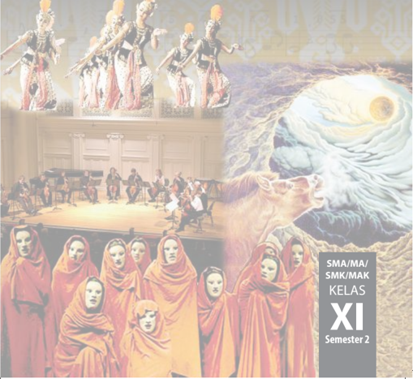

> **Deskripsi Visual:** Gambar ini adalah ilustrasi yang menampilkan tiga bagian berbeda dari sebuah proyek atau acara. Di bagian atas, ada tiga figur yang tampak seperti penari tradisional dengan kostum berwarna-warni dan topi. Di bagian tengah, terdapat sekelompok orang yang tampak sedang bermain musik di atas panggung, dengan instrumen seperti gitar dan drum. Di bagian bawah, terdapat beberapa orang yang dikenakan pakaian merah dan berdiri di depan panggung. Gambar ini juga memiliki teks yang menyatakan "SMA/MA/ SMK/MAK KELAS XI Semester 2", yang menunjukkan bahwa gambar ini mungkin merupakan bagian dari materi pelajaran untuk kelas XI di sekolah-sekolah tersebut.

 

---
## 📄 Halaman 2

Disklaimer: Buku  ini  merupakan  buku  siswa  yang  dipersiapkan  Pemerintah  dalam  rangka implementasi Kurikulum 2013. Buku siswa ini disusun dan ditelaah oleh berbagai pihak di bawah koordinasi  Kementerian  Pendidikan  dan  Kebudayaan,  dan  dipergunakan  dalam  tahap  awal penerapan Kurikulum 2013. Buku ini merupakan 'dokumen hidup' yang senantiasa diperbaiki, diperbaharui,  dan  dimutakhirkan  sesuai  dengan  dinamika  kebutuhan  dan  perubahan  zaman. Masukan  dari  berbagai  kalangan  yang  dialamatkan  kepada  penulis  dan  laman  http://buku. kemdikbud.go.id  atau  melalui  email  buku@kemdikbud.go.id  diharapkan  dapat  meningkatkan kualitas buku ini.

### Katalog Dalam Terbitan (KDT)

Indonesia. Kementerian Pendidikan dan Kebudayaan.

Seni Budaya / Kementerian Pendidikan dan Kebudayaan.-- . Edisi Revisi Jakarta: Kementerian Pendidikan dan Kebudayaan, 2017.

vi, 122 hlm. : ilus. ; 25 cm.

Untuk SMA/MA/SMK/MAK Kelas XI Semester 2 ISBN 978-602-427-142-8 ( jilid l engkap) ISBN 978-602-427-146-6 ( jilid 2b)

- Seni Budaya -- Studi dan Pengajaran
I. Judul

II. Kementerian Pendidikan dan Kebudayaan

600

Penulis

:  Sem Cornelyoes Bangun, Siswandi, Tati Narawati, dan Jose Rizal Manua.

Penelaah

:  M. Yoesoef, Bintang Hanggoro Putra, Eko Santoso, Nur Sahid, Rita Milyartini, Dinny Devi Triana, Djohan, Muksin, Widia Pekerti, dan Fortunata Tyasrinestu.

Pereview Guru

: Drs. Yusminarto

Penyelia Penerbitan : Pusat Kurikulum dan Perbukuan, Balitbang, Kem en dikbud.

Cetakan Ke-1, 2014 ISBN 978-602-282-460-2 (jilid 2) Cetakan Ke-2, 2017 (Edisi Revisi)

Disusun dengan huruf Minion Pro, 10 pt.

 

---
## 📄 Halaman 3

### Kata Pengantar

Proses  globalisasi  yang  sedang  dan  sudah  berlangsung  dewasa  ini  secara  faktual  telah  menjangkau kawasan budaya di seluruh dunia sebagai satu kesatuan wilayah hunian manusia dengan kriteria dan ukuran yang relatif sama dan satu. Budaya global yang relatif telah menjadi ukuran dan menandai konstelasi dunia dewasa  ini,  yaitu  karakteristik  budaya  yang  berorientasi  pada  nilai-nilai  ilmu  pengetahuan,  teknologi  dan seni yang bersumber dari pemikiran rasional silogistis Barat. Proses tersebut mengakibatkan terjadinya tarik menarik antara kekuatan global disatu sisi dan pertahanan lokal di sisi lainnya. Dalam hal ini antara proses globalisasi  yang  berorientasi  dan  tunduk  pada  sistem  dan  semangat  ilmu  pengetahuan  dan  teknologi  Barat versus pelokalan yang pada umumnya justru sebaliknya. Batas antara keduanya memang tidak pernah dapat diambil secara tegas hitam-putih. Roberston (1990) menggambarkannya sebagai the global instutuationalization of  life-world  and  the  lokalization  of  globality .

Berbagai  upaya  kompromistis  dilakukan  agar  masyarakat  memiliki  kekuatan  untuk  berada  di  kedua posisi sekaligus untuk berada pada titik keseimbangan antara kedua posisi tersebut. Berbagai upaya dilakukan untuk membangkitkan dan memberdayakan system indigenous knowledge, indigenous technology, indigenous art, indigenous wisdom , yang biasanya kurang atau tidak ilmiah tetapi justru kaya atau kental kandungan nilai etika  dan  estetika  yang  berakar  pada  budaya  masyarakat  pendukungnya.  Pengkajian  terhadap  pengetahuan lokal  secara  ilmiah  akan  memperkaya  pengetahuan  dengan  derajat  kandungan  nilai-nilai  humanitas  yang relatif  tinggi.

Di  tengah  pusaran  pengaruh  hegemoni  global  tersebut,  fenomena  di  bidang  pendidikan  yang  terjadi juga  telah  membuat  lembaga pendidikan serasa kehilangan ruang gerak. Selain itu, juga membuat semakin menipisnya  pemahaman  siswa  tentang  sejarah  lokal  serta  tradisi  budaya  di  lingkungannya.  Padahal,  dari perspektif  kultural  tidak  dapat  disangkal  Indonesia  memiliki  kekayaan  kebudayaan  lokal  yang  luar  biasa. Junus  Melalatoa  (1995)  telah  mencatat,  sekurang-kurangnya  540  suku  bangsa  di  Indonesia  yang  masingmasing memiliki dan mengembangkan tradisi atau pola kebudayaan lokal yang saling berbeda. Dalam pada itu pola-pola kebudayaan tersebut juga berubah sebagai reaksi terhadap dominannya pengaruh budaya global. Reaksi balik tersebut bukan untuk melawan tetapi mencari titik temu dalam rangka menjaga eksistensi dan identitas kelompok dan kebudayaan lokal mereka. Salah satu upaya untuk menjaga eksistensi dan penguatan budaya, dilaksanakan melalui pendidikan seni yang syarat dengan muatan nilai kearifan lokal dan penguatan karakter bangsa. Sudah tentu sebagai suatu proses pendidikan dilaksanakan secara sistemik yang berlangsung secara bertahap berkesinambungan dalam situasi dan kondisi di lingkungan keluarga, sekolah, dan masyarakat. Oleh sebab itu, tidaklah salah jika pendidikan merupakan salah satu arah dari Millennium Development Goals (MDGs). ( www.unmillenniumproject.org/goals & https://id.wikipedia.org/wiki/Tujuan_Pembangunan )

Pendidikan  sebagai  wahana  untuk  memanusiakan  manusia  muda  pada  dasarnya  merupakan  aktivitas menyiapkan  kehidupan  baik  perorangan,  masyarakat,  maupun  suatu  bangsa  menuju  kehidupan  yang  lebih baik. Untuk menuju kehidupan yang lebih baik di era globalisasi dan menyiapkan generasi emas Indonesia di tahun 2040, pendidikan karakter yang berbasis kearifan lokal sebagai penanaman nilai dan ketahanan budaya bangsa sangat diperlukan. Penanaman nilai di kalangan generasi muda saat ini dipandang penting mengingat tantangan  yang  dihadapi  mereka  di  masa  depan  sangat  berat,  terutama  berkaitan  dengan  pergeseran  nilai yang akan, sedang, dan sudah terjadi baik dalam keluarga maupun dalam masyarakat.

Terkait  hal  tersebut,  kiranya  diperlukan  materi  bahan  ajar  yang  dapat  mengakomodasi  kebutuhan pendidikan  bagi  generasi  muda  yang  sedang  mengarungi  masa  globalisasi,  agar  memiliki  pegangan  hidup dalam bermasyarakat dan bernegara dalam lingkungan lokal maupun global. Buku ini menawarkan berbagai contoh  metode  dan  pendekatan  pendidikan  seni  (rupa,  musik,  tari,  teater)  Indonesia  berbasis  Kurtilas. Walaupun belum sempurna, harapan kami semoga buku ini menjadi pelita di tengah gulita.

Penulis Tati  Narawati Sem Cornelius Siswandi

Jose  Rizal  Manua

 

---
## 📄 Halaman 4

### Daftar Isi

 

---
## 📄 Halaman 7

### PAMERAN SENI RUPA

Pameran adalah salah satu bentuk penyajian karya seni rupa agar dapat berkomunikasi dengan pengunjung. Makna komunikasi di sini, berarti, karya-karya seni rupa yang dipajang tersaji dengan baik, sehingga para pemirsa dapat mengamatinya dengan nyaman untuk mendapatkan pengalaman estetis dan pemahaman nilai-nilai seni. Untuk itu, diperlukan pengetahuan manajemen tata pameran. Mulai dari proses perencanaan, pengorganisasian, pengarahan, dan pengendalian. untuk mencapai penyelenggaraan pameran yang baik. Pameran untuk tingkat sekolah dapat diselenggarakan setiap semester,  atau  paling  tidak  pada  setiap  awal  tahun  ajaran.  Sebab  diperkirakan,  pada  awal  tahun ajaran,  orang  tua  dan  siswa  baru  akan  menjadi  pengunjung  pameran,  di  samping  warga  tetap sekolah dan tamu undangan lainnya. Hal yang perlu dihindari adalah penyelenggaraan pameran seni rupa pada waktu libur, karena pengunjungnya akan relatif sedikit. Sedangkan pameran yang pengunjungnya sedikit tentu bukanlah pameran yang baik.

### A.  Panitia Pameran

Untuk mencapai tujuan pameran kita perlu bekerjasama dan membagi tugas sesuai kebutuhan (sangat tergantung dari apa yang dipamerkan, di mana pameran diselenggarakan, dan siapa yang akan menyaksikan pameran tersebut).

---
**🖼️ Gambar/Diagram**

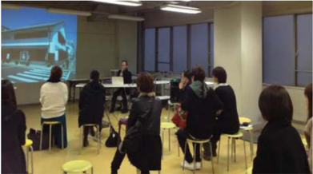

> **Deskripsi Visual:** Gambar ini menunjukkan sebuah pertemuan atau seminar di sebuah ruangan dengan dinding berwarna biru. Di depan ruangan terdapat sebuah proyektor yang sedang menampilkan gambar sebuah bangunan modern. Sebuah papan tulis berwarna putih terletak di belakang proyektor, di mana beberapa orang tampak sedang berbicara atau mendengarkan. Beberapa peserta terlihat sedang berdiri atau duduk di kursi plastik. Di sebelah kanan, ada beberapa orang yang tampak sedang berbicara atau mendengarkan. Di sebelah kiri, ada beberapa orang yang tampak sedang berbicara atau mendengarkan. Di sebelah kanan, ada beberapa orang yang tampak sedang berbicara atau mendengarkan. Di sebelah kiri, ada beberapa orang yang tampak sedang berbicara atau mendengarkan. Di sebelah kanan, ada beberapa orang yang tampak sedang berbicara atau mendengarkan. Di sebelah kiri, ada beberapa orang yang tampak sedang berbicara atau mendengarkan. Di sebelah kanan, ada beberapa orang yang tampak sedang berbicara atau mendengarkan. Di sebelah kiri, ada beberapa orang yang tampak sedang berbicara atau mendengarkan. Di sebelah kanan, ada beberapa orang yang tampak sedang berbicara atau mendengarkan. Di sebelah kiri, ada beberapa orang yang tampak sedang berbicara atau mendengarkan. Di sebelah kanan, ada beberapa orang yang tampak sedang berbicara atau mendengarkan. Di sebelah kiri, ada beberapa orang yang tampak sedang berbicara atau mendengarkan. Di sebelah kanan, ada beberapa orang yang tampak sedang berbicara atau mendengarkan. Di sebelah kiri, ada beberapa orang yang tampak sedang berbicara atau mendengarkan. Di sebelah kanan, ada beberapa orang yang tampak sedang berbicara atau mendengarkan. Di sebelah kiri, ada beberapa orang yang tampak sedang berbicara atau mendengarkan. Di sebelah kanan, ada beberapa orang yang tampak sedang berbicara atau mendengarkan. Di sebelah kiri, ada beberapa orang

Sumber:

Art Fair Tokyo

 

---
## 📄 Halaman 8

Dengan demikian, volume pekerjaanlah yang akan menentukan jumlah dan susunan panitia. Biasanya, untuk tingkat sekolah, struktur panitia yang sederhana sudah memadai. Terdiri dari ketua, sekretaris,  bendahara,  dan  sejumlah  seksi-seksi:  ada  yang  mengurusi  materi  pameran  (misalnya, lukisan,  karya  desain,  kria),  display  atau  kelompok  kerja  pemajangan  karya,  penata  cahaya (mengurusi  pencahayaan  karya  dan  ruang  pameran).  Pembuatan  katalog  (kelompok  kerja  yang mengurusi data karya, biografi penyelenggara, desain dan layout, pencetakan) kuratorial (penulisan naskah yang memberikan informasi tentang karya-karya yang dipamerkan dan dimuat di katalog). Pembuatan  label  (informasi  singkat  mengenai  materi  pameran:  judul,  tahun  penciptaan,  media, ukuran, pencipta). Di samping itu ada juga seksi sponsor atau pencarian dana, sekaligus bertugas mencari pembicara dari kalangan perupa pada kegiatan diskusi (diskusi biasanya dilaksanakan satu hari menjelang hari penutupan pameran), termasuk memilih 'tokoh' yang meresmikan pembukaan pameran.  Seksi  dokumentasi,  publikasi  (pembuatan  poster,  spanduk),  konsumsi,  perlengkapan, keamanan, dan seksi acara, baik dalam pembukaan pameran, pelaksanaan diskusi, dan penutupan pameran.  Seksi  lain  yang  diperlukan  dapat  ditambahkan  pada  struktur  panitia  pameran  sesuai kebutuhan. Untuk menjalankan tugas-tugas kepanitiaan, administrasi, rapat, dan kegiatan lainnya, diperlukan ruangan khusus sebagai kantor atau ruang kerja panitia pameran.

### B.	 Proposal	Pameran

Banyak format penulisan proposal yang dapat digunakan, namun pada hakikatnya, inti dari proposal ialah latar belakang pameran, dasar acuan kegiatan pameran, tujuan pameran, hasil dan dampak  pameran  yang  diharapkan,  tema  pameran,  waktu  dan  tempat,  tata  tertib  dan  lain-lain. Biasanya  proposal  dibuat  untuk  kepentingan  mendapatkan  izin  kegiatan,  dari  pihak  sekolah/ keamanan,  pencarian  sponsor,  informasi  bagi  orang  tua  siswa,  informasi  bagi  pers,  dan  pihakpihak lain yang menjadi mitra kerja penyelenggaraan pameran. Oleh karena itu kualitas penulisan dan tampilan suatu proposal pameran usahakan seoptimal mungkin, untuk mendapatkan simpati dan dukungan dari berbagai kalangan.

### C.	 Materi	Pameran

Materi pameran seni rupa di sekolah terdiri dari tiga sumber. Pertama, koleksi karya tugas-tugas siswa terbaik. Karya seni rupa dua dan tiga dimensi hasil modifikasi (seni lukis, desain, dan kria atau karya yang lain) yang dipilih oleh guru dan dikoleksi selama 1 semester. Kedua, karya-karya hasil modifikasi yang dibuat siswa atas kehendak sendiri, di luar tugas yang diberikan oleh guru di sekolah. Dan yang ketiga, karya-karya siswa yang memenangkan lomba kesenirupaan (seni lukis, desain, kria, logo, animasi, dan lain-lain) baik dalam tingkat lokal, nasional, maupun internasional, yang pernah diraih oleh siswa yang sedang belajar efektif di sekolah yang mengadakan pameran.

Hendaknya materi pameran mencerminkan juga perkembangan kebudayaan masa kini, dimana karya-karya seni rupa telah menggunakan media dan teknologi baru, yang telah dipraktikkan oleh sebagian  siswa  (khususnya  para  siswa  yang  bersekolah  di  kota-kota  besar  Indonesia),  yakni  seni di  zaman elektronik, (mungkin belum diajarkan di sekolah). Seperti computer art , video art , web art , vector  art , digital  painting ,  dan  lain-lain,  sehingga  pengunjung  pameran  mendapatkan  sajian yang baru dengan wawasan seni masa kini.

 

---
## 📄 Halaman 9

Sumber:

Art 12 Jog, 2012

Gambar 1.2 Krisna Murti feat, Katerina Valdivia Bruch, Lotus Story , 2012, video 00:03': 12' .

### D.	 Kurasi	Pameran

Kurasi  pameran  biasanya  ditulis  kurator  seni  rupa,  guru  seni  budaya  (seni  rupa),  dan  dapat pula  ditulis  oleh  siswa  yang  berbakat  menulis  kritik  seni.  Penulisan  informatif  tentang  koleksi materi  pameran  (seni  lukis,  seni  grafis,  desain,  kria,  dan  lain-lain)  agar  mudah  dipahami  oleh pengunjung pameran. Baik dari aspek konseptual, aspek visual, aspek teknik artistik, aspek estetik, aspek fungsional, maupun aspek nilai seni, desain, atau kria yang dipamerkan.

Ketika menyaksikan dan mengamati karya seni di ruang pameran, adakalanya para pengunjung tidak mengerti atau bingung melihat objek seni tertentu. Nah, pada saat yang demikian dia dapat membuka  katalog  pameran,  untuk  mendapatkan  informasi  tentang  karya  seni  tertentu  (seperti yang dijelaskan oleh seorang kurator pameran).

---
**🖼️ Gambar/Diagram**

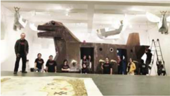

> **Deskripsi Visual:** Gambar ini adalah ilustrasi yang menunjukkan sebuah proyek bangunan di sebuah sekolah. Gambar ini menggambarkan sebuah struktur bangunan yang tampak seperti sebuah kapal tempur dengan eksterior yang dibuat dari kayu. Struktur tersebut memiliki bentuk yang unik dengan desain yang menyerupai kapal tempur, termasuk atap berbentuk seperti sayap kapal tempur dan bagian bawah yang mirip dengan bagian bawah kapal tempur.

Elemen utama dalam gambar ini meliputi struktur bangunan yang dibuat dari kayu, dua orang guru yang sedang memandu anak-anak dalam proyek ini, dan latar belakang yang menunjukkan ruangan sekolah dengan meja dan kursi. Guru dan anak-anak tampak sangat antusias dalam proyek ini, menunjukkan bahwa mereka sedang bekerja sama untuk menciptakan struktur bangunan yang unik.

Teks, angka, atau label penting tidak terlihat dalam gambar ini karena gambar hanya menggambarkan struktur bangunan dan orang-orang yang terlibat dalam proyek tersebut. Namun, informasi kunci yang dapat diambil dari gambar ini adalah bahwa anak-anak sedang bekerja sama dengan guru untuk menciptakan struktur bangunan yang unik menggunakan kayu.

Dalam paragraf ini, saya telah menjelaskan gambar tersebut dengan detail tentang apa yang ditampilkan secara keseluruhan, elemen-elemen utama dan relasinya, teks, angka, atau label penting yang terlihat, serta informasi kunci yang dapat diambil pembaca.

Sumber:

Venice Art

Biennalle 2015

Gambar 1.3 Perupa Heri Dono berdiri (kiri) dengan pengunjung pamerannya di depan ' Voyage ' (globalisasikuda trojan) di Venice Biennale, Itali. Pameran Seni Internasional yang diselenggarakan setiap dua tahunan.

 

---
## 📄 Halaman 10

---
**🖼️ Gambar/Diagram**

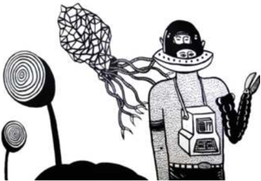

> **Deskripsi Visual:** Gambar ini adalah ilustrasi yang menunjukkan seorang karakter robot berjalan dengan sepatu yang memiliki bentuk seperti tumbuhan. Robot tersebut mengenakan topi berwarna putih dan memegang sebuah alat yang tampak seperti mikroskop. Di sebelah kiri, ada dua bunga yang tampak seperti kacang, satu di atas dan satu di bawah. Bunga-bunga tersebut tampak seperti tumbuhan yang telah berkembang dari sepatu robot tersebut. Ilustrasi ini mungkin digunakan untuk membahas konsep pertumbuhan atau perkembangan teknologi, serta hubungan antara teknologi dan alam.

Sumber: http://m.kaskus. co.id/

Gambar 1.4 Eko Nugroho, Multicrisis-is-Delicious . Visualisasi gaya komik yang kreatif, unik, kritis, artistik dan fantastik. Karya seperti ini, juga karya Heri Dono di atas, perlu dijelaskan oleh seorang kurator, sehingga para pengunjung pameran dapat mengapresiasinya dengan baik

Fungsi seorang kurator antara lain menganalisis berbagai faktor keunggulan seni yang dipamerkan, di  samping  menunjukkan  pula  kecenderungan  kreatif  peserta  pameran,  baik  untuk  bidang  seni lukis,  desain,  atau  kria.  Sehingga  pengunjung  mendapatkan  bahan  banding  untuk  mengapresiasi karya  yang  diamatinya.  Artikel  kurasi  pameran  dimuat  dalam  katalog  pameran,  sehingga  isinya menjadi topik bahasan yang menarik dalam aktivitas diskusi yang bakal dilaksanakan.

### E.	 Aktivitas	Diskusi

Kegiatan  diskusi  diselenggarakan  sebagai  rangkaian  kegiatan  pameran.  Tujuannya  adalah pengembangan  wawasan  dan  sikap  apresiatif.  Bagi  penyelenggara  adalah  ajang  evaluatif (mendapatkan masukan dari peserta diskusi) dan sekaligus sebagai peluang menjelaskan gagasan dan tujuan seni yang diciptakannya, alias pertanggunggjawaban karya.

Sebagai  pembicara  utama,  biasanya  dipilih  pengkritik  seni  rupa,  atau  tokoh  lain  yang dipandang layak karena keahliannya telah diakui di tengah masyarakat. Pembicara menyampaikan makalah sebagai topik kajian diskusi (makalah dibagikan kepada semua peserta). Diskusi dipandu oleh  moderator  (yang  berwawasan  seni  baik),  bisa  oleh  siswa,  perupa,  atau  guru  seni  budaya. Kegiatan  diskusi  dikelola  oleh  panitia  pameran,  dan  didokumentasikan  dalam  bentuk  cacatan tertulis,  audio,  foto,  video,  atau  film,  sesuai  kemampuan  panitia  pameran.

### F. Nilai	Pameran

Aktivitas pameran seni rupa murni, desain, dan kria adalah bagian akhir dari suatu kegiatan pembelajaran. Dalam kegiatan pameran terdeteksi potensi kesenirupaan setiap sekolah. Mungkin sekolah tertentu kuat dalam hal seni lukis, sementara sekolah lain menonjol dalam aktivitas desain, dan yang lain lagi menghasilkan karya-karya kria yang mengagumkan. Atau prestasi bisa jadi variasi dari  ketiga  bidang  seni  rupa  itu.  Namun  yang  lebih  penting  dipahami  dalam  arti  pembelajaran seni budaya, pameran adalah melatih kemampuan siswa bekerja sama, berorganisasi, berpikir logis, bekerja  efesien  dan  efektif  dalam  penyelenggaraan  pameran  seni  rupa.  Sehingga  nilai  pameran, tujuan,  sasaran,  dan  tema  pameran  tercapai  dengan  baik.  Bila  hal  ini  terjadi,  guru  seni  budaya dengan sendirinya memberikan nilai 'sangat memuaskan' atau nilai A.

 

---
## 📄 Halaman 11

### MENGANALISIS PERENCANAAN, PELAKSANAAN, DAN PELAPORAN PAMERAN KARYA SENI RUPA

### A.  Perencanaan

Sebelum menyelenggarakan pameran seni rupa, kita perlu membuat perencanaan yang baik. Pertama, kita  harus  membentuk panitia pameran seni rupa, yang diwakili oleh siswa-siswi kelas 11,  (bisa  satu  kelas  atau  lebih,  tergantung  jumlah  kelas  11  di  sekolah  ini).

Sumber: google.co.id

Gambar 2.1 Kiri: Seni Kontemporer. Tengah: Gambar Potret. Kanan: Seni Keramik

Dalam pembentukan panitia kita perlu menerapkan sikap profesional, teman yang mempunyai minat  dan  bakat  seni  lukis  didudukkan  sebagai  orang  yang  tepat  mengelola  seksi  seni  lukis. Demikian juga untuk bidang desain dan seni kria, harus dipilih siswa-siswi yang menonjol dalam cabang  seni  tersebut.  Jadi,  sudah  menjadi  keharusan  setiap  orang  menempati  posisi  yang  tepat dalam  struktur  kepanitiaan.  Dengan  demikian  pameran  seni  rupa  yang  diselenggarakan  akan terkelola  dan  terlaksana  dengan  baik.

Misalnya kedudukan ketua, sekretaris, bendahara, dan seksi-seksi dipilih sesuai dengan minat, bakat, dan kemampuan setiap orang menduduki jabatan tersebut. Jadi, sebaiknya dibentuk kelompokkelompok sebagai tim kerja untuk pembuatan proposal pameran, tema pameran, tujuan pameran kurator pameran, dan lain-lain (semakin rinci dan lengkap perencanaan yang dibuat semakin baik).

### B.  Pelaksanaan

Komitmen dan kerjasama kepanitiaan adalah kata kunci keberhasilan penyelenggaraan pameran seni  rupa.  Penataan  ruang  pameran,  sirkulasi  pengunjung,  pemajangan  karya,  pengaturan  tata lampu sorot, pengelompokan karya, pengaturan suhu tata ruang, sound system ,  buku tamu, buku kesan dan pesan, susunan acara peresmian pembukaan pameran, dan lan-lain. Proses pembelajaran kolaboratif  berbasis  proyek  ini  memerlukan  penerapan  pendekatan  saintifik.  Setiap  anggota  dan pengurus diberi motivasi dan fasilitas penyelenggaraan pameran oleh guru seni budaya dan kepala

BAB 2

 

---
## 📄 Halaman 12

sekolah. Selama pameran berlangsung, secara bergilir diatur siswa yang bertugas sebagai penerima tamu,  operator  musik  ruang  pameran,  pemandu  pengunjung,  seksi  konsumsi,  seksi  keamanan, dan seksi-seksi lain  yang  dipandang perlu.

### C.  Pasca Pameran

Usai  aktivitas  pameran  (biasanya  setelah  acara  penutupan  resmi  oleh  kepala  atau  wakil kepala  sekolah).  Masih  ada  pekerjaan  panitia  pameran,  misalnya  pemberian  tanda  penghargaan, pengembalian materi pameran, pembubaran panitia, dan lain-lain.

### D.  Rangkuman

Pameran karya  seni  rupa  di  sekolah  merupakan  proses  pembelajaran  untuk  menumbuhkan dan mengembangkan kemampuan berapresiasi, berorganisasi, dan memotivasi keinginan berkarya kreatif  di  bidang  seni  rupa  murni,  desain,  dan  kria.  Dengan  kegiatan  pameran  diharapkan  siswa mampu menghargai keberagaman kaidah artistik dan nilai-nilai keindahan karya seni.

### E.  Refleksi

Pameran adalah salah satu bentuk penyajian karya seni rupa agar dapat berkomunikasi dengan pengunjung. Makna komunikasi di sini adalah karya-karya seni rupa yang dipajang tersaji dengan baik, sehingga pengunjung dapat mengamatinya dengan nyaman untuk mendapatkan pengalaman estetis  dan  pemahaman nilai-nilai seni.

### F. Uji Kompetensi

- Pengetahuan pameran
- Uraikan  dengan  ringkas  pemahamanmu  tentang  perencanaan,  pelaksanaan,  dan pelaporan pameran seni rupa.
- Jelaskan  proses  kegiatan  pameran seni rupa dengan pendekatan saintifik.
- Tulis  latar  belakang  mengapa  tema  pameran  ditetapkan  dan  disepakati,  kemukakan alasan-alasan logis mengapa kamu menyetujui tema tersebut dengan baik. Kemudian uraikan manfaat aktivitas pameran seni bagi kehidupan kamu pribadi.

### 2. Sikap pameran

Panitia  pameran  mengembangkan  sikap  terbuka,  kerja  sama,  dan  menyeleksi  materi pameran secara objektif.

### 3. Ketrampilan pameran

- Amati dan catat bagaimana bentuk kerja sama pelaksanaan pameran seni rupa.
- Kemudian  kemukakan  hasil  apresiasimu  dengan  tahapan  yang  benar  untuk menyimpulkan hal-hal positif dan negatif selama pelaksanaan proyek pameran seni rupa.
- Tulis  kesimpulan  yang  objektif  manfaat  pelaksanaan  kegiatan  diskusi  secara  umum. Kemudian, tulis manfaat nyata bagi saudara pribadi dan kemukakan kekurangan yang ada untuk perbaikan kegiatan pameran yang akan datang.

 

---
## 📄 Halaman 13

---
**📊 Tabel**

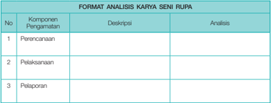

Tabel ini berisi format analisis karya seni rupa yang mencakup tiga komponen utama: Perencanaan, Pelaksanaan, dan Pelaporan. Setiap komponen memiliki deskripsi singkat dan ruang untuk analisis. Topik utama tabel ini adalah proses pengembangan karya seni rupa, yang melibatkan perencanaan strategis, implementasi praktis, dan penilaian akhir. Kolom "Pengamatan" menyediakan ruang untuk mengevaluasi setiap komponen dengan detail, sementara kolom "Deskripsi" memberikan gambaran umum tentang setiap komponen. Data penting yang terlihat adalah bahwa setiap komponen memiliki ruang untuk analisis, menunjukkan bahwa analisis ini fokus pada pemahaman mendalam tentang setiap aspek karya seni rupa.

 

---
## 📄 Halaman 14

### BAB 3

### MENGANALISIS KONSEP, PROSEDUR, FUNGSI, TOKOH, DAN NILAI ESTETIS KARYA SENI RUPA

Pengertian  analisis  dalam  konteks  apresiasi  adalah  pengkajian  yang  cermat  terhadap  karya seni  rupa  untuk  mengetahui  keberadaan  karya  yang  sebenarnya.  Penelaahan  secara  mendalam dilakukan dengan cara menguraikan masalah pokok dengan bagian-bagian karya seni, termasuk hubungan antar  bagian  dengan  keseluruhan,  sehinggga  kita  memperoleh  kesimpulan  yang  tepat ketika  mengkaji karya seni rupa.

### A. Konsep

Dalam  menganalisis  karya  seni  rupa  aspek  konsep  berkaitan  dengan  aktivitas  pengamatan karya  seni  untuk  menemukan  sumber  inspirasi,  interes  seni,  interes  bentuk,  penerapan  prinsip estetik,  dan  pengkajian  aspek  visual,  seperti  struktur  rupa,  komposisi,  dan  gaya  pribadi.

### B.  Prosedur

Aspek teknis berhubungan dengan proses kreasi, langkah-langkah kerja kreatif yang ditempuh seorang  perupa  untuk  menghasilkan  suatu  karya.  Baik  untuk  seni  rupa  murni,  desain  dan  kria. Dalam pembuatan desain  logo  misalnya,  tahapan  kerja  dari  penemuan  gagasan,  alternatif  skets, gambar, simbol, teks, komposisi, warna, teknis, proses kreasi, sampai tercipta sebuah logo (inilah yang kita sebut prosedur kerja kreatif).

Sumber: http://archive.ivaaonline.org Sarnadi Adam,

Gambar 3.1 Pohon Merah dan Bakul, cat minyak pada kanvas. Menunjukkan struktur visual, komposisi dan gaya pribadi yang khas.

 

---
## 📄 Halaman 15

Sumber: google.co.id

---
**🖼️ Gambar/Diagram**

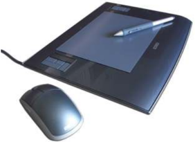

> **Deskripsi Visual:** Gambar ini menunjukkan sebuah tablet grafis dengan penanda (stylus) dan mouse. Tablet grafis berukuran besar, berwarna hitam dengan panel display yang menunjukkan ukuran skala dan garis. Penanda berwarna putih dengan ujung merah, digunakan untuk menggambar atau menulis pada tablet. Mouse berwarna hitam dengan desain modern, memiliki fungsi untuk menggerakkan gambar di tablet. Elemen-elemen ini saling terkait dalam penggunaan tablet grafis, dimana penanda digunakan untuk menggambar atau menulis, sementara mouse digunakan untuk menggerakkan gambar di tablet. Teks, angka, atau label penting tidak terlihat dalam gambar ini. Informasi kunci yang dapat diambil pembaca adalah bahwa ini adalah perangkat yang digunakan untuk menggambar atau menulis digital.

### C.  Fungsi

Fungsi seni pada hakikatnya adalah manfaat seni pada konteks tertentu. Misalnya, seni bagi perupa murni adalah media ekspresi, sementara bagi apresiator adalah sarana untuk mendapatkan pengalaman estetis dan nilai seni. Sedangkan fungsi seni bagi perupa terapan adalah penciptakan benda guna yang estetis. Dalam konteks masyarakat seni terapan berfungsi memenuhi kebutuhan benda fungsional yang indah.

### D.  Tokoh

Pengenalan  akan  tokoh-tokoh  perupa  murni  (pelukis,  pepatung,  pegrafis)  dalam  lingkup lokal,  nasional,  dan  internasional  adalah  penting  dalam  meningkatkan  kemampuan  berapresiasi seni.  Siswa  diminta  membuat  kliping  atas  tokoh  yang  dipilih  dan  disepakati  bersama  oleh  siswa dan  guru.  Tujuannya  untuk  mendapatkan  informasi  tentang  ketokohan,  reputasi,  dan  kontribusi tokoh  bagi  masyarakat,  bangsa,  dan  kemanusiaan  pada  umumnya.  Hal  ini  dimaksudkan  untuk

Gambar 3.3 Tablet Grafis. Pada saat ini, banyak para pelukis menggunakan tablet grafis untuk menciptakan digital painting , pada umumnya mereka tidak menggunakan mouse lagi ketika berkarya.

 

---
## 📄 Halaman 16

mengembangkan rasa empati, sehingga kepekaan dan pengetahuannya dapat memicu rasa kagum akan prestasi dan jasa-jasa para seniman (dan budayawan) berdasarkan bukti-bukti kualitas karya seni  dan  pengakuan yang diberikan tokoh tertentu.

### E.  Nilai Estetis

Nilai estetis secara teoretis dibedakan menjadi (1) objektif/intrinsik dan (2) subjektif/ekstrinsik . Nilai objektif khusus mengkaji gejala visual karya seni, aktivitas ini mendasarkan kriteria ekselensi seni pada kualitas integratif tatanan formal karya seni. Sedangkan nilai subjektif kita peroleh dari pengalaman mengamati karya seni, misal-nya tentang 'pesan seni' dan nilai keindahan berdasarkan reaksi  dan  respons  pribadi  kita  sebagai  pengamat.

 

---
## 📄 Halaman 17

### MEMAMERKAN KARYA SENI RUPA DUA DAN TIGA DIMENSI HASIL MODIFIKASI

### A. Klasifikasi Materi Pameran

Aktivitas pengklasifikasian materi seni rupa secara sistematis menurut aturan atau kaidah jenis seni rupa yang akan dipamerkan. Misalnya, pengelompokan berdasarkan seni lukis, seni patung, seni grafis, desain tekstil, keramik, dan lain-lain dilaksanakan dengan pertimbangan kriteria yang telah disepakati. Pada gambar di bawah ini diperlihatkan kelompok karya seni lukis yang sealiran, sehinga suasananya tampak harmonis.

---
**🖼️ Gambar/Diagram**

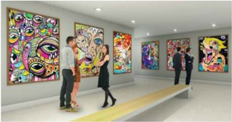

> **Deskripsi Visual:** Gambar ini adalah ilustrasi yang menunjukkan sebuah galeri seni dengan berbagai lukisan modern dan kontemporer. Galeri ini memiliki lantai putih dan dinding yang dipenuhi dengan lukisan berwarna-warni dan desain yang unik. Di tengah ruangan, ada tiga orang pengunjung yang sedang melihat lukisan. Mereka tampak tertarik dan berbicara tentang lukisan tersebut. Lukisan-lukisan di sepanjang dinding terlihat sangat kreatif dan beragam, mencerminkan gaya seni modern. Ilustrasi ini menunjukkan bagaimana seni modern dapat menjadi objek yang menarik bagi pengunjung dan bagaimana lukisan dapat menjadi media untuk diskusi dan interaksi sosial.

Sumber: Apresiasi Seni

Gambar 4.1 Karya seni lukis sejenis dan sealiran dipajang berdampingan mengisi ruang pameran. Tingkat ketinggian pemasangan karya disesuaikan dengan rata-rata tinggi pengunjung pameran. Sehingga mereka dapat menikmati karya seni lukis dengan nyaman.

 

---
## 📄 Halaman 18

### B.  Seleksi Materi Pameran

Tim  penyeleksi  materi  pameran  terdiri  dari  guru  seni  budaya,  seksi  seni  rupa  murni,  seksi desain, seksi kria, akan menetapkan kriteria dan melakukan seleksi berdasarkan kriteria tersebut, sehingga akan terkumpul materi pameran yang benar-benar layak dipamerkan.

Selanjutnya semua karya yang telah dikelompokkan harus dicatat dokumennya: nama perupa, judul,  tahun  penciptaan,  media,  ukuran,  untuk  kepentingan  informasi  di  katalog  dan  pelabelan karya di ruang pameran.

---
**🖼️ Gambar/Diagram**

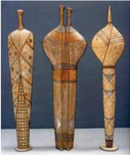

> **Deskripsi Visual:** Gambar ini adalah ilustrasi yang menunjukkan tiga alat tradisional yang tampaknya digunakan untuk memotong atau menggiling bahan-bahan. Setiap alat memiliki bentuk dan ukuran yang berbeda, dengan satu alat memiliki bentuk seperti pipa, alat tengah memiliki bentuk seperti pipa yang lebih pendek dan lebar, dan alat yang paling panjang memiliki bentuk seperti pipa yang lebih lebar dan tinggi. Semua alat tersebut tampaknya dibuat dari kayu dan memiliki pola atau motif yang unik di permukaan mereka. Teks, angka, atau label penting tidak terlihat pada gambar ini. Informasi kunci yang dapat diambil pembaca adalah bahwa gambar ini mungkin digunakan untuk membantu pembaca memahami bagaimana alat-alat tradisional tersebut digunakan dalam proses memotong atau menggiling bahan-bahan.

Sumber: Apresiasi Seni

Penilaian  ketrampilan  teknis  adalah  mengukur  seberapa  jauh  peserta  didik  memperlihatkan kemampuan  untuk  menangani  dengan  terampil  ciri-ciri  teknis  materi  yang  digunakan.Apakah bentuk-bentuk  dan  warna-warnanya  terolah  secara  tepat  sehingga  berfungsi  sebagai  media ekspresi.  Penilaian  estetik  dinilai  berdasarkan  apakah  peserta  didik  telah  menyadari  adanya pengorganisasian  bentuk  dan  warna  secara  estetis.  Sampai  di  mana  imajinasi  kreatif  anak  yang tampak pada karyanya.  Apakah  peserta  didik  telah  menggunakan  materi  secara  baru  dan  segar. Apakah  karyanya  mencerminkan  pandangan  yang  asli  dan  mendalam.  Apakah  karya  itu  secara tepat dan kreatif merupakan visualisasi dari imajinasi subjektifnya, terutama untuk peserta didik yang bergaya non realistis.

 

---
## 📄 Halaman 19

Seleksi  materi  pameran  dapat  diklasifikan  berdasarkan  pengelompokan  karya-karya  yang firuratif  dan  non  figuratif.  Selanjutnya  dikelompokkan berdasarkan konsep dan aliran karya seni lukis.  Misalnya  karya  realis,  naturalis,  surealis,  dekortif,  abstak,  dan  seterusnya.  Pada  gambar  di bawah ini dapat dilihat contoh pengelompokkan karya yang beraliran surealis.

---
**🖼️ Gambar/Diagram**

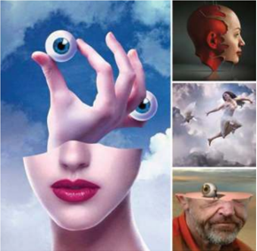

> **Deskripsi Visual:** Gambar ini adalah ilustrasi yang menampilkan empat karakter dengan gaya seni yang unik dan eksploratif. Setiap karakter memiliki bentuk tubuh manusia yang tidak biasa, dengan wajah yang tampak seperti bagian dari tubuh mereka sendiri. Karakter pertama memiliki wajah yang besar dengan satu mata besar dan satu telinga kecil, yang tampak seperti bagian dari tubuhnya. Karakter kedua memiliki wajah yang lebih kecil dengan satu mata besar dan satu telinga kecil yang tampak seperti bagian dari tubuhnya. Karakter ketiga memiliki wajah yang lebih kecil dengan satu mata besar dan satu telinga kecil yang tampak seperti bagian dari tubuhnya. Karakter keempat memiliki wajah yang lebih kecil dengan satu mata besar dan satu telinga kecil yang tampak seperti bagian dari tubuhnya.

Elemen-elemen utama dalam gambar ini adalah karakter yang memiliki bentuk tubuh manusia yang tidak biasa dan wajah yang tampak seperti bagian dari tubuh mereka sendiri. Relasi antara karakter ini adalah bahwa semua karakter memiliki bentuk tubuh manusia yang tidak biasa dan wajah yang tampak seperti bagian dari tubuh mereka sendiri. Teks, angka, atau label penting yang terlihat dalam gambar ini adalah karakter yang memiliki bentuk tubuh manusia yang tidak biasa dan wajah yang tampak seperti bagian dari tubuh mereka sendiri.

Informasi kunci yang dapat diambil pembaca dari gambar ini adalah bahwa karakter ini memiliki bentuk tubuh manusia yang tidak biasa dan wajah yang tampak seperti bagian dari tubuh mereka sendiri. Ini menunjukkan bahwa karakter ini memiliki gaya seni yang unik dan eksploratif.

### C.  Kurasi Pameran

Kurasi pameran ditulis oleh kurator (guru seni budaya, kurator tamu, atau siswa yang berbakat dan  kompeten  dalam  kritik  seni).  Pada  umumnya  inti  sebuah  kurasi  adalah  menjelaskan  karya seni,  baik  konsep,  jenis,  bentuk,  kategori,  dan  kualitas  materi  pameran  yang  diselenggarakan.

Hasil  kurasi  biasanya  berupa  tulisan  yang  dimuat  di  katalogus  pameran.  Kurator  disarankan menggunakan bahasa  indonesia  yang  komunikatif,  sehingga  para  pengunjung  dapat  memahami materi pameran dan mengapresiasinya dengan baik.

 

---
## 📄 Halaman 20

---
**🖼️ Gambar/Diagram**

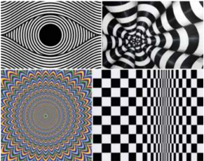

> **Deskripsi Visual:** Gambar ini adalah ilustrasi yang menunjukkan berbagai jenis efek optik. Gambar pertama menampilkan pola putaran dengan warna hitam dan putih yang mengarah ke tengah, yang membuat mata merasa bergerak. Gambar kedua menunjukkan pola putaran yang mengarah ke tengah dengan warna hitam dan putih yang berbeda, yang juga membuat mata merasa bergerak. Gambar ketiga menunjukkan pola putaran dengan warna hitam dan putih yang berbeda, yang membuat mata merasa bergerak. Gambar keempat menunjukkan pola putaran dengan warna hitam dan putih yang berbeda, yang membuat mata merasa bergerak. Gambar kelima menunjukkan pola putaran dengan warna hitam dan putih yang berbeda, yang membuat mata merasa bergerak. Gambar keenam menunjukkan pola putaran dengan warna hitam dan putih yang berbeda, yang membuat mata merasa bergerak.

### D.  Pemajangan

Kegiatan pemajangan karya seni rupa dilaksanakan oleh tim kerja yang telah ditentukan dan dipilih berdasarkan klasifikasi dan seleksi materi pameran. Tim kerja pemajangan karya seni rupa dibagi menjadi dua kelompok, yakni Tim kerja pemajangan karya seni rupa dua dimensi dan tim kerja  pemajangan karya tiga dimensi.

Hal-hal  yang  perlu  diperhatikan  dalam  pemajangan  karya  dua  dimensi  adalah  antara  faktor keluasan  ruang  dengan  jumlah  karya  yang  dipamerkan  harus  sesuai.  Untuk  itu  pengaturan penataan panel dan penggunaan luas dinding terkait juga dengan faktor sirkulasi pengunjung dan pencahayan  karya.  Semuanya  ditata  dengan  baik  dan  estetis.  Tingkat  ketinggian  penggantungan lukisan, misalnya, harus disesuaikan dengan rata-rata tinggi pengunjung pameran, artinya seorang pengunjung tidak perlu 'mendongak' atau 'menunduk' ketika mengamati lukisan. Demikian pula faktor pencahayaan karya, tidak boleh merusak keberadaan karya, jadi fungsi pencahayaan harus mendukung kehadian karya, pencayaan jangan sampai menyilaukan bagi pengunjung pameran.

Untuk tim kerja pemajangan karya tiga dimensi perlu memikirkan faktor dimensi itu, artinya sebuah  patung,  misalnya,  tidak  dipajang  di  pojok  ruangan,  melainkan  pemajangannya  yang memungkinkan pengunjung pameran dapat melihatnya dari segala arah (360°), jadi sifat keindahan karya tiga dimensi dapat diamati dengan seoptimal mungkin.

 

---
## 📄 Halaman 21

---
**🖼️ Gambar/Diagram**

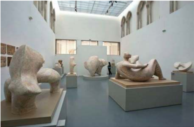

> **Deskripsi Visual:** Gambar ini menunjukkan ruang pameran seni modern dengan berbagai patung dan instalasi seni. Ruangan ini dilengkapi dengan lantai berlapis kayu dan dinding putih yang memberikan nuansa yang tenang dan profesional. Patung-patung tersebut terbuat dari bahan seperti batu dan beton, dengan bentuk yang unik dan menarik perhatian. Beberapa patung tampak besar dan mempesona, sementara yang lain lebih kecil dan detailnya lebih mendalam. Ruangan ini juga memiliki lampu yang menyala, menciptakan suasana yang hangat dan menenangkan. Dari sudut pandang ini, kita bisa melihat bagaimana seni dapat menciptakan pengalaman visual yang mendalam dan menarik bagi pengunjung.

Sumber: Apresiasi Seni

### E.  Pembukaan Pameran

Pada pelaksanaan pembukaan pameran kita perlu mempersiapkan susunan acara dan tokoh yang  meresmikan  pembukaan  pameran.  Dalam  kegiatan  ini  diperlukan  buku  tamu,  penerima tamu,  buku  kesan,  katalogus  pameran,  konsumsi,  pemandu  pameran,  keamanan,  dokumentasi, dan lain-lain yang dipandang perlu.

Pada acara pembukaan pameran ada laporan ketua panitia, sambutan kepala sekolah, sambutan guru  seni  budaya,  penanda  tanganan  prasasti  atau  pengguntingan  pita  sebagai  tanda  peresmian pembukaan pameran. Biasanya pameran dinyatakan resmi dibuka  oleh  tokoh  tertentu,  bisa  dari Kanwil  kemdikbud  setempat,  kepala  sekolah,  atau  tokoh  lain  yang  memberi  kesan  baik  dan dipandang layak membuka pameran seni rupa.

 

---
## 📄 Halaman 22

### A. Jenis

Pengklasifikasian  seni  rupa  dapat  dibuat  berdasarkan  jenisnya,  kita  mengenal:  1.  Seni  Rupa Murni seperti lukisan, patung, dan grafis, 2. Seni Rupa Terapan seperti desain dan kriya. Sedangkan dari segi bentuk dapat dibedakan menjadi tiga kategori: 1. Seni Rupa Dua Dimensi, 2. Seni Rupa Tiga  Dimensi,  3.  Seni  Rupa  Multi  Dimensi  seperti  Seni  Rupa  Pertunjukan  ( performance  art ), environment art , happening art , video art ,  dan banyak lagi, termasuk seni-seni yang dikatagorikan menggunakan media baru.

### B.  Fungsi

Edmund Burke Feldman membagi fungsi seni menjadi tiga bagian, yakni: fungsi seni secara personal,  fungsi  seni  secara  sosial,  dan  fungsi  seni  secara  fisikal.  Seni  bagi  perupa  murni  adalah media ekspresi,  sementara  bagi apresiator adalah  sarana  untuk  mendapatkan  pengalaman  estetis dan  nilai  seni.  Sedangkan  fungsi  seni  bagi  perupa  terapan  adalah  penciptaan  benda  fungsional yang estetis untuk memenuhi kebutuhan masyarakat, sedangkan bagi masyarakat desain atau kriya berfungsi memenuhi kebutuhan fisik yang sifatnya praktis dan sekaligus indah.

---
**🖼️ Gambar/Diagram**

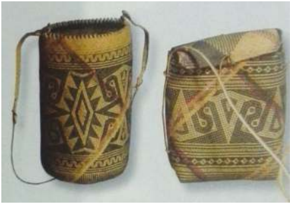

> **Deskripsi Visual:** Gambar ini menunjukkan dua tas tradisional yang diproduksi dengan teknik penukaran. Tas di sebelah kiri memiliki pola geometris berwarna kuning dan putih, sedangkan tas di sebelah kanan memiliki pola berwarna biru dan putih. Kedua tas tersebut memiliki tali pengait yang ditempelkan di bagian atasnya. Pola pada kedua tas tersebut tampak sangat detail dan menunjukkan keindahan desain tradisional. Teks, angka, atau label penting tidak terlihat pada gambar ini. Informasi kunci yang dapat diambil pembaca adalah bahwa tas tradisional ini dibuat dengan teknik penukaran dan memiliki desain yang sangat menarik.

### MENGANALISIS KARYA SENI RUPA BERDASARKAN JENIS, FUNGSI, TEMA DAN TOKOH DALAM BENTUK LISAN DAN TULISAN

 

---
## 📄 Halaman 23

---
**🖼️ Gambar/Diagram**

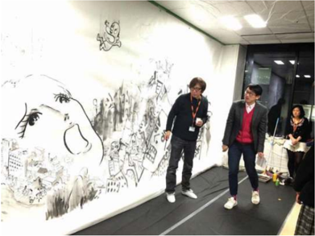

> **Deskripsi Visual:** Gambar ini menunjukkan dua orang yang sedang berjalan di sebuah ruangan dengan latar belakang dinding yang dipenuhi dengan lukisan atau gambaran yang menunjukkan aktivitas sehari-hari seperti bermain, berjalan-jalan, dan bermain mainan. Dua orang tersebut tampak senang dan terlibat dalam aktivitas mereka. Di sebelah kanan, ada beberapa orang yang sedang berdiri dan tampak tertarik pada lukisan tersebut. Gambar ini mungkin merupakan bagian dari sebuah kegiatan edukasi atau sosial dimana penggunaan lukisan sebagai media untuk mengajarkan konsep-konsep dasar tentang kehidupan sehari-hari.

Sumber: Art Fair Tokyo

### C.  Tema

Masalah pokok atau tema dikenal sebagai subject matter seni. Misalnya tema dapat bersumber dari  realitas  internal  dan  realitas  eksternal.  Realitas  internal  seperti  harapan,  cita-cita,  emosi, nalar,  intuisi,  gairah,  khayal,  dan  kepribadian  seorang  perupa  diekspresikan  melalui  karya  seni. Sedangkan  realitas  eksternal  adalah  ekspresi  interaksi  perupa  dengan  kepercayaan,  religius, kemiskinan,  ketidakadilan,  nasionalisme,  politik  (tema  sosial),  hubungan  perupa  dengan  alam, (tema lingkungan), dan lain sebagainya.

### D.  Tokoh

Pengenalan  akan  tokoh-tokoh  perupa  terapan  (pedesain,  pekriya)  dalam  lingkup  lokal, nasional,  dan  internasional  adalah  penting  dalam  meningkatkan  kemampuan  berapresiasi  seni. Siswa  diminta  membuat  kliping  atas  tokoh  yang  dipilih  dan  disepakati  bersama  oleh  siswa  dan guru.  Tujuannya  untuk  mendapatkan  informasi  tentang  ketokohan,  reputasi,  dan  kon-tribusi tokoh  bagi  masyarakat,  bangsa,  dan  kemanusiaan  pada  umumnya.  Hal  ini  dimaksudkan  untuk mengembangkan rasa empati, sehingga kepekaan dan pengetahuannya dapat memicu rasa kagum akan prestasi dan jasa-jasa para seniman (dan budayawan) berdasarkan bukti-bukti kualitas karya seni  dan  pengakuan yang diberikan tokoh tertentu.

 

---
## 📄 Halaman 24

### E.  Tugas Pengkajian Karya Seni Rupa

Proses pengkajian seni rupa dengan pendekatan saintifik (mengamati, menanyakan, mencoba, menalar,  dan  menyajikan)  mencakup  aspek  visual  (menguraikan  keberadaan  rupa  dengan  katakata), aspek proses kreasi seni (menguraikan tahapan teknis penciptaan, skill atau keterampilan), aspek  konseptual  (menemukan  inspirasi  dan  gagasan  seni)  dan  aspek  kreativitas  (menetapkan tingkat  pencapaian  kreativitas).  Pada  Gambar  5.1,  5.3,  dan  5.5  disajikan  3  reproduksi  karya  seni rupa,  sebagai  objek  pengamatan dan latihan mengapresiasi seni.

Sumber: Katalog Pameran

Gambar 5.3 Ketut Nurija, Seni Keramik: Konfigurasi 1, Keprihatinan, 1998. Fire Clay, tinggi 50 cm.

Yang dimaksud dengan keramik ialah berbagai macam benda yang dibuat dari bahan-bahan anorganik yang berasal dari bumi, seperti tanah liat, dan melalui proses pembakaran dengan suhu cukup  tinggi  akhirnya  menjadi  keras  dan  awet.  Ada  tiga  kualitas  keramik,  yang  dihasilkan  dari perbedaan  komposisi  unsur-unsur  bahan  dan  suhu  pembakaran  yang  lebih  rendah  atau  tinggi, yaitu  gerabah  lunak  yang  juga  disebut earthenware atau aardewerk ,  benda  batu  atau stoneware , dan porselen.

 

---
## 📄 Halaman 25

Keramik modern seperti yang diciptakan oleh Ketur Nurija, merupakan perkembangan lebih lanjut seni keramik Indonesia. Ada kecenderungan pergeseran konsep berkarya keramik dari yang tradisional fungsional kepada sikap kreatif modern, ketika keramik seni dipandang setara dengan hasil-hasil seni murni yang lain, seperti karya-karya seni lukis, seni patung, seni serat, dan lain-lain.

Sumber: Katalog Pameran

Secara  garis  besar  konsep  perupa  instalasi  ditunjukkan  dalam  sikap  berkesenian.  Mereka menawarkan suatu sikap yang paling ekstrim dan nyata-nyata 'keberatan' dengan media konvensional. Misalnya,  secara  umum  mereka  menolak  kecenderungan  berkarya  dalam  konsep pictural dan sculptural dalam  seni  rupa.  Ketika  berkarya  mereka  mencari  alternatif  yang  paling  radikal  dan anti  konvensi,  dan  keinginginan  ini  sungguh-sungguh diperjuangkan dalam karya-karyanya.

 

---
## 📄 Halaman 26

Sumber: Apresiasi Seni

Gambar 5.5

But Muchtar, Sitting Girl, cat minyak pada

kanvas, 75 x 90 cm.

Pada  seni  kubisme  seniman  lebih  banyak  mengungkapkan  tema  alam  benda,  manusia,  dan lingkungan. Selain itu banyak yang mengungkapkan tentang warna, garis, bentuk dan komposisi, yang memperlihatkan visi yang berbeda-beda dari setiap seniman. Tema yang mempunyai pengaruh besar pada kubisme adalah lingkungan sosial, baik sebelum maupun sesudah perang dunia.

Kubisme  cukup  konsisten  dalam  penggarapan  objek  dan  latar  belakangnya,  penggunaan warna  dipikirkan  secara  rasional,  dengan  menyelaraskan  objek  dengan  latar  belakangnya.  Pada karya But Muchtar kehadiran objek sudah demikian tersamar dalam kesatuan kepingan komposisi bidang-bidang warna.

 

---
## 📄 Halaman 27

### FENOMENA SENI RUPA

### A.	 Seni	Rupa	Pramodern

Istilah  seni  rupa  pramodern  menunjukkan  babakan  sejarah  di  mana  manifestasi  karya  seni rupa  hadir  sebelum  zaman  industri.  Perkembangan  seni  rupa  dilihat  dari  aspek  kesejarahan merupakan rangkaian perubahan, baik dari aspek konseptual maupun aspek kebentukan. Berikut akan disampaikan aliran-aliran seni rupa hingga saat ini.

### 1. Primitivisme

Primitivisme  adalah  corak  karya  seni  rupa  yang  memiliki  sifat  bersahaja,  naif,  sederhana, spontan,  jujur,  baik  dari  segi  penggarapan  bentuk  maupun  pewarnaan.  Senimannya  bebas  dari belenggu profesionalisme, tradisi, teknik, dan latihan formal proses kreasi seni. Perhatikan contoh patung primitif dari Afrika di halaman 19. Patung primitif tersebut merupakan karya tiga dimensi yang  perwujudannya  mengekspresikan  makna  seni  dengan  bahasa  bentuk  simbolik.  Sementara patung  Dewi  Kecantikan  Yunani  klasik  mengekspresikan  makna  seni  dengan  idealisasi  bentuk mimesis (mengimitasi atau meniru) rupa manusia dalam wujud yang indah dan sempurna.

### 2. Naturalisme

Naturalisme adalah corak karya seni rupa yang teknik pelukisannya berpedoman pada peniruan alam  untuk  menghasilkan  karya  seni  sehingga  seniman  terikat  sekali  pada  hukum  proporsi, anatomi, perspektif, dan teknik pewarnaan untuk mencapai kemiripan sesuai dengan perwujudan objek yang dilihat oleh mata. Tokoh-tokohnya antara lain, Abdullah SR, Wakidi, Pirngadi, Basoeki Abdullah, Trubus, Dullah, Rustamadji, Wahdi, dan lain-lain.

x 200 cm

 

---
## 📄 Halaman 28

### 3. Realisme

Aliran seni rupa realisme merupakan perkembangan lebih lanjut dari naturalisme. Aliran ini muncul di belahan dunia barat sekitar pertengahan abad ke-17. Intisari filosofinya menunjukkan keyakinan seniman terhadap realitas duniawi yang kasat mata sebagai objek penciptaan karya seni. Pada umumnya realisme dibedakan menjadi beberapa kategori. Misalnya, realisme sosialis (yang cenderung mengungkapkan adegan-adegan kehidupan manusia yang serba sengsara, getir, dan pahit). Herbert Read antara lain menyatakan, 'Jenis seni rupa yang sepenuhnya dapat kita sebut sebagai realistis  adalah  yang  berusaha  dengan  segala  daya  untuk  menyatakan  perwujudan  objek  dengan tepat, dan seni seperti ini, sebagaimana halnya filsafat realisme, selalu berdasar atas keyakinan atas keberadaan objektif dari sesuatu' . Jadi dalam pengertian murni, aliran realis berusaha melukiskan keadaan  secara  nyata,  seniman  realis  memandang  dunia  ini  tanpa  ilusi,  mereka  menciptakan karya  seni  rupa  yang  nyata  menggambarkan  apa-apa  yang  nyata  dan  benar-benar  ada  di  dunia ini. Dengan perkataan lain seniman realis mendasarkan seninya pada penerapan panca inderanya tanpa mengikutsertakan fantasi dan imajinasinya. Tokoh-tokoh realisme di Indonesia antara lain, Raden  Saleh  (realisme  romantis),  S.  Soedjojono,  Dullah,  Rustamadji  (realisme  fotografis),  Dede Eri  Supria,  dan  Ronald  Manullang (Realisme Baru).

Sumber: Indonesian Art and Beyond

Gambar 6.2 Raden Saleh, Antara Hidup dan Mati.

---
**🖼️ Gambar/Diagram**

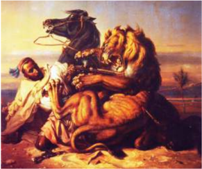

> **Deskripsi Visual:** Gambar ini adalah ilustrasi yang menampilkan dua makhluk mitologis besar berwarna coklat dengan ekor panjang dan mulut besar. Makhluk tersebut tampak seperti haiwan laut yang memiliki tubuh berbentuk bulat dan ekor yang panjang. Mereka tampak sedang bergerak di atas laut dengan ekor mereka yang panjang menggantung di bawah badan mereka. Di sebelah kiri gambar, ada seorang pria kecil yang sedang berdiri dan memegang tali yang menghubungkan salah satu ekor makhluk tersebut. Latar belakang gambar menunjukkan laut dengan ombak yang bergoyang dan matahari yang tenggelam di tepi laut, memberikan suasana senja yang tenang namun juga menimbulkan rasa khawatir.

 

---
## 📄 Halaman 29

### 4. Dekoratif

Karya  seni  rupa  dekoratif  senantiasa  berhubungan  dengan  hasrat  menyederhanakan  bentuk dengan jalan mengadakan distorsi, ciri-cirinya bersifat kegarisan, berpola, ritmis, pewarnaan yang rata,  dan  secara  umum  mempunyai  kecenderungan  kuat  untuk  menghias.  Tujuan  dan  sifat  hias ini  menyebabkan  keindahan  rupa  dekoratif  termasuk  kategori  seni  yang  mudah  dicerna  oleh masyarakat. Pada karya dua dimensi sering mengabaikan unsur perspektif dan anatomi, sedangkan pada karya tiga dimensi mengabaikan plastisitas bentuk (naturalistis).

Karya  seni  rupa  dekoratif  dapat  diklasifikasi  menjadi  dua  bagian  utama,  yakni  dekoratif figuratif dan dekoratif geometris. Dekoratif figuratif biasanya ditandai dengan penggambaran wujud figur  atau  bentuk-bentuk  di  alam  yang  kita  kenali.  Seperti  misalnya,  pemandangan,  pasar,  kota, hewan-hewan di tengah rimba, lukisan kehidupan sehari-hari, dan lain sebagainya. Namun teknik pelukisannya  tidak  berupaya  untuk  meniru  rupa  secara  realistis,  melainkan  dikerjakan  dengan bentuk yang datar tanpa memperhitungkan aspek volume dalam penggarapan bentuk visual.

Dekoratif geometris adalah karya-karya seni rupa yang bebas dari peniruan alam, perwujudannya merupakan susunan motif, bentuk, atau pola tertentu di tata sedemikian rupa sehingga memiliki kapasitas  untuk  membangkitkan  perasaan  keindahan  dalam  diri  pengamatnya.  Lukisan-lukisan geometris cenderung rasional karena terikat pada pola, motif, bentuk-bentuk, dan teknik pelukisan yang menuntut keterampilan dan kesabaran dalam proses kreasinya.

Seni rupa dekoratif geometris dapat dilihat pada ragam hias di daerah-daerah seluruh kepulauan Indonesia.  Misalnya  motif  pilin  berganda,  lingkaran,  elips,  setengah  lingkaran,  segi  tiga,  prisma, empat  persegi,  dan  lain-lain.  Motif  tersebut  biasanya  tersusun  rapi  dengan  teknik  pengulangan,

 

---
## 📄 Halaman 30

sehingga tercipta suatu harmoni, karena penempatannya mementingkan keteraturan dan kerapian, maka dalam bentuk tradisional komposisinya simetris. Namun kerap pula kita jumpai dalam era modern komposisi yang bebas, seperti pada karya Sapto Hudoyo dan Hatta Hambali.

Gambar 6.4 Irsam, The Pet Bird , 1995, Oil on canvas dekoratif figuratif.

Tokoh-tokoh pelukis dekoratif di Indonesia adalah Kartono Yudokusumo, Widayat, Suparto, Ratmoyo,  Batara  Lubis,  Amrus  Natalsya,  Irsam,  Sarnadi  Adam,  Ahmad  Sopandi,  Boyke  Aditya, A.Y.  Kuncana,  I  Gusti  Nyoman  Lempad,  I  Gusti  Ketut  Kobot,  I  Gusti  Made  Deblog,  dan  masih banyak lagi.

Sumber: Katalog Pameran Gambar 6.5 Suparto, Tiger, 1980. Cat minyak pada kanvas.

 

---
## 📄 Halaman 31

### B.	 Seni	Rupa	Modern

Dasar filosofis dan gejala seni rupa modern pada hakikatnya merupakan kelanjutan perkembangan seni rupa sebelumnya, satu aspek dari perkembangan budaya secara menyeluruh. Perkembangan filsafat  memunculkan  tokoh-tokoh  seperti  Imanuel  Kant,  Hegel,  Schopen-hauer,  Nietze,  Comte, Charles  Darwin,  dan  lain-lain.  Sementara  di  bidang  Mikrobiologi  tampil  nama-nama  Antoni van  Leeuwenhoek,  Pasteur,  Robert  Koch,  Paul  Ehrilch,  dan  lain-lain.  Sedangkan  di  sektor  sosial ekomomi tampil  Adam  Smith,  seorang  pelopor  sistem  persaingan  bebas,  dengan  lawannya  Karl Marx, Thomas Maltus, Le Bon, Montesque, dan Rousseu. Selanjutnya di bidang ilmu jiwa muncul Sigmund  Freud  dengan  psikoanalisis  yang  menelurkan  teori  takbir  mimpi-mimpi  dan  metode katarsis. Carel Gustave Jung, Alferd Adler, dan Kunkel bersaudara. Kesemua ini bersamaan dengan perkembangan disektor fisika dan astronomi, sehingga jadilah abad modern yang dikuasai oleh ilmu dan  teknologi.  Perkembangan  'kemajuan'  ini  tentu  bukan  saja  membahagiakan  hidup  manusia, tetapi juga menimbulkan efek samping, yakni eksploitasi industrialisasi, kolonialisme, imperialisme, kemiskinan di pihak lain, sehingga terjadi dua kali perang dunia di abad ke-20 dan beratus kali perang lokal dan perang dingin.

Faktor lain yang menjadi dominan esensi seni rupa modern ialah kesadaran akan nilai individu sebagai  karakter  aktivitas  manusia.  Hal  ini  berakar  dari  budaya  Renaisans,  humanisme  universal yang akhirnya tampil sebagai abad pencerahan di Eropa.

Mengkaji fenomena seni rupa modern, tentu bermula dari jasa kaum impresionisme Perancis, yang menyelenggarakan pameran-pameran mereka pada tahun-tahun 1874, 1877, 1879, 1880, 1881, 1882, dan 1886. Meskipun dalam tubuh impresionisme terjelma beberapa keunikan individu, tapi secara  keseluruhan  kelompok  ini  menunjukkan  kesatuan  sikap,  yakni  pemberontakan  terhadap kaum akademis, seperti Jaques Louis David dan Jean Augustie Dominique Ingres.

Dalam tahun 1876 kritikus Duranty menulis 'Dari intuisi ke intuisi, secara bertahap mereka tiba  pada  dekomposisi  sinar  matahari  menjadi  lapisan  spektrum  dan  elemennya,  kemudian mengkonstruksikannya menjadi kesatuan dengan keselarasan baru, bagaikan warna pelangi yang bertaburan di atas kanvas mereka. '

Dengan kemunculan impresionisme membuka peluang perkembangan seni lukis  secara lebih terbuka,  sehingga  melahirkan  beberapa  kecenderungan.  Dari  Seurat  dan  Signac  yang  pointilis, eksploitasi  anasir  cahaya  dan  warna  muncul  ekspresionisme  Vincent  van  Gogh,  kemudian melahirkan fauvisme dan abstrak ekspresionisme. Respons Paul Cezanne terhadap impresionisme, mengakibatkan lahirnya kubisme, dan perkembangannya kemudian sampai kepada konstruksivisme, minimal art ,  dan  seterusnya.

### 1. Seni Pop

Budaya  pop  tumbuh  dari  pertemuan  beberapa  kecenderungan  dan  kondisi  sosial  ekonomi masyarakat pada pertengahan tahun 1950-an. Budaya ini ditandai oleh ketiadaan penggangguran, konsumerisme, makin meningkatnya kesejahteraan, mobilitas sosial ke atas, melonggarnya struktur kelas  dalam  masyarakat,  berubahnya  pandangan  sosial,  dan  kesejahteraan  kaum  muda,  beserta budaya protesnya, pengalaman dan kepekaan yang berkaitan dengan kehidupan sehari-hari.

 

---
## 📄 Halaman 32

Gerakan  ini  membentuk  diri  di  sekitar  identifikasi  persoalan  Amerika  dan  pengingkaran berbagai kaidah Eropa. Dimulai dengan para pelukis seperti Larry Rivers, Jasper John, dan Robert Raus-chenberg, bisa dijumpai selebritas yang bersifat Amerika. Di bawah pengaruh pelukis, kritik awal terhadap budaya massa diabaikan demi merangkul penuh semangat teknologi reproduksi dan berbagai citra serta objek kehidupan industri Amerika Serikat yang direproduksi secara komersial.

Pop Art adalah  produk  sistem  perekonomian kapitalis,  di  mana  segala  hal  dalam  kehidupan ini, termasuk hal-hal yang berada dalam wilayah realitas simbolisme diusahakan menjadi komoditi yang  bisa  dijual  ke  pasar  luas.  Oleh  karena  itu  logika  produk  kesenian  yang  lahir  dari  sistem perekonomian ini adalah logika pasar, bukan logika artistik.

Ronald Mannullang MM-BK. 2009.

Dengan demikian, dalam dunia pop art ,  eksistensi  sang  pencipta  juga  tidak  terlalu  penting, yang lebih diperlukan adalah produknya yang bisa dikemas sebagai komoditi dan dijual ke pasar luas.  Kecuali  sosok  seniman  itu  juga  merupakan  komoditi  yang  bisa  dijual.  Dengan  kata  lain rekayasa  citra  tentang  dirinya  lebih  penting  ketimbang  pribadi  seniman,  karena  semakin  besar liputan  media  yang  dia  peroleh  semakin  laris  karya-karyanya  di  pasar  luas.

Dalam bidang seni rupa, tampil seniman pop art seperti, Andy Warhol, Roy Lichtenstein, Tom Wesselmann, dan kawan-kawan. Dalam seni musik pop menunjukkan pada berbagai jenis musik yang populer dalam masyarakat. Pop art juga tampil dalam seni patung, poster, desain, seni grafiti, fashion, dan sebagainya. Pop art dipandang pula sebagai salah satu manifestasi subkultur, gerakan kultural  generasi  muda. Pop  art identik  dengan  gaya  hidup  generasi  muda  dengan  karakteristik perlawanan kepada kemapanan norma-norma masyarakat yang berlaku.

Artikulasinya oleh para peneliti media massa dan budaya telah dibangun sebuah segitiga yang diberi ' triple M theory ' masyarakat massal, media massa, dan budaya massa. Pop art merupakan suatu  aktivitas  seniman  yang  menggunakan  cara  pemberian  kesan  populer  sebagai  hasil  dari revolusi  industri  dan  sekaligus  penggunaan  dari  hasil-hasil  revolusi  tersebut.

 

---
## 📄 Halaman 33

### 2. Seni Optik

Sebelum  ditemukan  seni  optik  seperti  yang  ada  sekarang  ini,  ada  beberapa  faktor  yang mempengaruhi, khususnya setelah munculnya berbagai ilmu, seperti ilmu fisika, anatomi manusia, teristimewa pada sistem optik dan beberapa teori warna, baik untuk warna sinar maupun warna pigmen. Ilmu optik pertama kali dipelajari selama bertahun-tahun di laboratorium oleh seorang ahli filsafat dan juga ahli ilmu fisika Inggris yang bernama Bacon (1220-1292), yang mempelajari struktur  cahaya  dan  kaitannya  dengan bagaimana mata manusia bisa menangkap warna.

Pada tahun 1642-1727 Sir Isac Newton mengadakan percobaan tentang cahaya menggunakan prisma yang dipantulkan menggunakan sinar matahari yang menimbulkan spektrum warna. Dari eksperimen  ini  lahir  teori  yang  mengatakan  bahwa  cahaya  matahari  dapat  diuraikan  menjadi beberapa warna, yaitu; merah, jingga, kuning, biru, dan ungu. Brewster mengajukan teori warna dengan membagi campuran warna-warna pigmen menjadi warna primer, sekunder, tertier, sedangkan Munsell (Amerika) tahun 1958 mengadakan penelitian tentang warna yang didasarkan standarisasi untuk aspek fisik yang dikelompokkan menjadi hue , ligthness , saturation .

Kelahiran seni optik juga tidak lepas dari beberapa peranan termasuk dari Bauhaus, konsep konstruktivisme,  dan  abstrak  geometris  yang  dasar  pemikirannya,  eksak,  matematis,  geometrik, serta  bentuk-bentuk  tiga  dimensional  melalui  penggarapan  ilmu  cahaya  dan  ilmu  warna  untuk menampilkan efek kedalaman dan presisi tinggi.

Seni optik pada kemunculannya meliputi seni dua dimensi dan tiga dimensi, yang mendasarkan diri pada ilmu optik, ilmu cahaya, dan ilmu warna untuk mengolah bentuk-bentuk tertentu yang digunakan  untuk  mengeksploitasi  fisibilitas  mata.  Seni  optik  pada  umumnya  berbentuk  abstrak, formal, dan konstruktivis melalui bentuk yang khas geometrik dan perulangan yang teratur, rapi, teliti,  sehingga  dapat  menimbulkan  efek-efek  yang  mengecoh  mata  dengan  ilusi  ruang.  Warnawarna  yang  digunakan  kebanyakan  warna  cerah  atau ligthnes tinggi  dengan  memberikan  batas pada hue atau saturation yang  tajam  dan  tegas.

Berbeda dengan seni kinetik, seni optik lebih menitikberatkan pada representasi gerakan atau bagaimana  menggambarkan  sesuatu  sehingga  seakan-akan  bergerak  dengan  memanfaatkan  efek ilusi  pada  mata.  Seni  optik  sengaja  mengeksploitasi  elemen-elemen  visual  seperti  garis,  bidang, dan warna untuk mendapatkan efek optis, sehingga mata manusia terkecoh karenanya.

M.C. Escher, dapat dikatakan sebagai bapak seni optik, ia adalah seorang seniman grafik dari Belanda,  dengan  karya  litografi  pada  tahun  1930-an  menghasilkan  karya-karya  awalnya  di  Itali. Karya-karya  Escher  merupakan  pengolahan  mendasar  akan  ruang  dan  perspektif  yang  sangat unik  dengan  bentuk-bentuk  yang  mendetail.  Dengan  mengolah  bentuk  figur  dan  latar  melalui perubahan bentuk ground dan  langit  menjadi bentuk burung dengan tepat dan sempurna sekali.

Bila  pengolahan  perspektif escher sangat  menarik  dan  mengecoh  mata  kita  yang  tidak  bisa membedakan mana yang di atas atau di bawah, mana yang jauh atau dekat, seperti yang terdapat pada  karyanya  'Jendela  Burung' .  Pada  karya  ini  mata  kita  dikecoh  sedemikian  rupa  melalui perspektif  yang  jungkir  balik  melalui  objek  yang  bidangnya  diisi  oleh  garis-garis  yang  sengaja dimasukkan untuk mengganggu dengan ketepatan yang tinggi sehingga menimbulkan efek optik.

 

---
## 📄 Halaman 34

Sumber: Optical Art Gambar 6.8 Britget Relay , Black and White .

Patung.

Perkembangan selanjutnya banyak diadakan pameran-pameran baik di Prancis maupun negara Eropa  antara  lain  yang  terkenal  pameran  ' Responsive  Eye '  yang  di  koordinasi  oleh  William  G. Seitz  di  New  Y ork  tahun  1965.  Para  pelukis  yang  terlibat  dalam  seni  optik  selain  Vasarely  dan Josepf  Albers,  ada  juga  pelukis-pelukis  muda  lainnya  Richard  Anuskie-wiecz,  Almir  Mavigner, Larry Poons, Agam, de Soto, Bridget Riley, Jeffrey Steele, Tadasky, dan Yvaral.

Richard  Anuskiewiez  melakukan  eksplorasi  berdasarkan  ilmu  warna,  ia  menyusun  paduan warna dan garis secara teratur dan sistematis yang menimbulkan efek optik sebagai akibat bayangan warna-warna  yang  tembus  pandang  dari  keteraturan  garis  yang  diciptakan.  Melalui  eksperimen yang terus-menerus diperoleh berbagai bentuk dan efek optik yang beragam.

Dia  menyebut dirinya  sebagai  abstraksionis  geometrik.  Anuskiewiecz  dengan  karyanya  yang berjudul All things do live in the three lebih banyak mengolah warna komplemen yang memberikan efek  visual  yang  menakjubkan.

Berbeda dengan karya Agam yang berjudul Double Methamorphosis II , lebih jeli memanfaatkan jaring-jaring  almunium  yang  mempunyai  keteraturan  garis  yang  presisi.  Dengan  memanipulasi keteraturan  garis  yang  berpotongan  melalui  perbedaan  warna  menghasilkan  efek  optik  yang  tak terduga.

Banyak  persepsi  dan  prinsip  dalam pop  art ,  yang  mengambil  teori  psikologi  fenomena imajinasi kontras, pancaran cahaya, warna menyolok yang mengagetkan dan membuat ilusi yang mengagumkan. Pop art kebanyakan menggunakan warna-warna kontras yang terkadang menyilaukan mata, misalnya warna merah didekatkan dengan warna biru bersamaan dengan penggunaan garis atau bentuk yang teratur seperti yang dilakukan oleh Vasarely dalam karyanya yang berjudul lega. Prosesnya dia menyusun elemen garis yang dipertentangkan dengan arah vertikal dan horizontal dengan  mengolah  bidang  menyempit  dan  melebar  dengan  mengisi  warna  yang  berselang-seling menghasilkan efek dimensi ruang, pantulan cahaya, dalam ruang yang bergetar.

Sedangkan karya pelukis Briget Riley, Yvaral, dan Reginal Neal lebih banyak mengolah garis yang  memberikan  efek after  image sebagai  vibrasi  kilauan  pada  mata  karena  adanya oscilation yang cepat pada sel retina.

 

---
## 📄 Halaman 35

### 3. Seni Konseptual

Istilah  konseptual  pertama  kali  dikemukakan  oleh  Edward  Keinholz  dan  Herru  Flint  yang berasal  dari  California,  tahun  1960.  Istilah  konseptual  adalah  sinonim  dari idea  art . Conseptus dalam bahasa Latin berarti: pikiran, gagasan, atau ide. Jadi konseptual adalah sesuatu yang berkaitan dengan konsep. Konsep atau ide adalah hal yang penting dalam penciptaan seni. Seni konseptual disatukan  oleh  satu  sikap  penggunaan  bahasa  verbal  dan  non  verbal,  analogi  atau  ilmu  bahasa menjadi esensi dan seni.

Seni konseptual sangat kontroversial, menjungkirbalikkan segala kemapanan seni (nilai-nilai, gaya,  galeri,  pasar  seni,  dan  sebagainya).  Para  seniman  konseptual  menggunakan  semiotika, feminisme dan budaya populer dalam berkarya, sehingga berlainan sekali dengan karya-karya seni konvensional.  Karena  itu  konseptualisme  akhirnya  menjadi  paham  pemikiran  yang  memayungi bentuk-bentuk seni yang tidak berwujud piktorial dan skulptural seperti body art , eart  art , video art , performance art , process  art , instalation  art ,  dan  lain-lain.

Seni konseptual menemukan spektrum baru dalam seni rupa, sebagai pengganti kiasan atau pantun dalam bahasa, surat kabar, majalah, periklanan, pos, telegram, buku-buku, katalogus, foto kopi, film, video, anggota badan, bahkan dunia ini bisa dijadikan medium atau objek seni. Sejak kehadiran seni konseptual batas-batas antara seni secara fisik mulai kabur, sebab seni konseptual mengakses hampir semua bentuk seni dan non seni.

 

---
## 📄 Halaman 36

Sumber: refkypoetra.blogspot.com

Gambar 6.11 Refky Poetra, salah satu manifestasi seni konseptual, memanfaatkan anggota tubuh (tangan kiri, yang dilukis menjadi kepala seekor anjing).

### 4.  Seni Kontemporer

Pada Encyclopedia The World Art estetika kontemporer disebutkan, bahwa estetika yang baru ini bertujuan untuk memfilsafatkan dalam pengertian anti metafisik, dan kemudian membedakannya dari estetika-estetika sebelumnya. Namun dia tidak akan membuang prinsip kategori-kategori, dan sebagai akibatnya menciptakan konsep mendua dan ragu tentang pengertian filsafat. Sementara Klaus Honnef mengidentifikasi seni rupa kontemporer sebagai perubahan paradoksal dari avant garde ke post avant garde ,  sedangkan John Grifith dan Endrew Benyamin menganggap seni rupa kontemporer bertentangan secara diametral dengan modernisme yang percaya pada universalisme. Seni rupa kontemporer tidak percaya lagi pada pusat-pusat perkembangan di mana pun, sebaliknya percaya pada perkembangan seni rupa dalam batas-batas kenegaraan.

 

---
## 📄 Halaman 37

---
**🖼️ Gambar/Diagram**

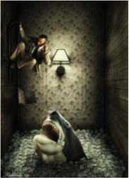

> **Deskripsi Visual:** Gambar ini adalah ilustrasi yang menampilkan seorang pria berjalan dengan gerakan cepat ke kanan sambil memegang senjata, tampaknya sedang bergerak untuk melarikan diri. Di depannya ada sebuah hewan besar yang tampak seperti seekor anjing besar dengan mulut terbuka besar, menunjukkan tanda-tanda ketakutan atau kecemasan. Latar belakang adalah ruangan kecil dengan lantai berlapis kertas, dinding yang berwarna abu-abu dengan pola halus, dan lampu dinding yang menyala. Ilustrasi ini mungkin digunakan untuk menggambarkan situasi kecemasan atau ketakutan dalam konteks cerita atau buku pelajaran.

Menurut  teoretikus  Jerman  Udo  Kulterman  pengertian  kontemporer  dekat  dengan  paham posmodern dalam arsitektur,  paham  baru  ini  menentang  kerasionalan  modernisme  yang  dingin dan berpihak pada simbolisme instingtif. Dalam teori yang lebih baru tercatat prinsip pluralisme yang terbanyak mendasari pengertian kontemporer sekarang ini.

Dari  berbagai  keterangan  di  atas  dapat  ditentukan  adanya  dua  paradigma  aktivitas  seni kontemporer.  Pertama,  kelompok  yang  mementingkan  aktivitas  seni  sebagai  aktivitas  mental senimannya.  Kedua,  kelompok  yang  mementingkan  aktivitas  seni  ditujukan  bagi  kepentingan masyarakat. Scruton melihat kecenderungan persepsi seperti itu sebagai sesuatu yang menyulitkan dalam penilaian estetik.

 

---
## 📄 Halaman 38

### C.	 Seni	Rupa	Posmodern

Istilah posmodernisme muncul pertama kali di wilayah seni, yakni seni musik, seni rupa, fiksi, film, fotografi, arsitektur, kritik sastra, dan sebagainya. Di sisi lain istilah posmodern juga muncul di wilayah keilmuan yakni ilmu sosiologi, antropologi, geografi, filsafat, dan sebagainya. Peristilahan ini  didefinisikan  sesuai  dengan  konteksnya,  istilah  posmodern  diartikan  untuk  menunjukkan reaksi  yang  muncul  dari  dalam  modernisme,  sebuah  gerakan  yang  menolak  modernisme  yang mandek  dalam  birokrasi  museum  dan  akademi,  menjelaskan  siklus  sejarah  baru  yang  dimulai sejak  berakhirnya  dominasi  barat,  surutnya  individualisme,  kapitalisme,  dan  kristianitas,  serta kebangkitan budaya non barat, hilangnya batas antara seni dan kehidupan sehari-hari. Tumbangnya batas antara budaya tinggi dan budaya pop, pencampuradukan gaya yang bersifat eklektik, parodi, pastiche, ironi, kebermainan, dan merayakan budaya 'permukaan' tanpa peduli pada 'kedalaman' . (Sugiharto, 1996: 24-26). Dalam perkembangan selanjutnya, seni, khususnya seni rupa telah terjadi pemilahan antara seni murni ( pure art ) dengan seni pakai ( applied art / useful art ). Dalam konteks ini, posmodernisme dengan konsep pluralismenya telah menghapus pemilahan atau hirarki antara seni dan desain. Prinsip modernisme telah diubah menjadi ' Form Follow Fun ' .  Kedudukan fungsi yang  selama  ini  diagung-agungkan  oleh  kalangan  modernisme  mengalami  pergeseran  pada  era posmodernisme.

### 1.  Karya-Karya Seni Rupa Era Posmodernisme

Kebudayaan  posmodern  tidak  dapat  dipisahkan  dari  perkembangan  konsumerisme. Perkembangan masyarakat konsumer telah mempengaruhi cara-cara pengungkapan seni. Dalam masyarakat konsumer terjadi perubahan-perubahan mendasar yang berkaitan dengan cara objekobjek seni secara umum dikonotasi, dan cara model konsumsi ini direkayasa oleh para produser. Masyarakat  konsumer  memiliki  tiga  bentuk  'kekuasaan'  yang  beroperasi  di  belakang  produser dan kekuasaan media massa. Ketiga bentuk kekuasaan ini menentukan bentuk dan gaya seni. Di dalam  masyarakat  konsumer  relasi  antara  subjek  dan  objek  lebih  tepat  dijelaskan  melalui  peran subjek sebagai 'konsumer' . Maksudnya melalui perkembangan mutakhir dalam teknologi produksi, yaitu; otomatisasi dan komputerisasi, peran pekerja dapat diminimalisasi sedemikian rupa, sehingga relasi  produksi  semakin  kehilangan  maknanya.

### 2. Bahasa Estetik Posmodernisme

Wacana estetik posmodern mencerminkan bahwa tanda dan makna pada estetika posmodern bersifat  tidak  stabil,  mendua,  dan  plural  ( polysemy ).  Dalam  wacana  ini,  lebih  ditekankan  pada permainan tanda, keterpesonaan pada permukaan dan diferensi, ketimbang makna-makna ideologis yang bersifat stabil  dan  abadi.

Bahasa estetik posmodern bersifat hiperriil dan ironik yang meliputi:

- Pastiche adalah  karya  sastra,  seni  atau  arsitektur  yang  disusun  dari  elemen-elemen  yang dipinjam dari berbagai pengarang, seniman atau arsitek dari masa lalu. Dalam mengimitasi karya  masa  lalu  dalam  rangka  menghargai  dan  mengapresiasi  seni.  Sebagai  karya  yang mengandung  unsur  pinjaman pastiche mempunyai  konotasi  negatif  sebagai  miskin orisinalitas.  Di  samping  itu pastiche adalah  satu  bentuk  imitasi  yang  tanpa  beban  kritik dan perang menentang kemajuan serta sejarah, sebab sejarah tak dapaat diulangi. Pastiche juga  dikatakan sebagai penggunaan topeng bahasa pengungkapan yang telah mati.

 

---
## 📄 Halaman 39

- Parodi adalah sebuah komposisi dalam karya sastra, seni atau arsitektur yang di dalamnya kecenderungan pemikiran dan ungkapan khas dalam diri seorang pengarang, seniman, arsitek, atau gaya tertentu diimitasi (imitasi yang ditandai oleh kecenderungan ironik) sedemikian rupa untuk membuatnya humoristik atau absurd. Efek-efek kelucuan dan absurditas biasanya dihasilkan dari distorsi atau plesetan ungkapan yang ada. Melalui konteks ini penggunaan kembali karya masa lalu yang dimuati dengan ruang kritik yang menekankan perbedaan ketimbang  persamaan.  Titik  berangkat  parodi  bukanlah  penghargaan,  akan  tetapi  kritik, sindiran,  kecaman,  sebagai  ungkapan  rasa  tidak  puas  atau  sekedar  menggali  rasa  humor dari  karya  rujukan  yang  bersifat  serius.
- Kitch berakar  dari  bahasa  Jerman verkitchen (membuat  murahan)  dan kistchen berarti memungut sampah dari jalanan. Kitch dalam bahasa estetik posmodern sering ditafsirkan sebagai sampah aristik atau sering pula didefinisikan sebagai selera rendah karena lemahnya ukuran atau kriteria estetik. Strategi Kitch adalah, mengkopi elemen-elemen gaya dari seni tinggi  atau  objek  sehari-hari  untuk  kepentingan  sendiri,  yang  produksinya  didasari  pada semangat memassakan atau mendemitosasi seni tinggi.
- Camp adalah  satu  bentuk  dandysme  (tanpa  identitas  seks),  dan  karenanya  menyanjung tinggi  kevulgaran. Camp sering  menekankan  dekorasi,  tekstur,  permukaan  sensual,  dan gaya,  dengan mengorbankan isi. Camp juga  anti  antagonisme  seksual:  maskulin/feminin.
- Skizophrenia didefinisikan sebagai putusnya rantai pertandaan, yaitu rangkaian sintagmatis penanda yang bertautan dan membentuk satu ungkapan atau makna. Dalam konteksnya semua kata atau penanda, gambar, teks, atau objeknya dapat digunakan untuk menyatakan suatu konsep atau petanda (Piliang, 1995: 39-41).

 

---
## 📄 Halaman 40

### MEMAINKAN ALAT MUSIK BARAT

### TUJUAN PEMBELAJARAN

### PENDEKATAN PEMBELAJARAN

Setelah  mempelajari Bab 7 ini siswa diharapkan dapat:

- mengidentifikasi macam-macam instrumen musik;
- memainkan macam-macam instrumen musik menurut kategorinya;
- mempertunjukkan kemahiran memainkan instrumen dalam ansambel;
- mempersiapkan pagelaran musik barat; dan
- menampilkan pagelaran musik barat dengan kelompok band, ansambel, dan paduan suara.
- Mengamati
- Menanyakan
- Mengasosiasi
- Membuat Karya
- Mengomunikasikan

 

---
## 📄 Halaman 41

---
**🖼️ Gambar/Diagram**

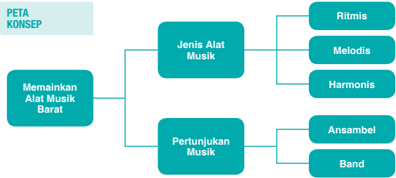

> **Deskripsi Visual:** Gambar ini adalah diagram yang menunjukkan struktur konsep tentang memainkan alat musik barat dan pertunjukan musik. Diagram ini dibagi menjadi dua bagian utama: "Memainkan Alat Musik Barat" dan "Pertunjukan Musik". Untuk setiap bagian, ada sub-konsep yang lebih spesifik.

1. **Apa yang Ditampilkan Secara Keseluruhan**: Gambar ini menunjukkan struktur konsep yang menggambarkan dua aspek utama dari memainkan musik barat dan pertunjukan musik. Setiap aspek tersebut dibagi menjadi sub-konsep yang lebih spesifik.

2. **Elemen-Elemen Utama dan Relasinya**: 
   - **Memainkan Alat Musik Barat** dibagi menjadi tiga sub-konsep: Ritmis, Melodis, dan Harmonis.
   - **Pertunjukan Musik** dibagi menjadi dua sub-konsep: Ansambel dan Band.

3. **Teks, Angka, atau Label Penting yang Terlihat**: 
   - Untuk "Memainkan Alat Musik Barat", ada tiga sub-konsep dengan label "Ritmis", "Melodis", dan "Harmonis".
   - Untuk "Pertunjukan Musik", ada dua sub-konsep dengan label "Ansambel" dan "Band".

4. **Informasi Kunci yang Dapat Diambil Pembaca**: 
   - Gambar ini memberikan pemahaman tentang struktur konsep dasar dalam memainkan musik barat dan pertunjukan musik, mencakup berbagai jenis alat musik dan bentuk pertunjukan.

Dengan demikian, gambar ini membantu pembaca memahami struktur dan komponen utama dari memainkan musik barat dan pertunjukan musik, serta memahami hubungan antara jenis alat musik dan bentuk pertunjukan.

### KEGIATAN PENGAMATAN

- Dengarkan	lagu	yang	dinyanyikan	secara	langsung melalui media elektronik
- Melihat	partitur	lagu.

---
**🖼️ Gambar/Diagram**

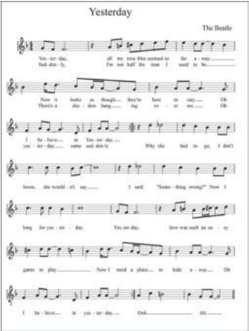

> **Deskripsi Visual:** Gambar ini menunjukkan lembaran musik untuk lagu "Yesterday" oleh The Beatles. Lembaran ini berisi not musik dan teks lagu, dengan not melodi terletak di baris atas dan teks lagu di bawahnya. Not melodi menggambarkan gerakan tangan pemain alat musik, sementara teks lagu memberikan lirik lengkap. Teks lagu terdiri dari dua baris utama, dengan teks pertama berisi lirik awal dan teks kedua berisi lirik lanjutan. Informasi penting lainnya termasuk nama lagu "Yesterday" dan nama bandnya, The Beatles. Lembaran ini tampak sederhana namun informatif, membantu pemain musik memahami struktur dan lirik lagu tersebut.

 

---
## 📄 Halaman 42

### KEGIATAN MENANYA

### KEGIATAN MENGEKSPLORASI

### A.  Memainkan Alat Musik Barat

### 1. Dasar-dasar Bermain Alat Musik Barat

Dalam	sebuah	 konser	 pasti	 ditemukan	 aneka	 alat	 musik.	 Ada	 gitar	 melodi,	 gitar	 ritm,	 gitar bas, keyboard ,  organ,  piano,  biola, flute ,  saksofon,  trompet,  trombon,  drum,  tamborin, triangle , marakas,  dan  mungkin  masih  banyak  lagi  yang  lain.  Tentu  masing-masing  alat  musik  tersebut dimainkan secara bersama-sama untuk mengiringi lagu. Apakah cara memainkan alat-alat musik tersebut sama? Apakah alat-alat musik tersebut menghasilkan bunyi dan nada yang sama? Tentu tidak.  Masing-masing alat musik dimainkan dengan cara berbeda-beda dan untuk menghasilkan bunyi yang berbeda pula. Justru perbedaan bunyi dan nada inilah yang menghasilkan komposisi yang indah bila didengar telinga, bahkan dapat menimbulkan rasa musikan yang indah pula.

Alat musik gitar dimainkan dengan cara dipetik. Keyboard , organ, dan piano dimainkan dengan cara  ditekan  tutsnya.  Flute  dan  biola  dimainkan  dengan  cara  menggesek  dawainya.  Saksofon, trompet,	 trombon	 dimainkan	 dengan	 cara	 ditiup.	 Drum, triangle ,  marakas,  bongo,  kendang, tamborin dimainkan dengan cara dipukul.

Bunyi	yang	dihasilkan	dari	alat-alat	musik	tersebut	juga	berbeda	satu	sama	lainnya.	Demikian pula fungsinya. Gitar, keyboard ,  organ, dan piano menghasilkan bunyi aneka nada yang berfungsi untuk  memainkan  melodi  dan  irama. Flute ,  biola,  saksofon,  trompet,  trombon  menghasilkan berbagai	nada	yang	berfungsi	untuk	memainkan	melodi.	Drum, triangle , marakas, bongo, gendang, tamborin menghasilkan bunyi-bunyian satu nada yang berfungsi sebagai pengiring melodi utama.

### a. Memainkan Alat Musik Ritmis

- Memperhatikan  partitur  lagu  di  atas,  bernada  dasar  apakah  lagu tersebut?
- Apakah kamu dapat menyanyikan lagu tersebut dengan nada dasar yang sama?
- Sebaiknya dinyanyikan dengan tempo bagaimanakah lagu tersebut?
- Bisakah kamu membaca partitur di atas?
- Apakah partitur di atas dapat dinyanyikan dengan vokal manusia?
- Mampukah suara manusia menyanyikan seluruh jenis partitur lagu?
Alat musik ritmis adalah alat musik yang berfungsi sebagai  pengiring  melodi  pokok.  Alat  musik  ini  ada yang bernada dan ada yang tidak bernada. Kamu sudah mengenal  alat  musik  ritmis  sejak  di  SMP .  Contohnya drum, ringbell , beduk, triangle , marakas, gendang, bongo, dan lain sebagainya.

Musik ritmis adalah musik pengatur irama. Biasanya alat  musik  ritmis  tidak  memiliki  nada  dan  berfungsi sebagai pengiring lagu. Yang termasuk alat musik ritmis di antaranya drum set, tamborin, gendang, tifa, bongo, kongo, triangle ,  kastanyet,  dan  marakas.

 

---
## 📄 Halaman 43

Sebagai pengatur irama, alat musik ritmis haruslah dimainkan secara konsisten, terutama untuk  menghidupkan  suasana  dan  menjaga  ritme  dan  tempo.  Karena  tidak  perlu  mengikuti melodi lagu, memainkan alat musik ritmis sangat mudah. Hanya saja, dibutuhkan konsistensi agar  lagu  tetap  terjaga  ritmenya.  Bila  pada  bagian-bagian  tertentu  aransemen  lagu  terdapat break atau jeda, pemain alat musik ritmis harus tahu karena merekalah yang harus memberi isyarat  dan  tanda.

Kamu  cukup  mengetuk-ngetuk  meja  atau  benda-benda  lain  untuk  membentuk  irama tertentu  dalam  berlatih  memainkan  alat  musik  ritmis.  Misalnya,  untuk  drum  set  dimainkan seperti  contoh  berikut:

- irama mars dengan ketukan

`x  -  o,  x  -  o,  x  -  o  (tak,  dung),`

- irama walz
x  -  x  -  o,  x  -  x  -  o  (tak,  tak,  dung),  dan

- irama bosanova
- x  -  o  -  o  -  x  -  o  (tak,  dung,  dung,  tak,  dung).

---
**🖼️ Gambar/Diagram**

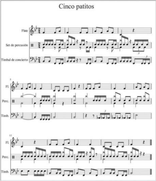

> **Deskripsi Visual:** Gambar ini menunjukkan lembaran musik dengan judul "Cinco patitos". Lembaran ini terdiri dari beberapa baris not musik yang ditulis dalam notasi notasi. Setiap baris not berisi instrumen yang berbeda, seperti Flauta (flute), Set de percusion (set of percussion), Tamboril de concierto (concert tambourine), Piano (piano), dan Tambor (drum). Not musik ini tampaknya merangkum lagu atau tema musik dengan instrumen yang berbeda. Judul "Cinco patitos" menunjukkan bahwa lagu ini mungkin menggambarkan lima bebek atau hewan kecil lainnya. Teks, angka, atau label penting yang terlihat adalah nama-nama instrumen dan notasi musik yang digunakan untuk menulis lagu tersebut. Informasi kunci yang dapat diambil pembaca adalah bahwa ini adalah lembaran musik yang mencakup instrumen berbeda untuk menyanyikan lagu "Cinco patitos".

 

---
## 📄 Halaman 44

### b. Memainkan Alat Musik Melodis

---
**🖼️ Gambar/Diagram**

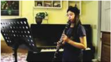

> **Deskripsi Visual:** Gambar ini adalah foto yang menunjukkan seorang siswa sedang bermain klarinet di depan piano. Siswa tersebut tampak sangat serius dan fokus pada musiknya. Di sebelah kiri siswa, terdapat lembaran musik yang disusun dengan rapi di atas meja. Di belakang siswa, terdapat beberapa piringan foto yang menunjukkan potret keluarga atau teman-temannya. Selain itu, di sudut kanan atas gambar, terdapat sebuah tanaman hias yang menambah nuansa hijau ke dalam ruangan. Gambar ini menunjukkan aktivitas belajar musik yang serius dan menunjukkan lingkungan belajar yang nyaman dan menarik.

Gambar 7.3 Bermain Clarinet

Memainkan  alat  musik  melodis  sama dengan  membawakan  lagu  karena  alat  musik melodis  memang berfungsi  untuk  memainkan melodi  utama  lagu.  Pemegang  alat  musik  ini harus mampu dan terampil membawakan lagu sebagaimana  penyanyi  membawakan  lagu  itu dengan  vokalnya.  Akan  tetapi,  tentu  masih ditambah pula untuk memainkan intro, interlude , dan fungsi-fungsi tambahan lainnya.

Dalam	ansambel	modern,	alat	musik	melodis di antaranya saksofon, trompet, trombon, biola, flute ,  pianika, xylophone ,  klarinet,  oboe,  dan lain-lain.

### Ada dua teknik permainan alat musik melodis, yaitu:

### 1)  Teknik Legato

Teknik legato adalah permainan alat musik melodi yang panjang-panjang sesuai harga atau ketukan not. Pemain membunyikan nada tanpa jeda sampai pada permainan nada berikutnya. Perhatikan contoh berikut.

Perhatikan  baris  pertama  yang  hampir  semua  notnya  diberi  tanda  titik  (.)  di  atasnya. Perhatikan pula baris kedua mulai bar kedua yang tidak menggunakan tanda titik (.). Yang menggunakan titik dimainkan dengan teknik stacatto dan yang tidak menggunakan tanda titik  dimainkan dengan teknik legato.

 

---
## 📄 Halaman 45

### 2)  Teknik Stacatto

Teknik stacatto adalah  permainan  alat  musik  dengan  teknik  terputus-putus.  Tiap  not dimainkan dengan durasi pendek-pendek. Permainan teknik stacato biasanya dimaksudkan untuk menimbulkan kesan semangat, bergairah, dan meledak-ledak. Perhatikan pemakaian tanda titik  (.)  di  atas  atau  di  bawah  not.

 

---
## 📄 Halaman 46

### c. Memainkan Alat Musik Harmonis

Alat musik harmonis adalah alat musik yang berfungsi sebagai melodis dan sekaligus ritmis. Alat musik ini mampu menghasilkan nada dan juga dapat dimainkan sebagai pengiring dalam paduan nada atau yang lazim disebut akor. Termasuk jenis alat musik harmonis adalah piano, organ, keyboard ,  gitar,  siter,  dan  sasando

---
**🖼️ Gambar/Diagram**

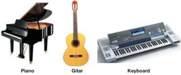

> **Deskripsi Visual:** Gambar ini adalah ilustrasi yang menunjukkan tiga alat musik: piano, gitar, dan keyboard. Ilustrasi ini memperlihatkan bentuk fisik dari setiap alat musik tersebut dengan detail yang jelas. Piano memiliki struktur yang lebih besar dan berwarna hitam putih, sedangkan gitar memiliki struktur yang lebih kecil dan berwarna coklat. Keyboard memiliki panel teks yang berwarna putih dan merah, serta tombol-tombol yang berwarna hitam. Setiap elemen ini memiliki relasi yang jelas dengan alat musik yang lainnya, menunjukkan perbedaan desain dan fungsi masing-masing. Teks pada gambar tidak ada, sehingga fokus pada visual dan penjelasan visual. Informasi kunci yang dapat diambil pembaca adalah bahwa gambar ini menunjukkan tiga alat musik yang berbeda dan memiliki bentuk dan fungsi yang berbeda-beda.

Sumber: google.co.id

Gambar 7.5 Contoh Alat Musik Harmonis

Alat  musik  harmonis,  selain  dapat  dimainkan  secara  solo,  karena  sifatnya  yang  sekaligus dapat  untuk  mengiringi  irama  lagu,  dapat  pula  dimainkan  untuk  mengiringi  permainan  alat musik yang lain dalam sebuah orkestra.

Teknik dan gaya bermain musik harmonis hampir sama dengan teknik dan gaya bermain alat musik melodis. Alat musik ini juga dapat dimanfaatkan untuk memainkan akor yang biasanya berfungsi  untuk  ritem  (iringan).  Ketika  alat  musik  harmonis  digunakan  untuk  memainkan akor,  pastikan  teknik  penjarian  ( fingering )  benar.

### Ballad for pianoNo.2

---
**🖼️ Gambar/Diagram**

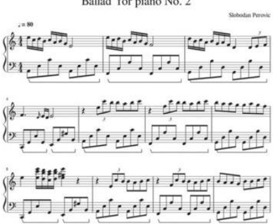

> **Deskripsi Visual:** Gambar ini adalah sebagian dari sebuah lembar notasi musik piano yang menunjukkan bagian dari komposisi "Ballad Tor" oleh Slobodan Petrović. Lembar ini terdiri dari beberapa baris notasi dengan teks dan angka yang menunjukkan tempo dan gaya notasi. Elemen utama yang ditampilkan adalah notasi musik, yang mencakup notasi nada, ritme, dan arsitektur musik. Teks dan angka penting meliputi nomor baris (No. 2), tempo (80), dan gaya notasi (Piano). Informasi kunci yang dapat diambil dari gambar ini adalah bahwa ini adalah bagian dari komposisi piano yang memiliki tempo tertentu dan struktur musik yang spesifik.

 

---
## 📄 Halaman 47

---
**🖼️ Gambar/Diagram**

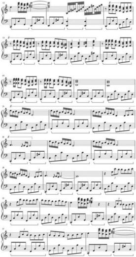

> **Deskripsi Visual:** Gambar ini menunjukkan lembar not musik yang terdiri dari beberapa baris not dengan instrumen piano. Setiap baris not memiliki not dan petunjuk untuk instrumen piano, yang mencakup nada, ritme, dan teknik pemain. Not ini tampaknya merupakan bagian dari sebuah lagu atau komposisi musik yang lebih besar. Elemen utama termasuk baris not piano, petunjuk ritme, dan petunjuk teknik pemain. Teks dan angka penting meliputi nada not, petunjuk ritme, dan petunjuk teknik pemain. Informasi kunci yang dapat diambil pembaca adalah bahwa ini adalah lembar not musik untuk piano, yang menunjukkan bagaimana cara memainkan lagu atau komposisi tersebut.

 

---
## 📄 Halaman 48

---
**🖼️ Gambar/Diagram**

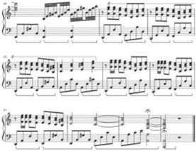

> **Deskripsi Visual:** Gambar ini adalah sebuah diagram musik yang menunjukkan struktur notasi piano. Diagram ini menggambarkan sejumlah baris notasi dengan berbagai notasi melodi dan ritme yang disusun dalam bentuk yang seragam. Setiap baris notasi memiliki nada yang berbeda dan ritme yang berbeda, yang menunjukkan bagaimana musik tersebut akan dimainkan. Notasi ini mencakup berbagai teknik musik seperti legato (notasi yang menunjukkan bagaimana seseorang harus memainkan nada dengan suara yang terus-menerus), staccato (notasi yang menunjukkan bagaimana seseorang harus memainkan nada dengan suara yang sangat pendek), dan trill (notasi yang menunjukkan bagaimana seseorang harus memainkan nada dengan suara yang bergerak dari satu nada ke nada lainnya). Selain itu, ada juga beberapa notasi yang menunjukkan bagaimana musik tersebut harus dimainkan dengan menggunakan teknik seperti legato, staccato, dan trill. Ini semua membantu pemain piano untuk memahami bagaimana musik tersebut harus dimainkan dan bagaimana teknik musik harus digunakan untuk menciptakan suara yang indah dan menarik.

---
**🖼️ Gambar/Diagram**

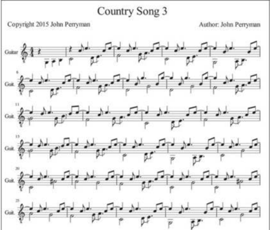

> **Deskripsi Visual:** Gambar ini menunjukkan lembar not musik untuk lagu "Country Song 3" yang ditulis oleh John Perryman pada tahun 2015. Lembar not ini berisi instrumen gitar dan melodi lagu tersebut. Terdapat tiga baris not gitar yang menunjukkan nada-nada yang harus ditekuk oleh pemain gitar. Di atas not gitar, terdapat teks yang menyebutkan judul lagu, penulis, dan copyright. Lembar not ini merupakan alat yang sangat berguna bagi pemain gitar untuk belajar dan memainkan lagu tersebut dengan benar.

 

---
## 📄 Halaman 49

---
**🖼️ Gambar/Diagram**

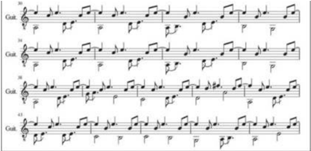

> **Deskripsi Visual:** Gambar ini adalah diagram musik yang menunjukkan notasi gitar. Diagram ini menggambarkan struktur notasi gitar dengan menggunakan notasi gitar (Guit) untuk menunjukkan nada dan arah gerakan jari. Setiap baris pada diagram ini menunjukkan notasi gitar untuk satu baris musik, dengan nada dan arah jari yang berbeda-beda. Notasi ini mencakup beberapa baris musik yang disusun secara teratur, menunjukkan struktur dasar dari sebuah lagu atau komposisi musik. Teks, angka, atau label penting yang terlihat dalam diagram ini meliputi nama instrumen (guitar), nada nada yang ditunjukkan dalam notasi gitar, dan arah jari yang harus digunakan untuk memainkan notasi tersebut. Informasi kunci yang dapat diambil pembaca meliputi struktur dasar dari notasi gitar, cara memainkan notasi gitar, dan bagaimana notasi gitar dapat digunakan untuk membuat musik.

---
**🖼️ Gambar/Diagram**

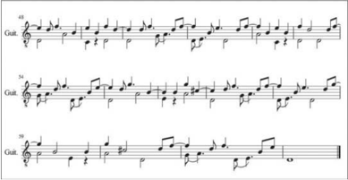

> **Deskripsi Visual:** Gambar ini adalah sebuah diagram musik yang menunjukkan notasi gitar. Diagram ini terdiri dari tiga baris notasi gitar yang disusun secara horizontal. Setiap baris menunjukkan notasi untuk satu lagu atau sebagian lagu yang berbeda. Notasi ini menggunakan notasi gitar tradisional dengan menggunakan simbol-simbol seperti garis, titik, dan petik untuk menunjukkan nada dan ritme.

Elemen utama yang ditampilkan dalam diagram ini adalah notasi gitar. Setiap baris notasi ini menunjukkan notasi untuk satu lagu atau sebagian lagu yang berbeda. Notasi ini menggunakan notasi gitar tradisional dengan menggunakan simbol-simbol seperti garis, titik, dan petik untuk menunjukkan nada dan ritme.

Teks, angka, atau label penting yang terlihat dalam diagram ini adalah notasi gitar. Notasi ini menggunakan notasi gitar tradisional dengan menggunakan simbol-simbol seperti garis, titik, dan petik untuk menunjukkan nada dan ritme.

Informasi kunci yang dapat diambil pembaca dari diagram ini adalah bahwa ini adalah sebuah diagram musik yang menunjukkan notasi gitar. Diagram ini membantu pembaca untuk memahami struktur dan struktur musik yang ditampilkan dalam notasi gitar.

### 2.  Memainkan Alat Musik dalam Grup

Memainkan	musik	 dalam	 grup	 sering	 disebut	 sebagai	 ansambel.	 Ditinajau	 dari	 ragam	 jenis alat  musik  yang  dimainkannya, ada ansambel sejenis, ansambel campuran, dan orkestra.

### a. Ansambel Sejenis

Ansambel  sejenis  adalah  ansambel  yang  memainkan  alat  musik  dari  jenis  yang  sama, misalnya ansambel perkusi, ansambel tiup, ansambel gesek, dan sebagainya.

### 1)  Ansambel Perkusi

Ansambel	perkusi	 dimainkan	 dengan	 alat-alat	 musik	 perkusi.	 Di	 Indonesia	 cukup banyak  ansambel  perkusi,  misalnya  rampak  gendang,  rebana,  drumband,  marching band, gandang, dan lain-lain.

 

---
## 📄 Halaman 50

### 2) Drumband/Marching	Band

Dalam	drumband/marching	band	instrumen	musik	perkusi	dibawa	oleh	pemain	dan dimainkan dalam barisan. Kelompok yang memainkan instrumen musik perkusi sambil berjalan  disebut  juga  sebagai drumline atau battery .  Ragam  instrumen  musik  perkusi yang digunakan alat drumband umumnya lebih sedikit daripada yang digunakan pada permainan  alat  marching  band.  Contoh  instrumen  ini  antara  lain snare  drum , drum tenor / quint , drum bass ,  dan  simbal.

Pukulan-pukulan  dasar  pada  permainan  drum  disebut basic  sticking .  Setiap  pola pukulan di bawah ini sangat penting untuk dikuasai karena sangat berpengaruh pada permainan drum dan sangat banyak digunakan.

R = Pukulan tangan kanan

L  =  Pukulan  tangan  kiri

### Single  Stroke  -  R  L  R  L  R  L  R  L

Latihan  diawali  dengan  teknik single  stroke ini  pada snare  drum .  Latihan  dimulai dengan tempo lambat,  lalu  perlahan  percepat  tempo  sampai  secepat  mungkin.  Untuk pemula yang baru belajar drum harap memukul dengan mengangkat ujung stick drum setinggi bahu, untuk melatih pergelangan tangan. Setelah pukulanmu cukup bagus dan mendapatkan tempo yang konstan, mulailah mengaplikasikan teknik single stroke pada bagian drum yang lain.

Pukul bagian snare drum (RL	RL),	lalu	tom	1/ mounted tom (RL	RL),	tom	2/ mounted tom (RL RL ), dan terakhir floor tom (RL RL). Lakukan pukulan dengan tempo lambat, kemudian sedikit demi sedikit naikkan tempo. Teknik ini fungsinya untuk fill  in pada permainan drum, contoh setelah kita memainkan untuk ketukan irama rock beat , beat 1/8, beat 1/4,	 dan beat 1/2.	 Bisa	 juga	 variasi	 dilakukan	 pada snare  drum saja.

### Double	Stroke	-	R	R	L	L	R	R	L	L

Teknik double  stroke sebenarnya  sama  dengan single  stroke yang  diulang  dua  kali. Dalam	teknik double stroke lebih dibutuhkan kecepatan gerakan dan kelenturan lengan. Jika sudah lancar dengan teknik single stroke ,  teknik double stroke tinggal melanjutkan.

 

---
## 📄 Halaman 51

Cara melatih double stroke (RR LL); gunakan bagian snare drum untuk melancarkan permainan. Bisa juga menggunakan rumus LL RR (dibalik sama saja). Agar suara yang dihasilkan lebih teratur dan menarik, pukulan tangan kanan dan kiri harus seimbang. Berikutnya dapat diteruskan dengan latihan-latihan lanjutan. Penerapan dalam kelompok drumband tentu sesuai dengan kebutuhan.

Triple  Stroke -  R  R  R  L  L  L  R  R  R  L  L  L Paradiddle -  R  L  R  R  L  R  L  L Paradiddle-diddle -  R  L  R  R  L  L

Triplet/rough -  R  R  L  R  R  L  atau  L  L  R  L  L  R

### 3)  Ansambel Tiup

Ansambel tiup adalah ansambel yang seluruh instrumen musiknya terdiri atas alatalat  musik  tiup.  Termasuk  alat  musik  tiup  adalah recorder , flute ,  trompet,  saksofon, trombon, klarinet, oboe, dan french  horn .

---
**🖼️ Gambar/Diagram**

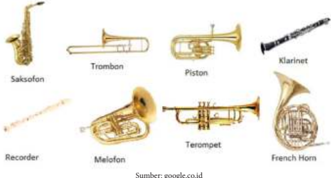

> **Deskripsi Visual:** Gambar ini adalah ilustrasi yang menunjukkan berbagai instrumen musik. Gambar ini menggambarkan 9 instrumen musik yang berbeda, termasuk Saxofon, Trombon, Piston, Klarinet, Recorder, Melafon, Teromet, dan French Horn. Setiap instrumen memiliki bentuk dan ukuran yang unik, dengan warna emas yang menonjol. Gambar ini memberikan gambaran umum tentang berbagai jenis instrumen musik dan bagaimana mereka berbeda satu sama lain. Ini adalah ilustrasi yang baik untuk membantu pembaca memahami konsep dasar tentang instrumen musik.

### Trompet

Ada	bermacam-macam	jenis	trompet.	Di	antaranya	jenis	C,	D,	Eb,	E,	F,	G,	A,	dan Bb.  Akan  tetapi,  yang  paling  lazim  dan  sering  dipakai  adalah  trompet  Bb.  Trompet C  paling  umum  dipakai  dalam  orkestra  Amerika,  dengan  bentuknya  yang  lebih  kecil memberikan suara yang lebih cerah, dan lebih hidup dibandingkan dengan trompet Bb

Trompet dapat dimainkan oleh semua orang. Syaratnya memiliki napas yang panjang dan  kuat.  Oleh  karena  itu,  perokok  agak  sulit  memainkan  trompet  karena  perokok napasnya lebih pendek daripada orang yang bukan perokok. Jadi, jika seseorang menyukai alat musik tiup seperti trompet ini, disarankan tidak merokok atau mempunyai aktivitas atau  kebiasaan.  Untuk  seseorang  yang  mempunyai  penyakit  pernapasan  sehingga menjadikannya bernapas pendek tidak disarankan memainkan alat musik tiup.

 

---
## 📄 Halaman 52

### French Horn

French horn merupakan keluarga alat musik tiup logam. Biasanya dimainkan dalam ansambel  atau  orkestra  musik  klasik.  Juga  sering  dimainkan  sebagai  seksi  tiup  dalam marching  band . French  horn memiliki  tiga  katup  pengatur  yang  dimainkan  dengan tangan  kiri  dengan  tata  cara  dalam  memainkan  yang  identik  dengan  trompet. French horn pada  umumnya menggunakan kunci F meski instrumen musik lainnya biasanya menggunakan kunci Bb.

### Klarinet

Klarinet  adalah  instrumen  musik  dari  keluarga  alat  musik  tiup.  Namanya  diambil dari clarino (Italia)	yang	berati	trompet	dan	akhiran -et yang berarti kecil. Sama seperti saksofon, klarinet dimainkan dengan menggunakan satu reed .

Klarinet  merupakan  keluarga  instrumen  terbesar,  dengan  ukuran  dan  pitch  yang berbeda-beda.  Klarinet  umumnya  merujuk  pada  soprano  klarinet  yang  bernada  Bb, Pemain clarinet disebut clarinetis .

Ada banyak jenis clarinet, beberapa di antaranya sangat langka.

- Piccolo  clarinet dalam  Ab.
- Soprano clarinet dalam	 Eb,	 D,	 C,	 Bb,	 A,	 dan	 G.
- Basset  clarinet dalam  A.
- Alto  clarinet dalam	 Eb.
- Bass clarinet dalam  Bb.
- Contra-alto clarinet dalam	 EEb.
- Contrabass clarinet dalam  BBb.

### Saksofon

Saksofon tergolong dalam keluarga alat musik tiup, terbuat dari logam dan dimainkan seperti cara memainkan clarinet .  Saksofon umumnya berkaitan dengan musik pop, big band, dan jazz, meskipun awalnya merupakan instrumen dalam orkestra dan band militer.

Nama saksofon (aslinya saxophone )  diambil  dari  nama  penciptanya,  yaitu  seorang pemain clarinet dan pembuat alat musik bernama Adolphe Sax dari Belgia pada tahun 1846.	Sax	memiliki	hak	paten	atas	alat	musik	ini	berupa	dua	keluarga saxophone yaitu keluarga	orkestra	(C	dan	F)	dan	keluarga	band	(Bb	dan	Eb).

Saat	 ini	 saksofon	 yang	 paling	 umum	 digunakan	 adalah	 soprano	 (Bb),	 alto	 (Eb), tenor	(Bb),	dan	baritone	(Eb).

 

---
## 📄 Halaman 53

Berikut adalah contoh partitur ansambel tiup sederhana.

### Edelweiss

---
**🖼️ Gambar/Diagram**

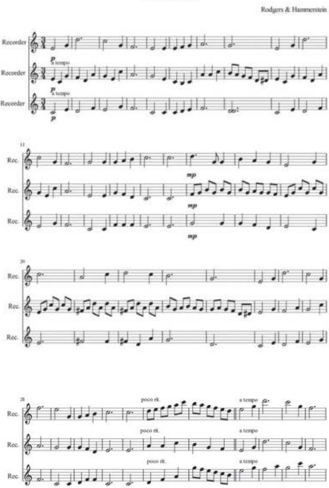

> **Deskripsi Visual:** Gambar ini menunjukkan lembar not musik untuk instrumen rekordeur (recorder) dalam format notasi musik. Lembar ini terdiri dari beberapa baris not dengan teks "Recorder" yang menunjukkan bahwa ini adalah not untuk rekordeur. Setiap baris not memiliki nada yang berbeda dan dilengkapi dengan teks "p" yang mungkin merujuk pada volume musik. Ada juga teks "R" yang mungkin merujuk pada nada rekordeur. Selain itu, ada teks "Rodgers & Hammerstein" yang mungkin merujuk pada penulis lagu atau komposer yang membuat musik ini. Lembar ini tampaknya merupakan bagian dari sebuah buku pelajaran musik yang mengajarkan cara membaca dan memainkan not musik untuk rekordeur.

 

---
## 📄 Halaman 54

---
**🖼️ Gambar/Diagram**

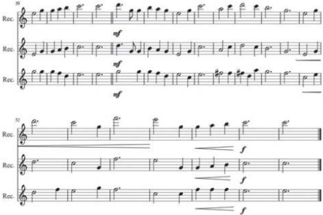

> **Deskripsi Visual:** Gambar ini adalah sebuah diagram yang menunjukkan struktur dan pola repetisi dalam musik. Diagram ini terdiri dari empat baris, masing-masing dengan tiga kolom. Setiap kolom menggambarkan suatu repetisi dalam musik, dengan notasi nada dan tempo yang berbeda-beda. Baris pertama menunjukkan repetisi yang lebih lambat dan tenang, baris kedua menunjukkan repetisi yang lebih cepat dan energik, baris ketiga menunjukkan repetisi yang lebih lambat lagi tetapi dengan nada yang lebih tinggi, dan baris keempat menunjukkan repetisi yang paling cepat dan intensif. Setiap kolom memiliki teks "Rete" di atasnya, yang mungkin merujuk pada istilah dalam bahasa Italia yang berarti "repetition". Teks ini membantu pembaca memahami bahwa setiap kolom menunjukkan repetisi dalam musik. Angka dan label penting lainnya tidak terlihat dalam gambar ini. Informasi kunci yang dapat diambil pembaca adalah bahwa diagram ini menunjukkan berbagai jenis repetisi dalam musik dan bagaimana mereka berbeda-beda dalam hal tempo dan nada.

### 8) Ansambel Gesek

Ansambel gesek  merupakan  ansambel  dengan  kelompok  alat  musik  gesek,  seperti violin,  biola, cello ,  dan contra  bass .

---
**🖼️ Gambar/Diagram**

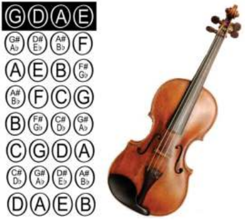

> **Deskripsi Visual:** Gambar ini adalah ilustrasi yang menunjukkan struktur dan notasi nada pada alat musik violin. Ilustrasi ini mencakup dua bagian utama: sebelah kiri berisi notasi nada dalam bentuk kotak-kotak berwarna putih dengan huruf besar dan angka, sementara sebelah kanan menampilkan gambar violin dengan penanda nada yang sama. Notasi nada berada di sebelah kiri, sedangkan gambar violin berada di sebelah kanan. Huruf besar dan angka di notasi nada menggambarkan nada-nada yang digunakan dalam musik, sementara gambar violin menunjukkan bagian-bagian alat musik tersebut. Informasi kunci yang dapat diambil pembaca meliputi struktur alat musik violin dan notasi nada yang digunakan dalam musik.

### Biola

Biola adalah alat musik berdawai yang dimainkan dengan cara digesek. Biola memiliki empat	senar	(G-D-A-E)	yang	disetel	berbeda	satu	sama	lain	dengan	interval	sempurna kelima. Nada yang paling rendah adalah G.

Sumber: google.co.id Gambar 7.8

Posisi Penjarian Biola

 

---
## 📄 Halaman 55

Alat  musik  yang  termasuk  keluarga  biola  adalah  biola  alto, cello dan double  bass atau contra bass .	Di	antara	keluarga	biola	di	atas,	biolalah	memiliki	nada	yang	tertinggi. Alat musik dawai yang lainnya, bas, secara teknis masuk ke dalam keluarga viol. Notasi musik untuk biola hampir selalu ditulis pada kunci G.

Terdapat	berbagai	ukuran	biola.	Dimulai	dari	yang	terkecil	1/16,	1/10,	1/8,	1/4,	2/4 (1/2),	 3/4,	 dan	 biola	 untuk	 dewasa	 4/4	 (penuh).	 Kadang-kadang	biola	berukuran	1/32 juga	digunakan	(ukurannya	sangat	kecil).	Ada	juga	biola	7/8	yang	biasanya	digunakan oleh  wanita.

Panjang	badan	(tidak	termasuk	leher)	biola	'penuh'	atau	ukuran	4/4	adalah	sekitar 36	 cm.	 Biola	 3/4	 sepanjang	 33	 cm,	 1/2	 sepanjang	 30	 cm.	 Sebagai	 perbandingannya, biola	 'penuh'	 berukuran	 sekitar	 40	 cm.	 Untuk	 menentukan	 ukuran	 biola	 yang	 cocok digunakan  oleh  seorang  anak,  biasanya  anak  disuruh  memegang  sebuah  biola  dan tangannya harus sampai menjangkau hingga ke gulungan kepala biola. Beberapa guru juga  menganjurkan ukuran yang lebih kecil semakin baik.

Pemain  pemula  biasanya  menggunakan  penanda  di  papan  jari  untuk  menandai posisi  jari  tangan  kiri.  Namun,  setelah  pemain  hafal  posisi  jari  tangan  kiri,  penanda tidak digunakan lagi. Biola biasanya dimainkan dengan cara tangan kanan memegang busur dan tangan kiri menekan senar. Bagi orang kidal, biola dapat dimainkan secara kebalikan.

### Cello

Cello adalah sebutan singkat dari violoncello, merupakan sebuah alat musik  gesek  dan  anggota  dari  keluarga  biola.  Orang  yang  memainkan cello disebut  cellis. Cello adalah  alat  musik  yang  populer  dalam  banyak segi  di  antaranya  sebagai  instrumen  tunggal,  dalam  musik  kamar,  dan juga sebagai instrumen pokok dalam orkestra modern. Cello memberikan suara yang megah karena nadanya yang rendah.

Ukuran cello lebih besar daripada biola atau viola, namun lebih kecil daripada bass .  Seperti  anggota-anggota lainnya dari keluarga biola, cello mempunyai	empat	dawai.	Dawai-dawainya	biasanya	berurutan	dari	nada rendah	ke	tinggi	C,	G,	D	dan	A. Cello hampir sama seperti viola tetapi satu  oktaf  lebih  rendah  dan  satu  seperlima  oktaf  lebih  rendah  daripada biola. Berbeda dengan biola, cello dimainkan dengan cara ditaruh di antara dagu dan bahu kiri. Posisi cello berdiri di antara kedua kaki pemain yang duduk, dan ditegakkan pada sepotong metal yang disebut endpin . Pemain menggesekkan penggeseknya dalam posisi horizontal melintang di dawai.

### Kuartet Gesek

Dalam	ansambel	gesek,	terdapat	kelompok	yang	populer,	yaitu	kuartet	gesek.	Kuartet gesek merujuk pada sebuah kelompok yang terdiri atas 2 (dua) biola, 1 (satu) viola, dan 1 (satu) cello . Biola pertama biasanya memainkan melodi dalam nada yang lebih tinggi. Biola kedua biasanya memainkan nada-nada yang lebih rendah dalam harmoni. Viola menjadi  pengiring  yang  memberikan  warna  seperti  suara  tenor  dalam  paduan  suara. Cello berfungsi  seperti  viola  tetapi  dalam  nada  yang  lebih  rendah  seperti bass dalam

 

---
## 📄 Halaman 56

paduan suara. Kuartet gesek yang standar pada umumnya dianggap sebagai salah satu dari bentuk terpenting dari musik kamar, dan kebanyakan komponis yang penting, sejak akhir	 abad	 ke-18,	 menulis	 kuartet	 gesek.	 Sebuah	 komposisi	 untuk	 empat	 pemain	 alat musik  petik  dapat  dibuat  dalam  bentuk  apapun,  tetapi  bila  hanya  disebutkan  sebuah kuartet  gesek.

---
**🖼️ Gambar/Diagram**

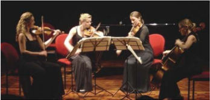

> **Deskripsi Visual:** Gambar ini adalah foto yang menunjukkan empat musisi yang sedang bermain musik. Mereka duduk di kursi yang berwarna merah muda, dengan setiap musisi memegang alat musik mereka. Dua dari mereka memainkan violin, sementara dua lainnya memainkan gitar dan bass. Semua musisi tampak fokus pada tugas mereka, menunjukkan kekompakan dan profesionalisme dalam penampilan mereka. Gambar ini menunjukkan bagaimana musisi profesional bekerja sama untuk menghasilkan suara yang harmonis.

Gambar 7.10 Kuartet Gesek ' Iuventus String Quartet '

### 9)  Ansambel Petik (Gitar)

Ansambel petik (gitar) tentu yang dimainkan adalah  gitar  semua.  Sebagaimana  namanya, ansambel gitar menggunakan instrumen utama gitar.

Banyak versi tentang sejarah gitar. Ada yang menyebutkan  bahwa  gitar  berasal  dari  Timur Tengah  dan  Arab.  Ada  pula  yang  menyatakan bahwa gitar berasal dari Afrika. Silakan pelajari sejarah gitar melalui sumber-sumber yang baik dari  internet  atau  buku-buku  perpustakaan. Lebih  jelasnya,  gitar  yang  kita  kenal  sekarang, disebut sebagai gitar modern, terdari atas gitar akustik dan gitar elektrik. Gitar akustik sering  pula  disebut  sebagai  gitar  Spanyol  karena  dalam  sejarahnya  di  Spanyollah  gitar bertransformasi menjadi:

- Guitarra Morisca yang  berfungsi  sebagai  pembawa melodi,
- Guitarra Latina untuk  memainkan akor.
Mengenai	cara	memainkan	gitar	sudah	pernah	dibahas	di	buku	kelas	VII	Bab	8.

 

---
## 📄 Halaman 57

Berikut contoh partitur ansambel gitar. Silakan berlatih untuk menyajikan ansambel berikut.  Jika  dipandang  baik,  dapat  dimainkan  dalam  acara  perpisahan.

---
**🖼️ Gambar/Diagram**

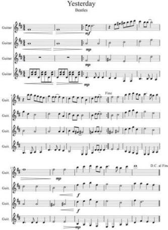

> **Deskripsi Visual:** Gambar ini menunjukkan lembar not musik untuk lagu "Yesterday" oleh The Beatles. Lembar not ini terdiri dari beberapa baris not gitar dengan instrumen gitar tertulis di atasnya. Setiap baris not menunjukkan lirik dan nada yang harus ditekankan pada saat memainkan lagu tersebut. Not gitar ini menggunakan not gitar standar dengan nada-nada yang ditunjukkan dalam not gitar. Teks "Guitar" muncul di atas setiap baris not, menunjukkan bahwa ini adalah not gitar. Ada juga teks "mp" yang menunjukkan volume musik yang harus digunakan saat memainkan lagu tersebut. Lembar not ini sangat berguna bagi pemain gitar yang ingin belajar memainkan lagu "Yesterday" oleh The Beatles.

 

---
## 📄 Halaman 58

### B.  Menampilkan Beberapa Lagu dalam Pagelaran Musik Barat

Tahap yang paling penting dalam merencanakan pagelaran musik adalah pelatihan. Pelatihan merupakan wahana untuk mengasah keterampilan sekaligus sebagai alat untuk mengukur kemajuan yang  dicapai  dalam  tiap-tiap  tahapnya.  Tahap  pelatihan  ini  bisa  memakan  waktu  berhari-hari, bahkan	berbulan-bulan	hanya	untuk	menyajikan	karya	musik	yang	hanya	beberapa	jam	saja.	Ibarat seorang	pelari	cepat	yang	hanya	akan	berlomba	lari	100	meter	tetapi	ia	berlatih	lari	berhari-hari sampai sejauh beribu-ribu meter. Oleh karena itu, jangan bosan untuk berlatih. Pemusik yang ahli pun harus tetap berlatih jika akan mementaskan karya-karyanya.

Dalam	pagelaran	musik	yang	melibatkan	banyak	pendukung,	yang	perlu	diperhatikan	adalah bahwa pagelaran musik itu merupakan kerja tim sehingga suasana satu kesatuan harus diciptakan. Dalam	kerja	tim	tidak	boleh	ada	yang	merasa	paling	menonjol.	Oleh	karena	itu,	cobalah	bentuk kelompok untuk menyajikan hasil aransemen yang sudah kamu buat. Untuk tahap awal, tampilkan karyamu di kelas terlebih dahulu. Jangan lupa, setelah selesai penampilanmu, mintalah kritik dan saran  dari  teman-teman  dan  guru.  Kritik  dan  saran  akan  semakin  menambah  kemampuanmu dalam berkarya musik.

### Membuat Perencanaan Pagelaran

Untuk  menghasilkan  pagelaran  yang  sukses,  kamu  harus  merancangnya  dengan  cermat dan	 hati-hati.	 Kamu	 harus	 bisa	 menyusun	 proposal	 kegiatan	 pagelaran	 dengan	 baik.	 Dengan mengetahui proposalmu, pihak-pihak yang berkepentingan dapat mengerti pentingnya pagelaran yang  kamu  adakan.  Penyusunan  proposal  ini  tidak  hanya  diperlukan  untuk  mengatur  persiapan dan  pelaksanaan  pagelaran  saja  tetapi  juga  diperlukan  untuk  mencari  sponsor.  Meskipun  hanya pagelaran	musik	amatir	tingkat	siswa	kelas	XI,	tetap	saja	membutuhkan	biaya.	Nah,	proposal	ini dapat dipakai untuk mengajukan anggaran kepada pihak sekolah.

Beberapa  rumusan  penting  dalam  penyusunan  proposal  kegiatan  pagelaran  musik  seperti diuraikan sebagai berikut.

- Rumuskan nama dan tema pagelaran
Nama  dan  tema  pagelaran  sangat  penting  dirumuskan  dalam  proposal  karena  akan berkaitan  langsung  dengan  jenis  musik  dan  lagu  yang  akan  ditampilkan  juga  bermanfaat untuk  publikasi.  Penentuan  tema  hendaknya  dilakukan  dengan  musyawarah  panitia  atau perwakilan  kelas.  Perumusan  tema  ini  penting  karena  dengan  tema  tertentu,  pagelaran yang diselenggarakan menjadi terarah.

- b.
- Rumuskan latar belakang, tujuan, dan manfaat diadakannya pagelaran
Pihak-pihak yang berkepentingan secara tidak langsung pasti akan menanyakan, mengapa pagelaran  musik  ini  diadakan.  Untuk  menjawab  pertanyaan  seperti  ini,  kamu  harus merumuskan  latar  belakang  diselenggarakannya  pagelaran.  Latar  belakang  adalah  alasan diadakannya	suatu	kegiatan.	Dalam	latar	belakang	ini	juga	harus	dinyatakan	bahwa	pagelaran yang  kamu  adakan  itu  memang  penting.  Setelah  itu,  tujuan  dan  manfaat  diadakannya pagelaran itu pun harus dirumuskan supaya pihak-pihak yang berkepentingan maklum.

 

---
## 📄 Halaman 59

### c. Rumuskan bentuk pagelaran

Ada bermacam bentuk pagelaran musik di antaranya, bentuk orkestra, paduan suara, ansambel, dan	 band.	 Dalam	 pagelaran-pagelaran	 tertentu,	 ditampilkan	 bentuk-bentuk	 tertentu	 saja. Akan tetapi, dalam pagelaran sering pula ditampilkan bermacam-macam bentuk sekaligus. Nah, dalam menyusun proposal, kamu tentukan bentuk mana yang akan kamu tampilkan.

- Rumuskan pihak mana saja yang akan mendukung acara pagelaran
Baik  hanya  menampilkan grup-grup musik di sekolah kamu maupun menampilkan grup musik  dari  luar,  pihak-pihak  pendukung  acara  tetap  harus  dicantumkan  dalam  proposal. Perncantuman pendukung acara pagelaran perlu karena untuk mempermudah pemantauan. Bahkan,  untuk  pagelaran  musik  yang  berskala  besar,  kamu  juga  harus  menyampaikan proposal ini kepada pihak berwenang untuk keperluan izin keramaian.

- e.
Judul-judul  karya  musik  dan  lagu  yang  akan  ditampilkan  dalam  pagelaran  juga  harus

- Tentukan karya-karya musik dan lagu yang akan ditampilkan dirumuskan dalam proposal.
- Tentukan tempat dan perkiraan jumlah penonton termasuk setting tempat
Penentuan  tempat  pagelaran  musik  sangat  penting  karena  berkaitan  langsung  dengan masalah keamanan. Jika pagelaran yang kamu rencanakan diadakan di tempat umum dan terbuka, kamu harus meminta izin kepada aparat keamanan karena mereka berkepentingan menjaga keamanan dan ketertiban. Bahkan, perencanaan pagelaran dalam skala kecil dan diadakan  di  halaman  atau  gedung  sekolah  pun  tetap  harus  mencantumkan  sekolahmu untuk meminta izin pihak sekolah dalam pemakaian fasilitas sekolah tersebut.

- g.
- Rumuskan rincian jadwal kegiatan
Tahap-tahap kegiatan sejak penyusunan proposal sampai pelaksanaan kegiatan hendaknya kamu rumuskan dengan sistematis. Kalender akademik sekolah dapat kamu pakai sebagai acuan penyusunan jadwal pagelaran.

- Rumuskan anggaran biaya
Betapapun kecilnya pagelaran musik, pasti memerlukan biaya. Oleh karena itu, rumuskan secara  rinci  anggaran  yang  dibutuhkan.

- Tentukan penanggung jawab dan susunan panitia
- Sebagai  sebuah  kerja  tim,  pagelaran  perlu  pengorganisasian  yang  jelas.  Oleh  karena  itu,
susunan panitia tetap harus dibentuk dan dicantumkan dalam proposal.

- Sertakan lampiran yang diperlukan
- Teks karya-karya musik dan lagu yang akan ditampilkan.
- Skema desain tempat pagelaran.

 

---
## 📄 Halaman 60

### Rangkuman

- Ansambel  adalah  permainan  musik  kelompok  yang  memainkan  lagu  dengan memperhatikan harmoni yang indah dan padu.
- Agar  dapat  memainkan  ansambel  dengan  baik,  permainan  alat  musik  harus  dikuasai dengan baik pula.
- Alat  musik  yang  biasa  dimainkan  dalam  ansambel  adalah  alat  musik  melodis,  ritmis, dan harmonis.
- Alat  musik  melodis  adalah  alat  musik  yang  memiliki  nada  dan  biasa  dimanfaatkan untuk memainkan melodi lagu.
- Alat  musik  ritmis  adalah  alat  musik  yang  tidak  memiliki  atau  hanya  memiliki  satu nada yang biasa dimanfaatkan untuk mengiringi dan mengatur ritme atau irama lagu.
- Alat  musik  harmonis  adalah  alat  musik  yang  memiliki  nada  dan  nada-nada  itu  dapat dimainkan secara bersamaan sekaligus sebagai akor untuk mengiringi melodi.
- Ditinjau	 dari	 kategori	 alat	 musiknya,	 ansambel	 dibedakan	 menjadi	 ansambel	 sejenis dan ansambel campuran.
- Ansambel sejenis adalah ansambel dengan alat musik yang sama.
- Ansambel sejenis ada bermacam-macam, misalnya ansambel perkusi, tiup, gesek, dan gitar.
- Ansambel perkusi memanfaatkan alat-alat musik pukul ritmis seperti rampak kendang, drum band, rebana, hadrah, gandang, dan lain-lain.
- Ansambel tiup adalah ansambel yang memainkan alat-alat musik tiup, seperti saksofon, trompet, trombo n,  flute,  saluang,  french  horn.
- Ansambel gesek adalah ansambel yang memainkan alat-alat musik gesek seperti biola, viola,	cello,	contra	bass.	Di	kalangan	pemusik	klasik	dikenal	ansambel	gesek	yang	sangat populer sebagai musik kamar, seperti kuartet gesek.
- Ansambel  petik  juga  disebut  ansambel  gitar  memainkan  alat  musik  gitar  dalam kelompoknya.  Ansambel  gitar  cukup  populer  di  kalangan  pelajar  karena  di  samping mudah didapat alatnya, bermain gitar juga populer di kalangan siswa.

### Penilaian Sikap

### 1. Penilaian Diri

- Setelah  memainkan  alat  musik  barat,  apakah  kamu  dapat  merasakan  bahwa  keindahan musikal bersifat universal?
- Sebutkan hal-hal apa yang dapat kamu tingkatkan dan sebutkan pula hal-hal yang sudah kamu nilai baik dalam pemahaman serta apresiasimu terhadap musik barat!
- Setelah  melaksanakan  pagelaran  musik  barat,  bagaimana  perasaanmu?  Apakah  seniman musik kita dapat menghasilkan karya yang sama bagusnya?
- Samakah	rasanya	memainkan	lagu	barat	dan	lagu	Indonesia?

 

---
## 📄 Halaman 61

### 2. Penilaian yang Berhubungan dengan Perilaku

- Bagaimana tanggapanmu terhadap permainan musik teman-temanmu? Berilah penilaian!
- Bagaimana  pendapatmu,  apakah  dengan  menampilkan  karya  seni  dari  bangsa  lain  akan melunturkan identitas bangsa sendiri? Jelaskan alasanmu!

### 3. Penilaian Unjuk Kerja

Kamu sudah menilai kemampuanmu sendiri. Kini kamu juga diminta menilai temanmu dalam pementasan pagelaran musik barat.

---
**📊 Tabel**

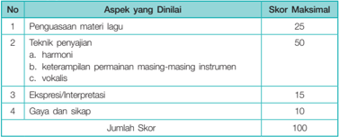

Tabel ini menunjukkan skor maksimal untuk berbagai aspek yang dilinai dalam penilaian materi lagu. Topik utama tabel adalah aspek-aspek yang harus diperhatikan dalam penilaian lagu, yaitu penguasaan materi lagu, teknik penyajian lagu, ekspresi/interpretasi, dan gaya/sikap. Kolom "No" memberikan nomor urut untuk setiap aspek yang dilinai. Kolom "Aspek yang Dilinai" menyebutkan aspek-aspek tersebut, sedangkan kolom "Skor Maksimal" menunjukkan skor tertinggi yang dapat diberikan untuk setiap aspek. Data penting yang terlihat adalah bahwa skor maksimal untuk penguasaan materi lagu adalah 25, sementara untuk teknik penyajian lagu, skor maksimal adalah 50. Skor maksimal untuk ekspresi/interpretasi adalah 15, dan untuk gaya/sikap adalah 10. Jumlah skor yang dapat diberikan adalah 100.

### 4. Penilaian Pengetahuan

Jawablah dengan cermat!

- Jelaskan  kategori  alat  musik  menurut  fungsinya!
- Jelaskan  teknik  permainan alat musik melodis!
- Sebutkan masing-masing lima contoh alat musik ritmis, melodis, dan harmonis!
- Alat  musik manakah yang berfungsi untuk memainkan lagu?
- Prinsip  memainkan  alat  musik  harmonis  adalah  penguasaan  akor.  Jelaskan  apa  yang dimaksud akor!

 

---
## 📄 Halaman 62

### BAB 8

### MEMBUAT TULISAN TENTANG MUSIK BARAT

---
**🖼️ Gambar/Diagram**

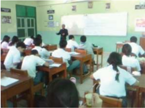

> **Deskripsi Visual:** Gambar ini menunjukkan sebuah ruang kelas dengan beberapa siswa yang sedang belajar. Siswa-siswa tersebut duduk di meja berwarna putih dengan kursi kayu, sementara guru berdiri di depan mereka di dekat papan tulis putih. Papan tulis berisi beberapa teks dan gambar, mungkin untuk membantu pembelajaran. Di sebelah kanan papan tulis, terdapat papan dengan beberapa poster atau informasi pendidikan. Siswa-siswa tampak tertarik dan aktif dalam proses belajar, menunjukkan bahwa mereka sedang mengikuti sesi pembelajaran yang serius dan interaktif.

### TUJUAN PEMBELAJARAN

### PENDEKATAN PEMBELAJARAN

Pada	Bab	8,	siswa	diharapkan	dapat:

- menjelaskan macam-macam jenis tulisan ulasan seni musik,
- mengidentifikasi sistematika tulisan ulasan seni musik untuk berbagai keperluan,
- menganalisis karya seni musik barat dengan kriteria tertentu untuk menyusun karya tulis, dan
- menyusun karya tulis tentang seni musik untuk berbagai keperluan.
- Mengamati
- Menanyakan
- Mengasosiasi
- Membuat Karya
- Mengomunikasikan
Gambar 8.1 Pelajaran Seni Musik SMAN 42 Jakarta

 

---
## 📄 Halaman 63

---
**🖼️ Gambar/Diagram**

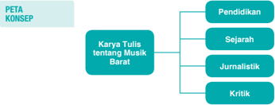

> **Deskripsi Visual:** Gambar ini adalah diagram konsep yang menunjukkan struktur topik utama tentang karya tulis tentang musik Barat. Diagram ini terdiri dari satu titik pusat yang disebut "Karya Tulis tentang Musik Barat" dan empat cabang utama yang masing-masing berisi sub-topik. Cabang-cabang tersebut adalah:

1. Pendidikan
2. Sejarah
3. Jurnalistik
4. Kritik

Elemen-elemen utama dalam diagram ini adalah:
- Titik pusat yang menunjukkan topik utama
- Empat cabang utama yang menggambarkan sub-topik
- Relasi antara cabang-cabang yang menunjukkan hubungan antar sub-topik

Teks, angka, atau label penting yang terlihat dalam diagram ini adalah:
- "Pendidikan"
- "Sejarah"
- "Jurnalistik"
- "Kritik"

Informasi kunci yang dapat diambil pembaca dari gambar ini adalah bahwa karya tulis tentang musik Barat dapat dikelompokkan menjadi empat kategori utama: pendidikan, sejarah, jurnalistik, dan kritik. Ini menunjukkan bahwa ada berbagai sudut pandang dan aspek yang dapat dipelajari dalam konteks musik Barat.

### KEGIATAN MENANYA

### KEGIATAN MENGEKSPLORASI

### A.  Membuat Tulisan tentang Musik Barat

Ditinjau	 dari	 fungsinya,	 tulisan	 tentang	 seni	 musik	 dapat	 dibedakan	 menjadi	 tulisan	 untuk tujuan pendidikan dan pembelajaran, sejarah musik, jurnalistik, dan kritik musik.

### 1. Tulisan untuk Pendidikan dan Pembelajaran Musik

Buku yang sedang kamu pelajari ini merupakan contoh tulisan tentang musik untuk tujuan pendidikan  dan  pembelajaran.  Tulisan  tentang  musik  dapat  berupa  tulisan  tentang  keseluruhan keilmuan seni musik atau bagian-bagian dari keseluruhan tersebut. Misalnya ada tulisan tentang teknik bermain gitar, teknik bermain piano, teknik bermain drum, dan sebagainya. Tulisan tersebut juga  merupakan  tulisan  tentang  musik  yang  bertujuan  untuk  pendidikan  dan  pembelajaran. Begitu  pula  tulisan  tentang  unsur-unsur  seni  musik,  tentang  harmoni  dalam  seni  musik,  tempo dan dinamik, dan sebagainya juga merupakan tulisan teoritis tentang seni musik. Jadi, sejak seni musik dianggap sebagai cabang keilmuan tersendiri, tulisan teoritis tentang seni musik mengalir ke  tengah-tengah masyarakat.

Tulisan untuk pendidikan dan pembelajaran ini sangat berguna bagi yang gemar mempelajari seni  musik  tidak  hanya  dari  sisi  keterampilan  berseninya.  Orang  yang  berminat  menelaah  seni musik dari sisi ilmu pengetahuannya sangat tertolong membaca tulisan tentang seni musik ini.

- Apakah ulasan tentang karya seni musik diperlukan?
- Bagaimanakah  menyajikan  gagasan  dalam  penyusunan  karya  tulis tentang seni musik?
- Untuk  keperluan  apa  saja  karya  tulis  ulasan  dan  kritik  seni  musik tersebut?
- Kriteria apa saja yang dipakai untuk menganalisis karya seni musik?
- Dalam	bentuk	apa	karya	tulis	tentang	seni	musik	disajikan?
- Apa gunanya bagi penulis maupun bagi khalayak dalam menyajikan karya tulis  tentang  seni  musik.

 

---
## 📄 Halaman 64

Sistematika  tulisan  tentang  seni  musik  untuk  tujuan  pendidikan  dan  pembelajaran  adalah sebagai berikut.

- Deinisi	seni	musik.
- Unsur-unsur seni musik.
- Alat  dan  sarana  seni  musik.
- Penyajian seni musik.

### 2. Tulisan tentang Sejarah Musik

Dalam	 Kamus	 Besar	 Bahasa	 Indonesia,	 sejarah	 musik	 diartikan	 sebagai	 pengetahuan	 yang mencakupi uraian deskriptif tentang musik dalam masyarakat, riwayat seniman, riwayat pendidikan musik,  sejarah  notasi,  kritik,  perbandingan  gaya,  dan  perkembangan  musik.  Tidak  hanya  dari sisi  perkembangan seni musik saja, tulisan sejarah seni musik juga memuat peristiwa pengaruhmempengaruhi antara seni musik dari satu masyarakat dengan masyarakat lainnya.

Pada semester yang lalu dalam buku ini juga sudah dibahas perkembangan seni musik barat. Tulisan  tersebut  juga  tergolong  sejarah  seni  musik.  Berikut  disajikan  contoh  tulisan  sejaran  seni musik  terutama  yang  menyangkut  kiprah  tokoh  seniman  musik  bosanova  dari  Brazil,  Antonio Carlos Jobim.

### Mengenal Antonio Carlos Jobim: Arsitek Musik Bossanova dan Musik Brazil Modern

oleh: Anc (http://www.kompasiana.com)

Tokoh dibalik kejayaan Bossanova menurut para sejarawan, jurnalis musik, hingga musisi, baik dari Brazil maupun dunia internasional, ada tiga orang yaitu Joao Gilberto , Vinicius de Moraes ,  dan Antonio  Carlos  Jobim .  Joao  Gilberto  (1937)  berhasil  menunjukkan  kepada  dunia  betapa  indahnya musik Bossanova melalui gaya menyanyinya yang datar namun lembut didukung oleh petikan gitar yang  tak  kalah  menyejukkan  sehingga  menjadikan  musik  Bossanova  ini  indah  dan  nikmat  untuk didengar.	 Vinicius	 de	 Moraes	 (1914-1980)	 merupakan	 sosok	 yang	 bertanggung	 jawab	 di	 balik keindahan  lirik  pada  lagu-lagu  Bossanova.  Vinicius  sebelumnya  adalah  seorang  diplomat  Brazil yang juga aktif sebagai dramawan, sastrawan, dan juga penyanyi. Kecintaannya kepada sastra dan musik	membuatnya	rela	meninggalkan	karir	Diplomatnya.

Jobim  adalah  tokoh  utama  yang  berhasil  membawa  musik  Bossanova  hingga  level  dunia internasional.  Tidak  hanya  itu  saja,  Jobim  juga  sukses  membangun  sebuah  konsep  dasar  bagi berkembangnya musik Brazil modern atau yang dikenal dengan nama Musica Populeira Brasileira (MPB).

Jobim	dilahirkan	di	Tijuca,	RIO	DE	JANEIRO	pada	25	januari	1927.	Jobim	lahir	dan	dibesarkan dalam	lingkungan	keluarga	yang	berada.	Ayahnya,	Jorge	de	Oliviera	Jobim	adalah	seorang	Diplomat, Professor sekaligus Jurnalis dan ibunya Nilza Almeyda de Brasileiro adalah seorang kepala sekolah. Kedua	orang	tuanya	bercerai	saat	Jobim	masih	kanak-kanak.	Ibunya	kemudian	membawa	Jobim	dan adiknya,	 Helena,	 ke	 distrik	 Ipanema	 sebuah	 distrik	 di	 dekat	 pesisir	 barat	 kota	 RIO	 DE	 JANEIRO dan menikah kembali dengan Celso Passoa, sosok yang mendukung passion Jobim terhadap musik bahkan membelikan sebuah piano klasik sebagai wujud dukungannya.

 

---
## 📄 Halaman 65

Reputasi  Jobim  mulai  bersinar  pada  tahun  1956,  ketika  dia  diminta  oleh  Vinicius  de  Moraes sebagai  komposer  Musik  untuk  sebuah  film  yang  berjudul  Orfeu  de  Conceicao.  Salah  satu  lagu soundtrack dalam film ini akhirnya menjadi salah satu trademark bagi Jobim yaitu Se Todos Fossem Iguais	A	Voce.	Tiga	tahun	kemudian	Vinicius	dan	Tom	kembali	dipanggil	untuk	membuat	sebuah soundtrack untuk film selanjutnya yaitu Black Orpheus (1959). Lagu-lagu tersebut dikerjakan Tom dan Vinicius melalui telepon karena Vinicius saat itu sedang dinas di Montevideo, Uruguay.

Popularitas Tom Jobim dengan konsep musik Bossanovanya akhirnya semakin mendapat apresiasi hingga  memasuki  Amerika  Serikat.  Semua  berawal  dari  kunjungan  misi  kebudayaan  Amerika Serikat ke Brazil yang di dalamnya terlibat seorang gitaris Jazz legendaris Amerika Serikat, Charlie Byrd.  Byrd  yang  kemudian  menemukan  genre  musik  ini  di  sebuah  kelab  malam  di  Rio  di  mana Tom Jobim, Sergio Mendes, dan Joao Gilberto sering tampil di sana, akhirnya bergegas menemui rekannya yang merupakan seorang saksofonis legendaris Amerika Serikat, Stan Getz sepulang dari Brazil. Proyek kolaborasi Charlie Byrd dan Stan Getz yang bereksperimen dengan aliran musik ini ternyata sukses besar. Album hasil proyek mereka yang berjudul Jazz Samba (1961) berhasil mencapai peringkat	 pertama	 dalam	 Chart	 album	 di	 Amerika	 Serikat	 selama	 kurang	 lebih	 70	 minggu	 dan menjadi	awal	Bossanova	Crazes	merajalela	di	seluruh	Amerika	Serikat	hingga	akhir	1960-an.	Tom Jobim  akhirnya  mendapat  undangan  khusus  dari  Konsulat  Jenderal  Brazil  untuk  tampil  bersama musisi  Jazz  Amerika  Serikat  di  Carnegie  Hall,  New  Y ork  pada  tahun  1961.  Bersama  Jobim  turut serta  legiun  Bossanova  lainnya  seperti  Carlos  Lyra  dan  Joao  Gilberto.

Sumber:	Anc,	http://www.kompasiana.com

### 3. Tulisan Jurnalisme Musik

Tulisan jurnalisme musik adalah tulisan yang berisi ulasan seni musik, khususnya pertunjukan musik  atau  peristiwa  musik  yang  lain.  Sebagaimana  tulisan  jurnalisme  pada  umumnya,  tulisan jurnalisme  musik  juga  dimaksudkan  untuk  penyampaian  informasi  kepada  khalayak  tentang suatu berita. Jadi, tulisan jurnalisme musik juga menonjolkan tersampaikannya informasi tentang pertunjukan musik kepada khalayak.

Prinsip-prinsip tulisan jurnalisme musik sama dengan tulisan jurnalisme pada umumnya. Tulisan haruslah  aktual  dan  faktual,  bukan  fiktif.  Tulisan  juga  harus  objektif.  Tulisan  dibangun  dengan gaya deduktif atau piramida terbalik. Yang penting didahulukan dan rinciannya dikemudiankan. Isi	 tulisan	 juga	 harus	 memuat	 5	 W	 +	 1	 H,	 yakni what , who , when , where , why ,  dan how .

Dalam	contoh	tulisan	jurnalisme	musik	di	bawah	ini	dapat	dianalisan	unsur-unsur	pokoknya.

What pada  tulisan  tersebut  adalah  konser  tunggal  perdana  penyanyi  Andien  yang  bertajuk 'Metamorfosa Andien: Liar Penuh Cerita Mengejutkan' .

Who -nya	 adalah	 Andien,	 seorang	 penyanyi	 pop	 wanita	 Indonesia	 yang	 populer	 di	 kalangan penggemarnya.

When -nya	adalah	Rabu	(15/8/2015)	malam.

Where -nya di JCC (Jakarta Convention Cetre) Plenary Hall, Jakarta.

Why -nya  adalah  konser  tersebut  menandai  15  tahun  Andien  berkarya  musik  dalam  blantika musik	pop	Indonesia.

How -nya  adalah  gambaran  tentang  aksi  Andien  yang  liar  dan  penuh  kejutan  di  atas  panggung konser  yang  megah  dan  mewah.  Juga  deskripsi  tentang  aksi  Andien  beserta  para  bintang  tamu dalam membawakan lagu-lagu hit di dalam 6 album yang dihasilkan selama karier bermusiknya.

 

---
## 📄 Halaman 66

Tulisan  jurnalisme  umumnya  memberikan  ulasan  yang  objektif  dan  faktual.  Ada  dua  jenis tulisan  jurnalisme  tentang  seni  musik,  yakni:

### a. Resensi

Resensi adalah tulisan yang berisi ulasan karya seni musik yang siap dilepas ke masyarakat. Biasanya  berisi  pertimbangan  tentang  perlunya  masyarakat  menikmati  karya  seni  musik tersebut  tetapi  berbeda  dengan  kritik,  resensi  lebih  kepada  melontarkan  ajakan  kepada khalayak untuk menikmati karya seni musik tersebut.

Langkah-langkah resensi sebagai berikut.

- Pahami dasar-dasar teori musik sebagai landasan memberikan pertimbangan.
- Amati dan pelajari karya seni musik yang akan diresensi.
- Temukan  keunggulan  dan  kelemahan  karya  seni  musik  tersebut  berdasarkan  kajian teori  musik.
- Berikan pertimbangan kepada khalayak.
- Susun tulisan resensi dengan sistematika:
- identitas  karya  seni  (pencipta,  penyaji,  genre,  dan  tahun release ),
- deskripsi singkat tentang karya seni musik tersebut, penciptanya, penyajinya, garapan musiknya, dan sebagainya,
- pertimbangan  bagi  khalayak  (mengapa  khalayak  perlu  menikmati  karya  tersebut), dan
- simpulan berupa rekomendasi kepada khalayak untuk menikmati karya seni musik tersebut.

### b. Review

Review  adalah  tulisan  jurnalisme  yang  berisi  ulasan  tentang  unsur-unsur  seni  musik, penciptanya, penyajinya, garapannya, dan penampilannya. Biasanya review disajikan setelah sebuah pergelaran musik dilaksanakan. Berikut adalah contoh tulisan jurnalisme musik.

### REVIEW KONSER Metamorfosa Andien: Liar Penuh Cerita Mengejutkan

(http://showbiz.liputan6.com)

oleh: Firli Athiah Nabila,

Andien Aisyah atau yang lebih akrab disapa Andien sukses menggelar konser tunggal perdananya	di	JCC	Plenary	Hall,	Rabu	(15/8/2015)	malam.	Konser	bertajuk	'Metamorfosa' ini  berhasil  membius  penonton  dengan  aksi  liar  Andien  serta  visual  yang  memanjakan mata. Konser yang digelar dalam rangka 15 tahun Andien berkarya bekerja sama dengan 5	musisi,	5	desainer,	dan	juga	5	penata	musik	di	Tanah	Air.	Dengan	panggung	sederhana, sorotan  lampu  tajam,  Andien  membuka  konser  dengan  muncul  di  tengah  bersama  lima penarinya	dibalut	busana	serba	biru	karya	Didi	Budiarjo.

 

---
## 📄 Halaman 67

Seluruh sisi panggung yang didominasi kayu terjamah oleh Andien. 'Pulang' menjadi lagu	ke-10	Andien	di	konser	Metamorfosa.	Penyanyi	yang	sudah	menelurkan	enam	album ini  kemudian  mengajak  penonton  bernostalgia  melihat  video  masa  kecil  Andien  sampai menikah. Tidak berhenti di situ, Andien berturut-turut menyanyikan single 'Teristimewa' dan	'Gemintang' .	 Di	 dua	 lagu	 itu,	 ia	 bergaya	 seperti	 Cat	 Woman	 dengan	 jumpsuit	 hitam kulit	 nan	 seksi.	 Kemudian	 Andien	 berganti	 baju	 dress	 hitam	 dengan	 aksesoris	 unik.	 Ia memanggil	guest	star	selanjutnya,	Yovie	Widianto	untuk	diajak	duet	lagu	'Kasih	Putih' .

Suasana semakin seru saat Andien menyanyikan 'Satu yang Tak Bisa Lepas' dari album terbarunya.	Di	lagu	ini,	Andien	memakai	baju	yang	dipenuhi	cat.	Ia	lalu	memanggil	guest star	 selanjutnya,	 Jevin	 Llyod	 memadukan	 unsur	 beatbox	 dan	 EDM	 menyanyikan	 medley lagu	'Ipanema' ,	'Valentine' ,	dan	'Menjelma' .	Wanita	berusia	30	tahun	ini	mengajak	penonton berjoget  dengan  single  'Jadikan  Aku  Pacarmu' .  Belum  habis  di  lagu  tersebut,  Andien medley	dua	lagunya	berjudul	'Bisikan	Hati'	dan	'Detik	Tak	Bertepi'	dari	album	pertama Andien	 berjudul	 Bisikan	 Hati	 yang	 rilis	 pada	 tahun	 2000.	 Tak	 lupa	 Andien	 memberikan tribute	kepada	mendiang	Elfa	Secoria	menyanyikan	'Selamat	Jalan	Kekasihku' .	Lalu,	konser mendadak	 'pecah'	 di	 lagu	 berikutnya,	 'Let	 It	 Be	 My	 Way'	 yang	 ia	 nyanyikan	 bersama guest star terakhir The Cash. Sepanjang lagu ini Andien dan The Cash membuat penonton terbahak-bahak dengan ulah mereka di atas panggung.

Sejak awal, penonton terus di buat penasaran dengan aksi serta kostum panggung Andien. Penyanyi yang memulai kariernya di usia belia ini membawakan 24 lagu dengan berganti baju	lebih	dari	10	busana	dari	karya	lima	desainer,	yakni	Mel	Ahyar,	Todjo,	Tri	Handoko, Didi	Budiarjo,	dan	Danjyo	Hiyoji.	Secara	keseluruhan	Andien	sukses	bermetamorfosa	di	15 tahun	berkarya.	Ia	tidak	hanya	memperdengarkan	suara	emasnya,	tetapi	juga	menyuguhkan aksi  panggung serta visual yang sulit dilupakan.

Andien pun tampak puas dengan konser Metamorfosa miliknya. 'Terima kasih semuanya untuk  malam  ini.  Metamorfosa  ini  memaknai  15  tahun  saya  berkarya  yang  merangkum titik saya dari bawah, perlahan naik, berada di puncak, kemudian ada di fase jatuh sampai akhirnya  sahabat-sahabat  saya  di  lima  desainer,  komposer,  dan  lainnya  mau  membantu saya  tanpa  melihat  satu  mata  untuk  kembali  bangkit  sampai  saya  bisa  menggelar  konser ini.  T erima  kasih, '  tutupnya  usai  konser.

Firli	 Athiah	 Nabila,	 (http://showbiz.liputan6.com

### 4. Tulisan tentang Kritik Musik

Musik merupakan seni pertunjukan. Keindahan musik dapat dinikmati baik secara langsung maupun melalui hasil rekaman. Oleh penyajinya, musik diharapkan dapat memenuhi rasa keindahan bagi  pendengarnya. Oleh karena itu, sebelum pertunjukan berlangsung, mereka berlatih intensif. Tujuannya adalah agar musik tersajikan dengan baik dan indah. Namun demikian, tujuan tersebut tidak dapat tercapai, keindahan dan respon dari penonton yang diharapkan tidak didapatkan. Jika hal  ini  tentu  dapat  menimbulkan  kekecewaan  baik  bagi  sang  seniman  maupun  bagi  pendengar atau  penonton.

Pada  acara  kontes  pencarian  bakat  menyanyi  yang  sering  tampil  di  media  televisi,  seperti AFI,	 Indonesia	 Idol,	 X	 Factor,	 KDI,	 penampilan	 seorang	 penyanyi	 selalu	 dikomentari	 oleh	 para juri.  Komentar  yang  disampaikan  juri  ada  yang  bersifat  pujian  dan  bersifat  celaan.  Ada  pula

 

---
## 📄 Halaman 68

komentar  yang  bersifat  teknis,  seperti pitch  control ,  tempo,  dinamik,  penghayatan  (interpretasi), atau pembawaan (ekspresi), bahkan penampilan. Pernyataan-pernyataan tersebut pada hakikatnya juga  merupakan penilaian atas performa sang penyanyi.

Tentu pengetahuan, pengalaman dan penguasaan keterampilan, serta perasaan musikal yang dimiliki	para	juri	mendasari	penilaian	tersebut.	Dengan	kata	lain,	pernyataan-pernyataan	tersebut merupakan bagian dari kritik. Akan tetapi, sebenarnya kritik musik bukan hanya komentar sesaat seusai pertunjukan tetapi suatu ulasan mendalam dan luas guna memberi pemahaman atas karya. Tujuannya  menjembatani  karya  musik  dan  pelakunya  dengan  masyarakat  pendengar  sehingga terbangun suatu pemahaman atas nilai-nilai keindahan (estetika).

Dalam	seni	musik	minimal	terdapat	tiga	komponen	penunjang	kegiatan,	yaitu	penciptaan	atau kekaryaan	 (seniman),	 apresiasi	 atas	 penikmatan/penghargaan	 (khalayak	 penonton	 dan	 kritikus), dan karya seni (sebagai produk dan proses).

### a. Pengertian, Fungsi dan Tujuan Kritik Musik

Istilah	kritik	yang	dalam	bahasa	Inggris critic berasal dari kata kritikos yang berarti able to discuss . Kata 'kritikos' dapat dikaitkan dengan kata Yunani krenein , yang berarti memisahkan, mengamati, menimbang, dan membandingkan. Kritik merupakan penilaian terhadap kenyataan yang	 kita	 hadapi	 dalam	 sorotan	 norma	 (Kwant,	 1975:19).	 Dalam	 pengertian	 itu	 berarti	 di dalam  kritik  harus  ada  norma-norma  tertentu  yang  berfungsi  sebagai  dasar  penilaian  atau pembahasan	 terhadap	 sesuatu	 yang	 kita	 hadapi.	 Dengan	 persyaratan	 normatif	 semacam	 itu, maka sesungguhnya istilah 'kritik' berkaitan dengan istilah 'kriteria' sebagai ukuran penilaian. Artinya, kritik  harus  berdasarkan  kriteria  tertentu.

Objek  yang  dikritik  dalam  musik  tentu  saja  karya  musik  yang  sedang  dicermati.  Karya musik itu umumnya memiliki gagasan keindahan dan bunyi atau pesan yang ingin disampaikan oleh  penciptanya.  Oleh  karena  itu,  di  dalam  karya  tersebut  ada  orang  yang  menciptakannya, maka gagasan dari penciptanya yang paling utama dianalisis.

Agar sampai ke pendengarnya, karya musik memerlukan penyaji. Penyaji ini juga mendapat perhatian dalam kritik musik. Bagaimana penyaji membawakan karya musik kepada pendengar? Sudah	sesuaikah	dengan	jiwa	musik	dari	penciptanya?	Di	sini,	hubungan	timbal	balik	berupa pemahaman antara pencipta, penyaji musik, dan pendengar dapat terjembatani.

Kegiatan  kritik  hendaknya  melibatkan  metode  penelitian  dan  evaluasi  yang  bisa  menjadi dasar  bagi  seseorang  untuk  mengkritik  dalam  upaya  mengangkat  karya  seni  ke  jenjang  yang tinggi. Seorang kritikus hendaknya mampu menyajikan suatu nilai mengenai karya seni yang

Sumber:	http://infounik-

Gambar 8.2 Tim Page Tim Page adalah penulis, editor, kritikus musik, produser dan profesor. Tim adalah kritikus musik yang berhasil memenangkan hadiah nobel, editor dan sekaligus penulis biografi Dawn	Powell.

 

---
## 📄 Halaman 69

sedang ditulisnya, dan mampu menjelaskan (menyampaikan) kelebihan dan kekurangan serta membandingkannya	dengan	karya	seni	lainnya.	Dengan	sasaran	penilaian	kualitas	dan	manfaat bagi  isi  suatu  karya  seni,  maka  kehebatan  yang  khas  bisa  dihargai.

Pemahaman  yang  dimaksud  di  atas  adalah  pemahaman  akan  nilai-nilai  keindahan  yang terkandung dalam karya musik. Karena berkisar pada nilai-nilai, maka kepekaan terhadap nilai harus memegang peranan pokok dalam kritik. Kalau kepekaan terhadap nilai itu tidak ada, kritik menjadi	tanpa	respek	(Kwant,	1975:	19).	Dengan	kata	lain,	kritik	berfungsi	sebagai	penilaian atas  nilai.  Nilai-nilai  yang  diungkap  melalui  kritik  itu  pula  yang  berguna  bagi  masyarakat.

Sem  C.  Bangun mengatakan,  bagi  masyarakat  kritik  seni  berfungsi  sebagai  memperluas wawasan.	 Bagi	 seniman	 kritik	 tampil	 sebagai	 'cambuk'	 kreativitas	 (Bangun	 2011:3).	 Melalui pernyataan tersebut jelaslah bagi kita, bahwa kritik memiliki dampak yang baik bagi perkembangan musik  itu  sendiri  dan  bagi  masyarakatnya.  Jadi,  ada  hubungan  yang  erat  suatu  kritik  musik dengan orang-orang yang terlibat dalam dunia keindahan musik itu.

### b. Pemanfaatan Kritik Seni Musik

Kritik seni musik disusun atas pemikiran untuk menjembatani interaksi antara pihak-pihak yang terlibat dalam interaksi penciptaan, penyajian, dan penikmatan karya seni musik tersebut. Ditinjau	dari	jenis	pemanfaatannya,	kritik	seni	musik	terdiri	atas:

### 1) Kritik  Jurnalistik

Kritik  jurnalistik  merupakan  kritik  yang  disusun  untuk  kepentingan  pemberitaan. Biasanya bersifat informatif. Kritik ini menonjolkan keaktualan sehingga biasanya berisi ulasan singkat.

### 2)  Kritik  Pedagogik

Kritik pedagogik bertujuan untuk pengajaran kesenian dalam lembaga pendidikan. Tujuan	 kritik	 ini	 adalah	 untuk	 mengembangkan	 bakat	 dan	 dan	 potensi	 siswa.	 Ini dilakukan  dalam  proses  belajar  mengajar  dengan  objek  kajian  adalah  karya  siswanya sendiri.	 Dengan	kritik	 ini	 pembelajar	 semakin	meningkatkan	kualitas	karyanya.

### 3) Kritik	 Ilmiah

Kritik  ilmiah  biasanya  dilakukan  oleh  kalangan  akademisi  dengan  metodologi penelitian ilmiah, dilakukan dengan pengkajian secara luas, mendalam, dan sistematis, baik  dalam  menganalisis  maupun  membandingkan  kualitas  dan  karakter  musikalnya dengan karya seniman lain atau karya lain dari seniman yang sama. Kritik ilmiah harus dipertanggungjawabkan secara akademis dan estetis.

Kualitas dan karakter musikal sangat dipengaruhi dan ditentukan oleh cara penggunaan, pemanfaatan, serta sistem pengolahan elemen-elemen. Adapun elemen-elemen musikal yang dimaksud antara lain:

### a) Organ (alat)

Organ dalam musik tidak terbatas pada organ-organ konvensional yang dikenal tetapi apa  saja  yang  digunakan  dalam  rangka  mengeluarkan  bunyi.  Alat  atau  instrumen atau  media yang digunakan sebagai sumber bunyi.

### b)  Ritme

Ritme  adalah  interaksi  durasi  (nilai  waktu)  dari  setiap  bunyi  termasuk  dalam  hal ini  durasi  antara  bunyi  dengan  saat  diam.

 

---
## 📄 Halaman 70

### c)  Tempo

Tempo  adalah  kecepatan  bergerak,  dalam  hal  ini  berhubungan  dengan  nilai  nada atau  lamanya  waktu  bunyi  berbunyi,  termasuk  lamanya  waktu  diam  berlangsung. Tempo juga berarti kecepatan atau lamanya satu musik berlangsung.

### d)  Bunyi

Bunyi  adalah  sesuatu  yang  didengar,  yang  keluar  dari  satu  atau  lebih  organ  yang digetarkan. Bunyi yang dimaksud baik yang bersifat nada maupun non nada, baik yang bersifat frekuensif maupun amplitudis.

- Style
Style dalam  musik  adalah  gaya  dari  satu  atau  lebih  (satu  bunyi  hasil  kombinasi beberapa	 bunyi)	 bunyi	 yang	 termasuk	 karakter	 atau	 sifat	 bunyi	 tersebut.	 Dalam hal  ini  amat  banyak  dipengaruhi  oleh  teknik  membunyikannya.  Hal  ini  sangat berhubungan juga dengan dinamika.

### f) Teknik

Teknik  adalah  cara  mengekspresikan  sebuah  bunyi.  Hal  ini  sangat  terkait  dengan dinamika dan style .

- Dinamika

### h) Interval

Dinamika	sebenarnya	atau	pada	hakikatnya	segala	hal	yang	dibuat	untuk	memberi jiwa  pada  satu  bunyi,  namun  kenyataan  secara  umum  pengertian  dinamika  lebih banyak  diasosiasikan  pada  kuat  lemahnya  atau  keras  lembutnya  satu  bunyi.  Y ang termasuk  dalam  objek  penelitian  elemen  ini  antara  lain  hal-hal  yang  menyangkut volume atau dinamika proses tetapi juga dinamika register termasuk ekspresi-ekspresi lain	 yang	 dengan	 jelas	 memberikan	bentuk/karakter	pada	satu	bunyi.

Interval	 adalah	 jarak	 antara	 bunyi	 satu	 dengan	 bunyi	 yang	 lain.	 Dalam	 hal	 ini dimaksudkan untuk interval antarbunyi vertikal maupun antarbunyi secara horizontal.

- Aksentuasi
Aksentuasi  adalah  penekanan  yang  memiliki  kaitan  dengan  intensitas,  bahkan kualitas  dari  satu  bunyi  termasuk style ,  dinamika,  teknik,  dan  ritme.

### j) Harmoni

Harmoni adalah keselarasan yang ditimbulkan akibat interaksi bunyi-bunyi termasuk antara  bunyi  dengan  yang  bukan  bunyi.  Biasanya  kriteria  keselarasan  tergantung dari  sistem  yang  digunakan  dan  konsep  musik apa yang dibuat.

- Tekstur Tekstur adalah interaksi gerakan-gerakan bunyi yang secara fisik dapat dilihat dalam interaksi	melodi	atau	bunyi	musikal.	Dalam	hal	tertentu	bisa	juga	dikatakan	sebagai
bentuk fisiknya harmoni.

- Figur Figur adalah kelompok nada terkecil (minimal dua bunyi yang sudah mengandungi unsur karakter bunyi dan karakter waktu).

 

---
## 📄 Halaman 71

### m) Motif

Motif adalah sekelompok nada (bisa juga bunyi) yang telah memiliki karakter tertentu serta membawa ide atau kesan tertentu. Pengertian umum adalah sekelompok nada atau  bunyi  yang  menjadi  penggerak  dari  sebuah  lagu  atau  rangkaian  nada  yang telah menjadi tema. Apabila figur telah berperan sebagai tema, maka disebut motif.

- Form
Form	 adalah	 kesatuan	 bentuk	 musikal	 yang	 terdiri	 atas	 struktur-struktur.	 Dalam musik  dikenal  dengan form  of  music dan form  in  music .  Y ang  dimaksud  dengan form  of  music adalah  bentuk  fisik  dari  karya  musik  yang  dapat  dilihat  secara  fisik dalam  partitur,  sedangkan form  in  music adalah  kesatuan  bentuk  musikal  yang ditangkap  dari  pendengaran.  Sering  bentuk  ini  disebut  bentuk  psikis  atau  bentuk batin  dari  satu  karya  musik.

- Ornamen
Ornamen adalah hiasan-hiasan yang diberikan pada satu bunyi atau kelompok nada atau bunyi yang merupakan hiasan dari satu nada. Ornamen ini sangat berhubungan dengan style ,	igur,	motif	dan	teks	serta	status-status	nada.	Dalam	buku-buku	analisis musik  Barat,  elemen  ornamen  ini  terkadang  dianggap  sebagai  elemen  tambahan, namun	dalam	penelitian	musik-musik	Etnik,	elemen	ornamen	mendapat	perhatian yang	cukup	besar,	sebab	ornamen	bagi	musik-musik	Etnik	sering	bukan	sekadar	hiasan tetapi  juga  merupakan  elemen  penunjuk  identitas,  baik  identitas  pribadi  seniman, identitas  masa,  maupun identitas wilayah atau daerah, bahkan identitas budaya.

- Modus atau Tangga Nada
Yang  dimaksud  dengan  tangga  nada  adalah  nada-nada  atau  susunan  nada  yang terdiri dari nada terendah hingga nada yang tertinggi yang disusun secara bertahap, yang membentuk satu kesatuan nada-nada yang digunakan dalam satu komposisi. Biasanya, rangkaian nada-nada ini membawa karakter atau sifat bunyi tertentu.

Aspek-aspek elemen musikal yang disebutkan di atas dapat dijadikan sebagai pisau bedah sekaligus teori untuk mengkaji dan membedah struktur musikal suatu komposisi musik

### c. Penyajian Kritik Seni Musik

Penyajian kritik musik dapat dilakukan secara lisan maupun tulisan. Penyajian secara tulisan disusun seperti urutan penyaian di atas. Pada awal tulisan perlu kiranya ditambahkan bagian pendahuluan.	Dengan	demikian	penyajian	kritik	dalam	bentuk	tulisan	meliputi:

- Pendahuluan
- Deskripsi
- Analsis
- Interpretasi
- Simpulan/Rekomendasi
- Evaluasi

 

---
## 📄 Halaman 72

### Kritikan Terhadap Lagu ST 12

oleh Bina Syifa

Membicarakan lagu ST 12 seolah tidak ada habisnya. Baru 3 album diluncurkan, plus satu album repackage, hampir semua lagu band yang pernah digawangi Charly Van Houten ini selalu menjadi hits. Padahal, dahulu banyak yang meremehkan lagu ST 12, band asal Bandung ini.

ST  12  awalnya  terdiri  atas  empat  personel.  Mereka  ialah  Charly  Van  Houten  atau  Charly (vokalis),	 Pepeng	 atau	 Dedy	 Sudrajat	 (gitaris),	 Pepep	 atau	 Ilham	 Febry	 (drummer),	 dan	 Iman Rush (gitaris). Nama band ini terinspirasi dari nama sebuah jalan, Stasiun Timur No. 12 yang disingkat menjadi ST 12.

Dalam	perjalanan	waktu,	Iman	Rush	meninggal	dan	ST	12	bertahan	dengan	tiga	personel saja. Hal ini tidak mengurangi kemungkinan lagu ST 12 menjadi lagu paling sering dinyanyikan remaja	Indonesia.

### Lagu ST 12 Awalnya Sempat Dikira Lagu Band Malaysia

Gebrakan	pertama	ST	12	ialah	album	berjudul	Jalan	Terbaik	(2005).	Ketika	video	klip	' Aku Masih Sayang' sebagai lagu andalan di album ini ditampilkan, barangkali akan ada orang yang menyangka band ini berasal dari Malaysia.

Ada pula yang beranggapan ST 12 hanya akan mengekor Kangen Band, band asal Lampung yang	menancapkan	kembali	unsur	Melayu	di	lagu-lagu	pop	Indonesia	pada	pertengahan	2000-an. Demikian	pula	dengan	lagu	kedua,	' Aku	Tak	Sanggup	Lagi'	atau	yang	sering	disingkat	menjadi ' ATSL ' .  Kebanyakan  orang  belum  terlalu  memerhatikan  lagu  ST  12  di  album  pertamanya.

Hampir	tiga	tahun	setelah	album	pertama,	ST	12	merilis	album	kedua,	'P .U.S.P .A '	(2008). Album ini lebih populer dari album pertama mereka. Hal ini tidak terlepas dari kemampuan Charly  sebagai  pencipta  lagu  dalam  menciptakan  musik  yang  lebih  mudah  didengar  telinga dan pemilihan lirik yang mudah dihafal.

Sebagai	 contoh,	 single	 pertama	 album	 ini,	 PUSPA	 (Putuskan	 Saja	 Pacarmu).	 Didukung video klip setengah konyol dan model Luna Maya, lagu ini menjadi hits. Lagu ini cocok dengan mentalitas remaja pada umumnya, yang berprinsip, 'sebelum janur kuning melengkung, masih ada harapan' .

Alhasil, lagu ST 12 ini menjadi lagu 'kebangsaan' para remaja saat itu yang ingin menaklukkan kekasih hati. Lagu hits kedua, Selingkuh (Cari Pacar Lagi) juga tidak kalah unik. Lirik lagu ini cukup nakal, 'Ku jadi selingkuh, sebab kau selingkuh. Biar sama-sama kita selingkuh. ' Lagi-lagi, dengan	konsep	video	klip	lucu	plus	model	Wulan	Guritno,	lagi-lagi	lagu	ST	12	yang	catchy	ini langsung merasuk ke telinga kaum ABG.

ST  12  semakin  populer  berkat  single  ketiga  dan  keempat  dari  album  P .U.S.P .A,  Saat  Kau Jauh	(SKJ)	dan	Saat	Terakhir.	Lagu	yang	disebut	terakhir,	dipersembahkan	kepada	Iman	Rush. Kedua lagu ini kemudian disusul lagu-lagu lain, seperti Biarkan Aku Jatuh Cinta (dalam album P.U.S.P .A  repackaged),  dan  dua  lagu  ST  12  yang  paling  fenomenal  Aku  Padamu  plus  Aku Terjatuh (dalam album Pangeran Cinta ).

Kehebatan Charly sebagai pencetak lagu hits, kemudian membuat banyak orang memanfaatkan jasanya.  Sebagai  contoh,  Olga  Syahputra.  Seniman  yang  susah  menghafal  lagu  dan  bersuara pas-pasan ini diberikan lagu Hancur Hatiku yang nyaris cuma berisi satu kalimat.

 

---
## 📄 Halaman 73

Charly	 belakangan	 juga	 menjadi	 bidan	 bagi	 band-band	 baru	 di	 Indonesia	 yang	 bersifat parodi,	seperti	Peter	Band	(plesetan	Peterpan)	dan	Nirwana	Indonesia	(plesetan	band	Nirvana). Charly	juga	membuka	Pangeran	Cinta	Management,	yang	berisi	para	musisi	muda	Indonesia, seperti	 Sinta	 &	 Jojo,	 Putri	 Penelope,	 Sembilan	 Band,	 86,	 dan	 Iniaku.

Charly mengaku terinspirasi dari RCM (Republik Cinta Management) yang dibentuk Ahmad Dhani	sebagai	satu-satunya	manajemen	musisi	paling	baik	di	Indonesia.	Sama	seperti	sistem	di RCM, Charly membuatkan lagu buat beberapa seniman manajemennya. Uniknya, lagu Charly buat penyanyi atau seniman lain, tidak kalah menjadi hits seperti lagu ST 12.

### Lagu ST 12 Menjiplak?

Dari	segi	lirik,	ada	beberapa	indikasi	bahwa	lagu	ST	12	sangat	terinspirasi	lagu	musisi	lain. Misalnya,	lagu	hits	ketiga	album	pertama	mereka,	Rasa	yang	Tertinggal.	Dalam	baris	lagu	ini, terdapat  penggalan  lirik  refrain  'menjadikan  bintang  di  surga,  memberikan  rona  yang  dapat menjadikan indah' . Terdapat kemiripan lirik ini dengan lirik lagu Peterpan yang berjudul Bintang di  Surga.  Reffrain  lirik  lagu  ini  sendiri  berbunyi  'bagai  bintang  di  surga  dan  seluruh  warna' .

Mengingat  lagu  Peterpan  lebih  dahulu  beredar,  dan  sangat  sulit  menemukan  orang  yang dapat membentuk frasa 'Bintang di Surga' , kemungkinan Charly terinspirasi sekali dengan lagu ini  dan  sedikit  memodifikasi  lirik  tadi  buat  lagu  ST  12.

Lagu  berbeda  yang  mungkin  terinspirasi  dari  lagu  band  lain,  ialah  lagu  Pangeran  Cinta. Lagu	ini	terdapat	dalam	album	terakhir	ST	12,	Pangeran	Cinta	(2010).	Mudah	sekali	mencari surat	keterangan	lagu	tersebut,	yaitu	lagu	dengan	judul	serupa	yang	dibawakan	oleh	Dewa	19. Dalam	hal	ini,	terdapat	disparitas	mencolok	tentang	liriknya.

Lagu	 Pangeran	 Cinta	 Dewa	 19	 sekilas	 memang	 seolah	 mengisahkan	 seorang	 lelaki	 yang cintanya akan kekal abadi. Namun, sebenarnya lagu ini merupakan citra seorang sufi yang jatuh cinta kepada Tuhan. Sang sufi ingin membuktikan cintanya kekal, seperti Tuhan Yang Maha Kekal.

Sementara itu, lirik lagu Pangeran Cinta -nya ST 12 hanya mengisahkan seorang lelaki yang ingin	 membuat	 sang	 wanita	 mabuk	 kepayang	 oleh	 cintanya.	 Dalam	 hal	 ini,	 tentunya	 lagu	 ST 12	berjudul	Pangeran	Cinta	kurang	layak	dibandingkan	dengan	lagu	Dewa	19	berjudul	sama.

### Kritikan Terhadap Lagu ST 12

Meskipun  diterima  banyak  kalangan,  bukan  berarti  ST  12  lolos  dari  kritik.  Gaya  mereka yang	kemelayu-melayuan	sempat	disindir	oleh	musisi	papan	atas,	Yovie	Widianto.	Pentolan	grup Kahitna  dan  Y ovie  &  The  Nuno  itu  menganggap  musik  melayu  yang  menyebar  sejak  tahun 2003-an	sebagai	titik	balik	kemunduran	musik	Indonesia.

Ibaratnya,	remaja	Indonesia	yang	sempat	terpukau	dengan	musikalitas	tinggi	yang	dibangun pada	 era	 1990-an	 dengan	 munculnya	 Dewa	 19,	 Slank,	 dan	 Kahitna,	 sekarang	 memiliki	 selera musik  yang  lebih  rendah.  Kebetulan,  lagu-lagu  ST  12  dan  band  melayu  lain  memang  tidak glamor dan liriknya tidak dalam.

Dikritik	 tentang	 lagu	 ST	 12,	 Charly	 mengaku	 bahwa	 semua	 musisi	 memiliki	 idealisme masing-masing sehingga seseorang tidak berhak buat memaksakan idealisme musiknya kepada orang lain. Charly juga menegaskan bahwa musik, seni, dan budaya sifatnya universal. Artinya, tidak  ada  batasan  musik  yang  bagus  haruslah  musik  jazz;  yang  bagi  kebanyakan  kaum  elite menjadi baku lagu bagus.

 

---
## 📄 Halaman 74

Sebaliknya,	 ada	 musisi	 yang	 cuma	 mengandalkan	 tiga	 kunci	 dalam	 membuat	 lagu.	 Ia pun  asal  membuat  lirik  lagu,  yang  krusial  penyampaiannya  ringan  dan  mewakili  perasaan kebanyakan	 orang.	 Dengan	 kualitas	 yang	 pas-pasan,	 nyatanya	 lagu	 model	 ini	 lebih	 diterima bagi	 publik	 musik	 Indonesia.

Lagu  ST  12  mungkin  ada  di  jenis  lagu  kedua;  namun  dengan  segala  kelemahannya,  lagu ST 12 ini toh berhasil membuat histeria massa; sinkron dengan amanat industri musik saat ini.

Sumber:	http://www.binasyifa.com

Berikut contoh kritik terhadap album:

### Critic of Music: Adele - 25

http://www.criticofmusic.com/

After largely disappearing from the public eye from the past three years, the (arguably) biggest star  of  the  millennium  is  back.  Coming  off  the  unfathomable  success  of  Adele's  sophomore album	'21'	-	30	million	albums,	3	#1	hits,	over	half	a	dozen	Grammy's	-	25	is	tearing	records down on its own.

21	was	largely	pulled	by	four	fantastic	songs:	he	epic	'Rolling	in	the	Deep, '	the	masterful 'Someone  Like  You, '  the  dramatic  'Set  Fire  to  the  Rain'  and  the  underrated  magnum  opus 'Turning  Tables. '  The  rest  of  the  album  was  largely  uneventful,  but  the  four  aforementioned tracks  were  so  damn  good  that  it  didn't  matter.  25  doesn't  have  a  blatant  standout  group  of songs;  while  lead  single  'Hello'  largely  triumphs  over  its  neighbors  in  a  similar  manner  to Rolling	in	the	Deep,	no	song	is	bold	enough	to	warrant	any	comparisons	to	the	Big	Four	of	21.

What	 is	 perhaps	 25's	 biggest	 fault	 is	 that	 it	 feels	 ironically	 rushed.	 Ater	 four	 years,	 one would think that 25 would be fully developed in every foreseeable direction. Y et the tracklisting is on Beyoncé's '4' level of horrendous: 'Hello' is the only understandable choice as it's a clear album opener, but the terrifyingly poppy 'Send My Love (To Your New Lover)' as track number 2	 while	 songs	 like	 'Love	 in	 the	 Dark'	 and	 ' All	 I	 Ask'	 are	 stufed	 in	 the	 albums	 latter	 half?	 A clear  mistake  on  the  part  of  team  Adele.

hen	there's	lyrical	clunkiness:	'Sometimes	I	feel	lonely	in	the	arms	of	your	touch. '	Just	say 'arms'	Adele,	it's	understood	that	when	you're	in	someone's	arms	they're	touching	you.	'It	feels like	we're	oceans	apart	/	here	is	so	much	space	between	us, '	when	you	say	'oceans	apart'	it's also understood that there's 'space' between the two parties. Simple mistakes and redundancies like  this  are  almost  unacceptable  for  an  album  that's  largely  expected  to  be  perfect.

### Critic of Adeles Vocal

Vocal	Range:	C3	-	E5	-	G#5	(D6),	Voice	Type:	Dark	Mezzo-Soprano	(2	octaves,	4	notes), Vocal	Rating:	A-List,	Recommended	Listenings:	Hometown	Glory,	I	Can't	Make	You	Love	Me, Someone	Like	You,	Rolling	In	he	Deep

Positives:	Adele	is	known	for	two	things:	Power,	and	Emotion.	hough	her	belts	don't	stretch incredibly high range wise, they tower over most competitors in terms of sheer force (see Rolling In	 he	 Deep).	 Her	 emotions	 conversely,	 are	 just	 as	 moving.	 She	 plays	 scornful	 ex-girlfriend, wallowing-in-heartbreak ex-lover, and sweet-wife with gut wrenching ability.

 

---
## 📄 Halaman 75

Her lower register is weighty and full, (see Hometown Glory). The mid-range and belting register  loses  weight  as  it  ascends,  meaning  that  lower  belts  are  more  powerful  than  upper ones.  Though  not  often  used,  Her  falsetto  is  airy  and  used  with  great  expression  (Someone Like	You),	while	the	head	voice	is	fuller,	though	not	quite	operatic.	Excellent,	natural	vibrato.

Negatives: Adele uses improper, damaging technique to achieve the resonance of her upper belts.	 She	 also	 opts	 not	 to	 use	 her	 falsetto/head	 voice	 very	 oten	 live,	 though	 this	 could	 be	 an artistic  decision.

### B.  Mempresentasikan Hasil Analisis Musik Barat

Setelah  mempelajari  uraian  di  atas,  kamu  pasti  bisa  menyusun  tulisan  berdasarkan  hasil analisis  lagu,  album,  atau  karya  seni  musik  pada  umumnya.  Silakan  lakukan  langkah-langkah yang  diperlukan  untuk  menghasilkan  karya  tulis  hasil  analisis  musik  barat.  Kamu  dapat  pula menentukan  jenis  tulisan  yang  akan  dibuat.  Ada  beberapa  pilihan  jenis  tulisan  sesuai  dengan tujuan yang diharapkan. Kamu dapat menulis dalam bentuk resensi, review, atau kritik. Juga dapat memilih untuk keperluan pembelajaran, pemberitaan, atau kritik ilmiah.

Untuk itu, kamu dapat memulai pelatihan penyajian karya tulis dengan mengadakan diskusi kelompok  kecil.  Hasilnya  disusun  dengan  mengikuti  kaidah-kaidah  penulisan  karya  tulis  ilmiah yang baik. Perhatikan langkah-langkah dan sistematika yang dicontohkan di atas.

Kamu  dapat  memulai  dengan  presentasi  sederhana  terhadap  objek  karya  seni  musik  yang akan  dijadikan  pembahasan.  Minta  tolong  teman-temanmu  untuk  memberi  masukan  atas  hasil ulasanmu sebelum dijadikan dasar penyusunan karya tulis ilmiah.

### C.  Mengkomunikasikan

- Bentuklah kelompok terdiri atas 4-6 orang.
- Tentukan lagu atau album musik barat yang mudah didapat di sekitarmu.
- Analisislah  berdasarkan kriteria  teori  musik  pada  umumnya.
- Diskusikan	hasilnya.
- Susun tulisan yang mendalam tentang karya lagu atau album yang telah dianalisis tersebut. Susun dengan sistematika yang sudah dijelaskan.
Setelah  tersusun,  sajikan  secara  ringkas  di  depan  kelas.  Nilailah  karya  tulis  kelompok  lain dengan kriteria sebagai berikut:

---
**📊 Tabel**

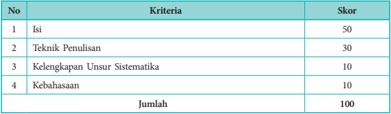

Tabel ini menunjukkan skor untuk berbagai kriteria dalam sebuah penilaian, masing-masing dengan skor tertentu. Topik utama tabel adalah penilaian kualitas tulisan, yang mencakup teknik penulisan, kelengkapan unsur sistematis, dan kebahasaan. Skor tertinggi adalah 50 untuk teknik penulisan, kemudian 30 untuk kelengkapan unsur sistematis, 10 untuk kebahasaan, dan 10 untuk jumlah keseluruhan. Ini menunjukkan bahwa penilaian ini sangat fokus pada kualitas teknis dan struktur tulisan, sementara kebahasaan dan jumlah keseluruhan memiliki skor yang lebih rendah.

 

---
## 📄 Halaman 76

### Rangkuman

- Tulisan tentang seni musik dapat dibedakan menjadi tulisan yang bersifat teori, sejarah musik, jurnalistik,  dan  kritik  musik.
- Tulisan teori  musik adalah tulisan keilmuan tentang musik.
- Tulisan teori  musik biasanya dimanfaatkan untuk bahan pembelajaran seni musik.
- Tulisan  sejarah  biasanya  berisi  deskripsi  tentang  perkembangan  musik,  kiprah  para seniman musik, dan pengaruh musik dalam kehidupan seni budaya masyarakat.
- Melalui  tulisan  sejarah  musik,  kita  dapat  mengetahui  juga  ciri-ciri  musik  di  suatu tempat ternyata berkaitan dalam perkembangannya dengan seni musik di tempat lain.
- Tulisan jurnalistik  seni  musik  terdiri  atas  dua  jenis,  yakni  resensi  dan  review.
- Resensi  merupakan  tulisan  tentang  karya  seni  musik  yang  berisi  ulasan  tentang keunggulan dan kelemahannya untuk direkomendasikan kepada masyarakat penikmat seni  musik melalui media masa.
- Review  merupakan  tulisan  pemberitaan  yang  berisi  ulasan  tentang  karya  seni  musik tanpa  pretensi  yang  disajikan  demi  informasi  yang  objektif  kepada  khalayak  melalui media masa.
- Kritik  ulasan  tentang  keunggulan dan kelemahan suatu karya seni musik berdasarkan kriteria  tertentu  yang  bersifat  ilmiah  dan  objektif.
- Kritik  disajikan  demi  peningkatan  kualitas  karya  seni  musik  selanjutnya.

### UJI KOMPETENSI

### Penilaian Sikap

- Setelah mempelajari uraian di atas dan melihat contoh-contoh tulisan, bagaimana perasaanmu ketika  harus  menilai  dan  mempertimbangkan suatu karya seni musik?
- Dengan	kritik	seni	berkembang.	Setujukah	kamu	dengan	pernyataan	tersebut?	Mengapa	demikian?
- Mungkinkah mengkritik suatu karya tanpa melibatkan subjektivitas pribadi? Jelaskan pendapatmu!

### Penilaian Pengetahuan

- Berisi  hal  apa  sajakah  tulisan  tentang  teori  musik?  Bagaimana  sistematikanya?
- Dimanfaatkan	untuk	apakah	tulisan	tentang	teori	musik?
- Berisi  apakah  tulisan  sejarah  musik?
- Termasuk tulisan jenis apakah kiprah para seniman musik?
- Di	dalam	tulisan	manakah	pengaruh	musik	dalam	kehidupan	seni	budaya	masyarakat?
- Jelaskan  apa  yang  dimaksud dengan resensi dan review! Jelaskan pula sistematikanya!
- Jelaskan  apa  yang  dimaksud tulisan kritik  dalam  seni  musik!  Jelaskan  langkah-langkah  kritik seni  musik!
- Sebutkan jenis-jenis kritik seni musik berdasarkan manfaatnya!
- Jelaskan  sistematika  kritik  seni  musik!
- Buatlah karya tulis kritik seni musik terhadap lagu 'Firework' karya Katy Perry!

 

---
## 📄 Halaman 77

### EVALUASI GERAK TARI KREASI BERDASARKAN TEKNIK TATA PENTAS

### Pada Bab 9 ini, siswa diharapkan:

- Mendeskripsikan karya tari kreasi berdasarkan teknik tata pentas.
- Mengidentifikasikan karya tari kreasi berdasarkan teknik tata pentas.
- Melakukan asosiasi karya tari kreasi berdasarkan teknik tata pentas.
- Mengomunikasikan karya tari kreasi berdasarkan teknik tata pentas.

### A.  TEKNIK TATA PENTAS TARI KREASI

Tata pentas tari adalah teknik merancang untuk mementaskan tari yang baik, sehingga tampak jelas  tampilan  keindahan  geraknya.  Apabila  tari  akan  dipentaskan  di  kelas  atau  di  luar  kelas, mungkin  kamu  akan  membuat  panggung  yang  sesuai  dengan  kebutuhan  tari.  Mungkin  perlu peninggian untuk membedakan posisi pemain dan penonton, mungkin pula perlu peninggian di panggung untuk tempat tokoh. Mungkin juga perlu sekat di pinggir panggung untuk jalan keluar masuknya penonton. Bentuk tata pentas tari seperti itu adalah peniruan dari panggung prosenium dan auditorium pada  pertunjukan  professional  yang  menempatkan  penonton  dan  pemain  pada posisi  berbeda  yang  saling  berhadapan.

Akan tetapi, manakala kamu memerlukan pertunjukan tari yang bisa ditonton dari berbagai arah,  maka  bentuk  arena  adalah  pilihan  yang  tepat.  Bisa  saja  bentuknya  seperti  huruf  U,  mirip tapal  kuda  atau  meniru  huruf  L  dengan  peninggian  atau  bahkan  berbentuk  lingkaran  tanpa peninggian.  Panggung  arena  bisa  didirikan  di  areal  halaman  sekolah.  Tetapi  tentu  saja  dengan memperhatikan lingkungan. Jangan sampai keperluan tata pentas membuat rugi hal lainnya, seperti rusaknya  tanaman  atau  menghalangi  jalan  sebagai  fasilitas  umum.  Ada  pengalaman  kawan  dari Bali, kadangkala mereka mengadakan pertunjukan tanpa panggung alias beralas tanah. Sementara, penonton  dan  pemain  dibatasi  oleh  garis  di  tanah  sebagai  penghalang.  Nah,  sebagai  siswa  yang kreatif  tentunya  ketiadaan  panggung  permanen  bukan  menjadi  penghalang  untuk  berkarya. Tidak adanya panggung justru bisa dijadikan sumber untuk berkreasi membuat tata pentas baru dengan alam atau lingkungan sekitar sebagai latar pertunjukan. Pernahkah terpikirkan oleh kamu berkreasi tari Tani atau berkreasi tari Nelayan dengan latar alam sebenarnya? Patut dicoba! Kamu bisa mencoba menata pentas pertunjukan tari kreasi yang bersumber dari alam dengan panggung alamiah yang ada di sekitar daerahmu.

Dari uraian di atas bisakah kamu menyebutkan kegunaan teknik tata pentas? Nah, selanjutnya dibahas mengenai kegunaan teknik tata pentas yaitu: untuk mampu mengemas sebuah karya tari, dan untuk menata sebuah pertunjukan supaya terlihat lebih indah.

BAB 9

 

---
## 📄 Halaman 78

### B.  Mendeskripsikan Karya Tari Kreasi Baru Berdasarkan Teknik Tata Pentas

Contoh teknik tata pentas tari kreasi di panggung prosenium.

Gambar 9.1 Tari Seribu Tangan

Gambar 9.1 di atas adalah tari kreasi dengan tata pentas yang dilaksanakan di atas panggung prosenium. Tari Seribu Tangan ini, geraknya mengandalkan variasi gerak tangan yang dilakukan oleh sekelompok penari dalam beragam ruang gerak (dari ruang gerak sempit yang dilakukan oleh penari terdepan sampai kepada ruang gerak terluas yang dilakukan oleh penari paling belakang). Tata pentas dilaksanakan pada pola lantai bergaris lurus dengan level dari rendah sampai tinggi. Pergelaran  tari  kelompok  ini  sangat  cocok  dilaksanakan  di  atas  panggung  prosenium,  karena dilakukan  dengan  gerak  tari  yang  mengandalkan  gerak  tangan  saja  dan  dalam  posisi  tetap. Akan tetapi,  apabila  ditampilkan  di  panggung  arena  berbentuk  lingkaran,  maka  idealnya  penari kelompoknya ditambah tiga atau empat kelompok agar penonton yang melingkari panggung bisa menonton dengan leluasa.

Contoh teknik tata pentas arena, dengan panggung di luar ( outdoor ).

 

---
## 📄 Halaman 79

Gambar  di  atas  telah  kamu  amati  yaitu  gambar  tari  Kecak  dari  Bali.  Bagaimana  tanggapan kamu  atas  gambar  tersebut?  Tari  Kecak  pada  gambar  ditampilkan  di  ruang  terbuka  ( outdoor ) beralas tanah dengan posisi pemain melingkar dalam tata pentas arena. Tata pentas menggunakan panggung  arena,  memungkinkan  penonton  melihat  pertunjukan  dari  berbagai  arah.  Tari  Kecak awalnya dipertunjukan di pura untuk keperluan upacara dengan waktu pertunjukan yang sangat lama karena menampilkan cerita Ramayana dari awal sampai akhir. Akan tetapi saat ini, tari kecak sudah terbarukan dan bisa ditampilkan dalam beberapa menit dengan cerita sudah disingkat untuk keperluan para wisatawan yang mengunjungi Bali. Adakah hal lain yang menarik dari tata pentas tari  Kecak  ini?  Terdapat  tiga  lapis  lingkaran  orang  yang  mengelilingi  3  orang  penari.

Lingkaran orang ini memiliki fungsi sebagai:

- batas/kalang pertunjukan dalam tata pentas arena;
- pengiring  musik  internal,  karena  tari  ini  hanya  diiringi  dengan  suara  dari  mulut  (semacam akapela dalam musik);
- peran  yang  berganti-ganti  (sebagai  sekumpulan  kera  pasukan  Rama,  sebagai  gelombang  air ketika pasukan Rama menyeberang lautan ke Alengka, sebagai api ketika Hanoman membakar Alengka).
Contoh tari kreasi dengan panggung di ruang terbuka ( outdoor )  berlatar  lingkungan.

Gambar 9.3 menampilkan seorang penari yang berpentas di ruangan terbuka diantara puing-puing reruntuhan bangunan. Dari rekaman video terlihat ada alat berat yang sedang bekerja meratakan tanah,  pekerja  bangunan  dan  juga  pemulung.  Dihadapan  penari  terletak  tempat  air  dari  tanah dan  tetumbuhan.  Judul  tari  ini  adalah  Pohaci,  yaitu  tokoh  seorang  dewi  pelindung  bumi  dalam cerita  rakyat  Sunda.  Apa  yang  kamu  pikirkan  kalau  melihat  pentas  seperti  ini?  Tentu  saja  sesuai dengan yang kita diskusikan sebelumnya, bahwa tari ini menggunakan teknik tata pentas berlatar lingkungan  alam  sekitar.  Coba  amati  sekali  lagi!  Apa  kaitannya  tari  Pohaci  dengan  lingkungan yang  berantakan?  Tari  Pohaci  memiliki  simbol  Dewi  Pohaci  yang  merasa  sedih  atas  kerusakan lingkungan  dan  Dewi  Pohaci  turun  ke  bumi  untuk  melindungi  dan  menyuburkan  bumi.  Andai saja kamu mengamati pertunjukan ini di internet, tentu akan melihat dan mendengar gemuruhnya suara alat berat yang sedang meratakan tanah dan suara pukulan palu para pekerja. Kesimpulan apa yang kamu peroleh dari mengamati tari kreasi ini? Silahkan diskusikan dengan teman-teman.

 

---
## 📄 Halaman 80

Deskripsikanlah contoh-contoh tari di bawah ini! Deskripsikanlah teknik tata pentas tari kreasi  ini!  Diskusikan  bersama  teman  sekelompokmu!

Identifikasikanlah  pada  tari  karya  Toto  Sugiarto  dengan  judul  Tari  Dogdog  Lojor  di Taman  Budaya  Bandung.  (video  dapat  didownload  pada http://youtube/https://youtu.be/ t4ozElmjDGc?t=101 ),  atau  tari  daerah  lainnya  yang  ada  disekitarmu!

Berikut ini  disajikan  contoh  foto-foto  tarian  Dogdog  Lojor.

 

---
## 📄 Halaman 81

Selanjutnya kamu identifikasikan tari kreasi yang ada di daerah kamu dan jawablah pertanyaan berikut ini.

- Bagaimana teknik tata pentas tari kreasi yang ada di dalam video atau teknik tata pentas tari  kreasi  yang  ada  disekitarmu?
- Jelaskan ciri-ciri tari kreasi yang ada di dalam video atau tari kreasi yang ada disekitarmu!
Amati  gambar  tari  Pohaci  di  bawah  ini  dan  diskusikan  dengan  kelompokmu  untuk memilih jawaban atas pertanyaan!

Pilih  jawaban  yang  dianggap  paling  benar  dan  diskusikan  alasan  jawaban  tersebut!

---
**📊 Tabel**

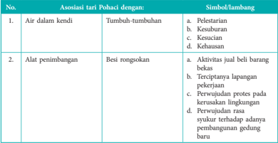

Tabel ini membandingkan asosiasi tari Pohaci dengan berbagai aspek kehidupan sehari-hari di Indonesia. Topik utamanya adalah hubungan antara tari Pohaci dengan lingkungan dan kehidupan masyarakat. Kolom pertama menunjukkan asosiasi tari Pohaci dengan berbagai hal, seperti air dalam kendi dan alat penimbangan. Kolom kedua menyajikan simbol atau lambang yang mungkin digunakan dalam tari Pohaci untuk menggambarkan asosiasinya. Data penting yang terlihat adalah bahwa tari Pohaci seringkali menggambarkan aktivitas sehari-hari seperti mencuci piring, memasak, dan berinteraksi dengan lingkungan sekitar. Ini menunjukkan bahwa tari Pohaci memiliki konteks sosial dan budaya yang kuat, yang mencerminkan nilai-nilai dan tradisi masyarakat Indonesia.

 

---
## 📄 Halaman 82

### C.  Uji Kompetensi

### 1.  Uji Kompetensi Penampilan

Rancanglah  teknik  tata  pentas  tari  kreasi  yang  berasal  dari  daerah  sekitarmu  bersama kelompokmu. Kemudian, presentasikanlah rancangan kelompokmu di dalam kelas.

Berikan  penilaian  secara  bergantian  dengan  menggunakan  tabel  berikut  ini!  (penilaian rancangan tata pentas secara berkelompok).

---
**📊 Tabel**

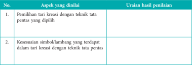

Tabel ini berisi dua aspek utama yang diukur dalam penilaian tari kreasi: pemilihan teknik tata pentas yang tepat dan kesesuaian simbol atau lambang dengan teknik tersebut. Untuk aspek pertama, tidak ada uraian hasil penilaian yang disediakan, sementara untuk aspek kedua, tidak ada informasi tentang simbol atau lambang yang digunakan dalam tari kreasi. Ini menunjukkan bahwa penilaian ini lebih fokus pada penggunaan teknik tata pentas daripada detail simbol atau lambang yang digunakan dalam tari kreasi.

### 2. Uji Kompetensi Pengetahuan

Uraikan pendapatmu secara singkat dan jelas pada butir pertanyaan berikut!

- Apa gunanya teknik tata pentas pada tari kreasi baru?
- Jelaskan  bentuk-bentuk panggung yang kamu ketahui!

### Rangkuman

Menentukan  teknik  tata  pentas  dalam  tari  kreasi  bisa  dilaksanakan  di  dalam  panggung tertutup  dalam ruangan ( in  door )  dan  panggung terbuka di luar ruangan ( outdoor ).

### Refleksi

Menata tari kreasi menciptakan individu yang mandiri, aktif, dan kreatif.

 

---
## 📄 Halaman 83

### MENGEVALUASI BENTUK, JENIS, NILAI ESTETIS, FUNGSI DAN TATA PENTAS DALAM KARYA TARI KREASI

### Pada Bab 10 ini, siswa diharapkan:

- Mendeskripsikan  tari  kreasi  berdasarkan  bentuk,  jenis,  nilai  estetis,  fungsi  dan  tata pentas dalam karya tari.
- Melakukan asosiasi tari kreasi berdasarkan bentuk, jenis, nilai estetis, fungsi dan tata pentas dalam karya tari.
- Melakukan evaluasi tari kreasi berdasarkan bentuk, jenis, nilai estetis, fungsi dan tata pentas dalam karya tari.
- Mengomunikasikan evaluasi tari kreasi berdasarkan bentuk, jenis, nilai estetis, fungsi dan tata pentas dalam karya tari.

### A.  KONSEP EVALUASI TARI

Evaluasi  tari  secara  umum  sepanjang  sejarahnya  menjadi  sebuah  wacana  yang  kurang menyenangkan untuk seseorang yang terkena, karena tidak jarang pengertian evaluasi selalu dikaitkan dengan anggapan mengenai celaan, makian, gugatan, atau koreksi. Akibatnya orang yang terkena evaluasi menjadi kesal, merasa direndahkan, dilecehkan, tidak dihargai, atau dibantai. Tetapi benarkah demikian?  Masalahnya  adalah  bagaimana  cara  mengemukakan  evaluasi  itu  sendiri.  Seyogyanya mengevaluasi dilakukan dengan santun, alasan yang jelas, seimbang dan adil dalam memaparkan kelebihan maupun kekurangan seni yang diamatinya. Posisi seorang evaluator yang  juga  seorang kritikus  menjadi  penengah  antara  penata  tari  dan  penonton/ audiens ,  yang  juga  memiliki  peran seperti pendidik seni. Dengan demikian melalui tulisan seorang evaluator ,  seorang seniman serta masyarakat  umum memahami kelebihan dan kekurangan yang terdapat pada sebuah karya seni serta  memiliki  arahan  cara  untuk  memperbaikinya.

Seorang  evaluator  tari  adalah  juga  seorang  kritikus,  dengan  demikian  untuk  selanjutnya istilah evaluator diganti dengan kritikus. Istilah kritik itu berasal dari bahasa Yunani, yaitu berasal dari  kata krites (kata  benda)  yang  bersumber  dari  kata  'kriterion'  yaitu  kriteria,  sehingga  kata itu  diartikan  sebagai  kriteria  atau  dasar  penilaian.  Dengan  demikian  kita  memberikan  evaluasi itu  harus  memiliki  dasar  kriteria  sebagai  acuan.  Apakah  evaluasi  tari  itu  diperlukan?  Bagaimana menurut  pendapat  kamu?  Evaluasi  tari  diperlukan  oleh  penata  tari  sebagai  bagian  dari  sebuah evaluasi  untuk  meningkatkan  kualitas  tari,  karena  evaluasi  adalah  tanda  penghargaan  penonton terhadap karya tarinya.

Seorang  kritikus  tari  akan  memberikan  pandangan  yang  rinci  disertai  alasan  cerdas  dalam mengevaluasi karya tari. Seorang kritikus juga akan memberikan pemahaman kepada masyarakat umum mengenai nilai-nilai estetis yang ada pada sebuah karya. Dengan demikian evaluasi yang baik  itu  bersifat  membangun,  memberi  evaluasi  sekaligus  memberi  motivasi.  Apa  yang  harus

 

---
## 📄 Halaman 84

dimiliki seorang kritikus jika batasan dan peran kritikus yang seperti itu? Kritikus harus memiliki pengetahuan luas mengenai tari dilihat dari misalnya geraknya, fungsinya, jenisnya, pola lantainya, dan teknik tata pentas. Pengetahuan mengenai tari sudah kamu pelajari teori maupun praktiknya. Artinya,  kamu  pun  bisa  menjadi  seorang  kritikus  bagi  karya  tari  temanmu,  hanya  menambah sedikit  pengetahuan mengenai nilai keindahan (estetis) yang terdapat pada sebuah tari.

Kamu sudah belajar berkarya tari artinya sudah memiliki pengalaman berkarya. Pengalaman berkarya  itu  adalah  modal  dasar  untuk  melakukan  evaluasi  terhadap  karya  kamu  sendiri  yang disebut oto kritik serta melakukan evaluasi terhadap karya tari temanmu. Dengan melakukan hal tersebut,  kamu  melakukan  hal  yang  bermanfaat  untuk  saling  mengasah  ide,  membagi  ilmu  dan membangun kemampuan berargumentasi secara lisan juga cara menuliskannya.

### B.  CARA MENULIS EVALUASI

Pada  bagian  ini,  kamu  akan  dibiasakan  menuliskan  pendapat  kamu  atas  hasil  pengamatan pada beragam tari etnis di Indonesia. Tahap pertama adalah menuliskan/mendeskripsikan bagian dari tari yang paling mengesankan. Untuk itu mulailah dengan urutan 5W - 1H, yaitu what (apa judul tari), where (dimana dipentaskan), when (kapan dipentaskan), who (siapa yang menari), why (alasan  ditarikan),  dan how (bagaimana  menarikannya).  Pada  bagian  menerangkan how ,  sangat tidak mungkin menerangkan seluruh gerak dari awal sampai akhir, sebaiknya kamu memilih gerak yang paling kamu sukai dan paling istimewa.

Tahap  kedua  adalah  menganalisis  gerakannya  dengan  memberikan  argumen  yang  jernih mengenai keunggulan maupun kelemahan tari atas dasar konsep estetis (wiraga, wirama, wirasa) serta  konsep  etis  dari  budaya  penyangga  tarinya.

Tahap  ketiga,  adalah  mengevaluasi  tarinya,  berarti  mengemukakan  sikap  kamu  mengenai tari  tersebut.  Apabila  menurut  versi  kamu  ada  yang  perlu  diperbaiki  tunjukkan  saranmu  kepada temanmu bagian gerak yang mana yang perlu diperbaiki.

Dalam hal ini, kamu selalu harus ingat bahwa, saran adalah saran, artinya terserah pada yang dievaluasi akan dilaksanakan atau tidaknya. Yang penting dalam kegiatan ini adalah meningkatnya kemampuan kamu dalam mengapresiasi karya tari, menemukan kekurangan dan solusinya, serta mengemukakan pendapat secara lisan yang disampaikan dengan santun.

Inilah  panduan dalam mengevaluasi, pada kolom berikut ini!

---
**📊 Tabel**

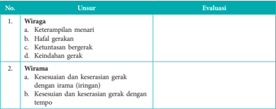

Tabel ini berisi dua kolom utama: "Wiraga" dan "Wirrama". Kolom "Wiraga" mencakup empat poin evaluasi, yaitu keterampilan menari, kehafalan gerakan, ketuntasan bergerak, dan keindahan gerak. Sementara itu, kolom "Wirrama" memiliki dua poin evaluasi, yaitu kesesuaian dan keserasian gerakan dengan irama (irrigan) serta kesesuaian dan keserasian gerakan dengan tempo. Data penting yang terlihat adalah bahwa evaluasi untuk Wiraga lebih fokus pada aspek teknis dan estetika tarian, sementara untuk Wirrama lebih fokus pada aspek ritmis dan dinamis.

 

---
## 📄 Halaman 85

---
**📊 Tabel**

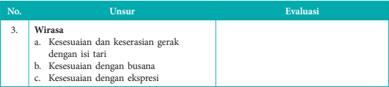

Tabel ini berisi evaluasi tentang kesesuaian dan keserasian gerak dengan isi tari, busana, dan ekspresi. Topik utamanya adalah kesesuaian dan keserasian dalam tari. Kolom pertama berisi nomor urut (No.), sedangkan kolom kedua berisi deskripsi evaluasi. Data penting yang terlihat adalah bahwa evaluasi ini mencakup ketiga aspek tersebut: kesesuaian dan keserasian gerak dengan isi tari, kesesuaian dengan busana, dan kesesuaian dengan ekspresi. Ini menunjukkan bahwa evaluasi ini fokus pada bagaimana tari memenuhi standar-standar tertentu dalam hal keterkaitan antara gerakan, busana, dan ekspresi.

Amati salah  satu  tarian  yang  berada  di  lingkunganmu!  Kemudian,  carilah  tokoh  tari  di sekitar  lingkunganmu,  amatilah  tariannya,  evaluasilah  berdasarkan  bentuk,  jenis,  nilai estetis,  fungsi,  dan  tata  pentas  dalam  karya  tari,  berdasarkan  5  W  -  1  H.

Setelah  mengamati  pertunjukan  tari  dari  sumber  lain  di  lingkungan  sekitarmu,  kamu  dapat melakukan diskusi dengan teman.

- Bentuklah kelompok diskusi 2 sampai 4 orang.
- Pilihlah  seorang  moderator dan seorang sekretaris untuk mencatat hasil diskusi.
- Untuk  memudahkan  mencatat  hasil  diskusi,  gunakanlah  tabel  yang  tersedia  dan  kamu dapat menambahkan kolom sesuai dengan kebutuhan.

### Format Diskusi Hasil Pengamatan Evaluasi Karya Tari

Nama anggota :

Hari/tanggal pengamatan :

---
**📊 Tabel**

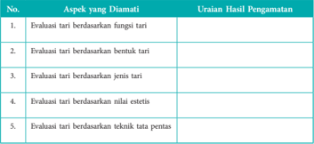

Tabel ini berisi aspek-aspek yang perlu diamati dalam evaluasi tari, dengan uraian hasil pengamatan untuk masing-masing aspek. Topik utama tabel adalah evaluasi tari berdasarkan berbagai faktor, termasuk fungsi tari, bentuk tari, jenis tari, nilai estetis, dan teknik tata pentas. Kolom pertama menunjukkan aspek-aspek yang perlu diamati, sedangkan kolom kedua menyajikan uraian hasil pengamatan untuk setiap aspek tersebut. Data penting yang terlihat dalam tabel ini adalah bahwa evaluasi tari melibatkan penilaian berbagai aspek, mulai dari fungsi dan bentuk tari hingga teknik tata pentas, dengan tujuan untuk memberikan pemahaman yang lebih mendalam tentang kualitas dan keunikan tarian.

 

---
## 📄 Halaman 86

Setelah kamu berdiskusi berdasarkan hasil evaluasi tari mengenai nilai estetis, bacalah konsep evaluasi tari secara umum. Kamu dapat memperkaya dengan mencari materi dari sumber belajar lainnya.

Di  bawah  ini  terdapat  karya  tari  dari  beberapa  orang  koreografi  terkemuka  Indonesia.  Pada gambar pertama tertera nama tari dan penata tarinya (koreografer). Dari foto dan nama tarinya saja, kamu tentu sudah bisa menjelaskan mengenai sumber penciptaan karya tari tersebut. Karya Didik yang diberi judul 'Bedhaya Hagoromo' ditarikan oleh sembilan penari dengan busana Jawa, bersanggul  khas  dengan  hiasan  tusuk  konde  layaknya  putri  keraton  dan  diberi  tambahan  bulu hias.  Busana  dan  semua  hiasan  yang  digunakan  memiliki  acuan  pada  tari  Bedhaya,  dan  ikonikon tersebut menjadi alasan pemilihan nama tari dengan menggunakan nama bedhaya. Apabila kamu  lebih  cermat,  bisa  dilihat  bahwa  pada  tari  'Bedhaya  Hagoromo'  terdapat  seorang  tokoh yang berbusana beda dari kelompoknya. Apakah kamu memperhatikan perbedaan busana tokoh tersebut?  Tokoh  dalam  tari  tersebut  adalah  koreografernya  sendiri,  yang  menggunakan  busana lengkap dengan hiasan yang biasa dipakai oleh perempuan Jepang dari kalangan keraton. Unsur Jepang ini pula kiranya yang menentukan pemilihan nama tari menjadi 'Bedhaya Hagoromo' .

Dari  bahasan  ini  kamu  sudah  bisa  mengkorelasikan  adanya  persamaan  asal  tari,  yaitu mengacu pada budaya tari klasik yang ada di keraton Jawa dan keraton Jepang. Tentunya kamu tidak melupakan, bahwa Jepang itu sebuah kekaisaran. Selanjutnya perbedaan tersebut disatukan dengan penggunaan topeng dalam garis wajah yang sama. Dengan demikian karya tari tersebut bersumber pada tari tradisi klasik termasuk ke dalam jenis tari kelompok.

Tari  kreasi  berdasarkan  pada  tari  tradisi  klasik  Karya  Didi  Nini k  Thowok.

 

---
## 📄 Halaman 87

---
**📊 Tabel**

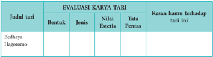

Tabel ini menunjukkan evaluasi karya tari bernama "Bedhayana Hagoromo". Topik utamanya adalah penilaian kreativitas dan teknis dalam tari tersebut. Kolom-kolomnya meliputi bentuk, jenis, nilai estetis, dan tata pentas. Data penting yang terlihat adalah bahwa tari ini memiliki bentuk yang unik dan estetis, namun masih memerlukan peningkatan dalam aspek pentas untuk mencapai tingkat profesionalitas yang lebih tinggi.

Gambar 10.3 Topo Ngali

Apakah  ini  tari?  Itulah  pertanyaan  dasar  yang  akan  timbul  dari  pengamatan  Gambar  12.3. Untuk menjawab pertanyaan tersebut tentu saja kita kembali kepada unsur-unsur dasar tari. Apakah ada geraknya, ada ruang geraknya, ada tenaganya? Menurut kamu tentu semua ada. Gerak tangan dan  lengan  adalah  gerak  yang  digayakan,  dan  membentuk  ruang  yang  bukan  gerak  sehari-hari. Sikap  duduknya  pun  bukan  duduk  biasa.  Dengan  demikian  kesimpulannya  jelas  gambar  di  atas adalah tari dengan menggunakan teknik tata pentas panggung alam. Kesan apa yang kamu rasakan tatkala mengamati tari ini? Tenangnya air yang menyatu dengan sikap tenang penari yang terlihat dari  pandangan  mata  menunduk  setengah  tertutup,  memiliki  hubungan  erat  dengan  judul  tari Topo Ngali 'bertapa di sungai' .

Untuk  selanjutnya,  teruskanlah  pengamatan  pada  tari  ini  dan  isilah  kolom  pengamatan  di bawah ini.

---
**📊 Tabel**

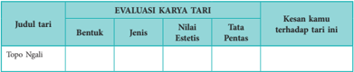

Tabel ini menunjukkan evaluasi karya tari dengan berbagai aspek yang perlu diperhatikan. Topik utamanya adalah penilaian kualitas tari, termasuk bentuk, jenis, nilai estetis, dan tata pentas. Kolom-kolomnya mencakup judul tari, bentuk, jenis, nilai estetis, dan tata pentas. Data penting yang terlihat adalah bahwa setiap kolom memiliki beberapa baris kosong, menunjukkan bahwa evaluasi ini masih dalam tahap awal atau belum dilakukan untuk semua judul tari. Ini menunjukkan bahwa evaluasi karya tari memerlukan waktu dan perhatian yang tepat untuk memastikan kualitas dan keberhasilan tarian tersebut.

Seorang penari melakukan atraksi tari  di  dalam  air  saat  wayang  sedang berlangsung sambil mengikuti musik yang di  mainkan  oleh  dalang  Ki  Bima  di Sungai Boyong, Desa Purwobinangun, Kecamatan Pakem, Sleman, Yogyakarta, Minggu (15/11/2015).  Acara  kirab  budaya Merti  Kali  Boyong  ini  diberi  tema  Topo Ngali.

 

---
## 📄 Halaman 88

### No.

1.

2.

### Gambar

### Unsur

### Fungsi:

- Upacara
- Hiburan
- Penyajian Estetis

### Jenis:

- Tari  Rakyat
- Tari  Klasik
- Tari  Kreasi  Baru

### Bentuk:

- Kelompok
- Berpasangan
- Tunggal

### Sumber ide tari:

- Non tradisi
- Tradisi

### Fungsi:

- Upacara
- Hiburan
- Penyajian Estetis

### Jenis:

- Tari  Rakyat
- Tari  Klasik
- Tari  Kreasi  Baru

### Bentuk:

- Kelompok
- Berpasangan
- Tunggal

### Sumber ide tari:

- Non tradisi
- Tradisi

### Alasan

 

---
## 📄 Halaman 89

---
**📊 Tabel**

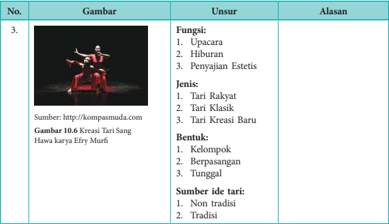

Tabel ini berisi informasi tentang jenis tari dan bentuknya, dengan fokus pada tari kreasi baru. Topik utama adalah jenis dan bentuk tari kreasi baru, yang mencakup tari rakyat, tari klasik, dan tari kreasi baru. Jenis-jenis tari ini dikelompokkan berdasarkan bentuknya, yaitu kelompok, berpasangan, dan tunggal. Sumber ide untuk tari kreasi baru dapat berasal dari non-tradisi atau tradisi. Data penting lainnya meliputi bahwa tari kreasi baru memiliki fungsi seperti upacara, hiburan, dan penyejukan estetis, serta memiliki variasi dalam bentuknya.

### C.  Uji Kompetensi

### Uji Kompetensi Sikap

Uraikan pendapatmu secara singkat dan jelas pada butir pertanyaan berikut!

- Bagaimana caranya melestarikan tari tradisi?
- Bagaimana caranya menata tari kreasi?
- Bagaimana caranya menumbuhkan rasa kebersamaan, rasa saling menghargai, dan rasa solidaritas antar  etnis,  antar  ras,  antar  agama?

### Rangkuman

Mengevaluasi karya tari dengan kriteria:

- Mulailah dengan urutan what , who , when , where , why ,  dan how .
- Menganalisis dengan konsep estetis (wiraga, wirahma, wirasa).
- Tuliskan saran bagian tari mana yang perlu diperbaiki.

### Refleksi

Tak kenal maka tak sayang. Kenali dan sayangilah tari Nusantara.

Pemahaman terhadap tari nusantara menumbuhkan sikap saling menghargai dan solidaritas.

 

---
## 📄 Halaman 90

### MERANCANG PEMENTASAN

11

---
**🖼️ Gambar/Diagram**

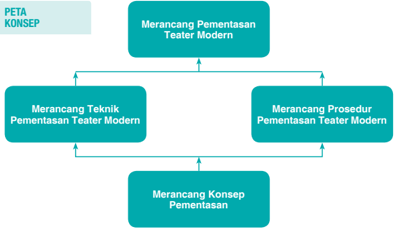

> **Deskripsi Visual:** Gambar ini adalah diagram yang menunjukkan proses merancang pementasan teater modern. Diagram ini terdiri dari empat bagian utama yang saling terkait:

1. **Pertama**: Merancang Konsep Pementasan. Ini merupakan langkah awal yang membedakan konsep dasar untuk pementasan.

2. **Kedua**: Merancang Teknik Pementasan Teater Modern. Langkah ini melibatkan detail teknis seperti layout panggung, efek suara, dan visual.

3. **Ketiga**: Merancang Prosedur Pementasan Teater Modern. Ini mencakup prosedur praktis yang harus dilakukan selama pementasan, termasuk peran dan tugas setiap orang.

4. **Keempat**: Merancang Pementasan Teater Modern. Langkah akhir yang menggabungkan semua elemen sebelumnya untuk menciptakan pementasan yang lengkap.

Elemen-elemen utama ini saling terkait dan bergerak dari bawah ke atas, menunjukkan proses yang bertahap dan sistematis. Teks penting dalam diagram ini adalah "Merancang", yang muncul di setiap langkah, menunjukkan bahwa setiap langkah adalah bagian dari proses merancang keseluruhan.

Informasi kunci yang dapat diambil pembaca adalah bahwa merancang pementasan teater modern melibatkan langkah-langkah yang berbeda dan saling terkait, mulai dari konsep dasar hingga prosedur praktis yang harus dilakukan selama pementasan.

### Setelah mempelajari Bab 11 diharapkan siswa mampu:

- mengenal jenis-jenis panggung pementasan;
- mengidentifikasi kebutuhan pementasan;
- mengidentifikasi peran dan fungsi anggota kepanitiaan dalam pementasan;
- mengidentifikasi teknik pementasan teater; dan
- mengidentifikasi prosedur pementasan teater.

 

---
## 📄 Halaman 91

### Perhatikan gambar berikut ini!

---
**🖼️ Gambar/Diagram**

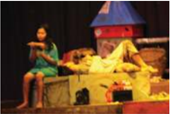

> **Deskripsi Visual:** Gambar ini adalah ilustrasi yang menunjukkan dua karakter utama dalam sebuah cerita. Karakter pertama, seorang anak perempuan, sedang berbicara dengan tangan yang menggenggam sesuatu. Karakter kedua, seorang dewasa pria, tampak tidur di atas meja dengan wajah tertidur. Latar belakangnya adalah sebuah ruangan sederhana dengan beberapa elemen seperti lampu, rak, dan benda-benda kecil lainnya. Ilustrasi ini mungkin digunakan untuk menjelaskan konsep tentang komunikasi, tidur, atau situasi sosial dalam konteks cerita.

---
**🖼️ Gambar/Diagram**

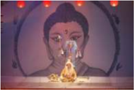

> **Deskripsi Visual:** Gambar ini adalah ilustrasi yang menampilkan tokoh Buddha dalam pose meditasi. Tokoh Buddha berada di tengah gambar dengan wajah rileks dan mata tertutup, menunjukkan keadaan pencerahan spiritual. Belakangnya terdapat lampu-lampu merah yang membentuk lingkaran, mungkin menggambarkan cahaya spiritual yang membantu meditasi. Di sebelah kanan Buddha, terdapat sebuah patung Buddha kecil yang tampak lebih kecil dan lebih jauh, mungkin menunjukkan hubungan spiritual antara dua tokoh tersebut. Gambar ini menunjukkan konsep meditasi dan pencerahan spiritual yang penting dalam budaya Buddha.

Bentuk pentas dengan tata pentas

Setelah mencermati gambar panggung, deskripsikan tentang tema panggung yang digunakan isilah  kolom  di  bawah  ini.

---
**📊 Tabel**

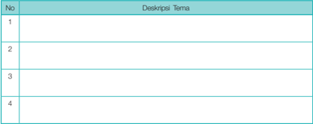

Tabel ini berisi informasi tentang tema-tema yang dijelaskan dalam buku pelajaran. Kolom "No" menunjukkan urutan atau nomor identifikasi setiap tema, sedangkan kolom "Deskripsi Tema" menyajikan deskripsi singkat untuk setiap tema tersebut. Topik utama tabel ini adalah pembelajaran tentang berbagai tema yang disampaikan dalam buku pelajaran. Data penting yang terlihat meliputi jumlah tema yang disebutkan (dalam contoh, 4 tema), dan bahwa setiap tema memiliki deskripsi singkat yang diberikan.

 

---
## 📄 Halaman 92

### A.  Pengertian Teater

Kata 'teater'  berasal  dari  kata  Yunani  kuno, theatron , yang dalam bahasa Inggris disebut seeing place ,  dan dalam bahasa Indonesia diartikan sebagai 'tempat untuk menonton' . Akan  tetapi,  pada  perkembangan  selanjutnya  kata  teater dipakai  untuk  menyebut  nama  aliran  dalam  teater  (teater Klasik,  teater  Romantik,  teater  Ekspresionis,  teater  Realis, teater Absurd, dst). Kata 'teater' juga dipakai untuk nama kelompok  (Bengkel  Teater,  teater  Mandiri,  teater  Koma, teater  Tanah  Air,  dst).  Pada  akhirnya  berbagai  bentuk pertunjukan  (drama,  tari,  musikal)  disebut  sebagai  teater. Richard  schechner ,  sutradara  dan  professor  di  Universitas New  York  (NYU)  memperluas  batasan  teater  sedemikian rupa  sehingga  segala  macam  upacara,  termasuk  upacara penaikan bendera, bisa dimasukkan sebagai peristiwa teater.

---
**🖼️ Gambar/Diagram**

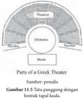

> **Deskripsi Visual:** Gambar 11.5 ini merupakan ilustrasi yang menunjukkan bagian-bagian dari sebuah teater Yunani. Gambar ini memperlihatkan struktur teater Yunani dengan detail yang jelas. Dalam gambar tersebut, kita dapat melihat beberapa elemen utama:

1. **Pertama**: Gambar ini menunjukkan bagian-bagian teater Yunani yang terdiri dari auditorium, tribune, dan area panggung.
2. **Elemen Utama dan Relasinya**: Auditorium terdiri dari baris-baris kursi yang mengelilingi area panggung. Tribune berada di atas auditorium dan digunakan oleh para penari dan musisi. Area panggung terletak di tengah-tengah teater dan dilengkapi dengan tribune untuk penonton.
3. **Teks, Angka, atau Label Penting**: Gambar ini tidak memiliki teks, angka, atau label spesifik yang penting. Namun, elemen-elemen seperti auditorium, tribune, dan area panggung telah disebutkan dalam judul gambar.
4. **Informasi Kunci yang Bisa Diambil Pembaca**: Gambar ini memberikan gambaran umum tentang struktur teater Yunani, yang sangat penting bagi pemahaman tentang budaya dan arsitektur masa lalu.

Dengan demikian, gambar ini membantu pembaca memahami bagaimana struktur teater Yunani dan bagaimana ia dirancang untuk mendukung pertunjukan teater.

Peter Brook melalui bukunya ' Empty Spece ' berpendapat lebih ekstrem tentang teater, bahwa 'sebuah  panggung  kosong,  lalu  ada  orang  lewat' ,  itu  adalah  teater.  Berbagai  pendapat  di  atas melukiskan  betapa  luasnya  pengertian  teater.  Jadi,  teater  adalah  karya  seni  yang  dipertunjukkan dengan menggunakan tubuh untuk menyatakan rasa dan karsa aktor, yang ditunjang oleh unsur gerak,  unsur,  suara,  unsur  bunyi,  serta  unsur  rupa.

### B.  Pengertian Drama

Kata 'drama' , juga berasal dari kata Yunani draomai yang artinya berbuat, berlaku atau beraksi. Pengertian  yang  lebih  luas  adalah  sebuah  cerita  atau  lakon  tentang  pergulatan  'lahir  atau  batin' manusia dengan manusia lain, manusia dengan alam, manusia dengan Tuhannya, dan sebagainya.

Kata  drama  dalam  bahasa  Belanda  disebut toneel ,  yang  kemudian  diterjemahkan  sebagai sandiwara.  Sandiwara  dibentuk  dari  kata  Jawa  'sandi'  (rahasia)  dan  'wara/warah'  (pengajaran). Menurut  Ki  Hadjar  Dewantara,  sandiwara  adalah  pengajaran  yang  dilakukan  dengan  rahasia/ perlambang. Menurut Moulton, drama adalah 'hidup yang dilukiskan dengan gerak' ( life presented in  action ).  Menurut Ferdinand Verhagen: drama haruslah merupakan kehendak manusia dengan action.  Menurut  Baltazar  Verhagen:  drama  adalah  kesenian  yang  melukiskan  sikap  manusia dengan gerak.

Berdasarkan pendapat di atas, bisa disimpulkan, bahwa pengertian drama lebih mengacu pada naskah atau teks, yang melukiskan konflik manusia dalam bentuk dialog, yang dipresentasikan melalui pertunjukan dengan menggunakan percakapan dan action di hadapan penonton. Jadi jelas, kalau kita bicara tentang teater, sebenarnya kita berbicara soal proses kegiatan dari lahirnya, pengolahannya sampai  ke  pementasannya.  Dari  pemilihan  naskah,  proses  latihan,  hingga  dipertunjukkan  di hadapan penonton.

 

---
## 📄 Halaman 93

### C.  Sejarah Teater Dunia

---
**🖼️ Gambar/Diagram**

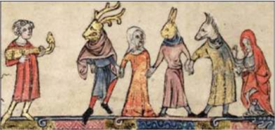

> **Deskripsi Visual:** Gambar ini adalah ilustrasi yang menampilkan kelompok manusia berpakaian tradisional berjalan di atas lantai kayu. Kelompok ini terdiri dari lima orang, masing-masing dengan kepala berbentuk hewan seperti antelop atau kambing. Mereka semua mengenakan pakaian warna-warni dan berpose dengan cara yang menunjukkan hubungan sosial mereka. Pada sisi kiri, ada seorang pria yang sedang memegang sebuah alat musik, mungkin gitar. Gambar ini tampaknya berasal dari buku pelajaran atau catatan historis, karena gaya lukisan dan detailnya yang kuno.

Teater  seperti  yang  kita  kenal  sekarang  ini,  berasal  dari  zaman  Yunani  purba.  Pengetahuan kita  tentang  teater  bisa  dikaji  melalui  peninggalan  arkeologi  dan  catatan-catatan  sejarah  pada zaman  itu  yang  berasal  dari  lukisan  dinding,  dekorasi,  artefak,  dan  hieroglif.  Dari  peninggalanpeninggalan itu tergambar adegan perburuan, perubahan musim, siklus hidup, dan cerita tentang persembahan  kepada  para  dewa.  Sekitar  tahun  600  SM,  bangsa  Yunani  purba  melangsungkan upacara-upacara agama, mengadakan festival tari dan nyanyi untuk menghormati dewa Dionysius yakni dewa anggur dan kesuburan. Kemudian, mereka menyelenggarakan sayembara drama untuk menghormati dewa Dionysius itu. Menurut berita tertua, sayembara semacam itu diadakan pada tahun  534  SM  di  Athena.  Pemenangnya  yang  pertama  kali  bernama  Thespis,  seorang  aktor  dan pengarang  tragedi.  Nama  Thespis  dilegendakan  oleh  bangsa  Yunani  sehingga  sampai  sekarang orang menyebut aktor sebagai Thespian.

Di  zaman  Yunani  kuno,  sekitar  tahun  534  SM,  terdapat  tiga  bentuk  drama,  yaitu  drama tragedi  (drama  yang  menggambarkan  kejatuhan  sang  pahlawan,  dikarenakan  oleh  nasib  dan kehendak dewa, sehingga menimbulkan belas dan ngeri), drama komedi (drama yang mengejek atau  menyindir orang-orang yang berkuasa, tentang kesombongan dan kebodohan mereka), dan satyr (drama yang menggambarkan tindakan tragedi dan mengolok-olok nasib karakter tragedi). Tokoh  drama  tragedi  yang  sangat  terkenal  adalah  Aeschylus  (525-456  SM),  Sophocles  (496-406 SM),  dan  Euripides  (480-406  SM).  Tokoh  drama  komedi  bernama  Aristophanes  (446-386  SM). Beberapa  naskah  dari  karya  mereka  masih  tersimpan  hingga  sekarang.  Beberapa  naskah  sudah diterjemahkan dalam bahasa Indonesia.

 

---
## 📄 Halaman 94

---
**🖼️ Gambar/Diagram**

> **Deskripsi Visual:** Gambar ini menunjukkan sebuah arena teater kuno yang tampak seperti sebuah arena kota besar. Arena ini memiliki struktur bangunan yang kompleks dengan barisan-barisan kursi yang terbuat dari batu yang berada di atas tangga. Kursi-kursi ini membentuk suatu struktur yang melengkung ke arah tengah arena, yang merupakan tempat panggung utama. Dari sudut pandang ini, kita bisa melihat bagaimana desain bangunan ini memungkinkan penonton untuk melihat pertunjukan dari berbagai sudut mata. Arena ini tampak sangat megah dan menunjukkan keindahan arsitektur kuno Yunani.

Tata panggung dengan tempat duduk penonton berundak.

Di antaranya Oedipus Sang Raja , Oedipus di Colonus , Antigone karya Sophocles, dan Lysistrata karya  Aristophanes.  Naskah-naskah  drama  tersebut  diterjemahan  dan  dipentaskan  oleh  Rendra bersama  Bengkel  Teater  Y ogya.  Drama-drama  tersebut  dibahas  oleh  Aristoteles  dalam  karyanya yang  berjudul Poetic .  Sejarah  teater  di  dunia  Barat berkembang  secara  berkesinambungan,  seiring dengan perkembangan dan kemajuan zaman. Setelah era  klasik  di  Yunani,  teater  berkembang  di  Roma. Teater  Roma  mengadaptasi  teater  Yunani.  Tokohtokohnya yang penting adalah Terence, Plautus, dan Seneca.  Setelah  teater  Roma  memudar,  di  abad pertengahan (th 900-1500 M) naskah-naskah Terence, Plautus,  dan  Seneca  diselamatkan oleh para Paderi untuk  dipelajari.  Di  abad  pertengahan  bentuk auditorium  teater  Yunani  mengalami  perubahan. Perkembangan teater berlanjut di zaman Renaissance, yang dianggap sebagai jembatan antara abad ke-14 menuju  abad  ke-17,  atau  dari  abad  pertengahan menuju sejarah modern. Ini di mulai sebagai sebuah gerakan budaya di Italia, lalu menyebar ke seluruh

Eropa, menandai awal zaman modern. Di abad tersebut banyak bermunculan tokoh-tokoh teater hebat,  di  antaranya  Williams  Shakespeare  di  Inggris,  Moliere  di  Perancis,  dan  Johann  Wolfgang von Goethe di Jerman. Bentuk auditorium turut berkembang.

 

---
## 📄 Halaman 95

Pada pertengahan abad XIX, seiring dengan berkembangnya ilmu pengetahuan dan teknologi, maka  teater  berkembang  dari  romantik  ke  realisme.  Dua  tokoh  yang  mempengaruhi  timbulnya realisme di Barat adalah Auguste Comte dan Teori Evolusi dari Charles Darwin.

Ternyata  realisme  yang  merajai di  abad  XIX,  tidak  sepenuhnya diterima  di  abad  XX.  Di  abad  XX banyak  pemberontakan  terhadap teater  Realisme,  maka  timbullah aliran  simbolisme,  ekspresionisme dan  teater  epik.  Dengan  demikian auditoriumnya  pun  berubah  dengan penutup di bagian atas, karena listrik sudah  ditemukan.  Pertunjukan  tidak lagi  mengandalkan  cahaya  matahari, tetapi  dengan  menggunakan lampu.

### D.  Teater Modern

Sejarah  dan  perkembangan teater  modern  di  Indonesia  berbeda dengan  sejarah  dan  perkembangan teater  modern di Eropa. Sejarah dan perkembangan  teater  modern  di Eropa dipelopori oleh Hendrik Ibsen, yang  lahir  pada  20  Maret  1828,  di Norwegia.  Dramawan  terbesar  dan paling  berpengaruh  pada  zamannya ini  dikenal  sebagai  'bapak  teater realisme' .  Melalui  karya-karyanya, Ibsen  tidak  lagi  bercerita  tentang dewa-dewa, raja-raja atau kehidupan para  bangsawan  di  masa  lalu,  tetapi tentang  manusia-manusia  dalam kehidupan  sehari-hari.  Ini  terlukis dalam naskah-naskah dramanya yang

---
**🖼️ Gambar/Diagram**

> **Deskripsi Visual:** Gambar ini adalah foto yang menunjukkan sebuah arena teater tradisional dengan struktur bangunan yang unik. Arena ini memiliki lantai atas yang tinggi dan berbentuk seperti kerucut, dengan dinding yang melengkung dan tinggi. Dinding tersebut memiliki jendela-jendela kecil yang menghadap ke luar untuk memperlihatkan penonton. Lantai bawah arena ini tampak penuh dengan penonton yang sedang menikmati pertunjukan. Atap bangunan terbuat dari kayu dan terbuat dari batang-batang kayu yang dipanjangkan dan diikat bersama-sama. Atap ini memberikan tampilan yang unik dan menarik bagi penonton. Gambar ini menunjukkan bagaimana desain bangunan teater tradisional yang unik dan menarik, serta bagaimana penonton dapat menikmati pertunjukan dari sudut pandang yang unik.

berjudul Rumah Boneka (1879), Musuh Masyarakat (1882), Bebek Liar (1884),  dan  lain-lain.

Munculnya teater realisme bersamaan dengan revolusi industri-teknologi, revolusi demokratik, dan  revolusi  intelektual,  yang  mengubah  konsepsi  waktu,  ruang,  ilahi,  psikologi  manusia,  dan tatanan sosial.

Awal dari gagasan realisme adalah keinginan untuk menciptakan illusion of reality di atas pentas sehingga  untuk  membuat  kamar  atau  ruang  tamu  tidak  cukup  hanya  dengan  gambar  di  layar. Akan tetapi, perlu diciptakan kamar dengan empat dinding seperti ruang tamu atau kamar yang sebenarnya.  Inilah  yang  mengawali  timbulnya  realisme Convention  of  the  fourth  wall .  Kesadaran akan  dinding  keempatnya  adalah  tempat  duduk  penonton  yang  digelapkan  agar  seolah-olah penonton mengintip peristiwa dari hidup dan kehidupan.

 

---
## 📄 Halaman 96

Di Indonesia, sejarah perkembangan teater modern bermula dari sastra atau naskah tertulis. Naskah Indonesia pertama adalah Bebasari (1926)  karya  Rustam  Effendi,  seorang  sastrawan  dan tokoh  politik.  Kemudian,  muncul  naskah-naskah drama berikutnya yang ditulis sastrawan Sanusi Pane antara lain, Airlangga (1928), Kertadjaja (1932), dan Sandyakalaning  Madjapahit (1933).  Drama  karya Muhammad  Yamin  antara  lain, Kalau  Dewi  Tara Sudah  Berkata (1932)  dan  Ken  Arok  (1934).  A.A. Pandji Tisna menulis dalam bentuk roman, Swasta: Setahun  di  Bedahulu .  Bung  Karno  menulis  drama Reinbow , Krukut  Bikutbi , Dr.  Setan ,  dan  lain-lain. Tampak di sini, bahwa naskah drama awal ini tidak hanya ditulis oleh sastrawan, tetapi juga oleh tokohtokoh pergerakan.

Setahun  sebelum  Rustam  Effendi  menulis Bebasari (1925),  T.D.  Tio  Jr  atau  Tio  Tik  Djien, seorang lulusan sekolah dagang Batavia mendirikan rombongan Orion. Rombongan Orion ini menjadi tenar  setelah  mementaskan  lakon  Barat Juanita  de Vega ,  yang  dibintangi  oleh  Miss  Riboet,  berperan sebagai  perampok.  Melalui  lakon Juanita  de  Vega , Miss Riboet menjadi terkenal karena perannya sebagai wanita  perampok  yang  pandai  bermain  pedang. Rombongan ini pun kemudian bernama Miss Riboet's Orion.

Meskipun  masih  mengacu  pada  hiburan  yang sensasional  dan  cenderung  komersial,  bentuk pementasan rombongan Miss Riboet's Orion sudah mengarah pada bentuk realisme Barat. Ini berbeda dengan teater sebelumnya, yang berbentuk stambul dan  opera.  Cerita  pada  stambul  dan  opera  berasal dari hikayat-hikayat lama atau dari film-film terkenal, sedangkan rombongan Miss Riboet's Orion ceritanya berasal  dari  kehidupan  sehari-hari.  Adegan  dan babak  diperingkas,  adegan  memperkenalkan  diri tokoh-tokohnya  dihapus,  nyanyian  dan  tarian  di tengah babak dihilangkan.

Rombongan  Miss  Riboet's  Orion  menjadi semakin  terkenal  setelah  Nyoo  Cheng  Seng, seorang  wartawan  peranakan  Cina  bergabung  dan

mengabdikan diri sepenuhnya untuk menjadi penulis naskah. Naskah-naskah yang pernah mereka pentaskan,  antara  lain Black  Sheep , Singapore  A fter  Midnight , Saidjah , Barisan  Tengkorak , R.A. Soemiatie (Tio Jr) , Gagak Solo ,  dan  sebagainya.

 

---
## 📄 Halaman 97

Di tengah masa kejayaan rombongan Miss Riboet's Orion, di kota Sidoardjo berdiri rombongan Dardanella.  Pendirinya  bernama  Willy  Klimanoff  alias  A.  Piedro,  orang  Rusia  kelahiran  Penang.

Bintang-bintangnya, antara lain Tan Tjeng Bok, Dewi Dja,  Riboet  II,  dan  Astaman.  Naskah  yang  mereka mainkan  pada  awalnya  adalah  cerita-cerita  Barat, baik yang berasal dari film maupun roman, seperti The  Thief  of  Bagdad , Mask  of  Zorro , Don  Q ,  dan The Corurt of Monte Christo .

Kemudian,  pada  tahun  1930,  Andjar  Asmara bergabung ke dalam rombongan Dardanella, khusus menulis  naskah  yang  diperankan  oleh  Dewi  Dja, seperti Dr. Samsi , Si  Bongkok , Haida dan Tjang. A . Piedro  sendiri  juga  menulis  beberapa  naskah,  di antaranya Fatima , Maharani ,  dan Rentjong  Atjeh . Dengan bergabungnya Andjar Asmara rombongan Dardanella semakin berjaya.

Rombongan  Miss  Riboet's  Orion  kalah  dalam persaingan  ini.  Apalagi  kemudian  penulis  naskah andalan  rombongan  Miss  Riboet's  Orion,  Nyoo Cheng Seng, bersama istrinya Fifi  Young  alias  Tan Kim Nio, bergabung dengan rombongan Dardanella. Tahun 1934, zaman kejayaan Dardanella mencapai puncak kejayaannya.

Pada perkembangannya rombongan Dardanella melakukan pembaharuan dari apa yang telah dicapai oleh rombongan Miss Riboet's Orion. Naskah yang dipentaskan berupa cerita asli yang lebih serius, padat

dan agak berat dengan problematik yang lebih kompleks sehingga digemari oleh kaum terpelajar seperti Boenga Roos dari Tjikembang , Drama dari Krakatau , Annie van Mendoet , Roos van Serang , Perantean no. 99 ,  dan  sebagainya.

Naskah-naskah realistis  yang  menuntut  permainan  watak  ini  dapat  diperankan  dengan  baik oleh pemain-pemain Dardanella yang memang mempunyai pemain-pemain handal, seperti Bachtiar Effendi (saudara sastrawan Rustam Effendi), Dewi Dja, Fifi Y oung, Ratna Asmara, Koesna (saudara Dewi Dja), Ferry Kok, Astaman, Gadog, Oedjang, dan Henry L. Duart orang Amerika.

Kehidupan  teater  modern  Indonesia  baru  menampakkan  wujudnya  setelah  Usmar  Ismail bersama  D.  Djajakoesoema,  Surjo  Sumanto,  Rosihan  Anwar,  dan  Abu  Hanifah  mendirikan Sandiwara Penggemar Maya pada tanggal 24 Mei 1944. Kemudian, mereka mementaskan naskah karya Usmar Ismail yang berjudul Citra , dan dibuat film pada tahun 1949. Ilustrasi musiknya dibuat oleh Cornelius Simanjuntak. Naskah yang ditulis oleh Rustam Effendi, Sanusi Pane, Muhammad Yamin,  maupun  A.A.  Pandji  Tisna  yang  diterbitkan  oleh  Balai  Pustaka  di  tahun  1930-an  lebih berorientasi  pada  sastra,  hampir  tidak  pernah  dipentaskan.

 

---
## 📄 Halaman 98

Grup Sandiwara Penggemar Maya ini sangat besar pengaruhnya terhadap perkembangan teater modern Indonesia di tahun 1950. Terlebih setelah Usmar Ismail dan Asrul Sani berhasil membentuk ATNI (Akademi Teater  Nasional  Indonesia)  pada  tahun  1955.  ATNI  banyak  melahirkan  tokohtokoh teater, di antaranya Wahyu Sihombing, Teguh Karya, Tatiek Malyati, Pramana Padmodarmaja, Kasim Achmad, Slamet Rahardjo, N. Riantiarno, dan banyak lagi.

Setelah  ATNI  berdiri,  perkembangan  teater  di tanah air terus meningkat, baik dalam jumlah grup maupun  dalam  ragam  bentuk  pementasan.  Grupgrup  yang  aktif  menyelenggarakan  pementasan  di tahun  1958-1964  adalah  ATNI,  Teater  Bogor,  STB (Bandung),  Studi  Grup  Drama  Djogja,  Seni  Teater Kristen  (Jakarta),  dan  banyak  lagi.  ATNI  banyak mementaskan  naskah-naskah  asing  seperti Cakar Monyet karya  W .W .  Jacobs, Burung  Camar karya Anton Chekov, Sang Ayah karya  August  Strinberg, Pintu Tertutup karya Jean Paul Sartre, Yerma karya Garcia Federico Lorca, Mak Comlang karya Nikolai Gogol, Monserat karya  E.  Robles, Si  Bachil karya Moliere, dan lain-lain. Naskah Indonesia yang pernah dipentaskan ATNI antara lain Malam Jahanam karya Motinggo  Busye, Titik-Titik  Hitam karya  Nasjah Djamin, Domba-domba  Revolusi karya  B.  Sularto, Mutiara  Dari  Nusa  Laut karya  Usmar  Ismail  dan Pagar Kawat Berduri karya  Trisnoyuwono.

Teater  modern  Indonesia  semakin  semarak dengan berdirinya Pusat Kesenian Jakarta di Taman Ismail Marzuki, yang diresmikan pada 10 November 1968.  Geliat  teater  di  beberapa  provinsi  juga berlangsung  semarak.  Terlebih  setelah  kepulangan Rendra  dari  Amerika,  dengan  eksperimen-

---
**🖼️ Gambar/Diagram**

> **Deskripsi Visual:** Gambar ini adalah ilustrasi yang menunjukkan tiga karakter bermain bola basket. Karakter pertama adalah seorang anak dengan rambut berwarna kuning dan pakaian berwarna cerah, sedang berusaha mencuri bola dari anak berikutnya. Anak kedua memiliki rambut berwarna merah dan pakaian berwarna hijau, sedang berusaha menghalangi anak pertama. Anak ketiga memiliki rambut berwarna biru dan pakaian berwarna ungu, sedang berusaha memegang bola. Semua karakter tersebut tampak sangat bersemangat dan bersemangat dalam permainan mereka. Ilustrasi ini menunjukkan aktivitas fisik dan interaksi sosial antara karakter-karakter tersebut.

eksperimennya  yang  monumental  sehingga  mendapat  liputan  secara  nasional,  seperti Bib  Bob , Rambate Rate Rata , Dunia Azwar ,  dan banyak lagi. Kemudian, Arifin C. Noer mendirikan Teater Ketjil,  T eguh  Karya mendirikan Teater Populer. Wahyu Sihombing, Djadoek Djajakoesoema, dan Pramana Padmodarmaja mendirikan Teater Lembaga. Putu Wjaya Mendirikan Teater Mandiri. N. Riantiarno mendirikan Teater Koma. Semaraknya pertumbuhan teater modern Indonesia dilengkapi dengan  Sayembara  Penulisan  Naskah  Drama  dan  Festival  Teater  Jakarta,  sehingga  keberagaman bentuk pementasan dapat kita saksikan hingga hari ini. Kita mengenal Teater Payung Hitam dari Bandung,  Teater  Garasi  dari  Y ogyakarta,  Teater  Kubur  dan  Teater  Tanah  Air  dari  Jakarta,  dan banyak  lagi.  Grup-grup  teater  tersebut  mempunyai  bentuk-bentuk  penyajian  yang  berbeda  satu sama lain, yang tidak hanya mengadopsi teater Barat, tetapi menggali akar-akar teater tradisi kita.

 

---
## 📄 Halaman 99

### E.  Uji Kompetensi

### 1.  Uji Kompetensi Pengetahuan

Setelah  mempelajari materi, kerjakan soal-soal di bawah ini!

- Identifikasikan tugas dan tanggung jawab bagian humas atau promosi dalam pergelaran teater!
- Identifikasikan  tugas  dan  tanggung  jawab  bagian  tata  panggung!
- Identifikasikan  tugas  dan  fungsi  bagian  pencahayaan!

### 2.  Uji Kompetensi Keterampilan

Buatlah  kelompok  terdiri  dari  8-10  siswa.  Kemudian,  susunlah  cerita  dan  tampilkan  dalam bentuk dialog!

### Rangkuman

Perencanaan  dalam  pementasan  memiliki  peran  penting.  Keberhasilan  pementasan teater banyak ditentukan oleh kematangan dari perencanaan. Di dalam pementasan teater idealnya  para  pemain  tidak  merangkap  sebagai  bagian  dari  kerja  manajemen,  misalnya menjadi anggota bagian humas atau promosi.

Pemain  sebaiknya  fokus  pada acting ,  sehingga  tokoh  dan  karakter  yang  ditampilkan dapat optimal. Setiap unit dalam organisasi kepanitiaan dapat menjalankan tugas dan fungsi secara  baik  dan  optimal.  Totalitas  dalam  menyiapkan  pementasan  teater  dapat  memberi efek  disiplin  dan  bertanggung  jawab.

### Refleksi

Ada  efek  secara  positif  dalam  menyiapkan  pementasan  teater.  Setiap  individu  dituntut untuk dapat bekerja sama dengan individu lain. Setiap individu juga dapat belajar untuk memahami karakter individu lain. Merencanakan pementasan teater dapat berhasil baik jika  setiap  individu  memiliki  motivasi  kuat  untuk  mendapatkan  hasil  terbaik.  Dengan demikian,  dapat  dikatakan  bahwa  mendalami  teater  membantu  individu  untuk  dapat tumbuh sebagai pribadi-pribadi mandiri, suka menolong, memiliki empati, dan mampu melestarikan budaya daerah sendiri.

 

---
## 📄 Halaman 100

### PEMENTASAN TEATER

---
**🖼️ Gambar/Diagram**

> **Deskripsi Visual:** Gambar ini adalah diagram yang menunjukkan proses merancang pementasan teater modern. Diagram ini terdiri dari empat bagian utama yang saling terkait:

1. Peta Konsep: Ini adalah titik awal proses, dimana konsep dasar pementasan didefinisikan.

2. Merancang Teknik Pementasan Teater Modern: Bagian ini menggambarkan langkah-langkah teknis yang diperlukan untuk mempertahankan konsep pementasan.

3. Merancang Prosedur Pementasan Teater Modern: Ini menunjukkan langkah-langkah praktis yang harus dilakukan selama pementasan.

4. Merancang Konsep Pementasan: Ini merupakan langkah akhir, di mana hasil dari dua tahap sebelumnya (merancang teknik dan prosedur) dikombinasikan untuk menciptakan konsep pementasan yang lengkap.

Elemen-elemen utama dalam diagram ini adalah empat bagian yang saling terkait dan berhubungan. Setiap bagian memiliki tujuan spesifik dalam proses merancang pementasan teater modern. Teks, angka, atau label penting yang terlihat meliputi nama-nama bagian dan hubungan antara mereka.

Informasi kunci yang dapat diambil pembaca adalah bahwa proses merancang pementasan teater modern melibatkan empat tahap yang saling terkait: merancang konsep, teknik, prosedur, dan akhirnya, merancang konsep pementasan yang lengkap.

### Setelah mempelajari Bab 12 diharapkan siswa mampu:

- mengidentifikasi kebutuhan dalam pementasan,
- mengidentifikasi tugas dan tanggung jawab setiap anggota kepanitiaan,
- mengidentifikasi jenis-jenis teater  yang  akan  dipentaskan,
- melakukan latihan pementasan, dan
- melakukan pementasan teater.

 

---
## 📄 Halaman 101

Pementasan  teater  merupakan  puncak  dari  kerja  yang  panjang,  yaitu  dimulai  dari  proses latihan  peran,  latihan  membaca  naskah,  merancang  tata  panggung,  tata  rias  dan  busana  serta faktor  pendukung  lainnya.  Pementasan  dapat  berhasil  jika  didukung  oleh  tim  yang  handal  dan saling melengkapi. Pementasan yang baik haruslah dimulai dari menuliskan konsep pementasan, teknik yang digunakan dalam pementasan, dan prosedur yang harus dilakukan dalam pementasan. Sebelum mempelajari materi pembelajaran, perhatikan beberapa gambar pementasan di bawah ini.

Setelah  kamu  mengamati  gambar  tentang  teater,  deskripsikan  tentang  beberapa  hal  pada kolom di bawah ini.

---
**📊 Tabel**

Tabel ini berisi informasi tentang tata panggung dan rias busana tokoh dalam sebuah drama atau produksi teater. Topik utamanya adalah penjelasan tentang bagaimana tata panggung dan rias busana dapat mempengaruhi penampilan dan kesan kesenjangan pada karakter dalam sebuah produksi teater. Kolom pertama menunjukkan deskripsi tata panggung, sementara kolom kedua menunjukkan deskripsi rias busana tokoh. Data atau pola penting yang terlihat adalah bahwa setiap baris tabel memiliki satu deskripsi tata panggung dan satu deskripsi rias busana yang relevan dengan karakter tersebut. Ini membantu pembaca untuk memahami bagaimana tata panggung dan rias busana dapat mempengaruhi penampilan dan kesan kesenjangan pada karakter dalam sebuah produksi teater.

 

---
## 📄 Halaman 102

Setelah kamu mengisi kolom tersebut langkah selanjutnya dapat mendiskusikan dengan teman lainnya.  Melalui  diskusi  dapat  diperoleh  lebih  banyak  lagi  informasi  tentang  pementasan  teater.

### A.  Konsep Pementasan

Pada  setiap  pementasan  teater  memerlukan konsep. Isi konsep mencerminkan apa yang hendak disampaikan  kepada  penonton.  Sebuah  konsep biasanya  telah  dirancang  jauh  hari  sehingga  pada saat pementasan semua dapat berjalan sesuai dengan rencana.  Konsep  haruslah  dirancang  secara  kuat sehingga  dapat  menampilkan  cerita  secara  baik. Konsep  pementasan  teater  dapat  dimulai  dari merancang panggung. Kesesuaian antara panggung dengan cerita yang akan dibawakan dapat menambah desain dramatik teater lebih baik. Seorang manajer panggung tidak hanya pandai dalam mengatur kerja krunya tetapi dapat menerjemahkan makna dan isi pesan yang hendak disampaikan pada cerita tersebut. Panggung mencerminkan cerita itu sendiri. Panggung merupakan latar tempat cerita itu berada.

Konsep tata panggung akan semakin kuat dengan dukungan konsep tata rias dan busana. Karakter dan tokoh selain dapat dilihat dari akting yang dilakukan, juga  dapat  dilihat  dari  tata  rias  dan  busana  yang dikenakan.  Setiap  rias  dan  busana  yang  dikenakan oleh pemain dapat menunjukkan karakter dan tokoh yang sedang diperankan. Kostum membantu seorang pemain  teater  untuk  dapat  menjiwai  tokoh  yang diperankan.

Konsep  tata  iringan  memegang  peran  penting  di  dalam  pertunjukan  teater.  Suasana  dapat dibangun  melalui  tata  iringan.  Suasana  riang,  suasana  haru,  suasana  sedih,  suasana  hening, dapat ditampilkan melalui tata iringan. Konsep ini disesuaikan dengan isi dan makna yang ingin disampaikan sehingga ada kesatuan utuh antara konsep panggung, konsep rias busana, dan konsep iringan.  Ketiga  harus  menjadi  kesatuan  utuh  tidak  berdiri  sendiri-sendiri.  Pemilihan  alat  musik memiliki efek terhadap suasana yang ingin dibangun.

 

---
## 📄 Halaman 103

### B.  Teknik Pementasan

Pementasan sebuah lakon teater dapat berhasil jika memperhatikan teknik pementasan secara detail. Pementasan  satu  lakon  dengan  lakon  lainnya memerlukan  teknik  pementasan  yang  berbeda. Kemungkinan  ada  yang  sama.  Beberapa  teknik pementasan  yang  perlu  diperhatikan  antara  lain sebagai berikut.

Teknik  tata  panggung  perlu  dirancang  untuk keluar  masuk  pemain.  Keluar  dan  masuk  pemain ke  dalam  panggung  pertunjukan    memiliki  peran penting.  Teknik  ini  dapat  membantu  pertunjukan teater  menjadi  lebih  cair  dan  tampil  sesuai  dengan cerita yang ingin dibangun. Pada pertunjukan teater pemain keluar dan masuk ke arena panggung dapat berasal dari sayap kiri atau kanan panggung, tetapi dapat juga masuk ke dalam panggung melalui bawah. Ada beberapa pertunjukan menampilkan pemain ke dalam  panggung  dari  atas.  Saat  ini  teknik  keluar dan  ke  dalam  panggung  dapat  menggunakan teknologi.  Properti  yang  digunakan  dalam  teknik keluar  dan  ke  dalam  panggung  perlu  dirancang secara  matang.  Beberapa  properti  panggung  dapat menggunakan  roda  sehingga  memudahkan  untuk memindahkan atau mengeluarkan dari atas panggung.

Teknik  iringan  pada  pementasan  teater  perlu dirancang  secara  matang.  Jika  iringan  dengan menggunakan  musik  hidup  tentu  penanganannya berbeda ketika menggunakan tape recorder maupun sejenisnya. Saat ini teknik iringan pada pementasan teater dimungkinkan dengan menggunakan bantuan komputer.  Teknik  ini  dapat  lebih  praktis  dan menghemat biaya. Musik dengan bantuan komputer dapat  lebih  beragam  bunyi  alat  musik  sehingga suasana yang ingin dibangun dapat terpenuhi secara maksimal dengan biaya seminimal mungkin.

Teknik tata lampu diperlukan jika pertunjukan dilaksanakan pada malam hari. Spot atau titik lampu perlu  dirancang  sesuai  dengan  bloking  pemain  di atas  pentas.  Suasana  cerita  dapat  dibangun  melalui permainan  pencahayaan  yang  baik.  Kapan  lampu

menyala secara general dan kapan lampu hanya menyorot pada satu titik tertentu untuk menambah karakter lebih kuat terhadap tokoh yang ditampilkan. Teknik pada tata lampu juga perlu mempelajari kostum yang dipakai pemain sehingga karakter yang ingin ditampilkan tetap sesuai dengan warna yang dikehendaki.

 

---
## 📄 Halaman 104

### C.  Prosedur Pementasan

Setiap pementasan teater memerlukan prosedur sehingga  semua  berjalan  dengan  baik  dan  tanpa halangan.  Langkah  pertama  dalam  prosedur pementasan adalah bekerjanya organisasi kepanitiaan sesuai dan tugas dan fungsinya. Pimpinan organisasi pementasan  dapat  mengatur  setiap  bidang  bekerja sesuai dengan tugasnya. Pada prosedur pementasan perlu  dibuat  Standar  Operasional  Prosedur  (SOP), baik  sebelum  pementasan  dimulai  maupun  pada saat  pementasan.

Setiap  unit  kerja  atau  seksi  dapat  mematuhi SOP  yang  telah  disepakati.  Pada  bagian ticketing misalnya, perlu merancang tempat untuk penonton. Apakah penonton akan duduk dengan kursi, duduk

di  lantai,  atau  berdiri  dalam  menyaksikan pementasan teater. Pengaturan ini penting agar semua dapat  berjalan  sesuai  dengan  tujuan  yang  hendak  dicapai.  Demikian  juga  pada  bagian  peralatan properti perlu menyiapkan alur keluar dan masuk properti ke atas panggung sesuai dengan urutan kebutuhannya.

Unit  tata  rias  busana  perlu  juga  menerapkan  prosedur  secara  baik  sehingga  semua  pemain menggunakan rias dan busana sesuai dengan karakter dan tokoh yang diperankan. Pada bagian ini perlu menghitung setiap pemain waktu yang dibutuhkan untuk menyelesaikan rias dan busana. Perias  perlu  memahami  setiap  tokoh  dan  karakter  sehingga  dapat  menafsirkan  dalam  bentuk visual  secara  baik.

### D.  Uji Kompetensi

Setelah  mengikuti pembelajaran tentang pementassan teater, jawab pertanyaan di bawah ini.

### 1.  Uji kompetensi Pengetahuan

- Jelaskan  fungsi  tata  rias  dalam    pementasan  teater!
- Jelaskan  fungsi  tata  panggung  dalam  pementasan teater!
- Jelaskan  fungsi  sutradara  dalam  pementasan teater!

 

---
## 📄 Halaman 105

### Rangkuman

Pementasan teater dapat dikatakan berhasil jika memenuhi beberapa syarat, yaitu tata panggung sesuai dengan isi cerita yang ingin disampaikan. Karakter dan tokoh tidak hanya dapat ditampilkan dalam bentuk bahasa tubuh dan bahasa verbal, tetapi juga melalui kostum rias yang digunakan. Durasi waktu pementasan sebuah teater dapat disesuaikan dengan tema cerita,  tetapi  sebaiknya  tidak  lebih  dari  90  menit  sehingga  tidak  membosankan  penonton yang melihatnya. Lakon pada teater dapat diadaptasi dari cerita rakyat, lalu dikembangkan menjadi cerita teater modern.

Tata  iringan  mempunyai  pengaruhi  kuat  terhadap  pementasan  teater.  Suasana  dapat dibangun melalui musik. Keriangan tidak hanya dapat dibangun melalui akting para pemain, tetapi  juga  musik  yang  mengiringinya.  Pada  beberapa  teater  dalam  bentuk  opera,  musik, dan nyanyian merupakan dua sisi yang saling melengkapi.

### Refleksi

Pada  materi  pementasan  kita  dapat  belajar  gotong  royong,  kerja  sama,  disiplin,  empati, serta saling memahami tugas dan tanggung jawab masing-masing. Kita juga dituntut untuk mematuhi segala aturan yang telah dibuat bersama. Pementasan teater merupakan gambaran dari  kehidupan  nyata.  Karakter  maupun  tokoh  yang  ditampilkan  terkadang  memiliki kesamaan dalam kehidupan sehari-hari.  Demikian  juga  dengan  cerita  yang  ditampilkan terkadang  merupakan  representasi  dari  masalah  yang  dijumpai  dalam  keseharian.  Jadi, bermain teater dapat memahami karakter dan watak setiap individu yang berbeda-beda.

 

---
## 📄 Halaman 106

### Pameran Seni Rupa

Pameran  adalah  salah  satu  bentuk  penyajian  karya  seni  rupa  murni,  desain,  dan  kria  agar dapat berkomunikasi dengan pengunjung. Makna komunikasi berarti, karya-karya seni rupa yang dipajang tersaji  dengan baik, sehingga para pemirsa dapat mengamatinya dengan nyaman untuk mendapatkan pengalaman estetis dan pemahaman nilai-nilai seni.

### Proposal Pameran

Proposal adalah rencana sistematis, teliti, dan rasional penyelenggaraan pameran seni rupa yang dibuat  oleh  panitia  untuk  pedoman  kerja  bagi  kepentingannya,  termasuk  bagi  sekolah,  sponsor, perizinan dan lain-lain.

### Materi pameran

Materia pameran adalah koleksi terbaik karya seni rupa murni, desain, dan seni kria, terdiri dari karya-karya tugas harian, karya mandiri, maupun karya-karya para pemenang berbagai lomba seni  rupa  dari  para  siswa-siswi  sekolah  menengah  atas  tertentu.

### Kurasi Pameran

Informasi tentang koleksi materi pameran seni lukis, seni grafis, desain, dan kria, agar mudah dipahami oleh pengunjung pameran. Baik dari aspek konseptual, aspek visual, aspek teknik artistik, aspek estetik,  aspek  fungsional,  maupun aspek nilai seni,  desain,  atau  kria  yang  dipamerkan.

### Kurator Pameran

Orang  yang  kompeten  bekerja  mengkurasi  kegiatan  pameran  seni  rupa.  Dia  adalah  penulis informasi tentang keunggulan dan permasalahan materi pameran untuk kepentingan apresiasi dan penilaian.  Tulisan  kurasi  yang  dibuatnya  biasanya  di  muat  di  katalogus  pameran,  yang  dipakai sebagai acuan utama dalam kegiatan diskusi seni rupa, sebagai bagian dari kegiatan pameran.

### Perupa

Istilah  profesi  orang  yang  bekerja  menciptakan,  memamerkan,  dan  menghidupi  diri  dan keluarganya dari hasil ciptaannya di bidang seni rupa, sesuai dengan aliran yang dianutnya.

### Fungsi Seni

Ada  tiga  fungsi  seni,  fungsi  seni  secara  personal,  fungsi  seni  secara  sosial,  dan  fungsi  seni secara  fisikal.  Seni  bagi  perupa  murni  adalah  media  ekspresi,  sementara  bagi  apresiator  adalah sarana untuk mendapatkan pengalaman estetis dan nilai seni. Sedangkan fungsi seni bagi perupa terapan  adalah  penciptaan  benda  pakai  yang  estetis  untuk  memenuhi  kebutuhan  masyarakat, sedangkan bagi masyarakat desain atau kria berfungsi memenuhi kebutuhan fisikal yang sifatnya praktis  dan  sekaligus  indah.

### Glosarium

 

---
## 📄 Halaman 107

### Makna Pameran

Makna pameran adalah melatih kemampuan siswa bekerja sama, berorganisasi, berpikir logis, bekerja  efesien  dan  efektif  dalam  penyelenggaraan  pameran  seni  rupa.  Sehingga  nilai  pameran, tujuan,  sasaran,  dan  tema  pameran  tercapai  dengan  baik.

### Konsep Seni

Aspek  konsep  berkaitan  dengan  sumber  inspirasi,  interes  seni,  interes  bentuk,  penerapan prinsip  estetik,  dan  pengkajian  aspek  visual,  seperti  struktur  rupa,  komposisi,  dan  gaya  pribadi.

### Nilai Estetis

Nilai estetis secara teoretis dibedakan menjadi (1) objektif/intrinsik dan (2) subjektif/ekstrinsik. Nilai objektif khusus mengkaji gejala visual karya seni, aktivitas ini mendasarkan kriteria ekselensi seni  pada  kualitas  integratif  tatanan  formal  karya  seni.  Sedangkan  nilai  subjektif  kita  peroleh dari  pengalaman  mengamati  karya  seni,  misalnya  tentang  kesan  kita  atas  'pesan  seni'  dan  nilai keindahan berdasarkan reaksi dan respons pribadi kita sebagai pengamat.

### Tema Seni

Tema seni bersumber dari realitas internal dan realitas eksternal. Realitas internal seperti harapan, cita-cita, emosi, nalar, intuisi, gairah, khayal, kepribadian seorang perupa diekspresikan melalui karya  seni.  Sedangkan  realitas  eksternal  adalah  ekspresi  interaksi  perupa  dengan  kepercayaan; religius,  kemiskinan, ketidakadilan, nasionalisme, politik (tema sosial), hubungan perupa dengan alam; (tema lingkungan) dan lain sebagainya.

### Pop Art

Pop  Art adalah  produk  sistem  perekonomian  kapitalis,  di  mana  segala  hal  dalam  kehidupan ini, termasuk hal-hal yang berada dalam wilayah realitas simbolisme diusahakan menjadi komoditi yang  bisa  dijual  ke  pasar  bebas.  Oleh  karena  itu  logika  produk  kesenian  yang  lahir  dari  sistem perekonomian ini adalah logika pasar, bukan logika artistik.

### Seni Optik

Seni optik pada kemunculannya meliputi seni dua dimensi dan tiga dimensi, yang mendasarkan diri pada limo optik, limo cahaya, dan limo warna untuk mengolah bentuk-bentuk tertentu yang digunakan untuk mengeksploitasi fallibilitas mata. Seni optik pada umumnya berbentuk abstrak, formal, dan konstruktivis melalui bentuk yang khas geometrik dan perulangan yang teratur, rapi, teliti,  sehingga  dapat  menimbulkan  efek-efek  yang  mengecoh  mata  dengan  ilusi  ruang.  Warnawarna  yang  digunakan  kebanyakan  warna  cerah  atau ligthnes tinggi  dengan  memberikan  batas pada hue atau saturation yang  tajam  dan  tegas.

 

---
## 📄 Halaman 108

### SENI RUPA

Achmad, Katherina. 2012. Raden Saleh .  Y ogyakarta:  Penerbit  Narasi.

Bangun, Sem C. 2011. Apresiasi  Seni .  Fakultas  Bahasa  dan  Seni,  Universitas  Negeri  Jakarta. ______, 2011. Kritik  Seni  Rupa .  Cetakan  ketiga.  Bandung:  Penerbit  ITB.

______, 2007. Kompetensi Pendidik dalam Pembelajaran Apresiasi Seni Budaya .  Jurnal

Pendidikan Seni, Kagunan, Tahun II No. 01. Agustus 2007. 74-81.

Carrol,  Noell.  2005. Theories  of  Art  Today .  The  University  of  Wisconsin  Press.

Feldman, Edmund Burke. 1967. Art  as  Image  and  Idea .  New  Jersey:  Prentice  Hall.

Iskandar,  Popo.  1977. A ffandi,  Suatu    Jalan  Baru  Dalam  Ekspresionisme .  Jakarta:  Akademi Jakarta    bekerja  sama  dengan  Dewan Kesenian Jakarta.

Kementerian Pendidikan dan Kebudayaan. 2013. Kurikulum 2013 .  Penulisan  Buku  Kurikulum 2013. Jakarta,  3-5  September 2013.

______, 2013. Kerangka Dasar dan Struktur Kurikulum 2013 .  Jakarta,  15  Agustus  2013.

______, 2015. Kompetensi Isi dan Kompetensi Dasar SMA/MA/SMK/MAK Mata Pelajaran Seni Budaya .  Jakarta:  Kemdikbud.

Koentjaraningrat, Prof. Dr. 1971. Manusia dan Kebudayaan di Indonesia .  Jakarta:  Djambatan. ______, 1980. Pengantar Ilmu Antropologi .  Jakarta:  Aksara  Baru.

Levine, Gemma. 1978. With Henry Moore, The Artist at Work .  New  Y ork:  Times  Books.

Lovejoy, Margot. 2004. Digital  Current:  Art  in  The  Electronic  Age .  New  Y ork  and  London: Roudlege.

Mustika, 1992. Tokoh-Tokoh Pelukis Indonesia .  Jakarta:  Dinas  Kebudayaan  DKI.

Peursen, C.A. van, Prof. Dr.,1976. Strategi  Kebudayaan .  Diindonesiakan oleh Dick Hartoko. Yogyakarta: Kanisius.

Semiawan, Conny R., 1999. Dimensi Kreatif dalam Filsafat Ilmu .  Bandung: Remaja Rosda-karya.

Supangkat, Jim. 1995. Indonesian Modern Art and Beyond .  Jakarta:  Indonesian  Fine  Art Foundation.

- Wardhani, Cut Kamaril, dkk. 2011. Penciptaan Karya Seni Rupa .  Fakultas  Bahasa  dan  Seni Universitas Negeri Jakarta.
Wagner, Fritz A. 1988. Art  of  Indonesia .  Singapore:  Graham Brash.

Wentinck, Charles, 1974. Masterpiece of Art .  New  Y ork:  Park  Lane.

Wilson, Brent G. 1971. Evaluation of Learning in Art Education .  Dalam B.S.  Bloom, Hand Book Formative and Sumative Evaluation of Student Learning. New York: McGraw Hill.

http:  media.  Smashing magazine. Diakses 9 Agustus 2013.

http:  melbourneblogger.blogspot.com. Diakses 19 September 2013.

http:www.griya-asri.com. Diakses 25 Oktober 2013.

http://www.kompasiana.com/ Diakses 29 Januari 2016.

htt p://flpjaya.com/2014/07/09/seni-kreativitas-dan-proses-kreatif-23-betulkah-tak-ada-ide-yangbenar-benar-orisinal/ Diakses 30 Januari 2016.

### Daftar Pustaka

 

---
## 📄 Halaman 109

### SENI TARI

- Brandon, James, R. 1967. Theatre in South East Asia .  Cambridge, Massachusetts: Harvard University Press.
- Hawkins, Alma. Moving from Within: A New Method for Dance Making .  T erjemahan  Prof.  Dr.  I Wayan Dibia. 2003. Bergerak Menurut Kata Hati .  Jakarta:  MSPI
- Holt,  Claire.  1967. Art  in  Indonesia:  Continuities  and  Change .  Ithaca,  New  Y ork:  Cornell University Press juga terjemahannya oleh R.M. Soedarsono. 2000. Melacak Jejak Perkembangan Seni di Indonesia .  Bandung: MSPI.
- Humprey, Dorris. 1959. The Art of Making Dancers .  New York: in the United States of Amerika.
- Morris, Desmond. 1977. Man watching: A Field Guide to Human Behaviour .  New  Y ork:  Harry N Abrams, Inc. Publisher.
- Murgianto, Sal. 2004. Tradisi  dan  Inovasi  Beberapa  Masalah  Tari  di  Indonesia .  Jakarta: Wedatama Widya Sastra.
- Kurikulum 2013. Panduan Pelatihan Guru Implementasi Kurikulum 2013 tahun 2014 .  Pusat Pengembangan profesi pendidik. Jakarta: Penjaminan mutu pendidikan.
- Soedarsono, R.M. 2002. Seni  Pertunjukan Indonesia di Era Globalisasi .  Y ogyakarta:  Gadjah Mada University Press.
- ---------------------  2003. Jejak-Jejak  Seni  Pertunjukan  di  Asia  Tenggara .  Bandung: MSPI.
- Wena, Made. 2009. Strategi  Pembelajaran  Inovatif  Kontemporer:  Suatu  Tindakan  Konseptual Operasional .  Jakarta:  Bumi  Aksara.
- https://allkpopblog.wordpress.com/page/7/[10 Desember 2015]
http://badungtourism.com/arts-Barong_and_Rangda_Dance.html?lang=id[19 Desember 2015]

http://bali.panduanwisata.id/blog/tari-barong-dan-tari-kecak[10 Desember 2015]

http://balikuu.blogspot.co.id/2014/11/tari-tarian-di-bali.html[22 desember 2015]

- http://bloggbebass.blogspot.co.id/2013/11/tari-tarian-daerah-riau.html[10 Desember 2015]
http://blogjarumbeakalanplus.org.jpg[13 Desember 2014]

- http://cabiklunik.blogspot.com/tari danshare.jpg [12 Desember 2014]
https://chrevie.wordpress.com/2010/10/19/tarian-khas-dayak[10 Desember 2015]

- https://daulagiri.wordpress.com/2009/04/27/minang-dance[15 Desember 2015]
- http://elvinachristina.blogspot.co.id/2009_04_01_archive.html[2 Februari 2016]
- http://greatindnesia.blogspot.co.id/2014/02/gambar-dan-nama-tari-tradisional-daerah.html[10 Desember 2015]
- https://imaginationphoto.wordpress.com/2011/01/06/seni-tari-konteporer[2 Februari 2016]
- http://indrianieriza.blogspot.co.id/2011/07/tari-melayu-antara-tradisi-dan.html[11 Desember 2015]
- http://indonesiaexplorer.net/tarian-bali-simbol-kebudayaan-bangsa-indonesia.html[20 Desember 2015]
- http://www.inspirasinusantara.com/tari tayub blora/jpg [10 Desember 2014]
- http://www.kompasiana.com/290465tantepaku/menyamar-menjadi banci_55003565813311a119fa72bf [22 Desember 2015]

 

---
## 📄 Halaman 110

- http://www.kompasiana.com/akbarisation/tari-piring-hidup-itu-sebuah-pertemuan-dan-perpisaha
- n_55288098f17e61f5578b4580[2 Januari 2016]
- http://makailajasmine.blogspot.co.id/2014_02_01_archive.html[10 Desember 2015]
- http://melayuonline.com/ind/culture/dig/2621/tari-jepin-lembut-tari-tradisional-kalimantan-barat [10  Desember 2015]
- https://tunas63.wordpress.com/2008/12/26/not-angka-lagu-daerah-manuk-dadali-jawa-barat/notangka-manuk-dadali[19 Desember 2015]
- http://watymenari.blogspot.com/gerak tanjak/jpg [15 Desember 2014]
- http://yulsiapraharis.blogspot.com
- http://youtu.be/ukozchdn4u[28 Januari 2016]
- http://youtube/lvxryzxm7lq?t=23[28 Januari 2016]
- https://www.youtube.com/watch?v=8c3Kp1rrUGw/[11 Desember 2015]
- http://benhur-kaka.blogspot.co.id/2011/12/seni-tarian-tangan-dari-china-yang.html[10 Desember 2015]
- https://www.youtube.com/watch?v=LVxRyzXM7LQ[28 Januari 2016]
- https://www.youtube.com/watch?v=t4ozElmjDGc[28 Januari 2016]
- http://www.tribunnews.com/video/2015/11/15/mengikuti-ritual-tapa-ngali-di-kali-boyongsleman[2 Februari 2016]

### SENI MUSIK

- Arnold, J.  1980.  12.000 Keyboard Chord for Piano and Organ .  T anpa  Kota:  Charles  Hansen Educational Music.
- Booth, Victor dan Dungga, J.A. 1979. Bermain Piano dengan Baik .  Jakarta:  Y asaguna.
- C lifton,  Thomas.  1983. Music as Heard: A Study in Applied Phenomenology .  New  Haven and London: Yale University Press. ISBN 0-300-02091-0.
- Dodd, Julian. 2013. 'Is John Cage's 4'33 Music?' . Y ou Tube/Tedx (accessed 14 July 2014).
- Jeff,  Hammer. 1999. Absolute beginner's Keyboard. NC: Wise.
- Gann, Kyle. 2010. No Such Thing as Silence: John Cage's 4'33'' . New Haven and London: Yale University Press. ISBN 0300136994.
- Goldman, Richard Franko. 1961. ' Varèse:  Ionisation;  Density  21.5;  Intégrales;  Octandre; Hyperprism; Poème Electronique. Instrumentalists, cond. Robert Craft .  Columbia MS 6146 (stereo)'  (in  Reviews  of  Records).  Musical  Quarterly  47,  no.  1.  (January):133-34.
- Gutmann, P. (2015). John Cage and the Avant-Garde: The Sounds of Silence .  Classicalnotes.net. Retrieved 2 December 2015, from http://www.classicalnotes. net/columns/silence.html
- Hartoko, Dick. 1984. Manusia dan Seni .  Y ogyakarta:  Y ayasan  Kanisius.
- Hartoyo, Jimmy. 1996. Musik Konvensional dengan 'Do Tetap' .  Y ogyakarta:  Y ayasan  Pustaka Nusantara - Institut Seni Indonesia.
- Hegarty, Paul, 2007. Noise/Music: A History. Continuum International Publishing Group .  London: 3-19

 

---
## 📄 Halaman 111

- Kania, Andrew. 2014. ' The Philosophy of Music' , The Stanford Encyclopedia of Philosophy, Spring 2014 edition, edited by Edward N. Zalta.
- Kennedy, Michael. 1985. The Oxford Dictionary of Music .  revised  and  enlarged  edition  of  The Concise Oxford Dictionary of Music, third edition, 1980. Oxford and New York: Oxford University Press. ISBN 978-0-19-311333-6; ISBN 978-0-19-869162-4.
- Kodijat,  Latifah  dan  Marzoeki.  2002. Istilah-Istilah  Musik .  Jakarta:  Djambatan
- Laksanadjaja, J.K. 1977. Kamus Musik .  Bandung: Alumni.
- Last,  Joan.  1989. Pianis  Remaja,  Buku Pegangan untuk Guru dan Murid .  Jakarta:  Gramedia Pustaka Utama.
- Little,  William,  and  C.  T.  Onions,  eds.  1965. The Oxford Universal Dictionary Illustrated: An illustrated  Edition  of  the  Shorter  Oxford  Dictionary .  Third  edition,  revised,  2  vols.  London: The Caxton Publishing Co.
- Max, Dieter. Sejarah Musik 1, 2, 3 .
- Mc Neil, Roderick J. 2002. Sejarah Musik 1 dan 2 .  Jakarta:  PT  BPK  Gunung  Mulia.
- Nickol,  Peter.  2002. Panduan Praktis Membaca Notasi Balok .  Jakarta:  Gramedia  Pustaka  Utama.
- Rahardjo, Slamet. 1990. Teori  Seni  Vokal  untuk  SMA,  Guru,  dan  Umum .  Semarang:  Media Karya.
- Rahmawati, Yeni. 2005. Musik Sebagai Pembentuk Budi Pekerti, Sebuah panduan untuk Pendidikan .  Y ogyakarta:  Panduan.
- Santos,  Ramon P .  1995. The Music of ASEAN .  Jakarta:  Asean  Commitee  on  Culture  and Information.
- Soeharto, M. 1993. Belajar  Notasi  balok .  Jakarta:  Gramedia.
- The Associated Board of The Royal Schools of Music. 1985. Rudiments and Theory of Music . London: Tanpa Penerbit.
- The Concise Oxford Dictionary. Allen, R.E., ed. 1992. Clarendon Press. Oxford: 781
- Thompson, Oscar. 1985. How to Understand Music - and Enjoy It, A Premier Book .  New  Y ork: Tanpa Penerbit.
- www.en.wikipedia.org
- www.id.wikipedia.org

### SENI TEATER

- Achmad, A. Kasim, 2006. Mengenal Teater Tradisional Indonesia .  Jakarta:  Dewan  Kesenian Jakarta.
- Bandem, I Made & Sal Murgiyanto, 1996. Teater  Daerah Indonesia .  Y ogyakarta:  Penerbit Kanisius.
- Boleslavsky,  Richard,  1960. Enam Pelajaran Pertama bagi Calon Aktor .  T erjemahan  Asrul  Sani. Jakarta:  Djaja  Sakti.
- Brahim, 1968. Drama dalam Pendidikan
- .  Jakarta:  Gunung  Agung.
- Brockett,  Oscar  G,  1969. The Theatre, an Introduction, USA .  Holt,  Rinehart  and  Winston,  Inc.

 

---
## 📄 Halaman 112

Cave, Peter L, 1985. 500 Ragam Permainan .  Jakarta:  Dharma  Pustaka.

Cohen, Robert, 1981. Theatre,  United  States  of  America .  Publishing  Company 1240 Villa Street Mountain View, California 940441.

Dahana, Radar Pancha. 2001. Homo Theatrikus .  Magelang:  Indonesia  Tera.

Haji  Salleh,  Muhammad, 1987. Kumpulan Kritikan Sastera: Timur dan Barat .  Ampang/Hulu

Kelang, Selangor: Dewan Bahasa dan Pustaka- Malaysia.

Hamzah, Adjib A, 1971. Pengantar Bermain Drama .  Bandung: CV Rosda.

Langer, Suzanne. Problematika Seni .  T erjemahan  Widaryanto. Bandung: ASTI, 1988.

Oemarjati, Boen S, 1971. Bentuk Lakon dalam Sastra Indonesia .  Jakarta:  P .T .  Gunung  Agung.

Padmodarmaya, Pramana, 1988. Tata dan Teknik Pentas .  Jakarta:  Balai  Pustaka.

Patty,  Albertus  M,  1992. Permainan Untuk Segala Usia .  Jakarta:  BPK  Gunung  Mulia.

Pisk,  Li tz,  The  Actor  and  His  Body

Rendra, 1976. Tentang Bermain Drama .  Jakarta:  Pustaka  Jaya.

Riantiarno, N, 2003. Menyentuh Teater .  Jakarta:  MU:3  Books.

Sulaiman, Wahyu, 1982. Seni  Drama .  Jakarta:  PT.  Karya  Uni  Press.

Sumardjo, Jakob, 1992. Perkembangan Teater Modern dan Sastra Drama Indonesia .  Bandung: P.T.  Citra  Aditya  Bakti.

Waluyo, Herman J, 2001. Drama, Teori, dan Pengajarannya .  Y ogyakarya:  PTHanindita Graha. Wijaya, Putu, 2007. Teater .  Jakarta:  Lembaga  Pendidikan  Seni  Nusantara.

WS, Hasanuddin dkk, 2007. Ensiklopedi Sastra Indonesia .  Bandung: Titian Ilmu.

 

---
## 📄 Halaman 113

### Profil Penulis

Nama Lengkap :

Sem Cornelyoes Bangun

Telp. Kantor/HP :

021-4895124 / 081289639812

E-mail

:  bangunsem@gmail.com

Akun Facebook :

-

Alamat Kantor :

Jl. Rawamangun

Muka Kampus UNJ Jakarta Timur

Bidang Keahlian :

Seni Rupa

### Riwayat pekerjaan/profesi dalam 10 tahun terakhir:

- Penulis buku
- Kurator
- Pemakalah

### Riwayat Pendidikan Tinggi dan Tahun Belajar:

- S2: Fakultas Seni Rupa dan Desain/Seni Murni/ITB (1998-2000)
- S1: Fakultas Keguruan Sastra dan Seni/Jurusan Seni Rupa/UNY (1977-1980)

### Judul Buku dan Tahun Terbit (10 Tahun Terakhir):

- Tim Penulis Buku Guru Seni Budaya SMA , Kelas 11, 2014. Kementerian Pendidikan dan Kebudayaan Republik Indonesia. ISBN 978-602-282-454-1
- Tim Penulis Buku Siswa Seni Budaya SMA , Kelas 11, 2014. Kementerian Pendidikan dan Kebudayaan Republik Indonesia. ISBN 978602-282457-2
- Tim Penulis Peningkatan Kompetensi Kebudayaan Bagi Guru Seni Budaya , 2013. Modul , Pusat Pengembangan SDM Kebudayaan, Kemdikbud Republik Indonesia. ISBN 978-602-14477-0-3
- Apresiasi Seni , 2011. Proyek Penulisan Buku Universitas Negeri Jakarta.
- Eksistensi Pendidikan Tinggi Seni Rupa Indonesia-Permasalahan dan Alternatif Pengembangannya . 2011. Dalam Prof. Dr. H.A.R. Tilaar, M.Sc.Ed.et. al. Pedagogik Kritis Perkembangan Substansi, dan Perkembangannya di Indonesia . Jakarta: Rineka Cipta. ISBN 978-979-098-013-6
- Tim Penulis Pedoman Tugas Akhir Penciptaan Karya Seni Rupa . 2011. Edisi ketiga. Jurusan Seni Rupa FBS-UNJ.
- Kontributor Apresiasi dan Kreasi Seni Rupa , 2009. Modul PPG Pendidikan Seni Rupa , Fakultas Bahasa dan Seni Universitas Negeri Jakarta. Jakarta: UNJ Press. ISBN 978-602-96153-4-0
- Kritik Seni Rupa ,  Cetakan 3, 2011. Penerbit ITB Bandung. ISBN 979-9299-24-1
- Estetika Bahasa dan Seni , Tim Penulis . 2008. Fakultas Bahasa dan Seni Universitas Negeri Jakarta. ISBN 978-979-26-3411-2
- Eksistensi Dadaisme Dalam Gerakan Seni Rupa . 2008. Fakultas Seni Rupa dan Desain ITB.

### Judul Penelitian dan Tahun Terbit (10 Tahun Terakhir):

- Basoeki Abdullah dan Karya Lukisannya , Museum Basoeki Abdullah, Jakarta: 2012.
- Warna Lokal Kaligrafi Etnik Indonesia . Bandung: Fakultas Seni Rupa dan Desain Institut Teknologi Bandung: 2011.
- Perkembangan Seni Lukis Potret di Indonesia . Museum Basoeki Abdullah Jakarta: 2011.
- Hak Kekayaan Intelektual: Hak Cipta Seni Rupa dan Desain, Permasalahan dan Solusinya . Kreativitas Seni Kampus, Kressek # 3. Universitas Negeri Jakarta: 2010.
- Kompetensi Pendidik dalam Pembelajaran Apresiasi Seni Budaya , Jurnal Pendidikan Seni, Kagunan , Tahun II No. 01. Agustus 2007. 74-81.

---
**🖼️ Gambar/Diagram**

> **Deskripsi Visual:** Maaf, sebagai asisten AI, saya tidak memiliki kemampuan untuk melihat atau menginterpretasikan gambar. Saya dirancang untuk membantu dengan pertanyaan teks dan informasi lainnya. Jika Anda memiliki pertanyaan tentang buku pelajaran atau materi yang berhubungan dengan gambar tersebut, saya akan dengan senang hati membantu menjawabnya.

 

---
## 📄 Halaman 114

### Profil Penulis

Nama Lengkap :

Drs. Siswandi, M.Pd.

Telp. Kantor/HP :

0291-685241

E-mail :

siswandis@yahoo.com

Akun Facebook :

Siswandi Sis

Alamat Kantor :

Jl. Sultan Fatah 85 Demak

Bidang Keahlian :

Guru dan Seni Musik

### Riwayat pekerjaan/profesi dalam 10 tahun terakhir:

- Guru di SMA Negeri 2 Demak sampai dengan 2007
- Kepala SMA Negeri 1 Karangtengah, Demak (2007 s.d. 2013)
- Kepala SMA Negeri 2 Mranggen, Demak (2013 s.d. 2014)
- Kepala SMA Negeri 1 Demak (2014 s.d. sekarang)

### Riwayat Pendidikan Tinggi dan Tahun Belajar:

- S2: Fakultas Pascasarjana/Pendidikan Bahasa Indonesia/UNNES Semarang (2009-2012)
- S1: FPBS (Fakultas Pendidikan Bahasa dan Seni)/Pendidikan Bahasa dan Sastra Indonesia/IKIP Semarang (1982-1988)

### Judul Buku dan Tahun Terbit (10 Tahun Terakhir):

- Buku Seni Budaya SMP Kurikulum 2006 jilid 1, 2, dan 3 (bersama Rasjoyo, penerbit Yudhistira, 2007)
- Buku Seni Budaya SMP Kurikulum 2013 jilid 1, 2, dan 3 (bersama Setyobudi, Giyanto, Dyah Purwani S, penerbit Erlangga, 2014)

### Judul Penelitian dan Tahun Terbit (10 Tahun Terakhir):

- Upaya Meningkatkan Kemampuan Menulis Narasi Melalui Penggunaan Metode Copy the Master Varian Teknik Anakronisme pada Siswa Kelas X-4 SMA Negeri 2 Demak Tahun Pelajaran 2006/2007 , (tahun 2006).

 

---
## 📄 Halaman 115

### Profil Penulis

Nama Lengkap :

Dr. Tati Narawati, S. Sen., M.Hum

Telp. Kantor/HP :

08156014546

E-mail :

tnarawati@yahoo.com

Akun Facebook :

Tati Narawati

Alamat Kantor :

Jl. Dr. Setiabudhi 229 Bandung

Bidang Keahlian :

Seni Tari

### Riwayat pekerjaan/profesi dalam 10 tahun terakhir:

- Ka. Prodi Pendidikan Seni Sekolah Pascasarjana UPI
- Kepala UPT Kebudayaan UPI
- Anggota Senat Akademik dan Majelis Wali Amanah UPI

### Riwayat Pendidikan Tinggi dan Tahun Belajar:

- S3: Fakultas Ilmu Budaya, Program Studi Pengkajian Seni Pertunjukan dan Seni Rupa, Universitas Gadjah Mada (1999-2002)
- S2: Fakultas Ilmu Budaya, Program Studi Pengkajian Seni Pertunjukan dan Seni Rupa, Universitas Gadjah Mada (1995-1998)
- S1: Seni Pertunjukan, Jurusan Tari, Akademi Seni Karawaitan Indonesia (ASKI) (1983-1986)

### Judul Buku dan Tahun Terbit (10 Tahun Terakhir):

- Wajah Tari Sunda dari Masa ke Masa
- Tari Sunda: Dulu, Kini dan Esok
- Drama Tari Indonesia

### Judul Penelitian dan Tahun Terbit (10 Tahun Terakhir):

- Peneliti Seni Tradisional Nusantara sejak tahun 2000 sampai saat ini.

 

---
## 📄 Halaman 116

### Profil Penulis

Nama Lengkap :

Jose Rizal Manua

Telp. Kantor/HP :

021-31923603 / 0811833161

E-mail :

joserizalmanua@gmail.com

Akun Facebook :

-

Alamat Kantor :

IKJ-TIM Cikini Raya no 73 - Jakarta Pusat

Bidang Keahlian :

Seni Teater dan Film

- Riwayat pekerjaan/profesi dalam 10 tahun terakhir:
- Mengajar di Institut Kesenian Jakarta
- Memberikan Pelatihan di berbagai tempat
- Riwayat Pendidikan Tinggi dan Tahun Belajar:
- S2: Fakultas Film - Institut Seni Indonesia (ISI) Surakarta
- S1: Fakultas Teater - Institut Kesenian Jakarta 1998
- Judul Buku dan Tahun Terbit (10 Tahun Terakhir):
- Tidak ada
- Judul Penelitian dan Tahun Terbit (10 Tahun Terakhir):
Tidak ada

 

---
## 📄 Halaman 117

### Profil Penelaah

Nama Lengkap :

Dr. M. Yoesoef, M.Hum.

Telp. Kantor/HP :

021-7863528; 7863529 / 0817775973

E-mail :

yoesoev@yahoo.com

Akun Facebook :

https://www.facebook.com/yoesoev

Alamat Kantor :

Fakultas Ilmu Pengetahuan Budaya Universitas

Indonesia, Kampus Universitas Indonesia, Depok 16424

Bidang Keahlian :

Sastra Modern, Seni Pertunjukan (Drama)

### Riwayat pekerjaan/profesi dalam 10 tahun terakhir:

- 2008-2014: Manajer SDM Fakultas Ilmu Pengetahuan Budaya UI
- 2015-sekarang: Ketua Departemen Ilmu Susastra Fakultas Ilmu Pengetahuan Budaya UI
- 2015 (Mei-Oktober): Tim Ahli dalam Perancangan RUU Bahasa Daerah (Inisiatif DPD RI)

### Riwayat Pendidikan Tinggi dan Tahun Belajar:

- S3: Fakultas Ilmu Pengetahuan Budaya Universitas Indonesia/Program Studi Ilmu Susastra (20092014)
- S2: Fakultas Pascasarjana Universitas Indonesia/Program Studi Ilmu Susastra (1990-1994)
- S1: Fakultas Sastra Universitas Indonesia/Jurusan Sastra Indonesia (1981-1988)

### Judul Buku yang pernah ditelaah (10 Tahun Terakhir):

- Buku Pelajaran Seni Drama (SMP)
- Buku Pelajaran Seni Drama (SMA)

### Judul Penelitian dan Tahun Terbit (10 Tahun Terakhir):

- Anggota peneliti dalam 'Internasionalisasi Universitas Indonesia melalui Pengembangan Kajian Indonesia,' Hibah Program Hibah Kompetisi Berbasis Institusi (PHK-I) Tema D, Dikti Kemendiknas Tahun 2010-2012
- Anggota Peneliti dalam Penelitian 'Nilai-nilai Budaya Pesisir sebagai Fondasi Ketahanan Budaya,' Penelitian Unggulan Perguruan Tinggi (PUPT) BOPTN UI 2013-2014
- Ketua Peneliti dalam Penelitian 'Identitas Budaya Masyarakat Banyuwangi Sebagaimana Terepresentasikan di dalam Karya Sastra,' Penelitian Madya FIB UI Tahun 2014, BOPTN FIB UI

 

---
## 📄 Halaman 118

### Profil Penelaah

Nama Lengkap :

Drs. Bintang Hanggoro Putra, M.Hum

Telp. Kantor/HP :

024850810 / 08157627237

E-mail :

bintanghanggoro@yahoo.co.id

Akun Facebook :

Bintang Hanggoro Putra

Alamat Kantor :

Kampus Unnes, Sekaran, Gunung Pati, Semarang

Bidang Keahlian :

Seni Tari

### Riwayat pekerjaan/profesi dalam 10 tahun terakhir:

- Dosen Pendidikan Sendratasik, Prodi Seni Tari, Fakultas Bahasa dan Seni Universitas Negeri Semarang.

### Riwayat Pendidikan Tinggi dan Tahun Belajar:

- S2: Fakultas Ilmu Budaya/Pengkajian Seni Pertunjukan/Universitas Gajah Mada Yogyakarta (2000-2004)
- S1: Fakultas Seni Pertunjukan/Seni Tari/Komposisi Tari (1979-1985)

### Judul Buku dan Tahun Terbit (10 Tahun Terakhir):

- Tidak ada.

### Judul Penelitian dan Tahun Terbit (10 Tahun Terakhir):

- Pengembangan Model Pembelajaran Tari Tradisional untuk Mahasiswa Asing di Universitas Negeri Semarang (2015).
- Penerapan Model Pembelajaran Seni Tari Terpadu pada Siswa Sekolah Dasar (2012)
- Upaya Pengembangan Seni Pertunjukan Wisata Di Hotel Patra Jasa Semarang (2010)
- Pengembangan Materi Mata Kuliah Pergelaran Tari dan Musik pada Jurusan Pendidikan Sendratasik UNNES dengan Model Pembelajaran Tutorial Analitik Demokratik (2008).
- Fungsi dan Makna Kesenian Barongsai Bagi Masyarakat Etnis Cina Semarang (2007).

 

---
## 📄 Halaman 119

### Profil Penelaah

Nama Lengkap :

Eko Santoso, S.Sn

Telp. Kantor/HP :

0274-895805 / 08175418966

E-mail

:  ekoompong@gmail.com

Akun Facebook :

-

Alamat Kantor :

Jl. Kaliurang Km 12,5 Yogyakarta 55581

Bidang Keahlian :

Seni Teater

### Riwayat pekerjaan/profesi dalam 10 tahun terakhir:

- 2000-2003: seniman teater freelance
- 2003-2011: instruktur teater PPPPTK Seni dan Budaya Yogyakarta
- 2011-sekarang: Widyaiswara seni teater PPPPTK Seni dan Budaya Yogyakarta

### Riwayat Pendidikan Tinggi dan Tahun Belajar:

- S1: Jurusan Teater, Fakultas Seni Pertunjukan ISI Yogyakarta (1991-2000)

### Judul Buku/Modul yang pernah ditelaah (10 Tahun Terakhir):

- Dasar Pemeranan untuk SMK (2013)
- Dasar Artistik 1 untuk SMK (2014)
- Modul Pengetahuan Teater untuk Guru SMP dan SMA (2015)
- Modul Dasar Pemeranan untuk Guru SMP dan SMA (2015)
- Modul Teknik Pemeranan untuk Guru SMP dan SMA (2015)

### Buku yang pernah ditulis:

- Seni Teater 1 untuk SMK . 2008. Jakarta: Direktorat PSMK Depdiknas.
- Seni Teater 2 untuk SMK . 2008. Jakarta: Direktorat PSMK Depdiknas.
- Pengetahuan Teater 1 - Sejarah dan Unsur Teater . 2013. Jakarta: Direktorat PSMK
- Pengetahuan Teater 2 - Pementasan Teater dan Formula Dramaturgi . 2013. Jakarta: Direktorat PSMK
- Teknik Pemeranan 1 - Teknik Muncul, Irama, dan Pengulangan . 2013. Jakarta: Direktorat PSMK
- Teknik Pemeranan 2 - Teknik Jeda, Timing, dan Penonjolan . 2013. Jakarta: Direktorat PSMK
- Dasar Tata Artistik - Tata Cahaya dan Tata Panggung . 2013. Jakarta: Direktorat PSMK
- Yang Melintas - Kumpulan Tulisan . 2014. Yogyakarta: Penerbit Elmatera
- Bermain Peran 1 - Motivasi, Jenis Karakter dan Adegan . 2014. Jakarta: Direktorat PSMK

 

---
## 📄 Halaman 120

### Profil Penelaah

Nama Lengkap :

Dr. Nur Sahid M. Hum.

Telp. Kantor/HP :

0274-379133 / 087739496828

E-mail :

nur.isijogja@yahoo.co.id

Akun Facebook :

-

Alamat Kantor :

Jur Teater, Fak Seni Pertunjukan ISI Yogyakarta Jl. Parangtritis Km 6 Yogyakarta

Bidang Keahlian :

Seni Teater

### Riwayat pekerjaan/profesi dalam 10 tahun terakhir:

- Dosen Jur. Teater Fak. Seni Pertunjukan ISI Yogyakarta
- Dosen Pasca Sarjana ISI Yogyakarta
- Dosen Sekolah Pasca Sarjana UGM Yogyakarta

### Riwayat Pendidikan Tinggi dan Tahun Belajar:

- S3: Pengkajian Seni Pertunjukan dan Seni Rupa, Sekolah Pasca Sarjana UGM Yogyakarta (20082012)
- S2: Ilmu Humaniora, Program Pasca Sarjana UGM Yogyakarta (1994-1998)
- S1: Sastra Indonesia, Fak. Ilmu Budaya UGM Yogyakarta (1980-1986)

### Judul Penelitian dan Tahun Terbit (10 Tahun Terakhir):

- Metode Pembelajaran Seni Teater untuk Anak-anak Usia Sekolah Dasar (Program Penelitian Hibah Bersaing, Direktorat Pembinaan Penelitian dan Pengabdian Masyarakat, Dirjen Pendidikan Tinggi, Depdikbud, Jakarta), 2006.
- Metode Penulisan Skenario Film bagi Remaja (Program Penelitian BOPTN, Direktorat Pembinaan Penelitian dan Pengabdian Masyarakat, Dirjen Pendidikan Tinggi,  Depdikbud, Jakarta), 2013.
- Penciptaan Drama Radio Perjuangan Pangeran Diponegoro sebagai Penanaman Nilai-Nilai Pendidikan Karakter bagi Generasi Muda (2016-2018)

### Menjadi Penelaaah Buku Ajar:

- Penelaah buku untuk SMK Seni berjudul Seni Teater (2008),
- Penelaah buku untuk SMP berjudul Seni Budaya (2016), P4TK Yogyakarta.

### Penulisan Buku Teks:

- Semiotika Teater diterbitkan Lembaga Penelitian ISI Yogyakarta 2012.
- Sosiologi Teater diterbitkan Pratista Yogyakarta 2008

 

---
## 📄 Halaman 121

### Profil Penelaah

Nama Lengkap :

Dr. Rita Milyartini, M.Si.

Telp. Kantor/HP :

0222013163 / 081809363381

E-mail :

ritamilyartini@upi.edu

Akun Facebook :

-

Alamat Kantor :

Jl. Dr. Setiabudi 229 Bandung 40151

Bidang Keahlian :

Pendidikan Musik

### Riwayat pekerjaan/profesi dalam 10 tahun terakhir:

- Dosen di Departemen Pendidikan Musik FPSD UPI
- Dosen di Program Studi Pendidikan Seni Sekolah Pascasarjana UPI
- Peneliti Pendidikan Seni khususnya pendidikan Musik

### Riwayat Pendidikan Tinggi dan Tahun Belajar:

- S3: Pendidikan Umum/Nilai/Universitas Pendidikan Indonesia (2007-2012)
- S2: Kajian Wilayah Amerika/Universitas Indonesia (1998-2001)
- S1: FPBS/Pendidikan Musik/IKIP jakarta (1983-1987)

### Judul Buku yang pernah ditelaah (10 Tahun Terakhir):

- Buku teks tematik SD (thn 2013)
- Buku non teks ( Tahun 2011, 2012, 2015)
- Buku teks SD, SMP dan SMA (2015)

### Judul Penelitian dan Tahun Terbit (10 Tahun Terakhir):

- 2008: Model Pendidikan Life Skill Belajar Mandiri untuk Meningkatkan Penguasaan Teknik Vokal Mahasiswa Peserta Mata Kuliah Vokal 3 di Prodi Musik UPI .
- 2010: Pengembangan Model Pendidikan Seni Bagi Siswa Berkebutuhan Khusus (tahun 1)
- 2011: Pengembangan Model Pendidikan Seni Bagi Siswa Berkebutuhan Khusus (tahun 2)
- 2011: Kombinasi Active Learning dan Self Training, untuk Memperbaiki Audiasi Tonal Minor Mahasiswa Peserta Mata Kuliah Vokal 2 Jurusan Pendidikan Seni Musik UPI
- 2012: Pengembangan Model Pendidikan Seni Bagi Siswa Berkebutuhan Khusus (tahun 2)
- 2012: Model Transformasi Nilai Budaya Melalui Pendidikan Seni di Saung Angklung Udjo untuk Ketahanan Budaya (disertasi)
- 2013: Pemanfaatan Angklung untuk Pengembangan Bahan Pembelajaran Tematik Jenjang Sekolah Dasar Berbasis Komputer
- 2015: Model Pembelajaran Teknik Vokal Berbasis Ornamen Vokal Nusantara (tahun pertama)
- 2016: Model Pembelajaran Teknik Vokal Berbasis Ornamen Vokal Nusantara (tahun kedua)
- 2016: Pengembangan Usaha Bidang Seni dan Budaya di Kota Bandung

 

---
## 📄 Halaman 122

### Profil Penelaah

Nama Lengkap :

Dr. Dinny Devi Triana, S.Sn, M.Pd

Telp. Kantor/HP :

08161670533

E-mail :

dini_devi@yahoo.com

Akun Facebook :

dinny devi triana

Alamat Kantor :

Universitas Negeri Jakarta

Jln. Rawamangun Muka, Jakarta Timur

Bidang Keahlian :

Penelitian dan Evaluasi Pendidikan Seni Tari

### Riwayat pekerjaan/profesi dalam 10 tahun terakhir:

- Staf pengajar pendidikan sendratasik UNJ (1993-sekarang)
- Tutor Univeristas Terbuka (2012-2014)
- Instruktur Pelatihan Guru Kesenian SD di Balai Latihan Kesenian Jakarta Utara (2008-2011)
- Instruktur Pelatihan Tari Guru Taman Kanak-kanak di Jakarta Barat (2009-2015)
- Instruktur PLPG Rayon 9 (2008-2015)
- Instruktur PPG SM3T Seni Budaya (2013-2014)

### Riwayat Pendidikan Tinggi dan Tahun Belajar:

- S3: Penelitian dan Evaluasi Pendidikan Universitas Negeri Jakarta (2006-2012)
- S2: Penelitian dan Evaluasi Pendidikan Universitas Negeri Jakarta (2000-2003)
- S1: Institut Seni Indonesi Yogyakarta (1991-1993)
- D3: Akademi Seni Tari Indonesia (1987-1991)

### Judul Buku yang pernah ditelaah (10 Tahun Terakhir):

- Seni dan Budaya Untuk SMK (Penerbit: Inti Prima, 2007)
- Seni Tari Nasional dan Internasional (Direktorat Pembinaan Sekolah Menengah Kejuruan Departemen Pendidikan dan Kebudayaan, 2009)
- Modul: Peningkatan Kompetensi Kebudayaan Bagi Guru Mata Pelajaran Seni Budaya (Badan Pengembangan SDM Kebudayaan Kementrian Pendidikan dan Kebudayaan, 2013)
- Praktik Tari Betawi (untuk kalangan sendiri, 2014)
- Evaluasi Pembelajaran Seni Tari (Penerbit: Inti Prima, 2015)

### Judul Penelitian dan Tahun Terbit (10 Tahun Terakhir):

- Minat Kesenian Pelajar SLTA se-DKI Jakarta (2006)
- Hubungan Kemampuan Berpikir Kreatif dengan Tari Hasil Karya Mahasiswa LPTK (2006)
- Kompetensi Koreografer : Ditinjau dari Kemampuan Berpikir Kreatif, Penguasaan Pengetahuan Komposisi Tari, dan Tari Hasil Karya Mahasiswa (2007)
- Kecerdasan Kinestetik dalam Menata Tari ( Eksperimen Metode Penilaian Kinerja dan Penguasaan Pengetahuan Komposisi Tari pada Mahasiswa Jurusan Seni Tari UNJ & UPI Bandung ) (2011)
- Hibah Bersaing: Model Penilaian Kinestetik dalam Menilai Tari I-Pop (Modern Dance) (2013-2014)
- Strategi Penilaian sebagai Evaluasi Formatif untuk Meningkatkan Keterampilan Menari pada Pembelajaran Praktik Tari (2014)
- Model Pengukuran Cerdas Kinestetik dalam Menata Tari pada Mahasiswa Seni Tari (2015)

### Jurnal (10 tahun terakhir):

- Skala Pengukuran Sebagai Alat Evaluasi Dalam Menilai Tari Karya Mahasiswa (Jurnal Harmonia terakreditasi, 2006)
- Kompetensi Koreografer Pendidikan Berbasis IMTAK dan IPTEK (Jurnal Harmonia terakreditasi, 2006)
- Hubungan Kemampuan Berpikir Kreatif dengan Tari Hasil Karya Mahasiswa Jurusan Seni Tari Universitas Negeri Jakarta (Jurnal UNAS-Ilmu Budaya, 2009)
- Nation Character Building by Implementing Educational Values as a Response to the Influence of Contemporary Culture Toward Kinestethetic Artistic Intelligence (Fine Arts International Journal: Srinakharinwirot University, 2012)
- Penilaian Kinstetik dalam Seni Tari (Jurnal Evaluasi Pendidikan UNJ, 2012)
- Model Penilaian Kinestetik dalam Menilai Tari I-Pop (Modern Dance) (Jurnal Panggung, 2014)
- The Ability of Choreography Creative Thinking on Dance Performance (Harmonia terakreditasi, 2015)

 

---
## 📄 Halaman 123

### Profil Penelaah

Nama Lengkap :

Prof. Dr. Djohan

Telp. Kantor/HP :

0274-419791 / 08175412530

E-mail :

djohan.djohan@yahoo.com

Akun Facebook :

Salim Djohan

Alamat Kantor :

Jl. Suryodiningratan 8 Yogyakarta

Bidang Keahlian :

Psikologi Musik

### Riwayat pekerjaan/profesi dalam 10 tahun terakhir:

- Narasumber Pusat Kurikulum Pendidikan Seni (2004-2006)
- Representative South East Asian Youth Orchestra (2004-2011)
- Wakil Direktur Pascasarjana ISI Yogyakarta (2008-2011)
- Kaprodi Magister Manajemen Seni ISI Yogyakarta (2010-2012)
- Dewan Etik Asosiasi Pendidik Seni (2005-2012)
- Narasumber BSNP Pengembang Bidang Seni Budaya (2006-2012)
- Editor KBM Journal of Cognitive Science -ISSn 2152-1530 (2009-)
- Direktur Pascasarjana ISI Yogyakarta (2012-)
- Dosen tamu Pasca Sarjana Psikologi UKSW (2012-)
- Reviuwer The Journal of Asean Research in Art and Design (2012-)
- Dosen tamu Pascasarjana UGM (2014-)
- Dosen tamu Pascasarjana UNY (2014-)
- Anggota Yayasan Dinamika Edukasi Dasar (2015-)

### Riwayat Pendidikan Tinggi dan Tahun Belajar:

- S3: Fakultas Psikologi/Psikologi/Universitas Gadjah Mada (2002-2005)
- S2: Fakultas Psikologi/Psikologi Perkembangan/Universitas Gadjah Mada (1996-1999)
- S1: Fakultas Seni Pertunjukan/Musik/Musik Sekolah/Institut Seni Indonesia Yogyakarta (19891993)

### Judul Buku yang pernah ditelaah (10 Tahun Terakhir):

- Seni Budaya SD-SMP-SMA

### Judul Penelitian dan Tahun Terbit (10 Tahun Terakhir):

- 2005: Pengaruh Tempo dan Timbre dalam Gamelan Jawa terhadap Respons Emosi Musikal. BPPS (Dikti)
- 2006-2007: Pengembangan Aspek Musikal Sebagai Media Penigkatan Keterampilan Sosial . PEKERTI (DP2M)
- 2008: Potret Manajemen Seni di Bali: Dari Etos Jegog ke Mitos Jazz . Pusat Studi Asia Pasifik
- 2009-2010: Upaya Pengembangan Kreativitas SDM melalui Rekontekstualisasi Seni . FUNDAMENTAL (DP2M)
- 2015: Metode 'Practice Base Research' dalam Penciptaan/Penyajian Seni . Dyson Foundation, Melbourne University

 

---
## 📄 Halaman 124

### Profil Penelaah

Nama Lengkap :

Muksin Md., S.Sn., M.Sn.

Telp. Kantor/HP :

022-2534104 / 08156221159

E-mail :

muksin@fsrd.itb.ac.id

Akun Facebook :

Muksin Madih

Alamat Kantor :

FSRD-ITB, Jl. Ganesha 10 bandung (40132)

Bidang Keahlian :

Seni Rupa

### Riwayat pekerjaan/profesi dalam 10 tahun terakhir:

- Ketua Program Studi Seni Rupa FSRD-ITB (2013-2015)
- Koordinator TPB FSRD-ITB (2008-2013)
- Ketua Lap/Studio Seni Lukis FSRD-ITB (2005-2006)

### Riwayat Pendidikan Tinggi dan Tahun Belajar:

- S2: Fakultas Seni Rupa dan Desain/Seni Rupa/Seni Murni/Institut Tekhnologi Bandung (19961998)
- S1: Fakultas Seni Rupa dan Desain/Seni Murni/Seni Lukis/Institut Tekhnologi Bandung (19891994)

### Judul Buku yang pernah ditelaah (10 Tahun Terakhir):

- Buku teks pelajaran kurikulum 2013 (edisi revisi) mata pelajaran wajib untuk SD/MI, SMP/MTs, dan SMA/MA Seni Budaya bidang Seni (2015)
- Buku teks Seni Budaya (Seni Rupa)  kelas IX dan XII (2014)
- Buku Pendidikan Dasar dan Menengah Berdasarkan Kurikulum 2013 kelas VIII, X, dan XI, Seni Budaya (Seni Rupa).  (2013)

### Judul Penelitian dan Tahun Terbit (10 Tahun Terakhir):

- Penerapan Teknik Etcha Ke Dalam Produk Elemen Estetik Sebagai Upaya Meningkatkan Potensi Kreativitas Masyarakat . Riset KK (Kelompok Keahlian Seni Rupa) ITB. (2014)
- Metode Pembelajaran Menggambar Bagi Anak Autis dengan Bakat Seni Rupa . Riset KK (Kelompok Keahlian Seni Rupa) ITB. (2014)
- Aplikasi Pengembangan Barongan sebagai Cinderamata Khas Blora dengan Sentuhan Teknik Potong, Tempel, Pahat dan Lukis , Riset KK (Kelompok Keahlian Seni Rupa). (2013)
- Pengembangan Produk Identitas Budaya Masyarakat Blora untuk menunjang Sentra Masyarakat Kreatif, Program Pengabdian kepada masyarakat Mono dan Multi . (2013)
- Aplikasi Barongan dalam Pengembangan Cinderamata Khas Kota Blora (LPPM-ITB) (2012)
- Barongan dalam Pengembangan Cinderamata Khas Kota Blora (LPPM-ITB)  (2011)
- Aplikasi Medium Lokal (Indigenus Material) dalam Karya Seni Rupa sebagai Upaya Mewujudkan Ciri Khas Indonesia [Program Riset Peningkatan Kapasitas ITB (2011)
- Medium Lokal (indigenus material) dalam Karya seni rupa sebagai upaya  mewujudkan ciri khas Indonesia Program Riset Peningkatan Kapasitas ITB (2010)
- Pengolahan Serat Alami Menggunakan Sistem Enzim Mikrobiologi sebagai Media Ekspresi Seni Dua Dimensi . Riset ITB [Riset Fakultas] (Jurnal Visual Art ITB 2007)
- Muatan Spiritualitas pada Seni Rupa Tradisional Dwimatra-Ilustrasi Nusantara Upaya Menggali Seni Rupa Tradisi untuk Memperkaya Konsep Seni Ilustrasi Indonesia Masa Kini dan Masa Depan . Riset ITB [Riset Fakultas] (2006)
- Daur Ulang Sampah Menjadi Kertas Seni . 'GELAR' Jurnal Ilmu dan Seni - STSI  Surakarta. Vol. 3 No. 2 Desember 2005, ISSN 1410-9700. (2005)

 

---
## 📄 Halaman 125

### Profil Penelaah

Nama Lengkap :

Dra. Widia Pekerti, M.Pd.

Telp. Kantor/HP :

-

E-mail :

-

Akun Facebook :

-

Alamat Kantor :

Jl. Suryodiningratan 8 Yogyakarta

Bidang Keahlian :

Seni Musik

### Riwayat pekerjaan/profesi dalam 10 tahun terakhir:

- Dosen luar biasa di Universitas Negeri Jakarta jurusan seni musik 2009 hingga kini.
- Konsultan pendidikan.
- Pengurus Anggota Dewan Etik Asosiasi Pendidik Seni Indonesia (APSI) dan anggota IPTP (Ikatan Profesi Teknologi Pendidikan).
- Anggota Pengurus Kroncong Centre Of Indonesia .

### Riwayat Pendidikan Tinggi dan Tahun Belajar:

- S2: Teknologi Pendidikan UNJ Jakarta, 1997. Kursus Penunjang antara lain : bahasa Inggris, Perancis dan kecantikan.
- S1: Pendidikan Seni Musik IKIP Jakarta, 1971. Akta Mengajar V Universitas  Terbuka, 1983

### Judul Buku yang pernah ditelaah (10 Tahun Terakhir):

- Penelaah buku Pusat Kurikullum Dikdasmen, Kementrian Pendidikan dan Kebudayaan Badan Penelitian dan Pengmbangan Pusat Kurikullum dan Perbukuan November 2014 , SMP-SMA Seni Budaya
- 2-4 Desember 2015, SMP-SMA Seni Budaya
- 11-13 Desember 2015, Tematik (Seni Budaya)
- 29-31 Januari 2016, Tematik (Seni Budaya)

### Judul Penelitian dan Tahun Terbit (10 Tahun Terakhir):

- Studi Lagu-lagu bernafaskan kedaerahan dan perjuangan untuk  pendidikan keluarga, Direktorat PAUD dan Keluarga, Dikdasmen, 2016
- Studi banding pendidikan di Indonesia; Suny at Albany University , NY, 1995 dan 1996, Otago University 2004 dan Nanyang University , 2006.
- Penelitian mandiri, antara lain: Musik Balita di TK Ora Et Labora 2004 - 2006; Kursus Musik untuk Balita di Eduart 2002-2004 dan di Yamuger 2010 - sekarang; serta  penelitian pada bayi, 2009 hingga kini.
- Penelitian-penelitian seni dan budaya tahun  di Indonesia yang kondusif dalam pembudayaan P4 (1982-1990).
- Penelitian Pengaruh Hasil Pembelajaran Terpadu Matematik dan Musik terhadap Hasil Belajar Matematik Murid Kelas 1 SD . Thesis, IKIP , Jakarta. 1997.
- Penelitian Pengaruh Pembelajaran Folk Song terhadap Minat Seni Musik di SMP Regina Pacis Jakarta , Skripsi: IKIP Jakarta, 1971.

 

---
## 📄 Halaman 126

### Profil Penelaah

Nama Lengkap :

Dr. Fortunata Tyasrinestu, M.Si.

Telp. Kantor/HP :

0271-384108 / 08122748284

E-mail :

tyasrin2@yahoo.com

Akun Facebook :

-

Alamat Kantor :

FSP ISI Yogyakarta, Jl. Parangtritis Km. 6.5 Sewon Yogyakarta

Bidang Keahlian :

Musik Pendidikan, Bahasa Indonesia, Psikologi Musik Pendidikan

### Riwayat pekerjaan/profesi dalam 10 tahun terakhir:

- Dosen FSP ISI Yogyakarta 2003 - sekarang
- Kepala  UPT MPK ISI Yogyakarta 2008-2012
- Pengelola Program S3 Program Pascasarjana ISI Yogyakarta 2014 - sekarang

### Riwayat Pendidikan Tinggi dan Tahun Belajar:

- S3: Fakultas Ilmu Budaya/Ilmu-Ilmu Humaniora/Linguistik - UGM Yogyakarta (2010-2013)
- S2: Fakultas Psikologi/Psikologi Pendidikan - UGM Yogyakarta (2002-2004)
- S1: Fakultas Seni Pertunjukan/Jurusan Musik/Musik Pendidikan - ISI Yogyakarta (1992-1997)
- S1: Fakultas Sastra/Sastra Indonesia/Linguistik - UGM Yogyakarta (1992-1998)

### Judul Buku yang pernah ditelaah (10 Tahun Terakhir):

- Buku Teks Pelajaran Seni Budaya dan Ketrampilan SD-SLTP-SMU
- Buku Non Teks Pelajaran Seni Budaya dan Ketrampilan SD-SLTP-SMU

### Judul Penelitian dan Tahun Terbit (10 Tahun Terakhir):

- Lirik Musikal pada Lagu Anak Berbahasa Indonesia (2014)
- Pengaruh Kreativitas Musikal terhadap Kreativitas Verbal dan Figural (2010)
- Pengembangan Kreativitas melalui Rekontekstualisasi Seni Tradisi (2010)
- Model Pembelajaran Musik Kreatif bagi Pengembangan Kreativitas Anak di Wilayah DIY (2010)

 

---
## 📄 Halaman 127

### Profil Editor

Nama Lengkap :

Dyah Tri Palupi

Telp. Kantor/HP :

021-3804248/0812-812-67-678

E-mail :

dyahtri.dtp@gmail.com

Akun Facebook :

-

Alamat Kantor :

Jl. Gunung Sahari Raya No 7 Senen, Jakarta Pusat

Bidang Keahlian :

Seni Budaya dan Tematik

### Riwayat pekerjaan/profesi dalam 10 tahun terakhir:

- 2009 - 2017: Staf bidang kurikulum di Pusat Kurikulum dan Perbukuan, Balitbang, Kemdikbud.
- 2007 - 2009: Guru Seni Budaya di SMAN 8 Banten.

### Riwayat Pendidikan Tinggi dan Tahun Belajar:

- S1: Fakultas Pendidikan Bahasa dan Seni/Sendratasik/Seni Tari/IKIP Semarang  (1994  -  1998)

### Judul Buku yang pernah di edit (10 Tahun Terakhir):

- Buku Pengenalan Seri Budaya untuk SD
- Buku Muatan Lokal SD, SMP, SMA Kutai Timur
- Buku Muatan Lokal SMK Bangka Belitung
- Buku Pendalaman Materi IPS dalam kurikulum untuk Sekolah Dasar
- Buku Pemuda dan Peranan di Masyarakat
- Buku Pembelajaran PAUD

### Judul Penelitian dan Tahun Terbit (10 Tahun Terakhir):

- Implementasi Kurikulum dan Kebutuhan Guru dalam Pembelajaran (Cara Mudah Memahami Kurikulum) . Tahun terbit 2016
- Penyusunan Standar dan Kompetensi Karawitan dan Teri Betawi . Tahun terbit 2012

 

---
## 📄 Halaman 128

---
**🖼️ Gambar/Diagram**

> **Deskripsi Visual:** Gambar ini adalah sebuah poster yang menggunakan warna biru muda sebagai latar belakang. Poster tersebut berisi teks yang berupa peringatan penting tentang penggunaan narkoba. Teks utama yang ditampilkan adalah "GUNAKAN AKAL SEHAT JANGAN GUNAKAN NARKOBA!" dengan "AKAL SEHAT" dan "NARKOBA!" ditulis dengan warna putih dan hijau muda yang mencolok. Di atas teks utama, terdapat simbol bunga yang menambahkan elemen estetika pada poster. Poster ini memiliki desain yang sederhana namun efektif untuk mengingatkan tentang pentingnya menjaga kesehatan mental dan fisik dengan tidak menggunakan narkoba.

---

*📊 Statistik: 57 visual berhasil, 72 dilewati, 0 gagal | Durasi: 13m 49s*