# Sejarah-BS-KLS-XI

*Diekstrak: 12 May 2026, 19:25*

---

---
## 📄 Halaman 1

KEMENTERIAN PENDIDIKAN, KEBUDAYAAN, RISET, DAN TEKNOLOGI BADAN STANDAR, KURIKULUM, DAN ASESMEN PENDIDIKAN PUSAT PERBUKUAN

### Sejarah

Martina Safitry Indah Wahyu Puji Utami Zein Ilyas

SMA/SMK KELAS XI

 

---
## 📄 Halaman 2

### Hak Cipta pada Kementerian Pendidikan, Kebudayaan, Riset, dan Teknologi Republik Indonesia Dilindungi Undang-Undang

Disclaimer : Buku ini disiapkan oleh Pemerintah dalam rangka pemenuhan kebutuhan buku pendidikan yang bermutu, murah, dan merata sesuai dengan amanat dalam UU No. 3 Tahun 2017. Buku ini digunakan secara terbatas pada Sekolah Penggerak. Buku ini disusun dan ditelaah oleh berbagai pihak di bawah koordinasi Kementerian Pendidikan, Kebudayaan, Riset dan Teknologi. Buku ini merupakan dokumen hidup yang senantiasa diperbaiki, diperbaharui, dan  dimutakhirkan  sesuai  dengan  dinamika  kebutuhan  dan  perubahan  zaman.  Masukan dari berbagai kalangan yang dialamatkan kepada penulis atau melalui alamat surel buku@ kemdikbud.go.id diharapkan dapat meningkatkan kualitas buku ini.

### Sejarah untuk SMA/SMK Kelas XI

### Penulis

Martina Safitry Indah Wahyu Puji Utami Zein Ilyas

### Penelaah

Purnawan Basundoro Sumardiansyah Perdana Kusuma

### Penyelia/Penyelaras

Supriyatno

E. Oos M. Anwas Helga Kurnia

Maharani Prananingrum

### Ilustrator

M. Rizal Abdi

### Penyunting

Nur Janti

### Penata Letak (Desainer)

Erwin

### Penerbit

Pusat Perbukuan

Badan Standar, Kurikulum, dan Asesmen Pendidikan Kementerian Pendidikan, Kebudayaan, Riset, dan Teknologi Komplek Kemdikbudristek Jalan RS. Fatmawati, Cipete, Jakarta Selatan https://buku.kemdikbud.go.id

Cetakan Pertama, 2021 ISBN 978-602-244-858-7 (no.jil.lengkap) ISBN 978-602-244-859-4 (jil.1)

Isi buku ini menggunakan huruf Newsreader 12/16pt., Production Type xvi, 200 hlm.: 17,6 × 25 cm.

 

---
## 📄 Halaman 3

### Kata Pengantar

P usat Perbukuan; Badan Standar, Kurikulum, dan Asesmen Pendidikan; Kementerian  Pendidikan,  Kebudayaan,  Riset  dan  Teknologi  sesuai tugas  dan  fungsinya    mengembangkan  kurikulum yang  mengusung semangat  merdeka  belajar  mulai  dari  satuan  Pendidikan  Anak  Usia  Dini, Pendidikan Dasar, dan Pendidikan Menengah. Kurikulum ini memberikan keleluasaan  bagi  satuan  pendidikan  dalam  mengembangkan  potensi  yang dimiliki  oleh  peserta  didik.  Untuk  mendukung  pelaksanaan  kurikulum tersebut,  sesuai  Undang-Undang  Nomor  3  tahun  2017  tentang  Sistem Perbukuan, pemerintah dalam hal ini Pusat Perbukuan memiliki tugas untuk menyiapkan Buku Teks Utama.

Buku  teks  ini  merupakan  salah  satu  sumber  belajar  utama  untuk digunakan pada satuan pendidikan. Adapun acuan penyusunan buku adalah Keputusan Menteri Pendidikan dan Kebudayaan Republik Indonesia Nomor 958/P/2020 tentang Capaian Pembelajaran pada Pendidikan Anak Usia Dini, Pendidikan Dasar, dan Pendidikan Menengah. Sajian buku dirancang dalam bentuk berbagai aktivitas pembelajaran untuk mencapai kompetensi dalam Capaian Pembelajaran tersebut. Penggunaan buku teks ini dilakukan secara bertahap pada Sekolah Penggerak dan SMK Pusat Keunggulan, sesuai dengan Keputusan  Menteri  Pendidikan  dan  Kebudayaan  Nomor  162/M/2021 tentang Program Sekolah Penggerak.

Sebagai  dokumen  hidup,  buku  ini  tentunya  dapat  diperbaiki  dan disesuaikan  dengan  kebutuhan.  Oleh  karena  itu,  saran-saran  dan  masukan dari para guru, peserta didik, orang tua, dan masyarakat  sangat dibutuhkan untuk penyempurnaan buku teks ini. Pada kesempatan ini, Pusat Perbukuan mengucapkan terima kasih  kepada  semua  pihak yang  telah  terlibat  dalam penyusunan  buku  ini  mulai  dari  penulis,  penelaah,  penyunting,  ilustrator, desainer, dan pihak terkait lainnya yang tidak dapat disebutkan satu per satu. Semoga buku ini dapat bermanfaat khususnya bagi peserta didik dan guru dalam meningkatkan mutu pembelajaran.

Jakarta, Desember 2021 Plt. Kepala Pusat,

Supriyatno NIP 19680405 198812 1 001

 

---
## 📄 Halaman 4

### Prakata

M ata pelajaran Sejarah kelas XI dalam buku ini mengkaji perkembangan sejarah sejak masa perjumpaan bangsa Indonesia dengan bangsa Eropa hingga peristiwa Proklamasi Kemerdekaan Indonesia.  Berbagai  peristiwa  sejarah  dalam  buku  ini  disajikan  secara kronologis  untuk  memudahkan  peserta  didik  mempelajarinya.  Selain  itu, buku ini juga berusaha memperlihatkan dinamika berbagai aspek kehidupan manusia, misalnya ekonomi, sosial, budaya dan sebagainya (aspek sinkronis) dalam  lintasan  sejarah.  Melalui  buku  ini,  peserta  didik  juga  diajak  untuk memahami kompleksitas kehidupan manusia di masa lalu dengan menelusuri keterkaitan antara peristiwa pada tingkat lokal, nasional, hingga global.  Hal ini selaras dengan Capaian Pembelajaran (CP) mata pelajaran Sejarah terutama pada Fase F yang mengarahkan peserta didik untuk mampu mengembangkan berbagai konsep dasar sejarah yang telah dipelajari di kelas X untuk mengkaji berbagai peristiwa sejarah secara kritis dan kolaboratif.

Buku ini disusun berdasar kurikulum yang mengusung semangat merdeka belajar  dan  membekali  peserta  didik  dengan  berbagai  keterampilan  abad ke-21.  Sejarah  dalam  buku  ini  berusaha  disampaikan  secara  menarik  dan kontekstual. Harapannya adalah agar peserta didik tidak hanya belajar sejarah karena keterpaksaan, namun karena ketertarikan akan berbagai pengetahuan baru tentang masa lalu yang bisa memberikan inspirasi untuk kehidupan di masa kini dan masa yang akan datang. Secara sederhana, sejarah dalam buku ini  diharapkan mampu menumbuhkan kesadaran sejarah pada diri peserta didik yang selaras dengan Profil Pelajar Pancasila.

Setelah mempelajari buku  ini, peserta didik diharapkan  memiliki keterampilan  konsep  sejarah, keterampilan  berpikir sejarah,  kesadaran sejarah,  keterampilan  praktis  sejarah  serta  kemampuan  untuk  melakukan penelitian  sejarah  sederhana.  Oleh  karenanya,  buku  ini  dilengkapi  dengan berbagai materi, aktivitas, pengayaan, refleksi dan asesmen yang akan membantu peserta didik untuk memiliki dan mengaplikasikan kecakapan dan kreativitasnya dalam belajar sejarah. Pembaca juga bisa menelusuri berbagai

 

---
## 📄 Halaman 5

referensi yang ada di buku ini untuk mempelajari berbagai topik secara lebih jauh dan mendalam.

Semoga  buku  ini  bermanfaat  bagi  peserta  didik.  Saran,  masukan  dan kritik akan kami terima untuk perbaikan dan penyempurnaan buku ini pada edisi berikutnya.

Jakarta, Desember 2021

Tim Penulis

v

 

---
## 📄 Halaman 7

### Bab 3

Pelaku vii

 

---
## 📄 Halaman 8

### Daftar Gambar

viii

 

---
## 📄 Halaman 12

### Petunjuk Penggunaan Buku

Buku  teks  mata  pelajaran  Sejarah  Kelas  XI  dirancang  agar  peserta didik  tertarik  untuk  membaca  dan  mempelajarainya.  Setiap  bagian dari  buku  ini  didesain  secara  menarik  dan  interaktif  agar  peserta didik dapat belajar secara mandiri maupun kolaboratif, baik di dalam maupun di luar kelas. Peserta didik dapat mempelajari materi secara kronologis maupun tematis dengan cara membaca tiap bab dan subbab serta  mengerjakan  berbagai  aktivitas  dan  asesmen  yang  disajikan. Peserta didik juga dapat memperdalam materi melalui pengayaan yang disajikan serta penelusuran referensi maupun sumber sejarah lainnya. Pada  bagian  ini  juga  akan  dijelaskan  mengenai  tiap  bagian  sebagai panduan penggunaan buku Sejarah kelas XI sebagai berikut.

### Sampul Bab:

Berisi  gambar  yang  berkaitan  dengan judul bab yang akan dipelajari.

### Gambaran Tema

Berisi  penjelasan  secara  umum  tentang ringkasan ruang lingkup dan materi pembelajaran yang akan dipelajari.

### Tujuan Pembelajaran

Berisi penjelasan tentang capaian setelah mempelajari materi pada setiap bab.

 

---
## 📄 Halaman 13

Budaya, Refleksi.



Ptolemaeus ahli

perbintangan, geografi,



astronomi, matematika,

### Pertanyaan Kunci

Berisi  beberapa  pertanyaan  kunci  yang bertujuan  untuk  memantik  rasa  ingin tahu peserta didik terhadap materi yang akan dipelajari pada tiap bab.

### Kata Kunci

Berisi  kata  kunci  yang  menjadi  pokok bahasan pada tiap bab.

### Snapshot

Berisi foto atau ilustrasi yang merepresentasikan materi yang akan dipelajari. Gambar  atau  ilustrasi juga dapat digunakan sebagai apersepsi untuk memantik rasa ingin tahu peserta didik.

### Materi Pembelajaran

Berisi  berbagai  materi  yang  terdiri  dari beberapa subtema yang disajikan secara kronologis maupun tematis. Materi yang disajikan  dalam  buku  teks  ini  hanyalah sebagian  kecil  dari  kajian  sejarah  yang dapat  diperluas  dan  diperdalam  oleh peserta didik melalui penelusuran berbagai  sumber  maupun  aktivitas  di dalam dan di luar kelas.

 

---
## 📄 Halaman 14

### Ilustrasi

Berisi foto/ilustrasi terkait materi pembelajaran untuk menggambarkan isi materi  secara  visual  sehingga  menarik dan mudah  dipahami  oleh pembaca. Beberapa ilustrasi yang disajikan dalam buku  ini  diambil  dari  sumber  primer yang tersedia secara daring.

### Viva Historia

Berisi  pengayaan  yang  terkait  dengan tema pada tiap bab atau subbab. Peserta didik dapat memperluas khazanah pengetahuan sejarahnya dengan membaca bagian ini.

### Aktivitas

Berisi  berbagai  contoh  aktivitas  yang dapat  dikerjakan  peserta  didik  secara mandiri atau kolaboratif untuk mencapai tujuan pembelajaran pada tiap bab maupun Capaian Pembelajaran (CP) mata  pelajaran  Sejarah  pada  kelas  XI secara umum.

---
**🖼️ Gambar/Diagram**

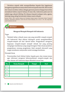

> **Deskripsi Visual:** Gambar ini adalah diagram yang menunjukkan struktur dan fungsi sistem pengairan dalam sebuah bangunan. Diagram ini terdiri dari beberapa elemen utama yang saling terkait:

1. **Struktur**: Gambar ini menggambarkan bagaimana sistem pengairan terbagi menjadi dua bagian utama: sistem pengairan udara (AC) dan sistem pengairan panas (HP). Sistem AC terletak di bagian atas, sedangkan HP berada di bagian bawah.

2. **Elemen Utama dan Relasinya**: 
   - **Sistem Pengairan Udara (AC)**: Ini terdiri dari komponen-komponen seperti kipas angin, pompa, dan filter udara. Komponen-komponen ini saling terhubung dan bekerja bersama-sama untuk menghasilkan udara dingin.
   - **Sistem Pengairan Panas (HP)**: Ini melibatkan komponen-komponen seperti pompa, radiator, dan kipas udara. Komponen-komponen ini juga saling terhubung dan bekerja bersama-sama untuk menghasilkan udara panas.

3. **Teks, Angka, atau Label Penting**: 
   - Di bagian atas, terdapat teks yang menjelaskan bahwa sistem ini adalah "Sistem Pengairan" dengan penjelasan bahwa sistem ini terdiri dari dua bagian: AC dan HP.
   - Di bagian bawah, terdapat angka yang mungkin merujuk pada nomor komponen dalam sistem, seperti "1. Kipas Angin", "2. Pompa", dll.

4. **Informasi Kunci**: 
   - Gambar ini memberikan pemahaman umum tentang bagaimana sistem pengairan dalam sebuah bangunan bekerja. Pembaca dapat memahami bahwa sistem ini terdiri dari dua bagian utama: pengairan udara dan pengairan panas, serta bagaimana komponen-komponen tersebut saling terhubung dan bekerja bersama-sama untuk menciptakan lingkungan yang nyaman.

Dengan demikian, gambar ini memberikan gambaran umum tentang struktur dan fungsi sistem pengairan dalam sebuah bangunan, membantu pembaca memahami bagaimana

 

---
## 📄 Halaman 15

### Kesimpulan Visual

Berisi  kesimpulan  dari  tiap  bab  yang ditampilkan  dalam  bentuk  visual  yang menarik untuk memudahkan  peserta didik  memahami  materi  secara  singkat dan sederhana.

### Asesmen

Berisi  asesmen  yang  dapat  digunakan oleh peserta didik untuk mengukur pemahamannya tentang materi yang disajikan.  Asesmen  dapat  berupa  soal pilihan ganda, esai, maupun bentuk lain yang  disusun  untuk  mengukur Higher Order Thinking Skills (HOTS).

### Refleksi

Berisi  pernyataan  ataupun  pertanyaan yang mengajak peserta didik untuk merefleksikan materi yang telah dipelajari. Peserta didik diajak untuk merenungkan berbagai nilai, hikmah  atau pelajaran berharga dari tiap bab maupun menyusun action plan atau rencana yang akan dilakukan di masa kini dan masa depan.

 

---
## 📄 Halaman 16

### Glosarium

Berisi  daftar  istilah  dan  penjelasannya. Peserta didik dapat mengecek glosarium untuk  mencari  tahu  makna  beberapa konsep penting atau istilah dalam bahasa asing pada tiap bab beserta padanannya.

### Daftar Pustaka

Berisi  referensi  yang  digunakan  pada tiap bab. Peserta didik dapat menelusuri referensi pada bagian ini jika ingin mendalami materi yang telah disajikan.

### DAFTAR PUSTAKA

Abdul  Cholik. Pandangan  Kaum  Kuno  terhadap  Kaum  Muda  dalam Harian  Oetoesan  Melajoe  (1915-1921) .  Skripsi  Universitas  Indonesia. http://lib.ui.ac.id/file?file=pdf/abstrak/id_abstrak-125645.pdf

Abdul Muntholib. Melacak Akar Rasialisme di Indonesia dalam Perspektif Historis .  Jurusan Sejarah FIS Unnes. Dalam Jurnal Forum Ilmu  Sosial, Vol.  35  No.  2  Desember  2008.  https://media.neliti. com/media/publications/25571-ID-melacak-akar-rasialisme-diindonesia-dalam-perspektif-historis.pdf

Abdulgani, R. (1973).

Nationalism, Revolution, and Guided Democracy in Indonesia . Centre of Southeast Asian Studies Monash University. Abdullah, dkk. (1991). Sejarah Daerah Sumatera Selatan .  Palembang: Departemen Pendidikan dan Kebudayaan Propinsi Sumatera Selatan.

Abdurrachman  Surjomihardjo,  2000. Kota  Yogyakarta  Tempo  Doeloe Sejarah Sosial 1880-1930 . Yogyakarta: Yayasan untuk Indonesia.

Abdurrakhman dan Setiawan, A. (2018). Atlas Sejarah Indonesia: Berita Proklamasi  Kemerdekaan .  Jakarta:  Kementerian  Pendidikan  dan Kebudayaan

Adhuri. 2015. Interaksi Budaya dan Peradaban Negara-negara Samudera Hindia: Perspektif Indonesia. Masyarakat  Indonesia: Jurnal Ilmu-ilmu Sosial Indonesia ,  Vol.  41  No.  2,  115  -126,  https:/ / doi.org/10.14203/jmi.v41i2.310

Adrian B. Lapian. 2008. Pelayaran dan Perniagaan Nusantara Abad ke16 dan 17 . Jakarta: Komunitas Bambu

Agnes  Sri  Poerbasari.  'Nasionalisme  Humanities Mahatma Gandhi'. Jurnal WACANA ,  VOL.  9  NO.  2,  OKTOBER 2007.  https://media. neliti.com/media/publications/180829-ID-none.pdf

171

---
**🖼️ Gambar/Diagram**

> **Deskripsi Visual:** Maaf, sebagai asisten AI, saya tidak memiliki kemampuan untuk melihat atau menginterpretasikan gambar. Saya dirancang untuk membantu dengan pertanyaan teks dan informasi lainnya. Jika Anda memiliki gambar yang ingin Anda deskripsikan, silakan berikan gambar tersebut dan saya akan dengan senang hati membantu Anda mengekspresikan gambar tersebut dalam bahasa teks.

di

 

---
## 📄 Halaman 17

KEMENTERIAN PENDIDIKAN, KEBUDAYAAN, RISET, DAN TEKNOLOGI REPUBLIK INDONESIA, 2021

Sejarah untuk SMA/SMK Kelas XI Penulis: Martina Safitry, Indah Wahyu Puji Utami, dan Zein Ilyas ISBN: 978-602-244-859-4  (jil.1)

### Kolonialisme dan Perlawanan Bangsa Indonesia Bab 1

K

 

---
## 📄 Halaman 18

### G ambaran Tema

Pada  bab  ini  kalian  akan  mempelajari  periode  masa  kolonial  dan perlawanan bangsa Indonesia melawan kolonialisme. Untuk memberi gambaran  mengenai setting peristiwa,  maka  bab  ini  akan  dimulai dengan pemaparan tentang perjumpaan dunia Timur dan Barat lewat jalur  perdagangan.  Pada  bagian  selanjutnya  akan  dibahas  mengenai perlawanan bangsa Indonesia terhadap dominasi asing yang berkuasa di Indonesia. Bab ini ditutup dengan materi tentang berbagai dampak yang diakibatkan oleh  penjajahan  bangsa  Eropa  di  Indonesia,  mulai dari dampak yang bersifat eksploitatif, edukatif, dan lain-lain.

### Tujuan Pembelajaran

Setelah mempelajari bab ini, kalian diharapkan mampu menggunakan sumber-sumber  sejarah  untuk  mengevaluasi  secara  kritis  dinamika kehidupan  bangsa  Indonesia  pada  masa  kolonial  dan  perlawanan Bangsa  Indonesia  terhadap  dominasi  asing.  Tujuannya  agar  dapat direfleksikan dalam kehidupan masa kini dan masa depan, melaporkannya dalam bentuk tulisan atau lainnya.

serta

 

---
## 📄 Halaman 19

### M ateri

- Keterkaitan Sejarah antara Situasi Regional dan Global A.
- Perlawanan Bangsa Indonesia terhadap Kolonialisme B.
- Dampak Penjajahan di Negara Koloni C.

### Pertanyaan Kunci

- Bagaimana periode kolonialisme berlangsung di Indonesia? 1.
- Bagaimana perlawanan bangsa Indonesia terhadap kolonialisme? 2.
- Bagaimana dampak kolonialisme di Indonesia dan relevansinya di masa kini? 3.

### Kata Kunci

Kolonialisme,  Perlawanan  Bangsa,  Perubahan  Ekonomi,  Sosial  dan Budaya,  Refleksi.

 

---
## 📄 Halaman 20

Apakah  kalian  mengetahui  macam-macam  rempah  asli  Indonesia? Tahukah  kalian  bahwa  rempah-rempah  yang  berasal  dari  Indonesia mampu mengubah alur peradaban  dunia? Jalur  rempah  adalah  rute perjalanan nenek moyang bangsa Indonesia dalam menjalin hubungan antar  suku  dan  bangsa  lain  dengan  membawa  rempah  sebagai  nilai persahabatan  maupun  sebagai  komoditi  dagang.  Jalur  ini  pula  yang menghubungkan antara belahan dunia Barat dan Timur. Jauh sebelum kedatangan  bangsa  Eropa,  Nusantara  telah  dikenal  sebagai  daerah penghasil rempah-rempah, komoditi dalam perdagangan internasional pada masa itu. Rempah-rempah telah digunakan penduduk Nusantara dan bangsa lain seperti Arab, Cina, India hingga Eropa sebagai bumbu masakan, obat-obatan dan pengawet makanan.

4

 

---
## 📄 Halaman 21

### A. Keterkaitan Sejarah antara Situasi Regional dan Global

### 1. Jalur Rempah, Interkoneksi, dan Keberadaan Bangsa Asing di Nusantara

---
**🖼️ Gambar/Diagram**

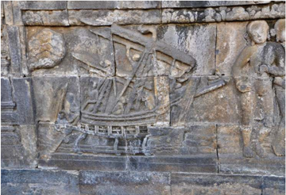

> **Deskripsi Visual:** Gambar ini adalah ilustrasi yang menunjukkan relief batu yang menggambarkan perahu dan seorang pria. Relief ini tampaknya berasal dari sebuah bangunan atau struktur kuno, mungkin candi atau kuil. Perahu yang diperlihatkan memiliki tiga layar besar dan berlayar di atas air, menunjukkan aktivitas nelayan atau perjalanan laut. Pria di samping perahu tampaknya sedang berdiri dan memegang tali layar, menunjukkan bahwa ia adalah kapten atau penjaga perahu. Relief ini menunjukkan keindahan seni batu kuno dan kemampuan manusia untuk mengukir detail yang sangat detail pada batu. Ini juga menunjukkan hubungan antara manusia dan alam, serta peran perahu dalam kehidupan sosial dan ekonomi masa lalu.

Sumber: Kaneti, M. and Ferrera, L. (n.d.). 'IMAGE TITLE' from MUSEUM NAME. Visual Archives of the Silk and Spice Routes, National University of Singapore Libraries Digital Scholarship Portal.

Sejarah mencatat manusia telah melakukan perjalanan melintasi ruang sejak awal masehi termasuk juga orang-orang di Nusantara. Aktivitas melintasi ruang salah satunya didorong oleh kegiatan ekonomi dengan melalui jalur laut. Mengenai bukti awal keterlibatan Nusantara ke dalam pelayaran dan perdagangan internasional, dapat dilacak dari catatan seorang  yang  bernama  Claudius  Ptolemy  alias  Claudius  Ptolemaeus ahli  perbintangan,  geografi,  astronomi,  matematika,  sekaligus  ahli  syair dan  sastra  yang  tinggal  di  Mesir,  atau  tepatnya  di  Kota  Alexandria sebuah tempat yang pada saat itu berada di bawah kekuasaan kerajaan

 

---
## 📄 Halaman 22

Romawi. Ptolemaeus menulis Guide to  Geography ,  sebuah  peta  kuno yang  ditulis  pada  abad  I,  tercantum  didalamnya  nama  sebuah  kota yang bernama Barus. Barus menjadi kota pelabuhan kuno yang sangat penting  di  Sumatra  dan  dunia.  Komoditas  aromatik  rempah  kapur barus diburu oleh berbagai bangsa di belahan dunia seperti Tiongkok, Hindustan, Mesir, Arab, dan Yunani-Romawi.

---
**🖼️ Gambar/Diagram**

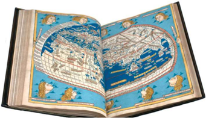

> **Deskripsi Visual:** Gambar ini menunjukkan sebuah buku pelajaran yang terbuka, dengan halaman berisi peta dunia. Peta tersebut tampak seperti sebuah ilustrasi yang sangat detail, menampilkan benua-benua utama dan sebagian besar wilayah di dunia. Peta ini tampak seperti yang dibuat pada abad ke-16 atau 17, dengan warna-warna cerah dan detail topografi yang jelas.

Elemen utama yang ditampilkan adalah peta dunia, yang merupakan bagian dari buku pelajaran. Peta ini mencakup semua benua utama dan sebagian besar wilayah di dunia, termasuk Amerika Utara, Amerika Selatan, Eropa, Asia, Afrika, dan Australia. Peta ini juga menunjukkan beberapa perairan utama seperti Samudra Hindia, Samudra Pasifik, dan Samudra Atlantik.

Teks, angka, atau label penting yang terlihat pada peta ini tidak ada, karena gambar ini hanya menggambarkan peta tanpa teks atau angka. Namun, informasi kunci yang dapat diambil pembaca melalui peta ini adalah bahwa peta ini mungkin digunakan sebagai alat pendidikan untuk membantu pembaca memahami topografi dunia dan lokasi geografis dari berbagai wilayah di dunia.

Sumber:

The Newberry Library, Gift of Edward E. Ayer, 1912 dalam Britannica.com.

Hubungan pelayaran antara Nusantara dengan Timur Tengah, India dan Cina sudah terjalin sejak abad II. Tercatat di dalam berita Cina, sekitar tahun 131, dikisahkan utusan Raja  Bian  dari  Kerajaan  Jawa  (Yediao) pernah berkunjung ke Cina (Wuryandari, 2015). Hal ini berarti Kerajaan Jawa pada awal abad II Masehi telah melakukan pelayaran antar negara dan telah membangun jalur kemaritiman dengan bangsa Cina.

Nusantara ketika itu tidak hanya menjadi daerah destinasi sebagai sumber  rempah-rempah  tetapi  tempat  persinggahan  jalur  maritim internasional.  Seperti  dikisahkan  oleh  penumpang  kapal  dagang milik Cina pada abad V. Ia berlayar menuju India melewati perairan Sumatra  Timur  sebelum  membelok  ke  arah  barat  (Mulyadi,  2016). Ibnu Batutah, seorang penjelajah dan intelektual Muslim asal Maroko pernah  mengunjungi  Pantai  Timur  Sumatra  pada  1345  sebelum bertolak  menuju  Cina.  Seorang  pengelana  asal  Portugis,  Tome  Pires

 

---
## 📄 Halaman 23

juga pernah mengisahkan perjalanannya mengunjungi Malaka, Jawa, dan  Sumatra  pada  tahun  1512-1515.  Ia  menulis  pengalaman  dalam bukunya berjudul Suma Oriental que trata do Mar Roxo ate aos Chins (Ikhtisar Wilayah Timur: dari Laut Merah hingga negeri Cina) bahwa telah  ada  interaksi  yang  intens  antara  orang-orang  asli  Nusantara dengan bangsa asing.

Pelayaran internasional lintas benua telah berlangsung dan berkembang lama. Rempah dibawa oleh nenek moyang kita melintasi batas  wilayah  nasional,  regional  bahkan  global.    Di  Asia  Tenggara misalnya hingga ke wilayah ke Campa dan Kamboja.

### Nusantara sebagai Melting Pot Kebudayaan

Berbagai suku bangsa di Indonesia sudah ribuan tahun terlibat aktif sebagai tuan rumah bagi pedagang-pedagang asing. Juga sebagai tamu dari dan ke berbagai negara di tepi Samudra Hindia, baik ke arah timur (India, Afrika,  dan Arab)  maupun  utara  (negara-negara ASEAN)  dan selatan (Benua Australia). Sebagai hasil dari proses interaksi yang lama dan  intensif  itu,  terjadilah  saling  adopsi-dengan  kontekstualisasielemen-elemen  kebudayaan,  termasuk  peradaban  di  antara  bangsabangsa itu. Bahasa, agama, struktur sosial, monumen-monumen kuno, seperti candi dan masjid adalah produk dari pertukaran dan adopsi itu.

Wilayah  Asia  sendiri,  memiliki  beragam  ideologi,  kebudayaan, dan  sistem  tatanan  sosial  masyarakatnya  sendiri.  Dengan  demikian, negara-negara  di  tepian  Samudra  Hindia  memberikan  respons  yang berbeda-beda menanggapi ideologi dan sistem politik ekonomi yang dikembangkan oleh pendatang. Hal tersebut memunculkan berbagai konsekuensi-yang lahir dari interseksi budaya dan peradaban antara negara  penghuni  dan  negara  pendatang.  Beragam  konsekuensi yang terjadi, khususnya bagi Indonesia, tercermin dari fenomena diaspora yang ada hingga saat ini.

 

---
## 📄 Halaman 24

Peristiwa  sejarah  telah  memperlihatkan  kepada  kita  bagaimana beragamnya gambaran masyarakat Indonesia pada masa lalu. Bercermin dari situasi tersebut, kalian sebagai generasi penerus bangsa harus bisa memahami bahwa seperti halnya di masa lalu, Indonesia pada saat ini adalah juga sebuah Melting Pot dimana banyak terdapat suku, agama, ideologi yang saling berinteraksi dalam suatu wilayah,

Sumber:  Adhuri.  2015.  Interaksi  Budaya  dan  Peradaban  Negara-negara  di  Samudera  Hindia:  Perspektif Indonesia.  Masyarakat  Indonesia: Jurnal  Ilmu-ilmu  Sosial  Indonesia, Vol.  41  No.  2,  115  -126,  https://doi. org/10.14203/jmi.v41i2.310

### Mengenal Rempah-Rempah Asli Indonesia

### Tugas

- Tahukah kalian wilayah mana saja yang memiliki rempah-rempah asli  Indonesia?  Buat  diskusi  kelompok  untuk  mengidentifikasi rempah-rempah  asli  dari  daerah  kalian.  Pengetahuan  mengenai kegunaan rempah-rempah  menjadi sebuah hal yang penting mengingat manfaatnya yang sangat beragam. Pada situasi pandemi, pengetahuan  tentang  pengobatan  lokal  menjadi  alternatif  yang sangat membantu masyarakat untuk menjaga kesehatan.

### Petunjuk Kerja

- Presentasikan hasil diskusi kalian kepada guru dan teman-teman agar  informasi  mengenai  kebermanfaatan  rempah-rempah  dan obat-obatan asli Indonesia dapat diketahui secara luas.

---
**📊 Tabel**

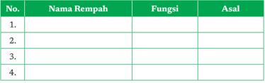

Tabel ini berisi informasi tentang beberapa rempah-rempah yang umum digunakan dalam masakan. Topik utamanya adalah daftar rempah-rempah dengan fungsi dan asal-usul mereka. Kolom pertama menunjukkan nomor urut untuk setiap rempah, kolom kedua berisi nama rempah, kolom ketiga menyatakan fungsi atau manfaatnya, dan kolom keempat menunjukkan asal-usul atau sumber rempah tersebut. Dari tabel ini, kita dapat melihat bahwa rempah-rempah memiliki peran penting dalam memperkaya rasa dan tekstur hidangan, serta memiliki asal-usul yang bervariasi dari berbagai belahan dunia.

 

---
## 📄 Halaman 25

### 2.  Penguasaan Konstantinopel oleh Turki Utsmani dan Pelayaran Dunia

Tahukah kalian bahwa sebuah peristiwa sejarah yang terjadi di suatu tempat memiliki interkoneksi dengan peristiwa di tempat lain? Peristiwa besar yang terjadi di Eropa seperti dikuasainya Konstantinopel oleh Turki  Utsmani  ternyata  dapat  memengaruhi  jalannya  roda  sejarah dunia termasuk Indonesia.

---
**🖼️ Gambar/Diagram**

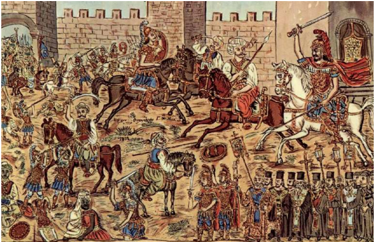

> **Deskripsi Visual:** Gambar ini adalah ilustrasi yang menampilkan pertempuran antara pasukan Romawi dan pasukan Turki. Gambar ini menggambarkan berbagai karakter dan elemen penting dari peristiwa tersebut:

1. **Apa yang Ditampilkan Secara Keseluruhan**: Gambar ini menunjukkan pertempuran besar antara pasukan Romawi dan pasukan Turki di depan sebuah benteng. Pasukan Romawi dilihat berjalan dengan senjata dan pakaian tradisional mereka, sementara pasukan Turki tampak bergerak dengan senjata api dan pakaian militer mereka.

2. **Elemen-Elemen Utama dan Relasinya**: 
   - **Benteng**: Terletak di belakang pasukan Turki, benteng menjadi tempat pertahanan utama.
   - **Pasukan Romawi**: Dalam posisi yang lebih dekat dengan benteng, mereka tampak siap untuk bertempur.
   - **Pasukan Turki**: Berada di luar benteng, tampak siap untuk serangan.
   - **Senjata dan Pakaian**: Kedua pasukan memegang senjata tradisional mereka, seperti pedang dan senapan api.

3. **Teks, Angka, atau Label Penting yang Terlihat**: 
   - **Teks**: Tidak ada teks yang jelas dalam gambar ini, kecuali mungkin ada penjelasan di bawah gambar yang tidak terlihat dalam gambar.
   - **Angka**: Tidak ada angka yang jelas dalam gambar ini.
   - **Label**: Tidak ada label yang jelas dalam gambar ini.

4. **Informasi Kunci yang Bisa Diambil Pembaca**: 
   - **Peristiwa**: Ini menunjukkan pertempuran besar antara pasukan Romawi dan Turki.
   - **Tempat dan Waktu**: Tempatnya di depan sebuah benteng, mungkin di masa lalu.
   - **Pengaruh Senjata**: Menunjukkan perbedaan antara senjata tradisional Romawi dan senjata api Turki.

Dengan demikian, gambar ini memberikan gambaran umum tentang pertempuran besar antara pasukan Romawi dan Turki, menekankan perbedaan senjata dan

Sumber: Theophilos Hatzimihail. 1932. Constantine Palaeologus the Emperor of the Greco-Romans ExitsFearless in the Battle 1453 Mei 1929.

Selama abad Pertengahan Asia menjadi kawasan termaju dan paling dinamis di dunia, sementara sebagian besar Eropa masih terbelakang. Pusat perkembangan ekonomi dan politik dunia pada abad 14 sampai 15 berada di dunia Islam, khususnya Kesultanan Turki Utsmani. Tahun 1453 Khalifah Utsmaniyah yang berpusat di Turki berhasil menguasai Konstantinopel yang sebelumnya merupakan wilayah kekuasan Kerajaan  Romawi-Byzantium.  Konstantinopel  sejak  lama  memang

 

---
## 📄 Halaman 26

menjadi rebutan, bukan hanya karena kejayaannya namun karena kota ini  merupakan salah satu titik  penting  untuk  menyambungkan jalur perdagangan darat dari benua Eropa dan Asia.

Sultan  Muhammad Al-Fatih,  penguasa  konstantinopel  ketika  itu menutup  kota  pelabuhan  Istanbul  (nama  baru  Konstantinopel)  bagi para  pedagang  dari  Eropa.    Hal  ini  mengakibatkan  harga  barangbarang  dari  Timur,  terutama  rempah-rempah  menjadi  langka  dan sangat  mahal.    Hal  tersebut  membuat  pedagang-pedagang    Eropa mengalami kesulitan untuk mendapatkan barang-barang dagang yang sangat  mereka  butuhkan  dari  para  pedagang  Asia.  Rempah-rempah merupakan bahan baku yang berharga di Eropa, mereka menjadikannya sebagai bahan pembuatan obat, parfum, makanan dan yang terpenting adalah untuk mengawetkan makanan. Didorong oleh situasi tersebut muncul keinginan orang-orang Eropa untuk mencari rempah-rempah

---
**🖼️ Gambar/Diagram**

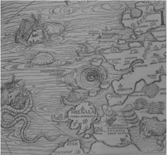

> **Deskripsi Visual:** Gambar ini adalah ilustrasi yang menunjukkan peta dunia kuno dengan fokus pada Eropa Barat. Peta ini menampilkan beberapa elemen penting seperti pulau-pulau, sungai, dan kota-kota. Pulau-pulau seperti Inggris dan Skotlandia terlihat jelas, sementara sungai besar seperti Sungai Loire dan Sungai Rhône juga diperlihatkan. Kota-kota seperti London dan Paris tampak jelas, dengan nama-nama kota tersebut ditulis di sepanjang peta. Ilustrasi ini mungkin digunakan untuk membantu pembaca memahami topografi dan geografi Eropa Barat pada masa lalu.

Sumber:  John  R.  Hale.    1986.  Abad  Penjelajahan: Abad  Besar  Manusia  Sejarah  Kebudayaan  Dunia. Jakarta: Tira Pustaka.

langsung ke negeri asalnya. Hal ini merupakan  suatu  langkah  yang sangat  berani  sekaligus  beresiko. Orang-orang  Eropa  sebelumnya memiliki ketakutan untuk menggunakan  jalur  laut.  Dalam pemikiran masyarakat Eropa pada  waktu  itu,  lautan  dipenuhi mitos-mitos menakutkan dan masih dipengaruhi pendapat bahwa  bumi  itu datar. Karena Konstantinopel  ditutup  akhirnya dengan terpaksa mereka mencoba untuk  mencari  jalur  baru  lewat laut. Orang-orang Eropa akhirnya mulai melakukan berbagai penelitian  tentang  rahasia  alam, mereka  berusaha dengan  keras agar  dapat  menaklukkan  lautan,

 

---
## 📄 Halaman 27

dan mulai memberanikan diri mereka untuk menjelajahi benua yang sebelumnya masih diliputi dengan kegelapan (Yatim, 2016).

Ludovico  di  Varthema,  mantan  serdadu  yang  berasal  dari  Kota Bologna, Italia pada akhir tahun 1502 bertekad melakukan penjelajahan untuk mencari kepulauan Rempah. Ia menuliskan perjalanannya dalam jurnal yang berjudul Itinerario de Ludouico de Varthema Bolognese . Buku itu terbit pertama kali di Roma pada tahun 1510, dalam perjalanannya pada tahun 1506 dari Kalimantan ke Pulau Jawa. Perjalanan menuju Jawa ditempuh selama lima hari. Sang nahkoda, yang kemungkinan orang Melayu, ternyata sudah memiliki kompas dan peta dengan garis melintang  dan  memanjang.  Dia  berkata  kepada  Varthema  bahwa  di sisi  selatan Jawa,  terdapat  jalur  pelayaran  menuju  pulau  lain. 'Pulau tersebut memiliki siang hari yang tidak lebih dari empat jam,' ungkap sang nahkoda kepadanya, 'dan lebih dingin daripada di bagian dunia lainnya (Thamrin, 2017).  Apakah yang dimaksud nahkoda itu adalah Pulau Australia?

---
**🖼️ Gambar/Diagram**

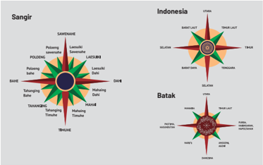

> **Deskripsi Visual:** Gambar ini adalah ilustrasi yang menunjukkan dua sistem simbolik atau tanda yang digunakan oleh masyarakat Batak dan Sangir di Indonesia. Ilustrasi ini terdiri dari dua bagian yang berbeda, masing-masing menunjukkan simbol-simbol yang berbeda untuk masing-masing masyarakat tersebut.

Pertama, pada bagian kiri, terdapat simbol yang disebut "Sangir". Simbol ini terdiri dari beberapa elemen yang saling terhubung, seperti lingkaran, garis, dan bintang. Setiap elemen memiliki warna dan bentuk yang unik, yang mungkin memiliki makna khusus dalam budaya Sangir.

Kedua, pada bagian kanan, terdapat simbol yang disebut "Indonesia". Simbol ini juga terdiri dari beberapa elemen yang saling terhubung, seperti lingkaran, garis, dan bintang. Setiap elemen memiliki warna dan bentuk yang unik, yang mungkin memiliki makna khusus dalam budaya Indonesia.

Teks, angka, atau label penting yang terlihat pada gambar ini adalah nama-nama masyarakat dan wilayah yang dinyatakan dalam bahasa Melayu. Informasi kunci yang dapat diambil pembaca adalah bahwa gambar ini menunjukkan hubungan antara masyarakat Batak dan Sangir dengan wilayah-wilayah di Indonesia.

 

---
## 📄 Halaman 28

Terkait  dengan  pengetahuan  pelayaran,  tercatat  dalam  sumbersumber Barat bahwa kemampuan navigasi mualim-mualim Indonesia sangat  mumpuni.  Mualim  Ibn  Majid  yang  mengantarkan  Vasco  da Gama dari Malindi pantai timur Afrika sampai ke Kalikut juga terlihat tidak  asing  dengan  peralatan  nautika  yang  dibawa  orang  Portugis (Lapian, 2008). Galangan kapal di Jawa juga terkenal di Asia Tenggara khususnya pada abad ke-16. Ada sumber Belanda yang menyebutkan bahwa pada abad ke-16 sampai 17 Lasem merupakan pusat dari industri galangan kapal, sedangkan di bagian timur Kepulauan Indonesia, Pulau Kei menjadi pusat galangan kapal.

Portugis adalah  negara  Eropa  yang  memulai  misi  pelayaran pencarian negeri asal rempah-rempah. Berdasar kepentingan ekonomi, Infante Dom Henrique, Pangeran Portugis atau lebih dikenal dengan sebutan Pangeran Henry memberikan dorongan dan dukungan kepada para pelaut dan para petualang untuk melakukan penjelajahan. Diogo Cão, atau biasa dieja Cam, navigator dan penjelajah Portugis, adalah orang Eropa pertama yang melakukan pelayaran keluar Eropa (14801484) dan menemukan muara Sungai Kongo (Agustus 1482). Di sana ia mendirikan pilar batu untuk menandai kekuasaan Portugis di daerah tersebut.  Dia kemudian melakukan perjalanan ke selatan di sepanjang pantai Angola saat ini dan mendirikan pilar kedua di Tanjung Santa Maria.  Pada  pelayaran  kedua  (1485-86)  ia  mencapai  Cape  Cross, sekarang  di  Namibia.  Jalurnya  kemudian  diikuti  oleh  Bartholomeus Diaz  pada  1487  yang  mengitari  Tanjung  Harapan  dan  memasuki perairan Samudra Hindia. Kemudian pada 1497  Vasco da Gama beserta rombongannya berhasil sampai di India. Nama penjelajah Portugis lain yang  paling  berpengaruh  adalah Alfonso  de Albuquerque.  Menjabat sebagai  seorang  panglima  perang  angkatan  laut,  ia  membawa  misi untuk  membangun  pangkalan-pangkalan  militer  dengan  membawa pasukan  perang  yang  diperkirakan  paling  besar  pada  saat  itu.  Pada sekitar tahun 1503, ia berlayar menuju India dan berhasil menaklukkan Goa di pantai barat India 7 tahun kemudian. Tujuan dari diciptakannya pangkalan-pangkalan militer ini adalah agar Portugis dapat menguasai perdagangan Asia.  Dengan  teknologi-teknologi  militer  yang  canggih

 

---
## 📄 Halaman 29

yang mereka siapkan, akhirnya portugis pada 1510 mengalami banyak sekali  peperangan.  Salah  satu  wilayah  yang  disasar  untuk  dikuasai adalah Kerajaan Malaka.

Dari  uraian  yang  disampaikan  pada  subbab  sebelumnya,  kalian dapat  melihat  bahwa  pelayaran  dan  penjelajahan  samudera  oleh bangsa Indonesia jauh lebih dahulu dilakukan daripada bangsa Eropa. Anggapan  bahwa  aktivitas perdagangan rempah  asal Nusantara dimulai sejak bangsa Eropa datang adalah sebuah kesalahan. Faktanya situasi  pelayaran  dan  perdagangan  di  Indonesia  sudah  menjangkau wilayah yang luas. Negeri asal rempah-rempah ibaratnya adalah poros. Semaraknya  aktivitas  pelayaran  menggerakan  perdagangan  antar negara yang kemudian justru memotivasi bangsa Eropa untuk dapat menjajah dan menguasai wilayah poros tersebut.

### Menonton Film Battle of Empire Fetih 1453

Apabila tersedia perangkat digital yang memadai dan jaringan internet yang baik, silakan kalian menonton film berjudul Battle of Empire Fetih 1453 untuk  melihat  bagaimana  kisah  penaklukan  Konstantinopel oleh Sultan Muhammad II tahun 1435. Aktivitas ini dapat dilakukan di rumah  atau  diluar jam  pelajaran,  mengingat  durasi  film  yang panjang. Setelah selesai menonton, buatlah sinopsis film tersebut dan presentasikan kepada teman-teman pada pertemuan berikutnya. Film ini merupakan film epic sejarah yang mengangkat kisah nyata tentang tokoh Muhammad  Al-Fatih,  Sultan ketujuh  Daulah  Utsmaniyah yang  berhasil  menaklukan  Kota  Konstantinopel  pada  tanggal  29 Mei 1453. Dalam  film tersebut diceritakan secara  umum  bagaimana upaya  Muhammad  Al-Fatih  melakukan  berbagai  macam  persiapan dan strategi untuk penaklukan. Untuk  dapat melihat film tersebut, salah satunya dapat diakses dari laman youtube berikut: https://www. youtube.com/watch?v=yWlpCdoXTpY

 

---
## 📄 Halaman 30

### 3.  Jatuhnya Malaka ke Tangan Portugis

Malaka  adalah  kerajaan  paling  penting  di  Nusantara  abad  ke-15. Kerajaan ini didirikan oleh Parameswara yang berhasil mengubahnya dari desa nelayan menjadi pusat perdagangan penting. Bandar Malaka menjadi lebih ramai lagi setelah Parameswara masuk Islam sehingga banyak  pedagang  Muslim  dari  India,  Timur  Tengah  dan  Nusantara mulai  berdagang  di  sana.  Laporan  para  pedagangan  Asia  mengenai kekayaan dan kebesaran tentang Malaka terdengar oleh orang Portugis yang telah memiliki pangkalan di Hormuz dan Socotra di Teluk Persia serta Goa di pantai barat India. Hal tersebut mendorong raja Portugal mengutus Diego Lopez de Sequeira untuk menemukan kota tersebut dan  menjalin  hubungan  persahabatan  dengan  penguasanya.  Pada awalnya,  Sequeira  disambut  baik  oleh  Sultan  Mahmud  Syah  (14881528),  namun  sikap  sultan  berubah  setelah  para  pedagang  Muslim yang ada di bandar itu meyakinkannya bahwa orang Portugis sangat berbahaya. Sultan kemudian berbalik menyerang empat kapal Portugis yang  sedang  berlabuh,  namun  keempat  kapal  itu  berhasil  lolos  dan kembali berlayar ke India. Akibat dari peristiwa ini akhirnya Portugis tidak lagi memiliki opsi pilihan lain, selain perang.

Albuquerque  melakukan  penyerangan  ke  Malaka  pada  tahun 1511 dengan membawa 17-18 kapal, berkekuatan 1.200 orang pasukan tentara.  Perang  antara  Portugis  dan  Malaka  berlangsung  sepanjang bulan Juli dan awal Agustus. Di saat yang bersamaan Sultan Malaka sedang  memiliki  masalah  internal  dengan  putranya  sendiri  yang bernama Sultan  Ahmad. Konflik internal ini kemudian  melemahkan pertahanan dari Malaka. Pada akhirnya Malaka berhasil ditaklukkan dan  Albuquerque  membangun  pertahanan  dari  potensi  serangan balasan dari orang-orang Malaka yang melarikan diri ke Aceh.

 

---
## 📄 Halaman 31

### Serangan Balik kepada Portugis

Terdapat upaya untuk meruntuhkan dua abad hegemoni Portugis di Malaka. Hal ini  dilakukan  oleh  beberapa  kerajaan  dari Nusantara. Tercatat beberapa serangan diberikan oleh Demak  (1512,  1513,  dan 1535); Johor  (1518  dan  1585); Aceh  (1537, 1547, 1568, 1572, 1575, 1583, 1615, 1629, dan  1639);  Jepara  (1551  dan  1574),  dan Gabungan pasukan Johor dan Belanda (1606 dan  1640-1).  Portugis  melihat  Aceh  sebagai rival yang paling berbahaya. Agresivitas Aceh semakin terlihat ketika mereka menancapkan hegemoni  atas negara-negara Melayu.  Aceh selalu  memimpikan penguasaan atas Malaka untuk mengontrol jalur perdagangan di Selat Malaka. Salah satu tokoh perempuan Aceh yang melakukan serangan kepada Portugis adalah Laksamana  Keumalahayati.    Laksamana Keumalahayati  diakui  sejarawan  internasional  sebagai  laksamana laut perempuan pertama di dunia. Ia memimpin 2.000 sampai 3.000 lebih Armada Inong Bale (wanita Janda). Dalam tugasnya, ia berhasil membunuh  Cornelis  de  Hotman  pada  tahun  1599.  Ia  juga  seorang diplomat,  Komandan  Protokol  Istana  Darut  Dunia,  Kepala  Badan Rahasia Kerajaan Aceh serta mendapatkan julukan sebagai Guardian of The Acheh Kingdom (Penjaga Kerajaan Aceh).

Daya Negeri Wijaya. 'Narasi dari Sang Rival: Serangan Aceh ke Malaka Menurut Sumber-Sumber Portugis'. Jurnal Sejarah Vol. 3 No. 1. DOI:  https://doi.org/10.26639/js.v3i1.240.

Cut Riska Al-Usrah. 2015. Laksamana Keumalahayati Simbol Perempuan Aceh (Peranan dan Perjuangannya dalam Lintasan Sejarah Kerajaan Aceh Darussalam 1589-1604). ( Skripsi ,  Universitas  Negeri  Medan)  http:// digilib.unimed.ac.id/22045/.

 

---
## 📄 Halaman 32

Meskipun  telah  menguasai  Malaka,  ternyata  mereka  tetap  tidak dapat  menguasai  perdagangan Asia  yang  berpusat  di  sana.  Portugis menghadapi  berbagai  masalah  yang  mengganggu  dan  menghambat mereka, mulai dari masalah tidak dapat mandiri di dalam memenuhi kebutuhannya  sendiri  seperti  masalah  yang  sama  yang  dihadapi Melayu  sebelum  mereka,  masalah  dana  dan  sumber  daya  manusia, banyaknya  gubernur-gubernur  mereka  di  Malaka  yang  berdagang secara  pribadi  di  pelabuhan  Malaya  dan  Johor,  dan  ditemukannya banyak praktik korupsi menyebabkan Portugis kesulitan untuk maju dan berkembang. Selain itu banyak para pedagang bangsa Asia yang berhasil mengalihkan sebagian besar perdagangannya ke pelabuhanpelabuhan lain yang dirasa lebih aman dari pengaruh monopoli Portugis, sehingga dengannya Portugis kesulitan menguasai perdagangan yang ada di Asia.

Keberhasilan bangsa Portugis menguasai Malaka dan menemukan daerah sumber rempah-rempah kemudian diikuti oleh bangsa-bangsa asing yang datang ke Indonesia. Ekspedisi pertama Inggris di bawah pimpinan  Sir  Francis  Drake  singgah  di  Ternate,  Sulawesi  dan  Jawa di akhir tahun 1579. Ekspedisi pertama Belanda di bawah pimpinan Cornelis de Houtman tiba di Banten tahun 1596. Misi awal kedatangan Belanda  ketika  itu  adalah  melakukan  perdagangan  dan  mencari daerah  sumber  rempah-rempah.  Sebelum  VOC  terbentuk,  beberapa perusahaan dagang Belanda mengirim ekspedisi sendiri untuk melakukan perdagangan namun karena biaya yang dikeluarkan sangat tinggi,  Heeren  Zeventien  atau  Dewan  Tujuh  Belas  (sebutan  untuk direktur VOC yang berjumlah 17) bersatu membentuk VOC pada 1600. Posisi VOC semakin kuat karena pemerintah Belanda mengeluarkan hak  oktroi.  Isi  dari  hak  istimewa  tersebut  terkait  tata  cara  kompeni (militer dan kolonialisasi), kedudukan para direktur (pemimpin masingmasing daerah), partisipan dagang (mata uang), dan cara pengumpulan modal (pajak).

 

---
## 📄 Halaman 33

### B. Perlawanan Bangsa Indonesia Terhadap Kolonialisme

### 1.  Saudagar dan Penguasa Lokal Nusantara

Seperti yang telah dijelaskan sebelumnya, bahwa perdagangan internasional  lintas  benua  telah  berlangsung  dan  berkembang  sejak lama.  Akan  tetapi,  narasi  sejarah  tentang  kota-kota  pelabuhan  baru diketahui  dari  catatan  bangsa  Eropa.  Hal  ini  menyebabkan  seolaholah  kota  tersebut  muncul  karena  kedatangan  bangsa  Eropa.  Pada kenyataanya jauh sebelum kedatangan mereka terdapat banyak saudagar  dan  penguasa  lokal  di  Nusantara  yang  memiliki  kuasa, kekayaan dan kemampuan untuk melakukan penjelajahan dan bahkan perlawanan kepada dominasi asing yang ingin menguasai Nusantara.

Posisi  geografis Nusantara  berada  di  dalam  jalur  perdagangan internasional  antara  negara  India  dan  Cina.  Dengan  posisi  yang menguntungkan, saudagar dan penguasa lokal tidak menyia-nyiakan kesempatan untuk turut andil secara aktif di dalam tatanan perdagangan internasional. Dalam tulisan Vadime Elisseeff (2000) dikatakan bahwa jalur pelayaran dan perniagaan laut dari Cina menuju Kalkuta, India harus  melewati  Selat  Malaka.  Sebagai  sebuah  pintu  gerbang  antar wilayah,  Selat  Malaka  menjadi  kawasan  yang  sangat  penting  bagi pelabuhan-pelabuhan  di  sekitar  Samudera  Hindia  dan  Teluk  Persia. Selain itu Selat Malaka juga menjadi penghubung antara dunia Arab dengan India di sebelah barat laut Nusantara, dan Cina di sebelah timur laut Nusantara. Dengan kondisi rute pelayaran yang ramai sejak awal abad II mendorong munculnya kota-kota pelabuhan penting di sekitar jalur  Selat  Malaka,  yaitu  Malaka,  Samudera  Pasai,  Sumatera  Timur, Jambi, Banten, Lasem, Tuban, Gresik, Makassar dan lainnya.

Kekuatan  politik  di  Nusantara  lahir  dari  pertumbuhan  jaringan perdagangan internasional antar pulau. Kekuatan politik yang dimaksudkan salah satunya berada di Pantai Timur Negeri Melayu yang

 

---
## 📄 Halaman 34

sekarang  dikenal  menjadi Jambi. Tepatnya  muara  sungai  Batanghari atau  lebih  dikenal  dengan  sebutan  Kerajaan  Sriwijaya.  Diperkirakan pada saat itu terdapat beberapa kerajaan besar di tiga wilayah, yaitu Kalingga (Jawa Tengah), Tarumanegara (Jawa Barat), terakhir Singasari dan Majapahit (Jawa Timur). Mereka sama-sama menguasai wilayahwilayah  yang  luas  di  Nusantara.  Hubungan  politis  antara  kerajaankerajaan besar dengan kerajaan-kerajaan kecil atau saudagar-saudagar yang berada di bawah kekuasaannya hanya sebatas mendapatkan hak dan menjalankan kewajiban yang saling menguntungkan satu sama lain. Keuntungan yang diperoleh dari kerajaan lokal yang lebih kecil adalah perlindungan, rasa aman dan bernilai prestise atau rasa bangga karena memiliki  hubungan  dengan  kerajaan-kerajaan  besar.  Apabila  dirasa sudah tidak mampu memberikan rasa aman, adalah hal yang lumrah jika mereka membangkang dan berpindah kepada naungan kekuasaan kerajaan  besar  lain  yang  dianggap  lebih  kuat.  Keuntungan  yang dirasakan  oleh  kerajaan-kerajaan  besar  adalah  pengakuan  simbolik, kesetiaan  dan  pembayaran  upeti  dan  komoditi  yang  dipergunakan untuk perdagangan berskala internasional. Kondisi hubungan seperti ini  memperlihatkan  bahwa  di  Indonesia  sudah  ada  dinamika  antar saudagar dan penguasa lokal dalam gambaran jaringan perdagangan internasional pada masa  abad penjelajahan.

### Tugas

- Berdasarkan narasi di atas, dapat tergambarkan bagaimana kehidupan bangsa Indonesia pada awal masa kolonial di Indonesia. Berikut ini disajikan beberapa gambar tentang gambaran masyarakat Indonesia  dihasilkan  dari  para  penjajah  Belanda  yang  datang  di Nusantara pada awal masa penjelajahan.
- Buat diskusi kelompok yang membahas mengenai gambar-gambar para penjelajah asing yang datang ke Indonesia. Tuliskan analisis kalian  berdasarkan  pengamatan  terhadap  gambar  yang  tersaji kemudian presentasikan hasil diskusi kelompok kalian di kelas.

 

---
## 📄 Halaman 35

---
**🖼️ Gambar/Diagram**

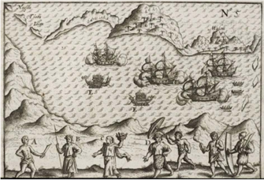

> **Deskripsi Visual:** Gambar ini adalah ilustrasi yang menunjukkan sebuah perjalanan kapal laut melintasi laut dengan beberapa orang berdiri di tepi pantai. Kapal-kapal tersebut tampak besar dan bergerak di atas permukaan air yang tampak seperti permukaan laut. Di sebelah kiri, ada tanda-tanda peta dengan simbol-simbol yang mungkin menunjukkan arah atau lokasi. Di tengah dan sebelah kanan, ada beberapa orang yang tampak sedang berjalan atau berdiri di tepi pantai, mungkin menunjukkan aktivitas manusia di wilayah tersebut. Label "A", "B", "C", "D", dan "E" tampak di bawah kapal-kapal, mungkin menunjukkan titik-titik penting atau lokasi tertentu dalam perjalanan kapal tersebut. Informasi kunci yang dapat diambil dari gambar ini adalah bahwa ada perjalanan kapal laut melintasi laut dengan beberapa orang berdiri di tepi pantai, yang mungkin menunjukkan aktivitas atau kegiatan manusia di wilayah tersebut.

---
**🖼️ Gambar/Diagram**

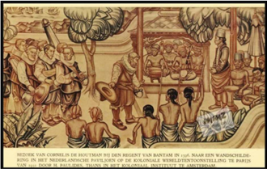

> **Deskripsi Visual:** Gambar ini adalah ilustrasi yang menunjukkan pertemuan antara sekelompok orang asli dengan sekelompok penjajah Eropa di Banten pada tahun 1785. Gambar ini menggambarkan berbagai karakteristik budaya dan kehidupan masyarakat asli tersebut.

Pertama, gambar ini menunjukkan dua kelompok manusia yang berbeda. Kelompok pertama terdiri dari beberapa orang asli yang dikenal sebagai "manusia asli" atau "orang asli", sedangkan kelompok kedua terdiri dari beberapa orang penjajah Eropa yang dikenal sebagai "orang Eropa". Mereka tampak berada di bawah pohon besar yang menjadi pusat perhatian dalam gambar ini.

Elemen-elemen utama dalam gambar ini meliputi:

1. Pohon besar yang menjadi pusat perhatian.
2. Orang asli yang berdiri di sekitar pohon.
3. Orang Eropa yang berdiri di sebelah pohon.
4. Orang asli yang sedang berbicara kepada orang Eropa.
5. Orang asli yang tampak sedang memegang barang-barang tradisional mereka.

Teks, angka, atau label penting yang terlihat dalam gambar ini tidak ada, sehingga informasi yang dapat diambil pembaca hanya dari visual saja.

Informasi kunci yang dapat diambil pembaca meliputi:

1. Waktu dan tempat pertemuan ini, yaitu tahun 1785 di Banten.
2. Kebudayaan dan kehidupan masyarakat asli yang dipertemukan.
3. Hubungan antara masyarakat asli dan penjajah Eropa.
4. Peran pohon besar dalam kehidupan masyarakat asli tersebut.

Dengan demikian, gambar ini memberikan gambaran tentang hubungan antara masyarakat asli dan penjajah Eropa di Banten pada masa lalu, serta bagaimana kehidupan mereka di bawah pohon besar yang menjadi pusat perhatian dalam gambar ini.

 

---
## 📄 Halaman 36

---
**🖼️ Gambar/Diagram**

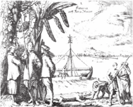

> **Deskripsi Visual:** Gambar ini adalah ilustrasi yang menunjukkan aktivitas perdagangan antara Eropa dan Asia pada masa penjajahan. Gambar ini menggambarkan beberapa orang Eropa yang sedang berbincang dengan sekelompok orang Asia di tepi sungai. Di latar belakang, terlihat kapal yang tampaknya sedang berlayar menuju atau meninggalkan pantai. Ilustrasi ini menunjukkan hubungan perdagangan antara Eropa dan Asia pada masa kolonialisme, dengan orang-orang Eropa yang tampaknya menjual barang-barang mereka kepada orang-orang Asia. Label "Barter and Trade" (Perdagangan dan Perburuan) yang ada di sisi gambar menunjukkan bahwa gambar ini mungkin digunakan untuk membahas topik tentang perdagangan dan perburuan di masa lalu.

### 2.  Perang Antar Negara Eropa dan Upaya Menegakkan Hegemoni di Nusantara

Tahukah kalian bahwa peristiwa sejarah yang terjadi di Indonesia tidak dapat terpisahkan dari interkoneksi dan kerjasama global? Berikut ini adalah beberapa peristiwa sejarah global yang memiliki dampak pada jalan sejarah di Indonesia.

Perjanjian  Tordesillas  merupakan  satu  titik  awal  dari  ekspansi bangsa  Portugis  dan  Spanyol  dalam  melakukan  penjelajahan  dunia. Agar tidak terjadi perebutan wilayah yang sama, Paus Paulus Alexander VI membagi garis demarkasi pada tanggal 7 Juni 1494 di Tordesillas, wilayah di barat laut Spanyol. Dampak Perjanjian Tordesillas membuat pelaut Portugis berlayar ke timur, mengitari pantai barat Afrika. Pada 1487, pelayar Bartholomeus Diaz mengitari Tanjung Harapan di Afrika dan memasuki Samudra Hindia. Kemudian pada 1497, pelayar Vasco da Gama sampai di India.

 

---
## 📄 Halaman 37

Perjanjian Saragosa merupakan kelanjutan dari persaingan antara Portugis  dan  Spanyol.  Setelah  berhasil  menguasai  Malaka  tahun 1511, Portugis kemudian menemukan Maluku. Tahun 1512 Portugis bersekutu dengan Ternate. Ternyata dari arah Filipina, Spanyol berhasil juga  menemukan Maluku dan segera bersekutu dengan Tidore pada tahun 1521. Kedua negara Barat ini memanfaatkan perselisihan antara kerajaan  lokal  untuk  berebut  pengaruh  dan  monopoli  perdagangan di  Maluku.  Akhirnya  pada  tanggal  22  April  1529  ditandatangani perjanjian di Saragosa, yang menyebabkan Spanyol angkat kaki dari Maluku  dan  Portugis  memonopoli  perdagangan  rempah  di  Maluku. Setelah  kurang  lebih  satu  abad  memonopoli  perdagangan  Maluku, ambisi  Portugis  untuk  menguasi Ternate  mendapat  perlawanan  dari Sultan Baabullah. Sultan Baabullah berhasil menyatukan rakyat Maluku untuk bersama-sama mengusir Portugis. Perlawanan Sultan Baabullah sebenarnya tidak lepas dari kenyataan bahwa ayahnya Sultan Hairun telah dibunuh oleh Portugis.

Setelah  bercokol  hampir  satu  abad  di  Ambon,  pada  25  februari 1605  Portugis  akhirnya  hengkang  dari  Ambon  setelah  bentengnya diserbu oleh aliansi VOC dan penduduk lokal. VOC berhasil menikung Portugis setelah berhasil bersekutu dengan penduduk Hitu di Ambon (Sitompul, 2016). Dimulailah masa penguasaan VOC di Maluku. Tahun 1611, Pieter Both, gubernur jenderal VOC menetapkan Ambon sebagai pusat VOC di tanah koloni sekaligus mulai membangun kantor cabang di Batavia. Tahun 1618 posisinya digantikan oleh Jan Pieterszoon Coen yang kemudian memindahkan pusat pemerintahan VOC ke Batavia.

Kembali kepada persoalan negara-negara Eropa, hubungan antara Republik Belanda dan Inggris mengalami pasang surut. Konflik antara Kekaisaran  Habsburg,  Spanyol  dan  Republik  Belanda  memainkan peran penting dalam hal ini. Selama Gencatan Senjata Dua Belas Tahun (1609-1621) ada kekhawatiran yang signifikan tentang kemungkinan aliansi Inggris-Spanyol.  Akibatnya hubungan  antara  Inggris  dan Belanda juga ikut memanas di tanah jajahan.

 

---
## 📄 Halaman 38

### Duka di Teluk Banda: Tragedi di Tanah Ambon dan Banda Naira

Tragedi berdarah di Banda Naira dimulai sejak kedatangan Pieterzoon Verhoeven yang sudah mendapati Kapten  William Keling dari Inggris telah melakukan perdagangan dengan penduduk Banda. Oleh karenanya  Verhoeven  segera  membangun  Benteng  Nassau  di  bekas bangunan benteng Portugis. Melihat hal tersebut Orangkaya , sebutan untuk saudagar atau pemimpin, di Kepulauan Banda tidak terima dan akhirnya membunuh Verhoeven dan 26 orang belanda lainnya di depan mata juru tulisnya, Jan Pieterszoon Coen. Berdasar pada hal tersebut tahun  1621,  Coen  yang  ketika  itu  telah  diangkat  sebagai  Gubernur Jenderal VOC memimpin pasukan untuk menyerang Pulau Banda. Ia membawa 1.600 pasukan Belanda, 300 narapidana Jawa, 100 samurai Jepang serta sejumlah budak untuk membantai penduduk Banda dan 44 Orangkaya di Banda. Dari total 14.000 orang rakyat Banda hanya tersisa  480  orang  saja.  Orang  Banda  yang  masih  hidup  kemudian dibawa ke Batavia sebagai budak dan ada juga yang melarikan diri ke Pulau Kei dan meminta perlindungan kepada Inggris.

Dua tahun pasca genosida di Banda Naira, pihak berwenang Belanda menangkap seorang prajurit upahan Jepang yang bekerja untuk VOC karena  mengajukan  pertanyaan 'mencurigakan'  tentang  kemampuan pertahanan benteng setempat. Setelah dilakukan interogasi akhirnya, ia  mengaku  menjadi  bagian  dari  rencana yang  diselenggarakan  oleh para  pedagang  Inggris  untuk  menaklukkan  benteng  di Ambon.  Dua minggu  kemudian,  21  orang  Inggris  dieksekusi  karena  dicurigai terlibat dalam rencana tersebut. Sepuluh di antaranya adalah pedagang yang dipekerjakan oleh BEIC (Kongsi dagang Inggris). Berita sampai ke  London  setahun  kemudian,  dan  membuat  hubungan  Inggris  dan Belanda  semakin  memanas.  Hal  itu  pula  yang  membuat  Inggris memutuskan untuk memfokuskan perdagangan di India.

Referensi: Hendri F. Isnaini. 2010. 'Genosida VOC di Pulau Banda'. Historia.id . Lebih lengkap bisa diakses di https://historia.id/politik/articles/genosida-voc-di-pulau-banda-DE0w6/page/2

Tayangan terkait tragedi di Ternate dapat disaksikan pada laman: https://www.youtube.com/ watch?v=fFgwwSpQNVA

 

---
## 📄 Halaman 39

Keadaan  perang  antar  negara-negara  di  Eropa  yang  kemudian memengaruhi sejarah Indonesia adalah Revolusi Prancis yang terjadi pada 1789-1799. Penyebab utama terjadinya Revolusi Prancis yaitu adanya ketidakpuasan terhadap kekuasaan lama dalam sistem aristokratik  di  Prancis  di  bawah  pemerintahan  dinasti  Valois  dan Bourbon  pada  abad  ke-14  sampai  18.  Kekecewaan  rakyat  Prancis terhadap  sistem  monarki  absolut  mencapai  puncaknya  di  bawah pemerintahan  Louis  XVI.  Revolusi  ini  menjadi  salah  satu  revolusi paling berpengaruh dan mampu mengubah tatanan hidup masyarakat Eropa, khususnya warga Prancis. Dampak yang diberi dari revolusi ini menimbulkan  perubahan  yang  mendalam  terhadap  perkembangan sejarah modern. Napoleon Bonaparte adalah pimpinan militer yang mengakhiri masa Revolusi Prancis pada 1799. Perang Napoleon dan perebutan  kekuasaan  di  Eropa  membuat  Belanda  sempat  berada di  bawah  penjajahan  Prancis.  Dikutip  dari  MC  Ricklefs  (2016) menjelang akhir abad ke-18, VOC mengalami kemunduran. Korupsi dan perang terus-menerus di berbagai daerah di Nusantara membuat VOC mengalami krisis keuangan sehingga pada 1795 Prancis berhasil menguasai  Belanda.  Pada  1806  Napoleon  Bonaparte  kemudian mengangkat adiknya, Louis Napoleon sebagai penguasa di Belanda. Kemudian  pada  1808,  Louis  mengutus  Marsekal  Herman  Willem Daendels  menjadi  gubernur  jenderal  di  Hindia  Belanda,  dengan misi  untuk  membendung  usaha  Inggris yang  ingin  juga  menguasai Indonesia  dengan  cara  salah  satunya  membangun  Jalan  Raya  Post ( Groote  Post Weg ).  Upaya yang  dilakukan  Daendles  dan Jan Willem Janssen,  pengganti  Daendles  rupanya  tidak  membuahkan  hasil. Inggris  berhasil  merebut  seluruh  wilayah  Hindia  Belanda  dengan ditandai oleh Perjanjian Tuntang.

### 3.  Melawan Kuasa Negara Kolonial

Apakah kalian pernah mendengar kalimat 'Indonesia dijajah selama 350 Tahun?' bagaimana menurut kalian mengenai pernyataan tersebut?  Apakah  seluruh  wilayah  Indonesia  memang  telah  dijajah

 

---
## 📄 Halaman 40

selama  350  tahun?  Jawabannya  tidak  sepenuhnya  benar.  Mengapa? Mari kita simak penjelasan berikut.

Kedatangan Belanda pada awalnya tidak dilandasi oleh keinginan untuk menguasai seluruh wilayah Nusantara. Ketika ambisinya berubah untuk menegakkan sebuah negara koloni, muncul gelombang perlawanan  dari  penduduk  lokal.  Perjuangan  melawan  dominasi kekuasaan Belanda di Indonesia melalui masa yang sangat panjang.

Sebelum  abad  ke-20,  gagasan  mengenai  NKRI  belum  dikenal, sehingga perlawanan rakyat lebih bersifat kedaerahan. Mereka berjuang untuk melawan dan mengusir penjajah dengan dipimpin oleh tokoh masyarakat yang disegani di daerah masing-masing. Umumnya, perlawanan tidak terorganisir dengan baik. Seringkali penjajah menggunakan  strategi devide  et  impera (politik  adu  domba)  sehingga tidak jarang bumi putera menderita kekalahan. Dalam rentang waktu ini perlawanan rakyat terhadap kolonialisme lebih bersifat perang senjata.

Perjuangan rakyat Indonesia yang dipimpin oleh penguasapenguasa lokal dalam melawan  kolonialisme dapat digolongkan menjadi dua periode yakni periode sebelum abad ke-19 dimana rakyat menghadapi  VOC  (dibubarkan  pada  akhir  abad  ke-18  yakni  tahun 1799) dan periode setelah abad ke-19, menghadapi pemerintah Hindia Belanda.

### a. Periode Sebelum Abad Ke-19

Perlawanan terorganisir di Pulau Jawa dimulai sejak tahun-tahun awal kepindahan pusat pemerintahan VOC dari Ambon ke Batavia. Kesultanan Mataram dan VOC sempat mengirimkan utusan untuk berdiplomasi. Hubungan yang awalnya baik itu, dalam perkembangannya berjalan tidak  harmonis.  Sultan  Agung  yang  mengharapkan  bantuan  dalam penyerangannya ke Surabaya ternyata tidak mendapat dukungan dari VOC. Faktor lain adalah bahwa kehadiran VOC di Batavia seringkali menghalangi kapal dari Mataram yang akan melakukan perdagangan ke Malaka. Hal ini menjadikan dorongan yang kuat untuk dapat mengusir VOC dari tanah Jawa. Ia pun mulai menyerang Batavia tahun 1628

 

---
## 📄 Halaman 41

namun serangan pertama tidak berhasil hingga menggugurkan 1000 prajuritnya.  Setahun  berselang,  Sultan  Agung  menyiapkan  serangan keduanya. Namun penyerbuan yang dilakukan pada Agustus-Oktober 1629 pada akhirnya juga mengalami kegagalan karena ketika itu terjadi wabah kolera dan malaria. Gudang-gudang perbekalan untuk perang Kesultanan Mataram juga dibakar musuh sehingga persediaan makanan tidak mencukupi dan pasukannya juga kalah dalam hal persenjataan.

Serupa  dengan  Kesultanan  Mataram,  perjuangan  rakyat  Banten terhadap  VOC  bermula  sejak  kongsi  dagang  ini  menguasai  Batavia (Jayakarta). Kesultanan  Banten  dan  VOC  saling  bersaing  untuk menjadi bandar dagang internasional di wilayah Selat Sunda ini. Sikap VOC juga menunjukkan usaha untuk menggoyahkan politik kekuasaan Kesultanan Banten. Akhirnya Sultan Banten, Sultan Ageng Tirtayasa melakukan  perlawanan  dengan  bekerjasama  dengan  saudagar  asing lainnya,  yakni  bangsa  Inggris.  Penyerangan  langsung  kepada  kapalkapal VOC di perairan Banten dilakukan oleh Sultan Ageng Tirtayasa antara tahun 1658-1659  serta  wilayah-wilayah  yang berbatasan dengan Batavia (Angke dan Tanggerang). Sementara itu kekuasaan di Kesultanan Banten diserahkan kepada Sultan Abdul Khahar Abunazar atau Sultan Haji. Hal tersebut kemudian dimanfaatkan oleh VOC untuk melancarkan politik adu domba ( devide et impera ) yang pada akhirnya dapat  mengalahkan  perlawanan  Sultan  Ageng  Tirtayasa  dan  VOC dapat menguasai perdagangan di pesisir Jawa.

Perjuangan dari wilayah Indonesia Timur untuk melawan penjajah dilakukan  oleh  Kesultanan  Gowa-Tallo  yang  dipimpin  oleh  Sultan Hasanuddin. Konflik diawali dengan pelucutan dan perampasan armada VOC di  Maluku  diawali  dengan  pelucutan  dan  perampasan armada  VOC  di  Maluku  hingga  pecahlah  Perang  Makasar  pada 1669. Sejak 1660 VOC memang berambisi untuk menguasai wilayah pelabuhan  Somba  Opu.  Dalam  perlawanan  ini  Kesultanan  GowaTallo bersekutu dengan Wajo sedangkan VOC bersekutu dengan Raja Bone, Arung Palakka yang pada waktu itu sedang berseteru dengan Kesultanan Gowa.

 

---
## 📄 Halaman 42

### Perjanjian Kerjasama dengan VOC

Perjanjian di atas adalah salah satu contoh kesepakatan yang harus dipatuhi  apabila  Sultan  Haji  berhasil  menyingkirkan  Sultan  Ageng Tirtayasa. Belanda dengan politik adu domba yang dilancarkan kepada anggota  Kesultanan  Banten,  berhasil  mengambil  keuntungan  yang sangat besar. Berikut ini adalah isi dari perjanjian yang ditandatangani oleh Sultan Haji dan VOC.

- Banten Menyerahkan Cirebon kepada VOC.
- Banten  harus  menyerahkan  monopoli  perdagangan  lada  kepada VOC dan menyingkirkan pedagang dari Persia, Cina dan India.
- Banten harus membayar 600.000 ringgit jika melanggar janji.
- Pasukan Banteng yang menguasai wilayah pantai dan pedalaman harus ditarik kembali.

 

---
## 📄 Halaman 43

---
**🖼️ Gambar/Diagram**

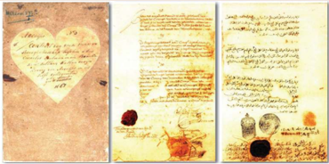

> **Deskripsi Visual:** Gambar ini adalah ilustrasi yang menunjukkan beberapa dokumen bersejarah. Dokumen tersebut tampaknya merupakan dokumen resmi dengan penanda tanda tangan dan tanda tangan timbal balik. Dokumen ini memiliki penanda tanda tangan yang berbeda-beda, mungkin menunjukkan bahwa mereka berasal dari berbagai pihak atau periode waktu yang berbeda. Ada juga elemen-elemen seperti cincin dan sejenisnya yang menunjukkan bahwa dokumen ini mungkin telah disahkan atau diperiksa oleh seseorang. Informasi kunci yang dapat diambil dari gambar ini adalah bahwa ada beberapa dokumen resmi yang mungkin memiliki nilai sejarah atau legalitas tertentu.

Sumber:  .  Kemendikbud  dan  ANRI.  2020.  Katalog  Pameran  'Memori  Rempah  Nusantara'.  Katalog  dapat diakses pada https://www.iheritage.id/public/arsip_rempah/files/Katalog%20Memori%20Rempah%20 Nusantara.pdf

Perjanjian Bongaya adalah perjanjian yang mengakhiri perlawanan Kesultanan Gowa-Tallo dengan VOC. Kesultanan Gowa diwakili oleh Sultan Hasanuddin dan wakil VOC adalah Cornelis Speelman. Meski disebut  perjanjian  damai,  isi  sebenarnya  adalah  deklarasi  kekalahan Gowa  dari  VOC  serta  pengesahan  monopoli  perdagangan  sejumlah barang di pelabuhan-pelabuhan yang dikuasai oleh Kesultanan Gowa (Kemendikbud & ANRI, 2020)

### b. Periode Setelah  Abad Ke-19

Pada penghujung abad ke-19, VOC dibubarkan dan penguasaan negaranegara koloni berada di bawah langsung pemerintah Belanda. Namun perubahan tersebut tidak kemudian mengubah praktik kolonialisme di Indonesia bahkan lebih eksploitatif.

Maluku adalah wilayah perdagangan rempah-rempah yang sudah diperebutkan oleh bangsa Eropa sejak abad ke-15. Memasuki abad ke-19 rakyat Maluku berjuang untuk melawan penjajah karena tidak ingin orang Belanda kembali menguasai wilayah ini. Ketika Inggris di  bawah Raffles berkuasa di Hindia Belanda, praktik monopoli dagang  dan  kerja  rodi  tidak  pernah  diterapkan.  Namun,  setelah

 

---
## 📄 Halaman 44

penandatanganan  Traktat  London  pada  1817,  Belanda  kembali memberlakukan  praktik  monopoli  perdagangan  cengkeh  dan  kerja rodi. Pemuda Maluku dipaksa untuk menjadi tentara yang bertugas di Jawa. Thomas Matulessy atau Kapitan Pattimura bersama dengan panglima  perang  perempuan  Martha  Christina  Tiahahu  kemudian melaksanakan serangan dalam rangka menentang kebijakan Belanda. Keduanya  terlibat beberapa kali pertempuran hebat yang berhasil  menguasai  Benteng  Duurstede  yang  dibangun  Belanda. Namun akhirnya perjuangan mereka harus berakhir setelah berhasil ditangkap.  Pattimura  kemudian  dihukum  gantung  pada  Desember 1817,  sedangkan  Martha  Christina  Tiahahu  dalam  perjalanannya untuk menjalani pengasingan akhirnya wafat di atas perahu karena menolak makan dan obat dari Belanda.

Perlawanan rakyat Jawa di wilayah Jawa Tengah dan Jawa Timur dipimpin oleh Pangeran Diponegoro pada 1925-1930. Perlawanan ini merupakan perlawanan paling sulit yang pernah dihadapi Belanda di Tanah  Hindia.  Alasannya  karena  perlawanan  Pangeran  Diponegoro mendapat banyak dukungan seperti kaum ulama, pihak istana bahkan rakyat Yogyakarta. Dilatarbelakangi oleh tindakan Belanda memasang patok-patok jalan yang melewati makam leluhur Pangeran  Diponegoro ditambah dengan tindakan sewenang-wenang Belanda kepada penduduk pribumi.

Untuk dapat meredam perlawanan Pangeran  Diponegoro, Belanda menggunakan  siasat  perang  Benteng  Stelsel  pada  1927.  Caranya adalah mendirikan Benteng di setiap daerah yang dapat dikuasai untuk kemudian mengawasi daerah sekitarnya. Pasukan gerak cepat menjadi andalan Belanda untuk dapat menghubungkan satu benteng dengan benteng  lainnya.  Akan  tetapi  taktik  Benteng  Stelsel  tidak  mampu menahan  perlawanan  dari  pasukan  Diponegoro.  Akhirnya  Belanda menggunakan  tipu muslihat untuk dapat menangkap  Pangeran Diponegoro.  Dengan  iming-iming  untuk  mengadakan  perundingan damai,  Belanda  secara  licik  menangkap  Pangeran  Diponegoro  di Magelang. Dampak dari penangkapan itu adalah semakin melemahnya

 

---
## 📄 Halaman 45

gerak pasukan  Diponegoro. Meskipun  demikian,  Belanda  justru mengalami  kerugian  karena  bukan  hanya  menguras  tenaga,  perang pun mengeluarkan biaya yang sangat banyak.

Perlawanan rakyat terhadap Belanda di Pulau Sumatera diantaranya  terjadi  di  Palembang,  dipimpin  oleh  Sultan  Mahmud Badaruddin.  Perlawanan  terjadi  karena  ambisi  Belanda  yang  ingin menguasai Palembang khususnya Kepulauan Bangka Belitung. Wilayah ini memang memiliki letak yang strategis dengan kekayaan alam  yang  melimpah.  Penyerangan  dilakukan  ke  benteng-benteng pertahanan  Belanda.  Ketika  terjadi  pergantian  kekuasaan  akibat Perjanjian  Tuntang,  Inggris  memfokuskan  perhatiannya  ke  Pulau Jawa.  Hal ini kemudian dimanfaatkan oleh Sultan dengan menyerang sisa garnasium Belanda di Palembang.  Akan tetapi setelah Palembang berhasil dikuasai kembali oleh Belanda, Sultan Mahmud Badaruddin ditangkap dan diasingkan ke Ternate.

Selanjutnya adalah perlawanan rakyat Sumatera Barat atau dikenal dengan Perang Padri tepatnya di wilayah Kerajaan Pagaruyung. Perang ini  berawal  dari  konflik  internal  masyarakat  Minangkabau  yakni golongan  adat  dan  kaum  Padri  (golongan  ulama).  Kaum  Padri  ingin menghentikan  kebiasaan  kaum  adat  yang  sering  melakukan  judi, sabung ayam dan mabuk-mabukan. Perseteruan bermula tahun 1803 dan  berakhir  dengan  kekalahan  Kaum Adat  pada  1838.  Kondisi  ini dimanfaatkan  Belanda  untuk  melancarkan  politik devide  et  impera . Belanda  bekerjasama  dengan  Kaum  Adat  Belanda  melawan  Kaum Padri dengan tujuan ingin menguasai wilayah Sumatera Barat. Tuanku Imam Bonjol adalah tokoh yang memimpin Kaum Padri. Perang Padri berlangsung  antara  tahun  1821  hingga  1838.  Dalam  perkembangan selanjutnya Tuanku Imam Bonjol dapat mengajak Kaum Adat untuk menyadari  tipu  daya  Belanda  dan  bersatu  menghadapi  pemerintah kolonial Belanda.

Perjuangan  rakyat  Tapanuli,  Sumatera  Utara  melawan  penjajah dilancarkan di bawah kepemimpinan Raja Sisingamangaraja XII pada

 

---
## 📄 Halaman 46

1870-1907.  Perlawanan  ini  didasari  karena  pemerintah  kolonial Belanda  membentuk  Pax  Neerlandica  atau  ambisi  Belanda  untuk menguasai Nusantara dengan menjajah wilayah Tapanuli.

Perlawanan  yang  dilakukan  oleh  rakyat  Bali  bermula  karena tindakan  protes  Belanda  terhadap  kebijakan  Kerajaan  Bali  yang disebut Hak Tawan Karang. Aturan tersebut memberikan hak kepada kerajaan-kerajaan Bali untuk mengambil dan merampas muatan kapal asing yang terdampar di Perairan Bali. Namun protes Belanda kepada penguasa lokal  di  Bali  tidak  membuahkan  hasil.  Hak Tawan  Karang tetap berlaku sehingga memicu terjadinya Perang Puputan Margarana atau perang habis-habisan antara kerajaan-kerajaan Bali yang dipimpin I Gusti Ketut Jelantik melawan bangsa kolonial Belanda.

Perlawanan  rakyat  di  Kalimantan  dikenal  dengan  Perang  Banjar pada 1859-1905. hal ini terjadi karena monopoli perdagangan Belanda  di  Kalimantan  sangat  merugikan  pedagang  pribumi.  Beban pajak  dan  kewajiban  rodi  terhadap  rakyat  yang  memberatkan  dan intervensi Belanda terhadap urusan internal Kerajaan Banjar membuat rakyat ingin melakukan perlawanan. Pemimpin perlawanan ini yakni Pangeran  Antasari  yang  merupakan  sepupu  Pangeran  Hidayatullah. Ia  berkali-kali  memimpin  serangan  terhadap  Belanda.  Pasukannya berhasil menyerang pos-pos pertahanan Belanda dan benteng Belanda di Tabanio hingga menenggelamkan kapal-kapal Belanda. Ia mendapatkan julukan Panembahan Amiruddin Khalifatul Mukminin yang diberikan oleh para pengikutnya.

Buatlah identifikasi peristiwa perjuangan melawan kolonialisme pada gambar di berikut  ini. Tuliskan di mana peristiwa tersebut terjadi dan siapa tokoh yang berperan dalam peristiwa tersebut!

 

---
## 📄 Halaman 47

---
**🖼️ Gambar/Diagram**

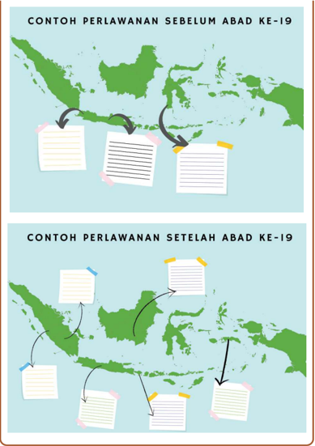

> **Deskripsi Visual:** Gambar ini adalah diagram yang menunjukkan perbandingan antara contoh perlawanan sebelum abad ke-19 dengan setelah abad ke-19 di Indonesia. Gambar ini dibagi menjadi dua bagian, masing-masing menunjukkan wilayah Indonesia pada masa itu.

Pertama, di bagian atas, ada tiga kotak berwarna hijau yang mewakili wilayah Indonesia sebelum abad ke-19. Setiap kotak memiliki tulisan di sampingnya, mungkin merujuk pada daerah-daerah atau wilayah tertentu yang menjadi fokus perlawanan tersebut.

Kedua, di bagian bawah, ada empat kotak berwarna hijau yang mewakili wilayah Indonesia setelah abad ke-19. Setiap kotak juga memiliki tulisan di sampingnya, mungkin merujuk pada perubahan atau peningkatan dalam wilayah tersebut.

Relasi antara kedua bagian ini adalah bahwa perubahan yang terjadi pada abad ke-19 telah mengubah struktur wilayah Indonesia. Ini menunjukkan perubahan signifikan dalam wilayah Indonesia setelah abad ke-19.

Teks, angka, atau label penting yang terlihat dalam gambar ini adalah nama-nama wilayah Indonesia yang mungkin merujuk pada daerah-daerah atau wilayah tertentu yang menjadi fokus perlawanan. Label-label ini membantu pembaca untuk memahami perubahan yang terjadi pada abad ke-19.

Informasi kunci yang dapat diambil pembaca adalah bahwa ada perubahan besar dalam wilayah Indonesia setelah abad ke-19, yang menunjukkan perubahan signifikan dalam struktur wilayah Indonesia.

 

---
## 📄 Halaman 48

Apabila kalian ditanyakan mengenai dampak yang ditimbulkan dari tindakan penjajahan, tentu akan lebih banyak uraian dampak negatif dibandingkan nilai positifnya.  Jamak diketahui orang masyarakat umum bahwa penjajahan selalu meninggalkan efek negatif, menyengsarakan rakyat  Pribumi  dan  selalu  mendatangkan  keuntungan  bagi  negara Induk. Namun tahukah kalian dalam kenyataan sejarah yang terjadi di Indonesia, pendudukan penjajahan bangsa asing ternyata memberikan dampak  dan  makna  tersendiri  bagi  bangsa  Indonesia  yang  dapat direfleksikan pada kehidupan saat ini. Dengan tidak bermaksud menafikan kenyataan bahwa masa penjajahan Belanda juga turut menyengsarakan rakyat, berikut ini adalah uraian mengenai dampak yang ditimbulkan oleh penjajahan Belanda di Indonesia.

### 1.  Dampak Ekonomi

---
**🖼️ Gambar/Diagram**

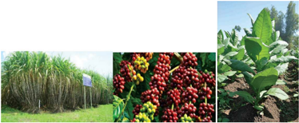

> **Deskripsi Visual:** Gambar ini adalah ilustrasi yang menunjukkan tiga jenis tanaman pertanian. Pada bagian kiri, terdapat tanaman gula (sugarcane) yang tumbuh dengan tinggi dan rimbun. Di tengah, ada pohon kopi yang memiliki buah-buahan merah yang tampak segar dan berwarna cerah. Pada bagian kanan, terlihat tanaman kubis yang tumbuh dengan daun-daun hijau lembut dan rapi. Ilustrasi ini menunjukkan variasi tanaman pertanian yang berbeda-beda namun semua memiliki ciri-ciri tumbuhan yang sama yaitu tumbuh di tanah dan membutuhkan air dan cahaya matahari untuk bertumbuh.

Sumber: www.pertanian.go.id.

Tentu kalian sudah banyak yang mengetahui tanaman apa saja di atas? Tahukah kalian bahwa ketiga tanaman tersebut sangat berpengaruh pada jalannya praktik kolonialisme di Indonesia?  Indonesia adalah negara  yang dianugerahi  kekayaan  alam  yang  melimpah  ruah.

 

---
## 📄 Halaman 49

Potensi ini sudah sejak lama dilirik oleh para pelawat yang datang ke Indonesia termasuk kaum penjajah. Belanda memanfaatkan potensi alam  tersebut  salah  satunya  dalam  bidang  industri  perkebunan. Kehadiran  Belanda  di  Nusantara  dimulai  dengan  pembentukan VOC  yang dalam perkembangannya berhasil mengembangkan usaha berupa perkebunan komoditas baru yang dianggap memiliki prospek yang bagus diantaranya kopi dan tebu. VOC melaksanakan sistem penanaman komoditi wajib berupa kopi di wilayah Priangan yang kemudian diperluas ke wilayah Ambon dan Pekalongan. Bupati setempat  menjadi  pemimpin  pelaksanaan  organisasi  penanaman wajib dengan mempekerjakan mandor-mandor pribumi untuk mengawasi  pekerja.  Sementara  itu,  pekerjaan  pembukaan  lahan, penanaman,  pemeliharaan,  panen  hingga  pengangkutan  kopi  ke gudang penyimpanan Belanda dilakukan oleh penduduk yang dipaksa untuk melakukan pekerjaan rodi.

Johannes van den Bosch adalah gubernur jenderal yang mencetuskan sistem cultuurstelsel atau tanam paksa pada 1930. Petani diwajibkan untuk menanam  komoditas  yang  sesuai permintaan pemerintah di tanah milik mereka sendiri di antaranya kopi, tembakau, tebu, teh, lada, kayu manis, dan kina. Di samping memiliki dampak yang sangat memberatkan rakyat Indonesia, sistem tanam paksa nyatanya memiliki dampak positif terhadap perkembangan aspek perkebunan di Indonesia antara lain:

- Beberapa komoditas ekspor diperkenalkan dan mengalami perluasan yakni kopi, teh, kayu manis, dan lada yang ditanam di lahan hak milik rakyat.
- Jumlah produksi dan ekspor tanaman perkebunan semakin meningkat.  Hal  ini  nyatanya  berhasil  membawa  Hindia  Belanda menjadi salah satu  negara produsen utama beberapa komoditas ekspor yang dikirim ke pasar Eropa. Di antaranya adalah kopi, tebu, tembakau, dan lada.
- Dengan masukkan pengetahuan dan alat perkebunan dari Barat, petani dapat menguasai teknologi budidaya tanaman baru.

 

---
## 📄 Halaman 50

- Setelah  sebelumnya  menanam  dan  menjual  hasil  perkebunan dengan  cara  konvensional,  dengan  sistem  ini  masyarakat  dapat mengenal sistem perkebunan yang lebih komersial.
Secara berangsur-angsur sistem cultuurstelsel dihapus. Atas desakan politik, laissez-faire yakni suatu paham yang berusaha meminimalkan peranan  pemerintah  terutama  dalam  bidang  ekonomi,  dalam  kurun waktu  1870-1900,  Belanda  menerapkan  sistem  perekonomian  yang disebut  sebagai  sistem  ekonomi  liberalisme.  Untuk  pertama  kalinya, dalam sejarah kolonial masa itu, pihak Belanda memberi peluang untuk modal  swasta  mengusahakan  kegiatan  ekonomi  di  Hindia  Belanda. Dengan banyaknya pengusaha yang menanamkan modalnya di sektor perkebunan  Hindia  Belanda  tentu  sangat  menguntungkan  pihak kolonial Belanda.

Tahun  1870,  pemerintah  kolonial  menerbitkan  Undang-undang Agraria  atau  disebut  Agrarische  Wet.  Undang-undang  ini  memberi kebijakan antara lain:

- Penduduk  non  bumiputera  tidak  diizinkan  memiliki  tanah  atas dasar hak milik mutlak (eigendom), kecuali tanah untuk pabrik.
- Rakyat yang memiliki hak tanah pribadi tidak dapat menjualbelikan tanahnya kepada non-pribumi.
- Kepemilikan mereka hanya atas dasar erfpacht, semacam hak guna usaha dengan masa berlakunya 75 tahun dan dapat diperpanjang jika memungkinkan.
Pembukaan Terusan Suez memiliki dampak yang sangat besar bagi Hindia Belanda. Jarak antara negara penghasil tanaman ekspor dengan pasarnya di Eropa Barat semakin pendek. Hal ini secara tidak langsung mendorong  perkembangan  pesat  pembukaan  lahan  perkebunan  di negara koloni antara tahun 1870-1885. Salah satu yang memengaruhi adalah kebijakan dari UU  Agraria yaitu hak erfpacht atau hak guna usaha untuk  membuka  perkebunan-perkebunan  besar  seperti  perkebunan teh,  gula,  tembakau  serta  komoditi  dagang  lainnya.  Meningkatnya permintaan terhadap bahan mentah dan bahan makanan dari Eropa

 

---
## 📄 Halaman 51

dan  Amerika  menyebabkan  semakin  banyaknya  aliran  modal  asing datang ke wilayah Hindia Belanda.

Undang-undang ini dikeluarkan agar penduduk bumiputera tidak kehilangan tanah miliknya. UU ini juga dimaksudkan untuk menjadikan perkebunan aspek terpenting dalam pandangan ekonomi di Indonesia masa kolonial yakni menjadi pendorong investasi asing besar-besaran di sektor perkebunan Hindia Belanda.

Pada saat itu, perkebunan menjadi alat untuk menghasilkan devisa bagi Hindia Belanda. Awalnya pulau Jawa dengan investasi asing yang bergerak di sektor perkebunan khususnya tebu merupakan perkebunan yang  besar  dan  terkenal  namun  di  masa  ini  mulai  meluas  beberapa wilayah lainnya. Persebarannya seperti berikut:

- Perkebunan tebu Jawa Timur dan Jawa Tengah.
- Perkebunan Tembakau di Surakarta, Yogyakarta, Jawa Timur dan daerah Deli Serdang di Sumatera Utara.
- Perkebunan teh di Jawa Barat.
- Perkebunan karet di Sumatera Utara, Jambi dan Palembang.
- Perkebunan kina di Jawa Barat.
- Perkebunan sawit di daerah Sumatera Utara.
Sementara  itu  wilayah  perkebunan  di  tanah  Deli  hingga  ke Simalungun  mengalami  perkembangan  yang  pesat,  bukan  hanya tembakau namun karet, kopi, teh dan kelapa sawit menjadi komoditas perkebunan  yang  besar  pula  karena  memiliki  prospek  yang  sangat menguntungkan di pasaran dunia.

Selama diberlakukannya sistem liberal, pembangunan sarana dan prasarana  mutlak  dilakukan  pemerintah  untuk  menunjang  produksi tanaman ekspor di Hindia Belanda. Waduk-waduk dan saluran irigasi adalah beberapa sarana yang mampu meningkatkan produktivitas dan hasil perkebunan.

 

---
## 📄 Halaman 52

Bukan  hanya  itu,  untuk  mengolah  hasil  perkebunan  tersebut, industrialisasi  pun  mulai  meluas  seperti  pada  industri  manufaktur. Mesin-mesin industri  didatangkan  dari  Eropa  dan  didirikan  pabrikpabrik untuk mengolah hasil perkebunan menjadi barang siap konsumsi. Pabrik gula berdiri dimana-mana ada juga pabrik teh, pabrik rokok, pabrik kina, pabrik karet hingga pabrik minyak.

Maraknya  industrialisasi  pada  masa  kolonial  terus  berkembang hingga  saat  ini.  Hal  ini  berimbas  pada  eksploitasi  alam  Indonesia. Sebagai generasi muda, kalian harus memiliki kepekaan dan kesadaran menjaga lingkungan sekitar.

### 2. Urbanisasi dan Pertumbuhan Kota

Dampak dari adanya kolonialisme di Indonesia yakni adanya urbanisasi. Urbanisasi sendiri adalah pergeseran populasi dari daerah pedesaan ke perkotaan. Perluasan daerah pertanian dan industri perkebunan diikuti oleh  melonjaknya  jumlah  penduduk  dan  menyebabkan  penyebaran daerah pemukiman yang lebih luas. Jalan kereta api dibangun untuk memperlancar sarana transportasi. Perbaikan jalan darat yang membentang  dari  Anyer  hingga  Panarukan  juga  dikerjakan  dengan serius.

Pada masa liberal ini, perusahaan baru yang didirikan dengan cepat mengalami perkembangan. Oleh karena itu perusahaan membutuhkan banyak personil dan tenaga ahli. Tidak jarang sampai mendatangkan tenaga dari luar negeri. Dengan demikian dapat dibayangkan bahwa jumlah orang-orang Eropa di Tanah Hindia meningkat dengan tajam. Banyak dari mereka yang menuntut kenyamanan layaknya di negeri asal. Melihat kondisi seperti ini, untuk menciptakan kondisi yang lebih baik dan nyaman, pemerintah Belanda membangun sekolah-sekolah, perumahan  dan  pelayanan  kesehatan  khusus.  Tak  pelak  kondisi tersebut  membuat  pemukiman-pemukiman  khusus  orang  Belanda atau Eropa tumbuh subur di Hindia Belanda.

Dampak lain dari tumbuhnya perdagangan dan perusahaan yakni menimbulkan urbanisasi  masyarakat  pribumi  dari  pedesaan  ke  kota

 

---
## 📄 Halaman 53

atau pusat perkebunan. Hal tersebut didorong oleh faktor berkurangnya lahan  pertanian  yang  mengakibatkan  peningkatan  kaum  miskin  di wilayah pedesaan. Seperti yang terjadi di Surabaya, pada akhir abad ke-19 yang berhasil menjadi kota industri dan perdagangan yang maju karena banyak perusahaan asing yang menanamkan modalnya di kota ini.  Surabaya  pun  menjadi  salah  satu  tujuan  orang-orang  dari  desa mengadu nasib dengan harapan akan mendapat pekerjaan yang layak.

Pertumbuhan industri dan perkebunan berhasil melahirkan kota-kota pesisiran,  seperti  Tuban,  Gresik,  Batavia,  Surabaya,  Semarang  dan Banten.  Disusul  pertumbuhan  kota-kota yang  terletak  di  pedalaman seperti Bandung, Malang hingga Sukabumi.

Kota-kota  di  Hindia  Belanda  tumbuh  dengan  cepat  sepanjang tahun 1900 hingga 1925. Memasuki awal abad ke-20, orang-orang Eropa, termasuk para pengusaha dan keluarga pegawai pemerintah kolonial,  semakin  banyak  berdatangan  dan  beradaptasi  dengan kondisi  tropis  di  Hindia  Belanda,  mereka  menciptakan  lingkungan ideal berdasarkan persepsi golongan Eropa. Menurut persepsi orang Eropa, lingkungan yang ideal diwujudkan dalam bentuk jalan yang beraspal,  adanya  lampu  penerangan  jalan,  perluasan  lahan  kota dan  dibentuknya  taman  kota,  tersedianya  lahan  pemakaman  dan pembangunan gedung perkantoran berkonsep Nieuw Indische Bouwstijl. Kota-kota di Pulau  Jawa  pembangunannya  semakin berkembang disertai kehidupan masyarakatnya yang dinamis menjelang  abad  ke-20.  Kota-kota  tersebut  diantaranya  Batavia, Bandung, Malang, dan Semarang.

### 3.  Dampak Sosial dan Budaya

Sebelum  memasuki  masa  politik  etis,  perkembangan  pendidikan, Ilmu  pengetahuan  dan  teknologi  memang  berdampak  kecil  bagi masyarakat pribumi, karena tidak semua lapisan masyarakat dapat mempelajarinya.  Adapun  beberapa  penyebab  dari  tertinggalnya Indonesia  dalam  lingkup  ilmu  pengetahuan  yakni:  Keterbatasan jumlah orang pribumi yang mendapat pendidikan, rakyat Indonesia

 

---
## 📄 Halaman 54

jarang  terlibat  langsung  dalam  pengembangan  IPTEK,  minimnya industrialisasi,  kurangnya  inovasi  yang  berarti  dalam  masyarakat Indonesia sendiri.

Meskipun demikian di sisi lain, terdapat beberapa aspek pengetahuan  dan  teknologi  yang  dipelopori  dan  diperkenalkan oleh  pemerintah kolonial Belanda. Masyarakat diperkenalkan pada persenjataan modern dari senjata ringan hingga senjata yang berat. Teknologi  lainnya yang  digunakan  dan  diperlihatkan  oleh  kolonial yakni kendaraan tempur dan transportasi lainnya. Ilmu pengetahuan tersebut  berasal  dari  negara  Eropa  yang  kemudian  pemerintah kolonial  menanamkan  IPTEK  melalui  pendidikan  baik  di  sekolahsekolah  maupun  dengan  cara  penggunaan  secara  langsung  kepada masyarakat di Hindia Belanda. Pasca kemerdekaan Indonesia, perkembangan  IPTEK  berkembang  pesat.  Hal  tersebut  didorong oleh terbukanya akses-akses untuk mendapatkan ilmu pengetahuan bagi masyarakat Indonesia. Mereka mempelajari sedikit demi sedikit di  sekolah  yang  sudah  dibuka  untuk  semua  kalangan  masyarakat. Jejak  IPTEK  di  Indonesia  yang  didapatkan  dari  masa  kolonial memudahkan  masyarakat  dalam  melakukan  aktivitas  sehari-hari sebut saja transportasi darat seperti kereta api yang telah dikenalkan pemerintah kolonial pada abad ke-19, transportasi air seperti kapal uap  juga  diperkenalkan  pada  abad-19.  Adapula  sistem  pertanian seperti limbah ternak untuk pupuk/kompos dan sistem irigasi. Dalam bidang  komunikasi  masyarakat  Indonesia  diperkenalkan  dengan radio, televisi dan telepon.

### 4.  Kesehatan dan Higienitas

Di samping teknologi, pemerintah kolonial pun mengeluarkan kebijakan dalam bidang kesehatan dan higienitas. Awalnya pelayanan kesehatan kolonial pada awal abad ke-20 memang sangat diskriminatif karena hanya sebagian kecil dari rakyat pribumi yang mendapatkan akses pelayanan kesehatan ini.

 

---
## 📄 Halaman 55

Ketika bergulirnya politik etis,  fokus  perhatian  pemerintah kolonial  Belanda  berubah  dengan  bagaimana  pelayanan  kesehatan kolonial dapat dinikmati oleh masyarakat secara meluas apalagi pada saat itu wabah penyakit mulai menyebar, sebut saja malaria, pes dan kolera.  Ilmu kedokteran terus dikembangkan dan tidak sedikit rakyat pribumi  yang  terlibat  langsung  di  dalamnya.  Pemerintah  kolonial mengeluarkan kebijakan  untuk  memfasilitasi  pendidikan  bagi  para tenaga  medis  melalui  pelatihan  bidan  atau  dukun  bayi,  pendirian School  tot  Opleiding  van  Indische  Artsen  (STOVIA)  atau  disebut sebagai 'Sekolah Dokter Jawa'  dan pendirian sekolah dokter lainnya. Kebijakan  itu  melahirkan  profesi  baru  di  kalangan  masyarakat pribumi dalam dunia kesehatan yakni melahirkan Dokter Jawa dan mantri  kesehatan.  Jika  Dokter  Jawa  dibentuk  melalui  pendidikan formal, mantri kesehatan dibentuk dengan pelatihan-pelatihan khusus sesuai dengan bidang penyakit atau aspek kesehatan lain yang menjadi tanggung jawabnya.

Sumber:https://digitalcollections.universiteitleiden.nl

---
**🖼️ Gambar/Diagram**

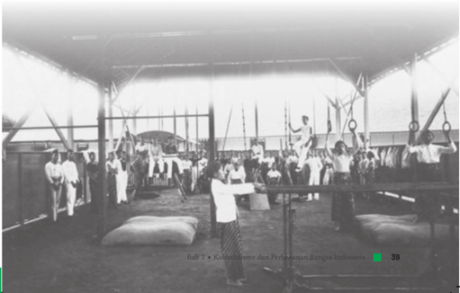

> **Deskripsi Visual:** !!!!!!!!!!!!!!!!!!!!!!!!!!!!!!!!!!!!!!!!!!!!!!!!!!!!!!!!!!!!!!!!!!!!!!!!!!!!!!!!!!!!!!!!!!!!!!!!!!!!!!!!!!!!!!!!!!!!!!!!!!!!!!!!!!!!!!!!!!!!!!!!!!!!!!!!!!!!!!!!!!!!!!!!!!!!!!!!!!!!!!!!!!!!!!!!!!!!!!!!!!!!!!!!!!!!!!!!!!!!!!!!!!!!!!!!!!!!!!!!!!!!!!!!!!!!!!!!!!!!!!!!!!!!!!!!!!!!!!!!!!!!!!!!!!!!!!!!!!!!!!!!!!!!!!!!!!!!!!!!!!!!!!!!!!!!!!!!!!!!!!!!!!!!!!!!!!!!!!!!!!!!!!!!!!!!!!!!!!!!!!!!!!!!!!!!!!!!!!!!!!!!!!!!!!!!!!!!!!!!!!!!!!!!!!!!!!!!!!!!!!!!!!!!!!!!!!!!!!!!!!!!!!!!!!!!!!!!!!!!!!!!!!!!!!!!!!!!!!!!!!!!!!!!!!!!

 

---
## 📄 Halaman 56

Diluar pembentukan  dokter  pribumi,  fasilitas  kesehatan  dan rumah  sakit  sudah  didirikan  sebelumnya.  Tahun  1641,  VOC  sudah mendirikan bangunan rumah sakit permanen di Batavia.  Pemerintah kolonial juga mulai membangun sarana dan prasarana pendukungnya, sejalan dengan perkembangan perusahaan perkebunan di masa sistem tanam paksa, sebut saja untuk memeriksa kesehatan tenaga kerja di Jawa maupun di luar pulau Jawa diadakan pembangunan rumah sakit perusahaan perkebunan, pertambangan, dan pelayaran.

Pada  masa  penjajahan  Belanda,  selain  rumah  sakit,  berdiri berbagai fasilitas kesehatan di berbagai daerah di Indonesia sebut saja  Laboratorium  penelitian  di  Batavia  yang  berdiri  tahun  1888 yang  berdiri  juga  di  Bandung,  Medan,  Makassar,  Surabaya  dan Yogyakarta. Penanggulangan wabah penyakit juga mendapat perhatian  khusus  pemerintah  Belanda  dengan  membentuk  suatu dinas  khusus  pemberantasan  penyakit  seperti  pada  masa  wabah penyakit  Pes.  Pemerintah  mendirikan  dinas  pemberantasan  pes ( Pest Bestrijding ).

### 5.  Mobilitas Sosial

Pada masa  kolonial Belanda, mobilitas sosial atau  perpindahan penduduk dari satu daerah ke daerah lainnya berjalan sangat cepat. Terdapat  beberapa  hal  yang  membuat  percepatan  mobilitas  sosial terjadi di Indonesia yakni:

- Pembangunan  sarana  dan  jaringan infrastruktur transportasi di  antaranya  jalan  kereta  api,  jalan  raya,  sarana  dan  prasarana pelabuhan. Hal ini bertujuan untuk menunjang kegiatan pengangkutan  barang  serta  tenaga  kerja  perkebunan  dari  satu tempat ke tempat yang lain.
- Dibukanya lahan pertanian dan perkebunan memunculkan kotakota baru sebagai dampak munculnya perkebunan seperti  Batavia, Banten, Bandung, Sukabumi, Tuban, Gresik, Semarang, Surabaya, hingga  Malang.

 

---
## 📄 Halaman 57

Perkembangan perkebunan di Indonesia menyebabkan munculnya tuntutan  untuk  pemenuhan  tenaga  kerja.  Pemerintah  kemudian mendatangkan para pekerja dari daerah ke pusat-pusat perkebunan. Mobilitas  sosial  terbesar  di  Indonesia  terjadi  pada  masa  kolonial Belanda  pada  masa  itu.  Adapula  beberapa  penyebab  lain  terjadinya mobilisasi rakyat pribumi masa kolonial, yakni:

- Lahan  pertanian  desa  beralih  fungsi  menjadi  perkebunan  besar. Petani  beralih  profesi  menjadi  buruh.  Hal  ini  mendorong  para pekerja  untuk  meninggalkan  desanya  menuju  ke  tempat-tempat industri baru yang lebih menjanjikan.
- Keinginan untuk terhindar dari berbagai kewajiban seperti kewajiban  tanam  paksa  atau  kerja  paksa.  Mereka  akan  mencari daerah-daerah yang tidak memberlakukan kewajiban tersebut.
- Kota-kota  baru  bermunculan  dan  hal  itu  mendukung  berbagai aktivitas masyarakat yang memungkinkan, seperti berbagai sarana prasarana tersedia di kota tersebut dan membuat masyarakat pergi ke kota untuk memenuhi kebutuhan mereka.
- Pendidikan  membuat  banyak  orang  Indonesia  masuk  menjadi golongan cendekiawan yang bekerja di kantor-kantor milik pemerintah di kota.
Namun sayangnya, mobilitas dari para pekerja Indonesia dibayarkan dengan  upah  yang    sangat  murah.  Agar  tidak  mudah  melepaskan pekerjaannya  para  pengusaha  perkebunan  mengikat  mereka  dengan Koeli  Ordonantie  atau  peraturan  tentang  kuli  kontrak  yang  disertai Poenale Sanctie atau pemberian hukuman bagi pekerja yang tidak mau bekerja dan meninggalkan perkebunan.

### 6.  Munculnya Sentimen Rasial

Munculnya  sentimen  rasial  pernah  terjadi  pada  masa  penjajahan kolonial  Belanda.  Bahkan  masalah  rasisme  diatur  melalui  kebijakan yang dikeluarkan oleh Pemerintah Belanda. Dengan sengaja Pemerintah Kolonial Belanda membeda-bedakan golongan berdasarkan ras. Kebijakan  itu  semakin  tegas  sejak  awal  abad  ke-19  yang  mana

 

---
## 📄 Halaman 58

pemerintahan Hindia-Belanda membagi penduduk menjadi tiga golongan, yakni:

- Golongan Eropa sebagai golongan pertama atau yang tertinggi.
- Golongan  Timur  Asing  yang  terdiri  dari  Cina,  Arab,  India  dan negara lainnya sebagai kelas kedua.
- Golongan Pribumi sebagai kelas ketiga tau golongan terendah.
Hal  tersebut  tentu  memunculkan  perasaan  sentimen  rasial  di kalangan pribumi. Pembagian golongan ini mendorong suatu gerakan untuk melawan kebijakan rasial tersebut. Pada 13 Juli 1919 orangorang Indo (campuran Eropa Pribumi) atas prakarsa Karel Zaalberg membentuk Indo Europe Verbond (IEV). IEV sendiri adalah golongan yang ingin menuntut hidup mereka dipermudah dan melawan sikap rasis dari orang-orang Belanda totok, karena orang-orang Indo pun bisa  dibilang  hanya  separuh  beruntung  mereka  terkadang  tidak diterima  di  kalangan  pribumi  dan  ditolak  oleh  kalangan  Belanda totok.  Namun  pada  kenyataannya  merekalah  yang  bersikap  rasis kepada  pribumi.  Mereka  menganggap  orang  pribumi  rendah  yang disebut sebagai inlander. Inlander sendiri adalah ungkapan kasar dan rendahan  bagi  orang-orang  pribumi  dan  disamakan  dengan  bodoh dan udik.

Berbeda dengan orang pribumi, sekalipun golongan Cina diperlakukan  secara  rasialis,  mereka  lebih  makmur  dibandingkan pribumi di bawah kekuasaan kolonial. Penyebabnya adalah sejak masa VOC hak-hak milik mereka dilindungi secara hukum Barat karena orang Cina dapat dimanfaatkan dalam posisi perekonomian seperti halnya menjadi  pedagang  perantara  dan  pengawas  antara  koloni  dengan pribumi. Jangan sampai kita melestarikan warisan dari sentimen rasial itu.

### 7.  Dampak Politik

Pada masa VOC diangkat pemimpinan tertinggi di negara koloni yaitu, Gubernur Jenderal. Kedudukannya hampir sama dengan Presiden dan

 

---
## 📄 Halaman 59

bahkan setingkat dengan raja-raja lokal di Indonesia. Kerajaan Belanda juga memberikan kekuasaan penuh kepada Gubernur Jenderal berupa Hak  Oktroi,  hak  istimewa  di  bidang  politik  yaitu  boleh  membuat perjanjian  dengan  raja,  mengangkat  dan  menurunkan  pimpinan setempat. Tidak jarang upaya tersebut ditempuh dengan cara politik adu domba.

Memasuki abad ke-20, Belanda menerapkan kebijakan politik etis atau politik 'balas  budi'  pada  1901  untuk memperbaiki pendidikan di Indonesia. Perkembangan inilah yang kemudian melahirkan golongan  cendekiawan.  Untuk  melawan  penjajah,  bangsa  Indonesia menyadari bahwa rakyat harus bersatu untuk perjuangan yang bersifat nasional.    Inilah  yang  dikenal  sebagai  masa  'Pergerakan  Nasional'. Faktor lain yang ikut memengaruhi lahirnya pergerakan nasional atau Nasionalisme  ini  yakni  Volksraad  atau  lembaga  perwakilan  rakyat Hindia Belanda yang berdiri pada 1918, telah mempertemukan elitelit  bumiputera dari berbagai daerah dan suku bangsa. Hubungan di antara mereka dalam lembaga tersebut terutama oleh adanya berbagai diskriminasi dari pihak Belanda, telah  menumbuhkan  perasaan senasib dan sepenanggungan di kalangan kaum bumiputera sekaligus kesadaran bahwa pada dasarnya sama.

Nasionalisme telah membentuk perjuangan-perjuangan di bawah pimpinan  cendekiawan  dan  melahirkan  organisasi-organisasi  di kalangan pribumi. Tidak selalu bergantung pada senjata, pembentukan organisasi  modern  digunakan  juga  untuk  perjuangan  kemerdekaan dengan  metode  perundingan.  Adapun  beberapa  organisasi  yang muncul  pada  masa  pergerakan  nasional  yakni  tahun  1908;  Boedi Oetomo, tahun 1911; Sarekat Dagang Islam dan tahun 1912; Indische Partij.

 

---
## 📄 Halaman 60

### Tugas

- Dampak dari praktik kolonialisme Belanda hampir terjadi di semua tempat  di  Indonesia.  Bisa  jadi  cerita  mengenai  hal  tersebut  juga terjadi  di  tempat  kalian.  Buat  diskusi  kelompok  untuk  mencari tahu  dampak  dari  kolonialisme  yang  terjadi  di  tempat  kalian. Oleh  karena  ini  adalah  periodisasi  masa  kolonial,  apabila  tidak menemukan  sumber  sejarah  primer,  kalian  dapat  menggunakan sumber sekunder untuk menulis narasi sejarahnya.
- Dalam menganalisis sumber sejarah yang dipakai, ingatlah untuk  selalu  bersikap  kritis  dan  menghindari  informasi  hoax dengan mengedepankan prinsip metode sejarah (Kritik Sumber). Tuliskan  informasi  yang  didapatkan  dalam  bentuk  infografis  dan presentasikan dalam kelas.

 

---
## 📄 Halaman 61

### Kesimpulan Visual

---
**🖼️ Gambar/Diagram**

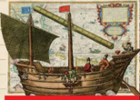

> **Deskripsi Visual:** Gambar ini adalah ilustrasi yang menunjukkan kapal perang atau kapal perang laut dari masa lalu. Kapal tersebut memiliki struktur yang kompleks dengan berbagai elemen penting:

1. **Apa yang Ditampilkan Secara Keseluruhan**: Gambar ini menampilkan kapal perang laut yang tampak besar dan detail, dengan berbagai bagian seperti mesin, timah, dan peralatan navigasi.

2. **Elemen-Elemen Utama dan Relasinya**: 
   - **Kapal Perang**: Kapal utama yang menjadi fokus utama.
   - **Mesin**: Terletak di bagian belakang kapal, digunakan untuk menggerakkan kapal.
   - **Timah**: Dapat dilihat di bagian tengah kapal, digunakan untuk navigasi dan komunikasi.
   - **Peralatan Navigasi**: Terdapat di bagian depan kapal, digunakan untuk menentukan arah dan lokasi.

3. **Teks, Angka, atau Label Penting yang Terlihat**: 
   - **Label**: Ada beberapa label yang mungkin menyebutkan nama-nama bagian kapal atau fungsi mereka, tetapi tidak dapat dibaca dalam gambar ini.
   - **Angka**: Tidak ada angka yang jelas dalam gambar ini.

4. **Informasi Kunci yang Bisa Diambil Pembaca**: 
   - Gambar ini memberikan gambaran umum tentang struktur dan komponen utama kapal perang laut dari masa lalu.
   - Ini dapat membantu pembaca memahami bagaimana kapal perang laut bekerja dan bagaimana mereka dirancang untuk tujuan pertempuran laut.

Dengan demikian, gambar ini merupakan ilustrasi yang sangat informatif, memberikan gambaran umum tentang kapal perang laut dari masa lalu dan bagaimana struktur dan komponennya bekerja.

Pelayaran dan perniagaan di Nusantara

### Jatuhnya Konstantinopel ke tangan Turki:

- Harga rempah di Eropa menjadi sangatmahal
- Orang Eropa mencari sumber rempah-rempah

---
**🖼️ Gambar/Diagram**

> **Deskripsi Visual:** Gambar ini adalah ilustrasi yang menampilkan tiga tokoh bersejarah yang berdiri di depan meja. Tokoh pertama adalah seorang pria dengan rambut pendek dan topi berwarna biru, mengenakan baju berwarna putih dengan lencana di leher. Tokoh kedua adalah seorang pria muda dengan rambut panjang dan gelar, mengenakan baju berwarna hitam dengan lencana di leher. Tokoh ketiga adalah seorang pria tua dengan rambut pendek dan topi berwarna merah, mengenakan baju berwarna merah dengan lencana di leher. Semua tokoh tersebut tampak berbicara atau berbicara dengan bahasa yang tidak jelas. Gambar ini menunjukkan hubungan antara tokoh-tokoh tersebut dan mungkin menunjukkan konsep atau ide yang dibahas dalam buku pelajaran tersebut.

### Perseteruan antarnegara Eropa:

- Portugisversus Spanyol
- Perang Napoleon
- Daendelsversus Raffles
Penguasaan Malaka dan serangan balikkepada Portugis

---
**📊 Tabel**

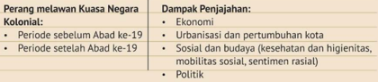

Tabel ini membahas perang melawan kuasa negara kolonial dan dampak penjajahan pada beberapa aspek kehidupan masyarakat. Topik utama adalah perubahan dalam masyarakat setelah era kolonial. Kolom pertama berisi periode sebelum dan setelah Abad ke-19, yang menunjukkan perbedaan dalam struktur sosial dan ekonomi. Kolom kedua berisi dampak penjajahan, yang mencakup aspek-aspek seperti urbanisasi, pertumbuhan kota, hingga perubahan dalam budaya, kesehatan, mobilitas sosial, sentimen rasial, dan politik. Data penting yang terlihat adalah bahwa perubahan signifikan terjadi setelah abad ke-19, dengan urbanisasi dan pertumbuhan kota menjadi faktor dominan.

 

---
## 📄 Halaman 62

### Pilihan Ganda

- Pada tahun 1511, Portugis berhasil menaklukkan Malaka. Meskipun  demikian,  Portugis  tidak  bisa  sepenuhnya  menguasai perdagangan di Asia karena beberapa hal berikut, kecuali ....
- Portugis tidak bisa memenuhi kebutuhannya sendiri di Malaka
- Portugis mengalami kesulitan finansial dan kekurangan tenaga kerja
- Tindakan  korupsi  yang  dilakukan  oleh  pejabat  Portugis  di Malaka
- Pedagang-pedagang Asia pindah ke pelabuhan lain yang aman
- Serangan dan perlawanan balik dari Kesultanan Malaka
- Kepulauan  Banda  merupakan  salah  satu  penghasil  pala  terbaik dunia.  Pada  tahun  1621,  VOC  di  bawah  J.P.  Coen  membantai penduduk Banda. Salah satu dampak dari peristiwa tersebut adalah ....
- Penduduk Banda trauma dan tidak lagi menanam pala
- Berkurangnya petani yang memahami tentang budidaya pala
- VOC berhasil memonopoli komoditas pala di dunia
- Timbulnya berbagai perlawanan balas dendam rakyat Banda
- Meningkatnya produksi pala di kepulauan Banda tahun 1622
- Pada awal abad ke-19 terjadi perlawanan rakyat Maluku terhadap Belanda. Perlawanan yang dipimpin oleh Pattimura ini dilatarbelakangi oleh ....
- Praktik pelayaran hongi yang memusnahkan tanaman pala
- Perebutan lahan perkebunan pala dengan Belanda
- Penerapan monopoli cengkeh dan kerja rodi oleh Belanda
- Pelarangan perdagangan bebas di wilayah Maluku
- Penderitaan rakyat Maluku karena kolonialisme Belanda

 

---
## 📄 Halaman 63

- Salah  satu  dampak  negatif  dari  kolonialisme  Belanda  adalah munculnya sentimen rasial. Hal ini disebabkan oleh ....
- Belanda hanya mengakui kehebatan orang Eropa
- Penduduk lokal iri dengan kekayaan bangsa Belanda
- Bangsa Timur Asing tidak mau berbaur dengan pribumi
- Belanda menerapkan berbagai aturan yang diskriminatif
- Belanda melarang interaksi antar ras yang berbeda
- Urbanisasi  dan  pertumbuhan  kota  terjadi  dengan  pesat  sejak penerapan  kebijakan  ekonomi  liberal  oleh  pemerintah  kolonial dikarenakan ....
- Sulitnya mencari pekerjaan yang layak di desa-desa
- Lahan-lahan pertanian di desa tidak lagi menjanjikan
- Lahan pertanian di desa yang semakin menyempit
- Munculnya berbagai perkebunan dan perusahaan baru
- Pemerintah kolonial membangun kota-kota baru

### Esai

- Interaksi bangsa-bangsa di nusatara dengan berbagai bangsa asing dalam jalur rempah telah menjadikan nusantara sebagai melting pot kebudayaan. Sebutkan 3 contoh adopsi dan akulturasi kebudayaan jalur rempah yang masih bisa ditemui di masa kini!
- Bagaimana keterkaitan antara jatuhnya Konstatinopel 1453 dengan perjumpaan bangsa Indonesia dengan bangsa Eropa dalam jalur rempah?
- Bagaimanakah dinamika hubungan saudagar dan penguasa lokal di nusantara sebelum datangnya bangsa Eropa?
- Bagaimanakah karakteristik perlawanan terhadap Belanda sebelum dan sesudah abad ke-19?
- Mengapa Belanda mendirikan STOVIA pada awal abad ke-20?

 

---
## 📄 Halaman 64

Pada bab ini kalian telah belajar tentang Kolonialisme dan Perlawanan bangsa  Indonesia.  Hikmah  atau  pelajaran  berharga  apa  yang  kalian dapatkan setelah mempelajari bab ini? Langkah nyata apa yang dapat kalian terapkan di masa kini dan masa  depan.

 

---
## 📄 Halaman 65

KEMENTERIAN PENDIDIKAN, KEBUDAYAAN, RISET, DAN TEKNOLOGI REPUBLIK INDONESIA, 2021

Sejarah untuk SMA/SMK Kelas XI Penulis: Martina Safitry, Indah Wahyu Puji Utami, dan Zein Ilyas ISBN: 978-602-244-859-4  (jil.1)

Thitavla

Clierjhnn rniiin

NTIEBLAD

Bab 2

zens vertrek.

Op-Donderdagden Ssten dezer

Pergerakan

DAS

Kebangsaan

Indonesia

VENDUTIE

 

---
## 📄 Halaman 66

### G ambaran Tema

Pada bab ini kalian akan mempelajari periodePergerakan Kebangsaan Indonesia melawan penjajahan. Untuk memberi gambaran mengenai latar peristiwa, maka bab ini akan dimulai dengan pemaparan tentang kebangkitan dunia timur yang diawali oleh peristiwa Perang Dunia I dan interkoneksi  bangsa-bangsa Asia  dalam  upaya  menghadapi  penjajah seperti komunitas Jawi di Makkah, Mahatma Gandhi di India, Sun Yat Sen di Cina, dan Jose Rizal di Filipina. Kelompok tersebut menyebarkan ide-ide nasionalisme dan kemajuan lewat pers dan sastra. Selanjutnya akan dibahas munculnya embrio kebangsaan dan nasionalisme lewat keberadaan organisasi politik kebangsaan, Kongres Sumpah Pemuda, dan  Kongres  Perempuan  Indonesia.  Bab  ini  ditutup  dengan  materi tentang masa akhir negara kolonial Belanda yang diawali oleh krisis ekonomi  global,  kejadian  wabah  penyakit  dan  kelaparan,  ditambah dengan  adanya  Perang  Dunia  II  yang  pada  akhirnya  menyebabkan Belanda tunduk kepada Jepang.

### Tujuan Pembelajaran

Setelah mempelajari bab ini, kalian diharapkan mampu menggunakan sumber-sumber  sejarah  untuk  mengevaluasi  secara  kritis  dinamika pergerakan  kebangsaan  Indonesia  pada  masa  penjajahan  Belanda. Tujuannya  agar dapat direfleksikan dalam  kehidupan  masa  kini masa depan, serta melaporkannya dalam bentuk tulisan atau lainnya.

dan

 

---
## 📄 Halaman 67

### M ateri

- Kebangkitan Bangsa Timur (Nasionalisme Asia) A.
- Munculnya Embrio Kebangsaan dan Nasionalisme Indonesia B.
- Akhir Masa Negara Kolonial Belanda C.

### Pertanyaan Kunci

- Bagaimana interkoneksi kebangkitan bangsa-bangsa Asia dengan situasi di Indonesia? 1.
- Bagaimana  munculnya  ide  kebangsaan  dan  nasionalisme  di Indonesia? 2.
- Bagaimana situasi dan kondisi Indonesia pada akhir masa negara kolonial Belanda? 3.

### Kata Kunci

Perang Dunia I, Perang Dunia II, Kongres Perempuan, Kongres Sumpah Pemuda, Nasionalisme dan Ide Kebangsaan, Krisis Ekonomi, Wabah Penyakit dan Kelaparan.

 

---
## 📄 Halaman 68

Apakah  kalian  pernah  mengetahui,  mengikuti  atau  bahkan  datang langsung  untuk  menyaksikan  ajang  olahraga  Asian  Games  tahun 2018?  Indonesia diberikan kesempatan  dan kepercayaan untuk menyelenggarakan ajang olahraga terbesar di benua Asia. Momentum ini memberikan sumbangan besar bagi terciptanya rasa solidaritas dan dapat  menanamkan  jiwa  nasionalisme  kebangsaan  sebagai  sesama bangsa  Asia.  Dari  penyelenggaraan  ini,  kita  dapat  belajar  dari  para atlet  yang  berjuang  dalam  Asian  Games  ke-18  ini.  Perjuangan  para atlet  tidak  kalah  dengan  perjuangan  para  pahlawan  karena  mampu mengangkat  nasionalisme  dan  perasaan  kebangsaan  dari  kekalahan dan keterpurukan oleh penjajah asing.

2018

TERIMAKASIH PAIHLANN PLAHRAGA

 

---
## 📄 Halaman 69

Secara etimologi, nasionalisme dapat didefinisikan menjadi dua pengertian.  Pertama,  nasionalisme  merupakan  paham  kebangsaan yang  berdasarkan  kejayaan  masa  lalu.  Kedua,  paham  kebangsaan yang  menolak  penjajahan  untuk  membentuk  negara  yang  bersatu dan  berdaulat.  Dalam  pengertian  yang  lebih  modern,  nasionalisme merupakan kesamaan kewarganegaraan dari semua etnis dan budaya di  dalam  suatu  bangsa.  Perspektif  nasionalisme  diperlukan  sebuah bangsa untuk menampilkan identitasnya. Konsekuensi dari pergeseran definisi  Nasionalisme  membawa  konsekuensi  bahwa  warga  negara tidak  lagi  bergantung  pada  identitas  nasional  yang  abstrak  namun lebih kepada identitas yang lebih konkret seperti pemerintahan yang bersih, negara modern, demokrasi dan perlindungan hak azazi manusia (Kusuma  Wardhani,  2004).  Kebangkitan  Nasional  sudah  menjadi fenomena yang terjadi seluruh dunia. Terdapat beberapa faktor yang melatarbelakangi munculnya kesadaran nasionalisme berbangsa yang kemudian menimbulkan semangat untuk mencapai harapan barunya seperti  kemerdekaan  lepas  dari  belenggu  penjajahan,  persamaan dan kemandirian untuk menentukan  kehidupan melalui negara nasionalnya. Dalam konteks sejarah di Asia, Kebangkitan Nasional dan nasionalisme bangsa Timur lahir karena adanya reaksi dari kolonialisme dan imperialisme pada abad ke-20.

### Interkoneksi Bangsa-Bangsa Asia

### a. Komunitas Jawi

Apakah  kalian  pernah  mendengar  Perhimpunan  Pelajar  Indonesia (PPI)  se-dunia?  Organisasi  ini  merupakan  wadah  berkumpul  bagi pelajar-pelajar  Indonesia  di  luar  negeri.  Penyelenggaraan  Konferensi Internasional  Pelajar  Indonesia  (KIPI)  di  kampus  Universitas  New South Wales (UNSW), Sydney, Australia, adalah cikal bakal  berdirinya perhimpunan ini.

 

---
## 📄 Halaman 70

Jauh sebelum PPI terbentuk, pelajar-pelajar Indonesia dan umat  Islam  dari  Asia  Tenggara  di  Makkah  telah  terhimpun  dalam perkumpulan yang disebut Komunitas Jawi. Komunitas ini memiliki kontribusi besar dalam menjadikan Makkah sebagai pusat kehidupan keagamaan Indonesia pada abad ke-19. Hal ini disebabkan karena pada waktu itu banyak ulama yang datang untuk mempelajari agama Islam ke Makkah kemudian bertemu dengan cendekiawan yang membawa ilmu  pengetahuan  dan  paham  baru.  Sekembalinya  ke  Nusantara, pengetahuan  baru  tersebut  kemudian  disampaikan  melalui  lembaga pendidikan pesantren, surau, dan dayah (Iswanto, 2013). Akhir abad-19 menandai penemuan bentuk Komunitas Jawi dengan puluhan halaqah yang tersebar di penjuru Makkah. Pembentukan komunitas ini diawali oleh para ulama Nusantara abad-17 seperti Nuruddin Al-Raniri, Abdul Rauf al-Singkili, dan Muhammad Yusuf Al-Makassari.

Pembentukan Komunitas Jawi terus berlanjut hingga kedatangan ulama Jawi di abad 18 di antaranya yaitu Syaikh Abd Al-Shamad AlPalimbani, Kemas Fakhr Al-Din, Syihab Al-Din, dan Muhammad Arsyad Al-Banjari. Dari nama-nama tersebut, yang paling berpengaruh adalah Syaikh Abd Al-Shamad Al-Palimbani kelahiran Palembang. Kitabnya yang  paling  terkenal  adalah  kitab Fadha'il  al-Jihad berisi  tentang kewajiban  umat  muslimin  untuk  menjalankan  perang  suci  melawan kaum  kafir  terutama  kaum  penjajah  kolonial  menurut  Al-Qur'an  dan Hadits.  Ulama  terkemuka  lainnya  yakni  Muhammad  Nawawi  AlBantani (lahir 1813, wafat 1897). Ia merupakan salah satu ulama yang berperan penting dalam proses transmisi sejarah Indonesia masa Islam ke masa Hindia Belanda. Selain itu Nawawi Al-Bantani pernah menjadi 'Sayyid  Ulama  al-Hijaz',  salah  satu  posisi  intelektual  terkemuka  di Timur  Tengah  untuk  tingkat  internasional. Karya-karyanya  juga memiliki  pengaruh  sangat  besar  di  Nusantara.  Karyanya  menjadi materi utama dalam pembelajaran di pesantren. Maka tidak salah jika ia diakui sebagai arsitek pesantren Nusantara. Karyanya menjadi sumber intelektual dari perkembangan diskursus Islam di Indonesia abad ke-19. Nama besar lain adalah Syeh Ahmad Khatib al-Minangkabawi. Ahmad Khatib memiliki hubungan yang erat dengan orang-orang Indonesia

 

---
## 📄 Halaman 71

yang menunaikan ibadah haji dan belajar agama Islam di Tanah Suci. Melalui murid-murid ini terjalin hubungan umat Islam di perantauan dengan  umat  Islam  di  Indonesia.  Selain  mengajarkan  fikih  mazhab Syafi'i, Syaikh Ahmad Khatib memberikan kesempatan kepada muridmuridnya untuk membaca tulisan-tulisan terbitan majalah al-Urwah alWusqa dan tafsir al-Manar karya pembaharu Muhammad Abduh dari Mesir (Noer 1980). Penting diketahui bahwa ketika itu dua publikasi tersebut menjadi sarana utama sosialisasi gagasan pembaharuan Islam di dunia Muslim (Abdullah, 2013).

### b.  Mahatma Gandhi

Pada tahun 2019 silam, Gubernur Jakarta Anies Baswedan bekerja sama dengan duta  besar  India,  Pradeep  Kumar  Rawat, memperingati 150 tahun kelahiran Mahatma Gandhi (Dwi Eka, 2019). Mengapa penting untuk memperingati sosok Mahatma Gandhi di Indonesia?

India dan Indonesia adalah negara yang sama-sama memiliki kekayaan sumber daya alam dan catatan sejarah yang hampir mirip terkait  penjajahan  Bangsa  Eropa.  Inggris sejak lama menjadi penguasa India. Mereka awalnya  hanya  mencari  rempah-rempah, tapi  kemudian  berubah  menjadi  penjajah.

Melihat  kejadian  tersebut,  muncul  tokoh  nasionalis  India  sekaligus politikus dari India yang bernama Mahatma Gandhi untuk melakukan perlawanan terhadap Inggris.

Mohandas  Karamchand  Gandhi  lahir  pada  2  Oktober  1869. Keluarganya  termasuk  golongan  elit  yang  berasal  dari  kasta  Bania, penganut  agama  Hindu  yang  taat.  Keluarganya  menanamkan  etika Hindu yang kuat dengan penekanan pada pola hidup vegetarianisme, toleransi  beragama,  gaya  hidup  sederhana,  dan  penolakan  terhadap segala tindak kekerasan (Poerbasari, 2007). Dia dikenal sebagai sosok

 

---
## 📄 Halaman 72

yang sangat  mengutamakan nilai kemanusiaan dan tanpa kekerasan untuk melawan penjajahan Inggris. Gandhi mempunyai  senjata perlawanan yang khas yang disebut sebagai Satyagraha . Satya artinya kebenaran dan Agraha adalah kekuatan. Dengan demikian Satyagraha berarti  kekuatan  jiwa.  Dia  mendorong  rakyat  India  agar  melawan Inggris dengan kekuatan jiwa dan tanpa kekerasan. Meskipun pernah menempuh pendidikan di luar negeri, dia bersikukuh tidak mau bekerja sama dengan pihak asing demi terbebas dari penjajahan Inggris dan mendapatkan kemerdekaan India yang seutuhnya.

Realisasi  dari  gerakan Satyagraha secara  besar-besaran  pernah terjadi pada tahun 1906 dan 1908. Ribuan orang India dengan sengaja melintasi Transvaal atau perbatasan tanpa sertifikat dan juga berdagang tanpa izin pada tahun 1908. Sebagai pernyataan damai tentang hakhak  mereka  yang  telah  dihapus,  mereka  dengan  sengaja  melanggar peraturan  yang  ditetapkan  oleh  pemerintah  Inggris. Akibat  gerakan tersebut, Gandhi ditahan.

Selain menjalankan ajaran Satyagraha , ia mengajak melaksanakan Swadeshi yaitu rakyat memakai  produk asli dalam negeri dan memanfaatkan  kekayaan  alam  sendiri  agar  tidak  bergantung  pada Inggris. Terbukti hal tersebut membuat kas negara Inggris menurun. Perjuangan merebut kemerdekaan yang dilakukan Mahatma Gandhi serta rakyat India membuat kolonialisme Inggris lambat laun mengalami penurunan terutama pada bidang ekonomi. Tujuan Mahatma Gandhi menerapkan  ajaran-ajaran  tersebut  semata-mata  agar  Inggris  segera meninggalkan negaranya India.

Berefleksi dari apa yang dilakukan Mahatma Gandhi, merayakan ulang  tahun  Gandhi  di  Indonesia  dapat  membuat  kita  mengambil pelajaran dari seorang tokoh yang melawan kekerasan dan memperjuangkan  kemerdekaan  negaranya  dari  penjajahan.  Sosok Gandhi mampu menginspirasi berbagai negara di Asia untuk lepas dari jerat penjajah.

 

---
## 📄 Halaman 73

### c. Sun Yat Sen

Sun Yat Sen lahir pada 12 November 1866 di  Xiangshan,  Guangdong,  Cina  Selatan. Dia lahir dari keluarga petani miskin. Pendidikannya ditempuh di sekolah misionaris Inggris yang berlokasi di Hawaii selama tiga tahun, kemudian dilanjutkan di sekolah Amerika, Oahu College. Pada tahun 1886, ia mendaftar sebagai mahasiswa sekolah  kedokteran  dan  lulus  pada  tahun 1892. Meskipun tidak mendapatkan pendidikan  politik,  Sun  Yat  Sen  sangat ambisius  membuat  perubahan  bagi  Cina dengan  menggulingkan  Dinasti  Qing  yang sangat konservatif.

Sun Yat Sen mendirikan sebuah organisasi bernama Revive Cina Society (Xingzhonghui) yang menjadi cikal bakal kelompok revolusioner rahasia yang kemudian dipimpin oleh Sun. Dia juga mendirikan Liga Persatuan  yang  kemudian  menjadi  Partai  Nasional  Cina.  Selama bertahun-tahun  Sun  Yat  Sen  secara  rutin  melakukan  propaganda melalui  jurnal  rakyat,  Minbao.  Dia  menuliskan  idenya  tentang  Tiga Prinsip Rakyat (Nasionalisme, Demokrasi, dan Penghidupan Rakyat). Teori Revolusinya yang mengidamkan berdirinya suatu negara dengan bentuk Republik Demokratis dikenal dengan istilah 'San Min Chu I'.

Setelah  melewati  masa  pengembaraan  selama  bertahun-tahun dengan  tetap  melakukan  perjuangan  menggulingkan  Dinasti  Qing  dari luar negeri,  Sun Yat Sen kembali ke Tiongkok dan melakukan gerakan revolusi yang membawanya menjadi pejabat presiden pertama Republik Tiongkok  pada  tahun  1911-1912  dan  1923-1925.  Meskipun  ia meninggal  pada  saat  cita-citanya  untuk  mensejahterakan  penduduk Cina belum tercapai, ia dianggap sangat berjasa dalam  menyatukan wilayah Cina.

 

---
## 📄 Halaman 74

### d. Jose Rizal

Jose  Rizal  (1861-1896)  adalah  seorang  reformis  Filipina  dan  sangat berbakat sebagai seorang sastrawan dan novelis. Masa kanak-kanaknya penuh kebahagiaan, namun ada satu hal yang membuat masa kecilnya menjadi  suram,  yakni  menjalani  kehidupan  sebagai  bangsa  terjajah. Bangsa Spanyol telah menguasai negaranya sejak 1521. Hampir setiap hari  dia  menyaksikan  kerabatnya  mengalami  penindasan.  Besar  di keluarga  yang  berpikiran  maju,  Jose  memiliki  pemikiran  Nasionalis dan ia sudah memiliki keinginan untuk berjuang sejak kecil.

Jose  Rizal  adalah  pelopor  pergerakan nasionalisme Filipina. Melalui tulisan, dia  menyadarkan  rakyat  bahwa  mereka diperlakukan tidak layak oleh bangsa asing  di  negara  sendiri.  Karya-karyanya menjadi serangan tertulis terhadap Spanyol hingga ia dibenci oleh para penjajah. Semangat  kebangsaan  dan  nasionalisme Jose Rizal semakin menggebu-gebu setelah melakukan  pengembaraan  intelektual  ke Eropa (Samad, 2011).

Pada 3 Juli 1892, Jose Rizal membentuk Liga Filipina di Tondo. Namun liga tersebut

tidak  berusia  panjang  karena  segera  dibubarkan  oleh  pemerintah Spanyol. Sementara itu pada 7 Juli 1892, karena tuduhan penghasutan, ia  ditawan  di  Fort  Santiago  dan    ia  diasingkan  di  Dapitan  selama  3 tahun. Ia sempat pergi ke Kuba namun dikembalikan lagi ke Filipina pada tahun 1896. Di sana ia dihadapkan berbagai tuduhan hingga harus dihukum mati pada 30 Desember 1896 di Lapangan Bagumbayan.

Kendati  Jose  Rizal  meninggal  sebelum  cita-citanya  menuntut reformasi kebijakan tercapai, semangat perjuangannya menumbuhkan sikap  nasionalisme  rakyat  Filipina  yang  memunculkan  pergerakanpergerakan yang lebih radikal dari yang dia lakukan, seperti Perlawanan Andreas Bonifacio dan Perlawanan Emilio Aquinaldo.

 

---
## 📄 Halaman 75

### Imajinasi Nasionalisme dari Negeri Penjajah

Pembahasan tumbuhnya kesadaran nasionalisme dan wacana antikolonialisme di negeri koloni seringkali disamakan dengan dinamika pergerakan dan pemikiran di negara jajahan tersebut. Namun jika  ditelisik  lebih  jauh,  sebuah  ide  tentang  munculnya  kesadaran nasional dan imajinasi tentang negara bangsa tidak hanya muncul dari individu,  komunitas,  atau  masyarakat  yang  berada  di  tanah  airnya. Tidak jarang pemikiran tersebut justru muncul dari seseorang yang telah meninggalkan tanah airnya. Dari mobilisasi dan pertemuannya dengan bangsa-bangsa  lain  lah  ditemukan  arti  nasion  dan  rasa  kebangsaan. Pengalaman melintasi negara satu ke negara lain, perasaan jauh dari tanah air, dan merasakan hidup dalam lingkungan diaspora baru tidak jarang  menumbuhkan  perasaan  yang  berbeda  terhadap  tanah  air. Akan menjadi menarik apabila kita melihat bagaimana 'nasionalismetransnasional' atau orang-orang yang memiliki pemikiran nasionalisme dan antikolonialisme yang berada jauh dari tanah air mereka. Beragam perspektif, ideologi dan pengaruh yang didapat dari hasil perjalanan, berkeliling maupun tinggal di tempat asing. Seperti yang dialami oleh tokoh-tokoh  nasionalisme  yang  sudah  dibahas  sebelumnya.  Bacaan lebih lengkap terkait dengan hal ini kalian dapat membaca buku dan jurnal online seperti yang tertulis di bawah ini.

Harry Poeze. 2017. Di Negeri Penjajah; Orang Indonesia di Negeri Belanda 1600-1950 . Jakarta: KPG

Wildan Sena Utama. 2014 'Patriot Ekspatriat: Imajinasi dan Aksi Anti-Kolonialisme dan Nasionalisme Asia Tenggara.' Jurnal Kajian Wilayah Vol. 5 No.2 2014 hal. 166-183

DOI: https://doi.org/10.14203/jkw.v5i2.261.

 

---
## 📄 Halaman 76

### B. Munculnya Embrio Kebangsaan dan Nasionalisme Indonesia

Fenomena pergerakan kebangsaan dan nasionalisme yang berkembang sejak awal abad ke-20 bukan sesuatu yang muncul begitu saja. Embrionya sudah  terbentuk  di  masa  lalu.  Terlepas  dari  berbagai  konflik  yang  meliputi pasang  surutnya  kejayaan  kerajaan  Sriwijaya  dan  Majapahit,  sejarah pernah mencatat  bahwa ada beberapa kerajaan di Indonesia yang dapat menyatukan hampir seluruh wilayah Indonesia saat ini. Hal ini penting bagi terbentuknya semangat pergerakan nasional (Iskandar, 2007).

Selain  kebanggaan  pada  kejayaan  masa  lalu,  terdapat  faktor  lain yang ikut memengaruhi  munculnya  kesadaran  kebangsaan atau nasionalisme, yakni:

- -Agama Islam sebagai agama mayoritas. Islam bukan sekadar ikatan religi  biasa  melainkan  sudah  lama  menjadi  simbol  perlawanan terhadap kekuasaan asing khususnya bangsa Barat.
- -Penjajahan/kolonialisme oleh Belanda.
- -Pendidikan  Barat  telah  melahirkan elit politik baru yang memiliki kesadaran bahwa mereka sebenarnya dijajah oleh Belanda.
- -Volksraad , lembaga perwakilan rakyat Hindia Belanda yang didirikan pada  tahun  1918,  mempertemukan elit-elit    bumiputera  dari  berbagai daerah  dan  suku  bangsa yang  telah menumbuhkan perasaan senasib dan sepenanggungan  di  kalangan  kaum bumiputera sekaligus kesadaran bahwa pada dasarnya mereka sama.
Selain faktor di atas, tahap selanjutnya yakni terbentuk organisasiorganisasi kebangsaan sebagai penanda bangkitnya kesadaran bangsa Indonesia.

 

---
## 📄 Halaman 77

### 1. Organisasi Pergerakan Nasional

Sejarah Indonesia memiliki kisah dan perjalanan panjangnya sendiri. Untuk menjadi bangsa yang besar seperti sekarang, bangsa ini dibangun oleh orang-orang hebat yang berjuang demi kemerdekaan Indonesia. Awal abad ke-20 menjadi titik awal dari kemunculan organisasi politik di  Indonesia. Baik yang bersifat kepemudaan, organisasi keagamaan, organisasi  kedaerahan,  organisasi  gerakan  profesi,  organisasi  sosial, maupun organisasi politik. Posisi organisasi politik kebangsaan adalah garda  terdepan  dari  organisasi  yang  memperjuangkan  kepentingan kemerdekaan bangsa Indonesia. Banyak organisasi politik kebangsaan yang berdiri sejak politik etis diberlakukan di Hindia Belanda, antara lain  Boedi  Oetomo,  Sarekat  Islam,  Indische  Partij,  Muhammadiyah, Nahdlatul Ulama, Gerakan Pemuda, Partai Komunis Indonesia, Taman Siswa, Partai Nasional Indonesia, Istri Sedar, Gerakan wanita, Perhimpunan Indonesia, Parindra, MIAI (Majelis Islam A'la Indonesia, dan GAPI (Gabungan Partai Indonesia) dan lain-lain. Dari banyaknya organisasi tersebut, penting untuk mengulas beberapa organisasi masa dalam pergerakan nasional Indonesia sebagai berikut:

### a. Boedi Oetomo (BO)

Organisasi yang lahir pada 20 Mei 1908 ini  didirikan oleh para pelajar STOVIA di bawah pimpinan R. Soetomo. Organisasi yang berawal dari gagasan dr. Wahidin Soedirohusodo ini menjadi tonggak awal kebangkitan Indonesia. Wahidin mengunjungi sekolah lamanya STOVIA pada tahun 1907 dan di depan para mahasiswa sekolah kedokteran tersebut ia menyerukan agar mereka membentuk organisasi untuk mengangkat derajat bangsa. Soetomo tertarik dengan ide tersebut yang kemudian bersama sejumlah pemuda lain mendirikan Boedi Oetomo di Batavia pada 20 Mei 1908. BO menjadi organisasi pemuda pribumi pertama yang berjalan baik di Indonesia. Salah satu program utama organisasi ini  adalah  kemajuan  yang  harmonis  bagi  Nusa  Jawa  dan  Madura. Organisasi  ini  berakhir  pada  tahun  1935  ketika  bergabung  dengan Parindra. BO menjadi tonggak baru kebangkitan Indonesia dan hari

 

---
## 📄 Halaman 78

lahirnya  ditetapkan  sebagai  Hari  Kebangkitan  Nasional  Indonesia yang diperingati setahun sekali.

### b. Sarekat Islam

Rekso Roemekso merupakan organisasi didirikan oleh Haji Samanhudi di  Solo  pada  16  Oktober  1905.  Organisasi  ini  kemudian  berganti nama  menjadi  Sarekat  Dagang  Islam  (SDI).  Tujuan  didirikannya SDI  adalah  untuk  menggalang  kerja  sama  antara  pedagang  Islam demi memajukan kesejahteraan pedagang Islam bumi putera. Untuk mengembangkan organisasinya, Samanhudi menggandeng Haji Omar Said Tjokroaminoto yang kemudian diubah namanya menjadi Sarekat  Islam  (SI)  dengan  alasan  agar  organisasi  ini  tidak  terfokus pada  pedagang.  SI bercita-cita  untuk  menentang  ketidakadilan terhadap  rakyat  bumiputera  dengan  ciri  kerohanian  yang  tetap demokratis dan militan. Oleh karena itu, SI disebut sebagai 'gerakan nasionalis-demokratis-ekonomis'.  Di  bawah  kepemimpinan  H.O.S Tjokroaminoto, SI memiliki banyak cabang dan anggota yang sangat banyak  hingga  membuat  pemerintah  kolonial  Belanda  khawatir dan terancam atas perkembangan SI sehingga membuat kebijakankebijakan yang membatasi kegiatan-kegiatannya.

Sumber: collectie Tropenmuseum  COLLECTIE_TROPENMUSEUM_Groepsportret_tijdens_een_ledenvergadering_ van_de_Sarekat_Islam_(SI)_in_Kaliwoengoe_TMnr_60009089

 

---
## 📄 Halaman 79

### c. Indische Partij (IP)

Indische  Partij  adalah  wadah  perjuangan  pertama  yang  berwujud partai politik berideologi nasionalisme yang berdiri pada 25 Desember 1912 di Bandung. Walaupun namanya menggunakan bahasa Belanda, organisasi ini adalah partai yang keanggotaannya terbuka untuk semua orang  di  Hindia  Belanda  dengan  program  perjuangan  mengusung nasionalisme Hindia.

Tokoh  utama  IP  adalah  Douwes  Dekker  (Danudirja  Setiabudi), Tjipto Mangunkusumo, dan Suwardi Suryaningrat. Douwes Dekker seorang Indo, adalah penentang kebijakan diskriminasi rasial dalam masyarakat kolonial. Kritik terhadap kehidupan kolonial telah dilayangkan  sejak  awal  abad  ke-20  oleh  Tjipto  Mangunkusumo. Menurutnya  masyarakat  Jawa  sulit  mengalami  kemajuan  karena dikekang  oleh  feodalisme,  kehidupan  masyarakat  Hindia  Belanda mengalami  eksploitasi  yang  berlebihan,  dan  kemiskinan  menjadi realita  sehari-hari. Awalnya  ia  adalah  tokoh  Boedi  Oetomo,  namun ia  memilih  keluar  karena  menganggap  BO  semakin  konservatif. Kemudian ia bertemu Douwes Dekker yang sepemikiran hingga bersama-sama mendirikan Indische Partij bersama Suwardi Suryaningrat.

Ideologi IP adalah nasionalisme dengan tujuan mencapai kemerdekaan tanah air Hindia dari pemerintah kolonial. Bagi mereka tanah  Hindia  adalah  rumah  bagi  semua  kelompok  yang  ada  seperti bumiputera,  Indo,  Tionghoa,  dan  sebagainya.  Nama  IP  semakin dikenal  ketika  terlibat  dalam  Komite  Bumiputera  yang  menentang diadakannya perayaan 100 tahun kemerdekaan Belanda atas Prancis pada  tahun  1913.  Tujuan  dibentuknya  Komite  Bumiputera  adalah memperjuangkan kebebasan berpendapat serta adanya majelis permusyawaratan yang menyuarakan kepentingan rakyat Hindia.

### 2. Perang Dunia I dan Pengaruhnya di Indonesia

Perang Dunia I (PD I) yang berlangsung pada 1914-1918 menandai konflik  besar  pertama  berskala  internasional  di  abad  20.  PD  I  dimulai dari pembunuhan terhadap pewaris mahkota Austria-Hungaria, yakni

 

---
## 📄 Halaman 80

Archduke Franz Ferdinand beserta istrinya yang bernama Archduchess Sophie pada 28 Juni 1914 di Sarajevo oleh kelompok teroris Serbia. Akibatnya berlanjut pada meletusnya perang di beberapa front selama empat tahun berikutnya.

Kejadian  tersebut  memunculkan  reaksi  perlawanan  dari AustriaHungaria yang dibantu Jerman untuk mengumumkan perang terhadap Serbia yang dibantu Rusia pada 28 Juli 1914. Kemenangan awalnya diraih oleh Jerman, Austria, dan Hungaria dari Blok Sentral. Namun Blok Sekutu yang terdiri atas Rusia, Prancis dan Britania Raya terus menyerang  Blok  Sentral.  Hingga  pada  tahun  1917  Amerika  Serikat memihak Blok Sekutu setelah Italia bergabung lebih dahulu.

Sumber: National Archief Nedherland Nomor file: 158-

PD  I  berakhir  setelah  keluar  Perjanjian  Versailles  pada  1918. Blok Sentral akhirnya mengalami kekalahan dan ini menjadi pemicu Revolusi Rusia dan dasar kebangkitan Nazi selanjutnya. Perang Dunia

 

---
## 📄 Halaman 81

I  menimbulkan  dampak  yang  cukup  signifikan  bukan  hanya  untuk negara-negara Eropa namun juga untuk bangsa Asia.

Ketika  PD  I  tengah  berlangsung,  Indonesia  sedang  mengalami masa  pergerakan  nasional  melawan  bangsa  kolonial.  Dampak  yang diakibatkan oleh peristiwa besar tersebut antara lain adalah pertama , kepopuleran paham demokrasi dan nasionalisme yang meruntuhkan eksistensi  sistem  aristokrasi  kerajaan.  Paham  nasionalisme  tersebut dibawa dalam arah pergerakan Indonesia. Seperti terbentuknya organisasi yang bersifat kebangsaan Boedi Oetomo dan Sarekat Islam. Kedua ,  krisis ekonomi akibat perang yang terjadi di Eropa kemudian menghambat kegiatan ekspor dan impor.

### 3.  Kongres Sumpah  Pemuda  dan  Kongres  Perempuan

### a. Kongres Sumpah Pemuda

Tahukah kalian kapan bahasa Indonesia diupayakan untuk digunakan dalam sebuah pertemuan resmi di Indonesia? Apakah kalian berpikir jawabannya  adalah  pada  saat  Kongres  Sumpah  Pemuda  pada  1928? Jika jawabannya ya, berarti jawaban kalian kurang tepat karena inisiasi untuk menggunakan bahasa Indonesia sebagai bahasa persatuan datang pada  kegiatan  Kongres  Pemuda  I  pada  30  April  sampai  2  Mei  1926 yang dihadiri berbagai organisasi pemuda seperti Tri Koro Darmo, Jong Sumatra, Jong Java, Jong Minahasa, Jong Islameten Bond, Jong Celebes, Perkumpulan Pemuda Betawi. Catatan autobiografi M. Tabrani (ketua penyelenggara kongres pemuda pertama) menceritakan perdebatannya dengan Muh. Yamin dalam penggunaan istilah untuk bahasa persatuan apakah bahasa Melayu atau bahasa Indonesia. Akhirnya disepakati istilah untuk bahasa persatuan adalah bahasa Indonesia pada Kongres Pemuda berikutnya. Butuh proses sosialisasi dan konsolidasi untuk menyepakati penggunaan bahasa persatuan pada Kongres Pemuda 2.

Pada saat penyelenggaraan, rapat kongres diadakan di tiga tempat berbeda.  Rapat  pertama  kongres  dilakukan  di  Gedung Katholikee Jongelingen  Bond (Gedung  Pemuda  Katholik),  Lapangan  Banteng, Batavia.  Soegondo  membuka  rapat  dengan  menyampaikan  harapan

 

---
## 📄 Halaman 82

agar kongres tersebut dapat memperkuat semangat persatuan. Pidato selanjutnya disampaikan oleh Muhammad Yamin yang menyebutkan bahwa di  antara  hukum  penting yang  dapat  memperkuat  persatuan Indonesia  adalah  hukum,  sejarah,  pendidikan,  hukum  adat,  dan kemauan untuk bersatu.

Rapat kedua diadakan pada 28 Oktober 1928 bertempat di Gedung Oost-Java Bioscoop . Rapat ini membahas  persoalan pendidikan. Poernomowoelan dan Sarmidi Mangoensarkoro berpendapat  bahwa harus  ada  keseimbangan  antara  pendidikan  anak  di  sekolah  dan  di rumah,juga pentingnya anak harus dididik secara demokratis. Rapat ketiga  diselenggarakan  di  Gedung Indonesische  Clubhuis  Kramat , Batavia. Dalam sesi ini Soenario menjelaskan pentingnya nasionalisme dan  demokrasi  selain  gerakan  kepanduan.  Sementara  itu  Ramelan menyampaikan tentang gerakan kepanduan  yang  tidak  dapat  dipisahkan dari pergerakan nasional. Pada hari terakhir, sebelum kongres ditutup, Wage Rudolf Supratman memperdengarkan instrumen lagu 'Indonesia Raya' kepada peserta kongres.

### b. Kongres Perempuan

Perjuangan mencapai kemerdekaan bukan hanya dilakukan oleh kaum laki-laki, namun juga oleh kaum perempuan Indonesia.  Kegiatan bersama organisasi perempuan yang paling menonjol adalah Kongres Perempuan menjadi permulaan bersatunya organisasi perempuan di tanah air.

Sumber: Panitia pembuatan buku. 2009. 80 Tahun Kowani: Derap Langkah Pergerakan Organisasi Perempuan Indonesia. Jakarta: Penerbit Sinar Harapan

 

---
## 📄 Halaman 83

Pada  22-25  Desember  1928  bertempat  di  Gedung  Ndalem Joyodipuran,  Yogyakarta,  Kongres  Perempuan  pertama  diadakan. Tercatat  peserta  kongres  berjumlah  600  orang  dari  30  organisasi perempuan yang menghadiri kongres tersebut. Keberhasilan kongres menghadirkan peserta yang tidak dapat dikatakan sedikit adalah berkat kegigihan  panitia  penyelenggara  yang  terdiri  atas  organisasi  Wanita Utomo, Putri Indonesia,  Wanita Katolik,  Perempuan-perempuan Sarekat Islam, Perempuan-perempuan Jong Java, Aisyiyah, dan Wanita Taman Siswa.

Penyelenggaraan  Kongres  Perempuan  tidak  lepas  dari  peristiwa Kongres Sumpah  Pemuda  yang diselenggarakan sebelumnya di Jakarta.  Perhimpunan  organisasi  perempuan  ini  menekankan  pada pentingnya persatuan untuk mencegah  perpecahan  di kalangan organisasi perempuan dengan alasan apapun termasuk urusan agama. Kongres  berjalan  agak  alot  karena  masih  ada  perbedaan  pendapat mengenai  mosi  reformasi  perkawinan  dan  pendidikan  terutama  di kalangan  organisasi  perempuan  Islam  yang  menentang  perempuan dan laki-laki bersekolah dalam satu kelas. Hal lain yang diperdebatkan adalah penghapusan poligami yang diusung oleh organisasi-organisasi perempuan nasional dan Kristen (Wieringa, 2010).

Kongres yang berjalan selama empat hari tersebut menghasilkan keputusan dan rekomendasi sebagai berikut: 1) disepakatinya pembentukan  federasi  organisasi-organisasi  perempuan  Indonesia, Persatoean Perempoean  Indonesia  (PPI) setahun kemudian.  PPI kemudian  berubah  nama  menjadi  Perserikatan  Perhimpoenan  Isteri Indonesia  (PPII),  2)  PPII  menerbitkan  surat  kabar  secara  mandiri 3)  mencegah  pernikahan  anak-anak,  4)  mendirikan Studie  fonds ,  5) memperkuat  pendidikan  kepanduan  putri,  6)  mengirimkan  mosi kepada pemerintah yang isinya mendesak agar pemerintah memberikan memperhatikan  dan  dukungan  dana  kepada  janda  dan  anak-anak, menolak pencabutan tunjangan pensiun dan memperbanyak pendirian sekolah-sekolah putri.

 

---
## 📄 Halaman 84

Selang  lima  tahun  kemudian  diselenggarakan  kembali  Kongres Perempuan  di  Jakarta  pada  tahun  1933.  Diketuai  oleh  Nyonya Suwandi, PPII sepakat untuk menyelenggarakan Kongres Perempuan Kedua karena masih banyak organisasi perempuan baru yang belum tergabung dalam PPII. Salah satu hal penting dalam Kongres Perempuan II adalah tercetusnya konsep Ibu Bangsa yang menekankan kewajiban perempuan Indonesia untuk menumbuhkan generasi baru yang lebih sadar kepada nasionalisme dan kebangsaannya sendiri.

Kongres perempuan berikutnya diadakan di Bandung pada tahun 1938 dan Semarang pada tahun 1941. Mayoritas disepakati bahwa hasil dari putusan kongres ditujukan untuk kepentingan kaum perempuan dan golongan miskin, tetapi hal kontrasnya adalah bahwa keanggotaan organisasi  perempuan  masih  berasal  dari  lapisan  atas.  Terlepas  dari kontroversi  tersebut,  sejarah  Indonesia  mencatat  penyelenggaraan Kongres  Perempuan  Indonesia  memiliki  peran  yang  sangat  penting bagi gerak perjuangan nasional bangsa Indonesia. Berdasarkan Dekrit Presiden  RI  No.  316  tahun  1959,  bertepatan  dengan  peringatan Kongres Perempuan Indonesia ke-25,  ditetapkan bahwa tanggal 22 Desember yang merupakan tanggal dimulainya  Kongres  Perempuan Pertama sebagai Hari Ibu.

### Tugas:

- Setelah  membaca  aktivitas  kebangsaan  Indonesia  lewat  Kongres Perempuan dan Kongres Sumpah Pemuda, silakan kalian mendengarkan lagu 'Satu Nusa Satu Bangsa'.
- Resapi  setiap  lirik  lagu  tersebut,  kemudian  bacalah  teks  ikrar sumpah pemuda yang disepakati bersama pada 28 Oktober

### PERTAMA.

KAMI  POETERA  DAN  POETERI  INDONESIA,  MENGAKOE BERTOEMPAH DARAH JANG SATOE, TANAH INDONESIA.

 

---
## 📄 Halaman 85

KEDOEA .  KAMI  POETERA  DAN  POETERI  INDONESIA, MENGAKOE BERBANGSA JANG SATOE, BANGSA INDONESIA.

KETIGA . KAMI POETERA DAN POETERI INDONESIA, MENDJOENDJOENG BAHASA PERSATOEAN, BAHASA INDONESIA.

### Petunjuk Kerja:

- Kaitkanlah  isi  lagu  dengan  makna  inti  kesatuan  dan  persatuan bangsa dengan menjawab pertanyan 'Mengapa persatuan begitu penting bagi kaum muda saat itu? Apakah persatuan masih relevan untuk diperjuangkan sekarang?'
- Tulis jawaban kalian di kertas ataupun menjawab langsung dengan menunjuk tangan terlebih dahulu.

### 4.  Pers dan Sastra Pembawa Kemajuan

Stigma bahwa pemikiran kaum perempuan Indonesia jauh tertinggal dari kaum pria di awal abad ke-20 bisa terpatahkan apabila kita melihat adanya penerbitan Soenting Melajoe . Surat kabar ini adalah surat kabar pertama  yang  diterbitkan  oleh  perempuan.  Rohana  Kudus  adalah redakturnya  sekaligus  wartawati  perempuan  pertama.  Meski  tidak

 

---
## 📄 Halaman 86

pernah  duduk  di  bangku  sekolah  formal,  namun  tulisan-tulisannya mampu membangkitkan semangat pemuda dan pergerakan nasional di Indonesia. Sebelumnya sudah ada surat kabar Poetri Hindia di Batavia pada tahun 1908 yang didirikan oleh Tirto Adhi Soerjo namun usia penerbitan  ini  hanya  sekitar  3  tahun  seiring  dengan  kepopuleran Soenting Melajoe .

Tirto  Adhi Soerjo merupakan  orang  pribumi  pertama  yang menggunakan surat kabar dan terbitan berkala sebagai alat pembentuk pendapat umum dan propaganda ide nasionalisme kebangsaan. Tirto adalah seorang pribumi pertama yang memiliki kesadaran pentingnya pers  untuk  membela  kepentingan  politik  dan  sosial  masyarakat pribumi.  Ia  kemudian  mendirikan  Organisasi  Sarekat  Prijaji  pada tahun  1906.  Salah  satu  tujuannya  adalah  untuk  memajukan  rakyat pribumi  dengan  cara  memberikan  beasiswa  dan  pendidikan  bagi masyarakat  yang  kurang  mampu.  Ketika  berada  di  Bandung  pada tahun  1907,  ia  menggagas  penerbitan  surat  kabar Medan  Prijaji yang diklaimnya sebagai pers pribumi pertama di Indonesia. Melalui surat  kabar  ini,  ia  menginginkan  bangsa  Hindia  Olanda  (Indonesia sekarang) maju dan dapat melepas ketertinggalannya dari bangsa lain. Ia  menggunakan bahasa Melayu rendahan dalam menyajikan beritaberitanya karena menganggap bahasa ini demokratis. Selain itu Tirto juga  menerbitkan majalah Soeloeh Keadilan , Pantjaran Warta , Soeara S.S (Staatsspoorwagen) , dan Soeara Pegadaian .

Banyak tulisannya mengkritik pemerintah dan menyebarluaskan tindak  sewenang-wenang  pejabat  kolonial.  Pada  tahun  1909  Tirto akhirnya dihukum dan diasingkan ke Lampung. Pada tahun 1912 dia diasingkan  kembali  ke  Maluku,  setelah  sempat  dibebaskan,  karena tulisannya masih selalu mengkritik pemerintahan. Ia tutup usia pada tahun 1916 dalam usia yang masih muda, 38 tahun.

Menjelang tahun 1920, kritik terhadap kebijakan Belanda semakin ramai  diberitakan  pers  bumiputera.  Surat  kabar Oetoesan  Melajoe (1911) dan Soeara Perempuan (1918) menjadi suara untuk perlawanan terhadap kolonialisme di Indonesia dengan semboyan kemerdekaan.

 

---
## 📄 Halaman 87

Tidak  hanya  lewat  terbitan  berkala,  dari  ranah  sastra  terdapat beberapa  karya  yang  menggugah  kesadaran  antikolonialisme  dan membangkitkan rasa nasionalisme Indonesia. Karya fenomenal yang ditulis oleh Multatuli (nama samaran Douwes Dekker) berjudul Maz Havelaar (1860)  telah  membuka  mata  dunia  tentang  kemelaratan rakyat  pribumi  di  negara  koloni.  Selain  itu,  terdapat  novel  karya bangsa  pribumi  karya  Mas  Marco  Kartodikromo  yang  berjudul Student Hidjo terbit pada 1918. Novel ini menceritakan tentang asal muasal kelahiran intelektual pribumi yang berasal dari kalangan elit rendahan atau borjuis kecil yang berani mengontraskan kehidupan di  Belanda  dengan di Hindia Belanda. Novel pribumi lain berjudul Hikayat Kadiroen karya Semaoen dan terbit pada tahun 1919. Novel ini kental dengan sudut pandang paham internasional yang mencoba menggambarkan situasi pergerakan yang berbasis nasional maupun internasional.

### C.

### Akhir Masa Negara Kolonial Belanda

### 1. Krisis Ekonomi Global/ Great Depression

Pernahkah Kalian berpikir bahwa kalian adalah generasi yang melewati periode paling bersejarah dalam jangka waktu 100 tahun ke belakang?  Mengapa  demikian?  Karena  Kalian  adalah  generasi  yang merasakan dampak dari krisis akibat Covid 19. Meskipun dirasa berat, pengalaman  bertahan  dalam  situasi  sulit  seperti  ini  dapat  menjadi pelajaran  berharga  untuk  meningkatkan  daya  tahan  dan  daya  juang menghadapi segala persoalan kehidupan.

Peristiwa krisis ekonomi yang berdampak global paling bersejarah salah satunya adalah krisis yang dialami Amerika Serikat. Krisis yang berlangsung  lama  tersebut  terbilang  cukup  parah  hingga  berimbas kepada negara-negara lainnya di dunia.  Krisis tersebut dikenal dengan sebutan  Depresi  Dunia  atau Great  Depression .  Padahal  ekonomi

 

---
## 📄 Halaman 88

Amerika  Serikat sempat mengalami  perkembangan  yang  begitu pesat pada tahun 1920-an, dengan indikator peningkatan tajam pada kekayaan pada kurun waktu tahun 1920-1929. Namun ekonomi AS berubah  drastis  pada  tahun  1929  ketika  bank-bank  di AS  kesulitan modal  akibat  nasabah  memindahkan  tabungan  mereka  ke  pasar saham yang berpusat di New York. Akibatnya pasar saham mengalami pertumbuhan yang cepat dengan puncaknya terjadi pada tahun 1929. Situasi ini membuat bank-bank kesulitan mengucurkan modal hingga membuat dunia usaha terjerembab selama tiga tahun sampai dengan musim panas tahun 1932. Efek krisis semakin meluas di seluruh dunia. Terjadi penurunan indeks penjualan partai besar. Seperlima dari yang mengandalkan gaji harus kehilangan pekerjaannya di berbagai negara, termasuk di Hindia Belanda (Sugianto Padmo, 2007).

Depresi besar dunia menimbulkan situasi yang sulit untuk ekonomi di seluruh dunia, termasuk Hindia Belanda terutama di perdagangan ekspor yang semakin menurun. Walaupun demikian, bunga dari utang luar negeri masih harus dibayar hingga berakibat pada impor barangbarang  hasil  menurun  drastis  dan  masih  tetap  rendah  selama Great Depression melanda pada tahun 1931-1935. Hal tersebut menimbulkan banyak kesulitan perekonomian di seluruh daerah jajahan. Kondisi ini juga menimbulkan bangkrutnya perusahaan-perusahaan perkebunan baik di Jawa maupun di Sumatra. Jika diurutkan dampak utama dari depresi  bagi  Hindia  Belanda  adalah  1)  harga  pasar  semakin  jatuh dan permintaan komoditas internasional menurun, 2) terdapat permasalahan dalam usaha tanaman perdagangan khususnya gula dan karet, 3) krisis keuangan yang terjadi di hampir seluruh pelosok negeri disebabkan oleh berkurangnya penerimaan dan belanja negara. Hal ini mengakibatkan turunnya kesempatan kerja, pendapatan, dan daya beli masyarakat.

### 2.  Kisah Wabah  dan  Penyakit  di Nusantara

Tahukah kalian wabah yang pernah terjadi  di  Indonesia?  Sumber tertua yang mengisahkan wabah penyakit di bumi Nusantara adalah

 

---
## 📄 Halaman 89

sebuah  naskah  lontar  kuno  yang  dituliskan  dalam  aksara  Bali dengan bahasa Jawa Kuno pada tahun 1462 Saka (1540 Masehi). Naskah itu adalah naskah Calon Arang yang menjelaskan terjadinya wabah penyakit. Kisah Calon Arang diperkirakan hidup pada saat pemerintahan Raja Airlangga (1006-1042) di Jawa Timur (Harriyadi, 2020).  Masa  itu wabah  dihubungkan  dengan  peristiwa  magis  dan kutukan.

Memasuki  masa  Islam  dan  masa  kolonial,  sumber  sejarah  yang dimiliki bangsa ini semakin lengkap dan rinci. Bahkan sumber sejarah tidak hanya berasal dari dalam negeri, tapi juga dari catatan-catatan dan naskah-naskah asing. Sumber-sumber tersebut turut andil di dalam merangkai  potongan-potongan  kisah  bangsa  kita.  Di  dalam  catatan para penjelajah juga diterangkan kisah wabah penyakit yang pernah terjadi  di wilayah Asia Tenggara. Di antara beberapa sejarawan yang menjelaskan hal  ini  adalah Anthony  Reid  dalam  buku  berjudul Asia Tenggara dalam Kurun Niaga 1450-1680 . Dijelaskan bahwa hubungan perdagangan antarbangsa yang melalui jalur maritim dan perdagangan menyebabkan  kemungkinan  besar  penyebaran  berbagai  penyakit. Sumber  sejarah  Portugis  dan  Spanyol  juga  menyebutkan  bahwa penyakit  cacar  menjadi  penyakit  paling  ditakuti  di  Asia  Tenggara, karena telah banyak penderitanya yang meninggal. Wabah cacar juga pernah melanda Maluku pada tahun 1558.

Selain penduduk Maluku, penduduk Banten dan Jawa Tengah pada tahun  1622-1623  juga  menghadapi  wabah  besar  berupa  'penyakit dada'  yang  membunuh  banyak  orang.  Saat  itu  sepertiga  penduduk Banten dan dua pertiga penduduk Jawa Tengah meninggal dunia. Di Makassar pada tahun 1636 juga pernah terjadi serangan wabah epidemi yang kejadiannya berlangsung sekira 40 hari dan menewaskan 60.000 orang.  Kemudian  di  Jawa  pada  tahun  1643-1644  kembali  terjadi wabah penyakit yang menyebabkan ratusan orang meninggal setiap hari. Pada tahun 1665 juga dikisahkan pernah terjadi wabah penyakit di Makassar, Bali, Jawa, dan Sumatra. Jumlah korban terbanyak berasal dari  Jawa  dan  Makassar.  Sekitar  tahun  1625-1630  sempat  terjadi

 

---
## 📄 Halaman 90

wabah penyakit luar biasa besar di Indonesia. De Graaf menjelaskan wabah itu membunuh dua pertiga penduduk Jawa Tengah pada tahun 1626. Penyakit yang dulu menyerang wilayah ini adalah penyakit yang saat ini kita kenal dengan TBC.

Memasuki abad ke-20, sejarah Indonesia juga diwarnai oleh kejadian kematian  akibat  wabah.  Sepanjang  tahun  1910-1936  puluhan  ribu orang  meninggal  akibat  wabah  pes  di  Pulau  Jawa  (Safitry,  2013).  Pada tahun  1918-1919,wabah  Influenza  yang  dikenal  dengan  Flu  Spanyol menyebar di seluruh Jawa hingga ke wilayah Indonesia bagian timur. Tercatat 1,5 juta orang meninggal akibat wabah ini. De Sumatra Post edisi 11 Desember 1920 menjelaskan, Flu Spanyol menginfeksi 13,3 persen dari 35 juta penduduk Hindia Belanda pada saat itu. Kondisi saat itu juga diperparah oleh  krisis pangan yang terjadi akibat adanya great depression yang menyebabkan kesengsaraan rakyat terutama di Jawa.  Krisis  tersebut  sekaligus  menghambat  aktivitas  pertanian  dan perekonomian sehingga banyak yang kelaparan dan menambah jumlah kematian.

### Sejarah Wabah Flu Spanyol

Tahukah  kalian  bahwa  karakteristik  penyakit  Covid-19  dan  Flu Spanyol cenderung mirip? Indonesia pernah mengalami pandemi yang sangat menyengsarakan lebih dari 100 tahun yang lalu. Menurut Ravando, peneliti wabah Flu Spanyol, teori awal mula merebaknya virus ini  bermula  dari  Kansas, Amerika  Serikat,  hingga  menyebar  melalui mobilisasi tentara dan penduduk ke seluruh penjuru dunia termasuk ke wilayah Nusantara.  Ia  pun  menyebut  angka  korban  flu  Spanyol  di Nusantara sebanyak1,5 - 4,37 juta jiwa di Pulau Jawa dan Sumatra saja.

flu

 

---
## 📄 Halaman 91

---
**🖼️ Gambar/Diagram**

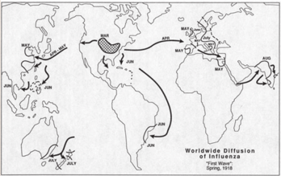

> **Deskripsi Visual:** Gambar ini adalah diagram yang menunjukkan penyebaran influenza global pada musim semi tahun 1918. Diagram ini menggambarkan jalur pergerakan infeksi virus influenza melalui berbagai wilayah dunia, mulai dari Asia, Afrika, Amerika Utara, Amerika Selatan, Eropa, dan Australia. Setiap wilayah ditandai dengan warna yang berbeda untuk menunjukkan lokasi penyebaran virus tersebut. Label "Worldwide Diffusion of Influenza" (Penyebaran Flu Global) terletak di bagian atas gambar, sementara label "Spring, 1918" ditempatkan di bagian bawah. Informasi penting yang dapat diambil dari gambar ini adalah bahwa penyebaran flu sangat luas dan melibatkan banyak wilayah di seluruh dunia pada waktu itu.

Sumber: Ravando, 2020

Influenza Komisi bentukan pemerintah Hindia Belanda melakukan terobosan  penting  untuk  menghambat  penyebaran  wabah  dengan penelitian ilmiah mengenai Flu Spanyol. Mereka menyebarkan kuesioner ke berbagai dokter yang tersebar di Hindia-Belanda untuk mengetahui dan mempelajari penanganan Flu Spanyol dari berbagai daerah. Dari sinilah awal pemerintah kolonial merumuskan berbagai kebijakan penanggulangan pandemi yang kemudian berujung  pada  pembentukan Influenza Ordonansi pada tahun 1920. Selain melakukan tindakan pengobatan dan pencegahan, pemerintah juga melakukan edukasi dengan mengeluarkan terbitan terkait penyakit baru yang terjadi di Indonesia kala itu.

Sumber: Ravando, 2020

 

---
## 📄 Halaman 92

Penyuluhan dan edukasi kepada rakyat Indonesia pada waktu itu terkait dengan adanya berita-berita hoaks yang beredar di masyarakat. Dari sana kita dapat belajar bahwa pada masa lalu sudah ada beritaberita  hoak  dan  takhayul  ketika  terjadi  wabah  penyakit  seperti pemberitaan pada media massa berikut ini.

Gambar 2.12. Pemberitaan tentang wabah di surat kabar masa itu.

Sumber: Ravando, 2020

Referensi: Ravando, 2020, Perang  melawan  influenza:  pandemi  flu  Spanyol  di  Indonesia  pada  masa  kolonial, 1918-1919 , Jakarta: Penerbit Kompas.

### Tugas:

- Berdasarkan  bacaan  pada  Viva  Historia  di  atas,  kalian  dapat membayangkan  bagaimana situasi dan kondisi saat pandemi Spanyol selama 1918-1919 di Indonesia.
flu

 

---
## 📄 Halaman 93

### Petunjuk Kerja:

- Buat kelompok diskusi berisi 3 hingga 4 orang.
- Lakukan perbandingan situasi saat wabah flu Spanyol dan covid 19 di Indonesia.
- Tulislah  tabel  identifikasi  persamaan  dan  perbedaan  dua  wabah tersebut.  Buat refleksi terkait wabah di Indonesia.
- Presentasikan hasil diskusi kalian di depan kelas.

### 3.  Perang Dunia II (PD II)

Penyebab  utama  PD  II  bermula  dari  konflik  dan  peperangan  yang dilakukan oleh Italia, Jerman, dan Jepang. Konflik-konflik yang terjadi selama 1931-1939 disebabkan oleh perebutan wilayah kekuasaan milik bangsa/negara lain. Forum internasional sekelas Liga Bangsa-Bangsa tidak  mampu mencegah dan menghentikan agresi Italia di Ethiopia, Jepang di Cina, dan pengambilalihan Austria oleh Jerman.

Pada tahun 2019, Saut Pasaribu menulis buku  berjudul History of  The  World  War .  Dalam  bukunya,  ia  menjelaskan  bahwa,  Amerika Serikat  memprotes  dan  mengkritik  tindakan-tindakan  dari  Italia, Jerman, dan Jepang. Di sisi yang lain, Inggris dan Prancis justru setuju dan membiarkan Benito Mussolini (Italia) dan Adolf Hitler (Jerman) mengambil dan menguasai wilayah yang ingin mereka kuasai. Inggris dan  Prancis  berharap  kebijakan  tersebut  akan  mencegah  potensi perang-perang  lainnya.  Inggris  dan  Prancis  telah  bersepakat  di  kota Munich  untuk  membiarkan  negara  Jerman  memiliki  sebuah  bagian dari Cekoslovakia yang disebut Sudetenland pada 30 September 1938. Saat itu Hitler berjanji bahwa kesepakatan ini akan menjadi permintaan teritorial terakhirnya di Eropa.

Namun keserakahan Hitler pada Maret 1939 membawanya untuk melanggar  perjanjian  tersebut,  dengan  mengambil  alih  sisa  negeri itu. Kejadian ini seketika memancing kemarahan Inggris dan Prancis. Perdana Menteri Edouard Daladier dari Prancis dan Perdana Menteri Neville  Chamberlain  dari  Britania  Raya  berjanji  akan  membantu

 

---
## 📄 Halaman 94

Polandia jika terjadi serangan dari Nazi Jerman. Di sisi lain pada Mei tahun  1939,  Italia  dan  Jerman  menandatangani  sebuah  perjanjian untuk saling membantu dalam urusan perang Hitler dan para pemimpin Jerman yang lainnya meyakini kekalahan Jerman pada Perang Dunia I karena harus bertempur di dua front. Untuk mencegah pengulangan seperti  itu,  Hitler  (Jerman)  dan  Joseph  Stalin  (Soviet)  bersepakat untuk menandatangani perjanjian non-agresi selama 10 tahun pada 23 Agustus 1939. Kemudian pada 1 September 1939, Jerman mencoba mengambil Kota Danzig dan menyerbu Polandia. Kejadian penyerangan ini menyebabkan Perang Dunia II dimulai.

Setidaknya ada dua faktor yang melatarbelakangi terjadinya perang dunia II, yaitu faktor umum dan faktor khusus. Faktor umum adalah:

- Kegagalan  Liga  Bangsa-Bangsa  (LBB)  menciptakan  perdamaian dunia.
- Munculnya  keinginan  melebarkan  wilayah  (ekspansi)  di  bidang ekonomi,  Irredenta  (Italia),  Lebensraum    (Jerman),  dan  Hakko  I Chiu (Jepang).
- Munculnya paham ideologi yang saling bertentangan, yaitu fasisme, komunisme, dan liberalisme.
- Terdapat perlombaan pembuatan senjata antarnegara dan bangsa untuk memperkuat dan memperkokoh diri.
Munculnya  strategi  politik  untuk  mencari  kawan  (aliansi)  dan dukungan  menimbulkan  terjadinya  blok-blok  antarnegara  (negara menjadi terkotak-kotak) sehingga melibatkan banyak negara terlibat peperangan dahsyat ini. Dalam hal ini terdapat dua blok, yaitu Blok Fasis  dan  Blok  Sekutu.  Blok  Fasis  terdiri  atas  Jerman,  Jepang,  dan Italia (juga bersekutu dengan Bulgaria, Hongaria, Slowakia, Rumania, dan Kroasia).  Sementara  Blok  Sekutu  terdiri  atas  blok  komunis  dan demokrasi. Blok Komunis terdapat Uni Soviet dan Mongolia, sedangkan Blok Demokrasi beranggotakan Inggris, Prancis, Amerika Serikat, dan Republik Tiongkok (juga bersekutu dengan Afrika Selatan, Australia, Brasil, Belgia, Belanda, Cekoslowakia, Etiopia, India, Filipina, Kanada,

 

---
## 📄 Halaman 95

Kuba, Meksiko, Luksemburg, Yugoslavia, Norwegia, Polandia, Selandia Baru, dan Yunani).

Faktor khusus adalah:

- Invasi Jerman ke Polandia (1 September 1939).
- Invasi Jepang ke Manchuria, Cina (1931).
- Invasi Italia di Ethiopia (1935-1939).
- Serangan Jepang ke Pearl Harbor (7 Desember 1941).
Negara  Jerman  kemudian  berhasil  menaklukkan  Prancis  dan memberikan kesempatan kepada Jepang untuk mendirikan pangkalan militer  di  wilayah  Indo-cina  (Asia  Tenggara).  Kondisi  seperti  ini menyebabkan  Jepang  merasa  mendapatkan  peluang  besar  untuk mengambil alih kawasan Nusantara (Indonesia) dari Belanda. Belanda yang  sangat  menolak  kehadiran  Jepang  di  Asia  Tenggara  berusaha membekukan  seluruh  aset  milik  Jepang  yang  ada  di  Nusantara (Indonesia). Perlu dipahami bahwa selama 1938-1939 Jepang berhasil masuk  ke  Indonesia  dengan  misi  ekonomi.  Oleh  sebab  itu,  Jepang memiliki aset di bumi Nusantara (Indonesia) yang masih ditahan dalam cengkeraman  pemerintah  kolonial  Hindia  Belanda.  Dampak  paling berpengaruh  dari  PD  II  bagi  Indonesia  adalah  pascaserangan  Pearl Harbour, Belanda menyerah kepada Jepang secara resmi pada 8 Maret 1942.

### 4.  Detik-Detik Belanda Menyerah kepada Jepang

Perjanjian  Kalijati  adalah  sebuah  hasil  perundingan  pihak  Belanda dan Jepang yang ditandatangani di sebuah rumah dinas milik seorang perwira  staf  Sekolah  Penerbang  Hindia  Belanda  di  daerah  Lanud Kalijati,  Subang,  Jawa  Barat  pada  8  Maret  1942.  Isi  Perundingan Kalijati tersebut adalah bukti sejarah awal berakhirnya era pemerintah kolonial Belanda di bumi Nusantara di mana pemerintahan tersebut segera digantikan oleh pemerintah militer Jepang.

 

---
## 📄 Halaman 96

Menarik untuk melihat bagaimana kronologi detik-detik menyerahnya Belanda kepada Jepang tanpa syarat apapun. Mengapa Belanda sebagai negara Eropa yang telah lama menguasai Indonesia dapat bertekuk lutut kepada Jepang?

---
**🖼️ Gambar/Diagram**

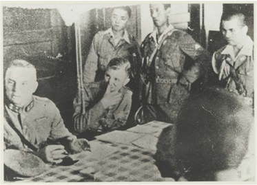

> **Deskripsi Visual:** Gambar ini adalah foto yang menunjukkan beberapa orang yang sedang berada di dalam sebuah ruangan. Ruangan tersebut tampak sederhana dengan dinding yang berwarna putih dan beberapa peralatan kecil yang tampak seperti lemari atau rak. Di tengah-tengah foto, ada seorang pria tua yang duduk di meja, tampaknya sedang memegang sesuatu. Sebuah wanita tua juga tampak sedang berdiri di belakangnya, tampaknya sedang berbicara atau memberikan komentar kepada pria tua tersebut. Ada juga beberapa orang lain yang tampak sedang berdiri di sekitar mereka, tampaknya mengamati atau mendengarkan apa yang sedang disampaikan oleh wanita tua tersebut. Semua orang tampak tertarik pada situasi yang sedang terjadi.

Mengutip dari National Geographic Indonesia, dijelaskan bahwa serangan terakhir Belanda terjadi di Jawa Barat. Pada 6 Maret 1942, Panglima  perang  Belanda  Angkatan  Darat  yang  bernama  Letnan Jenderal Ter Poorten memberikan arahan kepada Komandan Pertahanan di Bandung yang bernama Mayor Jenderal JJ Pesman agar tidak melakukan peperangan di wilayah Bandung. Alasannya di kota Bandung sudah banyak penduduk sipil terutama wanita dan anak-anak kecil. Jika peperangan terjadi di sana, banyak korban warga sipil akan berjatuhan. Akhirnya Letnan Jenderal Ter Poorten berunding dengan Jepang.  Singkat  cerita,  pada  sore    7  Maret  1942,  Lembang  berhasil

 

---
## 📄 Halaman 97

dikuasai Jepang sehingga  memaksa KNIL melakukan gencatan senjata. Mayor  Jenderal  JJ  Pesman  pun  akhirnya  mengirimkan  utusan  ke Lembang untuk melakukan perundingan.

Pada 8 Maret 1942, Jenderal Imamura meminta agar perundingan dilakukan bersama dengan Gubernur Jenderal Tjarda van Starkenborgh Stachouwer  di  Kalijati,  Subang,  pada  pagi  hari.  Letnan  Jenderal  Ter Poorten  menyarankan  Gubernur  Jenderal  Tjarda  menolak  usulan tersebut. Jenderal Imamura yang marah mendengar penolakan itu pada akhirnya  mengancam  akan  membumihanguskan  Bandung  dengan bom jika pada pukul 10.00 pagi hari pada 8 Maret 1942 para petinggi Belanda belum datang ke Kalijati.

Tidak  ingin  ancamannya  dianggap  sekadar  gertakan,  Jepang menyiapkan banyak pesawat pengebom di Landasan Udara Kalijati. Melihat situasi dan kondisi yang semakin mengkhawatirkan, Letnan Jenderal Ter Poorten dan Gubernur Jenderal Tjarda memerintahkan Mayjen  JJ  Pesman  agar  segera  menghubungi  Komandan  Tentara Jepang  untuk  melakukan  perundingan.  Namun  utusan  dari  pihak Belanda ditolak oleh Panglima Jenderal Imamura. Sang Jenderal hanya ingin berbicara secara langsung dengan Panglima Tentara Belanda atau Gubernur Jenderal.

Dari Transkrip percakapan perundingan antara Jenderal Imamura, Gubernur Jenderal Tjarda, dan Letnan Jenderal Ter Poorten dapat  dipahami  bahwa  sebenarnya  pihak  Belanda  menolak  untuk menyerahkan  kekuasaannya  di  Jawa  dan  seluruh  Nusantara  dengan dalih bahwa  wewenang penuh ada di tangan Ratu  Wilhelmina. Kemudian Jenderal Imamura dengan tegas mengatakan ia hanya menginginkan salah  satu  dari  dua  hal,  yaitu  perang  atau  menyerah.  Singkat  cerita, akhirnya Gubernur Jenderal Tjarda dan Letnan Jenderal Ter Poorten mau  menandatangani  dokumen  kapitulasi  atau  penyerahan  tanpa syarat pemerintahan Hindia Belanda kepada pemerintahan Jepang.

 

---
## 📄 Halaman 98

### Tugas:

- Buat kelompok yang terdiri dari 3-4 orang
- Identifikasi tabel organisasi pergerakan nasional berikut ini:

---
**📊 Tabel**

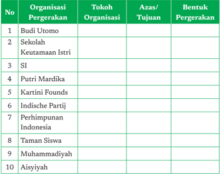

Tabel ini berisi informasi tentang organisasi pergerakan di Indonesia, termasuk tokoh organisasi, azas tujuan, dan bentuk pergerakan. Topik utama tabel adalah organisasi pergerakan di Indonesia, yang mencakup berbagai organisasi seperti Budi Utomo, Sekolah Keutamaan Istri, S.I., Putri Mardika, Kartini Founds, Indische Partij, Perhimpunan Indonesia, Taman Siswa, Muhammadiyah, dan Aisyiyah. Kolom-kolom yang ada meliputi No, Organisasi Pergerakan, Tokoh Organisasi, Azas/Tujuan, dan Bentuk Pergerakan. Data penting yang terlihat adalah bahwa banyak organisasi ini memiliki bentuk pergerakan yang sama, yaitu "Perhimpunan", yang menunjukkan kesamaan dalam struktur organisasi mereka.

### Petunjuk Kerja:

- Carilah referensi yang berasal dari buku atau media online mengenai macam-macam organisasi pergerakan.
- Diskusikan  dengan  anggota  kelompok  kalian  poin-poin  yang terdapat di dalam tabel.
- Buat  opini  atas  organisasi  pergerakan  di  atas,  kaitkan  dengan perjuangan yang harus dilakukan oleh generasi muda pada saat ini.
- Presentasikan hasil diskusi kelompokmu di depan kelas.

 

---
## 📄 Halaman 99

### Kesimpulan Visual

---
**🖼️ Gambar/Diagram**

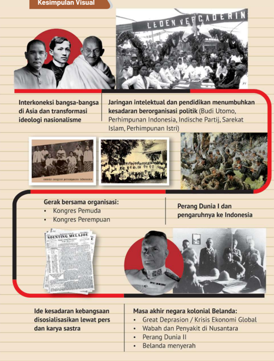

> **Deskripsi Visual:** Gambar ini adalah diagram yang menunjukkan hubungan antara interkoneksi bangsa-bangsa di Asia, transformasi ideologi nasionalisme, jaringan intelektual dan pendidikan, gerakan bersama organisasi, perang dunia I, ide kesadaran kebangsaan, dan masa akhir negara kolonial Belanda. Gambar ini mencakup berbagai elemen seperti foto-foto sejarah, teks, dan label yang menjelaskan hubungan antara setiap elemen tersebut. Informasi kunci yang dapat diambil pembaca meliputi interkoneksi bangsa-bangsa di Asia, transformasi ideologi nasionalisme, jaringan intelektual dan pendidikan, gerakan bersama organisasi, perang dunia I, ide kesadaran kebangsaan, dan masa akhir negara kolonial Belanda.

 

---
## 📄 Halaman 100

### Pilihan Ganda

- Mahatma Gandi merupakan tokoh nasionalis India yang pemikirannya  banyak  memengaruhi  tokoh  nasionalis  Indonesia. Salah  satu  bentuk  perjuangannya  adalah  mengajak  rakyat  India untuk  memakai  produk  asli  dalam  negeri.  Gerakan  ini  disebut sebagai ....
- Satyagraha
- Swadaya
- Swadeshi
- Ahimsa
- Hartal
- Indische  Partij  merupakan  organisasi  pergerakan  nasional  yang bersifat inklusif yang berarti ....
- Keanggotaannya terbuka untuk penduduk pribumi saja
- Keanggotannya  terbuka  untuk  semua  kelompok  di  Hindia Belanda
- Keanggotannya terbuka untuk penduduk di Jawa dan Madura
- Keanggotannya terdiri dari kalangan menengah ke atas
- Keanggotannya terdiri dari kalangan yang terdidik saja
- Rohana Kudus merupakan salah satu tokoh pers perempuan yang memprakarsai penerbitan surat kabar ....
- Soenting Melayoe
- Soeara Perempuan
- Poetri Hindia
- Warta Hindia
- Soeloeh Indonesia

 

---
## 📄 Halaman 101

- Salah satu latar belakang terjadinya Perang Dunia II di wilayah Asia adalah ....
- Kegagalan LBB dalam menciptakan perdamaian dunia
- Perlombaan senjata antar negara-negara besar
- Perbedaan ideologi antara negara-negara Asia
- Serangan Jepang ke Indo-Cina
- Serangan Jepang terhadap Pearl Harbour
- Salah  satu  alasan  pihak  Belanda  pada  awalnya  menolak  untuk menyerah kepada Jepang karena ....
- Belanda merasa memiliki kekuatan militer yang lebih besar
- Pihak Belanda merasa Jepang pasti akan kalah
- Pihak Sekutu akan datang membantu Belanda
- Wewenang penyerahan ada di tangan Ratu Belanda
- Jepang tidak memiliki persenjataan yang baik

### Esai

- Bagaimanakah pengaruh nasionalisme di Asia terhadap pergerakan nasional Indonesia?
- Bagaimanakah  keterkaitan  antara  Kongres  Perempuan  Pertama dengan Kongres Sumpah Pemuda?
- Bagaimanakah dampak the great depression terhadap Hindia Belanda?
- Bagaimanakah dampak Perang Dunia II terhadap Indonesia?
- Mengapa bangsa Indonesia tidak membantu Belanda saat Jepang menyerang?

 

---
## 📄 Halaman 102

### Refleksi

Pers  menjadi  salah  satu  media  utama  yang  digunakan  sebagai  alat menyampaikan perlawanan, kritik kepada pemerintah kolonial hingga mobilisasi massa. Di Indonesia perkembangan pers dijadikan sebagai  media  untuk  mensosialisasikan  cita-cita  dan  kepentingan politik  untuk  memajukan  penduduk  bumiputera.  Berkaca  pada  apa yang  dilakukan  tokoh-tokoh  pers  dan  sastrawan  pada  masa  lalu, kalian  dapat  memanfaatkan  kesempatan  dalam  alam  kemerdekaan untuk meneruskan cita-cita memajukan bangsa, merawat kebinekaan, mengembangkan  diri  lewat  kecakapan  literasi  di  era  digital  seperti sekarang ini.

 

---
## 📄 Halaman 103

月

KEMENTERIAN PENDIDIKAN, KEBUDAYAAN, RISET, DAN TEKNOLOGI REPUBLIK INDONESIA, 2021

Sejarah untuk SMA/SMK Kelas XI Penulis: Martina Safitry, Indah Wahyu Puji Utami, dan Zein Ilyas ISBN: 978-602-244-859-4  (jil.1)

### Di Bawah Tirani Jepang Bab 3

 

---
## 📄 Halaman 104

### G ambaran Tema

Pada bab ini, kalian akan mempelajari periode penjajahan Jepang di Indonesia. Untuk memberi gambaran mengenai latar peristiwa, maka bab  ini  akan  dimulai  dengan  pemaparan  tentang  berbagai  peristiwa regional  dan  global  yang  melatarbelakangi  masuknya  Jepang  dan jatuhnya  Hindia  Belanda.  Pada  bagian  selanjutnya  akan  dibahas mengenai tiga pemerintahan militer Jepang (Angkatan Darat ke-16 di Jawa dan Madura, Angkatan Darat ke-25 di Sumatera, dan Angkatan Laut  di  Indonesia  Timur)    yang  berkuasa  di  Indonesia  pada  tahun 1942-1945 dan dampak pendudukan militer Jepang. Bab ini kemudian ditutup dengan materi tentang berbagai strategi para tokoh nasional maupun  lokal  dalam  menghadapi  Jepang,  baik  dengan  cara  bekerja sama maupun dengan perlawanan.

### Tujuan Pembelajaran

Setelah  membaca  bab  ini,  kalian  diharapkan  mampu  menggunakan sumber-sumber  sejarah  untuk  mengevaluasi  secara  kritis  dinamika kehidupan  bangsa  Indonesia  di  bawah  penjajahan  Jepang,  serta melaporkannya  dalam bentuk tulisan atau lainnya. Kalian juga diharapkan mampu  merefleksikan materi yang telah dipelajari kehidupan di masa kini dan masa depan.

untuk

 

---
## 📄 Halaman 105

### M ateri

- Masuknya Jepang dan Jatuhnya Hindia Belanda A.
- Penjajahan Jepang dan Transformasi Pemerintahan di Indonesia B.
- Dampak Penjajahan Jepang di Berbagai Bidang C.
- Strategi Bangsa Indonesia Menghadapi Tirani Jepang D.

### Pertanyaan Kunci

- Bagaimana periode penjajahan Jepang berlangsung di Indonesia? 1.
- Bagaimana dampak penjajahan Jepang di Indonesia dan relevansinya di masa kini? 2.
Kata Kunci

Penjajahan, Tirani, Perubahan Sosial dan Politik, Resiliensi, Refleksi.

 

---
## 📄 Halaman 106

Apakah di daerah kalian dikenal istilah RT (Rukun Tetangga)? Tahukah kalian bahwa sistem RT yang dikenal di berbagai daerah di Indonesia sebenarnya berakar dari masa penjajahan Jepang? Sistem ini berasal dari tonarigumi yang juga pernah diterapkan di negara Jepang untuk memudahkan  mengawasi  dan  mengatur  penduduk.  Bisakah  kalian menyebutkan  warisan  lain  dari  penjajahan  Jepang  yang  masih  ada hingga masa kini? Kalian bisa mencari tahu lebih lanjut untuk menjawab berbagai  pertanyaan  tersebut  melalui  berbagai  sumber  sejarah,  baik sumber primer maupun sekunder.

---
**🖼️ Gambar/Diagram**

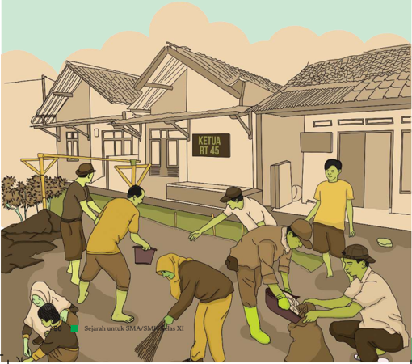

> **Deskripsi Visual:** Gambar ini adalah ilustrasi yang menunjukkan aktivitas kebersihan di sebuah desa. Gambar ini menggambarkan beberapa orang warga desa sedang bekerja bersama-sama membersihkan jalan di depan rumah-rumah. Di sebelah kiri, ada sekelompok orang yang sedang membuang sampah menggunakan ember, sementara di sebelah kanan, ada beberapa orang lain yang sedang membersihkan tanah dengan menggunakan alat berat seperti palet dan broom. Di atas bangunan yang tampaknya merupakan rumah kepala RT (Rumah Tangga) 45, terdapat papan nama yang menunjukkan nama kepala RT tersebut.

Elemen-elemen utama dalam gambar ini meliputi:
1. Warga desa yang sedang bekerja bersama-sama.
2. Rumah-rumah di sekitar area kebersihan.
3. Papan nama yang menunjukkan nama kepala RT.
4. Alat-alat kebersihan seperti palet, broom, dan ember.

Teks, angka, atau label penting yang terlihat dalam gambar ini adalah "KETUA RT 45" pada papan nama di atas bangunan.

Informasi kunci yang dapat diambil pembaca dari gambar ini adalah bahwa warga desa sedang terlibat dalam kegiatan kebersihan bersama-sama, menunjukkan partisipasi aktif dalam menjaga kebersihan lingkungan mereka.

 

---
## 📄 Halaman 107

Penjajahan Jepang di Indonesia berlangsung dalam waktu yang cukup singkat,  yaitu  hanya  sekitar  3,5  tahun.  Penjajahan  itu  berlangsung dalam konteks Perang Asia Timur Raya yang merupakan bagian dari Perang  Dunia  II.  Karena  peristiwa  ini  berlangsung  dalam  suasana perang  dan  tidak  terlalu  lama,  sebagian  ahli  menyebutnya  sebagai 'pendudukan'.  Meskipun  demikian,  apa  yang  dilakukan  Jepang  di Indonesia  sejak  tahun  1942-1945  dapat  disebut  sebagai  penjajahan karena sifatnya yang eksploitatif. Jepang mengeksploitasi atau menguras kekayaan alam dan sumber daya manusia di Indonesia untuk mengejar ambisinya menguasai wilayah Asia Timur Raya, termasuk Asia Tenggara. Dalam bukunya, Aiko Kurasawa (2016) menyebut mengenai adanya keinginan bangsa Jepang untuk menguasai negeri-negara Asia Tenggara menggantikan negara Barat. Artinya, Perang Asia Timur Raya adalah perang kolonial yang mencari redivision of territory (pembagian ulang wilayah).

### Kawasan Asia Timur Raya

Tahukah  kalian  wilayah  mana  saja  yang  disebut  sebagai Asia  Timur Raya?

Pada  awalnya  Jepang  hanya  berambisi  melakukan  ekspansi  ke wilayah di kawasan Asia Timur seperti Tiongkok, Korea, dan Taiwan. Dalam perkembangannya, Jepang ingin meluaskan kekuasaannya ke wilayah Asia Tenggara juga sehingga mereka menggunakan istilah Asia Timur Raya.

 

---
## 📄 Halaman 108

Coba  perhatikan  poster  berikut!  Dapatkah  kalian  menyebutkan wilayah Asia  Timur Raya sesuai poster yang dikeluarkan oleh pemerintah Jepang? Tulislah jawaban kalian di buku atau media lain!

---
**🖼️ Gambar/Diagram**

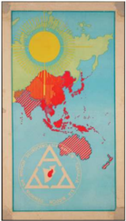

> **Deskripsi Visual:** Gambar ini adalah ilustrasi yang menunjukkan peta dunia dengan fokus pada Asia Tenggara. Peta ini menggunakan warna-warna cerah untuk menonjolkan negara-negara tertentu, seperti Indonesia dan Malaysia, yang dinyatakan dengan warna merah. Di sebelah kiri atas peta, terdapat simbol matahari yang menggambarkan waktu atau peristiwa tertentu, sementara di sebelah kanan bawah ada sebuah tanda tangan yang tampak seperti sebuah lingkaran dengan tiga garis berwarna merah.

Elemen utama dalam gambar ini adalah peta Asia Tenggara yang digambar dengan detail, termasuk wilayah-wilayah yang ditandai dengan warna-warna berbeda. Simbol matahari dan tanda tangan juga menjadi elemen penting yang memberikan konteks tambahan kepada gambar tersebut.

Teks, angka, atau label penting yang terlihat dalam gambar ini tidak ada, karena gambar ini hanya menggambarkan peta tanpa teks atau angka yang spesifik. Namun, informasi kunci yang dapat diambil pembaca melalui gambar ini adalah bahwa peta ini menunjukkan fokus pada Asia Tenggara, dengan Indonesia dan Malaysia yang dinyatakan dengan warna merah.

Dalam satu paragraf yang informatif, gambar ini menunjukkan peta Asia Tenggara dengan fokus pada Indonesia dan Malaysia, menggunakan warna merah untuk menonjolkan negara-negara tersebut. Simbol matahari dan tanda tangan juga menjadi elemen penting yang memberikan konteks tambahan kepada gambar tersebut. Warna-warna dan simbol-simbol ini membantu pembaca memahami lokasi dan hubungan antar negara-negara di Asia Tenggara.

Sumber: Image Bank WW2 - NIOD - Beldnummer 107190

### 1.  Ekspansi Jepang dan Perang Asia Timur Raya

Apakah kalian tahu bahwa usaha Jepang menguasai Asia Timur Raya sudah dirintis jauh sebelum Perang Dunia II berlangsung? Mengapa Jepang ingin meluaskan kekuasaannya? Untuk memahami hal ini, kita perlu menengok perkembangan sejarah di Kawasan Asia Timur.

Sejak Restorasi Meiji pada abad ke-19, Jepang mengalami kemajuan yang pesat di bidang ekonomi, terutama industri. Jepang memperluas wilayah kekuasaannya hingga ke Taiwan, Tiongkok, dan Korea. Pada tahun 1905 Jepang bahkan berhasil mengalahkan Rusia. Peristiwa ini menambah kepercayaan diri bangsa Jepang yang merasa dirinya lebih unggul dari bangsa Asia lainnya. Untuk memahami lebih jauh tentang motivasi Jepang melakukan ekspansi, kerjakanlah Aktivitas 2 berikut.

 

---
## 📄 Halaman 109

### Ekspansi Menuju Selatan

Pada  pertengahan  1920-an  setelah  Perang  Dunia  Pertama,  industriindustri  semakin  berkembang  sejalan  dengan  kemajuan  ekonomi yang diperoleh Jepang. Industri ini terutama adalah perkapalan dan tekstil.  Hal  ini  menimbulkan  munculnya  para Zaibatsu (klan  atau keluarga pengusaha besar seperti Mitsubishi, Sumimoto, Mitsui) yang menginginkan ruang lingkup yang lebih besar lagi dalam pemasaran. Ditambah lagi dengan negara Jepang sendiri yang sudah penuh sesak dengan  pabrik  dan  industri  yang  bermunculan,  sehingga  mereka melakukan  tekanan  kepada  pemerintah  untuk  dapat  melakukan perluasan wilayah secepat-cepatnya.

Hal ini kemudian didukung dan diamini oleh beberapa kalangan militer  yang  berpandangan  nasionalis chauvinis yang  berkeinginan untuk  melakukan  ekspansi  terhadap  daerah-daerah  yang  dianggap memberikan sumber daya yang cukup bagi  perkembangan  ekonomi dan industri Jepang.

Sumber:  Padiatra,  A.M.  (2020).  Jejak  Sakura  di  Nusantara:  Pasang  Surut  Hubungan  Jepang  -  Indonesia Tahun  1800-an-1974.  Sasdaya: Gadjah  Mada  Journal  of  Humanities ,  4  (1),  1  -  12,  https://doi.org/10.22146/ sasdayajournal.54570

### Mengapa Jepang Menjajah?

Untuk  mengetahuinya,  kita  harus  memahami  situasi  masyarakat Jepang pada 1920-an. Masa antara Perang Dunia I dan II sangat krusial terhadap perkembangan sejarah selanjutnya. Dilihat dari situasi politik dalam negeri Jepang, tahun 1920-an adalah zaman Taisho Democracy . Pada  masa  ini  demokrasi  parlementer  mulai  berkembang.  Namun, keadaan ekonomi buruk karena produksi pertanian turun. Kemiskinan membelit seluruh desa di Jepang. Akibatnya, sosialisme mulai menguat dan timbul banyak konflik antara tuan tanah dan petani atau antara pengusaha dan buruh.

 

---
## 📄 Halaman 110

Pada zaman itu dunia berada di bawah Versailles Settlement . Salah satu isu yang penting dalam perjanjian ini adalah usaha memperkecil kekuatan militer setiap negara besar, pada khususnya membatasi tonase kapal  perang  masing-masing  negara.  Dalam  Perjanjian  Washington tahun 1922, Jepang didesak menerima rasio 10:10:6 antara Inggris, Amerika, dan Jepang. Angkatan Laut Jepang menerima keputusan ini dengan sangat kecewa dan tidak puas.

Di antara sebagian opsir muda tentara Jepang muncul rasa tidak puas terhadap pemerintah sipil sekaligus khawatir akan situasi politik internasional.  Di  bawah  pengaruh  pemimpin  ultranasionalis  seperti Okawa Shumei dan Kita Ikki, mereka mulai bersikap fasis.

Sumber: Kurasawa, A. (2016). Masyarakat & Perang Asia Timur Raya: Sejarah dengan Foto yang Tak Terceritakan . Jakarta: Komunitas Bambu, halaman 2.

### Tugas:

- Berdasarkan bacaan di atas, identifikasilah berbagai alasan Jepang melakukan ekspansi ke wilayah Asia Timur Raya!
- Menurut kalian, alasan manakah yang lebih kuat dalam mendorong ekspansi Jepang? Mengapa demikian?

### Petunjuk Kerja:

- Kerjakanlah secara mandiri (individu) di buku tulis kalian!
- Diskusikan temuan kalian di kelas!
- Kalian dapat menggunakan sumber lain untuk mengerjakan tugas ini!
Pada  saat  yang  sama,  sebagian  wilayah  Asia  Timur  juga  sudah dikuasai oleh bangsa Barat, seperti Inggris dan Amerika Serikat yang memiliki  konsesi  wilayah  di  Tiongkok.  Bagaimanakah  reaksi  bangsa Barat atas ekspansi Jepang? Bagaimanakah sikap bangsa Asia terhadap apa yang dilakukan Jepang?

Sejarah mencatat reaksi yang beragam. Bangsa Barat yang memiliki kepentingan kolonial tentu saja tidak senang dengan langkah Jepang memperluas kekuasaannya, terutama ke Tiongkok, Korea, dan Taiwan,

 

---
## 📄 Halaman 111

begitu pula dengan bangsa-bangsa yang dijajah Jepang. Namun di lain pihak,  kemenangan Jepang  dalam  berbagai  perang  dan  ekspansinya seperti  membawa  harapan  baru  bagi  sebagian  bangsa  Asia  lainnya. Bangsa Asia ternyata juga bisa maju dan mengalahkan bangsa Barat. Kurasawa (2016) mencatat beberapa pemimpin nasionalis Asia seperti  Phan  Boi  Chau  (Vietnam),  Rikarte  (Filipina)  dan  U  Ottama (Birma) datang ke Jepang dan mengharapkan bantuan Jepang dalam membebaskan  wilayahnya dari penjajahan bangsa Barat. Perkembangan ini tentu saja mengkhawatirkan bagi kolonialis Barat. Mereka berusaha membendung laju ekspansi Jepang dengan berbagai upaya,  misalnya  Amerika  Serikat  menghentikan  ekspor  minyak  ke Jepang sejak 1 Agustus 1941. Peristiwa inilah yang justru mendorong Jepang  melakukan  ekspansinya  ke  Indonesia  yang  saat  itu  masih bernama Hindia Belanda.

Belanda pada awalnya tidak terlibat konflik secara langsung dengan Jepang.  Namun,  sejak  tahun  1930-an,  Pemerintah  Hindia  Belanda sudah mengawasi dengan ketat aktivitas orang Jepang di wilayahnya. Selain  itu,  penguasa  kolonial  juga  menerapkan  kontrol  yang  lebih ketat  terhadap  pergerakan  kebangsaan  di  Indonesia.  Kebangkitan Jepang sebagai salah satu kekuatan Asia turut memberikan inspirasi dan kepercayaan diri kepada tokoh nasionalis Indonesia. Slogan dan ideologi Asia untuk orang Asia juga semakin menyebar.

Beberapa  tokoh  pergerakan  menunjukkan  simpatinya  terhadap Jepang,  misalnya  E.F.E.  Douwes  Dekker  (Danudirja  Setiabudi)  pada 1936 menulis buku Sejarah Dunia yang lebih mengedepankan peran orang  Asia  dalam  sejarah.  Namun,  sebelum  sempat  terbit,  buku  ini sudah  disita  dan  dilarang  beredar  oleh  pemerintah  kolonial  karena dianggap pro Jepang dan anti Belanda (Surjomiharjo, 1995). Selain itu, ada pula M.H. Thamrin yang dalam sidang Volksraad (Dewan Rakyat) tahun  1934  menunjukkan  simpatinya  kepada  Jepang  (Gonggong, 1995).  Sikap  para  tokoh  ini  perlu  dipahami  dalam  konteks  sejarah di  masa  itu.  Pada  tahun  1930-an,  mereka  belum  mengetahui  bahwa Jepang ternyata tidak kalah eksploitatif dari Belanda saat menjajah.

 

---
## 📄 Halaman 112

### 2. Perang Dunia II dan Jatuhnya Hindia Belanda

Perang  Dunia  II  mulai  meletus  pada  September  1939.  Belanda  ikut terseret dalam perang ini. Pada Mei 1940, Jerman berhasil menduduki Belanda dan membuat Ratu Belanda beserta keluarganya mengungsi ke Inggris. Karena itulah, saat Inggris berperang dengan Jepang di Asia, Belanda dan koloninya pun akhirnya ikut terlibat.

Tahukah kalian wilayah Indonesia mana saja yang awalnya diserang oleh  Jepang?  Jepang  tidak  langsung  menyerang  pulau  Jawa  yang merupakan  pusat  pemerintah  kolonial  Belanda.  Serangan  pertama justru  diarahkan  ke  berbagai  sumber  minyak  di  luar Jawa.  Mengapa demikian?

Pada saat Amerika menghentikan suplai minyaknya untuk Jepang pada tahun 1941, pihak Jepang sebenarnya berusaha untuk melakukan negosiasi  dengan  pemerintah  Hindia  Belanda  untuk  mendapatkan minyak.  Namun,  usaha  ini  gagal.  Oleh  karenanya,  Jepang  kemudian menyerang  Indonesia  untuk  mendapatkan  sumber  daya  alamnya. Karena  Jepang  sangat  memerlukan  minyak  bumi,  Tarakan  diserang Jepang pada 11 Januari 1942 karena wilayah ini dan sekitarnya kaya akan  minyak.  Jepang  kemudian  menyerang  Balikpapan  yang  juga memiliki banyak ladang minyak.

Apakah kalian tahu wilayah mana lagi yang diincar oleh Jepang? Setelah  menguasai  ladang-ladang  minyak  di  Kalimantan,  Jepang kemudian  melanjutkan  ekspansinya  ke  wilayah  Indonesia  bagian timur seperti Ambon, Morotai, Manado, dan Kendari. Setelah berbagai wilayah  di  kawasan  timur  berhasil  dikuasai,  Jepang  mengarahkan ekspansinya ke wilayah barat, yaitu ke Palembang yang juga kaya akan minyak. Jatuhnya  Palembang  ini  membuka  jalan  bagi Jepang  untuk menguasai Jawa.

 

---
## 📄 Halaman 113

Belanda  sebagai  penguasa  di Jawa  tidak  bisa  melakukan  banyak perlawanan  kepada Jepang.  Meskipun  pada  saat  itu  Belanda  adalah salah satu bagian dari sekutu, tapi negara-negara sekutu sibuk memikirkan kepentingan masing-masing dan tidak banyak menolong. Negeri Belanda sedang diduduki oleh Jerman dan tidak bisa banyak membantu koloninya. Dengan demikian, Belanda tidak dapat mempertahankan Jawa.  Panglima  Angkatan  Perang  Hindia  Belanda akhirnya  menyerah  kepada  Jepang  di  Kalijati  pada  8  Maret  1942. Tahukah kalian makna dari peristiwa ini terhadap sejarah Indonesia? Peristiwa ini dapat diartikan sebagai berakhirnya kekuasaan kolonial Belanda  di  Indonesia.  Selain  itu,  peristiwa  ini  juga  menunjukkan bahwa bangsa Belanda yang sudah menjajah begitu lama ternyata bisa dikalahkan oleh bangsa Asia.

---
**🖼️ Gambar/Diagram**

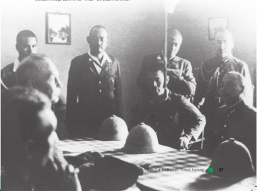

> **Deskripsi Visual:** Gambar ini adalah foto yang menunjukkan beberapa orang yang tampaknya sedang berada dalam situasi formal atau resmi. Di tengah-tengah foto, ada seorang pria yang duduk di meja, tampaknya sedang berbicara atau memberikan pernyataan kepada para penonton yang berdiri di sekitarnya. Para penonton tersebut tampaknya mengenakan pakaian formal atau militer, yang menunjukkan bahwa mereka mungkin merupakan anggota tertentu dari sebuah organisasi atau kelompok tertentu.

Elemen-elemen utama dalam gambar ini meliputi:
1. Seorang pria yang duduk di tengah-tengah meja.
2. Para penonton yang berdiri di sekitar meja.
3. Pakaian formal atau militer yang dikenakan oleh para penonton.
4. Latar belakang yang sederhana dengan beberapa pemandangan luar yang tampaknya menunjukkan tempat yang berada di luar ruangan.

Teks, angka, atau label penting yang terlihat dalam gambar ini tidak ada, sehingga informasi kunci yang dapat diambil pembaca hanya dari konteks visual saja.

Dari gambar ini, kita dapat mengambil beberapa informasi kunci seperti:
1. Ada kegiatan resmi atau formal yang sedang berlangsung.
2. Ada interaksi antara pria yang duduk dan para penonton.
3. Penonton tampaknya memiliki posisi atau status tertentu dalam konteks ini.
4. Latar belakang yang sederhana menunjukkan bahwa acara ini mungkin dilakukan di luar ruangan atau di tempat yang tidak terlalu disegarkan.

 

---
## 📄 Halaman 114

### Tugas:

- Berdasarkan  bacaan  pada  subbab  ini,  buatlah  peta  konsep  yang menunjukkan keterkaitan peristiwa di tingkat regional dan global dengan jatuhnya Hindia Belanda pada tahun 1942!

### Petunjuk Kerja:

- Kerjakan tugas secara (mandiri) individu di buku tulis atau media lainnya!
- Peta konsep dapat dibuat berwarna agar lebih menarik.
- Kalian boleh menggunakan berbagai sumber sejarah primer atau sekunder sebagai tambahan sumber untuk menyusun peta konsep.

### B. Penjajahan Jepang dan Transformasi Pemerintahan di Indonesia

Seperti  yang  telah  kalian  pelajari  sebelumnya,  Jepang  masuk  ke Indonesia secara bertahap. Serangan demi serangan mereka lakukan mulai dari daerah yang kaya sumber daya alam di Kalimantan, Sulawesi, Maluku, Sumatra, dan pulau-pulau lainnya hingga akhirnya mereka bisa menundukkan Belanda di Jawa yang kaya akan sumber daya manusia. Tahukah  kalian  bagaimana  cara  Jepang  mengontrol  Indonesia  yang begitu luas?

Tidak seperti Hindia Belanda yang memiliki pemerintahan yang terpusat,  Jepang  membagi  Indonesia  menjadi  tiga  wilayah  dengan pemerintahannya masing-masing. Daerah Sumatra dikuasai oleh Angkatan  Darat  ( Rikugun )  ke-25  dengan  pusatnya  di  Bukittinggi. Sementara itu, Jawa dan Madura di bawah Angkatan Darat ( Rikugun ) ke-16 yang berpusat di Jawa. Kalimantan dan wilayah Indonesia Timur

 

---
## 📄 Halaman 115

lainnya  dikuasai  oleh  Angkatan  Laut  ( Kaigun ).  Menurut  Kurasawa (2016),  kawasan  itu  adalah  satu-satunya  wilayah  penjajahan  Jepang yang dikontrol langsung oleh Angkatan Laut Jepang. Pemerintahan di masing-masih wilayah memiliki kebijakan yang sangat berbeda-beda.

Bagaimanakah  sambutan  bangsa  Indonesia  terhadap  masuknya Jepang?  Masyarakat  di  Indonesia  ternyata  memiliki  reaksi  yang beragam  terhadap  kedatangan  Jepang  di  Indonesia.  Sebagian  dari mereka menyambut dengan gembira kedatangan Jepang yang berhasil mengalahkan Belanda. Namun, ada pula yang menaruh curiga terhadap motivasi  Jepang  datang  ke  Indonesia.  Sikap  bangsa  Indonesia  yang berbeda-beda  ini  menunjukkan  adanya  keragaman  masyarakat  kita. Selain  itu,  perbedaan  sikap  ini  juga  terkait  dengan  pendekatan  dan propaganda Jepang yang dilakukan di masing-masing wilayah.

---
**🖼️ Gambar/Diagram**

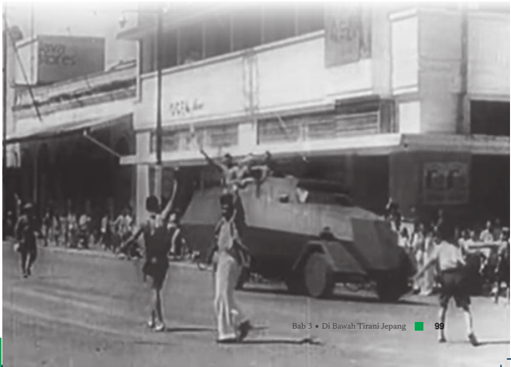

> **Deskripsi Visual:** Gambar ini adalah foto yang menunjukkan sebuah kendaraan berlengan bergerak melalui jalan raya. Kendaraan tersebut tampaknya merupakan kendaraan militer atau keamanan, karena memiliki lengan yang bisa ditarik untuk melindungi penumpangnya. Di sekitar kendaraan tersebut, ada beberapa orang yang sedang berdiri dan berdiri di samping jalan. Mereka tampaknya sedang mengikuti atau menyaksikan acara tersebut. Di sebelah kanan, terlihat sebuah bus yang tampaknya sedang berhenti atau bergerak lambat. Di sebelah kiri, terlihat bangunan dengan beberapa papan iklan dan spanduk. Gambar ini tampaknya berasal dari buku pelajaran tentang sejarah atau peristiwa tertentu, karena ada teks yang menyertai gambar yang membahas tentang "Di Bawah Tirani Jepang".

 

---
## 📄 Halaman 116

Kalian  bisa  mengerjakan  Aktivitas  4  untuk  lebih  memahami bagaimana Pemerintahan Jepang di berbagai wilayah dan sambutan rakyat kepada mereka.

### Penjajahan Jepang di Enrekang

Saat Jepang berhasil menduduki Sulawesi Selatan, hanya ada sedikit perlawanan  terhadap  pendaratan  Jepang,  baik  dari  pihak  militer Belanda maupun penduduk setempat. Bahkan, sebagian penduduk dan kaum nasionalis di Makassar memberikan penyambutan meriah kepada tentara Jepang. Hal ini terjadi karena sebelum perang Asia Timur Raya berlangsung, Jepang sudah mendekati penduduk setempat dan kaum nasionalis di sana dan meyakinkan bahwa Jepang akan membebaskan mereka dari penjajahan Belanda.

Ketika Jepang datang ke Enrekang, masyarakat lokal di sana juga menyambut  dengan  baik  karena  adanya  anggapan  bahwa  tentara Jepang  sebagai  penyelamat  bagi  mereka  dari  penjajahan  Belanda. Pada  awal  kedatangannya,  tentara  Jepang  berperilaku  dan  bersikap baik, misalnya dengan cara membagi-bagikan bahan makanan seperti gula pasir, susu, sabun, dan lain sebagainya. Pihak Jepang juga selalu mempropagandakan 'Nippon Indonesia sama-sama'.

Dari segi pemerintahan, Jepang tidak banyak melakukan perubahan dari sistem kolonial Belanda selain mengubah namanya menjadi istilah Jepang  dan  mengganti  pejabat  Eropa  dengan  orang Jepang,  sebagai contoh Ken Karikan (Asisten Residen), dan Bunken Karikan (kontroleur/ setingkat bupati).  Pejabat-pejabat  lokal yang  dipakai  di  masa  Hindia Belanda  tetap  menjalankan  tugasnya,  seperti  kepala  distrik  yang disebut Suco.

Bendera Merah Putih diizinkan berkibar bersama dengan bendera Jepang. Lagu Indonesia Raya juga boleh dinyanyikan bersama dengan lagu  kebangsaan  Jepang.  Dalam  urusan  agama,  pihak  Jepang  tidak melakukan  pembatasan.  Bahkan,  orang-orang  Jepang  yang  seagama

 

---
## 📄 Halaman 117

dengan penduduk lokal didatangkan, seperti Haji Umar Faisal (Islam), Pendeta Miahira (Protestan), dan Alaysius Ogihara (Katolik).

Situasi berubah pada 1943 saat Jepang mulai membangun bungker pertahanan untuk pasukan Jepang.  Jepang mulai melakukan pengerahan tenaga secara paksa untuk pembangunan pertahanan, menanam kapas  dan  pengerjaan  lahan  pertanian  untuk  memenuhi  kebutuhan makanan tentara Jepang. Kelaparan terjadi di mana-mana. Kebutuhan pakaian juga sangat sulit dipenuhi sehingga masyarakat lokal menutup badan  dengan  menggunakan  kulit  kayu.  Banyak  perempuan  yang diculik dan menjadi korban pelampiasan nafsu tentara Jepang. Tekanan semakin berat namun rakyat biasa tidak berani untuk melawan karena takut ditangkap, disiksa atau ditembak. Penduduk lokal sangat takut kepada Tokkeitai atau polisi militer Angkatan Laut Jepang yang terkenal kejam. Tindakan Jepang ini mematikan simpati yang pernah diberikan rakyat pada mereka.

Disarikan dari: Sahajuddin. (2019). Propaganda dan Akibatnya pada Masa Pendudukan Jepang di Enrekang (1942-1945). Walasuji , 10(2), 185-201.

### Penjajahan Jepang di Palembang

Palembang merupakan sebuah kota yang penting bagi Jepang selama masa  penjajahannya  karena  adanya  sumber  minyak  dan  posisinya yang strategis. Palembang yang ada di Pulau Sumatra berada di bawah penguasaan Angkatan Darat ke-25 yang berpusat di Bukittinggi. Pada mulanya kedatangan Jepang disambut dengan gembira oleh masyarakat lokal yang menganggap mereka sebagai liberator yang membebaskan Indonesia  dari  dominasi  kolonial  Belanda.  Meskipun  demikian,  ada pula perlawanan lokal yang langsung ditindas oleh tentara Jepang.

Dalam bidang pemerintahan, Jepang melakukan beberapa perubahan.  Jabatan-jabatan  tinggi  seperti  kepala  karesidenan  ( Syucookan ),  walikota  ( shi-coo ),  bupati  ( ken-coo ),  hingga  asisten  residen ( bunshu-coo ) yang tadinya diisi oleh orang Belanda digantikan dengan orang Jepang. Peranan orang pribumi hanya terbatas sampai kepada tingkatan gun-coo (wedana)  saja.  Struktur  pemerintahan  mulai  dari gun-coo , son-coo (camat), ku-coo (kepala desa), aza (kepala kampung) dan gumi (kepala RT/rukun tetangga) semuanya dijabat oleh orang-orang

 

---
## 📄 Halaman 118

pribumi dengan kriteria untuk gun-coo dan son-coo harus berasal dari orang-orang  elit  tradisional  setempat.  Sementara  untuk ku-coo , aza dan gumi adalah orang-orang yang dianggap memiliki kesetiaan paling tinggi terhadap pemerintahan militer Jepang.

Kepentingan utama Jepang di Palembang adalah untuk mendapatkan  minyak  buminya.  Saat  itu,  produksi  minyak  bumi  di Palembang mencapai 82% dari total produksi di Indonesia. Kebijakan ekonomi Jepang di Palembang diarahkan ke eksploitasi minyak dan mencegah  upaya  bumi  hangus  ladang-ladang  minyak  di  Palembang. Para kuli BPP (Badan Pembantu Pemerintah) dan romusha dari dalam dan  luar  Sumatra  dikerahkan  untuk  eksplotasi  minyak.  Namun, kehidupan mereka sangat menyedihkan karena kekurangan makanan dan pakaian. Banyak di antara mereka yang menggunakan karung goni atau kulit kayu sebagai pakaian.

Disarikan  dari:  Mita,  A.  (2019) Palembang  Shi pada  Masa  Pemerintahan  Militer  Jepang  Tahun  1942-1945, Lembaran  Sejarah, 15(2),  103-120;  dan  Abdullah,  dkk.  1991. Sejarah  Daerah  Sumatra  Selatan .  Palembang: Departemen Pendidikan dan Kebudayaan Propinsi Sumatra Selatan.

### Penjajahan Jepang di Jawa

Pada awalnya, Jepang menunjukkan sikap baik kepada penduduk Jawa untuk  mendapatkan  kepercayaan  mereka.  Di  sepanjang  jalan  yang dilalui tentara Jepang, penduduk menyambut mereka dengan kata-kata 'selamat datang' dan ' banzai ' ,  sebaliknya  tentara Jepang menyerukan 'hidup Indonesia'. Sambutan positif ini dapat dipahami sebagai ekspresi harapan  mereka  untuk  lepas  dari  cengkeraman  penjajahan  Belanda. Rakyat Jawa  juga  meyakini  ramalan Jayabaya yang  menggambarkan akan datangnya jaman baru yang lebih baik, akan tetapi akan ada masa peralihan yang didominasi oleh orang kerdil yang berlangsung selama hidup tanaman Jagung. Banyak orang yang mengidentifikasikan orang kerdil itu sebagai orang Jepang.

Dalam urusan pemerintahan, Angkatan Darat ke-16 yang berpusat di Jakarta melakukan berbagai langkah untuk melakukan transformasi sistem  pemerintahan.  Posisi  gubernur  jenderal  ditiadakan.  Seluruh Jawa dan Madura (kecuali Surakarta dan Yogyakarta) dibagi atas syu

 

---
## 📄 Halaman 119

(karesidenan), shi (kotapraja), ken (kabupaten), gun (kawedanan), son (kecamatan),  dan ku (desa/kelurahan).  Jabatan-jabatan  tinggi  yang tadinya diduduki oleh orang Belanda digantikan dengan orang Jepang dan  orang  Indonesia.  Sebagai  contoh,  jabatan  residen  yang  di  masa sebelumnya  hanya  bisa  dipegang  orang  Eropa  mulai  dipegang  oleh orang Indonesia, terutama dari kalangan elit lokal. Selanjutnya, pada 1944 Jepang mulai memperkenalkan tonarigumi (rukun  tetangga)  di Jawa.

Sikap Jepang kepada penduduk Jawa kemudian berubah. Jepang melakukan  mobilisasi  dan  pengerahan  tenaga  kerja  secara  paksa untuk  menunjang  perangnya.  Penduduk  di  Jawa  juga  diwajibkan untuk  menyerahkan  padi  untuk  kebutuhan  pasukan  Jepang.  Beras yang  diambil  Jepang  kemudian  dikirim  ke  wilayah  timur,  namun sayangnya pengiriman ini sering gagal karena serangan Sekutu. Oleh karenanya,  Jepang  memaksa  rakyat  menyerahkan  padi  lagi  untuk mengganti  kehilangan  tersebut.  Akibatnya,  penduduk  mengalami kekurangan gizi. Penduduk didorong untuk makan bahan makanan alternatif seperti singkong, jagung, dan ubi. Kekurangan pakaian juga terjadi  di  mana-mana  selama  penjajahan  Jepang  di  Jawa.  Berbagai penderitaan  ini  yang  kemudian  memancing  perlawanan  bangsa Indonesia.

Disarikan  dari:  Kurasawa,  A.  (2016). Masyarakat  &  Perang  Asia  Timur  Raya:  Sejarah  dengan  Foto  yang  Tak Terceritakan .Jakarta: Komunitas Bambu; Soejono, R.P. & Leirissa, R.Z. (2010). Sejarah Nasional Indonesia VI . Jakarta: Balai Pustaka; Yuliati, D. (2010). Sistem Propaganda Jepang di Jawa 1942-1945 . Semarang: Undip.

### Tugas:

- Setelah mencermati ketiga potongan bacaan di atas, identifikasilah persamaan dan perbedaan pemerintahan Jepang di wilayah Sumatra; wilayah Jawa dan Madura; serta wilayah Indonesia Timur!

### Petunjuk Kerja:

- Kerjakan  tugas  secara  mandiri  (individu)  dan  salinlah  format diagram venn ini di buku tulis kalian!

 

---
## 📄 Halaman 120

- Diskusikan hasil kerja kalian di kelas!
- Kalian boleh menggunakan sumber sejarah primer atau sekunder untuk mendukung pengerjaan tugas.
Wilayah Sumatera

...............................................

...............................................

...............................................

...............................................

.......................................

Persamaan

...............................................

...............................................

...............................................

...............................................

.......................................

Jawa dan Madura

........................................

........................................

........................................

........................................

..................................

Wilayah Indonesia Timur

........................................

........................................

........................................

........................................

..................................

Setelah mengerjakan aktivitas di atas, kalian tentunya sudah lebih memahami mengenai penjajahan Jepang di berbagai wilayah Indonesia. Realitas  penjajah  Jepang  di  berbagai  wilayah  di  Indonesia  ternyata beragam.  Bagaimana  dengan  di  daerahmu?  Apakah  mengalami  hal serupa seperti ketiga contoh di atas? Ketiga bacaan di atas hanyalah contoh kecil dari penjajahan Jepang dan transformasi pemerintahan yang mereka lakukan. Selain ketiga contoh di atas, tentu masih banyak narasi atau kisah lain tentang penjajahan Jepang.

Jika  tertarik,  kalian  dapat  mencermati  berbagai  sumber  sejarah mengenai peristiwa ini.

 

---
## 📄 Halaman 121

### Propaganda

Jepang  melancarkan  berbagai  bujuk  rayu  kepada  bangsa  Indonesia agar  mau  menerima  dan  membantu mereka dalam perang. Berbagai propaganda  dilancarkan  melalui  media  surat  kabar,  majalah,  poster, sandiwara,  film,  siaran  radio,  hingga  pengeras  suara  yang  dipasang di desa-desa. Jepang berusaha menunjukkan dirinya sebagai 'Saudara Tua' yang membantu membebaskan bangsa Indonesia dari cengkeraman Belanda. Selain itu, Jepang juga melancarkan propaganda dengan menyebut dirinya sebagai 'Cahaya Asia, Pelindung Asia, dan Pemimpin Asia'. Saat sudah semakin terdesak dalam perang, Jepang juga menjanjikan kemerdekaan untuk Indonesia agar bangsa kita mau terus membantu.

Sumber: Image Bank WW2 - NIOD - Beeldnummer 105504, 102082, 105327

 

---
## 📄 Halaman 122

Jika memiliki perangkat digital dan jaringan internet, kalian juga bisa menyaksikan berbagai film propaganda Jepang dengan cara memindai QR code berikut. Kalian harus  tetap  kritis  saat  menyaksikannya  karena  film-film tersebut dibuat untuk tujuan propaganda.

### C. Dampak Penjajahan Jepang di Berbagai Bidang

### 1.  Dampak di Bidang Sosial

Pada  dasarnya,  ada  dua  hal  yang  menjadi  prioritas  Jepang  saat menjajah  Indonesia.  Pertama,  menghapus  pengaruh-pengaruh  Barat di kalangan bangsa Indonesia. Kedua, memobilisasi bangsa Indonesia untuk  kepentingan  perang Asia  Timur  Raya.  Kedua  hal  ini  menjadi dasar  bagi  berbagai  kebijakan  Jepang  di  Indonesia  (Ricklefs,  2008). Oleh karena itu, bagi orang-orang Eropa (terutama orang Belanda) dan Indo (keturunan campuran bangsa bumiputera dan Eropa), kedatangan Jepang dilihat sebagai sumber malapetaka. Tahukah kalian apa yang terjadi  pada  orang-orang  ini?  Bagaimana  nasib  mereka  selama  masa penjajahan Jepang?

 

---
## 📄 Halaman 123

Pada masa awal penjajahan Jepang, orang-orang Eropa (termasuk Belanda dan Indo) serta beberapa orang Tionghoa ternyata menjadi sasaran amukan penduduk lokal di beberapa daerah seperti Cirebon dan Solo. Rumah dan tempat usaha mereka diserang dan dijarah oleh penduduk  lokal  (Aziz,  1955).  Dalam  situasi  peralihan  kekuasaan, kekerasan seringkali terjadi karena luapan emosi dan kurangnya kontrol. Tentara Jepang berusaha mencegah agar hal ini tidak meluas ke wilayah lain  dan  berubah  menjadi  revolusi  yang  tak  menguntungkan  bagi Jepang sendiri (Ricklefs, 2008). Selanjutnya, pihak Jepang menangkap orang-orang  Eropa  dan  mengirim  mereka  ke  kamp-kamp  interniran dengan kondisi yang menyedihkan. Beberapa tenaga ahli dari kalangan orang  Eropa  tetap  dipertahankan  untuk  membantu  Jepang,  namun saat  datang  penggantinya  dari  kalangan  orang Jepang  maka  mereka disingkirkan (Kurasawa, 2016). Bagi orang-orang Indonesia, rentetan peristiwa ini menunjukkan bahwa orang-orang kulit putih (Eropa) pun bisa  kalah.  Nantinya,  hal  ini  juga  memberikan  kepercayaan  diri  bagi bangsa  Indonesia  bahwa  bangsa  kita  juga  pasti  dapat  mengalahkan bangsa  Barat  (Inggris,  Australia,  dan  Belanda)  dalam  perjuangan mempertahankan kemerdekaan dari tahun 1945-1949.

Dengan penangkapan orang-orang Eropa dan berkuasanya Jepang, maka  terjadi  perubahan  struktur  sosial  masyarakat  secara  drastis. Untuk memahami lebih jauh tentang perubahan sosial ini, kalian dapat mengerjakan Aktivitas 5 berikut.

### Tugas:

- Bacalah secara kritis artikel dari Koran Asia Raya tanggal 8 Januari 1943 berikut!
- Bagaimanakah  perubahan  struktur  sosial  yang  terjadi  di  masa penjajahan Jepang? Apakah  kalian  setuju  dengan  penulis  artikel ini? Mengapa demikian?

 

---
## 📄 Halaman 124

### Petunjuk Kerja:

- Kerjakan tugas secara mandiri!
- Tulislah hasilnya di buku tulis dan diskusikan di kelas!
Sumber: Asia Raya, 8 Januari 1943, halaman 1, Koleksi Perpustakaan Nasional Republik Indonesia.

### 2.  Dampak di Bidang Pemerintahan

Saat Jepang mulai berkuasa, pejabat-pejabat kolonial yang berasal dari orang Eropa disingkirkan, namun orang Indonesia dipertahankan atau bahkan dipromosikan. Mereka dapat menduduki jabatan yang dulunya hanya untuk orang Eropa. Pada satu sisi, hal ini menguntungkan bagi sebagian orang Indonesia karena dapat memperoleh kekuasaan. Namun, di  sisi  lain  hal  ini  menjadikan  mereka  sebagai  kolaborator  Jepang yang  dalam  beberapa  hal  berarti  membantu Jepang  menindas  rakyat Indonesia.  Para  pejabat  lokal  ini  seringkali  berada  dalam  posisi  yang dilematis karena jika mereka tidak tunduk pada Jepang, mereka akan dihukum berat atau bahkan dibunuh. Setelah Jepang menyerah kepada Sekutu dan Indonesia merdeka, beberapa pejabat lokal menjadi sasaran kemarahan  rakyatnya  seperti  di  beberapa  kawasan  Sumatra  Timur (sekarang Sumatra Utara), Brebes, Tegal, dan Pemalang karena mereka dianggap ikut membantu Jepang menindas rakyat. Berbagai peristiwa tersebut  merupakan  bagian  dari  sejarah  kelam  Indonesia  yang  harus dicegah agar tidak berulang di masa kini dan masa yang akan datang.

 

---
## 📄 Halaman 125

Selain  transformasi  struktur  sosial  dan  pemerintahan,  tentu  saja masih banyak dampak penjajahan Jepang di Indonesia. Apakah kalian dapat menyebutkan dampak lain dari penjajahan Jepang di Indonesia? Kalian dapat mempelajari materi berikut untuk mengetahui berbagai dampak lain dari penjajahan Jepang baik yang positif maupun negatif.

### 3.  Dampak di Bidang Budaya dan Pendidikan

Seperti yang telah disebutkan sebelumnya, Jepang ingin menghapus pengaruh  Barat  di  Indonesia,  termasuk  dalam  bidang  bahasa  dan budaya.  Sebagai  gantinya,  Jepang  berusaha  mempromosikan  bahasa mereka  untuk  menggantikan  Bahasa  Belanda.  Hal  ini  salah  satunya dilakukan melalui pendidikan. Namun, karena kurangnya guru yang tersedia dan sedikitnya orang Indonesia yang bisa berbahasa Jepang, pada akhirnya Bahasa Indonesialah yang digunakan secara luas.

---
**🖼️ Gambar/Diagram**

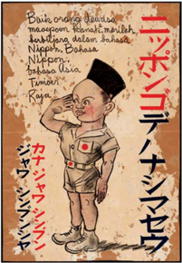

> **Deskripsi Visual:** Gambar ini adalah ilustrasi yang menampilkan seorang anak kecil berjalan dengan senyum lebar. Anak tersebut mengenakan pakaian seragam militer Jepang, termasuk topi berwarna merah dan baju berwarna putih dengan lencana tanda tangan. Latar belakangnya tampak seperti sebuah lapangan atau area permainan, dengan beberapa pohon dan bangunan kecil yang tidak jelas.

Elemen-elemen utama dalam gambar ini meliputi:
1. Anak kecil dengan pakaian seragam militer Jepang.
2. Latar belakang lapangan atau area permainan.
3. Pohon dan bangunan kecil yang tidak jelas.

Teks, angka, atau label penting yang terlihat dalam gambar ini adalah:
- "Nippon" (Jepang) pada bagian atas gambar.
- "Ryuu" (Ryu) pada bagian bawah gambar.

Informasi kunci yang dapat diambil pembaca dari gambar ini adalah bahwa gambar ini mungkin menggambarkan hubungan antara anak kecil dengan Jepang, mungkin sebagai simbol dari nasionalisme atau patriotisme. Namun, tanpa konteks lebih lanjut, sulit untuk menentukan maksud pasti dari gambar ini.

 

---
## 📄 Halaman 126

Karya sastra yang berbahasa Indonesia juga berkembang di masa penjajahan Jepang. Karya-karya itu misalnya berupa cerita bersambung, cerita  pendek,  dan  sajak  yang  dimuat  dalam  media  massa  yang disponsori oleh Jepang seperti majalah Djawa Baroe .  Selain  memuat karya sastra dan propaganda, majalah ini juga memuat cerita rakyat, esai, dan skenario film (Ensiklopedia Sastra Indonesia, 2016).

---
**🖼️ Gambar/Diagram**

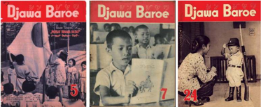

> **Deskripsi Visual:** Gambar ini adalah ilustrasi yang menampilkan sejumlah halaman buku pelajaran berjudul "Djawa Baroe". Setiap halaman memiliki judul yang sama dan menggambarkan berbagai karakter dan adegan yang terkait dengan topik pembelajaran tersebut.

1. **Apa yang Ditampilkan Secara Keseluruhan**: Gambar ini menunjukkan tiga halaman buku pelajaran yang berisi gambar dan teks. Setiap halaman memiliki judul yang sama dan menggambarkan berbagai karakter dan adegan yang terkait dengan topik pembelajaran tersebut.

2. **Elemen-Elemen Utama dan Relasinya**: 
   - **Judul**: Judul buku "Djawa Baroe" terlihat pada setiap halaman.
   - **Karakter dan Adegan**: Setiap halaman menggambarkan berbagai karakter dan adegan yang terkait dengan topik pembelajaran tersebut. Karakter tersebut tampaknya berperan dalam cerita atau situasi yang relevan dengan materi pembelajaran.
   - **Teks dan Angka**: Ada teks dan angka yang mungkin menyertai gambar-gambar tersebut, yang mungkin berisi informasi tambahan seperti judul bab, teks pembelajaran, atau nomor halaman.

3. **Teks, Angka, atau Label Penting yang Terlihat**: 
   - **Judul Buku**: "Djawa Baroe" yang tertera pada setiap halaman.
   - **Angka**: Angka-angka mungkin menunjukkan nomor halaman atau urutan bab dalam buku pelajaran.
   - **Teks**: Teks yang mungkin menyertai gambar-gambar tersebut, yang mungkin berisi informasi tentang materi pembelajaran.

4. **Informasi Kunci yang Dapat Diambil Pembaca**: 
   - Gambar ini menunjukkan bahwa buku pelajaran ini mungkin berfokus pada topik tertentu yang melibatkan karakter dan adegan yang relevan. Informasi tambahan yang mungkin diberikan oleh teks dan angka dapat membantu pembaca memahami konten pembelajaran lebih lanjut.

Secara keseluruhan, gambar ini menunjukkan tiga halaman buku pelajaran berjudul "Dj

Sumber: Asia Raya, 15 Januari 1943, hlm 1, Koleksi Perpustakaan Nasional

Dari segi pendidikan, Jepang menyederhanakan sistem persekolahan. Jika di masa penjajahan Belanda pendidikan formal sistem persekolahannya  sangat  rumit  dan  diatur  berdasarkan  ras,  Jepang menyeragamkannya  sehingga  lebih  egaliter. Kalian dapat melihat diagram di bawah ini untuk mengetahui sistem pendidikan di masa itu.

Sekolah Rakyat ( Kokkumin Gakko ) 6 tahun

Sekolah Menengah Pertama ( Shoto Chu Gakko) 3 tahun

Sekolah Menengah Atas ( Koto Chu Gakko ) 3 tahun

Sistem  itu  meniru  sistem yang  diterapkan  di Jepang.  Bagaimana menurut kalian? Apakah kalian mendapati kemiripan dengan jenjang pendidikan yang ada di Indonesia di masa kini?

 

---
## 📄 Halaman 127

---
**🖼️ Gambar/Diagram**

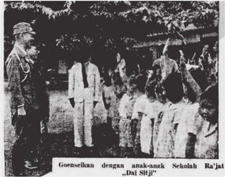

> **Deskripsi Visual:** Gambar ini adalah foto yang menunjukkan sekelompok orang sedang berdiri di depan sebuah bangunan. Di tengah foto, ada dua orang yang tampaknya sedang berbicara atau memberikan pernyataan kepada para penonton lainnya. Para penonton tampaknya berada di luar bangunan tersebut, dengan beberapa orang berdiri di belakang mereka. Di bawah foto, terdapat teks yang membaca "Goenselkan dengan anak-anak Sekolah Rajat..." dan "Dai Sitji". Elemen-elemen utama dalam gambar ini adalah dua orang yang berbicara, para penonton di luar bangunan, dan teks yang memberikan konteks tentang situasi tersebut. Informasi kunci yang dapat diambil dari gambar ini adalah bahwa ada pertemuan atau acara yang sedang berlangsung di depan bangunan tersebut, mungkin dengan tujuan edukasi atau sosialisasi.

Sumber: Asia Raya, 15 Januari 1943, hlm 1, Koleksi Perpustakaan Nasional

Selain  ketiga  sekolah  tersebut,  pemerintahan  penjajahan  Jepang sebenarnya  juga  menyediakan  sekolah  kejuruan,  sekolah  guru,  dan beberapa pendidikan tinggi. Namun, sekolah-sekolah tersebut menjadi kurang efektif karena suasana perang yang sedang berlangsung. Para pelajar dan mahasiswa diberikan latihan militer yang dianggap lebih penting  bagi  Jepang.  Suhario  Parmodiwiryo  (2015)  yang  pada  saat itu sedang menjalani pendidikan kedokteran menuliskan dalam memoarnya:

'Orang  Jepang  menginginkan  kami  para  mahasiswa  untuk membentuk 'kelompok kepemimpinan' dan berlatih di depan umum  dengan  gaya  militer,  untuk  memberi  kesan  kepada orang-orang bahwa sebagai pemimpin dalam masyarakat, kami bersedia  memperluas  kekuasaan  mereka.  Kami  tidak  ingin

 

---
## 📄 Halaman 128

berdebat di antara kami sendiri dan berusaha menghindarinya. Tetapi  Kempetai,  polisi  rahasia  Jepang  yang  paling  tangguh dan  paling  kejam,  memanggil  kami  dan  menjelaskan  bahwa mereka akan memastikan kami mematuhinya. Mereka memiliki kekuatan.  Kami  tidak  mungkin  berurusan  dengan  mereka kecuali kami menekan perasaan kami dan menerima kenyataan dominasi mereka.'

Dapatkah  kalian  membayang-kan  kesulitan  yang  dihadapi  oleh Suhario dan kawan-kawannya sesama mahasiswa kedokteran? Mereka yang pada awalnya hanyalah mahasiswa biasa kemudian terseret dalam pusaran perang dan dominasi Jepang yang begitu kuat sehingga tidak mampu melawan.

### 4.  Dampak di Bidang Militer

Selain sekolah-sekolah yang bersifat umum, Jepang juga mendirikan sekolah militer di berbagai tempat untuk melatih orang-orang Indonesia yang tergabung dalam organisasi militer dan semi militer. Ada beberapa organisasi militer penting yang juga didirikan oleh Jepang di Indonesia, yaitu Heiho (prajurit pembantu Jepang), PETA (Pembela Tanah Air) di Jawa, serta Giyugun di Sumatra (Imran, 2012). Beberapa organisasi semi militer  pun  didirikan  seperti Seinendan (Barisan  Pemuda  Indonesia) dan Keibodan (Organisasi  Keamanan).  Melalui  berbagai  pelatihan  di organisasi militer maupun semi militer inilah para pemuda Indonesia memiliki  bekal  keterampilan  militer  yang  nantinya  sangat  berguna pada  periode  berikutnya,  yaitu  saat  Indonesia  merdeka  dan  harus menghadapi kekuatan Sekutu (termasuk Belanda) yang datang setelah Jepang kalah perang.

### 5.  Mobilisasi Perempuan dan Tenaga Kerja

Pada  masa  penjajahan  Jepang,  kaum  perempuan  juga  dimobilisasi melalui  organisasi  yang  disebut  sebagai Fujinkai .  Para  perempuan dalam  organisasi  ini  diberikan  kesempatan  untuk  bergerak  dan

 

---
## 📄 Halaman 129

berorganisasi, namun tetap dalam pengawasan ketat dari Jepang. Coba kalian  perhatikan  gambar  di  bawah.  Apakah  yang  ibu-ibu Fujinkai lakukan? Apakah menurut kalian ibu-ibu ini bisa bekerja secara bebas atau dalam pengawasan?

. Komunitas Bambu

Para  perempuan Fujinkai diharapkan  membantu  Jepang  untuk memobilisasi massa, memberikan pengajaran kewanitaan, dan memberikan solusi atas persoalan sehari-hari yang terjadi di kalangan masyarakat.  Sebagai  contoh,  saat  terjadi  kelaparan,  ibu-ibu Fujinkai memperkenalkan  makanan  alternatif  berupa  bubur  campuran  yang dinamakan 'bubur perjuangan', 'bubur Asia Timur Raya', dan sebagainya (Kurasawa, 2016). Kosasih (2019) menyebut Fujinkai mempertemukan perempuan  Indonesia  dari  berbagai  kelas  sosial  sehingga  jangkauan komunikasi dan pergerakan perempuan menjadi semakin luas.

Selain mendapat kesempatan untuk bergerak, banyak juga perempuan  di  Indonesia  yang  menjadi  korban  kekejaman  tentara Jepang,  misalnya  dalam  bentuk Jugun  Ianfu .  Banyak  di  antara  para perempuan ini yang ditipu akan disekolahkan atau diberi pekerjaan.

 

---
## 📄 Halaman 130

Beberapa  di  antara  mereka  bahkan  diambil  paksa  atau  diculik  dari desanya  dan  kemudian  dijadikan  perempuan  penghibur  bagi  orang Jepang.

Tahukah  kalian  bahwa  fenomena  ini  tidak  hanya  terjadi di Indonesia?  Di  mana  lagi Jugun  Ianfu dapat  ditemukan  di  masa  itu? Fenomena Jugun Ianfu juga dapat ditemukan di daerah jajahan Jepang lainnya,  seperti  Korea  dan  Tiongkok.  Para  perempuan Jugun  Ianfu adalah korban perang. Nasib mereka sangat menyedihkan, banyak di antara mereka yang menderita penyakit fisik dan mental. Saat perang berakhir,  mereka  tidak  berani  bersuara  karena  berbagai  hal,  mulai dari trauma hingga rasa malu. Pada awalnya, pihak Jepang juga tidak mengakui masalah ini hingga pada bulan Desember 1991, tiga orang mantan Jugun  Ianfu dari  Korea  bersuara  dan  menuntut  permintaan maaf serta ganti rugi dari pemerintah Jepang (Tempo, 25 Juli 1992). Bagaimana  dengan  nasib  para  mantan Jugun  Ianfu di  Indonesia? Apakah mereka juga mendapatkan ganti rugi? Kalian dapat menelusuri berbagai sumber sejarah primer atau sekunder untuk menjawabnya.

Selain Jugun  Ianfu ,  penderitaan  di  masa  penjajahan  Jepang  juga dirasakan oleh para romusha .  Secara  harfiah, romusha berarti prajurit pekerja,  meskipun  dalam  kenyataannya  yang  mereka  jalani  adalah kerja  paksa.  Model  perekrutan romusha dilakukan  secara  terbuka melalui berbagai propaganda  Jepang. Beberapa  orang Indonesia tertarik untuk ikut menjadi romusha karena tertipu oleh propaganda Jepang yang ingin memakmurkan Asia Timur Raya. Namun, ada juga yang  menjadi romusha karena  terpaksa.  Beberapa  di  antara  mereka dipekerjakan  di  daerahnya  sendiri,  namun  ada  juga yang  dikirim  ke wilayah jajahan Jepang lainnya seperti ke Thailand dan Birma untuk proyek pembangunan rel kereta api atau proyek-proyek pembangunan lainnya. Keadaan mereka juga sangat menyedihkan karena beban para pekerja yang  berat  dan  kurang  sandang  maupun  pangan.  Banyak  di antara romusha yang meninggal saat bekerja dan tidak pernah kembali ke kampung halamannya.

 

---
## 📄 Halaman 131

### 6.  Beberapa Dampak Positif

Selama masa penjajahan Jepang, rakyat banyak mengalami tekanan dan penderitaan akibat sistem yang eksploitatif dan kejam. Meskipun demikian, penjajahan Jepang di Indonesia juga meninggalkan dampak positif  yang  masih  dapat  dirasakan  hingga  saat  ini,  misalnya  dalam bidang pertanian dengan diperkenalkannya sistem larikan (menanam mengikuti garis lurus) dalam penanaman padi.

### Selokan Mataram

Yogyakarta pernah dilanda banjir pada masa awal penjajahan Jepang,  yaitu  pada  bulan  November  1942.  Curah  hujan  yang  deras mengakibatkan  Kali  Serang  meluap  dan  membanjiri  desa-desa  di sekitarnya serta merusak areal persawahan. Dua bulan kemudian, banjir kembali  terjadi  dan  merusak  tanggul  dan  bendungan  di  sepanjang Sungai  Code,  Opak,  Progo,  Gajah  Wong,  dan  Kedung  Semirangan. Sultan  Hamengkubuwono  IX  yang  ingin  mengatasi  masalah  ini sekaligus  menyelamatkan  rakyatnya  dari  kewajiban romusha di  luar daerah  kemudian  mengusulkan  kepada  Jepang  untuk  membangun irigasi.  Pihak  Jepang  ternyata  mengijinkan  dan  memberikan  dana untuk membangun saluran dan pintu air untuk mengatur air hujan dari daerah yang tergenang ke laut serta membangun saluran-saluran untuk mengalirkan air dari Kali Progo ke daerah kering dan kekurangan air di wilayah Sleman ke arah timur.

Saluran  dan  pintu  air  ini  kemudian  dikenal  sebagai  selokan Mataram. Ada tiga manfaat yang dirasakan rakyat Yogyakarta dengan adanya pembangunan saluran ini, yaitu mencegah banjir, membantu wilayah yang kekurangan air, dan menghindarkan warga Yogyakarta dari kewajiban romusha di luar daerahnya. Hal ini karena pembangunan saluran sepanjang puluhan kilometer ini memerlukan banyak tenaga.

Sumber: Aryono. (2012, Desember 26). Rakyat Yogyakarta Diselamatkan Selokan . Historia. https://historia.id/ politik/articles/rakyat-yogyakarta-diselamatkan-selokan-v5n4P/page/1

 

---
## 📄 Halaman 132

Dalam periode singkat penjajahan Jepang di Indonesia, hubungan antara orang Indonesia dan Jepang tidak selamanya buruk. Tidak semua orang Jepang yang dikirim ke Indonesia pada saat itu adalah tentara, ada pula orang-orang sipil yang sengaja didatangkan dari Jepang untuk bekerja  di  berbagai  industri  dan  kantor  pemerintahan.  Ada  kalanya cinta bersemi dalam situasi yang sulit ini antara orang Indonesia dan Jepang  walaupun  sebenarnya  dilarang,  seperti  kisah  cinta  Yamada Kyo  dan  Mansur  di  Bukittinggi.  Dalam  bukunya,  Kurasawa  (2016) menyebutkan bahwa Kyo adalah seorang karyawan hotel yang dimiliki oleh  PT  Daimaru.  Ia  jatuh  cinta  dan  menikah  dengan  Mansur  yang merupakan seorang karyawan Indonesia di hotel itu.

### Gerakan Menabung

Pada masa penjajahannya, Jepang yang sedang dalam  suasana  perang  menganjurkan  rakyat Indonesia untuk berhemat dan  menabung. Jumlah penabung pun meningkat dengan pesat, namun jumlah uang  yang terkumpul tidak terlalu banyak.  Meskipun  demikian,  propaganda  ini menyebabkan  informasi tentang  menabung tersebar  hingga  ke  masyarakat  bawah  (Irianti, 2014)

### Andjoeran menaboeng

Oentoek mengandjoerkan rakjat berhemat dan membangoenkan semangat menaboeng. maka dengan bantoean Pangrehpradja di Kabocpaten Djatinegara pada tiap-tiap tanggal 8 akan didjoeal kartjis tanda menaboeng pnda rakiat oemoem. Kartjis ini diterima darlkantor Djakarta-Sjoeoe.

Pada tanggal S Djanoearl j.l,ada 5.000 kartjis dari1 sen,5.000 dnrl 2sen dan 2.500 dari 5 sen jang didjoeal.Melihat pendjoealan jang pertama Ini, bisa diharapkan pada tanggal 8 boelan ja.d. rakjat Djutinegara nkan lebih banjak lagi me. naboeng oeang.(Domel).

### Gambar 3.10. Anjuran menabung

Sumber: Asia Raya, 15 Januari 1943, hlm 2, Koleksi Perpustakaan Nasional

 

---
## 📄 Halaman 133

### Tugas:

- Lakukanlah penelitian sejarah sederhana dengan langkah-langkah seperti yang telah kalian pelajari di kelas X, yaitu heuristik, kritik, interpretasi, dan historiografi.
- Topik  penelitian  untuk  tugas  ini  adalah  dampak  pendudukan Jepang di lingkungan sekitar kalian.

### Petunjuk Kerja:

- Kerjakan tugas secara kolaboratif (berkelompok)!
- Hasilnya  dapat  berupa  poster,  esai,  video,  audio,  atau  bentuk lainnya sehingga dapat ditempel di mading kelas atau dibagikan secara digital melalui email/ google drive / google classroom .
- Diskusikan hasil kerja kalian di kelas!
Setelah  mempelajari  subbab  ini,  kalian  tentu  mengetahui  bahwa penjajahan Jepang sebenarnya penuh warna. Ada kalanya penjajahan Jepang membawa dampak positif, namun tak jarang pula membawa kesengsaraan. Periode penjajahan Jepang yang berat sebenarnya juga menunjukkan bahwa bangsa kita memiliki resiliensi yang tinggi. Bangsa Indonesia  memiliki  ketangguhan  yang  luar  biasa  untuk  bertahan  di tengah  berbagai  tekanan  dan  kontrol  yang  kuat  dari  pihak  Jepang. Tentu  saja  kita  tidak  ingin  mengalami  penderitaan  seperti  di  masa penjajahan Jepang dulu, namun resiliensi dari  para  pendahulu  dapat kita jadikan teladan untuk tetap tangguh dalam menghadapi berbagai krisis di masa kini maupun yang akan datang.

 

---
## 📄 Halaman 134

### D. Strategi Bangsa Indonesia Menghadapi Tirani Jepang

### 1.  Strategi Kerja Sama

Dalam menghadapi tirani Jepang selama 3,5 tahun, bangsa Indonesia menerapkan berbagai strategi, mulai dari menggunakan cara-cara halus hingga perlawanan terbuka. Kelompok nasionalis yang telah ada sejak masa pergerakan pun memiliki reaksi dan strategi yang berbeda dalam menghadapi  Jepang.  Pranoto  (2000)  mengklasifikasikan  mereka  ke dalam tiga kelompok. Pertama ,  kelompok moderat yang mau bekerja sama  dengan  Jepang  yang  kemudian  mendirikan  organisasi  Tiga  A. Kedua , kelompok radikal yang bergerak di bawah tanah, meliputi PKI (Partai Komunis Indonesia) dan PSI (Partai Sosialis Indonesia). Ketiga , kelompok  nasionalis  yang  setelah  dikeluarkan  dari  penjara  Belanda mau bekerja sama dengan Jepang, termasuk Sukarno dan Hatta.

Pada masa penjajahan Belanda, kedua tokoh ini memilih jalur non kooperasi atau menolak bekerja sama dengan Belanda. Namun, pada masa  penjajahan  Jepang,  mereka  mengambil  posisi  yang  berbeda melalui strategi kerja sama dengan Jepang. Selain Sukarno dan Hatta, tokoh  lain  yang  berjuang  melalui  jalur  kerja  sama  antara  lain  Muh. Yamin, Otto Iskandardinata, Mr. Sartono, G.S.S.J. Ratu Langi, Sutardjo Kartohadikusumo, Mr. Syamsudin, Dr. Mulia, dan sebagainya. Melalui strategi  kerja  sama,  mereka  berhasil  membangun  jejaring  sambil meneruskan perjuangan dalam batas-batas yang dimungkinkan (Hariyono, 2014).

Selain para  pemimpin nasionalis, kelompok lain yang juga dirangkul  oleh  Jepang  untuk  bekerja  sama  adalah  kelompok  Islam. Tahukah  kalian  mengapa  Jepang  berusaha  mendapatkan  dukungan dari kelompok ini? Sebelum menjajah, pihak Jepang sudah mempelajari situasi  di  Indonesia  dan  mereka  menyadari  pentingnya  unsur  Islam sebagai suatu kekuatan penting dalam masyarakat Indonesia (Imran,

 

---
## 📄 Halaman 135

2012). Oleh karenanya, mereka kemudian diberi sedikit ruang melalui organisasi MIAI (Majelis Islam A'laa Indonesia).

Tahukah  kalian  mengapa  sebagian  pemimpin  bangsa  Indonesia bersedia untuk  bekerja sama?  Sebenarnya, para  pemimpin  kita mengalami posisi yang dilematis dalam menghadapi Jepang. Sebagai pemimpin, tentu  saja  mereka  sangat  ingin  untuk  melindungi  rakyat dalam perjuangan menuju Indonesia merdeka. Namun di sisi yang lain, Jepang  sangat  keras  dan  kejam  dalam  menuntut  mereka  membantu perang Jepang. Dapatkah kalian membayangkan dilema yang mereka alami? Dalam situasi yang serba sulit, mereka menerima ajakan Jepang bekerja  sama  sambil  tetap  mencari  cara  untuk  mencapai  Indonesia merdeka.

Kelompok yang bekerja sama dengan Jepang ini kemudian menjadi  pemimpin  dari  berbagai organisasi bentukan Jepang seperti  Gerakan  Tiga  A,  Poetera, dan Jawa Hokkokai. Pada awalnya para tokoh nasionalis akan dimanfaatkan Jepang untuk membantu meraih simpati rakyat, namun para pemimpin kita justru mampu memanfaatkan sedikit ruang yang diberikan oleh Jepang  melalui  ketiga  organisasi itu untuk kepentingan bangsa Indonesia sendiri. Sebagai contoh, Sukarno berkesempatan untuk mengunjungi berbagai daerah

Sumber: Soedjono, R.P. dan Leirissa R.Z.  (2010)

dan  memberikan  pidato  yang  dapat  membangkitkan  nasionalisme. Meskipun demikian, kelompok yang bekerja sama dengan Jepang juga mendapat kritik dari kelompok yang bergerak di bawah tanah seperti para pemuda yang dekat dengan Syahrir. Mengapa demikian? Apakah kalian dapat menebak jawabannya?

 

---
## 📄 Halaman 136

Dalam bukunya, Hariyono (2014)  menjelaskan  bahwa  bagi  kelompok pemuda, tindakan Sukarno dan Hatta yang ikut mempropagandakan kepentingan perang Jepang sudah terlalu jauh dalam membela Jepang dan mengorbankan rakyat. Meskipun demikian, sebenarnya Sukarno maupun Hatta berada dalam posisi yang serba sulit. Para pemuda tidak banyak tahu bahwa sebenarnya kedua tokoh ini tidak hanya berusaha melindungi rakyat sebisa mereka, tapi juga berusaha membujuk Jepang agar  tidak  bersikap  terlalu  keras  kepada  kelompok  yang  tidak  mau bekerja sama.

### 2.  Strategi Perlawanan

Apakah kalian tahu apa yang dilakukan oleh kelompok-kelompok yang  tidak  mau  bekerja  sama?  Selama  masa  penjajahan Jepang,  ada banyak hal yang dilakukan oleh kelompok ini, mulai dari membangun jejaring,  menyebarkan propaganda anti Jepang, melakukan sabotase, meledakkan jalur kereta api, dan sebagainya (Pranoto, 2000). Ada pula kelompok-kelompok  yang  melakukan  perlawanan  terbuka  kepada Jepang.

Untuk lebih memahami strategi perlawanan dari beragam kelompok di berbagai daerah, kalian dapat mengerjakan Aktivitas 7 berikut.

### Perlawanan di Aceh

Perlawanan  terbuka  yang  dilatarbelakangi  oleh  alasan  agama  untuk pertama kalinya terjadi di Aceh. Hanya delapan bulan setelah beberapa tokoh setempat membantu kemudahan bagi Jepang masuk ke daerah mereka. Perlawanan itu terjadi di Cot Plieng, Bayu, dekat Lhokseumawe dipimpin oleh seorang ulama muda Tengku Abdul Djalil. Ulama yang memimpin madrasah ini menyamakan Jepang dengan setan-setan yang merusak  ajaran  Islam.  Ia  juga  menentang  kewajiban  melaksanakan seikeirei yang dianggapnya mengubah kiblat ke matahari.

 

---
## 📄 Halaman 137

Pada 10 November 1942 pasukan Jepang dikerahkan dari Bireun, Lhok Sukon, Lhokseumawe, ke Cot Plieng. Pasukan yang dilengkapi dengan  senapan,  mesin  berat,  mortar,  dan  jenis  senjata  api  lainnya itu  dihadapi  oleh  murid-murid  Abdul  Djalil  yang  pada  umumnya menggunakan senjata tradisional. Bersama dengan sebagian muridnya, Abdul Djalil menyingkir ke Blang Kampong Teungah. Tempat ini pun diserbu Jepang pada 13 November 1942. Teungku Abdul Djalil dan 19 orang pengikutnya tewas, sedangkan 5 orang lainnya tertangkap.

Sumber: Zed, M. (2012). Perang Pasifik dan Jatuhnya Rezim Kolonial Belanda, dalam Zed, M. & Paeni, M. (Eds). Indonesia  dalam  Arus  Sejarah  6:  Perang  dan  Revolusi .  Jakarta:  PT  Ichtiar  Baru  van  Hoeve  &  Kementerian Pendidikan dan Kebudayaan Republik Indonesia, hlm. 29.

### Perlawanan PETA di Blitar

Pada  14  Februari  1945,  Kota  Blitar  dikejutkan  dengan  kejadian yang menghebohkan. Sepasukan prajurit PETA (Pembela Tanah Air) pimpinan  Shodanco  Supriyadi,  Shodanco  Muradi  dan  Shodanco Sunanto  melakukan  perlawanan  terhadap  militer  Jepang. Selain perilaku  diskriminasi  dari  prajurit-prajurit  Jepang,  pemberontakan tersebut dipicu juga oleh kemarahan para anggota PETA terhadap pihak militer Jepang yang kerap membuat penderitaan terhadap rakyat.

Kendati gagal, namun tidak dapat dipungkiri jika pemberontakan tersebut  sempat  membuat  penguasa  militer  Jepang  ketar-ketir.  Itu terbukti saat mereka melakukan penumpasan, seluruh kekuatan militer Jepang  di  Blitar  dikerahkan,  bahkan  juga  melibatkan  unsur-unsur kavaleri dan infanteri dari wilayah lain.

Ketika pemberontakan itu gagal maka pihak Jepang menghukum sekeras-kerasnya  para  pelaku.  Dari  421  anggota  PETA  Blitar  yang terlibat  78  di  antaranya  langsung  dihukum  berat. Termasuk  Muradi dan Sunato yang dijatuhi hukuman mati pada 16 April 1945.

Supriyadi sendiri hingga kini masih tak jelas rimbanya. Beberapa kalangan meyakini bahwa sesungguhnya begitu pemberontakan berhasil  dipadamkan,  Supriyadi  langsung  ditangkap  dan  dihukum mati di suatu tempat yang dirahasiakan.

Sumber: Jo, H. (2018, February 15). Nasihat Menjelang Pemberontakan .  Historia.  https://historia.id/militer/ articles/nasihat-menjelang-pemberontakan-P944r

 

---
## 📄 Halaman 138

### Perlawanan di Kalimantan Barat

Perlakuan  kasar  serdadu  Jepang  terhadap  penduduk,  seperti  menjatuhkan hukuman jemur sampai pingsan terhadap orang yang hanya melakukan kesalahan kecil, merupakan sebab terjadinya perlawanan di  Kalimantan  Barat.  Kekejaman Jepang  semakin  meningkat  setelah Sekutu sejak permulaan tahun 1943 melancarkan serangan terhadap kedudukan  mereka.  Orang-orang  yang  dicurigai  ditangkap,  bahkan dihukum  pancung  di  muka  umum.  Pada  16  Oktober  1943,  kurang lebih  70  orang  mengadakan pertemuan di gedung bioskop Merdeka Sepakat di Pontianak. Mereka merencanakan mengadakan perlawanan pada  tanggal  8  Desember  1943.  Rencana  ini  diketahui  oleh  Jepang berkat  laporan  mata-mata  mereka.  Seminggu  setelah  pertemuan  di bioskop Merdeka Sepakat itu, Jepang melakukan penangkapan besarbesaran. Mereka yang ditangkap kemudian dibunuh, termasuk Sultan Pontianak,  Sjarif  Muhammad  Ibrahim  Sjafiuddin.  Di  antara  mereka ada  yang  dipancung.  Orang-orang  yang  dibunuh  itu  dikuburkan  di Mandor, dekat Pontianak.

Sumber: Zed, M. (2012). Perang Pasifik dan Jatuhnya Rezim Kolonial Belanda, dalam Zed, M. & Paeni, M. (Eds). Indonesia  dalam  Arus  Sejarah  6:  Perang  dan  Revolusi .  Jakarta:  PT  Ichtiar  Baru  van  Hoeve  &  Kementerian Pendidikan dan Kebudayaan Republik Indonesia, hlm. 32.

### Tugas:

- Dari  ketiga  bacaan  di  atas,  analisislah  faktor  yang  menyebabkan perlawanan  terhadap  Jepang!  Bagaimana  akhir  dari  perlawanan tersebut? Apakah para pejuang itu bisa mencapai yang mereka citacitakan?

### Petunjuk Kerja:

- Kerjakanlah tugas secara mandiri!
- Tulislah hasilnya di buku tulis kalian atau media lainnya!
- Diskusikan hasilnya di kelas!

 

---
## 📄 Halaman 139

Berdasarkan  berbagai  bacaan  dan  aktivitas  di  atas,  kalian  tentu sudah mengetahui bahwa perlawanan terbuka ternyata dapat dengan mudah ditindas oleh Jepang. Sementara itu, strategi kerja sama ternyata juga memberikan manfaat bagi perjuangan bangsa Indonesia. Tahukah kalian apa saja hasil-hasil positif yang didapat dari strategi kerja sama dengan Jepang?

### 3.  Pembentukan BPUPK

Dalam  perkembangannya,  Jepang semakin  terdesak  dalam  Perang Asia Timur Raya. Di tengahtengah situasi semacam itu, pihak Jepang semakin memerlukan dukungan  dari  bangsa  Indonesia. Agar bangsa kita mau terus membantu, maka Jepang memberikan janji kemerdekaan. Untuk merealisasikan janji itu, pemerintahan Jepang di Jawa yang  pada  saat  itu  paling  maju secara politik, membentuk BPUPK (Badan Penyelidik UsahaUsaha Persiapan Kemerdekaan). Meskipun berkedudukan di Jawa,  anggota  BPUPK terdiri atas berbagai golongan dan berasal dari berbagai daerah. Di antara mereka ada  yang  berasal  dari  golongan

---
**🖼️ Gambar/Diagram**

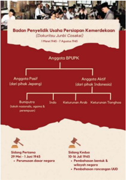

> **Deskripsi Visual:** Gambar ini adalah diagram yang menunjukkan struktur organisasi Badan Penyelidiki Usaha Persiapan Kemerdekaan (Dokumen Juri Bupati Cisarua). Diagram ini terdiri dari beberapa elemen utama:

1. **Struktur Organisasi**: Diagram ini menggambarkan struktur organisasi Badan Penyelidiki Usaha Persiapan Kemerdekaan dengan jelas. Ini termasuk Anggota BPUPK, Anggota Pasif (dari pihak Jepang), Anggota Akifif (dari pihak Indonesia), Bupati/Palembang (dari pihak Jepang), dan Sidang Terbuka.

2. **Elemen Utama dan Relasinya**: 
   - **Anggota BPUPK** berada di bagian atas diagram.
   - **Anggota Pasif** dan **Anggota Akifif** berada di bawah Anggota BPUPK.
   - **Bupati/Palembang** berada di bawah Anggota Pasif/Anggota Akifif.
   - **Sidang Terbuka** berada di bawah Bupati/Palembang.

3. **Teks, Angka, atau Label Penting**: 
   - Ada teks yang menjelaskan posisi dan peran masing-masing anggota dalam struktur organisasi.
   - Ada angka yang menunjukkan jumlah anggota dalam setiap kategori (misalnya, "7 Anggota BPUPK").

4. **Informasi Kunci**: 
   - Diagram ini memberikan gambaran tentang struktur organisasi Badan Penyelidiki Usaha Persiapan Kemerdekaan, menunjukkan hubungan antara anggota-anggota dan posisi mereka dalam organisasi tersebut.

Secara keseluruhan, gambar ini memberikan informasi yang penting tentang struktur organisasi Badan Penyelidiki Usaha Persiapan Kemerdekaan, memperjelas posisi dan peran masing-masing anggota dalam organisasi tersebut.

nasionalis,  golongan  agama,  peranakan  Arab,  peranakan  Tionghoa, Indo,  aristokrat,  jurnalis,  dan  sebagainya.  Selain  itu,  ada  dua  orang tokoh perempuan yang menjadi anggota BPUPK yaitu Siti Sukaptinah yang  merupakah  tokoh Fujinkai dan  Maria  Ullfah  yang  merupakan tokoh pergerakan perempuan sejak masa kolonial. Selain itu, ada juga

 

---
## 📄 Halaman 140

enam orang dari bangsa Jepang yang bertindak sebagai anggota pasif dari BPUPK.

Keberadaan BPUPK ini sangat besar artinya bagi perkembangan sejarah Indonesia nantinya. Peran utama BPUPK adalah merumuskan dasar negara dan konstitusi Indonesia. Sidang pertama BPUPK pada 29 Mei - 1 Juni 1945 membahas mengenai dasar negara. Dalam sidang tersebut, ada empat orang tokoh yang menyampaikan usulan tentang dasar negara, yaitu Muh. Yamin, Ki Bagus Hadikusumo, Supomo, dan Sukarno. Pada hari terakhir dari sidang itulah Sukarno menyampaikan gagasannya  tentang  dasar  negara  yang  ia  namakan  Pancasila.  Oleh karenanya,  setiap  tanggal  1  Juni  kita  memperingati  hari  lahirnya Pancasila.

---
**🖼️ Gambar/Diagram**

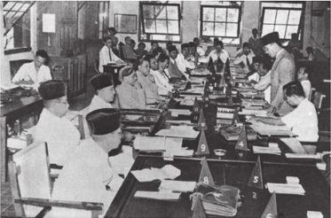

> **Deskripsi Visual:** Gambar ini adalah foto yang menunjukkan sebuah pertemuan formal di sebuah ruangan besar. Ruangan tersebut dilengkapi dengan meja panjang yang dipenuhi oleh beberapa orang yang tampaknya sedang berbicara atau mendengarkan sesuatu. Mereka duduk di sepanjang meja, dengan posisi yang rapi dan profesional. Di tengah-tengah ruangan, terdapat beberapa kursi tambahan yang tampaknya digunakan untuk tamu atau pengawas. Di sisi kanan, terdapat seorang pria yang tampaknya sedang memberikan pernyataan atau memberikan arahan kepada para peserta pertemuan. Di sebelah kiri, terdapat beberapa orang yang tampaknya sedang mendengarkan dengan serius. Seluruh ruangan tersebut tampak bersih dan teratur, menunjukkan bahwa acara ini diadakan dengan tujuan formal dan resmi.

Selain merancang dasar negara, BPUPK juga menyusun rancangan konstitusi atau Undang-undang Dasar (UUD) bagi Indonesia. Tahukah kalian bahwa ada tokoh perempuan yang berperan dalam perumusan UUD?  Apa  sumbangsih  yang  ia  berikan?  Seperti  yang  disebutkan

 

---
## 📄 Halaman 141

sebelumnya, Maria Ullfah merupakan salah satu tokoh perempuan yang tergabung dalam BPUPK.  Ia  adalah  perempuan  Indonesia pertama yang berhasil meraih gelar sarjana hukum  dari Universitas Leiden. Semasa penjajahan  Jepang,  ia  diajak  oleh  Supomo bekerja  di  Departemen  Kehakiman.  Saat pembentukan BPUPK, ia diajak  bergabung karena keahliannya di bidang hukum. Salah satu  kontribusi  penting  dari  Maria  Ullfah adalah usulannya mengenai persamaan hak antara perempuan dan laki-laki dalam negara Indonesia yang merdeka (Rasid, 1985). Atas  kegigihannya  dalam  memperjuangkan usulannya, maka dalam pasal  27  UUD 1945 disebutkan mengenai persamaan kedudukan warga negara dalam hukum dan pemerintahan.

Tokoh  perempuan  lain  yang  menjadi anggota BPUPK  adalah  Siti Sukaptinah. Ia adalah tokoh yang dikenal gigih memperjuangkan hak-hak perempuan Indonesia sejak masa kolonial. Ia ikut menyuarakan pentingnya Indonesia berparlemen  dan  agar  perempuan  dapat berpolitik  serta  duduk  di  parlemen.  Jika dalam  BPUPK  Maria  Ullfah  tergabung  di Panitia Pertama yang membahas UUD, Siti Sukaptinah  duduk  di  Panitia  Ketiga  yang membahas tentang pembelaan tanah air.

Setelah menyelesaikan tugasnya, BPUPK kemudian dibubarkan pada 7 Agustus 1945, hanya beberapa saat sebelum Jepang menyerah. Untuk melanjutkan tugasnya,

Sumber: Kedaulatan Rakyat, 29 Maret 1947

Sumber: Khastara Perpustakaan Nasional Indonesia

 

---
## 📄 Halaman 142

maka dibentuklah Panitia Persiapan Kemerdekaan Indonesia (PPKI). Sukarno  dilantik  secara  resmi  pada  12  Agustus  1945  sebagai  ketua PPKI saat Jepang sudah di ambang kekalahannya pasca pengeboman Nagasaki dan Hiroshima oleh Amerika.

Tahukah  kalian  bahwa  jumlah  anggota  PPKI  lebih  sedikit  dari BPUPK? Meskipun  demikian  mereka  terdiri  atas  perwakilan  berbagai golongan dari berbagai wilayah di Indonesia, bahkan ada pula anggota dari golongan Tionghoa yaitu Yan Tjwan Bing. Kita akan belajar lebih jauh mengenai PPKI pada bab selanjutnya. Mengapa demikian? Salah satunya karena peran PPKI akan lebih jelas terlihat setelah Indonesia merdeka.

Setelah mempelajari subbab ini, tentunya kalian mengetahui bahwa ada  berbagai  strategi  yang  digunakan  dalam  menghadapi  penjajah Jepang di Indonesia. Dalam situasi penjajahan Jepang yang mencekam, perlawanan secara terbuka ternyata sangat berbahaya. Sementara itu, jalan kerja sama dalam kapasitas tertentu bisa membawa manfaat bagi bangsa Indonesia. Meskipun menempuh jalan yang berbeda, namun sebenarnya tujuannya tetap sama yaitu mencapai Indonesia merdeka dan bebas dari penindasan bangsa asing.

### Tugas:

- Seandainya kalian adalah pemuda atau tokoh yang hidup di masa penjajahan  Jepang,  strategi  mana  yang  akan  kalian  pilih  dalam menghadapi Jepang? Mengapa kalian memilih jalan itu? Apa sajakah yang menjadi bahan pertimbangan kalian memilih strategi tersebut?
- Tuliskan jawaban kalian dalam bentuk esai singkat sekitar 300 500 kata!

### Petunjuk Kerja:

- Kerjakanlah tugas secara mandiri!
- Tuliskanlah hasilnya di buku atau media lainnya!
- Diskusikan esai kalian di depan kelas!

 

---
## 📄 Halaman 143

---
**🖼️ Gambar/Diagram**

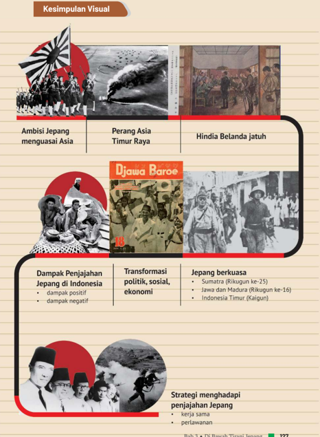

> **Deskripsi Visual:** Gambar ini adalah diagram yang menunjukkan berbagai aspek dari penjajahan Jepang di Indonesia. Diagram ini terdiri dari beberapa bagian utama:

1. Ambisi Jepang menguasai Asia: Ini menunjukkan gambaran umum tentang keinginan Jepang untuk menguasai Asia pada masa itu.

2. Perang Asia Timur Raya: Ini mungkin merujuk pada perang antara Jepang dan Uni Soviet pada tahun 1945.

3. Hindia Belanda jatuh: Ini menunjukkan bahwa koloni Hindia Belanda (sekarang Indonesia) telah jatuh ke tangan Jepang.

4. Djawa Baroe: Ini mungkin merujuk pada wilayah Jawa Barat yang dikuasai oleh Jepang.

5. Dampak Penjajahan Jepang di Indonesia: Ini mencakup dua poin utama - dampak positif dan negatif.

6. Transformasi politik, sosial, ekonomi: Ini menunjukkan bagaimana penjajahan Jepang mempengaruhi struktur politik, sosial, dan ekonomi Indonesia.

7. Jepang berkuasa: Ini mencakup daftar wilayah yang dikuasai Jepang, termasuk Sumatra, Jawa, dan Madura, serta Indonesia Timur.

8. Strategi menghadapi penjajahan Jepang: Ini mencakup dua poin utama - kerja sama dan perlawanan.

Informasi kunci yang dapat diambil pembaca melalui gambar ini adalah bahwa penjajahan Jepang memiliki dampak yang signifikan pada Indonesia, baik secara positif maupun negatif, dan bahwa ada strategi yang digunakan untuk menghadapi penjajahan tersebut.

 

---
## 📄 Halaman 144

### Pilihan Ganda

- Bacalah paragraf di bawah ini dengan cermat!
Dengan pernyataan perang terhadap Jepang, baik yang dinyatakan oleh pemerintah Hindia Belanda maupun oleh Kerajaan Belanda, secara resmi Indonesia sudah terseret ke dalam perang, walaupun tanpa pernyataan itu Indonesia juga tidak akan luput dari serbuan Jepang. Dalam ikhtisar kebijaksanaan nasional dasar Jepang yang disetujui Kabinet Konoye pada Juli 1940, nama Indonesia sudah dicantumkan.  Inti  ikhtisar  itu  antara  lain  ialah  usaha  Jepang menegakkan hegemoni dalam bidang politik dan ekonomi di Asia Timur, termasuk Indonesia. Ikhtisar itu kemudian dijabarkan dalam rencana tentatif bagi suatu kebijaksanaan mengenai daerah-daerah selatan. Dalam rencana yang dirumuskan Kementerian Angkatan Darat  pada  Oktober  1940  itu,  Indonesia  mendapat  perhatian khusus sebagai sumber minyak dan karet. Sumber-sumber itu harus dikuasai dengan cara menduduki Indonesia.

Sumber: Zed, M. (2012). Perang Pasifik dan Jatuhnya Rezim Kolonial Belanda, dalam Zed, M. & Paeni, M. (Eds). Indonesia dalam Arus Sejarah 6: Perang dan Revolusi .  Jakarta: PT Ichtiar Baru van Hoeve & Kementerian Pendidikan dan Kebudayaan Republik Indonesia, hlm. 15.

Berdasarkan  bacaan  di  atas,  apakah  alasan  Jepang  menyerang Indonesia?

- Ingin membebaskan Indonesia dari Belanda.
- Ingin menguasai kekayaan alam Indonesia.
- Ingin melakukan dominasi politik di Asia.
- Ingin menjadikan Indonesia sebagai koloni.
- Ingin menunjukkan supremasinya di Asia.
- Mengapa  pada  awalnya  sebagian  rakyat  Indonesia  menyambut gembira kedatangan Jepang?
- Karena Jepang berhasil mengalahkan Belanda.
- Karena Jepang adalah sesama bangsa Asia.

 

---
## 📄 Halaman 145

- Karena menghadapi musuh bersama.
- Karena rakyat Indonesia masih bodoh.
- Karena rakyat Indonesia mudah ditipu.
- Pada saat menjajah, sebenarnya jumlah orang Jepang di Indonesia hanya  sedikit.  Namun,  mengapa  mereka  bisa  menguasai  bangsa kita?
- Jepang memiliki sistem pemerintahan yang baik.
- Jepang mempunyai organisasi tentara yang solid.
- Jepang sudah terbiasa mengelola daerah kepulauan.
- Jepang memanfaatkan penguasa lokal untuk membantu.
- Bangsa Indonesia mudah diatur dan dikuasai.
- Salah  satu  warisan  penjajahan  Jepang  yang  masih  ada  hingga masa kini adalah sistem tonarigumi atau rukun tetangga. Mengapa Jepang menerapkan sistem tersebut?
- Untuk menciptakan pemerintahan langsung ( direct rule ).
- Untuk memudahkan pengawasan dan mobilisasi rakyat.
- Untuk meningkatkan kebersamaan di kalangan rakyat.
- Untuk melakukan kontrol secara langsung ke tingkat bawah.
- Untuk memudahkan sistem administrasi pemerintahan Jepang.
- Mengapa Jepang berhasil menggagalkan berbagai upaya perlawanan terbuka yang dilakukan oleh bangsa Indonesia?
- Perlawanan bangsa Indonesia kurang terencana dengan baik
- Perlawanan  bangsa  Indonesia  hanya  menggunakan  senjata tradisional
- Perlawanan bangsa Indonesia dilakukan secara sporadis
- Jepang  memiliki  kekuatan  kepolisian  dan  militer  yang  lebih baik
- Jepang memiliki jaringan mata-mata yang hebat

 

---
## 📄 Halaman 146

### Esai

- Mengapa Jepang menyerang Indonesia?
- Mengapa selama penjajahannya, Jepang membagi Indonesia menjadi tiga wilayah?
- Bagaimana dampak penjajahan Jepang terhadap sistem pendidikan di Indonesia?
- Mengapa terdapat perbedaan strategi di antara pemimpin Indonesia dalam menghadapi Jepang?
- Menurut  pendapat  kalian,  mengapa  Jepang  memberikan  janji kemerdekaan kepada Indonesia?

### Refleksi

Kalian telah belajar tentang dinamika sejarah masa penjajahan Jepang. Apa saja nilai-nilai yang kalian dapatkan setelah mempelajari bab ini? Bagaimana cara kalian mengaktualisasikan (menerapkan) nilai tersebut dalam kehidupan sehari-hari di masa kini dan masa depan?

 

---
## 📄 Halaman 147

KEMENTERIAN PENDIDIKAN, KEBUDAYAAN, RISET, DAN TEKNOLOGI REPUBLIK INDONESIA, 2021

Sejarah untuk SMA/SMK Kelas XI Penulis: Martina Safitry, Indah Wahyu Puji Utami, dan Zein Ilyas ISBN: 978-602-244-859-4  (jil.1)

### Proklamasi Kemerdekaan Bab 4

 

---
## 📄 Halaman 148

### G ambaran Tema

Bab ini membahas berbagai peristiwa sekitar kemerdekaan Indonesia. Bab ini diawali dengan pemaparan mengenai kondisi politik global dan kaitannya dengan peristiwa di tingkat nasional, terutama terkait janji kemerdekaan dari Jepang. Bagian berikutnya akan membahas      berbagai peristiwa menjelang proklamasi misalnya berita kekalahan Jepang dan peristiwa  Rengasdengklok,  dilanjutkan  dengan  pembahasan  tentang perumusan naskah dan peristiwa proklamasi kemerdekaan Indonesia. Bab ini kemudian ditutup dengan sambutan rakyat di berbagai daerah terhadap proklamasi kemerdekaan.

### Tujuan Pembelajaran

Setelah mempelajari bab ini, kalian diharapkan mampu menggunakan sumber-sumber  sejarah  untuk  mengevaluasi  secara  kritis  dinamika peristiwa  di  sekitar  proklamasi  kemerdekaan  serta  melaporkannya dalam  bentuk  tulisan  atau  lainnya.  Kalian  juga  diharapkan  mampu merefleksikan pelajaran yang kalian dapatkan dari peristiwa proklamasi untuk kehidupan di masa kini maupun masa depan.

 

---
## 📄 Halaman 149

### M ateri

- Kekalahan-Kekalahan Jepang A.
- Menuju Proklamasi Kemerdekaan B.
- Detik-Detik Proklamasi C.
- Sambutan Terhadap Proklamasi Kemerdekaan D.

### Pertanyaan Kunci

- Bagaimana  pengaruh  perkembangan  politik  global  terhadap kemerdekaan Indonesia? 1.
- Bagaimana peran berbagai kelompok dalam proklamasi kemerdekaan Indonesia? 2.

### Kata Kunci

Janji Kemerdekaan, Rengasdengklok, Proklamasi Kemerdekaan, Bebas dari Penjajahan.

 

---
## 📄 Halaman 150

Apakah kalian pernah mengikuti upacara bendera untuk memperingati proklamasi kemerdekaan  seperti foto di bawah?  Setiap tanggal 17  Agustus,  Indonesia  memperingati  hari  kemerdekaannya  yang merupakan  hasil perjuangan panjang dari para pendiri bangsa. Tahukah kalian bagaimana peristiwa sekitar proklamasi kemerdekaan berlangsung?  Apakah  benar  bahwa  kemerdekaan  Indonesia  adalah hadiah dari Jepang?

Gambar 4.1. Upacara Peringatan Kemerdekaan Indonesia di SMAN 2 Pati.

Sumber: http://sma2pati.sch.id/sma2pati/info-106-upacara-17-agustus-2017.html

---
**🖼️ Gambar/Diagram**

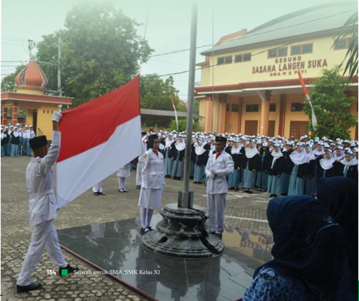

> **Deskripsi Visual:** Gambar ini adalah foto yang menunjukkan upacara bendera di sebuah sekolah. Dalam foto tersebut, terlihat banyak siswa dan guru yang berdiri rapi di depan gedung sekolah. Siswa-siswa sedang mengibarkan bendera merah putih dengan penuh hormat. Di sebelah kiri, seorang siswa sedang mengibarkan bendera, sementara siswa lainnya berdiri rapi di belakangnya. Di tengah-tengah foto, terdapat tiang bendera yang telah dipasang di atas fondasi batu. Di sekitar tiang bendera, terdapat beberapa pohon yang tampak hijau dan berdaun. Di bagian atas bangunan sekolah, terdapat tanda nama sekolah yang ditulis dalam bahasa Indonesia. Gambar ini menunjukkan kegiatan patriotisme dan kebersamaan antara siswa dan guru dalam upacara bendera.

 

---
## 📄 Halaman 151

### Kekalahan-Kekalahan Jepang

Proklamasi  yang  terjadi  pada  tanggal  17  Agustus  1945  merupakan tonggak penting dalam sejarah bangsa kita. Peristiwa ini merupakan pernyataan bangsa Indonesia yang merdeka dan tidak mau lagi berada di bawah penjajahan bangsa lain. Proklamasi kemerdekaan Indonesia terjadi hanya beberapa hari setelah Jepang menyatakan kalah kepada Sekutu.

Jepang sebenarnya mulai mengalami kekalahan sejak bulan Agustus  1942.  Namun,  mereka  masih  mampu  bertahan  dan  selalu mempropagandakan kemenangannya meskipun berbeda jauh dengan kenyataannya. Pengaburan bahkan pemutarbalikan informasi ternyata sudah terjadi di masa lalu. Bagaimana dengan di masa kini? Bagaimana sikap  kalian  dalam  menyikapi  informasi  yang  kalian  terima?  Tentu saja kalian harus senantiasa bersikap kritis dan tidak mudah percaya dengan informasi yang datang agar tidak teperdaya oleh berita bohong atau propaganda. Di masa lalu, para pendahulu kita disajikan berbagai berita  tentang  kejayaan  Jepang  dalam  perang  agar  bangsa  kita  mau membantu pihak Jepang.

Pihak Blok Poros (Axis) yang berhaluan fasis mengalami kekalahan di berbagai front dalam Perang Dunia II. Jepang semakin terdesak oleh kekuatan Sekutu di front Asia. Pihak Inggris, Amerika, dan Australia yang  tergabung  dalam  Blok  Sekutu  menyerang  Jepang  di  wilayahwilayah kekuasaannya dari berbagai penjuru. Jepang yang pada awalnya menerapkan strategi ofensif (menyerang) beralih pada strategi defensif (bertahan).

Kekalahan demi kekalahan terus diderita oleh Jepang. Oleh karena itu, Jepang kemudian menjanjikan kemerdekaan bagi bangsa Indonesia dan  mengizinkan  bendera  Indonesia  berkibar  serta  lagu  Indonesia Raya dikumandangkan agar terus mendapat bantuan dan dukungan dari rakyat Indonesia. Seperti yang kalian pelajari di bab sebelumnya,

 

---
## 📄 Halaman 152

Jepang bahkan membentuk BPUPK dan PPKI untuk mempersiapkan kemerdekaan Indonesia.

Sumber: Asia Raya , 9 September 1944, Koleksi Perpustakaan Nasional Republik Indonesia

Jepang semakin terdesak dalam perang. Banyak armada perangnya yang dikalahkan oleh Sekutu, baik di sekitar Pasifik maupun di wilayah Asia Tenggara. Salah satu pertempuran yang cukup memukul Jepang di Indonesia terjadi di Kalimantan. Tarakan, yang merupakan wilayah pertama yang dikuasai Jepang di Indonesia pada tahun 1942, diserang oleh  pihak  Sekutu.  Mereka  merebut  kembali  ladang-ladang  minyak yang  merupakan  fasilitas  strategis  dan  sangat  dibutuhkan  dalam perang dari tangan Jepang. Kota Tarakan hancur dan banyak di antara

口

 

---
## 📄 Halaman 153

warga lokal maupun orang Jawa serta keturunan Tionghoa di sana yang mengungsi akibat serangan ini.

Pada  bulan  Juli  1945,  Australia  menyerang  Balikpapan  yang merupakan  salah  satu  wilayah  penting  bagi  Jepang.  Ladang-ladang minyak yang tadinya direbut oleh Jepang dari pihak Belanda mendapat serangan dari pasukan gabungan Australia dan KNIL. Jepang akhirnya kalah  pada  21  Juli  1945.  Serangan  itu  tidak  hanya  menghancurkan pertahanan  Jepang,  tapi  juga  menambah  beban  dan  kesengsaraan bagi  rakyat.  Banyak  di  antara  mereka  yang  kelaparan  karena  tidak makan selama berhari-hari. Setelah Jepang menyerah, pihak Australia kemudian  membagikan  makanan  berupa  nasi,  biskuit,  kedelai  dan sebagainya kepada rakyat Balikpapan.

Selain  kedua  pertempuran  di  atas,  masih  ada  juga  beberapa pertempuran  yang  terjadi  di  wilayah  Indonesia  lainnya,  misalnya pertempuran  di  Morotai  yang  berlangsung  sejak  bulan  September 1944 hingga Mei 1945. Pertempuran ini berlangsung cukup lama dan merupakan salah satu pertempuran yang berat bagi Sekutu dan Jepang di Asia. Jika pertempuran di Tarakan dan Balikpapan yang memakan

 

---
## 📄 Halaman 154

waktu  beberapa  minggu  saja  dapat  mengakibatkan  kesengsaraan bagi  rakyat  Indonesia,  dapatkah  kalian  membayangkan  penderitaan rakyat kita akibat pertempuran Morotai yang berlangsung lebih lama? Tahukah  kalian  bahwa  ada  seorang  serdadu  Jepang  bernama  Teruo Nakamura  yang  bersembunyi  di  hutan  Morotai  selama  30  tahun hingga tidak mengetahui bahwa perang telah usai? Jika tertarik untuk mendalami lebih jauh tentang hal ini, kalian dapat mencari tahu melalui penelusuran berbagai sumber sejarah.

Pihak Sekutu tidak hanya menyerang Jepang di wilayah jajahannya, namun juga di negeri Jepang sendiri. Untuk mempelajari lebih lanjut tentang  serangan  Sekutu  yang  berhasil  memaksa  Jepang  menyerah, kalian dapat mengerjakan Aktivitas 1 berikut ini.

### Hiroshima, Nagasaki, dan Menyerahnya Jepang

Perang Dunia II telah berakhir di front Eropa sejak 7 Mei 1945. Namun, Jepang yang bertempur di Asia masih belum mau menyerah. Sebagai pukulan  terakhir  kepada  Jepang  untuk  segara  mengakhiri  perang, Amerika  Serikat  menjatuhkan  dua  bom  atom  di  kota  Hiroshima  (6 Agustus 1945) dan Nagasaki (9 Agustus 1945).

Jumlah korban yang meninggal di Hiroshima diperkirakan sebanyak  140.000  jiwa  dari  populasi  350.000  orang  di  Hiroshima. Sementara itu, setidaknya 74.000 orang kehilangan nyawa di Nagasaki. Radiasi yang dilepaskan bom ini menyebabkan ribuan orang meninggal dalam  hitungan  minggu,  bulan,  dan  tahun  sejak  peristiwa  tersebut. Tragedi bom di dua kota ini mengakhiri Perang Dunia II di Asia. Jepang mengumumkan menyerah tanpa syarat kepada Sekutu pada 15 Agustus 1945.

Sumber: BBC News Indonesia. (2020, 10 Agustus). Hiroshima dan Nagasaki: Peringatan 75 tahun tragedi bom atom dalam rangkaian foto . https://www.bbc.com/indonesia/dunia-53718074

 

---
## 📄 Halaman 155

### Tugas:

Peristiwa  pengeboman  Hiroshima  dan  Nagasaki  mengakhiri  Perang Dunia  II  di  Asia.  Mengapa  Jepang  menyatakan  menyerah  tanpa syarat  kepada  Sekutu?  Bagaimana  seandainya  Amerika  Serikat  tidak menjatuhkan bom di sana? Akankah perang berakhir pada bulan Agustus 1945?

### Petunjuk Kerja:

- Kerjakan tugas secara kolaboratif (berkelompok)!
- Tuliskan hasilnya di buku tulis kalian!
- Diskusikan hasilnya di kelas!
- Kalian  bisa  menggunakan  berbagai  sumber  untuk  menjawab permasalahan di atas.

### B. Menuju Proklamasi Kemerdekaan

### 1.  Pembentukan PPKI

Pada  saat  Jepang  sudah  berada  di  ujung  kekalahannya,  mereka membentuk  PPKI  yang  terdiri  atas  perwakilan  beberapa  kelompok di  Indonesia.  PPKI  bertugas  untuk  mempersiapkan  kemerdekaan Indonesia. Tidak seperti BPUPK yang anggotanya dipilih oleh pejabat militer Jepang di kalangan Angkatan Darat ke-16, anggota PPKI dipilih oleh Jendral Terauchi yang merupakan penguasa perang tertinggi di Asia  Tenggara.  Oleh  karenanya,  anggota  PPKI  berasal  dari  berbagai wilayah jajahan Jepang di Indonesia.

 

---
## 📄 Halaman 156

---
**🖼️ Gambar/Diagram**

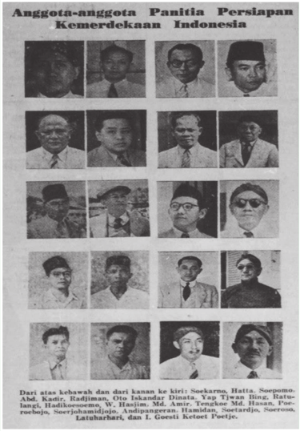

> **Deskripsi Visual:** Gambar ini adalah foto yang menampilkan anggota-anggota Panitia Persiapan Kemerdekaan Indonesia. Gambar tersebut terdiri dari 16 foto individu yang diperlihatkan secara horizontal dan vertikal. Setiap foto menampilkan wajah dan tubuh pria yang berbeda-beda, dengan penampilan yang bervariasi mulai dari pakaian formal hingga casual.

Elemen utama dalam gambar ini adalah foto-foto individu yang menggambarkan anggota-anggota panitia tersebut. Relasi antara elemen-elemen ini adalah bahwa setiap foto menunjukkan satu orang anggota panitia, dan semua foto disusun secara horizontal dan vertikal untuk membentuk satu skema yang rapi.

Teks yang ada pada gambar ini tidak terlihat secara langsung, tetapi informasi penting yang dapat diambil dari gambar ini meliputi nama-nama anggota panitia yang mungkin tertera di bawah setiap foto atau dalam teks yang tidak terlihat di sini. Informasi kunci yang dapat diambil dari gambar ini adalah bahwa ini adalah dokumentasi resmi dari anggota-anggota panitia persiapan kemerdekaan Indonesia, yang mungkin memiliki peran penting dalam proses mempersiapkan kemerdekaan Indonesia.

Dari gambar ini, kita dapat mengambil kesimpulan bahwa ini adalah dokumentasi resmi dari anggota-anggota panitia persiapan kemerdekaan Indonesia, yang mungkin memiliki peran penting dalam proses mempersiapkan kemerdekaan Indonesia.

Sumber: Asia Raya, 15 Agustus 1945

 

---
## 📄 Halaman 157

Pada  9  Agustus  1945,  Sukarno,  Moh.  Hatta,  dan  Radjiman Wedyodiningrat berangkat menuju Dalat (Vietnam). Mereka bertemu dengan Jenderal Terauchi pada 12 Agustus 1945. Apakah kalian tahu apa yang disampaikan oleh Terauchi kepada para pimpinan PPKI dalam pertemuan itu? Ia menyampaikan bahwa tidak lama lagi Jepang pasti akan  memberikan  kemerdekaan  kepada  Indonesia.  Oleh  karenanya, PPKI  dibentuk  untuk  mempersiapkan  pemberian  kemerdekaan  itu dan Indonesia diminta ikut berjuang bersama Jepang dalam perang.

Para  pemimpin  kita  kemudian  kembali  ke  Indonesia  pada  14 Agustus  1945.  Beberapa  surat  kabar  memberitakan  tentang  hal  ini. Pernyataan Sukarno bahwa Indonesia akan merdeka sebelum jagung berbunga diberitakan beberapa surat kabar. Apakah kalian tahu apa yang dimaksud dengan pernyataan itu?

---
**🖼️ Gambar/Diagram**

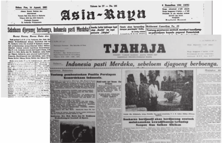

> **Deskripsi Visual:** Gambar ini adalah ilustrasi yang menunjukkan dua halaman berita dari surat kabar "Asia Raya" pada tahun 1945. Halaman pertama berisi tulisan "Tjahaja" dengan informasi bahwa Indonesia pasti Merdeka, sebelumnya digunggung berbohong. Halaman kedua menampilkan foto-foto orang-orang yang tampak sedang berdiri atau berjalan-jalan, mungkin sebagai warga negara atau pihak yang terlibat dalam peristiwa tersebut. Elemen-elemen utama dalam gambar ini adalah tulisan berita, foto-foto, dan judul berita yang menunjukkan peristiwa penting pada masa perjuangan kemerdekaan Indonesia. Informasi kunci yang dapat diambil pembaca melalui gambar ini adalah bahwa ada peristiwa penting yang terjadi pada tahun 1945 di Indonesia, yang kemungkinan besar berkaitan dengan kemerdekaan negara tersebut.

Judul berita yang ada di surat kabar seperti Asia Raya dan Tjahaja sebenarnya berasal dari pidato Sukarno saat ia dan pemimpin PPKI lainnya sampai  di  Bandara  Kemayoran  pada  14  Agustus  1945  sepulang  dari pertemuan dengan Terauchi di Saigon (Vietnam). Pada saat itu, Sukarno

 

---
## 📄 Halaman 158

menyampaikan  '…kalau  dahulu  saya  berkata  sebelum  jagung  berbuah Indonesia  akan  merdeka,  sekarang  saya  dapat  memastikan  Indonesia akan merdeka sebelum jagung berbunga' (Zuhdi, 2012). Pernyataan ini merupakan sebuah kiasan yang bermakna bahwa kemerdekaan Indonesia akan segera diproklamasikan dalam waktu dekat.

### 2.  Peristiwa Rengasdengklok

Sehari setelah kembalinya pemimpin PPKI ke Indonesia, Jepang menyerah  tanpa  syarat.  Pengumuman  resmi  mengenai  penyerahan Jepang kepada Sekutu baru diterima di Jakarta pada 15 Agustus 1945 sore  hari  (Pranoto,  2000).  Kelompok  pemuda  yang  ada  di  Jakarta kemudian  bergerak dan menginginkan proklamasi  kemerdekaan dikumandangkan secepatnya. Jepang telah kalah dan tidak ada gunanya lagi  menanti  'kemerdekaan  hadiah'  yang  dijanjikan.  Kalian  dapat mempelajari  lebih  lanjut  mengenai  pergerakan  berbagai  kelompok pemuda  dan  reaksi  dari  golongan  tua  hingga  terjadinya  Peristiwa Rengasdengklok melalui Aktivitas 2 berikut.

### Kerjasama: Pemuda dan Peta

Hari  Rabu  siang,  tanggal  15  Agustus  1945  di  Asrama  Mahasiswa Kedokteran,  Prapatan  10,  sejumlah  mahasiswa  berkumpul  untuk membicarakan  ketegasan  sikapnya  setelah  penyerahan  Jepang  dan pelaksanaan proklamasi. Menurut berita Radio Australia yang mereka dengar, Jepang telah menyerah pada Sekutu dan pada 15 Agustus akan diadakan penyerahan kekuasaan. Di dalam pertemuan itu dinyatakan bahwa proklamasi harus dilakukan Bung Karno dan Bung Hatta sedini mungkin dan lepas dari pengaruh Jepang.

Sore harinya,  sesuai  dengan  rencana,  sejumlah  pemuda  dan mahasiswa  mengadakan  rapat  di  ruang  Lembaga  Bakteriologi  Jl. Pegangsaan  Timur  17.  Rapat  dipimpin  oleh  Chaerul  Saleh  dan  di antara  yang  hadir:  Wikana,  Bonar  SK,  AB  Lubis,  Margono,  Darwis

 

---
## 📄 Halaman 159

Karimuddin,  Syarif  Thayeb,  Eri  Sudewo,  Chandra  Alif,  Wahidin, Subianto, dan Nasrun Iskandar.

Rapat  mempertegas  tuntutan  golongan  pemuda  agar  proklamasi segera  dilaksanakan  dan  dilepaskan  sama  sekali  urusannya  dari pengaruh Jepang. Mereka mengetahui bahwa Bung Karno dan Bung Hatta  akan  memproklamasikan  kemerdekaan  setelah  disetujui  rapat PPKI tanggal 16 Agustus 1945. Oleh karena itu, kedua tokoh harus didesak.  Hasil  rapat  ini  segera  disampaikan  pada  Bung  Karno  oleh wakil pemuda yang terdiri  atas Wikana, Darwis, Suroto Kunto, dan Subadio. Pertemuan ini tidak menghasilkan apa-apa sebab Bung Karno tetap kukuh pada pendiriannya untuk meminta persetujuan PPKI.

Para pemuda menyadari bahwa gerakannya harus didukung oleh kekuatan  senjata  dari  Peta  dan  Heiho.  Untuk  kepentingan  itu,  dua orang pemuda, yaitu Yusuf Kunto dan Surakhmat menghubungi asrama Peta  di  Jl.  Jagamonyet.  Mula-mula  permintaan  pemuda  ditolak  oleh Shodanco Singgih, tetapi permintaan itu berhasil setelah ia mendapat desakan dari Chaerul Saleh. Secara diam-diam Peta memberikan senjata kepada para pemuda yang disimpannya di asrama dan beberapa rumah mereka.

Pada  tengah  malam  para  pemuda  dan  mahasiswa  berkumpul  di Jl. Cikini 71 untuk membicarakan 'kegagalan' membujuk Bung Karno dan Bung Hatta. Mereka memutuskan untuk membawa dua pemimpin bangsa itu ke luar kota agar memproklamasikan di sana.

Sumber:  Pranoto,  S.W.  (2000). Revolusi  Agustus:  Nasionalisme  Terpasung  dan  Diplomasi  Internasional. Yogyakarta: Lapera Pustaka Utama. hlm. 50-51.

### Peristiwa Rengasdengklok

Pada malam hari tanggal 15 Agustus 1945, terjadi perbincangan yang menegangkan  antara  Wikana,  Caherul  Saleh,  Darwis  dan  kawankawan dengan Sukarno di kediamannya di Jl. Pegangsaan Timur No. 56,  Jakarta.  Mereka  mendesak  agar  Bung  Karno  dan  Bung  Hatta bersedia  memproklamasikan  kemerdekaan  tanpa  menunggu  sidang PPKI tanggal 16 Agustus 1945. Namun, kedua tokoh tersebut menolak

 

---
## 📄 Halaman 160

permintaan para pemuda. Setelah gagal meyakinkan kedua pemimpin tersebut, para pemuda mengadakan rapat di Cikini 71 dan bersepakat untuk 'mengasingkan' kedua tokoh ini ke Rengasdengklok. Bung Karno dan Bung Hatta dijemput oleh anggota Peta pada dini hari saat hendak makan sahur dan dibawa ke Rengasdengklok.

Hampir  sehari  penuh  Sukarno  dan  Hatta  berada  di  tempat itu.  Meskipun  para  pemuda  menginginkan  kedua  tokoh  itu  segera melaksanakan  proklamasi  tanpa  ada  kaitan  dengan  Jepang,  mereka tetap  tidak  berani  memaksakan  kehendaknya  kepada  kedua  tokoh tersebut.  Sekali  lagi,  para  pemuda  gagal  mendesak  agar  Bung  Karno dan Bung Hatta bersedia memproklamasikan kemerdekaan Indonesia di sana. Sementara itu, di Jakarta tercapai kesepakatan antara Ahmad Subarjo,  wakil  dari  golongan  tua,  dan  Wikana,  wakil  dari  golongan muda, agar proklamasi harus terjadi di Jakarta. Hal itu didukung pula oleh kesediaan Laksamana Muda Tadashi Maeda untuk menyediakan tempat tinggalnya sebagai tempat pertemuan dan bersedia menjamin keselamatan mereka.

Berdasarkan  kesepakatan  itu,  Ahmad  Subarjo  ditemani  Yusuf Kunto  berangkat  menuju  Rengasdengklok  menjemput  Sukarno  dan Hatta.  Sewaktu  rombongan  sampai  di  Rengasdengklok,  hari  sudah mulai gelap. Di tempat itu Ahmad Subarjo berhasil pula meyakinkan para  pemuda  bahwa  proklamasi  akan  diumumkan  pada  17 Agustus 1945. Dengan adanya jaminan dari Ahmad Subarjo, akhirnya Sukarno dan Hatta dilepaskan oleh para pemuda dan kembali ke Jakarta. Kedua tokoh ini sampai kembali di Jakarta pada malam harinya.

Sumber: Zuhdi, S. (2012). Proklamasi Kemerdekaan, dalam Zed, M. & Paeni, M. (Eds). Indonesia dalam Arus Sejarah 6: Perang dan Revolusi . Jakarta: PT Ichtiar Baru van Hoeve & Kementerian Pendidikan dan Kebudayaan Republik Indonesia, hlm. 118-120

### Tugas:

- Tulislah dan pentaskanlah naskah drama tentang Peristiwa Rengasdengklok  berdasarkan  bacaan  di  atas.  Beberapa  hal  yang

 

---
## 📄 Halaman 161

perlu  ditampilkan  dalam  drama  antara  lain  alasan  para  pemuda mendesak  Sukarno  dan  Hatta  agar  segera  memproklamasikan kemerdekaan, alasan golongan tua menolak permintaan golongan muda,  dan  negosiasi  antara  golongan  tua  dan  golongan  muda sehingga Sukarno dan Hatta dapat kembali ke Jakarta.

### Petunjuk Kerja

- Kerjakan tugas secara kolaboratif (berkelompok)!
- Tuliskan  naskah  drama/bermain  peran  di  buku  tulis  atau  media lainnya!
- Pentaskan naskah drama yang telah kalian susun di depan kelas atau  dalam  bentuk video,  film  pendek,  maupun bentuk lainnya!
- Kalian dapat menggunakan sumber sejarah primer dan sekunder untuk mendukung penyelesaian tugas ini.
Teks  bacaan  pada  Aktivitas  2  menunjukkan  adanya  perbedaan pendapat golongan tua dan golongan muda  terkait proklamasi kemerdekaan.  Bagaimana  pendapat  kalian  mengenai  perbedaan  itu? Perbedaan pendapat adalah hal yang wajar terjadi mengingat adanya perbedaan sikap dan strategi dalam menghadapi Jepang. Pengumuman kekalahan  Jepang  yang  mendadak  membuat  para  pemuda  bergerak untuk merebut momentum. Sementara itu, ketiadaan sikap tegas dan pengumuman resmi  dari  pemerintah Jepang  di  Indonesia  membuat golongan tua memilih bersikap hati-hati. Bagaimanapun juga, Jepang masih  memiliki  kekuatan  dan  persenjataan  di  Indonesia.  Meskipun demikian,  baik  golongan  tua  maupun  golongan  muda  sebenarnya memiliki tujuan akhir yang sama yaitu kemerdekaan Indonesia.

 

---
## 📄 Halaman 162

### C. Detik-Detik Proklamasi

Pada  bagian  sebelumnya,  kalian  telah  belajar  bahwa  Sukarno  dan Hatta  berhasil  kembali  ke  Jakarta  pada  16  Agustus  1945  malam hari.  Tahukah  kalian  apa yang  terjadi  selanjutnya?  Langkah-langkah apa  yang  dilakukan  oleh  golongan  tua  dan  golongan  muda  dalam mempersiapkan proklamasi kemerdekaan?

### 1.  Perumusan Naskah Proklamasi Kemerdekaan

Sukarno dan Hatta menyempatkan pulang ke rumah masing-masing sebelum berangkat kembali ke rumah Laksamana Maeda. Sementara itu,  Hatta meminta Subarjo untuk menghubungi anggota PPKI yang telah berkumpul di Jakarta untuk datang ke rumah Maeda pada tengah malam  untuk  melakukan  persiapan  proklamasi.  Setelah  sampai  di rumah Maeda, Sukarno dan Hatta berusaha menemui Mayor Jenderal Nishimura  untuk  menyampaikan  rencana  proklamasi  kemerdekaan. Namun, Nishimura tidak dapat memberikan jawaban yang memuaskan. Jepang telah menyerah dan diperintahkan untuk menjaga status  quo sehingga  tidak  dapat  merealisasikan  janji  kemerdekaannya  kepada Indonesia  (Pranoto,  2000).  Meskipun  demikian,  Nishimura  terkesan membiarkan  saja  para  pemimpin  Indonesia  melanjutkan  rencana proklamasi kemerdekaan tanpa dukungan resmi dari pihak Jepang.

### Laksamana Muda Tadashi Maeda

Benedict Anderson  dalam  bukunya yang  berjudul Java  in  a  Time  of Revolution: Occupation and Resistance, 1944-1946 menjelaskan secara singkat tentang sosok Laksamana Muda Tadashi Maeda. Dalam buku itu, Anderson menyebutkan bahwa Maeda pernah bertugas di Belanda

 

---
## 📄 Halaman 163

tahun 1940 sebagai Atase Angkatan Laut Jepang. Pada bulan Oktober 1940, Maeda datang ke Jakarta sebagai anggota Komisi Kobayasi yang bertugas untuk mencari suplai minyak dari Indonesia yang pada saat itu masih dikuasai Belanda. Dalam kunjungannya itu, Maeda memiliki misi rahasia untuk mengumpulkan informasi tentang rahasia militer Belanda dan menjalin kontak dengan tokoh-tokoh bumiputra. Maeda menyelesaikan misinya dan kembali ke Jepang pada bulan Juni 1941.

Saat Jepang menjajah Indonesia, Maeda dikirim kembali ke Jakarta pada bulan Agustus 1942 sebagai Kepala Kantor Penghubung Angkatan Laut Jepang. Di kantor ini, ia mempekerjakan beberapa tokoh Indonesia yang  nantinya  turut  terlibat  dalam  berbagai  peristiwa  menjelang proklamasi kemerdekaan seperti Ahmad Subarjo dan Wikana.

Ahmad Subarjo dalam bukunya yang berjudul Lahirnja  Republik Indonesia mengenang  Maeda  sebagai  sosok  yang  memiliki  politik yang berbeda dengan kebanyakan perwira Jepang. Pengalaman kerja Maeda di berbagai wilayah serta pekerjaannya sebelumnya di Tokyo yang sering terkait dengan masalah Indonesia sebelum perang turut memengaruhi pandangan pribadi dan sikap Maeda. Ia bersimpati pada perjuangan bangsa Indonesia dalam mencapai kemerdekaannya.

Setelah Koiso memberikan janji kemerdekaan, Maeda mendirikan Asrama  Indonesia  Merdeka  untuk  melatih  para  pemuda  dan  calon pemimpin  Indonesia.  Tindakan  ini  kemungkinan  diambil  karena ia  mendapat  pengaruh  dari  Ahmad  Subarjo  yang  bekerja  sebagai penasihatnya.  Beberapa  tokoh  nasionalis  Indonesia  diminta  untuk mengajar di sana. Maeda juga memfasilitasi perjalanan Sukarno dan Hatta  ke  berbagai  wilayah  di  Indonesia  dan  memberikan  mereka kesempatan untuk menyampaikan pidato yang membangkitkan nasionalisme Indonesia.

Maeda  memiliki  peran  yang  penting  dalam  peristiwa  di  sekitar proklamasi.  Ia  mengizinkan  rumahnya  digunakan  sebagai  tempat pertemuan.  Dalam  peristiwa  bersejarah  itu,  Maeda  undur  diri  ke kamarnya dan tidak ikut campur dalam perumusan naskah proklamasi.

 

---
## 📄 Halaman 164

Ia  juga  meminta  kepada  kepala  rumah  tangganya  agar  menyiapkan makanan  sahur  untuk  para  tamunya  karena  pada  saat  itu  sedang bulan Ramadhan. Satsuki Mishima (kepala staf rumah tangga Maeda) kemudian menyiapkan menu makan sahur berupa nasi goreng, ikan sarden,  telur  dan  roti.  Keterlibatan  Maeda  dalam  berbagai  peristiwa di sekitar proklamasi kemerdekaan Indonesia sebenarnya merupakan sebuah  tindakan  pribadi  karena  kedekatannya  dengan  tokoh-tokoh nasionalis Indonesia dan simpatinya terhadap perjuangan mereka.

Sumber: Anderson, B. (1972). Java in  a  Time  of  Revolution:  Occupation  and  Resistance,  1944-1946. Ithaca: Cornell University Press; Post, P., Frederick, W.H., Heidebrink, I., Sato, S. (2010). Encyclopedia of Indonesia in the Pacific War. Leiden: Brill; Djojoadisurjo, A.S. (1972). Lahirnja Republik Indonesia. Jakarta: PT Kinta.

Sukarno  dan  Hatta  kembali  ke kediaman Maeda dengan perasaan kecewa.  Pada  akhirnya  proklamasi kemerdekaan Indonesia memang harus tetap dilakukan, terlepas dari ada  atau  tidak  adanya  dukungan resmi dari pihak Jepang. Pada saat  itu  di  kediaman  Maeda  telah berkumpul anggota PPKI, para pemuda  dan  anggota Chuo  Sangiin (Dewan Pertimbangan Pusat). Meskipun  demikian,  tidak  semua orang  yang hadir terlibat  dalam perumusan draf awal naskah

proklamasi  kemerdekaan.  Hanya  ada  lima  orang yang  terlibat, yaitu Sukarno,  Hatta,  Ahmad  Subarjo,  Sukarni,  dan  Sayuti  Melik  (Zuhdi, 2012).

Setelah  naskah  awal  tersebut  berhasil  disusun,  Sukarno  membacakan hasilnya kepada semua yang hadir. Sebagian besar hadirin setuju dengan rumusan itu, tetapi golongan muda menganggap teks tersebut masih kurang tegas. Sukarni mengusulkan agar kalimat kedua diganti dengan 'Semua aparat pemerintahan yang ada harus direbut oleh rakyat dari

 

---
## 📄 Halaman 165

orang-orang asing yang masih mendudukinya' (Malik, 1970). Namun, setelah melakukan musyawarah dan mempertimbangkan berbagai hal, maka usulan  pemuda  tersebut  tidak  jadi  digunakan.  Setelah  dicapai konsensus tentang naskah proklamasi, Hatta menyarankan agar semua yang hadir menandatangani naskah yang bersejarah itu. Namun, atas usulan dari golongan pemuda, naskah itu ditandatangani oleh Sukarno dan Hatta sebagai wakil dari bangsa Indonesia.

### 2.  Proklamasi Kemerdekaan Indonesia

Tahukah kalian apa yang terjadi setelah naskah proklamasi disetujui? Para tokoh yang terlibat dalam perumusan naskah proklamasi kembali ke  kediaman  masing-masing  pada  pukul  05.00  pagi.  Para  pemuda selanjutnya membagi tugas untuk persiapan proklamasi. Beberapa di antara  mereka  mencetak  naskah  proklamasi  dengan  menggunakan fasilitas dari kantor berita Domei dan menyebarkannya (Malik, 1970).

Pada awalnya, para pemuda merencanakan pembacaan proklamasi di Lapangan Ikada (sekarang lapangan Gambir atau lapangan Monas).

 

---
## 📄 Halaman 166

Sumber: Indonesian  Press  Photo  Service (IPPHOS) koleksi Arsip Nasional Republik Indonesia

Namun, saat para pemuda sampai di sana, mereka mendapati lapangan itu dijaga ketat oleh tentara Jepang sehingga tidak mungkin proklamasi dibacakan di sana. Selain itu, banyak di antara para pemuda  yang tidak tahu bahwa  PPKI  telah  menyepakati pembacaan proklamasi dilaksanakan di rumah Sukarno di Jalan Pegangsaan Timur 56.

Sejumlah pemuda yang bergerak ke Lapangan Ikada mendapat informasi bahwa proklamasi akan dibacakan di rumah Sukarno sehingga mereka menuju ke sana. Beberapa prajurit Peta berjaga-jaga  di  sekitar  kediaman  Sukarno.  Suwiryo yang  merupakan Walikota Jakarta memerintahkan  Wilopo untuk  mempersiapkan pengeras suara dan mikrofon. Kedua alat itu berhasil didapatkan dari Gunawan yang merupakan pemilik toko radio Satria di Salemba ( Tempo , 1975). Suhud mempersiapkan sebatang bambu yang ada di belakang rumah dan dibersihkan untuk tiang bendera. Karena suasana tegang, ia lupa bahwa sebenarnya di depan rumah Sukarno masih ada dua tiang bendera yang dapat digunakan (Soedjono dan Leirissa, 2010).

Para  pemuda  yang  sudah  hadir  mulai  tidak  sabar  menunggu pembacaan proklamasi dan mendesak agar Sukarno membacakannya. Namun,  Sukarno  menolak  melakukannya  tanpa  kehadiran  Hatta. Hatta  datang  sekitar  lima  menit  sebelum  pukul  10.00.  Proklamasi kemerdekaan  Indonesia  kemudian  dilangsungkan  secara  sederhana. Sukarno  menyampaikan  pidato  secara  singkat  dan  membacakan naskah proklamasi.

 

---
## 📄 Halaman 167

---
**🖼️ Gambar/Diagram**

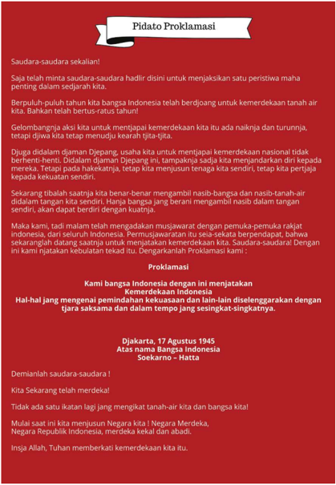

> **Deskripsi Visual:** Gambar ini adalah sebuah pidato proklamasi yang ditulis oleh Soekarno pada 17 Agustus 1945. Pidato ini berisi pernyataan penting tentang kemerdekaan Indonesia dan memproklamasikan kemerdekaan negara tersebut. Berikut adalah analisis lebih lanjut:

1. **Apa yang Ditampilkan Secara Keseluruhan**: Gambar ini menampilkan pidato proklamasi Soekarno yang ditulis dalam teks berformat dokumen resmi. Dokumen ini mencakup bagian teks utama, judul, dan penandatangan.

2. **Elemen-elemen Utama dan Relasinya**: 
   - **Judul**: "Pidato Proklamasi" yang terletak di bagian atas.
   - **Teks**: Bagian utama yang berisi pidato Soekarno tentang kemerdekaan Indonesia.
   - **Penandatangan**: Nama Soekarno dan Hatta ditandatangani di bawah teks.
   - **Tanggal**: 17 Agustus 1945 ditulis di bawah nama penandatangan.

3. **Teks, Angka, atau Label Penting yang Terlihat**:
   - Judul: "Pidato Proklamasi"
   - Penandatangan: Soekarno dan Hatta
   - Tanggal: 17 Agustus 1945

4. **Informasi Kunci yang Dapat Diambil Pembaca**:
   - Gambar ini menunjukkan pidato proklamasi penting yang dikeluarkan oleh Soekarno pada 17 Agustus 1945.
   - Pidato ini mengungkapkan pernyataan penting tentang kemerdekaan Indonesia dan memproklamasikannya.
   - Informasi ini sangat penting untuk memahami sejarah dan peristiwa penting dalam sejarah Indonesia.

Dengan demikian, gambar ini merupakan dokumentasi resmi dari pidato proklamasi penting yang dikeluarkan oleh Soekarno pada 17 Agustus 1945, yang membawa Indonesia ke masa kemerdekaan.

 

---
## 📄 Halaman 168

Acara dilanjutkan dengan  pengibaran bendera merah  putih. Bendera itu sudah disiapkan dan dijahit sebelumnya oleh Fatmawati setelah adanya janji kemerdekaan dari Koiso (Soedjono dan Leirissa, 2010).  Pada  awalnya,  S.K.  Trimurti  yang  diminta  untuk  mengerek bendera, namun ia menolak dan meminta Latief yang melakukannya dengan dibantu oleh Suhud (Jazimah, 2016). Pengibaran bendera itu diikuti dengan menyanyikan lagu kebangsaan Indonesia Raya.

Sumber: Indonesian Press Photo Service (IPPHOS) koleksi Arsip Nasional Republik Indonesia

Peristiwa proklamasi diabadikan dalam foto oleh Frans Mendur dan Alex Mendur yang pada saat itu berprofesi sebagai wartawan. Namun, foto-foto  karya Alex  dirampas  dan  dihancurkan  oleh  tentara Jepang sehingga foto-foto proklamasi yang dapat kita saksikan saat ini adalah hasil karya Frans Mendur. Jika kalian memiliki perangkat digital dan jaringan internet, kalian dapat menelusuri beberapa foto proklamasi secara daring pada laman Arsip Nasional Republik Indonesia berikut https://anri.sikn.go.id/index.php/proklamasi-kemerdekaan.

 

---
## 📄 Halaman 169

Peristiwa proklamasi kemerdekaan Indonesia berlangsung secara sederhana. Meskipun demikian, peristiwa ini sangat besar dampaknya bagi  bangsa  Indonesia.  Kalian  dapat  menggali  makna  proklamasi kemerdekaan Indonesia melalui Aktivitas 3 berikut.

### Tugas:

- Setelah  mempelajari  subbab  ini,  apakah  kalian  setuju  dengan pendapat yang menyatakan bahwa kemerdekaan Indonesia adalah pemberian dari Jepang? Mengapa demikian?
- Menurut  kalian,  apakah  makna  dari  proklamasi  kemerdekaan Indonesia untuk kehidupan kalian di masa kini dan masa depan? Apa  saja  nilai-nilai  yang  dapat  diteladani  dari  para  tokoh  yang terlibat dalam peristiwa sekitar proklamasi yang dapat diterapkan di kehidupan kalian?

### Petunjuk Kerja:

- Kerjakan tugas secara mandiri (individu)!
- Tuliskan hasilnya di buku tulis kalian dan/atau di media lain!
- Diskusikan hasilnya di kelas!
Peristiwa  proklamasi  kemerdekaan  Indonesia  sudah  sangat  lama berlalu.  Namun,  kita  sebagai  generasi  penerus  bangsa  masih  dapat merasakan dampaknya. Peristiwa proklamasi pada 17 Agustus 1945 merupakan sebuah pernyataan tegas dari bangsa Indonesia yang tidak mau lagi berada di penindasan bangsa asing. Kita yang hidup di masa kini  dapat  menikmati  kemerdekaan  itu  dan  tidak  harus  merasakan hidup di bawah penjajahan. Oleh karenanya, kita semua patut bersyukur atas kemerdekaan yang diperjuangkan dengan susah payah oleh para pendahulu kita.

 

---
## 📄 Halaman 170

### D. Sambutan Terhadap Proklamasi Kemerdekaan

### 1.  Penyebaran Berita Proklamasi

Proklamasi  kemerdekaan  yang  dikumandangkan  pada  17  Agustus 1945 berhasil disebarkan beritanya oleh F. Wuz melalui stasiun radio Domei. Pihak Jepang yang mengetahui hal ini memerintahkan untuk menghentikan  penyebaran  berita  itu.  Meskipun  demikian,  berita proklamasi  berhasil  sampai  di  beberapa  daerah  dan  diteruskan  ke masyarakat karena Waidan B Palenewen (Kepala Bagian Kantor Berita Domei)  memerintahkan  F.  Wuz  untuk  terus  menyiarkan  berita  itu setiap setengah jam hingga pukul 16.00 (Soedjono dan Leirissa, 2012). Untuk  menghindari  sensor  dari  tentara  Jepang,  ada  kalanya  berita proklamasi disebarkan dalam bahasa daerah, misalnya Radio Surabaya yang menyiarkan berita tersebut dalam Bahasa Madura yang tidak diketahui oleh Jepang (Padmodiwiryo, 2015).

Para pemuda di Jakarta yang terlibat dalam  peristiwa di  sekitar  proklamasi  kemerdekaan juga berhasil mencetak naskah  proklamasi  dan  menyebarkannya. Beberapa pemuda ditugaskan  sebagai  kurir  untuk mengantarkan  naskah  itu  dan menyampaikan berita proklamasi  kemerdekaan  Indonesia ke berbagai daerah. Berita proklamasi juga disebarkan melalui berbagai surat kabar yang beredar di masa itu.

 

---
## 📄 Halaman 171

---
**🖼️ Gambar/Diagram**

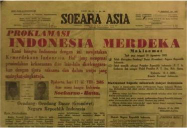

> **Deskripsi Visual:** Gambar ini adalah ilustrasi yang menunjukkan sebuah surat kabar berjudul "Soeara Asia" dengan judul utama "Proklamasi Indonesia Merdeka". Surat kabar tersebut tampaknya merupakan salah satu media yang mempublikasikan informasi penting tentang peristiwa proklamasi kemerdekaan Indonesia pada tahun 1945.

Elemen utama dalam gambar ini meliputi:
1. Judul Surat Kabar: "Soeara Asia"
2. Judul Utama: "Proklamasi Indonesia Merdeka"
3. Gambar Proklamasi: Gambar yang menunjukkan teks proklamasi yang ditandatangani oleh Soekarno dan Hatta pada tanggal 17 Agustus 1945.
4. Informasi Lainnya: Ada beberapa teks tambahan yang mungkin menyertakan detail lain tentang proklamasi tersebut, namun tidak jelas apa-apa.

Informasi kunci yang dapat diambil pembaca melalui gambar ini adalah bahwa ini adalah sebuah ilustrasi yang menunjukkan sebuah surat kabar yang mempublikasikan proklamasi kemerdekaan Indonesia pada tahun 1945. Ini menunjukkan bahwa media massa telah berperan penting dalam mempublikasikan informasi penting tentang peristiwa-proklamasi tersebut.

Sumber: Suara Asia, 19 Agustus 1945

Apakah kalian tahu bagaimana caranya berita proklamasi sampai di berbagai wilayah Indonesia yang sangat luas? Kalian dapat mempelajari mengenai hal tersebut melalui Aktivitas 4 berikut.

### Penyebaran Berita Proklamasi di Berbagai Wilayah Indonesia

### 1.  Jawa

Berita  proklamasi  kemerdekaan  Indonesia  tersebar  di  Pulau  Jawa  melalui berbagai cara, misalnya melalui telegram, siaran radio, selebaran, surat kabar, kurir, dari mulut ke mulut dan sebagainya. Penyebaran berita yang paling cepat dilakukan melalui telegram dari kantor berita Domei Jakarta  ke  berbagai  cabangnya  seperti  di  Bandung  dan  Yogyakarta yang diterima  17 Agustus 1945 pukul 12.00 siang. Penyebaran berita proklamasi yang juga berlangsung secara cepat melalui radio. Siaran

 

---
## 📄 Halaman 172

radio  dari  Jakarta  diterima  di  berbagai  daerah  di  Jawa,  misalnya di  Cirebon,  Surakarta,  Semarang,  Madiun,  Surabaya,  Malang,  dan sebagainya. Berita yang diterima dari Jakarta itu selanjutnya disiarkan melalui radio di wilayah masing-masing, maupun dari mulut ke mulut.

Para pemuda  yang ikut  terlibat  atau  mendengar  peristiwa  proklamasi kemerdekaan di Jakarta turut menyebarkan berita ke berbagai wilayah, misalnya Yakub Gani yang pergi ke Bekasi untuk menyebarkan berita gembira  tersebut.  Contoh  lain  adalah  Datuk  Jamin  dan  Sumanang yang merupakan utusan dari Asrama Menteng 31 untuk menyebarkan berita proklamasi ke Tangerang.

Penyebaran berita proklamasi di beberapa daerah juga dilakukan dalam kegiatan keagamaan, misalnya dilakukan setelah shalat berjamaah seperti yang terjadi di Bekasi. Contoh lain adalah penyebaran berita proklamasi melalui khutbah Jumat  17 Agustus 1945 yang terjadi di Masjid Besar Alun-alun Utara dan Masjid Pakualaman di Yogyakarta. Berita tersebut semakin tersebar luas berkat usaha Ki Hajar Dewantara dan  guru-guru  Taman  Siswa  yang  melakukan  pawai  sepeda  dan menyebarkan berita gembira tentang kemerdekaan Indonesia.

### 2.  Sumatra

Berita proklamasi tersebar di Sumatra melalui radio, telpon, kurir, dari mulut ke mulut, dan sebagainya. Sejak tanggal 17 Agustus 1945 malam, berita proklamasi telah sampai di Bukittinggi dan Padang melalui siaran radio.  Keesokan  harinya,  A.K.  Gani  mengirimkan  berita  proklamasi melalui telepon ke pimpinan buruh pertambangan minyak Jambi. Beliau juga menyebarkan berita itu ke Bangka Belitung di hari yang sama.

Para anggota PPKI yang berasal dari Sumatra (Teuku Mohammad Hasan, A. Abas, dan M.Amir) juga turut menyebarkan berita proklamasi. Mereka  kembali  dari  Jakarta  menggunakan  pesawat  terbang  dan mendarat  di  Palembang  pada  24  Agustus  1945.  Dari  sana,  mereka melanjutkan perjalanan melalui jalur darat ke wilayah masing-masing dan menyebarkan berita proklamasi kemerdekaan Indonesia.

 

---
## 📄 Halaman 173

### 3. Sunda Kecil (Bali dan Nusa Tenggara)

Berita proklamasi kemerdekaan Indonesia pertama kali diterima di Bali oleh para pemuda dan kelompok elite melalui siaran radio  17 Agustus 1945. Selain itu, I Gusti Ketut Pudja yang merupakan anggota PPKI juga membawa berita itu sekembalinya dari Jakarta. Ia mengumumkan secara resmi berita tersebut pada 23  Agustus 1945. Berita itu selanjutnya disebarkan melalui kurir ke Kupang pada akhir Agustus 1945 dan ke Pulau Sumbawa pada 2 September 1945.

### 4.  Kalimantan

Rakyat Kalimantan mengetahui tentang berita kemerdekaan Indonesia dari berbagai sumber dan media. Berita itu ada yang didapatkan melalui siaran radio seperti yang terjadi di Pontianak pada 18 Agustus 1945. Ada pula yang mendapatkan berita dari para pelaut yang datang dari Jawa ke beberapa pelabuhan seperti Sampit, Pangkalan Bun, Pagatan, Kuala Kapuas, dan Pulang Pisau.

Berita  proklamasi  kemerdekaan  Indonesia  sampai  di  Balikpapan melalui  para  pekerja  BPM  ( Bataviasch  Petroleum  Maatschappij )  yang datang dari Jawa untuk memperbaiki kilang minyak yang rusak akibat perang.  Di  wilayah  lain  seperti  Puruk  Cahu,  Martapura,  Marahaban dan Pelaihari, berita proklamasi justru dibawa oleh tentara Australia yang bertugas melucuti senjata tentara Jepang.

### 5. Sulawesi

Peristiwa  proklamasi  kemerdekaan  sebenarnya  sudah  didengar  di beberapa wilayah di Sulawesi melalui siaran radio  17 Agustus 1945. Namun,  berita  itu  belum  menyebar  secara  luas.  Penyebaran  berita secara  luas  baru  terjadi  setelah  kepulangan  para  pemimpin  Sulawesi dari  Jakarta.  Pada  20  Agustus  1945,  G.S.S.J.  Ratulangie  tiba  di Bulukumba.  Ia  dan  timnya  kemudian  menyebarkan  berita  tersebut ke utara, sementara penyebaran berita ke selatan dilakukan oleh tim Lanto Daeng Pasewang. Pada akhir Agustus 1945, berita proklamasi sudah menyebar di Maros. Berita itu juga dibawa oleh para pelayar dan pelaut yang datang dari Jawa pada bulan September 1945.

 

---
## 📄 Halaman 174

### 6.  Maluku dan Papua

Berita mengenai proklamasi kemerdekaan Indonesia terlambat diterima di  Maluku  dan  Papua.  Minimnya  sarana  dan  prasarana  komunikasi dan transportasi merupakan salah satu penyebab terlambatnya penyebaran berita proklamasi di sana. Berita proklamasi kemerdekaan baru diterima oleh para pemuda di Ambon pada bulan Oktober 1945.

Berita  proklamasi  justru  telah  sampai  terlebih  dahulu  di  Papua pada  akhir  Agustus  1945  melalui  pamlet  dan  siaran  radio  yang ditangkap  dari  Australia.  Pengasingan  Politik  Indonesia  ( Indonesian Political  Exile  Association atau  IPEA)  yang  diasingkan  oleh  Belanda ke Australia mengetahui tentang proklamasi kemerdekaan Indonesia melalui  siaran  radio.  Mereka  kemudian  membuat  selebaran  yang disebarkan  ke  Brisbane,  Sydney,  Melbourne,  Merauke,  Balikpapan, dan sebagainya. Dari Merauke inilah berita proklamasi kemerdekaan Indonesia disebarkan ke berbagai wilayah di Papua.

Disarikan dari: Abdurrakhman  dan  Setiawan,  A.  (2018). Atlas Sejarah Indonesia: Berita  Proklamasi Kemerdekaan.  Jakarta:  Kementerian  Pendidikan  dan  Kebudayaan;  dan  Zuhdi,  S.  (2012).  Proklamasi Kemerdekaan dalam Zed, M. & Paeni, M. (Eds). Indonesia dalam Arus Sejarah 6: Perang dan Revolusi. Jakarta: PT Ichtiar Baru van Hoeve & Kementerian Pendidikan dan Kebudayaan Republik Indonesia, hlm. 130-150.

### Tugas:

- Identifikasilah media atau penyebar berita proklamasi kemerdekaan di berbagai wilayah dalam tabel berikut!
- Jika  kalian  perhatikan,  berita  proklamasi  tidak  diterima  secara bersamaan di seluruh Indonesia. Mengapa hal ini terjadi?

---
**📊 Tabel**

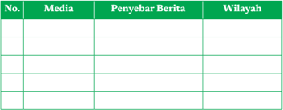

Tabel ini berisi informasi tentang media massa dan penyebaran berita di berbagai wilayah. Topik utamanya adalah tentang distribusi berita melalui berbagai media. Kolom-kolomnya mencakup No., Media, Penyebar Berita, dan Wilayah. Data penting yang terlihat adalah bahwa berita tersebar melalui berbagai media seperti radio, televisi, majalah, dan surat kabar. Selain itu, penyebaran berita ini juga dilakukan di berbagai wilayah, mulai dari kota besar hingga desa-desa kecil. Ini menunjukkan bahwa berita dapat diterima oleh masyarakat luas melalui berbagai saluran informasi.

 

---
## 📄 Halaman 175

### Petunjuk Kerja:

- Kerjakan tugas secara mandiri (individu)
- Salinlah tabel di atas dan kerjakan tugas di buku tulis kalian dan/ atau media lain.
- Diskusikanlah hasilnya di kelas.
- Kalian  dapat  menggunakan berbagai sumber sejarah primer dan sekunder untuk mengerjakan tugas ini.
Kalian telah belajar  mengenai  penyebaran  berita  proklamasi kemerdekaan Indonesia melalui aktivitas 4. Bagaimanakah penyebaran berita  proklamasi  di  daerah  kalian?  Apakah  penyebaran  proklamasi dilakukan  melalui  radio,  media  cetak  atau  dengan  cara  yang  lain? Tahukah kalian bagaimana sambutan masyarakat di berbagai daerah setelah mendengar berita proklamasi kemerdekaan tersebut?

### 2.  Sambutan  Terhadap  Berita  Proklamasi  di  Dalam Negeri

Berita  proklamasi  kemerdekaan  disambut  dengan  kebahagiaan  oleh sebagian besar rakyat Indonesia, terutama dari kalangan pemuda. Para pemuda yang diliputi euforia (perasaan  gembira)  kemerdekaan ingin segera mengambil alih kekuasaan dan persenjataan dari tangan Jepang. Beberapa di antaranya berjalan dengan damai atau tanpa perlawanan dari pihak tentara Jepang, namun ada pula yang disertai dengan konflik atau bentrokan bersenjata seperti yang terjadi di Surabaya.

Para pemuda melakukan perebutan senjata, kantor pemerintahan, dan  sarana  yang  strategis.  Selain  itu,  kelompok  pemuda  di  Jakarta memprakarsai rapat raksasa di Lapangan Ikada Jakarta yang berlangsung pada 19 September 1945. Dalam rapat yang diawasi secara ketat oleh tentara Jepang itu, Sukarno yang telah ditunjuk oleh PPKI sebagai presiden Indonesia menyampaikan pidato singkatnya. Setelah itu,  pemuda  dan  rakyat  yang  hadir  dalam  rapat  itu  meninggalkan Lapangan  Ikada  dengan  damai  tanpa  ada  bentrokan  seperti  yang sempat dikhawatirkan sebelumnya.

 

---
## 📄 Halaman 176

Pada  hari  yang  sama  di  Surabaya  terjadi  insiden  perobekan bendera. Pada saat itu tentara Sekutu telah datang dan membebaskan sebagian  orang  Eropa  yang  sebelumnya  menjadi  tawanan  perang Jepang. Beberapa di antara mereka menginap di Hotel Yamato. Orangorang Belanda juga mengalami euforia karena Jepang kalah dan mereka telah dibebaskan sehingga salah satu di antara mereka yang bernama Ploegman  mengibarkan  bendera  Belanda.  Residen  Surabaya  sempat memperingatkan  agar  bendera tersebut diturunkan, akan tetapi permintaan  itu  tidak  mendapat  tanggapan  yang  baik.  Oleh  karena itu,  para  pemuda  Surabaya  kemudian  menyerbu  hotel  tersebut  dan merobek  warna  biru  dari  bendera  Belanda.  Bendera  itu  kemudian dikibarkan kembali sebagai bendera Merah Putih.

Dukungan terhadap proklamasi kemerdekaan Indonesia datang dari Yogyakarta. Sri Sultan Hamengku Buwono IX dan Paku Alam VIII pada 19 Agustus 1945 menyampaikan selamat atas proklamasi kemerdekaan Indonesia. Kedua tokoh tersebut kemudian mengeluarkan amanat yang menyatakan dukungan terhadap pemerintah Republik Indonesia pada 5 September 1945. Dukungan terhadap kemerdekaan Indonesia juga ditunjukkan dengan pembentukan Komite Nasional Indonesia (KNI) Daerah di berbagai wilayah seperti di Aceh, Palembang, Yogyakarta, Surakarta, dan sebagainya.

Respon  dukungan  terhadap  proklamasi  kemerdekaan  Indonesia juga  diwujudkan  dalam  bentuk  grafiti  atau  tulisan  di  dinding  bangunan di berbagai kota. Grafiti itu menunjukkan semangat dan euforia kemerdekaan  Indonesia. Banyak di antara grafiti itu ditulis dalam Bahasa Inggris.  Tahukah  kalian  mengapa  sebagian besar grafiti itu dibuat  dalam  Bahasa  Inggris  oleh  orang  Indonesia?  Bukankah  pada saat itu belum banyak orang Indonesia yang mengerti Bahasa Inggris?

Abdulgani  (1973)  mengungkapkan  bahwa  para  pemuda  yang mengikuti  perkembangan  politik  luar  negeri  sudah  memperkirakan tentang kekalahan Jepang terhadap Sekutu. Mereka juga telah memperhitungkan  bahwa  tentara  Sekutu  akan  masuk  ke  Indonesia untuk melucuti tentara Jepang. Mereka juga mengetahui bahwa pihak

 

---
## 📄 Halaman 177

Sekutu  sejak  tahun  1941  telah  menyetujui Atlantic  Charter yang salah satunya menyebutkan bahwa semua bangsa memiliki hak untuk menentukan  nasib  sendiri.  Para  pemuda  sebenarnya  ingin  menarik perhatian pihak Sekutu dan dunia internasional terhadap perjuangan bangsa  Indonesia  untuk  merdeka  dan  menentukan  nasib  sendiri. Oleh karena itulah, banyak di antara semboyan-semboyan proklamasi kemerdekaan Indonesia yang ada di dinding bangunan ditulis dalam Bahasa Inggris.

---
**🖼️ Gambar/Diagram**

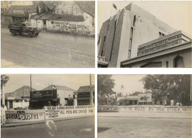

> **Deskripsi Visual:** Gambar ini adalah sebuah ilustrasi yang menunjukkan berbagai papan tulisan besar yang ditempel di dinding atau pagar di sepanjang jalan raya. Ilustrasi ini terdiri dari empat bagian yang masing-masing menampilkan papan tulisan dengan pesan-pesan yang berbeda tentang isu-isu sosial dan politik. Pada bagian pertama, ada papan tulisan yang menyatakan "WE ARE A PEOPLE NATION, CONSCIOUS OF OUR DUTY TO PROTECT ALL MEN AND WOMEN". Pada bagian kedua, ada papan tulisan yang menyatakan "SOCIAL JUSTICE", dan pada bagian ketiga, ada papan tulisan yang menyatakan "WE ARE ALL EQUAL". Pada bagian keempat, ada papan tulisan yang menyatakan "WE ARE ALL EQUAL, BUT WE ARE DIFFERENT". Semua papan tulisan ini menunjukkan perjuangan untuk memperjuangkan hak-hak sosial dan kesetaraan bagi semua orang.

Sumber: Indonesian Press Photo Service (IPPHOS) Koleksi Arsip Nasional Republik Indonesia

### 3.  Sambutan  Terhadap  Berita  Proklamasi  di  Luar Negeri

Berita  proklamasi  kemerdekaan  Indonesia  tidak  hanya  disambut gembira oleh bangsa Indonesia yang ada di tanah air, tapi juga oleh diaspora Indonesia di luar negeri. Sebagai contoh, orang-orang Indonesia yang berada di Mesir mendengar berita proklamasi

 

---
## 📄 Halaman 178

kemerdekaan Indonesia melalui siaran radio pada 18 Agustus 1945. Berita itu tidak hanya disambut gembira oleh orang Indonesia di sana, tapi juga oleh orang-orang Mesir yang mengulas dan memberitakannya dengan penuh simpati melalui media massa (Sulistiono, 2013).

Orang-orang  Indonesia  yang  berada  di  Australia  juga  gembira mendengar  berita  proklamasi  kemerdekaan  Indonesia  yang  mereka tangkap melalui siaran radio pada 18  Agustus 1945. Mereka menyatakan dukungannya  terhadap  proklamasi  kemerdekaan  Indonesia.  Orangorang Indonesia yang bekerja sebagai pelaut dan buruh pelabuhan di Australia melakukan mogok kerja dan menolak bertugas di kapal-kapal Belanda yang akan berangkat ke Indonesia karena mereka tidak ingin kembali  dijajah  Belanda.  Gerakan  pemogokan  ini  juga  diikuti  oleh buruh-buruh Australia yang mendukung kemerdekaan Indonesia.

Tahukah kalian bahwa gerakan solidaritas ini pernah didokumentasikan dalam sebuah film? Jika kalian tertarik, menyaksikan film dokumenter yang berjudul 'Indonesia Joris Ivens tahun 1946 pada tautan berikut https://www.youtube.com/ watch?v=kOANnt5KF4Q.

kalian dap

Calling'

---
**🖼️ Gambar/Diagram**

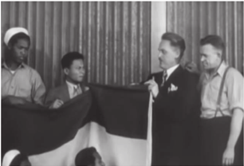

> **Deskripsi Visual:** Gambar ini adalah foto yang menunjukkan beberapa orang yang sedang berdiri di depan sebuah bendera. Benda ini tampaknya merupakan bagian dari sebuah acara resmi atau perayaan. Di sebelah kiri, ada dua orang yang sedang berbicara atau memberikan pidato, sementara di sebelah kanan ada dua orang yang tampaknya mendengarkan atau menyaksikan acara tersebut. Bendera yang mereka bawa tampak besar dan mencolok, menunjukkan bahwa ia memiliki makna penting dalam konteks ini. Teks, angka, atau label penting tidak terlihat dalam gambar ini. Informasi kunci yang dapat diambil pembaca adalah bahwa ini mungkin merupakan sebuah acara resmi atau perayaan di mana bendera menjadi simbol penting.

karya

 

---
## 📄 Halaman 179

### Kesimpulan Visual

---
**🖼️ Gambar/Diagram**

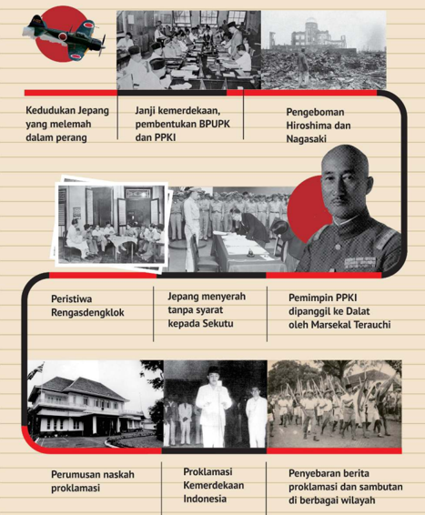

> **Deskripsi Visual:** Gambar ini adalah diagram yang menunjukkan berbagai peristiwa penting dalam proses kemerdekaan Indonesia dari Jepang. Diagram ini terdiri dari beberapa bagian yang masing-masing menunjukkan peristiwa tertentu:

1. **Kedudukan Jepang yang melemahkan dalam perang**:
   - Gambar pertama menunjukkan logo Jepang dengan pesawat tempur.
   - Gambar kedua menunjukkan pertemuan antara orang-orang di meja rapat.

2. **Janji kemerdekaan, pembentukan BPUPK dan PPKI**:
   - Gambar ketiga menunjukkan pertemuan orang-orang di meja rapat.
   - Gambar keempat menunjukkan bangunan dengan beberapa orang di luar.

3. **Pengeboman Hiroshima dan Nagasaki**:
   - Gambar kelima menunjukkan bangunan yang hancur setelah serangan nuklir.
   - Gambar keenam menunjukkan orang-orang di meja rapat.

4. **Peristiwa Rengasdengklok**:
   - Gambar ketujuh menunjukkan bangunan dengan beberapa orang di luar.
   - Gambar kesembilan menunjukkan pertemuan orang-orang di meja rapat.

5. **Jepang menyerahkan tanpa syarat kepada Sekutu**:
   - Gambar kesepuluh menunjukkan pertemuan orang-orang di meja rapat.
   - Gambar ke-11 menunjukkan bangunan dengan beberapa orang di luar.

6. **Pemimpin PPKI dipanggil ke Dalat oleh Marsekal Terauchi**:
   - Gambar ke-12 menunjukkan pertemuan orang-orang di meja rapat.
   - Gambar ke-13 menunjukkan bangunan dengan beberapa orang di luar.

7. **Perumusan naskah proklamasi**:
   - Gambar ke-14 menunjukkan pertemuan orang-orang di meja rapat.
   - Gambar ke-15 menunjukkan bangunan dengan beberapa orang di luar.

8. **Proklamasi Kemerdekaan Indonesia**:
   - Gambar ke-16 menunjukkan pertemuan orang-orang di

 

---
## 📄 Halaman 180

### Pilihan Ganda

- Pada  1944,  Perdana  Menteri  Koiso  berjanji  akan  memberikan kemerdekaan kepada Indonesia di kemudian hari. Selain itu, pihak Jepang juga mengizinkan bendera merah putih berkibar. Apa alasan Jepang melakukan hal itu?
- Jepang ingin membantu Indonesia agar merdeka.
- Jepang tidak ingin Indonesia dijajah bangsa Eropa.
- Jepang ingin mendapat dukungan bangsa Indonesia.
- Jepang ingin dianggap sebagai pembebas Indonesia.
- Jepang tidak ingin Indonesia jatuh ke tangan Sekutu.
- Para pemuda yang mendengar berita menyerahnya Jepang kepada Sekutu lantas menginginkan  kemerdekaan  Indonesia diproklamasikan secepatnya hingga berujung pada peristiwa Rengasdengklok. Apa alasan para pemuda mendesak Sukarno dan Hatta agar memproklamasikan kemerdekaan secepatnya?
- Indonesia sudah terlalu lama dijajah oleh bangsa-bangsa asing.
- Kemerdekaan  adalah  hak  segala  bangsa  dan  dijamin  dalam Atlantic Charter.
- Proklamasi kemerdekaan adalah peristiwa yang bersejarah bagi Indonesia.
- Jepang sudah tidak mungkin menepati janji kemerdekaannya.
- Bangsa Indonesia harus merebut kesempatan dan menentukan nasib sendiri.
- Setelah kembali dari Rengasdengklok, Sukarno dan Hatta berusaha menemui  Jenderal Nishimura untuk menyampaikan  rencana proklamasi kemerdekaan Indonesia. Bagaimana reaksi Nishimura pada saat itu?

 

---
## 📄 Halaman 181

- Mendukung  secara  penuh  rencana  proklamasi  kemerdekaan Indonesia.
- Melarang  secara  tegas  Sukarno  dan  Hatta  meproklamasikan kemerdekaan.
- Menghalang-halangi rencana proklamasi kemerdekaan bangsa Indonesia.
- Menolak  menemui  Sukarno  dan  Hatta  karena Jepang  sudah kalah perang.
- Tidak secara tegas mendukung atau menolak rencana proklamasi kemerdekaan.
- Perhatikanlah gambar berikut.
Sumber: BPAD Provinsi D.I. Yogyakarta

Amanat  Sultan  Hamengkubuwono  IX  di  atas  dapat  dimaknai sebagai ….

 

---
## 📄 Halaman 182

- pernyataan dukungan terhadap Republik Indonesia yang baru diproklamasikan.
- pernyataan keinginan Yogyakarta untuk menjadi kerajaan yang berdaulat penuh.
- pernyataan bahwa Yogyakarta bukanlah bagian dari Republik Indonesia.
- pernyataan  Sultan  Hamengku  Buwono  IX  yang  ingin  tetap berkuasa.
- perintah kepada rakyat Yogyakarta untuk merebut kekuasaan dari Jepang.
- Berita proklamasi kemerdekaan Indonesia sempat disiarkan oleh radio  di  Surabaya  dengan  menggunakan  bahasa  Madura. Alasan mereka melakukan hal ini adalah ....
- karena semua penduduk Surabaya berbahasa Madura.
- karena bahasa Madura mudah dimengerti masyarakat.
- untuk menghindari sensor dari pihak Jepang.
- untuk mempercepat penyebaran berita.
- agar berita tersebar hingga ke Pulau Madura.

### Esai

- Mengapa Jepang menyerah tanpa syarat kepada Sekutu?
- Mengapa para  pemuda  mengizinkan  Sukarno  dan  Hatta  dibawa kembali ke Jakarta dari Rengasdengklok?
- Mengapa Laksamana Muda Tadashi Maeda mengizinkan kediamannya dijadikan tempat pertemuan dan perumusan naskah proklamasi kemerdekaan Indonesia?
- Mengapa  berita  proklamasi  tidak  diterima  secara  bersamaan  di seluruh wilayah Indonesia?

 

---
## 📄 Halaman 183

- Mengapa para pekerja pelabuhan Australia turut aksi mogok para pelaut dan pekerja Indonesia di Australia yang menolak bekerja di kapal Belanda yang akan berlayar ke Indonesia?

### Refleksi

Pada bab ini kalian telah belajar tentang dinamika di sekitar peristiwa proklamasi kemerdekaan. Hikmah atau pelajaran berharga apa yang kalian dapatkan setelah mempelajari bab ini? Langkah nyata apa yang dapat kalian terapkan di masa kini dan masa  depan?

 

---
## 📄 Halaman 184

### Glosarium

aza:

kepala kampung

bpm :

bataviaasch petroleum maatschappij

bpupk : Badan Penyelidik Usaha Persiapan Kemerdekaan

bunken karikan :  sebutan untuk jabatan setingkat bupati di wilayah yang dikuasai AL Jepang

bunshu-coo : sebutan untuk jabatan setingkat asisten residen di wilayah yang dikuasai AD Jepang

Chuo Sangi-in : dewan atau badan pertimbangan pusat

defensif : posisi bertahan

fujinkai : organisasi perempuan di masa Jepang

garis demarkasi : batas pemisah, biasanya ditetapkan oleh pihak yang sedang berperang (bersengketa) yang tidak boleh dilanggar selama gencatan  senjata  berlangsung  untuk  memisahkan  dua  pasukan yang  saling  berlawanan  dalam  medan  pertempuran;  perbatasan; tanda batas

giyugun : organisasi militer bentukan Jepang di Sumatera

gumi : kepala rukun tetangga

gun-coo :  sebutan  untuk  jabatan  setingkat  wedana  di  wilayah  yang dikuasai AD Jepang

gunseikan : Kepala pemerintahan militer Jepang

hak erfpacht :  hak  kebendaan  untuk  menikmati  sepenuhnya  ( voile genot  hebben )  kegunaan  sebidang  tanah  milik  orang  lain  dengan kewajiban untuk membayar setiap tahun sejumlah uang atau hasil bumi  ( jaarhijke  pacht )  kepada  pemilik  tanah  sebagai  pengakuan atas eigendom dan pemilik itu

 

---
## 📄 Halaman 185

hegemoni : pengaruh kepemimpinan, dominasi, kekuasaan, dan sebagainya suatu negara atas negara lain (atau negara bagian)

heiho : prajurit pembantu Jepang interkoneksi : hubungan satu sama lain

jugun  ianfu :  perempuan  yang  dipaksa  menjadi  penghibur/pemuas nafsu orang Jepang kaigun : angkatan Laut (AL) Jepang

kempeitai : Polisi rahasia Jepang ken  karikan :  sebutan  untuk  jabatan  setingkat  asisten  residen  di wilayah yang dikuasai AL Jepang

ken-coo :  sebutan  untuk  jabatan  setingkat  bupati  di  wilayah  yang dikuasai AD Jepang kni : Komite Nasional Indonesia

knil : Koninklijk  Nederlandsch-Indische  Leger (Tentara  Hindia Belanda)

kokkumin gakko : sekolah rakyat, setingkat sekolah dasar kosmopolit : warga dunia (orang yang tidak mempunyai kewarganegaraan)

kosmopolitanisme :  paham  (gerakan)  yang  berpandangan  bahwa seseorang tidak perlu mempunyai kewarganegaraan, tetapi menjadi warga dunia; paham internasional koto chu gakko : sekolah menengah atas

melting  pot :  Kuali  peleburan  (bahasa  Inggris:  melting  pot)  adalah metafora  untuk  masyarakat  heterogen  yang  semakin  homogen. Elemen  yang  berbeda  "melebur  menjadi  satu" sebagai suatu kesamaan budaya yang harmonis

mualim : penunjuk jalan

nautika : ilmu tentang kelautan atau pembuatan kapal

nippon : Jepang

ofensif : posisi menyerang

peta : Pembela Tanah Air

 

---
## 📄 Halaman 186

ppki : Panitia Persiapan Kemerdekaan Indonesia resiliensi: kemampuan individu untuk merespon permasalahan yang datang  dalam  masyarakat  dan  permasalahan  dapat  datang  dari mana saja

rikugun : Angkatan Darat (AD) Jepang romusha : prajurit pekerja, pekerja paksa

shi-coo :  sebutan  untuk  jabatan  setingkat  walikota  di  wilayah  yang dikuasai AD Jepang shoto chu gakko: Sekolah Menengah Pertama

son-coo :  sebutan  untuk  jabatan  setingkat  camat  di  wilayah  yang dikuasai AD Jepang suco : sebutan untuk jabatan setingkat camat di wilayah yang dikuasai AL Jepang

syu-cookan : sebutan untuk jabatan setingkat residen di wilayah yang dikuasai AD

tokkeitai : polisi militer Angkatan Laut Jepang tonarigumi : rukun tetangga

versailles settlement : Perjanjian di antara negara-negara yang terlibat dalam  Perang  Dunia  I  untuk  mengakhiri  perang  dan  mencegah perang berikutnya volksraad : Dewan Rakyat, parlemen semu masa Hindia Belanda

zaibatsu : klan pengusaha besar di Jepang.

 

---
## 📄 Halaman 187

### Daftar Pustaka

- Abdul  Cholik. Pandangan  Kaum  Kuno  terhadap  Kaum  Muda  dalam Harian  Oetoesan  Melajoe  (1915-1921) .  Skripsi  Universitas  Indonesia. http://lib.ui.ac.id/file?file=pdf/abstrak/id_abstrak-125645.pdf
- Abdul Muntholib. Melacak Akar Rasialisme di Indonesia dalam Perspektif Historis .  Jurusan Sejarah FIS Unnes. Dalam Jurnal Forum Ilmu  Sosial,  Vol.  35  No.  2  Desember  2008.  https:/ /media.neliti. com/media/publications/25571-ID-melacak-akar-rasialisme-diindonesia-dalam-perspektif-historis.pdf
- Abdulgani, R. (1973). Nationalism, Revolution, and Guided Democracy in Indonesia . Centre of Southeast Asian Studies Monash University.
- Abdullah, dkk. (1991). Sejarah Daerah Sumatera Selatan .  Palembang: Departemen  Pendidikan  dan  Kebudayaan  Propinsi  Sumatera Selatan.
- Abdurrachman Surjomihardjo, 2000. Kota  Yogyakarta  Tempo  Doeloe Sejarah Sosial 1880-1930 . Yogyakarta: Yayasan untuk Indonesia.
- Abdurrakhman dan Setiawan, A. (2018). Atlas Sejarah Indonesia: Berita Proklamasi  Kemerdekaan .  Jakarta:  Kementerian  Pendidikan  dan Kebudayaan
- Adhuri. 2015. Interaksi Budaya dan Peradaban Negara-negara Samudera  Hindia:  Perspektif  Indonesia. Masyarakat  Indonesia: Jurnal Ilmu-ilmu Sosial Indonesia ,  Vol.  41  No.  2,  115  -126,  https:/ / doi.org/10.14203/jmi.v41i2.310
- Adrian B. Lapian. 2008. Pelayaran dan Perniagaan Nusantara Abad ke16 dan 17 . Jakarta: Komunitas Bambu
- Agnes  Sri  Poerbasari.  'Nasionalisme  Humanities  Mahatma  Gandhi'. Jurnal WACANA ,  VOL.  9  NO.  2,  OKTOBER 2007.  https://media. neliti.com/media/publications/180829-ID-none.pdf
di

 

---
## 📄 Halaman 188

- Agus  Iswanto.  'Sejarah Intelektual Ulama  Nusantara:  Reformasi Tradisi di Tengah Perubahan'. Jurnal Lektur Keagamaan Vol 11, No. 2, 2013. Hal. 456-458.
- Aisyah  Syafiera  dan  Septina  Alrianingrum.  2016.  'Perdagangan  di Sejarah Universitas Negeri Surabaya.
- Nusantara Abad ke-16'. Dalam AVATARA, e-Journal Pendidikan https://www.google.com/url?sa=t&rct=j&q=&esrc=s
&source=web&cd=&cad=rja&uact=8&ved=2ahUKEw i X i - L k 7 v H z A hV 8 I b c A H a r g C 2 U Q F n o E C A I Q A Q & u rl = h t t p s % 3 A % 2 F % 2 Fe j o u r n a l . u n e s a . a c . i d % 2 F i n d e x . php%2Favatara%2Farticle%2Fview%2F15820%2F14353&usg =AOvVaw3E4eT9VLk8jALQjPbjyQyT

- Anderson,  B.  (1972). Java  in  a  Time  of  Revolution:  Occupation  and Resistance, 1944-1946 . Ithaca: Cornell University Press.
- Andi Suwirta. 'Zaman Pergerakan, Pers, dan nasionalisme di Indonesia'. jurnal Mimbar Pendidikan No. 4 . Universitas Pendidikan Indonesia. http://file.upi.edu/Direktori/FPIPS/JUR._PEND._ SEJARAH/196210091990011-SUWIRTA/q.artikel.suwirta. mimbar.1999.ok.pdf
- Aryono. (2012, Desember 26). Rakyat Yogyakarta Diselamatkan Selokan . Historia. https://historia.id/politik/articles/rakyat-yogyakartadiselamatkan-selokan-v5n4P/page/1
Asia Raya , 14 Agustus 1945

Asia Raya , 15 Agustus 1945

Asia Raya , 15 Januari 1943.

Asia Raya , 8 Januari 1943.

Asia Raya , 9 September 1944

- Australian War Memorial
- Aziz,  M.A.  (1955). Japan's  Colonialism  and  Indonesia .  The  Hague: Martinus  Nijhoff.
- Badri  Yatim,  (2016), Sejarah Peradaban Islam ,  ed.  oleh  Hafiz  Anshari AZ, 27 ed. (Jakarta: PT Raja Grafindo Persada, hlm. 174.

 

---
## 📄 Halaman 189

- BBC  News  Indonesia.  (2020,  10  Agustus). Hiroshima  dan  Nagasaki: Peringatan 75 tahun tragedi bom atom dalam rangkaian foto. https:/ / www.bbc.com/indonesia/dunia-53718074
- Biro  Humas  dan  Hukum  Kemenpora.  2018.  'Prestasi  Indonesia  di Urutan ke-4 Asian Games 2018, Menpora: Torehan Terbaik yang akan menjadi Catatan Sejarah Yang Abadi' diakses pada https:// tni.mil.id/view-136787-prestasi-indonesia-di-urutan-ke-4-asiangames-2018-menpora-torehan-terbaik-yang-akan-menjadicatatan-sejarah-yang-abadi.html
- Britannica. Maps and geography in the ancient world https://www.britannica.com/science/map/Maps-and-geographyin-the-ancient-world#ref506115
- Cerita Rempah Barus. Peta Kuno. https://ceritarempahbarus.org/petakuno/
- Collectie  Tropen  Museum  tentang  Sarekat  Islam.  dapat  diaksesn COLLECTIE_TROPENMUSEUM_Groepsportret_tijdens_een_ ledenvergadering_van_de_Sarekat_Islam_(SI)_in_Kaliwoengoe_ TMnr_60009089
- Dina Dwi Kurniarini, Ririn Darini, Ita Mutiara Dewi. 'Pelayanan dan Sarana  Kesehatan  di  Jawa  Abad  XX'. Jurnal  MOZAIK Volume 7, Januari 2015. http://staffnew.uny.ac.id/upload/132233219/ penelitian/Pelayanan%20dan%20Sarana%20Kesehatan.pdf
- Djawa  Baroe (1943-1945).  Koleksi  Perpustakaan  Nasional  Republik Indonesia.  Nomor  Panggil  B:-  2997
- Djojoadisurjo, A.S.  (1972). Lahirnja Republik Indonesia. Jakarta: PT Kinta
- Dwi  Reka.  (2019).  'Peringati  Kelahiran Mahatma  Gandhi,  Anies: Hubungan  Indonesia  dan  India  Harus  Dijaga'. Gatra.com , 31 Juli 2019. https://www.gatra.com/detail/news/434020/politik/ peringati-kelahiran-mahatma-gandhi-anies-hubungan-indonesiaindia-harus-dijaga
- Encyclopaedie Britannica. Inc, 'Mohandas Mahatma Gandhi' dalam https://cdn.britannica.com/91/82291-050-EB7A276A/ Mohandas-K-Gandhi-leader-Mahatma-Indian.jpg

 

---
## 📄 Halaman 190

- Encyclopaedia Britanica. Inc 'Sun Yat Sen' dalam https://cdn. britannica.com/15/134715-050-DA6DBC30/Sun-Yat-sen.jpg
- Ensiklopedia Sastra Indonesia. (2016). Djawa  Baroe  (1943-1945) . Jakarta:  Kemdikbud.  http://ensiklopedia.kemdikbud.go.id/sastra/ artikel/Djawa_Baroe
- Erica Rachel Budianto, Yan Yan Sunarya. 'Jalur Rempah dan Karakteristik Batik Buketan Peranakan Tionghoa Tiga Generasi'. Serat Rupa Journal of Design , July 2021, Vol.5, No.2: 186-205. https:/ /www.google.com/url?sa=t&rct=j&q=&esrc=s&source=web&cd= &ved=2ahUKEwj95ICq8fHzAhWBT30KHb7BBKAQFnoECAQQAQ &url=https%3A%2F%2Fjournal.maranatha.edu%2Findex. php%2Fsrjd%2Farticle%2Fview%2F3799% 2F1929&usg=AOvVaw 1kqrQqDlfjv0_LQ3J4-dJ5
- Gonggong, A. (1995). Pahlawan Nasional Muhammad Husni Thamrin . Jakarta: Balai Pustaka.
- Hariyono. (2014). Dinamika Revolusi Nasional: Kisah Gerakan Oposisi . Malang: Aditya Media Publishing.
- Harry  Poeze.  2017. Di  Negeri  Penjajah;  Orang  Indonesia  di  Negeri Belanda 1600-1950 . Jakarta: Kepustakaan Populer Gramedia http://pameran-jalurrempah.kemdikbud.go.id/id/kategori/1
- Harriyadi. 2020. 'Wabah Penyakit dalam Catatan Sejarah di Indonesia' dapat  diakses  di  https://arkenas.kemdikbud.go.id/contents/read/ article/67ihzv_1586426994/wabah-penyakit-dalam-catatansejarah-di-indonesia#gsc.tab=0
- Image  Bank  WW2,  NIOD,  Beeldnummer  102082,  104198,  105327, 105504,  107190,  57887.
M.

- Imran, A. (2012). Di Bawan  Pendudukan  Jepang,  dalam  Zed, Paeni, M. (Eds). Indonesia dalam Arus Sejarah 6: Perang dan Revolusi . Jakarta: PT Ichtiar Baru van Hoeve & Kementrian Pendidikan dan Kebudayaan Republik Indonesia.
- Indar  Saputra. Perkembangan  dan  Kemajuan  Teknologi.  Universitas Muhammadiyah Malang . http://indarsaputra.student.umm. ac.id/2016/01/20/perkembangan-dan-kemajuan-teknologi/
&

 

---
## 📄 Halaman 191

- Indonesia Calling . Directed by Joris Ivens (1946)
- Indonesian  Press  Photo  Service  (IPPHOS)  koleksi  Arsip  Nasional Republik Indonesia
- Iswara  N  Raditya,  'Keruwetan  Perang  Ternate-Portugis  vs  TidoreSpanyol', diakses 30 Oktober 2021, https://tirto.id/keruwetanperang-ternate-portugis-vs-tidore-spanyol-czsX  .
- Jalur Rempah RI. 2021. Dari  Mesir  Kuno  hingga  Islam  Abbasiyah: Eksotisme  Sejarah  Rempah  Nusantara  Masa  Pra-Kolonial .  https:/ / jalurrempah.kemdikbud.go.id/publikasi/from-ancient-egypt-toislam-abbasiyah-the-historical-ecosystem-of-nusantara-spices-inpre-colonial-era-4843
- Jalur  Rempah,  2021. Jalur  Rempah:  Memuliakan  Masa  Lalu  untuk Kesejahteraan Masa Depan .  https:/ /jalurrempah.kemdikbud.go.id/ artikel/jalur-rempah-memuliakan-masa-lalu-untuk-kesejahteraanmasa-depan
- Jazimah, I. (2019). S.K. Trimurti: Pejuang Perempuan Indonesia . Jakarta: Kompas Media.
- Jo, H. (2018, February 15). Nasihat Menjelang Pemberontakan . Historia. https://historia.id/militer/articles/nasihat-menjelangpemberontakan-P944r
- John R. Hale. 1986. Abad Penjelajahan: Abad Besar Manusia Sejarah Kebudayaan Dunia . Jakarta: Tira Pustaka
- Kaneti, M. and Ferrera, L. (n.d.). 'IMAGE TITLE' from MUSEUM NAME. Visual  Archives  of  the  Silk  and  Spice  Routes,  National  University of  Singapore  Libraries  Digital  Scholarship  Portal.  DOI: https://doi. org/10.25541/x5vz-y140
- Kedaulatan Rakyat , 29 Maret 1947
- Kemendikbud (2012). Ford in Indonesia . Jakarta: Kementerian Pendidikan dan Kebudayaan
- Kemendikbud dan ANRI, 2020, Katalog  Pameran 'Memorie  Rempah Nusantara'. Jakarta: Kemendikbud.

 

---
## 📄 Halaman 192

- Khastara Perpustakaan Nasional RI. Potret [gambar]: Ny. Siti Sukaptinah Sunarjo Mangunpuspito istri salah seorang peserta Sumpah Pemuda tgl 28 Okt. 1928, lahir Yogyakarta, 28 Des. 1907 .  https:/ /khastara. perpusnas.go.id/landing/detail/574069
- Kongres Perempuan Pertama 1928 di Yogyakarta. http://dpad. jogjaprov.go.id/public/article/617/KONGRES_PEREMPUAN_ PERTAMA_1928_DI_YOGYAKARTA.pdf
- Kosasih, A. (2019). Perjuangan Politik Perempuan di Masa Pendudukan Jepang. Alur Sejarah: Jurnal Pendidikan Sejarah, 3(1).
- Kurasawa, A. (2015). Kuasa Jepang di Jawa: Perubahan Sosial di Pedesaan 1942-1945 . Jakarta: Komunitas Bambu.
- Kurasawa, A. (2016). Masyarakat & Perang: Sejarah dengan Foto yang Tak Terceritakan . Jakarta: Komunitas Bambu.
- Adnan Amal. 2001. Kepulauan Rempah-Rempah Perjalanan Sejarah Maluku Utara 1250 - 1950 . https:/ /www.batukarinfo.com/system/ files/Sejarah%20Kepulauan%20Rempah-Rempah.pdf
- M.Khoiril Anwar dan Muhammad Afdillah. 'Peran Ulama Di Nusantara Dalam Mewujudkan Harmonisasi Umat Beragama' dalam Fikrah: Jurnal Ilmu Aqidah dan Studi Keagamaan Volume 4 Nomor 1, 2016. https://doi.org/10.21043/fikrah.v4i1.1621
- Mahandis  Yoanata  Thamrin.  2017.  'Ludovico  di  Varthema,  Sang Penentu Arah Pemburu  Rempah'. dalam nationalgeographic. grid.id dapat diakses di https://nationalgeographic.grid.id/ read/13309084/ludovico-di-varthema-sang-penentu-arahpemburu-rempah?page=all
- Malik, A. (1970). Riwayat Proklamasi Agustus 1945 . Jakarta: Wijaya.
- Marlon NR Ririmasse. Sebelum Jalur Rempah: Awal Interaksi Niaga Lintas Batas di Maluku dalam Perspektif Arkeologi. Balai Arkeologi Maluku - Indonesia .  Dalam  Jurnal  Kapata  Arkeologi  Volume  13  Nomor  1, Juli  2017.  https:/ /www.researchgate.net/publication/318683605_ Sebelum_Jalur_Rempah_Awal_Interaksi_Niaga_Lintas_Batas_di_ Maluku_dalam_Perspektif_Arkeologi

 

---
## 📄 Halaman 193

- Martina Safitry, 2008. 'Epidemi Pes di Afdeeling Malang 1910-1917'. Skripsi Universitas Padjadjaran Bandung.
- Menoedjoe  ke  Arah  Mengambil  Bagian  Pemerintahan  dalam  Negeri. Nippon Eigasha Djawa (1944).
- Merle  Calvin  Ricklefs  et  al., Sejarah  Asia  Tenggara:  Dari  Masa Prasejarah Sampai Kontemporer, ed. oleh Tim Komunitas Bambu, 1 ed. (Jakarta: Komunitas Bambu, 2013), hlm. 115-116.
- Merle Calvin Ricklefs, Sejarah Indonesia Modern 1200-2004, ed. oleh Husni Syawi dan Merle
- Mita, A. (2019) Palembang Shi pada Masa Pemerintahan Militer Jepang Tahun 1942-1945, Lembaran Sejarah , 15(2), 103-120
- Mohammad  Iskandar,  dkk.  2007. Indonesia  dalam  Perkembangan Zaman .  Depok:  Penerbit  Ganeca  Exact.
- Mohammad Iskandar, dkk. 2007. Sejarah: Indonesia dalam Perkembangan Zaman . Jakarta: Ganeca.
- Museum  Sumpah  Pemuda  (t.t)  'Sejarah  Sumpah  Pemuda'.  https:/ / museumsumpahpemuda.kemdikbud.go.id/sejarah-sumpah-pemuda/
- Muslim Guchi dan Satrio Awal Handoko. 2019. Narratiive of Nationalism  in  The Indonesian  High  School  History  Textbooks  for Grade  XI.  Dalam  Jurnal  HISTORIKA  Vol.  22  No.  2  October  2019.
diakses

- National Archief Nedherland  katalog nomor  2.24.05.02 dapat di https://www.nationaalarchief.nl/en/research/photo-collection/ detail?limitstart=3&q_searchfield=volksraad
https://

- National Archief Nedherland Nomor file: 158-0831 www.nationaalarchief.nl/en/research/photo-collection/ detail?li m i t s t a r t = 1 2 2 & q _ s e a r c h f i e l d = e e r s t e % 2 0 wereldoorlog&f_Webwinkel%5B0%5D=Ja&f_Geografisch_ trefwoord%5B0%5D=Nederland
- Nibras Nada Nailufar, 'Jatuhnya Malaka ke Tangan Portugis', https:// www.kompas.com/skola/read/2020/02/05/080000069/jatuhnyamalaka-ke-tangan-portugis , 5 Februari 2020.

 

---
## 📄 Halaman 194

- Nurni Wuryandari. (2006) 'Kesusastraan Kontemporer Cina: Kontemporeritas dan Kebijakan Pemerintah' dalam Wacana: Journal  of  the  Humanities  of  Indonesia. Vol.  8  tahun  2006  DOI: 10.17510/wjhi.v8i2.233
- ol  16,  No  9:  Desember  2012
- Padiatra, A.M. (2020). Jejak Sakura di Nusantara:  Pasang  Surut Hubungan Jepang -Indonesia Tahun 1800-an-1974. Sasdaya: Gadjah  Mada  Journal  of  Humanities, 4 (1), 1 -12, https://doi. org/10.22146/sasdayajournal.54570
- Padmodiwiryo,  S.  (2015). Student  Soldiers: A  Meoir  of  the  Battle  that Sparked Indonesia's National Revolution. Jakarta: Yayasan Pustaka Obor Indonesia
- Padmodiwiryo, S. (2015). Student  Soldiers: A  Meoir  of  the  Battle  that Sparked Indonesia's National Revolution. Jakarta: Yayasan Pustaka Obor Indonesia.
- Palaiologos.jpg.
- Pinterest. https://id.pinterest.com/pin/516577019742517810/
- Post, P., Frederick, W.H., Heidebrink, I., Sato, S. (2010). Encyclopedia of Indonesia in the Pacific War. Leiden: Brill.
- Pranoto,  S.W.  (2000). Revolusi  Agustus:  Nasionalisme  Terpasung  dan Dimplomasi Internasional. Yogyakarta: Lapera Pustaka Utama.
- Rachmawati Anggita T. 'Perjuangan Jose  Rizal  Menuntut  Reformasi Kebijakan Spanyol di Filipina Tahun 1883-1896'. Thesis Pendidikan Sejarah, Fakultas Ilmu Sosial UNY. https://eprints.uny. ac.id/16402/2/3.%20BAB%20I.pdf
- Rasid, G. (1985). Maria Ulfah Subadio Pembela Kaumnya. Jakarta: PT Bulan Bintang.
- Ravando,  2020, Perang  melawan  influenza:  pandemi  flu  Spanyol  di Indonesia pada masa kolonial, 1918-1919 , Jakarta: Penerbit Kompas.
- Ricklefs, M.C. (2008). Sejarah Indonesia Modern 1200-2008. Jakarta: Serambi.

 

---
## 📄 Halaman 195

- Ririn  Darini. Kebijakan  Negara  dan  Sentimen  Anti-Cina:  Perspektif Historis. http://staffnew.uny.ac.id/upload/132233219/penelitian/ kebijk+neg+thd+etnis+tiong-ISTORIA.pdf
- Rusdi  Evizal,  M.s,  2014. Dasar-dasar Produk Perkebunan. Yogyakarta: Graha Ilmu.
- Sahajuddin. (2019). Propaganda dan Akibatnya pada Masa Pendudukan Jepang di Enrekang (1942-1945). Walasuji ,  10(2), 185-201
- Samad. 'Peranan Jose Rizal dalam Pergerakan Nasionalisme Filipina'. Skirpsi Pendidikan  Sejarah  Universitas  Sanata  Dharma.  hlm. https://repository.usd.ac.id/25358/2/061314021_Full%5b1%5d. pdf
- Serafica Gischa, 'Terbentuknya Jaringan Nusantara Melalui Jalur Perdagangan', https://www.kompas.com/skola/ read/2020/01/12/200000369/terbentuknya-jaringan-nusantaramelalui-jalur-perdagangan .
- Sitompul, Martin. 2016 'Hari ini Portugis Menyerah kepada Maluku'. Hostoria.id
- Soedjono, R.P. dan Leirissa, R.Z. (2010). Sejarah Nasional Indonesia Jilid VI. Jakarta: Balai Pustaka.
- Soegijanto  Padmo.  'Sejarah  Kota  dan  Ekonomi  Perkebunan'.  dalam diskusi  sejarah  Balai  Pelestarian  Sejarah  dan  Nilai  Tradisional Departemen  Kebudayaan  dan  Pariwisata  Jogjakarta, 11-12  April 2007    https://core.ac.uk/download/pdf/227143622.pdf
- Stepanie  Glickman.2018.  'The  Company  One  Keeps:  View  of  Ambon (ca. 1617) in the Dutch East India Company's Sociopolitical Landscape'. Journal of Historians of Netherlandish Art Vol. 10 No. 1. . DOI: 10.5092/jhna/201.8.10.1.4
Suara Asia , 19 Agustus 1945

- Sudiyo. 1997. Sejarah Pergerakan Nasional Indonesia dari Budi Utomo sampai dengan Pengakuan Kedaulatan. Jakarta: Kementerian Pendidikan dan Kebudayaan http://repositori.kemdikbud. go.id/12972/1/Sejarah%20pergerakan%20nasional%20

 

---
## 📄 Halaman 196

- indonesia%20dari%20budi%20utomo%20sampai%20dengan%20 pengakuan%20kedaulatan.pdf
- Sukarno Ibrahim.  'Peranan Viet Minh dalam Revolusi Kemerdekaan Vietnam 1945-1954'. Skripsi Prodi Sejarah, Fakultas Ilmu Pengetahuan  Budaya  Universitas Indonesia. http://lib.ui.ac.id/ file?file=digital/20237699-S507-Sukarno%20Ibrahim.pdf
- Sulistiono, B. (2013). Melunasi Janji Kemerdekaan: Perjuangan Pergerakan Pemuda dan Rakyat Indonesia dalam Perspektif Sejarah. Jakarta: UIN Syarif Hidayatullah.
- Surjomiharjo,  A.  (1995). Pendidikan  sejarah  pada  zaman  Belanda, Jepang,  dan  Republik  Indonesia (S.  Sutjiningsih,  Ed.;  pp.  81-99). Jakarta: Departemen Pendidikan dan Kebudayaan.
- Sutejo  K.Widodo.  'Memaknai Sumpah  Pemuda  di  Era  Reformasi'. dalam  Humanika  Vol.  16,  No.9:  Desember  2012.  https://ejournal. undip.ac.id/index.php/humanika/article/view/4604/4185
- Tempo ,  16  Agustus  1975
- Tempo ,  25  Juli  1992.  'Pada  Mulanya  dari  Korea'.
- Tendi.  'Perkembangan  Sosio-Ekonomi  dan  Perkebunan  Masyarakat Kuningan,  1830-1870'. Jurnal  Dialektika Vol. 2, No.1, Februari 2017 https://media.neliti.com/media/publications/292559perkembangan-sosio-ekonomi-dan-perkebuna-55674c55.pdf
- Theodorus Aries Briyan Nugraha Setiawan Kusuma dan Andry Hikari Damai. 'Perkembangan Kebudayaan Austronesia di Kawasan Asia Vol.  13  No.  2
- Tenggara  dan  Sekitarnya'. Jurnal  Naditira  Widya Oktober  2019-Balai  Arkeologi  Kalimantan  Selatan. https:/ /www.google.com/url?sa=t&rct=j&q=&esrc=s&source=web&cd= &cad=rja&uact=8&ved=2ahUKEwjWkq_N7vHzAhX3ILcAHVznCAs QFnoECAMQAQ&url=https%3A%2F%2Fnaditirawidya. kemdikbud.go.id%2Findex.php%2Fnw%2Farticle%2Fdownload%2F3 20%2Fpdf_1%2F&usg=AOvVaw2ks2myWTGLEX8ePkmEQ7cu
- Theophilos  Hatzimihail.  1932.  Constantine  Palaeologus  the  Emperor of  the  Greco-Romans  ExitsFearless  in  the  Battle  1453  Mei  1929. https://www.flickr.com/photos/athenae/2358502919/sizes/o/

 

---
## 📄 Halaman 197

- Tim Redaksi, 'Claudius Ptolemy,'  https://www.merdeka.com/claudiusptolemy/profil/ .
- Tim Redaksi, 'Jalur Rempah: Memuliakan Masa Lalu untuk Kesejahteraan Masa Depan,' diakses 29 Oktober 2021, jalurrempah.kemdikbud.go.id/artikel/jalur-rempah-memuliakanmasa-lalu-untuk-kesejahteraan-masa-depan .
- Tim Redaksi, 'Jalur Rempah: Memuliakan Masa Lalu untuk Kesejahteraan Masa Depan', diakses 29 Oktober 2021, jalurrempah.kemdikbud.go.id/artikel/jalur-rempah-memuliakanmasa-lalu-untuk-kesejahteraan-masa-depan ,
- Tim Redaksi, 'Konstantinopel', https://id.wikipedia.org/wiki/ Konstantinopel .
- Tjahaja , 14 Agustus 1945
- Tran Thi Dieu. (2020) 'Ho Chi Minh's Ideology on National Unity in Vietnam's Revolution'. The Indonesian Journal of Southeast Asian Studies Vo. 4, No. 1 July 2020, hlm.15-23, https://jurnal.ugm.ac.id/ ikat/article/view/56279/29580
- Umi Hartati. 'Mahatma Gandhi Dan Peranannya Dalam Mewujudkan Kemerdekaan India'. Jurnal  HISTORIA Vol.  5,  No.  2,  Tahun  2017.  Hlm 160-161.    https://media.neliti.com/media/publications/178125ID-mahatma-gandhi-dan-peranannya-dalam-mewu.pdf
- Vadime  Elisseeff.  2000. The  Silk  Road:  Highways  of  Culture  and Commerce. New York: Berghahn Books.
- Wang,  Y.  Chu.  'Sun  Yat-sen.' Encyclopedia  Britannica, November  8, 2021.  https://www.britannica.com/biography/Sun-Yat-sen.
- Wieringa, S. (2010). Pasang Surut Gerakan Perempuan  Indonesia. Dalam Perempuan dalam Relasi Agama dan Negara (hlm. 26-35). Komnas Perempuan. https://pure.uva.nl/ws/ files/1484986/117107_337342.pdf
www.arkenas.kemendikbud.go.id www.kemenpora.go.id www.pertanian.go.id https://

https://

 

---
## 📄 Halaman 198

- Yadi  Mulyadi,  'Kemaritiman,  Jalur  Rempah  dan  Warisan  Budaya Bahari Nusantara' (Makassar, 2016), hlm. 4, doi:10.13140/ RG.2.2.22616.08966
- Yuliati,  D.  (2010). Sistem  Propaganda  Jepang  di  Jawa  1942-1945 . Semarang: Undip.
- Yuliati. Dampak Kebijakan Kolonial di Jawa . Jurnal Sejarah dan Budaya, Tahun Ketujuh, Nomor 1, Juni http://download.garuda.ristekdikti.go.id/article. php?article=357902&val=7688&title=DAMPAK%20 KEBIJAKAN%20KOLONIAL%20DI%20JAWA
&

- Zed, M. (2012). Perang Pasifik dan Jatuhnya Rezim Kolonial dalam Zed, M. & Paeni, M. (Eds). Indonesia  dalam  Arus  Sejarah 6:  Perang  dan  Revolusi . Jakarta: PT Ichtiar Baru van Hoeve Kementrian Pendidikan dan Kebudayaan Republik Indonesia.
- Zuhdi,  S.  (2012).  Proklamasi  Kemerdekaan,  dalam  Zed,  M.  &  Paeni, M.  (Eds). Indonesia  dalam  Arus  Sejarah  6:  Perang  dan  Revolusi . Jakarta: PT Ichtiar Baru van Hoeve & Kementerian Pendidikan dan Kebudayaan Republik Indonesia
- Zusneli  Zubir.  'Sejarah  Perkebunan  dan  Dampaknya  Bagi  Perkembangan Masyarakat  di  Onderafdeeling  Banjoeasin  En  Koeboestrekken, Keresidenan Palembang, 1900-1942'. Dalam  Jurnal  Penelitian Sejarah dan Budaya ,  Vol.  1  No.  1,  Juni  2015.  https:/ /media.neliti. com/media/publications/317154-sejarah-perkebunan-dandampaknya-bagi-pe-631f674d.pdf
2013.

Belanda,

 

---
## 📄 Halaman 199

### A

Aisyiyah  67, 82

Alexandria  5

Alex Mendur  152

Alfonso de Albuquerque  12

Arung Palakka  25

### B

Banda  22, 46

Banten  viii, 16, 17, 19, 25, 26, 37, 40, 73, 182

Bartholomeus Diaz  12, 20

Benteng Stelsel  28

Blok Fasis  78

Blok Poros  135

Blok Sekutu  64, 78, 135

Boedi Oetomo  43, 61, 63, 65

BPUPK  ix,  123,  124,  125,  126, 136, 139

### C

Claudius Ptolemaeus  5

Cornelis de Houtman  viii, 16, 19,

### D

De Graaf  74

Devide et impera  24, 25, 29

Djawa Baroe  110, 173

Domei  149, 154, 155

Douwes Dekker  63, 71, 95

### Indeks

### F

Fatmawati  ii, 152, 182

Flu Spanyol  74, 75, 76, 77

Frans Mendur  152, 182

Fujinkai  ix, 112, 113, 123

F. Wuz  154

### G

GAPI  61

Genosida  22

Gerakan Pemuda  61

Gerakan Tiga A  119

Gerakan wanita  61

Giyugun  112

Great depression  71, 72, 85

G.S.S.J. Ratu Langi  118

### H

Hak tawan karang  30

Hari Ibu  68

Hatta    118,  120,  141,  142,  143,

144, 145, 146, 147, 148, 149,

150, 164, 165, 166

Heiho  112, 143

I

Indische Partij  43, 61, 63, 82, 84

Interniran  106, 107

IPPHOS  124, 150, 152, 161, 174

 

---
## 📄 Halaman 200

### J

### M

Jalur rempah  4

Jan Pieterszoon Coen  21, 22

Jawa Hokkokai  119

Jenderal Terauchi  141

Johor  15, 16

Jong Celebes  65

Jong Java  65, 67

Jong Minahasa  65

Jong Sumatra  65

Jose Rizal  50, 58, 178

Jugun Ianfu  113, 114

### K

Kaigun  99

Kapitan Pattimura  28

Kaum Adat  29

Kaum Padri  29

KNIL  81, 137

Koeli Ordonantie  41

Kolera  25, 39

Komunitas Jawi  53, 54

Kongres perempuan  68

Konstatinopel  47

### L

Laksamana  Keumalahayati    viii, 15

Laksamana Muda Tadashi Maeda x, 144, 146, 148, 166

Lapangan Ikada  149, 150, 159 Latief  x, 152

Liga Bangsa-Bangsa  77, 78

Mahatma  Gandhi    50,  55,  56, 171, 173, 180

Malaka  7, 13, 14, 15, 16, 17, 21, 24, 46, 177

Maluku  21, 25, 27, 28, 46, 70, 73, 98, 158, 176, 178

Maria Ullfah  ix, 123, 125

Mas Marco Kartodikromo  71

Mataram  24, 25, 115

Mayor Jenderal Nishimura  146

Medan Prijaji  70

Melting pot  7, 8, 47

MIAI  61, 119

Mualim  12

Muhammad Al-Fatih  10, 13

Muhammadiyah  61, 82, 174

Multatuli  71

### N

Nahdlatul Ulama  61

Nazi  64, 78

NKRI  24

Nusantara  4, 5, 6, 7, 13, 14, 15, 17, 18, 20, 23, 24, 27, 30, 33, 54,  72,  74,  79,  81,  93,  171, 172, 175, 176, 177, 178, 181,

### O

Oetoesan Melajoe  70, 171

Oktroi  43

Otto Iskandardinata  118

 

---
## 📄 Halaman 201

### P

Pangeran Antasari  30

Pangeran Diponegoro  28

Parindra  61

Partai  Komunis  Indonesia    61, 118

Perang Asia Timur Raya  91, 92, 94, 103, 113, 123

Perang Dunia I  50, 51, 63, 64, 78, 93, 170

Perang Dunia II  50,  77,  78,  85, 91, 92, 96, 133, 135, 138, 139

Perang Padri  29

Perempuan-perempuan Jong Java 67

Perempuan-perempuan Sarekat Islam 67

Perhimpunan Indonesia 61,

Perjanjian Bongaya viii,

Perjanjian Kalijati

Perjanjian Saragosa

79

21

Perjanjian Tordesillas

20

Perkumpulan Pemuda Betawi PETA 112, 121

Pieter Both

21

Poetri Hindia 70,

Propaganda 101, 103, 105, 181

Puputan Margarana

Putri Indonesia

### R

Radjiman Wedyodiningrat Raffles 27

141

Rempah-rempah 4,

10

Rengasdengklok 132, 133,

142,

143, 144, 164,

Restorasi Meiji

92

Rikugun

98

Rodi 27, 28, 30,

166

33,

46

Romusha 102, 114, 115,

### S

Samudra Hindia 7,

82 Sarekat Dagang Islam

Satyagraha 56,

Sayuti Melik

Seinendan

84

148

112

103,

108,

138,

166,

125,

175

65 Sekutu x, 64, 78, 85, 112, 122, 135, 136, 137, 139, 142, 160, 161, 164, 182

Semaoen

141,

71

142, Sir Francis Drake

16

157, Siti Sukaptinah ix, 123,

S.K. Trimurti 152,

84

PPKI 126, 136, 139, 143, 146, 148, 150, 156, 159

Proklamasi iv, vii, x, 131,

175

133, Soeara Perempuan 70,

135, 139, 144, 146, 148,

150, 152, 154, 155, 158,

161, 164, 171, 176,

181

149, Soenting Melajoe 69,

159, Status quo

146

STOVIA viii, 39,

47,

Suhud x, 150,

152

84

70

61

119

12,

20

43,

62

67

30

27

178,

 

---
## 📄 Halaman 202

Sukarni  148

Sukarno  ix, 118, 119, 120, 124,

126, 141, 142, 143, 144, 145,

146, 147, 148, 149, 150, 159,

164, 165, 166, 179

Sultan Ageng Tirtayasa  25, 26

Sultan Agung  24, 25

Sultan Haji  viii, 25, 26

Sultan Mahmud Badaruddin  29

Sumpah Pemuda  50, 51, 65, 67,

68, 85, 175, 177, 179

Sun Yat Sen  50, 57, 173

Sutardjo Kartohadikusumo  118

### T

Taman Siswa  61, 67, 82, 156

Terusan Suez  34

Tirto Adhi Soerjo  70

Tome Pires  7

Tri Koro Darmo  65

Tuanku Imam Bonjol  29

### U

Undang-undang Agraria  34 Urbanisasi  36, 47

### V

Vasco da Gama  12, 20 VOC  viii, 16, 20, 21, 22, 23, 24, 25, 26, 27, 33, 40, 42, 46, 185 Volksraad  43, 60, 95

### W

Wabah  51, 72, 73, 74, 174

Wabah pes  74

Wanita Katolik  67

Wanita Taman Siswa  67

Wanita Utomo  67

 

---
## 📄 Halaman 203

### Profil Pelaku Perbukuan

### Profil Penulis

Nama Lengkap

:   Martina Safitry

Email

:   martina.safitry@iain-surakarta.ac.id

Instansi

:   UIN Raden Mas Said Surakarta

Alamat Instansi  :  Jl.  Pandawa,  Pucangan,  Kartasura, Sukoharjo

Bidang Keahlian :  Ilmu Sejarah, Sejarah Kesehatan

### Riwayat Pekerjaan/Profesi (10 Tahun Terakhir):

- Kepala Marketing dan Promosi Penerbit Komunitas Bambu
- Guru Sejarah SMA Al-Izhar Pondok Labu
- Staf Direktorat Sejarah, Kementrian Pendidikan dan Kebudayaan
- Staf Sekretariatan Masyarakat Sejarawan Indonesia
- Dosen Sejarah Peradaban Islam, UIN Raden Mas Said Surakarta

### Riwayat Pendidikan Tinggi dan Tahun Belajar:

- Sarjana Ilmu Sejarah Universitas Padjadjaran, Bandung (2003)
- Magister Ilmu Sejarah Universitas Gadjah Mada, Yogyakarta (2011)

### Judul Buku dan Tahun Terbit (10 Tahun Terakhir):

- Asal Usul Nama Tempat di Jakarta (2011)
- Pluralisme  dan  Identitas:  Pandangan  dan  Pengalaman  Berkebangsaan (2017)
- Urip Iku Urub: Untaian Persembahan 70 Tahun Professor Peter Carey (2019)
- Islam Nusantara dalam Konstelasi Global dari Turki Usmani ke Sukoharjo (2019)

 

---
## 📄 Halaman 204

### Judul Penelitian dan Tahun Terbit (10 Tahun Terakhir):

- Dukun dan  Mantri  Pes:  Praktisi  Kesehatan  Lokal  di  Jawa  Pada Masa Epidemi Pes (2016)
- Metafor  kesehatan  dalam  Kampanye  Anti  Komunis  Masa  Orde Baru (2017)
- Dukun  dan  Meredupnya  Pesona  Pengobatan  Jawa:  Aspek-aspek Pengobatan  Jawa  Abad  XIX-XX  (2019)
- Wayang kancil sebagai media alternatif pembelajaran sejarah untuk anak  (2019)
- Banjir  dan  upaya  penanganan  pasca  kemerdekaan  tahun  19551971  di  Tulungagung  (2019)
- Kisah  Karantina  Paris  of  the  East  (2019)
- Eksistensi  Mas  Nganten  Awal  Abad  ke-XX  dalam  Perkembangan Industri Batik Laweyan dan Sejarah Pergerakan di Indonesia (SDI) (2020)
Informasi lebih lengkap tentang publikasi karya ilmiah dapat dilihat pada Google Scholar https://scholar.google.co.id/ citations?user=K1zXiVMAAAAJ&hl=id

 

---
## 📄 Halaman 205

### Profil Penulis

Nama Lengkap

:   Indah Wahyu Puji Utami

Email

:   indahwahyu.p.u@um.ac.id

Instansi

:   Universitas Negeri Malang

Alamat Instansi  :  Jl. Semarang No. 5, Malang

Bidang Keahlian :  Pendidikan Sejarah

### Riwayat Pekerjaan/Profesi (10 Tahun Terakhir):

- Dosen Jurusan Sejarah,  Fakultas  Ilmu  Sosial,  Universitas  Negeri Malang

### Riwayat Pendidikan Tinggi dan Tahun Belajar:

- S1 Pendidikan Sejarah, Universitas Negeri Malang (2004-2009)
- S1 Ilmu Sejarah, Universitas Negeri Malang (2007-2009)
- S2  Pendidikan  Sejarah,  Universitas  Sebelas  Maret,  Surakarta (2010-2012)
- S3  Humanities  and  Social  Studies  Education,  Nanyang  Technological University, Singapore (2019-sekarang)

### Judul Buku dan Tahun Terbit (10 Tahun Terakhir):

- Gerakan Sosial Pakempalan Kawula Surakarta 1932-1943 (2015)
- Pendidikan Singapura di Masa Pandemi Covid-19 (2020)
- Program Magang di Pendidikan Tinggi Singapura (2020)
- Bagaimana Singapura Menghasilkan Guru Berkualitas Tinggi (2021)

### Judul Penelitian dan Tahun Terbit (10 Tahun Terakhir):

- Colonialism,  Race  and  Gender:  A  Multimodal  Analysis  of  an Indonesia History Textbook (2021)
- Citizenship Discourse in Indonesian History Textbooks (2021)
- Pemanfaatan  Digital  History  untuk  Pembelajaran  Sejarah  Lokal (2020)
- Teaching  Historical  Empathy  Trough  Reflective  Learning  (2019)

 

---
## 📄 Halaman 206

- Effectivity  of Augmented  Reality  as  Media  for  History  Learning (2019)
- Migrant Workers and Socio-Economic Changes (2018)
- Pengembangan  Media  Pembelajaran  Sejarah  Augmented  Reality Card (Arc) Candi-candi Masa Singhasari Berbasisi Unity 3D (2018)
- Monetisasi dan Perubahan Sosial Ekonomi Masyarakat Jawa Abad XIX (2017)
- Wacana Bhineka Tunggal Ika dalam Buku Teks Sejarah (2016)
- A  Model  of  Microteaching  Lesson  Study  Implementation  in  the Prospective History Teacher Education (2016)
Informasi  lebih  lengkap  tentang  publikasi  karya  ilmiah  dapat  dilihat  pada Google Scholar (https://scholar.google.com/citations?hl=en&user=LPcCp8AAAAJ&view_op=list_works&sortby=pubdate)

 

---
## 📄 Halaman 207

### Profil Penulis

Nama Lengkap

:   Drs. Zein Ilyas, M. Pd.

Email

:   zeinilyas@gmail.com

Instansi

:   SMA Al-Izhar Jakarta Selatan

Alamat Instansi  :  Jln RS.

Fatmawati Kav. 49 Jaksel

Bidang Keahlian :  Guru Sejarah

### Riwayat Pekerjaan/Profesi (10 Tahun Terakhir):

- Guru di Al-Izhar (1992-Sekarang)
- Fasilitator di Yayasan Cahaya Guru Jakarta (2010-sekarang)
- Terlibat  sebagai  Penelaah  buku  paket  SMP  dan  SMA  PusbukKemendiknas  (1995-sekarang)
- Melatih  Guru  pada  Pelatihan  Guru  se  Jabotabek  2011
- Melatih Guru di Palembang tentang Metode Pembelajaran yang  menarik  2010
IPS

- Melatih Guru  di  Madiun  tentang  Metode  Pembelajaran  Sejarah Lokal  2017
- Melatih  Guru  (Best  Practice  HOTS)  bagi  guru  pelatih  (TOT)  utusan seluruh  Provinsi-  Diknas  (2017)
- Merancang dan Melatih Guru Pelatih (TOT) Jakarta tentang Pancasila  (BPIP)  2020

### Riwayat Pendidikan Tinggi dan Tahun Belajar:

- SDN Citujah-Lebak Banten (1979)
- SMP Perti Jakarta (1982)
- SPGN Rangkasbitung-banten (1985)
- S1 Sejarah IKIP Jakarta (1990)
- S2 Administrasi Pendidikan UHAMKA Jakarta (2004)
- Pendidikan Anak Berkebutuhan Khusus CAE Jakarta (2015)
- Pelatihan Keragaman (Yayasan Cahaya Guru dan BPIP)
- Pelatihan pembuatan soal oleh Balitbang Diknas
191

 

---
## 📄 Halaman 208

### Profil Penelaah

Nama Lengkap

:   Prof. Dr. Purnawan Basundoro, M.Hum.

Email

: pbasundoro@fib.unair.ac.id

Instansi

:   Universitas Airlangga

Alamat Instansi  :  Jl.  Dharmawangsa  Dalam  Selatan Surabaya

Bidang Keahlian :  Sejarah

### Riwayat Pekerjaan/Profesi (10 Tahun Terakhir):

- Dosen  Departemen  Ilmu  Sejarah  Fak.  Ilmu  Budaya  Universitas Airlangga (1999-sekarang)
- Direktur Sumberdaya Manusia Universitas Airlangga (2015-2020)
- Dekan Fakultas Ilmu Budaya Universitas  Airlangga (2020-sekarang)

### Riwayat Pendidikan Tinggi dan Tahun Belajar:

- S1  Jurusan  Sejarah  Fakultas  Sastra  Universitas  Gadjah  Mada (1990-1996)
- S2 Program Studi Sejarah Fakultas Sastra Universitas Gadjah Mada (1996-1999)
- S3  Program  Doktor  Sejarah  Fakultas  Ilmu  Budaya  Universitas Gajdah  Mada  (2007-2011)

### Judul Buku dan Tahun Terbit (10 Tahun Terakhir):

- Purnawan  Basundoro . 'Pulau Sebatik sebagai Pintu Kecil Hubungan  Indonesia-Malaysia.' Jurnal Literasi Vo. 3 No. Desember  2013
2,

- Purnawan Basundoro . Merebut Ruang Kota: Aksi Rakyat Miskin Kota Surabaya 1900-1960an. Tangerang; Marjin Kiri, 2013
- Purnawan Basundoro . 'Mengintip Dinamika Keseharian Masyarakat Surabaya.' dalam Arya W. Wirayuda dan
192

Bachtiar

 

---
## 📄 Halaman 209

- Ridho (ed.), Mengeja Keseharian:  Sejarah  Kehidupan  Madsyarakat Kota Surabaya . Surabaya: Departemen Ilmu Sejarah Unair, 2013
- Purnawan Basundoro .    'The  Two  Alun-alun  of  Malang  (19301960)'  dalam  Freek  Colombijn  and  Joost  Cote  ed), Cars, Conduits, and Kampongs. Leiden: Brill, 2015
- Purnawan Basundoro . Membangun Peradaan Bangsa Mendidik Generasi  Excellence  with  Morality:  Perjalanan  Universitas Airlangga Menjadi PTN BH. Surabaya: Airlangga University Press, 2015
- Purnawan Basundoro. 'Politik Rakyat Kampung di Kota Surabaya awal Abad ke-20.' Jurnal Sasdaya Vol. 1 No. 1, 2016 ( https://jurnal. ugm.ac.id/sasdayajournal/article/view/17025/11170 )
- Purnawan Basundoro . Minyak Bumi dalam Dinamika Politik dan Ekonomi Indonesia 1950-1960an. Surabaya: Airlangga University Press, 2017
- Purnawan Basundoro . 'The Historical Perspective of Kampung in Surabaya.' dalam  Muhammad Cahyo Novianto (ed.). Surabaya: City Within Kampung Universe . Surabaya: The Urban Laboratory of Surabaya, 2017
- Purnawan  Basundoro. 'Penyusunan Sejarah Kota Berbasis Kawasan Cagar Budaya di Kota Surabaya, Makassar, dan Yogyakarta.' Jurnal Mozaik Vol.  10  No.  1,  2018 ( https://e-journal. unair.ac.id/MOZAIK/article/view/9890 )
- Purnawan Basundoro .  'Science, public health and nation-building in  Soekarno-era Indonesia.' Social Science Diliman (University of Philippines  Diliman), Vol.  14  No.  2  (2018). https://journals.upd.edu. ph/index.php/socialsciencediliman/issue/view/634/showToc
- Purnawan Basundoro dan Linggar Rama Dian Putra.  'Contesting Urban Space between the Dutch and the Sultanate of Yogyakarta in  Nineteenth-Century  Indonesia.' Canadian  Journal  of  History Volume 54 Issue 1-2, Spring-Autum | 2019, pp. 46-83 ( https://www. utpjournals.press/doi/abs/10.3138/cjh.ach.2018-0044
- Purnawan Basundoro . Arkeologi Transportasi: Perpsektif Ekonomi dan Kewilayahan Keresidenan Banyumas 1830-1940an .  Surabaya: Airlangga University Press, 2019

 

---
## 📄 Halaman 210

- Purnawan Basundoro .  'Tanah Ijo: Problem Masa lalu yang Tak Dituntaskan.' Dalam Sukaryanto. Reforma Agraria Setengah Hati: Tanah (Bers)surat Ijo di Surabaya 1966-2014 .  Y ogyakarta: Magnum, 2020
Taufik

- Purnawan  Basundoro . 'Pemikiran dan Sumbangsih Abdullah  tentang  Sejarah  Lokal  di  Indonesia.'  dalam  Susanto Zuhdi dkk (ed.). 85 Tahun Taufik Abdullah: Perspektif Intelektual dan Pandangan Publik. Jakarta: Yayasan Obor Indonesia, 2021
- Purnawan Basundoro . 'Shalawat Nariyah dan Dinamika Masyarakat  Situbondo.'  dalam  Ian  Suherlan  dkk. Membumikan Shalawat  Nariyah:  Jejak  Tapak  Kultural  dan  Struktural  Bupati Dadang  Wigiarto . Jakarta: Publik Riset Cendekia dan Maghza Pustaka,  2021
- Purnawan Basundoro .  'A  Long  Journey  of  Historical  Research and  Scientific  Publication.'  Dalam  Indonesian  Historical  Studies Vol. 5 No. 1, 2021 ( https://ejournal2.undip.ac.id/index.php/ihis/ article/view/10955 )

### Judul Penelitian dan Tahun Terbit (10 Tahun Terakhir):

- Penyusunan  Sejarah  Kota  Berbasis  Bangunan  Cagar  Budaya  di Kota Surabaya, Makassar, dan Yogyakarta. Penelitian Simlitabmas 2016-2018.
- Peran  Jawa  Timur  dalam  Jaringan  Jalur  Rempah  sejak  Periode Kuno  sampai  Abad  ke-18.  Penelitian  Pusat  Penelitian  Kebijakan Kementrian  Pendidikan,  Kebudayaan,  Riset,  dan  Teknologi  2021.
Informasi lebih lengkap tentang publikasi karya ilmiah dapat dilihat pada  Google  Scholar  (https://scholar.google.co.id/citations?user=4bD_ ICQAAAAJ&hl=id)

 

---
## 📄 Halaman 211

### Profil Penelaah

Nama Lengkap

:  Sumardiansyah Perdana Kusuma

Email

:  sumardiansyahperdanakusuma@ gmail.com

Instansi

:  SMAN 13 Jakarta

Alamat Instansi  :  Jl. Seroja, Koja, Jakarta Utara

Bidang Keahlian :  Kurikulum dan Pembelajaran Sejarah

### Riwayat Pekerjaan/Profesi (10 Tahun Terakhir):

- Guru Sejarah
- Dosen Luar Biasa
- Presiden/Ketua Umum Asosiasi Guru Sejarah Indonesia
- Ketua  Ikatan  Alumni  Pendidikan  Sejarah,  Program  Pascasarjana Universitas Negeri Jakarta
Dst.

### Riwayat Pendidikan Tinggi dan Tahun Belajar:

- S1 Pendidikan Sejarah, Universitas Negeri Jakarta (2005-2010)
- S2 Pendidikan Sejarah, Universitas Negeri Jakarta (2012-2014)
- S3 Pendidikan Sejarah, Universitas Negeri Jakarta

### Judul Buku dan Tahun Terbit (10 Tahun Terakhir):

- Pengantar dalam buku Cakramanggilingan: Untaian Persembahan Essai Mengenang wafatnya Almarhum Tikto Wahyono, 2020
- Pengantar dalam buku Kumpulan Artikel INOFATIF (Informatif, Fun, Aktif, dan Kreatif), 2020
- Pengantar dalam buku Satu Bulan di Busan, 2018
- Modul Pelatihan Kurikulum 2013 Mata Pelajaran Sejarah, 2015

 

---
## 📄 Halaman 212

### Judul Penelitian dan Tahun Terbit (10 Tahun Terakhir):

- Pengaruh Metode Pembelajaran Mind Mapping terhadap Berpikir Kreatif, 2012
- Paradigma Pembelajaran Kontroversi, 2015
- Mengeja Pemikiran Indonesiasentris Engku Sjafei, 2020
- Perspektif Pengajaran Sejarah di Indonesia, 2020
- Sejarah  Mata  Pelajaran  Sejarah  dan  Pergulatan  Ideologi  dalam Kurikulum di Indonesia, 2020
- Merdeka Belajar ala Ki Hajar dan Engku Sjafei, 2020
- Narasi  dan Tafsir  Pancasila  dalam  Perpektif  Pendidik  Pancasila, 2020

 

---
## 📄 Halaman 213

### Profil Ilustrator

Nama Lengkap

:   M Rizal Abdi

Email

:   kotakpesandarimu@gmail.com

Instansi

:   -

Bidang Keahlian :  Editorial Desain dan Ilustrasi

### Riwayat Pekerjaan/Profesi (10 Tahun Terakhir):

- Desainer Hocuspocus Rekavasthu (2006-2012)
- Desainer  editorial dan  ilustrator beberapa  penerbit  indie di Yogyakarta dan Jakarta (2015-sekarang)

### Riwayat Pendidikan Tinggi dan Tahun Belajar:

- S1-Ilmu Komunikasi, Fisipol, UGM (2004)
- S2-Center for Religious and Cross-cultural Studies (CRCS). Sekolah Pascasarjana UGM (2015)

### Pameran/Ekshibisi dan Tahun Pelaksanaan (10 Tahun Terakhir):

-

### Buku yang Pernah Dibuat Ilustrasi dan Tahun Terbit (10 Tahun Terakhir):

- The Possibilities for Interreligious Dialogues on Ecology in Indonesia. CRCS UGM (2021)
- Agama, Pelestarian Lingkungan, dan Pemulihan Ekosistem Gambut. Indonesian Consortium for Religious Studies (2021)
- Agama, Sains, dan Pendidikan. Indonesian Consortium for Religious Studies (2021)
- Ama  Jurubasa:  Hayat  dan  Karya  Penerjemah  Sunda  dan  Patih Sukabumi,  Raden  Kartawinata. Pusat  Digitalisasi  Pengembangan Budaya  Sunda  Universitas  Padjajaran  (2021)

 

---
## 📄 Halaman 214

- Buku  Siswa  dan  Buku  Panduan  Guru Ilmu  Pengetahuan  Sosial SMP Kelas VII,VIII,IX dan SMA kelas X. Pusat Perbukuan; Badan Standar, Kurikulum, dan  Asesmen Pendidikan; Kementerian Pendidikan, Riset, dan Teknologi (2020)
- UGM Kampus Inklusif. Universitas Gadjah Mada (2020)
- Buku  Cerita  Rakyat  Kabupaten  Taliabu. Dinas  Pendidikan  dan Kebudayaan, Kabupaten Taliabu dan Universitas Khairun, Ternate (2019)
- Kelakuan Orang Kaya . Puthut EA. Buku Mojok (2019)
- Hitam Putih Kerajaan Demak. Araska Media (2019)
- Burmese Days. George Orwell. Mata Angin (2019)
- 9 Bulan, Menjalani Persalinan yang Sehat. Gramedia Pustaka Utama (2019)
- Menjadi Benih Perlawanan Rakyat. Djaman Baroe (2019)
- Gus Dur on Religion, Democracy, and Peace. Abdurrahman  Wahid. Yayasan LKiS, INFID, dan Gading (2018)
- Anak  Kolong  di  Kaki  Gunung  Slamet. Yan  Lubis.  Penerbit  Obor (2018)
- Wayang and Gamelan. Sumarsam. International Gamelan Festival (2018)
- Dibuat Penuh Cinta, Dibuai Penuh Harap. Gramedia Pustaka Utama (2016)

 

---
## 📄 Halaman 215

### Profil Penyunting

Nama Lengkap

:  Nur Janti, S.S

Email

:  jantinur.nj@gmail.com

Instansi

:   The Jakarta Post

Alamat Instansi  :  Jl. Palmerah Barat 142-143; Jakarta, Indonesia

Bidang Keahlian :  Sejarah, Sejarah Perempuan, Jurnalistik

### Riwayat Pekerjaan/Profesi (10 Tahun Terakhir):

- Freelance editor Penerbit Indie Book Corner
- Jurnalis Historia.id
- Jurnalis The Jakarta Post

### Riwayat Pendidikan Tinggi dan Tahun Belajar:

- SDN 01 Pagi Cengkareng, Jakarta Barat (1999)
- SDN Lubang Indangan, Purworejo, Jawa Tengah (2002)
- SMPN 5 Purworejo, Jawa Tengah (2005)
- SMAN 7 Purworejo, Jawa Tengah (2008)
- Ilmu Sejarah Universitas Negeri Yogyakarta (2011)

### Judul Buku dan Tahun Terbit (10 Tahun Terakhir):

- Online:  Geliat  Manusia  dalam  Semesta  Maya ,  Ekspresi  Buku, Yogyakarta  (2014).
- Kronik 65 , Mediapressindo, Yogyakarta (2018).
- Yang Terlupakan dan Dilupakan , Margin Kiri, Jakarta (2021).

### Judul Penelitian (10 Tahun Terakhir):

- 'Eksistensi Perempuan di DPRD DIY 1956-1982' (2017).
- 'Menjadi Sejarawan Cilik: Belajar Sejarah dari Dekat' (2019).
- 'Midwives and Dukun  Beranak,  The Choices for Handling Childbirth' (2020).

 

---
## 📄 Halaman 216

### Profil Penata Letak (Desainer)

Nama Lengkap

:   Erwin

Email

:   wienk1241@gmail.com

Bidang Keahlian  :  Layout/Setting

### Riwayat Pekerjaan/Profesi (10 Tahun Terakhir)

- 2016 - sekarang : Freelancer CV. Eka Prima Mandiri
- 2015 - 2017 : Freelancer Yudhistira
- 2014 - sekarang  : Freelancer CV Bukit Mas Mulia
- 2013 - sekarang   : Freelancer Pusat Kurikulum dan Perbukuan
- 2013 - 2019 : Freelancer Agro Media Group
- 2012 - 2014 : Layouter CV. Bintang Anaway Bogor
- 2004 - 2012 : Layouter CV. Regina Bogor

### Judul Buku dan Tahun Terbit (10 Tahun Terakhir)

- Buku Teks Matematika Kelas 9 Kemendikbud
- Buku Teks Matematika Kelas 10 Kemendikbud
- SBMPTN 2014
- TPA Perguruan Tinggi Negeri & Swasta
- Matematika Kelas 7 CV. Bintang Anaway
- Siap USBN PAI dan Budi Pekerti untuk SMP CV. Eka Prima Mandiri
- Buku  Teks  Matematika  Peminatan  Kelas  X  SMA/MAK  Kemendikbud

---

*📊 Statistik: 41 visual berhasil, 45 dilewati, 0 gagal | Durasi: 16m 31s*