### [HALAMAN_1]

## ANTROPOLOGI Buku Panduan Guru
KEMENTERIAN PENDIDIKAN, KEBUDAYAAN, RISET, DAN TEKNOLOGI 2022
SMA/MA Kelas XII

### [HALAMAN_2]

Hak Cipta pada Kementerian Pendidikan, Kebudayaan, Riset, dan Teknologi Republik Indonesia Dilindungi Undang-Undang
Penafian : Buku ini disiapkan oleh Pemerintah dalam rangka pemenuhan kebutuhan buku pendidikan yang bermutu, murah, dan merata sesuai dengan amanat dalam UU No. 3 Tahun  2017.  Buku  ini  disusun  dan  ditelaah  oleh  berbagai  pihak  di  bawah  koordinasi Kementerian Pendidikan, Kebudayaan, Riset, dan Teknologi. Buku ini merupakan dokumen hidup yang senantiasa diperbaiki, diperbarui, dan dimutakhirkan sesuai dengan dinamika kebutuhan dan perubahan zaman. Masukan dari berbagai kalangan yang dialamatkan kepada  penulis  atau  melalui  alamat  surel  buku@kemdikbud.go.id  diharapkan  dapat meningkatkan kualitas buku ini.

## Buku Panduan Guru Antropologi untuk SMA/MA Kelas XII

## Penulis
Mohammad Adib, Tri Joko S. Haryono Tauchid S. Hidajat Suhariyanti Siska C. Puspita

## Penelaah
Myrtati Dyah Artaria Semiarto Aji Purwanto

## Penyelia/Penyelaras
Supriyatno
Lenny Puspita Ekawaty Berthin Sappang Awaliyah Nurina Utami Umri

## Kontributor
Slamet Raharjo Rina Merliana Octora Manik

## Ilustrator
Frisna Yulinda Natasya

## Editor
Devi Ayu Aurora Nasution

## Desainer
Frisna Yulinda Natasya

## Penerbit
Kementerian Pendidikan, Kebudayaan, Riset, dan Teknologi

## Dikeluarkan oleh
Pusat Perbukuan
Kompleks Kemdikbudristek Jalan RS. Fatmawati, Cipete, Jakarta Selatan https://buku.kemdikbud.go.id

## Cetakan Pertama 2022
ISBN 978-602-244-869-3 (no.jil.lengkap) 978-602-427-971-4 (jil.2)
Isi buku ini menggunakan huruf Noto Serif 10/16 pt, Steve Matteson. viii, 296 hlm, 17.6cm × 25cm.

### [HALAMAN_3]

Pusat Perbukuan; Badan Standar, Kurikulum, dan Asesmen Pendidikan; Kementerian Pendidikan, Kebudayaan, Riset, dan Teknologi memiliki tugas dan  fungsi  mengembangkan  buku  pendidikan  pada  satuan  Pendidikan  Anak Usia  Dini,  Pendidikan  Dasar,  dan  Pendidikan  Menengah,  termasuk  Pendidikan Khusus.  Buku  yang  dikembangkan  saat  ini  mengacu  pada  Kurikulum  Merdeka. Kurikulum  ini  memberikan  keleluasaan  bagi  satuan/program  pendidikan  dalam mengimplementasikan kurikulum dengan prinsip diversifikasi sesuai dengan kondisi satuan pendidikan, potensi daerah, dan peserta didik.
Pemerintah dalam hal ini Pusat Perbukuan mendukung  implementasi Kurikulum  Merdeka  di  satuan  pendidikan  dengan  mengembangkan  buku  siswa dan buku panduan guru sebagai buku teks utama. Buku ini dapat menjadi salah satu  referensi  atau  inspirasi  sumber  belajar  yang  dapat  dimodifikasi,  dijadikan contoh, atau rujukan dalam merancang dan mengembangkan pembelajaran sesuai karakteristik, potensi, dan kebutuhan peserta didik.
Adapun  acuan  penyusunan  buku  teks  utama  adalah  Pedoman  Penerapan  Kurikulum dalam rangka Pemulihan Pembelajaran yang ditetapkan melalui Keputusan Menteri Pendidikan, Kebudayaan, Riset, dan Teknologi No. 262/M/2022 Tentang Perubahan atas Keputusan Mendikbudristek No. 56/M/2022 Tentang Pedoman Penerapan Kurikulum dalam  rangka  Pemulihan  Pembelajaran,  serta  Keputusan  Kepala  Badan  Standar, Kurikulum, dan Asesmen Pendidikan Nomor 033/H/KR/2022 tentang Perubahan Atas Keputusan Kepala Badan Standar, Kurikulum, dan Asesmen Pendidikan Kementerian Pendidikan, Kebudayaan, Riset, dan Teknologi Nomor 008/H/KR/2022 tentang Capaian Pembelajaran pada Pendidikan Anak Usia Dini, Jenjang Pendidikan Dasar, dan Jenjang Pendidikan Menengah pada Kurikulum Merdeka.
Sebagai dokumen hidup, buku ini tentu dapat diperbaiki dan disesuaikan dengan kebutuhan dan perkembangan keilmuan dan teknologi. Oleh karena itu, saran dan masukan dari para guru, peserta didik, orang tua, dan masyarakat sangat dibutuhkan untuk pengembangan buku ini di masa yang akan datang. Pada kesempatan ini, Pusat Perbukuan  menyampaikan  terima  kasih  kepada  semua  pihak  yang  telah  terlibat dalam penyusunan buku ini, mulai dari penulis, penelaah, editor, ilustrator, desainer, dan kontributor terkait lainnya. Semoga buku ini dapat bermanfaat khususnya bagi peserta didik dan guru dalam meningkatkan mutu pembelajaran.
Jakarta, Desember 2022 Kepala Pusat,
Supriyatno NIP 196804051988121001

### [HALAMAN_4]

Belajar antropologi tidak bisa dipisahkan kaitannya perkembangan keilmuan tersebut dengan sejarah kehidupan manusianya. Tujuan pengajaran antropologi di SMA adalah memahami dan meningkatkan keterampilan inquiry dalam ruang lingkup antropologi, sehingga  mampu  menumbuhkan  pemikiran  kritis  dan  kesadaran  kebhinekaan  lokal saat  mencermati  berbagai  fenomena  di  sekitarnya.  Diharapkan,  melalui  pemahaman dan  refleksi  ini  dapat  menghasilkan  praktik  keadaban  publik  (civic  virtue)  dan kegotongroyongan  dengan  menghormati  kelompok  dan  entitas  sosial  primordialnya sebagai bagian dari wujud pengamalan nilai-nilai Pancasila.
Buku  Antropologi  kelas  XII  ini  berisi  enam    topik  yaitu  (i)  antropologi  sosial budaya  (ii) kebudayaan, (iii) sistem sosial budaya ; (iv) organisasi sosial: keluarga dan kekerabatan; (v) pewarisan dan perubahan kebudayaan; dan (vi) keberagaman budaya dan  integrasi  nasional.  Pendekatan  kontekstual  yang  dikembangkan  dalam  buku  ini berpeluang untuk mendorong rasa ingin tahu (curiosity) dan keterlibatan peserta didik untuk menjelajah (explore) tentang kebudayaan dan lingkungannya.
Buku  ini  diharapkan  juga  dapat  menjadi  acuan  bagi  guru,  orang  tua/wali  serta pemangku kepentingan lainnya dalam memfasilitasi peserta didik mencapai kompetensi yang telah ditetapkan.
Penulis  mengucapkan  terima  kasih  kepada  berbagai  pihak  yang  telah  terutama kepada Pusbuk Diknas, yang telah memberikan mandat yang sungguh istimewa ini, para penelaah, editor, illustrator dan penyelesaian buku ini. 'Tiada gading yang tak retak', begitu kata pepatah. Buku ini masih memiliki keretakan - kekurangan. Oleh sebab itu, sangat terbuka dan perlu terus dilakukan perbaikan. Penulis mengundang para pembaca memberikan kritik, saran dan masukan yang solutif bagi perbaikan dan penyempurnaan pada edisi berikutnya.
Jakarta, November 2022
Penulis Halaman Judul Kata Pengantar Pusat Perbukuan Prakata

### [HALAMAN_5]

## Daftar Isi
ii
iii
iv
v
vi
vii
viii
Daftar Isi
Daftar Gambar
Daftar Tabel
Peta Pemikiran Buku

## Bagian 1

## Petunjuk Umum
Buku Guru Antropologi untuk SMA/MA kelas XII ini merupakan pengantar
Antropologi kelas
memberikan pengetahuan dasar kepada peserta didik mengenai bidang kajian
antropologi sebagai ilmu tentang manusia. Buku ini disusun untuk memenuhi
capaian pembelajaran yang telah ditetapkan, dan karena itu dijabarkan dalam
enam bab ini dimaksudkan untuk memberikan penjelasan komprehensif dengan
memberikan  penjelasan  dasar  tentang  antropologi  secara  umum
dan  bagaimana  penerapan  antropologi  dalam  kehidupan  sehari-hari.
menguraikan  tentang  konsep  kebudayaan  yang  merupakan  kajian  utama
antropologi,  termasuk  di  dalamnya  tentang  menjelaskan  wujud,  unsur  dan
menjelaskan tentang sistem nilai sosial budaya
yang mencakup pembahasan hubungan sistem nilai sosial budaya dan kaitannya
dengan struktur sosial serta relasi kekuasaan. Bab 4 membahas tentang keluarga
dan  kekerabatan  sebagai  perwujudan  dari  organisasi  sosial  paling  mendasar
membahas tentang perubahan kebudayaan
dan kontinuitas kebudayaan sebagai proses yang tidak dapat dihindari di era
menguraikan  tentang  keberagaman  budaya  dan
integrasi  nasional,  diantaranya  membahas  tentang  budaya  lokal  dan  budaya
Buku Guru ini merupakan panduan bagi guru yang menggunakan Buku
Siswa. Dalam Buku Siswa yang berbasis kegiatan, pada setiap bab dalam buku
berisi  aneka  aktivitas  yang  membantu  peserta  didik  mendalami  materi  dan
berinteraksi langsung dengan lingkungan sosial budaya serta mengajak peserta
didik untuk berpikir kritis dengan contoh-contoh kasus realitas sosial budaya.
Buku ini disusun dengan mengacu pada capaian pembelajaran dan juga
pedoman penulisan naskah buku teks utama untuk jenjang pendidikan dasar
dan menengah Pusat Perbukuan Kementerian Pendidikan, Kebudayaan, Riset
2
6
16
26
32
34
34
34
Pendahuluan
B.
Capaian Pembelajaran
C.
Penjelasan Bagian-
bagian Buku
D.
Strategi Umum
Pembelajaran
E.
Penilaian
Remedial
Pengayaan
Interaksi dengan Orang Tua/Wali dan Teknologi.
Buku Panduan Guru
ANTROPOLOGI
bagian
kedua
sebagai
kelanjutan
dari
buku
disertai contoh-contoh kasus sesuai topik bahasan masing-masing bab.
Bab  1
2
karakteristik kebudayaan.
Bab 3
dalam kehidupan manusia.
Bab 5
globalisasi  saat  ini.
Bab  6
global serta representasi identitas.
Zona I
Zona II
Zona III
Zona IV
Zona V
A
Rp xx.000 Rp xx.000 Rp xx.000 Rp xx.000 Rp xx.000 Rp xx.000

## Bagian 2

## Petunjuk Khusus
HET

### [HALAMAN_6]

## Daftar Gambar

### [HALAMAN_7]

## Daftar Tabel

### [HALAMAN_8]

## Buku Panduan Guru Antropologi

## Bagian 2

## Petunjuk Khusus
Panduan pelaksanaan pembelajaran untuk setiap bab

## Bagian 1

## Petunjuk Umum
Capaian Pembelajaran
Penjelasan Bagian-bagian Buku
Strategi Umum Pembelajaran
Penilaian
Remedial
Pengayaan
Interaksi dengan Orang Tua/Wali

### [HALAMAN_9]

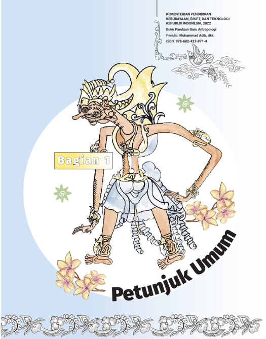
> **[Konteks Visual]**: Gambar ini menampilkan karakter dari cerita rakyat Indonesia, yang tampaknya adalah tokoh legendaris atau mitologis. Karakter tersebut memiliki ekor seperti seekor ikan dengan bulu-bulu berwarna kuning dan putih, serta memiliki ekor yang panjang dan licin. Karakter tersebut juga mengenakan pakaian tradisional yang khas, termasuk celana pendek dan sepatu tradisional. Karakter tersebut juga memiliki aksesori seperti kalung dan gelang yang berwarna emas. Di sekitar karakter tersebut terdapat beberapa bunga yang berwarna putih dan merah muda. Di bagian atas gambar terdapat tulisan "Bagian 1" dan "Petunjuk Umum".

### [HALAMAN_10]

## A.  Pendahuluan
Indonesia merupakan masyarakat majemuk baik dari aspek suku, agama, ras maupun golongan. Perjalanan sejarah yang cukup panjang membuat Indonesia memiliki keragaman kebudayaan. Keragaman budaya Indonesia telah menjadi identitas masyarakat Indonesia. Namun, keragaman kebudayaan  juga  memunculkan  kerentanan.  Perbedaan  budaya  antar anak bangsa rentan dieksploitasi dan berpotensi melahirkan perpecahan maupun konflik sosial. Untuk mengantisipasi disintegrasi, pendiri bangsa membuat  konsensus  bersama  tentang  dasar  negara  yakni  Pancasila, sebagai dasar filosofi negara Indonesia.
Bhinneka  tunggal  ika  yang  menjadi  semboyan  Pancasila,  menjadi pengikat bagi seluruh anak bangsa indonesia agar hidup dalam harmoni di tengah keragaman. Dalam konteks antropologi sebagai salah satu disiplin pengetahuan  dalam  ilmu  sosial  humaniora,  dapat  menjadi  instrumen dalam  mengamalkan  nilai-nilai  Pancasila  sehingga  peserta  didik  dapat mengembangkan  sikap  saling  menghormati  dan  menghargai  perbedaan dalam masyarakat multi kultur.
Pembelajaran antropologi diharapkan mendorong integrasi nasional di tengah masyarakat yang beragam. Dengan demikian, setelah mempelajari antropologi, peserta didik mampu mengembangkan akhlak dan budi pekerti mulia, menghormati perbedaan, mengembangkan sikap toleransi, simpati dan empati. Buku Panduan Guru untuk mata pelajaran antropologi pada kelas XII jenjang SMA/MA sederajat merupakan panduan terutama untuk para pengampu mata pelajaran antropologi selama satu tahun pelajaran. Buku panduan ini diharapkan dapat menjadi pedoman bagi guru, orang tua/ wali serta pemangku kepentingan lainnya dalam memfasilitasi peserta didik mencapai kompetensi yang telah ditetapkan.
Tujuan penyusunan dari Buku Panduan Guru adalah: 1) menyediakan pedoman bagi guru dalam memahami buku teks antropologi yang ditujukan bagi  peserta  didik,  2)  Menjelaskan  mengenai  capaian  pembelajaran antropologi beserta strategi dan metode pembelajaran antropologi yang  diperlukan  agar  peserta  didik  dapat  memiliki  pengetahuan,  sikap dan  keterampilan  dalam  ilmu  dasar  antropologi  secara  optimal.  Dalam
Buku Panduan Guru Antropologi SMA/MA Kelas XII

### [HALAMAN_11]

konteks memberikan kontribusi bagi pembangunan bangsa, mata pelajaran antropologi menjadi salah satu mata pelajaran strategis untuk mempersiapkan generasi mendatang yang berwawasan kebangsaan dan global sebagaimana mandat Undang-Undang Sistem Pendidikan Nasional No. 20 Tahun 2003.
Salah satu tujuan pembelajaran antropologi adalah menanamkan nilainilai utama kepada peserta didik dalam menciptakan bangsa yang beradab, menguatkan kegotongroyongan, dan responsif terhadap kebhinekaan global sesuai  dengan  nilai-nilai  Pancasila.  Agar  tujuan  pendidikan  antropologi tercapai maka guru hendaknya mengintegrasikan enam elemen utama profil pelajar Pancasila dalam setiap kegiatan pembelajaran. Adapun enam elemen utama  profil  pelajar  Pancasila  adalah  1)  Beriman  dan  Bertakwa  kepada Tuhan  YME,  dan  Berakhlak  Mulia;  2)  Berkebhinekaan  Global;  3)  Gotong Royong; 4) Mandiri; 5) Kreatif dan 6) Bernalar kritis (Kemendikbud, 2020).

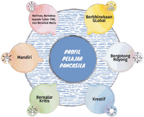
> **[Konteks Visual]**: Gambar tersebut mungkin merupakan representasi visual dari profil pelajar Pancasila. Di tengah gambar terdapat kata "PROFIL PELAJAR PANCASILA". Di sekelilingnya ada beberapa elemen berbentuk lingkaran dengan tulisan dalam bahasa Indonesia:

1. "Mandiri" - Mungkin merujuk pada sikap mandiri dan independen.
2. "Bersih" - Mungkin merujuk pada sikap bersih dan bersih-bersih diri.
3. "Kreatif" - Mungkin merujuk pada sikap kreatif dan inovatif.
4. "Bergotong Royong" - Mungkin merujuk pada sikap bergotong royong dan kerjasama tim.
5. "Berhikmaa Global" - Mungkin merujuk pada sikap berhikmaa global dan terbuka terhadap dunia.

Elemen-elemen ini mungkin digunakan untuk menggambarkan karakteristik atau nilai-nilai penting yang diharapkan dari pelajar Pancasila.

Sebagai  bagian  dari  masyarakat  global,  maka  tujuan  pendidikan Indonesia saat ini tidak lepas dari usaha pemerintah dalam menciptakan peserta didik Indonesia yang kreatif, novatif, solutif dan  mampu
Bagian 1
Petunjuk Umum berkolaborasi dalam mengentaskan berbagai masalah baik lokal, nasional maupun global. Dalam konteks ini, pembelajaran antropologi mengadaptasi agenda  global  yakni  Sustainable  Development  Goals  (SDGs).  Diusulkan sejak  25  September  2015  ke  berbagai  Negara  dunia,  SDGs  atau  tujuan pembangunan berkelanjutan merupakan agenda global yang telah menjadi kesepakatan oleh Perserikatan Bangsa Bangsa (PBB). SDGs yang memuat 17 tujuan ditargetkan akan dicapai pada tahun 2030. Tujuan pembangunan berkelanjutan adalah terlaksananya tata kelola  pembangunan  yang mampu meningkatkan kesejahteraan ekonomi masyarakat secara berkesinambungan; menjamin keberlanjutan kehidupan sosial masyarakat; menjaga kualitas lingkungan hidup; menjamin keadilan; serta mampu menjaga peningkatan kualitas hidup dari satu generasi ke generasi berikutnya. Ringkasnya, tujuan akhir dari misi ini adalah meningkatkan kemakmuran manusia dan melindungi lingkungan secara berkelanjutan.

### [HALAMAN_12]

Muatan  SDGs  diadaptasi  dalam  pembelajaran  antropologi  terapan, di  mana  peserta  didik  diharapkan  mampu  menyesuaikan  diri  dengan perkembangan isu global. Sebagai contoh ketika peserta didik belajar materi tentang tujuh unsur kebudayaan dapat mengaitkan dengan berbagai isu dari SDGs, seperti masalah pangan, lingkungan hidup, kesetaraan gender, serta  kelangkaan  energi  dan  alternatif  energi.  Lebih  jauh  lagi,  peserta didik  diharapkan  mampu  menjadi  agen  perubahan  yang  berkontribusi memecahkan berbagai masalah lokal, nasional dan global selaras dengan tujuan dari SDGs. Ringkasnya, peserta didik diharapkan dapat berkontribusi dalam pemecahan masalah yang timbul di lingkungan sekitar peserta didik.
Ketujuh belas agenda SDGs  diintegrasikan dalam  pembelajaran, disederhanakan ke dalam empat isu utama. Keempat isu tersebut membuat pembelajaran antropologi lebih dinamis, kontekstual, dan relevan terhadap kebutuhan peserta didik dalam menghadapi tantangan global yang semakin berat.  Keempat  isu  tersebut  diharapkan  akan  menumbuhkan  kesadaran dan  sikap  peserta  didik  yang  memiliki  kemampuan  beradaptasi  dengan perubahan  dan  perkembangan  masyarakat  di  era  revolusi  industri  4.0. Keempat isu utama tersebut adalah:
Buku Panduan Guru Antropologi SMA/MA Kelas XII

### [HALAMAN_13]

## 1.  Kesadaran Lingkungan
Isu ini terkait dengan adanya fenomena perubahan iklim dan degradasi/ kerusakan  lingkungan  dalam  satu  abad  terakhir.  Akibatnya,  kondisi semacam itu memperhadapkan banyak warga di berbagai belahan dunia dengan  resiko  dan  kerentanan  seperti  ragam  bencana  yang  melanda yang tidak pernah terjadi pada ekade-dekade lalu. Melalui mata pelajaran antropologi,  diharapkan  peserta  didik  memiliki  wawasan  lingkungan berkelanjutan yang diwariskan pada generasi penerus.

## 2.  Keamanan Digital
Isu ini terkait dengan pesatnya perkembangan teknologi informasi dan komunikasi  yang  banyak  merubah  tata  kehidupan  politik,  ekonomi, sosial  dan  kebudayaan  masyarakat  secara  revolusioner.  Oleh  karena itu  peserta  didik  disiapkan  dengan  kecakapan  digital  melalui  literasi digital  yang  disisipkan  di  mata  pelajaran  antropologi.  Kecakapan tersebut terkait keamanan data pribadi, etika di internet, dan bijak di dunia media sosial.

## 3.  Nutrisi dan Kebugaran
Isu ini terkait dengan isu pangan dan kesehatan di mana banyak warga dunia terutama anak-anak masih mengalami derajat kesehatan yang buruk. Persoalan gizi/nutrisi, kebugaran jasmani, dan kesehatan mental yang memengaruhi hubungan sosial antarwarga menjadi masalah yang diangkat dalam isu ini. Guru dapat menyisipkan muatan unsur-unsur kebudayaan, misalnya melalui makanan, minuman herbal, pengobatan herbal, dan kearifan lokal lainnya yang sesuai dengan konteks daerah. Melalui mata pelajaran antropologi, khususnya peminatan antropologi kesehatan,  diharapkan  peserta  didik  dapat  berkontribusi  terhadap masalah-masalah dalam lingkup isu tersebut

## 4.  Literasi Finansial
Isu ini terkait dengan adanya fenomena rendahnya kecakapan banyak orang dalam mengelola keuangan sehingga menghambat pencapaian tujuan peningkatan kualitas kesejahteraan secara berkelanjutan. Dalam konteks tersebut, mata pelajaran antropologi diharapkan dapat
Bagian 1
Petunjuk Umum berkontribusi membentuk peserta didik agar cakap mengelola finansial. Studi antropologi kontemporer, banyak mengkaji tentang isu-isu yang terkait finansial dan ekonomi digital. Guru dapat menginsersikan isu ini  dari  berbagai  fenomena  ekonomi  dan  lembaga  keuangan  terkini yang terdapat di masyarakat.

### [HALAMAN_14]

## B.  Capaian Pembelajaran
Pada bagian ini merupakan penjelasan capaian pembelajaran (CP) antropologi secara utuh untuk Fase F yaitu kelas XI dan XII. Dasar dari penulisan dan pengembangan  buku  teks  peserta  didik  dan  guru  adalah  CP.  Guru  dapat mengembangkan  pembelajaran  berdasarkan  CP  dengan  merancang  Alur Tujuan Pembelajaran (ATP) dan modul sebagai panduan pembelajaran di kelas. Terdapat beberapa bagian pada CP antropologi yaitu:
Rasionalitas
Tujuan Mata Pelajaran Antropologi SMA
Karakteristik Mata Pelajaran Antropologi
Capaian Pembelajaran Mata Pelajaran Antropologi
Pemahaman  yang  baik  terhadap  CP  akan  memandu  guru  untuk mengembangkan  kurikulum  sehingga  kompetensi  dan  tujuan  CP  dapat tercapai.

## 1.  Rasionalitas Mata Pelajaran Antropologi SMA
Indonesia adalah negeri yang kaya dan beragam. Kekayaan itu tidak hanya berasal dari limpahan sumber daya alam, tetapi juga kekayaan yang  berasal  dari  kebudayaan  yang  dimiliki  ribuan  kelompok  etnik yang  tersebar  di  puluhan  ribu  pulau.  Keragaman  bahasa,  etnik,  ras, agama, kepercayaan,dan berbagai aspek lahiriah (bendawi) dan batiniah  (non-bendawi)  terbukti  menjadi  bagian  tidak  terpisahkan dari  kekayaan  kebudayaannya.  Menafikan  keragaman,  berarti  juga menafikan  kekayaan  kebudayaannya.  Keniscayaan  perbedaan  itu telah  terekam  baik  dalam  sila-sila  Pancasila,  dan  ditegaskan  dengan semangat Bhinneka Tunggal Ika.

### [HALAMAN_15]

Pemahaman  keragaman  dan  kekayaan  kebudayaan  tentu  akan menghasilkan kesadaran identitas diri di tengah kelompok entitas lain yang berbeda. Kesadaran ini akan mendorong pelaku budaya, peserta didik,  guru,  dan  masyarakat  luas  pada  upaya  mengelola  perbedaan yang ada, baik atas nama dan dalam sudut pandang pelaku budayanya ataupun pengelolaan atas nama kepentingan yang lebih besar, yaitu negara.  Dalam  arti  lain,  pengelolaan  keragaman  itu  berujung  pada upaya mempertemukan: (i) suatu kebudayaan lokal dengan kebudayan lokal  lain  yang  memiliki dimensi emik (native  point  of  view); dan  (ii) kebudayaan lokal yang memiliki dimensi emik dengan kebudayaan lain atas nama kepentingan negara dan pihak lain yang cenderung memiliki dimensi etik (scientist's viewpoint) .
Pengetahuan kebudayaan atas diri, masyarakatnya dan kelompok lain  beserta  sesuatu  di  dalamnya  menjadi  urgensi  pembelajaran antropologi.  Antropologi  yang  dimaksud  di  sini  adalah  antropologi fisik, arkeologi, etnologi dan antropologi sosial budaya. Dengan ranah antropologi  tersebut,  pembelajaran  tidak  sekadar  pada  pengetahuan atas produksi kebudayaan, tetapi juga ada proses penanaman nilai dan kesadaran atas kesejatian diri dari sebuah bangsa yang multikultural. Pemahaman  mendalam  dan  internalisasi  nilai  atas  keragaman  dan kekayaan kebudayaan itu memungkinkan hadirnya sifat peserta didik yang  menghargai  dan  menyemai  harmoni  atas  kebhinekaan  etnik, budaya,  bahasa,  agama  dan  kepercayaan,  serta  segala  aspek  yang berbeda dengan identitas dirinya, baik lokal maupun global.
Berdasarkan hal tersebut, maka rumpun pengetahuan ilmu sosial dan kemanusiaan, khususnya antropologi yang diajarkan pada jenjang pendidikan  menengah  atas,  akan  memfokuskan  diri  pada  proses identifikasi,  penelusuran,  dan  pengungkapan makna atas keragaman dan  kekayaan  kebudayaan  bendawi  dan  nonbendawi  yang  ada, termasuk kebudayaan dari entitas global di abad 21 ini. Hal penting lain,  pembelajaran  antropologi  pada  fase-fase  tertentu  adalah  usaha dalam  memberikan  pemahaman  mendalam  dan  memantik  refleksi peserta  didik  terhadap  keunikan  kebudayaannya,  serta  segala  nilai apapun  yang  terkandung  di  dalamnya.  Dua  upaya  terakhir  adalah
Bagian 1
Petunjuk Umum
7

### [HALAMAN_16]

ikhtiar  dunia  pendidikan  dalam  mendorong  kesadaran  diri  peserta didik atas kesejatian kebudayaan dalam konteks ruang dan waktunya.
Proses dalam memantik refleksi ini juga memungkinkan menguatnya  nalar  kritis,  kreatifitas  dan  empati  peserta  didik  dalam memposisikan dan mengelola diri dengan tepat di tengah keragaman budaya. Seluruh proses pembelajarannya akan tertuju pada penggalian nilai utama ( virtue ethic ) yang terkandung pada kebudayaan, sehingga proses  penanaman  dan  transmisi  nilai-nilai  pelajar  Pancasila  pun berjalan dinamis dan berkontribusi positif bagi pembentukan sumber daya manusia yang maju dan berkeadaban warga negara ( civic virtue ).

## 2.  Tujuan Antropologi SMA
Antropologi bertujuan untuk memastikan peserta didik:
Meningkatkan kemampuan  mengidentifikasi, menelusuri dan mengungkapkan secara kritis berbagai aspek cakupan atau ruang lingkup ( object matter ) bidang antropologi fisik, arkeologi, etnologi bahasa, dan antropologi sosial budaya yang mewujud pada bentuk kebudayaan bendawi ataupun non-bendawi;
Mendorong pemahaman mendalam para peserta didik atas makna di  balik  setiap  ruang  lingkup  (object  matter)  bidang  antropologi, sehingga dapat menggugah nalar kritis saat melihat dan mengalami proses produksi dan praktik kebudayaan pada konteks ruang dan waktunya;
Memantik refleksi para peserta didik atas nilai-nilai utama ( virtue ethic )  yang terkandung pada kebudayaan, baik bendawi maupun non bendawi dalam praktik kehidupannya, sehingga rekonstruksi pemikiran dan transformasi sosial dapat dilakukan dengan baik;
Meningkatkan  pengetahuan  secara mandiri dan kreatif atas berbagai  kebudayaan,  sehingga  memiliki  kesadaran  pelestarian dan pemajuan kebudayaannya.
Menumbuhkembangkan empati peserta didik terhadap keragaman dan  kekayaan  kebudayaan,  baik  dalam  arti  entitas  dan  pelaku kebudayaan lokalnya ataupun kebudayaan lain, sehingga mampu

### [HALAMAN_17]

beradaptasi dan menciptakan suasana harmoni dan berkeadaban publik ( civic virtue ).
Mengembangkan kemampuan beradaptasi dalam menerima kebudayaan lain, khususnya terkait kebhinekaan global, sehingga proses transformasi sosial dapat berkembang;
Menanamkan nilai-nilai utama dalam menciptakan bangsa yang beradab, menguatkan kegotongroyongan, dan responsif terhadap kebhinekaan global.

## 3.  Karakteristik Mata Pelajaran Antropologi
Fase  pembelajaran  antropologi  didasarkan  pada  pertimbangan  usia peserta didik yang diasumsikan memiliki korelasi kuat dengan tingkat atau  kelas  pendidikan  formalnya.  Kondisi  peserta  didik  pada  setiap fase  akan  menentukan  capaian  minimum  dari  ruang  lingkup  atau elemen  dari  pembelajaran  antropologi.  Jika  dilihat  dari  fase,  maka pembelajaran antropologi disampaikan pada peserta didik yang berada pada  tahap  operasional  formal  (umur  11/12-18  tahun),  sebagaimana disebut oleh Piaget (1954).
Ciri pokok perkembangan pada fase ini adalah anak sudah mampu berpikir abstrak dan logis  dengan  menggunakan  pola  berpikir 'kemungkinan'. Model berpikir ilmiah dengan tipe hypothetico-deductive methode (metode hipotesis deduktif) dan metode induktif dapat disiapkan sejak  awal.  Metode  hipotesis  deduktif  akan  dilakukan  dengan  empat proses  dasar,  yaitu: pertama ,  mengembangkan  pertanyaan  penelitian; kedua ,merumuskan hipotesis atau preposisi (jawaban sementara); ketiga , melakukan pengujian terhadap hipotesis; dan keempat , memformulasikan teori  di  mana  pendekatan  berasumsi  bahwa  semua  peserta  akan mendapatkan pemahaman terbaik tentang fenomena antropologi melalui analisis terhadap aspek-aspek yang ada di sekitarnya.
Pada pengembangan metode induktif, peserta didik akan diarahkan pada  proses  pembelajaran  dari  pengamatan  data  antropologi  di lingkungan sekitarnya.  Kemudian,  temuan  ini  dikuatkan  dengan berbagai  teori  ilmiah  yang  dirujuk  dari  berbagai  literatur.  Dalam
Bagian 1
Petunjuk Umum pelaksanaan  metode  induktif,  proses  pembelajaran  akan  mencakup empat  langkah  dasar,  yaitu: pertama ,  identifikasi  fenomena  ruang lingkup antropologi di lingkungan sekitar; kedua , membuat pertanyaan dari temuan; ketiga , menarasikan dan mendiskusikannya pada sebuah tulisan; dan keempat , menguatkannya dengan teori, atau mencari tahu titik perbedaan dari suatu teori yang ada.

### [HALAMAN_18]

Keterampilan pembelajaran dengan dua pola (deduktif dan induktif) mulai diajarkan dan dimiliki peserta didik, khususnya mengidentifikasi masalah,  mencari  jawaban,  menarik  kesimpulan,  menafsirkan,  dan mengembangkan  pemahamannya.  Pada  tahap  ini  kondisi  berpikir peserta didik sudah dapat: pertama ,  bekerja secara efektif dan sistematis; dan kedua ,  menganalisis  dengan  kombinasi.  Dengan  demikian  telah diberikan  dua  kemungkinan  penyebabnya,  C1  dan  C2  menghasilkan R,  anak  dapat  merumuskan  beberapa  kemungkinan; ketiga ,  berpikir secara proporsional, yakni menentukan macam proporsional tentang C1, C2, dan R misalnya; dan keempat , menggeneralisasi atau isu spesifik secara mendasar pada satu macam isi.
Dengan karakter fase peserta didik di atas, maka gambaran fase dan standar capaian minimum pembelajaran antropologi sebagai berikut:
Memahami dan mendeskripsikan masalah yang berada pada ruang lingkup antropologi;
Mengidentifikasikan  bentuk  masalah  sosial  budaya  di  sekitar diri,  keluarga  dan  masyarakat  yang  menjadi  ruang  lingkup  atau cakupan antropologi;
Melakukan  analisis  terkait  masalah  sosial  budaya  yang  ada  di sekitar diri, keluarga dan masyarakatnya, baik di masa lalu atau sekarang ini;
Mendeskripsikan  analisis  problematika  keanekaragaman  sosial budaya yang menjadi cakupan dan ruang lingkup, baik di masa lalu atau sekarang ini;
Menjelaskan muatan nilai - nilai virtue ethic dan civic virtue yang terkandung pada cakupan dan ruang lingkup antropologi secara umum dan khususnya.

### [HALAMAN_19]

Selain itu, untuk mencapai kriteria minimum tersebut, pembelajaran antropologi juga didukung oleh elemen atau strands pembelajaran berikut:

## Pengantar Antropologi
Memahami  antropologi  sebagai  ilmu  yang  mempelajari  manusia dengan berbagai ragam kebudayaannya;
Memahami  konsep  yang  didiskusikan  dengan  berbagai  karakter lingkungan sekitar;
Memahami ruang lingkup antropologi dengan berbagai contoh dalam kehidupan lingkungan sekitarnya.

## Antropologi Ragawi
Mendeskripsikan cakupan antropologi ragawi, sehingga peserta didik dapat memahami perbedaan karakter dan keragaman manusia dari sisi fisik, perilaku, wilayah, dan karakter lainnya.
Menganalisis  cakupan  antropologi  ragawi  pada  diri  dan  lingkungan secara kritis-mandiri
Mendapatkan  pemahaman  kebudayaan  ragawi  dan  menganalisis ragam keunikannya.
Memahami  perbedaan  karakter  ragawi  dirinya  dengan  karakter ragawi pelaku kebudayaan lainnya
Menafsirkan cakupan antropologi ragawi yang ada di sekitarnya.

## Arkeologi
Mendeskripsikan  cakupan  arkeologi,  sehingga  peserta  didik  dapat memahami tinggalan dan proses sejarah dari manusia sebelumnya.
Menganalisis cakupan arkeologi yang berada di lingkungan sekitarnya.
Mendapatkan pemahaman dari contoh-contoh arkeologi dan kemudian menganalisis keunikan dan perbedaan dengan tinggalan lainnya.
Memahami perbedaan karakter suatu tinggalan.
Menganalisis  dan  mencari  korelasi  (menghubungkan)  proses  penciptaan  tinggalan  dengan  karakter  lingkungan  dan  cara  berpikir pelaku kebudayaannya
Mengumpulkan dan menjelaskan berbagai tinggalan yang diketahui, baik di lingkungan wilayahnya ataupun di lingkungan keluarga batihnya;
Menafsirkan temuan dari tinggalan yang ada di sekitarnya.
Bagian 1

### [HALAMAN_20]

## Etnologi-Bahasa
Mendeskripsikan cakupan etnologi, khususnya dari aspek kebahasaan, sehingga  peserta  didik  dapat  memahami  kelompok  etniknya  dan karakter kebahasaannya.
Menganalisis cakupan etnologi yang berada di lingkungan sekitarnya
Mendapatkan pemahaman dari contoh-contoh bahasa dan kemudian menganalisis keunikan dan perbedaan dengan bahasa lainnya.
Memahami perbedaan karakter berbagai kelompok etnik dan bahasa
Menganalisis  dan  mencari  korelasi  (menghubungkan)  proses  pembentukan kelompok etnik dan penciptaan kebahasaannya.
Mencontohkan cakupan etnologi dari lingkungan sekitarnya
Menafsirkan  temuan  karakter  kelompok  etnik  dan  kebahasaan  ibu atau sekerabat.
Mengkreasikan beberapa contoh keunikan kelompok etnik dan kebahasaan.

## Antropologi Sosial Budaya
Mendeskripsikan cakupan antropologi sosial budaya, khususnya aspek kebudayaan sebagai sesuatu paling unik dan mendasar dari kehidupan manusia;
Menganalisis cakupan antropologi sosial budaya di lingkungan sekitar.
Mendapatkan pemahaman dari praktik-praktik sosial budaya yang ada.
Menganalisis keunikan dan praktik sosial budaya dari satu lingkungan tertentu.
Memahami perbedaan karakter dan praktik kebudayaan dari lingkungan kebudayaan lain
Menganalisis dan mencari korelasi (menghubungkan) proses pembentukan kebudayaan dengan berbagai aspek lain terkait ranah kebudayaannya (seperti worldview, sistem nilai, struktur sosial, dsb).
Mencontohkan dan menjelaskan cakupan antropologi sosial  budaya lingkungan sekitar.
Menafsirkan temuan terkait karakter kebudayaan dan praktik sosial budaya  lainnya  di  lingkungan  sekitar  atau  lingkungan  sekerabat  di dalam keluarganya.

## Kebhinekaan Kelompok Etnik dan Perilaku Budaya Global
Memahami berbagai fenomena global dan pengaruhnya yang menerpa diri dan masyarakat di lingkungan wilayahnya

### [HALAMAN_21]

Menguraikan  proses  pembentukan  bangsa-bangsa  beserta  ikatan primordialisme di dalamnya, sehingga peserta didik dapat mengambil manfaat dari perjalanan sejarah suatu negara-bangsa.
Mengkarakteristikkan berbagai fenomena  di lingkungan sekitar, sehingga mampu memahami perbedaan tentang karakter masyarakat yang agraris dan maritim;
Melakukan kritik (mengkritisi) perilaku negara dan masyarakat maju yang memberikan pengaruh besar terhadap negara dan masyarakat berkembang;
Mengidentifikasi  berbagai  identitas  dan  entitas  sosial  budaya  di lingkungan sekitar dan lingkungan lebih luas;
Menilai kelebihan dan kelemahan entitas dan identitas sosial budaya untuk kepentingan penghargaan atas pluralisme atau kebhhinekaan budaya yang terdiri dari 7 unsur kebudayaan.
Memotret proses pertemuan dan pembauran kebudayaan dari berbagai entitas dan identitas kebudayaan pada lintasan sejarahnya;
Menafsirkan pandangan-pandangan dan nilai-nilai sosial budaya yang mampu menciptakan  toleransi  dan  penghargaan  kepada  kelompokkelompok marjinal;
Memotret  proses  representasi  dan  hibriditas  kebudayaan  dalam berbagai aspeknya (kuliner, fashion, desain, permukiman, dsb).

## 4.  Capaian Pembelajaran Mata Pelajaran Antropologi
Pada akhir Fase F (Umumnya untuk kelas XI dan XII SMA), peserta didik dapat memahami dan meningkatkan keterampilan inquiry dalam ruang lingkup antropologi, sehingga mampu menumbuhkan pemikiran kritis dan kesadaran kebhinekaan lokal saat mencermati beragam fenomena di sekitarnya. Pemahaman dan refleksi ini akan menghasilkan praktik keadaban publik ( civic virtue )  dan semangat kegotongroyongan tanpa membedakan kelompok dan entitas sosial primordialnya. Internalisasi nilai  dapat  dilakukan  bersamaan  saat  kegiatan  pembelajaran  secara langsung di lapangan (masyarakat terdekat).

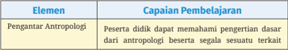
> **[Konteks Visual]**: Tabel ini berisi dua kolom: "Elemen" dan "Capaian Pembelajaran". Kolom "Elemen" mungkin berisi nama-nama elemen tertentu, sedangkan kolom "Capaian Pembelajaran" mungkin berisi deskripsi tentang bagaimana elemen tersebut dapat membantu peserta didik dalam pembelajaran antropologi. Tanpa informasi lebih lanjut, saya tidak dapat memberikan deskripsi yang lebih spesifik tentang isi tabel tersebut.

Bagian 1
Petunjuk Umum

### [HALAMAN_22]

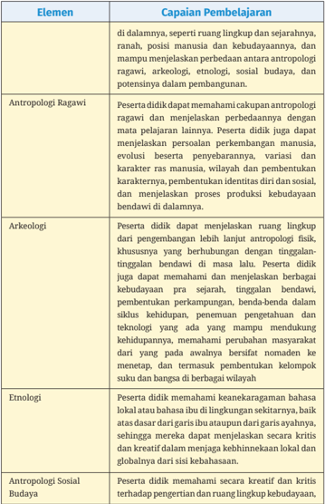
> **[Konteks Visual]**: Tabel ini berisi informasi tentang elemen-elemen pembelajaran antropologi Ragawi, arkeologi, etnologi, dan antropologi sosial budaya. Setiap elemen memiliki tujuan pembelajaran spesifik yang mencakup pemahaman tentang ruang lingkup, perbedaan antara antropologi ragawi dan antropologi sosial budaya, serta pengetahuan tentang perkembangan manusia, evolusi, variasi karakter manusia, identitas diri, dan proses produksi kebudayaan. Tabel ini juga mencakup pemahaman tentang keanekaragaman bahasa lokal atau bahasa ibu dalam lingkungan sekitarnya, serta kreativitas dan kritik terhadap pengertian ruang lingkup kebudayaan.

### [HALAMAN_23]

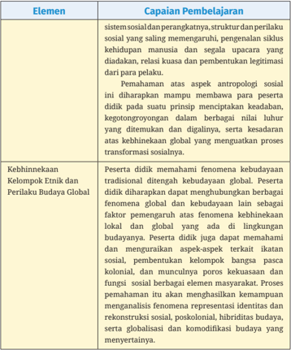
> **[Konteks Visual]**: Tabel ini berisi dua kolom: "Elemen" dan "Capaian Pembelajaran". Kolom "Elemen" mungkin merujuk pada aspek-aspek tertentu dalam pembelajaran, sedangkan kolom "Capaian Pembelajaran" mungkin menunjukkan tujuan atau hasil yang diharapkan dari pembelajaran tersebut.

1. Elemen pertama mungkin melibatkan sistem sosial dan perangkatnya, struktur dan perilaku sosial yang saling mempengaruhi, pengenalan siklus kehidupan manusia, dan segala upacara yang dilakukan untuk relaksasi dan pembentukan legitimasi dari pelaku.
2. Elemen kedua mungkin melibatkan pemahaman tentang aspek antropologi sosial, seperti kebhinekaan kelompok etnis dan perilaku budaya global. Pelajar diharapkan dapat memahami fenomena kebudayaan tradisional di tingkat lokal dan global, serta bagaimana faktor-faktor global mempengaruhi kebudayaan lokal. Pelajar juga diharapkan dapat memahami aspek-aspek terkait ikatan sosial, pembentukan kelompok bangsa, dan fungsi sosial berbagai elemen masyarakat. Proses pemahaman ini akan menghasilkan kemampuan analisis fenomena representasi identitas dan rekonstruksi sosial, poskolonial, hibrider budaya, serta globalisasi dan komodifikasi budaya yang menyebar.

### [HALAMAN_24]

## C.  Penjelasan Bagian-Bagian Buku
Buku  peserta  didik  untuk  mata  pelajaran  antropologi  didesain  untuk menarik  minat  peserta  didik  dan  memantik  kesadaran  kritis-reflektif saat  mempelajari  antropologi.  Pemahaman  reflektif  tersebut  diharapkan membentuk praktik keadaban publik ( civic virtue ) di kalangan peserta didik. Secara praktis, buku tersebut diharapkan dapat memfasilitasi peserta didik agar  mampu  memahami  konsep,  prinsip  dan  fakta  antropologi  dengan baik. Oleh karena itu, pada bagian awal buku peserta didik memuat cara menggunakan buku agar peserta didik dapat membaca dan mempelajari isinya  dengan  tuntas.  Bagian  ini  akan  menjabarkan  bagian-bagian  dari buku  teks  peserta  didik  antropologi  kelas  XII  dengan  penjelasan  teknis sebagai berikut:

## 1.  Gambaran Bab
Setiap bab diawali dengan bagian tentang gambaran tema yang memuat penjelasan ruang  lingkup serta  materi  pembelajaran  yang  akan dipelajari.  Dengan  menyajikan  pemetaan  secara  ringkas,  gambaran bab akan memudahkan peserta didik secara memahami secara cepat tentang ruang lingkup dan materi pembelajaran.
Gambaran Bab
Pada bab ini, kalian akan lebih mendalami dan memperkaya tentang aplikasi  dari  ilmu  Antropologi  khususnya  Antropologi  Sosial  dan Antropologi Budaya. Sebagai lanjutan dari yang sudah kalian pelajari pada Kelas XI tentang Pengantar Ilmu Antropologi, pada bab ini kalian akan memperdalam konsep Antropologi Sosial dan Antropologi Budaya dan juga bagaimana relasi antara cabang-cabang Antropologi dengan ilmu  yang  lain  beserta  dengan  aplikasinya.  Pada  bab  ini  disajikan tentang pengertian Antropologi Sosial dan  Antropologi  Budaya, Antropologi Terapan (kegunaan Antropologi dalam kehidupan seharihari)  dan  juga  hubungan  antar  cabang-cabang  Ilmu  Antropologi dengan ilmu yang lain secara nyata dalam keseharian masyarakat.
Buku Panduan Guru Antropologi SMA/MA Kelas XII

### [HALAMAN_25]

## 2.  Tujuan dan Indikator Capaian Pembelajaran

## Tujuan Pembelajaran
Tujuan pembelajaran pada Bab 1 adalah peserta didik mampu:
Menjelaskan  secara  kreatif  dan  kritis  terhadap  pengertian  dan ruang lingkup antropologi sosial dan antropologi budaya.
Memberikan contoh praktik-praktik sosial dan budaya yang ada di lingkungan sekitarnya.

## Indikator Capaian Pembelajaran
Setelah mengikuti pelajaran antropologi dan memahami bacaan pada pembahasan bab ini peserta didik mampu:
Menjelaskan Pengertian Antropologi Sosial dan Antropologi Budaya,
Membedakan Cakupan Antropologi Sosial dan Antropologi Budaya
Memberikan contoh Antropologi Terapan (kegunaan Antropologi dalam kehidupan sehari-hari)
Menjelaskan  hubungan  antar  cabang-cabang  Ilmu  Antropologi dengan ilmu yang lain secara nyata dalam keseharian masyarakat.

## 3.  Pokok Materi dan Hubungan Pokok Materi dalam Mencapai Tujuan Pembelajaran
Pada bagian ini disajikan tentag materi pokok serta hubungan materi pokok dalam mencapai tujuan pembelajaran sebagaimana pada contoh berikut:
Materi dalam bab 1 ini adalah Antropologi Sosial dan Antropologi Budaya yang diberikan kepada peserta didik kelas XII.  Pada materi ini  penjelasan  tentang  konsep  antropologi  sosial  dan  antropologi budaya berbeda dengan yang dipelajari pada kelas XI. Pada materi
Bagian 1
Petunjuk Umum ini lebih memperdalam konsep Antropologi Sosial dan Antropologi Budaya dan juga bagaimana relasi antara cabang-cabang Antropologi dengan ilmu yang lain beserta dengan aplikasinya.

### [HALAMAN_26]

Bapak/Ibu guru dapat menjelaskan konsep, contoh dan peranan antropologi sosial dan antropologi budaya dalam kehidupan masyarakat  diantaranya  dalam  pengelolaan  dan  penyelesaian konflik juga dalam penerapan dunia yang lebih global seperti dalam dunia  bisnis  yang  sudah  mengglobal.  Untuk  dapat  tercapainya tujuan pembelajaran dan dapat dipahami dengan baik oleh peserta didik,  Bapak/Ibu  guru  dapat  meminta  peserta  didik  mencari contoh-contoh nyata terkait kasus-kasus sesuai materi bahasan dari kehidupan sehari-hari di sekitar tempat tinggal.

## 4.   Kaitan Materi dengan Profil Pelajar Pancasila
Pada bagian ini dijelaskan bagaimana kaitan materi dengan profil pelajar Pancasila  yang  mengarah  pada  tujuan  pembelajaran.  Sebagaimana pada contoh berikut.

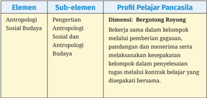
> **[Konteks Visual]**: Tabel ini berisi informasi tentang elemen, sub-elemen, dan profil pelajar Pancasila dalam konteks antropologi sosial budaya. Berikut adalah deskripsi detail dari setiap kolom:

1. Elemen: Ini mungkin merujuk pada topik utama yang akan dijelaskan dalam tabel.

2. Sub-elemen: Kolom ini menyajikan sub-topik atau detail lebih lanjut dari elemen utama.

3. Profil Pelajar Pancasila: Ini mungkin merujuk pada karakteristik atau standar yang diharapkan dari pelajar Pancasila dalam konteks antropologi sosial budaya.

4. Dimensi: Kolom ini mungkin menunjukkan aspek atau sifat dari sub-elemen yang disebutkan.

5. Bergetongong Royong: Ini mungkin merujuk pada praktik atau konsep khusus dalam konteks antropologi sosial budaya yang berkaitan dengan pelajar Pancasila.

6. Sosial dan Antropologi Budaya: Ini mungkin merujuk pada bagaimana sub-elemen tersebut berkaitan dengan bidang sosial dan antropologi budaya.

7. Berkerja sama dalam kelompok: Ini mungkin merujuk pada bagaimana pelajar Pancasila bekerja sama dalam kelompok dalam konteks antropologi sosial budaya.

8. Melakukan kesepakatan: Ini mungkin merujuk pada bagaimana pelajar Pancasila melakukan kesepakatan dalam konteks antropologi sosial budaya.

9. Melakukan penyelesaian tugas melalui kontrak belajar: Ini mungkin merujuk pada bagaimana pelajar Pancasila melaksanakan tugas mereka melalui kontrak belajar dalam konteks antropologi sosial budaya.

10. Dalam penyelesaian tugas melalui kontrak belajar yang disepakati bersama: Ini mungkin merujuk pada bagaimana pelajar Pancasila bekerja sama dalam penyelesaian tugas mereka melalui kontrak belajar dalam konteks antropologi sosial budaya.

11. Menggunakan gugatan: Ini mungkin merujuk pada bagaimana pelajar Pancasila menggunakan gugatan dalam konteks antropologi sosial budaya.

12.

### [HALAMAN_27]

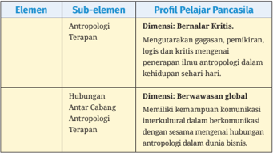
> **[Konteks Visual]**: Tabel ini berisi informasi tentang elemen dan sub-elemen dalam profil pelajar Pancasila. Tabel tersebut mencakup dua dimensi utama: Bernalar Kritis dan Berwawasan Global. Dimensi Bernalar Kritis meliputi antropologi terapan, yang mengarah pada kemampuan untuk mengekspresikan gagasan, pemikiran, logis, dan kritik terhadap ilmu antropologi dalam kehidupan sehari-hari. Dimensi Berwawasan Global meliputi kemampuan komunikasi intercultural dalam berkomunikasi dengan sesama mengenai hubungan antropologi dalam dunia bisnis.

## 5.  Pertanyaan Kunci
Sebelum  menyajikan  bagian  materi, terdapat bagian  pertanyaan kunci  yang  memuat  sejumlah  pertanyaan-pertanyaan  pokok.  Hal  ini bertujuan  memantik  peserta  didik  untuk  mempelajari  materi  yang akan dipelajari.
Bagaimana konsep sistem sosial dan sistem budaya yang berlaku pada tradisi larung sesaji pada masyarakat Jawa?
Bagaimana  menguraikan  unsur-unsur  sistem  sosial  dan  sistem budaya pada tradisi larung sesaji pada masyarakat Jawa?
Bagaimana  menganalisis  hubungan  sistem  sosial  dan  sistem budaya pada tradisi larung sesaji pada masyarakat Jawa?

## 6.  Kata-kata Kunci
Setelah  menyajikan  pertanyaan  kunci,  disusul  dengan  bagian  yang memuat kata kunci. Kata kunci merupakan konsep-konsep dasar dari suatu disiplin ilmu yang memudahkan peserta didik untuk mengingat secara cepat konsep-konsep tersebut.

### [HALAMAN_28]

Pengertian sistem sosial budaya, unsur-unsur sistem sosial budaya, hubungan  sistem  sosial  budaya,  pengertian  masyarakat,  unsurunsur masyarakat dan hubungan struktur sosial dan perilaku sosial.

## 7.  Materi Pembelajaran
Bagian materi pembelajaran merupakan inti pada buku peserta didik. Bagian  ini  menyajikan  pembahasan  berbagai  materi  yang  dipelajari dan bisa jadi diturunkan menjadi sejumlah subtema. Aktivitas pembelajaran  dapat  berupa  lembar  reflektif,  dengan  pendekatan inkuiri yang diintegrasikan dalam materi pembelajaran. Sebagai contoh lembar aktivitas peserta didik nampak pada contoh berikut:

## Lembar Kegiatan Peserta Didik 1.1

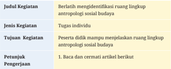
> **[Konteks Visual]**: Judul Kegiatan: Berlatih mengidentifikasi ruang lingkup antropologi sosial budaya

Jenis Kegiatan: Tugas individu

Tujuan Kegiatan: Peserta didik mampu menjelaskan ruang lingkup antropologi sosial budaya

Petunjuk Pengerjaan:
1. Baca dan cermati artikel berikut

## Antropologi Terapan

## Bangunan antropologi: Antropologi yang seperti apa?
Kemajuan zaman membuat ilmu pengetahuan berkembang dan menyesuaikan keadaan. Begitu  pula  dengan  ilmu  antropologi  yang  juga mengalami perkembangan, baik bersifat progres dan regresi. Pada awalawal  kemunculannya,  antropologi  mengkaji  mengenai  masa  lalu,  yang mana  perlu  dibandingkan  dengan  masa  kini  ataupun  masa  yang  akan datang. Keberadaan ilmu berawal dari pembelajaran dan pengkajian masa lalu. Pada mulanya, ilmu antropologi mempelajari mengenai masyarakat primitif, tetapi di masa kini juga perlu mempelajari masyarakat modern. Mengapa demikian? Karena masyarakat juga mengalami perubahan dan perkembangan  dan  perlu  untuk  dipelajari  dan  dikaji.  Antropologi  telah berkembang dan memasuki ranah ilmu disiplin lainnya, hal ini dibuktikan dengan adanya cabang-cabang ilmu antropologi, antara lain: antropologi kesehatan, antropologi ekonomi, antropologi hukum, antropologi linguistik, antropologi politik, dan sebagainya.

### [HALAMAN_29]

Pada  cabang  ilmu  tersebut  tentu  bukan  masalah  yang  mendasari ilmu ekonomi, kesehatan, dan sebagainya, tetapi penekanannya mengarah ke permasalahan yang dihadapi oleh ilmu tersebut berkaitan dengan  kehidupan  manusia  atau  kehidupan  dalam  suatu  masyarakat. Hal  ini  berkaitan  dengan  kehidupan  manusia  ataupun  kehidupan  suata masyarakat.  Sebenarnya,  segala  sisi  kehidupan  pada  manusia  terdapat aspek antropologi.

## Kebudayaan dalam antropologi: Bersifat dinamis dan adaptif
Antropologi  memiliki  dua  sifat,  yaitu  dinamis  dan  adaptif.  Kebudayaan yang  bersifat  dinamis  adalah  kebudayaan  yang  mampu  beradaptasi (fleksibel) dalam keadaan apa pun, sedangkan kebudayaan yang mampu menyesuaikan  dengan  situasi  dan  perkembangan  zaman  adalah  yang bersifat dinamis.
Suatu  keadaan  jelas  mengalami  perubahan,  begitu  pula  dengan kebudayaan  yang  akan  berubah  akibat  adanya  perubahan  keadaan tersebut. Kebudayaan dikatakan bersifat dinamis berlaku pada tiga wujud kebudayaan yang berupa ide, aktivitas dan artefak. Suatu ide atau gagasan dikatakan dinamis karena mampu berubah menyesuaikan dengan keadaan yang  terjadi  sekarang.  Seperti  contoh:  suatu  ilmu  atau  pandangan  yang sebelumnya sudah ada akan muncul sebuah pandangan baru yang mana tidak menghilangkan pandangan lama tersebut melainkan memperbaiki atau mengembangkannya. Berikutnya, aktivitas adalah wujud kebudayaan yang juga memiliki sifat dinamis. Pengertian dari aktivitas adalah kegiatan manusia  dalam  berinteraksi  yang  mencakup  pergaulan  dengan  sesama dan dilakukan pada kurun waktu tertentu serta berpedoman pada polapola  yang  berlandaskan  tata  adat  perilaku.  Aktivitas  itu  sendiri  bersifat konkret  karena  mampu  dilihat  dengan  indera  penglihatan.  Kemudian, wujud kebudayaan yang terakhir berupa artefak atau benda-benda hasil karya manusia. Hal ini paling berpotensi untuk mudah berubah, karena
Bagian 1
Petunjuk Umum hasil karya manusia  cenderung  mengalami  suatu  perbaikan untuk menghasilkan suatu karya yang lebih baik. Hasil dari gagasan dan aktivitas secara  keseluruhan  merupakan  wujud  kebudayaan  berupa  artefak  dan yang paling konkret dari dua lainnya.

### [HALAMAN_30]

Kebudayaan yang bersifat adaptif adalah kebudayaan yang berfokus kepada penerapan (aplikatif). Adaptif disini lebih kepada perilaku manusia yang berusaha untuk menyesuaikan ataupun memenuhi kebutuhan yang mereka inginkan.
Kebudayaan  sendiri  dapat  dijadikan  manusia  sebagai  alat  untuk beradaptasi  dengan  lingkungannya,  contohnya:  Ketika  seseorang  tinggal di daerah yang baru akan lebih mudah beradaptasi dengan kebudayaan yang  berupa  gagasan  dan  akan  menjadikan  seseorang  tersebut  berpikir menyesuaikan dengan masyarakat di daerah tersebut. Selain itu, aktivitas dapat berupa penyesuaian pada lingkungan baru atau berupa artefak yang dipakai untuk penerapan (aplikatif) dengan kondisi barunya tersebut.
Sumber: Herawati. 2015. 'Antropologi Terapan.' Pendidikan Kita. 2015. https://blog.unnes. ac.id/heera/2015/11/16/antropologi-terapan/.

## 2. Jawablah pertanyaan berikut
Sebutkan cabang-cabang antropologi berdasarkan artikel diatas!
Bagaimana antropologi menyesuaikan dengan perkembangan zaman?
Mengapa  antropologi  perlu  menyesuaikan  dengan  perkembangan zaman dan keadaannya? Jelaskan!
Berilah contoh konkret antropologi bersifat diinamis dalam menyesuaikan dengan perkembangan zaman!
Berilah  contoh  konkret  antropologi  bersifat  adaptif    menyesuaikan dengan perkembangan zaman!
Buatlah  kesimpulan  tentang  antropologi  menyesuaikan  diri  dengan perkembangan zaman!
Buatlah tulisan tentang hubungan antara antropologi dengan perkembangan zaman!

## 8.  Kesimpulan Visual
Bagian  ini  menyajikan  kesimpulan  dari  setiap  materi  pembelajaran yang  dikemas  secara  visual  melalui  gambar  skematik.  Penyajian gambar skematik bertujuan memberikan kemudahan bagi peserta didik dalam memahami secara cepat materi yang telah didiskusikan  serta memudahkan dalam menilik kembali dari materi yang telah dipelajari.

### [HALAMAN_31]

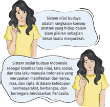
> **[Konteks Visual]**: Sistem milik budaya adalah suatu konsep abstrak yang menggambarkan konsep-konsep abstrak dalam hidup dalam alam pikiran sebagian besar suatu masyarakat. Sistem sosial budaya Indonesia sebagian besar berdasarkan pada nilai-nilai, tata laku, dan tata krama manusia Indonesia yang merupakan manifestasi dari karya, kebijaksanaan, dan kepercayaan masyarakat, serta bermasyarakat, berbangsa, dan bernegara berdasarkan Pancasila.

## 9.  Soal Uji Pemahaman Materi
Bagian  ini  ditempatkan  pada  akhir  materi  atau  bab  sebagai  instrumen evaluasi terhadap penguasaan materi oleh peserta didik. Evaluasi disajikan melalui sejumlah pertanyaan untuk menakar capaian peserta didik baik secara kognitif, afektif dan psikomotorik. Evaluasi dapat pula berupa soal pilihan ganda, esai, evaluasi diri maupun rekomendasi proyek pembelajaran sebagai metode untuk mengevaluasi suatu materi pembelajaran.

## 1. Perhatikan pengertian berikut ini:
1).  Suatu kesatuan yang terdiri dari komponen atau elemen yang dihubungkan bersama untuk memudahkan aliran informasi
2).  Wujud  kebudayaan sebagai suatu tindakan berpola dari manusia dalam masyarakat
3).  Aktivitas-aktivitas manusia yang saling berinteraksi, mengadakan kontak serta bergaul dengan manusia
4).  Perangkat peran sosial yang berinteraksi atau kelompok sosial yang memiliki nilai-nilai, norma dan tujuan yang sama.
5).  Suatu totalitas tata nilai, tata sosial dan tata laku manusia yang merupakan  manifestasi  dari  karya,  rasa  dan  cipta  di  dalam kehidupan bermasyarakat.
Bagian 1

### [HALAMAN_32]

Dari  pengertian  diatas  yang  merupakan  pengertian  dari  sistem nilai sosial adalah….
1)
2)
3)
4)
5)
Sistem sosial adalah suatu perangkat peran sosial yang berinteraksi atau kelompok sosial yang memiliki nilai-nilai, norma dan tujuan yang bersama. Hal ini di kemukakan oleh …
Parsons
Garna
Sutherland
Karl Marx
Haviland
Rangkaian konsep abstrak yang hidup dalam alam pikiran sebagian besar suatu warga masyarakat di sebut….
Sistem nilai budaya
Sistem stratifikasi budaya
Sistem diferensiasi budaya
Sistem masyarakat budaya
Sistem hubungan budaya
Nilai adalah sesuatu yang abstrak bukan konkret. Dalam salah satu nilai  yang  berfungsi  untuk  membantu  aktivitas  manusia  seperti cangkul dipake oleh petani disebut nilai…
Nilai material
Nilai kerohanian
Nilai vital
Nilai estetika
Nilai moral
Dalam adat ketimuran tangan diatas lebih abik daripada tangan di bawah. Jika kita memberikan sesuatu kepada orang lain hendaknya menggunakan tangan kanan. Karena tangan kanan dianggap baik. kebiasaan ini disebut….

### [HALAMAN_33]

Usage
Folkways
Mores
Custom
Law

## 10.  Daftar Pustaka
Bagian  ini  menyajikan  seluruh  referensi  yang  digunakan  dalam penulisan  buku.  Referensi  dapat  berbentuk  buku,  jurnal,  majalah, koran baik yang bersifat fisik maupun publikasi referensi daring. Daftar pustaka disajikan di akhir buku yang bertujuan untuk memancing minat pembaca untuk pembelajaran lebih jauh tentang topik yang dipelajari.
Amalia, Ila.  2021.  'Representasi  Praktek  Perbudakan Dan Penindasan Dalam  Puisi  'Negro'  Karya  Langston  Hughes:  Sebuah  Kajian Poskolonial.' Diksi 29  (1):  51-59. https://doi.org/10.21831/diksi. v29i1.33250.
Barker, Chris. 2004. The Sage Dictionary of Cultural Studies . London: Sage Publication.
Fatonah,  Khusnul.  2018.  'Ideologi  Narator  Dalam  Novel  Malaikat Lereng Tidar Karangan Remy Sylado (Kajian Poskolonialisme).' Eduscience: Jurnal Ilmu Pendidikan 3 (2): 86-101.
Lazuardi, I Nyoman Fizal Tri, I Ketut Putra Erawan, and Muh. Ali Azhar. 2021. 'KOMODIFIKASI TRADISI OMED-OMEDAN.' Jurnal  Nawala  Politika;  Vol  1  No  2  (2021):  Jurnal  Ilmu  Politik 2021 ,  January.  https://ojs.unud.ac.id/index.php/politika/article/ view/70054.
Weber, Max. 1964. The Theory of Social and Economic Organization . Edited by Talcott Parsons. New York: Free Press.

### [HALAMAN_34]

## D.  Strategi Umum Pembelajaran
Strategi pembelajaran harus diarahkan pada pemenuhan Capaian Pembelajaran  (CP)  oleh  peserta  didik.  Pada  umumnya,  CP  mempunyai spektrum  yang  menjangkau  baik  dimensi  kognisi  berupa  pengetahuan; afeksi berupa penghayatan sebagai bagian dari profil pelajar Pancasila; dan psikomotorik yang mewakili aspek praktik. Oleh karena itu guru pengampu mata  pelajaran  antropologi  dituntut  untuk  mengembangkan  strategi pembelajaran  dapat  memfasilitasi  sepenuhnya  peserta  didik  dengan pendekatan  pembelajaran  berpusat  pada  peserta  didik  (student  centred learning).  Dalam  konteks  ini,  guru  pengampu  mata  pelajaran  antroplogi memiliki tanggung jawab baik sebagai pengajar, pendidik, dan fasilitator. Terutama  sebagai  fasilitator,  guru  berperan  memotivasi,  memfasilitasi, mengevaluasi,  dan  menyiapkan  segala  bentuk  dukungan  dalam  proses belajar peserta didik.

## 1.  Catatan Umum tentang Strategi Pembelajaran
CP kelas XII dirumuskan berdasarkan struktur keilmuan antropologi. Oleh  karena  itu  guru  pengampu  mata  pelajaran  antropologi  dalam memenuhi tuntutan CP perlu memperhatikan sejumlah catatan umum berikut ini:
a). Perhatikan  saat  menyampaikan  konsep-konsep  kunci,  urutkan berdasarkan  hirarki  konsep  (tingkat  kesulitan  materi)  dalam disiplin  ilmu  antropologi.  Bisa  jadi  dinamika  di  kelas  menuntut guru  untuk  memahamkan  konsep-konsep  dasar  dahulu  baru setelah itu masuk ke konsep-konsep lanjut. Dengan demikian, guru tidak harus sesuai dengan urutan konsep dalam CP kelas XII jika dinilai kurang relevan dengan kondisi peserta didik.
b). Perhatikan keterkaitan antara elemen dan deskripsi pembelajaran yang dijabarkan menjadi beberapa deskripsi sub tema pembelajaran. Rangkaian deskripsi sub tema pembelajaran harus mewakili  gambaran  tentang  tuntutan  CP  pada  masing-masing elemen pembelajaran. Dalam konteks tersebut, guru perlu menilik kembali kesesuaian antara elemen dan deskripsi pembelajaran.

### [HALAMAN_35]

c). Perhatikan relevansi antara deskripsi pembelajaran dalam mata pelajaran  antropologi  dengan  konteks  sosial  peserta  didik. Deskripsi pembelajaran antropologi pada kelas XII pada dasarnya memuat: antropologi sosial dan antropologi budaya, unsur budaya, sistem sosial dan sistem budaya, serta dinamika kebudayaan yang bertujuan  menumbuhkan  sikap  toleran,  gotong  royong,  serta saling menghargai dalam kehidupan sehari-hari. Oleh karena itu, guru  perlu  mengidentifikasi  materi  pembelajaran  yang  relevan dengan  konteks  sosial  dan  kondisi  sosial  peserta  didik.  Materi antropologi yang disajikan hendaknya disesuaikan dengan tingkat perkembangan kognisi, kondisi sosial, dan spiritual peserta didik. Selain  itu,  materi  yang  diberikan  dalam  buku  antropologi  kelas XII  ini  diharapkan  mampu  memberi  bekal  peserta  didik  untuk mengembangkan antropologi ke jenjang yang lebih tinggi.
Aspek-aspek  kontekstual yang  perlu diidentifikasi antara kondisi peserta didik dengan materi pembelajaran antara lain sebagai berikut:

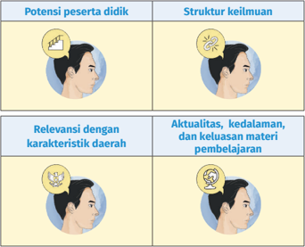
> **[Konteks Visual]**: Gambar ini menunjukkan dua jenis potensi peserta didik dan struktur keilmuan. 

1. Potensi Peserta Didik:
   - Dua gambar kepala seseorang dengan tanda bintang di sebelah kiri kepala mereka.
   - Gambar pertama menunjukkan kepala seseorang dengan tanda bintang di sebelah kiri kepala mereka, yang mungkin menunjukkan potensi yang lebih rendah atau belum dikembangkan.
   - Gambar kedua menunjukkan kepala seseorang dengan tanda bintang di sebelah kiri kepala mereka, yang mungkin menunjukkan potensi yang lebih tinggi atau telah dikembangkan.

2. Struktur Keilmuan:
   - Dua gambar kepala seseorang dengan tanda bintang di sebelah kanan kepala mereka.
   - Gambar pertama menunjukkan kepala seseorang dengan tanda bintang di sebelah kanan kepala mereka, yang mungkin menunjukkan struktur keilmuan yang lebih rendah atau belum dikembangkan.
   - Gambar kedua menunjukkan kepala seseorang dengan tanda bintang di sebelah kanan kepala mereka, yang mungkin menunjukkan struktur keilmuan yang lebih tinggi atau telah dikembangkan.

Relevansi dengan Karakteristik Daerah:
- Gambar pertama menunjukkan kepala seseorang dengan tanda bintang di sebelah kiri kepala mereka, yang mungkin menunjukkan relevansi dengan karakteristik daerah yang lebih rendah atau belum dikembangkan.
- Gambar kedua menunjukkan kepala seseorang dengan tanda bintang di sebelah kiri kepala mereka, yang mungkin menunjukkan relevansi dengan karakteristik daerah yang lebih tinggi atau telah dikembangkan.

Aktualitas, Kedalaman, dan Keluasan Materi Pembelajaran:
- Gambar pertama menunjukkan kepala seseorang dengan tanda bintang di sebelah kanan kepala mereka, yang mungkin menunjukkan aktualitas, kedalaman, dan keluasan materi pembelajaran yang lebih rendah atau belum dikembangkan.
- Gambar kedua menunjukkan kepala seseorang dengan tanda bintang di sebelah kanan kepala

Bagian 1
Petunjuk Umum
冰

### [HALAMAN_36]

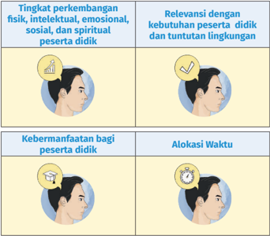
> **[Konteks Visual]**: Tabel ini berisi informasi tentang aspek-aspek penting dalam proses pendidikan, yaitu:

1. Tingkat perkembangan fisik, intelektual, emosional, sosial, dan spiritual peserta didik.
2. Relevansi dengan kebutuhan peserta didik dan tuntutan lingkungan.
3. Kebermanfaatan bagi peserta didik.
4. Alokasi waktu.

Gambar-gambar di tabel tersebut mungkin menunjukkan:
- Lingkungan belajar yang mendukung perkembangan fisik dan emosional.
- Siswa yang aktif berinteraksi dengan lingkungan belajar.
- Siswa yang mengikuti program pendidikan yang relevan dengan kebutuhan mereka.
- Siswa yang merasa puas dengan hasil belajar mereka.
- Jadwal belajar yang efektif dan teratur.

Diagram yang mungkin digunakan untuk menunjukkan aspek-aspek ini termasuk:
- Grafik yang menunjukkan perkembangan fisik, intelektual, emosional, sosial, dan spiritual peserta didik.
- Diagram yang menunjukkan hubungan antara kebutuhan peserta didik dan tuntutan lingkungan.
- Infografik yang menunjukkan manfaat pendidikan bagi peserta didik.
- Diagram waktu yang menunjukkan alokasi waktu dalam proses belajar.

Tabel ini digunakan untuk memberikan panduan dalam pengambilan keputusan tentang strategi pendidikan yang efektif dan berkelanjutan.

Dengan  memperhatikan  hal  tersebut  maka  pengembangan  materi pembelajaran  antropologi  akan  sangat  runtut,  konseptual,  kontekstual serta aktual sesuai dengan perkembangan keilmuan dan kebutuhan peserta didik.  Pembelajaran  yang  dilakukan  di  kelas  hendaknya  disesuaikan dengan situasi dan kondisi peserta didik dan perkembangan lingkungan sekitar peserta didik dan kondisi dunia pada umumnya. Guru juga perlu melakukan pengayaan dari sumber-sumber lokal yang dapat dieksplorasi dari perpustakaan sekolah, daerah atau pun berbagai situs di media maya.

## 2.  Pendekatan Pembelajaran Antropologi
Proses pemenuhan capaian pembelajaran ditempuh melalui pengalaman belajar yang melibatkan proses mental dan fisik melalui interaksi  antara  peserta  didik,  guru,  lingkungan,  dan  sumber  belajar lainnya.  Pengalaman  belajar  yang  dimaksud  dapat  terwujud  melalui pendekatan  pembelajaran  yang  bervariasi  antara  lain  pendekatan inkuiri, pembelajaran  berbasis  proyek  ( project  based  learning )  dan pembelajaran berbasis masalah (problem based learning) . Pengalaman belajar  memuat  kecakapan  hidup  yang  perlu  dikuasai  peserta  didik dan  diterapkan  dalam  kehidupan  bermasyarakat.  Penjelasan  untuk mengembangkan berbagai metode pada kegiatan pembelajaran adalah sebagai berikut:

### [HALAMAN_37]

## a.  Pendekatan Inkuiri
Pendekatan inkuiri merupakan pendekatan pembelajaran yang  menempatkan  peserta  didik  sebagai  pusat  pembelajaran. Pendekatan  ini  mewakili  pembelajaran  induktif  yang  membuka kesempatan  bagi  peserta  didik  dalam  mencari,  mengumpulkan, menganalisis, dan mengevaluasi pengetahuan yang tengah dipelajarinya (Murdoch 2015). Pendekatan ini mensyaratkan baik peserta didik maupun guru bersikap aktif dalam pembelajaran.
Tujuan  dari  pendekatan  ini,  peserta  didik  mampu  menjadi pembelajar sepanjang hayat. Ringkasnya, pendekatan ini mendorong  peserta  didik  menjadi  pembelajar  mandiri.  Untuk efektifitas  pembelajaran, maka aktivitas pendekatan inkuiri yang direkomendasikan  adalah  kegiatan  yang  menitikberatkan  proses berpikir analitis dan kritis dalam membangun pertanyaan sekaligus mencari jawaban secara aktif.
Peran  peserta  didik  adalah  menempatkan  diri  sebagai  pusat pembelajaran dan karena itu bersikap aktif. Sedangkan peran guru adalah memfasilitasi atau sebagai fasilitator sekaligus pendamping peserta  didik.  Proses  pembelajaran  melalui  pendekatan  inkuiri dapat dilakukan dengan: pertama, teknik diskusi dan tanya jawab antara peserta didik dan guru. Teknik ini bertujuan untuk membangun pemahaman bahwa antropologi bukan sebagai ilmu yang mempelajari kebudayaan suku bangsa semata tapi berbagai fenomena sosial aktual sesuai dengan perkembangan zaman yang terdapat di masyarakat. Kedua, memberikan penugasan baik secara kelompok maupun individual.
Bagian 1
Petunjuk Umum Penugasan  dilakukan  melalui  pengamatan  langsung  untuk memahami  berbagai  fenomena  kebudayaan  di  Indonesia  baik tradisi  budaya  lokal  maupun  kehidupan  masyarakat  modern. Ketiga, guru dapat memperkaya bahan pembelajaran di luar buku teks dari sumber belajar lain dengan membandingkannya dengan buku lain, jurnal ilmiah, artikel di media, serta sumber lain yang relevan. Untuk mengukuhkan pemahaman yang kuat ada baiknya guru  dapat  menampilkan  visualisasi  baik  berupa  foto,  infografis (gambar skematik, denah, dan sebagainya), peta dan dokumentasi audio visual seperti film yang relevan dengan kebutuhan pembelajaran  peserta  didik.  Implementasi  pendekatan  inkuiri dilaksanakan melalui serangkaian prosedur dalam mengelola kelas sebagai berikut ini:

### [HALAMAN_38]

## b.  Pembelajaran Berbasis Masalah ( Problem Based Learning )
Pendekatan  ini  merupakan  model  pembelajaran  yang  mengajak peserta didik untuk mengeksplorasi secara mendalam terkait materi yang tengah dipelajari dengan cara menemukan masalah yang ada di masyarakat dan mencari jalan ke luar masalah tersebut. Masalah yang  terdapat  di  lingkungan  sekitar  peserta  didik  dieksplorasi sebagai pembelajaran.
Setelah  merumuskan  hal  yang  dianggap  sebagai  masalah, peserta didik didorong untuk merancang strategi guna menemukan solusi  berdasarkan  pengetahuan  dan  pengalaman  yang  mereka miliki. Terkait dengan antropologi, peserta didik diharapkan mampu memecahkan masalah yang ditemukan di masyarakat multikultural dengan pendekatan humanis. Peserta didik diajak untuk mengkaji masalah-masalah yang timbul terkait masyarakat multikultur dan dibimbing untuk menemukan solusi dari permasalahan tersebut.

### [HALAMAN_39]

## c. Pembelajaran Berbasis Proyek ( Project Based Learning )
Model pembelajaran yang memiliki kemiripan dengan pendekatan inkuiri yaitu peserta didik menjadi pusat pembelajaran. Sedangkan pembelajaran berbasis proyek adalah peserta didik diajak untuk merancang  proyek terkait pembelajaran yang sedang dikaji. Melalui  pembelajaran  berbasis  proyek,  peserta  didik  dibimbing untuk menemukan masalah sosial kemudian membuat program/ produk yang relevan dengan pemecahan masalah tersebut. Sehingga,  peserta  didik  berkontribusi  pada  solusi  masalah  sosial dan  kebudayaan  berdasarkan  konteks  daerah  dan  lingkungan peserta didik. Model pembelajaran ini lebih aplikatif, dengan modal pengetahuan dan ketrampilan peserta didik dalam mengorganisir materi pembelajaran. Selama proses pembuatan rencana pelaksanaan  pembelajaran  diharapkan  guru  menggunakan  kata kerja operasional dari Taksonomi Bloom yang disesuaikan dengan tahap-tahap  dalam  pembelajaran  berbasis  proyek.  Tindak  lanjut dari pembelajaran ini adalah peserta didik dapat membuat produk dari  hasil  pembelajaran  yang  telah  dicapai.  Akhir  dari  model pembelajaran  ini  adalah  peserta  didik  memiliki  pengetahuan, keterampilan  dan  sikap  yang  dapat  diterapkan  sepanjang  hidup mereka. Hal ini terjadi karena peserta didik diasah sensitivitasnya dengan  mendorong  peserta  didik  mengambil  tanggung  jawab
Bagian 1
Petunjuk Umum terhadap  lingkungannya,  dalam  proyek  yang  mereka  rancang sendiri untuk memecahan masalah di dunia nyata.

### [HALAMAN_40]

## E.  Penilaian
Pendidik  melakukan  penilaian  terhadap  peserta  didik  selama  proses dan setelah pembelajaran berlangsung. Penilaian melalui observasi dapat dilakukan untuk menilai keaktifan peserta didik dalam: bertanya, berdiskusi, mengeksplorasi, menganalisis dan mengemukakan hasil pembelajaran. Observasi dilakukan dengan tujuan yang jelas dan terdapat berbagai aspek selama pendidik melakukan observasi. Pendidik hendaknya merancang indikator yang jelas dalam melakukan observasi.
Menurut Buku Panduan Pembelajaran dan Assesmen yang dikeluarkan Kemendikbudristek  (2022)  disebutkan  bahwa  asesmen  adalah  aktivitas yang  menjadi  kesatuan  dalam  proses  pembelajaran.  Asesmen  dilakukan untuk  mencari  bukti  ataupun  dasar  pertimbangan  tentang  ketercapaian tujuan pembelajaran. Maka dari itu, pendidik dianjurkan untuk melakukan asesmen-asesmen berikut ini:
Asesmen formatif, yaitu asesmen yang bertujuan untuk memberikan informasi  atau  umpan  balik  bagi  pendidik  dan  peserta  didik  untuk memperbaiki proses belajar.
Asesmen sumatif, yaitu asesmen yang dilakukan untuk memastikan ketercapaian keseluruhan tujuan pembelajaran. Asesmen ini dilakukan pada akhir proses pembelajaran atau dapat juga dilakukan sekaligus  untuk  dua  atau  lebih  tujuan  pembelajaran,  sesuai  dengan pertimbangan  pendidik  dan  kebijakan  satuan  pendidikan.  Berbeda dengan  asesmen  formatif,  asesmen  sumatif  menjadi  bagian  dari perhitungan penilaian di akhir semester, akhir tahun ajaran, dan/atau akhir jenjang.
Instrumen asesmen dapat dikembangkan berdasarkan teknik penilaian yang  digunakan  oleh  pendidik.  Di  bawah  ini  diuraikan  contoh  teknik asesmen yang dapat diadaptasi, yaitu:

### [HALAMAN_41]

## 1. Observasi
Penilaian  peserta  didik  yang  dilakukan  secara  berkesinambungan melalui pengamatan perilaku yang diamati secara berkala. Observasi dapat  difokuskan  untuk  semua  peserta  didik  atau  per  individu. Observasi dapat dilakukan dalam tugas atau aktivitas rutin/harian.

## 2. Kinerja
Penilaian  yang  menuntut  peserta  didik  untuk  mendemonstrasikan dan  mengaplikasikan  pengetahuannya  ke  dalam  berbagai  macam konteks  sesuai  dengan  kriteria  yang  diinginkan.  Asesmen  kinerja dapat berupa praktik, menghasilkan produk, melakukan proyek, atau membuat portofolio.

## 3. Proyek
Kegiatan penilaian terhadap suatu tugas meliputi kegiatan perancangan,  pelaksanaan,  dan  pelaporan,  yang  harus  diselesaikan dalam periode/waktu tertentu.

## 4. Tes Tertulis
Tes dengan soal dan jawaban disajikan secara tertulis untuk mengukur atau  memperoleh  informasi  tentang  kemampuan  peserta  didik.  Tes tertulis  dapat  berbentuk  esai,  pilihan  ganda,  uraian,  atau  bentukbentuk tes tertulis lainnya.

## 5. Tes Lisan
Pemberian soal/pertanyaan yang menuntut peserta didik menjawab secara lisan, dan dapat diberikan secara klasikal ketika pembelajaran.

## 6. Penugasan
Pemberian tugas kepada peserta didik untuk mengukur pengetahuan dan  memfasilitasi  peserta  didik  memperoleh  atau  meningkatkan pengetahuan.

## 7. Portofolio
Kumpulan dokumen hasil penilaian, penghargaan, dan karya peserta didik  dalam  bidang  tertentu  yang  mencerminkan  perkembangan ( reflektif-integratif ) dalam kurun waktu tertentu.

### [HALAMAN_42]

## F. Remedial
Remedial adalah proses pembelajaran yang diberikan kepada peserta didik yang  belum  mencapai  tahap  kriteria  ketercapaian  tujuan  pembelajaran (KKTP).  Layanan  pembelajaran  ini  diberikan  kepada  peserta  didik  yang mengalami  kesulitan  dalam  memahami  atau  mengaplikasikan  materi pembelajaran. Pendidik hendaknya menggunakan berbagai strategi remedial  untuk  mendukung  peserta  didik  yang  memiliki  hambatan. Beberapa  strategi  yang  dapat  digunakan  adalah  pendampingan  belajar secara intensif dan individual,  penggunaan konsep dengan Bahasa yang  disederhanakan  dan  contoh  konkret,  bantuan  teman  sebaya  dan pendampingan  belajar  dari  orang  tua/  wali.  Dengan  adanya  remedial, diharapkan peserta didik mendapatkan layanan dan dukungan terbaik dari pendidik dan berbagai pihak sehingga kompetensi minimumnya tercapai.

## G.  Pengayaan
Pengayaan adalah aktivitas dalam proses pembelajaran yang memberikan kesempatan kepada peserta didik untuk memperdalam materi pembelajaran. Pendidik  hendaknya  memetakan  keragaman  peserta  didik  dengan  baik sehingga  dapat  memberikan  dukungan  yang  sesuai  dengan  kebutuhan peserta  didik.  Tujuan  pengayaan  adalah  mengembangkan  potensi  terbaik peserta didik. Guru dapat memberikan tambahan/ pendalaman materi dan penugasan kepada peserta didik sebagai motivasi agar lebih antusias belajar.

## H.  Interaksi dengan Orang Tua/Wali
Proses pembelajaran  dikatakan berhasil apabila  semua  unsur  yang ada  di dalamnya  berjalan  sinergi  dan  selaras.  Strategi yang  efektif memaksimalkan pendidikan adalah dengan membangun kerja sama antar pemangku kepentingan pendidikan dan institusi terkait. Hal ini bertujuan memaksimalkan 3 (tiga) pilar pendidikan Ki Hajar Dewantara yaitu alam perguruan, alam keluarga dan alam pergerakan pemuda.
Buku Panduan Guru Antropologi SMA/MA Kelas XII

### [HALAMAN_43]

Pada pilar alam keluarga, diharapkan orang tua/ wali dari peserta didik ikut ambil bagian dalam memberikan motivasi dan menyiapkan peserta didik di luar sekolah (perguruan). Keluarga merupakan sosialisasi primer peserta didik,  figur  orang  tua/wali  merupakan  pendidik  di  luar  institusi  sekolah setelah  masyarakat.  Peran  penting  orang  tua/wali  yang  cukup  signifikan terhadap perkembangan peserta didik inilah yang digunakan oleh guru.
Untuk memaksimalkan pembelajaran, guru hendaknya berkomunikasi intens  dengan  orang  tua/wali  sehingga  dukungan  terbaik  diperoleh  oleh peserta  didik.  Hal  yang  dapat  disampaikan  dalam  komunikasi  adalah perkembangan belajar, dengan tujuan agar ditindaklanjuti oleh orang tua/ wali dengan membimbing, memberikan contoh dan dukungan agar tujuan pembelajaran dapat tercapai.

## Peran Orang Tua terhadap pembelajaran peserta didik:
Memberikan pendampingan kepada peserta didik di luar sekolah terkait informasi bahan pembelajaran agar selaras dengan nilai Bhinneka Tunggal Ika.
-----------------
Memberikan fasilitas terkait kebutuhan anak dalam mempelajari materi dan kegiatan pembelajaran.
----------------- Bagian 1
Petunjuk Umum Buku Panduan Guru Antropologi SMA/MA Kelas XII

### [HALAMAN_44]

Melakukan koordinasi kepada pihak sekolah terkait sejauh mana pencapaian peserta didik di luar sekolah dalam rangka mencapai tujuan pendidikan yang maksimal.

### [HALAMAN_45]

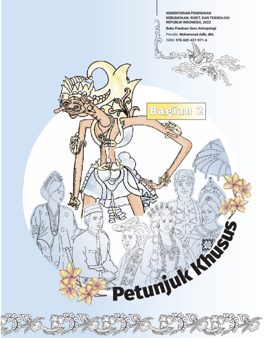
> **[Konteks Visual]**: Maaf, gagal memproses gambar secara teknis: CUDA error: device-side assert triggered
Search for `cudaErrorAssert' in https://docs.nvidia.com/cuda/cuda-runtime-api/group__CUDART__TYPES.html for more information.
CUDA kernel errors might be asynchronously reported at some other API call, so the stacktrace below might be incorrect.
For debugging consider passing CUDA_LAUNCH_BLOCKING=1
Compile with `TORCH_USE_CUDA_DSA` to enable device-side assertions.

### [HALAMAN_46]

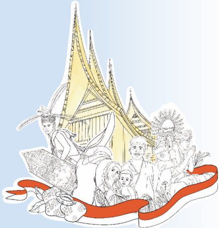
> **[Konteks Visual]**: Maaf, gagal memproses gambar secara teknis: CUDA error: device-side assert triggered
Search for `cudaErrorAssert' in https://docs.nvidia.com/cuda/cuda-runtime-api/group__CUDART__TYPES.html for more information.
CUDA kernel errors might be asynchronously reported at some other API call, so the stacktrace below might be incorrect.
For debugging consider passing CUDA_LAUNCH_BLOCKING=1
Compile with `TORCH_USE_CUDA_DSA` to enable device-side assertions.

### [HALAMAN_47]

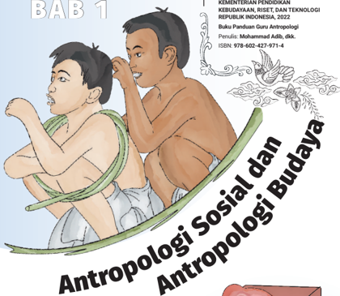
> **[Konteks Visual]**: Maaf, gagal memproses gambar secara teknis: CUDA error: device-side assert triggered
Search for `cudaErrorAssert' in https://docs.nvidia.com/cuda/cuda-runtime-api/group__CUDART__TYPES.html for more information.
CUDA kernel errors might be asynchronously reported at some other API call, so the stacktrace below might be incorrect.
For debugging consider passing CUDA_LAUNCH_BLOCKING=1
Compile with `TORCH_USE_CUDA_DSA` to enable device-side assertions.

> **[Konteks Visual]**: Maaf, gagal memproses gambar secara teknis: CUDA error: device-side assert triggered
Search for `cudaErrorAssert' in https://docs.nvidia.com/cuda/cuda-runtime-api/group__CUDART__TYPES.html for more information.
CUDA kernel errors might be asynchronously reported at some other API call, so the stacktrace below might be incorrect.
For debugging consider passing CUDA_LAUNCH_BLOCKING=1
Compile with `TORCH_USE_CUDA_DSA` to enable device-side assertions.

## Tujuan Pembelajaran
Menjelaskan  secara  kreatif  dan kritis terhadap pengertian dan ruang  lingkup  antropologi  sosial dan antropologi budaya.
Memberikan contoh praktikpraktik sosial dan budaya yang ada di lingkungan sekitar.

> **[Konteks Visual]**: Maaf, gagal memproses gambar secara teknis: CUDA error: device-side assert triggered
Search for `cudaErrorAssert' in https://docs.nvidia.com/cuda/cuda-runtime-api/group__CUDART__TYPES.html for more information.
CUDA kernel errors might be asynchronously reported at some other API call, so the stacktrace below might be incorrect.
For debugging consider passing CUDA_LAUNCH_BLOCKING=1
Compile with `TORCH_USE_CUDA_DSA` to enable device-side assertions.

> **[Konteks Visual]**: Maaf, gagal memproses gambar secara teknis: CUDA error: device-side assert triggered
Search for `cudaErrorAssert' in https://docs.nvidia.com/cuda/cuda-runtime-api/group__CUDART__TYPES.html for more information.
CUDA kernel errors might be asynchronously reported at some other API call, so the stacktrace below might be incorrect.
For debugging consider passing CUDA_LAUNCH_BLOCKING=1
Compile with `TORCH_USE_CUDA_DSA` to enable device-side assertions.

### [HALAMAN_48]

## A.  Petunjuk Khusus Bab 1
Pada bab 1 pada buku teks peserta didik menyajikan materi antropologi sosial  dan  antropologi  budaya,  sebagai  lanjutan  dari  yang  sudah  kalian pelajari pada Kelas XI tentang Pengantar ilmu antropologi, sehingga pada buku  teks  tersebut  merupakan  pendalaman  konsep  antropologi  sosial dan antropologi budaya dan juga bagaimana relasi antara cabang-cabang antropologi  dengan  ilmu  yang  lain  beserta  dengan  aplikasinya.  Pada buku  teks  peserta  didik  tersebut  dilengkapi  dengan  berbagai  aktivitas pembelajaran (lembar kerja), pengayaan, informasi pojok antropologi serta soal tes formatif.

## 1.  Tujuan Pembelajaran
Tujuan pembelajaran pada Bab 1 adalah peserta didik mampu:
Menjelaskan  secara  kreatif  dan  kritis  terhadap  pengertian  dan ruang lingkup antropologi sosial dan antropologi budaya.
Memberikan contoh praktik-praktik sosial dan budaya yang ada di lingkungan sekitarnya.

## 2.  Indikator Capaian Pembelajaran
Setelah mengikuti pelajaran antropologi dan memahami bacaan pada pembahasan bab ini peserta didik mampu:
Menjelaskan pengertian antropologi sosial dan antropologi budaya,
Membedakan cakupan antropologi sosial dan antropologi budaya
Memberikan  contoh  antropologi  terapan  (kegunaan  Antropologi dalam kehidupan sehari-hari).
Menjelaskan  hubungan  antar  cabang-cabang  ilmu  antropologi dengan ilmu yang lain secara nyata dalam keseharian masyarakat.

## 3.  Pokok Materi dan Hubungan Pokok Materi dalam Mencapai Tujuan Pembelajaran
Materi  dalam  bab  1  ini  adalah  antropologi  Sosial  dan  antropologi Budaya yang diberikan kepada peserta didik kelas XII.  Pada materi ini penjelasan tentang konsep antropologi sosial dan antropologi budaya berbeda dengan yang dipelajari pada kelas XI. Pada materi ini lebih memperdalam konsep antropologi sosial dan antropologi budaya dan juga bagaimana relasi antara cabang-cabang antropologi dengan ilmu yang lain beserta dengan aplikasinya.

### [HALAMAN_49]

Bapak/Ibu  guru  dapat  menjelaskan  konsep,  contoh  dan  peranan antropologi sosial dan antropologi budaya dalam kehidupan masyarakat diantaranya  dalam  pengelolaan  dan  penyelesaian  konflik  juga  dalam penerapan dunia yang lebih global seperti dalam dunia bisnis yang sudah mengglobal.  Untuk  dapat  tercapainya  tujuan  pembelajaran  dan  dapat dipahami dengan baik oleh peserta didik, Bapak/Ibu guru dapat meminta peserta  didik  mencari  contoh-contoh  nyata  terkait  kasus-kasus  sesuai materi bahasan dari kehidupan sehari-hari di sekitar tempat tinggal.

## 4.	 Kaitan	Materi	dengan	Profil	Pelajar	Pancasila
Kaitan materi pada Bab 1 ini dengan profil pelajar Pancasila disajikan pada tabel berikut:

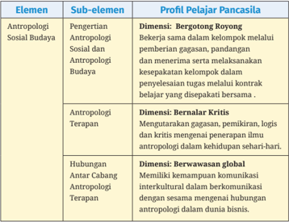
> **[Konteks Visual]**: Maaf, gagal memproses gambar secara teknis: CUDA error: device-side assert triggered
Search for `cudaErrorAssert' in https://docs.nvidia.com/cuda/cuda-runtime-api/group__CUDART__TYPES.html for more information.
CUDA kernel errors might be asynchronously reported at some other API call, so the stacktrace below might be incorrect.
For debugging consider passing CUDA_LAUNCH_BLOCKING=1
Compile with `TORCH_USE_CUDA_DSA` to enable device-side assertions.

> **[Konteks Visual]**: Maaf, gagal memproses gambar secara teknis: CUDA error: device-side assert triggered
Search for `cudaErrorAssert' in https://docs.nvidia.com/cuda/cuda-runtime-api/group__CUDART__TYPES.html for more information.
CUDA kernel errors might be asynchronously reported at some other API call, so the stacktrace below might be incorrect.
For debugging consider passing CUDA_LAUNCH_BLOCKING=1
Compile with `TORCH_USE_CUDA_DSA` to enable device-side assertions.

### [HALAMAN_50]

## 5.  Skema Pembelajaran
Skema pembelajaran yang tertera di bawah ini tidak baku. Bapak/Ibu guru  dapat  menyesuaikan  atau  mengembangkannya  sesuai  dengan situasi  dan  kebutuhan.  Sedangkan  cakupan  materi  dan  aktivitas pembelajaran pada Bab I dapat saja dibutuhkan pertemuan sebanyak empat  pertemuan  dengan  alokasi  dua  minggu    dan  jam  pelajaran sebanyak 8 JP. Jumlah JP dan jumlah waktu pertemuan dapat diubah sesuai dengan alokasi program semester atau program tahunan dan juga mempertimbangkan kedalaman materi yang diperlukan serta situasi dan kondisi kelas masing-masing. Sebagai contoh skema pembelajaran dapat disajikan pada Tabel 1.2. berikut.

### [HALAMAN_51]

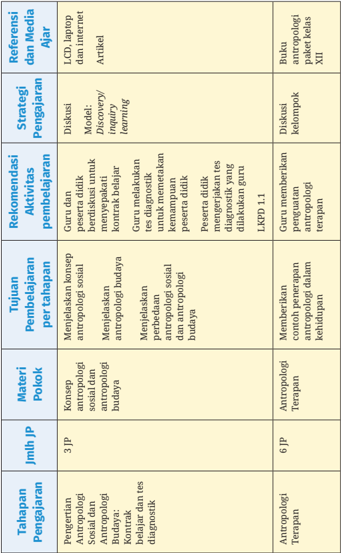
> **[Konteks Visual]**: Maaf, gagal memproses gambar secara teknis: CUDA error: device-side assert triggered
Search for `cudaErrorAssert' in https://docs.nvidia.com/cuda/cuda-runtime-api/group__CUDART__TYPES.html for more information.
CUDA kernel errors might be asynchronously reported at some other API call, so the stacktrace below might be incorrect.
For debugging consider passing CUDA_LAUNCH_BLOCKING=1
Compile with `TORCH_USE_CUDA_DSA` to enable device-side assertions.

> **[Konteks Visual]**: Maaf, gagal memproses gambar secara teknis: CUDA error: device-side assert triggered
Search for `cudaErrorAssert' in https://docs.nvidia.com/cuda/cuda-runtime-api/group__CUDART__TYPES.html for more information.
CUDA kernel errors might be asynchronously reported at some other API call, so the stacktrace below might be incorrect.
For debugging consider passing CUDA_LAUNCH_BLOCKING=1
Compile with `TORCH_USE_CUDA_DSA` to enable device-side assertions.

### [HALAMAN_52]

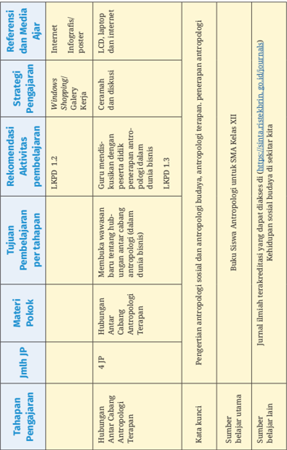
> **[Konteks Visual]**: Maaf, gagal memproses gambar secara teknis: CUDA error: device-side assert triggered
Search for `cudaErrorAssert' in https://docs.nvidia.com/cuda/cuda-runtime-api/group__CUDART__TYPES.html for more information.
CUDA kernel errors might be asynchronously reported at some other API call, so the stacktrace below might be incorrect.
For debugging consider passing CUDA_LAUNCH_BLOCKING=1
Compile with `TORCH_USE_CUDA_DSA` to enable device-side assertions.

### [HALAMAN_53]

## 6.	 Rekomendasi	Peran	Guru	dalam	Aktivitas Pembelajaran

## a.  Rekomendasi	dalam	Aktivitas	 Pembelajaran	 Pertemuan Pertama
Rincian tahapan pada masing-masing pertemuan dapat dijelaskan sebagai berikut:

> **[Konteks Visual]**: Maaf, gagal memproses gambar secara teknis: CUDA error: device-side assert triggered
Search for `cudaErrorAssert' in https://docs.nvidia.com/cuda/cuda-runtime-api/group__CUDART__TYPES.html for more information.
CUDA kernel errors might be asynchronously reported at some other API call, so the stacktrace below might be incorrect.
For debugging consider passing CUDA_LAUNCH_BLOCKING=1
Compile with `TORCH_USE_CUDA_DSA` to enable device-side assertions.

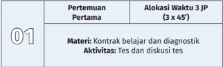
> **[Konteks Visual]**: Maaf, gagal memproses gambar secara teknis: CUDA error: device-side assert triggered
Search for `cudaErrorAssert' in https://docs.nvidia.com/cuda/cuda-runtime-api/group__CUDART__TYPES.html for more information.
CUDA kernel errors might be asynchronously reported at some other API call, so the stacktrace below might be incorrect.
For debugging consider passing CUDA_LAUNCH_BLOCKING=1
Compile with `TORCH_USE_CUDA_DSA` to enable device-side assertions.

Rekomendasi kegiatan belajar oleh guru dan peserta didik:

## ⌦ Pendahuluan
Guru dan peserta didik mengucapkan salam dan doa sesuai keyakinan masing-masing.
Guru mengecek kehadiran peserta didik dan mempersiapkan alat dan bahan pembelajaraan di kelas.
Guru memberi motivasi kepada peserta didik agar semangat belajar.
Guru dan peserta didik berdiskusi dan membuat kesepakatan kontrak belajar  guna mempersiapkan kegiatan pembelajaran yang menjamin suasana yang kondusif, ramah anak ( anti-bullying fisik maupun SARA), aktif dalam bertanya dan berargumen, serta tidak adanya kesenjangan dalam penyampaian ilmu pengetahuan di kelas.
Guru melakukan apersepsi, memberikan stimulus beberapa permasalahan  Antropologi  yang  pernah  dijumpai  peserta  didik  di sekitar  mereka,  Kaitkan  pula  dengan  keberagaman  kebudayaan  dan berikan  stimulus  berupa  berbagai  pertanyaan  kepada  peserta  didik tentang latar belakang mempelajari ilmu antropologi.

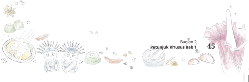
> **[Konteks Visual]**: Maaf, gagal memproses gambar secara teknis: CUDA error: device-side assert triggered
Search for `cudaErrorAssert' in https://docs.nvidia.com/cuda/cuda-runtime-api/group__CUDART__TYPES.html for more information.
CUDA kernel errors might be asynchronously reported at some other API call, so the stacktrace below might be incorrect.
For debugging consider passing CUDA_LAUNCH_BLOCKING=1
Compile with `TORCH_USE_CUDA_DSA` to enable device-side assertions.

### [HALAMAN_54]

## KONTRAK BELAJAR
Selama pembelajaran saya berkomitmen untuk:
Mengikuti  proses  belajar  dengan  kondusif  dan  tata  tertib  sesuai dengan aturan sekolah.
Mengerjakan tugas dengan kesungguhan, tepat waktu dan diutamakan nilai kejujuran.
Mendengarkan penjelasan guru, jika kurang paham dapat bertanya dengan angkat tangan.
Tidak  melakukan  perundungan  dan  pelecehan  seksual  dalam bentuk apapun (verbal-fisik).
Menghargai teman ketika bertanya, mempresentasikan argumen di depan kelas serta menjunjung tinggi nilai.
Menjaga kebersihan kelas.
Meminta  izin  guru  jika  ingin  ke  luar  dari  pembelajaran  kelas karena ada keperluan hal yang mendesak dan memaksa.
Siap  bekerja  sama  dan  berkolaborasi  dengan  teman  apabila terdapat tugas kelompok.
Hadir tepat waktu.
 Apabila ketentuan (1) hingga (9) dilanggar maka saya siap untuk menerima sanksi yang berlaku di sekolah.
Bandung, ……Mei 2022
Tanda tangan (nama peserta didik)
Gambar 2.1 Contoh kontrak belajar Kelas XII Mata Pelajaran Antropologi.
Catatan:  Guru  dapat  mengembangkan isi kontrak belajar  sesuai  dengan kebutuhan dan kondisi peserta didik dan sekolah.

## ⌦ Kegiatan Inti
Guru mengenalkan materi pembelajaran antropologi kelas XII.
Guru menanyakan kepada peserta didik tentang keberagaman masyarakat Indonesia.
Guru menggali pengetahuan awal peserta didik mengenai antropologi dalam diskusi kelas.

### [HALAMAN_55]

Guru melakukan tes diagnostik untuk mengetahui kemampuan awal peserta didik sebagai bekal untuk menentukan strategi pembelajaran pada pertemuan selanjutnya.
Peserta didik mengerjakan tes diagnostik yang diberikan guru.
Guru mengajak peserta didik berdiskusi soal diagnostik yang diberikan.
Guru  menyampaikan  topik  antropologi  apa  yang  akan  dipelajari  di pertemuan selanjutnya yakni antropologi sosial dan antropologi budaya.
Guru  memberi  penugasan  tentang  konsep  antropologi  sosial  dan antropologi budaya  melalui kasus yang disajikan di Buku  Teks Pembelajaran Kelas XII.

## ⌦ Penutup
Guru  memberikan  penguatan  kepada  peserta  didik  agar  membaca materi yang hendak dipelajari di pertemuan selanjutnya.
Guru bertanya terhadap peserta didik dan mengevaluasi pembelajaran tentang metode pembelajaran, suasana kelas dan sebagainya yang akan digunakan untuk pertemuan selanjutnya.
Guru memandu doa dan menutup pembelajaran dengan salam.

## ⌦ Metode dan Model Pembelajaran
Metode pembelajaran yang akan digunakan adalah Discovery/Inquiry Learning bahwa peran peserta didik adalah belajar dengan aktif dan sebagai pusat pembelajaran ( student centre-learning ). Peran guru dalam konteks ini sebagai fasilitator dan pembimbing saja.
Skenario pembelajaran: setelah melaksanakan kegiatan tes diagnostik peserta  didik  diharapkan  aktif  dalam  berdiskusi  dan  berpikir  kritis terhadap soal-soal yang baru saja di kerjakan.

## ⌦ Media dan Alat Pembelajaran
LCD  proyektor,  komputer  atau  laptop,  tayangan  slide Powerpoint (ppt, papan tulis, buku, poster, spidol, video, dan media lain yang telah disiapkan.

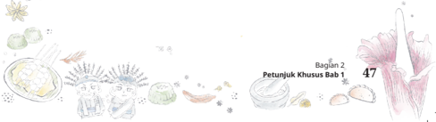
> **[Konteks Visual]**: Maaf, gagal memproses gambar secara teknis: CUDA error: device-side assert triggered
Search for `cudaErrorAssert' in https://docs.nvidia.com/cuda/cuda-runtime-api/group__CUDART__TYPES.html for more information.
CUDA kernel errors might be asynchronously reported at some other API call, so the stacktrace below might be incorrect.
For debugging consider passing CUDA_LAUNCH_BLOCKING=1
Compile with `TORCH_USE_CUDA_DSA` to enable device-side assertions.

### [HALAMAN_56]

> **[Konteks Visual]**: Maaf, gagal memproses gambar secara teknis: CUDA error: device-side assert triggered
Search for `cudaErrorAssert' in https://docs.nvidia.com/cuda/cuda-runtime-api/group__CUDART__TYPES.html for more information.
CUDA kernel errors might be asynchronously reported at some other API call, so the stacktrace below might be incorrect.
For debugging consider passing CUDA_LAUNCH_BLOCKING=1
Compile with `TORCH_USE_CUDA_DSA` to enable device-side assertions.

## ⌦ Sumber Belajar
Buku  antropologi  kelas  XII,  buku  antropologi  lain  yang  relevan,  jurnal, video, internet, dan lain-lain.

> **[Konteks Visual]**: Maaf, gagal memproses gambar secara teknis: CUDA error: device-side assert triggered
Search for `cudaErrorAssert' in https://docs.nvidia.com/cuda/cuda-runtime-api/group__CUDART__TYPES.html for more information.
CUDA kernel errors might be asynchronously reported at some other API call, so the stacktrace below might be incorrect.
For debugging consider passing CUDA_LAUNCH_BLOCKING=1
Compile with `TORCH_USE_CUDA_DSA` to enable device-side assertions.

## ⌦ Penilaian
Peserta didik diberikan penilaian proses melalui pengamatan terutama mengenai  aktivitasnya,  kemampuan  menyampaikan  pendapat,  dan kerja sama.
Peserta didik diberi tugas rumah untuk melakukan identifikasi ruang lingkup antropologi sosial budaya.
Pada pertemuan berikutnya peserta didik diberikan nilai dan komentar oleh guru tentang tugas peserta didik tersebut.
Guru  dapat  melakukan  penilaian  selama  dan  setelah  pembelajaran berlangsung. Agar penilaian observasi dapat berjalan baik, maka guru harus memperhatikan sebagai berikut:
Fokus pada capaian pembelajaran
Indikator aspek penilaian harus jelas
Berdasarkan  pada  instrumen  penilaian  berupa  check  list  yang memudahkan  penilaian.  Penilaian  ini  seringkali  tidak  diketahui oleh peserta didik.

### [HALAMAN_57]

## ⌦ Contoh Penilaian

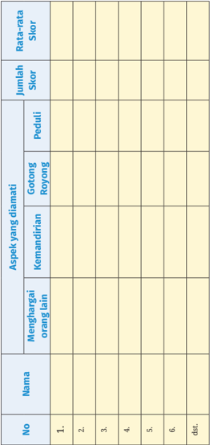
> **[Konteks Visual]**: Maaf, gagal memproses gambar secara teknis: CUDA error: device-side assert triggered
Search for `cudaErrorAssert' in https://docs.nvidia.com/cuda/cuda-runtime-api/group__CUDART__TYPES.html for more information.
CUDA kernel errors might be asynchronously reported at some other API call, so the stacktrace below might be incorrect.
For debugging consider passing CUDA_LAUNCH_BLOCKING=1
Compile with `TORCH_USE_CUDA_DSA` to enable device-side assertions.

Bagian 2

### [HALAMAN_58]

> **[Konteks Visual]**: Maaf, gagal memproses gambar secara teknis: CUDA error: device-side assert triggered
Search for `cudaErrorAssert' in https://docs.nvidia.com/cuda/cuda-runtime-api/group__CUDART__TYPES.html for more information.
CUDA kernel errors might be asynchronously reported at some other API call, so the stacktrace below might be incorrect.
For debugging consider passing CUDA_LAUNCH_BLOCKING=1
Compile with `TORCH_USE_CUDA_DSA` to enable device-side assertions.

## ⌦ Rubrik Penilaian

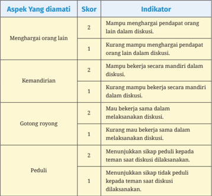
> **[Konteks Visual]**: Maaf, gagal memproses gambar secara teknis: CUDA error: device-side assert triggered
Search for `cudaErrorAssert' in https://docs.nvidia.com/cuda/cuda-runtime-api/group__CUDART__TYPES.html for more information.
CUDA kernel errors might be asynchronously reported at some other API call, so the stacktrace below might be incorrect.
For debugging consider passing CUDA_LAUNCH_BLOCKING=1
Compile with `TORCH_USE_CUDA_DSA` to enable device-side assertions.

## Keterangan :
Skor maksimal =
(banyaknya aspek) x (skor tertinggi setiap aspek)
Rata-rata Skor =

## Skor Maksimal : Banyaknya aspek
Nilai Sikap diperoleh dengan kriteria sebagai berikut:
Rata-rata Skor > 1 - 2 maka Nilai Sikapnya adalah Sangat Baik
Rata-rata Skor  = 1 maka Nilai Sikapnya adalah Baik Bagian 2

### [HALAMAN_59]

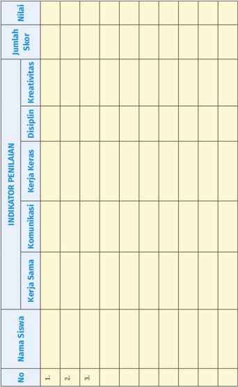
> **[Konteks Visual]**: Maaf, gagal memproses gambar secara teknis: CUDA error: device-side assert triggered
Search for `cudaErrorAssert' in https://docs.nvidia.com/cuda/cuda-runtime-api/group__CUDART__TYPES.html for more information.
CUDA kernel errors might be asynchronously reported at some other API call, so the stacktrace below might be incorrect.
For debugging consider passing CUDA_LAUNCH_BLOCKING=1
Compile with `TORCH_USE_CUDA_DSA` to enable device-side assertions.

> **[Konteks Visual]**: Maaf, gagal memproses gambar secara teknis: CUDA error: device-side assert triggered
Search for `cudaErrorAssert' in https://docs.nvidia.com/cuda/cuda-runtime-api/group__CUDART__TYPES.html for more information.
CUDA kernel errors might be asynchronously reported at some other API call, so the stacktrace below might be incorrect.
For debugging consider passing CUDA_LAUNCH_BLOCKING=1
Compile with `TORCH_USE_CUDA_DSA` to enable device-side assertions.

Petunjuk Khusus Bab 1
51
S

### [HALAMAN_60]

> **[Konteks Visual]**: Maaf, gagal memproses gambar secara teknis: CUDA error: device-side assert triggered
Search for `cudaErrorAssert' in https://docs.nvidia.com/cuda/cuda-runtime-api/group__CUDART__TYPES.html for more information.
CUDA kernel errors might be asynchronously reported at some other API call, so the stacktrace below might be incorrect.
For debugging consider passing CUDA_LAUNCH_BLOCKING=1
Compile with `TORCH_USE_CUDA_DSA` to enable device-side assertions.

## ⌦ Rubrik Penilaian

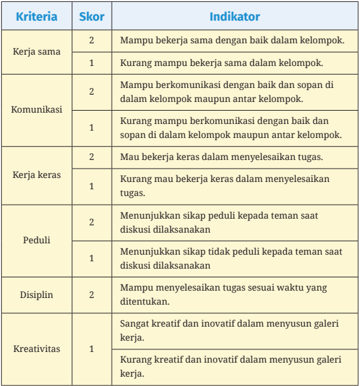
> **[Konteks Visual]**: Maaf, gagal memproses gambar secara teknis: CUDA error: device-side assert triggered
Search for `cudaErrorAssert' in https://docs.nvidia.com/cuda/cuda-runtime-api/group__CUDART__TYPES.html for more information.
CUDA kernel errors might be asynchronously reported at some other API call, so the stacktrace below might be incorrect.
For debugging consider passing CUDA_LAUNCH_BLOCKING=1
Compile with `TORCH_USE_CUDA_DSA` to enable device-side assertions.

Keterangan:
Skor maksimal =
(banyaknya kriteria) x (skor tertinggi setiap kriteria)
Nilai tugas =
Jumlah skor perolehan x 100 Jumlah skor maksimal

### [HALAMAN_61]

## b.	 Rekomendasi	dalam	Aktivitas	 Pembelajaran	 Pertemuan Kedua
Rincian tahapan pada masing-masing pertemuan dapat dijelaskan sebagai berikut:

> **[Konteks Visual]**: Maaf, gagal memproses gambar secara teknis: CUDA error: device-side assert triggered
Search for `cudaErrorAssert' in https://docs.nvidia.com/cuda/cuda-runtime-api/group__CUDART__TYPES.html for more information.
CUDA kernel errors might be asynchronously reported at some other API call, so the stacktrace below might be incorrect.
For debugging consider passing CUDA_LAUNCH_BLOCKING=1
Compile with `TORCH_USE_CUDA_DSA` to enable device-side assertions.

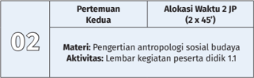
> **[Konteks Visual]**: Maaf, gagal memproses gambar secara teknis: CUDA error: device-side assert triggered
Search for `cudaErrorAssert' in https://docs.nvidia.com/cuda/cuda-runtime-api/group__CUDART__TYPES.html for more information.
CUDA kernel errors might be asynchronously reported at some other API call, so the stacktrace below might be incorrect.
For debugging consider passing CUDA_LAUNCH_BLOCKING=1
Compile with `TORCH_USE_CUDA_DSA` to enable device-side assertions.

Rekomendasi kegiatan belajar oleh guru dan peserta didik:

## ⌦ Pendahuluan
Guru dan peserta didik mengucapkan salam dan doa menurut keyakinan masing-masing.
Guru mengecek kehadiran peserta didik dan mempersiapkan alat dan bahan pembelajaran di kelas.
Guru memberi motivasi pembelajaran terhadap peserta didik melalui artikel  yang  terdapat  di  Buku  Siswa  yakni Potret  Kehidupan  Suku Anak  Dalam  dan  Konflik  di  Masyarakat dan  memberi insight dalam membangun  karakter  peserta  didik  yang  berakhlak  mulia,  berbudi luhur, cerdas dan kompetitif yang disesuaikan visi dan misi sekolah.
Pertemuan  kedua  mata  pelajaran  antropologi  ini,  guru  melakukan apersepsi  yakni  mengingatkan  materi  pertemuan  yang  lalu  dan menanyakan  kembali  pertanyaan  kepada  peserta  didik  tentang  apa yang peserta harapkan ketika telah memahami ilmu antropologi.

## ⌦ Kegiatan Inti
Guru  menjelaskan  pengertian  antropologi  sosial dan  antropologi budaya secara etimologis secara singkat.
Peserta didik menyimak artikel mengenai yang terdapat di Buku Siswa yakni Potret Kehidupan Suku Anak Dalam dan Konflik di Masyarkat .

> **[Konteks Visual]**: Maaf, gagal memproses gambar secara teknis: CUDA error: device-side assert triggered
Search for `cudaErrorAssert' in https://docs.nvidia.com/cuda/cuda-runtime-api/group__CUDART__TYPES.html for more information.
CUDA kernel errors might be asynchronously reported at some other API call, so the stacktrace below might be incorrect.
For debugging consider passing CUDA_LAUNCH_BLOCKING=1
Compile with `TORCH_USE_CUDA_DSA` to enable device-side assertions.

### [HALAMAN_62]

Peserta  didik  mengidentifikasi  ruang  lingkup  antropologi  sosial  dan antropologi budaya dari artikel yang diberikan oleh guru sebagaimana yang tertuang dalam LKPD 1.1.

> **[Konteks Visual]**: Maaf, gagal memproses gambar secara teknis: CUDA error: device-side assert triggered
Search for `cudaErrorAssert' in https://docs.nvidia.com/cuda/cuda-runtime-api/group__CUDART__TYPES.html for more information.
CUDA kernel errors might be asynchronously reported at some other API call, so the stacktrace below might be incorrect.
For debugging consider passing CUDA_LAUNCH_BLOCKING=1
Compile with `TORCH_USE_CUDA_DSA` to enable device-side assertions.

## Lembar Kegiatan Peserta Didik 1.1

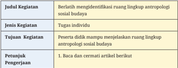
> **[Konteks Visual]**: Maaf, gagal memproses gambar secara teknis: CUDA error: device-side assert triggered
Search for `cudaErrorAssert' in https://docs.nvidia.com/cuda/cuda-runtime-api/group__CUDART__TYPES.html for more information.
CUDA kernel errors might be asynchronously reported at some other API call, so the stacktrace below might be incorrect.
For debugging consider passing CUDA_LAUNCH_BLOCKING=1
Compile with `TORCH_USE_CUDA_DSA` to enable device-side assertions.

## Antropologi Terapan

## Bangunan	antropologi:	Antropologi	yang	seperti	apa?
Kemajuan zaman membuat ilmu pengetahuan berkembang dan menyesuaikan  keadaan.  Begitu  pula  dengan  ilmu  antropologi  yang  juga mengalami perkembangan, baik bersifat progres dan regresi. Pada awal-awal kemunculannya, antropologi mengkaji mengenai masa lalu, yang mana perlu dibandingkan dengan masa kini ataupun masa yang akan datang. Keberadaan ilmu  berawal  dari  pembelajaran  dan  pengkajian  masa  lalu.  Pada  mulanya, ilmu antropologi mempelajari mengenai masyarakat primitif, tetapi di masa kini juga perlu mempelajari masyarakat modern. Mengapa demikian? Karena masyarakat juga mengalami perubahan dan perkembangan dan perlu untuk dipelajari  dan  dikaji.  Antropologi  telah  berkembang  dan  memasuki  ranah ilmu  disiplin  lainnya,  hal  ini  dibuktikan  dengan  adanya  cabang-cabang ilmu  antropologi,  antara  lain:  antropologi  kesehatan,  antropologi  ekonomi, antropologi hukum, antropologi linguistik, antropologi politik, dan sebagainya.
Pada  cabang  ilmu  tersebut  tentu  bukan  masalah  yang  mendasari  ilmu ekonomi,  kesehatan,  dan  sebagainya,  tetapi  penekanannya  mengarah  ke permasalahan yang dihadapi oleh ilmu tersebut berkaitan dengan kehidupan manusia atau kehidupan dalam suatu masyarakat.

### [HALAMAN_63]

Hal  ini  berkaitan  dengan  kehidupan  manusia  ataupun  kehidupan  suata masyarakat. Sebenarnya, segala sisi kehidupan pada manusia terdapat aspek antropologi.

## Kebudayaan	dalam	antropologi:	Bersifat	dinamis	dan	adaptif
Antropologi memiliki dua sifat, yaitu dinamis dan adaptif. Kebudayaan yang bersifat dinamis adalah kebudayaan yang mampu beradaptasi (fleksibel) dalam keadaan apa pun, sedangkan kebudayaan yang mampu menyesuaikan dengan situasi dan perkembangan zaman adalah yang bersifat dinamis.
Suatu keadaan jelas mengalami perubahan, begitu pula dengan kebudayaan yang akan berubah akibat adanya perubahan keadaan tersebut. Kebudayaan dikatakan bersifat dinamis berlaku pada tiga wujud kebudayaan yang berupa ide,  aktivitas  dan  artefak.  Suatu  ide  atau  gagasan  dikatakan  dinamis  karena mampu berubah menyesuaikan dengan keadaan yang terjadi sekarang. Seperti contoh: suatu ilmu atau pandangan yang sebelumnya sudah ada akan muncul sebuah  pandangan  baru  yang  mana  tidak  menghilangkan  pandangan  lama tersebut melainkan memperbaiki atau mengembangkannya.  Berikutnya, aktivitas adalah wujud kebudayaan yang juga memiliki sifat dinamis. Pengertian dari  aktivitas  adalah  kegiatan  manusia  dalam  berinteraksi  yang  mencakup pergaulan  dengan  sesama  dan  dilakukan  pada  kurun  waktu  tertentu  serta berpedoman pada pola-pola yang berlandaskan tata adat perilaku. Aktivitas itu sendiri bersifat konkret karena mampu dilihat dengan indera penglihatan. Kemudian,  wujud  kebudayaan  yang  terakhir  berupa  artefak  atau  bendabenda hasil karya manusia. Hal ini paling berpotensi untuk mudah berubah, karena  hasil  karya  manusia  cenderung  mengalami  suatu  perbaikan  untuk menghasilkan suatu karya yang lebih baik. Hasil  dari  gagasan  dan  aktivitas secara keseluruhan merupakan wujud kebudayaan berupa artefak dan yang paling konkret dari dua lainnya.
Kebudayaan  yang  bersifat  adaptif  adalah  kebudayaan  yang  berfokus kepada  penerapan  (aplikatif).  Adaptif  disini  lebih  kepada  perilaku  manusia yang  berusaha  untuk  menyesuaikan  ataupun  memenuhi  kebutuhan  yang mereka inginkan.
Kebudayaan sendiri dapat dijadikan manusia sebagai alat untuk beradaptasi dengan  lingkungannya,  contohnya:  Ketika  seseorang  tinggal  di  daerah  yang baru akan lebih mudah beradaptasi dengan kebudayaan yang berupa gagasan dan  akan  menjadikan  seseorang  tersebut  berpikir  menyesuaikan  dengan masyarakat di daerah tersebut. Selain itu, aktivitas dapat berupa penyesuaian
Bagian 2

### [HALAMAN_64]

pada  lingkungan  baru  atau  berupa  artefak  yang  dipakai  untuk  penerapan (aplikatif) dengan kondisi barunya tersebut.
Sumber: Herawati. 2015. 'Antropologi Terapan.' Pendidikan Kita. 2015. https://blog.unnes.ac.id/ heera/2015/11/16/antropologi-terapan/.

## 2. Jawablah pertanyaan berikut
Sebutkan cabang-cabang antropologi berdasarkan artikel diatas!
Bagaimana antropologi menyesuaikan dengan perkembangan zaman?
Mengapa antropologi perlu menyesuaikan dengan perkembangan zaman dan keadaannya? Jelaskan!
Berilah contoh konkret antropologi bersifat diinamis dalam menyesuaikan dengan perkembangan zaman!
Berilah contoh konkret antropologi bersifat adaptif  menyesuaikan dengan perkembangan zaman!
Buatlah kesimpulan tentang antropologi menyesuaikan diri dengan perkembangan zaman!
Buatlah tulisan tentang hubungan antara antropologi dengan perkembangan zaman!
Peserta didik mengerjakan tugas secara individu berdasarkan artikel yang diberikan guru.
Guru memfasilitasi peserta didik dalam mengerjakan tugas yang diberikan.
Peserta didik mempresentasikan tugas yang sudah dikerjakan.

## ⌦ Penutup
Guru memberikan semangat dan dorongan kepada peserta didik agar membaca materi yang hendak dipelajari di pertemuan selanjutnya.
Guru meminta peserta didik untuk membentuk kelompok dan mencari satu artikel tentang hasil penelitian Antropologi yang akan digunakan untuk pertemuan selanjutnya.
Salah  satu  peserta  didik  memandu  doa  dan  menutup  pembelajaran dengan salam.

### [HALAMAN_65]

## ⌦ Metode dan Model Pembelajaran
Metode pembelajaran yang akan digunakan adalah Discovery/Inquiry Learning bahwa peran peserta didik adalah belajar dengan aktif dan sebagai pusat pembelajaran (student centre-learning ). Peran guru dalam konteks ini sebagai fasilitator dan pembimbing saja.
Skenario pembelajaran: setelah mengerjakan LK peserta didik diharapkan aktif dalam berdiskusi dan berpikir kritis terhadap soalsoal yang baru saja di kerjakan.

## ⌦ Media dan Alat Pembelajaran
LCD  proyektor,  komputer  atau  laptop,  tayangan  slide Powerpoint (ppt, papan tulis, buku, poster, spidol, video, dan media lain yang telah disiapkan.

## ⌦ Sumber Belajar
Buku  Antropologi  kelas  XII,  buku  Antropologi  lain  yang  relevan,  jurnal, video, internet, dan lain-lain.

## ⌦ Penilaian
Penilaian dilakukan pada aspek pengetahuan dari hasil penugasan setiap individu.
Adapun instrument penilaian sebagai berikut:

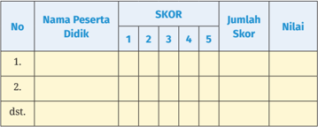
> **[Konteks Visual]**: Maaf, gagal memproses gambar secara teknis: CUDA error: device-side assert triggered
Search for `cudaErrorAssert' in https://docs.nvidia.com/cuda/cuda-runtime-api/group__CUDART__TYPES.html for more information.
CUDA kernel errors might be asynchronously reported at some other API call, so the stacktrace below might be incorrect.
For debugging consider passing CUDA_LAUNCH_BLOCKING=1
Compile with `TORCH_USE_CUDA_DSA` to enable device-side assertions.

Bagian 2

### [HALAMAN_66]

## Skor maksimal =

## (banyaknya kriteria) x (skor tertinggi setiap kriteria)
Nilai tugas
= Jumlah skor perolehan x 100 Jumlah skor maksimal

## c. Rekomendasi	dalam	Aktivitas	 Pembelajaran	 Pertemuan Ketiga	sampai	dengan	Kelima
Pada materi ini dibutuhkan sekitar tiga pertemuan dengan alokasi sebagai berikut:
Rincian tahapan pada masing-masing pertemuan dapat dijelaskan sebagai berikut:
03

> **[Konteks Visual]**: Maaf, gagal memproses gambar secara teknis: CUDA error: device-side assert triggered
Search for `cudaErrorAssert' in https://docs.nvidia.com/cuda/cuda-runtime-api/group__CUDART__TYPES.html for more information.
CUDA kernel errors might be asynchronously reported at some other API call, so the stacktrace below might be incorrect.
For debugging consider passing CUDA_LAUNCH_BLOCKING=1
Compile with `TORCH_USE_CUDA_DSA` to enable device-side assertions.

> **[Konteks Visual]**: Maaf, gagal memproses gambar secara teknis: CUDA error: device-side assert triggered
Search for `cudaErrorAssert' in https://docs.nvidia.com/cuda/cuda-runtime-api/group__CUDART__TYPES.html for more information.
CUDA kernel errors might be asynchronously reported at some other API call, so the stacktrace below might be incorrect.
For debugging consider passing CUDA_LAUNCH_BLOCKING=1
Compile with `TORCH_USE_CUDA_DSA` to enable device-side assertions.

Pertemuan Ketiga - Kelima
Alokasi Waktu 6 JP (6 x 45')
Materi:
Antropologi terapan
Aktivitas:
Lembar kegiatan peserta didik 1.2
Rekomendasi kegiatan belajar oleh guru dan peserta didik:

## ⌦ Pendahuluan
Guru dan peserta didik mengucapkan salam dan doa menurut keyakinan masing-masing.
Guru mengecek kehadiran peserta didik dan mempersiapkan alat dan bahan pembelajaran di kelas.
Guru memberi motivasi pembelajaran terhadap peserta didik melalui review penugasan pada pertemuan sebelumnya.

## ⌦ Kegiatan Inti
Peserta didik mempelajari penelitian mengenai banyaknya pengangguran  yang  terjadi  saat  ini.  Yang  pembahasannya  meliputi latar  belakang  terjadinya  pengangguran,  keadaan  masyarakat  akibat

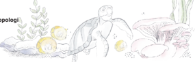
> **[Konteks Visual]**: Maaf, gagal memproses gambar secara teknis: CUDA error: device-side assert triggered
Search for `cudaErrorAssert' in https://docs.nvidia.com/cuda/cuda-runtime-api/group__CUDART__TYPES.html for more information.
CUDA kernel errors might be asynchronously reported at some other API call, so the stacktrace below might be incorrect.
For debugging consider passing CUDA_LAUNCH_BLOCKING=1
Compile with `TORCH_USE_CUDA_DSA` to enable device-side assertions.

### [HALAMAN_67]

adanya  pengangguran,  serta  upaya  yang  dilakukan  untuk  mengatasi pengangguran pada masa kini.
Peserta  didik  mempelajari  dan  mendiskusikan  hasil  penelitian  yang ditentukan pada pertemuan sebelumnya.
Peserta didik merekonstruksi ulang dari hasil penelitian yang didapat dalam  bentuk  infografis  sebagaimana  yang  tertuang  dalam  Lembar Kegiatan Peserta Didik 1.2.

> **[Konteks Visual]**: Maaf, gagal memproses gambar secara teknis: CUDA error: device-side assert triggered
Search for `cudaErrorAssert' in https://docs.nvidia.com/cuda/cuda-runtime-api/group__CUDART__TYPES.html for more information.
CUDA kernel errors might be asynchronously reported at some other API call, so the stacktrace below might be incorrect.
For debugging consider passing CUDA_LAUNCH_BLOCKING=1
Compile with `TORCH_USE_CUDA_DSA` to enable device-side assertions.

## Lembar Kegiatan Peserta Didik 1.2

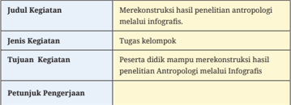
> **[Konteks Visual]**: Maaf, gagal memproses gambar secara teknis: CUDA error: device-side assert triggered
Search for `cudaErrorAssert' in https://docs.nvidia.com/cuda/cuda-runtime-api/group__CUDART__TYPES.html for more information.
CUDA kernel errors might be asynchronously reported at some other API call, so the stacktrace below might be incorrect.
For debugging consider passing CUDA_LAUNCH_BLOCKING=1
Compile with `TORCH_USE_CUDA_DSA` to enable device-side assertions.

Peserta didik membentuk kelompok kerja terdiri dari 4-5 orang.
Peserta didik untuk mencari hasil penelitian Antropologi yang telah dilakukan dari berbagai jurnal penelitian yang ada.
Peserta didik mendiskusikan dengan kelompoknya untuk mengidentifikasi poin-poin penting dari hasil penelitian tersebut.
Peserta didik menyusun kembali poin-poin penting (merekonstruksi ulang) dari hasil penelitian tersebut dalam bentuk infografis.
Peserta didik  untuk memajang hasil infografis yang sudah kalian susun dalam sebuah galeri kerja yang sudah disediakan sebelumnya.
Peserta didik dalam setiap kelompok menentukan wakilnya sebagai tamu atau penjaga stand galeri. Tamu galeri bertugas bertanya sebanyak-banyak kepada penjaga stand galeri tentang hasil penelitian yang sudah direkontruksi. Penjaga stand galeri bertugas mempresentasikan hasil infografisnya dan menjawab pertanyaan yang disampaikan pengunjung stand. Pengunjung stand memberikan bintang kepada pelayanan penjaga stand.
Jika waktu mencukupi peserta didik bergantian peran dari penjaga stand menjadi pengunjung stand begitu sebaliknya.

> **[Konteks Visual]**: Maaf, gagal memproses gambar secara teknis: CUDA error: device-side assert triggered
Search for `cudaErrorAssert' in https://docs.nvidia.com/cuda/cuda-runtime-api/group__CUDART__TYPES.html for more information.
CUDA kernel errors might be asynchronously reported at some other API call, so the stacktrace below might be incorrect.
For debugging consider passing CUDA_LAUNCH_BLOCKING=1
Compile with `TORCH_USE_CUDA_DSA` to enable device-side assertions.

### [HALAMAN_68]

Guru memberikan penilaian atas aktivitas peserta didik.
Guru memberikan reward dari hasil bintang yang diberikan pengunjung stand.
Beberapa contoh aktivitas belajar dengan galeri kerja:
Aktivitas Kunjungan di galeri kerja.
Aktivitas penilaian dan reward yang dilakukan.
Setiap kelompok mengambil galeri kerja masing-masing.
Galeri kerja masing-masing kelompok ditempelkan di dinding kelas atau di tempat kosong (misalnya papan tulis, pintu, jendela) menggunakan selotip.
Setiap kelompok berkeliling untuk mengamati hasil galeri kerja kelompok lain secara bergantian. Masing-masing kelompok dapat memberikan penilaian berupa apresiasi, kritik atau pertanyaan pada hasil galeri kerja kelompok lain yang diamati dengan menuliskan di post-it dan menempelkan di galeri kerja kelompok tersebut.
Galeri kerja diambil kembali oleh kelompok masing-masing. Kertas post-it yang berisi penilaian dari kelompok lain digabung menjadi satu di satu kertas folio.
Kelompok berdiskusi menanggapi penilaian dari kelompok lain dan menjawab pertanyaan yang diajukan oleh kelompok lain.

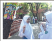
> **[Konteks Visual]**: Maaf, gagal memproses gambar secara teknis: CUDA error: device-side assert triggered
Search for `cudaErrorAssert' in https://docs.nvidia.com/cuda/cuda-runtime-api/group__CUDART__TYPES.html for more information.
CUDA kernel errors might be asynchronously reported at some other API call, so the stacktrace below might be incorrect.
For debugging consider passing CUDA_LAUNCH_BLOCKING=1
Compile with `TORCH_USE_CUDA_DSA` to enable device-side assertions.

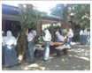
> **[Konteks Visual]**: Maaf, gagal memproses gambar secara teknis: CUDA error: device-side assert triggered
Search for `cudaErrorAssert' in https://docs.nvidia.com/cuda/cuda-runtime-api/group__CUDART__TYPES.html for more information.
CUDA kernel errors might be asynchronously reported at some other API call, so the stacktrace below might be incorrect.
For debugging consider passing CUDA_LAUNCH_BLOCKING=1
Compile with `TORCH_USE_CUDA_DSA` to enable device-side assertions.

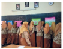
> **[Konteks Visual]**: Maaf, gagal memproses gambar secara teknis: CUDA error: device-side assert triggered
Search for `cudaErrorAssert' in https://docs.nvidia.com/cuda/cuda-runtime-api/group__CUDART__TYPES.html for more information.
CUDA kernel errors might be asynchronously reported at some other API call, so the stacktrace below might be incorrect.
For debugging consider passing CUDA_LAUNCH_BLOCKING=1
Compile with `TORCH_USE_CUDA_DSA` to enable device-side assertions.

Sumber:
Suhariyanti (2018)

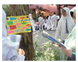
> **[Konteks Visual]**: Maaf, gagal memproses gambar secara teknis: CUDA error: device-side assert triggered
Search for `cudaErrorAssert' in https://docs.nvidia.com/cuda/cuda-runtime-api/group__CUDART__TYPES.html for more information.
CUDA kernel errors might be asynchronously reported at some other API call, so the stacktrace below might be incorrect.
For debugging consider passing CUDA_LAUNCH_BLOCKING=1
Compile with `TORCH_USE_CUDA_DSA` to enable device-side assertions.

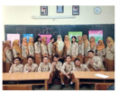
> **[Konteks Visual]**: Maaf, gagal memproses gambar secara teknis: CUDA error: device-side assert triggered
Search for `cudaErrorAssert' in https://docs.nvidia.com/cuda/cuda-runtime-api/group__CUDART__TYPES.html for more information.
CUDA kernel errors might be asynchronously reported at some other API call, so the stacktrace below might be incorrect.
For debugging consider passing CUDA_LAUNCH_BLOCKING=1
Compile with `TORCH_USE_CUDA_DSA` to enable device-side assertions.

Sumber
: Suhariyanti (2018)

### [HALAMAN_69]

Guru menilai hasil rekonstruksi, memberikan pertanyaan-pertanyaan yang berkaitan dengan hasil rekonstruksi.
Guru memberikan saran-saran untuk perbaikan rekonstruksi hasil penelitian yang dilakukan peserta didik.

## ⌦ Penutup
Guru memberikan kesempatan kepada beberapa peserta didik untuk mengungkapkan pengalaman belajarnya dan menyimpulkan tentang konstruksi hasil penelitian.
Guru memberikan apresiasi atas pengalaman belajar peserta didik.
Memberi salam.

## ⌦ Metode dan Model Pembelajaran
Metode pembelajaran yang akan digunakan adalah Discovery/Inquiry Learning bahwa peran peserta didik adalah belajar dengan aktif dan sebagai pusat pembelajaran ( student centre-learning ). Peran guru dalam konteks ini sebagai fasilitator dan pembimbing saja.
Skenario pembelajaran: setelah mengerjakan LK peserta didik diharapkan aktif  dalam  aktivitas shopping ke  galeri  kelompok  dan  berpikir  kritis terhadap pertanyaan yang disampaikan oleh pengunjung stand.

> **[Konteks Visual]**: Maaf, gagal memproses gambar secara teknis: CUDA error: device-side assert triggered
Search for `cudaErrorAssert' in https://docs.nvidia.com/cuda/cuda-runtime-api/group__CUDART__TYPES.html for more information.
CUDA kernel errors might be asynchronously reported at some other API call, so the stacktrace below might be incorrect.
For debugging consider passing CUDA_LAUNCH_BLOCKING=1
Compile with `TORCH_USE_CUDA_DSA` to enable device-side assertions.

## ⌦ Media dan Alat Pembelajaran
Galeri  kerja  untuk  menempelkan  hasil  infografis  yang  sudah  dikerjakan berupa poster, kertas manila, stick note , tanda bintang, dan media lain yang telah disiapkan.

> **[Konteks Visual]**: Maaf, gagal memproses gambar secara teknis: CUDA error: device-side assert triggered
Search for `cudaErrorAssert' in https://docs.nvidia.com/cuda/cuda-runtime-api/group__CUDART__TYPES.html for more information.
CUDA kernel errors might be asynchronously reported at some other API call, so the stacktrace below might be incorrect.
For debugging consider passing CUDA_LAUNCH_BLOCKING=1
Compile with `TORCH_USE_CUDA_DSA` to enable device-side assertions.

## ⌦ Sumber Belajar
Buku  antropologi  kelas  XII,  buku  Antropologi  lain  yang  relevan,  jurnal, video, internet, dan lain-lain.

> **[Konteks Visual]**: Maaf, gagal memproses gambar secara teknis: CUDA error: device-side assert triggered
Search for `cudaErrorAssert' in https://docs.nvidia.com/cuda/cuda-runtime-api/group__CUDART__TYPES.html for more information.
CUDA kernel errors might be asynchronously reported at some other API call, so the stacktrace below might be incorrect.
For debugging consider passing CUDA_LAUNCH_BLOCKING=1
Compile with `TORCH_USE_CUDA_DSA` to enable device-side assertions.

## ⌦ Penilaian
Penilaian  dilakukan  dengan  penilaian  sikap  dan  unjuk  kerja  dalam menampilkan infografis dari rekonstruksi hasil penelitian yang dilakukan.

> **[Konteks Visual]**: Maaf, gagal memproses gambar secara teknis: CUDA error: device-side assert triggered
Search for `cudaErrorAssert' in https://docs.nvidia.com/cuda/cuda-runtime-api/group__CUDART__TYPES.html for more information.
CUDA kernel errors might be asynchronously reported at some other API call, so the stacktrace below might be incorrect.
For debugging consider passing CUDA_LAUNCH_BLOCKING=1
Compile with `TORCH_USE_CUDA_DSA` to enable device-side assertions.

61

### [HALAMAN_70]

## 1.  Contoh	instrumen	Penilaian	Sikap

## INTRUMEN PENILAIAN SIKAP

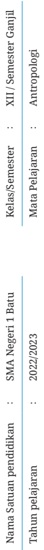
> **[Konteks Visual]**: Maaf, gagal memproses gambar secara teknis: CUDA error: device-side assert triggered
Search for `cudaErrorAssert' in https://docs.nvidia.com/cuda/cuda-runtime-api/group__CUDART__TYPES.html for more information.
CUDA kernel errors might be asynchronously reported at some other API call, so the stacktrace below might be incorrect.
For debugging consider passing CUDA_LAUNCH_BLOCKING=1
Compile with `TORCH_USE_CUDA_DSA` to enable device-side assertions.

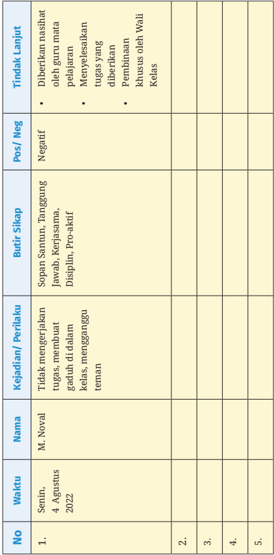
> **[Konteks Visual]**: Maaf, gagal memproses gambar secara teknis: CUDA error: device-side assert triggered
Search for `cudaErrorAssert' in https://docs.nvidia.com/cuda/cuda-runtime-api/group__CUDART__TYPES.html for more information.
CUDA kernel errors might be asynchronously reported at some other API call, so the stacktrace below might be incorrect.
For debugging consider passing CUDA_LAUNCH_BLOCKING=1
Compile with `TORCH_USE_CUDA_DSA` to enable device-side assertions.

### [HALAMAN_71]

## INSTRUMEN UNJUK KERJA

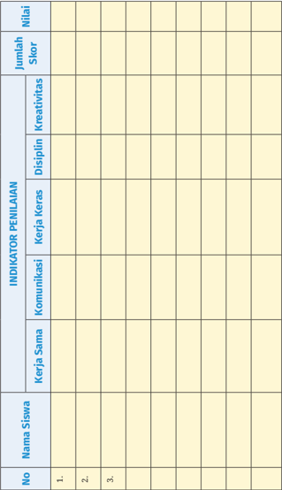
> **[Konteks Visual]**: Maaf, gagal memproses gambar secara teknis: CUDA error: device-side assert triggered
Search for `cudaErrorAssert' in https://docs.nvidia.com/cuda/cuda-runtime-api/group__CUDART__TYPES.html for more information.
CUDA kernel errors might be asynchronously reported at some other API call, so the stacktrace below might be incorrect.
For debugging consider passing CUDA_LAUNCH_BLOCKING=1
Compile with `TORCH_USE_CUDA_DSA` to enable device-side assertions.

Bagian 2

### [HALAMAN_72]

> **[Konteks Visual]**: Maaf, gagal memproses gambar secara teknis: CUDA error: device-side assert triggered
Search for `cudaErrorAssert' in https://docs.nvidia.com/cuda/cuda-runtime-api/group__CUDART__TYPES.html for more information.
CUDA kernel errors might be asynchronously reported at some other API call, so the stacktrace below might be incorrect.
For debugging consider passing CUDA_LAUNCH_BLOCKING=1
Compile with `TORCH_USE_CUDA_DSA` to enable device-side assertions.

## ⌦ Rubrik Penilaian

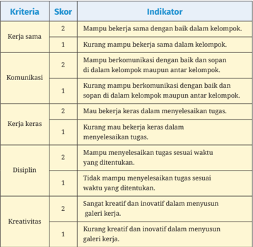
> **[Konteks Visual]**: Maaf, gagal memproses gambar secara teknis: CUDA error: device-side assert triggered
Search for `cudaErrorAssert' in https://docs.nvidia.com/cuda/cuda-runtime-api/group__CUDART__TYPES.html for more information.
CUDA kernel errors might be asynchronously reported at some other API call, so the stacktrace below might be incorrect.
For debugging consider passing CUDA_LAUNCH_BLOCKING=1
Compile with `TORCH_USE_CUDA_DSA` to enable device-side assertions.

## Keterangan :
Skor maksimal =
(banyaknya aspek) x (skor tertinggi setiap aspek)
Rata-rata Skor =
Skor Maksimal : Banyaknya aspek
Nilai Sikap diperoleh dengan kriteria sebagai berikut:
Rata-rata Skor > 1 - 2 maka Nilai Sikapnya adalah Sangat Baik
Rata-rata Skor  = 1 maka Nilai Sikapnya adalah Baik Keterangan:

### [HALAMAN_73]

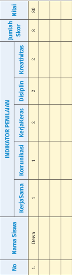
> **[Konteks Visual]**: Maaf, gagal memproses gambar secara teknis: CUDA error: device-side assert triggered
Search for `cudaErrorAssert' in https://docs.nvidia.com/cuda/cuda-runtime-api/group__CUDART__TYPES.html for more information.
CUDA kernel errors might be asynchronously reported at some other API call, so the stacktrace below might be incorrect.
For debugging consider passing CUDA_LAUNCH_BLOCKING=1
Compile with `TORCH_USE_CUDA_DSA` to enable device-side assertions.

=
Skor maksimal
(banyaknya kriteria) x (skor tertinggi setiap kriteria)
Pada contoh di atas, skor maksimal = 2x5 = 10
x 100
Jumlah skor perolehan
=
Nilai tugas

## Jumlah skor maksimal
Contoh :
Jumlah skor keterampilan/unjuk kerja yang diperoleh Dewa adalah 10

> **[Konteks Visual]**: Maaf, gagal memproses gambar secara teknis: CUDA error: device-side assert triggered
Search for `cudaErrorAssert' in https://docs.nvidia.com/cuda/cuda-runtime-api/group__CUDART__TYPES.html for more information.
CUDA kernel errors might be asynchronously reported at some other API call, so the stacktrace below might be incorrect.
For debugging consider passing CUDA_LAUNCH_BLOCKING=1
Compile with `TORCH_USE_CUDA_DSA` to enable device-side assertions.

Nilai tugas  =   8 x 100 = 80

### [HALAMAN_74]

## d.	 Rekomendasi	dalam	Aktivitas	 Pembelajaran	 Pertemuan Keenam dan Ketujuh
Materi Hubungan antar cabang antropologi terapan dialokasikan dua pertemuan sebagai berikut:
Hubungan Antar Cabang Antropologi Terapan

> **[Konteks Visual]**: Maaf, gagal memproses gambar secara teknis: CUDA error: device-side assert triggered
Search for `cudaErrorAssert' in https://docs.nvidia.com/cuda/cuda-runtime-api/group__CUDART__TYPES.html for more information.
CUDA kernel errors might be asynchronously reported at some other API call, so the stacktrace below might be incorrect.
For debugging consider passing CUDA_LAUNCH_BLOCKING=1
Compile with `TORCH_USE_CUDA_DSA` to enable device-side assertions.

## Pertemuan Keenam - Ketujuh
Alokasi Waktu 4 JP (4 x 45')
Materi:
Hubungan antar cabang
antropologi terapan
Aktivitas:
Lembar Kegiatan Peserta Didik 1.3
Rekomendasi kegiatan belajar oleh guru dan peserta didik:

## ⌦ Pendahuluan
Guru dan peserta didik mengucapkan salam dan doa menurut keyakinan masing-masing.
Guru mengecek kehadiran peserta didik dan mempersiapkan alat dan bahan pembelajaran di kelas.
Guru memberi motivasi pembelajaran terhadap peserta didik melalui review penugasan pada pertemuan sebelumnya.

## ⌦ Kegiatan Inti
Peserta didik mengamati video animasi tentang Budaya Perusahaan di link berikut:  https://youtu.be/EM-FBRP-eUY
Peserta didik berdiskusi dengan kelompoknya untuk mengaitkan katakata kunci yang ada di video dengan pembahasan Antropologi dengan dunia bisnis.
Peserta didik mempresentasikan hasil diskusi dengan kelompoknya di depan kelas.
Kelompok lain menanggapi dari presentasi yang dilakukan peserta didik.
Peserta didik membuat simpulan.

### [HALAMAN_75]

> **[Konteks Visual]**: Maaf, gagal memproses gambar secara teknis: CUDA error: device-side assert triggered
Search for `cudaErrorAssert' in https://docs.nvidia.com/cuda/cuda-runtime-api/group__CUDART__TYPES.html for more information.
CUDA kernel errors might be asynchronously reported at some other API call, so the stacktrace below might be incorrect.
For debugging consider passing CUDA_LAUNCH_BLOCKING=1
Compile with `TORCH_USE_CUDA_DSA` to enable device-side assertions.

## Lembar Kegiatan Peserta Didik 1.3

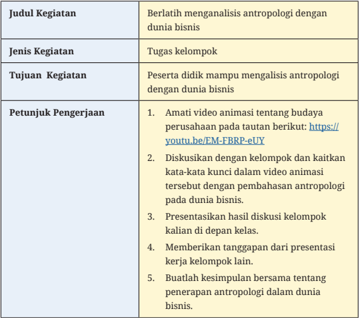
> **[Konteks Visual]**: Maaf, gagal memproses gambar secara teknis: CUDA error: device-side assert triggered
Search for `cudaErrorAssert' in https://docs.nvidia.com/cuda/cuda-runtime-api/group__CUDART__TYPES.html for more information.
CUDA kernel errors might be asynchronously reported at some other API call, so the stacktrace below might be incorrect.
For debugging consider passing CUDA_LAUNCH_BLOCKING=1
Compile with `TORCH_USE_CUDA_DSA` to enable device-side assertions.

## ⌦ Penutup
Peserta  didik  diberi  kesempatan  untuk  mengungkapkan pengalaman belajarnya pada Bab 1.
Guru memberikan apresiasi atas pengalaman belajar peserta didik.
Memberi salam.

## ⌦ Metode dan Model Pembelajaran
Metode pembelajaran yang akan digunakan adalah Discovery/Inquiry Learning bahwa peran peserta didik adalah belajar dengan aktif dan

> **[Konteks Visual]**: Maaf, gagal memproses gambar secara teknis: CUDA error: device-side assert triggered
Search for `cudaErrorAssert' in https://docs.nvidia.com/cuda/cuda-runtime-api/group__CUDART__TYPES.html for more information.
CUDA kernel errors might be asynchronously reported at some other API call, so the stacktrace below might be incorrect.
For debugging consider passing CUDA_LAUNCH_BLOCKING=1
Compile with `TORCH_USE_CUDA_DSA` to enable device-side assertions.

Petunjuk Khusus Bab 1
67

### [HALAMAN_76]

sebagai pusat pembelajaran ( student centre-learning ). Peran guru dalam konteks ini sebagai fasilitator dan pembimbing saja.
Skenario pembelajaran: setelah mengamati video dan berdiskusi dalam kelompok diharapkan peserta didik aktif dan berpikir kritis terhadap diskusi kelas melalui presentasi peserta didik.

> **[Konteks Visual]**: Maaf, gagal memproses gambar secara teknis: CUDA error: device-side assert triggered
Search for `cudaErrorAssert' in https://docs.nvidia.com/cuda/cuda-runtime-api/group__CUDART__TYPES.html for more information.
CUDA kernel errors might be asynchronously reported at some other API call, so the stacktrace below might be incorrect.
For debugging consider passing CUDA_LAUNCH_BLOCKING=1
Compile with `TORCH_USE_CUDA_DSA` to enable device-side assertions.

## ⌦ Media dan Alat Pembelajaran
LCD  proyektor,  komputer  atau  laptop,  tayangan  slide Powerpoint (ppt, papan tulis, buku, poster, spidol, video, dan media lain yang telah disiapkan.

> **[Konteks Visual]**: Maaf, gagal memproses gambar secara teknis: CUDA error: device-side assert triggered
Search for `cudaErrorAssert' in https://docs.nvidia.com/cuda/cuda-runtime-api/group__CUDART__TYPES.html for more information.
CUDA kernel errors might be asynchronously reported at some other API call, so the stacktrace below might be incorrect.
For debugging consider passing CUDA_LAUNCH_BLOCKING=1
Compile with `TORCH_USE_CUDA_DSA` to enable device-side assertions.

## ⌦ Sumber Belajar
Buku  antropologi  kelas  XII,  buku  antropologi  lain  yang  relevan,  jurnal, video, internet, dan lain-lain.

> **[Konteks Visual]**: Maaf, gagal memproses gambar secara teknis: CUDA error: device-side assert triggered
Search for `cudaErrorAssert' in https://docs.nvidia.com/cuda/cuda-runtime-api/group__CUDART__TYPES.html for more information.
CUDA kernel errors might be asynchronously reported at some other API call, so the stacktrace below might be incorrect.
For debugging consider passing CUDA_LAUNCH_BLOCKING=1
Compile with `TORCH_USE_CUDA_DSA` to enable device-side assertions.

## ⌦ Penilaian
Penilaian  dilakukan  dengan  penilaian  sikap  dan  unjuk  kerja  dalam presentasi dan diskusi kelas. Adapun format penilaian dapat dikembangkan sebagaimana pada aktivitas pembelajaran pada materi antropologi terapan (Pertemuan ketiga sampai dengan pertemuan kelima)

## ⌦ Uji Pemahaman Materi
Simak artikel berikut:

## Jasad Penumpang Air Asia Sulit Dikenali, Tulang Jadi Acuan Antropolog Forensik
Tim Disaster Victim Identification (DVI) dibantu oleh antropolog forensik untuk  mengidentifikasi  jenazah  penumpang  pesawat  Air  Asia  QZ8501 yang  mulai  sulit  dikenali.  'Logikanya  saja  jika  sudah  dua  minggu  pasti semakin  sulit,' kata antropolog forensik dari Universitas Airlangga, Toetik Koesbardiati, di Mapolda Jawa Timur, Rabu (13/1). Para antropolog diharapkan  dapat  menentukan  ras,  usia,  umur,  pekerjaan,  dan  aktivitas sehari-hari hanya dari tulang korban. Mereka juga membantu memahami budaya  korban  dengan  mengenalinya  dari  properti  yang  dipakai  dan barang bawaan apa saja yang dibawa penumpang.

### [HALAMAN_77]

Antropolog forensik dari Universitas Gajah Mada, Rusyad Adi Suriyanto, mengatakan hal yang senada. Semakin lama jenazah akan semakin sulit diidentifikasi,  sehingga  metode  antropologi  forensik  dan  DNA  menjadi acuan lebih akurat dengan mengidentifikasi tulang jenazah. Kecepatan tim antropolog,  menurutnya,  sangat  dibutuhkan  karena  semakin  lama  serat atau selaput kulit semakin hilang. 'Ada usulan bagus kemarin, Indonesia mempunyai rekam serat kulit dan rekam wajah, sehingga jika ada musibah seperti  ini  akan  semakin  mudah diidentifikasi,'  ujar  Rusyad.  Antropolog forensik juga sering membantu kepolisian untuk mengidentifikasi korban kejahatan.  Namun,  belum  banyak  orang  yang  memilih  profesi  ini.  Di Indonesia  baru  ada  empat  orang  yang  berprofesi  sebagai  antropolog forensik.  'Mungkin  karena  terlalu  banyak  yang  harus  dipelajari  maka kurang diminati,' tambah Rusyad.

## Scan Me!

> **[Konteks Visual]**: Maaf, gagal memproses gambar secara teknis: CUDA error: device-side assert triggered
Search for `cudaErrorAssert' in https://docs.nvidia.com/cuda/cuda-runtime-api/group__CUDART__TYPES.html for more information.
CUDA kernel errors might be asynchronously reported at some other API call, so the stacktrace below might be incorrect.
For debugging consider passing CUDA_LAUNCH_BLOCKING=1
Compile with `TORCH_USE_CUDA_DSA` to enable device-side assertions.

Sumber: Wulandari, Indah. 2015. 'Jasad Penumpang Air Asia Sulit Dikenali, Tulang Jadi Acuan Antropolog Forensik. ' Republika. January 14, 2015. .
Selengkapnya baca artikel pada tautan berikut ini: https:// www.republika.co.id/berita/nasional/umum/15/01/14/ni5rz8jasad-penumpang-air-asia-sulit-dikenali-tulang-jadi-acuanantropologforensik atau pindailah Kode QR di samping
Cabang  Ilmu  Antropologi  memiliki  ruang  lingkup  yang  tepat  sesuai dengan teks berita tersebut adalah…
 Antropologi	Ragawi	yaitu	ilmu	yang	mempelajari	perkembangan terjadinya	 anekawarna	 makhluk	 manusia	 dilihat	 dari	 ciri-ciri tubuhnya.
Antropologi Budaya yakni mempelajari   tentang   segi-segi     kebudayaan manusia, atau cabang antropologi yang mengkhususkan diri pada pola kehidupan masyarakat.
Somatologi yakni ilmu tentang sejarah terjadinya aneka warna makhluk manusia, dilihat dari ciri-ciri tubuhnya.
Antropologi  Biologi  yakni  ilmu  yang  mempelajari  perkembangan manusia sebagai makhluk biologis.
Antropologi Bahasa yakni ilmu yang mempelajari persebaran   aneka warna   bahasa   yang diucapkan oleh manusia di seluruh dunia.

> **[Konteks Visual]**: Maaf, gagal memproses gambar secara teknis: CUDA error: device-side assert triggered
Search for `cudaErrorAssert' in https://docs.nvidia.com/cuda/cuda-runtime-api/group__CUDART__TYPES.html for more information.
CUDA kernel errors might be asynchronously reported at some other API call, so the stacktrace below might be incorrect.
For debugging consider passing CUDA_LAUNCH_BLOCKING=1
Compile with `TORCH_USE_CUDA_DSA` to enable device-side assertions.

### [HALAMAN_78]

Secara etimologis antropologi berarti kajian tentang manusia. Antropologi dibagi menjadi empat cabang ilmu yang saling berkaitan, yaitu: antropologi biologi/fisik, antropologi sosial dan antropologi budaya, arkeologi,  serta  linguistik.  Keempat  cabang  ilmu  tersebut  memiliki kekhususan akademik dan penelitian ilmiah dengan topik yang unik dan metode  penelitian  yang  berbeda.  Pengertian  antropologi  biologi  atau antropologi fisik merupakan cabang ilmu antropologi yang mempelajari manusia dan primata, bukan manusia  dalam arti biologis, evolusi, dan demografi.  Antropologi  sosial  merupakan  cabang  yang  mempelajari hubungan  antara  orang-orang  atau  kelompok.  Sementara  antropologi budaya  merupakan  cabang  komparasi  bagaimana  orang-orang  bisa memahami dunia di sekitar mereka dengan cara yang berbeda-beda dan antropologi sosial dan budaya dipakai untuk meneliti manusia yang masih hidup. Arkeologi ini berkaitan dengan usaha mempelajari sisa-sisa fisik dari suatu budaya masa lalu atau masa lampau. Antropologi linguistik juga  mempelajari  bentuk  bentuk  bahasa  manusia  dan  penggunaan konteks bahasa itu dapat menghubungkan sosial atau politik.

## Scan Me!

> **[Konteks Visual]**: Maaf, gagal memproses gambar secara teknis: CUDA error: device-side assert triggered
Search for `cudaErrorAssert' in https://docs.nvidia.com/cuda/cuda-runtime-api/group__CUDART__TYPES.html for more information.
CUDA kernel errors might be asynchronously reported at some other API call, so the stacktrace below might be incorrect.
For debugging consider passing CUDA_LAUNCH_BLOCKING=1
Compile with `TORCH_USE_CUDA_DSA` to enable device-side assertions.

Sumber: Regita. 2016. 'Mengetahui 4 Cabang Antropologi.' Kompasiana.Com. March 2016. . Selengkapnya baca artikel pada tautan berikut ini: https://www.kompasiana.com/acars/56f61cdbb99373f50491acc5/
mengetahui-4-cabang-antropologi? atau pindailah Kode QR
di samping Berdasarkan  keterangan  tersebut,  tentukan  dari  gambar  berikut  yang sesuai dengan kajian antropologi  secara tepat.

### [HALAMAN_79]

Sumber
: Agung Sejuta 2016

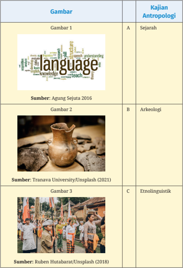
> **[Konteks Visual]**: Maaf, gagal memproses gambar secara teknis: CUDA error: device-side assert triggered
Search for `cudaErrorAssert' in https://docs.nvidia.com/cuda/cuda-runtime-api/group__CUDART__TYPES.html for more information.
CUDA kernel errors might be asynchronously reported at some other API call, so the stacktrace below might be incorrect.
For debugging consider passing CUDA_LAUNCH_BLOCKING=1
Compile with `TORCH_USE_CUDA_DSA` to enable device-side assertions.

> **[Konteks Visual]**: Maaf, gagal memproses gambar secara teknis: CUDA error: device-side assert triggered
Search for `cudaErrorAssert' in https://docs.nvidia.com/cuda/cuda-runtime-api/group__CUDART__TYPES.html for more information.
CUDA kernel errors might be asynchronously reported at some other API call, so the stacktrace below might be incorrect.
For debugging consider passing CUDA_LAUNCH_BLOCKING=1
Compile with `TORCH_USE_CUDA_DSA` to enable device-side assertions.

### [HALAMAN_80]

Fauxels/Pexels (2019)

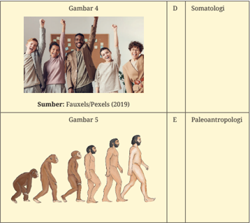
> **[Konteks Visual]**: Maaf, gagal memproses gambar secara teknis: CUDA error: device-side assert triggered
Search for `cudaErrorAssert' in https://docs.nvidia.com/cuda/cuda-runtime-api/group__CUDART__TYPES.html for more information.
CUDA kernel errors might be asynchronously reported at some other API call, so the stacktrace below might be incorrect.
For debugging consider passing CUDA_LAUNCH_BLOCKING=1
Compile with `TORCH_USE_CUDA_DSA` to enable device-side assertions.

## Jawaban	:
Gambar 1 - C
Gambar 2 - B
Gambar 3 - F
Gambar 4 - D
Gambar 5 - E
Dalam dua dekade terakhir ini budaya Korea berkembang pesat dan meluas secara global. Budaya Korea diterima publik dari berbagai kalangan dan menghasilkan suatu fenomena. Baca dan cermati artikel berikut:
'Korean Wave' atau disebut juga Hallyu ,  fenomena  ini  begitu  terasa dalam kehidupan generasi milenial dan dikenal memiliki fanbase yang besar. Korean Wave diawali dan identik dengan dunia hiburan seperti musik, drama, dan variety shows yang dikemas sesuai selera generasi milenial  dalam  menyajikan  budaya-budaya  Korea.  Budaya  Korea banyak diimplementasikan dalam kehidupan sehari-hari para pecinta budaya  Korea,  misalnya:  mode  (fashion),  make  up,  perawatan  diri (skincare) Korea, makanan, gaya bicara (aksen), dan bahasa.

### [HALAMAN_81]

Sejak dibangunnya hubungan diplomatik antara Indonesia dengan Korea  Selatan  pada  tahun  1973,  Korea  Selatan  menjadi  salah  satu negara yang memiliki jumlah investasi terbesar dan tersebar luas di berbagai macam proyek di Indonesia (Bhaskara 2019). Indonesia dan Korea Selatan juga sepakat untuk meningkatkan perdagangan bilateral mereka menjadi $30 miliar pada tahun 2022.
Maraknya  penggunaan  produk-produk  perawatan  diri  ( skincare ) dan  make  up,  mode,  dan  makanan  Korea,  banyak  dipengaruhi  oleh keberadaan artis K-pop. Cara pandang mereka pun berubah menjadi lebih  terbuka  terhadap  berbagai  aspek  kehidupan.  Mereka  menjadi lebih  bahagia  bahkan  bangkit  dari  rasa  depresi.  Mereka  juga  sering menyelipkan  kata-kata  dalam  bahasa  Korea  dikehidupan  sehari-hari seperti  annyeong,  saranghae,  hyung,  dan  hwaiting.  Selain  itu,  para penggemar  dari  artis-artis  Korea  biasanya  mendirikan  fanbase  atau komunitas yang tersebar di berbagai wilayah di Indonesia. Contohnya: NCTzen  Yogyakarta  yang  merupakan  tempat  berkumpulnya  para penggemar NCT (grup idola) di Yogyakarta. Mereka memiliki kepengurusan  yang  terstruktur  layaknya  organisasi  pada  umumnya dan aktif mengadakan acara-acara untuk penggemar NCT.

## Scan Me!

> **[Konteks Visual]**: Maaf, gagal memproses gambar secara teknis: CUDA error: device-side assert triggered
Search for `cudaErrorAssert' in https://docs.nvidia.com/cuda/cuda-runtime-api/group__CUDART__TYPES.html for more information.
CUDA kernel errors might be asynchronously reported at some other API call, so the stacktrace below might be incorrect.
For debugging consider passing CUDA_LAUNCH_BLOCKING=1
Compile with `TORCH_USE_CUDA_DSA` to enable device-side assertions.

Sumber: Sarajwati. 2020. 'Fenomena Korean Wave Di Indonesia.' EGSA UGM. September 2020.
Selengkapnya baca artikel pada tautan berikut ini: https://egsa.geo.ugm.ac.id/2020/09/30/fenomena-koreanwave-di-indonesia/  atau pindailah Kode QR di samping
Berilah tanda centang (√) di kolom 'Benar' jika pernyataan berikut sesuai  dengan  teks  atau  centang  di  kolom  'Salah'  jika  pernyataan berikut tidak sesuai dengan teks.

> **[Konteks Visual]**: Maaf, gagal memproses gambar secara teknis: CUDA error: device-side assert triggered
Search for `cudaErrorAssert' in https://docs.nvidia.com/cuda/cuda-runtime-api/group__CUDART__TYPES.html for more information.
CUDA kernel errors might be asynchronously reported at some other API call, so the stacktrace below might be incorrect.
For debugging consider passing CUDA_LAUNCH_BLOCKING=1
Compile with `TORCH_USE_CUDA_DSA` to enable device-side assertions.

### [HALAMAN_82]

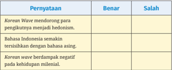
> **[Konteks Visual]**: Maaf, gagal memproses gambar secara teknis: CUDA error: device-side assert triggered
Search for `cudaErrorAssert' in https://docs.nvidia.com/cuda/cuda-runtime-api/group__CUDART__TYPES.html for more information.
CUDA kernel errors might be asynchronously reported at some other API call, so the stacktrace below might be incorrect.
For debugging consider passing CUDA_LAUNCH_BLOCKING=1
Compile with `TORCH_USE_CUDA_DSA` to enable device-side assertions.

Jawaban	:
Benar; Benar; Salah
Perhatikan penggalan teks sastra berikut:
Namaku Andara. Aku lahir di Desa Tobarana, tempat di mana dikelilingi oleh  desiran  Sungai  Sa'dan  dengan  pemandangan  yang  indah  di sekitarnya. Letaknya dua belas kilometer ke arah utara Kota Ratepao. Aku tinggal di rumah besar ini, rumah orang Toraja. Bentuk bangunannya sangat unik dan menarik karena jika diperhatikan bangunan itu mirip sebuah perahu. Rumah adat ini namanya Tongkonan .  Biasanya dibangun oleh sebuah keluarga besar. Uniknya, bila rumah tersebut sudah jadi, orang-orang  Toraja  selalu  mengadakan  upacara  yang  disebut Rambu Tuka .  Untuk  mendapat berkah keselamatan segenap keluarga. Orang Toraja menyebut dirinya sebagai orang Toraya . To berarti  orang  dan Raya artinya besar. Jadi, Toraya artinya orang yang terhormat.
Berdasarkan teks di atas apabila dikaitkan dengan contoh penerapan antropologi budaya berikut ini, manakah  yang merupakan  ciri kelompok etnik Suku Toraja adalah.... (Jawaban lebih dari satu)
Tongkonan dihuni oleh keluarga besar.
Rumah adat Toraja bernama Tongkonan.
Bangunan Tongkonan bentuknya menyerupai perahu.
Rambu Tuka dilaksanakan sebelum membangun rumah.
Rambu Tuka bertujuan untuk mendapat berkah keselamatan keluarga.

### [HALAMAN_83]

## Jawaban:

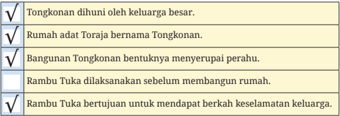
> **[Konteks Visual]**: Maaf, gagal memproses gambar secara teknis: CUDA error: device-side assert triggered
Search for `cudaErrorAssert' in https://docs.nvidia.com/cuda/cuda-runtime-api/group__CUDART__TYPES.html for more information.
CUDA kernel errors might be asynchronously reported at some other API call, so the stacktrace below might be incorrect.
For debugging consider passing CUDA_LAUNCH_BLOCKING=1
Compile with `TORCH_USE_CUDA_DSA` to enable device-side assertions.

√
Tongkonan dihuni oleh keluarga besar.
√
Rumah adat Toraja bernama Tongkonan.
√
Bangunan Tongkonan bentuknya menyerupai perahu.
Rambu Tuka dilaksanakan sebelum membangun rumah.
√
Rambu Tuka bertujuan untuk mendapat berkah keselamatan keluarga.

## 5. Perhatikan teks berikut.
Tradisi  Marsialapari  adalah  budaya  masyarakat  lokal  di  Sumatra Utara  dalam  pengelolaan  sawah.  Tradisi  ini  diisi  dengan  kegiatan tolong-menolong  atau  gotong  royong,  yang  sudah  ada  sejak  zaman dahulu  dan  masih  dijaga  oleh  masyarakat  Mandailing  hingga  kini. Masyarakat  Mandailing  secara  sukarela  dengan  rasa  gembira  saling tolong-menolong dan membantu saudara mereka yang membutuhkan bantuan,  biasanya  dilakukan  di  sawah  atau  kebun.  Meski  dilakukan secara sukarela, tradisi Marsialapari ini dilakukan secara bergantian sebagai imbalan atas bantuan dari kerabat atau tetangga yang sudah membantu  mereka  dalam  mengelola  sawah.  Contohnya:  apabila penggarapan sawah di tempat salah seorang masyarakat Mandailing sudah  selesai,  maka  orang  tersebut  akan  ikut  membantu  ke  tempat orang yang sudah membantunya tadi, dan begitu seterusnya. Maka dari itu, apabila terdapat empat keluarga yang berpartisipasi, maka keempat keluarga tersebut harus saling membantu secara bergantian
Tradisi Marsialapari ini bukanlah sekadar aktivitas dalam melakukan gotong royong semata, namun, tradisi ini mencerminkan nilai-nilai budaya masyarakat Mandailing. Hal ini ditunjukkan dengan adanya  esensi  kasih  sayang  ( holong )  dan  persatuan  ( domu )  yang hidup  dalam  khazanah  budaya  masyarakat  Mandailing  selama  ini. Kasih sayang dan persatuan pada masyarakat Mandailing merupakan implementasi dari adat Dalian Na Tolu. Sistem sosial dari Dalian Na Tolu tersebutlah yang menggiring masyarakat Mandailing untuk senantiasa
Bagian 2

### [HALAMAN_84]

memiliki rasa saling membantu dan bekerja sama dalam menyelesaikan suatu persoalan yang menyangkut kehidupan bersama.

## Scan Me!

> **[Konteks Visual]**: Maaf, gagal memproses gambar secara teknis: CUDA error: device-side assert triggered
Search for `cudaErrorAssert' in https://docs.nvidia.com/cuda/cuda-runtime-api/group__CUDART__TYPES.html for more information.
CUDA kernel errors might be asynchronously reported at some other API call, so the stacktrace below might be incorrect.
For debugging consider passing CUDA_LAUNCH_BLOCKING=1
Compile with `TORCH_USE_CUDA_DSA` to enable device-side assertions.

Sumber: Rahmawati. 2020. 'Marsialapari, Tradisi Gotong Royong Yang Mengakar Kuat di Masyarakat Mandailing.' Merdeka. April 2020. https://www.merdeka.com/sumut/marsialapari-tradisigotong-royong-yang-mengakar-kuat-di-masyarakat-mandailing. html?page=5.
Berdasarkan ilustrasi tersebut dapat disimpulkan bahwa nilai budaya tolong-menolong yang dimiliki masyarakat di Mandailing merupakan dasar dari budaya nasional gotong royong dan ini merupakan kajian dari antropologi sosial.
Benarkah kesimpulan tersebut?
Jawaban:
Benar.

### [HALAMAN_85]

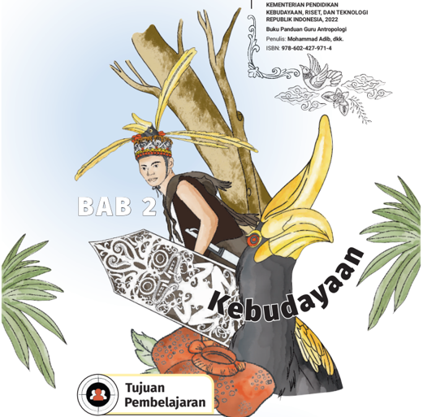
> **[Konteks Visual]**: Maaf, gagal memproses gambar secara teknis: CUDA error: device-side assert triggered
Search for `cudaErrorAssert' in https://docs.nvidia.com/cuda/cuda-runtime-api/group__CUDART__TYPES.html for more information.
CUDA kernel errors might be asynchronously reported at some other API call, so the stacktrace below might be incorrect.
For debugging consider passing CUDA_LAUNCH_BLOCKING=1
Compile with `TORCH_USE_CUDA_DSA` to enable device-side assertions.

Mengemukakan kebudayaan sebagai sesuatu yang khusus (khas) di masyarakat.
Menyebutkan unsur-unsur kebudayaan.
Menjelaskan wujud kebudayaan.
Menafsirkan sifat-sifat kebudayaan di lingkungan sekitar atau lingkungan sekerabat di dalam keluarga.

### [HALAMAN_86]

## A.  Petunjuk Khusus Bab 2
Pada Bab 2 buku teks peserta didik menyajikan materi mengenai kebudayaan yang  dilengkapi  dengan  berbagai  aktivitas  pembelajaran    (lembar  kerja), pengayaan, dan informasi pojok antropolog serta soal tes  formatif.

## 1.  Tujuan Pembelajaran
Tujuan pembelajaran pada Bab 2 adalah peserta didik mampu:
Mendeskripsikan  kebudayaan  sebagai  sesuatu  yang  unik  dan mendasar dari kehidupan manusia.
Memahami unsur-unsur kebudayaan dari lingkungan kebudayaan lain.
Memahami  wujud  kebudayaan dari lingkungan kebudayaan lain.
Menganalisis unsur-unsur dan wujud kebudayaan.
Menafsirkan  karakterteristik  kebudayaan  di  lingkungan  sekitar atau lingkungan sekerabat di dalam keluarganya.

## 2.  Indikator Capaian Pembelajaran
Setelah mengikuti pelajaran antropologi dan memahami bacaan pada pembahasan bab ini peserta didik mampu:
Mendeskripsikan kebudayaan sebagai sesuatu yang unik dan mendasar dari kehidupan manusia.
Memahami unsur-unsur kebudayaan dari lingkungan kebudayaan lain.
Memahami wujud kebudayaan dari lingkungan kebudayaan lain.
Menganalisis unsur-unsur dan wujud kebudayaan.
Menafsirkan sifat-sifat kebudayaan di lingkungan sekitar atau lingkungan sekerabat.

## 3.  Pokok Materi dan Hubungan Pokok Materi dalam Mencapai Tujuan Pembelajaran
Materi  dalam  bab  2  ini  adalah  kebudayaan  yang  diberikan  kepada peserta didik  kelas XII.  Materi pokok dalam bab ini yakni pengertian Kebudayaan, wujud kebudayaan. unsur Kebudayaan, sifatsifat    Kebudayaan.  Untuk  materi  tentang  pengertian  kebudayaan membicarakan tentang berbagai konsep kebudayaan menurut para ahli antropologi,  Untuk  materi  kedua  terkait  dengan  wujud  kebudayaan, bahwa  kebudayaan  itu  tidak  hanya  berwujud  hasil  karya  manusia tetapi juga  memiliki wujud ide/gagasan, aktitifitas. Materi ketiga terkait dengan unsur-unsur kebudayaan menguraikan tentang 7 (tujuh) unsurunsur kebudayaan universal dan materi keempat menjelaskan tentang sifat-ssifat  kebudayaan  dimana  kebudayaan  itu  dinamis  mengikuti perkembangan masyarakat.

### [HALAMAN_87]

Bapak/Ibu guru dapat mendeskripsikan kebudayaan sebagai sesuatu yang unik dan mendasar dari kehidupan manusia, memahami unsurunsur kebudayaan dari lingkungan kebudayaan lain, memahami  wujud kebudayaan dari lingkungan kebudayaan lain dan  menganalisis unsurunsur dan wujud kebudayaan.Menafsirkan karakterteristik kebudayaan di lingkungan sekitar atau lingkungan sekerabat di dalam keluargnya.
Untuk dapat tercapainya tujuan pembelajaran dan dapat dipahami dengan baik oleh peserta didik, Bapak/Ibu guru dapat meminta peserta didik  mencari  contoh-contoh  nyata  terkait  kasus-kasus  sesuai  materi bahasan dari kehidupan sehari-hari di sekitar tempat tinggal.

## 4.	 Kaitan	Materi	dengan	Profil	Pelajar	Pancasila
Kaitan materi pada Bab 2 ini dengan profil pelajar Pancasila disajikan pada Tabel 2.1 berikut:

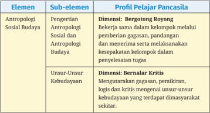
> **[Konteks Visual]**: Maaf, gagal memproses gambar secara teknis: CUDA error: device-side assert triggered
Search for `cudaErrorAssert' in https://docs.nvidia.com/cuda/cuda-runtime-api/group__CUDART__TYPES.html for more information.
CUDA kernel errors might be asynchronously reported at some other API call, so the stacktrace below might be incorrect.
For debugging consider passing CUDA_LAUNCH_BLOCKING=1
Compile with `TORCH_USE_CUDA_DSA` to enable device-side assertions.

### [HALAMAN_88]

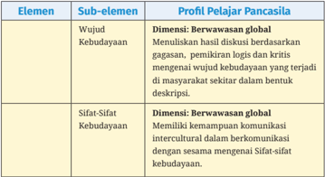
> **[Konteks Visual]**: Maaf, gagal memproses gambar secara teknis: CUDA error: device-side assert triggered
Search for `cudaErrorAssert' in https://docs.nvidia.com/cuda/cuda-runtime-api/group__CUDART__TYPES.html for more information.
CUDA kernel errors might be asynchronously reported at some other API call, so the stacktrace below might be incorrect.
For debugging consider passing CUDA_LAUNCH_BLOCKING=1
Compile with `TORCH_USE_CUDA_DSA` to enable device-side assertions.

## 5.  Skema Pembelajaran
Skema pembelajaran yang tertera di bawah ini tidak baku. Bapak/Ibu guru  dapat  menyesuaikan  atau  mengembangkannya  sesuai  dengan situasi  dan  kebutuhan.  Sedangkan  cakupan  materi  dan  aktivitas pembelajaran pada Bab 2 dapat saja dibutuhkan pertemuan sebanyak 8  pertemuan  dengan  alokasi  4  minggu    dan  jam  pelajaran  sebanyak 16  JP.  Jumlah  JP  dan  jumlah  waktu  pertemuan  dapat  diubah  sesuai dengan  alokasi  program  semester  atau  program  tahunan  dan  juga mempertimbangkan kedalaman materi yang diperlukan serta situasi dan kondisi kelas masing-masing. Sebagai contoh skema pembelajaran dapat disajikan pada Tabel 2.2 berikut:

### [HALAMAN_89]

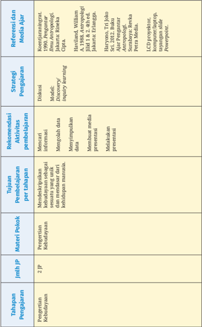
> **[Konteks Visual]**: Maaf, gagal memproses gambar secara teknis: CUDA error: device-side assert triggered
Search for `cudaErrorAssert' in https://docs.nvidia.com/cuda/cuda-runtime-api/group__CUDART__TYPES.html for more information.
CUDA kernel errors might be asynchronously reported at some other API call, so the stacktrace below might be incorrect.
For debugging consider passing CUDA_LAUNCH_BLOCKING=1
Compile with `TORCH_USE_CUDA_DSA` to enable device-side assertions.

> **[Konteks Visual]**: Maaf, gagal memproses gambar secara teknis: CUDA error: device-side assert triggered
Search for `cudaErrorAssert' in https://docs.nvidia.com/cuda/cuda-runtime-api/group__CUDART__TYPES.html for more information.
CUDA kernel errors might be asynchronously reported at some other API call, so the stacktrace below might be incorrect.
For debugging consider passing CUDA_LAUNCH_BLOCKING=1
Compile with `TORCH_USE_CUDA_DSA` to enable device-side assertions.

### [HALAMAN_90]

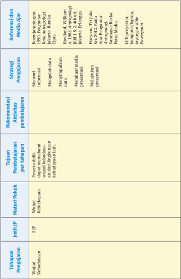
> **[Konteks Visual]**: Maaf, gagal memproses gambar secara teknis: CUDA error: device-side assert triggered
Search for `cudaErrorAssert' in https://docs.nvidia.com/cuda/cuda-runtime-api/group__CUDART__TYPES.html for more information.
CUDA kernel errors might be asynchronously reported at some other API call, so the stacktrace below might be incorrect.
For debugging consider passing CUDA_LAUNCH_BLOCKING=1
Compile with `TORCH_USE_CUDA_DSA` to enable device-side assertions.

### [HALAMAN_91]

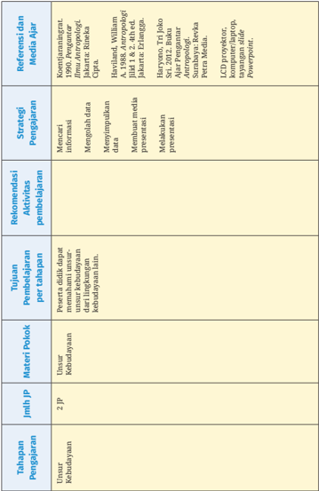
> **[Konteks Visual]**: Maaf, gagal memproses gambar secara teknis: CUDA error: device-side assert triggered
Search for `cudaErrorAssert' in https://docs.nvidia.com/cuda/cuda-runtime-api/group__CUDART__TYPES.html for more information.
CUDA kernel errors might be asynchronously reported at some other API call, so the stacktrace below might be incorrect.
For debugging consider passing CUDA_LAUNCH_BLOCKING=1
Compile with `TORCH_USE_CUDA_DSA` to enable device-side assertions.

> **[Konteks Visual]**: Maaf, gagal memproses gambar secara teknis: CUDA error: device-side assert triggered
Search for `cudaErrorAssert' in https://docs.nvidia.com/cuda/cuda-runtime-api/group__CUDART__TYPES.html for more information.
CUDA kernel errors might be asynchronously reported at some other API call, so the stacktrace below might be incorrect.
For debugging consider passing CUDA_LAUNCH_BLOCKING=1
Compile with `TORCH_USE_CUDA_DSA` to enable device-side assertions.

### [HALAMAN_92]

> **[Konteks Visual]**: Maaf, gagal memproses gambar secara teknis: CUDA error: device-side assert triggered
Search for `cudaErrorAssert' in https://docs.nvidia.com/cuda/cuda-runtime-api/group__CUDART__TYPES.html for more information.
CUDA kernel errors might be asynchronously reported at some other API call, so the stacktrace below might be incorrect.
For debugging consider passing CUDA_LAUNCH_BLOCKING=1
Compile with `TORCH_USE_CUDA_DSA` to enable device-side assertions.

### [HALAMAN_93]

> **[Konteks Visual]**: Maaf, gagal memproses gambar secara teknis: CUDA error: device-side assert triggered
Search for `cudaErrorAssert' in https://docs.nvidia.com/cuda/cuda-runtime-api/group__CUDART__TYPES.html for more information.
CUDA kernel errors might be asynchronously reported at some other API call, so the stacktrace below might be incorrect.
For debugging consider passing CUDA_LAUNCH_BLOCKING=1
Compile with `TORCH_USE_CUDA_DSA` to enable device-side assertions.

6.	 Rekomendasi	Peran	Guru	dalam	Aktivitas	Pembelajaran
a.  Rekomendasi	dalam	Aktivitas	Pembelajaran	Pertemuan	Pertama
Rincian tahapan pada masing-masing pertemuan dapat dijelaskan sebagai berikut:

## Alokasi Waktu 2 JP
Pertemuan
(2 x 45')
Pertama Materi: Pengertian kebudayaan Lembar Kegiatan Peserta Didik 2.1
Aktivitas:

> **[Konteks Visual]**: Maaf, gagal memproses gambar secara teknis: CUDA error: device-side assert triggered
Search for `cudaErrorAssert' in https://docs.nvidia.com/cuda/cuda-runtime-api/group__CUDART__TYPES.html for more information.
CUDA kernel errors might be asynchronously reported at some other API call, so the stacktrace below might be incorrect.
For debugging consider passing CUDA_LAUNCH_BLOCKING=1
Compile with `TORCH_USE_CUDA_DSA` to enable device-side assertions.

Bagian 2

### [HALAMAN_94]

## ⌦ Pendahuluan
Peserta  didik  berdoa  bersama  memulai  pembelajaran.  Selanjutnya, guru meminta peserta didik untuk melakukan absensi.
Peserta didik di sampaikan mengenai capaian pembelajaran.
Peserta didik mendapatkan pertanyaan guru, pernahkah kalian berkunjung  keobyek  peninggalan  masa  lalu?  Sebutkan  peninggalan nenek moyang di sekitar kalian? Apakah itu semua tergolong kebudayaan? Tahukah kaliian apa itu ilmu antropologi?

## ⌦ Kegiatan Inti
Peserta didik memperhatikan secara serius presentasl slide power poin tentang pengertian kebudayaan dalam pandangan tokoh antropologi.
Peserta  didik  dimotivasi  dan  diberi  kesempatan  untuk  mengajukan pertanyaan yang ingin diketahui tentang.kebudayaan.
Guru menjelaskan penugasan sebagai berikut:

> **[Konteks Visual]**: Maaf, gagal memproses gambar secara teknis: CUDA error: device-side assert triggered
Search for `cudaErrorAssert' in https://docs.nvidia.com/cuda/cuda-runtime-api/group__CUDART__TYPES.html for more information.
CUDA kernel errors might be asynchronously reported at some other API call, so the stacktrace below might be incorrect.
For debugging consider passing CUDA_LAUNCH_BLOCKING=1
Compile with `TORCH_USE_CUDA_DSA` to enable device-side assertions.

## Lembar Kegiatan Peserta Didik 2.1

> **[Konteks Visual]**: Maaf, gagal memproses gambar secara teknis: CUDA error: device-side assert triggered
Search for `cudaErrorAssert' in https://docs.nvidia.com/cuda/cuda-runtime-api/group__CUDART__TYPES.html for more information.
CUDA kernel errors might be asynchronously reported at some other API call, so the stacktrace below might be incorrect.
For debugging consider passing CUDA_LAUNCH_BLOCKING=1
Compile with `TORCH_USE_CUDA_DSA` to enable device-side assertions.

Peserta didik mempresentasikan di depan kelas, peserta didik lainnya harus  saling  memberikan  komentar  atau  pertanyaan,  dan  harus dijawab oleh penyaji.

### [HALAMAN_95]

Peserta  didik  dimotivasi  aktif  dan  kreatif  mengumpulkan  informasi yang relevan dan memanfaatkan berbagai sumber belajar yang tersedia baik dari buku, media informasi cetak maupun elektronik, dan internet.

> **[Konteks Visual]**: Maaf, gagal memproses gambar secara teknis: CUDA error: device-side assert triggered
Search for `cudaErrorAssert' in https://docs.nvidia.com/cuda/cuda-runtime-api/group__CUDART__TYPES.html for more information.
CUDA kernel errors might be asynchronously reported at some other API call, so the stacktrace below might be incorrect.
For debugging consider passing CUDA_LAUNCH_BLOCKING=1
Compile with `TORCH_USE_CUDA_DSA` to enable device-side assertions.

## ⌦ Penutup
Peserta  didik  membuat  rangkuman  atau  kesimpulan  pelajaran  yang sudah berlangsung.
Peserta didik diminta untuk merefleksi dengan menyampaikan manfaat memahami pengertian kebudayaan.
Peserta didik mendapatkan penilaian hasil kerja dan penghargaan atas kerja terbaiknya.
Peserta didik mendapatkan tindak lanjut kegiatan pada pembelajaran selanjutnya.

## ⌦ Metode dan Model Pembelajaran
Pendekatan: Saintifik
Model: Discovery Learning
Metode: Diskusi, tanya jawab, dan penugasan.

> **[Konteks Visual]**: Maaf, gagal memproses gambar secara teknis: CUDA error: device-side assert triggered
Search for `cudaErrorAssert' in https://docs.nvidia.com/cuda/cuda-runtime-api/group__CUDART__TYPES.html for more information.
CUDA kernel errors might be asynchronously reported at some other API call, so the stacktrace below might be incorrect.
For debugging consider passing CUDA_LAUNCH_BLOCKING=1
Compile with `TORCH_USE_CUDA_DSA` to enable device-side assertions.

## ⌦ Media dan Alat Pembelajaran
LCD proyektor, komputer atau laptop, tayangan slide Powerpoint (ppt,papan tulis, buku, poster, spidol, video dan media lain yang telah disiapkan.

> **[Konteks Visual]**: Maaf, gagal memproses gambar secara teknis: CUDA error: device-side assert triggered
Search for `cudaErrorAssert' in https://docs.nvidia.com/cuda/cuda-runtime-api/group__CUDART__TYPES.html for more information.
CUDA kernel errors might be asynchronously reported at some other API call, so the stacktrace below might be incorrect.
For debugging consider passing CUDA_LAUNCH_BLOCKING=1
Compile with `TORCH_USE_CUDA_DSA` to enable device-side assertions.

## ⌦ Sumber Belajar
Buku  antropologi  kelas  XII,  buku  Antropologi  lain  yang  relevan,  jurnal, video, internet, dan lain-lain.

### [HALAMAN_96]

> **[Konteks Visual]**: Maaf, gagal memproses gambar secara teknis: CUDA error: device-side assert triggered
Search for `cudaErrorAssert' in https://docs.nvidia.com/cuda/cuda-runtime-api/group__CUDART__TYPES.html for more information.
CUDA kernel errors might be asynchronously reported at some other API call, so the stacktrace below might be incorrect.
For debugging consider passing CUDA_LAUNCH_BLOCKING=1
Compile with `TORCH_USE_CUDA_DSA` to enable device-side assertions.

## ⌦ Penilaian

> **[Konteks Visual]**: Maaf, gagal memproses gambar secara teknis: CUDA error: device-side assert triggered
Search for `cudaErrorAssert' in https://docs.nvidia.com/cuda/cuda-runtime-api/group__CUDART__TYPES.html for more information.
CUDA kernel errors might be asynchronously reported at some other API call, so the stacktrace below might be incorrect.
For debugging consider passing CUDA_LAUNCH_BLOCKING=1
Compile with `TORCH_USE_CUDA_DSA` to enable device-side assertions.

Penilaian Praktek (diskusi kelas)
…………
:
Kelas Tabel 2.4 Lembar penilaian keterampilan Skor dalam rentang 1-4

> **[Konteks Visual]**: Maaf, gagal memproses gambar secara teknis: CUDA error: device-side assert triggered
Search for `cudaErrorAssert' in https://docs.nvidia.com/cuda/cuda-runtime-api/group__CUDART__TYPES.html for more information.
CUDA kernel errors might be asynchronously reported at some other API call, so the stacktrace below might be incorrect.
For debugging consider passing CUDA_LAUNCH_BLOCKING=1
Compile with `TORCH_USE_CUDA_DSA` to enable device-side assertions.

### [HALAMAN_97]

> **[Konteks Visual]**: Maaf, gagal memproses gambar secara teknis: CUDA error: device-side assert triggered
Search for `cudaErrorAssert' in https://docs.nvidia.com/cuda/cuda-runtime-api/group__CUDART__TYPES.html for more information.
CUDA kernel errors might be asynchronously reported at some other API call, so the stacktrace below might be incorrect.
For debugging consider passing CUDA_LAUNCH_BLOCKING=1
Compile with `TORCH_USE_CUDA_DSA` to enable device-side assertions.

> **[Konteks Visual]**: Maaf, gagal memproses gambar secara teknis: CUDA error: device-side assert triggered
Search for `cudaErrorAssert' in https://docs.nvidia.com/cuda/cuda-runtime-api/group__CUDART__TYPES.html for more information.
CUDA kernel errors might be asynchronously reported at some other API call, so the stacktrace below might be incorrect.
For debugging consider passing CUDA_LAUNCH_BLOCKING=1
Compile with `TORCH_USE_CUDA_DSA` to enable device-side assertions.

## Perolehan Skor x 3

## Nilai Akhir  =
3

> **[Konteks Visual]**: Maaf, gagal memproses gambar secara teknis: CUDA error: device-side assert triggered
Search for `cudaErrorAssert' in https://docs.nvidia.com/cuda/cuda-runtime-api/group__CUDART__TYPES.html for more information.
CUDA kernel errors might be asynchronously reported at some other API call, so the stacktrace below might be incorrect.
For debugging consider passing CUDA_LAUNCH_BLOCKING=1
Compile with `TORCH_USE_CUDA_DSA` to enable device-side assertions.

## ⌦ Rubrik Penilaian

> **[Konteks Visual]**: Maaf, gagal memproses gambar secara teknis: CUDA error: device-side assert triggered
Search for `cudaErrorAssert' in https://docs.nvidia.com/cuda/cuda-runtime-api/group__CUDART__TYPES.html for more information.
CUDA kernel errors might be asynchronously reported at some other API call, so the stacktrace below might be incorrect.
For debugging consider passing CUDA_LAUNCH_BLOCKING=1
Compile with `TORCH_USE_CUDA_DSA` to enable device-side assertions.

### [HALAMAN_98]

> **[Konteks Visual]**: Maaf, gagal memproses gambar secara teknis: CUDA error: device-side assert triggered
Search for `cudaErrorAssert' in https://docs.nvidia.com/cuda/cuda-runtime-api/group__CUDART__TYPES.html for more information.
CUDA kernel errors might be asynchronously reported at some other API call, so the stacktrace below might be incorrect.
For debugging consider passing CUDA_LAUNCH_BLOCKING=1
Compile with `TORCH_USE_CUDA_DSA` to enable device-side assertions.

> **[Konteks Visual]**: Maaf, gagal memproses gambar secara teknis: CUDA error: device-side assert triggered
Search for `cudaErrorAssert' in https://docs.nvidia.com/cuda/cuda-runtime-api/group__CUDART__TYPES.html for more information.
CUDA kernel errors might be asynchronously reported at some other API call, so the stacktrace below might be incorrect.
For debugging consider passing CUDA_LAUNCH_BLOCKING=1
Compile with `TORCH_USE_CUDA_DSA` to enable device-side assertions.

> **[Konteks Visual]**: Maaf, gagal memproses gambar secara teknis: CUDA error: device-side assert triggered
Search for `cudaErrorAssert' in https://docs.nvidia.com/cuda/cuda-runtime-api/group__CUDART__TYPES.html for more information.
CUDA kernel errors might be asynchronously reported at some other API call, so the stacktrace below might be incorrect.
For debugging consider passing CUDA_LAUNCH_BLOCKING=1
Compile with `TORCH_USE_CUDA_DSA` to enable device-side assertions.

Lembar penilaian keterampilan
Tabel 2.5

> **[Konteks Visual]**: Maaf, gagal memproses gambar secara teknis: CUDA error: device-side assert triggered
Search for `cudaErrorAssert' in https://docs.nvidia.com/cuda/cuda-runtime-api/group__CUDART__TYPES.html for more information.
CUDA kernel errors might be asynchronously reported at some other API call, so the stacktrace below might be incorrect.
For debugging consider passing CUDA_LAUNCH_BLOCKING=1
Compile with `TORCH_USE_CUDA_DSA` to enable device-side assertions.

### [HALAMAN_99]

> **[Konteks Visual]**: Maaf, gagal memproses gambar secara teknis: CUDA error: device-side assert triggered
Search for `cudaErrorAssert' in https://docs.nvidia.com/cuda/cuda-runtime-api/group__CUDART__TYPES.html for more information.
CUDA kernel errors might be asynchronously reported at some other API call, so the stacktrace below might be incorrect.
For debugging consider passing CUDA_LAUNCH_BLOCKING=1
Compile with `TORCH_USE_CUDA_DSA` to enable device-side assertions.

## Perolehan Skor x 100
Nilai Akhir  =

> **[Konteks Visual]**: Maaf, gagal memproses gambar secara teknis: CUDA error: device-side assert triggered
Search for `cudaErrorAssert' in https://docs.nvidia.com/cuda/cuda-runtime-api/group__CUDART__TYPES.html for more information.
CUDA kernel errors might be asynchronously reported at some other API call, so the stacktrace below might be incorrect.
For debugging consider passing CUDA_LAUNCH_BLOCKING=1
Compile with `TORCH_USE_CUDA_DSA` to enable device-side assertions.

## 800

> **[Konteks Visual]**: Maaf, gagal memproses gambar secara teknis: CUDA error: device-side assert triggered
Search for `cudaErrorAssert' in https://docs.nvidia.com/cuda/cuda-runtime-api/group__CUDART__TYPES.html for more information.
CUDA kernel errors might be asynchronously reported at some other API call, so the stacktrace below might be incorrect.
For debugging consider passing CUDA_LAUNCH_BLOCKING=1
Compile with `TORCH_USE_CUDA_DSA` to enable device-side assertions.

### [HALAMAN_100]

## ⌦ Penilaian Pengetahuan
Tes tulis - Pilihan ganda (Formatif)
Skor: Setiap soal memiliki nilai 2,5.
Nilai akhir: Jumlah soal dijawab benar X 2,5.

## b.  Rekomendasi	dalam	Aktivitas	Pembelajaran	Kedua
Rincian tahapan pada masing-masing pertemuan dapat dijelaskan sebagai berikut:

> **[Konteks Visual]**: Maaf, gagal memproses gambar secara teknis: CUDA error: device-side assert triggered
Search for `cudaErrorAssert' in https://docs.nvidia.com/cuda/cuda-runtime-api/group__CUDART__TYPES.html for more information.
CUDA kernel errors might be asynchronously reported at some other API call, so the stacktrace below might be incorrect.
For debugging consider passing CUDA_LAUNCH_BLOCKING=1
Compile with `TORCH_USE_CUDA_DSA` to enable device-side assertions.

> **[Konteks Visual]**: Maaf, gagal memproses gambar secara teknis: CUDA error: device-side assert triggered
Search for `cudaErrorAssert' in https://docs.nvidia.com/cuda/cuda-runtime-api/group__CUDART__TYPES.html for more information.
CUDA kernel errors might be asynchronously reported at some other API call, so the stacktrace below might be incorrect.
For debugging consider passing CUDA_LAUNCH_BLOCKING=1
Compile with `TORCH_USE_CUDA_DSA` to enable device-side assertions.

Rekomendasi kegiatan belajar oleh guru dan peserta didik:

## ⌦ Pendahuluan
Peserta didik  diajak  untuk mempersiapkan diri dalam pembelajaran.
Ketua kelas memimpin doa untuk memulai pembelajaran.
Peserta  didik  ditegaskan  kembali  tentang  pembelajaran  pertemuan sebelumnya.
Guru memotivasi peserta didik untuk beriman dan bertakwa kepada Tuhan Yang Maha Esa, bergotong royong, bernalar kritis, kreatif.

## ⌦ Kegiatan Inti
Peserta didik diingatkan materi pertemuan yang lalu dan menanyakan kembali  pertanyaan  kepada  peserta  didik  tentang  apa    yang  peserta harapkan ketika telah memahami konsep kebudayaan.
Peserta didik menyimak artikel mengenai konsep kebudayaan.
Peserta didik menganalisis manfaat kebudayaan  dan sebagainya yang diberikan oleh guru. Melalui pembelajaran mengenai kebudayaan yang sudah diuraikan sebelumnya, apa yang dapat kalian simpulkan?
Peserta didik diberikan tugas kelompok pada Lembar Kerja 2.2 sebagai berikut:

### [HALAMAN_101]

> **[Konteks Visual]**: Maaf, gagal memproses gambar secara teknis: CUDA error: device-side assert triggered
Search for `cudaErrorAssert' in https://docs.nvidia.com/cuda/cuda-runtime-api/group__CUDART__TYPES.html for more information.
CUDA kernel errors might be asynchronously reported at some other API call, so the stacktrace below might be incorrect.
For debugging consider passing CUDA_LAUNCH_BLOCKING=1
Compile with `TORCH_USE_CUDA_DSA` to enable device-side assertions.

## Lembar Kegiatan Peserta Didik 2.2

> **[Konteks Visual]**: Maaf, gagal memproses gambar secara teknis: CUDA error: device-side assert triggered
Search for `cudaErrorAssert' in https://docs.nvidia.com/cuda/cuda-runtime-api/group__CUDART__TYPES.html for more information.
CUDA kernel errors might be asynchronously reported at some other API call, so the stacktrace below might be incorrect.
For debugging consider passing CUDA_LAUNCH_BLOCKING=1
Compile with `TORCH_USE_CUDA_DSA` to enable device-side assertions.

## Kebudayaan adalah Sistem Kehidupan Masyarakat, Pahami Unsur dan Wujudnya
Kebudayaan  adalah  unsur  yang  tidak  dapat  dipisahkan  dari  kehidupan manusia. Melalui kebudayaan, suatu peradaban manusia dapat dikenali dan diamati dalam jangka waktu yang tak terbatas. Dalam seperangkat kebudayaan, terdapat beberapa hal yang menjadi dasarnya. Beberapa hal tersebut antara lain meliputi nilai, akal, budi, moral, tujuan, hingga adat istiadat.
Secara  singkat,  kebudayaan  adalah  suatu  hal  yang  menjadi  patokan  cara hidup suatu masyarakat tertentu. Biasanya, kebudayaan ini tidak semata-mata terbentuk  dalam  kurun  waktu  singkat.  Kebiasaan  dan  sistem  yang  berlaku  di masyarakat membentuk kebudayaan itu sendiri melalui proses tertentu. Sehingga, kebudayaan tersebut membentuk suatu identitas pribadi yang unik dan menjadi pembeda antara  masyarakat  satu  dengan  lainnya.  Melalui  kebudayaan,  suatu masyarakat dapat mencapai taraf hidup tertentu yang telah disepakati bersama.
Sumber: Anggraini. 2021. 'Kebudayaan Adalah Sistem Kehidupan Masyarakat, Pahami Unsur Dan Wujudnya.' Merdeka.Com. November 2021. https://www.merdeka.com/trending/kebudayaanadalah-sistem-kehidupan-masyarakat-pahami-unsur-dan-wujudnya-kln.html.

## Petunjuk Pengerjaan
Refleksikan bahan bacaan tersebut yang ditarik pada manfaat mempelajari kebudayaan. Kemudian, diskusikan dengan teman sebangkumu:
Jelaskan manfaat lain dari mempelajari kebudayaan!
Apa yang ingin kalian dapatkan dari pembelajaran mengenai kebudayaan?

> **[Konteks Visual]**: Maaf, gagal memproses gambar secara teknis: CUDA error: device-side assert triggered
Search for `cudaErrorAssert' in https://docs.nvidia.com/cuda/cuda-runtime-api/group__CUDART__TYPES.html for more information.
CUDA kernel errors might be asynchronously reported at some other API call, so the stacktrace below might be incorrect.
For debugging consider passing CUDA_LAUNCH_BLOCKING=1
Compile with `TORCH_USE_CUDA_DSA` to enable device-side assertions.

### [HALAMAN_102]

## ⌦ Penutup
Peserta  didik  diberikan  pertanyaan  acak  tentang  materi  yang  telah dipelajari  dan  memberikam  pertanyaan  untuk  mengukur  tingkat pemahaman peserta didik.
Peserta didik berdoa bersama untuk mengakhiri pembelajaran.

## ⌦ Metode dan Model Pembelajaran
1.
Pendekatan: Saintifik
Model: Discovery Learning
Metode: Ceramah, Diskusi, tanya jawab, dan penugasan

## ⌦ Media dan Alat Pembelajaran
LCD  proyektor,  komputer  atau  laptop,  tayangan  slide Powerpoint (ppt, papan tulis, buku, poster, spidol, video dan media lain yang telah disiapkan.

## ⌦ Sumber Belajar
Buku  Antropologi  kelas  XII,  buku  Antropologi  lain  yang  relevan,  jurnal, video, internet, dan lain-lain.

## c. Rekomendasi	dalam	Aktivitas	Pembelajaran	Ketiga
Rincian tahapan pada masing-masing pertemuan dapat dijelaskan sebagai berikut:

> **[Konteks Visual]**: Maaf, gagal memproses gambar secara teknis: CUDA error: device-side assert triggered
Search for `cudaErrorAssert' in https://docs.nvidia.com/cuda/cuda-runtime-api/group__CUDART__TYPES.html for more information.
CUDA kernel errors might be asynchronously reported at some other API call, so the stacktrace below might be incorrect.
For debugging consider passing CUDA_LAUNCH_BLOCKING=1
Compile with `TORCH_USE_CUDA_DSA` to enable device-side assertions.

> **[Konteks Visual]**: Maaf, gagal memproses gambar secara teknis: CUDA error: device-side assert triggered
Search for `cudaErrorAssert' in https://docs.nvidia.com/cuda/cuda-runtime-api/group__CUDART__TYPES.html for more information.
CUDA kernel errors might be asynchronously reported at some other API call, so the stacktrace below might be incorrect.
For debugging consider passing CUDA_LAUNCH_BLOCKING=1
Compile with `TORCH_USE_CUDA_DSA` to enable device-side assertions.

Rekomendasi kegiatan belajar oleh guru dan peserta didik:

## ⌦ Pendahuluan
Peserta didik diajak untuk mempersiapkan diri dalam pembelajaran.
Ketua kelas  ditunjuk  untuk  memimpin  doa  untuk  memulai  pembelajaran.
SMA/MA Kelas XII

### [HALAMAN_103]

Peserta  didik  ditegaskan  kembali  tentang  pembelajaran  pertemuan sebelumnya.
Peserta didik diberikan gambaran tentang manfaat mempelajari wujud kebudayaan.
Peserta didik diberi ulasan dan mengaitkan materi pembelajaran yang akan dilakukan tentang konsep wujud kebudayaan dengan pengalaman peserta didik.
Peserta didik dijelaskan capaian kompetensi yang akan dicapai.

## ⌦ Kegiatan Inti
Peserta didik mengerjakan Lembar kegiatan peserta didik 2.3!

> **[Konteks Visual]**: Maaf, gagal memproses gambar secara teknis: CUDA error: device-side assert triggered
Search for `cudaErrorAssert' in https://docs.nvidia.com/cuda/cuda-runtime-api/group__CUDART__TYPES.html for more information.
CUDA kernel errors might be asynchronously reported at some other API call, so the stacktrace below might be incorrect.
For debugging consider passing CUDA_LAUNCH_BLOCKING=1
Compile with `TORCH_USE_CUDA_DSA` to enable device-side assertions.

## Lembar Kegiatan Peserta Didik 2.3

> **[Konteks Visual]**: Maaf, gagal memproses gambar secara teknis: CUDA error: device-side assert triggered
Search for `cudaErrorAssert' in https://docs.nvidia.com/cuda/cuda-runtime-api/group__CUDART__TYPES.html for more information.
CUDA kernel errors might be asynchronously reported at some other API call, so the stacktrace below might be incorrect.
For debugging consider passing CUDA_LAUNCH_BLOCKING=1
Compile with `TORCH_USE_CUDA_DSA` to enable device-side assertions.

> **[Konteks Visual]**: Maaf, gagal memproses gambar secara teknis: CUDA error: device-side assert triggered
Search for `cudaErrorAssert' in https://docs.nvidia.com/cuda/cuda-runtime-api/group__CUDART__TYPES.html for more information.
CUDA kernel errors might be asynchronously reported at some other API call, so the stacktrace below might be incorrect.
For debugging consider passing CUDA_LAUNCH_BLOCKING=1
Compile with `TORCH_USE_CUDA_DSA` to enable device-side assertions.

### [HALAMAN_104]

> **[Konteks Visual]**: Maaf, gagal memproses gambar secara teknis: CUDA error: device-side assert triggered
Search for `cudaErrorAssert' in https://docs.nvidia.com/cuda/cuda-runtime-api/group__CUDART__TYPES.html for more information.
CUDA kernel errors might be asynchronously reported at some other API call, so the stacktrace below might be incorrect.
For debugging consider passing CUDA_LAUNCH_BLOCKING=1
Compile with `TORCH_USE_CUDA_DSA` to enable device-side assertions.

Guru membimbing peserta didik melakukan pengolahan data dengan cara meminta beberapa peserta didik secara acak membacakan data yang telah berhasil dikumpulkannya, lalu guru menanyakan kendala yang dihadapi dan memberi saran perbaikan atas data-data yang telah dikumpulkan peserta didik.
Peserta  didik  dibimbing  melakukan  pengolahan  data/informasi  yang telah berhasil dikumpulkannya menjadi suatu informasi yang berarti dan dapat dipahami.

## ⌦ Penutup
Guru  memberikan  pertanyaan  acak  ke  peserta  didik  tentang  materi yang telah dipelajari.
Peserta didik berdoa semoga pembelajaran hari ini bermanfaat.

## ⌦ Metode dan Model Pembelajaran
Pendekatan: Saintifik
Model:
Discovery Learning
Metode: Diskusi, tanya jawab dan penugasan

## ⌦ Media dan Alat Pembelajaran
LCD proyektor, komputer atau laptop, tayangan slide Powerpoint (ppt,papan tulis, buku, poster, spidol, video dan media lain yang telah disiapkan.

### [HALAMAN_105]

## ⌦ Sumber Belajar
Buku  Antropologi  kelas  XII,  buku  Antropologi  lain  yang  relevan,  jurnal, video, internet, dan lain-lain.

## d.	 Rekomendasi	dalam	Aktivitas	 Pembelajaran	 Pertemuan Keempat
Rincian tahapan pada masing-masing pertemuan dapat dijelaskan sebagai berikut:

> **[Konteks Visual]**: Maaf, gagal memproses gambar secara teknis: CUDA error: device-side assert triggered
Search for `cudaErrorAssert' in https://docs.nvidia.com/cuda/cuda-runtime-api/group__CUDART__TYPES.html for more information.
CUDA kernel errors might be asynchronously reported at some other API call, so the stacktrace below might be incorrect.
For debugging consider passing CUDA_LAUNCH_BLOCKING=1
Compile with `TORCH_USE_CUDA_DSA` to enable device-side assertions.

> **[Konteks Visual]**: Maaf, gagal memproses gambar secara teknis: CUDA error: device-side assert triggered
Search for `cudaErrorAssert' in https://docs.nvidia.com/cuda/cuda-runtime-api/group__CUDART__TYPES.html for more information.
CUDA kernel errors might be asynchronously reported at some other API call, so the stacktrace below might be incorrect.
For debugging consider passing CUDA_LAUNCH_BLOCKING=1
Compile with `TORCH_USE_CUDA_DSA` to enable device-side assertions.

Rekomendasi kegiatan belajar oleh guru dan peserta didik:

## ⌦ Pendahuluan
Peserta didik menjawab salam.
Peserta didik diterangkan capaian kompetensi yang akan didipelajari dan manfaat dalam kehidupan sehari-hari.
Peserta  didik  mengemukakan  pendapat  manfaat  mempelajari  wujud kebudayaan.

## ⌦ Kegiatan Inti
Peserta didik dikelompokkan secara acak terdiri dari 3-4 orang.
Peserta  didik  diberi  motivasi  atau  rangsangan  untuk  memusatkan perhatian pada materi  wujud  kebudayaa  dengan menayangkan gambar/ foto  tentang wujud  kebudayaan.  'Apa  yang  kalian  pikirkan  tentang  foto/ gambar tersebut?' (foto/gambar tentang aneka kesenian daerah setempat).
Guru  memberikan  kesempatan  pada  peserta  didik  untuk  mengidentifikasi  sebanyak  mungkin  pertanyaan  yang  berkaitan  dengan gambar yang disajikan dan akan dijawab melalui kegiatan belajar.
Peserta didik mengumpulkan informasi yang relevan untuk menjawab pertanyan kegiatan: Lembar kegiatan peserta didik 2.4 sebagai berikut:

> **[Konteks Visual]**: Maaf, gagal memproses gambar secara teknis: CUDA error: device-side assert triggered
Search for `cudaErrorAssert' in https://docs.nvidia.com/cuda/cuda-runtime-api/group__CUDART__TYPES.html for more information.
CUDA kernel errors might be asynchronously reported at some other API call, so the stacktrace below might be incorrect.
For debugging consider passing CUDA_LAUNCH_BLOCKING=1
Compile with `TORCH_USE_CUDA_DSA` to enable device-side assertions.

### [HALAMAN_106]

> **[Konteks Visual]**: Maaf, gagal memproses gambar secara teknis: CUDA error: device-side assert triggered
Search for `cudaErrorAssert' in https://docs.nvidia.com/cuda/cuda-runtime-api/group__CUDART__TYPES.html for more information.
CUDA kernel errors might be asynchronously reported at some other API call, so the stacktrace below might be incorrect.
For debugging consider passing CUDA_LAUNCH_BLOCKING=1
Compile with `TORCH_USE_CUDA_DSA` to enable device-side assertions.

## Lembar Kegiatan Peserta Didik 2.4

> **[Konteks Visual]**: Maaf, gagal memproses gambar secara teknis: CUDA error: device-side assert triggered
Search for `cudaErrorAssert' in https://docs.nvidia.com/cuda/cuda-runtime-api/group__CUDART__TYPES.html for more information.
CUDA kernel errors might be asynchronously reported at some other API call, so the stacktrace below might be incorrect.
For debugging consider passing CUDA_LAUNCH_BLOCKING=1
Compile with `TORCH_USE_CUDA_DSA` to enable device-side assertions.

## Riyaya Gak Nggoreng Kopi
Riyaya  gak  nggoreng  kopi,  ngadep  meja  gak  ono  jajane (Hari  raya  tanpa menyangrai  kopi,  menghadap  meja  tanpa  kue).  Itu  adalah  ungkapan  khas Masyarakat Jawa Timur untuk menggambarkan Lebaran yang dirayakan dalam suasana prihatin.
Lebaran,  seharusnya,  menjadi  momen  istimewa  yang  membahagiakan. Kerabat  yang  mudik  dari  kota  datang  untuk  berkumpul  dan  bersilaturahmi setahun sekali dengan keluarga.
Pada saat itu aneka makanan khas dan beragam kue disajikan di meja. Kopi pun disuguhkan sebagai teman menyantap kudapan. Namun, tahun ini Lebaran berlangsung dalam suasana prihatin, tanpa kopi dan kue di meja. Tanpa sanak saudara  yang  biasanya  mudik  dari  kota.  Ancaman  pagebluk  COVID-19  yang masih merajalela membuat pemerintah melarang warganya mudik.
Pagebluk masih sangat mengerikan, terutama karena munculnya gelombang kedua yang sedang mengancam. Akan banyak kerumunan selama Lebaran.  Jutaan  orang  akan  berinteraksi  untuk  bersilaturahmi,  dan  entah berapa banyak masyarakat berkumpul di tempat wisata. Ledakan penularan COVID-19 sangat mungkin terjadi, namun, akibat adanya larangan mudik pada tahun ini, maka tidak ada aturan resmi. Harga tiket pun melambung hingga 100 persen. Curi start mudik lebihawal harus diantisipasi di berbagai daerah. Gagasan larangan mudik adalah supaya tidak terjadi transmisi virus dari kota besar ke daerah.

### [HALAMAN_107]

Jika  mudik  terjadi  lebih  awal,  berarti  tujuan  untuk  menghentikan  atau mengurangi mobilitas tidak tercapai. Ketika para pemudik sudah sampai di daerah masing-masing, tidak ada lagi yang bisa membatasi pergerakan mereka karena umumnya  mereka  hanya  melakukan  mobilitas  lokal  atau  regional.  Dengan adanya  pembolehan  gerakan  di  wilayah  aglomerasi,  mobilitas  masyarakat dipastikan akan tetap padat selama libur Lebaran.
Ketaatan terhadap program kesehatan (prokes) cukup tinggi di perkotaan karena ketatnya pengawasan dan penerapan sanksi yang cukup tegas, namun, di daerah pedesaan penerapan prokes sangat longgar. Hampir tidak pernah warga desa yang terlihat memakai masker atau melakukan social distancing . Fasilitas umum untuk cuci tangan jarang terlihat, kecuali di instansi resmi pemerintah. Tempat wisata dan hiburan akan diizinkan beroperasi selama liburan. Berarti potensi kerumunan akan terjadi dan risiko penularan akan cukup tinggi.
Menghentikan pergerakan mudik secara total juga berarti sebuah opportunity lost yang bernilai ratusan triliun. Melalui penduduk Jabodetabek yang berjumlah hampir 15 Juta jiwa terdapat aliran uang yang diperkirakan mencapai Rp 10 Triliun dibawa pemudik. Daripada kita mengalami tsunami pandemi seperti India, lebih baik, untuk kali ini, kita Riyaya gak nggoreng kopi.
Sumber: Abror. 2021. 'Riyaya Gag Nggoreng Kopi.' Jaringan Pemberitaan Nusantara Negeriku, May 1, 2021. https://jatim.jpnn.com/cak-abror/898/riyaya-gak-nggoreng-kopi.

> **[Konteks Visual]**: Maaf, gagal memproses gambar secara teknis: CUDA error: device-side assert triggered
Search for `cudaErrorAssert' in https://docs.nvidia.com/cuda/cuda-runtime-api/group__CUDART__TYPES.html for more information.
CUDA kernel errors might be asynchronously reported at some other API call, so the stacktrace below might be incorrect.
For debugging consider passing CUDA_LAUNCH_BLOCKING=1
Compile with `TORCH_USE_CUDA_DSA` to enable device-side assertions.

> **[Konteks Visual]**: Maaf, gagal memproses gambar secara teknis: CUDA error: device-side assert triggered
Search for `cudaErrorAssert' in https://docs.nvidia.com/cuda/cuda-runtime-api/group__CUDART__TYPES.html for more information.
CUDA kernel errors might be asynchronously reported at some other API call, so the stacktrace below might be incorrect.
For debugging consider passing CUDA_LAUNCH_BLOCKING=1
Compile with `TORCH_USE_CUDA_DSA` to enable device-side assertions.

### [HALAMAN_108]

Peserta didik menyampaikan hasil diskusi kelompoknya dan ditanggapi aktif oleh peserta didik dari kelompok lainnya.
Peserta didik penyaji diberi kesempatan  untuk menjawabnya.
Peserta didik menyimpulkan  tentang point-point penting yang muncul dalam kegiatan  pembelajaran  yang  baru  dilakukan  berupa:  Laporan hasil kerja secara tertulis tentang wujud kebudayaan.

## ⌦ Penutup
Peserta didik difasilitasi dalam menemukan kesimpulan tentang wujud kebudayaan.
Peserta  didik  dinformasikan  pembelajaran  pertemuan  berikutnya, yaitu tentang unsur-unsur kebudayaan.

## ⌦ Metode dan Model Pembelajaran
Pendekatan: Saintifik
Model:
Discovery Learning
Metode: Diskusi, tanya jawab dan penugasan

## ⌦ Media dan Alat Pembelajaran
LCD proyektor, komputer atau laptop, tayangan slide Powerpoint (ppt,papan tulis, buku, poster, spidol, video dan media lain yang telah disiapkan.

> **[Konteks Visual]**: Maaf, gagal memproses gambar secara teknis: CUDA error: device-side assert triggered
Search for `cudaErrorAssert' in https://docs.nvidia.com/cuda/cuda-runtime-api/group__CUDART__TYPES.html for more information.
CUDA kernel errors might be asynchronously reported at some other API call, so the stacktrace below might be incorrect.
For debugging consider passing CUDA_LAUNCH_BLOCKING=1
Compile with `TORCH_USE_CUDA_DSA` to enable device-side assertions.

## ⌦ Sumber Belajar
Buku  Antropologi  kelas  XII,  buku  Antropologi  lain  yang  relevan,  jurnal, video, internet, dan lain-lain.

## e.	 Rekomendasi	dalam	Aktivitas	 Pembelajaran	 Pertemuan Kelima
Rincian tahapan pada masing-masing pertemuan dapat dijelaskan sebagai berikut:

## Pertemuan Kelima
Alokasi Waktu 2 JP (2 x 45')
Materi: Unsur kebudayaan Aktivitas:
Lembar Kegiatan Peserta Didik 2.5

> **[Konteks Visual]**: Maaf, gagal memproses gambar secara teknis: CUDA error: device-side assert triggered
Search for `cudaErrorAssert' in https://docs.nvidia.com/cuda/cuda-runtime-api/group__CUDART__TYPES.html for more information.
CUDA kernel errors might be asynchronously reported at some other API call, so the stacktrace below might be incorrect.
For debugging consider passing CUDA_LAUNCH_BLOCKING=1
Compile with `TORCH_USE_CUDA_DSA` to enable device-side assertions.

Rekomendasi kegiatan belajar oleh guru dan peserta didik:

### [HALAMAN_109]

## ⌦ Pendahuluan
Peserta didik untuk mempersiapkan diri dalam pembelajaran dengan kondisi berseragam rapi dan siap belajar.
Seorang peserta didik memimpin berdoa bersama memulai pembelajaran dan  melakukan absensi.

## ⌦ Kegiatan inti
Guru  mengajak  peserta  didik  mengerjakan  kegiatan  peserta  didik  2.5 sebagai berikut:

> **[Konteks Visual]**: Maaf, gagal memproses gambar secara teknis: CUDA error: device-side assert triggered
Search for `cudaErrorAssert' in https://docs.nvidia.com/cuda/cuda-runtime-api/group__CUDART__TYPES.html for more information.
CUDA kernel errors might be asynchronously reported at some other API call, so the stacktrace below might be incorrect.
For debugging consider passing CUDA_LAUNCH_BLOCKING=1
Compile with `TORCH_USE_CUDA_DSA` to enable device-side assertions.

## Lembar Kegiatan Peserta Didik 2.5

> **[Konteks Visual]**: Maaf, gagal memproses gambar secara teknis: CUDA error: device-side assert triggered
Search for `cudaErrorAssert' in https://docs.nvidia.com/cuda/cuda-runtime-api/group__CUDART__TYPES.html for more information.
CUDA kernel errors might be asynchronously reported at some other API call, so the stacktrace below might be incorrect.
For debugging consider passing CUDA_LAUNCH_BLOCKING=1
Compile with `TORCH_USE_CUDA_DSA` to enable device-side assertions.

## 1. Lakukan Langkah-langkah berikut:
Amatilah kebudayaan yang ada di sekitar tempat tinggal kalian.
Kerjakan tugas individu ini dengan teliti.
Kemukakan temuan dan pendapat kalian pada diskusi kelas.
Peserta didik mempresentasikan di depan kelas.
Peserta didik lain memberikan komentar atau pertanyaan dan dijawab oleh penyaji.
Perbaikan harus dilakukan jika ada saran yang benar untuk penyempurnaan isi hasil kerja.

> **[Konteks Visual]**: Maaf, gagal memproses gambar secara teknis: CUDA error: device-side assert triggered
Search for `cudaErrorAssert' in https://docs.nvidia.com/cuda/cuda-runtime-api/group__CUDART__TYPES.html for more information.
CUDA kernel errors might be asynchronously reported at some other API call, so the stacktrace below might be incorrect.
For debugging consider passing CUDA_LAUNCH_BLOCKING=1
Compile with `TORCH_USE_CUDA_DSA` to enable device-side assertions.

### [HALAMAN_110]

## 2. Isilah tabel berikut ini:

> **[Konteks Visual]**: Maaf, gagal memproses gambar secara teknis: CUDA error: device-side assert triggered
Search for `cudaErrorAssert' in https://docs.nvidia.com/cuda/cuda-runtime-api/group__CUDART__TYPES.html for more information.
CUDA kernel errors might be asynchronously reported at some other API call, so the stacktrace below might be incorrect.
For debugging consider passing CUDA_LAUNCH_BLOCKING=1
Compile with `TORCH_USE_CUDA_DSA` to enable device-side assertions.

Setiap kelompok mendiskusikan ikasinya dengan data  atau teori pada buku sumber.
Peserta didik menyampaikan hasil diskusi berupa kesimpulan kelompokmya berdasarkan hasil analisis secara lisan dan tertulis.
Kelompok lain bertanya atas presentasi yang dilakukan dan kelompok penyaji diberi kesempatan  untuk menjawabnya.
Peserta didik menyimpulkan  tentang poin-poin penting yang muncul dalam kegiatan  pembelajaran  yang  baru  dilakukan  berupa:  Laporan hasil kerja secara tertulis tentang unsur-unsur kebudayaan.

### [HALAMAN_111]

## ⌦ Penutup
Peserta  didik  diberikan  pertanyaan  acak  tentang  materi  yang  telah dipelajari  dan  memberikam  pertanyaan  untuk  mengukur  tingkat pemahaman peserta didik.Peserta didik berdoa bersama untuk mengakhiri pembelajaran.

## ⌦ Metode dan Model Pembelajaran
Pendekatan: Saintifik
Model: Discovery Learning
Metode: Diskusi, tanya jawab dan penugasan

## ⌦ Media dan Alat Pembelajaran
LCD proyektor, komputer atau laptop, tayangan slide Powerpoint (ppt,papan tulis, buku, poster, spidol, video dan media lain yang telah disiapkan.

## ⌦ Sumber Belajar
Buku  Antropologi  kelas  XII,  buku  Antropologi  lain  yang  relevan,  jurnal, video, internet, dan lain-lain.

## f. Rekomendasi	dalam	Aktivitas	 Pembelajaran	 Pertemuan Keenam
Rincian tahapan pada masing-masing pertemuan dapat dijelaskan sebagai berikut:

> **[Konteks Visual]**: Maaf, gagal memproses gambar secara teknis: CUDA error: device-side assert triggered
Search for `cudaErrorAssert' in https://docs.nvidia.com/cuda/cuda-runtime-api/group__CUDART__TYPES.html for more information.
CUDA kernel errors might be asynchronously reported at some other API call, so the stacktrace below might be incorrect.
For debugging consider passing CUDA_LAUNCH_BLOCKING=1
Compile with `TORCH_USE_CUDA_DSA` to enable device-side assertions.

> **[Konteks Visual]**: Maaf, gagal memproses gambar secara teknis: CUDA error: device-side assert triggered
Search for `cudaErrorAssert' in https://docs.nvidia.com/cuda/cuda-runtime-api/group__CUDART__TYPES.html for more information.
CUDA kernel errors might be asynchronously reported at some other API call, so the stacktrace below might be incorrect.
For debugging consider passing CUDA_LAUNCH_BLOCKING=1
Compile with `TORCH_USE_CUDA_DSA` to enable device-side assertions.

> **[Konteks Visual]**: Maaf, gagal memproses gambar secara teknis: CUDA error: device-side assert triggered
Search for `cudaErrorAssert' in https://docs.nvidia.com/cuda/cuda-runtime-api/group__CUDART__TYPES.html for more information.
CUDA kernel errors might be asynchronously reported at some other API call, so the stacktrace below might be incorrect.
For debugging consider passing CUDA_LAUNCH_BLOCKING=1
Compile with `TORCH_USE_CUDA_DSA` to enable device-side assertions.

Rekomendasi kegiatan belajar oleh guru dan peserta didi

> **[Konteks Visual]**: Maaf, gagal memproses gambar secara teknis: CUDA error: device-side assert triggered
Search for `cudaErrorAssert' in https://docs.nvidia.com/cuda/cuda-runtime-api/group__CUDART__TYPES.html for more information.
CUDA kernel errors might be asynchronously reported at some other API call, so the stacktrace below might be incorrect.
For debugging consider passing CUDA_LAUNCH_BLOCKING=1
Compile with `TORCH_USE_CUDA_DSA` to enable device-side assertions.

### [HALAMAN_112]

## ⌦ Pendahuluan
Peserta didik dalam kondisi kelas yang kondusif, berdoa, menyiapkan media,  alat,  dan  buku  yang  diperlukan,  dan  siap    untuk  mengikuti pembelajaran.
Peserta didik diterangkan kompetensi yang dipelajari dan manfaatnya dalam kehidupan sehari-hari.
Peserta  didik  mengajukan  pertanyaan  yang  ada  kaitannya  dengan materi yang akan dilakukan.

## ⌦ Kegiatan Inti
Peserta didik dikelompokkan secara acak terdiri dari 3 atau 4 orang.
Peserta didik diberi motivasi untuk memusatkan perhatian pada materi wujud  kebudayaa  dengan menayangkan  gambar/foto  tentang  unsur kebudayaan. 'Apa yang kalian pikirkan tentang foto/gambar tersebut?'
Peserta didik diberikan kesempatan untuk mengidentifikasi sebanyak mungkin  pertanyaan  yang  berkaitan  dengan  gambar  yang  disajikan dan akan dijawab melalui kegiatan Lembar kegiatan peserta didik 2.6 sebagai berikut:

> **[Konteks Visual]**: Maaf, gagal memproses gambar secara teknis: CUDA error: device-side assert triggered
Search for `cudaErrorAssert' in https://docs.nvidia.com/cuda/cuda-runtime-api/group__CUDART__TYPES.html for more information.
CUDA kernel errors might be asynchronously reported at some other API call, so the stacktrace below might be incorrect.
For debugging consider passing CUDA_LAUNCH_BLOCKING=1
Compile with `TORCH_USE_CUDA_DSA` to enable device-side assertions.

## Lembar Kegiatan Peserta Didik 2.6

> **[Konteks Visual]**: Maaf, gagal memproses gambar secara teknis: CUDA error: device-side assert triggered
Search for `cudaErrorAssert' in https://docs.nvidia.com/cuda/cuda-runtime-api/group__CUDART__TYPES.html for more information.
CUDA kernel errors might be asynchronously reported at some other API call, so the stacktrace below might be incorrect.
For debugging consider passing CUDA_LAUNCH_BLOCKING=1
Compile with `TORCH_USE_CUDA_DSA` to enable device-side assertions.

### [HALAMAN_113]

## Nadiem Fokus Tingkatkan Unsur Kebudayaan dalam Kurikulum
REPUBLIKA.CO.ID, JAKARTA - Menteri Pendidikan dan Kebudayaan (Mendikbud) Nadiem Makarim akan menjadikan sinergi antara kebudayaan dan kurikulum fokus utama. Saat ini, kata Nadiem, kurikulum pendidikan akan disempurnakan dengan ditambahkan dari sektor yang berkaitan dengan kebudayaan.
'Di kurikulum juga, ada berbagai penyempurnaan kurikulum dan tentunya kreativitas akan menjadi salah satu fokus utama dalam cara pedagogik yang baru dan kurikulum yang ada,' kata Nadiem, ditemui usai membuka Rakornas Kebudayaan di Hotel Grand Sahid, Rabu (26/2) malam.
Nadiem menjelaskan, Kemendikbud sedang merumuskan agar bobot seni dan hal-hal dari unsur budaya maupun kreativitas bobotnya akan lebih tinggi.
Kemendikbud juga memiliki Pusat Prestasi Nasional yang akan menyelenggarakan lomba skala nasional dengan fokus tidak hanya dari akademis.
'Jadi fokusnya di situ, bukan hanya akademis saja. Kita ingin menciptakan anak-anak  yang  holistik,  yang  senang  dan  bangga  dengan  kebhinekaan Indonesia dan merasa dirinya PD (percaya diri) dan tampil,' ujarnya.
Terkait dengan penguatan karakter dengan kebudayaan, Nadiem mengatakan  hal  tersebut  penting.  Sebab,  saat  ini  harus  diakui  pemerintah belum  bisa  menciptakan  sistem  pendidikan  yang  benar-benar  menguatkan akhlak dan karakter anak.
Sumber: Widyanuratikah. 2020. ' Nadiem Fokus Tingkatkan Unsur Kebudayaan Dalam Kurikulum . ' Republika. 2020. https://www.republika.co.id/berita/q6ca8l354/nadiem-fokustingkatkan-unsur-kebudayaan-dalam-kurikulum.

> **[Konteks Visual]**: Maaf, gagal memproses gambar secara teknis: CUDA error: device-side assert triggered
Search for `cudaErrorAssert' in https://docs.nvidia.com/cuda/cuda-runtime-api/group__CUDART__TYPES.html for more information.
CUDA kernel errors might be asynchronously reported at some other API call, so the stacktrace below might be incorrect.
For debugging consider passing CUDA_LAUNCH_BLOCKING=1
Compile with `TORCH_USE_CUDA_DSA` to enable device-side assertions.

> **[Konteks Visual]**: Maaf, gagal memproses gambar secara teknis: CUDA error: device-side assert triggered
Search for `cudaErrorAssert' in https://docs.nvidia.com/cuda/cuda-runtime-api/group__CUDART__TYPES.html for more information.
CUDA kernel errors might be asynchronously reported at some other API call, so the stacktrace below might be incorrect.
For debugging consider passing CUDA_LAUNCH_BLOCKING=1
Compile with `TORCH_USE_CUDA_DSA` to enable device-side assertions.

### [HALAMAN_114]

Peserta didik mengumpulkan informasi yang relevan untuk menjawab pertanyan  lembar kegiatan peserta didik 2.6.
Peserta didik mempresentasikan dan ditanggapi aktif oleh peserta didik kelompok lainnya.
Peserta didik menyimpulkan  tentang point-point penting yang muncul dalam kegiatan pembelajaran yang baru dilakukan berupa : Laporan hasil kerja secara tertulis tentang wujud kebudayaan.

## ⌦ Penutup
Peserta didik difasilitasi dalam menemukan kesimpulan tentang unsur kebudayaa kebudayaan.
Peserta  didik  diinformasikan  pembelajaran  pertemuan  berikutnya, yaitu tentang  sifat-sifat kebudayaan.

## ⌦ Metode dan Model Pembelajaran
1.
Pendekatan: Saintifik
Model:
Discovery Learning
Metode: Diskusi, tanya jawab dan penugasan

> **[Konteks Visual]**: Maaf, gagal memproses gambar secara teknis: CUDA error: device-side assert triggered
Search for `cudaErrorAssert' in https://docs.nvidia.com/cuda/cuda-runtime-api/group__CUDART__TYPES.html for more information.
CUDA kernel errors might be asynchronously reported at some other API call, so the stacktrace below might be incorrect.
For debugging consider passing CUDA_LAUNCH_BLOCKING=1
Compile with `TORCH_USE_CUDA_DSA` to enable device-side assertions.

## ⌦ Media dan Alat Pembelajaran
LCD proyektor, komputer atau laptop, tayangan slide Powerpoint (ppt,papan tulis, buku, poster, spidol, video dan media lain yang telah disiapkan.

## ⌦ Sumber Belajar
Buku  Antropologi  kelas  XII,  buku  Antropologi  lain  yang  relevan,  jurnal, video, internet, dan lain-lain.

## g.	 Rekomendasi	dalam	Aktivitas	 Pembelajaran	 Pertemuan Ketujuh
Rincian tahapan pada masing-masing pertemuan dapat dijelaskan sebagai berikut:

### [HALAMAN_115]

> **[Konteks Visual]**: Maaf, gagal memproses gambar secara teknis: CUDA error: device-side assert triggered
Search for `cudaErrorAssert' in https://docs.nvidia.com/cuda/cuda-runtime-api/group__CUDART__TYPES.html for more information.
CUDA kernel errors might be asynchronously reported at some other API call, so the stacktrace below might be incorrect.
For debugging consider passing CUDA_LAUNCH_BLOCKING=1
Compile with `TORCH_USE_CUDA_DSA` to enable device-side assertions.

## Pertemuan Ketujuh

## Alokasi Waktu 2 JP (2 x 45')
Materi:
Sifat-sifat Kebudayaan
Aktivitas:
Lembar Kegiatan Peserta Didik 2.7
Rekomendasi kegiatan belajar oleh guru dan peserta didk

## ⌦ Pendahuluan
Guru  memberi  salam  dan  memastikan  kondisi  kelas  telah  kondusif, berdoa  menyiapkan  media,  alat  serta  buku  yang  diperlukan,  dan memantau kehadiran peserta didik.
Peserta  didik  diterangkan  kompetensi  yang  akan  didipelajari  dan manfaatnya dalam kehidupan sehari-hari.
Peserta didik diberi pertanyaan yang ada kaitannya dengan m danateri yang akan diberikan.

## ⌦ Kegiatan Inti
Peserta didik dikelompokkan secara acak terdiri dari 3-4 orang.
Peserta  didik  diberi  motivasi  atau  rangsangan  untuk  memusatkan perhatian  pada  materi  Sifat-sifat    kebudayaan  dengan  menayangkan gambar/foto  tentang  Sifat-sifat    kebudayaan.  Dan  guru  mengatakan, Apa yang kalian pikirkan tentang foto/gambar tersebut?'
Peserta didik diberikan kesempatan untuk mengidentifikasi sebanyak mungkin pertanyaan yang berkaitan dengan gambar yang disajikan.
Peserta didik mengumpulkan informasi yang relevan untuk menjawab pertanyan yang telah diidentifikasi melalui kegiatan: lembar kegiatan  peserta  didik  2.7  dengan  mengerjakan  beberapa  soal  di lembar kerja tersebut.
Peserta didik mempresentasikan dan ditanggapi aktif oleh peserta didik dari kelompok lain.
Peserta didik menyimpulkan  tentang point-point penting yang muncul dalam kegiatan pembelajaran yang baru dilakukan berupa : Laporan hasil kerja secara tertulis tentang karakreristik  kebudayaan.

> **[Konteks Visual]**: Maaf, gagal memproses gambar secara teknis: CUDA error: device-side assert triggered
Search for `cudaErrorAssert' in https://docs.nvidia.com/cuda/cuda-runtime-api/group__CUDART__TYPES.html for more information.
CUDA kernel errors might be asynchronously reported at some other API call, so the stacktrace below might be incorrect.
For debugging consider passing CUDA_LAUNCH_BLOCKING=1
Compile with `TORCH_USE_CUDA_DSA` to enable device-side assertions.

Bagian 2

### [HALAMAN_116]

## ⌦ Penutup
Peserta  didik  diberikan  umpan  balik  terhadap  proses  dan  hasil pembelajaran.
Guru menginformasikan rencana kegiatan pembelajaran untuk pertemuan berikutnya, yaitu tentang test formatif.

## ⌦ Metode dan Model Pembelajaran
1.
Pendekatan: Saintifik
Model:
Discovery Learning
Metode: Ceramah, diskusi, tanya jawab dan penugasan

> **[Konteks Visual]**: Maaf, gagal memproses gambar secara teknis: CUDA error: device-side assert triggered
Search for `cudaErrorAssert' in https://docs.nvidia.com/cuda/cuda-runtime-api/group__CUDART__TYPES.html for more information.
CUDA kernel errors might be asynchronously reported at some other API call, so the stacktrace below might be incorrect.
For debugging consider passing CUDA_LAUNCH_BLOCKING=1
Compile with `TORCH_USE_CUDA_DSA` to enable device-side assertions.

## ⌦ Media dan Alat Pembelajaran
LCD proyektor, komputer atau laptop, tayangan slide Powerpoint (ppt,papan tulis, buku, poster, spidol, video dan media lain yang telah disiapkan.

> **[Konteks Visual]**: Maaf, gagal memproses gambar secara teknis: CUDA error: device-side assert triggered
Search for `cudaErrorAssert' in https://docs.nvidia.com/cuda/cuda-runtime-api/group__CUDART__TYPES.html for more information.
CUDA kernel errors might be asynchronously reported at some other API call, so the stacktrace below might be incorrect.
For debugging consider passing CUDA_LAUNCH_BLOCKING=1
Compile with `TORCH_USE_CUDA_DSA` to enable device-side assertions.

## ⌦ Sumber Belajar
Buku  Antropologi  kelas  XII,  buku  Antropologi  lain  yang  relevan,  jurnal, video, internet, dan lain-lain.

## h.	 Rekomendasi	dalam	Aktivitas	 Pembelajaran	 Pertemuan Kedelapan
Rincian tahapan pada masing-masing pertemuan dapat dijelaskan sebagai berikut:

> **[Konteks Visual]**: Maaf, gagal memproses gambar secara teknis: CUDA error: device-side assert triggered
Search for `cudaErrorAssert' in https://docs.nvidia.com/cuda/cuda-runtime-api/group__CUDART__TYPES.html for more information.
CUDA kernel errors might be asynchronously reported at some other API call, so the stacktrace below might be incorrect.
For debugging consider passing CUDA_LAUNCH_BLOCKING=1
Compile with `TORCH_USE_CUDA_DSA` to enable device-side assertions.

> **[Konteks Visual]**: Maaf, gagal memproses gambar secara teknis: CUDA error: device-side assert triggered
Search for `cudaErrorAssert' in https://docs.nvidia.com/cuda/cuda-runtime-api/group__CUDART__TYPES.html for more information.
CUDA kernel errors might be asynchronously reported at some other API call, so the stacktrace below might be incorrect.
For debugging consider passing CUDA_LAUNCH_BLOCKING=1
Compile with `TORCH_USE_CUDA_DSA` to enable device-side assertions.

Rekomendasi kegiatan belajar oleh guru dan peserta didik.
Pada  pertemuan  ini  guru  memberikan  evaluasi  berupa  tes  formatif kepada  peserta didik untuk mengukur  ketercapaian  dan  tujuan pembelajarannya.

### [HALAMAN_117]

## ⌦ Uji Pemahaman Materi
Bacalah wacana A berikut ini!
Menteri Pendidikan, Kebudayaan, Riset, dan Teknologi (Mendikbudristek) Nadiem  Anwar  Makarim  mempimpin  upacara  peringatan  Pendidikan Nasional (Hardiknas) 2022 dan mengatakan bahwa semangat berbudaya para seniman dan pelaku budaya kian bangkit. 'Itu semua berkat kegigihan kita  untuk  merdeka  dalam  berbudaya.  Dampaknya,  sekarang  tidak  ada lagi  batasan  ruang  untuk  berekspresi,  terus  menggerakkan  pemajuan kebudayaan,' Senada dengan Mendikbudristek, Direktur Jenderal (Dirjen) Kebudayaan Kemendikbudristek, Hilmar Farid berharap agar Hardiknas menjadi  momen  kebangkitan  yang  digunakan  sepenuhnya  oleh  para seniman dan pelaku budaya. 'Hubungan kebudayaan dengan pendidikan sangat penting, karena kebudayaan adalah sumber belajar sekaligus tujuan pembelajaran,' ujarnya. Dia menilai masyarakat harus bisa menigkatkan nilai  kebudayaan.  Ini  yang  Sampaikan  'Untuk  generasi  muda  teruslah kenali negerimu, kenali budayamu, supaya kecintaan terhadap budaya itu bertambah,' pesannya.

## Scan Me!

> **[Konteks Visual]**: Maaf, gagal memproses gambar secara teknis: CUDA error: device-side assert triggered
Search for `cudaErrorAssert' in https://docs.nvidia.com/cuda/cuda-runtime-api/group__CUDART__TYPES.html for more information.
CUDA kernel errors might be asynchronously reported at some other API call, so the stacktrace below might be incorrect.
For debugging consider passing CUDA_LAUNCH_BLOCKING=1
Compile with `TORCH_USE_CUDA_DSA` to enable device-side assertions.

Sumber: Sofian. 2022. 'Peringati Hardiknas 2022, Kemendikbudristek: Hubungan Kebudayaan dan Pendidikan Sangat Penting.' Jaringan Pemberitaan Nusantara Negeriku.
Selengkapnya baca artikel pada tautan berikut ini:
https://www.jpnn.com/news/peringati-hardiknas-2022kemendikbudristek-hubungan-kebudayaan-dan-pendidikansangat-penting. atau pindailah Kode QR di samping
Jawablah soal-soal berikut ini berdasarkan wacana A!
'Hubungan  kebudayaan  dengan  pendidikan  sangat  penting,  karena kebudayaan  adalah  sumber  belajar  sekaligus  tujuan  pembelajaran,' ujar  Mendikbudristek.  Hal  ini  bermakna  sama  dengan  pengertian kebudayaan yang dikemukakan oleh…
 Koentjaraningrat
Parsudi Suparlan
Ibnu Khaldun

> **[Konteks Visual]**: Maaf, gagal memproses gambar secara teknis: CUDA error: device-side assert triggered
Search for `cudaErrorAssert' in https://docs.nvidia.com/cuda/cuda-runtime-api/group__CUDART__TYPES.html for more information.
CUDA kernel errors might be asynchronously reported at some other API call, so the stacktrace below might be incorrect.
For debugging consider passing CUDA_LAUNCH_BLOCKING=1
Compile with `TORCH_USE_CUDA_DSA` to enable device-side assertions.

> **[Konteks Visual]**: Maaf, gagal memproses gambar secara teknis: CUDA error: device-side assert triggered
Search for `cudaErrorAssert' in https://docs.nvidia.com/cuda/cuda-runtime-api/group__CUDART__TYPES.html for more information.
CUDA kernel errors might be asynchronously reported at some other API call, so the stacktrace below might be incorrect.
For debugging consider passing CUDA_LAUNCH_BLOCKING=1
Compile with `TORCH_USE_CUDA_DSA` to enable device-side assertions.

### [HALAMAN_118]

E.B. Taylor
Haviland
Pembahasan: menurut  Koentjaraningrat    kebudayaan  adalah  akni keseluruhan sistem gagasan, tindakan, dan hasil karya manusia dalam rangka  kehidupan  masyarakat  yang  dijadikan  milik  diri  manusia dengan belajar.
Dampaknya, sekarang tidak ada lagi batasan ruang untuk berekspresi, terus  menggerakkan  pemajuan  kebudayaan,  sehingga  menunjukkan bahwa kebudayaan itu didapatkan melalui warisan biologis. Pernyataan tersebut benar atau salah?
Benar
Salah
Pembahasan: kebudayaan  itu  diwariskan  melalui  proses  belajar, bukan warisan biologis.
Bagaimana hubungan antara kebudayaan dengan pendidikan? Bacalah wacana B berikut ini!

## Kebudayaan Lokal: Tradisi Ritukan , Ujung Pangkah, Gresik
Tradisi  patrol  adalah  membangunkan  warga  sahur  saat  Ramadan, sudah  biasa  ditemui  pada  banyak  tempat.  Patrol  yang  dilakukan oleh  masyarakat  pesisir  utara  Kabupaten  Gresik  sangatlah  unik  dan menarik. Barangkali, tradisi ini tidak ada di tempat lain, bukan hanya di Jawa Timur bahkan mungkin tidak ada duanya di Indonesia.
Lokasi tepatnya berada di wilayah Desa Pangkah Wetan, Pangkah Kulon,  dan  Banyuurip,  Kecamatan  Ujungpangkah.  Warga  setempat menyebutnya dengan nama Ritukan .  Tidak  ada  makna  yang  berarti, mungkin saja kependekan dari Ritual Ketuk Ramadan. Warga hanya menyebut Ritukan sebagai nama lain patrol. Dapat dipastikan, tradisi ini  menjadi  penanda  sahur  terakhir  atau  pamungkas  disetiap  bulan Ramadan. Ritukan digelar  mulai  pukul  00.30  dan  berakhir  pukul 02.30 WIB. Pada Sabtu (30/4) malam ini hingga Minggu (1/5) dini hari, tampaknya  tradisi Ritukan akan  mencapai  puncaknya.  Pada  momen ini,  warga  tumpah  ruah  di  jalanan.  Laki-laki  dan  perempuan,  anakanak, remaja hingga lansia.

### [HALAMAN_119]

Alunan musik kentungan, bedug ,  dan alat tabuh lainnya berpadu dan menyatu. Menghasilkan irama mengalum merdu, seolah mengabarkan Lebaran akan segera tiba. Kemudian, senandung selawat dan syair-syair yang berkumandang, memecah kesunyian.

## Scan Me!

> **[Konteks Visual]**: Maaf, gagal memproses gambar secara teknis: CUDA error: device-side assert triggered
Search for `cudaErrorAssert' in https://docs.nvidia.com/cuda/cuda-runtime-api/group__CUDART__TYPES.html for more information.
CUDA kernel errors might be asynchronously reported at some other API call, so the stacktrace below might be incorrect.
For debugging consider passing CUDA_LAUNCH_BLOCKING=1
Compile with `TORCH_USE_CUDA_DSA` to enable device-side assertions.

Sumber: Sholikin. 2022. 'Tradisi Ritukan, Ujungpangkah, Gresik Kebudayaan Lokal.' Kompasiana
Selengkapnya baca artikel pada tautan berikut ini:
https://www.kompasiana.com/ tukusego2452/6293917753e2c35f0b153232/tradisi-ritukanujungpangkah-gresik-kebudayaan-lokal atau pindailah Kode QR di samping
Jawablah soal-soal berikut ini berdasarkan wacana B!
Kebudayaan merupakan sistem gagasan yang menjadi pedoman dan pengarah bagi manusia dalam bersikap dan berperilaku, baik secara individu maupun kelompok. Terdapat kebudayaan di Kota Gresik, Jawa Timur  yaitu  Tradisi Ritukan .  Berdasarkan  artikel  tersebut,  terdapat wujud kebudayaan ide atau gagasan menurut Koentjaraningrat yaitu...
 Senandung	 selawat	 dan	 syair-syair	 yang	 berkumandang,	 memecah	kesunyian.
Pada  momen  ini,  warga  tumpah  ruah  di  jalanan.  Laki-laki  dan perempuan, anak-anak, remaja hingga lansia.
Tradisi patrol membangunkan warga sahur saat Ramadan.
Alunan musik kentungan, bedug dan alat tabuh lainnya.
Ritukan digelar mulai pukul 00.30 dan berakhir pukul 02.30 WIB.
Pembahasan: Wujud  ide/gagasan  adalah  suatu  kompleks  gagasan, konsep, dan pikiran manusia; Wujud kebudayaan ini bersifat abstrak, tak dapat dilihat, dan terletak dalam pikiran manusia.
Berdasarkan wacana tersebut maka perhatikan beberapa pernyataan berikut ini!
1).  Senandung selawat dan syair-syair yang berkumandang, memecah kesunyian.
2).  Pada  momen  ini,  warga  tumpah  ruah  di  jalanan.  Laki-laki  dan perempuan, anak-anak, remaja hingga lansia.

> **[Konteks Visual]**: Maaf, gagal memproses gambar secara teknis: CUDA error: device-side assert triggered
Search for `cudaErrorAssert' in https://docs.nvidia.com/cuda/cuda-runtime-api/group__CUDART__TYPES.html for more information.
CUDA kernel errors might be asynchronously reported at some other API call, so the stacktrace below might be incorrect.
For debugging consider passing CUDA_LAUNCH_BLOCKING=1
Compile with `TORCH_USE_CUDA_DSA` to enable device-side assertions.

111
Bagian 2
Petunjuk Khusus Bab 2

### [HALAMAN_120]

子
3).  Tradisi patrol membangunkan warga sahur saat Ramadan.
4).  Alunan musik kentungan, bedug dan alat tabuh lainnya.
5).  Ritukan digelar mulai pukul 00.30 dan berakhir pukul 02.30 WIB.
Yang tergolong wujud kebudayaan aktivitas ditunjukkan oleh nomor…
1, 2, dan 3
1, 3, dan 4
2, 3, dan 4
2, 4, dan 5
3,	4,	dan	5
Pembahasan: karena ke 3 hal tersebut  sebagai  wujud kebudayaan sosial yakni kompleks aktivitas serta  tindakan berpola dari manusia dalam masyarakat;  bersifat lebih kongkrit, dapat diamati.
Warga setempat menyebutnya dengan nama Ritukan . Tidak ada makna yang  berarti,  mungkin  saja  kependekan  dari  Ritual  Ketuk  Ramadan. Warga hanya menyebut Ritukan sebagai nama lain patrol. Pernyataan tersebut  tergolong  wujud  kebudayaan  ide  atau  gagasan.  Benar  atau salahkah pernyataan tersebut?
 Benar
Salah
Pembahasan: karena  ritual  ketuk  Ramadan.  tergolong  wujud  ide/ gagasan adalah suatu kompleks gagasan, konsep, dan pikiran manusia.

## 6. Perhatikan tabel berikut ini!

> **[Konteks Visual]**: Maaf, gagal memproses gambar secara teknis: CUDA error: device-side assert triggered
Search for `cudaErrorAssert' in https://docs.nvidia.com/cuda/cuda-runtime-api/group__CUDART__TYPES.html for more information.
CUDA kernel errors might be asynchronously reported at some other API call, so the stacktrace below might be incorrect.
For debugging consider passing CUDA_LAUNCH_BLOCKING=1
Compile with `TORCH_USE_CUDA_DSA` to enable device-side assertions.

Berdasarkan  tabel  tersebut,  maka  pasangan  pernyataan  yang  tepat ditunjukkan nomor…
A.
A 1 : B 1 dan A 1 : B 3
B.
A 2 : B 2 dan A 2 : B 4
A 3 : B 3 dan A 3 : B 4

### [HALAMAN_121]

A	1	:	B	1	dan	A	2	:	B	3
A 2 : B 3 dan A 3 : B 3
Berdasarkan wacana B tersebut, maka yang tergolong wujud kebudayaan fisik yaitu… Alunan musik kentongan, bedug dan alat tabuh lainnya.
Jelaskan mengapa tradisi Ritukan (ritual ketuk Ramadan) ini unik dan menarik?
Bacalah wacana C berikut ini!

## Pemerintah Kawal Pengajuan Reog Ponorogo ke UNESCO
Kantor  Staf  Presiden  akan  mengawal  proses  pengajuan  kesenian Reog  Ponorogo  ke United  Nations  Educational,  Scientific  and  Cultural Organization (UNESCO). Reog diharapkan bisa diterima sebagai Warisan Budaya Tak Benda (WBTB) milik Indonesia. Deputi II Kepala Staf  Kepresidenan  RI  Abetnego  Tarigan  mengatakan,  upaya  untuk menjadikan  kesenian  Reog  Ponorogo  sebagai  WBTB  yang  lahir  dan berkembang di Indonesia menjadi langkah prioritas pemerintah. Upaya untuk memperjuangkan dan memastikan warisan budaya tak benda bangsa Indonesia diakui dunia melalui UNESCO merupakan manifestasi dalam memperteguh jati diri bangsa dan bentuk pelestarian budaya. Hal  itu  dilindungi  oleh  Undang-Undang  No  5/Tahun  2017  tentang Pemajuan Kebudayaan.

## Scan Me!

> **[Konteks Visual]**: Maaf, gagal memproses gambar secara teknis: CUDA error: device-side assert triggered
Search for `cudaErrorAssert' in https://docs.nvidia.com/cuda/cuda-runtime-api/group__CUDART__TYPES.html for more information.
CUDA kernel errors might be asynchronously reported at some other API call, so the stacktrace below might be incorrect.
For debugging consider passing CUDA_LAUNCH_BLOCKING=1
Compile with `TORCH_USE_CUDA_DSA` to enable device-side assertions.

Sumber: Saputri. 2022. 'Pemerintah Kawal Pengajuan Reog Ponorogo Ke UNESCO.' Republika.
Selengkapnya baca artikel pada tautan berikut ini:
https://www.republika.co.id/berita/ra3pd3328/pemerintahkawal-pengajuan-reog-ponorogo-ke-unesco atau pindailah Kode QR di samping Pembahasan :  Tradisi Ritukan (ritual  ketuk  Ramadan)  ini  unik  dan menarik karena itu menjadi penanda sahur terakhir atau pamungkas di setiap bulan suci Ramadan. Pada momen ini warga tumpah ruah di jalanan.  Laki-laki  dan  perempuan.  Anak-anak,  remaja  hingga  lansia. Alunan  musik  kentongan,  bedug  dan  alat  tabuh  lainnya  berpadu. Menyatu. Menghasilkan irama mengalun merdu, seolah mengabarkan Lebaran akan segera datang. Lalu, senandung salawat dan syair-syair berkumandang. Memecah sunyi.

> **[Konteks Visual]**: Maaf, gagal memproses gambar secara teknis: CUDA error: device-side assert triggered
Search for `cudaErrorAssert' in https://docs.nvidia.com/cuda/cuda-runtime-api/group__CUDART__TYPES.html for more information.
CUDA kernel errors might be asynchronously reported at some other API call, so the stacktrace below might be incorrect.
For debugging consider passing CUDA_LAUNCH_BLOCKING=1
Compile with `TORCH_USE_CUDA_DSA` to enable device-side assertions.

### [HALAMAN_122]

Jawablah soal-soal berikut ini berdasarkan wacana C!
Upaya untuk memperjuangkan dan memastikan Reog Ponorogo sebagai warisan  budaya  tak  benda  (WBTB)  bangsa  Indonesia  diakui  dunia melalui UNESCO. Hal ini merupakan manifestasi dalam memperteguh jati diri bangsa dan bentuk pelestarian budaya. Hal itu dilindungi oleh Undang-Undang  No  5/Tahun  2017  tentang  Pemajuan  Kebudayaan. Dalam antropologi, Reog Ponorogo merupakan salah satu contoh unsur kebudayaan yaitu...
Sistem teknologi
Sistem religi
Sistem mata pencaharian
 Kesenian
Bahasa
 Berdasarkan wacana C, perhatikan beberapa pernyataan berikut ini!
1).  Reog adalah tarian tradisional dalam arena terbuka yang berfungsi sebagai hiburan rakyat.
2).  Reog dipentaskan dalam berbagai acara seperti pernikahan, khitanan, dan hari besar Nasional atau Islam.
3).  Reog  Ponorogo  telah  mengakar  di  Indonesia  dan  diakui  sebagai warisan budaya tak benda (WBTB).
4).  Sebelum  tampil,  penari  reog  melakukan  ritual  khusus      untuk keselamatan pemain, penonton dan pengundang.
5).  Kepiawaian penari Reog meskipun topeng tarian beratnya 50-70 kg tidak terlihat berat di duga menggunakan unsur gaib.

### [HALAMAN_123]

Yang tergolong unsur kebudayaan kepercayaan di tunjukkan oleh nomor…
1, 2, dan 3
1, 3, dan 4
2, 3, dan 4
2,	4,	dan	5
3, 4, dan 5

## 11.  Perhatikan tabel berikut ini!

> **[Konteks Visual]**: Maaf, gagal memproses gambar secara teknis: CUDA error: device-side assert triggered
Search for `cudaErrorAssert' in https://docs.nvidia.com/cuda/cuda-runtime-api/group__CUDART__TYPES.html for more information.
CUDA kernel errors might be asynchronously reported at some other API call, so the stacktrace below might be incorrect.
For debugging consider passing CUDA_LAUNCH_BLOCKING=1
Compile with `TORCH_USE_CUDA_DSA` to enable device-side assertions.

Berdasarkan  tabel  tersebut,  maka  pasangan  pernyataan  yang  tepat ditunjukkan nomor…
A 1 : B 1 dan A 2 : B 2
A	2	:	B	2	dan	A	4	:	B	1
A 3 : B 5 dan A 5 : B 4
A 4 : B 2 dan A 1 : B 5
A 5 : A 3 dan A 2 : B 4
 Unsur kebudayaan yang paling sulit untuk berubah yakni… Kepercayaan
 Kesenian  Reog  Ponorogo  sendiri  sudah  mengakar  di  Indonesia  dan diakui sebagai warisan budaya. Dari pernyataan ini, jelaskan mengapa unsur  kebudayaan  itu  dapat  bertahan  lama  dan  tidak  hilang  dari masyarakat? Hal ini karena reog ponorogo diajarkan oleh orang tua kepada	anak-anaknya		dan		karena	sering	ada	pertunjukkan	reog	di masyarakat.

### [HALAMAN_124]

 Upaya  untuk  memperjuangkan dan memastikan warisan budaya tak benda  bangsa  Indonesia  diakui  dunia  melalui  UNESCO  merupakan manifestasi dalam memperteguh jati diri bangsa dan bentuk pelestarian budaya. Hal ini menunjukkan bahwa Reog Ponorogo tergolong unsur kebudayaan yang sulit berubah. Benar atau salah pernyataan tersebut?
 Benar
Salah
 Mengapa  kebudayaan  tradisional  hingga  kini  masih  dilakukan  oleh masyarakat kita?

### [HALAMAN_123]

> **[Konteks Visual]**: Maaf, gagal memproses gambar secara teknis: CUDA error: device-side assert triggered
Search for `cudaErrorAssert' in https://docs.nvidia.com/cuda/cuda-runtime-api/group__CUDART__TYPES.html for more information.
CUDA kernel errors might be asynchronously reported at some other API call, so the stacktrace below might be incorrect.
For debugging consider passing CUDA_LAUNCH_BLOCKING=1
Compile with `TORCH_USE_CUDA_DSA` to enable device-side assertions.

Bagian 2

### [HALAMAN_124]

Kebudayaan	 akan	 langgeng	 /	 tidak	 hilang	 karena	 memliki	 dua syarat,	 yakni	 pertama,	 karena	 	 adanya	 proses	 pewarisan	 budaya dari	generasi	satu	ke	generasi	lainnya,	kedua,	karena	kebudayaan itu	dipraktekkan	dalam	kehidupan		sehari-hari	di	masyarakat.

### [HALAMAN_125]

> **[Konteks Visual]**: Maaf, gagal memproses gambar secara teknis: CUDA error: device-side assert triggered
Search for `cudaErrorAssert' in https://docs.nvidia.com/cuda/cuda-runtime-api/group__CUDART__TYPES.html for more information.
CUDA kernel errors might be asynchronously reported at some other API call, so the stacktrace below might be incorrect.
For debugging consider passing CUDA_LAUNCH_BLOCKING=1
Compile with `TORCH_USE_CUDA_DSA` to enable device-side assertions.

KEMENTERIAN PENDIDIKAN KEBUDAY AAN, RISET, DAN TEKNOLOGI REPUBLIK INDONESIA, 2022
Buku Panduan Guru Antropologi Penulis: Mohammad Adib, dkk.
ISBN: 978-602-427-971-4

## Sistem Sosial dan Nilai Budaya

> **[Konteks Visual]**: Maaf, gagal memproses gambar secara teknis: CUDA error: device-side assert triggered
Search for `cudaErrorAssert' in https://docs.nvidia.com/cuda/cuda-runtime-api/group__CUDART__TYPES.html for more information.
CUDA kernel errors might be asynchronously reported at some other API call, so the stacktrace below might be incorrect.
For debugging consider passing CUDA_LAUNCH_BLOCKING=1
Compile with `TORCH_USE_CUDA_DSA` to enable device-side assertions.

## Tujuan Pembelajaran
Menjelaskan konsep dan unsurunsur sistem sosial dan konsep sistem budaya.
Menganalisis masyarakat dalam hubungannya pada sistem sosial dan sistem budaya.
Menganalisis hubungan antara struktur sosial dan perilaku sosial.
Menganalisis perilaku sosial dalam relasi kekuasaan pembentukan legitimasi kekuasaan.

### [HALAMAN_126]

## A.  Petunjuk Khusus Bab 3
Pada Bab 3 pada buku teks peserta didik akan mempelajari sistem sosial dan sistem budaya. sistem sosial dan perangkatnya, struktur sosial yang saling  mempengaruhi  sebagai  bagian  dari  ruang  lingkup  kebudayaan dalam antropologi. Sebagai lanjutan dari bab sebelumnya tentang antropologi.  Namun  Pembahasan  dalam  bab  ini  bukan  hanya  memuat materi pembelajaran. Namun, juga berisi lembar-lembar kerja yang reflektif dan relevan. Juga dilengkapi dengan tes formatif. Tema ini penting untuk dipelajari  mengingat sistem sosial dan sistem budaya dalam masyarakat adalah  bagian  dalam  kebudayaan  pada  ilmu  antropologi  yang  dapat menganalisa perilaku sosial masyarakat dalam konteks sebagai lingkungan budaya yang dapat memberikan sumbangsih pengetahuan dan jawaban atas segala persoalan yang terjadi dalam masyarakat sosial dan budaya.

## 1.  Tujuan Pembelajaran
Tujuan pembelajaran pada Bab 2 adalah peserta didik mampu:
Menjelaskan konsep dan unsur-unsur sistem sosial dan konsep sistem budaya.
Menganalisis masyarakat dalam  hubungannya pada sistem sosial dan sistem budaya.
Menganalisis hubungan antara struktur sosial dan perilaku sosial.
Menganalisis  perilaku  sosial  dalam  relasi  kekuasaan  pembentukan legitimasi kekuasaan.

## 2.  Indikator Capaian Pembelajaran
Indikator  pembelajaran  capaian  pembelajaran  pada  Bab  3  adalah peserta didik mampu:
Menjelaskan  pengertian  dan  konsep  sistem  sosial  dan  sistem budaya.
Menguraikan unsur-unsur sistem sosial dan sistem budaya.
Menganalisis hubungan sistem sosial dan sistem budaya.
Menjelaskan masyarakat sebagai sistem sosial dan sistem budaya.
Mengidentifikasikan unsur-unsur masyarakat.

### [HALAMAN_127]

Menganalisis hubungan antara struktur sosial dan perilaku sosial.
Menganalisis hubungan perilaku sosial dan relasi kekuasaan.

## 3.  Pokok Materi dan Hubungan Pokok Materi dalam Mencapai Tujuan Pembelajaran
Materi  Bab  3  Buku  Teks  Peserta  Didik  Kelas  XII  mata  pelajaran antropologi adalah:
Sistem Sosial dan sistem Budaya
Masyarakat
Relasi Kekuasaan dan Pembentukan Kekuasaan Pelaku

## 4.	 Kaitan	Materi	dengan	Profil	Pelajar	Pancasila
Kaitan materi pada Bab 3 ini dengan profil pelajar Pancasila disajikan pada Tabel 3.1 berikut:

> **[Konteks Visual]**: Maaf, gagal memproses gambar secara teknis: CUDA error: device-side assert triggered
Search for `cudaErrorAssert' in https://docs.nvidia.com/cuda/cuda-runtime-api/group__CUDART__TYPES.html for more information.
CUDA kernel errors might be asynchronously reported at some other API call, so the stacktrace below might be incorrect.
For debugging consider passing CUDA_LAUNCH_BLOCKING=1
Compile with `TORCH_USE_CUDA_DSA` to enable device-side assertions.

> **[Konteks Visual]**: Maaf, gagal memproses gambar secara teknis: CUDA error: device-side assert triggered
Search for `cudaErrorAssert' in https://docs.nvidia.com/cuda/cuda-runtime-api/group__CUDART__TYPES.html for more information.
CUDA kernel errors might be asynchronously reported at some other API call, so the stacktrace below might be incorrect.
For debugging consider passing CUDA_LAUNCH_BLOCKING=1
Compile with `TORCH_USE_CUDA_DSA` to enable device-side assertions.

### [HALAMAN_128]

## 5.  Skema Pembelajaran
Skema pembelajaran yang tertera di bawah ini tidak baku. Bapak/Ibu guru dapat menyesuaikan atau mengembangkannya sesuai dengan situasi dan kebutuhan. Sedangkan cakupan materi dan aktivitas pembelajaran pada Bab III dapat saja dibutuhkan pertemuan sebanyak 6 pertemuan dengan alokasi 3 minggu  dan jam pelajaran sebanyak 16 JP. Jumlah JP dan jumlah waktu pertemuan dapat diubah sesuai dengan alokasi program semester atau program tahunan dan juga mempertimbangkan kedalaman materi yang diperlukan serta situasi dan kondisi kelas masing-masing. Sebagai contoh skema pembelajaran dapat disajikan pada Tabel 3.1. berikut.

## 6.	 Rekomendasi	Peran	Guru	dalam	Aktivitas	Pembelajaran a.  Rekomendasi	dalam	Aktivitas	Pembelajaran	Pertama
Rincian tahapan pada masing-masing pertemuan dapat dijelaskan sebagai berikut:

## Pertemuan Pertama

## Alokasi Waktu 2 JP
(2 x 45')
Materi: Sistem sosial budaya Aktivitas: Lembar Kegiatan Peserta Didik 3.1

> **[Konteks Visual]**: Maaf, gagal memproses gambar secara teknis: CUDA error: device-side assert triggered
Search for `cudaErrorAssert' in https://docs.nvidia.com/cuda/cuda-runtime-api/group__CUDART__TYPES.html for more information.
CUDA kernel errors might be asynchronously reported at some other API call, so the stacktrace below might be incorrect.
For debugging consider passing CUDA_LAUNCH_BLOCKING=1
Compile with `TORCH_USE_CUDA_DSA` to enable device-side assertions.

Rekomendasi kegiatan belajar oleh guru dan peserta didik:

## ⌦ Pendahuluan
Guru dan peserta didik mengucapkan salam dan doa.
Guru dan peserta didik mempersiapkan pembelajaran. dan membuat kesepakatan  mengenai  beberapa  hal  yang  dilakukan  oleh  guru  dan peserta didik untuk mendukung suasana belajar kondusif.
Guru dan peserta didik membuat kontrak belajar sebagai kesepakatan untuk membangun budaya belajar kondusif dan kolaboratif.
Pertemuan pertama materi sistem sosial di masyarakat, guru melakukan apersepsi, mengingatkan dan mengulangi topik  topik antopologi yang pernah  dipelajari  oleh  peserta  didik,  mendorong  dan  menstimulus berbagai  pertanyaan  kepada  peserta  didik  tentang  berbagai  konsep antropologi terutama sistem sosial di masyarakat.

### [HALAMAN_129]

## ⌦ Kegiatan Inti
Guru  menjelaskan  tentang  sistem  sosial  secara  singkat  dan  sistem budaya yang dipelajari dalam Bab 3 ini
Guru menanyakan kepada peserta didik tentang konsep masyarakat.
Guru  mengajak  peserta  didik  meredefinisi  tentang  konsep  masyarakat sesuai dengan bahasa peserta didik. Hal ini dilakukan untuk mengetahui pemahaman peserta didik tentang konsep masyarakat.
Guru memandu peserta didik menuliskan atau menyampaikan pendapat mereka tentang konsep masyarakat. Tahap ini penting untuk memahami kesalahan tentang pemahaman peserta didik akan masyarakat.
Guru memandu peserta didik bahwa belajar antropologi sangat dekat dengan kehidupan manusia.
Guru  menjelaskan  tentang  topik  masyarakat  yang  hendak  dipelajari selama beberapa minggu ke depan. Sistem nilai dan kategori sosial.
Guru memberikan kesempatan kepada peserta didik untuk mengajukan pendapat atau pertanyaan.

> **[Konteks Visual]**: Maaf, gagal memproses gambar secara teknis: CUDA error: device-side assert triggered
Search for `cudaErrorAssert' in https://docs.nvidia.com/cuda/cuda-runtime-api/group__CUDART__TYPES.html for more information.
CUDA kernel errors might be asynchronously reported at some other API call, so the stacktrace below might be incorrect.
For debugging consider passing CUDA_LAUNCH_BLOCKING=1
Compile with `TORCH_USE_CUDA_DSA` to enable device-side assertions.

## Lembar Kegiatan Peserta Didik 3.1

> **[Konteks Visual]**: Maaf, gagal memproses gambar secara teknis: CUDA error: device-side assert triggered
Search for `cudaErrorAssert' in https://docs.nvidia.com/cuda/cuda-runtime-api/group__CUDART__TYPES.html for more information.
CUDA kernel errors might be asynchronously reported at some other API call, so the stacktrace below might be incorrect.
For debugging consider passing CUDA_LAUNCH_BLOCKING=1
Compile with `TORCH_USE_CUDA_DSA` to enable device-side assertions.

> **[Konteks Visual]**: Maaf, gagal memproses gambar secara teknis: CUDA error: device-side assert triggered
Search for `cudaErrorAssert' in https://docs.nvidia.com/cuda/cuda-runtime-api/group__CUDART__TYPES.html for more information.
CUDA kernel errors might be asynchronously reported at some other API call, so the stacktrace below might be incorrect.
For debugging consider passing CUDA_LAUNCH_BLOCKING=1
Compile with `TORCH_USE_CUDA_DSA` to enable device-side assertions.

### [HALAMAN_130]

> **[Konteks Visual]**: Maaf, gagal memproses gambar secara teknis: CUDA error: device-side assert triggered
Search for `cudaErrorAssert' in https://docs.nvidia.com/cuda/cuda-runtime-api/group__CUDART__TYPES.html for more information.
CUDA kernel errors might be asynchronously reported at some other API call, so the stacktrace below might be incorrect.
For debugging consider passing CUDA_LAUNCH_BLOCKING=1
Compile with `TORCH_USE_CUDA_DSA` to enable device-side assertions.

## ⌦ Penutup
Guru  memberikan  penguatan  kepada  peserta  didik  agar  membaca materi yang hendak dipelajari di pertemuan selanjutnya.
Doa.
Penutup pembelajaran.

> **[Konteks Visual]**: Maaf, gagal memproses gambar secara teknis: CUDA error: device-side assert triggered
Search for `cudaErrorAssert' in https://docs.nvidia.com/cuda/cuda-runtime-api/group__CUDART__TYPES.html for more information.
CUDA kernel errors might be asynchronously reported at some other API call, so the stacktrace below might be incorrect.
For debugging consider passing CUDA_LAUNCH_BLOCKING=1
Compile with `TORCH_USE_CUDA_DSA` to enable device-side assertions.

## ⌦ Metode dan Model Pembelajaran
Pendekatan: Saintifik
Model: Discovery Learning
Metode: Ceramah, Diskusi, tanya jawab, dan penugasan

> **[Konteks Visual]**: Maaf, gagal memproses gambar secara teknis: CUDA error: device-side assert triggered
Search for `cudaErrorAssert' in https://docs.nvidia.com/cuda/cuda-runtime-api/group__CUDART__TYPES.html for more information.
CUDA kernel errors might be asynchronously reported at some other API call, so the stacktrace below might be incorrect.
For debugging consider passing CUDA_LAUNCH_BLOCKING=1
Compile with `TORCH_USE_CUDA_DSA` to enable device-side assertions.

## ⌦ Media dan Alat Pembelajaran
LCD  proyektor,  komputer,  tayangan  slide Powerpoint (ppt)  yang  telah disiapkan, dan media lain.

> **[Konteks Visual]**: Maaf, gagal memproses gambar secara teknis: CUDA error: device-side assert triggered
Search for `cudaErrorAssert' in https://docs.nvidia.com/cuda/cuda-runtime-api/group__CUDART__TYPES.html for more information.
CUDA kernel errors might be asynchronously reported at some other API call, so the stacktrace below might be incorrect.
For debugging consider passing CUDA_LAUNCH_BLOCKING=1
Compile with `TORCH_USE_CUDA_DSA` to enable device-side assertions.

## ⌦ Sumber Belajar
Buku siswa IPS kelas XII, buku antropologi lain yang relevan, hasil penelitian sosial mutakhir, video, internet, dan lain-  lain.

### [HALAMAN_131]

## Tabel 3.2 Menilai Hasil Kerja Peserta Didik .

## INTRUMEN	PENILAIAN	SIKAP
...
:
Kelas/Semester
...
:
Nama Satuan pendidikan

## Mata Pelajaran : Antropologi
...
:
Tahun pelajaran Bagian 2

> **[Konteks Visual]**: Maaf, gagal memproses gambar secara teknis: CUDA error: device-side assert triggered
Search for `cudaErrorAssert' in https://docs.nvidia.com/cuda/cuda-runtime-api/group__CUDART__TYPES.html for more information.
CUDA kernel errors might be asynchronously reported at some other API call, so the stacktrace below might be incorrect.
For debugging consider passing CUDA_LAUNCH_BLOCKING=1
Compile with `TORCH_USE_CUDA_DSA` to enable device-side assertions.

Petunjuk Khusus Bab 3

### [HALAMAN_132]

## Penilaian Praktek (diskusi kelas)

## Kelas : …………

> **[Konteks Visual]**: Maaf, gagal memproses gambar secara teknis: CUDA error: device-side assert triggered
Search for `cudaErrorAssert' in https://docs.nvidia.com/cuda/cuda-runtime-api/group__CUDART__TYPES.html for more information.
CUDA kernel errors might be asynchronously reported at some other API call, so the stacktrace below might be incorrect.
For debugging consider passing CUDA_LAUNCH_BLOCKING=1
Compile with `TORCH_USE_CUDA_DSA` to enable device-side assertions.

Skor dalam rentang 1-4

### [HALAMAN_133]

## ⌦ Rubrik Penilaian

> **[Konteks Visual]**: Maaf, gagal memproses gambar secara teknis: CUDA error: device-side assert triggered
Search for `cudaErrorAssert' in https://docs.nvidia.com/cuda/cuda-runtime-api/group__CUDART__TYPES.html for more information.
CUDA kernel errors might be asynchronously reported at some other API call, so the stacktrace below might be incorrect.
For debugging consider passing CUDA_LAUNCH_BLOCKING=1
Compile with `TORCH_USE_CUDA_DSA` to enable device-side assertions.

> **[Konteks Visual]**: Maaf, gagal memproses gambar secara teknis: CUDA error: device-side assert triggered
Search for `cudaErrorAssert' in https://docs.nvidia.com/cuda/cuda-runtime-api/group__CUDART__TYPES.html for more information.
CUDA kernel errors might be asynchronously reported at some other API call, so the stacktrace below might be incorrect.
For debugging consider passing CUDA_LAUNCH_BLOCKING=1
Compile with `TORCH_USE_CUDA_DSA` to enable device-side assertions.

### [HALAMAN_134]

## b.	 Rekomendasi	dalam	Aktivitas	Pembelajaran	Kedua
Rincian tahapan pada masing-masing pertemuan dapat dijelaskan sebagai berikut:

## Pertemuan Kedua

## Alokasi Waktu 2 JP (2 x 45')
Materi:
Sistem budaya
Aktivitas:
Lembar Kegiatan Peserta Didik 3.2

> **[Konteks Visual]**: Maaf, gagal memproses gambar secara teknis: CUDA error: device-side assert triggered
Search for `cudaErrorAssert' in https://docs.nvidia.com/cuda/cuda-runtime-api/group__CUDART__TYPES.html for more information.
CUDA kernel errors might be asynchronously reported at some other API call, so the stacktrace below might be incorrect.
For debugging consider passing CUDA_LAUNCH_BLOCKING=1
Compile with `TORCH_USE_CUDA_DSA` to enable device-side assertions.

Rekomendasi kegiatan belajar oleh guru dan peserta didik:

## ⌦ Pendahuluan
Guru dan peserta didik mengucapkan salam dan doa.
Guru dan peserta didik mempersiapkan pembelajaran.
Guru melakukan apersepsi, meninjau konsep sistem sosial yang telah dipelajari pada pertemuan sebelumnya.

## ⌦ Kegiatan Inti
Guru menjelaskan tugas dan memberikan pijakan mengenai kegiatan belajar yang hendak dilakukan pada pertemuan termasuk penugasan yang dikerjakan di rumah ( Lembar kegiatan Peserta didik 3.2).
Contoh penugasan yang diberikan kepada peserta didik.
Bertanya dan mengidentifikasi masalah.
Peserta didik menyusun pertanyaan tentang hal yang belum mereka ketahui mengenai sistem nilai budaya Indonesia.
Misalnya: Apa yang dimaksud dengan sistem nilai? Bagaimana hubungannya  dengan  perilaku  sosial?  Guru  memberikan  feedback/ ulasan tentang presentasi peserta didik bahwa kelahiran dan perkembangan antropologi lahir dari berbagai masalah akibat perubahan  sosial  yang  terjadi  di  masyarakat.  Hal  ini  juga  dikaitkan dengan perkembangan sistem budaya masyarakat Indonesia.
Guru memberikan kesempatan kepada peserta didik untuk mengajukan pendapat atau pertanyaan.

### [HALAMAN_135]

> **[Konteks Visual]**: Maaf, gagal memproses gambar secara teknis: CUDA error: device-side assert triggered
Search for `cudaErrorAssert' in https://docs.nvidia.com/cuda/cuda-runtime-api/group__CUDART__TYPES.html for more information.
CUDA kernel errors might be asynchronously reported at some other API call, so the stacktrace below might be incorrect.
For debugging consider passing CUDA_LAUNCH_BLOCKING=1
Compile with `TORCH_USE_CUDA_DSA` to enable device-side assertions.

## Lembar Kegiatan Peserta Didik 3.2

> **[Konteks Visual]**: Maaf, gagal memproses gambar secara teknis: CUDA error: device-side assert triggered
Search for `cudaErrorAssert' in https://docs.nvidia.com/cuda/cuda-runtime-api/group__CUDART__TYPES.html for more information.
CUDA kernel errors might be asynchronously reported at some other API call, so the stacktrace below might be incorrect.
For debugging consider passing CUDA_LAUNCH_BLOCKING=1
Compile with `TORCH_USE_CUDA_DSA` to enable device-side assertions.

Buatlah kelompok dengan masing-masing anggota kelompok empat orang.
Baca kembali uraian materi mengenai pengertian sistem sosial, budaya dan kemudian pahami serta carilah hubungannya.
Jelaskan secara detail unsur-unsur sistem sosial budaya dan beri contoh penerapannya dalam kehidupan di masyarakat.
Jelaskan perbedaan terjadinya nilai dan norma di dalam masyarakat!
Kebudayaan selalu dinamis, silahkan kalian baca lagi mengenai kebudayaan dan jelaskan dampak terjadinya dinamika kebudayaan di dalam masyarakat!

> **[Konteks Visual]**: Maaf, gagal memproses gambar secara teknis: CUDA error: device-side assert triggered
Search for `cudaErrorAssert' in https://docs.nvidia.com/cuda/cuda-runtime-api/group__CUDART__TYPES.html for more information.
CUDA kernel errors might be asynchronously reported at some other API call, so the stacktrace below might be incorrect.
For debugging consider passing CUDA_LAUNCH_BLOCKING=1
Compile with `TORCH_USE_CUDA_DSA` to enable device-side assertions.

Sistem nilai budaya adalah rangkaian konsep abstrak yang hidup dalam alam pikiran sebagian besar suatu masyarakat.
Sistem sosial budaya Indonesia sebagai totalitas tata nilai, tata sosial, dan tata laku manusia Indonesia yang merupakan manifestasi dari karya, rasa, dan cipta di dalam kehidupan bermasyarakat, berbangsa, dan bernegara berdasrakan Pancasila

> **[Konteks Visual]**: Maaf, gagal memproses gambar secara teknis: CUDA error: device-side assert triggered
Search for `cudaErrorAssert' in https://docs.nvidia.com/cuda/cuda-runtime-api/group__CUDART__TYPES.html for more information.
CUDA kernel errors might be asynchronously reported at some other API call, so the stacktrace below might be incorrect.
For debugging consider passing CUDA_LAUNCH_BLOCKING=1
Compile with `TORCH_USE_CUDA_DSA` to enable device-side assertions.

> **[Konteks Visual]**: Maaf, gagal memproses gambar secara teknis: CUDA error: device-side assert triggered
Search for `cudaErrorAssert' in https://docs.nvidia.com/cuda/cuda-runtime-api/group__CUDART__TYPES.html for more information.
CUDA kernel errors might be asynchronously reported at some other API call, so the stacktrace below might be incorrect.
For debugging consider passing CUDA_LAUNCH_BLOCKING=1
Compile with `TORCH_USE_CUDA_DSA` to enable device-side assertions.

紫

### [HALAMAN_136]

## ⌦ Penutup
Guru  memberikan  penguatan  dan  motivasi  belajar  kepada  peserta didik  agar  membaca  materi  yang  hendak  dipelajari  di  pertemuan selanjutnya.
Doa.
Penutup pembelajaran.

## ⌦ Metode dan Model Pembelajaran
Pendekatan: Saintifik
Model: Discovery Learning
Metode: Ceramah, Diskusi, tanya jawab, dan penugasan

## ⌦ Media dan Alat Belajar
LCD  proyektor,  komputer,  tayangan  slide Powerpoint (ppt)  yang  telah disiapkan, dan media lain.

## ⌦ Sumber Belajar
Buku siswa IPS kelas XII, buku antropologi lain yang relevan, hasil penelitian sosial mutakhir, video, internet, dan lain-lain.

## c.
Rekomendasi	dalam	Aktivitas	Pembelajaran	Ketiga
Rincian tahapan pada masing-masing pertemuan dapat dijelaskan sebagai berikut:

## Pertemuan Ketiga

## Alokasi Waktu 2 JP (2 x 45')
Materi:
Unsur-unsur sistem sosial budaya
Aktivitas:
Lembar Kegiatan Peserta Didik 3.3

> **[Konteks Visual]**: Maaf, gagal memproses gambar secara teknis: CUDA error: device-side assert triggered
Search for `cudaErrorAssert' in https://docs.nvidia.com/cuda/cuda-runtime-api/group__CUDART__TYPES.html for more information.
CUDA kernel errors might be asynchronously reported at some other API call, so the stacktrace below might be incorrect.
For debugging consider passing CUDA_LAUNCH_BLOCKING=1
Compile with `TORCH_USE_CUDA_DSA` to enable device-side assertions.

Rekomendasi kegiatan belajar oleh guru dan peserta didik:
Pada  pertemuan  ini  guru  mendiskusikan  materi  dari  kegiatan sebelumnya serta memandu peserta didik memahami perbedaan sistem  sosial  dan  sistem  budaya  Tugas  tentang  perbandingan bagaimana sistem sosial dan sistem budaya dalam melihat masyarakat, bertujuan menstimulus peserta didik untuk memahami bahwa terdapat beragam perspektif dalam antropologi, misalnya bermacam-macan nilai-nilai sosial dan berragam nilai budaya pada masyrarakat Indonesia Hal yang perlu disiapkan oleh guru adalah:

### [HALAMAN_137]

Guru  memahami  pandangan  dari  kedua  teori  tersebut  dan tekanan/ pembeda dari kedua teori tersebut dalam memahami, mendefinisikan masyarakat.

## ⌦ Pendahuluan
Guru dan peserta didik mengucapkan salam dan doa.
Guru dan peserta didik mempersiapkan pembelajaran.
Guru melakukan apersepsi terutama terkait berbagai kosep nilai sosial dan nilai budaya

## ⌦ Kegiatan Inti
Guru  menjelaskan  sistem  sosial  dan  sistem  budayastruktural  secara singkat.
Guru memberikan kesempatan kepada peserta didik untuk mengajukan pendapat atau pertanyaan. apabila belum memahami.
Guru menjelaskan tentang tugas yang akan dikerjakan.
Guru memastikan peserta didik memahami tugas yang akan dikerjakan.
Peserta  didik  mengerjakan  tugas  sesuai  dengan  petunjuk  kerja  di Lembar kegiatan 3.3.
Peserta didik menyusun laporan dari berbagai sumber belajar.
Guru memandu diskusi kelas tentang perbedaan kedua komsep dalam mengkaji masyarakat.
Guru menjelaskan dan memberikan tanggapan (feedback) dari kegiatan diskusi  terutama  perbedaan  dan  kelebihan,  kelemahan  kedua  teori dalam mengkaji masyarakat.
Guru memberikan kesempatan kepada peserta didik untuk mengajukan pendapat atau pertanyaan.

> **[Konteks Visual]**: Maaf, gagal memproses gambar secara teknis: CUDA error: device-side assert triggered
Search for `cudaErrorAssert' in https://docs.nvidia.com/cuda/cuda-runtime-api/group__CUDART__TYPES.html for more information.
CUDA kernel errors might be asynchronously reported at some other API call, so the stacktrace below might be incorrect.
For debugging consider passing CUDA_LAUNCH_BLOCKING=1
Compile with `TORCH_USE_CUDA_DSA` to enable device-side assertions.

### [HALAMAN_138]

> **[Konteks Visual]**: Maaf, gagal memproses gambar secara teknis: CUDA error: device-side assert triggered
Search for `cudaErrorAssert' in https://docs.nvidia.com/cuda/cuda-runtime-api/group__CUDART__TYPES.html for more information.
CUDA kernel errors might be asynchronously reported at some other API call, so the stacktrace below might be incorrect.
For debugging consider passing CUDA_LAUNCH_BLOCKING=1
Compile with `TORCH_USE_CUDA_DSA` to enable device-side assertions.

## Lembar Kegiatan Peserta Didik 3.3

> **[Konteks Visual]**: Maaf, gagal memproses gambar secara teknis: CUDA error: device-side assert triggered
Search for `cudaErrorAssert' in https://docs.nvidia.com/cuda/cuda-runtime-api/group__CUDART__TYPES.html for more information.
CUDA kernel errors might be asynchronously reported at some other API call, so the stacktrace below might be incorrect.
For debugging consider passing CUDA_LAUNCH_BLOCKING=1
Compile with `TORCH_USE_CUDA_DSA` to enable device-side assertions.

## ⌦ Penutup
Guru memberikan penguatan kepada peserta didik mengenai manfaat berbagai teori sebagai perspektif yang memperkaya  antropologi dalam mengkaji masyarakat yang dinamis. Hal ini dikaitkan dengan antropologi dan sifat ilmunya.
Guru memotivasi belajar kepada peserta didik agar membaca materi yang hendak dipelajari di pertemuan selanjutnya.

### [HALAMAN_139]

Doa.
Penutup pembelajaran.

## ⌦ Metode dan Model Pembelajaran
Pendekatan: Saintifik
Model: Discovery Learning
Metode: Ceramah, Diskusi, tanya jawab, dan penugasan

## ⌦ Media dan Alat Belajar
LCD  proyektor,  komputer,  tayangan  slide Powerpoint (ppt)  yang  telah disiapkan, dan media lain.

> **[Konteks Visual]**: Maaf, gagal memproses gambar secara teknis: CUDA error: device-side assert triggered
Search for `cudaErrorAssert' in https://docs.nvidia.com/cuda/cuda-runtime-api/group__CUDART__TYPES.html for more information.
CUDA kernel errors might be asynchronously reported at some other API call, so the stacktrace below might be incorrect.
For debugging consider passing CUDA_LAUNCH_BLOCKING=1
Compile with `TORCH_USE_CUDA_DSA` to enable device-side assertions.

## ⌦ Sumber Belajar
Buku siswa IPS kelas XII, buku antropologi lain yang relevan, hasil penelitian sosial mutakhir, video, internet, dan lain-lain.

## d.	 Rekomendasi	dalam	Aktivitas	Pembelajaran	Keempat
Rincian tahapan pada masing-masing pertemuan dapat dijelaskan sebagai berikut:

> **[Konteks Visual]**: Maaf, gagal memproses gambar secara teknis: CUDA error: device-side assert triggered
Search for `cudaErrorAssert' in https://docs.nvidia.com/cuda/cuda-runtime-api/group__CUDART__TYPES.html for more information.
CUDA kernel errors might be asynchronously reported at some other API call, so the stacktrace below might be incorrect.
For debugging consider passing CUDA_LAUNCH_BLOCKING=1
Compile with `TORCH_USE_CUDA_DSA` to enable device-side assertions.

> **[Konteks Visual]**: Maaf, gagal memproses gambar secara teknis: CUDA error: device-side assert triggered
Search for `cudaErrorAssert' in https://docs.nvidia.com/cuda/cuda-runtime-api/group__CUDART__TYPES.html for more information.
CUDA kernel errors might be asynchronously reported at some other API call, so the stacktrace below might be incorrect.
For debugging consider passing CUDA_LAUNCH_BLOCKING=1
Compile with `TORCH_USE_CUDA_DSA` to enable device-side assertions.

Rekomendasi kegiatan belajar oleh guru dan peserta didik:
Pada pertemuan ini guru meninjau materi dari kegiatan sebelumnya serta memandu peserta didik memahami perbedaan sistem sosial dan sistem budaya di masyarakat serta unsur-unsur nya

## ⌦ Pendahuluan
Guru dan peserta didik mengucapkan salam dan doa.
Guru dan peserta didik mempersiapkan pembelajaran.

### [HALAMAN_140]

Guru melakukan apersepsi tentang perbedaan sistem sosial dan sistem budaya di masyarakat serta unsur-unsur nya

### [HALAMAN_139]

> **[Konteks Visual]**: Maaf, gagal memproses gambar secara teknis: CUDA error: device-side assert triggered
Search for `cudaErrorAssert' in https://docs.nvidia.com/cuda/cuda-runtime-api/group__CUDART__TYPES.html for more information.
CUDA kernel errors might be asynchronously reported at some other API call, so the stacktrace below might be incorrect.
For debugging consider passing CUDA_LAUNCH_BLOCKING=1
Compile with `TORCH_USE_CUDA_DSA` to enable device-side assertions.

Bagian 2

### [HALAMAN_140]

## ⌦ Kegiatan Inti
Guru menjelaskan tentang masyarakat dan perangkatnya.
Guru memberikan kesempatan kepada peserta didik untuk mengajukan pendapat atau pertanyaan.
Guru menjelaskan tentang tugas yang akan dikerjakan. seperti LKPD 3.4
Guru memastikan peserta didik memahami tugas yang akan dikerjakan. Contoh penugasan yang diberikan kepada peserta didik:
Sesuai dengan Lembar Kegiatan Peserta Didik yaitu menjelaskan tentang masyarakat, bentuk  dan fungsi masyarakat. Tugas dikerjakan secara berkelompok (berpasangan).

## Bertanya	dan	Mengidentifikasi	Masalah
Peserta  didik  menyusun  pertanyaan  tentang  paradigma  paradigma antropologi.
Mengumpulkan Informasi.
Peserta  didik  mencari  dan  mengumpulkan  informasi  sesuai  dengan pertanyaan  mereka  dengan  menggunakan  berbagai  sumber  belajar yang relevan.

## Mengelola	Informasi
Peserta didik memilih dan mengorganisasikan informasi yang diperoleh.
Guru  membimbing  dan  mengarahkan  proses  belajar  peserta  didik bagaimana peserta didik belajar dalam kelompok.
Guru memastikan peserta didik mengerjakan tugas dengan baik.

## Merencanakan dan Mengembangkan Ide
Peserta didik menyusun laporan temuan mereka dengan menggunakan berbagai media, dapat berupa film, slide Powerpoint , tulisan, newsletter, poster, dan lain-lain.

## Refleksi	Diri	dan	Aksi
Peserta didik mempresentasikan laporan dengan menggunakan berbagai media tentang beragam keragaman masyarakat

### [HALAMAN_141]

Peserta didik menuliskan refleksi pembelajaran mengenai:
Hal baru yang telah mereka pelajari.
Hal menarik yang telah dipelajari selama proses kegiatan baik materi maupun proses investigasi mereka.
Peserta didik menyusun laporan dari berbagai sumber belajar.
Guru  memandu  diskusi  kelas  tentang  menjelaskan  tentang  masyarakat, bentuk  dan fungsi masyarakat
Guru menjelaskan dan memberikan tanggapan (feedback) dari kegiatan diskusi  termasuk  memberikan  contoh  dari  kehidupan  sehari  hari peserta didik agar mereka lebih memahami.
Guru memberikan kesempatan kepada peserta didik untuk mengajukan pendapat atau pertanyaan.

> **[Konteks Visual]**: Maaf, gagal memproses gambar secara teknis: CUDA error: device-side assert triggered
Search for `cudaErrorAssert' in https://docs.nvidia.com/cuda/cuda-runtime-api/group__CUDART__TYPES.html for more information.
CUDA kernel errors might be asynchronously reported at some other API call, so the stacktrace below might be incorrect.
For debugging consider passing CUDA_LAUNCH_BLOCKING=1
Compile with `TORCH_USE_CUDA_DSA` to enable device-side assertions.

## Lembar Kegiatan Peserta Didik 3.4

> **[Konteks Visual]**: Maaf, gagal memproses gambar secara teknis: CUDA error: device-side assert triggered
Search for `cudaErrorAssert' in https://docs.nvidia.com/cuda/cuda-runtime-api/group__CUDART__TYPES.html for more information.
CUDA kernel errors might be asynchronously reported at some other API call, so the stacktrace below might be incorrect.
For debugging consider passing CUDA_LAUNCH_BLOCKING=1
Compile with `TORCH_USE_CUDA_DSA` to enable device-side assertions.

> **[Konteks Visual]**: Maaf, gagal memproses gambar secara teknis: CUDA error: device-side assert triggered
Search for `cudaErrorAssert' in https://docs.nvidia.com/cuda/cuda-runtime-api/group__CUDART__TYPES.html for more information.
CUDA kernel errors might be asynchronously reported at some other API call, so the stacktrace below might be incorrect.
For debugging consider passing CUDA_LAUNCH_BLOCKING=1
Compile with `TORCH_USE_CUDA_DSA` to enable device-side assertions.

### [HALAMAN_142]

> **[Konteks Visual]**: Maaf, gagal memproses gambar secara teknis: CUDA error: device-side assert triggered
Search for `cudaErrorAssert' in https://docs.nvidia.com/cuda/cuda-runtime-api/group__CUDART__TYPES.html for more information.
CUDA kernel errors might be asynchronously reported at some other API call, so the stacktrace below might be incorrect.
For debugging consider passing CUDA_LAUNCH_BLOCKING=1
Compile with `TORCH_USE_CUDA_DSA` to enable device-side assertions.

## ⌦ Penutup
Guru  memberikan  penguatan  belajar  kepada  peserta  didik  agar membaca materi yang hendak dipelajari di pertemuan selanjutnya.
Doa.
Penutup pembelajaran.

## ⌦ Metode dan Model Pembelajaran
1.
Pendekatan: Saintifik
Model: Discovery Learning
Metode: Ceramah, Diskusi, tanya jawab, dan penugasan

> **[Konteks Visual]**: Maaf, gagal memproses gambar secara teknis: CUDA error: device-side assert triggered
Search for `cudaErrorAssert' in https://docs.nvidia.com/cuda/cuda-runtime-api/group__CUDART__TYPES.html for more information.
CUDA kernel errors might be asynchronously reported at some other API call, so the stacktrace below might be incorrect.
For debugging consider passing CUDA_LAUNCH_BLOCKING=1
Compile with `TORCH_USE_CUDA_DSA` to enable device-side assertions.

## ⌦ Media dan Alat Belajar
LCD proyektor, komputer, tayangan slide Powerpoint yang telah disiapkan, dan media lain.

> **[Konteks Visual]**: Maaf, gagal memproses gambar secara teknis: CUDA error: device-side assert triggered
Search for `cudaErrorAssert' in https://docs.nvidia.com/cuda/cuda-runtime-api/group__CUDART__TYPES.html for more information.
CUDA kernel errors might be asynchronously reported at some other API call, so the stacktrace below might be incorrect.
For debugging consider passing CUDA_LAUNCH_BLOCKING=1
Compile with `TORCH_USE_CUDA_DSA` to enable device-side assertions.

## ⌦ Sumber Belajar
Buku siswa IPS kelas XII, buku antropologi lain yang relevan, hasil penelitian sosial mutakhir, video, internet.

## e.	 Rekomendasi	dalam	Aktivitas	Pembelajaran	Kelima
Rincian tahapan pada masing-masing pertemuan dapat dijelaskan
sebagai berikut:

> **[Konteks Visual]**: Maaf, gagal memproses gambar secara teknis: CUDA error: device-side assert triggered
Search for `cudaErrorAssert' in https://docs.nvidia.com/cuda/cuda-runtime-api/group__CUDART__TYPES.html for more information.
CUDA kernel errors might be asynchronously reported at some other API call, so the stacktrace below might be incorrect.
For debugging consider passing CUDA_LAUNCH_BLOCKING=1
Compile with `TORCH_USE_CUDA_DSA` to enable device-side assertions.

## Pertemuan Kelima
Alokasi Waktu 2 JP (2 x 45')
Materi:
Perilaku sosial dan relasi kekuasaan
Aktivitas:
Lembar Kegiatan Peserta Didik 3.5
Rekomendasi kegiatan belajar oleh guru dan peserta didik:
Rekomendasi  kegiatan  pembelajaran  yang  dapat  dilakukan oleh guru dan peserta didik adalah:
Pada pertemuan  ini guru meninjau  materi dari kegiatan sebelumnya serta memandu peserta didik memahami dan memiliki keterampilan  mengenai  perilaku  sosial.  Tujuannya  memberikan pijakan kepada peserta didik perilaku sosial memuat relasi kekuasaan

> **[Konteks Visual]**: Maaf, gagal memproses gambar secara teknis: CUDA error: device-side assert triggered
Search for `cudaErrorAssert' in https://docs.nvidia.com/cuda/cuda-runtime-api/group__CUDART__TYPES.html for more information.
CUDA kernel errors might be asynchronously reported at some other API call, so the stacktrace below might be incorrect.
For debugging consider passing CUDA_LAUNCH_BLOCKING=1
Compile with `TORCH_USE_CUDA_DSA` to enable device-side assertions.

### [HALAMAN_143]

## ⌦ Pendahuluan
Guru dan peserta didik mengucapkan salam dan doa.
Guru dan peserta didik mempersiapkan pembelajaran.
Guru melakukan apersepsi tentang mengapa melakukan perilaku sosial dan relasi kekuasaan.

## ⌦ Kegiatan Inti
Guru  menjelaskan  tentang  penelitian  sosial  dari  berbagai  metode secara  singkat  dan  penjelaskan  mengenai  mengapa  perilaku  sosial salah satunya ada relasi kekuasaan.
Guru dapat menstimulus dengan memberikan contoh perilaku sosial salah satunya ada relasi kekuasaan.
Guru memberikan kesempatan kepada peserta didik untuk mengajukan pendapat atau pertanyaan.
Guru menjelaskan tentang tugas yang akan dikerjakan.
Guru memastikan peserta didik memahami tugas yang akan dikerjakan.

## Contoh penugasan yang diberikan kepada peserta didik:
Tugas  dikerjakan  secara  berkelompok:  Peserta  didik  mencari  dan menyusun laporan mengenai perilaku sosial salah satunya ada relasi kekuasaan. Pada LKPD 3.5.

## Bertanya	dan	Mengidentifikasi	Masalah
Peserta didik menyusun pertanyaan tentang penelitian sosial.

## Mengumpulkan	Informasi
Peserta  didik  mencari  dan  mengumpulkan  informasi  sesuai  dengan pertanyaan  mereka  dengan  menggunakan  berbagai  sumber  belajar yang relevan.

## Mengelola	Informasi
Peserta didik memilih dan mengorganisasikan informasi yang diperoleh.
Guru  membimbing  dan  mengarahkan  proses  belajar  peserta  didik. Guru dapat menjelaskan tentang penalaran induktif dan deduktif yang dapat membantu peserta didik memahami akan Relasi kekuasaan dan legitimasi.
Guru memastikan peserta didik mengerjakan tugas dengan baik.

> **[Konteks Visual]**: Maaf, gagal memproses gambar secara teknis: CUDA error: device-side assert triggered
Search for `cudaErrorAssert' in https://docs.nvidia.com/cuda/cuda-runtime-api/group__CUDART__TYPES.html for more information.
CUDA kernel errors might be asynchronously reported at some other API call, so the stacktrace below might be incorrect.
For debugging consider passing CUDA_LAUNCH_BLOCKING=1
Compile with `TORCH_USE_CUDA_DSA` to enable device-side assertions.

### [HALAMAN_144]

## Merencanakan dan Mengembangkan Ide
Peserta didik menyusun laporan temuan mereka dengan menggunakan berbagai media, dapat berupa film, slide Powerpoint , tulisan, newsletter, poster, dan lain-lain.

## Refleksi	Diri	dan	Aksi
Peserta didik mempresentasikan laporan dengan menggunakan berbagai  media  tentang  beragam  metode  penelitian  sosial  termasuk kelebihan dan kelemahannya data primer dan sekunder.
Peserta didik menuliskan refleksi pembelajaran mengenai:

## Hal	baru	yang	telah	mereka	pelajari.
Hal menarik yang telah dipelajari selama proses kegiatan baik materi maupun proses investigasi mereka.
Peserta didik menyusun laporan dari berbagai sumber belajar
Guru  memandu  diskusi  kelas  dan  menjelaskan  tentang  Legitimasi kekuasaan
Guru menjelaskan dan memberikan tanggapan (feedback) dari kegiatan diskusi tentang berbagai metode Legitimasi kekuasaaan dan jenis-jenis legalitas  Contoh  yang  terdapat  di  buku  teks  siswa  mohon  dijelaskan agar peserta didik lebih memahami dengan baik.
Guru memberikan kesempatan kepada peserta didik untuk mengajukan pendapat atau pertanyaan.

## ⌦ Penutup
Guru  memberikan  penguatan  belajar  kepada  peserta  didik  agar membaca materi yang hendak dipelajari di pertemuan selanjutnya.
Doa.
Penutup pembelajaran.

> **[Konteks Visual]**: Maaf, gagal memproses gambar secara teknis: CUDA error: device-side assert triggered
Search for `cudaErrorAssert' in https://docs.nvidia.com/cuda/cuda-runtime-api/group__CUDART__TYPES.html for more information.
CUDA kernel errors might be asynchronously reported at some other API call, so the stacktrace below might be incorrect.
For debugging consider passing CUDA_LAUNCH_BLOCKING=1
Compile with `TORCH_USE_CUDA_DSA` to enable device-side assertions.

## ⌦ Metode dan Model Pembelajaran
Pendekatan: Saintifik
Model: Discovery Learning
Metode: Ceramah, Diskusi, tanya jawab, dan penugasan

### [HALAMAN_145]

## ⌦ Media dan Alat Belajar
LCD  proyektor,  komputer,  tayangan  slide Powerpoint (ppt)  yang  telah disiapkan, dan media lain.

> **[Konteks Visual]**: Maaf, gagal memproses gambar secara teknis: CUDA error: device-side assert triggered
Search for `cudaErrorAssert' in https://docs.nvidia.com/cuda/cuda-runtime-api/group__CUDART__TYPES.html for more information.
CUDA kernel errors might be asynchronously reported at some other API call, so the stacktrace below might be incorrect.
For debugging consider passing CUDA_LAUNCH_BLOCKING=1
Compile with `TORCH_USE_CUDA_DSA` to enable device-side assertions.

## ⌦ Sumber Belajar
Buku  siswa  IPS  kelas  XII,  buku  antropologi  lain  yang  relevan,  hasil penelitian sosial mutakhir, video, internet, dan lain-lain.
Rekomendasi guru untuk mengakses hasil penelitian adalah menggunakan berbagai jurnal antropologi aupun pendidikan antropologi. Buku dari hasil penelitian antropologi juga dapat digunakan.

> **[Konteks Visual]**: Maaf, gagal memproses gambar secara teknis: CUDA error: device-side assert triggered
Search for `cudaErrorAssert' in https://docs.nvidia.com/cuda/cuda-runtime-api/group__CUDART__TYPES.html for more information.
CUDA kernel errors might be asynchronously reported at some other API call, so the stacktrace below might be incorrect.
For debugging consider passing CUDA_LAUNCH_BLOCKING=1
Compile with `TORCH_USE_CUDA_DSA` to enable device-side assertions.

> **[Konteks Visual]**: Maaf, gagal memproses gambar secara teknis: CUDA error: device-side assert triggered
Search for `cudaErrorAssert' in https://docs.nvidia.com/cuda/cuda-runtime-api/group__CUDART__TYPES.html for more information.
CUDA kernel errors might be asynchronously reported at some other API call, so the stacktrace below might be incorrect.
For debugging consider passing CUDA_LAUNCH_BLOCKING=1
Compile with `TORCH_USE_CUDA_DSA` to enable device-side assertions.

> **[Konteks Visual]**: Maaf, gagal memproses gambar secara teknis: CUDA error: device-side assert triggered
Search for `cudaErrorAssert' in https://docs.nvidia.com/cuda/cuda-runtime-api/group__CUDART__TYPES.html for more information.
CUDA kernel errors might be asynchronously reported at some other API call, so the stacktrace below might be incorrect.
For debugging consider passing CUDA_LAUNCH_BLOCKING=1
Compile with `TORCH_USE_CUDA_DSA` to enable device-side assertions.

### [HALAMAN_146]

> **[Konteks Visual]**: Maaf, gagal memproses gambar secara teknis: CUDA error: device-side assert triggered
Search for `cudaErrorAssert' in https://docs.nvidia.com/cuda/cuda-runtime-api/group__CUDART__TYPES.html for more information.
CUDA kernel errors might be asynchronously reported at some other API call, so the stacktrace below might be incorrect.
For debugging consider passing CUDA_LAUNCH_BLOCKING=1
Compile with `TORCH_USE_CUDA_DSA` to enable device-side assertions.

## f. Rekomendasi	dalam	Aktivitas	Pembelajaran	Keenam
Rincian tahapan pada masing-masing pertemuan dapat dijelaskan sebagai berikut:

## Pertemuan Keenam

## Alokasi Waktu 2 JP (2 x 45')
Materi:
Evaluasi pembelajaran mata pelajaran antropologi

> **[Konteks Visual]**: Maaf, gagal memproses gambar secara teknis: CUDA error: device-side assert triggered
Search for `cudaErrorAssert' in https://docs.nvidia.com/cuda/cuda-runtime-api/group__CUDART__TYPES.html for more information.
CUDA kernel errors might be asynchronously reported at some other API call, so the stacktrace below might be incorrect.
For debugging consider passing CUDA_LAUNCH_BLOCKING=1
Compile with `TORCH_USE_CUDA_DSA` to enable device-side assertions.

Rekomendasi kegiatan belajar oleh guru dan peserta didik:
Rekomendasi  kegiatan  pembelajaran  yang  dapat  dilakukan oleh guru dan peserta didik:
Materi ini adalah materi penutup dan menjembatani keberlanjutan pembelajaran antropologi (. Pada sesi ini sebaiknya guru mengajak peserta didik melakukan evaluasi dan refleksi dengan melihat  CP  Antropologi  kelas  XII  kembali,  dan  meminta  peserta didik  untuk  melakukan  evaluasi  mandiri  tentang  ketercapaian pembelajaran. Guru menampilkan CP kelas XII kepada peserta didik.

## ⌦ Pendahuluan
Guru dan peserta didik mengucapkan salam dan doa.
Guru dan peserta didik mempersiapkan pembelajaran.
Guru melakukan apersepsi manfaat evaluasi ketercapaian pembelajaran

### [HALAMAN_147]

## ⌦ Kegiatan Inti
Guru menjelaskan tentang evaluasi yang hendak dilakukan.
Guru memberikan kesempatan kepada peserta didik untuk mengajukan pendapat atau pertanyaan.
Guru memberikan evaluasi mandiri tentang ketercapaian CP kepada peserta didik.
Guru memastikan peserta didik mengerjakan dengan baik.
Peserta didik melakukan evaluasi mandiri.

## ⌦ Penutup
Peserta didik mengumpulkan lembar jawab evaluasi,
Guru  memberikan  motivasi  agar  peserta  didik  selalu  senang  belajar dan menjadi pembelajar sepanjang hayat.
Doa.
Penutup pembelajaran.

## ⌦ Metode dan Model Pembelajaran
Pendekatan: Saintifik
Model: Discovery Learning
Metode: Ceramah, Diskusi, tanya jawab, dan penugasan

## ⌦ Media dan Alat Belajar
LCD  proyektor,  komputer,  tayangan  slide Powerpoint (ppt)  yang  telah disiapkan, dan media lain.

> **[Konteks Visual]**: Maaf, gagal memproses gambar secara teknis: CUDA error: device-side assert triggered
Search for `cudaErrorAssert' in https://docs.nvidia.com/cuda/cuda-runtime-api/group__CUDART__TYPES.html for more information.
CUDA kernel errors might be asynchronously reported at some other API call, so the stacktrace below might be incorrect.
For debugging consider passing CUDA_LAUNCH_BLOCKING=1
Compile with `TORCH_USE_CUDA_DSA` to enable device-side assertions.

## ⌦ Sumber Belajar
Buku siswa IPS kelas Xii, buku antropologi lain yang relevan, hasil penelitian sosial mutakhir, video, internet, dan lain-lain.

## Catatan :
Evaluasi dapat dilakukan secara mandiri dengan cara guru merumuskan CP dalam lembar evaluasi mandiri.

> **[Konteks Visual]**: Maaf, gagal memproses gambar secara teknis: CUDA error: device-side assert triggered
Search for `cudaErrorAssert' in https://docs.nvidia.com/cuda/cuda-runtime-api/group__CUDART__TYPES.html for more information.
CUDA kernel errors might be asynchronously reported at some other API call, so the stacktrace below might be incorrect.
For debugging consider passing CUDA_LAUNCH_BLOCKING=1
Compile with `TORCH_USE_CUDA_DSA` to enable device-side assertions.

### [HALAMAN_148]

Evaluasi  dilakukan  melalui  diskusi  terfokus  dengan  peserta  didik, dengan menanyakan kepada peserta didik satu per satu ketercapaian mereka dengan CP antropologi.
Guru menggali, apa saja yang telah dipahami oleh peserta didik, hal apa yang belum dipahami, kendala apa yang dihadapi selama ini, dan hal baik apa yang seharusnya ditingkatkan.
Guru dapat menggunakan model SWOT, Strengths (kekuatan), Weaknesses (kelemahan), Opportunities (peluang), dan Threats (masalah) untuk melakukan evaluasi.

## D.  Kunci Jawaban Evaluasi Bagian Antropologi
Jawablah  beberapa  pertanyaan  di  bawah  ini  sebagai  evaluasi  untuk mengetahui pemahaman kalian dari bagian ini.

## 1.   Soal Tes Formatif
Bagian  ini  ditempatkan  pada  akhir  materi/bab  sebagai  instrumen evaluasi  terhadap  penguasaan  materi  oleh  peserta  didik.  Evaluasi disajikan melalui sejumlah pertanyaan untuk menakar capaian peserta didik baik secara kognitif, afektif dan psikomotorik. Evaluasi dapat pula berupa  soal  pilihan  ganda,  esai,  evaluasi  diri  maupun  rekomendasi proyek pembelajaran sebagai metode untuk mengevaluasi suatu materi pembelajaran

## 2.   Soal Pilihan Ganda

## 1. Perhatikan pengertian berikut ini
1). Suatu  kesatuan  yang  terdiri  dari  komponen  atau  elemen  yang dihubungkan bersama untuk memudahkan aliran informasi
2). Wujud kebudayaan sebagai suatu tindakan berpola dari manusia dalam masyarakat
3). Aktivitas-aktivitas manusia yang saling berinteraksi, mengadakan kontak serta bergaul dengan manusia
4). Perangkat  peran  sosial  yang  berinteraksi  atau  kelompok  sosial yang memiliki nilai-nilai, norma dan tujuan yang sama.

### [HALAMAN_149]

5). Suatu totalitas  tata  nilai,  tata  sosial  dan  tata  laku  manusia  yang merupakan  manifestasi  dari  karya,  rasa  dan  cipta  di  dalam kehidupan bermasyarakat.
Dari  pengertian  diatas  yang  merupakan  pengertian  dari  sistem  nilai sosial adalah….
1)
2)
3)
4)
5)
Sistem  sosial  adalah  suatu  perangkat  peran  sosial  yang  berinteraksi atau kelompok sosial yang memiliki nilai-nilai, norma, dan tujuan yang bersama. Hal ini di kemukakan oleh …
Parsons
Garna
Sutherland
Karl Marx
Haviland
Rangkaian  konsep  abstrak  yang  hidup  dalam  alam  pikiran  sebagian besar suatu warga masyarakat di sebut….
Sistem	nilai	budaya
Sistem stratifikasi budaya
Sistem diferensiasi budaya
Sistem masyarakat budaya
Sistem hubungan budaya
Nilai adalah sesuatu yang abstrak bukan konkret. Dalam salah satu nilai yang  berfungsi  untuk  membantu  aktivitas  manusia  seperti  cangkul dipake oleh petani disebut nilai…
Nilai material
Nilai kerohanian
Nilai	vital
Nilai estetika
Nilai moral

### [HALAMAN_150]

Dalam  adat  ketimuran  tangan  diatas  lebih  abik  daripada  tangan  di bawah.  Jika  kita  memberikan  sesuatu  kepada  orang  lain  hendaknya menggunakan  tangan  kanan.  Karena  tangan  kanan  dianggap  baik. kebiasaan ini disebut….
Usage
Folkways
Mores
Custom
Law
Bayu merupakan satu-satunya warga di kampungnya yang bisa belajar dan  melanjutkan  pendidikannya  di  perguruan  tinggi  dan  memiliki gelar  Sarjana.  Keberhasilan  Bayu  ini  menjadi  kebanggaan  warga  di kampung. Juga, diharapkan ilmu yang didapatkan Bayu bisa membawa perubahan  yang  baik  untuk  masyarakat  khususnya  di  kampungnya. Berdasarkan kisah ini menunjukan realistas sosial yaitu...
Orang  yang  bisa  memiliki  pendidikan  tinggi  pasti  juga  memiliki banyak harta.
Bahwasannya kekuasaan seseorang dapat mempengaruhi penghormatan kepada orang lain.
Tingkat  pendidikan  memengaruhi  peran  sosial  seseorang  dalam keluarga.
Keturunan mempengaruhi tingkat pendidikan yang dicapainya.
Tingkat	pendidikan	dapat	memengaruhi	status	sosial	seseorang.
Pada masyarakat Hindu seperti di Bali menerapkan sistem stratifikasi sosial campuran. Dibuktikan dengan adanya masyarakat yang menganut sistem kasta. Saat ini yang menempati Kasta Sudra dapat menjadi pengusaha besar. Sementara orang yang berkasta Waisya menjadi seorang petani. Melalui fenomena pelapisan sosial tersebut muncul karena terjadi adanya...
Ketidakstabilan kondisi sosial budaya dan politik
Terbentuk pembagian kerja (profesional) terhadap tiap-tiap kasta
Pengaruh	perubahan	akibat	globalisasi
Terjalinnya interaksi sosial terbuka setiap antarkasta
Adanya pernikahan yang terjadi antarkasta

### [HALAMAN_149]

> **[Konteks Visual]**: Maaf, gagal memproses gambar secara teknis: CUDA error: device-side assert triggered
Search for `cudaErrorAssert' in https://docs.nvidia.com/cuda/cuda-runtime-api/group__CUDART__TYPES.html for more information.
CUDA kernel errors might be asynchronously reported at some other API call, so the stacktrace below might be incorrect.
For debugging consider passing CUDA_LAUNCH_BLOCKING=1
Compile with `TORCH_USE_CUDA_DSA` to enable device-side assertions.

### [HALAMAN_151]

Dimas  Kanjeng  Tulus  Abdi  dengan  mudah  melakukan  perubahan sosial yang diperolehnya, karena ia berasal dari keluarga keraton dan fasilitas  kemudahan menempuh pendidikan. Selain itu, ia juga dapat memperoleh berbagai gelar prestisius dan jabatan yang cukup bergengsi di  salah  satu  perusahaan  nasional  ternama.  Ilustrasi  tersebut  sesuai dengan  salah  satu  unsur  sifat  pelapisan  sosial,  bahwa  penghargaan terhadap individu cenderung didasarkan oleh...
Hal-hal yang dihargai karena kerja keras dan memiliki nilai lebih sebagai anggota masyarakat.
Pengakuan oleh sekelompok masyarakat terhadap kedudukan dan capaian prestasi seseorang.
Faktor-faktor keturunan yang bersifat ekslusif diperkuat dengan	upaya	kerja	keras	oleh	individu .
Aspek yang berhubungan dengan tradisi dan distribusi kedudukan sesuai hak dan kewajiban.
Hubungan sosial individu dengan kelompok-kelompok sosial lain yang berkelas.
Perhatikan bagan berikut

## Ambon Kristen
Aceh Islam Bali Hindu

> **[Konteks Visual]**: Maaf, gagal memproses gambar secara teknis: CUDA error: device-side assert triggered
Search for `cudaErrorAssert' in https://docs.nvidia.com/cuda/cuda-runtime-api/group__CUDART__TYPES.html for more information.
CUDA kernel errors might be asynchronously reported at some other API call, so the stacktrace below might be incorrect.
For debugging consider passing CUDA_LAUNCH_BLOCKING=1
Compile with `TORCH_USE_CUDA_DSA` to enable device-side assertions.

> **[Konteks Visual]**: Maaf, gagal memproses gambar secara teknis: CUDA error: device-side assert triggered
Search for `cudaErrorAssert' in https://docs.nvidia.com/cuda/cuda-runtime-api/group__CUDART__TYPES.html for more information.
CUDA kernel errors might be asynchronously reported at some other API call, so the stacktrace below might be incorrect.
For debugging consider passing CUDA_LAUNCH_BLOCKING=1
Compile with `TORCH_USE_CUDA_DSA` to enable device-side assertions.

Konsekuensi dari struktur sosial sesuai bahan di atas adalah...
Integrasi  nasional  bisa  terwujud  jika  memiliki  faktor  pendorong yang sama antar warga negara.
Potensi konflik horizontal rendah karena tidak terdapat kesetiaan primordial di antara masyarakat.
Integrasi  nasional  lebih  mudah  terwujud  pada  masyarakat  yang heterogen.
 Kesetiaan primordial in-group berpotensi konflik yang menghambat	integrasi	nasional.
Cara  efektif  mewujudkan  integrasi  pada  masyarakat  majemuk adalah dengan demokrasi.

> **[Konteks Visual]**: Maaf, gagal memproses gambar secara teknis: CUDA error: device-side assert triggered
Search for `cudaErrorAssert' in https://docs.nvidia.com/cuda/cuda-runtime-api/group__CUDART__TYPES.html for more information.
CUDA kernel errors might be asynchronously reported at some other API call, so the stacktrace below might be incorrect.
For debugging consider passing CUDA_LAUNCH_BLOCKING=1
Compile with `TORCH_USE_CUDA_DSA` to enable device-side assertions.

心

### [HALAMAN_152]

 Bagi Foucault kekuasaan ( power ) selalu berimplikasi pada pengetahuan (knowlage). Kekuasaan itu bukan monopoli kalangan atau kelas tertentu. Kekuasaan bersifat produktif bahkan akan memproduksi pengetahuan. Berikut yang merupakan contoh fenomena sosial yang dapat dianalisis melalui teori relasi kekuasaan Foucault adalah...
Masyarakat  setempat  yang  tidak  mendapatkan  ganti  rugi  atas pembebasan lahan yang dilakukan oleh perusahaan sawit.
Struktur atau pembentukan kurikulum di lembaga pendidikan formal.
Sistem  kerja  rodi  yang  diterapkan  penjajah  kepada  penduduk pribumi.
Orang tua yang tidak memberikan kebebasan kepada anak untuk menentukkan jurusan kuliah.
Para  mahasiswa  yang  melakukan  demonstrasi  terkait  kenaikan harga BBM.
SMA/MA Kelas XII

### [HALAMAN_153]

## BAB 4
KEMNTERIAN PENDIDIKAN KEBUDAY AAN, RISET, DAN TEKNOLOGI REPUBLIK INDONESIA, 2022
Buku Panduan Guru Antropologi Penulis: Mohammad Adib, dkk.
ISBN: 978-602-427-91-4

## Organisasi Sosial: Keluarga dan Kekerabatan

> **[Konteks Visual]**: Maaf, gagal memproses gambar secara teknis: CUDA error: device-side assert triggered
Search for `cudaErrorAssert' in https://docs.nvidia.com/cuda/cuda-runtime-api/group__CUDART__TYPES.html for more information.
CUDA kernel errors might be asynchronously reported at some other API call, so the stacktrace below might be incorrect.
For debugging consider passing CUDA_LAUNCH_BLOCKING=1
Compile with `TORCH_USE_CUDA_DSA` to enable device-side assertions.

S

### [HALAMAN_154]

## A.  Petunjuk Khusus Bab 4
Pada Bab 4 pada buku teks peserta didik menyajikan materi organisasi sosial, keluarga  dan  kekerabatan  tentang  pengertian  organisasi  sosial,  sistem kekerabatan,  macam-macam  sistem  kekerabatan  dan  siklus  kehidupan manusia, serta berbagai upacara dalam siklus kehidupan manusia. Pada buku  teks  peserta  didik  tersebut  dilengkapi  dengan  berbagai  aktivitas pembelajaran (lembar kerja), pengayaan, informasi pojok antropologi serta soal tes uji penguasaan materi.

## 1.  Tujuan Pembelajaran
Tujuan pembelajaran pada Bab IV adalah peserta didik mampu:
Menjelaskan  secara  kreatif  dan  kritis  terhadap  pengertian  sistem kekerabatan dan ritus.
Memberikan contoh praktik-praktik sistem kekerabatan dan ritus yang ada di lingkungan sekitarnya.

## 2.  Indikator Capaian Pembelajaran
Setelah mengikuti pembelajaran dan memahami  bacaan dalam pembahasan bab ini, peserta didik mampu:
Menjelaskan secara kreatif dan kritis terhadap pengertian sistem kekerabatan.
Menjelaskan secara kreatif dan kritis terhadap pengertian ritus.
Memberikan contoh praktik-praktik sistem kekerabatan  yang ada di lingkungan sekitarnya.
Memberikan contoh praktik-praktik ritus yang ada di lingkungan sekitarnya.

## 3.  Pokok Materi dan Hubungan Pokok Materi dalam Mencapai Tujuan Pembelajaran
Materi  dalam  bab  IV  ini  organisasi  sosial,  keluarga  dan  kekerabatan tentang  pengertian  organisasi  sosial,  sistem  kekerabatan,  macammacam  sistem  kekerabatan  dan  siklus  kehidupan  manusia,  serta berbagai upacara dalam siklus kehidupan manusia.

### [HALAMAN_155]

Bapak/Ibu  guru  dapat  menjelaskan  konsep,  contoh  dan  peranan dalam  organisasi  sosial,  sistem  kekerabatan,  macam-macam  sistem kekerabatan  dan  siklus  kehidupan  manusia,  serta  berbagai  upacara dalam  siklus  kehidupan  manusia.  Untuk  dapat  tercapainya  tujuan pembelajaran  dan  dapat  dipahami  dengan  baik  oleh  peserta  didik, Bapak/Ibu guru dapat meminta peserta didik mencari contoh-contoh nyata  sesuai  materi  bahasan  dari  kehidupan  sehari-hari  di  sekitar tempat tinggal.

## 4.	 Kaitan	Materi	dengan	Profil	Pelajar	Pancasila
Kaitan materi pada Bab IV ini dengan profil pelajar Pancasila disajikan pada tabel berikut:

> **[Konteks Visual]**: Maaf, gagal memproses gambar secara teknis: CUDA error: device-side assert triggered
Search for `cudaErrorAssert' in https://docs.nvidia.com/cuda/cuda-runtime-api/group__CUDART__TYPES.html for more information.
CUDA kernel errors might be asynchronously reported at some other API call, so the stacktrace below might be incorrect.
For debugging consider passing CUDA_LAUNCH_BLOCKING=1
Compile with `TORCH_USE_CUDA_DSA` to enable device-side assertions.

> **[Konteks Visual]**: Maaf, gagal memproses gambar secara teknis: CUDA error: device-side assert triggered
Search for `cudaErrorAssert' in https://docs.nvidia.com/cuda/cuda-runtime-api/group__CUDART__TYPES.html for more information.
CUDA kernel errors might be asynchronously reported at some other API call, so the stacktrace below might be incorrect.
For debugging consider passing CUDA_LAUNCH_BLOCKING=1
Compile with `TORCH_USE_CUDA_DSA` to enable device-side assertions.

### [HALAMAN_156]

## 5.  Skema Pembelajaran
Skema  pembelajaran  yang  tertera  di  bawah  ini  tidak  baku.  Bapak/Ibu  guru  dapat  menyesuaikan  atau mengembangkannya sesuai dengan situasi dan kebutuhan. Sedangkan cakupan materi dan aktivitas pembelajaran pada  Bab  4  dapat  saja  dibutuhkan  pertemuan  sebanyak  7  pertemuan  dengan  alokasi  tiga  minggu    dan  jam pelajaran sebanyak 14 JP. Jumlah JP dan jumlah waktu pertemuan dapat diubah sesuai dengan alokasi program semester atau program tahunan dan juga mempertimbangkan kedalaman materi yang diperlukan serta situasi dan kondisi kelas masing-masing. Sebagai contoh skema pembelajaran dapat disajikan pada tabel 4.2. berikut.

## Tabel 4.2 Aktivitas Pembelajaran Bab 4

> **[Konteks Visual]**: Maaf, gagal memproses gambar secara teknis: CUDA error: device-side assert triggered
Search for `cudaErrorAssert' in https://docs.nvidia.com/cuda/cuda-runtime-api/group__CUDART__TYPES.html for more information.
CUDA kernel errors might be asynchronously reported at some other API call, so the stacktrace below might be incorrect.
For debugging consider passing CUDA_LAUNCH_BLOCKING=1
Compile with `TORCH_USE_CUDA_DSA` to enable device-side assertions.

### [HALAMAN_157]

> **[Konteks Visual]**: Maaf, gagal memproses gambar secara teknis: CUDA error: device-side assert triggered
Search for `cudaErrorAssert' in https://docs.nvidia.com/cuda/cuda-runtime-api/group__CUDART__TYPES.html for more information.
CUDA kernel errors might be asynchronously reported at some other API call, so the stacktrace below might be incorrect.
For debugging consider passing CUDA_LAUNCH_BLOCKING=1
Compile with `TORCH_USE_CUDA_DSA` to enable device-side assertions.

> **[Konteks Visual]**: Maaf, gagal memproses gambar secara teknis: CUDA error: device-side assert triggered
Search for `cudaErrorAssert' in https://docs.nvidia.com/cuda/cuda-runtime-api/group__CUDART__TYPES.html for more information.
CUDA kernel errors might be asynchronously reported at some other API call, so the stacktrace below might be incorrect.
For debugging consider passing CUDA_LAUNCH_BLOCKING=1
Compile with `TORCH_USE_CUDA_DSA` to enable device-side assertions.

### [HALAMAN_158]

> **[Konteks Visual]**: Maaf, gagal memproses gambar secara teknis: CUDA error: device-side assert triggered
Search for `cudaErrorAssert' in https://docs.nvidia.com/cuda/cuda-runtime-api/group__CUDART__TYPES.html for more information.
CUDA kernel errors might be asynchronously reported at some other API call, so the stacktrace below might be incorrect.
For debugging consider passing CUDA_LAUNCH_BLOCKING=1
Compile with `TORCH_USE_CUDA_DSA` to enable device-side assertions.

6.		 Rekomendasi	Peran	Guru	dalam	Aktivitas	Pembelajaran a.  Rekomendasi	dalam	Aktivitas	Pembelajaran	Pertama Rincian tahapan pada masing-masing pertemuan dapat dijelaskan sebagai berikut:

> **[Konteks Visual]**: Maaf, gagal memproses gambar secara teknis: CUDA error: device-side assert triggered
Search for `cudaErrorAssert' in https://docs.nvidia.com/cuda/cuda-runtime-api/group__CUDART__TYPES.html for more information.
CUDA kernel errors might be asynchronously reported at some other API call, so the stacktrace below might be incorrect.
For debugging consider passing CUDA_LAUNCH_BLOCKING=1
Compile with `TORCH_USE_CUDA_DSA` to enable device-side assertions.

> **[Konteks Visual]**: Maaf, gagal memproses gambar secara teknis: CUDA error: device-side assert triggered
Search for `cudaErrorAssert' in https://docs.nvidia.com/cuda/cuda-runtime-api/group__CUDART__TYPES.html for more information.
CUDA kernel errors might be asynchronously reported at some other API call, so the stacktrace below might be incorrect.
For debugging consider passing CUDA_LAUNCH_BLOCKING=1
Compile with `TORCH_USE_CUDA_DSA` to enable device-side assertions.

### [HALAMAN_159]

## ⌦ Pendahuluan
Guru dan peserta didik mengucapkan salam dan doa sesuai keyakinan masing-masing.
Guru mengecek kehadiran peserta didik dan mempersiapkan alat dan bahan pembelajaraan di kelas.
Guru memberi motivasi kepada peserta didik agar semangat belajar
Guru melakukan apersepsi, memberikan stimulus beberapa permasalahan keluarga yang pernah dijumpai peserta didik di sekitar mereka, Kaitkan pula dengan sistem kekerabatan dan berikan stimulus berupa  berbagai pertanyaan  kepada  peserta didik tentang latar belakang mengetahui sistem kekerabatan.

## ⌦ Kegiatan Inti
Guru menanyakan kepada peserta didik tentang keberagaman organisasi sosial pada masyarakat Indonesia.
Guru menggali pengetahuan awal peserta didik mengenai organisasi sosial dan keluarga dalam diskusi kelas.
Peserta  didik  mengerjakan  Lembar  Kegiatan  Peserta  Didik  4.1  yang diberikan guru.
Guru  mengajak  peserta  didik  berdiskusi  tentang  konsep  organisasi sosial dan keluarga.
Guru  menyampaikan  topik  antropologi  apa  yang  akan  dipelajari  di pertemuan selanjutnya yakni Macam-macam Sistem Kekerabatan.

> **[Konteks Visual]**: Maaf, gagal memproses gambar secara teknis: CUDA error: device-side assert triggered
Search for `cudaErrorAssert' in https://docs.nvidia.com/cuda/cuda-runtime-api/group__CUDART__TYPES.html for more information.
CUDA kernel errors might be asynchronously reported at some other API call, so the stacktrace below might be incorrect.
For debugging consider passing CUDA_LAUNCH_BLOCKING=1
Compile with `TORCH_USE_CUDA_DSA` to enable device-side assertions.

## Lembar Kegiatan Peserta Didik 4.1

> **[Konteks Visual]**: Maaf, gagal memproses gambar secara teknis: CUDA error: device-side assert triggered
Search for `cudaErrorAssert' in https://docs.nvidia.com/cuda/cuda-runtime-api/group__CUDART__TYPES.html for more information.
CUDA kernel errors might be asynchronously reported at some other API call, so the stacktrace below might be incorrect.
For debugging consider passing CUDA_LAUNCH_BLOCKING=1
Compile with `TORCH_USE_CUDA_DSA` to enable device-side assertions.

> **[Konteks Visual]**: Maaf, gagal memproses gambar secara teknis: CUDA error: device-side assert triggered
Search for `cudaErrorAssert' in https://docs.nvidia.com/cuda/cuda-runtime-api/group__CUDART__TYPES.html for more information.
CUDA kernel errors might be asynchronously reported at some other API call, so the stacktrace below might be incorrect.
For debugging consider passing CUDA_LAUNCH_BLOCKING=1
Compile with `TORCH_USE_CUDA_DSA` to enable device-side assertions.

Bagian 2

### [HALAMAN_160]

> **[Konteks Visual]**: Maaf, gagal memproses gambar secara teknis: CUDA error: device-side assert triggered
Search for `cudaErrorAssert' in https://docs.nvidia.com/cuda/cuda-runtime-api/group__CUDART__TYPES.html for more information.
CUDA kernel errors might be asynchronously reported at some other API call, so the stacktrace below might be incorrect.
For debugging consider passing CUDA_LAUNCH_BLOCKING=1
Compile with `TORCH_USE_CUDA_DSA` to enable device-side assertions.

## ⌦ Penutup
Guru  memberikan  penguatan  kepada  peserta  didik  agar  membaca materi yang hendak dipelajari di pertemuan selanjutnya.
Guru bertanya terhadap peserta didik dan mengevaluasi pembelajaran tentang metode pembelajaran, suasana kelas dan sebagainya yang akan digunakan untuk pertemuan selanjutnya.
Guru memandu doa dan menutup pembelajaran dengan salam.

## ⌦ Metode dan Model Pembelajaran
Metode pembelajaran yang akan digunakan adalah Discovery/Inquiry Learning bahwa peran peserta didik adalah belajar dengan aktif dan sebagai pusat pembelajaran ( student centre-learning ). Peran guru dalam konteks ini sebagai fasilitator dan pembimbing saja.
Skenario  pembelajaran:  setelah  melaksanakan  pembelajaran  tentang konsep organisasi sosial peserta didik diharapkan aktif dalam berdiskusi dan berpikir kritis terhadap soal-soal yang baru saja di kerjakan.

> **[Konteks Visual]**: Maaf, gagal memproses gambar secara teknis: CUDA error: device-side assert triggered
Search for `cudaErrorAssert' in https://docs.nvidia.com/cuda/cuda-runtime-api/group__CUDART__TYPES.html for more information.
CUDA kernel errors might be asynchronously reported at some other API call, so the stacktrace below might be incorrect.
For debugging consider passing CUDA_LAUNCH_BLOCKING=1
Compile with `TORCH_USE_CUDA_DSA` to enable device-side assertions.

## ⌦ Media dan Alat Pembelajaran
LCD  proyektor,  komputer/laptop,  tayangan  slide  PowerPoint  (ppt,  papan tulis, buku, poster, spidol, video dan media lain yang telah disiapkan.

> **[Konteks Visual]**: Maaf, gagal memproses gambar secara teknis: CUDA error: device-side assert triggered
Search for `cudaErrorAssert' in https://docs.nvidia.com/cuda/cuda-runtime-api/group__CUDART__TYPES.html for more information.
CUDA kernel errors might be asynchronously reported at some other API call, so the stacktrace below might be incorrect.
For debugging consider passing CUDA_LAUNCH_BLOCKING=1
Compile with `TORCH_USE_CUDA_DSA` to enable device-side assertions.

## ⌦ Sumber Belajar
Buku  Antropologi  kelas  XII,  buku  Antropologi  lain  yang  relevan,  jurnal, video, internet, dan lain-lain.
SMA/MA Kelas XII

### [HALAMAN_161]

## ⌦ Penilaian
Peserta didik diberikan penilaian proses melalui pengamatan terutama mengenai  aktivitasnya,  kemampuan  menyampaikan  pendapat,  dan kerja sama.
Pada pertemuan berikutnya peserta didik diberikan nilai dan komentar oleh guru tentang tugas peserta didik tersebut.
Guru  dapat  melakukan  penilaian  selama  dan  setelah  pembelajaran berlangsung. Agar penilaian observasi dapat berjalan baik, maka guru harus memperhatikan sebagai berikut:
Fokus pada capaian pembelajaran
Indikator aspek penilaian harus jelas
Berdasarkan  pada  instrumen  penilaian  berupa  check  list  yang memudahkan  penilaian.  Penilaian  ini  seringkali  tidak  diketahui oleh peserta didik.

> **[Konteks Visual]**: Maaf, gagal memproses gambar secara teknis: CUDA error: device-side assert triggered
Search for `cudaErrorAssert' in https://docs.nvidia.com/cuda/cuda-runtime-api/group__CUDART__TYPES.html for more information.
CUDA kernel errors might be asynchronously reported at some other API call, so the stacktrace below might be incorrect.
For debugging consider passing CUDA_LAUNCH_BLOCKING=1
Compile with `TORCH_USE_CUDA_DSA` to enable device-side assertions.

### [HALAMAN_162]

## ⌦ Contoh Penilaian

> **[Konteks Visual]**: Maaf, gagal memproses gambar secara teknis: CUDA error: device-side assert triggered
Search for `cudaErrorAssert' in https://docs.nvidia.com/cuda/cuda-runtime-api/group__CUDART__TYPES.html for more information.
CUDA kernel errors might be asynchronously reported at some other API call, so the stacktrace below might be incorrect.
For debugging consider passing CUDA_LAUNCH_BLOCKING=1
Compile with `TORCH_USE_CUDA_DSA` to enable device-side assertions.

### [HALAMAN_163]

> **[Konteks Visual]**: Maaf, gagal memproses gambar secara teknis: CUDA error: device-side assert triggered
Search for `cudaErrorAssert' in https://docs.nvidia.com/cuda/cuda-runtime-api/group__CUDART__TYPES.html for more information.
CUDA kernel errors might be asynchronously reported at some other API call, so the stacktrace below might be incorrect.
For debugging consider passing CUDA_LAUNCH_BLOCKING=1
Compile with `TORCH_USE_CUDA_DSA` to enable device-side assertions.

## ⌦ Rubrik Penilaian

> **[Konteks Visual]**: Maaf, gagal memproses gambar secara teknis: CUDA error: device-side assert triggered
Search for `cudaErrorAssert' in https://docs.nvidia.com/cuda/cuda-runtime-api/group__CUDART__TYPES.html for more information.
CUDA kernel errors might be asynchronously reported at some other API call, so the stacktrace below might be incorrect.
For debugging consider passing CUDA_LAUNCH_BLOCKING=1
Compile with `TORCH_USE_CUDA_DSA` to enable device-side assertions.

## Keterangan :
Skor maksimal =
(banyaknya aspek) x (skor tertinggi setiap aspek)
Rata-rata Skor =
Skor Maksimal : Banyaknya aspek
Nilai Sikap diperoleh dengan kriteria sebagai berikut:
Rata-rata Skor > 1 - 2 maka Nilai Sikapnya adalah Sangat Baik
Rata-rata Skor  = 1 maka Nilai Sikapnya adalah Baik Buku Panduan Guru Antropologi SMA/MA Kelas XII

> **[Konteks Visual]**: Maaf, gagal memproses gambar secara teknis: CUDA error: device-side assert triggered
Search for `cudaErrorAssert' in https://docs.nvidia.com/cuda/cuda-runtime-api/group__CUDART__TYPES.html for more information.
CUDA kernel errors might be asynchronously reported at some other API call, so the stacktrace below might be incorrect.
For debugging consider passing CUDA_LAUNCH_BLOCKING=1
Compile with `TORCH_USE_CUDA_DSA` to enable device-side assertions.

### [HALAMAN_164]

> **[Konteks Visual]**: Maaf, gagal memproses gambar secara teknis: CUDA error: device-side assert triggered
Search for `cudaErrorAssert' in https://docs.nvidia.com/cuda/cuda-runtime-api/group__CUDART__TYPES.html for more information.
CUDA kernel errors might be asynchronously reported at some other API call, so the stacktrace below might be incorrect.
For debugging consider passing CUDA_LAUNCH_BLOCKING=1
Compile with `TORCH_USE_CUDA_DSA` to enable device-side assertions.

> **[Konteks Visual]**: Maaf, gagal memproses gambar secara teknis: CUDA error: device-side assert triggered
Search for `cudaErrorAssert' in https://docs.nvidia.com/cuda/cuda-runtime-api/group__CUDART__TYPES.html for more information.
CUDA kernel errors might be asynchronously reported at some other API call, so the stacktrace below might be incorrect.
For debugging consider passing CUDA_LAUNCH_BLOCKING=1
Compile with `TORCH_USE_CUDA_DSA` to enable device-side assertions.

### [HALAMAN_165]

> **[Konteks Visual]**: Maaf, gagal memproses gambar secara teknis: CUDA error: device-side assert triggered
Search for `cudaErrorAssert' in https://docs.nvidia.com/cuda/cuda-runtime-api/group__CUDART__TYPES.html for more information.
CUDA kernel errors might be asynchronously reported at some other API call, so the stacktrace below might be incorrect.
For debugging consider passing CUDA_LAUNCH_BLOCKING=1
Compile with `TORCH_USE_CUDA_DSA` to enable device-side assertions.

## ⌦ Rubrik Penilaian

> **[Konteks Visual]**: Maaf, gagal memproses gambar secara teknis: CUDA error: device-side assert triggered
Search for `cudaErrorAssert' in https://docs.nvidia.com/cuda/cuda-runtime-api/group__CUDART__TYPES.html for more information.
CUDA kernel errors might be asynchronously reported at some other API call, so the stacktrace below might be incorrect.
For debugging consider passing CUDA_LAUNCH_BLOCKING=1
Compile with `TORCH_USE_CUDA_DSA` to enable device-side assertions.

## Keterangan:
Skor maksimal =
(banyaknya kriteria) x (skor tertinggi setiap kriteria)
Nilai tugas
=
Jumlah skor perolehan x 100 Jumlah skor maksimal

> **[Konteks Visual]**: Maaf, gagal memproses gambar secara teknis: CUDA error: device-side assert triggered
Search for `cudaErrorAssert' in https://docs.nvidia.com/cuda/cuda-runtime-api/group__CUDART__TYPES.html for more information.
CUDA kernel errors might be asynchronously reported at some other API call, so the stacktrace below might be incorrect.
For debugging consider passing CUDA_LAUNCH_BLOCKING=1
Compile with `TORCH_USE_CUDA_DSA` to enable device-side assertions.

### [HALAMAN_166]

## b.	 Rekomendasi dalam Aktivitas Pembelajaran Kedua sampai	dengan	Keempat
Rincian tahapan pada masing-masing pertemuan dapat dijelaskan sebagai berikut:

> **[Konteks Visual]**: Maaf, gagal memproses gambar secara teknis: CUDA error: device-side assert triggered
Search for `cudaErrorAssert' in https://docs.nvidia.com/cuda/cuda-runtime-api/group__CUDART__TYPES.html for more information.
CUDA kernel errors might be asynchronously reported at some other API call, so the stacktrace below might be incorrect.
For debugging consider passing CUDA_LAUNCH_BLOCKING=1
Compile with `TORCH_USE_CUDA_DSA` to enable device-side assertions.

> **[Konteks Visual]**: Maaf, gagal memproses gambar secara teknis: CUDA error: device-side assert triggered
Search for `cudaErrorAssert' in https://docs.nvidia.com/cuda/cuda-runtime-api/group__CUDART__TYPES.html for more information.
CUDA kernel errors might be asynchronously reported at some other API call, so the stacktrace below might be incorrect.
For debugging consider passing CUDA_LAUNCH_BLOCKING=1
Compile with `TORCH_USE_CUDA_DSA` to enable device-side assertions.

> **[Konteks Visual]**: Maaf, gagal memproses gambar secara teknis: CUDA error: device-side assert triggered
Search for `cudaErrorAssert' in https://docs.nvidia.com/cuda/cuda-runtime-api/group__CUDART__TYPES.html for more information.
CUDA kernel errors might be asynchronously reported at some other API call, so the stacktrace below might be incorrect.
For debugging consider passing CUDA_LAUNCH_BLOCKING=1
Compile with `TORCH_USE_CUDA_DSA` to enable device-side assertions.

> **[Konteks Visual]**: Maaf, gagal memproses gambar secara teknis: CUDA error: device-side assert triggered
Search for `cudaErrorAssert' in https://docs.nvidia.com/cuda/cuda-runtime-api/group__CUDART__TYPES.html for more information.
CUDA kernel errors might be asynchronously reported at some other API call, so the stacktrace below might be incorrect.
For debugging consider passing CUDA_LAUNCH_BLOCKING=1
Compile with `TORCH_USE_CUDA_DSA` to enable device-side assertions.

Rekomendasi kegiatan belajar oleh guru dan peserta didik:

## ⌦ Pendahuluan
Guru dan peserta didik mengucapkan salam dan doa menurut keyakinan masing-masing.
Guru mengecek kehadiran peserta didik dan mempersiapkan alat dan bahan pembelajaran di kelas.
Guru memberi motivasi pembelajaran terhadap peserta didik melalui pembahasan macam-macam sistem kekerabatan dan memberi insight dalam membangun karakter peserta didik yang berakhlak mulia, berbudi luhur, cerdas dan kompetitif yang disesuaikan visi dan misi sekolah.
Pertemuan  kedua  mata  pelajaran  antropologi  ini,  guru  melakukan apersepsi  yakni  mengingatkan  materi  pertemuan  yang  lalu  dan menanyakan  kembali  pertanyaan  kepada  peserta  didik  tentang  apa yang peserta harapkan ketika telah memahami ilmu antropologi.

## ⌦ Kegiatan Inti
Guru  menjelaskan  pengertian  sistem  kekerabatan  dan  contohnya secara singkat.
Peserta didik menyimak artikel mengenai yang terdapat di Buku Siswa yakni sistem kekerabatan Masyarakat Minangkabau .
Peserta didik menganalisis tentang prinsip keturunannya, pola menetapnya serta kaitkan dengan dinamika perkembangan masyarakat

### [HALAMAN_167]

dan budaya saat ini dari artikel yang diberikan oleh guru sebagaimana yang tertuang dalam LKPD 4.2.

> **[Konteks Visual]**: Maaf, gagal memproses gambar secara teknis: CUDA error: device-side assert triggered
Search for `cudaErrorAssert' in https://docs.nvidia.com/cuda/cuda-runtime-api/group__CUDART__TYPES.html for more information.
CUDA kernel errors might be asynchronously reported at some other API call, so the stacktrace below might be incorrect.
For debugging consider passing CUDA_LAUNCH_BLOCKING=1
Compile with `TORCH_USE_CUDA_DSA` to enable device-side assertions.

## Lembar Kegiatan Peserta Didik 4.2

> **[Konteks Visual]**: Maaf, gagal memproses gambar secara teknis: CUDA error: device-side assert triggered
Search for `cudaErrorAssert' in https://docs.nvidia.com/cuda/cuda-runtime-api/group__CUDART__TYPES.html for more information.
CUDA kernel errors might be asynchronously reported at some other API call, so the stacktrace below might be incorrect.
For debugging consider passing CUDA_LAUNCH_BLOCKING=1
Compile with `TORCH_USE_CUDA_DSA` to enable device-side assertions.

## ⌦ Penutup
Guru memberikan semangat dan dorongan kepada peserta didik agar membaca materi yang hendak dipelajari di pertemuan selanjutnya.
Guru  meminta  peserta  didik  untuk  mencari  pengertian  siklus  hidup manusia yang akan digunakan untuk pertemuan selanjutnya.
Salah  satu  peserta  didik  memandu  doa  dan  menutup  pembelajaran dengan salam.

> **[Konteks Visual]**: Maaf, gagal memproses gambar secara teknis: CUDA error: device-side assert triggered
Search for `cudaErrorAssert' in https://docs.nvidia.com/cuda/cuda-runtime-api/group__CUDART__TYPES.html for more information.
CUDA kernel errors might be asynchronously reported at some other API call, so the stacktrace below might be incorrect.
For debugging consider passing CUDA_LAUNCH_BLOCKING=1
Compile with `TORCH_USE_CUDA_DSA` to enable device-side assertions.

Bagian 2

### [HALAMAN_168]

> **[Konteks Visual]**: Maaf, gagal memproses gambar secara teknis: CUDA error: device-side assert triggered
Search for `cudaErrorAssert' in https://docs.nvidia.com/cuda/cuda-runtime-api/group__CUDART__TYPES.html for more information.
CUDA kernel errors might be asynchronously reported at some other API call, so the stacktrace below might be incorrect.
For debugging consider passing CUDA_LAUNCH_BLOCKING=1
Compile with `TORCH_USE_CUDA_DSA` to enable device-side assertions.

## ⌦ Metode dan Model Pembelajaran
Metode pembelajaran yang akan digunakan adalah Discovery/Inquiry Learning bahwa peran peserta didik adalah belajar dengan aktif dan sebagai pusat pembelajaran ( student centre-learning ). Peran guru dalam konteks ini sebagai fasilitator dan pembimbing saja.
Skenario  pembelajaran:  setelah  mengerjakan  LKPD  peserta  didik diharapkan aktif dalam berdiskusi dan berpikir kritis terhadap soalsoal yang baru saja di kerjakan.

> **[Konteks Visual]**: Maaf, gagal memproses gambar secara teknis: CUDA error: device-side assert triggered
Search for `cudaErrorAssert' in https://docs.nvidia.com/cuda/cuda-runtime-api/group__CUDART__TYPES.html for more information.
CUDA kernel errors might be asynchronously reported at some other API call, so the stacktrace below might be incorrect.
For debugging consider passing CUDA_LAUNCH_BLOCKING=1
Compile with `TORCH_USE_CUDA_DSA` to enable device-side assertions.

## ⌦ Media dan Alat Pembelajaran
LCD  proyektor,  komputer/laptop,  tayangan  slide Powerpoint (ppt,  papan tulis, buku, poster, spidol, video dan media lain yang telah disiapkan.

> **[Konteks Visual]**: Maaf, gagal memproses gambar secara teknis: CUDA error: device-side assert triggered
Search for `cudaErrorAssert' in https://docs.nvidia.com/cuda/cuda-runtime-api/group__CUDART__TYPES.html for more information.
CUDA kernel errors might be asynchronously reported at some other API call, so the stacktrace below might be incorrect.
For debugging consider passing CUDA_LAUNCH_BLOCKING=1
Compile with `TORCH_USE_CUDA_DSA` to enable device-side assertions.

## ⌦ Sumber Belajar
Buku  Antropologi  kelas  XII,  buku  Antropologi  lain  yang  relevan,  jurnal, video, internet, dan lain-lain.

> **[Konteks Visual]**: Maaf, gagal memproses gambar secara teknis: CUDA error: device-side assert triggered
Search for `cudaErrorAssert' in https://docs.nvidia.com/cuda/cuda-runtime-api/group__CUDART__TYPES.html for more information.
CUDA kernel errors might be asynchronously reported at some other API call, so the stacktrace below might be incorrect.
For debugging consider passing CUDA_LAUNCH_BLOCKING=1
Compile with `TORCH_USE_CUDA_DSA` to enable device-side assertions.

## ⌦ Penilaian
Penilaian dilakukan pada aspek pengetahuan dari hasil penugasan setiap individu.

### [HALAMAN_169]

Adapun instrument penilaian sebagai berikut:

## INSTRUMEN	UNJUK	KERJA

> **[Konteks Visual]**: Maaf, gagal memproses gambar secara teknis: CUDA error: device-side assert triggered
Search for `cudaErrorAssert' in https://docs.nvidia.com/cuda/cuda-runtime-api/group__CUDART__TYPES.html for more information.
CUDA kernel errors might be asynchronously reported at some other API call, so the stacktrace below might be incorrect.
For debugging consider passing CUDA_LAUNCH_BLOCKING=1
Compile with `TORCH_USE_CUDA_DSA` to enable device-side assertions.

> **[Konteks Visual]**: Maaf, gagal memproses gambar secara teknis: CUDA error: device-side assert triggered
Search for `cudaErrorAssert' in https://docs.nvidia.com/cuda/cuda-runtime-api/group__CUDART__TYPES.html for more information.
CUDA kernel errors might be asynchronously reported at some other API call, so the stacktrace below might be incorrect.
For debugging consider passing CUDA_LAUNCH_BLOCKING=1
Compile with `TORCH_USE_CUDA_DSA` to enable device-side assertions.

> **[Konteks Visual]**: Maaf, gagal memproses gambar secara teknis: CUDA error: device-side assert triggered
Search for `cudaErrorAssert' in https://docs.nvidia.com/cuda/cuda-runtime-api/group__CUDART__TYPES.html for more information.
CUDA kernel errors might be asynchronously reported at some other API call, so the stacktrace below might be incorrect.
For debugging consider passing CUDA_LAUNCH_BLOCKING=1
Compile with `TORCH_USE_CUDA_DSA` to enable device-side assertions.

### [HALAMAN_170]

> **[Konteks Visual]**: Maaf, gagal memproses gambar secara teknis: CUDA error: device-side assert triggered
Search for `cudaErrorAssert' in https://docs.nvidia.com/cuda/cuda-runtime-api/group__CUDART__TYPES.html for more information.
CUDA kernel errors might be asynchronously reported at some other API call, so the stacktrace below might be incorrect.
For debugging consider passing CUDA_LAUNCH_BLOCKING=1
Compile with `TORCH_USE_CUDA_DSA` to enable device-side assertions.

## ⌦ Rubrik Penilaian

> **[Konteks Visual]**: Maaf, gagal memproses gambar secara teknis: CUDA error: device-side assert triggered
Search for `cudaErrorAssert' in https://docs.nvidia.com/cuda/cuda-runtime-api/group__CUDART__TYPES.html for more information.
CUDA kernel errors might be asynchronously reported at some other API call, so the stacktrace below might be incorrect.
For debugging consider passing CUDA_LAUNCH_BLOCKING=1
Compile with `TORCH_USE_CUDA_DSA` to enable device-side assertions.

## Keterangan:
Skor maksimal =
(banyaknya kriteria) x (skor tertinggi setiap kriteria)
Pada contoh di atas, skor maksimal = 2 5 = 10
Nilai tugas =
Jumlah skor perolehan x 100 Jumlah skor maksimal

### [HALAMAN_171]

## c.	 Rekomendasi	dalam	Aktivitas	Pembelajaran	Kelima
Rincian tahapan pada masing-masing pertemuan dapat dijelaskan sebagai berikut:

## Pertemuan Kelima

## Alokasi Waktu 2 JP (2 x 45')
Materi: Siklus kehidupan manusia Aktivitas: Lembar Kegiatan Peserta Didik 4.3

> **[Konteks Visual]**: Maaf, gagal memproses gambar secara teknis: CUDA error: device-side assert triggered
Search for `cudaErrorAssert' in https://docs.nvidia.com/cuda/cuda-runtime-api/group__CUDART__TYPES.html for more information.
CUDA kernel errors might be asynchronously reported at some other API call, so the stacktrace below might be incorrect.
For debugging consider passing CUDA_LAUNCH_BLOCKING=1
Compile with `TORCH_USE_CUDA_DSA` to enable device-side assertions.

Rekomendasi kegiatan belajar oleh guru dan peserta didik:

## ⌦ Pendahuluan
Guru dan peserta didik mengucapkan salam dan doa menurut keyakinan masing-masing.
Guru mengecek kehadiran peserta didik dan mempersiapkan alat dan bahan pembelajaran di kelas.
Guru memberi motivasi pembelajaran terhadap peserta didik melalui review penugasan pada pertemuan sebelumnya.

## ⌦ Kegiatan Inti
Peserta didik mempelajari konsep siklus kehidupan manusia.
Peserta didik mempelajari dan mendiskusikan siklus kehidupan manusia.
Peserta  didik  menjelaskan  siklus  kehidupan  manusia  dalam  Lembar Kegiatan Peserta Didik 4.3.

> **[Konteks Visual]**: Maaf, gagal memproses gambar secara teknis: CUDA error: device-side assert triggered
Search for `cudaErrorAssert' in https://docs.nvidia.com/cuda/cuda-runtime-api/group__CUDART__TYPES.html for more information.
CUDA kernel errors might be asynchronously reported at some other API call, so the stacktrace below might be incorrect.
For debugging consider passing CUDA_LAUNCH_BLOCKING=1
Compile with `TORCH_USE_CUDA_DSA` to enable device-side assertions.

## Lembar Kegiatan Peserta Didik 4.3

> **[Konteks Visual]**: Maaf, gagal memproses gambar secara teknis: CUDA error: device-side assert triggered
Search for `cudaErrorAssert' in https://docs.nvidia.com/cuda/cuda-runtime-api/group__CUDART__TYPES.html for more information.
CUDA kernel errors might be asynchronously reported at some other API call, so the stacktrace below might be incorrect.
For debugging consider passing CUDA_LAUNCH_BLOCKING=1
Compile with `TORCH_USE_CUDA_DSA` to enable device-side assertions.

> **[Konteks Visual]**: Maaf, gagal memproses gambar secara teknis: CUDA error: device-side assert triggered
Search for `cudaErrorAssert' in https://docs.nvidia.com/cuda/cuda-runtime-api/group__CUDART__TYPES.html for more information.
CUDA kernel errors might be asynchronously reported at some other API call, so the stacktrace below might be incorrect.
For debugging consider passing CUDA_LAUNCH_BLOCKING=1
Compile with `TORCH_USE_CUDA_DSA` to enable device-side assertions.

Bagian 2

### [HALAMAN_172]

> **[Konteks Visual]**: Maaf, gagal memproses gambar secara teknis: CUDA error: device-side assert triggered
Search for `cudaErrorAssert' in https://docs.nvidia.com/cuda/cuda-runtime-api/group__CUDART__TYPES.html for more information.
CUDA kernel errors might be asynchronously reported at some other API call, so the stacktrace below might be incorrect.
For debugging consider passing CUDA_LAUNCH_BLOCKING=1
Compile with `TORCH_USE_CUDA_DSA` to enable device-side assertions.

> **[Konteks Visual]**: Maaf, gagal memproses gambar secara teknis: CUDA error: device-side assert triggered
Search for `cudaErrorAssert' in https://docs.nvidia.com/cuda/cuda-runtime-api/group__CUDART__TYPES.html for more information.
CUDA kernel errors might be asynchronously reported at some other API call, so the stacktrace below might be incorrect.
For debugging consider passing CUDA_LAUNCH_BLOCKING=1
Compile with `TORCH_USE_CUDA_DSA` to enable device-side assertions.

## ⌦ Penutup
Guru memberikan kesempatan kepada beberapa peserta didik untuk mengungkapkan pengalaman belajarnya dan menyimpulkan tentang siklus kehidupan manusia.
Guru memberikan apresiasi atas pengalaman belajar peserta didik.
Memberi salam .

## ⌦ Metode dan Model Pembelajaran
Metode pembelajaran yang akan digunakan adalah Discovery/Inquiry Learning bahwa peran peserta didik adalah belajar dengan aktif dan sebagai  pusat  pembelajaran  (student  centre-learning).  Peran  guru dalam konteks ini sebagai fasilitator dan pembimbing saja.
Skenario  pembelajaran:  setelah  mengerjakan  LKPD  peserta  didik diharapkan aktif dalam aktivitas sesuai yang tertuang di LKPD.

> **[Konteks Visual]**: Maaf, gagal memproses gambar secara teknis: CUDA error: device-side assert triggered
Search for `cudaErrorAssert' in https://docs.nvidia.com/cuda/cuda-runtime-api/group__CUDART__TYPES.html for more information.
CUDA kernel errors might be asynchronously reported at some other API call, so the stacktrace below might be incorrect.
For debugging consider passing CUDA_LAUNCH_BLOCKING=1
Compile with `TORCH_USE_CUDA_DSA` to enable device-side assertions.

## ⌦ Media dan Alat Pembelajaran
LCD  proyektor,  komputer/laptop,  tayangan  slide Powerpoint (ppt,  papan tulis, buku, poster, spidol, video dan media lain yang telah disiapkan.
SMA/MA Kelas XII

### [HALAMAN_173]

> **[Konteks Visual]**: Maaf, gagal memproses gambar secara teknis: CUDA error: device-side assert triggered
Search for `cudaErrorAssert' in https://docs.nvidia.com/cuda/cuda-runtime-api/group__CUDART__TYPES.html for more information.
CUDA kernel errors might be asynchronously reported at some other API call, so the stacktrace below might be incorrect.
For debugging consider passing CUDA_LAUNCH_BLOCKING=1
Compile with `TORCH_USE_CUDA_DSA` to enable device-side assertions.

## ⌦ Sumber Belajar
Buku  Antropologi  kelas  XII,  buku  Antropologi  lain  yang  relevan,  jurnal, video, internet, dan lain-lain.

> **[Konteks Visual]**: Maaf, gagal memproses gambar secara teknis: CUDA error: device-side assert triggered
Search for `cudaErrorAssert' in https://docs.nvidia.com/cuda/cuda-runtime-api/group__CUDART__TYPES.html for more information.
CUDA kernel errors might be asynchronously reported at some other API call, so the stacktrace below might be incorrect.
For debugging consider passing CUDA_LAUNCH_BLOCKING=1
Compile with `TORCH_USE_CUDA_DSA` to enable device-side assertions.

## ⌦ Penilaian
Penilaian  dilakukan  dengan  penilaian  pengetahuan  sebagaimana  yang tertuang dalam LKPD.

> **[Konteks Visual]**: Maaf, gagal memproses gambar secara teknis: CUDA error: device-side assert triggered
Search for `cudaErrorAssert' in https://docs.nvidia.com/cuda/cuda-runtime-api/group__CUDART__TYPES.html for more information.
CUDA kernel errors might be asynchronously reported at some other API call, so the stacktrace below might be incorrect.
For debugging consider passing CUDA_LAUNCH_BLOCKING=1
Compile with `TORCH_USE_CUDA_DSA` to enable device-side assertions.

## ⌦ Rubrik Penilaian

> **[Konteks Visual]**: Maaf, gagal memproses gambar secara teknis: CUDA error: device-side assert triggered
Search for `cudaErrorAssert' in https://docs.nvidia.com/cuda/cuda-runtime-api/group__CUDART__TYPES.html for more information.
CUDA kernel errors might be asynchronously reported at some other API call, so the stacktrace below might be incorrect.
For debugging consider passing CUDA_LAUNCH_BLOCKING=1
Compile with `TORCH_USE_CUDA_DSA` to enable device-side assertions.

> **[Konteks Visual]**: Maaf, gagal memproses gambar secara teknis: CUDA error: device-side assert triggered
Search for `cudaErrorAssert' in https://docs.nvidia.com/cuda/cuda-runtime-api/group__CUDART__TYPES.html for more information.
CUDA kernel errors might be asynchronously reported at some other API call, so the stacktrace below might be incorrect.
For debugging consider passing CUDA_LAUNCH_BLOCKING=1
Compile with `TORCH_USE_CUDA_DSA` to enable device-side assertions.

### [HALAMAN_174]

> **[Konteks Visual]**: Maaf, gagal memproses gambar secara teknis: CUDA error: device-side assert triggered
Search for `cudaErrorAssert' in https://docs.nvidia.com/cuda/cuda-runtime-api/group__CUDART__TYPES.html for more information.
CUDA kernel errors might be asynchronously reported at some other API call, so the stacktrace below might be incorrect.
For debugging consider passing CUDA_LAUNCH_BLOCKING=1
Compile with `TORCH_USE_CUDA_DSA` to enable device-side assertions.

Keterangan:
=
Skor maksimal
(banyaknya kriteria) x (skor tertinggi setiap kriteria)
x 100
Jumlah skor perolehan
=
Nilai tugas Jumlah skor maksimal

### [HALAMAN_175]

## d.	 Rekomendasi	 dalam	 Aktivitas	 Pembelajaran	 Keenam sampai	dengan	Ketujuh
Rincian tahapan pada masing-masing pertemuan dapat dijelaskan sebagai berikut:

> **[Konteks Visual]**: Maaf, gagal memproses gambar secara teknis: CUDA error: device-side assert triggered
Search for `cudaErrorAssert' in https://docs.nvidia.com/cuda/cuda-runtime-api/group__CUDART__TYPES.html for more information.
CUDA kernel errors might be asynchronously reported at some other API call, so the stacktrace below might be incorrect.
For debugging consider passing CUDA_LAUNCH_BLOCKING=1
Compile with `TORCH_USE_CUDA_DSA` to enable device-side assertions.

> **[Konteks Visual]**: Maaf, gagal memproses gambar secara teknis: CUDA error: device-side assert triggered
Search for `cudaErrorAssert' in https://docs.nvidia.com/cuda/cuda-runtime-api/group__CUDART__TYPES.html for more information.
CUDA kernel errors might be asynchronously reported at some other API call, so the stacktrace below might be incorrect.
For debugging consider passing CUDA_LAUNCH_BLOCKING=1
Compile with `TORCH_USE_CUDA_DSA` to enable device-side assertions.

Rekomendasi kegiatan belajar oleh guru dan peserta didik:

## ⌦ Pendahuluan
Guru dan peserta didik mengucapkan salam dan doa menurut keyakinan masing-masing.
Guru mengecek kehadiran peserta didik dan mempersiapkan alat dan bahan pembelajaran di kelas.
Guru memberi motivasi pembelajaran terhadap peserta didik melalui review penugasan pada pertemuan sebelumnya.

## ⌦ Kegiatan Inti
Peserta didik memilih satu ritus yang masih dilakukan pada masyarakat Indonesia hingga saat ini.
Peserta  didik  berdiskusi  dengan  kelompoknya  untuk  memberikan ulasan muatan sistem ritus yang terdapat pada upacara tradisi terpilih tersebut.
Peserta didik mempresentasikan hasil diskusi dengan kelompoknya di depan kelas.
Kelompok lain menanggapi dari presentasi yang dilakukan peserta didik.
Peserta didik membuat simpulan.

> **[Konteks Visual]**: Maaf, gagal memproses gambar secara teknis: CUDA error: device-side assert triggered
Search for `cudaErrorAssert' in https://docs.nvidia.com/cuda/cuda-runtime-api/group__CUDART__TYPES.html for more information.
CUDA kernel errors might be asynchronously reported at some other API call, so the stacktrace below might be incorrect.
For debugging consider passing CUDA_LAUNCH_BLOCKING=1
Compile with `TORCH_USE_CUDA_DSA` to enable device-side assertions.

Bagian 2

### [HALAMAN_176]

> **[Konteks Visual]**: Maaf, gagal memproses gambar secara teknis: CUDA error: device-side assert triggered
Search for `cudaErrorAssert' in https://docs.nvidia.com/cuda/cuda-runtime-api/group__CUDART__TYPES.html for more information.
CUDA kernel errors might be asynchronously reported at some other API call, so the stacktrace below might be incorrect.
For debugging consider passing CUDA_LAUNCH_BLOCKING=1
Compile with `TORCH_USE_CUDA_DSA` to enable device-side assertions.

## Lembar Kegiatan Peserta Didik 4.4

> **[Konteks Visual]**: Maaf, gagal memproses gambar secara teknis: CUDA error: device-side assert triggered
Search for `cudaErrorAssert' in https://docs.nvidia.com/cuda/cuda-runtime-api/group__CUDART__TYPES.html for more information.
CUDA kernel errors might be asynchronously reported at some other API call, so the stacktrace below might be incorrect.
For debugging consider passing CUDA_LAUNCH_BLOCKING=1
Compile with `TORCH_USE_CUDA_DSA` to enable device-side assertions.

> **[Konteks Visual]**: Maaf, gagal memproses gambar secara teknis: CUDA error: device-side assert triggered
Search for `cudaErrorAssert' in https://docs.nvidia.com/cuda/cuda-runtime-api/group__CUDART__TYPES.html for more information.
CUDA kernel errors might be asynchronously reported at some other API call, so the stacktrace below might be incorrect.
For debugging consider passing CUDA_LAUNCH_BLOCKING=1
Compile with `TORCH_USE_CUDA_DSA` to enable device-side assertions.

## ⌦ Penutup
Peserta  didik  diberi  kesempatan  untuk  mengungkapkan pengalaman belajarnya pada Bab 4.
Guru memberikan apresiasi atas pengalaman belajar peserta didik.
Memberi salam.

## ⌦ Metode dan Model Pembelajaran
Metode pembelajaran yang akan digunakan adalah Discovery/Inquiry Learning bahwa peran peserta didik adalah belajar dengan aktif dan sebagai  pusat  pembelajaran  (student  centre-learning).  Peran  guru dalam konteks ini sebagai fasilitator dan pembimbing saja.
Skenario pembelajaran: setelah berdiskusi dalam kelompok diharapkan peserta  didik  aktif  dan  berpikir  kritis  terhadap  diskusi  kelas  melalui presentasi peserta didik.

### [HALAMAN_177]

## ⌦ Media dan Alat Pembelajaran
LCD  proyektor,  komputer/laptop,  tayangan  slide  PowerPoint  (ppt,  papan tulis, buku, poster, spidol, video dan media lain yang telah disiapkan.

> **[Konteks Visual]**: Maaf, gagal memproses gambar secara teknis: CUDA error: device-side assert triggered
Search for `cudaErrorAssert' in https://docs.nvidia.com/cuda/cuda-runtime-api/group__CUDART__TYPES.html for more information.
CUDA kernel errors might be asynchronously reported at some other API call, so the stacktrace below might be incorrect.
For debugging consider passing CUDA_LAUNCH_BLOCKING=1
Compile with `TORCH_USE_CUDA_DSA` to enable device-side assertions.

## ⌦ Sumber Belajar
Buku  Antropologi  kelas  XII,  buku  Antropologi  lain  yang  relevan,  jurnal, video, internet, dan lain-lain.

> **[Konteks Visual]**: Maaf, gagal memproses gambar secara teknis: CUDA error: device-side assert triggered
Search for `cudaErrorAssert' in https://docs.nvidia.com/cuda/cuda-runtime-api/group__CUDART__TYPES.html for more information.
CUDA kernel errors might be asynchronously reported at some other API call, so the stacktrace below might be incorrect.
For debugging consider passing CUDA_LAUNCH_BLOCKING=1
Compile with `TORCH_USE_CUDA_DSA` to enable device-side assertions.

## ⌦ Penilaian
Penilaian  dilakukan  dengan  penilaian  sikap  dan  unjuk  kerja  dalam presentasi dan diskusi kelas. Adapun format penilaian dapat dikembangkan sebagaimana pada aktivitas pembelajaran pada materi Sistem Kekerabatan (Pertemuan kedua sampai dengan pertemuan keempat).

## ⌦ Uji Pemahaman Materi
Perhatikan ilustrasi berikut!
Pada  masyarakat  Batak  mengenal  konsep  marga  dengan  arti  suatu  asal keturunan, atau satu nenek moyang. Marga menunjukkan keturunan, maka dengan sendirinya  marga  tersebut  juga  berdasarkan  garis  ayah.  Sejarah lahirnya marga, marga didasarkan pada nama nenek moyang laki-laki.
Berdasarkan  ilustrasi  tersebut,  maka  sistem  kekerabatan  yang digunakan adalah...
Patrilineal
Matrilineal
Ambilineal
Bilateral
Parental
Perhatikan penggalan teks sastra berikut!
Namaku  Andara.  Aku  lahir  di  Desa  Tobarana,  tempat  dimana dikelilingi oleh desiran Sungai Sa'dan dengan pemandangan yang indah di sekitarnya. Letaknya dua belas kilometer arah utara Kota Ratepao. Di rumah besar ini aku tinggal, rumah orang Toraja. Bentuk bangunannya sangat unik dan menarik karena jika diperhatikan bangunan itu mirip sebuah perahu. Rumah adat ini namanya Tongkonan .  Biasanya dibangun oleh sebuah keluarga besar. Uniknya bila rumah tersebut sudah jadi, orang-orang  Toraja  selalu  mengadakan  upacara  yang  disebut Rambu Tuka .  Untuk  mendapat berkah keselamatan segenap keluarga. Orang Toraja menyebut dirinya sebagai orang Toraya . To berarti orang, raya artinya  besar.  Jadi, Toraya artinya  orang  besar.  Orang  besar  disini adalah orang yang terhormat.

> **[Konteks Visual]**: Maaf, gagal memproses gambar secara teknis: CUDA error: device-side assert triggered
Search for `cudaErrorAssert' in https://docs.nvidia.com/cuda/cuda-runtime-api/group__CUDART__TYPES.html for more information.
CUDA kernel errors might be asynchronously reported at some other API call, so the stacktrace below might be incorrect.
For debugging consider passing CUDA_LAUNCH_BLOCKING=1
Compile with `TORCH_USE_CUDA_DSA` to enable device-side assertions.

### [HALAMAN_178]

( Sumber : Paisyal. 2015. 'Makna Simbolik Jenis Dan Fungsi Ragam Hias Rumah Adat Tongkonan Desa Sa'dan Kecamatan Balusu Kabupaten Toraja Utara.' Universitas Muhammadiyah Makassar. https://digilibadmin.unismuh.ac.id/upload/18500-Full_Text.pdf.)

> **[Konteks Visual]**: Maaf, gagal memproses gambar secara teknis: CUDA error: device-side assert triggered
Search for `cudaErrorAssert' in https://docs.nvidia.com/cuda/cuda-runtime-api/group__CUDART__TYPES.html for more information.
CUDA kernel errors might be asynchronously reported at some other API call, so the stacktrace below might be incorrect.
For debugging consider passing CUDA_LAUNCH_BLOCKING=1
Compile with `TORCH_USE_CUDA_DSA` to enable device-side assertions.

> **[Konteks Visual]**: Maaf, gagal memproses gambar secara teknis: CUDA error: device-side assert triggered
Search for `cudaErrorAssert' in https://docs.nvidia.com/cuda/cuda-runtime-api/group__CUDART__TYPES.html for more information.
CUDA kernel errors might be asynchronously reported at some other API call, so the stacktrace below might be incorrect.
For debugging consider passing CUDA_LAUNCH_BLOCKING=1
Compile with `TORCH_USE_CUDA_DSA` to enable device-side assertions.

> **[Konteks Visual]**: Maaf, gagal memproses gambar secara teknis: CUDA error: device-side assert triggered
Search for `cudaErrorAssert' in https://docs.nvidia.com/cuda/cuda-runtime-api/group__CUDART__TYPES.html for more information.
CUDA kernel errors might be asynchronously reported at some other API call, so the stacktrace below might be incorrect.
For debugging consider passing CUDA_LAUNCH_BLOCKING=1
Compile with `TORCH_USE_CUDA_DSA` to enable device-side assertions.

> **[Konteks Visual]**: Maaf, gagal memproses gambar secara teknis: CUDA error: device-side assert triggered
Search for `cudaErrorAssert' in https://docs.nvidia.com/cuda/cuda-runtime-api/group__CUDART__TYPES.html for more information.
CUDA kernel errors might be asynchronously reported at some other API call, so the stacktrace below might be incorrect.
For debugging consider passing CUDA_LAUNCH_BLOCKING=1
Compile with `TORCH_USE_CUDA_DSA` to enable device-side assertions.

Berdasarkan teks di atas,  berikut  ini  yang  merupakan  ciri  kelompok etnik Suku Toraja adalah... (jawaban lebih dari satu)
Tongkonan dihuni oleh keluarga besar.
Rumah adat Toraja bernama Tongkonan .
Bangunan Tongkonan bentuknya menyerupai perahu.
Rambu Tuka dilaksanakan sebelum membangun rumah.
Rambu  Tuka bertujuan  untuk  mendapat  berkah  keselamatan keluarga.

## Jawaban:
√
Tongkonan dihuni oleh keluarga besar.
√
Rumah adat Toraja bernama Tongkonan .
√
Bangunan Tongkonan bentuknya menyerupai perahu.
Rambu Tuka dilaksanakan sebelum membangun rumah.
√
Rambu  Tuka bertujuan  untuk  mendapat  berkah  keselamatan keluarga.

## 3. Perhatikan ilustrasi berikut!
Masyarakat  ini  disebut  sebagai  suku  bajak  laut  karena  mempunyai mata  pencaharian  hidup  dari  laut,  memiliki  kehidupan  yang  tak pernah  jauh  dari  laut  dan  tinggal  di  rumah-rumah  panggung  yakni rumah tradisional non-permanen tanpa listrik, dengan dinding rumah terbuat dari kayu atau daun rumbia dan kelapa dan atap rumah terbuat dari  bahan  seng,  nipah  atau  daun  rumbia.  Lantai  rumah  penduduk masyarakat ini seluruhnya terbuat dari bahan papan kayu bakau yang disusun  sedemikian  rupa  sehingga  kokoh  untuk  dipijak.  Terciptanya bentuk arsitektur rumah ini dilatarbelakangi oleh suatu budaya, yaitu Budaya Appabolang.

### [HALAMAN_179]

Rumah adat ini dimiliki oleh...
Suku Asmat di Papua
Suku Osing di Jawa Timur
Suku Dayak di Kalimantan
 Suku	Bajo	di	Sulawesi
Suku Batak di Sumatra Utara

## 4. Perhatikan narasi berikut!
Rumah  adat Rumsram memiliki fungsi sebagai tempat kegiatan mengajar dan mendidik para lelaki yang mulai beranjak remaja, dalam mencari pengalaman hidup. Bangunan yang dimiliki rumah adat ini berbentuk  persegi  serta  atapnya  memiliki  bentuk  perahu  terbalik. Bentuk  ini  merupakan  simbol  dari  mata  pencaharian  mereka  yaitu sebagai pelaut.  Adapun material lantai yang digunakan adalah kulit kayu, sedangkan material dinding terdiri dari bambu air yang dibelah dan dicacah-cacah, daun sagu kering digunakan sebagai material atap. Dindingnya terbuat dari pelepah sagu. Pada dinding rusmram terdapat sedikit  jendela  dimana  posisi  jendela  ada  di  depan  dan  di  belakang. Adapun tinggi  bangunan  Rumsram  kurang  lebih  6-8  m  yang  terbagi menjadi dua bagian. Pada bagian lantai satu, terlihat terbuka dan tanpa dinding,  hanya  kolom-kolom  bangunan  yang  terlihat.  Di  lantai  satu merupakan  tempat  belajar  lelaki  untuk  belajar  memahat,  membuat perisai, membuat perahu, hingga teknik perang.
Rumah adat yang diuraikan pada deskripsi tersebut, berasal dari ...
Suku Dani di Papua
Suku Bajo di Sulawesi
Suku Dayak di Kalimantan
Suku Baduy di Banten
Suku	Biak	Numfor	di	Pantai	Utara	Papua
Bagian 2

### [HALAMAN_180]

Suku  Sunda  memiliki  sistem  keluarga  yang  menarik  garis  keturunan dari pihak ayah dan ibu. Ayah pada masyarakat Sunda bertindak sebagai kepala keluarga. Sehingga ayah memiliki tanggung jawab yang kuat dan berperan penting dalam menjalankan Agama Islam dilingkungan keluarga akan sangat mempengaruhi adat istiadat kehidupan Suku Sunda.
Berdasarkan contoh tersebut, maka sistem kekerabatan pada masyarakat tersebut adalah...
Patrilineal
Matrilineal
Ambilineal
Unilateral
Bilateral
172
Buku Panduan Guru Antropologi
SMA/MA Kelas XII

### [HALAMAN_181]

> **[Konteks Visual]**: Maaf, gagal memproses gambar secara teknis: CUDA error: device-side assert triggered
Search for `cudaErrorAssert' in https://docs.nvidia.com/cuda/cuda-runtime-api/group__CUDART__TYPES.html for more information.
CUDA kernel errors might be asynchronously reported at some other API call, so the stacktrace below might be incorrect.
For debugging consider passing CUDA_LAUNCH_BLOCKING=1
Compile with `TORCH_USE_CUDA_DSA` to enable device-side assertions.

KEMENTERIAN PENDIDIKAN KEBUDAY AAN, RISET, DAN TEKNOLOGI REPUBLIK INDONESIA, 2022
Buku Panduan Guru Antropologi Penulis: Mohammad Adib, dkk. ISBN: 978-602-427-971-4

## Perubahan dan Kontinuitas Kebudayaan

> **[Konteks Visual]**: Maaf, gagal memproses gambar secara teknis: CUDA error: device-side assert triggered
Search for `cudaErrorAssert' in https://docs.nvidia.com/cuda/cuda-runtime-api/group__CUDART__TYPES.html for more information.
CUDA kernel errors might be asynchronously reported at some other API call, so the stacktrace below might be incorrect.
For debugging consider passing CUDA_LAUNCH_BLOCKING=1
Compile with `TORCH_USE_CUDA_DSA` to enable device-side assertions.

## Tujuan Pembelajaran
Menjelaskan proses perubahan kebudayaan, yang meliputi konsep perubahan, faktor-faktor penyebab perubahan, mekanisme perubahan, serta gerak dan arah perubahan kebudayaan.
Menganalisis tentang proses-proses globalisasi, hibridisasi dan komodifikasi di era sekarang.
Menjelaskan tentang kontinuitas kebudayaan yang meliputi pembahasan proses pewarisan kebudayaan, kebertahanan kebudayaan dan revitalisasi kebudayaan.

> **[Konteks Visual]**: Maaf, gagal memproses gambar secara teknis: CUDA error: device-side assert triggered
Search for `cudaErrorAssert' in https://docs.nvidia.com/cuda/cuda-runtime-api/group__CUDART__TYPES.html for more information.
CUDA kernel errors might be asynchronously reported at some other API call, so the stacktrace below might be incorrect.
For debugging consider passing CUDA_LAUNCH_BLOCKING=1
Compile with `TORCH_USE_CUDA_DSA` to enable device-side assertions.

> **[Konteks Visual]**: Maaf, gagal memproses gambar secara teknis: CUDA error: device-side assert triggered
Search for `cudaErrorAssert' in https://docs.nvidia.com/cuda/cuda-runtime-api/group__CUDART__TYPES.html for more information.
CUDA kernel errors might be asynchronously reported at some other API call, so the stacktrace below might be incorrect.
For debugging consider passing CUDA_LAUNCH_BLOCKING=1
Compile with `TORCH_USE_CUDA_DSA` to enable device-side assertions.

S

### [HALAMAN_182]

## A.  Petunjuk Khusus Bab 5
Pada Bab 5 buku teks peserta didik menyajikan materi mengenai perubahan dan  kontinuitas  kebudayaan  yang  dilengkapi  dengan  berbagai  aktivitas pembelajaran (lembar kerja), pengayaan, pojok antropolog, serta tes formatif.

## 1.  Tujuan Pembelajaran
Tujuan pembelajaran pada Bab 5 adalah peserta didik mampu:
Menjelaskan proses perubahan kebudayaan, yang meliputi konsep perubahan,  faktor-faktor  penyebab  perubahan,  mekanisme  perubahan, serta gerak, dan arah perubahan kebudayaan.
Menganalisis  tentang  proses-proses  globalisasi,  hibridisasi  dan komodifikasi di era sekarang.
Menjelaskan tentang kontinuitas kebudayaan yang meliputi pembahasan proses pewarisan kebudayaan, kebertahanan kebudayaan dan revitalisasi kebudayaan.

## 2.  Indikator Capaian Pembelajaran
Indikator  pembelajaran  capaian  pembelajaran  pada  bab  5  adalah peserta didik mampu:
Menjelaskan tentang konsep perubahan kebudayaan.
Mengidentifikasi  faktor-faktor  penyebab,  pendorong  dan  penghambat perubahan kebudayaan.
Menjelaskan proses dan mekanisme perubahan kebudayaan.
Menjelaskan arah dan gerak perubahan kebudayaan.
Menganalisis tentang globalisasi sebagai proses perubahan kebudayaan.
Mendeskripsikan tentang konsep dan proses pewarisan kebudayaan dalam kajian antropologi.
Mendeskripsikan tentang kebertahanan budaya.
Menjelaskan tentang revitalisasi budaya.

### [HALAMAN_183]

## 3.  Pokok Materi dan Hubungan Pokok Materi dalam Mencapai Tujuan Pembelajaran
Materi dalam Bab 5 ini adalah perubahan kebudayaan dan kontinuitas kebudayaan yang diberikan kepada peserta didik kelas XII.  Terdapat dua  materi  pokok  dalam  bab  ini,  yaitu  perubahankebudayaan  dan kontinuitas kebudayaan; keduanya memiliki hubungan sangat erat.  Untuk  materi  pokok  tentang  perubahan  kebudayaan  selain membicarakan tentang konsep dan mekanisme serta arah perubahan kebudayan, juga dikaitkan dengan proses globalisasi. Sebagai sebuah proses  yang  tidak  bisa  dihindari  oleh  semua  masyarakat  di  dunia, globalisasi  pada  era  digital  saat  ini  memiliki  peran  penting  dalam proses akselerasi perubahan kebudayaan. Untuk materi kedua terkait dengan kontinuitas kebudayaan, bahwa kebudayaan yang diwariskan dari  generasi  ke  generasi  perlu  dijaga  kontinuitasnya,  tentu  dengan mengikuti proses perubahan dan perkembangan yang terjadi. Dengan demikian, kontinuitas tidak berarti statis dan  mempertahankan keasliannya, melainkan terdapat proses penyesuaian, bahkan apabila  diperlukan,  dapat  dilakukan  revitalisasi  kebudayaan,  untuk mengangkat dan membangkitkan kembali kebudayaan yang diambang kepunahan.
Bapak/Ibu guru dapat menjelaskan konsep, proses dan mekanisme perubahan kebudayaan tersebut dan juga menjelaskan tentang kontinuitas  kebudayaan  melalui  pewarisan  kebudayaan  dan  upaya untuk menjaga serta mempertahankan kontinuitasnya. Supaya dapat tercapai  tujuan  pembelajaran  dan  dapat  dipahami  dengan  baik  oleh peserta  didik,  Bapak/Ibu  guru  dapat  meminta  peserta  didik  mencari contoh-contoh  nyata  terkait  kasus-kasus  sesuai  materi  bahasan  dari kehidupan sehari-hari di sekitar tempat tinggal.

## 4.	 Kaitan	Materi	dengan	Profil	Pelajar	Pancasila
Kaitan materi pada Bab 5 ini dengan Profil Pelajar Pancasila disajikan pada tabel 5.1 berikut:
Bagian 2

### [HALAMAN_184]

> **[Konteks Visual]**: Maaf, gagal memproses gambar secara teknis: CUDA error: device-side assert triggered
Search for `cudaErrorAssert' in https://docs.nvidia.com/cuda/cuda-runtime-api/group__CUDART__TYPES.html for more information.
CUDA kernel errors might be asynchronously reported at some other API call, so the stacktrace below might be incorrect.
For debugging consider passing CUDA_LAUNCH_BLOCKING=1
Compile with `TORCH_USE_CUDA_DSA` to enable device-side assertions.

## 5.  Skema Pembelajaran
Skema pembelajaran yang tertera di bawah ini tidak baku. Bapak/Ibu guru  dapat  menyesuaikan  atau  mengembangkannya  sesuai  dengan situasi  dan  kebutuhan.  Rekomendasi  alokasi  waktu  pembelajaran untuk Bab 5 ini adalah 25 JP dengan jumlah waktu pertemuan sebanyak 8  (delapan) kali pertemuan. Jumlah JP dan jumlah waktu pertemuan

### [HALAMAN_185]

> **[Konteks Visual]**: Maaf, gagal memproses gambar secara teknis: CUDA error: device-side assert triggered
Search for `cudaErrorAssert' in https://docs.nvidia.com/cuda/cuda-runtime-api/group__CUDART__TYPES.html for more information.
CUDA kernel errors might be asynchronously reported at some other API call, so the stacktrace below might be incorrect.
For debugging consider passing CUDA_LAUNCH_BLOCKING=1
Compile with `TORCH_USE_CUDA_DSA` to enable device-side assertions.

> **[Konteks Visual]**: Maaf, gagal memproses gambar secara teknis: CUDA error: device-side assert triggered
Search for `cudaErrorAssert' in https://docs.nvidia.com/cuda/cuda-runtime-api/group__CUDART__TYPES.html for more information.
CUDA kernel errors might be asynchronously reported at some other API call, so the stacktrace below might be incorrect.
For debugging consider passing CUDA_LAUNCH_BLOCKING=1
Compile with `TORCH_USE_CUDA_DSA` to enable device-side assertions.

> **[Konteks Visual]**: Maaf, gagal memproses gambar secara teknis: CUDA error: device-side assert triggered
Search for `cudaErrorAssert' in https://docs.nvidia.com/cuda/cuda-runtime-api/group__CUDART__TYPES.html for more information.
CUDA kernel errors might be asynchronously reported at some other API call, so the stacktrace below might be incorrect.
For debugging consider passing CUDA_LAUNCH_BLOCKING=1
Compile with `TORCH_USE_CUDA_DSA` to enable device-side assertions.

> **[Konteks Visual]**: Maaf, gagal memproses gambar secara teknis: CUDA error: device-side assert triggered
Search for `cudaErrorAssert' in https://docs.nvidia.com/cuda/cuda-runtime-api/group__CUDART__TYPES.html for more information.
CUDA kernel errors might be asynchronously reported at some other API call, so the stacktrace below might be incorrect.
For debugging consider passing CUDA_LAUNCH_BLOCKING=1
Compile with `TORCH_USE_CUDA_DSA` to enable device-side assertions.

### [HALAMAN_186]

> **[Konteks Visual]**: Maaf, gagal memproses gambar secara teknis: CUDA error: device-side assert triggered
Search for `cudaErrorAssert' in https://docs.nvidia.com/cuda/cuda-runtime-api/group__CUDART__TYPES.html for more information.
CUDA kernel errors might be asynchronously reported at some other API call, so the stacktrace below might be incorrect.
For debugging consider passing CUDA_LAUNCH_BLOCKING=1
Compile with `TORCH_USE_CUDA_DSA` to enable device-side assertions.

### [HALAMAN_187]

> **[Konteks Visual]**: Maaf, gagal memproses gambar secara teknis: CUDA error: device-side assert triggered
Search for `cudaErrorAssert' in https://docs.nvidia.com/cuda/cuda-runtime-api/group__CUDART__TYPES.html for more information.
CUDA kernel errors might be asynchronously reported at some other API call, so the stacktrace below might be incorrect.
For debugging consider passing CUDA_LAUNCH_BLOCKING=1
Compile with `TORCH_USE_CUDA_DSA` to enable device-side assertions.

## 5.  Panduan Pembelajaran

> **[Konteks Visual]**: Maaf, gagal memproses gambar secara teknis: CUDA error: device-side assert triggered
Search for `cudaErrorAssert' in https://docs.nvidia.com/cuda/cuda-runtime-api/group__CUDART__TYPES.html for more information.
CUDA kernel errors might be asynchronously reported at some other API call, so the stacktrace below might be incorrect.
For debugging consider passing CUDA_LAUNCH_BLOCKING=1
Compile with `TORCH_USE_CUDA_DSA` to enable device-side assertions.

> **[Konteks Visual]**: Maaf, gagal memproses gambar secara teknis: CUDA error: device-side assert triggered
Search for `cudaErrorAssert' in https://docs.nvidia.com/cuda/cuda-runtime-api/group__CUDART__TYPES.html for more information.
CUDA kernel errors might be asynchronously reported at some other API call, so the stacktrace below might be incorrect.
For debugging consider passing CUDA_LAUNCH_BLOCKING=1
Compile with `TORCH_USE_CUDA_DSA` to enable device-side assertions.

### [HALAMAN_188]

> **[Konteks Visual]**: Maaf, gagal memproses gambar secara teknis: CUDA error: device-side assert triggered
Search for `cudaErrorAssert' in https://docs.nvidia.com/cuda/cuda-runtime-api/group__CUDART__TYPES.html for more information.
CUDA kernel errors might be asynchronously reported at some other API call, so the stacktrace below might be incorrect.
For debugging consider passing CUDA_LAUNCH_BLOCKING=1
Compile with `TORCH_USE_CUDA_DSA` to enable device-side assertions.

Pada  subbab  A  ini,  yang  membahas  materi  perubahan  kebudayaan dimulai  dengan  apersepsi  seperti  terlihat  dalam  gambar  5.1.  Materi  ini diberikan  dengan  tujuan  memberikan  pemahaman  awal  kepada  peserta didik  bahwa  kebudayaan  itu  senantiasa  mengalami  perubahan  dengan contoh  konkret  alat  transportasi  dari  berubah  dari  masa  ke  masa.  Selain memberikan  pemahaman  tentang  konsep  perubahan  kebudayaan,  untuk selanjutnya sebagai pendalaman materi, setiap peserta didik diminta mencari contoh kasus lain di sekitar tempat tinggal tentang perwujudan perubahan kebudayaan.

## 6.  Rancangan Pembelajaran

> **[Konteks Visual]**: Maaf, gagal memproses gambar secara teknis: CUDA error: device-side assert triggered
Search for `cudaErrorAssert' in https://docs.nvidia.com/cuda/cuda-runtime-api/group__CUDART__TYPES.html for more information.
CUDA kernel errors might be asynchronously reported at some other API call, so the stacktrace below might be incorrect.
For debugging consider passing CUDA_LAUNCH_BLOCKING=1
Compile with `TORCH_USE_CUDA_DSA` to enable device-side assertions.

### [HALAMAN_189]

> **[Konteks Visual]**: Maaf, gagal memproses gambar secara teknis: CUDA error: device-side assert triggered
Search for `cudaErrorAssert' in https://docs.nvidia.com/cuda/cuda-runtime-api/group__CUDART__TYPES.html for more information.
CUDA kernel errors might be asynchronously reported at some other API call, so the stacktrace below might be incorrect.
For debugging consider passing CUDA_LAUNCH_BLOCKING=1
Compile with `TORCH_USE_CUDA_DSA` to enable device-side assertions.

## 7.  Rekomendasi	Peran	Guru	dalam	Aktivitas Pembelajaran

## a.  Rekomendasi	dalam	Aktivitas	Pembelajaran	Pertama
Rincian tahapan pada masing-masing pertemuan dapat dijelaskan sebagai berikut:

> **[Konteks Visual]**: Maaf, gagal memproses gambar secara teknis: CUDA error: device-side assert triggered
Search for `cudaErrorAssert' in https://docs.nvidia.com/cuda/cuda-runtime-api/group__CUDART__TYPES.html for more information.
CUDA kernel errors might be asynchronously reported at some other API call, so the stacktrace below might be incorrect.
For debugging consider passing CUDA_LAUNCH_BLOCKING=1
Compile with `TORCH_USE_CUDA_DSA` to enable device-side assertions.

> **[Konteks Visual]**: Maaf, gagal memproses gambar secara teknis: CUDA error: device-side assert triggered
Search for `cudaErrorAssert' in https://docs.nvidia.com/cuda/cuda-runtime-api/group__CUDART__TYPES.html for more information.
CUDA kernel errors might be asynchronously reported at some other API call, so the stacktrace below might be incorrect.
For debugging consider passing CUDA_LAUNCH_BLOCKING=1
Compile with `TORCH_USE_CUDA_DSA` to enable device-side assertions.

Rekomendasi kegiatan belajar oleh guru dan peserta didik:

> **[Konteks Visual]**: Maaf, gagal memproses gambar secara teknis: CUDA error: device-side assert triggered
Search for `cudaErrorAssert' in https://docs.nvidia.com/cuda/cuda-runtime-api/group__CUDART__TYPES.html for more information.
CUDA kernel errors might be asynchronously reported at some other API call, so the stacktrace below might be incorrect.
For debugging consider passing CUDA_LAUNCH_BLOCKING=1
Compile with `TORCH_USE_CUDA_DSA` to enable device-side assertions.

## ⌦ Pendahuluan
Bapak/Ibu  guru  dapat  melakukan  kegiatan  pembuka  untuk  mengkondisikan kelas agar peserta didik siap mempelajari materi pembelajaran. Langkahlangkah dalam kegiatan pembuka dapat dilakukan Bapak/Ibu guru dengan berbagai variasi.
Bapak/Ibu guru mengucapkan salam dan menyapa dan peserta didik.
Salah seorang peserta didik diminta untuk memimpin doa.
Dilanjutkan  dengan  memberikan  perhatian  kepada  peserta  didik, dengan  menanyakan  kabar  dan  berkeliling  menghampiri  beberapa peserta didik di kelas.

### [HALAMAN_190]

Bapak/Ibu guru memeriksa kehadiran peserta didik dan mempersiapkan alat dan bahan pembelajaran di kelas.
Bapak/Ibu  guru  memberi  motivasi  pembelajaran  terhadap  peserta didik, dan memberi insight dalam membangun karakter peserta didik yang  berakhlak  mulia,  berbudi  luhur,  cerdas,  dan  kompetitif  yang disesuaikan visi dan misi sekolah.
Bapak/Ibu guru memberikan motivasi tentang pentingnya pembelajaran antropologi untuk mengenal masyarakat dan budaya lain dalam konteks toleransi dan menjaga keutuhan Negara Kesatuan Republik Indonesia.
Bapak/Ibu  guru  memberikan  motivasi  untuk  mengenali  kehidupan masyarakat sekitar maupun melalui media internet terkait perubahan sosial budaya, dengan mengkaji contoh-contoh kasus.
Bapak/Ibu  guru  melakukan  apersepsi  yakni  mengingatkan  materi pertemuan yang lalu dan mengajukan beberapa pertanyaan pemantik untuk mengingat materi kepada peserta didik.

### [HALAMAN_189]

> **[Konteks Visual]**: Maaf, gagal memproses gambar secara teknis: CUDA error: device-side assert triggered
Search for `cudaErrorAssert' in https://docs.nvidia.com/cuda/cuda-runtime-api/group__CUDART__TYPES.html for more information.
CUDA kernel errors might be asynchronously reported at some other API call, so the stacktrace below might be incorrect.
For debugging consider passing CUDA_LAUNCH_BLOCKING=1
Compile with `TORCH_USE_CUDA_DSA` to enable device-side assertions.

Bagian 2

### [HALAMAN_190]

## ⌦ Kegiatan Inti
Untuk kegiatan inti, terdapat beberapa langkah yang dapat dilakukan dan juga dimodifikasi Bapak/Ibu guru sesuai dengan kondisi dan keadaan kelas masing-masing.
Bapak/Ibu guru menjelaskan tentang konsep perubahan kebudayaan dengan contoh kasus seperti pada gambar apersepsi.
Bapak/Ibu  guru  dapat  juga  memberikan  contoh  lain  ilustrasi  berupa tayangan video untuk memperjelas pemahaman perubahan kebudayaan.
Peserta didik diminta menyimak gambar/foto atau video yang ditayangkan sebagai gambaran proses perubahan kebudayaan.
Peserta  didik  diminta  mencari  contoh-contoh  lain  di  sekitar  tempat tinggal untuk memperjelas pemahaman riil perubahan kebudayaan.
Bapak/Ibu  guru  meminta  beberapa  peserta  didik  yang  dipilih  secara acak untuk menyampaikan hasil temuan berdasarkan observasi yang dilakukan dan dilanjutkan dengan diskusi kelas.
Bapak/Ibu guru memberikan kesempatan dan motivasi kepada peserta lain untuk bertanya dan menyampaikan pendapat.
Bapak/Ibu  guru  menjelaskan  tentang  rangkuman  hasil  pembahasan dan diskusi.

### [HALAMAN_191]

> **[Konteks Visual]**: Maaf, gagal memproses gambar secara teknis: CUDA error: device-side assert triggered
Search for `cudaErrorAssert' in https://docs.nvidia.com/cuda/cuda-runtime-api/group__CUDART__TYPES.html for more information.
CUDA kernel errors might be asynchronously reported at some other API call, so the stacktrace below might be incorrect.
For debugging consider passing CUDA_LAUNCH_BLOCKING=1
Compile with `TORCH_USE_CUDA_DSA` to enable device-side assertions.

## Lembar Kegiatan Peserta Didik 5.1

> **[Konteks Visual]**: Maaf, gagal memproses gambar secara teknis: CUDA error: device-side assert triggered
Search for `cudaErrorAssert' in https://docs.nvidia.com/cuda/cuda-runtime-api/group__CUDART__TYPES.html for more information.
CUDA kernel errors might be asynchronously reported at some other API call, so the stacktrace below might be incorrect.
For debugging consider passing CUDA_LAUNCH_BLOCKING=1
Compile with `TORCH_USE_CUDA_DSA` to enable device-side assertions.

> **[Konteks Visual]**: Maaf, gagal memproses gambar secara teknis: CUDA error: device-side assert triggered
Search for `cudaErrorAssert' in https://docs.nvidia.com/cuda/cuda-runtime-api/group__CUDART__TYPES.html for more information.
CUDA kernel errors might be asynchronously reported at some other API call, so the stacktrace below might be incorrect.
For debugging consider passing CUDA_LAUNCH_BLOCKING=1
Compile with `TORCH_USE_CUDA_DSA` to enable device-side assertions.

## ⌦ Penutup
Terdapat beberapa langkah dalam kegiatan penutup yang dapat dimodifikasi oleh Bapak/Ibu guru sesuai dengan keadaan kelas masing-masing.
Kegiatan  penutup  pembelajaran  dapat  dilakukan  dengan  menyampaikan materi yang akan dibicarakan pada pertemuan selanjutnya.
Bapak/Ibu  guru  memberikan  penguatan  kepada  peserta  didik  agar membaca materi yang akan dipelajari pada pertemuan berikutnya.
Bapak/Ibu guru memandu doa dan menutup pembelajaran dengan salam.

## ⌦ Metode dan Model Pembelajaran
Mendeskripsikan konsep perubahan kebudayaan dan membedakannya dengan perubahan sosial.
Mengumpulkan informasi mencari contoh kasus konkret perubahan kebudayaan di lingkungan sekitar.

> **[Konteks Visual]**: Maaf, gagal memproses gambar secara teknis: CUDA error: device-side assert triggered
Search for `cudaErrorAssert' in https://docs.nvidia.com/cuda/cuda-runtime-api/group__CUDART__TYPES.html for more information.
CUDA kernel errors might be asynchronously reported at some other API call, so the stacktrace below might be incorrect.
For debugging consider passing CUDA_LAUNCH_BLOCKING=1
Compile with `TORCH_USE_CUDA_DSA` to enable device-side assertions.

### [HALAMAN_192]

> **[Konteks Visual]**: Maaf, gagal memproses gambar secara teknis: CUDA error: device-side assert triggered
Search for `cudaErrorAssert' in https://docs.nvidia.com/cuda/cuda-runtime-api/group__CUDART__TYPES.html for more information.
CUDA kernel errors might be asynchronously reported at some other API call, so the stacktrace below might be incorrect.
For debugging consider passing CUDA_LAUNCH_BLOCKING=1
Compile with `TORCH_USE_CUDA_DSA` to enable device-side assertions.

## ⌦ Media dan Alat Belajar
Komputer/laptop,  gawai  ( smartphone) ,  jaringan  internet,  LCD/proyektor, papan tulis, video pembelajaran, Powerpoint ,  karton buku,  dan kertas HVS.

> **[Konteks Visual]**: Maaf, gagal memproses gambar secara teknis: CUDA error: device-side assert triggered
Search for `cudaErrorAssert' in https://docs.nvidia.com/cuda/cuda-runtime-api/group__CUDART__TYPES.html for more information.
CUDA kernel errors might be asynchronously reported at some other API call, so the stacktrace below might be incorrect.
For debugging consider passing CUDA_LAUNCH_BLOCKING=1
Compile with `TORCH_USE_CUDA_DSA` to enable device-side assertions.

## ⌦ Sumber Belajar
Buku siswa IPS kelas XII, buku antropologi lain yang relevan, hasil penelitian sosial mutakhir, video, internet, dan lain-lain  .
 Rekomendasi	dalam	Aktivitas	Pembelajaran	Kedua
Rincian tahapan pada masing-masing pertemuan dapat dijelaskan sebagai berikut:

> **[Konteks Visual]**: Maaf, gagal memproses gambar secara teknis: CUDA error: device-side assert triggered
Search for `cudaErrorAssert' in https://docs.nvidia.com/cuda/cuda-runtime-api/group__CUDART__TYPES.html for more information.
CUDA kernel errors might be asynchronously reported at some other API call, so the stacktrace below might be incorrect.
For debugging consider passing CUDA_LAUNCH_BLOCKING=1
Compile with `TORCH_USE_CUDA_DSA` to enable device-side assertions.

> **[Konteks Visual]**: Maaf, gagal memproses gambar secara teknis: CUDA error: device-side assert triggered
Search for `cudaErrorAssert' in https://docs.nvidia.com/cuda/cuda-runtime-api/group__CUDART__TYPES.html for more information.
CUDA kernel errors might be asynchronously reported at some other API call, so the stacktrace below might be incorrect.
For debugging consider passing CUDA_LAUNCH_BLOCKING=1
Compile with `TORCH_USE_CUDA_DSA` to enable device-side assertions.

Rekomendasi kegiatan belajar oleh guru dan peserta didik:

> **[Konteks Visual]**: Maaf, gagal memproses gambar secara teknis: CUDA error: device-side assert triggered
Search for `cudaErrorAssert' in https://docs.nvidia.com/cuda/cuda-runtime-api/group__CUDART__TYPES.html for more information.
CUDA kernel errors might be asynchronously reported at some other API call, so the stacktrace below might be incorrect.
For debugging consider passing CUDA_LAUNCH_BLOCKING=1
Compile with `TORCH_USE_CUDA_DSA` to enable device-side assertions.

## ⌦ Pendahuluan
Bapak/Ibu  guru  dapat  melakukan  kegiatan  pembuka  untuk  mengkondisikan kelas agar peserta didik siap mempelajari materi pembelajaran. Langkah-langkah  dalam  kegiatan  pembuka  dapat  dilakukan  Bapak/Ibu guru dengan berbagai variasi.
Bapak/Ibu guru mengucapkan salam dan menyapa dan peserta didik.
Salah seorang peserta didik diminta untuk memimpin doa.
Dilanjutkan  dengan  memberikan  perhatian  kepada  peserta  didik, dengan  menanyakan  kabar  dan  berkeliling  menghampiri  beberapa peserta didik di kelas.
Bapak/Ibu guru mengecek kehadiran peserta didik dan mempersiapkan alat dan bahan pembelajaran di kelas.
Bapak/Ibu  guru  memberi  motivasi  pembelajaran  terhadap  peserta didik, dan memberi insight dalam membangun karakter peserta didik

### [HALAMAN_193]

yang  berakhlak  mulia,  berbudi  luhur,  cerdas  dan  kompetitif  yang disesuaikan visi dan misi sekolah.
Bapak/Ibu guru memberikan motivasi tentang pentingnya pembelajaran antropologi untuk mengenal masyarakat dan budaya lain dalam konteks toleransi dan menjaga keutuhan Negara Kesatuan Republik Indonesia.
Bapak/Ibu  guru  memberikan  motivasi  untuk  mengenali  kehidupan masyarakat sekitar maupun melalui media internet terkait perubahan sosial budaya, dengan mengkaji contoh-contoh kasus.
Bapak/Ibu  guru  melakukan  apersepsi  yakni  mengingatkan  materi pertemuan yang lalu dan mengajukan beberapa pertanyaan pemantik untuk mengingat materi kepada peserta didik.

## ⌦ Kegiatan Inti
Untuk kegiatan inti, terdapat beberapa langkah yang dapat dilakukan dan juga dimodifikasi bapak/Ibu guru sesuai dengan kondisi dan keadaan kelas masing-masing.
Bapak/Ibu guru menjelaskan tentang faktor-faktor penyebab, pendorong dan penghambat perubahan kebudayaan.
Peserta  didik  diminta  mengidentifikasi  dan  menganalisis  perubahan penggunaan teknologi komunikasi di sekitar tempat tinggal.
Peserta  didik  diminta  mencari  contoh-contoh  lain  di  sekitar  tempat tinggal untuk memperjelas pemahaman riil perubahan kebudayaan.
Bapak/Ibu  guru  meminta  beberapa  peserta  didik  yang  dipilih  secara acak untuk menyampaikan hasil temuan berdasarkan observasi yang dilakukan dan dilanjutkan dengan diskusi kelas.
Bapak/Ibu guru memberikan kesempatan dan motivasi kepada peserta lain untuk bertanya dan menyampaikan pendapat.
Bapak/Ibu  guru  menjelaskan  tentang  rangkuman  hasil  pembahasan dan diskusi.

> **[Konteks Visual]**: Maaf, gagal memproses gambar secara teknis: CUDA error: device-side assert triggered
Search for `cudaErrorAssert' in https://docs.nvidia.com/cuda/cuda-runtime-api/group__CUDART__TYPES.html for more information.
CUDA kernel errors might be asynchronously reported at some other API call, so the stacktrace below might be incorrect.
For debugging consider passing CUDA_LAUNCH_BLOCKING=1
Compile with `TORCH_USE_CUDA_DSA` to enable device-side assertions.

### [HALAMAN_194]

> **[Konteks Visual]**: Maaf, gagal memproses gambar secara teknis: CUDA error: device-side assert triggered
Search for `cudaErrorAssert' in https://docs.nvidia.com/cuda/cuda-runtime-api/group__CUDART__TYPES.html for more information.
CUDA kernel errors might be asynchronously reported at some other API call, so the stacktrace below might be incorrect.
For debugging consider passing CUDA_LAUNCH_BLOCKING=1
Compile with `TORCH_USE_CUDA_DSA` to enable device-side assertions.

## Lembar Kegiatan Peserta Didik 5.2
Judul Kegiatan
Jenis	Kegiatan
Tujuan  Kegiatan Menganalisis perubahan penggunaan peralatan teknologi komunikasi Tugas individu Peserta didik dapat mengidentifikasi dan menganalisis perubahan penggunaan teknologi komunikasi di sekitar tempat tinggal. Tahukah kalian, apa yang terlihat pada Gambar 5.2?

> **[Konteks Visual]**: Maaf, gagal memproses gambar secara teknis: CUDA error: device-side assert triggered
Search for `cudaErrorAssert' in https://docs.nvidia.com/cuda/cuda-runtime-api/group__CUDART__TYPES.html for more information.
CUDA kernel errors might be asynchronously reported at some other API call, so the stacktrace below might be incorrect.
For debugging consider passing CUDA_LAUNCH_BLOCKING=1
Compile with `TORCH_USE_CUDA_DSA` to enable device-side assertions.

Alat yang dibunyikan seorang bapak pada Gambar 5.2 adalah kentongan, suatu alat komunikasi  tradisional  yang  pada  masa  lalu banyak digunakan berbagai etnis di Indonesia untuk  menyampaikan  pesan  kepada  orang lain.  Saat  ini,  meskipun  di  beberapa  daerah masih dipergunakan, namun  tidak seperti masa lalu, karena adanya peralatan lain yang dapat menggantikan kentongan tersebut.
Kentongan  adalah  alat  dari  kayu  atau bambu  yang  dilubangi  (rongga),  jika  dipukul akan menimbulkan suara.
Pada mulanya kentongan bukan hanya berfungsi sebagai alat komunikasi saja  melainkan  juga  menunjukkan  strata  sosial  pemiliknya.  Kentongan paling  besar  diletakkan  di  balai  desa  dan  yang  terkecil  berada  di  rumahrumah warga atau pos ronda. Aturan tidak tertulis tersebut masih ditaati hingga sekarang walaupun alat komunikasi semakin canggih.
Kentongan sebagai alat komunikasi mempunyai sandi suara yang telah  disepakati  bersama.  Setiap  daerah  mungkin  saja  berbeda  tentang sandi  suara.  Di  Desa  Tremes  sendiri,  bunyi  kentongan  dapat  dibedakan berdasarkan berapa kali kentongan dipukul, Sugiman, Kepala Dusun Tremes menerangkan maksud dan tujuan kentongan dipukul berdasarkan jumlah dipukul sebagai berikut:

### [HALAMAN_195]

Satu kali sebagai tanda rojopati (kematian).
Dua kali sebagai tanda ono maling (pencurian).
Tiga kali sebagai tanda omah kobong (rumah terbakar).
Empat kali sebagai tanda bencana alam .
Lima kali sebagai tanda kewan ilang (hewan hilang).
Enam kali sebagai tanda samar-samar (ada yang mencurigakan).

## Petunjuk Pengerjaan
Amatilah fenomena sosial budaya di sekitar kalian! Atau kalian dapat juga mencari melalui artikel, berita atau video di internet mengenai fenomena penggunaan peralatan teknologi komunikasi yang masih dipergunankan di daerah kalian!
Jika mengalami kesulitan dalam mengidentifikasikan fenomena sosial budaya di sekitar kalian, bertanyalah kepada bapak/ibu kalian atau orang tua di sekitar kalian dengan santun!
Carilah informasi mengenai pemanfaatan peralatan teknologi komunikasi sesuai kepentingannya yang meliputi meliputi nilai-nilai dan makna yang terkandung dalam fenomena sosial budaya tersebut!
Buatlah laporan hasil pengamatan kalian dalam bentuk tulisan deskriptif atau dapat dilengkapi dengan visual yang menarik, berupa animasi atau gambar sesuai kreativitas kalian!
Jangan lupa untuk menyertakan sumber referensi informasi yang kalian peroleh dari internet, buku atau video, dalam menuliskan laporan!
Presentasikan hasil kerja kelompok kalian mengenai makna dari fenomena sosial budaya tersebut di depan teman sekelas dan bapak/ibu guru!

> **[Konteks Visual]**: Maaf, gagal memproses gambar secara teknis: CUDA error: device-side assert triggered
Search for `cudaErrorAssert' in https://docs.nvidia.com/cuda/cuda-runtime-api/group__CUDART__TYPES.html for more information.
CUDA kernel errors might be asynchronously reported at some other API call, so the stacktrace below might be incorrect.
For debugging consider passing CUDA_LAUNCH_BLOCKING=1
Compile with `TORCH_USE_CUDA_DSA` to enable device-side assertions.

## ⌦ Penutup
Terdapat beberapa langkah dalam kegiatan penutup yang dapat dimodifikasi oleh Bapak/Ibu guru sesuai dengan keadaan kelas masingmasing.
Kegiatan  penutup  pembelajaran  dilakukan  dengan  menyampaikan materi yang akan dibicarakan pada pertemuan selanjutnya.
Bapak/Ibu  guru  memberikan  penguatan  kepada  peserta  didik  agar membaca materi yang akan dipelajari pada pertemuan berikutnya.
Bapak/Ibu  guru  memandu  doa  dan  menutup  pembelajaran  dengan salam.

> **[Konteks Visual]**: Maaf, gagal memproses gambar secara teknis: CUDA error: device-side assert triggered
Search for `cudaErrorAssert' in https://docs.nvidia.com/cuda/cuda-runtime-api/group__CUDART__TYPES.html for more information.
CUDA kernel errors might be asynchronously reported at some other API call, so the stacktrace below might be incorrect.
For debugging consider passing CUDA_LAUNCH_BLOCKING=1
Compile with `TORCH_USE_CUDA_DSA` to enable device-side assertions.

### [HALAMAN_196]

> **[Konteks Visual]**: Maaf, gagal memproses gambar secara teknis: CUDA error: device-side assert triggered
Search for `cudaErrorAssert' in https://docs.nvidia.com/cuda/cuda-runtime-api/group__CUDART__TYPES.html for more information.
CUDA kernel errors might be asynchronously reported at some other API call, so the stacktrace below might be incorrect.
For debugging consider passing CUDA_LAUNCH_BLOCKING=1
Compile with `TORCH_USE_CUDA_DSA` to enable device-side assertions.

## ⌦ Metode dan Model Pembelajaran
Mengidentifikasi  faktor-faktor  perubahan  kebudayaan,  meliputi  faktor penyebab, faktor pendorong dan faktor penghambat perubahan kebudayaan.

> **[Konteks Visual]**: Maaf, gagal memproses gambar secara teknis: CUDA error: device-side assert triggered
Search for `cudaErrorAssert' in https://docs.nvidia.com/cuda/cuda-runtime-api/group__CUDART__TYPES.html for more information.
CUDA kernel errors might be asynchronously reported at some other API call, so the stacktrace below might be incorrect.
For debugging consider passing CUDA_LAUNCH_BLOCKING=1
Compile with `TORCH_USE_CUDA_DSA` to enable device-side assertions.

## ⌦ Media dan Alat Belajar
Komputer/laptop,  gawai  ( smartphone) ,  jaringan  internet,  LCD/proyektor, papan tulis, video pembelajaran, Powerpoint ,  karton buku,  dan kertas HVS.

> **[Konteks Visual]**: Maaf, gagal memproses gambar secara teknis: CUDA error: device-side assert triggered
Search for `cudaErrorAssert' in https://docs.nvidia.com/cuda/cuda-runtime-api/group__CUDART__TYPES.html for more information.
CUDA kernel errors might be asynchronously reported at some other API call, so the stacktrace below might be incorrect.
For debugging consider passing CUDA_LAUNCH_BLOCKING=1
Compile with `TORCH_USE_CUDA_DSA` to enable device-side assertions.

## ⌦ Sumber Belajar
Buku siswa IPS kelas XII, buku antropologi lain yang relevan, hasil penelitian sosial mutakhir, video, internet, dan lain-lain  .

## c. Rekomendasi	dalam	Aktivitas	Pembelajaran	Ketiga
Rincian tahapan pada masing-masing pertemuan dapat dijelaskan sebagai berikut:

> **[Konteks Visual]**: Maaf, gagal memproses gambar secara teknis: CUDA error: device-side assert triggered
Search for `cudaErrorAssert' in https://docs.nvidia.com/cuda/cuda-runtime-api/group__CUDART__TYPES.html for more information.
CUDA kernel errors might be asynchronously reported at some other API call, so the stacktrace below might be incorrect.
For debugging consider passing CUDA_LAUNCH_BLOCKING=1
Compile with `TORCH_USE_CUDA_DSA` to enable device-side assertions.

> **[Konteks Visual]**: Maaf, gagal memproses gambar secara teknis: CUDA error: device-side assert triggered
Search for `cudaErrorAssert' in https://docs.nvidia.com/cuda/cuda-runtime-api/group__CUDART__TYPES.html for more information.
CUDA kernel errors might be asynchronously reported at some other API call, so the stacktrace below might be incorrect.
For debugging consider passing CUDA_LAUNCH_BLOCKING=1
Compile with `TORCH_USE_CUDA_DSA` to enable device-side assertions.

Rekomendasi kegiatan belajar oleh guru dan peserta didik:

> **[Konteks Visual]**: Maaf, gagal memproses gambar secara teknis: CUDA error: device-side assert triggered
Search for `cudaErrorAssert' in https://docs.nvidia.com/cuda/cuda-runtime-api/group__CUDART__TYPES.html for more information.
CUDA kernel errors might be asynchronously reported at some other API call, so the stacktrace below might be incorrect.
For debugging consider passing CUDA_LAUNCH_BLOCKING=1
Compile with `TORCH_USE_CUDA_DSA` to enable device-side assertions.

## ⌦ Pendahuluan
Bapak/Ibu  guru  dapat  melakukan  kegiatan  pembuka  untuk  mengkondisikan kelas agar peserta didik siap mempelajari materi pembelajaran. Langkah-langkah  dalam  kegiatan  pembuka  dapat  dilakukan  Bapak/Ibu guru dengan berbagai variasi.
Bapak/Ibu guru mengucapkan salam dan menyapa dan peserta didik.
Salah seorang peserta didik diminta untuk memimpin doa.
Dilanjutkan  dengan  memberikan  perhatian  kepada  peserta  didik, dengan  menanyakan  kabar  dan  berkeliling  menghampiri  beberapa peserta didik di kelas.

### [HALAMAN_197]

Bapak/Ibu guru mengecek kehadiran peserta didik dan mempersiapkan alat dan bahan pembelajaran di kelas.
Bapak/Ibu  guru  memberi  motivasi  pembelajaran  terhadap  peserta didik, dan memberi insight dalam membangun karakter peserta didik yang  berakhlak  mulia,  berbudi  luhur,  cerdas  dan  kompetitif  yang disesuaikan visi dan misi sekolah.
Bapak/Ibu guru memberikan motivasi tentang pentingnya pembelajaran antropologi untuk mengenal masyarakat dan budaya lain dalam konteks toleransi dan menjaga keutuhan Negara Kesatuan Republik Indonesia.
Bapak/Ibu  guru  memberikan  motivasi  untuk  mengenali  kehidupan masyarakat sekitar maupun melalui media internet terkait perubahan sosial budaya, dengan mengkaji contoh-contoh kasus.
Bapak/Ibu  guru  melakukan  apersepsi  yakni  mengingatkan  materi pertemuan yang lalu dan mengajukan beberapa pertanyaan pemantik untuk mengingat materi kepada peserta didik.

## ⌦ Kegiatan Inti
Untuk kegiatan inti, ada beberapa langkah yang dapat dilakukan dan juga dimodifikasi  Bapak/Ibu  guru  sesuai  dengan  kondisi  dan  keadaan  kelas masing-masing.
Bapak/Ibu guru sebelum memberikan  penjelasan tentang faktor penyebab perubahan kebudayaan, terlebih dahulu meminta beberapa peserta  didik  menjawab  pertanyaan  singkat  penyebab  perubahan kebudayaan sebagai penyemangat dan motivasi belajar peserta didik.
Bapak/Ibu guru menjelaskan tentang factor-faktor penyebab, pendorong dan penghambat perubahan kebudayaan.
Peserta didik diminta bergabung sesuai kelompok masing-masing.
Secara bergantian Bapak/Ibu guru meminta masing-masing kelompok yang ditetapkan secara acak untuk menyampaikan hasil analisis tentang contoh akulturasi dan asimilasi yang dilakukan dan dilanjutkan dengan diskusi kelas.
Bapak/Ibu guru memberikan kesempatan dan motivasi kepada peserta lain untuk bertanya dan menyampaikan pendapat.
Bapak/Ibu  guru  menjelaskan  tentang  rangkuman  hasil  pembahasan dan diskusi.

> **[Konteks Visual]**: Maaf, gagal memproses gambar secara teknis: CUDA error: device-side assert triggered
Search for `cudaErrorAssert' in https://docs.nvidia.com/cuda/cuda-runtime-api/group__CUDART__TYPES.html for more information.
CUDA kernel errors might be asynchronously reported at some other API call, so the stacktrace below might be incorrect.
For debugging consider passing CUDA_LAUNCH_BLOCKING=1
Compile with `TORCH_USE_CUDA_DSA` to enable device-side assertions.

### [HALAMAN_198]

> **[Konteks Visual]**: Maaf, gagal memproses gambar secara teknis: CUDA error: device-side assert triggered
Search for `cudaErrorAssert' in https://docs.nvidia.com/cuda/cuda-runtime-api/group__CUDART__TYPES.html for more information.
CUDA kernel errors might be asynchronously reported at some other API call, so the stacktrace below might be incorrect.
For debugging consider passing CUDA_LAUNCH_BLOCKING=1
Compile with `TORCH_USE_CUDA_DSA` to enable device-side assertions.

## Lembar Kegiatan Peserta Didik 5.3

> **[Konteks Visual]**: Maaf, gagal memproses gambar secara teknis: CUDA error: device-side assert triggered
Search for `cudaErrorAssert' in https://docs.nvidia.com/cuda/cuda-runtime-api/group__CUDART__TYPES.html for more information.
CUDA kernel errors might be asynchronously reported at some other API call, so the stacktrace below might be incorrect.
For debugging consider passing CUDA_LAUNCH_BLOCKING=1
Compile with `TORCH_USE_CUDA_DSA` to enable device-side assertions.

> **[Konteks Visual]**: Maaf, gagal memproses gambar secara teknis: CUDA error: device-side assert triggered
Search for `cudaErrorAssert' in https://docs.nvidia.com/cuda/cuda-runtime-api/group__CUDART__TYPES.html for more information.
CUDA kernel errors might be asynchronously reported at some other API call, so the stacktrace below might be incorrect.
For debugging consider passing CUDA_LAUNCH_BLOCKING=1
Compile with `TORCH_USE_CUDA_DSA` to enable device-side assertions.

## ⌦ Penutup
Terdapat beberapa langkah dalam kegiatan penutup yang dapat dimodifikasi oleh Bapak/Ibu guru sesuai keadaan kelas masing-masing.
Kegiatan  penutup  pembelajaran  dilakukan  dengan  menyampaikan materi yang akan dibicarakan pada pertemuan selanjutnya.
Bapak/Ibu  guru  memberikan  penguatan  kepada  peserta  didik  agar membaca materi yang akan dipelajari pada pertemuan berikutnya.
Bapak/Ibu guru memandu doa dan menutup pembelajaran dengan salam.

> **[Konteks Visual]**: Maaf, gagal memproses gambar secara teknis: CUDA error: device-side assert triggered
Search for `cudaErrorAssert' in https://docs.nvidia.com/cuda/cuda-runtime-api/group__CUDART__TYPES.html for more information.
CUDA kernel errors might be asynchronously reported at some other API call, so the stacktrace below might be incorrect.
For debugging consider passing CUDA_LAUNCH_BLOCKING=1
Compile with `TORCH_USE_CUDA_DSA` to enable device-side assertions.

## ⌦ Metode dan Model Pembelajaran
Menjelaskan proses dan mekanisme perubahan kebudayaan.

> **[Konteks Visual]**: Maaf, gagal memproses gambar secara teknis: CUDA error: device-side assert triggered
Search for `cudaErrorAssert' in https://docs.nvidia.com/cuda/cuda-runtime-api/group__CUDART__TYPES.html for more information.
CUDA kernel errors might be asynchronously reported at some other API call, so the stacktrace below might be incorrect.
For debugging consider passing CUDA_LAUNCH_BLOCKING=1
Compile with `TORCH_USE_CUDA_DSA` to enable device-side assertions.

## ⌦ Media dan Alat Belajar
Komputer/laptop,  gawai  ( smartphone) ,  jaringan  internet,  LCD/proyektor, papan tulis, video pembelajaran, Powerpoint ,  karton buku,  dan kertas HVS.

### [HALAMAN_199]

## ⌦ Sumber Belajar
Buku siswa IPS kelas XII, buku antropologi lain yang relevan, hasil penelitian sosial mutakhir, video, internet, dan lain-lain  .

## d.	 Rekomendasi	dalam	Aktivitas	Pembelajaran	Keempat
Rincian tahapan pada masing-masing pertemuan dapat dijelaskan sebagai berikut:

> **[Konteks Visual]**: Maaf, gagal memproses gambar secara teknis: CUDA error: device-side assert triggered
Search for `cudaErrorAssert' in https://docs.nvidia.com/cuda/cuda-runtime-api/group__CUDART__TYPES.html for more information.
CUDA kernel errors might be asynchronously reported at some other API call, so the stacktrace below might be incorrect.
For debugging consider passing CUDA_LAUNCH_BLOCKING=1
Compile with `TORCH_USE_CUDA_DSA` to enable device-side assertions.

> **[Konteks Visual]**: Maaf, gagal memproses gambar secara teknis: CUDA error: device-side assert triggered
Search for `cudaErrorAssert' in https://docs.nvidia.com/cuda/cuda-runtime-api/group__CUDART__TYPES.html for more information.
CUDA kernel errors might be asynchronously reported at some other API call, so the stacktrace below might be incorrect.
For debugging consider passing CUDA_LAUNCH_BLOCKING=1
Compile with `TORCH_USE_CUDA_DSA` to enable device-side assertions.

Rekomendasi kegiatan belajar oleh guru dan peserta didik:

## ⌦ Pendahuluan
Bapak/Ibu  guru  dapat  melakukan  kegiatan  pembuka  untuk  mengkondisikan kelas agar peserta didik siap mempelajari materi pembelajaran. Langkahlangkah dalam kegiatan pembuka dapat dilakukan Bapak/Ibu guru dengan berbagai variasi.
Bapak/Ibu guru mengucapkan salam dan menyapa dan peserta didik.
Salah seorang peserta didik diminta untuk memimpin doa.
Dilanjutkan  dengan  memberikan  perhatian  kepada  peserta  didik, dengan  menanyakan  kabar  dan  berkeliling  menghampiri  beberapa peserta didik di kelas.
Bapak/Ibu guru mengecek kehadiran peserta didik dan mempersiapkan alat dan bahan pembelajaran di kelas.
Bapak/Ibu  guru  memberi  motivasi  pembelajaran  terhadap  peserta didik, dan memberi insight dalam membangun karakter peserta didik yang  berakhlak  mulia,  berbudi  luhur,  cerdas  dan  kompetitif  yang disesuaikan visi dan misi sekolah.
Bapak/Ibu guru memberikan motivasi tentang pentingnya pembelajaran antropologi untuk mengenal masyarakat dan budaya lain dalam konteks toleransi dan menjaga keutuhan Negara Kesatuan Republik Indonesia.

> **[Konteks Visual]**: Maaf, gagal memproses gambar secara teknis: CUDA error: device-side assert triggered
Search for `cudaErrorAssert' in https://docs.nvidia.com/cuda/cuda-runtime-api/group__CUDART__TYPES.html for more information.
CUDA kernel errors might be asynchronously reported at some other API call, so the stacktrace below might be incorrect.
For debugging consider passing CUDA_LAUNCH_BLOCKING=1
Compile with `TORCH_USE_CUDA_DSA` to enable device-side assertions.

### [HALAMAN_200]

Bapak/Ibu  guru  memberikan  motivasi  untuk  mengenali  kehidupan masyarakat sekitar maupun melalui media internet terkait perubahan sosial budaya, dengan mengkaji contoh-contoh kasus.
Bapak/Ibu  guru  melakukan  apersepsi  yakni  mengingatkan  materi pertemuan yang lalu dan mengajukan beberapa pertanyaan pemantik untuk mengingat materi kepada peserta didik.

## ⌦ Kegiatan Inti
Untuk kegiatan inti, ada beberapa langkah yang dapat dilakukan dan juga dimodifikasi  Bapak/Ibu  guru  sesuai  dengan  kondisi  dan  keadaan  kelas masing-masing.
Bapak/Ibu  guru  menjelaskan  tentang  arah  dan  gerak  perubahan kebudayaan.
Bapak/Ibu  guru  meminta  beberapa  peserta  didik  untuk  menjelaskan salah  satu  bentuk  arah  dan  gerak  perubahan  kebudayaan,  yaitu evolusi dan penjabaran aliran-aliran pemikiran evolusi, sesuai dengan penugasan yang telah diberikan minggu lalu.
Bapak/Ibu  guru  dapat  juga  memberikan  contoh  lain  ilustrasi  berupa tayangan video untuk memperjelas pemahaman perubahan kebudayaan.
Peserta  didik  menyimak  gambar/foto  atau  video  yang  ditayangkan sebagai gambaran tentang arah dan gerak perubahan kebudayaan.
Peserta  didik  diminta  mencari  contoh-contoh  lain  di  sekitar  tempat tinggal untuk memperjelas pemahaman riil arah dan gerak perubahan kebudayaan.
Peserta didik menyampaikan hasil temuan berdasarkan observasi yang dilakukan dan dilanjutkan dengan diskusi kelas.
Bapak/Ibu guru memberikan kesempatan dan motivasi kepada peserta lain untuk bertanya dan menyampaikan pendapat.
Bapak/Ibu  guru  menjelaskan  tentang  rangkuman  hasil  pembahasan dan diskusi.

### [HALAMAN_201]

> **[Konteks Visual]**: Maaf, gagal memproses gambar secara teknis: CUDA error: device-side assert triggered
Search for `cudaErrorAssert' in https://docs.nvidia.com/cuda/cuda-runtime-api/group__CUDART__TYPES.html for more information.
CUDA kernel errors might be asynchronously reported at some other API call, so the stacktrace below might be incorrect.
For debugging consider passing CUDA_LAUNCH_BLOCKING=1
Compile with `TORCH_USE_CUDA_DSA` to enable device-side assertions.

## Lembar Kegiatan Peserta Didik 5.4

> **[Konteks Visual]**: Maaf, gagal memproses gambar secara teknis: CUDA error: device-side assert triggered
Search for `cudaErrorAssert' in https://docs.nvidia.com/cuda/cuda-runtime-api/group__CUDART__TYPES.html for more information.
CUDA kernel errors might be asynchronously reported at some other API call, so the stacktrace below might be incorrect.
For debugging consider passing CUDA_LAUNCH_BLOCKING=1
Compile with `TORCH_USE_CUDA_DSA` to enable device-side assertions.

## ⌦ Penutup
Terdapat beberapa langkah dalam kegiatan penutup yang dapat dimodifikasi oleh Bapak/Ibu guru sesuai keadaan kelas masing-masing
Kegiatan  penutup  pembelajaran  dilakukan    dengan  menyampaikan materi yang akan dibicarakan pada pertemuan selanjutnya.
Bapak/Ibu  guru  memberikan  penguatan  kepada  peserta  didik  agar membaca materi yang akan dipelajari pada pertemuan berikutnya.
Bapak/Ibu  guru  memandu  doa  dan  menutup  pembelajaran  dengan salam.

## ⌦ Metode dan Model Pembelajaran
Menjelaskan arah dan gerak perubahan kebudayaan.

## ⌦ Media dan Alat Belajar
Komputer/laptop,  gawai  ( smartphone) ,  jaringan  internet,  LCD/proyektor, papan tulis, video pembelajaran, Powerpoint ,  karton buku,  dan kertas HVS.

> **[Konteks Visual]**: Maaf, gagal memproses gambar secara teknis: CUDA error: device-side assert triggered
Search for `cudaErrorAssert' in https://docs.nvidia.com/cuda/cuda-runtime-api/group__CUDART__TYPES.html for more information.
CUDA kernel errors might be asynchronously reported at some other API call, so the stacktrace below might be incorrect.
For debugging consider passing CUDA_LAUNCH_BLOCKING=1
Compile with `TORCH_USE_CUDA_DSA` to enable device-side assertions.

### [HALAMAN_202]

> **[Konteks Visual]**: Maaf, gagal memproses gambar secara teknis: CUDA error: device-side assert triggered
Search for `cudaErrorAssert' in https://docs.nvidia.com/cuda/cuda-runtime-api/group__CUDART__TYPES.html for more information.
CUDA kernel errors might be asynchronously reported at some other API call, so the stacktrace below might be incorrect.
For debugging consider passing CUDA_LAUNCH_BLOCKING=1
Compile with `TORCH_USE_CUDA_DSA` to enable device-side assertions.

## ⌦ Sumber Belajar
Buku siswa IPS kelas XII, buku antropologi lain yang relevan, hasil penelitian sosial mutakhir, video, internet, dan lain-lain  .

## e.	 Rekomendasi	dalam	Aktivitas	Pembelajaran	Kelima
Rincian tahapan pada masing-masing pertemuan dapat dijelaskan sebagai berikut:

## Pertemuan Kelima

## Alokasi Waktu 3 JP (3 x 45')
Materi: Menjelaskan dampak globalisasi Aktivitas: Lembar Kegiatan Peserta Didik 5.5 Lembar Kegiatan Peserta Didik 5.6

> **[Konteks Visual]**: Maaf, gagal memproses gambar secara teknis: CUDA error: device-side assert triggered
Search for `cudaErrorAssert' in https://docs.nvidia.com/cuda/cuda-runtime-api/group__CUDART__TYPES.html for more information.
CUDA kernel errors might be asynchronously reported at some other API call, so the stacktrace below might be incorrect.
For debugging consider passing CUDA_LAUNCH_BLOCKING=1
Compile with `TORCH_USE_CUDA_DSA` to enable device-side assertions.

Rekomendasi kegiatan belajar oleh guru dan peserta didik:

> **[Konteks Visual]**: Maaf, gagal memproses gambar secara teknis: CUDA error: device-side assert triggered
Search for `cudaErrorAssert' in https://docs.nvidia.com/cuda/cuda-runtime-api/group__CUDART__TYPES.html for more information.
CUDA kernel errors might be asynchronously reported at some other API call, so the stacktrace below might be incorrect.
For debugging consider passing CUDA_LAUNCH_BLOCKING=1
Compile with `TORCH_USE_CUDA_DSA` to enable device-side assertions.

## ⌦ Pendahuluan
Bapak/Ibu guru dapat melakukan kegiatan pembuka untuk mengkondisikan kelas agar peserta didik siap mempelajari materi pembelajaran. Langkahlangkah dalam kegiatan pembuka dapat dilakukan Bapak/Ibu guru dengan berbagai variasi.
Bapak/Ibu guru mengucapkan salam dan menyapa dan peserta didik.
Salah seorang peserta didik diminta untuk memimpin doa.
Dilanjutkan  dengan  memberikan  perhatian  kepada  peserta  didik, dengan  menanyakan  kabar  dan  berkeliling  menghampiri  beberapa peserta didik di kelas.
Bapak/Ibu guru mengecek kehadiran peserta didik dan mempersiapkan alat dan bahan pembelajaran di kelas.
Bapak/Ibu  guru  memberi  motivasi  pembelajaran  terhadap  peserta didik, dan memberi insight dalam membangun karakter peserta didik yang  berakhlak  mulia,  berbudi  luhur,  cerdas  dan  kompetitif  yang disesuaikan visi dan misi sekolah.
Bapak/Ibu  guru  memberikan  motivasi  untuk  mengenali  kehidupan masyarakat sekitar maupun melalui media internet terkait perubahan sosial budaya, dengan mengkaji contoh-contoh kasus.

### [HALAMAN_203]

Bapak/Ibu guru memberikan motivasi tentang pentingnya pembelajaran antropologi untuk mengenal masyarakat dan budaya lain dalam konteks toleransi dan menjaga keutuhan Negara Kesatuan Republik Indonesia.
Bapak/Ibu  guru  melakukan  apersepsi  yakni  mengingatkan  materi pertemuan  yang  lalu  dan  menanyakan  kembali  pertanyaan  kepada peserta didik.

> **[Konteks Visual]**: Maaf, gagal memproses gambar secara teknis: CUDA error: device-side assert triggered
Search for `cudaErrorAssert' in https://docs.nvidia.com/cuda/cuda-runtime-api/group__CUDART__TYPES.html for more information.
CUDA kernel errors might be asynchronously reported at some other API call, so the stacktrace below might be incorrect.
For debugging consider passing CUDA_LAUNCH_BLOCKING=1
Compile with `TORCH_USE_CUDA_DSA` to enable device-side assertions.

## ⌦ Kegiatan Inti
Untuk kegiatan inti, ada beberapa langkah yang dapat dilakukan dan juga dimodifikasi  Bapak/Ibu  guru  sesuai  dengan  kondisi  dan  keadaan  kelas masing-masing.
Bapak/Ibu  guru  menjelaskan  tentang  konsep  dan  proses  perubahan kebudayaan dengan contoh kasus seperti pada gambar apersepsi.
Bapak/Ibu  guru  dapat  juga  memberikan  contoh  lain  ilustrasi  berupa tayangan video untuk memperjelas pemahaman perubahan kebudayaan.
Peserta  didik  menyimak  gambar/foto  atau  video  yang  ditayangkan sebagai gambaran proses perubahan kebudayaan.
Sesuai penugasan secara kelompok yang diberikan guru pada pertemuan sebelumnya, beberapa kelompok diminta mempresentasikan di depan kelas dan kemudian dilanjutkan dengan tanya jawab dan diskusi kelas.
Bapak/Ibu guru memberikan kesempatan dan motivasi kepada peserta lain untuk bertanya dan menyampaikan pendapat.
Bapak/Ibu  guru  menjelaskan  tentang  rangkuman  hasil  pembahasan dan diskusi.

> **[Konteks Visual]**: Maaf, gagal memproses gambar secara teknis: CUDA error: device-side assert triggered
Search for `cudaErrorAssert' in https://docs.nvidia.com/cuda/cuda-runtime-api/group__CUDART__TYPES.html for more information.
CUDA kernel errors might be asynchronously reported at some other API call, so the stacktrace below might be incorrect.
For debugging consider passing CUDA_LAUNCH_BLOCKING=1
Compile with `TORCH_USE_CUDA_DSA` to enable device-side assertions.

## Lembar Kegiatan Peserta Didik 5.5

> **[Konteks Visual]**: Maaf, gagal memproses gambar secara teknis: CUDA error: device-side assert triggered
Search for `cudaErrorAssert' in https://docs.nvidia.com/cuda/cuda-runtime-api/group__CUDART__TYPES.html for more information.
CUDA kernel errors might be asynchronously reported at some other API call, so the stacktrace below might be incorrect.
For debugging consider passing CUDA_LAUNCH_BLOCKING=1
Compile with `TORCH_USE_CUDA_DSA` to enable device-side assertions.

> **[Konteks Visual]**: Maaf, gagal memproses gambar secara teknis: CUDA error: device-side assert triggered
Search for `cudaErrorAssert' in https://docs.nvidia.com/cuda/cuda-runtime-api/group__CUDART__TYPES.html for more information.
CUDA kernel errors might be asynchronously reported at some other API call, so the stacktrace below might be incorrect.
For debugging consider passing CUDA_LAUNCH_BLOCKING=1
Compile with `TORCH_USE_CUDA_DSA` to enable device-side assertions.

### [HALAMAN_204]

## Petunjuk Pengerjaan
Bagi kelas dalam dua kelompok besar
Kelompok  A  mencari  informasi  tentang  dampak  positif  globalisasi  bagi kebudayaan lokal dan menemukan ide gagasan untuk rekomendasi bagaimana  masyarakat  dapat  memanfaatkan  globalisasi  bagi  pengembangan kebudayaan lokal.
Kelompok  B  mencari  informasi  tentang  dampak  negatif  globalisasi  bagi kebudayaan  lokal  dan  menemukan  ide  gagasan  untuk  rekomendasi bagaimana masyarakat dapat meminimalisir dampak negatif globalisasi
Masing-masing kelompok memberikan presentasi hasil kajian dalam kelas.
Dilanjutkan dengan diskusi yang dipandu guru kelas

> **[Konteks Visual]**: Maaf, gagal memproses gambar secara teknis: CUDA error: device-side assert triggered
Search for `cudaErrorAssert' in https://docs.nvidia.com/cuda/cuda-runtime-api/group__CUDART__TYPES.html for more information.
CUDA kernel errors might be asynchronously reported at some other API call, so the stacktrace below might be incorrect.
For debugging consider passing CUDA_LAUNCH_BLOCKING=1
Compile with `TORCH_USE_CUDA_DSA` to enable device-side assertions.

## ⌦ Penutup
Terdapat beberapa langkah dalam kegiatan penutup yang dapat dimodifikasi oleh Bapak/Ibu guru sesuai keadaan kelas masing-masing.
Kegiatan  penutup  pembelajaran  dilakukan  dengan  menyampaikan materi yang akan dibicarakan pada pertemuan selanjutnya.
Bapak/Ibu  guru  memberikan  penguatan  kepada  peserta  didik  agar membaca materi yang akan dipelajari pada pertemuan berikutnya.
Bapak/Ibu  guru  memandu  doa  dan  menutup  pembelajaran  dengan salam.

> **[Konteks Visual]**: Maaf, gagal memproses gambar secara teknis: CUDA error: device-side assert triggered
Search for `cudaErrorAssert' in https://docs.nvidia.com/cuda/cuda-runtime-api/group__CUDART__TYPES.html for more information.
CUDA kernel errors might be asynchronously reported at some other API call, so the stacktrace below might be incorrect.
For debugging consider passing CUDA_LAUNCH_BLOCKING=1
Compile with `TORCH_USE_CUDA_DSA` to enable device-side assertions.

## ⌦ Metode dan Model Pembelajaran
Menganalisis  tentang  globalisasi,  hibridisasi  dan  komodifikasi  sebagai proses perubahan kebudayaan.

> **[Konteks Visual]**: Maaf, gagal memproses gambar secara teknis: CUDA error: device-side assert triggered
Search for `cudaErrorAssert' in https://docs.nvidia.com/cuda/cuda-runtime-api/group__CUDART__TYPES.html for more information.
CUDA kernel errors might be asynchronously reported at some other API call, so the stacktrace below might be incorrect.
For debugging consider passing CUDA_LAUNCH_BLOCKING=1
Compile with `TORCH_USE_CUDA_DSA` to enable device-side assertions.

## ⌦ Media dan Alat Belajar
Komputer/laptop,  gawai  ( smartphone) ,  jaringan  internet,  LCD/proyektor, papan tulis, video pembelajaran, Powerpoint ,  karton buku,  dan kertas HVS.

> **[Konteks Visual]**: Maaf, gagal memproses gambar secara teknis: CUDA error: device-side assert triggered
Search for `cudaErrorAssert' in https://docs.nvidia.com/cuda/cuda-runtime-api/group__CUDART__TYPES.html for more information.
CUDA kernel errors might be asynchronously reported at some other API call, so the stacktrace below might be incorrect.
For debugging consider passing CUDA_LAUNCH_BLOCKING=1
Compile with `TORCH_USE_CUDA_DSA` to enable device-side assertions.

## ⌦ Sumber Belajar
Buku siswa IPS kelas XII, buku antropologi lain yang relevan, hasil penelitian sosial mutakhir, video, internet, dan lainnya  .
SMA/MA Kelas XII

### [HALAMAN_205]

## 8.  Rancangan Pembelajaran

> **[Konteks Visual]**: Maaf, gagal memproses gambar secara teknis: CUDA error: device-side assert triggered
Search for `cudaErrorAssert' in https://docs.nvidia.com/cuda/cuda-runtime-api/group__CUDART__TYPES.html for more information.
CUDA kernel errors might be asynchronously reported at some other API call, so the stacktrace below might be incorrect.
For debugging consider passing CUDA_LAUNCH_BLOCKING=1
Compile with `TORCH_USE_CUDA_DSA` to enable device-side assertions.

> **[Konteks Visual]**: Maaf, gagal memproses gambar secara teknis: CUDA error: device-side assert triggered
Search for `cudaErrorAssert' in https://docs.nvidia.com/cuda/cuda-runtime-api/group__CUDART__TYPES.html for more information.
CUDA kernel errors might be asynchronously reported at some other API call, so the stacktrace below might be incorrect.
For debugging consider passing CUDA_LAUNCH_BLOCKING=1
Compile with `TORCH_USE_CUDA_DSA` to enable device-side assertions.

> **[Konteks Visual]**: Maaf, gagal memproses gambar secara teknis: CUDA error: device-side assert triggered
Search for `cudaErrorAssert' in https://docs.nvidia.com/cuda/cuda-runtime-api/group__CUDART__TYPES.html for more information.
CUDA kernel errors might be asynchronously reported at some other API call, so the stacktrace below might be incorrect.
For debugging consider passing CUDA_LAUNCH_BLOCKING=1
Compile with `TORCH_USE_CUDA_DSA` to enable device-side assertions.

### [HALAMAN_206]

> **[Konteks Visual]**: Maaf, gagal memproses gambar secara teknis: CUDA error: device-side assert triggered
Search for `cudaErrorAssert' in https://docs.nvidia.com/cuda/cuda-runtime-api/group__CUDART__TYPES.html for more information.
CUDA kernel errors might be asynchronously reported at some other API call, so the stacktrace below might be incorrect.
For debugging consider passing CUDA_LAUNCH_BLOCKING=1
Compile with `TORCH_USE_CUDA_DSA` to enable device-side assertions.

## Lembar Kegiatan Peserta Didik 5.6

> **[Konteks Visual]**: Maaf, gagal memproses gambar secara teknis: CUDA error: device-side assert triggered
Search for `cudaErrorAssert' in https://docs.nvidia.com/cuda/cuda-runtime-api/group__CUDART__TYPES.html for more information.
CUDA kernel errors might be asynchronously reported at some other API call, so the stacktrace below might be incorrect.
For debugging consider passing CUDA_LAUNCH_BLOCKING=1
Compile with `TORCH_USE_CUDA_DSA` to enable device-side assertions.

Lakukan pencarian informasi  yang layak dipercaya dari  kasus  konkret di sekitar lingkunganmu atau buku referensi atau internet!
Galilah data dan informasi terkait kasus dimaksud, meliputi proses komodifikasi, pandangan masyarakat atas proses tersebut dan dampaknya bagi perkembangan budaya tersebut.
Buatlah laporan makalah dan bahan presentasinya untuk diskusi bersamasama di kelas!
Pada  subbab  B  ini,  membahas  materi  tentang  kontinuitas  kebudayaan dimulai  dengan  apersepsi  seperti  terlihat  dalam  Gambar  5.3  Materi  ini diberikan  dengan  tujuan  memberikan  pemahaman  awal  kepada  siswa bahwa kebudayaan itu selain senantiasa mengalami perubahan, tetapi juga perlu dilestarikan atau dijaga kontinuitasnya. Gambar 5.3 di atas adalah contoh ilustrasi tentang aktivitas membatik yang dilakukan oleh seorang remaja. Kita  ketahui  bahwa  batik  merupakan salah satu produk budaya bangsa warisan leluhur yang diakui dunia. Karena itu adanya pemahaman kepada generasi muda untuk tetap mencintai batik dan mengenakannya dengan bangga, dan berusaha untuk belajar memproduksi batik agar tidak punah. Tentu ada banyak contoh lain dalam masyarakat dan kebudayaan lokal kita yang memiliki produk budaya yang layak dan patut dibanggakan dan  dijaga  kontinuitasnya.  Dengan  demikian,  untuk  selanjutnya  sebagai pendalaman materi, setiap peserta didik diminta mencari contoh kasus lain di sekitar tempat tinggal tentang perwujudan kontinuitas kebudayaan.

### [HALAMAN_207]

## 9.  Rekomendasi	Peran	Guru	dalam	Aktivitas	Pembelajaran

## a.	 Rekomendasi	dalam	Aktivitas	Pembelajaran	Keenam
Rincian tahapan pada masing-masing pertemuan dapat dijelaskan sebagai berikut:

## Pertemuan Keenam

## Alokasi Waktu 3 JP (3 x 45')
Materi: Mencari contoh konkret komoditi budaya Aktivitas: Lembar Kegiatan Peserta Didik 5.7 Lembar Kegiatan Peserta Didik 5.8
06

> **[Konteks Visual]**: Maaf, gagal memproses gambar secara teknis: CUDA error: device-side assert triggered
Search for `cudaErrorAssert' in https://docs.nvidia.com/cuda/cuda-runtime-api/group__CUDART__TYPES.html for more information.
CUDA kernel errors might be asynchronously reported at some other API call, so the stacktrace below might be incorrect.
For debugging consider passing CUDA_LAUNCH_BLOCKING=1
Compile with `TORCH_USE_CUDA_DSA` to enable device-side assertions.

> **[Konteks Visual]**: Maaf, gagal memproses gambar secara teknis: CUDA error: device-side assert triggered
Search for `cudaErrorAssert' in https://docs.nvidia.com/cuda/cuda-runtime-api/group__CUDART__TYPES.html for more information.
CUDA kernel errors might be asynchronously reported at some other API call, so the stacktrace below might be incorrect.
For debugging consider passing CUDA_LAUNCH_BLOCKING=1
Compile with `TORCH_USE_CUDA_DSA` to enable device-side assertions.

Rekomendasi kegiatan belajar oleh guru dan peserta didik:

> **[Konteks Visual]**: Maaf, gagal memproses gambar secara teknis: CUDA error: device-side assert triggered
Search for `cudaErrorAssert' in https://docs.nvidia.com/cuda/cuda-runtime-api/group__CUDART__TYPES.html for more information.
CUDA kernel errors might be asynchronously reported at some other API call, so the stacktrace below might be incorrect.
For debugging consider passing CUDA_LAUNCH_BLOCKING=1
Compile with `TORCH_USE_CUDA_DSA` to enable device-side assertions.

## ⌦ Pendahuluan
Bapak/Ibu  guru  dapat  melakukan  kegiatan  pembuka  untuk  mengkondisikan kelas agar peserta didik siap mempelajari materi pembelajaran. Langkah-langkah  dalam  kegiatan  pembuka  dapat  dilakukan  Bapak/Ibu guru dengan berbagai variasi.
Bapak/Ibu guru mengucapkan salam dan menyapa dan peserta didik.
Salah seorang peserta didik diminta untuk memimpin doa.
Dilanjutkan  dengan  memberikan  perhatian  kepada  peserta  didik, dengan  menanyakan  kabar  dan  berkeliling  menghampiri  beberapa peserta didik di kelas.
Bapak/Ibu guru mengecek kehadiran peserta didik dan mempersiapkan alat dan bahan pembelajaran di kelas.
Bapak/Ibu  guru  memberi  motivasi  pembelajaran  terhadap  peserta didik, dan memberi insight dalam membangun karakter peserta didik yang  berakhlak  mulia,  berbudi  luhur,  cerdas  dan  kompetitif  yang disesuaikan visi dan misi sekolah.
Bapak/Ibu guru memberikan motivasi tentang pentingnya pembelajaran antropologi untuk mengenal masyarakat dan budaya lain dalam konteks toleransi dan menjaga keutuhan Negara Kesatuan Republik Indonesia.
Bapak/Ibu  guru  memberikan  motivasi  untuk  mengenali  kehidupan masyarakat sekitar maupun melalui media internet terkait kontinuitas kebudayaan, dengan mengkaji contoh-contoh kasus.

### [HALAMAN_208]

Bapak/Ibu  guru  melakukan  apersepsi  yakni  mengingatkan  materi pertemuan  yang  lalu  dan  menanyakan  kembali  pertanyaan  kepada peserta didik.

### [HALAMAN_207]

> **[Konteks Visual]**: Maaf, gagal memproses gambar secara teknis: CUDA error: device-side assert triggered
Search for `cudaErrorAssert' in https://docs.nvidia.com/cuda/cuda-runtime-api/group__CUDART__TYPES.html for more information.
CUDA kernel errors might be asynchronously reported at some other API call, so the stacktrace below might be incorrect.
For debugging consider passing CUDA_LAUNCH_BLOCKING=1
Compile with `TORCH_USE_CUDA_DSA` to enable device-side assertions.

Bagian 2

### [HALAMAN_208]

> **[Konteks Visual]**: Maaf, gagal memproses gambar secara teknis: CUDA error: device-side assert triggered
Search for `cudaErrorAssert' in https://docs.nvidia.com/cuda/cuda-runtime-api/group__CUDART__TYPES.html for more information.
CUDA kernel errors might be asynchronously reported at some other API call, so the stacktrace below might be incorrect.
For debugging consider passing CUDA_LAUNCH_BLOCKING=1
Compile with `TORCH_USE_CUDA_DSA` to enable device-side assertions.

## ⌦ Kegiatan Inti
Untuk kegiatan inti, ada beberapa langkah yang dapat dilakukan dan juga dimodifikasi  Bapak/Ibu  guru  sesuai  dengan  kondisi  dan  keadaan  kelas masing-masing.
Bapak/Ibu  guru  menjelaskan  tentang  konsep  dan  proses  perubahan kebudayaan dengan contoh kasus seperti pada gambar apersepsi.
Bapak/Ibu guru dapat juga  memberikan contoh lain  ilustrasi  berupa  tayangan video untuk memperjelas pemahaman proses pewarisan kebudayaan.
Peserta  didik  menyimak  gambar/foto  atau  video  yang  ditayangkan sebagai gambaran proses pewarisan kebudayaan.
beberapa  kelompok  dalam  kelas  diminta  memaparkan  hasil  kerja kelompok terkait dengan identifikasi dan mencari contoh-contoh lain di sekitar tempat tinggal untuk memperjelas pemahaman riil permainan tradisional sebagai ilustrasi berkaitan dengan pewarisan kebudayaan.
Setelah paparan kerja kelompok dilanjutkan dengan tanya jawab dari peserta lain dan diskusi kelas.
Bapak/Ibu guru memberikan kesempatan dan motivasi kepada peserta lain untuk bertanya dan menyampaikan pendapat.
Bapak/Ibu  guru  menjelaskan  tentang  rangkuman  hasil  pembahasan dan diskusi.

> **[Konteks Visual]**: Maaf, gagal memproses gambar secara teknis: CUDA error: device-side assert triggered
Search for `cudaErrorAssert' in https://docs.nvidia.com/cuda/cuda-runtime-api/group__CUDART__TYPES.html for more information.
CUDA kernel errors might be asynchronously reported at some other API call, so the stacktrace below might be incorrect.
For debugging consider passing CUDA_LAUNCH_BLOCKING=1
Compile with `TORCH_USE_CUDA_DSA` to enable device-side assertions.

## Lembar Kegiatan Peserta Didik 5.7

> **[Konteks Visual]**: Maaf, gagal memproses gambar secara teknis: CUDA error: device-side assert triggered
Search for `cudaErrorAssert' in https://docs.nvidia.com/cuda/cuda-runtime-api/group__CUDART__TYPES.html for more information.
CUDA kernel errors might be asynchronously reported at some other API call, so the stacktrace below might be incorrect.
For debugging consider passing CUDA_LAUNCH_BLOCKING=1
Compile with `TORCH_USE_CUDA_DSA` to enable device-side assertions.

### [HALAMAN_209]

## Rangku Alu
Sebagaimana kalian ketahui bahwa Indonesia dengan keragaman etnis dan budaya memiliki ribuan jenis permainan tradisional, seperti dakon (congklak) dan engklek dari Jawa, rangku alu dari Nusa Tenggara Timur, dengkleng dari Nusa Tenggara Barat, tilako dari Sulawesi Tengah, patah kaleng dari Papua, dan sebagainya. Banyak sekali manfaat yang terkandung dalam permainan tradisional tersebut.
Permainan  rangku  alu  berasal  dari  Nusa  Tenggara  Timur.    Pada masyarakat Manggarai, rangku alu dilakukan untuk merayakan hasil panen perkebunan dan pertanian. Cara bermain rangku alu.
Alat	yang	digunakan :
Empat buah bambu dengan panjang 2 meter.
Cara	bermain :
Pemain terdiri atas dua kelompok, yaitu kelompok yang bermain dan kelompok yang menjaga.
Kelompok yang menjaga menggerak-gerakkan kan bambu (empat  orang  berjongkok  membentuk  bidang  persegi  dan  memegang dua bambu) sambil menyanyi. Kelompok pemain yang mendapat giliran bermain akan melompat di sela-sela bambu. Mereka harus menghindari jepitan bambu. Pelompat akan masuk dalam bidang persegi dan melompat-lompat sesuai irama buka-tutup bambu.
Terdapat  banyak  manfaat  dalam  permainan  rangku  alu  diantaranya melatih konsentrasi, melatih ketangkasan, melatih kekuatan dan juga sebagai sarana hiburan.
Sumber: Universitas Muhammadiyah Malang. 2016. 'Rangku Alu' Beautiful Indonesia. 2016 . http://beautiful-indonesia.umm.ac.id/id/foto/jelajah-daerah/nusa-tenggara-timur/ rangku-alu.html (Diakses 28 November 2022)

## Petunjuk Pengerjaan
Buat kelompok masing-masing terdiri dari lima peserta.
Carilah artikel, berita atau video tentang permainan, tarian, atau nyanyian tradisional pada etnis saudara dan amati keunikannya.
Carilah referensi penjelasan keunikan dan makna dari permainan, tarian, atau nyanyian tersebut.
Carilah referensi tentang pendapat atau pandangan masyarakat terhadap contoh permainan, tarian atau nyanyian tersebut.
Jangan lupa buat daftar referensi yang digunakan.
Presentasikan dan diskusikan di depan kelas.

> **[Konteks Visual]**: Maaf, gagal memproses gambar secara teknis: CUDA error: device-side assert triggered
Search for `cudaErrorAssert' in https://docs.nvidia.com/cuda/cuda-runtime-api/group__CUDART__TYPES.html for more information.
CUDA kernel errors might be asynchronously reported at some other API call, so the stacktrace below might be incorrect.
For debugging consider passing CUDA_LAUNCH_BLOCKING=1
Compile with `TORCH_USE_CUDA_DSA` to enable device-side assertions.

### [HALAMAN_210]

> **[Konteks Visual]**: Maaf, gagal memproses gambar secara teknis: CUDA error: device-side assert triggered
Search for `cudaErrorAssert' in https://docs.nvidia.com/cuda/cuda-runtime-api/group__CUDART__TYPES.html for more information.
CUDA kernel errors might be asynchronously reported at some other API call, so the stacktrace below might be incorrect.
For debugging consider passing CUDA_LAUNCH_BLOCKING=1
Compile with `TORCH_USE_CUDA_DSA` to enable device-side assertions.

## Lembar Kegiatan Peserta Didik 5.8

> **[Konteks Visual]**: Maaf, gagal memproses gambar secara teknis: CUDA error: device-side assert triggered
Search for `cudaErrorAssert' in https://docs.nvidia.com/cuda/cuda-runtime-api/group__CUDART__TYPES.html for more information.
CUDA kernel errors might be asynchronously reported at some other API call, so the stacktrace below might be incorrect.
For debugging consider passing CUDA_LAUNCH_BLOCKING=1
Compile with `TORCH_USE_CUDA_DSA` to enable device-side assertions.

## Belajar di Era Digital
Adakah di  antara  kalian  yang  saat  ini  tidak  memiliki  handphone  atau  tidak pernah  menggunakan  internet. Keberadaan  internet  bersama  perangkat handphone dan laptop yang hampir dimiliki setiap orang bisa menjadi sarana edukasi,  hiburan,  bahkan  kadang  bisa  menjerumuskan,  sehingga  membawa sisi  positif  dan  juga  negatif.  Dibutuhkan  kewaspadaan  dan  kepandaian menentukan pilihan dalam pemanfaatan internet dalam kehidupan keseharian untuk berbagai kebutuhan.
Sumber: Haikal. 2020. ' Parenting: Enam Tips Sukses Mendidik Anak Di Era Digital . ' Hai Bunda. https://www.haibunda.com/parenting/20201110133438-61-172582/6-tips-sukses-mendidikanak-di-era-digital (Diakses 06 Desember 2022).

## Petunjuk Pengerjaan
Lakukan pencarian informasi di internet! Buatlah analisis dan kesimpulan penggunaan gawai dalam menunjang kegiatan pembelajaran kalian!
Buatlah analisa mengenai sisi negatif dalam penggunaan gawai di kehidupan kalian!

> **[Konteks Visual]**: Maaf, gagal memproses gambar secara teknis: CUDA error: device-side assert triggered
Search for `cudaErrorAssert' in https://docs.nvidia.com/cuda/cuda-runtime-api/group__CUDART__TYPES.html for more information.
CUDA kernel errors might be asynchronously reported at some other API call, so the stacktrace below might be incorrect.
For debugging consider passing CUDA_LAUNCH_BLOCKING=1
Compile with `TORCH_USE_CUDA_DSA` to enable device-side assertions.

## ⌦ Penutup
Terdapat beberapa langkah dalam kegiatan penutup yang dapat dimodifikasi oleh Bapak/Ibu guru sesuai keadaan kelas masing-masing.
Kegiatan  penutup  pembelajaran  dilakukan  dengan  menyampaikan materi yang akan dibicarakan pada pertemuan selanjutnya.

### [HALAMAN_211]

Bapak/Ibu  guru  memberikan  penguatan  kepada  peserta  didik  agar membaca materi yang akan dipelajari pada pertemuan berikutnya
Bapak/Ibu  guru  memandu  doa  dan  menutup  pembelajaran  dengan salam.

## ⌦ Metode dan Model Pembelajaran
Mendeskripsikan tentang konsep, proses dan sarana pewarisan kebudayaan dalam kajian antropologi.

> **[Konteks Visual]**: Maaf, gagal memproses gambar secara teknis: CUDA error: device-side assert triggered
Search for `cudaErrorAssert' in https://docs.nvidia.com/cuda/cuda-runtime-api/group__CUDART__TYPES.html for more information.
CUDA kernel errors might be asynchronously reported at some other API call, so the stacktrace below might be incorrect.
For debugging consider passing CUDA_LAUNCH_BLOCKING=1
Compile with `TORCH_USE_CUDA_DSA` to enable device-side assertions.

## ⌦ Media dan Alat Belajar
Komputer/laptop,  gawai  ( smartphone) ,  jaringan  internet,  LCD/proyektor, papan tulis, video pembelajaran, Powerpoint ,  karton buku,  dan kertas HVS.

## ⌦ Sumber Belajar
Buku siswa IPS kelas XII, buku antropologi lain yang relevan, hasil penelitian sosial mutakhir, video, internet, dan lain  .

## b.	 Rekomendasi	dalam	Aktivitas	Pembelajaran	Ketujuh
Rincian tahapan pada masing-masing pertemuan dapat dijelaskan sebagai berikut:

> **[Konteks Visual]**: Maaf, gagal memproses gambar secara teknis: CUDA error: device-side assert triggered
Search for `cudaErrorAssert' in https://docs.nvidia.com/cuda/cuda-runtime-api/group__CUDART__TYPES.html for more information.
CUDA kernel errors might be asynchronously reported at some other API call, so the stacktrace below might be incorrect.
For debugging consider passing CUDA_LAUNCH_BLOCKING=1
Compile with `TORCH_USE_CUDA_DSA` to enable device-side assertions.

> **[Konteks Visual]**: Maaf, gagal memproses gambar secara teknis: CUDA error: device-side assert triggered
Search for `cudaErrorAssert' in https://docs.nvidia.com/cuda/cuda-runtime-api/group__CUDART__TYPES.html for more information.
CUDA kernel errors might be asynchronously reported at some other API call, so the stacktrace below might be incorrect.
For debugging consider passing CUDA_LAUNCH_BLOCKING=1
Compile with `TORCH_USE_CUDA_DSA` to enable device-side assertions.

Rekomendasi kegiatan belajar oleh guru dan peserta didik:

> **[Konteks Visual]**: Maaf, gagal memproses gambar secara teknis: CUDA error: device-side assert triggered
Search for `cudaErrorAssert' in https://docs.nvidia.com/cuda/cuda-runtime-api/group__CUDART__TYPES.html for more information.
CUDA kernel errors might be asynchronously reported at some other API call, so the stacktrace below might be incorrect.
For debugging consider passing CUDA_LAUNCH_BLOCKING=1
Compile with `TORCH_USE_CUDA_DSA` to enable device-side assertions.

## ⌦ Pendahuluan
Bapak/Ibu  guru  dapat  melakukan  kegiatan  pembuka  untuk  mengkondisikan kelas agar peserta didik siap mempelajari materi pembelajaran. Langkahlangkah dalam kegiatan pembuka dapat dilakukan Bapak/Ibu guru dengan berbagai variasi.

> **[Konteks Visual]**: Maaf, gagal memproses gambar secara teknis: CUDA error: device-side assert triggered
Search for `cudaErrorAssert' in https://docs.nvidia.com/cuda/cuda-runtime-api/group__CUDART__TYPES.html for more information.
CUDA kernel errors might be asynchronously reported at some other API call, so the stacktrace below might be incorrect.
For debugging consider passing CUDA_LAUNCH_BLOCKING=1
Compile with `TORCH_USE_CUDA_DSA` to enable device-side assertions.

Bagian 2

### [HALAMAN_212]

Bapak/Ibu guru mengucapkan salam dan menyapa dan peserta didik.
Salah seorang peserta didik diminta untuk memimpin doa.
Dilanjutkan  dengan  memberikan  perhatian  kepada  peserta  didik, dengan  menanyakan  kabar  dan  berkeliling  menghampiri  beberapa peserta didik di kelas.
Bapak/Ibu guru mengecek kehadiran peserta didik dan mempersiapkan alat dan bahan pembelajaran di kelas.
Bapak/Ibu  guru  memberi  motivasi  pembelajaran  terhadap  peserta didik, dan memberi insight dalam membangun karakter peserta didik yang  berakhlak  mulia,  berbudi  luhur,  cerdas  dan  kompetitif  yang disesuaikan visi dan misi sekolah.
Bapak/Ibu guru memberikan motivasi tentang pentingnya pembelajaran antropologi untuk mengenal masyarakat dan budaya lain dalam konteks toleransi dan menjaga keutuhan Negara Kesatuan Republik Indonesia.
Bapak/Ibu  guru  memberikan  motivasi  untuk  mengenali  kehidupan masyarakat sekitar maupun melalui media internet terkait kontinuitas kebudayaan, dengan mengkaji contoh-contoh kasus.
Bapak/Ibu  guru  melakukan  apersepsi  yakni  mengingatkan  materi pertemuan  yang  lalu  dan  menanyakan  kembali  pertanyaan  kepada peserta didik.

> **[Konteks Visual]**: Maaf, gagal memproses gambar secara teknis: CUDA error: device-side assert triggered
Search for `cudaErrorAssert' in https://docs.nvidia.com/cuda/cuda-runtime-api/group__CUDART__TYPES.html for more information.
CUDA kernel errors might be asynchronously reported at some other API call, so the stacktrace below might be incorrect.
For debugging consider passing CUDA_LAUNCH_BLOCKING=1
Compile with `TORCH_USE_CUDA_DSA` to enable device-side assertions.

## ⌦ Kegiatan Inti
Untuk kegiatan inti, ada beberapa langkah yang dapat dilakukan dan juga dimodifikasi  Bapak/Ibu  guru  sesuai  dengan  kondisi  dan  keadaan  kelas masing-masing.
Bapak/Ibu guru menjelaskan tentang konsep dan proses kebertahanan budaya dengan contoh kasus seperti pada gambar apersepsi .
Bapak/Ibu  guru  dapat  juga  memberikan  contoh  lain  ilustrasi  berupa tayangan video untuk memperjelas pemahaman kebertahanan budaya.
Peserta  didik  menyimak  gambar/foto  atau  video  yang  ditayangkan sebagai gambaran kebertahanan budaya.
Peserta  didik  diminta  mencari  contoh-contoh  lain  di  sekitar  tempat tinggal  untuk  memperjelas  pemahaman  riil  kebertahanan  budaya dengan contoh kasus fenomena budaya gotong royong.

### [HALAMAN_213]

Peserta didik menyampaikan hasil temuan berdasarkan observasi yang dilakukan dan dilanjutkan dengan diskusi kelas.
Bapak/Ibu guru memberikan kesempatan dan motivasi kepada peserta lain untuk bertanya dan menyampaikan pendapat.
Bapak/Ibu  guru  menjelaskan  tentang  rangkuman  hasil  pembahasan dan diskusi.

> **[Konteks Visual]**: Maaf, gagal memproses gambar secara teknis: CUDA error: device-side assert triggered
Search for `cudaErrorAssert' in https://docs.nvidia.com/cuda/cuda-runtime-api/group__CUDART__TYPES.html for more information.
CUDA kernel errors might be asynchronously reported at some other API call, so the stacktrace below might be incorrect.
For debugging consider passing CUDA_LAUNCH_BLOCKING=1
Compile with `TORCH_USE_CUDA_DSA` to enable device-side assertions.

## Lembar Kegiatan Peserta Didik 5.9

> **[Konteks Visual]**: Maaf, gagal memproses gambar secara teknis: CUDA error: device-side assert triggered
Search for `cudaErrorAssert' in https://docs.nvidia.com/cuda/cuda-runtime-api/group__CUDART__TYPES.html for more information.
CUDA kernel errors might be asynchronously reported at some other API call, so the stacktrace below might be incorrect.
For debugging consider passing CUDA_LAUNCH_BLOCKING=1
Compile with `TORCH_USE_CUDA_DSA` to enable device-side assertions.

Peserta  didik  dapat  mengidentifikasi  dan  melakukan  analisis  mengenai budaya gotong royong pada era digital

> **[Konteks Visual]**: Maaf, gagal memproses gambar secara teknis: CUDA error: device-side assert triggered
Search for `cudaErrorAssert' in https://docs.nvidia.com/cuda/cuda-runtime-api/group__CUDART__TYPES.html for more information.
CUDA kernel errors might be asynchronously reported at some other API call, so the stacktrace below might be incorrect.
For debugging consider passing CUDA_LAUNCH_BLOCKING=1
Compile with `TORCH_USE_CUDA_DSA` to enable device-side assertions.

Melestarikan budaya gotong royong melalui Tradisi Marakka' Bola (memindahkan rumah) di Sulawesi Selatan.

> **[Konteks Visual]**: Maaf, gagal memproses gambar secara teknis: CUDA error: device-side assert triggered
Search for `cudaErrorAssert' in https://docs.nvidia.com/cuda/cuda-runtime-api/group__CUDART__TYPES.html for more information.
CUDA kernel errors might be asynchronously reported at some other API call, so the stacktrace below might be incorrect.
For debugging consider passing CUDA_LAUNCH_BLOCKING=1
Compile with `TORCH_USE_CUDA_DSA` to enable device-side assertions.

### [HALAMAN_214]

## Petunjuk Pengerjaan
Lakukan pencarian informasi di internet.
Buatlah  deskripsi  dan  analisis  tentang  contoh  kasus  budaya  gotong royong pada era digital dengan menggunakan media internet.
Analisis  mencakup  sisi  positif  dan  manfaat  perilaku  budaya  gotong royong pada era digital.
Presentasikan dan diskusikan dalam kelas.

> **[Konteks Visual]**: Maaf, gagal memproses gambar secara teknis: CUDA error: device-side assert triggered
Search for `cudaErrorAssert' in https://docs.nvidia.com/cuda/cuda-runtime-api/group__CUDART__TYPES.html for more information.
CUDA kernel errors might be asynchronously reported at some other API call, so the stacktrace below might be incorrect.
For debugging consider passing CUDA_LAUNCH_BLOCKING=1
Compile with `TORCH_USE_CUDA_DSA` to enable device-side assertions.

## Penutup
Terdapat beberapa langkah dalam kegiatan penutup yang dapat dimodifikasi oleh Bapak/Ibu guru sesuai keadaan kelas masing-masing.
Kegiatan  penutup  pembelajaran  dilakukan  dengan  menyampaikan materi yang akan dibicarakan pada pertemuan selanjutnya.
Bapak/Ibu  guru  memberikan  penguatan  kepada  peserta  didik  agar membaca materi yang akan dipelajari pada pertemuan berikutnya
Bapak/Ibu  guru  memandu  doa  dan  menutup  pembelajaran  dengan salam.

> **[Konteks Visual]**: Maaf, gagal memproses gambar secara teknis: CUDA error: device-side assert triggered
Search for `cudaErrorAssert' in https://docs.nvidia.com/cuda/cuda-runtime-api/group__CUDART__TYPES.html for more information.
CUDA kernel errors might be asynchronously reported at some other API call, so the stacktrace below might be incorrect.
For debugging consider passing CUDA_LAUNCH_BLOCKING=1
Compile with `TORCH_USE_CUDA_DSA` to enable device-side assertions.

## ⌦ Metode dan Model Pembelajaran
Mendeskripsikan tentang kebertahanan budaya.

> **[Konteks Visual]**: Maaf, gagal memproses gambar secara teknis: CUDA error: device-side assert triggered
Search for `cudaErrorAssert' in https://docs.nvidia.com/cuda/cuda-runtime-api/group__CUDART__TYPES.html for more information.
CUDA kernel errors might be asynchronously reported at some other API call, so the stacktrace below might be incorrect.
For debugging consider passing CUDA_LAUNCH_BLOCKING=1
Compile with `TORCH_USE_CUDA_DSA` to enable device-side assertions.

## Media dan Alat Belajar
Komputer/laptop,  gawai  ( smartphone) ,  jaringan  internet,  LCD/proyektor, papan tulis, video pembelajaran, Powerpoint ,  karton buku,  dan kertas HVS.

> **[Konteks Visual]**: Maaf, gagal memproses gambar secara teknis: CUDA error: device-side assert triggered
Search for `cudaErrorAssert' in https://docs.nvidia.com/cuda/cuda-runtime-api/group__CUDART__TYPES.html for more information.
CUDA kernel errors might be asynchronously reported at some other API call, so the stacktrace below might be incorrect.
For debugging consider passing CUDA_LAUNCH_BLOCKING=1
Compile with `TORCH_USE_CUDA_DSA` to enable device-side assertions.

## ⌦ Sumber Belajar
Buku siswa IPS kelas XII, buku antropologi lain yang relevan, hasil penelitian sosial mutakhir, video, internet, dan lain-lain  .
 Rekomendasi	dalam	Aktivitas	Pembelajaran	Kedelapan Rincian tahapan pada masing-masing pertemuan dapat dijelaskan sebagai berikut:

### [HALAMAN_215]

> **[Konteks Visual]**: Maaf, gagal memproses gambar secara teknis: CUDA error: device-side assert triggered
Search for `cudaErrorAssert' in https://docs.nvidia.com/cuda/cuda-runtime-api/group__CUDART__TYPES.html for more information.
CUDA kernel errors might be asynchronously reported at some other API call, so the stacktrace below might be incorrect.
For debugging consider passing CUDA_LAUNCH_BLOCKING=1
Compile with `TORCH_USE_CUDA_DSA` to enable device-side assertions.

## Pertemuan Kedelapan

## Alokasi Waktu 3 JP (3 x 45')
Materi:
Berlatih menganalisis fenomena
budaya gotong royong
Aktivitas:
Lembar Kegiatan Peserta Didik 5.10
Rekomendasi kegiatan belajar oleh guru dan peserta didik:

## ⌦ Pendahuluan
Bapak/Ibu  guru  dapat  melakukan  kegiatan  pembuka  untuk  mengkondisikan kelas agar peserta didik siap mempelajari materi pembelajaran. Langkahlangkah dalam kegiatan pembuka dapat dilakukan Bapak/Ibu guru dengan berbagai variasi.
Bapak/Ibu guru mengucapkan salam dan menyapa dan peserta didik.
Salah seorang peserta didik diminta untuk memimpin doa.
Dilanjutkan  dengan  memberikan  perhatian  kepada  peserta  didik, dengan  menanyakan  kabar  dan  berkeliling  menghampiri  beberapa peserta didik di kelas.
Bapak/Ibu guru mengecek kehadiran peserta didik dan mempersiapkan alat dan bahan pembelajaran di kelas.
Bapak/Ibu  guru  memberi  motivasi  pembelajaran  terhadap  peserta didik, dan memberi insight dalam membangun karakter peserta didik yang  berakhlak  mulia,  berbudi  luhur,  cerdas  dan  kompetitif  yang disesuaikan visi dan misi sekolah.
Bapak/Ibu guru memberikan motivasi tentang pentingnya pembelajaran antropologi untuk mengenal masyarakat dan budaya lain dalam konteks toleransi dan menjaga keutuhan Negara Kesatuan Republik Indonesia.
Bapak/Ibu  guru  memberikan  motivasi  untuk  mengenali  kehidupan masyarakat sekitar maupun melalui media internet terkait kontinuitas kebudayaan, dengan mengkaji contoh-contoh kasus.
Bapak/Ibu  guru  melakukan  apersepsi  yakni  mengingatkan  materi pertemuan  yang  lalu  dan  menanyakan  kembali  pertanyaan  kepada peserta didik.

> **[Konteks Visual]**: Maaf, gagal memproses gambar secara teknis: CUDA error: device-side assert triggered
Search for `cudaErrorAssert' in https://docs.nvidia.com/cuda/cuda-runtime-api/group__CUDART__TYPES.html for more information.
CUDA kernel errors might be asynchronously reported at some other API call, so the stacktrace below might be incorrect.
For debugging consider passing CUDA_LAUNCH_BLOCKING=1
Compile with `TORCH_USE_CUDA_DSA` to enable device-side assertions.

Bagian 2

### [HALAMAN_216]

> **[Konteks Visual]**: Maaf, gagal memproses gambar secara teknis: CUDA error: device-side assert triggered
Search for `cudaErrorAssert' in https://docs.nvidia.com/cuda/cuda-runtime-api/group__CUDART__TYPES.html for more information.
CUDA kernel errors might be asynchronously reported at some other API call, so the stacktrace below might be incorrect.
For debugging consider passing CUDA_LAUNCH_BLOCKING=1
Compile with `TORCH_USE_CUDA_DSA` to enable device-side assertions.

## ⌦ Kegiatan Inti
Untuk kegiatan inti, ada beberapa langkah yang dapat dilakukan dan juga dimodifikasi  bapak/Ibu  guru  sesuai  dengan  kondisi  dan  keadaan  kelas masing-masing.
Bapak/Ibu  guru  menjelaskan  tentang  konsep  dan  proses  perubahan kebudayaan dengan contoh kasus seperti pada gambar apersepsi.
Bapak/Ibu  guru  dapat  juga  memberikan  contoh  lain  ilustrasi  berupa tayangan  video  untuk  memperjelas  pemahaman  tentang  revitalisasi kebudayaan.
Peserta  didik  menyimak  gambar/foto  atau  video  yang  ditayangkan sebagai gambaran tentang revitalisasi kebudayaan.
Peserta  didik  diminta  mencari  contoh-contoh  lain  di  sekitar  tempat tinggal untuk memperjelas pemahaman riil perubahan kebudayaan.
Peserta didik secara berkelompok sesuai penugasan diminta menyampaikan hasil  temuan  berdasarkan  observasi  yang  dilakukan dan dilanjutkan dengan diskusi kelas.
Bapak/Ibu guru memberikan kesempatan dan motivasi kepada peserta lain untuk bertanya dan menyampaikan pendapat.
Bapak/Ibu  guru  menjelaskan  tentang  rangkuman  hasil  pembahasan dan diskusi.

> **[Konteks Visual]**: Maaf, gagal memproses gambar secara teknis: CUDA error: device-side assert triggered
Search for `cudaErrorAssert' in https://docs.nvidia.com/cuda/cuda-runtime-api/group__CUDART__TYPES.html for more information.
CUDA kernel errors might be asynchronously reported at some other API call, so the stacktrace below might be incorrect.
For debugging consider passing CUDA_LAUNCH_BLOCKING=1
Compile with `TORCH_USE_CUDA_DSA` to enable device-side assertions.

## Lembar Kegiatan Peserta Didik 5.10

> **[Konteks Visual]**: Maaf, gagal memproses gambar secara teknis: CUDA error: device-side assert triggered
Search for `cudaErrorAssert' in https://docs.nvidia.com/cuda/cuda-runtime-api/group__CUDART__TYPES.html for more information.
CUDA kernel errors might be asynchronously reported at some other API call, so the stacktrace below might be incorrect.
For debugging consider passing CUDA_LAUNCH_BLOCKING=1
Compile with `TORCH_USE_CUDA_DSA` to enable device-side assertions.

### [HALAMAN_217]

Peserta  didik  dapat  mengidentifikasi  dan  melakukan  analisis  tentang budaya yang diambang kepunahan

> **[Konteks Visual]**: Maaf, gagal memproses gambar secara teknis: CUDA error: device-side assert triggered
Search for `cudaErrorAssert' in https://docs.nvidia.com/cuda/cuda-runtime-api/group__CUDART__TYPES.html for more information.
CUDA kernel errors might be asynchronously reported at some other API call, so the stacktrace below might be incorrect.
For debugging consider passing CUDA_LAUNCH_BLOCKING=1
Compile with `TORCH_USE_CUDA_DSA` to enable device-side assertions.

## Petunjuk Pengerjaan
Buat kelompok sebanyak 4 hingga 5 orang peserta didik.
Gambar di atas adalah salah datu contoh aktivitas budaya lokal pada banyak suku bangsa di Indonesia.
Lakukan pencarian salah satu aktivitas budaya lokal sejenis yang di sekitar kalian yang diambang kepunahan (bisa juga pada unsur budaya lain seperti kesenian, kepercayaan atau mata pencaharian hidup, dan lain-lain).
Identifikasi ciri, bentuk dan aktivitas yang dilakukan dalam contoh budaya tersebut.
Bagaimana pandangan generasi muda terhadap aktivitas budaya dimaksud.
Adakah upaya yang dilakukan untuk tetap mempertahankannya.
Deskripsikan dengan baik dan hasilnya didiskusikan dalam kelas.

> **[Konteks Visual]**: Maaf, gagal memproses gambar secara teknis: CUDA error: device-side assert triggered
Search for `cudaErrorAssert' in https://docs.nvidia.com/cuda/cuda-runtime-api/group__CUDART__TYPES.html for more information.
CUDA kernel errors might be asynchronously reported at some other API call, so the stacktrace below might be incorrect.
For debugging consider passing CUDA_LAUNCH_BLOCKING=1
Compile with `TORCH_USE_CUDA_DSA` to enable device-side assertions.

## ⌦ Penutup
Terdapat beberapa langkah dalam kegiatan penutup yang dapat dimodifikasi oleh Bapak/Ibu guru sesuai keadaan kelas masing-masing.
Kegiatan  penutup  pembelajaran  dilakukan  dengan  menyampaikan materi yang akan dibicarakan pada pertemuan selanjutnya.

### [HALAMAN_218]

Bapak/Ibu  guru  memberikan  penguatan  kepada  peserta  didik  agar membaca materi yang akan dipelajari pada pertemuan berikutnya.
Bapak/Ibu guru memandu doa dan menutup pembelajaran dengan salam.

### [HALAMAN_217]

> **[Konteks Visual]**: Maaf, gagal memproses gambar secara teknis: CUDA error: device-side assert triggered
Search for `cudaErrorAssert' in https://docs.nvidia.com/cuda/cuda-runtime-api/group__CUDART__TYPES.html for more information.
CUDA kernel errors might be asynchronously reported at some other API call, so the stacktrace below might be incorrect.
For debugging consider passing CUDA_LAUNCH_BLOCKING=1
Compile with `TORCH_USE_CUDA_DSA` to enable device-side assertions.

Bagian 2

### [HALAMAN_218]

> **[Konteks Visual]**: Maaf, gagal memproses gambar secara teknis: CUDA error: device-side assert triggered
Search for `cudaErrorAssert' in https://docs.nvidia.com/cuda/cuda-runtime-api/group__CUDART__TYPES.html for more information.
CUDA kernel errors might be asynchronously reported at some other API call, so the stacktrace below might be incorrect.
For debugging consider passing CUDA_LAUNCH_BLOCKING=1
Compile with `TORCH_USE_CUDA_DSA` to enable device-side assertions.

## ⌦ Metode dan Model Pembelajaran
Metode  pembelajaran  yang  akan  digunakan  adalah learning bahwa peran  peserta  didik  adalah  belajar  dengan  aktif  dan  sebagai  pusat pembelajaran (student centered-learning) . Peran guru dalam konteks ini sebagai fasilitator dan pembimbing saja.
Skenario pembelajaran: mengamati fenomena kebudayaan yang terjadi di Indonesia serta peserta didik diharapkan aktif dalam berdiskusi dan berpikir kritis terhadap masalah sosial-budaya yang dipelajari melalui mata pelajaran antropologi.

> **[Konteks Visual]**: Maaf, gagal memproses gambar secara teknis: CUDA error: device-side assert triggered
Search for `cudaErrorAssert' in https://docs.nvidia.com/cuda/cuda-runtime-api/group__CUDART__TYPES.html for more information.
CUDA kernel errors might be asynchronously reported at some other API call, so the stacktrace below might be incorrect.
For debugging consider passing CUDA_LAUNCH_BLOCKING=1
Compile with `TORCH_USE_CUDA_DSA` to enable device-side assertions.

## ⌦ Media dan Alat Belajar
Komputer/laptop,  gawai  ( smartphone) ,  jaringan  internet,  LCD/proyektor, papan tulis, video pembelajaran, Powerpoint ,  karton buku,  dan kertas HVS.

> **[Konteks Visual]**: Maaf, gagal memproses gambar secara teknis: CUDA error: device-side assert triggered
Search for `cudaErrorAssert' in https://docs.nvidia.com/cuda/cuda-runtime-api/group__CUDART__TYPES.html for more information.
CUDA kernel errors might be asynchronously reported at some other API call, so the stacktrace below might be incorrect.
For debugging consider passing CUDA_LAUNCH_BLOCKING=1
Compile with `TORCH_USE_CUDA_DSA` to enable device-side assertions.

## ⌦ Sumber Belajar
Buku siswa IPS kelas XII, buku antropologi lain yang relevan, hasil penelitian sosial mutakhir, video, internet, dan lain-lain  .

## 10.	 Pembelajaran	Alternatif
Terdapat  situasi  di  mana  strategi  pembelajaran  utama  tidak  dapat dilaksanakan  karena  berbagai  sebab,  maka  Bapak/Ibu  guru  dapat melaksanakan pembelajaran yang sesuai dengan kondisi sekolah dan tuntutan pembelajaran, seperti misalnya:
Menggunakan  data  sekunder  dari  institusi  pemerintah  untuk melakukan  aktivitas  diskusi  kelompok,  misalnya  data  penduduk, temuan artefak budaya dan sebagainya.
Bapak/Ibu guru memerintahkan peserta didik untuk melakukan diskusi kelompok dengan berdasarkan hasil pengamatan sepintas atas situasi dan kondisi terkait perubahan kebudayaan di lingkungan sekitar.

### [HALAMAN_219]

Memanfaatkan media pembelajaran lain, misalnya memutar video melalui media audio visual atau memanfaatkan media yang tersedia di lingkungan sekitar.
Memanfaatkan internet atau aplikasi pembelajaran tertentu yang tersedia.
Menggunakan  media  tradisional  sesuai  kondisi  daerah  masingmasing.
Tutor sebaya.
Pembelajaran kelas rangkap.
Dan sebagainya.

## 11.	 Penanganan	Peserta	Didik	Khusus
Dalam setiap kelas selalu ada variasi peserta didik dalam kemampuan menyerap  materi  pelajaran,  sehingga  diperlukan  penanganan  yang berbeda.
Bagi peserta didik yang mengalami kesulitan belajar bisa diberikan stimulus video pembelajaran yang menarik.
Bagi  peserta  didik  dengan  kecepatan  belajar  tinggi  direkomendasikan untuk  diberikan  tugas  pengayaan.  Tugas  pengayaan  ini  dibuat dalam bentuk pemecahan masalah.

## 12.	 Interaksi	Guru	dengan	Orang	Tua/Wali
Guna  mendukung  capaian  pembelajaran  peserta  didik  yang  optimal dibutuhkan  peran  serta  berbagai  pihak,  termasuk  orang  tua/wali. Dukungan aktif yang diberikan orang tua/wali menjadi faktor pendorong keberhasilan  peserta  didik  untuk  menjalankan  pembelajaran  yang nyaman, efektif, efisien, dan bermakna. Komunikasi antara orang tua/ wali dengan peserta didik perlu dibangun untuk memberikan energi positif yang meningkatkan motivasi belajar peserta didik.
Peran  serta  orang  tua/wali  juga  dapat  mengawasi  proses  belajar peserta  didik  agar  lebih  terarah  dan  sesuai  dengan  potensi  yang dimiliki  peserta  didik.  Dengan  demikian,  peran  aktif  orang  tua/wali sangat  dibutuhkan  dalam  penyelenggaraan  pendidikan.  Peran  orang tua/wali juga dibutuhkan untuk mendukung guru menyelenggarakan proses  pembelajaran  yang  bermakna bagi peserta didik.  Komunikasi yang  terjalin  antara  orang  tua/wali  dengan  Bapak/Ibu  guru  dapat menyempurnakan,  mengarahkan,  dan  membangun  sistem  belajar yang optimal, efektif, dan efisien. Bapak/Ibu Guru dan orang tua/wali dapat berbagi tugas memfasilitasi peserta didik menyelesaikan proses belajarnya agar tercipta kesinambungan proses belajar di sekolah dan di rumah. Bapak/Ibu Guru dapat mengkomunikasikan tugas-tugas yang harus diselesaikan peserta didik untuk mencapai tujuan pembelajaran kepada orang tua/wali.

> **[Konteks Visual]**: Maaf, gagal memproses gambar secara teknis: CUDA error: device-side assert triggered
Search for `cudaErrorAssert' in https://docs.nvidia.com/cuda/cuda-runtime-api/group__CUDART__TYPES.html for more information.
CUDA kernel errors might be asynchronously reported at some other API call, so the stacktrace below might be incorrect.
For debugging consider passing CUDA_LAUNCH_BLOCKING=1
Compile with `TORCH_USE_CUDA_DSA` to enable device-side assertions.

### [HALAMAN_220]

Interaksi yang dapat dilakukan Bapak/Ibu Guru dengan orang tua/ wali, yaitu selalu mengomunikasikan kesulitan-kesulitan peserta didik dalam menerima materi permasalahan. Identifikasi pemahaman peserta didik oleh Bapak/Ibu Guru dilakukan secara individu sehingga dapat diperbaiki  pada  proses  pembelajaran  selanjutnya.  Interaksi  dengan orang tua/wali diharapkan dapat memaksimalkan keberlanjutan proses belajar peserta didik di sekolah dan di rumah. Interaksi Bapak/Ibu Guru dengan orang tua/wali juga dapat mendorong motivasi peserta didik karena merasa diperhatikan dan mendapatkan dukungan.
Selain itu,  Bapak/Ibu  Guru  membutuhkan  informasi  potensi, minat, dan kebiasaan dari peserta didik sebagai pertimbangan menyusun  proses  belajar  yang  efektif.  Bapak/Ibu  Guru  juga  dapat mengkomunikasikan rekomendasi pendidikan di rumah agar selaras dengan  proses  pembelajaran  di  sekolah.  Dengan  demikian,  peserta didik memperoleh pengalaman belajar yang holistik.

## 13.  Penilaian
Pada pembelajaran antropologi, khususnya di Bab 5 tentang perubahan dan  kontinuitas  kebudayaan,  penilaian  pengetahuan  menjadi  hal yang  utama  dan  disusul  dengan  penilaian  keterampilan.  Bapak/Ibu guru  melakukan  penilaian  terhadap  peserta  didik  selama  proses pembelajaran  berlangsung  dan  setelah  proses  pembelajaran  selesai. Penilaian dapat dilakukan melalui observasi untuk menilai keaktifan peserta  didik  dalam  proses  pembelajaran  dalam  bentuk  kegiatan bertanya, presentasi dan berdiskusi dalam kelas. Selain itu penilaian juga dilakukan dalam bentuk hasil karya yang dibuat oleh peserta didik seperti tugas-tugas individu maupun tugas kelompok Penilaian  dapat  dirancang  Bapak/Ibu  guru  mencakup  beberapa aspek dengan menggunakan  indikator atau parameter tertentu, misalnya:

### [HALAMAN_221]

Aspek pengetahuan: dengan menggunakan acuan taksonomi Bloom dapat dipakai untuk memberikan penilaian aspek kognitif meliputi  mengingat,  memahami,  mengaplikasikan,  menganalisis, mengevaluasi dan mencipta.
Aspek sikap: dalam menilai sikap Bapak/Ibu guru dapat mengintegrasikan  dengan  elemen  profil  pelajar  Pancasila  antara lain  menerima/mengenali,  merespons/reaksi,  partisipasi,  menilai/ menghargai, mengorganisasi dan mengamalkan.
Aspek keterampilan: aspek ini dapat dilihat pada perubahan siswa dalam  bertindak  dan  berperilaku  termasuk  menghasilkan  karya tertentu sesuai konteksnya.

> **[Konteks Visual]**: Maaf, gagal memproses gambar secara teknis: CUDA error: device-side assert triggered
Search for `cudaErrorAssert' in https://docs.nvidia.com/cuda/cuda-runtime-api/group__CUDART__TYPES.html for more information.
CUDA kernel errors might be asynchronously reported at some other API call, so the stacktrace below might be incorrect.
For debugging consider passing CUDA_LAUNCH_BLOCKING=1
Compile with `TORCH_USE_CUDA_DSA` to enable device-side assertions.

### [HALAMAN_222]

## B.  Kunci Jawaban Evaluasi Bagian Antropologi

## ⌦ Uji Penguasaaan Materi
Faktor-faktor  yang  menyebabkan  terjadinya  perubahan  kebudayaan adalah tersebut di bawah ini, kecuali:
Demografis
Perubahan lingkungan
Kontak dengan masyarakat lain
Konflik sosial
Adanya	individu	yang	menyimpang
Faktor-faktor yang menjadi penghambat perubahan kebudayaan adalah tersebut di bawah ini, kecuali:
Prasangka terhadap hal baru
Sikap masyarakat yang konservatif
Penduduk yang heterogen
Kekhawatiran terjadinya gejolak masyarakat
Kurangnya interaksi dengan masyarakat lain
 Perhatikan pernyataan berikut ini!
Terjadinya kontak dengan kebudayaan lain akan semakin mendorong  penyebaran  unsur  yang  menyebabkan  perubahan kebudayaan.
Adanya nilai dalam masyarakat bahwa manusia harus senantiasa berusaha untuk berubah menuju kehidupan yang lebih baik.
Keterlambatan  perkembangan  ilmu  pengetahuan  dan  teknologi sehingga memiliki wawasan dan pemikiran yang terbatas.
Adanya prasangka negatif terhadap hal baru, yang kadang timbul karena pengalaman masa lalu yang buruk.
Heterogenitas anggota masyarakat. Dengan perbedaan-perbedaan yang ada maka perubahan-perubahan akan semakin mudah terjadi.
Manakah yang termasuk Faktor-faktor pendorong terjadinya perubahan kebudayaan…

### [HALAMAN_223]

1,3,5
1,2,5
2,3,4
2,4,5
1,3,4
Masyarakat Baduy cenderung lebih lambat berubah dibanding masyarakat  Jakarta.  Hal  ini  terjadi  karena  perubahan  masyarakat Baduy lebih banyak disebabkan oleh proses:
Asimilasi
Difusi
Akulturasi
 Inovasi
Amalgamasi
  Pemakaian internet sebagai sumber belajar menjadi sebuah keniscayaan pada era digital ini. Banyak sekolah yang menyediakan wifi agar para peserta didik dapat mengakses pengetahuan secara lebih luas. Orang tua pun memperbolehkan anak-anak mereka menggunakan gawai, dan bila seorang anak tidak memiliki gawai ia akan merasa tersisih dalam pergaulannya. Gawai identik dengan anak zaman sekarang.
Berdasarkan artikel di atas, manakah pernyataan berikut yang bukan termasuk dampak negatif dari perubahan sosial tersebut...
 Berkembangnya	pengetahuan	peserta	didik	bisa	melebihi	guru
Munculnya perilaku sosial yang menyimpang
Berkembangnya pornoaksi dan pornografi
Kesehatan mata terganggu
Maraknya pola hidup konsumtif
  Pada  zaman  teknologi  digital  sekarang  ini  alat  komunikasi  gawai sebagai  perangkat  yang  aplikasinya  dapat  mempermudah  dalam menjalani kehidupan  sehari-hari seperti adanya  aplikasi belanja daring. Berdasarkan uraian di atas, manakah pernyataan berikut yang termasuk dampak negatifnya…
 Menambah wawasan produk
Memberi alternatif dalam memilih barang
Terbukanya lowongan kerja

> **[Konteks Visual]**: Maaf, gagal memproses gambar secara teknis: CUDA error: device-side assert triggered
Search for `cudaErrorAssert' in https://docs.nvidia.com/cuda/cuda-runtime-api/group__CUDART__TYPES.html for more information.
CUDA kernel errors might be asynchronously reported at some other API call, so the stacktrace below might be incorrect.
For debugging consider passing CUDA_LAUNCH_BLOCKING=1
Compile with `TORCH_USE_CUDA_DSA` to enable device-side assertions.

### [HALAMAN_224]

## D.  Meningkatnya	perilaku	konsumtif
Memudahkan orang berbelanja
  Menguatnya arus globalisasi yang menyebar ke seluruh pelosok tanah air akan berdampak negatif pada hal berikut:
Menumbuhkembangkan industri-industri maju
Mempermudah proses penyebaran budaya
Meluasnya	perilaku	budaya	konsumtif
Menambah wawasan, ilmu pengetahuan dan teknologi
Menumbuhkan dinamika terhadap pembaharuan
  Berikan tanda centang (v) untuk menentukan pernyataan berikut ini benar atau salah.
  Keluarga  mempunyai  peranan  yang  sangat  penting  sebagai  media sosialisasi sebab:
Dibentuk melalui perkawinan yang sah
Terdiri dari suami, isteri dan anak-anak
Tempat	pertama	kali	pembentukan	dasar	kepribadian
Berfungsi sebagai kontrol sosial
Anggotanya saling ketergantungan
 Beberapa cara yang dapat dilakukan untuk kebertahanan dan pelestarian kebudayaan lokal adalah tersebut di bawah ini, kecuali:

> **[Konteks Visual]**: Maaf, gagal memproses gambar secara teknis: CUDA error: device-side assert triggered
Search for `cudaErrorAssert' in https://docs.nvidia.com/cuda/cuda-runtime-api/group__CUDART__TYPES.html for more information.
CUDA kernel errors might be asynchronously reported at some other API call, so the stacktrace below might be incorrect.
For debugging consider passing CUDA_LAUNCH_BLOCKING=1
Compile with `TORCH_USE_CUDA_DSA` to enable device-side assertions.

### [HALAMAN_225]

Mengikuti kegiatan budaya lokal dengan cara terlibat langsung di dalamnya,  seperti  menjadi  peserta  dalam  kegiatan  budaya  atau masuk dalam sanggar budaya dan aktif berlatih
Menumbuhkan rasa bangga dan menjadikan budaya lokal sebagai identitas di tengah budaya global
Mempelajari  budaya  lokal  dan  dengan  cara  memahami  latar belakang dan makna di balik kebudayaan lokal tersebut
Mengenalkan  produk  budaya  lokal  ke  kancah  global  dengan memanfaatkan media digital yang ada, baik melalui media sosial maupun media lain
Menumbuhkan	 kreativitas	 dan	 inovasi	 budaya	 lokal	 dengan cara	merombak	total	dari	yang	sudah	ada
Sebut dan jelaskan faktor-faktor penghambat perubahan kebudayaan dan berikan contohnya!

## Jawaban:
a).  Kurang adanya interaksi dengan masyarakat lain.
b).  Keterlambatan perkembangan ilmu pengetahuan dan teknologi.
c).  Kekhawatiran terjadinya goncangan pada masyarakat.
d).  Prasangka terhadap hal-hal baru.
e).  Sikap masyarakat yang konservatif.
Jelasan faktor pendorong yang dapat mempercepat terjadinya proses asimilasi!

## Jawaban:
a).  Adanya  sikap  saling  menghargai  kebudayaan  lain  dan  mengakui kelemahan dan kelebihan masing-masing kebudayaan.
b).  Adanya  sikap  terbuka  dari  golongan  yang  berkuasa  di  dalam masyarakat sehingga semua golongan memiliki kesempatan yang sama untuk bebas berinteraksi dengan masyarakat lain.
c).  Adanya  kesempatan  berusaha  yang  berbeda  di  antara  masingmasing pendukung kebudayaan yang berbeda dan saling melengkapi dan saling membutuhkan.
d).  Perkawinan campuran merupakan faktor yang paling menguntungkan dalam proses asimilasi. Bersamaan dengan

> **[Konteks Visual]**: Maaf, gagal memproses gambar secara teknis: CUDA error: device-side assert triggered
Search for `cudaErrorAssert' in https://docs.nvidia.com/cuda/cuda-runtime-api/group__CUDART__TYPES.html for more information.
CUDA kernel errors might be asynchronously reported at some other API call, so the stacktrace below might be incorrect.
For debugging consider passing CUDA_LAUNCH_BLOCKING=1
Compile with `TORCH_USE_CUDA_DSA` to enable device-side assertions.

### [HALAMAN_226]

terjadinya perkawinan campuran dari kelompok masyarakat yang berbeda, maka tercampurlah kebudayaan yang berbeda.
Sebut dan jelaskan beberapa (minimal 5) ciri globalisasi kebudayaan!

## Jawaban:
a).  Pertukaran kebudayaan secara internasional semakin maju.
b).  Terjadinya penyebaran prinsip kebudayaan dan mudahnya mengakses kebudayaan luar.
c).  Berkembangnya sektor pariwisata.
d).  Semakin banyaknya imigran dari suatu negara ke negara lain.
e).  Meningkatnya  perkembangan  mode  internasional  seperti  mode, filem, gaya hidup dan lain-lain.
f). Semakin banyaknya even berskala global seperti olahraga dan lain lain.
g).  Munculnya persaingan bebas dalam bidang ekonomi.
h).  Interaksi budaya melalui media massa semakin meningkat.
Keluarga  merupakan  kesatuan  sosial  pertama  dan  utama  dalam pewarisan  kebudayaan,  namun  pada  era  sekarang  ini  telah  terjadi kecenderungan pergeseran fungsi tersebut. Berikan penjelasan sejauh mana terjadi pergeseran tersebut, disertai contoh konkret!

## Jawaban:
Pergeseran  fungsi  keluarga  pada  era  sekarang  ini,  diantaranya: sebagai  institusi  pertama  dan  utama  bagi  keberadaan  seorang  anak mengenal dunia, maka keluarga memiliki peranan yang sangat penting dan vital yang belum dapat digantikan institusi lain. Proses awal di mana seorang  belajar  mengenal  orang  lain  dan  juga  belajar  berbagai  nilai dan  norma  untuk  berinteraksi  dengan  orang  lain.  Namun  demikian, senyampang bertambahnya umur, pada fase tertentu, khususnya saat mulai  menginjak  usia  pendidikan  maka  peran  dan  fungsi  keluarga semakin berkurang. Bahkan pada era sekarang ini pengenalan anak pada dunia pendidikan formal semakin dini sehingga kalian mengenal adanya  lembaga  pendidikan  'kelompok  pergaulan  atau playgroup ' dan  taman  kanak-kanak.  Keberadaan  lembaga  pendidikan  semacam itu  sedikit  banyak  menggeser  fungsi  dan  peranan  orang  tua  dalam sosialisasi dan pewarisan kebudayaan.

### [HALAMAN_227]

Pada  era  globalisasi  saat  ini,  semakin  banyak  budaya  lokal  yang terpinggirkan dan diambang kepunahan, sehingga perlu ada revitalisasi budaya lokal. Berikan penjelasan, mengapa demikian dan beri contoh!

## Jawaban:
Perlunya revitalisasi kebudayaan pada era globalisasi saat ini,  berkaitan  dengan  kuatnya  pengaruh  globalisasi  terutama  bagi generasi muda, sehingga budaya tradisional baik dalam wujud budaya kebendaan  maupun  budaya  tak  benda  tidak  lagi  diminati.  Dengan mengangkat dan membangkitkan kembali budaya tradisional melalui berbagai cara dan proses serta media kelembagaan diharapkan budaya tradisional  diminati  dan  bertumbuhkembang  bahkan  dapat  menjadi kebanggaan generasi muda.

## ⌦ Refleksi Guru
Bapak/Ibu Guru dapat mengarahkan peserta didik untuk menilai pembelajaran  di  setiap  pertemuan,  dan  membuat  kesimpulan  materi pertemuan  tersebut  dengan  mengaitkan  materi  pertemuan  sebelumnya juga  menyinggung  materi  pertemuan  selanjutnya.  Adapun  refleksi  yang bisa diberikan kepada peserta didik yaitu dengan mengajukan pertanyaan seperti contoh berikut:
Dalam memfasilitasi proses pembelajaran perubahan dan kontinuitas kebudayaan bagi peserta didik, apakah sebagai guru Bapak/Ibu sudah: Konsisten memberi keteladanan pada peserta didik dalam sikap dan perilaku sehari-hari secara baik?
a).  Sangat baik
b).  Baik
c).  kurang baik
d).  Tidak baik
Menjadikan  pembelajaran  tidak  berpusat  pada  saya  sebagai  guru, melainkan berpusat pada peserta didik secara baik?
a).  Sangat baik
b).  Baik
Bagian 2

### [HALAMAN_228]

c).  kurang baik
d).  Tidak baik
Menggunakan pembelajaran secara konstektual secara baik?
a).  Sangat baik
b).  Baik
c).  kurang baik
d).  Tidak baik
Pada bagian mana siswa menemui kesulitan terkait materi di Bab 5 ini?
Pelajaran apa yang saya dapatkan selama proses pembelajaran?
Apa yang perlu saya tingkatkan dalam proses pembelajaran pada Bab perubahan dan kontinuitas kebudayaan?
十

### [HALAMAN_229]

> **[Konteks Visual]**: Maaf, gagal memproses gambar secara teknis: CUDA error: device-side assert triggered
Search for `cudaErrorAssert' in https://docs.nvidia.com/cuda/cuda-runtime-api/group__CUDART__TYPES.html for more information.
CUDA kernel errors might be asynchronously reported at some other API call, so the stacktrace below might be incorrect.
For debugging consider passing CUDA_LAUNCH_BLOCKING=1
Compile with `TORCH_USE_CUDA_DSA` to enable device-side assertions.

KEMENTERIAN PENDIDIKAN KEBUDAY AAN, RISET, DAN TEKNOLOGI REPUBLIK INDONESIA, 2022
Buku Panduan Guru Antropologi Penulis: Mohammad Adib, dkk.
ISBN: 978-602-427-971-4
?

## Keberagaman Budaya dan Integrasi Nasional

> **[Konteks Visual]**: Maaf, gagal memproses gambar secara teknis: CUDA error: device-side assert triggered
Search for `cudaErrorAssert' in https://docs.nvidia.com/cuda/cuda-runtime-api/group__CUDART__TYPES.html for more information.
CUDA kernel errors might be asynchronously reported at some other API call, so the stacktrace below might be incorrect.
For debugging consider passing CUDA_LAUNCH_BLOCKING=1
Compile with `TORCH_USE_CUDA_DSA` to enable device-side assertions.

## Tujuan Pembelajaran
Menganalisis tentang hubungan berbagai fenomena global dan kebudayaan lain.
Menguraikan keberagaman budaya.
Menjelaskan Integrasi Nasional.

### [HALAMAN_230]

## A.  Petunjuk Khusus Bab 6
Bab 6 pada buku teks peserta didik menyajikan materi tentang keberagaman budaya dan integrasi nasional yang dilengkapi dengan berbagai aktivitas pembelajaran (Lembar Kerja), pengayaan, dan uji penguasaan materi.

## 1.  Tujuan Pembelajaran
Menganalisis  tentang  hubungan  berbagai  fenomena  global  dan kebudayaan lokal serta upaya mengatasi dampak negatif tentang hubungan tersebut.
Menguraikan  keberagaman  budaya  melalui  ikatan  sosial  budaya serta upaya untuk mengatasi dampak negatifnya.
Menjelaskan  integrasi nasional melalui representasi identitas, rekonstruksi sosial budaya poskolonial.

## 2.  Indikator Capaian Pembelajaran
Indikator  pembelajaran  capaian  pembelajaran  pada  bab  6  adalah peserta didik mampu:
Menjelaskan tentang hubungan fenomena global dan kebudayaan.
Menjelaskan upaya mengatasi dampak negatif hubungan fenomena global dankebudayaan.
Menjelaskan ikatan sosialbudaya.
Menjelaskan  tentang  upaya  mengatasi  dampak  negatif  ikatan (relasi) sosial.
Menjelaskan keberagaman budaya.
Menjelaskan representasi identitas.
Menjelaskan rekonstruksi sosial budaya poskolonial.
Menjelaskan Integrasi Nasional

## 3.  Pokok Materi dan Hubungan Pokok Materi dalam Mencapai Tujuan Pembelajaran
Materi  dalam  Bab  6  ini  adalah  keberagaman  budaya  dan  integrasi nasional yang diberikan kepada peserta didik kelas XII. Terdapat tiga materi  dengan  dua  materi  pokok  dalam  bab  ini.  Dua  yang  pertama saling  berhubungan  yaitu  fenomena  kebudayaan  lokal  dan  global
SMA/MA Kelas XII

### [HALAMAN_231]

serta keberagaman budaya. Keduanya memiliki hubungan yang sangat erat  terkait  dengan  pengertian  kebudayaan  yang  relatif  (relativisme budaya)  dan  terus  berkembang  sejalan  dengan  perkembangan  ilmu pengetahuan dan teknologi. Tidak ada satu pun kebudayaan yang statis, baik pada tingkat lokal dan global (dunia). Untuk materi pokok tentang fenomena kebudayaan lokal dan global selain membicarakan tentang hubungan keduanya yang berdampak positif bagi kebudayaan lokal, namun  juga  dibahas  upaya  untuk  mengatasi  dampak  negatif  dalam hubungan fenomena global dan kebudayaan.
Pada pokok materi yang ketiga yaitu integrasi nasional dimaksudkan agar dapat menguatkan upaya-upaya untuk menyatukan atau  meleburkan  keberagaman  kebudayaan  itu  dalam  nilai  budaya nasional  Indonesia.  Upaya  tersebut  dilakukan  dengan  menguraikan tentang  pengertian  dan  definisi  integrasi  nasional,  factor  pendorong dan penghambat, serta pembentukan  integrasi nasional melalui asimilasi dan akulturasi.
Bapak/Ibu  guru  dapat  menjelaskan  konsep  keberagaman  budaya melalui latar unsur-unsur universal kebudayaan di lokasi tempat tinggal daerah  masing-masing  sekolah  yang  juga  terjadi  pada  tingkat  global atau  dunia.  Untuk  dapat  tercapainya  tujuan  pembelajaran  dan  dapat dipahami dengan tepat oleh peserta didik, maka Bapak/Ibu guru dapat meminta peserta didik menemukan contoh-contoh nyata terkait kasuskasus sesuai materi bahasan dari kehidupan sehari-hari di sekitar tempat tinggal.

## 4.	 Kaitan	Materi	dengan	Profil	Pelajar	Pancasila
Kaitan materi pada Bab 6 ini dengan Profil Pelajar Pancasila disajikan pada tabel berikut:

> **[Konteks Visual]**: Maaf, gagal memproses gambar secara teknis: CUDA error: device-side assert triggered
Search for `cudaErrorAssert' in https://docs.nvidia.com/cuda/cuda-runtime-api/group__CUDART__TYPES.html for more information.
CUDA kernel errors might be asynchronously reported at some other API call, so the stacktrace below might be incorrect.
For debugging consider passing CUDA_LAUNCH_BLOCKING=1
Compile with `TORCH_USE_CUDA_DSA` to enable device-side assertions.

> **[Konteks Visual]**: Maaf, gagal memproses gambar secara teknis: CUDA error: device-side assert triggered
Search for `cudaErrorAssert' in https://docs.nvidia.com/cuda/cuda-runtime-api/group__CUDART__TYPES.html for more information.
CUDA kernel errors might be asynchronously reported at some other API call, so the stacktrace below might be incorrect.
For debugging consider passing CUDA_LAUNCH_BLOCKING=1
Compile with `TORCH_USE_CUDA_DSA` to enable device-side assertions.

### [HALAMAN_232]

> **[Konteks Visual]**: Maaf, gagal memproses gambar secara teknis: CUDA error: device-side assert triggered
Search for `cudaErrorAssert' in https://docs.nvidia.com/cuda/cuda-runtime-api/group__CUDART__TYPES.html for more information.
CUDA kernel errors might be asynchronously reported at some other API call, so the stacktrace below might be incorrect.
For debugging consider passing CUDA_LAUNCH_BLOCKING=1
Compile with `TORCH_USE_CUDA_DSA` to enable device-side assertions.

## 5.  Skema Pembelajaran
Skema pembelajaran yang tertulis di bawah ini tidak baku. Bapak/Ibu guru  dapat  menyesuaikan  atau  mengembangkannya  sesuai  dengan situasi  dan  kebutuhan.  Rekomendasi  alokasi  waktu  pembelajaran untuk Bab 6 ini adalah 25 JP dengan jumlah waktu pertemuan sebanyak 8  (delapan) kali pertemuan. Jumlah JP dan jumlah waktu pertemuan dapat diubah sesuai dengan alokasi program semester atau program tahunan dan juga mempertimbangkan kedalaman materi yang diperlukan serta situasi dan kondisi kelas masing-masing.

### [HALAMAN_233]

> **[Konteks Visual]**: Maaf, gagal memproses gambar secara teknis: CUDA error: device-side assert triggered
Search for `cudaErrorAssert' in https://docs.nvidia.com/cuda/cuda-runtime-api/group__CUDART__TYPES.html for more information.
CUDA kernel errors might be asynchronously reported at some other API call, so the stacktrace below might be incorrect.
For debugging consider passing CUDA_LAUNCH_BLOCKING=1
Compile with `TORCH_USE_CUDA_DSA` to enable device-side assertions.

> **[Konteks Visual]**: Maaf, gagal memproses gambar secara teknis: CUDA error: device-side assert triggered
Search for `cudaErrorAssert' in https://docs.nvidia.com/cuda/cuda-runtime-api/group__CUDART__TYPES.html for more information.
CUDA kernel errors might be asynchronously reported at some other API call, so the stacktrace below might be incorrect.
For debugging consider passing CUDA_LAUNCH_BLOCKING=1
Compile with `TORCH_USE_CUDA_DSA` to enable device-side assertions.

### [HALAMAN_234]

> **[Konteks Visual]**: Maaf, gagal memproses gambar secara teknis: CUDA error: device-side assert triggered
Search for `cudaErrorAssert' in https://docs.nvidia.com/cuda/cuda-runtime-api/group__CUDART__TYPES.html for more information.
CUDA kernel errors might be asynchronously reported at some other API call, so the stacktrace below might be incorrect.
For debugging consider passing CUDA_LAUNCH_BLOCKING=1
Compile with `TORCH_USE_CUDA_DSA` to enable device-side assertions.

### [HALAMAN_235]

> **[Konteks Visual]**: Maaf, gagal memproses gambar secara teknis: CUDA error: device-side assert triggered
Search for `cudaErrorAssert' in https://docs.nvidia.com/cuda/cuda-runtime-api/group__CUDART__TYPES.html for more information.
CUDA kernel errors might be asynchronously reported at some other API call, so the stacktrace below might be incorrect.
For debugging consider passing CUDA_LAUNCH_BLOCKING=1
Compile with `TORCH_USE_CUDA_DSA` to enable device-side assertions.

## ⌦ Panduan Pembelajaran

> **[Konteks Visual]**: Maaf, gagal memproses gambar secara teknis: CUDA error: device-side assert triggered
Search for `cudaErrorAssert' in https://docs.nvidia.com/cuda/cuda-runtime-api/group__CUDART__TYPES.html for more information.
CUDA kernel errors might be asynchronously reported at some other API call, so the stacktrace below might be incorrect.
For debugging consider passing CUDA_LAUNCH_BLOCKING=1
Compile with `TORCH_USE_CUDA_DSA` to enable device-side assertions.

Pada  subbab  A  ini  membahas  materi  fenomena  kebudayaan  lokal  dan global yang dimulai dengan apersepsi seperti terlihat dalam gambar 6.1. Materi ini diberikan dengan tujuan memberikan pemahaman awal kepada peserta didik bahwa perubahan dalam kebudayaan di tingkat global telah direspons oleh orang di masyarakat lokal agar merasa sebagai bagian dari kebudayaan global.

## Hubungan Berbagai Fenomena Global dan Kebudayaan
Betulkah,  di  antara  kalian,  umumnya  adalah  penggemar  budaya  K-Pop ( Korean Pop )? Seni musik, yang dilengkapi dengan drama, dan pertunjukan asal Korea Selatan itu, merambah ke berbagai di belahan benua, tidak hanya di  Afrika,  namun  juga  Amerika  dan  Eropa,  dan  Australia.  Di  benua  Asia, wilayah nusantara Indonesia, juga termasuk di dalamnya.
Seni musik dan pertunjukan K-Pop dalam pengembangannya memperoleh  dukungan  kecanggihan  perkembangan  teknologi  informasi digital. Demam K-Pop dipicu oleh even global Piala Dunia Korea-Jepang tahun 2002. K-Pop hadir, bagaikan gelombang, ia melanda dunia.
Pemerintah Korea Selatan berhasil membangun peradaban dunia melalui industri  budaya  hiburan.  Karya  budaya  sebagai  terapan  dari  perencanaan kolaboratif dari unsur pemerintah, peneliti-akademisi, dunia usaha, dan pelaku budaya,  telah  dilakukan  secara  sistematis  dan  masif.  Dukungan  pemerintah Korea Selatan berupa kepercayaan pengelolaannya kepada pihak swasta dengan pelopor industri budaya itu, empat di antaranya adalah SM ( Soo-Man ), JYP ( JinYong Park ), YG ( Yang-Gun ), Cj & M Entertainment (( Cheil Jedang ) & Media ).

> **[Konteks Visual]**: Maaf, gagal memproses gambar secara teknis: CUDA error: device-side assert triggered
Search for `cudaErrorAssert' in https://docs.nvidia.com/cuda/cuda-runtime-api/group__CUDART__TYPES.html for more information.
CUDA kernel errors might be asynchronously reported at some other API call, so the stacktrace below might be incorrect.
For debugging consider passing CUDA_LAUNCH_BLOCKING=1
Compile with `TORCH_USE_CUDA_DSA` to enable device-side assertions.

### [HALAMAN_236]

Perusahaan-perusahaan tersebut merupakan konglomerat dalam industri regaman  dan  agen  hiburan  multinasional  asal  Korea  Selatan.  Perusahaan ini  mencetak kelompok-kelompok kesenian kreatif yang dipersiapkan untuk mengikuti ajang di berbagai lomba, baik pada tingkat, lokal, nasional maupun internasional.
Musik K-Pop adalah satu di antara fenomena global dalam kebudayaan yang berasal dari Korea Selatan. Sinetron ( cinema electronic ), fashion , lifestyle , musik, film dan drama, merupakan bagian dari apa yang sering disebut sebagai gelombang  Korea  ( Korean  Wave )  atau Hallyu .  Mewabahnya Korean  Wave adalah akibat dari kuatnya arus globalisasi yang mengguyur Indonesia. Akses internet yang cepat juga memesatkan persebaran Korean Wave . Media dalam negara ikut memesatkan persebaran budaya ala Korea itu. Pengemasan produk budaya Korea Selatan yang rapi, simultan. dan nyaman mempengaruhi selera khalayak secara totalitas.
Korea Selatan tidak cuma berekspansi lewat produk musik, film, drama, serta  pesona  para  bintang  plus  fesyennya  melainkan  pula  melebarkan popularitasnya lewat kuliner serta bahasanya yang pula adalah dari budaya masyarakat Korea Selatan.
Penggemar dari rangkaian produk dari K-Pop selalu mendapat perhatian tinggi  di  tanah  air  dan  menjamur  di  sejumlah  wilayah.  Faktor-faktor  yang mempengaruhi penerimaan budaya global semacam K-Pop itu oleh orang lokal di Indonesia, antara lain karena kemiripan budaya sesama bangsa di kawasan Benua  Asia.  Hadirnya  industri  budaya  asal  Korea  selatan  yang  diterima disebabkan  oleh  kesamaan  makanan  pokok-kuliner-berbahan  utama  nasi, sayuran, dan lain-lain.
Korean Wave adalah satu di antara contoh fenomena global dalam produk kesenian/kebudayaan  yang  pengaruhnya  telah  mengglobal.  Contoh  lain  dalam tatanan  ekonomi  terbentuknya  penyatuan  mata  uang  seperti  Uni  Eropa  dalam bentuk EURO. Bangsa-bangsa di Kawasan ASEAN termasuk Indonesia di dalamnya telah menyepakati perdagangan bebas di Kawasan Asia Tenggara (AFTA: Asean Free  Trade  Area ).  AFTA  disepakati  pada  tanggal  28  Januari  1992  di  Singapura). Negara yang tergabung sebagai anggota AFTA saat itu adalah Indonesia, Malaysia, Singapura, Filipina, Thailand, dan Brunei Darussalam.
Dua contoh di atas adalah fenomena global di bidang seni pertunjukan dan ekonomi  perdagangan.  Hadirnya  fenomena  global  yang  tidak  terhindarkan  itu berdampak positif di satu sisi dan negatif pada sisi lainnya. Dampak positifnya adalah makin pesatnya perkembangan ilmu pengetahuan dan teknologi. Teknologi adalah  unsur  kebudayaan  yang  paling  cepat  perkembangannya  dibandingkan dengan unsur kebudayaan lainnya. Pesatnya perkembangan ilmu pengetahuan dan teknologi bermanfaat untuk memudahkan kalian dalam memenuhi kebutuhannya.  Teknologi  transportasi  sebagai  contoh,  telah  tersedia  berbagai modanya, baik melalui darat, laut, atau udara. Baik bentuk transportasi publik (umum), maupun privat (pribadi). Perusahaan jasa layanan transportasi juga telah marak tersedia, baik untuk angkutan orang maupun barang. Pengangkutan dapat dipilih dari suatu wilayah ke wilayah lainnya sampai ke lokasi mancanegara.

### [HALAMAN_237]

> **[Konteks Visual]**: Maaf, gagal memproses gambar secara teknis: CUDA error: device-side assert triggered
Search for `cudaErrorAssert' in https://docs.nvidia.com/cuda/cuda-runtime-api/group__CUDART__TYPES.html for more information.
CUDA kernel errors might be asynchronously reported at some other API call, so the stacktrace below might be incorrect.
For debugging consider passing CUDA_LAUNCH_BLOCKING=1
Compile with `TORCH_USE_CUDA_DSA` to enable device-side assertions.

> **[Konteks Visual]**: Maaf, gagal memproses gambar secara teknis: CUDA error: device-side assert triggered
Search for `cudaErrorAssert' in https://docs.nvidia.com/cuda/cuda-runtime-api/group__CUDART__TYPES.html for more information.
CUDA kernel errors might be asynchronously reported at some other API call, so the stacktrace below might be incorrect.
For debugging consider passing CUDA_LAUNCH_BLOCKING=1
Compile with `TORCH_USE_CUDA_DSA` to enable device-side assertions.

沐

### [HALAMAN_238]

## 1.	 Rekomendasi	Peran	Guru	dalam	Aktivitas Pembelajaran

## a.  Rekomendasi	dalam	Aktivitas	Pembelajaran	Pertama
Rincian tahapan pada masing-masing pertemuan dapat dijelaskan sebagai berikut:

> **[Konteks Visual]**: Maaf, gagal memproses gambar secara teknis: CUDA error: device-side assert triggered
Search for `cudaErrorAssert' in https://docs.nvidia.com/cuda/cuda-runtime-api/group__CUDART__TYPES.html for more information.
CUDA kernel errors might be asynchronously reported at some other API call, so the stacktrace below might be incorrect.
For debugging consider passing CUDA_LAUNCH_BLOCKING=1
Compile with `TORCH_USE_CUDA_DSA` to enable device-side assertions.

> **[Konteks Visual]**: Maaf, gagal memproses gambar secara teknis: CUDA error: device-side assert triggered
Search for `cudaErrorAssert' in https://docs.nvidia.com/cuda/cuda-runtime-api/group__CUDART__TYPES.html for more information.
CUDA kernel errors might be asynchronously reported at some other API call, so the stacktrace below might be incorrect.
For debugging consider passing CUDA_LAUNCH_BLOCKING=1
Compile with `TORCH_USE_CUDA_DSA` to enable device-side assertions.

Rekomendasi kegiatan belajar oleh guru dan peserta didik:

> **[Konteks Visual]**: Maaf, gagal memproses gambar secara teknis: CUDA error: device-side assert triggered
Search for `cudaErrorAssert' in https://docs.nvidia.com/cuda/cuda-runtime-api/group__CUDART__TYPES.html for more information.
CUDA kernel errors might be asynchronously reported at some other API call, so the stacktrace below might be incorrect.
For debugging consider passing CUDA_LAUNCH_BLOCKING=1
Compile with `TORCH_USE_CUDA_DSA` to enable device-side assertions.

## ⌦ Pendahuluan
Bapak/Ibu guru dapat melakukan kegiatan pembuka untuk mengkondisikan suasana kelas agar peserta didik siap mempelajari materi pembelajaran. Langkah-langkah  dalam  kegiatan  pembuka  dapat  dilakukan  Bapak/Ibu guru dengan berbagai variasi.
Bapak/Ibu guru mengucapkan salam dan menyapa kepada peserta didik.
Salah seorang peserta didik diminta untuk memimpin doa.
Dilanjutkan  dengan  memberikan  perhatian  kepada  peserta  didik, dengan menanyakan kabar dan melangkah kaki untuk menghampiri beberapa peserta didik di kelas.
Bapak/Ibu guru mengecek kehadiran peserta didik dan mempersiapkan alat dan bahan pembelajaran di kelas.
Bapak/Ibu  guru  memberi  motivasi  pembelajaran  terhadap  peserta didik, dan memberi insight dalam membangun karakter peserta didik yang  cerdas,  berakhlak  mulia,  berbudi  luhur,  dan  kompetitif  yang diselaraskan dengan visi dan misi sekolah.
Bapak/Ibu guru memberikan motivasi tentang pentingnya pembelajaran antropologi untuk mengenal masyarakat dan budaya lain dalam konteks toleransi dan menjaga keutuhan Negara Kesatuan Republik Indonesia.

### [HALAMAN_239]

Bapak/Ibu  guru  melakukan  apersepsi  yakni  mengingatkan  materi pertemuan yang lalu dan mengajukan beberapa pertanyaan penyegar sebagai pemantik untuk mengingat materi kepada peserta didik.

> **[Konteks Visual]**: Maaf, gagal memproses gambar secara teknis: CUDA error: device-side assert triggered
Search for `cudaErrorAssert' in https://docs.nvidia.com/cuda/cuda-runtime-api/group__CUDART__TYPES.html for more information.
CUDA kernel errors might be asynchronously reported at some other API call, so the stacktrace below might be incorrect.
For debugging consider passing CUDA_LAUNCH_BLOCKING=1
Compile with `TORCH_USE_CUDA_DSA` to enable device-side assertions.

## ⌦ Kegiatan Inti
Untuk kegiatan inti, terdapat beberapa langkah yang dapat dilakukan yang juga  dapat  dimodifikasi  oleh  Bapak/Ibu  guru  sesuai  dengan  kondisi  dan keadaan kelas masing-masing.
Bapak/Ibu guru menjelaskan tentang fenomena global dan kebudayaan lokal dengan contoh kasus seperti pada gambar apersepsi.
Bapak/Ibu  guru  dapat  juga  memberikan  contoh  lain  berupa  ilustrasi berupa  tayangan  video  untuk  memperjelas  pemahaman  fenomena global dan kebudayaan lokal.
Peserta didik diminta menyimak gambar/foto atau video yang ditayangkan sebagai gambaran tentang fenomena global dan kebudayaan lokal.
Peserta  didik  diminta  mencari  contoh-contoh  lain  di  sekitar  tempat tinggal  untuk  memperjelas  pemahaman  konkret  tentang  fenomena global dan kebudayaan lokal.
Bapak/Ibu  guru  dapat  meminta  beberapa  peserta  didik  yang  dipilih secara acak untuk menyampaikan hasil temuan berdasarkan observasi yang dilakukan dan dilanjutkan dengan diskusi kelas.
Bapak/Ibu guru memberikan kesempatan dan motivasi kepada peserta lain untuk bertanya dan menyampaikan pendapat.

> **[Konteks Visual]**: Maaf, gagal memproses gambar secara teknis: CUDA error: device-side assert triggered
Search for `cudaErrorAssert' in https://docs.nvidia.com/cuda/cuda-runtime-api/group__CUDART__TYPES.html for more information.
CUDA kernel errors might be asynchronously reported at some other API call, so the stacktrace below might be incorrect.
For debugging consider passing CUDA_LAUNCH_BLOCKING=1
Compile with `TORCH_USE_CUDA_DSA` to enable device-side assertions.

## Lembar Kegiatan Peserta Didik 6.1

> **[Konteks Visual]**: Maaf, gagal memproses gambar secara teknis: CUDA error: device-side assert triggered
Search for `cudaErrorAssert' in https://docs.nvidia.com/cuda/cuda-runtime-api/group__CUDART__TYPES.html for more information.
CUDA kernel errors might be asynchronously reported at some other API call, so the stacktrace below might be incorrect.
For debugging consider passing CUDA_LAUNCH_BLOCKING=1
Compile with `TORCH_USE_CUDA_DSA` to enable device-side assertions.

> **[Konteks Visual]**: Maaf, gagal memproses gambar secara teknis: CUDA error: device-side assert triggered
Search for `cudaErrorAssert' in https://docs.nvidia.com/cuda/cuda-runtime-api/group__CUDART__TYPES.html for more information.
CUDA kernel errors might be asynchronously reported at some other API call, so the stacktrace below might be incorrect.
For debugging consider passing CUDA_LAUNCH_BLOCKING=1
Compile with `TORCH_USE_CUDA_DSA` to enable device-side assertions.

### [HALAMAN_240]

Petunjuk Pengerjaan

> **[Konteks Visual]**: Maaf, gagal memproses gambar secara teknis: CUDA error: device-side assert triggered
Search for `cudaErrorAssert' in https://docs.nvidia.com/cuda/cuda-runtime-api/group__CUDART__TYPES.html for more information.
CUDA kernel errors might be asynchronously reported at some other API call, so the stacktrace below might be incorrect.
For debugging consider passing CUDA_LAUNCH_BLOCKING=1
Compile with `TORCH_USE_CUDA_DSA` to enable device-side assertions.

## ⌦ Penutup
Terdapat beberapa langkah dalam kegiatan penutup yang dapat dimodifikasi oleh Bapak/Ibu guru sesuai dengan keadaan kelas masing-masing.
Kegiatan  penutup  pembelajaran  dapat  dilakukan  dengan  menyampaikan materi yang akan dibicarakan pada pertemuan selanjutnya.
Bapak/Ibu  guru  memberikan  penguatan  kepada  peserta  didik  agar membaca materi yang akan dipelajari pada pertemuan berikutnya.
Bapak/Ibu guru memandu doa dan menutup pembelajaran dengan salam.

> **[Konteks Visual]**: Maaf, gagal memproses gambar secara teknis: CUDA error: device-side assert triggered
Search for `cudaErrorAssert' in https://docs.nvidia.com/cuda/cuda-runtime-api/group__CUDART__TYPES.html for more information.
CUDA kernel errors might be asynchronously reported at some other API call, so the stacktrace below might be incorrect.
For debugging consider passing CUDA_LAUNCH_BLOCKING=1
Compile with `TORCH_USE_CUDA_DSA` to enable device-side assertions.

## ⌦ Metode dan Model Pembelajaran
Mendeskripsikan konsep perubahan kebudayaan dan Membedakannya dengan perubahan sosial.
Mengumpulkan informasi  mencari  contoh  kasus  konkret  perubahan kebudayaan di lingkungan sekitar.

> **[Konteks Visual]**: Maaf, gagal memproses gambar secara teknis: CUDA error: device-side assert triggered
Search for `cudaErrorAssert' in https://docs.nvidia.com/cuda/cuda-runtime-api/group__CUDART__TYPES.html for more information.
CUDA kernel errors might be asynchronously reported at some other API call, so the stacktrace below might be incorrect.
For debugging consider passing CUDA_LAUNCH_BLOCKING=1
Compile with `TORCH_USE_CUDA_DSA` to enable device-side assertions.

## ⌦ Media dan Alat Belajar
Komputer/laptop,  gawai  ( smartphone ),  jaringan  internet,  LCD/proyektor, papan tulis, video pembelajaran, Powerpoint , karton, buku, dan kertas HVS..

> **[Konteks Visual]**: Maaf, gagal memproses gambar secara teknis: CUDA error: device-side assert triggered
Search for `cudaErrorAssert' in https://docs.nvidia.com/cuda/cuda-runtime-api/group__CUDART__TYPES.html for more information.
CUDA kernel errors might be asynchronously reported at some other API call, so the stacktrace below might be incorrect.
For debugging consider passing CUDA_LAUNCH_BLOCKING=1
Compile with `TORCH_USE_CUDA_DSA` to enable device-side assertions.

## ⌦ Sumber Belajar
Buku siswa IPS kelas XII, buku antropologi lain yang relevan, hasil penelitian sosial mutakhir, video, internet, dan lain-lain  .
SMA/MA Kelas XII
Lakukan pengamatan secara seksama bila perlu dengan wawancara kepada orang di lingkunganmu untuk dapat memberikan gambaran secara konkret tentang hubungan fenomena global dan kebudayaan dari enam unsur yang lain yaitu: kesenian, agama, Bahasa, sistem organisasi sosial, sistem pengetahuan dan sistem mata pencaharian hidup dan ekonomi

### [HALAMAN_241]

## b.	 Rekomendasi	dalam	Aktivitas	Pembelajaran	Kedua
Rincian tahapan pada masing-masing pertemuan dapat dijelaskan sebagai berikut:

> **[Konteks Visual]**: Maaf, gagal memproses gambar secara teknis: CUDA error: device-side assert triggered
Search for `cudaErrorAssert' in https://docs.nvidia.com/cuda/cuda-runtime-api/group__CUDART__TYPES.html for more information.
CUDA kernel errors might be asynchronously reported at some other API call, so the stacktrace below might be incorrect.
For debugging consider passing CUDA_LAUNCH_BLOCKING=1
Compile with `TORCH_USE_CUDA_DSA` to enable device-side assertions.

> **[Konteks Visual]**: Maaf, gagal memproses gambar secara teknis: CUDA error: device-side assert triggered
Search for `cudaErrorAssert' in https://docs.nvidia.com/cuda/cuda-runtime-api/group__CUDART__TYPES.html for more information.
CUDA kernel errors might be asynchronously reported at some other API call, so the stacktrace below might be incorrect.
For debugging consider passing CUDA_LAUNCH_BLOCKING=1
Compile with `TORCH_USE_CUDA_DSA` to enable device-side assertions.

Rekomendasi kegiatan belajar oleh guru dan peserta didik:

> **[Konteks Visual]**: Maaf, gagal memproses gambar secara teknis: CUDA error: device-side assert triggered
Search for `cudaErrorAssert' in https://docs.nvidia.com/cuda/cuda-runtime-api/group__CUDART__TYPES.html for more information.
CUDA kernel errors might be asynchronously reported at some other API call, so the stacktrace below might be incorrect.
For debugging consider passing CUDA_LAUNCH_BLOCKING=1
Compile with `TORCH_USE_CUDA_DSA` to enable device-side assertions.

## ⌦ Pendahuluan
Bapak/Ibu  guru  dapat  melakukan  kegiatan  pembuka  untuk  mengkondisikan kelas agar peserta didik siap mempelajari materi pembelajaran. Langkah-langkah  dalam  kegiatan  pembuka  dapat  dilakukan  Bapak/Ibu guru dengan berbagai variasi.
Bapak/Ibu guru mengucapkan salam dan menyapa dan peserta didik.
Salah seorang peserta didik diminta untuk memimpin doa.
Dilanjutkan  dengan  memberikan  perhatian  kepada  peserta  didik, dengan  menanyakan  kabar  dan  berkeliling  menghampiri  beberapa peserta didik di kelas.
Bapak/Ibu guru mengecek kehadiran peserta didik dan mempersiapkan alat dan bahan pembelajaran di kelas.
Bapak/Ibu  guru  memberi  motivasi  pembelajaran  terhadap  peserta didik, dan memberi insight dalam membangun karakter peserta didik yang  berakhlak  mulia,  berbudi  luhur,  cerdas  dan  kompetitif  yang disesuaikan visi dan misi sekolah.
Bapak/Ibu guru memberikan motivasi tentang pentingnya pembelajaran antropologi untuk mengenal masyarakat dan budaya lain dalam konteks toleransi dan menjaga keutuhan Negara Kesatuan Republik Indonesia.
Bapak/Ibu  guru  memberikan  motivasi  untuk  mengenali  kehidupan masyarakat sekitar maupun melalui media internet terkait perubahan sosial budaya, dengan mengkaji contoh-contoh kasus.

### [HALAMAN_242]

Bapak/Ibu  guru  melakukan  apersepsi  yakni  mengingatkan  materi pertemuan yang lalu dan mengajukan beberapa pertanyaan pemantik untuk mengingat materi kepada peserta didik.

### [HALAMAN_241]

> **[Konteks Visual]**: Maaf, gagal memproses gambar secara teknis: CUDA error: device-side assert triggered
Search for `cudaErrorAssert' in https://docs.nvidia.com/cuda/cuda-runtime-api/group__CUDART__TYPES.html for more information.
CUDA kernel errors might be asynchronously reported at some other API call, so the stacktrace below might be incorrect.
For debugging consider passing CUDA_LAUNCH_BLOCKING=1
Compile with `TORCH_USE_CUDA_DSA` to enable device-side assertions.

Bagian 2

### [HALAMAN_242]

> **[Konteks Visual]**: Maaf, gagal memproses gambar secara teknis: CUDA error: device-side assert triggered
Search for `cudaErrorAssert' in https://docs.nvidia.com/cuda/cuda-runtime-api/group__CUDART__TYPES.html for more information.
CUDA kernel errors might be asynchronously reported at some other API call, so the stacktrace below might be incorrect.
For debugging consider passing CUDA_LAUNCH_BLOCKING=1
Compile with `TORCH_USE_CUDA_DSA` to enable device-side assertions.

## ⌦ Kegiatan Inti
Untuk kegiatan inti, ada beberapa langkah yang dapat dilakukan dan juga dimodifikasi  bapak/Ibu  guru  sesuai  dengan  kondisi  dan  keadaan  kelas masing-masing.
Bapak/Ibu guru menjelaskan tentang faktor-faktor penyebab, pendorong dan penghambat perubahan kebudayaan.
Peserta  didik  diminta  mengidentifikasi  dan  menganalisis  perubahan penggunaan teknologi komunikasi di sekitar tempat tinggal.
Peserta  didik  diminta  mencari  contoh-contoh  lain  di  sekitar  tempat tinggal untuk memperjelas pemahaman riil perubahan kebudayaan.
Bapak/Ibu  guru  meminta  beberapa  peserta  didik  yang  dipilih  secara acak untuk menyampaikan hasil temuan berdasarkan observasi yang dilakukan dan dilanjutkan dengan diskusi kelas.
Bapak/Ibu guru memberikan kesempatan dan motivasi kepada peserta lain untuk bertanya dan menyampaikan pendapat.
Bapak/Ibu  guru  menjelaskan  tentang  rangkuman  hasil  pembahasan dan diskusi.

> **[Konteks Visual]**: Maaf, gagal memproses gambar secara teknis: CUDA error: device-side assert triggered
Search for `cudaErrorAssert' in https://docs.nvidia.com/cuda/cuda-runtime-api/group__CUDART__TYPES.html for more information.
CUDA kernel errors might be asynchronously reported at some other API call, so the stacktrace below might be incorrect.
For debugging consider passing CUDA_LAUNCH_BLOCKING=1
Compile with `TORCH_USE_CUDA_DSA` to enable device-side assertions.

## Lembar Kegiatan Peserta Didik 6.2

> **[Konteks Visual]**: Maaf, gagal memproses gambar secara teknis: CUDA error: device-side assert triggered
Search for `cudaErrorAssert' in https://docs.nvidia.com/cuda/cuda-runtime-api/group__CUDART__TYPES.html for more information.
CUDA kernel errors might be asynchronously reported at some other API call, so the stacktrace below might be incorrect.
For debugging consider passing CUDA_LAUNCH_BLOCKING=1
Compile with `TORCH_USE_CUDA_DSA` to enable device-side assertions.

### [HALAMAN_243]

> **[Konteks Visual]**: Maaf, gagal memproses gambar secara teknis: CUDA error: device-side assert triggered
Search for `cudaErrorAssert' in https://docs.nvidia.com/cuda/cuda-runtime-api/group__CUDART__TYPES.html for more information.
CUDA kernel errors might be asynchronously reported at some other API call, so the stacktrace below might be incorrect.
For debugging consider passing CUDA_LAUNCH_BLOCKING=1
Compile with `TORCH_USE_CUDA_DSA` to enable device-side assertions.

## ⌦ Penutup
Terdapat beberapa langkah dalam kegiatan penutup yang dapat dimodifikasi oleh Bapak/Ibu guru sesuai dengan keadaan kelas masing-masing.
Kegiatan  penutup  pembelajaran  dapat  dilakukan  dengan  menyampaikan materi yang akan dibicarakan pada pertemuan selanjutnya.
Bapak/Ibu  guru  memberikan  penguatan  kepada  peserta  didik  agar membaca materi yang akan dipelajari pada pertemuan berikutnya.
Bapak/Ibu guru memandu doa dan menutup pembelajaran dengan salam.

## ⌦ Metode dan Model Pembelajaran
Menjelaskan  upaya  mengatasi  dampak  negatif  hubungan  fenomena global dan kebudayaan lokal.

## ⌦ Media dan Alat Belajar
Komputer/laptop,  gawai  ( smartphone ),  jaringan  internet,  LCD/proyektor, papan tulis, video pembelajaran, Powerpoint , karton, buku, dan kertas HVS.

> **[Konteks Visual]**: Maaf, gagal memproses gambar secara teknis: CUDA error: device-side assert triggered
Search for `cudaErrorAssert' in https://docs.nvidia.com/cuda/cuda-runtime-api/group__CUDART__TYPES.html for more information.
CUDA kernel errors might be asynchronously reported at some other API call, so the stacktrace below might be incorrect.
For debugging consider passing CUDA_LAUNCH_BLOCKING=1
Compile with `TORCH_USE_CUDA_DSA` to enable device-side assertions.

## ⌦ Sumber Belajar
Buku siswa IPS kelas XII, buku antropologi lain yang relevan, hasil penelitian sosial mutakhir, video, internet, dan lain-lain  .

> **[Konteks Visual]**: Maaf, gagal memproses gambar secara teknis: CUDA error: device-side assert triggered
Search for `cudaErrorAssert' in https://docs.nvidia.com/cuda/cuda-runtime-api/group__CUDART__TYPES.html for more information.
CUDA kernel errors might be asynchronously reported at some other API call, so the stacktrace below might be incorrect.
For debugging consider passing CUDA_LAUNCH_BLOCKING=1
Compile with `TORCH_USE_CUDA_DSA` to enable device-side assertions.

### [HALAMAN_244]

## 2.	 Rekomendasi	Peran	Guru	dalam	Aktivitas Pembelajaran	Keberagaman	Kebudayaan

> **[Konteks Visual]**: Maaf, gagal memproses gambar secara teknis: CUDA error: device-side assert triggered
Search for `cudaErrorAssert' in https://docs.nvidia.com/cuda/cuda-runtime-api/group__CUDART__TYPES.html for more information.
CUDA kernel errors might be asynchronously reported at some other API call, so the stacktrace below might be incorrect.
For debugging consider passing CUDA_LAUNCH_BLOCKING=1
Compile with `TORCH_USE_CUDA_DSA` to enable device-side assertions.

## a.  Rekomendasi	dalam	Aktivitas	Pembelajaran	Ketiga
Rincian tahapan pada masing-masing pertemuan dapat dijelaskan sebagai berikut:

> **[Konteks Visual]**: Maaf, gagal memproses gambar secara teknis: CUDA error: device-side assert triggered
Search for `cudaErrorAssert' in https://docs.nvidia.com/cuda/cuda-runtime-api/group__CUDART__TYPES.html for more information.
CUDA kernel errors might be asynchronously reported at some other API call, so the stacktrace below might be incorrect.
For debugging consider passing CUDA_LAUNCH_BLOCKING=1
Compile with `TORCH_USE_CUDA_DSA` to enable device-side assertions.

> **[Konteks Visual]**: Maaf, gagal memproses gambar secara teknis: CUDA error: device-side assert triggered
Search for `cudaErrorAssert' in https://docs.nvidia.com/cuda/cuda-runtime-api/group__CUDART__TYPES.html for more information.
CUDA kernel errors might be asynchronously reported at some other API call, so the stacktrace below might be incorrect.
For debugging consider passing CUDA_LAUNCH_BLOCKING=1
Compile with `TORCH_USE_CUDA_DSA` to enable device-side assertions.

Rekomendasi kegiatan belajar oleh guru dan peserta didik:

## ⌦ Pendahuluan
Bapak/Ibu  guru  dapat  melakukan  kegiatan  pembuka  untuk  mengkondisikan kelas agar peserta didik siap mempelajari materi pembelajaran. Langkah-langkah  dalam  kegiatan  pembuka  dapat  dilakukan  Bapak/Ibu guru dengan berbagai variasi.
Bapak/Ibu guru mengucapkan salam dan menyapa dan peserta didik.
Salah seorang peserta didik diminta untuk memimpin doa.
Dilanjutkan  dengan  memberikan  perhatian  kepada  peserta  didik, dengan  menanyakan  kabar  dan  berkeliling  menghampiri  beberapa peserta didik di kelas.
Bapak/Ibu guru mengecek kehadiran peserta didik dan mempersiapkan alat dan bahan pembelajaran di kelas.

### [HALAMAN_245]

Bapak/Ibu  guru  memberi  motivasi  pembelajaran  terhadap  peserta didik, dan memberi insight dalam membangun karakter peserta didik yang  berakhlak  mulia,  berbudi  luhur,  cerdas  dan  kompetitif  yang disesuaikan visi dan misi sekolah.
Bapak/Ibu guru memberikan motivasi tentang pentingnya pembelajaran antropologi untuk mengenal masyarakat dan budaya lain dalam konteks toleransi dan menjaga keutuhan Negara Kesatuan Republik Indonesia.
Bapak/Ibu  guru  memberikan  motivasi  untuk  mengenali  kehidupan masyarakat sekitar maupun melalui media internet terkait perubahan sosial budaya, dengan mengkaji contoh-contoh kasus.
Bapak/Ibu  guru  melakukan  apersepsi  yakni  mengingatkan  materi pertemuan yang lalu dan mengajukan beberapa pertanyaan pemantik untuk mengingat materi kepada peserta didik.

## ⌦ Kegiatan Inti
Untuk kegiatan inti, ada beberapa langkah yang dapat dilakukan dan juga dimodifikasi  bapak/Ibu  guru  sesuai  dengan  kondisi  dan  keadaan  kelas masing-masing.
Bapak/Ibu guru sebelum memberikan  penjelasan tentang faktor penyebab perubahan kebudayaan, terlebih dahulu meminta beberapa peserta  didik  menjawab  pertanyaan  singkat  penyebab  perubahan kebudayaan sebagai penyemangat dan motivasi belajar peserta didik.
Bapak/Ibu guru menjelaskan tentang ikatan sosial budaya.
Peserta didik diminta bergabung sesuai kelompok masing-masing.
Secara bergantian Bapak/Ibu guru meminta masing-masing kelompok yang  ditetapkan  secara  acak  untuk  menyampaikan  hasil  analisis tentang contoh jenis ikatan sosial budaya yang berbentuk formal dan tidak formal serta dilanjutkan dengan diskusi kelas.
Bapak/Ibu guru memberikan kesempatan dan motivasi kepada peserta lain untuk bertanya dan menyampaikan pendapat.
Bapak/Ibu  guru  menjelaskan  tentang  rangkuman  hasil  pembahasan dan diskusi.
Bagian 2

### [HALAMAN_246]

> **[Konteks Visual]**: Maaf, gagal memproses gambar secara teknis: CUDA error: device-side assert triggered
Search for `cudaErrorAssert' in https://docs.nvidia.com/cuda/cuda-runtime-api/group__CUDART__TYPES.html for more information.
CUDA kernel errors might be asynchronously reported at some other API call, so the stacktrace below might be incorrect.
For debugging consider passing CUDA_LAUNCH_BLOCKING=1
Compile with `TORCH_USE_CUDA_DSA` to enable device-side assertions.

## Lembar Kegiatan Peserta Didik 6.3

> **[Konteks Visual]**: Maaf, gagal memproses gambar secara teknis: CUDA error: device-side assert triggered
Search for `cudaErrorAssert' in https://docs.nvidia.com/cuda/cuda-runtime-api/group__CUDART__TYPES.html for more information.
CUDA kernel errors might be asynchronously reported at some other API call, so the stacktrace below might be incorrect.
For debugging consider passing CUDA_LAUNCH_BLOCKING=1
Compile with `TORCH_USE_CUDA_DSA` to enable device-side assertions.

Setelah  membaca  dan  menyimak  pembahasan  yang  disampaikan  oleh  guru, maka  lakukanlah  penggalian  data  dan  informasi  di  lapangan  tentang  hal berikut ini.
Temukanlah contoh ikatan sosial budaya di lingkungan sekitarmu!
Jika  mengalami  kesulitan  menemukan  contoh  ikatan  sosial  budaya  di lingkunganmu bertanyalah kepada bapak atau ibu guru secara santun.
Ambil gambar (potret/foto) dan berikan informasi dari gambar tersebut!
Galilah informasi dari warga sekitar atau sumber lain tentang keberadaan ikatan sosial budaya tersebut!
Presentasikan di depan kelas tentang hasil kegiatan lapangan yang kalian temukan di daerah sekitarmu dengan panduan guru!
Uraikanlah bentuk ikatan sosial dalam organisasi OSIS (Organisasi Siswa Intra  Sekolah)  di  sekolah  kalian?  Hubungan  di  dalam  intra  pengurus OSIS? Terdapat sejumlah seksi atau bidang. Jelaskan hubungannya dengan peserta didik lainnya yang tidak terikat dalam kepengurusan OSIS?
Sebutkan dan jelaskan OSIS sebagai bagian dari ikatan sosial?
Sebutkan dan contoh ikatan sosial yang terdapat di lingkungan kalian?
Sebutkan  dan  contoh  ikatan  sosial  yang  terdapat  di  dalam  keluarga  inti ( nuclear family ) ? Siapa saja yang terikat dalam keluarga inti tersebut?
 Sebutkan dan contoh ikatan sosial yang terdapat di dalam keluarga besar ( extended family ) ? Siapa saja yang terikat dalam keluarga inti tersebut?

> **[Konteks Visual]**: Maaf, gagal memproses gambar secara teknis: CUDA error: device-side assert triggered
Search for `cudaErrorAssert' in https://docs.nvidia.com/cuda/cuda-runtime-api/group__CUDART__TYPES.html for more information.
CUDA kernel errors might be asynchronously reported at some other API call, so the stacktrace below might be incorrect.
For debugging consider passing CUDA_LAUNCH_BLOCKING=1
Compile with `TORCH_USE_CUDA_DSA` to enable device-side assertions.

## ⌦ Penutup
Terdapat beberapa langkah dalam kegiatan penutup yang dapat dimodifikasi oleh Bapak/Ibu guru sesuai dengan keadaan kelas masing-masing.
Kegiatan  penutup  pembelajaran  dapat  dilakukan  dengan  menyampaikan materi yang akan dibicarakan pada pertemuan selanjutnya.

### [HALAMAN_247]

Bapak/Ibu  guru  memberikan  penguatan  kepada  peserta  didik  agar membaca materi yang akan dipelajari pada pertemuan berikutnya
Bapak/Ibu guru memandu doa dan menutup pembelajaran dengan salam.

> **[Konteks Visual]**: Maaf, gagal memproses gambar secara teknis: CUDA error: device-side assert triggered
Search for `cudaErrorAssert' in https://docs.nvidia.com/cuda/cuda-runtime-api/group__CUDART__TYPES.html for more information.
CUDA kernel errors might be asynchronously reported at some other API call, so the stacktrace below might be incorrect.
For debugging consider passing CUDA_LAUNCH_BLOCKING=1
Compile with `TORCH_USE_CUDA_DSA` to enable device-side assertions.

## ⌦ Metode dan Model Pembelajaran
Menjelaskan ikatan sosial budaya.

> **[Konteks Visual]**: Maaf, gagal memproses gambar secara teknis: CUDA error: device-side assert triggered
Search for `cudaErrorAssert' in https://docs.nvidia.com/cuda/cuda-runtime-api/group__CUDART__TYPES.html for more information.
CUDA kernel errors might be asynchronously reported at some other API call, so the stacktrace below might be incorrect.
For debugging consider passing CUDA_LAUNCH_BLOCKING=1
Compile with `TORCH_USE_CUDA_DSA` to enable device-side assertions.

## ⌦ Media dan Alat Belajar
Komputer/laptop,  gawai  ( smartphone ),  jaringan  internet,  LCD/proyektor, papan tulis, video pembelajaran, Powerpoint , karton, buku, dan kertas HVS.

## ⌦ Sumber Belajar
Buku siswa IPS kelas XII, buku antropologi lain yang relevan, hasil penelitian sosial mutakhir, video, internet, dan lain-lain.

## b.	 Rekomendasi	dalam	Aktivitas	Pembelajaran	Keempat
Rincian tahapan pada masing-masing pertemuan dapat dijelaskan sebagai berikut:

> **[Konteks Visual]**: Maaf, gagal memproses gambar secara teknis: CUDA error: device-side assert triggered
Search for `cudaErrorAssert' in https://docs.nvidia.com/cuda/cuda-runtime-api/group__CUDART__TYPES.html for more information.
CUDA kernel errors might be asynchronously reported at some other API call, so the stacktrace below might be incorrect.
For debugging consider passing CUDA_LAUNCH_BLOCKING=1
Compile with `TORCH_USE_CUDA_DSA` to enable device-side assertions.

> **[Konteks Visual]**: Maaf, gagal memproses gambar secara teknis: CUDA error: device-side assert triggered
Search for `cudaErrorAssert' in https://docs.nvidia.com/cuda/cuda-runtime-api/group__CUDART__TYPES.html for more information.
CUDA kernel errors might be asynchronously reported at some other API call, so the stacktrace below might be incorrect.
For debugging consider passing CUDA_LAUNCH_BLOCKING=1
Compile with `TORCH_USE_CUDA_DSA` to enable device-side assertions.

Rekomendasi kegiatan belajar oleh guru dan peserta didik:

> **[Konteks Visual]**: Maaf, gagal memproses gambar secara teknis: CUDA error: device-side assert triggered
Search for `cudaErrorAssert' in https://docs.nvidia.com/cuda/cuda-runtime-api/group__CUDART__TYPES.html for more information.
CUDA kernel errors might be asynchronously reported at some other API call, so the stacktrace below might be incorrect.
For debugging consider passing CUDA_LAUNCH_BLOCKING=1
Compile with `TORCH_USE_CUDA_DSA` to enable device-side assertions.

## ⌦ Pendahuluan
Bapak/Ibu  guru  dapat  melakukan  kegiatan  pembuka  untuk  mengkondisikan kelas agar peserta didik siap mempelajari materi pembelajaran. Langkah-langkah  dalam  kegiatan  pembuka  dapat  dilakukan  Bapak/Ibu guru dengan berbagai variasi.
Bapak/Ibu guru mengucapkan salam dan menyapa dan peserta didik.
Salah seorang peserta didik diminta untuk memimpin doa.

> **[Konteks Visual]**: Maaf, gagal memproses gambar secara teknis: CUDA error: device-side assert triggered
Search for `cudaErrorAssert' in https://docs.nvidia.com/cuda/cuda-runtime-api/group__CUDART__TYPES.html for more information.
CUDA kernel errors might be asynchronously reported at some other API call, so the stacktrace below might be incorrect.
For debugging consider passing CUDA_LAUNCH_BLOCKING=1
Compile with `TORCH_USE_CUDA_DSA` to enable device-side assertions.

### [HALAMAN_248]

Dilanjutkan  dengan  memberikan  perhatian  kepada  peserta  didik, dengan  menanyakan  kabar  dan  berkeliling  menghampiri  beberapa peserta didik di kelas.
Bapak/Ibu guru mengecek kehadiran peserta didik dan mempersiapkan alat dan bahan pembelajaran di kelas.
Bapak/Ibu  guru  memberi  motivasi  pembelajaran  terhadap  peserta didik, dan memberi insight dalam membangun karakter peserta didik yang  berakhlak  mulia,  berbudi  luhur,  cerdas  dan  kompetitif  yang disesuaikan visi dan misi sekolah.
Bapak/Ibu guru memberikan motivasi tentang pentingnya pembelajaran antropologi untuk mengenal masyarakat dan budaya lain dalam konteks toleransi dan menjaga keutuhan Negara Kesatuan Republik Indonesia.
Bapak/Ibu  guru  memberikan  motivasi  untuk  mengenali  kehidupan masyarakat sekitar maupun melalui media internet terkait perubahan sosial budaya, dengan mengkaji contoh-contoh kasus.
Bapak/Ibu  guru  melakukan  apersepsi  yakni  mengingatkan  materi pertemuan yang lalu dan mengajukan beberapa pertanyaan pemantik untuk mengingat materi kepada peserta didik.

> **[Konteks Visual]**: Maaf, gagal memproses gambar secara teknis: CUDA error: device-side assert triggered
Search for `cudaErrorAssert' in https://docs.nvidia.com/cuda/cuda-runtime-api/group__CUDART__TYPES.html for more information.
CUDA kernel errors might be asynchronously reported at some other API call, so the stacktrace below might be incorrect.
For debugging consider passing CUDA_LAUNCH_BLOCKING=1
Compile with `TORCH_USE_CUDA_DSA` to enable device-side assertions.

## ⌦ Kegiatan Inti
Untuk kegiatan inti, ada beberapa langkah yang dapat dilakukan dan juga dimodifikasi  bapak/Ibu  guru  sesuai  dengan  kondisi  dan  keadaan  kelas masing-masing.
Bapak/Ibu  guru  menjelaskan  tentang  upaya-upaya  untuk  mengatasi dampak terutama yang negatif atas ikatan relasi sosial.
Bapak/Ibu guru meminta sejumlah peserta didik untuk menjelaskan salah satu dampak negatif ikatan ikatan relasi sosial yang eksklusif. Maksud dari eksklusif adalah tertutup atau terpisah dari yang lain. Orang lain tidak boleh masuk ke dalam ikatan sosial itu apabila berbeda dalam agama, suku, atau kelas sosial tertentu. Dengan kata lain, ikatan sosial yang eksklusif dibentuk hanya berdasarkan atas agama, suku, ras, atau kelas sosial tertentu.
Bapak/Ibu  guru  dapat  juga  memberikan  contoh  lain  ilustrasi  berupa tayangan video untuk memperjelas pemahaman tentang upaya untuk mengatasi dampak negatif dari ikatan sosial yang eksklusif.

### [HALAMAN_249]

Peserta  didik  menyimak  gambar/foto  atau  video  yang  ditayangkan sebagai gambaran tentang upaya untuk mengatasi dampak negatif dari ikatan sosial yang eksklusif.
Peserta  didik  diminta  mencari  contoh-contoh  lain  di  sekitar  tempat tinggal  untuk  memperjelas  pemahaman  riil  upaya  untuk  mengatasi dampak negatif dari ikatan sosial yang eksklusif.
Peserta didik menyampaikan hasil temuan berdasarkan observasi yang dilakukan dan dilanjutkan dengan diskusi kelas.
Bapak/Ibu guru memberikan kesempatan dan motivasi kepada.

> **[Konteks Visual]**: Maaf, gagal memproses gambar secara teknis: CUDA error: device-side assert triggered
Search for `cudaErrorAssert' in https://docs.nvidia.com/cuda/cuda-runtime-api/group__CUDART__TYPES.html for more information.
CUDA kernel errors might be asynchronously reported at some other API call, so the stacktrace below might be incorrect.
For debugging consider passing CUDA_LAUNCH_BLOCKING=1
Compile with `TORCH_USE_CUDA_DSA` to enable device-side assertions.

## Lembar Kegiatan Peserta Didik 6.4

> **[Konteks Visual]**: Maaf, gagal memproses gambar secara teknis: CUDA error: device-side assert triggered
Search for `cudaErrorAssert' in https://docs.nvidia.com/cuda/cuda-runtime-api/group__CUDART__TYPES.html for more information.
CUDA kernel errors might be asynchronously reported at some other API call, so the stacktrace below might be incorrect.
For debugging consider passing CUDA_LAUNCH_BLOCKING=1
Compile with `TORCH_USE_CUDA_DSA` to enable device-side assertions.

Lakukan pengamatan secara cermat bila perlu dengan wawancara kepada orang di sekitar tempat tinggal kalian untuk dapat memberikan gambaran secara konkret tentang dampak yang positif maupun negatif dari ikatan sosial. Pengamatan juga dapat dilakukan melalui media sosial yang antara lain dapat diakses pada tautan berikut ini: https://youtu.be/g3ee8uSDyFU
Jika mengalami kesulitan menemukan contoh dampak yang positif maupun negatif dari ikatan sosial, bertanyalah kepada bapak atau ibu guru secara santun.
Ambil gambar (potret/foto) dan berikan informasi dari gambar tersebut tentang dampak yang positif maupun negatif dari ikatan sosial.

> **[Konteks Visual]**: Maaf, gagal memproses gambar secara teknis: CUDA error: device-side assert triggered
Search for `cudaErrorAssert' in https://docs.nvidia.com/cuda/cuda-runtime-api/group__CUDART__TYPES.html for more information.
CUDA kernel errors might be asynchronously reported at some other API call, so the stacktrace below might be incorrect.
For debugging consider passing CUDA_LAUNCH_BLOCKING=1
Compile with `TORCH_USE_CUDA_DSA` to enable device-side assertions.

### [HALAMAN_250]

Galilah informasi dari warga sekitar atau sumber lain tentang keberadaan dampak yang positif maupun negatif dari ikatan sosial ikatan sosial budaya tersebut!
Presentasikan di depan kelas tentang hasil kegiatan lapangan yang kalian temukan di daerah sekitarmu dengan arahan guru!

> **[Konteks Visual]**: Maaf, gagal memproses gambar secara teknis: CUDA error: device-side assert triggered
Search for `cudaErrorAssert' in https://docs.nvidia.com/cuda/cuda-runtime-api/group__CUDART__TYPES.html for more information.
CUDA kernel errors might be asynchronously reported at some other API call, so the stacktrace below might be incorrect.
For debugging consider passing CUDA_LAUNCH_BLOCKING=1
Compile with `TORCH_USE_CUDA_DSA` to enable device-side assertions.

## Penutup
Terdapat beberapa langkah dalam kegiatan penutup yang dapat dimodifikasi oleh Bapak/Ibu guru sesuai dengan keadaan kelas masing-masing.
Kegiatan  penutup  pembelajaran  dapat  dilakukan  dengan  menyampaikan materi yang akan dibicarakan pada pertemuan selanjutnya.
Bapak/Ibu  guru  memberikan  penguatan  kepada  peserta  didik  agar membaca materi yang akan dipelajari pada pertemuan berikutnya.
Bapak/Ibu guru memandu doa dan menutup pembelajaran dengan salam.

> **[Konteks Visual]**: Maaf, gagal memproses gambar secara teknis: CUDA error: device-side assert triggered
Search for `cudaErrorAssert' in https://docs.nvidia.com/cuda/cuda-runtime-api/group__CUDART__TYPES.html for more information.
CUDA kernel errors might be asynchronously reported at some other API call, so the stacktrace below might be incorrect.
For debugging consider passing CUDA_LAUNCH_BLOCKING=1
Compile with `TORCH_USE_CUDA_DSA` to enable device-side assertions.

## ⌦ Metode dan Model Pembelajaran
Menjelaskan upaya mengatasi dampak negatif ikatan relasi sosial.

> **[Konteks Visual]**: Maaf, gagal memproses gambar secara teknis: CUDA error: device-side assert triggered
Search for `cudaErrorAssert' in https://docs.nvidia.com/cuda/cuda-runtime-api/group__CUDART__TYPES.html for more information.
CUDA kernel errors might be asynchronously reported at some other API call, so the stacktrace below might be incorrect.
For debugging consider passing CUDA_LAUNCH_BLOCKING=1
Compile with `TORCH_USE_CUDA_DSA` to enable device-side assertions.

## ⌦ Media dan Alat Belajar
Komputer/laptop,  gawai  ( smartphone ),  jaringan  internet,  LCD/proyektor, papan tulis, video pembelajaran, Powerpoint , karton, buku, dan kertas HVS.

> **[Konteks Visual]**: Maaf, gagal memproses gambar secara teknis: CUDA error: device-side assert triggered
Search for `cudaErrorAssert' in https://docs.nvidia.com/cuda/cuda-runtime-api/group__CUDART__TYPES.html for more information.
CUDA kernel errors might be asynchronously reported at some other API call, so the stacktrace below might be incorrect.
For debugging consider passing CUDA_LAUNCH_BLOCKING=1
Compile with `TORCH_USE_CUDA_DSA` to enable device-side assertions.

## ⌦ Sumber Belajar
Buku siswa IPS kelas XII, buku antropologi lain yang relevan, hasil penelitian sosial mutakhir, video, internet, dan lain-lain.
 Rekomendasi	dalam	Aktivitas	Pembelajaran	Kelima Rincian tahapan pada masing-masing pertemuan dapat dijelaskan sebagai berikut:

### [HALAMAN_251]

> **[Konteks Visual]**: Maaf, gagal memproses gambar secara teknis: CUDA error: device-side assert triggered
Search for `cudaErrorAssert' in https://docs.nvidia.com/cuda/cuda-runtime-api/group__CUDART__TYPES.html for more information.
CUDA kernel errors might be asynchronously reported at some other API call, so the stacktrace below might be incorrect.
For debugging consider passing CUDA_LAUNCH_BLOCKING=1
Compile with `TORCH_USE_CUDA_DSA` to enable device-side assertions.

## Pertemuan Kelima

## Alokasi Waktu 3 JP (3 x 45')
Materi:
Menggali atau mencari contoh kasus dampak ikatan (relasi) sosial
Aktivitas:
Lembar Kegiatan Peserta Didik 6.5
Rekomendasi kegiatan belajar oleh guru dan peserta didik:

## ⌦ Pendahuluan
Bapak/Ibu  guru  dapat  melakukan  kegiatan  pembuka  untuk  mengkondisikan kelas agar peserta didik siap mempelajari materi pembelajaran. Langkah-langkah  dalam  kegiatan  pembuka  dapat  dilakukan  Bapak/Ibu guru dengan berbagai variasi.
Bapak/Ibu guru mengucapkan salam dan menyapa dan peserta didik.
Salah seorang peserta didik diminta untuk memimpin doa.
Dilanjutkan  dengan  memberikan  perhatian  kepada  peserta  didik, dengan  menanyakan  kabar  dan  berkeliling  menghampiri  beberapa peserta didik di kelas.
Bapak/Ibu guru mengecek kehadiran peserta didik dan mempersiapkan alat dan bahan pembelajaran di kelas.
Bapak/Ibu  guru  memberi  motivasi  pembelajaran  terhadap  peserta didik, dan memberi insight dalam membangun karakter peserta didik yang  berakhlak  mulia,  berbudi  luhur,  cerdas  dan  kompetitif  yang disesuaikan visi dan misi sekolah.
Bapak/Ibu guru memberikan motivasi tentang pentingnya pembelajaran antropologi untuk mengenal masyarakat dan budaya lain dalam konteks toleransi dan menjaga keutuhan Negara Kesatuan Republik Indonesia.
Bapak/Ibu  guru  memberikan  motivasi  untuk  mengenali  kehidupan masyarakat sekitar maupun melalui media internet terkait perubahan sosial budaya, dengan mengkaji contoh-contoh kasus.
Bapak/Ibu  guru  melakukan  apersepsi  yakni  mengingatkan  materi pertemuan yang lalu dan mengajukan beberapa pertanyaan pemantik untuk mengingat materi kepada peserta didik.

> **[Konteks Visual]**: Maaf, gagal memproses gambar secara teknis: CUDA error: device-side assert triggered
Search for `cudaErrorAssert' in https://docs.nvidia.com/cuda/cuda-runtime-api/group__CUDART__TYPES.html for more information.
CUDA kernel errors might be asynchronously reported at some other API call, so the stacktrace below might be incorrect.
For debugging consider passing CUDA_LAUNCH_BLOCKING=1
Compile with `TORCH_USE_CUDA_DSA` to enable device-side assertions.

Bagian 2

### [HALAMAN_252]

> **[Konteks Visual]**: Maaf, gagal memproses gambar secara teknis: CUDA error: device-side assert triggered
Search for `cudaErrorAssert' in https://docs.nvidia.com/cuda/cuda-runtime-api/group__CUDART__TYPES.html for more information.
CUDA kernel errors might be asynchronously reported at some other API call, so the stacktrace below might be incorrect.
For debugging consider passing CUDA_LAUNCH_BLOCKING=1
Compile with `TORCH_USE_CUDA_DSA` to enable device-side assertions.

## ⌦ Kegiatan Inti
Untuk kegiatan inti, ada beberapa langkah yang dapat dilakukan dan juga dimodifikasi  bapak/Ibu  guru  sesuai  dengan  kondisi  dan  keadaan  kelas masing-masing.
Bapak/Ibu  guru  menjelaskan  tentang  konsep  dan  proses  perubahan kebudayaan dengan contoh kasus seperti pada gambar apersepsi.
Bapak/Ibu  guru  dapat  juga  memberikan  contoh  lain  ilustrasi  berupa tayangan video untuk memperjelas pemahaman tentang keberagaman budaya.
Peserta  didik  menyimak  gambar/foto  atau  video  yang  ditayangkan sebagai gambaran dari keberagaman budaya.
Sesuai  penugasan  secara  kelompok  yang  diberikan  oleh  guru  pada pertemuan sebelumnya, beberapa kelompok diminta mempresentasikan di  depan  kelas  dan  kemudian  dilanjutkan  dengan  tanya  jawab  dan diskusi kelas.
Bapak/Ibu guru memberikan kesempatan dan motivasi kepada peserta lain untuk bertanya dan menyampaikan pendapat.
Bapak/Ibu  guru  menjelaskan  tentang  rangkuman  hasil  pembahasan dan diskusi.

> **[Konteks Visual]**: Maaf, gagal memproses gambar secara teknis: CUDA error: device-side assert triggered
Search for `cudaErrorAssert' in https://docs.nvidia.com/cuda/cuda-runtime-api/group__CUDART__TYPES.html for more information.
CUDA kernel errors might be asynchronously reported at some other API call, so the stacktrace below might be incorrect.
For debugging consider passing CUDA_LAUNCH_BLOCKING=1
Compile with `TORCH_USE_CUDA_DSA` to enable device-side assertions.

## Lembar Kegiatan Peserta Didik 6.5

> **[Konteks Visual]**: Maaf, gagal memproses gambar secara teknis: CUDA error: device-side assert triggered
Search for `cudaErrorAssert' in https://docs.nvidia.com/cuda/cuda-runtime-api/group__CUDART__TYPES.html for more information.
CUDA kernel errors might be asynchronously reported at some other API call, so the stacktrace below might be incorrect.
For debugging consider passing CUDA_LAUNCH_BLOCKING=1
Compile with `TORCH_USE_CUDA_DSA` to enable device-side assertions.

### [HALAMAN_253]

Lakukan pengamatan secara cermat bila perlu dengan wawancara kepada orang di sekitar tempat tinggal kalian untuk dapat memberikan gambaran secara konkret tentang keberagaman budaya Pengamatan melalui media sosial berplatform youtube tentang penampilan kesenian adalah bentuk lagi daerah dari Jawa antara lain dapat diakses pada tautan berikut ini: https:// youtu.be/-vVOseC_FmE.
Jika mengalami kesulitan menemukan contoh dampak yang positif maupun negatif dari ikatan sosial, bertanyalah kepada bapak atau ibu guru secara santun.
Ambil gambar (potret/foto) dan berikan informasi dari gambar tersebut tentang dampak yang positif /negatif dari ikatan sosial.
Galilah informasi dari warga sekitar atau sumber lain tentang keberadaan dampak yang positif maupun negatif dari ikatan sosial ikatan sosial budaya tersebut!
Presentasikan di depan kelas tentang hasil kegiatan lapangan yang kalian temukan di daerah sekitarmu dengan panduan guru!

> **[Konteks Visual]**: Maaf, gagal memproses gambar secara teknis: CUDA error: device-side assert triggered
Search for `cudaErrorAssert' in https://docs.nvidia.com/cuda/cuda-runtime-api/group__CUDART__TYPES.html for more information.
CUDA kernel errors might be asynchronously reported at some other API call, so the stacktrace below might be incorrect.
For debugging consider passing CUDA_LAUNCH_BLOCKING=1
Compile with `TORCH_USE_CUDA_DSA` to enable device-side assertions.

## ⌦ Penutup
Terdapat beberapa langkah dalam kegiatan penutup yang dapat dimodifikasi oleh Bapak/Ibu guru sesuai dengan keadaan kelas masing-masing.
Kegiatan  penutup  pembelajaran  dapat  dilakukan  dengan  menyampaikan materi yang akan dibicarakan pada pertemuan selanjutnya.
Bapak/Ibu  guru  memberikan  penguatan  kepada  peserta  didik  agar membaca materi yang akan dipelajari pada pertemuan berikutnya.
Bapak/Ibu guru memandu doa dan menutup pembelajaran dengan salam.

> **[Konteks Visual]**: Maaf, gagal memproses gambar secara teknis: CUDA error: device-side assert triggered
Search for `cudaErrorAssert' in https://docs.nvidia.com/cuda/cuda-runtime-api/group__CUDART__TYPES.html for more information.
CUDA kernel errors might be asynchronously reported at some other API call, so the stacktrace below might be incorrect.
For debugging consider passing CUDA_LAUNCH_BLOCKING=1
Compile with `TORCH_USE_CUDA_DSA` to enable device-side assertions.

## ⌦ Metode dan Model Pembelajaran
Menganalisis tentang keberagaman budaya.

> **[Konteks Visual]**: Maaf, gagal memproses gambar secara teknis: CUDA error: device-side assert triggered
Search for `cudaErrorAssert' in https://docs.nvidia.com/cuda/cuda-runtime-api/group__CUDART__TYPES.html for more information.
CUDA kernel errors might be asynchronously reported at some other API call, so the stacktrace below might be incorrect.
For debugging consider passing CUDA_LAUNCH_BLOCKING=1
Compile with `TORCH_USE_CUDA_DSA` to enable device-side assertions.

## ⌦ Media dan Alat Belajar
Komputer/laptop,  gawai  ( smartphone ),  jaringan  internet,  LCD/proyektor, papan tulis, video pembelajaran, Powerpoint , karton, buku, dan kertas HVS.

> **[Konteks Visual]**: Maaf, gagal memproses gambar secara teknis: CUDA error: device-side assert triggered
Search for `cudaErrorAssert' in https://docs.nvidia.com/cuda/cuda-runtime-api/group__CUDART__TYPES.html for more information.
CUDA kernel errors might be asynchronously reported at some other API call, so the stacktrace below might be incorrect.
For debugging consider passing CUDA_LAUNCH_BLOCKING=1
Compile with `TORCH_USE_CUDA_DSA` to enable device-side assertions.

### [HALAMAN_254]

## ⌦ Sumber Belajar
Buku siswa IPS kelas XII, buku antropologi lain yang relevan, hasil penelitian sosial mutakhir, video, internet, dan lain-lain.

## 3.	 Rekomendasi	Peran	Guru	dalam	Aktivitas Pembelajaran	Keberagaman	Kebudayaan

> **[Konteks Visual]**: Maaf, gagal memproses gambar secara teknis: CUDA error: device-side assert triggered
Search for `cudaErrorAssert' in https://docs.nvidia.com/cuda/cuda-runtime-api/group__CUDART__TYPES.html for more information.
CUDA kernel errors might be asynchronously reported at some other API call, so the stacktrace below might be incorrect.
For debugging consider passing CUDA_LAUNCH_BLOCKING=1
Compile with `TORCH_USE_CUDA_DSA` to enable device-side assertions.

Pada subbab ini,  membahas  materi tentang integrasi nasional yang dimulai dengan apersepsi seperti terlihat dalam gambar  di  atas.  Materi  ini  diberikan dengan  tujuan  membuka  pemahaman awal kepada peserta didik bahwa dalam keberagaman  budaya  terdapat  unsurunsur yang sama sebagai potensi yang dapat  dikuatkan  integrasinya.  Gambar 6.2 adalah contoh ilustrasi tentang hasil  karya  seniman  yang  membuat

> **[Konteks Visual]**: Maaf, gagal memproses gambar secara teknis: CUDA error: device-side assert triggered
Search for `cudaErrorAssert' in https://docs.nvidia.com/cuda/cuda-runtime-api/group__CUDART__TYPES.html for more information.
CUDA kernel errors might be asynchronously reported at some other API call, so the stacktrace below might be incorrect.
For debugging consider passing CUDA_LAUNCH_BLOCKING=1
Compile with `TORCH_USE_CUDA_DSA` to enable device-side assertions.

mural atau gambar dengan media dinding pagar pembatas jalan. Mural ini dapat dilihat oleh pejalan kaki dan para pengendara yang melintas di situ. Kita ketahui bahwa rumah ibadah bagi umat beragama merupakan salah satu artefak budaya bangsa yang dihormati oleh para pemeluknya. Karena itu terdapat pemahaman kepada penonton atau pembaca agar turut saling menjaga dan memelihara artefak berdasarkan keyakinan keagamaan masingmasing. Masih terdapat banyak contoh lain dalam kehidupan bermasyarakat dan berkebudayaan lokal kita yang memiliki kearifan budaya yang layak dirayakan  dan  dijaga  integrasinya.  Kelanjutannya,  sebagai  pendalaman materi, setiap peserta didik diminta menemukan contoh kasus lain di sekitar tempat tinggalnya tentang proses dalam pembentukan integrasi nasional.

> **[Konteks Visual]**: Maaf, gagal memproses gambar secara teknis: CUDA error: device-side assert triggered
Search for `cudaErrorAssert' in https://docs.nvidia.com/cuda/cuda-runtime-api/group__CUDART__TYPES.html for more information.
CUDA kernel errors might be asynchronously reported at some other API call, so the stacktrace below might be incorrect.
For debugging consider passing CUDA_LAUNCH_BLOCKING=1
Compile with `TORCH_USE_CUDA_DSA` to enable device-side assertions.

### [HALAMAN_255]

## a.  Rekomendasi	dalam	Aktivitas	Pembelajaran	Keenam
Rincian tahapan pada masing-masing pertemuan dapat dijelaskan sebagai berikut:

## Pertemuan Keenam

## Alokasi Waktu 3 JP (3 x 45')
Materi:
Mengenal representasi identitas budaya di lingkungan sekitar
Aktivitas:
Lembar Kegiatan Peserta Didik 6.6

> **[Konteks Visual]**: Maaf, gagal memproses gambar secara teknis: CUDA error: device-side assert triggered
Search for `cudaErrorAssert' in https://docs.nvidia.com/cuda/cuda-runtime-api/group__CUDART__TYPES.html for more information.
CUDA kernel errors might be asynchronously reported at some other API call, so the stacktrace below might be incorrect.
For debugging consider passing CUDA_LAUNCH_BLOCKING=1
Compile with `TORCH_USE_CUDA_DSA` to enable device-side assertions.

Rekomendasi kegiatan belajar oleh guru dan peserta didik:

> **[Konteks Visual]**: Maaf, gagal memproses gambar secara teknis: CUDA error: device-side assert triggered
Search for `cudaErrorAssert' in https://docs.nvidia.com/cuda/cuda-runtime-api/group__CUDART__TYPES.html for more information.
CUDA kernel errors might be asynchronously reported at some other API call, so the stacktrace below might be incorrect.
For debugging consider passing CUDA_LAUNCH_BLOCKING=1
Compile with `TORCH_USE_CUDA_DSA` to enable device-side assertions.

## ⌦ Pendahuluan
Bapak/Ibu  guru  dapat  melakukan  kegiatan  pembuka  untuk  mengkondisikan kelas agar peserta didik siap mempelajari materi pembelajaran. Langkah-langkah  dalam  kegiatan  pembuka  dapat  dilakukan  Bapak/Ibu guru dengan berbagai variasi.
Bapak/Ibu guru mengucapkan salam dan menyapa dan peserta didik.
Salah seorang peserta didik diminta untuk memimpin doa.
Dilanjutkan  dengan  memberikan  perhatian  kepada  peserta  didik, dengan  menanyakan  kabar  dan  berkeliling  menghampiri  beberapa peserta didik di kelas.
Bapak/Ibu guru mengecek kehadiran peserta didik dan mempersiapkan alat dan bahan pembelajaran di kelas.
Bapak/Ibu  guru  memberi  motivasi  pembelajaran  terhadap  peserta didik, dan memberi insight dalam membangun karakter peserta didik yang  berakhlak  mulia,  berbudi  luhur,  cerdas  dan  kompetitif  yang disesuaikan visi dan misi sekolah.
Bapak/Ibu guru memberikan motivasi tentang pentingnya pembelajaran antropologi untuk mengenal masyarakat dan budaya lain dalam konteks toleransi dan menjaga keutuhan Negara Kesatuan Republik Indonesia.
Bapak/Ibu  guru  memberikan  motivasi  untuk  mengenali  kehidupan masyarakat sekitar maupun melalui media internet terkait perubahan sosial budaya, dengan mengkaji contoh-contoh kasus.

### [HALAMAN_256]

Bapak/Ibu  guru  melakukan  apersepsi  yakni  mengingatkan  materi pertemuan yang lalu dan mengajukan beberapa pertanyaan pemantik untuk mengingat materi kepada peserta didik.

### [HALAMAN_255]

> **[Konteks Visual]**: Maaf, gagal memproses gambar secara teknis: CUDA error: device-side assert triggered
Search for `cudaErrorAssert' in https://docs.nvidia.com/cuda/cuda-runtime-api/group__CUDART__TYPES.html for more information.
CUDA kernel errors might be asynchronously reported at some other API call, so the stacktrace below might be incorrect.
For debugging consider passing CUDA_LAUNCH_BLOCKING=1
Compile with `TORCH_USE_CUDA_DSA` to enable device-side assertions.

Bagian 2

### [HALAMAN_256]

> **[Konteks Visual]**: Maaf, gagal memproses gambar secara teknis: CUDA error: device-side assert triggered
Search for `cudaErrorAssert' in https://docs.nvidia.com/cuda/cuda-runtime-api/group__CUDART__TYPES.html for more information.
CUDA kernel errors might be asynchronously reported at some other API call, so the stacktrace below might be incorrect.
For debugging consider passing CUDA_LAUNCH_BLOCKING=1
Compile with `TORCH_USE_CUDA_DSA` to enable device-side assertions.

## ⌦ Kegiatan Inti
Untuk kegiatan inti, ada beberapa langkah yang dapat dilakukan dan juga dimodifikasi  bapak/Ibu  guru  sesuai  dengan  kondisi  dan  keadaan  kelas masing-masing.
Bapak/Ibu guru menjelaskan tentang konsep dan proses representasi identitas budaya dengan contoh kasus seperti pada gambar apersepsi.
Bapak/Ibu  guru  dapat  juga  memberikan  contoh  lain  ilustrasi  berupa tayangan video untuk memperjelas pemahaman tentang representasi identitas budaya.
Peserta  didik  menyimak  gambar/foto  atau  video  yang  ditayangkan sebagai gambaran tentang representasi identitas budaya.
Sejumlah kelompok dalam kelas diminta untuk memaparkan hasil kerja kelompok terkait dengan identifikasi dan menemukan contoh-contoh lain di sekitar tempat tinggal untuk memperjelas pemahaman riil.
Setelah paparan kerja kelompok dilanjutkan dengan Tanya jawab dari peserta lain dan diskusi kelas.
Bapak/Ibu guru memberikan kesempatan dan motivasi kepada peserta lain untuk bertanya dan menyampaikan pendapat.
Bapak/Ibu  guru  menjelaskan  tentang  rangkuman  hasil  pembahasan dan diskusi.

> **[Konteks Visual]**: Maaf, gagal memproses gambar secara teknis: CUDA error: device-side assert triggered
Search for `cudaErrorAssert' in https://docs.nvidia.com/cuda/cuda-runtime-api/group__CUDART__TYPES.html for more information.
CUDA kernel errors might be asynchronously reported at some other API call, so the stacktrace below might be incorrect.
For debugging consider passing CUDA_LAUNCH_BLOCKING=1
Compile with `TORCH_USE_CUDA_DSA` to enable device-side assertions.

## Lembar Kegiatan Peserta Didik 6.6

> **[Konteks Visual]**: Maaf, gagal memproses gambar secara teknis: CUDA error: device-side assert triggered
Search for `cudaErrorAssert' in https://docs.nvidia.com/cuda/cuda-runtime-api/group__CUDART__TYPES.html for more information.
CUDA kernel errors might be asynchronously reported at some other API call, so the stacktrace below might be incorrect.
For debugging consider passing CUDA_LAUNCH_BLOCKING=1
Compile with `TORCH_USE_CUDA_DSA` to enable device-side assertions.

### [HALAMAN_257]

> **[Konteks Visual]**: Maaf, gagal memproses gambar secara teknis: CUDA error: device-side assert triggered
Search for `cudaErrorAssert' in https://docs.nvidia.com/cuda/cuda-runtime-api/group__CUDART__TYPES.html for more information.
CUDA kernel errors might be asynchronously reported at some other API call, so the stacktrace below might be incorrect.
For debugging consider passing CUDA_LAUNCH_BLOCKING=1
Compile with `TORCH_USE_CUDA_DSA` to enable device-side assertions.

Setelah membaca dan menyimak pembahasan yang disampaikan oleh guru, maka lakukanlah penggalian data dan informasi di lapangan tentang hal berikut ini.
Pilihlah contoh yang paling menarik tentang representasi identitas budaya di lingkungan sekitarmu!
Jika mengalami kesulitan menemukan contoh ikatan sosial budaya di lingkunganmu bertanyalah kepada bapak atau ibu guru secara santun.
Tulislah pada buku catatan informasi tentang representasi identitas budaya yang telah kalian peroleh dari hasil pengamatan atau hasil studi pustaka dari artikel, berita, atau video!
Harap tidak lupa untuk menyertakan sumber referensi dari informasi yang kalian peroleh!
Galilah informasi dari warga sekitar atau sumber lain tentang keberadaan ikatan sosial budaya tersebut! Lengkapilah sumber yang relevan yang dapat mendukung jawaban kalian!
Presentasikan di depan kelas tentang hasil kegiatan lapangan yang kalian temukan di daerah sekitarmu dengan panduan guru!

> **[Konteks Visual]**: Maaf, gagal memproses gambar secara teknis: CUDA error: device-side assert triggered
Search for `cudaErrorAssert' in https://docs.nvidia.com/cuda/cuda-runtime-api/group__CUDART__TYPES.html for more information.
CUDA kernel errors might be asynchronously reported at some other API call, so the stacktrace below might be incorrect.
For debugging consider passing CUDA_LAUNCH_BLOCKING=1
Compile with `TORCH_USE_CUDA_DSA` to enable device-side assertions.

## ⌦ Penutup
Terdapat beberapa langkah dalam kegiatan penutup yang dapat dimodifikasi oleh Bapak/Ibu guru sesuai dengan keadaan kelas masing-masing.
Kegiatan  penutup  pembelajaran  dapat  dilakukan  dengan  menyampaikan materi yang akan dibicarakan pada pertemuan selanjutnya.
Bapak/Ibu  guru  memberikan  penguatan  kepada  peserta  didik  agar membaca materi yang akan dipelajari pada pertemuan berikutnya.
Bapak/Ibu guru memandu doa dan menutup pembelajaran dengan salam.

## ⌦ Metode dan Model Pembelajaran
Mendeskripsikan tentang representasi identitas.
Bagian 2

> **[Konteks Visual]**: Maaf, gagal memproses gambar secara teknis: CUDA error: device-side assert triggered
Search for `cudaErrorAssert' in https://docs.nvidia.com/cuda/cuda-runtime-api/group__CUDART__TYPES.html for more information.
CUDA kernel errors might be asynchronously reported at some other API call, so the stacktrace below might be incorrect.
For debugging consider passing CUDA_LAUNCH_BLOCKING=1
Compile with `TORCH_USE_CUDA_DSA` to enable device-side assertions.

### [HALAMAN_258]

> **[Konteks Visual]**: Maaf, gagal memproses gambar secara teknis: CUDA error: device-side assert triggered
Search for `cudaErrorAssert' in https://docs.nvidia.com/cuda/cuda-runtime-api/group__CUDART__TYPES.html for more information.
CUDA kernel errors might be asynchronously reported at some other API call, so the stacktrace below might be incorrect.
For debugging consider passing CUDA_LAUNCH_BLOCKING=1
Compile with `TORCH_USE_CUDA_DSA` to enable device-side assertions.

## ⌦ Media dan Alat Belajar
Komputer/laptop,  gawai  ( smartphone ),  jaringan  internet,  LCD/proyektor, papan tulis, video pembelajaran, Powerpoint , karton, buku, dan kertas HVS.

> **[Konteks Visual]**: Maaf, gagal memproses gambar secara teknis: CUDA error: device-side assert triggered
Search for `cudaErrorAssert' in https://docs.nvidia.com/cuda/cuda-runtime-api/group__CUDART__TYPES.html for more information.
CUDA kernel errors might be asynchronously reported at some other API call, so the stacktrace below might be incorrect.
For debugging consider passing CUDA_LAUNCH_BLOCKING=1
Compile with `TORCH_USE_CUDA_DSA` to enable device-side assertions.

## ⌦ Sumber Belajar
Buku siswa IPS kelas XII, buku antropologi lain yang relevan, hasil penelitian sosial mutakhir, video, internet, dan lain-lain.
 Rekomendasi	dalam	Aktivitas	Pembelajaran	Ketujuh
Rincian tahapan pada masing-masing pertemuan dapat dijelaskan sebagai berikut:

> **[Konteks Visual]**: Maaf, gagal memproses gambar secara teknis: CUDA error: device-side assert triggered
Search for `cudaErrorAssert' in https://docs.nvidia.com/cuda/cuda-runtime-api/group__CUDART__TYPES.html for more information.
CUDA kernel errors might be asynchronously reported at some other API call, so the stacktrace below might be incorrect.
For debugging consider passing CUDA_LAUNCH_BLOCKING=1
Compile with `TORCH_USE_CUDA_DSA` to enable device-side assertions.

> **[Konteks Visual]**: Maaf, gagal memproses gambar secara teknis: CUDA error: device-side assert triggered
Search for `cudaErrorAssert' in https://docs.nvidia.com/cuda/cuda-runtime-api/group__CUDART__TYPES.html for more information.
CUDA kernel errors might be asynchronously reported at some other API call, so the stacktrace below might be incorrect.
For debugging consider passing CUDA_LAUNCH_BLOCKING=1
Compile with `TORCH_USE_CUDA_DSA` to enable device-side assertions.

Rekomendasi kegiatan belajar oleh guru dan peserta didik:

> **[Konteks Visual]**: Maaf, gagal memproses gambar secara teknis: CUDA error: device-side assert triggered
Search for `cudaErrorAssert' in https://docs.nvidia.com/cuda/cuda-runtime-api/group__CUDART__TYPES.html for more information.
CUDA kernel errors might be asynchronously reported at some other API call, so the stacktrace below might be incorrect.
For debugging consider passing CUDA_LAUNCH_BLOCKING=1
Compile with `TORCH_USE_CUDA_DSA` to enable device-side assertions.

## ⌦ Pendahuluan
Bapak/Ibu  guru  dapat  melakukan  kegiatan  pembuka  untuk  mengkondisikan kelas agar peserta didik siap mempelajari materi pembelajaran. Langkah-langkah  dalam  kegiatan  pembuka  dapat  dilakukan  Bapak/Ibu guru dengan berbagai variasi.
Bapak/Ibu guru mengucapkan salam dan menyapa dan peserta didik.
Salah seorang peserta didik diminta untuk memimpin doa.
Dilanjutkan  dengan  memberikan  perhatian  kepada  peserta  didik, dengan  menanyakan  kabar  dan  berkeliling  menghampiri  beberapa peserta didik di kelas.
Bapak/Ibu guru mengecek kehadiran peserta didik dan mempersiapkan alat dan bahan pembelajaran di kelas.
Bapak/Ibu  guru  memberi  motivasi  pembelajaran  terhadap  peserta didik, dan memberi insight dalam membangun karakter peserta didik yang  berakhlak  mulia,  berbudi  luhur,  cerdas  dan  kompetitif  yang disesuaikan visi dan misi sekolah.

### [HALAMAN_259]

Bapak/Ibu guru memberikan motivasi tentang pentingnya pembelajaran antropologi untuk mengenal masyarakat dan budaya lain dalam konteks toleransi dan menjaga keutuhan Negara Kesatuan Republik Indonesia.
Bapak/Ibu  guru  memberikan  motivasi  untuk  mengenali  kehidupan masyarakat sekitar maupun melalui media internet terkait perubahan sosial budaya, dengan mengkaji contoh-contoh kasus.
Bapak/Ibu  guru  melakukan  apersepsi  yakni  mengingatkan  materi pertemuan yang lalu dan mengajukan beberapa pertanyaan pemantik untuk mengingat materi kepada peserta didik.

> **[Konteks Visual]**: Maaf, gagal memproses gambar secara teknis: CUDA error: device-side assert triggered
Search for `cudaErrorAssert' in https://docs.nvidia.com/cuda/cuda-runtime-api/group__CUDART__TYPES.html for more information.
CUDA kernel errors might be asynchronously reported at some other API call, so the stacktrace below might be incorrect.
For debugging consider passing CUDA_LAUNCH_BLOCKING=1
Compile with `TORCH_USE_CUDA_DSA` to enable device-side assertions.

## ⌦ Kegiatan Inti
Untuk kegiatan inti, ada beberapa langkah yang dapat dilakukan dan juga dimodifikasi  bapak/Ibu  guru  sesuai  dengan  kondisi  dan  keadaan  kelas masing-masing.
Bapak/Ibu guru menjelaskan tentang konsep dan proses rekonstruksi sosial  budaya  poskolonial  dengan  contoh  kasus  seperti  pada  gambar apersepsi.
Bapak/Ibu  guru  dapat  juga  memberikan  contoh  lain  ilustrasi  berupa tayangan  video  untuk  menambah  kejelasan  pemahaman  tentang rekonstruksi sosial budaya poskolonial.
Peserta  didik  menyimak  gambar/foto  atau  video  yang  ditayangkan sebagai gambaran tentang rekonstruksi sosial budaya poskolonial.
Peserta didik diminta untuk menemukan contoh-contoh lain di sekitar tempat tinggalnya untuk menambah kejelasan pemahaman riil tentang rekonstruksi sosial budaya poskolonial dengan contoh kasus karya tulis berbentuk, karya sastra, novel, puisi, cerita pendek, film, teater, atau karya tulis ilmiah.
Peserta didik menyampaikan hasil temuan berdasarkan observasi yang dilakukan dan dilanjutkan dengan diskusi kelas.
Bapak/Ibu guru memberikan kesempatan dan motivasi kepada peserta lain untuk bertanya dan menyampaikan pendapat.
Bapak/Ibu  guru  menjelaskan  tentang  rangkuman  hasil  pembahasan dan diskusi.

> **[Konteks Visual]**: Maaf, gagal memproses gambar secara teknis: CUDA error: device-side assert triggered
Search for `cudaErrorAssert' in https://docs.nvidia.com/cuda/cuda-runtime-api/group__CUDART__TYPES.html for more information.
CUDA kernel errors might be asynchronously reported at some other API call, so the stacktrace below might be incorrect.
For debugging consider passing CUDA_LAUNCH_BLOCKING=1
Compile with `TORCH_USE_CUDA_DSA` to enable device-side assertions.

### [HALAMAN_260]

> **[Konteks Visual]**: Maaf, gagal memproses gambar secara teknis: CUDA error: device-side assert triggered
Search for `cudaErrorAssert' in https://docs.nvidia.com/cuda/cuda-runtime-api/group__CUDART__TYPES.html for more information.
CUDA kernel errors might be asynchronously reported at some other API call, so the stacktrace below might be incorrect.
For debugging consider passing CUDA_LAUNCH_BLOCKING=1
Compile with `TORCH_USE_CUDA_DSA` to enable device-side assertions.

## Lembar Kegiatan Peserta Didik 6.7

> **[Konteks Visual]**: Maaf, gagal memproses gambar secara teknis: CUDA error: device-side assert triggered
Search for `cudaErrorAssert' in https://docs.nvidia.com/cuda/cuda-runtime-api/group__CUDART__TYPES.html for more information.
CUDA kernel errors might be asynchronously reported at some other API call, so the stacktrace below might be incorrect.
For debugging consider passing CUDA_LAUNCH_BLOCKING=1
Compile with `TORCH_USE_CUDA_DSA` to enable device-side assertions.

Pilihlah satu dari 15 artikel pada Tabel 6.1, tersebut yang menurut kalian menarik untuk dibaca;
Coba kalian baca dan buatlah tulisan sebagai resumenya.
Hasil resumenya silakan dikumpulkan kepada Bapak/Ibu guru kalian.
Pada bagian yang mana dan halaman berapa yang menyajikan tentang rekonstruksi sosial budaya poskolonial pada artikel tersebut.
Berceritalah di depan kelas.

> **[Konteks Visual]**: Maaf, gagal memproses gambar secara teknis: CUDA error: device-side assert triggered
Search for `cudaErrorAssert' in https://docs.nvidia.com/cuda/cuda-runtime-api/group__CUDART__TYPES.html for more information.
CUDA kernel errors might be asynchronously reported at some other API call, so the stacktrace below might be incorrect.
For debugging consider passing CUDA_LAUNCH_BLOCKING=1
Compile with `TORCH_USE_CUDA_DSA` to enable device-side assertions.

## ⌦ Penutup
Terdapat beberapa langkah dalam kegiatan penutup yang dapat dimodifikasi oleh Bapak/Ibu guru sesuai dengan keadaan kelas masing-masing.
Kegiatan  penutup  pembelajaran  dapat  dilakukan  dengan  menyampaikan materi yang akan dibicarakan pada pertemuan selanjutnya.
Bapak/Ibu  guru  memberikan  penguatan  kepada  peserta  didik  agar membaca materi yang akan dipelajari pada pertemuan berikutnya.
Bapak/Ibu guru memandu doa dan menutup pembelajaran dengan salam.

> **[Konteks Visual]**: Maaf, gagal memproses gambar secara teknis: CUDA error: device-side assert triggered
Search for `cudaErrorAssert' in https://docs.nvidia.com/cuda/cuda-runtime-api/group__CUDART__TYPES.html for more information.
CUDA kernel errors might be asynchronously reported at some other API call, so the stacktrace below might be incorrect.
For debugging consider passing CUDA_LAUNCH_BLOCKING=1
Compile with `TORCH_USE_CUDA_DSA` to enable device-side assertions.

## ⌦ Metode dan Model Pembelajaran
Mendeskripsikan tentang rekonstruksi sosial budaya poskolonial.

> **[Konteks Visual]**: Maaf, gagal memproses gambar secara teknis: CUDA error: device-side assert triggered
Search for `cudaErrorAssert' in https://docs.nvidia.com/cuda/cuda-runtime-api/group__CUDART__TYPES.html for more information.
CUDA kernel errors might be asynchronously reported at some other API call, so the stacktrace below might be incorrect.
For debugging consider passing CUDA_LAUNCH_BLOCKING=1
Compile with `TORCH_USE_CUDA_DSA` to enable device-side assertions.

## ⌦ Media dan Alat Belajar
Komputer/laptop,  gawai  ( smartphone ),  jaringan  internet,  LCD/proyektor, papan tulis, video pembelajaran, Powerpoint , karton, buku, dan kertas HVS.

### [HALAMAN_261]

## ⌦ Sumber Belajar
Buku siswa IPS kelas XII, buku antropologi lain yang relevan, hasil penelitian sosial mutakhir, video, internet, dan lain-lain.
 Rekomendasi	dalam	Aktivitas	Pembelajaran	Kedelapan
Rincian tahapan pada masing-masing pertemuan dapat dijelaskan sebagai berikut:

> **[Konteks Visual]**: Maaf, gagal memproses gambar secara teknis: CUDA error: device-side assert triggered
Search for `cudaErrorAssert' in https://docs.nvidia.com/cuda/cuda-runtime-api/group__CUDART__TYPES.html for more information.
CUDA kernel errors might be asynchronously reported at some other API call, so the stacktrace below might be incorrect.
For debugging consider passing CUDA_LAUNCH_BLOCKING=1
Compile with `TORCH_USE_CUDA_DSA` to enable device-side assertions.

> **[Konteks Visual]**: Maaf, gagal memproses gambar secara teknis: CUDA error: device-side assert triggered
Search for `cudaErrorAssert' in https://docs.nvidia.com/cuda/cuda-runtime-api/group__CUDART__TYPES.html for more information.
CUDA kernel errors might be asynchronously reported at some other API call, so the stacktrace below might be incorrect.
For debugging consider passing CUDA_LAUNCH_BLOCKING=1
Compile with `TORCH_USE_CUDA_DSA` to enable device-side assertions.

Rekomendasi kegiatan belajar oleh guru dan peserta didik:

> **[Konteks Visual]**: Maaf, gagal memproses gambar secara teknis: CUDA error: device-side assert triggered
Search for `cudaErrorAssert' in https://docs.nvidia.com/cuda/cuda-runtime-api/group__CUDART__TYPES.html for more information.
CUDA kernel errors might be asynchronously reported at some other API call, so the stacktrace below might be incorrect.
For debugging consider passing CUDA_LAUNCH_BLOCKING=1
Compile with `TORCH_USE_CUDA_DSA` to enable device-side assertions.

## ⌦ Pendahuluan
Bapak/Ibu  guru  dapat  melakukan  kegiatan  pembuka  untuk  mengkondisikan kelas agar peserta didik siap mempelajari materi pembelajaran. Langkah-langkah  dalam  kegiatan  pembuka  dapat  dilakukan  Bapak/Ibu guru dengan berbagai variasi.
Bapak/Ibu guru mengucapkan salam dan menyapa dan peserta didik.
Salah seorang peserta didik diminta untuk memimpin doa.
Dilanjutkan  dengan  memberikan  perhatian  kepada  peserta  didik, dengan  menanyakan  kabar  dan  berkeliling  menghampiri  beberapa peserta didik di kelas.
Bapak/Ibu guru mengecek kehadiran peserta didik dan mempersiapkan alat dan bahan pembelajaran di kelas.
Bapak/Ibu  guru  memberi  motivasi  pembelajaran  terhadap  peserta didik, dan memberi insight dalam membangun karakter peserta didik yang  berakhlak  mulia,  berbudi  luhur,  cerdas  dan  kompetitif  yang disesuaikan visi dan misi sekolah.
Bapak/Ibu guru memberikan motivasi tentang pentingnya pembelajaran antropologi untuk mengenal masyarakat dan budaya lain dalam konteks toleransi dan menjaga keutuhan Negara Kesatuan Republik Indonesia.

### [HALAMAN_262]

Bapak/Ibu  guru  memberikan  motivasi  untuk  mengenali  kehidupan masyarakat sekitar maupun melalui media internet terkait perubahan sosial budaya, dengan mengkaji contoh-contoh kasus.
Bapak/Ibu  guru  melakukan  apersepsi  yakni  mengingatkan  materi pertemuan yang lalu dan mengajukan beberapa pertanyaan pemantik untuk mengingat materi kepada peserta didik.

### [HALAMAN_261]

> **[Konteks Visual]**: Maaf, gagal memproses gambar secara teknis: CUDA error: device-side assert triggered
Search for `cudaErrorAssert' in https://docs.nvidia.com/cuda/cuda-runtime-api/group__CUDART__TYPES.html for more information.
CUDA kernel errors might be asynchronously reported at some other API call, so the stacktrace below might be incorrect.
For debugging consider passing CUDA_LAUNCH_BLOCKING=1
Compile with `TORCH_USE_CUDA_DSA` to enable device-side assertions.

Bagian 2

### [HALAMAN_262]

> **[Konteks Visual]**: Maaf, gagal memproses gambar secara teknis: CUDA error: device-side assert triggered
Search for `cudaErrorAssert' in https://docs.nvidia.com/cuda/cuda-runtime-api/group__CUDART__TYPES.html for more information.
CUDA kernel errors might be asynchronously reported at some other API call, so the stacktrace below might be incorrect.
For debugging consider passing CUDA_LAUNCH_BLOCKING=1
Compile with `TORCH_USE_CUDA_DSA` to enable device-side assertions.

## ⌦ Kegiatan Inti
Untuk kegiatan inti, ada beberapa langkah yang dapat dilakukan dan juga dimodifikasi  bapak/Ibu  guru  sesuai  dengan  kondisi  dan  keadaan  kelas masing-masing.
Bapak/Ibu guru menjelaskan tentang konsep dan proses pembentukan Integrasi nasional dengan contoh kasus seperti pada gambar apersepsi tentang penguatan integrasi nasional di sekolah.
Bapak/Ibu  guru  dapat  juga  memberikan  contoh  lain  ilustrasi  berupa tayangan video untuk memperjelas pemahaman tentang Integrasi nasional.
Peserta  didik  menyimak  gambar/foto  atau  video  yang  ditayangkan sebagai gambaran tentang Integrasi nasional.

> **[Konteks Visual]**: Maaf, gagal memproses gambar secara teknis: CUDA error: device-side assert triggered
Search for `cudaErrorAssert' in https://docs.nvidia.com/cuda/cuda-runtime-api/group__CUDART__TYPES.html for more information.
CUDA kernel errors might be asynchronously reported at some other API call, so the stacktrace below might be incorrect.
For debugging consider passing CUDA_LAUNCH_BLOCKING=1
Compile with `TORCH_USE_CUDA_DSA` to enable device-side assertions.

## Lembar Kegiatan Peserta Didik 6.8

> **[Konteks Visual]**: Maaf, gagal memproses gambar secara teknis: CUDA error: device-side assert triggered
Search for `cudaErrorAssert' in https://docs.nvidia.com/cuda/cuda-runtime-api/group__CUDART__TYPES.html for more information.
CUDA kernel errors might be asynchronously reported at some other API call, so the stacktrace below might be incorrect.
For debugging consider passing CUDA_LAUNCH_BLOCKING=1
Compile with `TORCH_USE_CUDA_DSA` to enable device-side assertions.

Buatlah kelompok yang masing-masing terdiri atas 4-5 orang.
Masing-masing kelompok memilih satu dari empat tema integrasi nasional.

### [HALAMAN_263]

Amatilah fenomena sosial budaya di sekitar kalian atau temukan artikel, berita, maupun video mengenai fenomena sosial budaya di suatu daerah, diakses di internet yang menggambarkan integrasi nasional.
Identifikasi fenomena integrasi nasional tersebut ke dalam masing-masing tema kelompok.
Jika mengalami kesulitan dalam mengidentifikasi fenomena integrasi nasional pada tugas tersebut, bertanyalah kepada bapak atau ibu guru dengan cara santun.
Galilah informasi mengenai faktor pembentuk integrasi nasional Indonesia.
Buatlah laporan hasil pengamatan kalian dalam bentuk tulisan deskriptif atau dapat dilengkapi dengan visual yang menarik, berupa animasi atau gambar yang menarik sesuai kreativitas kalian.
Dalam penulisan laporan, harap tidak lupa untuk menyertakan sumber referensi atas informasi yang kalian peroleh dari internet baik berupa buku, artikel, atau video.
Presentasikan hasil kerja kelompok kalian mengenai makna dan fenomena integrasi nasional tersebut di depan teman sekalian dan bapak atau ibu guru!

> **[Konteks Visual]**: Maaf, gagal memproses gambar secara teknis: CUDA error: device-side assert triggered
Search for `cudaErrorAssert' in https://docs.nvidia.com/cuda/cuda-runtime-api/group__CUDART__TYPES.html for more information.
CUDA kernel errors might be asynchronously reported at some other API call, so the stacktrace below might be incorrect.
For debugging consider passing CUDA_LAUNCH_BLOCKING=1
Compile with `TORCH_USE_CUDA_DSA` to enable device-side assertions.

## ⌦ Penutup
Terdapat beberapa langkah dalam kegiatan penutup yang dapat dimodifikasi oleh Bapak/Ibu guru sesuai dengan keadaan kelas masing-masing.
Kegiatan  penutup  pembelajaran  dapat  dilakukan  dengan  menyampaikan materi yang akan dibicarakan pada pertemuan selanjutnya.
Bapak/Ibu  guru  memberikan  penguatan  kepada  peserta  didik  agar membaca materi yang akan dipelajari pada pertemuan berikutnya.
Bapak/Ibu guru memandu doa dan menutup pembelajaran dengan salam.

## ⌦ Metode dan Model Pembelajaran
Metode pembelajaran yang digunakan adalah Discovery/Inquiry Learning bahwa peran peserta didik adalah belajar dengan aktif dan sebagai  pusat  pembelajaran  ( student  centered-learning ).  Peran  guru dalam konteks ini sebagai fasilitator dan pembimbing saja.
Skenario pembelajaran: mengamati fenomena kebudayaan yang terjadi di Indonesia serta peserta didik diharapkan aktif dalam berdiskusi dan

> **[Konteks Visual]**: Maaf, gagal memproses gambar secara teknis: CUDA error: device-side assert triggered
Search for `cudaErrorAssert' in https://docs.nvidia.com/cuda/cuda-runtime-api/group__CUDART__TYPES.html for more information.
CUDA kernel errors might be asynchronously reported at some other API call, so the stacktrace below might be incorrect.
For debugging consider passing CUDA_LAUNCH_BLOCKING=1
Compile with `TORCH_USE_CUDA_DSA` to enable device-side assertions.

### [HALAMAN_264]

berpikir kritis terhadap masalah sosial-budaya yang dipelajari melalui mata pelajaran antropologi.

## 4.  Pembelajaran Alternatif
Pada situasi di mana strategi pembelajaran utama tidak dapat dilaksanakan karena berbagai sebab, maka  Bapak/Ibu guru dapat  melaksanakan pembelajaran yang sesuai dengan kondisi sekolah dan tuntutan pembelajaran, seperti misalnya:
Menggunakan data sekunder dari institusi pemerintah untuk melakukan aktivitas  diskusi  kelompok, misalnya data penduduk, temuan artefak budaya dan sebagainya.
Bapak/Ibu Bapak/Ibu guru dapat meminta peserta didik untuk melakukan diskusi kelompok dengan berdasarkan hasil pengamatan sepintas atas situasi dan kondisi terkait perubahan kebudayaan di lingkungan sekitar.
Memanfaatkan  media  pembelajaran  lain,  misalnya  memutar  video melalui media audio visual atau memanfaatkan media yang tersedia di lingkungan sekitar.
Memanfaatkan  internet  atau aplikasi pembelajaran  tertentu yang tersedia.
Menggunakan media tradisional sesuai kondisi daerah masing-masing.
Tutor sebaya.
Pembelajaran kelas rangkap.

## 5.	 Penanganan	Peserta	Didik	Khusus
Dalam setiap kelas sering ditemui variasi peserta didik dalam kemampuan menyerap materi pelajaran, sehingga diperlukan penanganan yang berbeda.
Bagi  peserta  didik  yang  mengalami  kesulitan  belajar  bisa  diberikan stimulus video pembelajaran yang menarik.
Bagi peserta didik dengan kecepatan belajar tinggi direkomendasikan untuk diberikan tugas pengayaan. Tugas pengayaan ini dibuat dalam bentuk pemecahan masalah.

### [HALAMAN_265]

## 6.	 Interaksi	Guru	dengan	Orang	Tua/Wali
Guna  mendukung  capaian  pembelajaran  kepada  peserta  didik  yang optimal dibutuhkan peran serta berbagai pihak, termasuk orang tua/wali. Dukungan aktif yang diberikan orang tua/wali menjadi faktor pendorong keberhasilan peserta didik untuk menjalankan pembelajaran yang nyaman, efektif, efisien, dan bermakna. Komunikasi antara orang tua/ wali dengan peserta didik perlu ditumbuhkan untuk memberikan energi positif yang mampu meningkatkan motivasi belajar peserta didik.
Peran serta orang tua/wali juga dapat mengawasi proses belajar peserta didik agar lebih terarah dan sesuai dengan potensi yang dimiliki peserta didik. Dengan demikian, peran aktif orang tua/wali sangat dibutuhkan dalam penyelenggaraan pendidikan. Peran orang tua/wali juga dibutuhkan untuk mendukung para guru dalam menyelenggarakan proses pembelajaran yang lebih bermakna bagi peserta didik. Komunikasi yang terjalin antara orang tua/wali  peserta  didik  dengan  Bapak/Ibu  guru  dapat  menyempurnakan, mengarahkan, dan membangun sistem belajar yang lebih optimal, efektif, dan efisien. Bapak/Ibu guru dan orang tua/wali dapat berbagi tugas dalam memfasilitasi peserta didik untuk menyelesaikan proses belajarnya agar tercipta  kesinambungan proses belajar di  sekolah  dan  di  rumah.  Bapak/ Ibu guru dapat mengkomunikasikan tugas-tugas yang harus diselesaikan peserta didik untuk mencapai tujuan pembelajaran kepada orang tua/wali.
Interaksi yang dapat dilakukan Bapak/Ibu guru dengan orang tua/wali, yaitu  selalu  mengomunikasikan  kesulitan-kesulitan  peserta  didik  dalam menerima  materi  pembelajaran.  Identifikasi  pemahaman  peserta  didik oleh Bapak/Ibu guru dilakukan secara individu sehingga dapat diperbaiki pada  proses  pembelajaran  selanjutnya.  Interaksi  dengan  orang  tua/wali diharapkan  dapat  memaksimalkan  keberlanjutan  proses  belajar  peserta didik  di  sekolah  dan  di  rumah.  Interaksi  Bapak/Ibu  guru  dengan  orang tua/wali  juga  dapat  mendorong  motivasi  peserta  didik  karena  merasa diperhatikan dan mendapatkan dukungan.
Bapak/Ibu guru membutuhkan informasi potensi, minat, dan kebiasaan dari peserta didik sebagai pertimbangan dalam menyusun persiapan dan proses belajar yang efektif. Bapak/Ibu guru juga dapat mengkomunikasikan
Bagian 2

### [HALAMAN_266]

rekomendasi pendidikan di rumah agar selaras dengan proses pembelajaran di  sekolah.  Dengan  demikian,  peserta  didik  memperoleh  pengalaman belajar yang holistik.

## 7.  Penilaian
Dalam pembelajaran antropologi, khususnya di bab 6 tentang keberagaman budaya dan integrasi nasional, penilaian pengetahuan menjadi hal yang utama dan disusul dengan penilaian keterampilan. Bapak/Ibu guru melakukan  penilaian  terhadap  peserta  didik  selama  kegiatan  proses pembelajaran  dan  setelah  proses  pembelajaran  selesai.  Penilaian  dapat dilakukan melalui observasi untuk menilai keaktifan peserta didik dalam proses  pembelajaran  dalam  bentuk  kegiatan  bertanya,  presentasi  dan berdiskusi dalam kelas. Penilaian juga dilakukan dalam bentuk hasil karya yang dibuat oleh peserta didik seperti tugas-tugas individu maupun tugas kelompok.
Penilaian dapat dirancang oleh Bapak/Ibu guru yang mencakup sejumlah aspek dengan menggunakan indikator atau parameter tertentu, misalnya:
Aspek  pengetahuan:  dengan  menggunakan  acuan  taksonomi  Bloom dapat  digunakan  untuk  memberikan  penilaian  pada  aspek  kognitif meliputi: mengingat, memahami, mengaplikasikan, menganalisis, mengevaluasi dan mencipta.
Aspek sikap: dalam menilai sikap Bapak/Ibu guru dapat mengintegrasikan  dengan  elemen  profil  pelajar Pancasila antara lain  menerima/mengenali,  merespons/mereaksi,  partisipasi,  menilai/ menghargai, mengorganisasi dan mengamalkan.
Aspek keterampilan: aspek ini dapat dilihat pada perubahan peserta didik dalam bertindak dan berperilaku termasuk menghasilkan karya tertentu sesuai konteksnya.

### [HALAMAN_267]

## B.  Kunci Jawaban Evaluasi Bagian Antropologi

## ⌦ Uji Penguasaaan Materi
Faktor penyebab hubungan fenomena global dan kebudayaan adalah sebagai berikut, kecuali:
Perkembangan ilmu pengetahuan dan teknologi
Terbukanya kerja sama internasional
Liberalisasi sistem ekonomi dunia
Kemudahan layanan transportasi
Adanya	individu	yang	menyimpang
Upaya-upaya yang dapat dilakukan dalam mengatasi dampak negatif hubungan fenomena global dan kebudayaan lokal?
 Mencintai produk dalam luar negeri
 Memfilter budaya asing yang masuk ke Indonesia;
 Menduplikasi keganggihan ilmu pengetahuan dan teknologi untuk kepentingan sendiri;
 Menumpuk kekayaan untuk membeli produk luar negeri;
 Mengirim	ulang	konten	video	dari	Korea
  Jenis ikatan sosial budaya yang berbentuk formal sebagai berikut.
 Ikatan Alumni sekolah menengah
 Ikatan supporter Bonek di Surabaya
 Ikatan Banjar Solo Timur Pada Masyarakat Hindu Di Surakarta
 Ikatan Pecinta sepeda gunung
 Ikatan	kuliner	vegetarian	Nusantara
  Badan Pengembangan dan Pembinaan Bahasa (BP2B) mencatat sejumlah  139  bahasa  daerah  yang  terancam  punah.  Upaya  untuk mengatasi kepunahan bahasa daerah dalam ranah pendidikan dapat ditempuh melalui berikut ini, kecuali:
 Pembelajaran formal
 Komunitas melalui kegiatan ekstrakurikuler
 Penggunaan Bahasa daerah sebagai  komunikasi  wajib  pada  harihari tertentu
 Lomba penulisan Bahasa daerah
 Lomba	karya	tulis	ilmiah	berbahasa	asing

> **[Konteks Visual]**: Maaf, gagal memproses gambar secara teknis: CUDA error: device-side assert triggered
Search for `cudaErrorAssert' in https://docs.nvidia.com/cuda/cuda-runtime-api/group__CUDART__TYPES.html for more information.
CUDA kernel errors might be asynchronously reported at some other API call, so the stacktrace below might be incorrect.
For debugging consider passing CUDA_LAUNCH_BLOCKING=1
Compile with `TORCH_USE_CUDA_DSA` to enable device-side assertions.

### [HALAMAN_268]

Upaya  untuk  mengatasi  dampak  negatif  ikatan  sosial  yang  eksklusif antar  suku  Madura  dan  Banjar  yang  pernah  dilakukan  di  Kota Banjarmasin (Hidayat 2013) adalah sebagai berikut, kecuali:
 Etnik Madura sebagai warga pendatang telah menghormati budaya lokal di Kota Banjarmasin
 Penyetaraan / penyejajaran kedua etnis Madura sebagai pendatang dan etnis Banjar sebagai orang lokal.
Agama  dan  aktivitas  ritual  telah  menjadi  media  integrasi  yang efektif bagi kedua etnis.
 Penegakan hukum yang dilakukan oleh aparat telah menumbuhkan rasa hormat masyarakat terhadap hak orang lain.
 Menyudutkan	salah	satu	etnis
  Keberagaman budaya di Indonesia dipengaruhi oleh: kondisi lingkungan alam-geografi yang terangkum dalam istilah nusa(ntara). Dari latar belakang ini maka keberagaman budaya Indonesia dilihat dari unsur, kecuali:
 Suku-bangsa
 Bahasa
 Seni
 Agama-religi
 A,	B,	C,	dan	D	benar
  Beragam seni dipilahkan dalam jenis seni tari, seni rupa, seni sastra, film, seni musik/suara, seni teater, dan seni kriya, dan seni tari budaya Indonesia.  Khusus  pada  seni  pertunjukan  baik  dalam  wujud  lisan, musik, tata rupa, ekspresi serta gerakan badan ataupun tarian. Bagian berikut merupakan bagian penting dalam seni pertunjukan kecuali:
Perancang skenario
Pekerja teknis
Penampil ( performers )
 Perlampuan
 Penonton
  Representasi identitas berarti keterwakilan atau cerminan dari suatu hal berupa wilayah, daerah, kota, negara, etnis, suku, bangsa, agama,

### [HALAMAN_269]

ras,  golongan,  gender,  umur,  seni,  ekonomi,  film,  lagu,  pertunjukan, bahasa, pakaian, dan kuliner.
Adapun kemasan produk Jaipong adalah representasi identitas berbasis kedaerahan di Indonesia dari:
 Jawa
Sunda
Batak
 Ambon
Banyuwangi
  Pernyataan yang tepat/benar dari kalimat berikut, kecuali:
 Poskolonial, adalah cara pandang non western atau dominasi logika sains yang terpengaruh oleh barat;
 Sudut pandang sebagai warga non western;
 Hadirnya alternatif sains yang muncul dari dunia ketiga (negara eks jajahan) yang selama ini tidak diperhitungkan sebagai benar (logis) dan saintifik (ilmiah).
 Wacana poskolonial awal kali diperkenalkan dan dipopulerkan di dunia sastra,
 Poskolonial	adalah	waktu	setelah	kemerdekaan	RI
 Upaya untuk meningkatkan integrasi nasional (Innas) telah dilakukan di  sejumlah  sekolah  menengah  di  pelosok  nusantara  antara  lain berupa, kecuali:
 Penguatan sikap kemandirian kepada prestasi peserta didik melalui mata pelajaran (Mapel) PPs;
 Peningkatan  hasil  belajar  PPs  pada  materi  Innas  yang  dilakukan dengan metode Jigsaw ;
 Peningkatan motivasi melalui Mapel Pendidikan Sejarah;
 Penerapan sikap Innas melalui nilai-nilai yang terkandung dalam Pancasila;
 Innas	merupakan	konsep	yang	utopia

> **[Konteks Visual]**: Maaf, gagal memproses gambar secara teknis: CUDA error: device-side assert triggered
Search for `cudaErrorAssert' in https://docs.nvidia.com/cuda/cuda-runtime-api/group__CUDART__TYPES.html for more information.
CUDA kernel errors might be asynchronously reported at some other API call, so the stacktrace below might be incorrect.
For debugging consider passing CUDA_LAUNCH_BLOCKING=1
Compile with `TORCH_USE_CUDA_DSA` to enable device-side assertions.

### [HALAMAN_270]

Tuliskan dan jelaskanlah hubungan fenomena global dan kebudayaan pada unsur teknologi/peralatan?

## Jawaban:
Fenomena global dan kebudayaan melalui unsur teknologi/peralatan informasi  yang  pesat  berkembang  sejak  dekade  90-an.  Teknologi berbasis  GSM ( Global  System  for  Mobile  Communication )  itu  diminati oleh khalayak warga masyarakat sedunia. Karenanya produsen terus  berinovasi  dalam  produksi?  Hadirnya  HP  ( Handphone )  yang menggunakan GSM membawa kebiasaan/budaya baru yang berbeda dibandingkan  dengan  era  sebelumnya.  Budaya  baru  juga  mengubah gaya hidup manusia dalam berkomunikasi.
Tuliskan upaya-upaya yang dapat dilakukan dalam mengatasi dampak negatif hubungan fenomena global dan kebudayaan?

## Jawaban:
Upaya-upaya yang dapat dilakukan dalam mengatasi dampak negatif hubungan  fenomena  global  dan  kebudayaan  di  bidang  teknologi informasi yang umumnya berupa barang yang diimpor dari luar negeri itu secara individual dilakukan dengan cara; (i) lebih mencintai produk dalam negeri; (ii)  memfilter  budaya asing yang masuk ke Indonesia; (iii).  memanfaatkan  kecanggihan  ilmu  pengetahuan,  teknologi,  dan seni secara tepat; untuk mempromosikan budaya nasional; (iv). mengoptimalkan pendapatan dari usaha halal yang kita lakukan; (v) lebih meningkatkan integritas moral atau budi pekerti.
Tuliskan  dan  jelaskanlah  contoh  ikatan  sosial  budaya  baik  yang berbentuk formal maupun tidak formal?

## Jawaban:
Contoh  ikatan  sosial  budaya  yang  berbentuk  formal  adalah  (i)  OSIS (Organisasi  Siswa  Intra  Sekolah);  (ii)  IPNU  (Ikatan  Pelajar  Nahdlatul Ulama), Ikatan Sosial Warga Desa di Kecamatan Tanggulangin Sidoarjo; dll.  Adapun yang berbentuk tidak formal adalah komunitas suporter sepak bola Arema, Bonek, Bobotoh, Pasopati dan lain-lain
Tuliskan  keberagaman  kebudayaan  berdasarkan  atas  unsur  bahasa, ras-suku bangsa, religi, dan seni?

### [HALAMAN_271]

## Jawaban:
Keberagaman kebudayaan berdasarkan atas unsur Bahasa dilihat dari ratusan Bahasa daerah dari para pengujarnya yang tinggal di ribuan kepulauan di  nusantara.Begitu  pula  dengan  suku  bangsa,  religi,  dan seni yang hidup dan berkembang di berbagai wilayah dan daerah yang beragam di Indonesia.
Tuliskan dan jelaskanlah jenis ikatan sosial budaya yang bersifat formal dan informal?

## Jawaban:
Upaya  untuk  mengatasi  dampak  negatif  ikatan  sosial  pada  kasus hubungan antar suku bangsa Madura dan Banjar di Kota Banjarmasin adalah (i) Etnik Madura sebagai warga pendatang telah menghormati budaya lokal di Kota Banjarmasin; (ii) penyetaraan/penyejajaran kedua etnis Madura sebagai pendatang dan etnis Banjar sebagai orang lokal; (iii)  agama  dan  aktivitas  ritual  telah  menjadi  media  integrasi  yang efektif  bagi  kedua  etnis;  dan  (iv)  penegakan  hukum  yang  dilakukan oleh  aparat  telah  menumbuhkan  rasa  hormat  masyarakat  terhadap hak orang lain.
Sebutkan  dan  jelaskanlah  upaya  untuk  mengatasi  dampak  negatif ikatan sosial!

## Jawaban:
Upaya untuk mengatasi kepunahan sekaligus pemertahankan ikatan sosial dari sisi bahasa daerah dalam ranah pendidikan dapat ditempuh melalui satu di antara lima  kegiatan, yaitu 1) pembelajaran terjadwal dan  terstrukur  formal  di  sekolah  sampai  kepada  monitoring  dan evaluasi/ujian;  2)  membahas  hasil  ujian  Bahasa  daerah  di  dalam kelas; 3) berkomunikasi dengan menggunakan Bahasa daerah secara periodik  pada  waktu  tertentu  melalui  ekstrakurikuler  di  sekolah;  4) menggunakan Bahasa daerah sebagai media komunikasi wajib pada hari-hari  tertentu  di  sekolah;  dan  atau  5)  menyelenggarakan  lomba pidato atau menulis essai dalam Bahasa daerah.

> **[Konteks Visual]**: Maaf, gagal memproses gambar secara teknis: CUDA error: device-side assert triggered
Search for `cudaErrorAssert' in https://docs.nvidia.com/cuda/cuda-runtime-api/group__CUDART__TYPES.html for more information.
CUDA kernel errors might be asynchronously reported at some other API call, so the stacktrace below might be incorrect.
For debugging consider passing CUDA_LAUNCH_BLOCKING=1
Compile with `TORCH_USE_CUDA_DSA` to enable device-side assertions.

### [HALAMAN_272]

## ⌦ Refleksi Guru
Bapak/Ibu guru dapat mengarahkan peserta didik untuk menilai pembelajaran  di  setiap  pertemuan,  dan  membuat  kesimpulan  materi pertemuan  tersebut  dengan  mengaitkan  materi  pertemuan  sebelumnya juga menyinggung materi pertemuan selanjutnya.
Adapun refleksi yang bisa diberikan kepada peserta didik yaitu dengan mengajukan pertanyaan seperti contoh berikut:
Dalam memfasilitasi proses pembelajaran perubahan dan kontinuitas kebudayaan bagi peserta didik, apakah sebagai guru Bapak/Ibu sudah: Konsisten memberi keteladanan pada peserta didik dalam sikap dan perilaku sehari-hari secara baik?
a).  Sangat baik
b).  Baik
c).  kurang baik
d).  Tidak baik
Menjadikan  pembelajaran  tidak  berpusat  pada  saya  sebagai  guru, melainkan berpusat pada peserta didik secara baik?
a).  Sangat baik
b).  Baik
c).  kurang baik
d).  Tidak baik
Menggunakan pembelajaran secara konstektual secara baik?
a).  Sangat baik
b).  Baik
c).  kurang baik
d).  Tidak baik
Pada bagian mana peserta didik menemui kesulitan terkait materi di bab ini?
Pelajaran apa yang saya dapatkan selama proses pembelajaran?
Apa yang perlu saya tingkatkan dalam proses pembelajaran pada Bab perubahan dan kontinuitas kebudayaan?
S

### [HALAMAN_273]

## Teka-teki Silang Antropologi

> **[Konteks Visual]**: Maaf, gagal memproses gambar secara teknis: CUDA error: device-side assert triggered
Search for `cudaErrorAssert' in https://docs.nvidia.com/cuda/cuda-runtime-api/group__CUDART__TYPES.html for more information.
CUDA kernel errors might be asynchronously reported at some other API call, so the stacktrace below might be incorrect.
For debugging consider passing CUDA_LAUNCH_BLOCKING=1
Compile with `TORCH_USE_CUDA_DSA` to enable device-side assertions.

> **[Konteks Visual]**: Maaf, gagal memproses gambar secara teknis: CUDA error: device-side assert triggered
Search for `cudaErrorAssert' in https://docs.nvidia.com/cuda/cuda-runtime-api/group__CUDART__TYPES.html for more information.
CUDA kernel errors might be asynchronously reported at some other API call, so the stacktrace below might be incorrect.
For debugging consider passing CUDA_LAUNCH_BLOCKING=1
Compile with `TORCH_USE_CUDA_DSA` to enable device-side assertions.

### [HALAMAN_274]

## Menurun
Jumlah wujud kebudayaan yang dikemukakan oleh Koentjaraningrat
Menghitung hubungan kekerabatan melalui laki-laki saja
Sebuah fenomena terhadap kecenderungan perilaku masyarakat tertentu
Salah satu sifat kebudayaan yang menggambarkan suatu hal melalui hal lain baik secara verbal maupun nonverbal
Kata dalam bahasa Yunani yang berarti manusia
  Menghitung hubungan kekerabatan melalui perempuan saja
  Kata dalam bahasa Inggris yang berarti masyarakat
  Proses yang menjadikan sesuatu menjadi komoditas yang bernilai ekonomi
  Istilah Bahasa Latin yang digunakan untuk menunjukkan diri (individu) dan merupakan fokus dari rangkaian hubungan individu tersebut atau sejumlah individu lain
  Pola menetap yang memberikan kebebasan kepada pasangan pengantin untuk memilih menetap atau bertempat tinggal di sekitar kediaman kerabat suami atau istri
Proses perubahan kebudayaan yang terjadi melalui proses pembaruan penggunaan teknologi baru
  Aturan atau pedoman mengenai perilaku yang dilakukan oleh masyarakat dalam kehidupannya
  Suku di Indonesia yang mempunyai ciri-ciri khas, yaitu memiliki tato pada sekujur tubuhnya
  Harga yang melekat pada suatu hal atau objek
  Fenomena budaya Korea yang mengglobal

> **[Konteks Visual]**: Maaf, gagal memproses gambar secara teknis: CUDA error: device-side assert triggered
Search for `cudaErrorAssert' in https://docs.nvidia.com/cuda/cuda-runtime-api/group__CUDART__TYPES.html for more information.
CUDA kernel errors might be asynchronously reported at some other API call, so the stacktrace below might be incorrect.
For debugging consider passing CUDA_LAUNCH_BLOCKING=1
Compile with `TORCH_USE_CUDA_DSA` to enable device-side assertions.

## Mendatar
perdagangan bebas di Kawasan Asia Tenggara
kumpulan orang-orang menempati suatu wilayah tertentu
sebutan untuk seseorang yang dipercayai memiliki kekuatan spiritual tinggi dan kedekatan dengan roh leluhur untuk menyembuhkan berbagai macam penyakit
aktivitas jiwa yang ada dalam diri seseorang untuk menuntun tingkah laku dan tindakan dalam hidupnya
alat dari kayu atau bambu yang dilubangi (rongga), jika dipukul akan menimbulkan suara
proses pewarisan kebudayaan dari satu generasi ke generasi berikutnya
penciptaan bentuk baru yang berupa benda, gagasan atau pengetahuan
satu alat untuk seluruh transaksi pembayaran digital
  provinsi yang merupakan tempat hidup suku Anak Dalam
  ide untuk mengontrol perilaku yang dapat dijadikan pedoman hidup dalam bertingkah laku pada masyarakat Gorontalo
  sebuah proses mendunia atau proses yang meluas ke seluruh dunia
cabang ilmu antropologi yang mempelajari perkembangan terjadinya anekawarna makhluk manusia dilihat dari ciri-ciri tubuhnya
  salah satu unsur kebudayaan yang berkaitan dengan komunikasi antar manusia

### [HALAMAN_275]

> **[Konteks Visual]**: Maaf, gagal memproses gambar secara teknis: CUDA error: device-side assert triggered
Search for `cudaErrorAssert' in https://docs.nvidia.com/cuda/cuda-runtime-api/group__CUDART__TYPES.html for more information.
CUDA kernel errors might be asynchronously reported at some other API call, so the stacktrace below might be incorrect.
For debugging consider passing CUDA_LAUNCH_BLOCKING=1
Compile with `TORCH_USE_CUDA_DSA` to enable device-side assertions.

adaptif adat istiadat

## Glosarium

> **[Konteks Visual]**: Maaf, gagal memproses gambar secara teknis: CUDA error: device-side assert triggered
Search for `cudaErrorAssert' in https://docs.nvidia.com/cuda/cuda-runtime-api/group__CUDART__TYPES.html for more information.
CUDA kernel errors might be asynchronously reported at some other API call, so the stacktrace below might be incorrect.
For debugging consider passing CUDA_LAUNCH_BLOCKING=1
Compile with `TORCH_USE_CUDA_DSA` to enable device-side assertions.

:  mudah menyesuaikan (diri) dengan keadaan
:  wujud  gagasan  kebudayaan  yang  terdiri atas nilai-nilai budaya, norma, hukum, dan aturan yang satu dengan lainnya berkaitan menjadi suatu sistem
atribut sosial
:  ciri  atau  sifat  yang  dapat  dijadikan  dasar untuk menentukan kelompok
budaya lokal
:  budaya setempat
demografi
:  uraian  atau  gambaran  statistik  mengenai suatu bangsa dilihat dari sudut sosial politik
dominan
:  bersifat sangat menentukan karena kekuasaan, pengaruh, dan sebagainya
etnik, etnis
:  bertalian  dengan  kelompok  sosial  dalam sistem sosial atau kebudayaan yang mempunyai  arti  atau  kedudukan  tertentu karena keturunan, adat, agama, bahasa, dan sebagainya; etnis
hegemoni
:  pengaruh kepemimpinan, dominasi, ke- kuasaan, dan sebagainya suatu negara atas negara lain
homogenitas
:  persamaan  macam,  jenis,  sifat,  watak  dari anggota suatu kelompok; keadaan
institusi
:  1 lembaga;  pranata:  telah  disusun  --  adat istiadat, kebiasaan, dan aturan-aturan; 2 sesuatu yang dilem-bagakan oleh undang- undang, adat atau kebiasaan (seperti perkumpulan, paguyuban, organisasi sosial, dan  kebiasaan  berhalal-bihalal  pada  hari Lebaran)
integrasi
:  penyesuaian antara unsur kebudayaan yang  saling  berbeda  sehingga  mencapai

> **[Konteks Visual]**: Maaf, gagal memproses gambar secara teknis: CUDA error: device-side assert triggered
Search for `cudaErrorAssert' in https://docs.nvidia.com/cuda/cuda-runtime-api/group__CUDART__TYPES.html for more information.
CUDA kernel errors might be asynchronously reported at some other API call, so the stacktrace below might be incorrect.
For debugging consider passing CUDA_LAUNCH_BLOCKING=1
Compile with `TORCH_USE_CUDA_DSA` to enable device-side assertions.

### [HALAMAN_276]

suatu  keserasian  fungsi  dalam  kehidupan masyarakat
karakter
:  tabiat; sifat-sifat kejiwaan, akhlak atau budi  pekerti  yang  membedakan  seseorang dengan yang lain; watak
kearifan lokal
:  kemampuan seseorang dalam menggunakan akal pikirannya dalam bertindak atau bersikap  sebagai  hasil  penilaian  terhadap sesuatu, objek, atau peristiwa yang terjadi; usaha manusia dengan menggunakan akal budinya (kognisi) untuk bertindak dan bersikap terhadap sesuatu, objek, atau peristiwa yang terjadi dalam ruang tertentu.
kelompok sosial
:  kelompok  dalam  masyarakat  yang  mem- punyai sifat-sifat lebih dibandingkan dengan kelompok  lain  dalam  hal  penguasaan  atas sumber
kolaborasi konflik
:  perbuatan kerja sama
persaingan  antara  dua  masyarakat  sosial yang mempunyai kebudayaan hampir sama
konservatif
:  bersikap mempertahankan keadaan, ke- biasaan, dan tradisi yang berlaku
kontak sosial
:  hubungan satu dengan yang lain
kultural
:  berhubungan dengan kebudayaan
modernitas
:  kemodernan
modifikasi
:  pengubahan, perubahan
multikultural
:  bersifat keberagaman budaya
paguyuban
:  tipe  ideal  masyarakat  atau  kelompok  yang ditandai  adanya  hubungan  primer,  ikatan batin dan tekanan pada tradisi
patembayan
:  masyarakat atau kelompok yang bercirikan hubungan primer, kepentingan rasional dan tidak menekankan pada tradisi
ras
:	 ciri-ciri	 fisik	 manusia	 seperti	 warna	 kulit, bentuk rambut, hidung, dan lain-lain

> **[Konteks Visual]**: Maaf, gagal memproses gambar secara teknis: CUDA error: device-side assert triggered
Search for `cudaErrorAssert' in https://docs.nvidia.com/cuda/cuda-runtime-api/group__CUDART__TYPES.html for more information.
CUDA kernel errors might be asynchronously reported at some other API call, so the stacktrace below might be incorrect.
For debugging consider passing CUDA_LAUNCH_BLOCKING=1
Compile with `TORCH_USE_CUDA_DSA` to enable device-side assertions.

### [HALAMAN_277]

represif
:  bersifat represi (menekan, mengekang, menahan, atau menindas
sakral
:  suci; keramat
simbol
:  lambang
subsistem
:  mata pencaharian
tradisional
:  sikap  dan  cara  berpikir  serta  bertindak yang  selalu  berpegang  teguh  pada  norma dan adat kebiasaan yang ada secara turun- temurun

> **[Konteks Visual]**: Maaf, gagal memproses gambar secara teknis: CUDA error: device-side assert triggered
Search for `cudaErrorAssert' in https://docs.nvidia.com/cuda/cuda-runtime-api/group__CUDART__TYPES.html for more information.
CUDA kernel errors might be asynchronously reported at some other API call, so the stacktrace below might be incorrect.
For debugging consider passing CUDA_LAUNCH_BLOCKING=1
Compile with `TORCH_USE_CUDA_DSA` to enable device-side assertions.

### [HALAMAN_278]

> **[Konteks Visual]**: Maaf, gagal memproses gambar secara teknis: CUDA error: device-side assert triggered
Search for `cudaErrorAssert' in https://docs.nvidia.com/cuda/cuda-runtime-api/group__CUDART__TYPES.html for more information.
CUDA kernel errors might be asynchronously reported at some other API call, so the stacktrace below might be incorrect.
For debugging consider passing CUDA_LAUNCH_BLOCKING=1
Compile with `TORCH_USE_CUDA_DSA` to enable device-side assertions.

Abror, Dhimam. 2021. 'Riyaya Gag Nggoreng Kopi.' Jaringan Pemberitaan Nusantara Negeriku , May 1, 2021. https://jatim.jpnn.com/cak-abror/898/ riyaya-gak-nggoreng-kopi.
Amalia, Ila. 2021. 'Representasi Praktek Perbudakan Dan Penindasan Dalam Puisi 'Negro' Karya Langston Hughes: Sebuah Kajian Poskolonial.' Diksi 29 (1): 51-59. https://doi.org/10.21831/diksi.v29i1.33250.
Anggraini,  Ade  Eka.  2018.  'Posmodernisme  Dan  Poskolonialisme  Dalam Karya Sastra.' Pujangga 4 (1): 56-66. https://doi.org/10.47313/pujangga. v4i1.500.
Anwar, Hasan. 1979. 'Pola Pengasuhan Anak Orang Samin Desa Margomulyo, Jawa Timur.' Prisma 10 (8).
Appadurai,  Arjun.  1994.  'Global  Ethnoscapes:  Notes  and  Queries  for Transnational.'
---.  1996. Modernity  at  Large:  Cultural  Dimensions  of  Globalization . Minneapolis: University of Minnesota Press.
Azhari, Aidul Fitriciada. 2012. 'Negara Hukum Indonesia: Dekolonisasi Dan Rekonstruksi Tradisi.' Jurnal Hukum IUS QUIA IUSTUM 19 (4): 489-505. https://doi.org/10.20885/iustum.vol19.iss4.art1.
---. 2013. 'Ideologi Dan Konstitusi Dalam Perkembangan Negara-Bangsa Indonesia:  Rekonstruksi  Tradisi,  Dekolonisasi,  Dan  Demokratisasi.' Media Hukum 20 (1): 99-117.
Barker, Chris. 2004. The Sage Dictionary of Cultural Studies .  London: Sage Publication.
Budhi,  Setia.  2018.  'Revitalisasi  Kebudayaan  Dan  Tantangan  Global.'  In Festival Pesona Budaya Borneo 2 . Banjarmasin.

### [HALAMAN_279]

Dapit, Abi, Prapto Waluyo, and Agatha Trisari. 2020. 'Resistensi Dalam Novel Hulubalang Raja Karya Nur Sutan Iskandar: Kajian Poskolonial.' Jurnal Salaka : Jurnal Bahasa, Sastra, Dan Budaya Indonesia 2 (2). https://doi. org/10.33751/jsalaka.v2i2.2485.
Ember, Carol R., and Melvin Ember. 2016. Pokok-Pokok Antropologi . Edited by T. O. Ihromi. Jakarta: Pustaka Obor Indonesia.
Fatonah, Khusnul. 2018. 'Ideologi Narator Dalam Novel Malaikat Lereng Tidar  Karangan  Remy  Sylado  (Kajian  Poskolonialisme).' Eduscience: Jurnal Ilmu Pendidikan 3 (2): 86-101.
Foucault, Michel. 1990. The History of Sexuality: An Introduction, Vol. 1 . New York: Vintage Books.
Fukuyama, F. 1995. Trust: The Social Virtues and the Creation of Prosperity . New York: Free Press.
Garna,  Judistira  K.  1994. No  Title .  Bandung:  Program  Pasca  Sarjana Universitas Padjajaran.
Hafid,	A.	2020.	'Diskriminasi	Bangsa	Belanda	Dalam	Novel	Salah	Asuhan Karya Abdoel Moeis: Kajian Postkolonial.' Kembara: Jurnal Keilmuan Bahasa, Sastra, Dan Pengajarannya 13 (2): 155-67.
Haryono, Tri Joko Sri. 2012. Buku Ajar Pengantar Antropologi .  Surabaya: Revka Petra Media.
Haviland, William A. 1988. Antropologi Jilid 1 & 2 . 4th ed. Jakarta: Erlangga.
---. 1993. Antropologi Jilid 2 . Jakarta: Erlangga.
Kalampung, Yan Okhtavianus. 2018. ''Ketika Memori Penderitaan Diperjumpakan'  Sebuah  Kajian  Dialogis  Kitab  Daniel  Dan  Sejarah Penjajahan Jepang Di Indonesia Dalam Perspektif Poskolonial.' Kenosis: Jurnal Kajian Teknologi 4  (2):  170-85.  https://doi.org/10.37196/kenosis. v4i2.66.

### [HALAMAN_280]

Koentjaraningrat. 1983. Pengantar Ilmu Antropologi . Jakarta: Aksara Baru.
---. 1990. Pengantar Ilmu Antropologi . Jakarta: Rineka Cipta.
---. 2002. Pengantar Ilmu Antropologi . 8th ed. Jakarta: Rineka Cipta.
---. 2009. Pengantar Ilmu Antropologi . Revisi. Jakarta: Rineka Cipta.
Kotler, Philip. 1997. Manajemen Pemasaran .  Millinium. Jakarta: PT Prehindo.
Kottak,  Conrad  Phillip.  1991. Cultural  Anthropology .  5th  ed.  New  York: McGraw-Hill.
Larasati, Dinda. 2018. 'Globalization on Culture and Identity: Pengaruh Dan Eksistensi  Hallyu  (Korean-Wave)  Versus  Westernisasi  Di  Indonesia.' Jurnal Hubungan Internasional 11 (1): 109. https://doi.org/10.20473/jhi. v11i1.8749.
Lazuardi, I Nyoman Fizal Tri, I Ketut Putra Erawan, and Muh. Ali Azhar. 2021.  'KOMODIFIKASI  TRADISI  OMED-OMEDAN.' Jurnal Nawala Politika; Vol 1 No 2 (2021): Jurnal Ilmu Politik 2021 , January. https://ojs. unud.ac.id/index.php/politika/article/view/70054.
Lestari,  Winda  Dwi,  Sarwiji  Suwandi,  and  Muhammad  Rohmadi.  2018. 'Kaum Subaltern Dalam Novel-Novel Karya Soeratman Sastradihardja: Sebuah Kajian Sastra Poskolonial.' Widyaparwa: Jurnal Ilmiah Kebahasaan Dan Kesastraan 46 (2): 179-88.
Lucian, W. P. 1966. Aspect of Political Development .  3rd  ed.  Boston:  Little Brown.
Mahmudi,  Mahmudi.  2020.  'Poskolonialisme  Dan  Spiritualisme  Timur: Upaya Menuju Universalitas Ilmu Pengetahuan Era Posmodern.' Jurnal Pemikiran Dan Ilmu Keislaman; Vol 3 No 1 (2020): Maret , March. https:// jurnal.instika.ac.id/index.php/jpik/article/view/149.
Maunati, Yekti. 2004. Identitas Dayak: Komodifikasi Dan Politik Kebudayaan . Yogyakarta: LKis.

### [HALAMAN_281]

McLuhan, M. 1994. Understanding Media: The Extension of Man .  London: MIT Press.
Nurmansyah,  Gunsu,  Nunung  Rodliyah,  and  Recca  Ayu  Hapsari.  2019. Pengantar Antropologi: Sebuah Ikhtisar Mengenal Antropologi . Bandar Lampung: Universitas Bandar Lambung.
Ochame, K. 1999. The Borderless World. Power and Strategy in the Interlinked Economy .	London:	Profile	Business.
Paisyal,  Muhammad  Ramli.  2015.  'Makna  Simbolik  Jenis  Dan  Fungsi Ragam Hias Rumah Adat Tongkonan Desa Sa'dan Kecamatan Balusu Kabupaten  Toraja  Utara.'  Universitas  Muhammadiyah  Makassar. https://digilibadmin.unismuh.ac.id/upload/18500-Full_Text.pdf.
Parsons, T. 1951. The Social System . New York: Free Press.
---. 1967. Sociological Theory and Modern Society . New York: Free Press.
Pramayoza,  Dede.  2015.  'Berpentas  Melintas  Batas:  Memandang  Praktik Pementasan Transnasional Dari Lensa Teater Postkolonial.' In Prosiding  Konferensi  Nasial  Pengkajian  Seni:  Arts  and  Beyond ,  45-67. Jakarta: Perpustakan Nasional RI.
Priyahita, Widya. 2013. 'Mempersoalkan Ilmu Sosial Indonesia Yang AmericanMinded.' JIPP: Jurnal Ilmu Politik Dan Pemerintahan 1 (3): 323-46.
Qomarats, Izan, Hendra Hendra, and Rahmad Washinton. 2020. 'Revitalisasi Gerabah Tradisional Galogandang Dengan Teknik Batik Menjadi Produk Estetik.' Jurnal Abdimas Mandiri 4  (1):  42-49. https://doi.org/10.36982/ jam.v4i1.1044.
Rahmawati, Emma Fatimah. 2014. 'Nasionalisme Dalam Cerpen 'Mardijker' Karya  Damhuri  Muhammad:  Kajian  Poskolonialisme.' Poetika 2  (2): 98-106. https://doi.org/10.22146/poetika.v2i2.10442.
Ritzer,  Georger.  2010. Sosiologi  Ilmu  Pengetahuan  Berparadigma  Ganda . Jakarta:	Raja	Grafindo	Persada.

### [HALAMAN_282]

---. 2012. Teori  Sosiologi  Dari  Sosiologi  Klasik  Sampai  Perkembangan Terakhir Postmodern . Yogyakarta: Pustaka Pelajar.
Scholte,  J.  A.  2001. The  Globalization  of  World  Politics .  Oxford:  Oxford University Press.
Setiawan,  Ikwan.  2016.  'Hibriditas  Budaya  Dalam  Lintasan  Perspektif.' Matatimoer Institute .
Sholikin, Riyhadus. 2022. 'Tradisi Ritukan, Ujungpangkah, Gresik Kebudayaan Lokal.' Kompasiana. 2022. https://www.kompasiana. com/tukusego2452/6293917753e2c35f0b153232/tradisi-ritukanujungpangkah-gresik-kebudayaan-lokal.
Soekanto,  Soerjono.  2003. Sosiologi:  Suatu  Pengantar .  Surabaya:  Raja Grando.
Soerjasih, Indrijati. 2019. Kajian Budaya, Paket Unit Pembelajaran, Program Pengembangan Keprofesian Berkelanjutan (PKB) Melalui Peningkatan Kompetensi Pembelajaran (PKP) Berbasis Zonasi . Jakarta: Kementrian Pendidikan  dan  Kebudayaan  Direktorat  Jenderal  Guru  dan  Tenaga Kependidikan.
Sofian, Dedi. 2022. 'Peringati Hardiknas 2022, Kemendikbudristek: Hubungan  Kebudayaan  Dan  Pendidikan  Sangat  Penting.'  Jaringan Pemberitaan  Nusantara  Negeriku.  2022.  https://www.jpnn.com/news/ peringati-hardiknas-2022-kemendikbudristek-hubungan-kebudayaandan-pendidikan-sangat-penting.
Sokowati, Muria Endah, and Frizki Yulianti Nurnisya. 2022. 'Melihat Islam vs Barat Dalam Film Indonesia: Sebuah Kajian Poskolonial.' Bricolage: Jurnal Magister Ilmu Komunikasi 8 (1): 79-92. https://doi.org/10.30813/ bricolage.v8i1.2906.
Subchi,  Imam.  2018. Pengantar  Antropologi .	 Depok:	 PT	 RajaGrafindo Persada.
Suparlan, Parsudi. 1987. Masyarakat:Struktur Sosial Dalam Manusia Indonesia Individu Keluarga Dan Masyarakat . Jakarta: Akademi Pressindo.

### [HALAMAN_283]

---.  1995. Kebudayaan  Kemiskinan  Dalam  Kemiskinan  Di  Perkotaan: Bacaan Untuk Antropolog Perkotaan . Yogyakarta: YOI.
Syafril,  Mubah.  2011.  'Strategi  Meningkatkan  Daya  Tahan  Budaya  Lokal Dalam  Menghadapi  Arus  Globalisasi.' Masyarakat,  Kebudayaan  Dan Politik 24 (4): 302-8.
Weber, Max. 1964. The Theory of Social and Economic Organization . Edited by Talcott Parsons. New York: Free Press.
White, Leslie. 1969. The Evolution of Culture: The Development of Civilization to the Fall of Rome . London: Routledge.
Widyanuratikah, Inas. 2020. 'Nadiem Fokus Tingkatkan Unsur Kebudayaan Dalam Kurikulum.' Republika.Co.Id. 2020. https://www.republika.co.id/ berita/q6ca8l354/nadiem-fokus-tingkatkan-unsur-kebudayaan-dalamkurikulum.
Zamzuri,  Ahmad.  2012.  'Pribumi  vs  Asing:  Kajian  Poskolonial  Terhadap Putri Cina Karya Sindhunata.' Widyaparwa: Jurnal Ilmiah Kebahasaan Dan Kesastraan 40 (1): 25-32.

### [HALAMAN_278]

> **[Konteks Visual]**: Maaf, gagal memproses gambar secara teknis: CUDA error: device-side assert triggered
Search for `cudaErrorAssert' in https://docs.nvidia.com/cuda/cuda-runtime-api/group__CUDART__TYPES.html for more information.
CUDA kernel errors might be asynchronously reported at some other API call, so the stacktrace below might be incorrect.
For debugging consider passing CUDA_LAUNCH_BLOCKING=1
Compile with `TORCH_USE_CUDA_DSA` to enable device-side assertions.

### [HALAMAN_279]

> **[Konteks Visual]**: Maaf, gagal memproses gambar secara teknis: CUDA error: device-side assert triggered
Search for `cudaErrorAssert' in https://docs.nvidia.com/cuda/cuda-runtime-api/group__CUDART__TYPES.html for more information.
CUDA kernel errors might be asynchronously reported at some other API call, so the stacktrace below might be incorrect.
For debugging consider passing CUDA_LAUNCH_BLOCKING=1
Compile with `TORCH_USE_CUDA_DSA` to enable device-side assertions.

### [HALAMAN_280]

> **[Konteks Visual]**: Maaf, gagal memproses gambar secara teknis: CUDA error: device-side assert triggered
Search for `cudaErrorAssert' in https://docs.nvidia.com/cuda/cuda-runtime-api/group__CUDART__TYPES.html for more information.
CUDA kernel errors might be asynchronously reported at some other API call, so the stacktrace below might be incorrect.
For debugging consider passing CUDA_LAUNCH_BLOCKING=1
Compile with `TORCH_USE_CUDA_DSA` to enable device-side assertions.

### [HALAMAN_281]

> **[Konteks Visual]**: Maaf, gagal memproses gambar secara teknis: CUDA error: device-side assert triggered
Search for `cudaErrorAssert' in https://docs.nvidia.com/cuda/cuda-runtime-api/group__CUDART__TYPES.html for more information.
CUDA kernel errors might be asynchronously reported at some other API call, so the stacktrace below might be incorrect.
For debugging consider passing CUDA_LAUNCH_BLOCKING=1
Compile with `TORCH_USE_CUDA_DSA` to enable device-side assertions.

### [HALAMAN_282]

> **[Konteks Visual]**: Maaf, gagal memproses gambar secara teknis: CUDA error: device-side assert triggered
Search for `cudaErrorAssert' in https://docs.nvidia.com/cuda/cuda-runtime-api/group__CUDART__TYPES.html for more information.
CUDA kernel errors might be asynchronously reported at some other API call, so the stacktrace below might be incorrect.
For debugging consider passing CUDA_LAUNCH_BLOCKING=1
Compile with `TORCH_USE_CUDA_DSA` to enable device-side assertions.

### [HALAMAN_283]

> **[Konteks Visual]**: Maaf, gagal memproses gambar secara teknis: CUDA error: device-side assert triggered
Search for `cudaErrorAssert' in https://docs.nvidia.com/cuda/cuda-runtime-api/group__CUDART__TYPES.html for more information.
CUDA kernel errors might be asynchronously reported at some other API call, so the stacktrace below might be incorrect.
For debugging consider passing CUDA_LAUNCH_BLOCKING=1
Compile with `TORCH_USE_CUDA_DSA` to enable device-side assertions.

### [HALAMAN_284]

## A

## Indeks

> **[Konteks Visual]**: Maaf, gagal memproses gambar secara teknis: CUDA error: device-side assert triggered
Search for `cudaErrorAssert' in https://docs.nvidia.com/cuda/cuda-runtime-api/group__CUDART__TYPES.html for more information.
CUDA kernel errors might be asynchronously reported at some other API call, so the stacktrace below might be incorrect.
For debugging consider passing CUDA_LAUNCH_BLOCKING=1
Compile with `TORCH_USE_CUDA_DSA` to enable device-side assertions.

bilineal 101, 238

> **[Konteks Visual]**: Maaf, gagal memproses gambar secara teknis: CUDA error: device-side assert triggered
Search for `cudaErrorAssert' in https://docs.nvidia.com/cuda/cuda-runtime-api/group__CUDART__TYPES.html for more information.
CUDA kernel errors might be asynchronously reported at some other API call, so the stacktrace below might be incorrect.
For debugging consider passing CUDA_LAUNCH_BLOCKING=1
Compile with `TORCH_USE_CUDA_DSA` to enable device-side assertions.

budaya lokal 136, 137, 139, 140,
141, 142, 143, 147, 162, 164,
165, 166, 171, 172, 193, 200,
224, 227, 238
butet manurung 238

## D
demografi 18, 227, 238 dominan 83, 124, 160, 222, 227, 238

## E
etnik, etnis 227, 238

## F
folklor 151, 152, 238

## H
hegemoni 83, 227, 238 homogenitas 147, 227, 238

## I
institusi 158, 227, 238 integrasi iv, 5, 13, 92, 125, 142, 174, 175, 193, 199, 205, 211, 213, 214, 215, 218, 219, 224, 225, 227, 238

## J
james danandjaja jawa 238, 241

> **[Konteks Visual]**: Maaf, gagal memproses gambar secara teknis: CUDA error: device-side assert triggered
Search for `cudaErrorAssert' in https://docs.nvidia.com/cuda/cuda-runtime-api/group__CUDART__TYPES.html for more information.
CUDA kernel errors might be asynchronously reported at some other API call, so the stacktrace below might be incorrect.
For debugging consider passing CUDA_LAUNCH_BLOCKING=1
Compile with `TORCH_USE_CUDA_DSA` to enable device-side assertions.

238

### [HALAMAN_285]

## K
karakter 48, 66, 143, 164, 205, 213, 228, 238
kearifan lokal 138, 141, 164, 165, 214, 228, 238
kebudayaan iv, viii, x, xv, 6, 8, 9, 10, 13, 18, 25, 26, 27, 28, 29, 30, 31, 32, 33, 34, 35, 36, 37, 38, 39, 41, 42, 43, 44, 45, 47, 48, 49, 50, 51, 52, 53, 54, 55, 56, 57, 58, 60, 68, 69, 71, 72, 73, 83, 89, 94, 105, 106, 107, 115, 116, 117, 118, 119, 120, 121, 122, 123, 124, 127, 128, 130, 131, 132, 133, 134, 135, 136, 137, 138, 140, 141, 142, 147, 148, 149, 151, 152, 153, 154, 155, 156, 158, 159, 160, 161, 162, 164, 165, 168, 169, 171, 172, 173, 174, 175, 177, 178, 180, 184, 185, 197, 206, 207, 222, 223, 226, 227, 228, 236, 237, 238, 239
kekerabatan iv, viii, 43, 45, 73, 93, 94, 95, 96, 98, 99, 100, 101, 102, 103, 104, 112, 114, 185, 186, 189, 195, 197, 238
kelompok sosial 11, 73, 89, 91, 130, 213, 214, 227, 228, 238 kerabat 23, 98, 101, 103, 155, 238
koentjaraningrat 238
kolaborasi 204, 228, 238 komunitas 13, 15, 16, 21, 72, 89, 137, 187, 188, 195, 220, 238 konflik 4, 5, 11, 87, 92, 192, 193, 228, 238 konservatif 120, 125, 169, 228, 238 kontak sosial 228, 238 korean wave 238 k-pop 238 kultural 79, 108, 109, 206, 228, 238

## L
linguistik 7, 18, 238, 240

## M
margaret mead 238
masyarakat iii, viii, ix, x, xi, xv, 2, 3, 4, 5, 6, 7, 8, 9, 10, 11, 18, 23, 24, 25, 26, 27, 29, 30, 31, 32, 34, 36, 38, 39, 40, 41, 42, 44, 50, 51, 52, 53, 55, 58, 59, 60, 61, 62, 63, 64, 65, 66, 67, 68, 69, 70, 71, 72, 73, 74, 75, 76, 77, 78, 79, 80, 81, 82, 83, 84, 85, 86, 87, 88, 89, 90, 91, 92, 94, 95, 96, 97, 98, 99, 100, 101, 102, 103, 104, 105, 108, 109, 110, 111, 112, 113, 114,

> **[Konteks Visual]**: Maaf, gagal memproses gambar secara teknis: CUDA error: device-side assert triggered
Search for `cudaErrorAssert' in https://docs.nvidia.com/cuda/cuda-runtime-api/group__CUDART__TYPES.html for more information.
CUDA kernel errors might be asynchronously reported at some other API call, so the stacktrace below might be incorrect.
For debugging consider passing CUDA_LAUNCH_BLOCKING=1
Compile with `TORCH_USE_CUDA_DSA` to enable device-side assertions.

### [HALAMAN_286]

116, 117, 119, 120, 121, 122,
123, 124, 125, 127, 128, 129,
130, 131, 132, 133, 134, 135,
136, 137, 138, 139, 140, 141,
142, 143, 144, 146, 147, 148,
149, 150, 151, 152, 153, 154,
156, 157, 158, 159, 160, 162,
164, 165, 167, 168, 169, 174,
177, 183, 188, 193, 197, 200,
214, 215, 221, 222, 224, 228,
232, 235, 236, 238
matrilineal 100, 101, 239
mentawai 239, 240
modernitas 239
138, 142, 213, 228,
modifikasi 146, 228, 239 iv, 66, 214, 228,
multikultural 239

## P
paguyuban 204, 227, 228, 239 patembayan 204, 228, 239 patrilineal 99, 100, 101, 103, 239 perubahan kebudayaan iv, xv,
10, 115, 116, 117, 119, 120, 121, 122, 123, 124, 127, 128, 130, 133, 135, 168, 169, 172, 239
perubahan sosial 73, 91, 121, 128, 170, 239

> **[Konteks Visual]**: Maaf, gagal memproses gambar secara teknis: CUDA error: device-side assert triggered
Search for `cudaErrorAssert' in https://docs.nvidia.com/cuda/cuda-runtime-api/group__CUDART__TYPES.html for more information.
CUDA kernel errors might be asynchronously reported at some other API call, so the stacktrace below might be incorrect.
For debugging consider passing CUDA_LAUNCH_BLOCKING=1
Compile with `TORCH_USE_CUDA_DSA` to enable device-side assertions.

## R
ras 17, 124, 186, 192, 199, 200,
213, 222, 225, 226, 228, 239
relief 27, 29, 239
represif 229, 239
ritual 28, 56, 57, 100, 107, 193, 196, 201, 224, 239
ritus 93, 95, 105, 107, 108, 109, 110, 111, 239

## S
sakral 146, 229, 239 simbol 31, 37, 44, 45, 50, 82, 98, 113, 146, 162, 229, 239, 240, 241
sistem budaya 36, 42, 43, 59, 60, 61, 62, 66, 70, 71, 239
sistem sosial iv, xv, 36, 42, 59, 60, 61, 62, 63, 64, 65, 68, 69, 70, 71, 76, 79, 94, 227, 239
status sosial 30, 91, 106, 108, 213, 239
struktur sosial xv, 6, 59, 60, 61, 64, 73, 92, 121, 128, 239
subsistem 79, 229, 239
suku 4, 15, 87, 97, 99, 101, 102, 108, 110, 113, 150, 164, 165, 166, 167, 174, 185, 186, 188, 189, 192, 195, 199, 200, 204, 207, 224, 226, 239

### [HALAMAN_287]

## T
tradisional ix, 27, 31, 43, 51, 57,
58, 76, 77, 85, 108, 109, 110, 113, 119, 120, 121, 126, 127, 137, 138, 139, 150, 151, 156, 157, 158, 162, 167, 196, 197, 229, 239
transportasi ix, 119, 178, 179, 180, 181, 187, 213, 223, 239

## U
unsur-unsur kebudayaan 25, 26, 27, 42, 45, 47, 48, 72, 128, 131, 239

## W
wujud kebudayaan x, 8, 13, 25, 26, 27, 32, 36, 37, 38, 39, 41, 42, 43,
44, 54, 55, 56, 239

> **[Konteks Visual]**: Maaf, gagal memproses gambar secara teknis: CUDA error: device-side assert triggered
Search for `cudaErrorAssert' in https://docs.nvidia.com/cuda/cuda-runtime-api/group__CUDART__TYPES.html for more information.
CUDA kernel errors might be asynchronously reported at some other API call, so the stacktrace below might be incorrect.
For debugging consider passing CUDA_LAUNCH_BLOCKING=1
Compile with `TORCH_USE_CUDA_DSA` to enable device-side assertions.

> **[Konteks Visual]**: Maaf, gagal memproses gambar secara teknis: CUDA error: device-side assert triggered
Search for `cudaErrorAssert' in https://docs.nvidia.com/cuda/cuda-runtime-api/group__CUDART__TYPES.html for more information.
CUDA kernel errors might be asynchronously reported at some other API call, so the stacktrace below might be incorrect.
For debugging consider passing CUDA_LAUNCH_BLOCKING=1
Compile with `TORCH_USE_CUDA_DSA` to enable device-side assertions.

### [HALAMAN_288]

> **[Konteks Visual]**: Maaf, gagal memproses gambar secara teknis: CUDA error: device-side assert triggered
Search for `cudaErrorAssert' in https://docs.nvidia.com/cuda/cuda-runtime-api/group__CUDART__TYPES.html for more information.
CUDA kernel errors might be asynchronously reported at some other API call, so the stacktrace below might be incorrect.
For debugging consider passing CUDA_LAUNCH_BLOCKING=1
Compile with `TORCH_USE_CUDA_DSA` to enable device-side assertions.

## Daftar Kredit Gambar

> **[Konteks Visual]**: Maaf, gagal memproses gambar secara teknis: CUDA error: device-side assert triggered
Search for `cudaErrorAssert' in https://docs.nvidia.com/cuda/cuda-runtime-api/group__CUDART__TYPES.html for more information.
CUDA kernel errors might be asynchronously reported at some other API call, so the stacktrace below might be incorrect.
For debugging consider passing CUDA_LAUNCH_BLOCKING=1
Compile with `TORCH_USE_CUDA_DSA` to enable device-side assertions.

Gambar 1.2  Agung Sejuta. 2016. Diunduh dari https://linguistikid.com/ kajian-linguistik-modern/ pada 15 Oktober 2022.
Gambar 1.3  Trnava University. 2021. Unsplash. Diunduh dari https:// unsplash.com/photos/uKtCug0SKuk pada 17 Oktober 2022.
Gambar 1.4  Hutabarat, Ruben. 2018. Unsplash. Diunduh dari https:// unsplash.com/photos/VCJpIYAX_AU pada 17 Oktober 2022.
Gambar 1.5  Fauxels. 2019. Pexels. Diunduh dari https://www.pexels.com/ photo/multi-cultural-people-3184419/ pada 17 Oktober 2022.
Gambar 2.1  Nasution, Devi. 2015. Dokumentasi Pribadi.
Gambar 2.2  Hidayat, M. Risyal. 2021. ANTARA FOTO. Diunduh dari https:// www.antaranews.com/berita/2430217/mengenal-tarianpenyambutan-pangkur-sagu-dalam-pon-papua pada 01 November 2022.
Gambar 2.3  Randi, Dani. 2019. FOTO KITA. Diunduh dari https://fotokita. grid.id/read/111690749/menarik-fotografer-aceh-inidokumentasikan-khanduri-laot-di-sabang?page=all pada 01 November 2022.
Gambar 2.4  Zaidi, Tariq. 2015. SPIEGEL. Diunduh dari https://www.spiegel. de/wissenschaft/mensch/mentawai-auf-siberut-ureinwohnerkaempfen-um-ihre-kultur-a-1048721.html pada 02 November 2022.
Gambar 2.5  Nugroho, Yusuf. 2022. ANTARA FOTO. Diunduh dari https:// www.antaranews.com/foto/2868501/tradisi-pesta-lomban-dilaut-jepara pada 02 November 2022.
Gambar 2.6  Siparekraf. 2021. Diunduh dari https://siparekraf.kamparkab. go.id/detail/hutan-larangan-adat-rumbio pada 02 November 2022.

### [HALAMAN_289]

Gambar 2.8  Wahyono, Deni. 2022. Detik.com. Diunduh dari https:// www.detik.com/sumut/kuliner/d-6018339/lempah-kuningdipercaya-jadi-simbol-kehangatan-keluarga pada 02 November 2022.
Gambar 3.3  BJ Potret. 2021. Gramedia. Diunduh dari https://www. gramedia.com/literasi/keragaman-budaya-indonesia/ pada 11 November 2022.
Gambar 3.4  Deslatama, Yandhi. 2016. Liputan6.com. Diunduh dari https://www.liputan6.com/regional/read/2588287/serentaun-warisan-budaya-karuhun-dari-banten-selatan pada 11 November 2022.
Gambar 3.5  Paul. 2016. Wikimediacommons. CC-BY-2.0. Diunduh dari https://commons.wikimedia.org/wiki/File:Barapen_Ceremony_ Baliem_Valley.jpg pada 11 November 2022.
Gambar 3.7  Iwata, Ryoji. 2018. Unsplash. Diunduh dari https://unsplash. com/photos/IBaVuZsJJTo 13 November 2022.
Gambar 3.8  Maslichul, Khairunisa. 2016. Kompasiana. Diunduh dari https://www.kompasiana.com/ nisasan/56d1ac5e159773c924b50c9c/budaya-sambatan-solusigotong-royong-untuk-ketersediaan-perumahan?page=3&page_ images=1 pada 13 November 2022.
Gambar 3.9  Ist. 2021. Koran Pagi. Diunduh dari https://koranpagionline. com/2021/01/26/keadilan-sosial-bagi-seluruh-rakyat-indonesia/ pada 13 November 2022.
Gambar 3.11 Maulana, Adi. 2022. CNN Indonesia. https://www. cnnindonesia.com/nasional/20220525192657-20-801257/cpnsmundur-usai-lolos-disanksi-puluhan-hingga-ratusan-juta pada 13 November 2022.
Gambar 4.1  Haryono, Tri Joko Sri. 2012. Buku Ajar Pengantar Antropologi. Surabaya: Revka Petra Media.

### [HALAMAN_290]

Gambar 4.2  Sakri, Hasan. 2019. Jogja Tribun News. Diunduh dari https:// jogja.tribunnews.com/2019/06/18/upacara-tingkeban-sebagaisimbol-pelestarian-budaya-jawa pada 14 November 2022.
Gambar 5.8  Djomba, Emanuel. 2021. Tepi Jalan. Diunduh dari https:// tepijalan.id/yayasan-bambu-lestari-pelopori-pewarisanbudaya-menganyam-kepada-anak-sekolah/ pada 15 November 2022.
Gambar 5.10 Atmoko, Andreas Fitri. 2015. ANTARA FOTO. Diunduh dari https://www.antarafoto.com/advertorial/v1428306107/ kerajinan-bambu-ekspor pada 15 November 2022.
Gambar 6.4  Jaringan Prima. 2020. Diunduh dari https://www. jaringanprima.co.id/id/satu-qris-untuk-seluruh-pembayaranqr-code-indonesia pada 18 November 2022.
Gambar 6.6  PNG EGG. Tanpa Tahun. Diunduh dari https://www.pngegg. com/en/png-xkzxu pada 18 November 2022.

### [HALAMAN_288]

> **[Konteks Visual]**: Maaf, gagal memproses gambar secara teknis: CUDA error: device-side assert triggered
Search for `cudaErrorAssert' in https://docs.nvidia.com/cuda/cuda-runtime-api/group__CUDART__TYPES.html for more information.
CUDA kernel errors might be asynchronously reported at some other API call, so the stacktrace below might be incorrect.
For debugging consider passing CUDA_LAUNCH_BLOCKING=1
Compile with `TORCH_USE_CUDA_DSA` to enable device-side assertions.

### [HALAMAN_289]

> **[Konteks Visual]**: Maaf, gagal memproses gambar secara teknis: CUDA error: device-side assert triggered
Search for `cudaErrorAssert' in https://docs.nvidia.com/cuda/cuda-runtime-api/group__CUDART__TYPES.html for more information.
CUDA kernel errors might be asynchronously reported at some other API call, so the stacktrace below might be incorrect.
For debugging consider passing CUDA_LAUNCH_BLOCKING=1
Compile with `TORCH_USE_CUDA_DSA` to enable device-side assertions.

### [HALAMAN_290]

Suara Mahasiswa Universitas Indonesia. 2018. Wikipedia. Diunduh dari https://id.wikipedia.org/wiki/Berkas:Logo_ Ikatan_Keluarga_Mahasiswa_Universitas_Indonesia.jpeg pada 18 November 2022.
Sukandar, Dina. 2021. Malintang Pos. Diunduh dari https:// malintangpos.co.id/sekilas-tentang-berdirinya-ikatan-pemudamandailing/ pada 18 November 2022.
Gambar 6.7  Girsang, A. P. L., R. Agustina, S. W. Nugroho, & K. D. Ramadani. 2021. Statistik Sosial Budaya 2021. (eds) I. Maylasari & R. Sinang. Jakarta: Badan Pusat Statistik. Diunduh dari https://www.bps.go.id/ publication/2022/06/30/6a2dabc16d55%0A6ab9d075f918/ statistik-sosial-budaya-2021.html pada 18 November 2021.
Gambar 6.8  Setyawan, Hendra A. 2022. Kompas.com. Diunduh dari https:// www.kompas.id/baca/opini/2022/07/30/tolerat-dan-literasi pada 19 November 2022.

### [HALAMAN_291]

Gambar 6.11 Sitompul, Moerat. 2022. Tempo.co. Diunduh dari https:// grafis.tempo.co/read/3037/peta-3-daerah-otonomi-baru-papuayang-disahkan-dpr-melalui-ruu-dob-papua pada 19 November 2022.
Gambar 6.12 Bettman. 1953. Getty Images. Diunduh dari https://www.gettyimages.com/detail/news-photo/ margaret-mead-anthropologist-is-shown-here-newsphoto/515488950?adppopup=true pada 06 Desember 2022.
Gambar 6.13 AP Photo. 1957. Diunduh dari http://www.apimages. com/metadata/Index/Associated-Press-International-NewsIndonesia-B-/d6a9c36289e6da11af9f0014c2589dfb/45/0 pada 06 Desember 2022.
Gambar 6.14 Library of Congress. 1926. Diunduh dari https://www.loc. gov/exhibits/mead/field-samoa.html pada 06 Desember 2022. Makassar Writers. 2020. Diunduh dari https:// makassarwriters.com/project/butet-manurung/ pada 07

### [HALAMAN_290]

> **[Konteks Visual]**: Maaf, gagal memproses gambar secara teknis: CUDA error: device-side assert triggered
Search for `cudaErrorAssert' in https://docs.nvidia.com/cuda/cuda-runtime-api/group__CUDART__TYPES.html for more information.
CUDA kernel errors might be asynchronously reported at some other API call, so the stacktrace below might be incorrect.
For debugging consider passing CUDA_LAUNCH_BLOCKING=1
Compile with `TORCH_USE_CUDA_DSA` to enable device-side assertions.

### [HALAMAN_291]

Desember 2022.

> **[Konteks Visual]**: Maaf, gagal memproses gambar secara teknis: CUDA error: device-side assert triggered
Search for `cudaErrorAssert' in https://docs.nvidia.com/cuda/cuda-runtime-api/group__CUDART__TYPES.html for more information.
CUDA kernel errors might be asynchronously reported at some other API call, so the stacktrace below might be incorrect.
For debugging consider passing CUDA_LAUNCH_BLOCKING=1
Compile with `TORCH_USE_CUDA_DSA` to enable device-side assertions.

### [HALAMAN_292]

## Pelaku Perbukuan

> **[Konteks Visual]**: Maaf, gagal memproses gambar secara teknis: CUDA error: device-side assert triggered
Search for `cudaErrorAssert' in https://docs.nvidia.com/cuda/cuda-runtime-api/group__CUDART__TYPES.html for more information.
CUDA kernel errors might be asynchronously reported at some other API call, so the stacktrace below might be incorrect.
For debugging consider passing CUDA_LAUNCH_BLOCKING=1
Compile with `TORCH_USE_CUDA_DSA` to enable device-side assertions.

## Penulis

> **[Konteks Visual]**: Maaf, gagal memproses gambar secara teknis: CUDA error: device-side assert triggered
Search for `cudaErrorAssert' in https://docs.nvidia.com/cuda/cuda-runtime-api/group__CUDART__TYPES.html for more information.
CUDA kernel errors might be asynchronously reported at some other API call, so the stacktrace below might be incorrect.
For debugging consider passing CUDA_LAUNCH_BLOCKING=1
Compile with `TORCH_USE_CUDA_DSA` to enable device-side assertions.

## Dr. Drs. H. Mohammad Adib, MA.

> **[Konteks Visual]**: Maaf, gagal memproses gambar secara teknis: CUDA error: device-side assert triggered
Search for `cudaErrorAssert' in https://docs.nvidia.com/cuda/cuda-runtime-api/group__CUDART__TYPES.html for more information.
CUDA kernel errors might be asynchronously reported at some other API call, so the stacktrace below might be incorrect.
For debugging consider passing CUDA_LAUNCH_BLOCKING=1
Compile with `TORCH_USE_CUDA_DSA` to enable device-side assertions.

E-mail :
hmadib2022@dataku.id
Instansi
:  Program Doktor Ilmu Sosial Fakultas Ilmu Sosial dan Ilmu Politik Universitas Airlangga
Alamat Instansi  :  Jl. Dharmawangsa Dalam Surabaya 60286
Bidang Keahlian :  Perhutanan sosial, Antropologi Kependudukan

## Riwayat Pekerjaan/Profesi dalam 10 tahun terakhir
Dosen Departemen Antropologi Fakultas Ilmu Sosial dan Ilmu Politik (FISIP) Universitas Airlangga, Surabaya (1987-sekarang);
 Ketua Pusat Studi Kependudukan LPPM UNAIR (2008-2010);
 Pengurus LLI (Lembaga Lansia Indonesia) Provinsi Jawa Timur (2003-2006); Pengurus Komda (Komisi Daerah) Lansia Provinsi Jawa Timur (2007-2010 dan 2011-2014);
 Ketua l Koalisi Kependudukan (KK) untuk Pembangunan Provinsi Jawa Timur (2019-2023);
 Pemimpin	Redaksi	Jurnal	Berkala	Ilmiah	Kependudukan	(Scientific Population Journal ISSN: 979-9471-10-9. Terakreditasi: Dirjen Dikti No. 49/ Dikti/Kep/2003) di LPPM Universitas Airlangga (2003-2007);
Asosiasi Antropologi Indonesia (AAI), sejak 2001;
 Inter Asia Community (sejak 2015);
ISIFI (Ikatan Sarjana Ilmu Filsafat) (Sejak 1995);

## Riwayat Pendidikan Tinggi dan Tahun Belajar
 Madrasah Ibtidaiyah 'Miftahul Ulum' Desa Sawahan, Kecamatan Gondanglegi Wetan Kabupaten Malang (1967-1973);
 Pendidikan Guru Agama Negeri 6 Tahun Jombang Kab. Jombang (1979; 1980);
Strata satu (S1) di Jurusan Filsafat Barat Fakultas Filsafat Universitas Gadjah Mada Yogyakarta (1979/1980-1986).
 Pendidikan S-2, gelar MA di Departemen Antropologi Universitas Indonesia Kampus Salemba Jakarta (1996-1999);
Doktor Ilmu-Ilmu Sosial (IIS) di Program Doktor pada Fakultas Ilmu Sosial dan Ilmu Politik (FISIP) Universitas Airlangga, Surabaya (2010-2016)

> **[Konteks Visual]**: Maaf, gagal memproses gambar secara teknis: CUDA error: device-side assert triggered
Search for `cudaErrorAssert' in https://docs.nvidia.com/cuda/cuda-runtime-api/group__CUDART__TYPES.html for more information.
CUDA kernel errors might be asynchronously reported at some other API call, so the stacktrace below might be incorrect.
For debugging consider passing CUDA_LAUNCH_BLOCKING=1
Compile with `TORCH_USE_CUDA_DSA` to enable device-side assertions.

### [HALAMAN_293]

## Judul Buku dan Tahun Terbit (10 Tahun Terakhir)
 Model Pemberdayaan Masyarakat Desa Sekitar Hutan Berbasis Komunitas: Kajian Sosial-Antropologi pada Masyarakat Desa Sidonganti, Kecamatan Kerek Kabupaten Tuban Provinsi Jawa Timur (2012);
 Dialog Peradaban Lintas Agama dan Budaya: Penerapan Kehidupan Multikultural di Kabupaten Pasuruan Provinsi Jawa Timur (2013)
 Pendidikan Pancasila dan Kewarganegaraan: Sebuah Pengantar Membangun Karakter Bangsa (2013);
 Bangunlah Jiwanya, Bangunlah Bangsanya: Penguatan Karakter Bangsa dalam Pembelajaran Pendidikan Kewarganegaraan (2014).
 Kependudukan: Kebijakan dan Penguatan Kelembagaan (2015);
 'Hidup Sejahtera dan Bahagia, Matipun Mulia dalam Perspektif Aktor' dalam Toetik Koesbardiati Kematian: Perspektif Antropologi (2016).
Etnografi	Madura	:	Ekonomi	dan	Industri	Kreatif	-Proof	(2022).
Excellence With Morality: Mutiara Jatidiri Kebangsaan dan Identitas Nasional (2010, Editor);

## Judul Penelitian dan Tahun Terbit (10 Tahun Terakhir)
 Agen dan Struktur dalam Pandangan Piere Bourdieu (2012)
A Model Strategy of Local Community-Based Environmental Management (2013);
 Pemanasan Global, Perubahan Iklim, Dampak, dan Solusinya di Sektor Pertanian (2014);
 Jaringan Sosial dalam Pencurian Kayu Jati di Kawasan Hutan Kabupaten Tuban Jawa Timur (2015)
 Paradigma Aktor dalam Pencurian Kayu Jati di Kabupaten Tuban Provinsi Jawa Timur (2016).
 Jaringan Sosial Pencurian Kayu Jati di Perhutani Kabupaten Tuban Provinsi Jawa Timur (2016);
 Transaksional dalam Pencurian Kayu Jati di Kabupaten Tuban Provinsi Jawa Timur (2015)
 Pola	Tanam	Sidonganti	Sebagai	Model	Penyelesaian	Konflik	Vertikal	di Kabupaten Tuban Provinsi Jawa Timur. Laporan Penelitian. Surabaya: Departemen Antropologi Fakultas Ilmu Sosial Dan Ilmu Politik Universitas Airlangga (2013).
 Pemanfaatan Peluang Bermigrasi ke Luar Negeri Sebagai Respon Ketidakpastian Pendapatan Para Nelayan di Desa Kepuh Kecamatan Tambak Bawean Kabupaten Gresik Jawa Timur (2012);

## Informasi Lain dari Penulis (tidak wajib)
Google Scholar ID
: DcmJPvsAAAAJ
Scopus ID
: 57220163503
WOS Researcher ID
: AAE-4454-2021
Garuda ID
: 3198511
Youtube
:	@EtnografiTV
Facebook
: mohammad.adib.92

> **[Konteks Visual]**: Maaf, gagal memproses gambar secara teknis: CUDA error: device-side assert triggered
Search for `cudaErrorAssert' in https://docs.nvidia.com/cuda/cuda-runtime-api/group__CUDART__TYPES.html for more information.
CUDA kernel errors might be asynchronously reported at some other API call, so the stacktrace below might be incorrect.
For debugging consider passing CUDA_LAUNCH_BLOCKING=1
Compile with `TORCH_USE_CUDA_DSA` to enable device-side assertions.

### [HALAMAN_294]

## Penulis

> **[Konteks Visual]**: Maaf, gagal memproses gambar secara teknis: CUDA error: device-side assert triggered
Search for `cudaErrorAssert' in https://docs.nvidia.com/cuda/cuda-runtime-api/group__CUDART__TYPES.html for more information.
CUDA kernel errors might be asynchronously reported at some other API call, so the stacktrace below might be incorrect.
For debugging consider passing CUDA_LAUNCH_BLOCKING=1
Compile with `TORCH_USE_CUDA_DSA` to enable device-side assertions.

## Tri Joko Sri Haryono
E-mail :
trijoko.unair@gmail.com
Instansi
:  Departemen Antropologi - FISIP -
Universitas Airlangga
Alamat Instansi  :  Jalan Airlangga 4 - 6 Surabaya
Bidang Keahlian :  Antropologi

## Riwayat Pekerjaan/Profesi dalam 10 tahun terakhir
 Dosen Antropologi FISIP Universitas Airlangga (1987 - Sekarang)
 Ketua Jurusan Antropologi FISIP Universitas Airlangga (2004-2007)
 Ketua Departemen Antropologi FISIP Universitas Airlangga (2007-2011)
 Sekretaris Departemen Antropologi Universitas Airlangga (2012-2015)

## Riwayat Pendidikan Tinggi dan Tahun Belajar
S1 Antropologi Universitas Gadjah Mada (1996)
S2 Antropologi Universitas Indonesia (1999)

## Judul Buku dan Tahun Terbit (10 Tahun Terakhir)
 Kematian: Sebuah Pandangan Hidup dan Ritual Masyarakat Jawa, dalam Kematian: Perspektif Antropologi (kontributor 2016)
 Modul Pelatihan Guru Mata Pelajaran Antropologi SMA Kompetensi I Direktorat Jendral Guru dan Tenaga Kependidikan Kementerian Pendidikan dan Kebudayaan (2016)
 Modul Pelatihan Guru Mata Pelajaran Antropologi SMA Kompetensi E Direktorat Jendral Guru dan Tenaga Kependidikan Kementerian Pendidikan dan Kebudayaan (Penelaah 2016)
 Buku Ajar Pengantar Antropologi Penerbit Revka Petra Media (2022)

## Judul Penelitian dan Tahun Terbit (10 Tahun Terakhir)
 'Model Strategi Mitigasi Berbasis Kepentingan Perempuan pada Komunitas Survivor di Wilayah Rawan Banjir' (2012)
 Akses dan Informasi bagi Perempuan Penyandang Disabilitas dalam Pelayanan Kesehatan Reproduksi dan Seksualitas (2013)
 Membangun Pedoman Gizi Seimbang (PGS) pada Anak Gizi Buruk di Perkotaan melalui Pendekatan Bio Sosio Kultural (2014)
 Kebijakan pelayanan kesehatan reproduksi bagi perempuan penyandang disabilitas dalam rangka penegahan kekerasan seksual (2015)
 Konstruksi Identitas Budaya Bawean (2016)

### [HALAMAN_295]

 Penyusunan Analisis Kebijakan Pembangunan Kebudayaan Sebagai Implementasi Revolusi Mental di Jawa Timur (2016 - tidak diterbitkan)
Building A Relationship Between Domestic Workers and Their Service Users Through Community-Based Monitor Model /PBK ( Proceeding 2017)
 Pola pemanfataan remitan oleh keluarga migran manca negara di kabupaten pacitan Jawa Timur (2017 - tidak diterbitkan)
SIWI Community in Accessing Information as a Protection Efforts towards Child Domestic Workers ( Proceeding 2018)
Strategi Penanganan Stunting Melalui Kearifan Budaya Lokal Masyarakat Di Jawa Timur (2019 - tidak diterbitkan)

### [HALAMAN_294]

> **[Konteks Visual]**: Maaf, gagal memproses gambar secara teknis: CUDA error: device-side assert triggered
Search for `cudaErrorAssert' in https://docs.nvidia.com/cuda/cuda-runtime-api/group__CUDART__TYPES.html for more information.
CUDA kernel errors might be asynchronously reported at some other API call, so the stacktrace below might be incorrect.
For debugging consider passing CUDA_LAUNCH_BLOCKING=1
Compile with `TORCH_USE_CUDA_DSA` to enable device-side assertions.

### [HALAMAN_295]

## Informasi Lain dari Penulis (tidak wajib)
Tidak Ada

## Penulis

> **[Konteks Visual]**: Maaf, gagal memproses gambar secara teknis: CUDA error: device-side assert triggered
Search for `cudaErrorAssert' in https://docs.nvidia.com/cuda/cuda-runtime-api/group__CUDART__TYPES.html for more information.
CUDA kernel errors might be asynchronously reported at some other API call, so the stacktrace below might be incorrect.
For debugging consider passing CUDA_LAUNCH_BLOCKING=1
Compile with `TORCH_USE_CUDA_DSA` to enable device-side assertions.

## Tauchid Sjarief Hidajat
E-mail :
tauchidhidajat92@guru.sma.belajar.id
Instansi
:  SMAN 13 Surabaya
Alamat Instansi  :  Jl. Lidah Kulon Kec. Lakarsantri,
Kota Surabaya
Bidang Keahlian :  Antropologi

## Riwayat Pekerjaan/Profesi dalam 10 tahun terakhir
 Guru ASN SMA Negeri 13 Surabaya Sejak 2006 -Sekarang

## Riwayat Pendidikan Tinggi dan Tahun Belajar
SD Nuhammadiyah 12 Surabaya Lulus 1985 SMP Negeri 5 Surabaya Lulus Tahun 1988 SMA Negeri 13 Surabaya Lulus 1991
Antropologi Fisip Universitas Airlangga Tahun 1997

## Judul Buku dan Tahun Terbit (10 Tahun Terakhir)
Tidak Ada

## Judul Penelitian dan Tahun Terbit (10 Tahun Terakhir)
Penelitian Tindakan Kelas Peningkatan Prestasi Belajar Sosiologi pada Materi Kelompok Sosial Model Pembelajaran Kooperatif Model Tapps pada Peserta Didik Kelas Xi 9 Semester Ganjil Tahun Pelajaran 2019/2020 Tahun 2019.

### [HALAMAN_296]

 Penggunaan Media Pembelajaran Wordwall untuk Memberikan Pendalaman Materi pada Pembelajaran Sosiologi di SMA Negeri 13 Surabaya, Tahun 2022.

### [HALAMAN_295]

> **[Konteks Visual]**: Maaf, gagal memproses gambar secara teknis: CUDA error: device-side assert triggered
Search for `cudaErrorAssert' in https://docs.nvidia.com/cuda/cuda-runtime-api/group__CUDART__TYPES.html for more information.
CUDA kernel errors might be asynchronously reported at some other API call, so the stacktrace below might be incorrect.
For debugging consider passing CUDA_LAUNCH_BLOCKING=1
Compile with `TORCH_USE_CUDA_DSA` to enable device-side assertions.

### [HALAMAN_296]

## Informasi Lain dari Penulis (tidak wajib)
 Penyusun Penulisan Butir Soal Ujian Sekolah Berstandar Nasional Tingkat SMA Kurikulum 2013 SeJawa Timur Tahun 2019.
 Penyusunan Soal Evaluasi  Hasil Belajar Berbasis Komputer dan Smart Phone (Ehb Bks) Jenjang Sekolah Menengah Atas Tingkat Provinsi Jawa Timur Tahun 2021.

## Penulis

## Suhariyanti, S.Sos, M.Sos

> **[Konteks Visual]**: Maaf, gagal memproses gambar secara teknis: CUDA error: device-side assert triggered
Search for `cudaErrorAssert' in https://docs.nvidia.com/cuda/cuda-runtime-api/group__CUDART__TYPES.html for more information.
CUDA kernel errors might be asynchronously reported at some other API call, so the stacktrace below might be incorrect.
For debugging consider passing CUDA_LAUNCH_BLOCKING=1
Compile with `TORCH_USE_CUDA_DSA` to enable device-side assertions.

E-mail :
suhariyanti091174@gmail.com
Instansi
:  SMAN 1 Batu
Alamat Instansi  :  Jl. KH. Agus Salim 57 Kota Batu
Bidang Keahlian :  Antropologi

## Riwayat Pekerjaan/Profesi dalam 10 tahun terakhir
 Guru SMA Negeri 1 Batu Sejak 2004 -Sekarang

## Riwayat Pendidikan Tinggi dan Tahun Belajar
SDN Tulusrejo Ii Malang  Lulus 1987.
SMP Negeri 3 Malang  Lulus Tahun 1990.
SMA Negeri 4 Malang  Lulus 1993.
S1 Di Universitas Brawijaya Malang Jurusan Administrasi Niaga Fakultas Ilmu Administrasi Lulus Tahun 1997.
Short Course Pembelajaran Hots Di Monash University - Melbourne Australia Tahun 2019.
S2 Di Universitas Muhammadiyah Malang Program Studi Magister Sosiologi Lulus Tahun 2020.

## Judul Buku dan Tahun Terbit (10 Tahun Terakhir)
 Bunga Rampai Pembelajaran Jarak Jauh oleh Direktorat Guru dan Tenaga Kependidikan Tahun 2021.
 Berburu HOTS di Negeri Kangguru oleh Tim Pelatihan Guru Luar Negeri Alumni Monash University dan PPPPTK PKN dan IPS Tahun 2020.

> **[Konteks Visual]**: Maaf, gagal memproses gambar secara teknis: CUDA error: device-side assert triggered
Search for `cudaErrorAssert' in https://docs.nvidia.com/cuda/cuda-runtime-api/group__CUDART__TYPES.html for more information.
CUDA kernel errors might be asynchronously reported at some other API call, so the stacktrace below might be incorrect.
For debugging consider passing CUDA_LAUNCH_BLOCKING=1
Compile with `TORCH_USE_CUDA_DSA` to enable device-side assertions.

### [HALAMAN_297]

## Judul Penelitian dan Tahun Terbit (10 Tahun Terakhir)
Pergeseran Nilai Budaya Lokal pada Aktivitas Pariwisata di Desa Oro-oro Ombo Kota Batu Tahun 2020.
 Transformasi Fungsi Lahan Pertanian menjadi Pariwisata di Desa Oro-oro Ombo Kota Batu Tahun 2019.

## Informasi Lain dari Penulis (tidak wajib)
 Juara I LKTI Guru Tingkat Nasional yang diselenggarakan Kementrian Pariwisata Tahun 2011
 Meraih Medali Perunggu pada Kegiatan Lomba Essay Guru Tingkat Regional ASEAN yang diselenggarakan Universitas Indonesia Tahun 2018.

## Penulis

## Siska Clara Puspita, S.Saos

> **[Konteks Visual]**: Maaf, gagal memproses gambar secara teknis: CUDA error: device-side assert triggered
Search for `cudaErrorAssert' in https://docs.nvidia.com/cuda/cuda-runtime-api/group__CUDART__TYPES.html for more information.
CUDA kernel errors might be asynchronously reported at some other API call, so the stacktrace below might be incorrect.
For debugging consider passing CUDA_LAUNCH_BLOCKING=1
Compile with `TORCH_USE_CUDA_DSA` to enable device-side assertions.

E-mail :
siskacp@gmail.com
Instansi
:  SMAN 1 Bangil
Alamat Instansi  :  Jl. Bader No.3 Kalirejo Bangil
Bidang Keahlian :  Antropologi

## Riwayat Pekerjaan/Profesi dalam 10 tahun terakhir
 Guru SMAN 1 Probolinggo 2005-2008
 Guru SMAN 1 Bangil 2008- Sekarang

## Riwayat Pendidikan Tinggi dan Tahun Belajar
SDN Beji III Pasuruan Lulus 1992
SMP Negeri 1 Bangil Lulus Tahun 1995
SMA Negeri 1 Bangil Lulus 1998
S1 di Universitas Airlangga Jurusan Antropologi Lulus 2003

## Judul Buku dan Tahun Terbit (10 Tahun Terakhir)
 Jelajah Wisata Pasuruan 2019, PT Media Guru digital Indonesia
 Menapaki Jalan Kehidupan sebuah antopologi Puisi 2020, PT Elwx Media Komputindo
 Warna-Warni Manusia antologi Puisi 2021, CV Huawi Bayan Magistra
 Antologi puisi dan cerpen: Amor, Warna-warni Batik sebuah warisan Budaya Bangsa, Anugerah Cinta, Assalamualaikum Mimpi, Deklarasi Mimpi, Stop or Never, Mentari di Negeri sejuta Pagoda.

> **[Konteks Visual]**: Maaf, gagal memproses gambar secara teknis: CUDA error: device-side assert triggered
Search for `cudaErrorAssert' in https://docs.nvidia.com/cuda/cuda-runtime-api/group__CUDART__TYPES.html for more information.
CUDA kernel errors might be asynchronously reported at some other API call, so the stacktrace below might be incorrect.
For debugging consider passing CUDA_LAUNCH_BLOCKING=1
Compile with `TORCH_USE_CUDA_DSA` to enable device-side assertions.

### [HALAMAN_298]

## Judul Penelitian dan Tahun Terbit (10 Tahun Terakhir)
Optimalisasi minat belajar antropologi materi kearifan local kelas XII IBB SMAN 1 Bangil pada Pembelajaran daring melalui penulisan 3M di masa Pandemi	Cofit-19	tahun	2020
Upaya	Peningkatan	Pemahaman	Siswa	kelas	XI	IPS	Materi	Konflik	Sosial	melalui Geogle Meet pada pembelajaran jarak jauh SMAN 1 Bangil tahun 2021
Analisis hasil belajar siswa SMAN 1 Bangil pada Pembelajaran online di masa	Pandemi	cofit-19	(tahun	2019,	2020,	2021)	pada	tahun	2022

## Informasi Lain dari Penulis (tidak wajib)
Tidak Ada

## Penelaah

> **[Konteks Visual]**: Maaf, gagal memproses gambar secara teknis: CUDA error: device-side assert triggered
Search for `cudaErrorAssert' in https://docs.nvidia.com/cuda/cuda-runtime-api/group__CUDART__TYPES.html for more information.
CUDA kernel errors might be asynchronously reported at some other API call, so the stacktrace below might be incorrect.
For debugging consider passing CUDA_LAUNCH_BLOCKING=1
Compile with `TORCH_USE_CUDA_DSA` to enable device-side assertions.

## Prof. Myrtati Dyah Artaria, MA., Ph.D.
E-mail :
myrtati.artaria@fisip.unair.ac.id
Instansi
:   Departemen Antropologi, FISIP , Universitas Airlangga
Alamat Instansi
:  Gedung FISIP Jl. Airlangga 4-6 Surabaya 60286
Bidang Keahlian  :  Antropologi

## Riwayat Pekerjaan/Profesi dalam 10 tahun terakhir
 Dosen departemen FISIP Universitas Airlangga 1991-sekarang

## Riwayat Pendidikan Tinggi dan Tahun Belajar
S1 di Antropologi, Fisip, Universitas Airlangga 1985-1990
S2 di Physical Anthropology, Arizona State University, As, 1993-1996
S3 di Bioanthropology, The University Of Adelaide, Australia, 1998-2003

## Judul Buku dan Tahun Terbit (10 Tahun Terakhir)
Teknik Penulisan Ilmiah, Penerbit Revka, Buku Referensi, 2022.

## Judul Penelitian dan Tahun Terbit (10 Tahun Terakhir)
Artaria, M.D. and Kinasih, E. (2017) Sex-workers in Largest Muslim Population. Asian Social Science 13(6):31-35. June 2017.
Prasetyo, D., & Artaria MD (2019) Male Transgender. Masyarakat, Kebudayaan, dan Politik . Vol. 32, Nomor 3 (july-sept)
 I Herdiana, MW Suen, MD Artaria (2019) The Society's Perspective of Human Trafficking. Collegium Antropologicum 43 (4), 241-250.

### [HALAMAN_299]

 YM Bah, MD Artaria (2020) Child Sex Tourism Recruitment Techniques . Journal of Educational, Health and Community Psychology 9 (4), 527-558.
Bah, Y.M., Artaria, M.D., Suen, M.W. (2021) Web-based psychosocial interventions for survivors of child sex tourism and their families: a rethink of counselling . International Journal of Research in Counseling and Education 5(1): 39-55. http://ppsfip.ppj.unp.ac.id/index.php/ijrice/article/view/406 (Jan-Jun 2021).
Bah, Y.M., Artaria, M.D., Suen, M.W. (2022) Child Sex Tourism: A Case Study in Surabaya , Indonesia Journal of Developing Societies 0169796X211068398  (Jan 2022). https://journals.sagepub.com/doi/ abs/10.1177/0169796X211068398

### [HALAMAN_298]

> **[Konteks Visual]**: Maaf, gagal memproses gambar secara teknis: CUDA error: device-side assert triggered
Search for `cudaErrorAssert' in https://docs.nvidia.com/cuda/cuda-runtime-api/group__CUDART__TYPES.html for more information.
CUDA kernel errors might be asynchronously reported at some other API call, so the stacktrace below might be incorrect.
For debugging consider passing CUDA_LAUNCH_BLOCKING=1
Compile with `TORCH_USE_CUDA_DSA` to enable device-side assertions.

### [HALAMAN_299]

## Informasi Lain dari Penulis (tidak wajib)

> **[Konteks Visual]**: Maaf, gagal memproses gambar secara teknis: CUDA error: device-side assert triggered
Search for `cudaErrorAssert' in https://docs.nvidia.com/cuda/cuda-runtime-api/group__CUDART__TYPES.html for more information.
CUDA kernel errors might be asynchronously reported at some other API call, so the stacktrace below might be incorrect.
For debugging consider passing CUDA_LAUNCH_BLOCKING=1
Compile with `TORCH_USE_CUDA_DSA` to enable device-side assertions.

Google Scholar
https://scholar.google.com/citations?user=78gQ6zEAAAAJ&hl=en

## Penelaah

## Prof. Dr. Semiarto Aji Purwanto

> **[Konteks Visual]**: Maaf, gagal memproses gambar secara teknis: CUDA error: device-side assert triggered
Search for `cudaErrorAssert' in https://docs.nvidia.com/cuda/cuda-runtime-api/group__CUDART__TYPES.html for more information.
CUDA kernel errors might be asynchronously reported at some other API call, so the stacktrace below might be incorrect.
For debugging consider passing CUDA_LAUNCH_BLOCKING=1
Compile with `TORCH_USE_CUDA_DSA` to enable device-side assertions.

E-mail :
semiarto.aji09@ui.ac.id
Instansi
:  Departemen Antropologi Fakultas Ilmu
Sosial dan Ilmu Politik, UI
Alamat Instansi  :  Beji, Kota Depok
Bidang Keahlian :  Antropologi Pembangunan, Etnisitas,
Antropologi Pedesaan, dan Studi Perkotaan

## Riwayat Pekerjaan/Profesi dalam 10 tahun terakhir
2021 - sekarang: Dekan Fakultas Ilmu Sosial dan Ilmu Politik, Universitas Indonesia
2020 - sekarang: Ketua Program Sarjana, Departemen Antropologi, Fakultas Ilmu Sosial dan Ilmu Politik, Universitas Indonesia
2016 - 2020: Ketua Program Sarjana, Departemen Antropologi, Fakultas Ilmu Sosial dan Ilmu Politik, Universitas Indonesia
2013 - 2016: Kepala Editor Jurnal Antropologi Indonesia, Departemen Antropologi, Fakultas Ilmu Sosial dan Ilmu Politik, Universitas Indonesia
April 2012 - sekarang: Manajer Riset dan Pendidikan di Papua Center, Universitas Indonesia

## Riwayat Pendidikan Tinggi dan Tahun Belajar
2006 - 2010
:   Ph.D., Postgraduate in Anthropology, University of Indonesia (Faculty of Social & Political Sciences grantee)

> **[Konteks Visual]**: Maaf, gagal memproses gambar secara teknis: CUDA error: device-side assert triggered
Search for `cudaErrorAssert' in https://docs.nvidia.com/cuda/cuda-runtime-api/group__CUDART__TYPES.html for more information.
CUDA kernel errors might be asynchronously reported at some other API call, so the stacktrace below might be incorrect.
For debugging consider passing CUDA_LAUNCH_BLOCKING=1
Compile with `TORCH_USE_CUDA_DSA` to enable device-side assertions.

### [HALAMAN_300]

Sept 1992 - Jan 1993
:   Training, Medical Anthropology Program, University of Indonesia (Ford Foundation & Medical Anthropology Program grantee)
Sept 2000 - Agust 2002
:   Training, Leadership in Environment and Development, LEAD Indonesia Program, Cohort-9 (Indonesia, Pakistan, Mexico)

## Judul Buku dan Tahun Terbit (10 Tahun Terakhir)
Wibisono, H.K & S.A. Purwanto (2020). Affective Technology and Creative Labour In Indonesia's Extractive Industry. International Journal of Management, Innovation & Entrepreneurial Research, 6(2), 55-63. https:// giapjournals.com/ijmier/article/view/ijmier.2020.626
Febrianto A. & S.A. Purwanto (2020). The Creation and Re-creation of the Adat Village in West Sumatra, Indonesia. International Journal of Innovation, Creativity and Change. Vol. 14, Issue 8, 597-613. https://www. ijicc.net/images/Vol_14/Iss_8/14844_Purwanto_2020_E_R.pdf
Wibisono, H.K. & S.A. Purwanto (2020) Perspektif Mobilitas dalam Antropologi Kebijakan: Studi Kasus Kebijakan Kota di Indonesia. ETNOSIA: Jurnal	Etnografi	Indonesia.	5	(2),	265-283	https://journal.unhas.ac.id/index. php/etnosia/article/view/11682/6064
Condro, S. P., Purwanto, S. A., & Setyabudi, C. M. (2022). The Paradigm of Intervention Policing in Emergency in the Covid-19 Pandemic. Budapest International Research and Critics Institute-Journal (BIRCIJournal), 5(4), 30503-30511. https://bircu-journal.com/index.php/birci/article/view/7208
Anggreta, D. K., Somantri, G. R., & Purwanto, S. A. (2022). Study of Student Community Movements Against the Development of a Geothermal Power Plant in Gunung Talang. The Journal of Society and Media, 6(1), 6283. https://journal.unesa.ac.id/index.php/jsm/article/view/16313
Romi, R., & Purwanto, S. A. (2022). The Symbolic Meaning of Death Ritual in Baduy Society. Tsaqofah, 20(1), 1-16. https://jurnal.uinbanten.ac.id/index. php/tsaqofah/article/view/5801.

## Judul Penelitian dan Tahun Terbit (10 Tahun Terakhir)
Australian Leadership Award. Monash Sustainablity Institute, Monash University, Australia, research theme: REDD+ initiative in Indonesia and the dynamics of livelihood in West Kalimantan. July-September 2012
The School of Geography, Environment and Earth Sciences, Victoria University of Wellington, Kelburn, New Zeland, research theme: REDD+ initiative in Indonesia. January 2015

### [HALAMAN_301]

Taiwan fellowship. Center of Austronesia Study, National Taitung University, Taiwan, research theme: Cultural Policy, February-July 2020

### [HALAMAN_300]

> **[Konteks Visual]**: Maaf, gagal memproses gambar secara teknis: CUDA error: device-side assert triggered
Search for `cudaErrorAssert' in https://docs.nvidia.com/cuda/cuda-runtime-api/group__CUDART__TYPES.html for more information.
CUDA kernel errors might be asynchronously reported at some other API call, so the stacktrace below might be incorrect.
For debugging consider passing CUDA_LAUNCH_BLOCKING=1
Compile with `TORCH_USE_CUDA_DSA` to enable device-side assertions.

### [HALAMAN_301]

## Informasi Lain dari Penulis (tidak wajib)

> **[Konteks Visual]**: Maaf, gagal memproses gambar secara teknis: CUDA error: device-side assert triggered
Search for `cudaErrorAssert' in https://docs.nvidia.com/cuda/cuda-runtime-api/group__CUDART__TYPES.html for more information.
CUDA kernel errors might be asynchronously reported at some other API call, so the stacktrace below might be incorrect.
For debugging consider passing CUDA_LAUNCH_BLOCKING=1
Compile with `TORCH_USE_CUDA_DSA` to enable device-side assertions.

https://orcid.org/0000-0003-1335-7925

## Editor

## Devi Ayu Aurora Nasution

> **[Konteks Visual]**: Maaf, gagal memproses gambar secara teknis: CUDA error: device-side assert triggered
Search for `cudaErrorAssert' in https://docs.nvidia.com/cuda/cuda-runtime-api/group__CUDART__TYPES.html for more information.
CUDA kernel errors might be asynchronously reported at some other API call, so the stacktrace below might be incorrect.
For debugging consider passing CUDA_LAUNCH_BLOCKING=1
Compile with `TORCH_USE_CUDA_DSA` to enable device-side assertions.

E-mail :
devoonst@gmail.com
Instansi
:  Universitas Airlangga
Alamat Instansi  :  Jalan Mayjen Prof. Dr. Moestopo No.47, Surabaya

## Riwayat Pekerjaan/Profesi dalam 10 tahun terakhir
Asisten Peneliti, Center for Prehistory of Austronesian Studies , 2022 - sekarang.
Asisten Editor Jurnal, Vision Science and Eye Health Journal , Fakultas Kedokteran, Universitas Airlangga, 2021 - sekarang.
Asisten Peneliti, Departemen Antropologi , Fakultas Ilmu Sosial dan Ilmu Politik, Universitas Airlangga, 2016 - sekarang.
Asisten Editor Jurnal, Masyarakat, Kebudayaan dan Politik Journal, Fakultas Ilmu Sosial dan Ilmu Politik , Universitas Airlangga, 2016-2021.

## Riwayat Pendidikan Tinggi dan Tahun Belajar
S1 Antropologi Universitas Airlangga (2011-2016)

## Judul Buku dan Tahun Terbit (10 Tahun Terakhir)
Glinka J and Artaria MD (2022) ( in press ) Antropologi Ragawi: Evolusi, Adaptasi, dan Variasi Biologis Manusia. In: Artaria MD, Anggraeni T, Sappang B, Zakiyya DH, Hilma SR, Nasution DAA, Sai'dah A. (eds). Surabaya: Airlangga University Press.
 Nasution DAA and Artaria MD (2020) Manusia Penghuni Situs Lambanapu. In: Simanjuntak T et al. (eds). Lambanapu: Perjalanan Perkampungan Tua Leluhur Austronesia. Jakarta: Pusat Arkeologi Nasional.
 Nasution DAA and Fauzi MR (2020) Ragam Tradisi Penguburan di Situs Lambanapu. In: Simanjuntak T et al. (eds). Sumba Timur Permata dari Nusa Tenggara Timur. Yogyakarta: Gadjah Mada University Press.

> **[Konteks Visual]**: Maaf, gagal memproses gambar secara teknis: CUDA error: device-side assert triggered
Search for `cudaErrorAssert' in https://docs.nvidia.com/cuda/cuda-runtime-api/group__CUDART__TYPES.html for more information.
CUDA kernel errors might be asynchronously reported at some other API call, so the stacktrace below might be incorrect.
For debugging consider passing CUDA_LAUNCH_BLOCKING=1
Compile with `TORCH_USE_CUDA_DSA` to enable device-side assertions.

### [HALAMAN_302]

## Judul Penelitian dan Tahun Terbit (10 Tahun Terakhir)
 Nasution DAA and Artaria MD (2018) Soft tissue markers thicknesses of Batak Toba for forensic facial approximation from skull . International Journal of Medical Toxicology & Legal Medicine 21 (3-4):225-227.
http://dx.doi.org/10.5958/0974-4614.2018.00073.6 .

## Informasi Lain dari Penulis (tidak wajib)

> **[Konteks Visual]**: Maaf, gagal memproses gambar secara teknis: CUDA error: device-side assert triggered
Search for `cudaErrorAssert' in https://docs.nvidia.com/cuda/cuda-runtime-api/group__CUDART__TYPES.html for more information.
CUDA kernel errors might be asynchronously reported at some other API call, so the stacktrace below might be incorrect.
For debugging consider passing CUDA_LAUNCH_BLOCKING=1
Compile with `TORCH_USE_CUDA_DSA` to enable device-side assertions.

Website:
https://www.devoonst.id
Instagram: @devoonst

## Desainer/ illustrator

> **[Konteks Visual]**: Maaf, gagal memproses gambar secara teknis: CUDA error: device-side assert triggered
Search for `cudaErrorAssert' in https://docs.nvidia.com/cuda/cuda-runtime-api/group__CUDART__TYPES.html for more information.
CUDA kernel errors might be asynchronously reported at some other API call, so the stacktrace below might be incorrect.
For debugging consider passing CUDA_LAUNCH_BLOCKING=1
Compile with `TORCH_USE_CUDA_DSA` to enable device-side assertions.

## Frisna Y. N Hrp, S.Des
E-mail :
frisna.yn@gmail.com
Instansi
:  Bekasi Utara 17124
Bidang Keahlian :  Desain Komunikasi Visual

## Riwayat Pekerjaan/Profesi dalam 10 tahun terakhir
 2013-2017
:  Artistik Majalah GADIS
 2016
:  Desainer Georgian Furniture
 2016-sekarang  :  Owner Greengrass Shoes & Triof Shoes

## Riwayat Pendidikan Tinggi dan Tahun Belajar
S1: Desain Komunikasi Visual (2009-2013)

## Judul Buku dan Tahun Terbit (10 Tahun Terakhir)
 Pameran Tugas Akhir, Sekolah Tinggi Media Komunikasi Trisakti (2013)..

## Judul Penelitian dan Tahun Terbit (10 Tahun Terakhir)
Ilustrasi ' 10 Cerita Rakyat Indonesia ' Departemen Kebudayaan (2012)
 Perancangan Buku Ilustrasi sebagai Media Pengenalan Penyandang Tunagrahita (2013)
 Desain dan Ilustrasi Buku Kurikulum 2013 (2013-2022)

## Informasi Lain dari Penulis (tidak wajib)
Portofolio dapat dilihat di:

> **[Konteks Visual]**: Maaf, gagal memproses gambar secara teknis: CUDA error: device-side assert triggered
Search for `cudaErrorAssert' in https://docs.nvidia.com/cuda/cuda-runtime-api/group__CUDART__TYPES.html for more information.
CUDA kernel errors might be asynchronously reported at some other API call, so the stacktrace below might be incorrect.
For debugging consider passing CUDA_LAUNCH_BLOCKING=1
Compile with `TORCH_USE_CUDA_DSA` to enable device-side assertions.

https://www.behance.net/Frisna https://id.linkedin.com/in/frisna-y-n-669039a5

> **[Konteks Visual]**: Maaf, gagal memproses gambar secara teknis: CUDA error: device-side assert triggered
Search for `cudaErrorAssert' in https://docs.nvidia.com/cuda/cuda-runtime-api/group__CUDART__TYPES.html for more information.
CUDA kernel errors might be asynchronously reported at some other API call, so the stacktrace below might be incorrect.
For debugging consider passing CUDA_LAUNCH_BLOCKING=1
Compile with `TORCH_USE_CUDA_DSA` to enable device-side assertions.

> **[Konteks Visual]**: Maaf, gagal memproses gambar secara teknis: CUDA error: device-side assert triggered
Search for `cudaErrorAssert' in https://docs.nvidia.com/cuda/cuda-runtime-api/group__CUDART__TYPES.html for more information.
CUDA kernel errors might be asynchronously reported at some other API call, so the stacktrace below might be incorrect.
For debugging consider passing CUDA_LAUNCH_BLOCKING=1
Compile with `TORCH_USE_CUDA_DSA` to enable device-side assertions.

### [HALAMAN_303]

> **[Konteks Visual]**: Maaf, gagal memproses gambar secara teknis: CUDA error: device-side assert triggered
Search for `cudaErrorAssert' in https://docs.nvidia.com/cuda/cuda-runtime-api/group__CUDART__TYPES.html for more information.
CUDA kernel errors might be asynchronously reported at some other API call, so the stacktrace below might be incorrect.
For debugging consider passing CUDA_LAUNCH_BLOCKING=1
Compile with `TORCH_USE_CUDA_DSA` to enable device-side assertions.

Catatan

> **[Konteks Visual]**: Maaf, gagal memproses gambar secara teknis: CUDA error: device-side assert triggered
Search for `cudaErrorAssert' in https://docs.nvidia.com/cuda/cuda-runtime-api/group__CUDART__TYPES.html for more information.
CUDA kernel errors might be asynchronously reported at some other API call, so the stacktrace below might be incorrect.
For debugging consider passing CUDA_LAUNCH_BLOCKING=1
Compile with `TORCH_USE_CUDA_DSA` to enable device-side assertions.

> **[Konteks Visual]**: Maaf, gagal memproses gambar secara teknis: CUDA error: device-side assert triggered
Search for `cudaErrorAssert' in https://docs.nvidia.com/cuda/cuda-runtime-api/group__CUDART__TYPES.html for more information.
CUDA kernel errors might be asynchronously reported at some other API call, so the stacktrace below might be incorrect.
For debugging consider passing CUDA_LAUNCH_BLOCKING=1
Compile with `TORCH_USE_CUDA_DSA` to enable device-side assertions.

### [HALAMAN_304]

> **[Konteks Visual]**: Maaf, gagal memproses gambar secara teknis: CUDA error: device-side assert triggered
Search for `cudaErrorAssert' in https://docs.nvidia.com/cuda/cuda-runtime-api/group__CUDART__TYPES.html for more information.
CUDA kernel errors might be asynchronously reported at some other API call, so the stacktrace below might be incorrect.
For debugging consider passing CUDA_LAUNCH_BLOCKING=1
Compile with `TORCH_USE_CUDA_DSA` to enable device-side assertions.

## Catatan

> **[Konteks Visual]**: Maaf, gagal memproses gambar secara teknis: CUDA error: device-side assert triggered
Search for `cudaErrorAssert' in https://docs.nvidia.com/cuda/cuda-runtime-api/group__CUDART__TYPES.html for more information.
CUDA kernel errors might be asynchronously reported at some other API call, so the stacktrace below might be incorrect.
For debugging consider passing CUDA_LAUNCH_BLOCKING=1
Compile with `TORCH_USE_CUDA_DSA` to enable device-side assertions.

> **[Konteks Visual]**: Maaf, gagal memproses gambar secara teknis: CUDA error: device-side assert triggered
Search for `cudaErrorAssert' in https://docs.nvidia.com/cuda/cuda-runtime-api/group__CUDART__TYPES.html for more information.
CUDA kernel errors might be asynchronously reported at some other API call, so the stacktrace below might be incorrect.
For debugging consider passing CUDA_LAUNCH_BLOCKING=1
Compile with `TORCH_USE_CUDA_DSA` to enable device-side assertions.