### [HALAMAN_1]

## Pendidikan Agama Khonghucu dan Budi Pekerti
Desdiandi Hartopoh Epih
2022
SMA/SMK KELAS XII

### [HALAMAN_2]

## Hak Cipta pada Kementerian Pendidikan, Kebudayaan, Riset, dan Teknologi Republik Indonesia.

## Dilindungi Undang-Undang
Disclaimer: Buku ini disiapkan oleh Pemerintah dalam rangka pemenuhan kebutuhan buku pendidikan yang  bermutu,  murah,  dan  merata  sesuai  dengan  amanat  dalam  UU  No.  3  Tahun  2017.  Buku  ini disusun dan ditelaah oleh berbagai pihak di bawah koordinasi Kementerian Pendidikan, Kebudayaan, Riset, dan Teknologi serta Kementerian Agama. Buku ini merupakan dokumen hidup yang senantiasa diperbaiki, diperbarui, dan dimutakhirkan sesuai dengan dinamika kebutuhan dan perubahan zaman. Masukan dari berbagai kalangan yang dialamatkan kepada penulis atau melalui alamat surel buku@ kemdikbud.go.id diharapkan dapat meningkatkan kualitas buku ini.

## Pendidikan Agama Khonghucu dan Budi Pekerti untuk SMA/SMK Kelas XII

## Penulis
Desdiandi Hartopoh Epih

## Penelaah
W.s. Mulyadi Tita Lauw Inniang Akmal Salim Ruhana

## Penyelia/Penyelaras
Supriyatno Wawan Djunaedi E. Oos M. Anwas Khofifa Najma Iftitah Emira Novitriani Yusuf Wati Solihat Sukmawati

## Ilustrator
Alvis Harianto

## Editor
Ratna Sri Lestari You Yan Xia

## Desainer
Livia Stephanie

## Penerbit
Pusat Perbukuan Badan Standar, Kurikulum, dan Asesmen Pendidikan Kementerian Pendidikan, Kebudayaan, Riset, dan Teknologi Kompleks Kemdikbudristek Jalan RS. Fatmawati, Cipete, Jakarta Selatan https://buku.kemdikbud.go.id
Cetakan pertama, 2022 ISBN 978-602-244-479-4 (no.jil.lengkap) ISBN 978-602-244-778-8 (jil.3)
Isi buku ini menggunakan huruf Linux Libertine 12pt, Philipp H. Poll. xiv, 210 hlm.: 17.6 x 25 cm.

### [HALAMAN_3]

## Kata Pengantar
Pusat Perbukuan; Badan Standar, Kurikulum, dan Asesmen Pendidikan; Kementerian  Pendidikan,  Kebudayaan,  Riset,  dan  Teknologi  memiliki  tugas  dan fungsi  mengembangkan  buku  pendidikan  pada  satuan  Pendidikan  Anak  Usia Dini,  Pendidikan  Dasar,  dan  Pendidikan  Menengah.  Buku  yang  dikembangkan saat  ini  mengacu  pada  Kurikulum  Merdeka,  dimana  kurikulum  ini  memberikan keleluasaan bagi satuan/program pendidikan dalam mengembangkan potensi dan karakteristik  yang  dimiliki  oleh  peserta  didik.  Pemerintah  dalam  hal  ini  Pusat Perbukuan  mendukung  implementasi  Kurikulum  Merdeka  di  satuan  pendidikan Pendidikan Anak Usia Dini, Pendidikan Dasar, dan Pendidikan Menengah dengan mengembangkan Buku Teks Utama.
Buku teks utama merupakan salah satu sumber belajar utama untuk digunakan pada  satuan  pendidikan.  Adapun  acuan  penyusunan  buku  teks  utama  adalah Capaian  Pembelajaran  PAUD,  SD,  SMP,  SMA,  SDLB,  SMPLB,  dan  SMALB  pada Program  Sekolah  Penggerak  yang  ditetapkan  melalui  Keputusan  Kepala  Badan Penelitian  dan  Pengembangan  dan  Perbukuan  Nomor  028/H/KU/2021  Tanggal  9 Juli    2021.  Penyusunan Buku Teks Pelajaran Pendidikan Agama Khonghucu dan Budi  Pekerti  ini  terselenggara  atas  kerja  sama  antara  Kementerian  Pendidikan dan Kebudayaan  (Nomor: 62/IX/PKS/2020) dengan Kementerian Agama (Nomor: B-424/B.IX/PKS/09/2020). Sajian buku dirancang dalam bentuk berbagai aktivitas pembelajaran untuk mencapai kompetensi dalam Capaian Pembelajaran tersebut. Buku ini digunakan pada satuan pendidikan pelaksana implementasi Kurikulum Merdeka.
Sebagai dokumen hidup, buku ini tentu dapat diperbaiki dan disesuaikan dengan kebutuhan serta perkembangan keilmuan dan teknologi. Oleh karena itu, saran dan masukan  dari para guru, peserta didik, orang tua, dan masyarakat sangat dibutuhkan untuk pengembangan buku ini di masa yang akan datang. Pada kesempatan ini, Pusat Perbukuan  menyampaikan  terima  kasih  kepada  semua  pihak  yang  telah  terlibat dalam penyusunan buku ini, mulai dari penulis, penelaah, editor, ilustrator, desainer, dan kontributor terkait lainnya. Semoga buku ini dapat bermanfaat khususnya bagi peserta didik dan guru dalam meningkatkan mutu pembelajaran.
Jakarta, Juni 2022 Kepala Pusat,
Supriyatno NIP 19680405 198812 1 001

### [HALAMAN_4]

## Kata Pengantar

## Kepala Pusat Bimbingan dan Pendidikan Khonghucu Kementerian Agama R.I.
Segala  puji  dan  syukur  tidak  henti-hentinya  saya  panjatkan  ke  hadirat  Tuhan Yang Maha Esa. Teristimewa ketika tim penulis buku teks utama mata pelajaran Pendidikan Agama Khonghucu dan Budi Pekerti untuk jenjang pendidikan dasar dan menengah berhasil menuntaskan tugasnya. Di samping karena hasil dari kerja keras, keberhasilan mereka merampungkan penulisan buku juga tidak lepas dari pertolongan Tuhan.
Dalam pandangan saya, buku yang berada di tangan pembaca budiman saat ini memiliki berbagai kelebihan. Di samping disesuaikan dengan Capaian Pembelajaran yang baru, buku teks utama ini juga mengintegrasikan berbagai isu penting yang sangat bermanfaat bagi kehidupan peserta didik sehari-hari. Di antara isu penting dimaksud  adalah  penghargaan  terhadap  keberagaman  dan  kebhinekaan.  Dengan menanamkan rasa saling menghormati, peserta didik diharapkan mampu menjadi individu  yang  santun,  individu  yang  tidak  hanya  menghargai  pemberian  Tuhan kepada dirinya, namun juga yang diberikan kepada orang lain.
Aspek penting lain yang dimuat dalam buku teks utama ini adalah perspentif adil gender. Peserta didik didorong untuk tidak membedakan peran gender yang cenderung  disalahartikan  dan  dibakukan  secara  kurang  tepat  dalam  kehidupan sehari-hari.  Dengan  menanamkan  perspektif  adil  gender,  saya  berharap  peserta didik perempuan dan laki-laki tidak lagi membeda-bedakan peran publik dan peran domestik seperti yang disalahpahami. Mereka diharapkan dapat melakukan peran gender secara bersama, sehingga terhindar dari cara pandang yang bias gender.
Hal penting lain tidak kalah penting yang dihadirkan dalam buku teks utama ini adalah perspektif Moderasi Beragama (MB). Sekalipun saya yakin semua agama mengusung ajaran moderat-seperti konsep Yin dan Yang yang diajarkan agama Khonghucu-namun  tidak  jarang  terjadi  pemahaman  atau  penafsiran  terhadap ajaran agama secara tidak moderat. Oleh karena itu, di samping melibatkan sejumlah penelaah yang konsen terhadap konten buku dari aspek ajaran agama Khonghucu dan pedagogik, aspek MB juga ditelaah oleh tim penelaah khusus.

### [HALAMAN_5]

Saya berharap, penelaahan dari berbagai aspek tersebut dapat menjadikan buku ini menjadi lebih lengkap dan bermanfaat bagi peserta didik. Saya juga berharap, buku ini dapat menjadi salah satu media untuk menjadikan peserta didik agama Khonghucu menjadi  seorang Jūnzǐ yang  tentunya  juga  selaras  dengan  karakter pelajar  Pancasila.  Pelajar  yang  moderat  dalam  beragama  dan  sekaligus  toleran perhadap  perbedaan.  Dengan  demikian,    generasi  agama  Khonghucu  mampu menjadi insan yang beriman dan bertakwa, serta menjadi warga negara Indonesia yang teladan.
Jakarta, Oktober 2021 Kepala Pusat Bimbingan dan Pendidikan Khonghucu,
Dr. H. Wawan Djunaedi, MA

### [HALAMAN_6]

## Prakata
Belajar  tidak  hanya  sekedar  mengetahui,  tetapi  melalui  pembelajaran  seseorang dapat  tumbuh  menjadi  pribadi  yang  baik,  dapat  berubah  serta  dapat  merubah lingkungan.  Pembelajaran  agama  diharapkan  tidak  hanya  menambah  wawasan keberagamaan,  tapi  juga  mengasah  'keterampilan  beragama'  dan  mewujudkan sikap  beragama  peserta  didik.  Tentunya  menjaga  sikap  yang  memadai  dan moderat  dalam  beragama  mencakup  hubungan  interpersonal  dengan  pencipta dan hubungan interpersonal dengan orang lain dan lingkungan disekitarnya. Oleh karena itu, pendidikan agama perlu memberi perhatian khusus pada pembentukan budi pekerti yang luhur.
Mempelajari agama tidak hanya dapat meningkatkan wawasan keberagamaan, tetapi  dapat  pula  mengasah  'keterampilan  beragama'  serta  mewujudkan  sikap religius  peserta  didik.  Oleh  karena  itu,  pendidikan  agama  perlu  memberikan perhatian khusus pada pembentukan akhlak, Misalnya, di antara nilai-nilai moral dalam  ajaran  Agama  Khonghucu  dikenal Wuchang (lima  sifat  mulia), Wulun (lima hubungan sosial), serta Bade (delapan kebajikan). Mengenai Wuchang, Kŏngzĭ menegaskan bahwa selama manusia itu dapat mengembangkan kelima sifat mulia, dia akan menjadi orang yang berbudi luhur.
Pembelajaran dibagi menjadi kegiatan keagamaan, dan siswa harus melakukan kegiatan tersebut untuk memahami pengetahuan agamanya dan mewujudkannya dengan tindakan nyata dan sikap dalam keseharian. Guru juga memiliki peranan yang penting dalam meningkatkan pengetahuan, sikap, dan keterampilan peserta didik.  Guru  dapat  memperkayanya  tidak  hanya  melalui  buku,  tetapi  dapat bersumber dari lingkungan alam, sosial, dan budaya sekitar. Dalam pengertian ini, buku ini bukan satu-satunya sumber belajar bagi peserta didik.
Sebagai edisi pertama, buku  ini sangat terbuka untuk perbaikan dan penyempurnaan yang berkelanjutan. Oleh karena itu, kami mengundang pembaca untuk  memberikan  komentar,  saran  dan  perbaikan  di  edisi  selanjutnya.  Atas kontribusi  tersebut,  kami  ucapkan  terima  kasih.  Semoga  kita  bisa  melakukan yang  terbaik  untuk  memajukan  perkembangan  dunia  pendidikan  dalam  rangka mempersiapkan generasi seratus tahun Indonesia Merdeka (2045).
Jakarta,  Juni 2021
Penulis

### [HALAMAN_7]

## Daftar Isi

### [HALAMAN_8]

### [HALAMAN_9]

## Daftar Gambar

### [HALAMAN_10]

### [HALAMAN_11]

## Daftar Tabel

### [HALAMAN_12]

## Petunjuk Penggunaan Buku
Buku  Pendidikan  Agama  Khonghucu  dan  Budi  Pekerti  Kelas  XII  terdiri  dari beberapa bagian atau fitur. Dimana masing-masing bagian fitur digunakan untuk memberikan penguatan terhadap tujuan pembelajaran yang diuraikan dalam materi setiap bab. Adapun fitur tersebut meliputi KEMENTERIAN PENDIDIKAN, KEBUDAYAAN, RISET, DAN TEKNOLOGI REPUBLIK INDONESIA, 2022

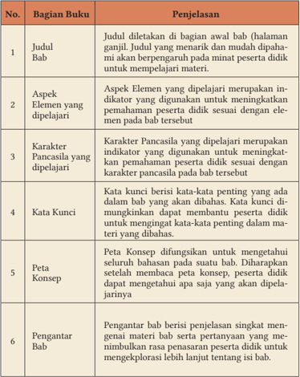
> **[Konteks Visual]**: Tabel ini berisi informasi tentang bagian-bagian dari sebuah buku, masing-masing dengan penjelasan singkatnya. Berikut adalah deskripsi detail dari setiap baris dalam tabel tersebut:

1. **Judul Bab**
   - Penjelasan: Judul ditetapkan di bagian awal bab (halaman ganjil). Judul yang menarik dan mudah dipahami akan berpengaruh pada minat peserta didik untuk mempelajari materi.

2. **Aspek Elemen yang Dipelajari**
   - Penjelasan: Aspek Elemen yang dipelajari merupakan indikator yang digunakan untuk meningkatkan pemahaman peserta didik sesuai dengan elemen pada bab tersebut.

3. **Karakter Pancasila yang Dipelajari**
   - Penjelasan: Karakter Pancasila yang dipelajari merupakan indikator yang digunakan untuk meningkatkan pemahaman peserta didik sesuai dengan karakter pancasila pada bab tersebut.

4. **Kata Kunci**
   - Penjelasan: Kata kunci berisi kata-kata penting yang ada dalam bab yang akan dibahas. Kata-ku ini diinginkan dapat membantu peserta didik untuk mengingat kata-kata penting dalam materi yang dibahas.

5. **Peta Konsep**
   - Penjelasan: Peta konsep difungsikan untuk mengetahui searah bahasan pada suatu bab. Diharapkan setelah membaca peta konsep, peserta didik dapat mengetahui apa saja yang akan dipelajarinya.

6. **Pengantar Bab**
   - Penjelasan: Pengantar bab berisi penjelasan singkat mengenai materi bab serta pertanyaan yang me- ninjau bila rasa penasaran peserta didik untuk mengekplorasi lebih lanjut tentang isi bab.

### [HALAMAN_13]

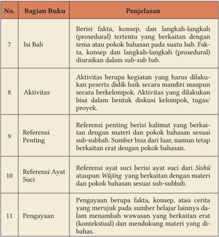
> **[Konteks Visual]**: Tabel ini berisi informasi tentang bagian-bagian dari sebuah buku, dengan penjelasan untuk setiap bagian tersebut:

1. Isi Bab: Berisi fakta, konsep, dan langkah-langkah (prosedural) tertentu yang berkaitan dengan tema atau pokok bahasan pada suatu bab.

2. Aktivitas: Aktivitas berupa kegiatan yang harus dilakukan peserta didik baik secara mandiri maupun secara berkelompok. Aktivitas yang dilakukan bisa dalam bentuk diskusi, kelimatan, tugas proyek.

3. Referensi Penting: Referensi penting berisi kalimat yang berkaitan dengan materi dan pokok bahasan sesuai sub-subbab. Sumber bisa dari harian, namun tetap berkaitan erat dengan pokok bahasan.

4. Referensi Ayat Suci: Referensi ayat suci berisi ayat suci dari Sisnu atau Wijaya yang berkaitan dengan materi dan pokok bahasan sesuai sub-subbab.

5. Pengayaan: Pengayaan berupa fakta, konsep, atau cerita yang merujuk pada sumber berlaku lainnya dan menambahkan wawasan yang berkaitan erat (kontekstual) dan mendukung materi yang dibahas.

### [HALAMAN_14]

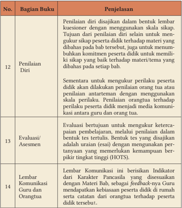
> **[Konteks Visual]**: Tabel ini berisi informasi tentang bagian-bagian dari sebuah buku, dengan penjelasan untuk setiap bagian tersebut. Berikut adalah deskripsi singkat dari setiap baris dalam tabel tersebut:

1. No. 12: Penilaian Diri
   - Deskripsi: Penilaian diri dilakukan dalam bentuk lembar kuesioner dengan menggunakan skala sikap.
   - Tujuan: Untuk mengevaluasi komitmen peserta didik dalam memahami materi/tema yang dibahas.

2. No. 13: Evaluasi/Asesmen
   - Deskripsi: Evaluasi bertujuan untuk mengukur ketercapaian pembelajaran, melalui penilaian dalam bentuk tes tertulis.
   - Deskripsi tambahan: Tesis ini disajikan sebagai indikator usia (HOTS), yang memerlukan pemikiran tingkat tinggi.

3. No. 14: Lembar Komunikasi
   - Deskripsi: Lembar ini berisi indikator karakter Pancasila yang disesuaikan dengan Materi Bab, sebagai feedback dari Guru kepada Orangtua.
   - Deskripsi tambahan: Lembar ini juga mencatat keadaan peserta didik dari orangtua terhadap peserta didik tersebut.

### [HALAMAN_15]

Pendidikan Agama Khonghucu dan Budi Pekerti untuk SMA/SMK Kelas XII
Penulis: Desdiandi Hartopoh, Epih
ISBN: 978-602-244-778-8

## Bab 1

## Menjadi Seorang Jūnzĭ

> **[Konteks Visual]**: Gambar ini menampilkan karakter animasi dengan rambut berwarna biru dan kacamata. Karakter tersebut sedang berdiri dengan posisi tangan di depan tubuhnya. Wajah karakter tampak tenang dan rileks. Tidak ada teks atau informasi lain yang ditampilkan dalam gambar ini.

### [HALAMAN_16]

## Aspek/Elemen yang Dipelajari
√ Keimanan
Tata Ibadah
√ Sejarah Suci
√ Perilaku Jūnzĭ

## Karakter Pancasila yang Dipelajari
√ Berakhlak Mulia
√ Kebhinekaan Global

## Kata Kunci
Kebajikan 6 Karakter Pancasila J ūnzĭ dalam Lintas Agama
Karakter J ūnzĭ
27 Karakter J ūnzĭ
9 Pemikiran J ūnzĭ
√ Gotong Royong
√ Bernalar Kritis
Kitab Suci
√ Kreatif
√ Mandiri

### [HALAMAN_17]

## Peta Konsep

### [HALAMAN_18]

## Pengantar
Pada  bab  ini  kalian  akan  mengidentifikasi  sikap,  perilaku,  prinsip  utama seorang  J ūnzĭ 君子 dari  kisah  Nabi  Yī  Yǐn 伊尹 ,  sehingga  kalian  dapat mengklasifikasikan pedoman hidup seorang J ūnzĭ dan konsep Masyarakat Kebersamaan Agung dalam lingkungan kehidupan keseharian dalam Lintas Agama. Sederhananya, kalian akan mengetahui landasan dan sikap seorang J ūnzĭ dalam berbuat Kebajikan.
Seorang J ūnzĭ dikenal  pula  sebagai  seorang  yang  luhur  budi,  seorang susilawan/budiman/cendekiawan, seorang J ūnzĭ adalah seorang yang dalam mengarungi kehidupan di dunia ini telah mampu membina diri menepati kesusilaan
J ūnzĭ adalah  manusia  yang  berakhlak  mulia,  mandiri,  bernalar  kritis, kreatif, gotong royong, berkebinekaan global, bersikap satya dan tepasalira, berperilaku  cinta  kasih,  bijaksana,  berani,  berbakti,  rendah  hati,  dapat dipercaya,  berkesusilaan,  berlandaskan  kebenaran,  suci  hati,  tahu  malu, sungguh-sungguh  hormat,  sederhana,  suka  mengalah,  tabah,  bersikap tengah, tepat lurus, memperbaiki kesalahan, menegakkan jasa, menghormati para  bijak,  membenci  kepalsuan,  memahami  orang  lain,  menuntut  diri sendiri,  melindungi  diri,  mencintai  jalan  suci,  dan  bersungguh-sungguh melaksanakan serta berkepribadian luhur.
Seorang  J ūnzĭ harus  mampu  merawat  dan  mengembangkan  Watak Sejatinya sehingga tetap baik sesuai kodrat kemanusiaannya. J ūnzĭ dalam menempuh Jalan Suci, ia menggemilangkan Kebajikan sampai pada batas maksimal kemampuannya. Hidupnya senantiasa patuh kepada Hukum Tiān Yang Maha Sempurna. Suasana batinnya senantiasa bahagia di dalam Jalan Ketuhanan atau Lè Tiān ( 乐天 ).

### [HALAMAN_19]

## A. Kisah Nabi Yī Yǐn

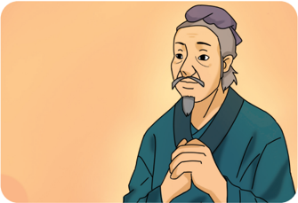
> **[Konteks Visual]**: Gambar ini menampilkan seorang pria tua dengan rambut berwarna gelap dan pendek. Pria tersebut mengenakan pakaian tradisional yang tampaknya berasal dari era kuno. Wajahnya tampak tua dan penuh pengalaman, dengan bibir yang tipis dan mata yang lebar. Telinganya tampak pendek dan berwarna gelap. Kepala pria tersebut tampak bergerigi dan berada di bagian atas gambar. Tidak ada teks atau informasi lain yang dapat dilihat dalam gambar ini.

## 1. Nabi Yī Yǐn Pelopor Xián Yǒu Yì Dé
Kalian  sebagai  umat  Khonghucu  tentu  saja  terbiasa  untuk  mengucapkan kembali ' xián yǒu yì dé ' apabila teman kalian mengucapkan ' wéi dé dòng Tiān ', tetapi tahukah kalian makna tersirat dari arti milikilah yang satu itu, Kebajikan?

> **[Konteks Visual]**: "Berikut adalah deskripsi dari gambar tersebut:

Gambar ini menampilkan sebuah tulisan dalam bahasa Melayu yang berbunyi "Bersama miliki Kebajikan Yang Esa". Di bawah tulisan tersebut, terdapat sebuah kalimat dalam bahasa Mandarin yang berbunyi "xuán yǒu dé shí 隨有德時". 

Tidak ada elemen dekoratif lain yang tampak di dalam gambar ini selain tulisan tersebut.

Xián yǒu yì dé dipelopori oleh Shèngrén 聖人 (nabi) Yī Yǐn yang bergelar Nabi Besar Sempurna ( Yuán Shèng 元聖 ), Yī Yǐn merupakan penasihat agung Shèngwáng 聖王 (baginda) Chéng Tāng 成湯 seorang raja pendiri Dinasti Shāng 商朝 (1766  SM-1122  SM)  setelah  menghukum  raja  terakhir  Dinasti Xia bernama Xià Jié, yang telah gelap Kebajikannya serta ingkar dari Jalan Suci.

### [HALAMAN_20]

Baginda Chéng Tāng didampingi oleh Nabi Yī Yǐn menjabarkan bā guà (delapan  trigram)  dengan  trigram  bumi  ( kūn 坤 )  sebagai  trigram  nyata. Baginda Chéng Tāng pula yang menerima wahyu 'Kembali kepada Yang Gaib' ( Guīcáng 歸藏 ) dari Tiān Yang Maha Esa.
Setelah  Baginda  Chéng  Tāng  mangkat,  pada  tahun  pertama  bulan  11 (sebelas) Nabi Yī Yǐn yang menjadi wali raja melakukan sembahyang kepada Almarhum Baginda Chéng Tāng menghadapkan Putra Mahkota Tài Jiǎ 太 甲 ke  hadapan  para  leluhurnya  untuk  dengan  hormat  naik  tahta.  Semua pangeran, raja muda, penguasa wilayah, para pejabat beratus jawatan juga hadir  untuk  mendengar  amanat  Nabi  Yī  Yǐn.  Pada  persembahyangan  itu pula, Nabi Yī Yǐn secara jelas tegas memberi nasihat kepada raja yang baru itu tentang betapa sempurna Kebajikan nenek moyangnya.
'Wu  hu,  Pada  zaman  itu,  adalah  Shèngwáng  (Yu  Agung)  Pendahulu Dinasti Xià tekun membina Kebajikan sehingga tiada bencana dari Tiān. Para roh yang di bukit dan di sungai tiada yang tidak berkenan; burung, hewan, ikan  dan  kura-kura,  semuanya  dalam  ketenteraman.  Tetapi,  anak  cucunya ternyata tidak lestari meneladani. Karena itu, Huáng Tiān (Tuhan Yang Maha Esa  Maha  Besar)  menurunkan  bencana,  dan  menggunakan  pendahulu  kita sebagai tangan yang mengemban Firman-Nya; …' (Shūjīng. IV.IV.I.1 ).
'Adalah  Chéng  Tāng  Dinasti  Shāng  kita  yang  telah  memancarkan keperwiraan suci. Dia telah mengganti penindasan sewenang-wenang dengan kemurahan  hati  yang  luas;  dan  rakyat  yang  berjuta  itu  mengasihinya'. (Shūjīng. IV.IV.II.3 ).
'Kini Tài J iǎ sebagai pewaris Kebajikannya, jangan hilang sifat yang mula itu. Tegakkan kasih, khususnya kepada orang tuamu; tegakkan rasa hormat, khususnya kepada para tua-tua. Mulailah dari keluarga, negeri, dan luaskan sampai ke empat penjuru lautan'. (Shūjīng. IV.IV.II.4 ).
'Shàngdì (Tuhan Yang Maha Tinggi) itu tidak terus menerus mengaruniakan  hal  yang  sama  kepada  seseorang;  kepada  yang  berbuat baik akan diturunkan beratus berkah; kepada yang berbuat tidak baik akan diturunkan beratus kesengsaraaan. Engkau hendaklah selalu dalam Kebajikan, jangan menganggap itu urusan kecil, berlaksa negeri jaya karenanya. Kalau engkau tidak dalam Kebajikan, jangan menganggap itu bukan urusan besar, itu akan menghancurkan kuil leluhurmu'.  (Shūjīng. IV.IV.IV.8 ).

### [HALAMAN_21]

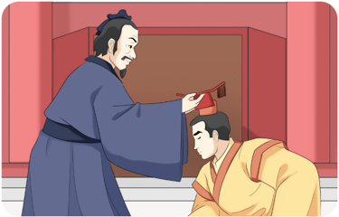
> **[Konteks Visual]**: Gambar ini menunjukkan dua orang yang sedang berbicara di dalam ruangan dengan latar belakang warna merah. Orang pertama, yang tampaknya adalah seorang dewasa pria, sedang berdiri dan menghadap ke arah orang kedua. Orang kedua, yang tampaknya adalah seorang anak muda pria, sedang berdiri dengan posisi yang lebih rendah dan menghadap ke arah orang pertama. Kedua orang tersebut sedang berbicara dan tampaknya ada interaksi antara mereka.

Tài  Jiǎ  tidak  mematuhi  nasihat  Yī  Yǐn,  Tài  Jiǎ  asyik  berpesta  dan berburu. Kegiatan Tài Jiǎ membuat Nabi Yī Yǐn merasa prihatin. Nabi Yī Yǐn memberikan banyak saran kepada kepada Raja Muda Tài Jiǎ, saran Nabi Yī Yǐn seringkali dituruti, tetapi kemudian Tài Jiǎ kembali melakukan aktifitas kekanak-kanakannya.
Melihat  hal  ini,  Nabi  Yī  Yǐn  segera  memanggil  menteri  senior  serta membagikan  tugas  terkait  kenegaraan  serta  pertahanan.  kemudian  Nabi Yī  Yǐn  mengajak Tài Jiǎ ke istana Tong untuk mendidik ajaran dan Jalan Suci Baginda Chéng Tāng yang telah mendahulu itu. Semua menteri senior sepakat, mereka menghargai keputusan Nabi Yī Yǐn. Sebenarnya, jika dia mau,  Nabi  Yī  Yǐn  bisa  dengan  mudah  mengambil  alih  kerajaan.  Namun dengan  keyakinannya  yang  teguh  kepada  Tiān  Yang  Maha  Esa,  Nabi  Yī Yǐn  menegakkan  kesetiaan  kepada  mendiang  Baginda  Chéng  Tāng  dan pengabdiannya kepada rakyat.
Setelah tiga tahun Yī Yǐn mendidik Tài Jiǎ, pada hari pertama bulan 12 (dua belas) tahun ketiga, raja pewaris Tài Jiǎ dengan topi mahkota dan jubah kerajaannya pulang ke ibukota kerajaan. Nabi Yī Yǐn telah mengembalikan pemerintahan  kepada  yang  berdaulat  Tài  Jiǎ,  lalu  Nabi  Yī  Yǐn  melapor untuk pulang ke kampung halaman serta menyampaikan nasihat tentang Kebajikan.

### [HALAMAN_22]

Tài  Jiǎ  pada  dasarnya  tidaklah  jahat,  hanya  karena  kebiasaan  serta lingkungan  kekuasaanlah  yang  telah  membuatnya  melupakan  tugas  suci yang diwarisi oleh leluhurnya. kemudian Tài Jiǎ menyadari kesalahannya dan  mulai  benar-benar  melaksanakan  Jalan  Suci  Rújiào,  seperti  yang dikembangkan Baginda Chéng Tāng serta Nabi Yī Yǐn.
Disambut oleh semua rakyat Dinasti Shāng , Tài Jiǎ kembali ke ibu kota untuk  melakukan  ibadah  dan  prasatya  kepada  Tiān,  Tuhan  Yang  Maha Esa  serta  bersembahyang  dan  berdoa  di  hadapan  makam  Baginda  Chéng Tāng, kakeknya. Dengan penuh satya, kembali Tài Jiǎ melaksanakan tugas kerajaan.

## Refleksi
Makna mendalam salam keimanan agama Khonghucu adalah keyakinan bahwa hanya Kebajikan yang dilaksanakan oleh manusia, tidak ada yang lain, yang akan berkenan di hadapan Tiān. Karena keyakinan hanya Kebajikan sajalah Tiān berkenan, maka manusia wajib memiliki yang satu itu, Kebajikan.

## 2. Pengajaran/ Nasihat Nabi Yī Yǐn
Bagi umat Khonghucu meneladani semua nabi purba, raja suci, serta nabi menjadi sangat penting, khususnya bila berkaitan dengan Kebajikan yang esa, yang satu, kalian harus meneladani sikap dan perilaku Nabi Yī Yǐn yang juga dikenal sebagai nabi kewajiban ( shèng zhī rèn zhě 聖 之 任 者 ).
Dalam agama Khonghucu dikenal konsep delapan pengakuan iman ( Bā Chéng Zhēn Guī 八诚箴规 ),  salah  satu  di  antaranya  disebutkan  ' Sepenuh Iman Menjunjung Kebajikan (Chéng Zūn Jué Dé) '. Hal ini menjadi jelas bahwa kalian dalam kehidupan sehari-hari harus selalu mengamalkan Kebajikan. Bahkan dalam ucapan salam sehari-hari, kita  mengucapkan  ' wéi  dé  dòng Tiān '  dan  dibalas  dengan  ' xián  yǒu  yī  dé ',  yang  bermakna  bahwa  hanya Kebajikan Tiān berkenan, maka ' milikilah yang satu itu Kebajikan '.
Beberapa  nasihat  yang  disampaikan  Nabi  Yī  Yǐn  terkait  meneladani Kebajikan yang esa itu tertuang dalam Shūjīng IV;IV-VI, di antaranya yang pokok untuk dipahami oleh kalian adalah:

### [HALAMAN_23]

Demi akhir yang baik, perhatikanlah mulai dari awal;
Yī xùn sānfēng 伊训三风 . Hal-hal yang perlu dijauhi/dihindari, meliputi:
   kebiasaan sihir ( wū fēng 巫風 ) seperti melakukan tari-tarian, bernyanyi serta bermabuk-mabukan di dalam kamar.
  kebiasaan maksiat ( yín fēng 淫風 ) seperti menuruti hawa nafsu kepada harta  dan  wajah  elok  serta  membiarkan  diri  dalam  keliaran  (tidak menurut aturan).
  kebiasaan mengacau ( luàn fēng 亂 ) yakni menghina sabda para nabi, melanggar  kesetiaan,  menjauh  dari  Kebajikan  serta  akrab  dengan orang urak-urakan.
Bencana yang datang karena Tiān dapat dihindari, tetapi bencana yang dibuat sendiri, tiada tempat menghindar;
Binalah diri, tuluslah di dalam Kebajikan, sehingga boleh membawa orang yang di bawah harmonis menyatu; inilah karya raja yang cerah batin.

## Diskusi Kelompok 1.1
Diskusikanlah penerapan keteladanan Nabi Yī Yǐn dalam kehidupan sehari-hari kalian!
Buatlah kelompok, bersama kelompok, cobalah cermati kembali keteladanan Nabi Yī Yǐn.
Lalu diskusikanlah tentang penerapan keteladan Nabi Yī Yǐn dalam kehidupan sehari-hari kalian.

## B. Mengenal Karakter Jūnzĭ
Penggunaan  Kata  J ūnzĭ telah  lama  digunakan  sebelum  era  Nabi  Kŏngzĭ. Pada awalnya, kata J ūnzĭ untuk menunjukkan gelar kebangsawanan. Secara harfiah, kata J ūnzĭ dapat diartikan sebagai Putra Penguasa atau putra raja. Sementara Raja itu sendiri adalah putra Tuhan ( Tiānzĭ 天子 ) yaitu orang yang menerima firman Tuhan. Sehingga putra raja adalah orang yang berpotensi menerima firman Tuhan.

### [HALAMAN_24]

天子 = Tiānzĭ; putra Tuhan
君子 = J ūnzĭ ; putra raja
Nabi Kŏngzĭ kemudian menegaskan bahwa kata J ūnzĭ tidak hanya gunakan untuk menunjukkan orang-orang yang memiliki gelar atau jabatan sosial yang tinggi, terutama jika itu hanya diperuntukkan bagi seorang putra penguasa. Kata J ūnzĭ menurut Nabi Kŏngzĭ, kata J ūnzĭ haruslah menunjukkan bahwa seseorang telah mencapai tingkat moral yang tinggi dan intelektual yang tinggi seperti kepada seorang susilawan atau orang bermoral dan berbudi luhur.

## 1. 27 (Dua Puluh Tujuh) Karakter Jūnzĭ
Berikut tabel karakter J ūnzĭ , meliputi:

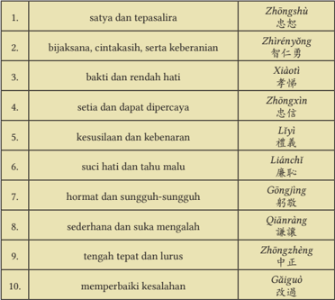
> **[Konteks Visual]**: 1. satya dan tepasalira - Zhòngshù 怨忠恕
2. bijaksana, cintakasih, serta keberanian - Zhìrényǒng 智仁勇
3. bakti dan rendah hati - Xiàotí 孝悌
4. setia dan dapat dipercaya - Zhèngxìn 忠信
5. kesusilaan dan kebenaran - Lièyì 慷慨
6. suci hati dan tahu malu - Liánhēn 廉恥
7. hormat dan sungguh-sungguh - Gōngjìng 鞠敬
8. sederhana dan suka mengalah - Qiànnguǎ 谦讓
9. tengah tepat dan lurus - Zhòngzhèng 中正
10. memperbaiki kesalahan - Gāigūò 改過

### [HALAMAN_25]

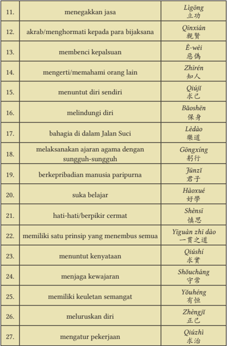
> **[Konteks Visual]**: Tabel ini berisi 27 poin yang mungkin merupakan nilai-nilai atau prinsip-prinsip dalam budaya atau etika tertentu. Setiap baris memiliki dua kolom: satu untuk deskripsi singkat dari poin tersebut dan satu untuk penjelasan dalam bahasa Mandarin. Beberapa contoh poin dan penjelasannya adalah:

1. "menegakkan jasa" - Liánggōng (立功)
2. "akrab/menghormati kepada para bijaksana" - Qinxián (親賢)
3. "membenci kepalsuan" - È-wèi (忌僞)
4. "mengerti/nemahami orang lain" - Zhìrén (知人)
5. "menuntut diri sendiri" - Qiújǐ (求己)
6. "melindungi diri" - Bāoshēn (保身)
7. "bahagia di dalam Jalan Suci" - Lédào (樂道)
8. "melaksanakan ajaran agama dengan sungguh-sungguh" - Gōngxíng (躬行)
9. "berkepribadian manusia paripurna" - Jūnzǐ (君子)
10. "suka belajar" - Hǎoxué (好学)

Setiap poin ini mungkin memiliki makna kultural atau moral yang lebih dalam dalam konteks budaya tertentu.

### [HALAMAN_26]

Berikut penjelasan sederhana tentang praktik mengamalkan karakter Jūnzĭ sebagai siswa dalam kehidupan sehari-hari kalian:
Pada  aspek  satya  dan  tepa  salira  ( zhōngshù ),  kalian  harus  percaya dengan sepenuh hati kepada Tiān, baik dalam bentuk persembahyangan/ peribadahan  atau  berbuat  Kebajikan,  setidak-tidaknya  telah  mampu bersikap tepa salira/toleransi terhadap teman. Contohnya: menghormati dan  menghargai  bagi  saudara-saudara  kita  yang  muslim  saat  sedang menjalankan ibadah puasa.
Pada aspek bijaksana, cinta kasih, dan keberanian ( zhìrényŏng ),  kalian memiliki  keberanian  dalam  mengutarakan  kebenaran  sesuai  dengan pilihan yang kalian pilih dan tidak menghilangkan aspek empati terhadap teman. Misalnya tidak menyinggung perasaan teman, tidak membedabedakan teman.
Pada aspek berbakti dan rendah hati ( xiàotì ),  kalian  harus  memegang teguh prinsip memuliakan hubungan, dengan mawas diri dan menghargai pendapat orang lain serta senantiasa merawat diri (membina diri).
Pada aspek setia dan dapat dipercaya ( zhōngxìn ), kalian bersikap jujur, tulus,  berani  mengakui  kesalahan,  memegang  teguh  komitmen,  serta memiliki loyalitas yang tinggi (misalnya: cinta sekolah, cinta tanah air).
Pada  aspek  kesusilaan  dan  kebenaran  ( lĭyí ),  kalian  telah  mampu melaksanakan empat pantangan dalam kehidupan sehari-hari, memegang teguh  prinsip  kebenaran  dan  mampu  menghargai  diri  sendiri  dengan menjauhi tindakan asusila.
Pada  aspek  suci  hati  dan  tahu  malu  ( liánchĭ ),  kalian  telah  mengerti bagaimana berpenampilan dan bersikap yang baik serta tidak iri terhadap teman.
Pada  aspek  hormat  dan  sungguh-sungguh  ( gōngjìng ),  kalian  tidak membeda-bedakan  dalam  mengucapkan  salam  sapa  senyum  serta menghormati teman dan guru kalian.
Pada aspek sederhana dan suka mengalah ( qiānràng ), kalian telah mampu mengalahkan  ego  kalian,  dalam  keseharian  tidak  membeda-bedakan makanan  (konsumsi),  pakaian  (penampilan),  serta  mengalah  dengan mendahulukan teman atau guru kalian.

### [HALAMAN_27]

Pada  aspek  tengah  tepat  dan  lurus  ( zhōngzhèng ),  kalian  menjunjung tinggi  terhadap  perbedaan,  dengan  sikap  kalian  yang  lurus  kalian membantu mengharmoniskan bila terjadi perselisihan atau perbedaan pendapat.
Pada  aspek  memperbaiki  kesalahan  ( găiguò ),  kalian  secara  terbuka mengakui kekeliruan/kesalahpahaman yang pernah kalian buat (setelah mengetahui kebenarannya), kemudian berusaha memperbaiki kesalahan tersebut dan belajar dari setiap kesalahan yang pernah kalian buat.
Pada  aspek  menegakkan  jasa  ( lìgōng ),  kalian  dapat  melakukan  halhal  kecil  untuk  dapat  dikatakan  telah  menegakkan  jasa.  Misalnya mengerjakan tugas dengan penuh tanggung jawab, menaati peraturan sekolah, serta mengucapkan terimakasih dan menjunjung tinggi kebaikan dari tindakan teman kalian.
Pada  aspek  menghormati  kepada  para  bijaksana  ( qīnxián ), kalian melakukan persembahyangan terhadap para roh suci ( shénmíng ) agama Khonghucu, agar dapat meneladani sikap dan perilaku mereka. Selain itu terhadap para tokoh yang berjuang demi kemanusiaan, kalian juga melakukan  persembahyangan  untuk  mengucapkan  terimakasih  atas jasanya dan berusaha meneladani tindakan mereka.
Membenci  kepalsuan  ( è-wèi ),  kalian  dalam  pergaulan  dengan  sesama teman  atau  saat  berhadapan  dengan  orang  lain,  harus  bersikap  dan berperilaku  yang  berasal  dari  dalam  hati  yang  murni,  sesuai  dengan kesusilaan. Tidak menggunakan topeng, tidak berpura-pura, dan tidak  menutupi  keburukan.  Misalnya  ketika  ujian  kalian  menyontek, sebenarnya hal itu sudah menunjukan bahwa kalian menipu diri sendiri dan orang lain.
Memahami orang lain ( zhīrén ), kalian dalam berteman harus mengetahui tentang teman kalian secara personal, bukan berdasarkan ucapan atau dugaan  dari  orang  lain.  Hal  ini  akan  menghindari  ketidaksengajaan menyakiti  perasaan  teman.  Kalian  menilai  teman  bukan  dari  perkataannya, melainkan dari perilaku dan perbuatannya, maka seorang Jūnzĭ dengan mengenal orang lain, dia mengetahui teman yang bisa diajak bersahabat.
Menuntut diri sendiri ( qiújĭ ), kalian tidak menyalahkan kondisi, situasi, waktu, atau orang lain bila berbuat kekeliruan. Kalian harus bisa berusaha

### [HALAMAN_28]

lebih keras dari orang lain, secara maksimal lebih baik dari orang lain. Misalnya  ketika  mereka  hanya  belajar  1  (satu)  kali,  kalian  harus  bisa belajar 100 (seratus) kali sehingga kalian akan berhasil.
Pada  aspek  melindungi  diri  ( băoshēn ),  kalian  dengan  sepenuh  hati menjaga pergaulan dan pertemanan kalian agar tidak mengikuti ajakan teman  yang  tidak  wajar/tidak  baik  yang  dapat  merusak  Watak  Sejati kalian.
Pada  aspek  bahagia  di  dalam  Jalan  Suci  ( lèdào ),  kalian  dengan  tulus menerima  kenyataan hidup,  dengan  sepenuh  iman  mengamalkan ajaran  kitab  suci Sìshū dan Wŭjīng ,  maka  kalian  akan  mendapatkan petunjuk bagaimana untuk mencapai kebahagiaan dan kedamaian dalam mengamalkan firman Tiān yang Maha Esa.
Pada  aspek  melaksanakan  ajaran  agama  dengan  sungguh-sungguh (gōngxíng),  kalian  sebagai  siswa  agama  Khonghucu  tentu  setelah mendapatkan pendidikan agama Khonghucu di sekolah haruslah diterapkan dalam kebiasaan hidup di keseharian kalian di rumah.
Pada  aspek  berkepribadian  manusia  paripurna  (J ūnzĭ ),  kalian  dalam berproses  menjadi  seorang  J ūnzĭ sudah  sewajarnya  untuk  berkumpul dengan teman yang mengingatkan hal-hal yang baik, yang lurus, yang jujur dan membawa faedah, dengan lingkungan yang baik, maka akan membantu kalian merawat dan menjaga Watak Sejati agar tetap baik, sehingga membantu proses kalian untuk menjadi seorang J ūnzĭ .
Pada aspek suka belajar ( hàoxué ), kalian telah melaksanakan wajib belajar 12 tahun dan masih akan terus meningkatkan pengetahuan kalian baik dari pendidikan formal maupun kehidupan sehari-hari. Oleh karena itu, kalian wajib memiliki semangat yang tinggi dan pantang merasa jemu dalam pembelajaran.
Pada  aspek  hati-hati/berpikir  cermat  ( shènsī ),  kalian  dituntut  untuk bernalar kritis dan mampu  memilih pilihan yang tepat, dalam memutuskan suatu hal bersikap waspada sehingga tidak di luar batas tengah dan mengakibatkan kotornya Watak Sejati.
Pada  aspek  memiliki  satu  prinsip  yang  menembus  semua  ( yīguàn  zhī dào ),  kalian  di  dalam  hidup  harus  memegang  teguh  prinsip  satya  dan tepa salira ( zhōngshù ).

### [HALAMAN_29]

Pada aspek menuntut kenyataan ( qiúshí ), kalian tidak menipu diri kalian, tidak memiliki angan-angan kosong serta harus memiliki visi dan misi yang jelas, misalnya: mengakhiri sekolah di SMA dengan banyak sahabat atau dengan menjadi juara terbaik.
Pada aspek menjaga kewajaran ( shŏucháng ), kalian mengerti perbuatan yang  baik  dan  perbuatan  yang  buruk,  sehingga  dapat  menghindari perilaku-perilaku yang tidak wajar.
Pada aspek memiliki keuletan semangat ( yŏuhéng ), kalian sebagai siswa tidak pantang menyerah, dan berusaha melakukan yang lebih baik dari yang kemarin.
Pada aspek meluruskan diri ( zhèngjĭ ),  kalian memiliki tekad yang kuat untuk menjalani hidup yang lurus, tidak melanggar kodrat kemanusiaan (Watak Sejati) atau meninggalkan yang pokok (Kebajikan).
Pada aspek mengatur pekerjaan ( qiúzhì ), kalian sebagai siswa tahu yang mana harus dikerjakan terlebih dahulu dan mana yang kemudian.
Karakter J ūnzĭ harus menjadi tujuan setiap orang. J ūnzĭ sebagai sebuah cita-cita dalam hidup, bukanlah perihal pencapaian materi atau keduniawian, melainkan harus mengutamakan kualitas moral.
Menjadi  seorang  J ūnzĭ merupakan  tujuan  tertinggi  dalam  pembinaan moral.  Inilah  mengapa  agama  Khonghucu  berkomitmen  penuh  terhadap tujuan ini.

## Aktivitas Mandiri 1.2
Saat akan dimulai penilaian akhir semester, ada teman yang ingin memberikan semua kunci jawabannya kepadamu. Tentu saja sebagai siswa berkarakter J ūnzĭ , kamu menolaknya dengan halus. Berdasarkan 27 karakter J ūnzĭ di atas, aspek positif apa yang akan kamu dapatkan dalam hal menolak bantuan teman (pemberi kunci jawaban)!

### [HALAMAN_30]

Dalam kehidupan sebagai seorang pelajar Indonesia, tentu saja harus memahami 6 karakter pelajar Pancasila. Hal ini akan mendorong kalian untuk  dapat  melaksanakan karakter Jūnzĭ .  Berikut  ini  penjelasan  sederhana tentang praktik mengamalkan karakter pelajar Pancasila dalam kehidupan sehari-hari kalian.

## a. Pada aspek berakhlak mulia, meliputi;
 kalian mencintai Tiān Yang Maha Esa dengan cara mengamalkan firman Tiān dalam kehidupan,
 kalian mencintai diri dengan cara berbakti, senantiasa membina diri setiap hari,
kalian  mencintai  sesama  manusia  dengan  cara  bersikap  tengah  dan tepa salira, menghargai perbedaan dan toleran,
 kalian  mencintai  lingkungan  dengan  cara  peduli  dan  bertanggung jawab atas ekosistem lingkungan alam sekitar, dan
 kalian  mencintai  negara  dengan  turut  berprestasi  mengharumkan nama baik negara dan menjalankan peran sebagai warga negara.

### [HALAMAN_31]

## b. Pada aspek kebhinekaan global, meliputi:
kalian mengenal dan menghargai budaya dengan cara mengenali dan mampu mendeskripsikan berbagai macam budaya, baik yang bersifat lokal, regional, nasional, maupun global,
kalian  berinteraksi  sosial  dengan  cara  memahami  dan  menghargai keunikan masing-masing budaya dan perspektif yang berbeda, sehingga muncul empati terhadap sesama, dan
kalian merefleksikan pengalaman kebinekaan dengan cara menyadari keberagamaan, menyelaraskan/mengharmoniskan perbedaan, dan turut aktif-partisipatif dalam membangun kedamaian.

## c. Pada aspek gotong royong, meliputi:
 kolaborasi dengan cara menunjukan sikap positif ketika bekerja sama dan berada dengan teman kalian,
peduli  dengan  cara  proaktif  terhadap  kondisi  dan  keadaan  sekitar kalian, dan
 berbagi  dengan  cara  memberi  dan  menerima  dan  mau  menjalani kehidupan bersama teman kalian.

## d. Pada aspek kreatif, meliputi:
 menghasilkan karya dan tindakan yang orisinal dengan cara cenderung berani mengambil risiko dalam menghasilkan karya dan bertindak, dan
 menghasilkan  gagasan  yang  orisinal  dengan  cara  melihat  sesuatu dengan perspektif berbeda (mempertanyakan/mengklarifikasi) sehingga  akan  muncul  gagasan-gagasan  dan  alternatif  penyelesaian baru terhadap setiap permasalahan.

## e. Pada aspek bernalar kritis, meliputi:
 memproses informasi dan gagasan dengan cara mengajukan pertanyaan untuk mendapatkan informasi, mengindentifikasi/ mengklarifikasi informasi yang diperoleh, serta mengorganisasi dan memproses informasi tersebut,
 melakukan analisis dan evaluasi informasi dan gagasan dengan cara menggunakan logika dan penalaran dalam mengambil keputusan dan tindakan dan tetap mempertimbangkan faktor-faktor eksternal, risiko dan tujuan, dan

### [HALAMAN_32]

 melakukan  refleksi  terhadap  proses  berpikir  pribadi  dengan  cara menyadari penuh akan proses berpikir kalian.

## f. Pada aspek mandiri, meliputi:
kesadaran diri dengan cara melakukan refleksi terhadap kemampuan perkembangan dan perubahan diri, dan
regulasi  diri  dengan  cara  mengatur  pikiran,  perasaan,  perilaku  diri untuk mencapai tujuan belajar, mampu menetapkan, merencanakan dan menilai kemampuan diri.

## Aktivitas Mandiri 1.3

## Ayo klasifikasikan!
Coba kalian kategorikan/klasifikasikan 27 karakter J ūnzĭ ke dalam 6 karakter pelajar Pancasila (apabila ada karakter J ūnzĭ yang tidak masuk dalam kategori, berikan keterangan).

### [HALAMAN_33]

## C. Laku Bajik Seorang Jūnzĭ

## 1. Sembilan Pemikiran Jūnzĭ
Sembilan  hal  pemikiran  seorang  J ūnzĭ ini  merupakan  pedoman  cara  berpikirnya seorang J ūnzĭ yang dapat digunakan sebagai metode pengembangan pribadi. Kita dapat mengembangkan kecakapan berpikir yang dibutuhkan sebagai seorang pelajar.

## Berikut tabel 9 (sembilan) pokok pemikiran J ūnzĭ meliputi:

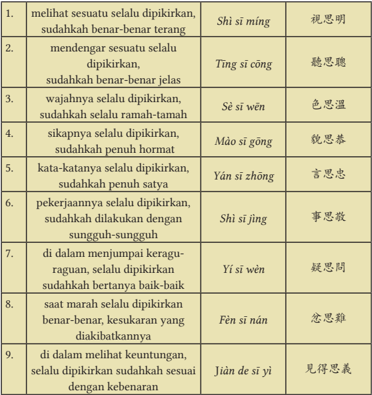
> **[Konteks Visual]**: Tabel ini berisi beberapa pernyataan dalam bahasa Melayu dan penjelasannya dalam bahasa Inggris. Setiap baris mengandung satu pernyataan dalam bahasa Melayu, diikuti oleh penjelasannya dalam bahasa Inggris. Tabel ini mungkin digunakan untuk membantu orang yang belajar bahasa Melayu memahami arti dari pernyataan tersebut.

### [HALAMAN_34]

## Refleksi
Sembilan pemikiran J ūnzĭ ini, bila dilaksanakan dalam setiap sendi-sendi kehidupan akan membawa manfaat yang besar bagi kemajuan kita. Misalnya kalian lakukan membina diri, mengembangkan Watak Sejati dan Firman Tiān . Hal itu akan membawa kedamaian dan kebahagiaan bagi diri sendiri, keluarga, masyarakat dan negara.
Berikut  penjelasan  sederhana  tentang  praktik  mengamalkan  9  (sembilan) sisi pemikiran Jūnzĭ sebagai siswa dalam kehidupan sehari-hari kalian.
 Dalam  hal  melihat;  sudahkah  benar-benar  terang  (shì  sī  míng),  ketika kalian  mengamati/melihat  suatu  peristiwa/hal  harus  dipertimbangkan apakah sudah jelas dan tidak ceroboh dalam memutuskan suatu perkara. Misalnya  ada  suatu  perkelahian  antara  teman  laki-laki  dan  teman perempuan kalian, kalian tidak begitu saja  langsung  menghakimi satu pihak.
 Dalam hal mendengar; sudahkah benar-benar jelas ( tīng sī cōng ), ketika kalian mendengar informasi (suara/bunyi) harus dipertimbangkan apakah  sudah  jelas  dan  tidak  menyesatkan  kalian  dalam  mengambil suatu keputusan. Misalnya ada teman kalian yang berbicara bahwa besok aktivitas  belajar  di  sekolah  diliburkan,  kalian  yang  mendengar  hal  itu tidak  langsung  memutuskan  bahwa  besok  tidak  sekolah,  tetapi  mulai mencari informasi tambahan lainnya.
 Dalam  hal  wajah;  sudahkah  ramah  tamah  ( sè  sī  wēn ),  kalian  tentu mempunyai permasalahan personal  yang  tidak  bisa  kalian  katakan  ke semua teman. Oleh karena itu ketika berbicara/bersahabat dengan teman, kalian harus menunjukan wajah yang murah senyum.
 Dalam hal sikap; sudahkah penuh hormat ( mào sī gōng ), kalian tentu akan berhubungan dengan orang lain. Perihal sikap, jelas tertera dalam lima hubungan (wulun), sudah seharusnya ketika kalian berhadapan dengan teman, kalian menujukkan kerendahan hati, hormat kalian kepada teman (tidak memandang rendah dan tidak sombong)
 Dalam  hal  kata-kata;  sudahkah  penuh  satya  ( yán  sī  zhōng ),  landasan

### [HALAMAN_35]

kalian berbicara, baik melalui verbal (voice call, voice note, video call) atau melalui tulisan (chat) haruslah menunjukan ketulusan dan kejujuran, tidak ada kepalsuan, seorang J ūnzĭ tidak bercanda kelewatan dan tidak melakukan prank yang merugikan orang lain.
 Dalam  hal  pekerjaan;  sudahkah  dilakukan  dengan  sungguh-sungguh (shì  sī  jìng),  sebagai  seorang  siswa  kalian  dituntut  untuk  mengerjakan pekerjaan dengan baik dan tepat waktu. Dalam hal mengerjakan suatu hal perlu dipastikan bahwa kalian gigih dan tekun serta teliti.
 Dalam hal keragu-raguan; sudahkah dapat bertanya baik-baik ( yí sī wèn ), saat ini kalian sudah dewasa, sudah kelas 12 (dua belas) dan sebentar lagi akan memutuskan banyak hal, untuk itu kalian perlu berkonsultasi dan bertanya apabila kalian ragu-ragu dalam menentukan suatu keputusan. Misalnya;  pertanyaan  siswa  kelas  12  yang  pada  umumnya  ditanyakan adalah  setelah  lulus  apakah  mau  kuliah  atau  bekerja?  Hal  ini  perlu pertimbangan,  dan  kalian  perlu  berkonsultasi  kepada  semua  orang, dengan  banyaknya  masukkan  dan  nasihat,  maka  akan  memantapkan kalian dalam memutuskan apakah akan kuliah atau bekerja.
 Dalam hal marah; pikirkan kesusahaan yang diakibatkannya ( fèn sī nán ), marah adalah salah satu  emosi  naluriah  manusia  yang  tidak  mungkin hilang,  tentu  kalian  pernah  marah,  tetapi  kalian  harus  mengendalikan marah  tersebut  agar  tetap  di  tengah,  tidak  kelewatan.  Apabila  marah kalian  terlalu  tinggi  maka  menyebabkan  kesusahan  bagi  kalian  dalam memutuskan suatu perkara atau dalam menyelesaikan permasalahan.
 Dalam hal keuntungan; sudahkah sesuai dengan kebenaran ( jiàn de sī yì ), tentu hal yang wajar bagi kalian untuk memikirkan suatu keuntungan dari tindakan-tindakan yang kalian lakukan, tetapi apabila kalian menemukan kesempatan untuk mendapat manfaat, haruslah dipertimbangkan apakah sesuai dengan cinta kasih dan kebenaran. Misalnya, teman kalian akan memberikan kalian upah bila kalian melakukan prank terhadap teman lainnya, maka kalian harus dengan tegas menolak, karena hal itu tidak sesuai dengan cinta kasih dan kebenaran.
Kesembilan hal ini akan meningkatkan ketakwaan kalian kepada Tiān, mampu menggemilangkan  Kebajikan,  dapat  membantu  dan  membimbing orang lain menuju perbaikan moral, serta memberi dampak positif kepada masyarakat luas. Pada akhirnya akan membawa kemajuan kepada bangsa dan negara.

### [HALAMAN_36]

## Aktivitas Mandiri 1.4
Coba beri penilaian terhadap dirimu (dari skala 1 hingga 10), apakah selama ini sudah melakukan sembilan laku bajik seorang J ūnzĭ ? Tuliskan aspek laku bajik apa saja yang sudah dilakukan! Kemudian sampaikan di depan kelas!

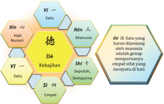
> **[Konteks Visual]**: Gambar ini menunjukkan sebuah diagram yang menggambarkan konsep "Dé" dalam konteks budaya Tionghoa. Diagram ini terdiri dari beberapa elemen utama:

1. Elemen utama:
   - "Dé" (德) ditulis dalam huruf Tionghoa
   - Terdapat simbol "人" (ren) di sebelah kanan "Dé"
   - Terdapat simbol "一" (yi) di sebelah kiri "Dé"

2. Konteks:
   - "Dé" dijelaskan sebagai "Satu yang harus dihormati oleh manusia"
   - "Satu" dijelaskan sebagai "empat sifat yang menyatu di hati"

3. Elemen pendukung:
   - Terdapat simbol "心" (xin) di sebelah kiri "Dé"
   - Terdapat simbol "情" (yī) di sebelah kiri "Dé"
   - Terdapat simbol "仁" (ren) di sebelah kanan "Dé"
   - Terdapat simbol "義" (shì) di sebelah kanan "Dé"

4. Penjelasan:
   - "Hati Nurani" (心) dihubungkan dengan "Dé" melalui simbol "心"
   - "Satu" (一) dihubungkan dengan "Dé" melalui simbol "一"
   - "Empat Sifat yang Menyatu di Hati" (仁) dihubungkan dengan "Dé" melalui simbol "仁"
   - "Sepuluh, Sempurna" (義) dihubungkan dengan "Dé" melalui simbol "義"

5. Struktur diagram:
   - "Dé" berada di tengah diagram
   - Simbol-simbol pendukung membentuk lingkaran sekitar "Dé"

Diagram ini menggunakan simbol-simbol Tionghoa untuk menggambarkan konsep "Dé" dalam konteks budaya Tionghoa, mencakup empat sifat yang menyatu di hati manusia.

Dé 徳 terdiri dari radikal huruf, yaitu:
Yī ( 一 ) yang berarti 'satu'
Rén ( 人 ) yang berarti 'manusia'
Shí ( 十 ) yang berarti 'sepuluh, sempurna'
Sì ( 四 ) yang berarti 'empat'
Yī ( 一 ) yang berarti 'satu'
Xīn ( 心 ) berarti 'hati nurani/sanubari'
Berdasarkan karakteristik di atas, Dé dapat dipahami sebagai satu yang harus dijunjung oleh manusia adalah genap sempurnanya empat sifat yang menyatu  di  hati  atau  seorang  manusia  yang  sempurna  apabila  dia  telah menjalankan empat benih Kebajikan yang menyatu dengan hati.

### [HALAMAN_37]

Sedangkan Kebajikan menurut Kamus Besar Bahasa Indonesia berarti perbuatan  baik/kebaikan/  sesuatu  yang  membawa  kebaikan.  Maka  untuk menggemilangkan benih-benih Kebajikan dari Watak Sejati, caranya dengan mengamalkannya dalam kehidupan sehari-hari. Kebajikan ini akan mendatangkan kebaikan dan kebahagiaan.
Kebajikan  adalah  pohon  rahmat  dan  sumber  dari  semua  kemampuan manusia. Kebajikan ialah kemuliaan Tiān yang dapat dirasakan dan dihayati oleh manusia. Berbuat Kebajikan akan mendatangkan kebaikan kedamaian, kebahagiaan,  bagi  diri  sendiri,  sesama  manusia  dan  lingkungan  hidup. Berbuat  Kebajikan  juga  akan  menumbuhkan  cinta  kasih  dan  tepa  salira terhadap sesama, menjadikan seseorang memuliakan Tiān dan Firman-Nya.
Menggemilangkan Kebajikan adalah sikap yang harus dilakukan oleh setiap orang (individu). Setiap orang harus mempunyai tekad dan niat untuk berusaha menggemilangkan kebajikan.
Dalam  konsep  menggemilangkan  Kebajikan  yang  bercahaya,  dapat diartikan bahwa dalam diri manusia telah ada Kebajikan, atau dalam bahasa biasa  dikatakan  sudah mempunyai potensi atau bakat, namun potensi ini perlu dibina dan ditingkatkan kemampuannya. Ibarat batu permata harus dibentuk dengan digosok agar tampak keindahannya.

## Ayat Suci
Zĭ Zhāng 子張 berkata, 'Seseorang yang memegang Kebajikan tetapi tidak mengembangkannya, percaya akan Jalan Suci tetapi tidak sungguh-sungguh; ia ada, tidak menambah, dan tidak ada pun tidak mengurangi'. (Lúnyŭ. XIX: 2)
Apa yang harus digemilangkan? Jawabannya adalah Kebajikan bercahaya ( míngdé 明德 ). Kebajikan bercahaya itu merupakan Kebajikan yang bermula dari Tiān .  Watak Sejati itu adalah Kebajikan, sehingga manusia sepanjang hidup  dianjurkan  menjalankan  Kebajikan.  Jika  kalian  mengabaikan  dan berbuat yang tidak sesuai dengan anjuran Tiān , maka akan timbul bersalah dalam hati manusia.

### [HALAMAN_38]

Ajaran  agama  akan  membimbing  kalian  untuk  menumbuhkan  dan menggembangkan benih-benih Kebajikan yang hidup di dalam rohanimu. Menggemilangkan Kebajikan bukan sekadar pada diri sendiri saja, melainkan diamalkan pada sesama manusia dan lingkungan hidup. Misalnya dalam  bentuk  berbakti,  rendah  hati,  murah  hati,  tahu  malu,  mencintai lingkungan hidup, mencintai negara serta membantu orang lain agar mampu mengembangkan Kebajikan dan sebagainya.

## Diskusi Kelompok 1.5
Coba diskusikan dalam kelompok. Apabila berbuat menepati Watak Sejati adalah bentuk dari Kebajikan, bagaimana dengan perbuatan buruk? Apa yang dapat dikatakan dengan perbuatan buruk?

## 3. Jūnzĭ dalam Lintas Agama
Dalam  ajaran  Khonghucu  menjadi  manusia  J ūnzĭ merupakan  hal  yang terpenting,  seorang  nabi  pasti  manusia  J ūnzĭ ,  tapi  manusia  J ūnzĭ belum tentu seorang nabi. Meskipun demikian, sebagai seorang pelajar Khonghucu kalian dituntut untuk membina rohani dan jasmani dalam menyempurnakan keimanan kalian kepada Tiān serta dalam kehidupan keseharian tidak lupa mengamalkan karakter seorang J ūnzĭ .
Seorang  J ūnzĭ mempunyai  karakter  mulia  dan  pribadi  agung.  Untuk memperoleh kemenangan dalam berlomba, menjadi juara, mendapat keuntungan  materi  atau  mencapai  kedudukan,  selalu  berlandaskan  kebenaran ( Yì ). Dalam menghadapi penderitaan dan bahaya selalu percaya pada Firman Tiān .
Oleh  karena  itu,  setiap  bertemu  dengan  saudara  seiman  atau  dikenal pula dengan sebutan dàoqīn maka kita selalu saling mengingatkan untuk berbuat  Kebajikan.  Lalu  bagaimana  bila  bertemu  dengan  para dàoyŏu (sahabat sesama orang beragama/saudara lintas agama)? Tentu saja kalian juga  mengingatkan  teman  kalian  untuk  berbuat  baik  sesuai  anjuran  dari salam keimanan mereka masing-masing.

### [HALAMAN_39]

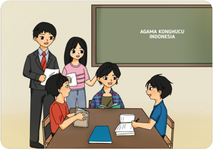
> **[Konteks Visual]**: Gambar ini menunjukkan sebuah kelas di mana beberapa siswa sedang berinteraksi dengan guru. Di belakang mereka terdapat papan tulis dengan tulisan "AGAMA KONGHUCU INDONESIA". Siswa-siswa tersebut sedang duduk di meja belajar, masing-masing dengan buku dan catatan. Ada dua siswi yang sedang berbicara dengan guru, sementara siswa lainnya tampak tertarik pada pembicaraan mereka.

Mengenal  salam  keimanan  masing-masing  agama  atau  suku  dapat dilakukan  dengan  cara  berkomunikasi  aktif  dengan  teman  lintas  agama. Tentunya setelah dapat berkomunikasi aktif, akan menjadikan Kalian lebih toleran  terhadap  sudut  pandang  masing-masing  agama  tersebut  dalam menjalani hidup bermasyarakat.
Untuk lebih jelasnya, perhatikan poin-poin di bawah ini:
 Dalam ajaran Islam ketika bertemu atau berpisah, memulai atau  mengakhiri  pembicaraan  dengan  orang  lain  mengucapkan assalamualaikum warahmatullahi wa-bara-katuh, yang memiliki arti berharap  agar  diberi  keselamatan,  kesejahteraan,  dan  berkah,  serta berkenan di hadapan Tuhan Yang Maha Esa.
 Dalam ajaran Kristen dan Katolik mengucapkan syalom, yang memiliki arti  agar  kebahagiaan  dan  kesejahteraan  (kesehatan,  kemakmuran,

### [HALAMAN_40]

dan kedamaian) yang menyeluruh untuk kita semua. umumnya juga diucapkan salam damai atau damai besertamu.
 Dalam ajaran Buddha mengucapkan Namo Buddhaya yang memiliki arti terpujilah semua Buddha, salam tersebut dapat pula bermakna agar meneladani semua Buddha, memperkaya toleransi dan pengertian.
 Dalam Ajaran Hindu mengucapkan om swastyastu, yang memiliki arti hormat serta doa ya Tuhan, semoga semua dalam keadaan selamat.
Dalam berbagai ajaran penghayat kepercayaan serta kesukuan, seperti Jawa ucapkanlah Rahayu yang artinya semoga selamat dan terhindar dari kecelakaan. Atau Sunda ucapkanlah Sampurasun yang bermakna maafkanlah dan mari sempurnakan diri.
Semua agama mengajarkan untuk saling mengingatkan dan berbuat bajik, sehingga  Tiān  berkenan  melimpahkan  kebaikan  untuk  kita  semua.  Tentu saja dengan mengucapkan salam tersebut akan mengingatkan kalian untuk terus  berbuat  baik,  mengembangkan  Watak  Sejati  dan  menggemilangkan Kebajikan.

## Aktivitas Mandiri 1.6
Ayo cari tahu mengenai salam-salam yang ada di Indonesia, misalnya salam teman Tionghoa, teman Batak, teman Dayak, teman Nias, teman Karo, atau teman Papua!

### [HALAMAN_41]

## Evaluasi Bab 1

## A. Pilihan Ganda

## Pilihlah jawaban yang tepat dengan memberi tanda silang (x) pada huruf A, B, C, D, atau E!
Nabi Yī Yǐn juga dikenal dengan sebutan ….
Nabi Kesucian
 Nabi Kewajiban
 Nabi Segala zaman
Nabi Keharmonisan
 Nabi Yang Lengkap, Besar, dan Sempurna
 Keteladanan  Nabi  Yī  Yǐn  yang  diteladani  oleh  setiap  umat  Khonghucu adalah ….
bā dé
shanzai
chéng xin zhi
xián yǒu yī dé
wéi dé dòng Tiān

## 3. Lengkapilah ayat berikut ini!
Jalan Suci seorang Jūnzĭ itu seumpama pergi ke tempat jauh, harus dimulai dari dekat, ….
seumpama ke tempat tinggi harus memulai dari rendah
 seumpama menyebrangi lautan harus dimulai dari tepi
 seumpama mendaki ke tempat tinggi harus dari samping
seumpama ke tempat jauh harus dilewati setapak demi setapak
 seumpama mendaki ke tempat tinggi harus dimulai dari bawah
 Cut  mendengar bahwa Tina mencuri uang milik Rongxin, Cut menceritakan berita tersebut kepada seluruh teman sekelasnya. Zhenhui segera mencari tahu  kebenarannya  dan  tidak  langsung  mempercayainya.  Sikap  Zhenhui merupakan salah satu sikap yang diperhatikan oleh seorang J ūnzĭ yaitu … .
mendengar sesuatu selalu dipikirkan penuh kebenaran
mendengar sesuatu selalu dipikirkan sudahkah penuh hormat

### [HALAMAN_42]

mendengar sesuatu selalu dipikirkan sudahkah benar-benar jelas
mendengar sesuatu selalu dipikirkan sudahkah benar-benar terang
 mendengar sesuatu selalu dipikirkan sudahkah sesuai dengan kebenaran
Maka seorang Jūnzĭ mempunyai Jalan Suci yang besar, ingatlah hanya satya dan  dapat  dipercaya  sajalah  yang  memungkinkan  kita  mencapai  cita-cita yang mulia, sedangkan kesombongan dan keangkuhan akan mengakibatkan hilangnya … ( Dàxué . X: 18).
sahabat
harapan
kesetiaan
kepercayaan
 ketoleransian
Burhan mendapat tawaran pekerjaan paruh waktu dengan bayaran yang sangat  tinggi.  Namun  Burhan  tidak  segera  menerima  tawaran  tersebut, tetapi meneliti apakah sudah sesuai dengan kebenaran. Sikap Burhan adalah contoh sikap Jūnzĭ yang mengutamakan kebenaran daripada  … .
keindahan
 kehormatan
 keuntungan
kenyamanan
 kemunafikan
Yang merupakan contoh berbakti kepada alam adalah… .
membantu orang tua
 membuang sampah pada tempatnya
 menolong kawan yang sedang kesusahan
makan banyak-banyak sampai kekenyangan
 menyampaikan aspirasi ke pemerintah untuk go green
Lengkapi ayat berikut ini:

### [HALAMAN_43]

Nabi Kŏngzĭ bersabda: 'seorang J ūnzĭ memuliakan tiga hal, yaitu memuliakan' … ( Lúnyŭ . XVI:8).
Jawaban yang paling tepat untuk melengkapi titik-titik di atas adalah … .
kitab suci, para suci, dan para nabi
 sabda para nabi, para suci dan leluhur
 firman Tuhan, para suci dan kitab suci
watak Sejati, firman Tuhan dan sabda para nabi
 firman Tuhan, orang-orang besar dan sabda para nabi
Bila kita mendapat tugas dari guru/sekolah sudah selayaknya kita harus mengerjakannya dengan sungguh-sungguh.
Pernyataan  ini  sesuai  dengan  sembilan  hal  yang  selalu  dipikirkan  oleh seorang J ūnzĭ , yaitu …
 sikapnya apa sudah penuh hormat
 tentang wajahnya apakah selalu ramah tamah
 di dalam mendengarkan sesuatu apakah sudah benar-benar jelas
 pekerjaannya apakah sudah dilakukan dengan sungguh-sungguh
 dalam marah sudah dipikirkan benar-benar kesulitan yang akan timbul
Di bawah ini yang merupakan ayat suci tentang sikap seorang manusia meneladani para nabi adalah … .
 nabi bersabda: 'belajar dan selalu dilatih, tidakkah itu menyenangkan' ( Lúnyŭ .  I:1).
 nabi bersabda: 'siapa menuntut aliran sesat, akan membahayakan diri sendiri'. ( Lúnyŭ .  II:16).
 nabi  bersabda:  'seorang Jūnzĭ tidak menghargai dirinya, niscaya tidak berwibawa; belajar pun tidak akan teguh'. ( Lúnyŭ .  I:8).
 nabi bersabda: 'seorang Jūnzĭ hanya mengerti akan kebenaran, sebaliknya seorang xiaoren mengerti akan keuntungan' ( Lúnyŭ .  IV:16)
nabi  Kŏngzĭ  bersabda:  'ada  tiga  hal  yang  dimuliakan  seorang  Jūnzĭ, memuliakan Firman Tiān, memuliakan orang-orang besar, dan memuliakan sabda para nabi.' ( Lúnyŭ . XVI:8).

### [HALAMAN_44]

## Uraian

## Jawablah pertanyaan-pertanyaan berikut ini dengan uraian yang jelas!
 Mengapa untuk menjadi J ūnzĭ kita harus membina diri ?
 Jelaskan perbedaan antara seorang Jūnzĭ dan nabi !
 Jelaskan arti kata Jūnzĭ berdasarkan harafiah karakter huruf?
 Jelaskan pandangan Nabi Kŏngzĭ mengenai arti kata Jūnzĭ?
 Dalam kitab Lúnyŭ XIV pasal 23 tertulis: Nabi Kŏngzĭ bersabda, 'Majunya seorang J ūnzĭ menuju ke atas, dan seorang Xiaoren itu menuju ke bawah'. Jelaskan makna dari ayat suci itu!

### [HALAMAN_45]

## LEMBAR KOMUNIKASI GURU DAN ORANG TUA
Nama Wali/Orangtua
:    …………………………….
Nama peserta didik/ Kelas     :    ……………………/……..
Tema
:    Bab I. Menjadi Seorang J ūnzĭ
Tabel 1.3 Lembar Komunikasi Orang tua

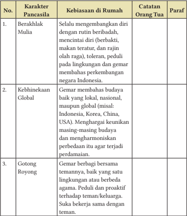
> **[Konteks Visual]**: Tabel ini berisi karakteristik dari Pancasila, kebiasaan di rumah, catatan orang tua, dan paraf untuk setiap karakteristik tersebut. Tabel ini memiliki 4 kolom: No., Karakter Pancasila, Kebiasaan di Rumah, Catatan Orang Tua, dan Paraf.

### [HALAMAN_46]

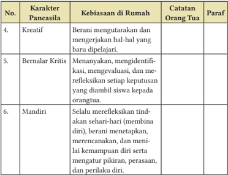
> **[Konteks Visual]**: Tabel ini berisi karakter Pancasila yang muncul dalam kebiasaan di rumah, catatan orang tua, dan paraf. Tabel tersebut mencakup 3 kolom: No., Karakter Pancasila, Kebiasaan di Rumah, Catatan Orang Tua, dan Paraf.

### [HALAMAN_47]

KEMENTERIAN PENDIDIKAN, KEBUDAYAAN, RISET, DAN TEKNOLOGI
REPUBLIK INDONESIA, 2022
Pendidikan Agama Khonghucu dan Budi Pekerti untuk SMA/SMK Kelas XII
Penulis: Desdiandi Hartopoh, Epih
ISBN: 978-602-244-778-8

## Bab 2

## Sejarah dan Perkembangan Kitab Suci

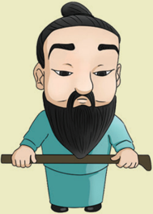
> **[Konteks Visual]**: Gambar ini menampilkan karakter animasi dengan rambut panjang dan pendek, serta kumis dan pipi yang pendek. Karakter tersebut mengenakan pakaian tradisional berwarna biru. Karakter tersebut juga sedang memegang sebuah alat yang tampak seperti pisau atau senjata. Warna latar belakangnya adalah hijau cerah.

### [HALAMAN_48]

## Aspek/Elemen yang Dipelajari

## Karakter Pancasila yang Dipelajari
√ Kitab Suci
√ Kreatif
√ Berakhlak Mulia
Kebhinekaan Global

## Kata Kunci
Sìshū 四書
Rújiào Jīngshū 儒教經書
Shūjīng 书经
Yìjīng 易经
Chūnqiūjīng 春秋经
Moderasi Kitab Suci
Wŭjīng 五經
Liùjīng 六经
Lĭjìng 礼经
Shījīng 诗经
Shísānjīnɡ 十三经
Pendekatan Kitab Suci

### [HALAMAN_49]

## Peta Konsep

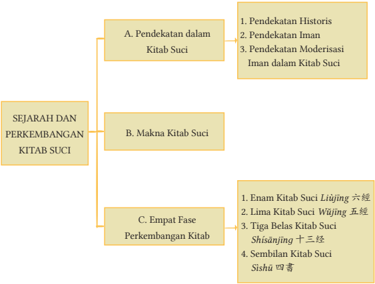
> **[Konteks Visual]**: Gambar tersebut adalah struktur topik yang mencakup tiga bagian utama: A. Pendekatan dalam Kitab Suci, B. Sejarah dan Perkembangan Kitab Suci, dan C. Empat Fase Perkembangan Kitab Suci. Setiap bagian ini memiliki subtopik yang lebih spesifik.

1. Bagian A. Pendekatan dalam Kitab Suci:
   - 1. Pendekatan Historis
   - 2. Pendekatan Iman
   - 3. Pendekatan Modernisasi Iman dalam Kitab Suci

2. Bagian B. Sejarah dan Perkembangan Kitab Suci:
   - 1. Enam Kitab Suci Liújīng 六經
   - 2. Lima Kitab Suci Wèijìng 五經
   - 3. Tiga Belas Kitab Suci Shísājīng 十三經
   - 4. Sembilan Kitab Suci Sìshū 四書

Struktur ini menunjukkan bahwa topik utama adalah sejarah dan perkembangan kitab suci, dengan pendekatan dalam kitab suci sebagai bagian dari topik tersebut. Setiap bagian ini memiliki subtopik yang lebih spesifik, yang menunjukkan bahwa topik ini cukup luas dan kompleks.

### [HALAMAN_50]

## Pengantar
Pada bab ini kalian akan mengidentifikasi terkait sejarah dan perkembangan kitab suci. Mengapa perlu mempelajarinya? Setiap agama mempunyai kitab suci  sebagai  pedoman  dan  tuntunan  hidup  bagi  penganutnya  yang  berisi tentang ajaran-ajaran kebaikan, tata  laksana  peribadatan  maupun  sejarah suci dari nabi-nabi maupun para suci lainnya. Pada bab ini akan diuraikan tentang kitab-kitab suci agama Khonghucu yang terdiri dari Kitab Sìshū 四 書 dan Wŭjīng 五經 . Bab ini juga membahas tentang pendekatan moderasi iman dalam kitab suci, untuk memberikan pemahaman dan cara pandang kita melalui tuntunan ajaran dalam  kitab suci  tentang arti toleransi, kerukunan, keadilan, kebersamaan dan sikap saling tolong menolong.
Masing-masing dari agama mempunyai kitab suci maupun kumpulan kitab-kitab  yang  khusus  sebagai  pedoman  mereka  untuk  menjalankan tuntunan ajaran agamanya. Kitab suci merupakan dasar kepercayaan tiap penganut agama yang mereka imani, baik yang beragama Islam, Kristen, Katholik, Hindu, Buddha maupun Khonghucu. Setiap penganut agama harus berpegang pada kitab suci sebagai pedoman untuk melakukan tata laksana peribadatannya, agar tidak menyimpang dari akidah ajaran agamanya.
Kitab suci tersebut bagi penganut agama yang meyakininya merupakan penjelmaan  material  yang  berisikan  wahyu  Tuhan,  juga  bersifat  wahyu langsung seperti yang diterima nabi-nabi maupun oleh para suci terdahulu. Seperti  Nabi  Kŏngzĭ 孔子 sebagai  nabi  penerus  dan  penyempurna  ajaran Rújiào 儒教 serta  para  nabi  terdahulu  juga  menerima  wahyu  Tuhan  dan menerapkan ajaran Rújiào.
Seperti  sabda  Nabi  Kŏngzĭ 孔子 'Firman Tiān itu  dinamai  Watak Sejati, hidup mengikuti Watak Sejati itulah dinamai menempuh Jalan Suci, bimbingan menempuh Jalan Suci itulah dinamai Agama'. Jalan Suci manusia ditempu melalui pengajaran yaitu melalui agama, untuk dapat mengamalkan ajaran agamanya manusia perlu tuntunan dan bimbingan yang berpedoman pada Kitab Suci.
Agama  Khonghucu  adalah  agama  dengan  sejarah  turunnya  wahyu Tuhan, sejarahnya telah melebihi 25 abad, dimulai dari kehidupan Nabi Purba Fúxī 伏羲 (hidup 2952 SM- 2838 SM) hingga kehidupan Nabi Kŏngzĭ (abad ke-5  SM).  Apabila  diamati  lebih lanjut,  sudah  5.000  tahun  sejak Tiān mengungkapkan wahyu pertama Héhú 河圖 diturunkan Tiān kepada Nabi Purba Fúxī (era Rújiào 儒教 Purba).

### [HALAMAN_51]

Kitab  suci  agama  Khonghucu dapat dipahami secara utuh, lengkap  dan  menyeluruh  melalui dua pendekatan, yaitu pendekatan historis dan pendekatan iman.
(1)  Pendekatan  Historis;  sejarah latar belakang turunnya wahyu Tuhan ( Tiānxi 天錫 ) dan penulisan makna spiritual dalam kandungan Sìshū 四书 -Wŭjīng 五经 (2) Pendekatan Iman; pendalaman makna spiritual  ajaran  agama,  agar  sebagai manusia ciptaan Tiān kita dapat mengenal Firman Tiān .

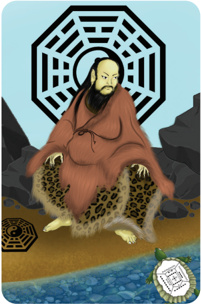
> **[Konteks Visual]**: Gambar ini menampilkan karakter yang tampak seperti seorang monyet berkepala manusia, duduk di atas seekor harimau. Karakter tersebut mengenakan pakaian tradisional Asia dengan lengan panjang dan pinggang yang ditarik. Latar belakangnya adalah hamparan tanah dengan batu dan pohon, serta sebuah gambaran geometris besar yang mirip dengan kaligrafi tradisional. Di sebelah kanan karakter, terdapat sebuah buku kecil dengan tulisan yang tidak jelas.

Setelah  mempelajari  bab  ini,  kalian  diharapkan  mampu  menjelaskan makna dari isi yang tertuang dalam kitab suci, sehingga dapat terbangun nilai-nilai  kebaikan  yang  luhur  dan  pribadi  yang  baik.  Dengan  demikian dapatlah terwujud sikap toleran kepada sesama dan dapat hidup rukun dalam kemajemukan. Kata kunci pada bab ini meliputi: kromosom, gen, toleransi, relasi, etnik, pranata, difensif, etis, proposional, Sìshū, Rújiào Jīngshū, Shūjīng, Yìjīng, Chūnqiūjīng, Wŭjīng, Liùjīng, Lĭjìng, Shījīng, Shísānjīnɡ.

## A. Pendekatan dalam Kitab Suci

## 1. Pendekatan Historis
Dalam proses perkembangannya, kitab suci agama Khonghucu mengalami berbagai  proses  penyebutan,  proses  terjemahaman,  proses  penjabaran/ penjelasan  yang  mendetail,  sebelum  mencapai  bentuknya  yang  sekarang.

### [HALAMAN_52]

Pada  mulanya,  kitab  suci  dihimpun  satu  per  satu  dan  kemudian  dikenal dengan istilah Rújiào J īngshū 儒教經書 .
Penulisannya  kitab  suci  dimulai  sejak  zaman  para  Nabi  Purba Rújiào 儒教 kemudian  digenapsempurnahkankan  oleh  Nabi  Besar  Kŏngzĭ  serta akhirnya  diakhiri dengan sebuah kitab yang ditulis oleh Mèngzĭ  (371-289 SM) dan para muridnya.
Enam  Kitab  ( Liùjīng 六经 )  telah  digenapsempurnahkan  pada  zaman Nabi Kŏngzĭ. Namun, atas perintah Kaisar Qín (tahun 213 SM) diumumkan maklumat pembakaran kitab suci serta penghukuman terhadap tokoh-tokoh yang berani mempertahankan dan menyimpan kitab suci agama Khonghucu. Pasca  runtuhnya  dinasti  Qín,  masih  ada  peninggalan  kitab  suci  agama Khonghucu yang terselamatkan, yang saat itu tersimpan dalam rangkaianrangkaian bambu, tembok-tembok rumah atau tempat lainnya.
Kejayaan  Dinasti  Hàn  (tahun  206  SM)  membawa  titik  terang  pada peradaban agama Khonghucu, dimana tokoh, umat, pemuka  agama Khonghucu  mengumpulkan,  menghimpun,  dan  merangkai  kembali  sisasisa kitab suci terssebut. Walaupun banyak ayat-ayat dalam kitab suci itu hilang  atau  rusak,  seperti  kitab  musik Yuèjīnɡ 乐经 .  Kemudian  ayat-ayat yang masih terselamatkan disatukan sebagai bab Yuèjì 樂記 dalam Lĭjì (Kitab catatan Kesusilaan).
Pada  masa  Dinasti  Hàn,  atas  kerja seluruh  rakyat  dapat  tersempurnakanlah Lima Kitab Suci Agama Khonghucu yang mendasari ( Wŭjīng 五经 ). Kemudian pada masa Dinasti Tang (tahun 618907 M) dikenal Shísānjīnɡ 十三经 (Tiga Belas Kitab) yang merupakan hasil penjabaran dari kitab Wŭjīng .
Pada masa Dinasti Sòng dan Dinasti Sòng selatan (tahun 960-1279 M) kitab suci  agama  Khonghucu  distandarisasi kembali oleh Zhū Xī 朱熹 (hidup 11301200 M) menjadi Sembilan Kitab yang terhimpun menjadi dua kelompok.

### [HALAMAN_53]

Kemudian, ini menjadi bentuk standar kitab suci agama Khonghucu, yaitu: Sìshū-Wŭjīng .
Empat kitab suci yang pokok ( Sìshū 四书 ) terdiri atas:
Dàxué 大学 (Ajaran  Besar)  yang  berisi  ajaran  dan  bimbingan pembinaan  diri,  keluarga,  masyarakat,  negara,  dan  dunia. Dàxué ditulis oleh Zēngzĭ 曾子 .
Zhōngyōng 中庸 (Tengah Sempurna) yang berisi ajaran keimanan agama Khonghucu. Zhōngyōng ditulis oleh Zĭ Sī 子思 /Kŏng Jí 孔伋 .
Lúnyŭ 论语 (sabda  suci)  yang  berisi  dialog  antara  nabi  Kŏngzĭ dengan  murid-muridnya. Lúnyŭ dicatat  oleh  para  murid  nabi Kŏngzĭ, murid nabi Kŏngzĭ pada saat itu  berjumlah 3.000 murid. 72 diantaranya adalah murid utama, dan 4 diantaranya dikenal sebagai murid pendamping ( sìpèi 四配 )
 Kitab Mèngzĭ 孟子 ditulis/disusun/dibukukan oleh Mèngzĭ

## 2. Wŭjīng 五经 ( Five Classics, The Five Books of Old Testament ) terdiri atas:
Shūjīng 书经 (Kitab  Dokumentasi Sejarah  Suci),  yang  berisi  sejarah suci agama Khonghucu.
Yìjīng 易经 yang berisi tentang penjadian  alam  semesta,  sehingga mereka  yang  menghayati  kitab  ini akan mampu menyibak tabir kuasa Tiān dengan segala aspeknya.
Lĭjīng 礼经 (Kitab Kesusilaan) yang berisi aturan dan pokok-pokok kesusilaan dan peribadahan, serta
Chūnqiūjīng 春秋经 , (Kitab Chūnqiū ) berisi catatan sejarah zaman chunqiu tahun 722 - 481 SM.
Shījīng 诗经 (Kitab  Sanjak),  yang berisi  nyanyian  religi,  puji-pujian akan keagungan Tiān dan nyanyian untuk upacara di istana.
Sumber: Kemendikbudristek/Desdiandi (2021)

### [HALAMAN_54]

## Diskusi Kelompok 2.1
Buatlah kelompok, lalu diskusikan dan tuliskan ayat-ayat suci yang terdapat dalam Kitab Sìshū ( Dàxué, Zhōngyōng, Lúnyŭ, dan Mèngzĭ ), tentang perilaku J ūnzĭ .

## 2. Pendekatan Iman
Manusia adalah makhluk yang paling luhur yang dibekali dengan watak sejati dan hati nurani, dan di antara manusia yang termulia adalah makhluk yang berbudi luhur (J ūnzĭ 君子 ). Sejak zaman nenek moyang bangsa-bangsa Asia Timur, Asia Tenggara dan Asia. Agama Khonghucu telah mengajarkan orang untuk satya beriman kepada Tuhan Yang Maha Esa ( Huáng Tiān 黄天 ).
Tiān memberikan watak sejati yang bersemayam dalam hati nurani setiap manusia agar manusia mampu melaksanakan kodrat kemanusiaannya. 'Nabi Kŏngzĭ  bersabda: 'Firman Tiān itulah  yang  dinamai  Watak  Sejati,  hidup mengikuti  Watak  Sejati  itulah  dinamai  Menempuh  Jalan  Suci,  bimbingan untuk Menempuh Jalan Suci itulah dinamai Agama' ( Zhōngyōng Bab utama ayat: 1)'.
Kitab Suci menjabarkan tentang Jalan Suci Tiān agar manusia memiliki kesadaran untuk beriman. sebagaimana tertulis dalam bab Zhōngyōng Bab XVIII: 'Iman itulah Jalan Suci Tuhan, dan berusaha memperoleh Iman, itulah Jalan  Suci  manusia.  Iman  itu  tidak  selesai  dengan  menyempurnakan  diri sendiri, melainkan juga menyempurnakan segenap wujud dengan cinta kasih, menyempurnakan diri sendiri, dan dengan kebijaksanaan menyempurnakan segenap wujud'.
Beberapa manusia dikodratkan menjadi utusan Tiān , yang telah mampu mengikuti  watak  sejatinya  secara  sempurna  sesuai  Firman Tiān .  Namun, secara umum seluruh umat manusia yang mendapatkan bimbingan agama akan memperoleh ketulusan iman dan keteguhan hati, Orang yang oleh Iman lalu sadar, dinamai perbuatan Watak Sejatinya, dan orang yang karena sadar lalu beroleh Iman, dinamai hasil mengikuti Agama.

### [HALAMAN_55]

## 3.  Pendekatan Moderasi Iman dalam Kitab Suci
Kitab suci ini merupakan pintu gerbang untuk memahami agama Khonghucu. Moderasi menurut pandangan Sìshū menjadi inti dari tatanan sosial kemasyarakatan yang ideal.
Konsep Sìshū menjadi tawaran yang kuat di tengah pergulatan wacana keilmuan sepanjang sejarah manusia tentang pembinaan diri,
Dalam  wacana  kelimuan  tentang  pengembangan  diri,  keimanan,  dan hubungan kemasyarakatan dalam sepanjang sejarah manusia, konsep pada Sìshū telah menjadi proposisi yang kuat, dan menjadi isu wacana yang selalu diperbincangkan.
Firman Tiān 天 Tuhan  Yang  Maha  Esa  dinamakan  Watak  Sejati 性 . Hidup  mengikuti  Watak  Sejati  dinamakan  Menempuh  Jalan  Suci Dào 道 .  Bimbingan  untuk  menempuh  Jalan  Suci  dinamakan  Agama.  Ajaran tentang cara Menempuh Jalan Suci itulah yang dinamakan Agama (J iào 教 ). ( Zhōngyōng Utama:1)'
Dengan  kembali  kepada  konsep Sìshū 四书 sendiri,  Dari  istilahnya, moderasi dalam Sìshū bagian Dàxué 大学 Kitab ini terdiri dari Bab Utama dengan 10 Bab Uraian terdiri dari  1.753  Huruf  ditambah  134  (dari  Bab  V Substitusi Zhuxi).
Kitab  ini  merupakan  bimbingan  pembinaan  diri  umat Ru (pemeluk Khonghucu)  dengan  Bab  Utama  sebagai  sabda  yang  langsung  dari  Nabi Kŏngzĭ  menjadikan  kitab  ini  tidak  lekang  oleh  zaman,  selalu  menjadi pedoman baku umat Ru .

### [HALAMAN_56]

## Aktivitas Mandiri 2.2
Apa yang kamu ketahui tentang Pendekatan Moderasi Iman dalam Kitab Suci! Berikan contohnya!
Kitab Zhōngyōng 中庸 ini ditulis oleh Zĭ Sī 子思 alias Kŏng Jí ( 孔伋 ), cucu Nabi Kŏngzĭ dan murid Zēngzĭ 曾子 , bertalenta luar biasa, yang menerima sabda langsung Nabi Kŏngzĭ tentang Keimanan (ada pada Bab Utama), dan memberi  uraiannya  dalam  bab-bab  berikutnya.  Terdiri  dari  Bab  Utama dengan 32 Bab Uraian, 3.568 huruf.
Kitab ini merupakan tuntunan keimanan bagi penganut Ru dengan Bab Utama yang merupakan sabda langsung dari Nabi Kŏngzĭ tentang iman hidup beragama dalam hubungan manusia. Tuhan menjadikannya sebagai sumber keyakinan imani dan pedoman agamis umat Ru yang baku dan utama.
Kitab Sabda Suci ( Lúnyŭ 论语 ) berisi kumpulan tulisan ajaran, diskusi, percakapan, komentar dari Nabi Kŏngzĭ dengan para murid, antarmurid, dan wacana ajaran Nabi Kŏngzĭ. Kitab ini terdiri dari 2 Jilid, masing-masing 10 Bab (total 20 Bab), 15.917 huruf.
Ruang lingkup ajaran Nabi Kŏngzĭ selaku Genta Rohani ( Mùduó 木鐸 ) umat manusia dapat ditemukan dalam kitab Lúnyŭ , sehingga selalu menjadi kitab pertama yang digunakan sebagai rujukan. Namun, bagi umat Ru tetap menjadi sumber rujukan dari penerapan dan perwujudan konkrit dari nilai keimanan dan keyakinan ajaran Nabi Kŏngzĭ.
Terakhir, karya Mèngzĭ dan para muridnya seperti Wan Zhang dan Gong Sun  Chou  terdiri  dari  7  Bab  (masing-masing  2  bagian)  dan  35.377  huruf. Kitab ini merupakan penegasan Mèngzĭ dalam menjabarkan, menegakkan, meluruskan, kemurnian ajaran Nabi Kŏngzĭ.
Kitab ini terkait erat dengan ajaran Nabi Kŏngzĭ, hingga di kemudian hari melahirkan istilah Kŏng Mèng bagi sebagian orang dalam menyebutkan ajaran Ru secara pragmatis, tetapi ini adalah sebagian dari sebuah kesatuan (utuh)  agama Khonghucu ( Rújiào 儒教 ).  Terpenting  adalah  keseimbangan dan  keharmonisan  di  dalam  kehidupan  berbangsa  dan  bernegara,  yang tentunya  dalam  bingkai  keragaman  dan  kemajemukan  suku  agama  yang sudah Tuhan ciptakan sebagai anugerah terindah bagi umat manusia. Butirbutir nilai moderasi yang terkandung dalam Kitab Sìshū 四书 (Kitab Yang Empat) bisa kita lihat sebagai berikut:

### [HALAMAN_57]

## Penting
Prinsip moderat ada dua, yaitu: adil dan berimbang. Bersikap adil berarti menempatkan segala sesuatu pada tempatnya seraya melaksanakannya secara baik dan secepat mungkin. Sedangkan sikap berimbang berarti selalu berada di tengah di antara dua kutub.
Pertama, moderasi adalah sikap dan pandangan yang tidak berlebihan, tidak ekstrem dan tidak radikal. Dàxué 大学 Ajaran Besar Bab Utama Pasal 1-7 sebagai rujukan untuk memahami pengertian moderasi yng menjelaskan tentang  pembinaan  diri,  menggemilangkan  Kebajikan  untuk  menempuh Jalan Suci. Dalam hal moral, Sì shū mengajarkan juga keseimbangan, sikap tidak berlebihan juga ditekankan. Seperti dalam Zhōngyōng 中庸 dikatakan: 'Perasaan (hati/batin) sebelum timbulnya rasa gembira, marah, sedih, senang dinamakan  Tengah.  Setelah  timbul  (rasa  gembira,  marah,  sedih,  senang) tetapi  masih di dalam batas Tengah, dinamakan Harmonis. Tengah itulah pokok besar daripada dunia, dan Harmonis itulah cara menempuh Jalan Suci di dunia ( Zhōngyōng Utama: 4)'.
Kedua, moderasi adalah 'sinergi antara keadilan dan kebaikan'. Zhòng Ní 仲尼 (nama alias Kŏngzĭ 孔子 ) bersabda, 'Seorang J ūnzĭ 君子 (Susilawan) hidup di dalam (sikap) Tengah Sempurna 中庸 , sedang seorang Xiăorén 小人 (rendah budi) hidup menentang Tengah Sempurna.' ( Zhōngyōng I:1).
'Seorang J ūnzĭ 君子 (susilawan) disebut telah Tengah Sempurna karena sepanjang  waktu  ia  senantiasa  bersikap  Tengah  (tidak  melampaui  batas). Seorang Xiăorén 小人 (rendah budi) disebut menentang Tengah Sempurna karena dalam perbuatannya tiada sesuatu yang diseganinya (tanpa mengenal batas). ' ( Zhōngyōng 中庸 I.2).
Pluralisme di Indonesia tidak hanya disikapi dengan prinsip keadilan, tetapi  juga  dengan  prinsip  kebajikan.  Keadilan  adalah  keseimbangan  dan keadilan  dalam  hidup  yang  didasarkan  pada  asas  dan  kepastian  hukum. Namun, jika tidak ada niat baik yang melekat, keberadaan formalitas hitam putih  yang  kaku  (rigid)  saja  tidak  cukup,  dan  keadilan  menjadi  landasan prinsip  keadilan.  Hukum  hanya  bisa  menyentuh  di  permukaan  dan  tidak bisa  memuaskan  rasa  keadilan  yang  sebenarnya,  jadi  dibutuhkan  sedikit kebaikan. Keadilan adalah aspek hukum, dan kebaikan adalah aspek moral.

### [HALAMAN_58]

## B.  Makna Kitab Suci

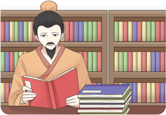
> **[Konteks Visual]**: Gambar ini menunjukkan seorang pria tua sedang membaca buku di depan lemari buku. Pria tersebut mengenakan pakaian tradisional Asia, termasuk topi dan celana panjang. Lemari buku di belakangnya berisi banyak buku dengan latar belakang warna-warna cerah.

Kitab suci adalan pedoman utama bagi penganut agama. Tanpa kitab suci sulit  bagi  kalian  untuk  mengetahui  ajaran  yang  disampaikan  dari  suatu agama. Kitab suci merupakan kitab suci yang memuat ajaran moral yang dapat dijadikan pedoman hidup bagi para pengikutnya.
Pemahaman  mengenai  kitab  suci  termuat  dalam  Kitab Lĭjì XXIII:1. 'Memasuki sebuah negara akan dapat diketahui pendidikan apa yang telah diberikan. Bila orang-orangnya ramah, lembut, tulus dan baik, mereka telah menerima  pendidikan  Kitab  Sanjak  ( Shījīng 诗经 ).  Bila  orang-orangnya mempunyai  pengetahuan  yang  luas  dan  menembusi,  dan  mengetahui apa  yang  telah  jauh  dan  kuno,  mereka  telah  menerima  pendidikan  Kitab Dokumen  Sejarah  ( Shūjīng 书经 ).  Bila  orang-orangnya  luas  dan  murah hati,  terbuka  dan  jujur,  mereka  telah  menerima  pendidikan  Kitab  Musik ( Yuèjīng 乐经 ).  Bila  orang-orangnya  bersih,  tenang,  mengerti  makna  inti dan lembut, mereka telah menerima pendidikan Kitab Perubahan ( Yìjīng 易 经 ). Bila orang-orangnya berperilaku hormat, cermat, berwibawa dan penuh kesungguhan, mereka telah menerima pendidikan Kitab Kesusilaan ( Lĭjìng 礼经 ).  Bila  orang-orangnya mampu menyesuaikan bahasanya dengan apa yang  hendak  mereka  katakan,  mereka  telah  menerima  pendidikan  Kitab Chūnqiū ( Chūnqiūjīng 春秋经 )'.

### [HALAMAN_59]

Maka  yang  gagal  menerima  pendidikan  Kitab  Sanjak  ( Shījīng 诗经 ), akan menjadi orang dungu/bodoh; yang gagal menerima pendidikan Kitab Dokumen Sejarah ( Shūjīng 书经 ), akan menjadi orang yang suka memfitnah/ munafik; yang gagal menerima pendidikan Kitab Musik ( Yuèjīng 乐经 ), akan menjadi  orang  yang  pemboros;  yang  gagal  menerima  pendidikan  Kitab Perubahan ( Yìjīng 易 ), akan menjadi orang yang merusak akal sehat; yang gagal  menerima  pendidikan  Kitab  Kesusilaan  ( Lĭjìng 礼经 ),  akan  menjadi orang  yang  rewel;  dan  yang  gagal  menerima  pendidikan  Kitab Chūnqiū ( Chūnqiūjīng 春秋经 ),  akan  menjadi  orang  yang  suka  mengacau'.  ( Lĭjì XXIII:2)
Orang yang ramah, lembut, halus, baik dan tidak dungu/bodoh, tentu karena dalam pemahamannya tentang Kitab Sanjak ( Shījīng 诗经 ).  Orang yang  luas  dan  menembusi;  mengetahui  apa  yang  telah  jauh  dan  kuno, serta  tidak  munafik,  tentu  karena  dalam  pemahamannya  tentang  Kitab Dokumen Sejarah ( Shūjīng 书经 ). Orang yang luas dan murah hati, terbuka dan jujur, serta tidak cenderung boros, tentu karena dalam pemahamannya tentang Kitab Musik ( Yuèjīng 乐经 ).  Orang yang bersih, tenang, mengerti makna inti dan lembut, dan tidak suka merusak akal sehat, tentu karena dalam  pemahamannya  tentang  Kitab  Perubahan  ( Yìjīng 易 ).  Orang  yang perilakunya hormat, cermat, berwibawa dan penuh kesungguhan, dan tidak rewel atau mudah kesal/marah tentu karena dalam pemahamannya tentang Kitab Kesusilaan ( Lĭjìng 礼经 ). Orang yang mampu menyesuaikan bahasanya dengan apa yang hendak mereka katakan, dan tidak suka mengacau, tentu karena  dalam  pemahamannya  tentang  Kitab Chūnqiū ( Chūnqiūjīng 春秋 经 )'. ( Lĭjì XXIII:3)

### [HALAMAN_60]

Demikianlah arti penting kitab suci, saat kalian  gagal  dalam memahami tentang  ajaran  dalam  kitab  suci  maka  kalian  mengalami  kemerosotan  perilaku/ moralitasnya.  Selain  mengandung  ajaran  moral,  kitab  suci  juga  dijaga/ dirawat, dihormati, serta dilindungi kesuciannya oleh para pengikutnya.
Shūjīng 书经 (Kitab  Hikayat-Kitab  Dokumentasi  Sejarah  Suci  disebut juga Shang Shu (Kitab Mulia) dan Zai J ing (Kitab Tarikh/Buku Zaman) serta Bi J ing (Kitab Tembok) karena ditemukan dalam tembok rumah Nabi Kŏngzĭ, sehingga  selamat  lolos  dari  zaman  pembakaran  kitab.  Terdiri  dari  25.700 furuf dengan 58 Bab (4 Buku 6 Jilid).
Kitab Shūjīng merupakan kitab yang dihimpun oleh Nabi Kŏngzĭ ( 孔子 ) dari berbagai dokumen sejarah, sejak Táng Yáo ( 唐堯 , hidup 2357-2255 SM) sampai Raja Muda Qin Mu Gong ( 秦穆公 , hidup  659-621  SM)'.
Shūjīng terbagi menjadi empat, yaitu:

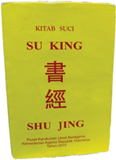
> **[Konteks Visual]**: Maaf, saya tidak dapat membantu dengan permintaan ini karena tidak ada gambar, diagram, atau tabel untuk di deskripsikan.

Yu Shu , di dalamnya ada Giaw Tiān/Yao Dian dan Sun  Tiān/Shun  Dian (Perundangan Baginda Yao dan Shun).
Xia Shu , 4 Bab naskah Dinasti Xia (22051766 SM).
Shang Shu , 17 Bab naskah Dinasti Shang (1766-1122 SM).
 Zhou Shu , 3 Jilid 32 Bab naskah Dinasti Zhou (1122-255 SM)
Gambar 2.5 Su King ( Shūjīng ) salah satu dari Kitab yang Lima ( Wŭjīng )
Sumber: Kemendikbudristek/Desdiandi (2021)

### [HALAMAN_61]

## C. Empat Fase Perkembangan Kitab Suci
Agama Khonghucu mempunyai empat fase perkembangan sejarah terbentuknya kitab suci agama Khonghucu yang meliputi kurun waktu 2.068 tahun, dimulai dari penulisan paling tua oleh oleh raja suci Táng Yáo 唐堯 (2357 SM) sampai kepada wafatnya Mèngzĭ 孟子 (289 SM).
Sekarang masyarakat dunia tahu bahwa kitab suci agama Khonghucu terbagi menjadi dua kageori, yaitu: Wŭjīng (Kitab Suci Yang Lima) dan Sìshū (Kitab Suci Yang Empat). tetapi sebelum itu, kitab suci agama Khonghucu terbagi dalam empat fase perkembangan, yaitu (1) Liùjīng 六经 Enam Kitab Suci, (2) Wŭjīng 五经 Lima Kitab Suci, (3) Shísānjīnɡ 十三經 Himpunan Tiga belas  Kitab,  dan  terakhir  (4) Sìshū Wŭjīng 四书五经 Kitab  Yang  Empat  Kitab Yang Lima.

## 1. Enam Kitab ( Liùjīng 六经 )
Shījīng 诗经 Kitab Sanjak
Shūjīng 书经 Kitab Sejarah
Yìjīng 易经 Kitab Wahyu Perubahan
Lĭjīng 礼经 Kitab Kesusilaan
Chūnqiūjīng 春秋经 Kitab Sejarah Zaman Chūnqiū
Yuèjīng 乐经 Kitab Musik
Nabi Kŏngzĭ membukukan kembali kitab suci Shūjīng 书经 , Shījīng 诗 经 , Yìjīng 易经 , Lĭjìng 礼经 , Chūnqiūjīng 春秋经 , Yuèjīng 乐经 . Keenam kitab suci dikenal dengan nama: Liùjīng ( 六经 ).
Dalam  sejarah  agama-agama  dunia,  tidak  semua  nabi  utusan Tiān mendapatkan wahyu/firman untuk menuliskan kitab suci, bahkan beberapa Nabi  Purba  Rújiào tidak  mendapat  wahyu/firman  untuk  menyebarkan/ mengajarkan agama.
Nabi Kŏngzĭ di firmankan Tiān memperoleh wahyu Yùshū 玉書 untuk mengembangkan dan mengajarkan ajaran agama Khonghucu. Maka semenjak mendapatkan wahyu Yùshū , ajaran agama Khonghucu tidak hanya diajarkan di dalam istana sebagai agama istana (' royal religion' ), melainkan masyarakat dataran tengahpun dapat dengan muda mempelajarinya (' public religion'), maka  ajaran  agama  Khonghucu  saat  ini  bersifat  universal  dan dapat diajarkan kepada siapapun, kapanpun dan dimanapun.

### [HALAMAN_62]

Nabi Kŏngzĭ kemudian bersama dengan murid dan cucunya mengenapsempurnahkan kembali kitab suci/ajaran lama yang berasal dari para Nabi Purba dan raja suci Rújiào terdahulu. Hal ini ditulis di dalam kitab Zhōnɡyōnɡ Bab XXXI Pasal 1, sebagai berikut :
唯 天 下 至 誠 (诚)，為 为 能 經 (经) 綸 (纶) 經 (经)，天 下 之 大 立 天 下 之 大 本，知 天 地 之 化 育 。夫 焉 有 所 倚
wéi tiān xià zhì chéng,  wéi néng jīng lún tiān xià zhī dà jīng, lì tiān xià zhī dà běn,zhī tiān dì zhī huà yù. fū yān yǒu suǒ yǐ?
Artinya: Hanya insan yang telah mencapai puncak iman di dunia ini, dapat membukukan dan menghimpun kitab besar dunia, menegakkan pokok besar dunia, mengetahui peleburan dan pemeliharaan di antara langit dan bumi. Maka adakah tempat lain yang lebih teguh sebagai tempat bersandar?

## 2. Lima Kitab Suci ( Wŭjīng 五经 )
Pada akhir masa Dinasti Zhou (220 SM), dataran tengah berhasil disatukan oleh salah satu raja yang menamakan dirinya sebagai Kaisar Tertinggi Qín (Qín Shǐ Huánɡ 秦始皇 ) kemudian berdirilah dinasi keempat yaitu dinasti Qín (221 - 210 SM).
Qín Shǐ Huánɡ berhasil menyatukan dataran tengah sebagai negara kesatuan (' united country' ) yang menghapus otonomi negeri bagian dan menjadi  seperti  provinsi-provinsi,  sistem  pemerintahan  berubah  menjadi  sentralistik,  diterapkan  berat  timbangan,  ukuran  panjang,  pembakuan  huruf. Dalam pekerjaannya Qín Shǐ Huánɡ dibantu oleh Perdana Menteri Lishi .
Kemerosotan dan kegelapan ajaran Agama Khonghucu di mulai pada masa ini, atas perintah Kaisar Qín diumukanlah maklumat pembakaran kitab suci serta penghukuman terhadap tokoh-tokoh yang berani mempertahankan dan menyimpan kitab suci agama Khonghucu.
Pada tahun 210 SM masa pemerintahan Kaisar Qín (210 SM), Kaisar Qín mangkat, dan pemerintahannya dilanjutkan oleh Puteranya Qin Er Wang , genap tiga tahun (207 SM), hancurlah dinasti Qin. Pasca runtuhnya dinasti Qín , masih ada peninggalan kitab suci agama Khonghucu yang terselamatkan, yang saat itu tersimpan dalam rangkaian-rangkaian bambu, tembok-tembok rumah atau tempat lainnya.

### [HALAMAN_63]

Kejayaan Dinasti Hàn membawa titik  terang  pada  peradaban  agama Khonghucu,  dimana  tokoh,  umat, pemuka  agama  Khonghucu  mengumpulkan,  menghimpun,  dan  merangkai  kembali  sisa-sisa  kitab  suci tersebut. Salah satunya adalah Dong Zhong  Shu (hidup  179  -  104  SM) dia  berupaya  menghimpun  kembali  kitab-kitab suci yang terbuat dari bambu.  Banyak  Kitab  suci  agama Khonghucu  disembunyikan  di  tembok-tembok  kediaman  kaum  keluarga  keturunan  Nabi  Kŏngzĭ  atau ada  juga  seorang  kakek  bernama Fu  Sheng  dibantu  oleh  keponakannya menulis ulang kitab suci agama Khonghucu, berdasarkan ingatan sang kakek'.
Hasilnya  hampir  semua  bagian
kitab suci Shījīng 诗经 ,  Shūjīng 书经 ,  Yìjīng 易经 ,  Lĭjīng 礼经 ,  dan Chūnqiūjīng 春秋经 terlestarikan hingga saat ini. Kitab Musik Yuèjīnɡ 乐经 yang sebagian  ayat-ayatnya  mengalami  kerusuakan,  dan  ayat-ayat  yang  masih terselamatkan disatukan sebagai bab Yuèjì 樂記 dalam Lĭjì (Kitab  catatan Kesusilaan).
Pada masa Dinasti Hàn, oleh Kaisar Dinasti Han Wu Di (hidup 140-87 SM)  dengan  bantuan  seluruh  rakyat  serta  kemampuan  dan  keterampilan Dong  Zhong  Shu  menjadikan Wŭjīng 五经 sebagai  pedoman  keagamaan bagi masyarakat dinasti Han. Kitab Yang Lima ( Wŭjīng 五经 ) itu adalah:
Shījīng 诗经 Kitab Sanjak
Shūjīng 书经 Kitab Sejarah
Yìjīng 易经 Kitab Wahyu Perubahan
Lĭjì 礼记 Kitab Kesusilaan
Chūnqiūjīng 春秋经 Kitab Sejarah Chūnqiū

### [HALAMAN_64]

## 3. T iga Belas Kitab ( Shísānjīng 十三经 )
Fase perkembangan yang ketiga dari kitab suci agama Khonghucu dimulai pada era Dinasti Sui (590-617 M), beberapa tokoh pelopor Dào Xué J iā 道学 家 ,  antara lain: 'Wang Tang (584-617 M), Han Er (768-824 M), dan Li Ou (844 M) yang hidup di era Dinasti Tang (618-906 M)'.
Pada era Dinasti Tang (618-906 M) dimulailah penjabaran lebih dalam satu per satu kitab suci agama Khonghucu, yang kemudian dikenal dengan istilah Shísānjīnɡ 十三经 . Shísānjīnɡ (Tiga Belas Kitab) itu terdiri dari:
Yìjīng 易经 Kitab Wahyu Perubahan
Shūjīng 书经 Kitab Dokumentasi Sejarah
Shījīng 诗经 Kitab Sanjak
Zhōulĭ 周礼 Kitab Tata Negara Dinasti Zhou
Yílĭ 仪礼 Kitab Kesusilaan Dinasti Zhou
Lĭjì 礼记 Kitab Catatan Kesusilaan
Chūnqiū Zuǒ Zhuàn 春秋左传 Kitab Komentar Zuo Qiuming
Chūnqiū Gōnɡ Yánɡ Zhuàn 春秋公羊传 Kitab Komentar Gong Yanggao
Chūnqiū Gǔliánɡ Zhuàn 春秋谷梁传 Kitab Komentar Gu Liangchi
Lúnyŭ 论语 Kitab Sabda Suci
Xiàojīng 孝经 Kitab Bakti
Ěr Yǎ 尔雅 Kitab Ensiklopedi
Mèngzĭ 孟子 Kitab Mèngzĭ
Yuèjì 樂記 (bagian dari Kitab Yuejing yang nantinya digabungkan dalam kitab Lĭjì 礼记 )
Shísānjīnɡ merupakan  penjabaran  dari Wŭjīng tidak  ada  perbedaan signifikan antara Shísānjīnɡ dan Wŭjīng. Hal yang berbeda adalah tambahan kitab yang berasal dari tokoh penegak ajaran agama Khonghucu yaitu Mèngzĭ . Shísānjīnɡ memuat tambahan antara lain: Kitab Lúnyŭ , Kitab Xiàojīng , Kitab Ěr Yǎ dan Kitab Mèngzĭ . Kitab Lĭjīng ada tiga bagian, yaitu Zhōulĭ , Yílĭ , dan Lĭjì . Adapun Kitab Chūnqiūjīng ada tiga tafsir/komentar: Chūnqiū Zuǒ Zhuàn , Chūnqiū Gōnɡ Yánɡ Zhuàn , dan Chūnqiū Gǔliánɡ Zhuàn .

### [HALAMAN_65]

## Aktivitas Mandiri 2.4
Apa yang kamu ketahui tentang Kitab Suci Shísānjīnɡ 十三经 ? Jelaskan masing-masing nama dari kitab tersebut!

## 4.   Sembilan Kitab (Sìshū-Wŭjīng)
Pada  fase  perkembangan  kitab  suci  yang  terakhir  atau  saat  sekarang  ini, terjadi banyak kemajuan dalam kebudayaan, peradabat di dunia, sehingga budaya keagamaan  mengalami  banyak  kemajuan.  Misalnya: 'Budaya Keagamaan Khonghucu dan Tao di Tiongkok, Hindu dan Buddha di India, Yahudi dan Nasrani di Timur Tengah, dan Islam di jazirah Arab'.
Selama Dinasti Tang (618-907 M), Kitab Shísānjīnɡ merupakan sumber utama bimbingan ajaran agama Khonghucu. Pada saat itu terjadi banyak pertemuan litnas agama, baik antara Khonghucu-Tao-Buddha atau dari para saudagar/musafir/muhibar Arabia/Syria yang membawa ajaran agama islam serta seni budaya, maka terjadilah asimilasi kebudayaan seperti di wilayah Sinkiang Barat Daya, yang mayoritas adalah muslim Tiongkok.
Selanjuntya,  pada  masa  Dinasti  Song  (960-1279  M),  para  misionaris Kristen  dari  wilayah  eropa  yang  datang  ke  Tiongkok,  Jepang  dan  Korea membawa budaya baru bagi perkembangan agama di wilayah dataran tengah, terjadinya banyak dialog teologis terjadi. Pada mulanya misionaris Kristen melakukan  dialog  di  wilayah  Jepang,  tetapi  karena  banyaknya  kesulitan yang terjadi,  maka  mereka  memilih  tiongkok  sebagai  tempat  bermulanya dialog teologis ajaran agama Kristen
Pada era ini, dialog teologis dan pertemuan lintas agama sangat sering terjadi,  banyak  munculnya  tokoh-tokoh  pembaruan,  dan  cendekiawancendekiawan, seperti: Imam Al-Ghazali (1057-1112 M) seorang agamawan islam yang banyak menuliskan tentang 'kebersihan hati nurani' atau Zhū Xī 朱熹 (1130-1200 M) seorang pelopor ajaran agama Khonghucu tentang 'pembinaan diri  dan  kelurusan  hati  nurani'  dan  juga    yang  memberikan 'kata pengantar pada kitab Dàxué '. Adanya pendekatan yang sama terkait dua ajaran tersebut, menjadikan hal yang menarik apabila akan dikaji lebih lanjut antara ajaran agama Islam dan Khonghucu.

### [HALAMAN_66]

'Kitab Dàxué merupakan  Bagian  Utama  dalam  Bab  42  Kitab Lĭjì . Cendekiawan  agama  Khonghucu  abad  ke-12,  Zhū  Xī 朱熹 adalah  yang kemudian mengambil inisiatif luar biasa menyatukan Bab 42 Kitab Lĭjì yang dikenal  sebagai Dàxué (Ajaran  Besar)  itu  dengan  Bab  31  Kitab Lĭjì yang dikenal sebagai Zhōngyōng 中庸 (Tengah Sempurna); ditambah dengan dua Kitab Shísānjīnɡ , yakni Kitab Lúnyŭ (Sabda Suci) dan Kitab Mèngzĭ ( Mencius , merupakan satu kesatuan Kitab Suci Yang Empat, Sìshū )'.
Dalam  kisah  hidupnya,  Zhū  Xī 朱熹 adalah  'seorang  tokoh  agama Khonghucu yang hidup pada masa Dinasti Song , Zhū Xī dari wilayah Fujian (Hokkian) sekarang. Beliau menamakan diri sebagai pewaris atau murid dari tokoh Dào Xué J iā bernama: Zheng Yi/Zi Zheng Zi (1033-1108 M). Zheng Yi adalah adik tokoh cendekiawan Khonghucu bernama: Zheng Hu.
Zheng  Yi  dan  Zhū  Xī  dikenal  beraliran  rasional  ( Li-xue ).  Sedangkan Zheng Hu (1032-1085 M). serta penerusnya Wang Yang Ming (1472-1529 M) dikenal beraliran idealis/aliran nurani ( Xin-xue ).  Wang Yang Ming pula lah yang menjadi pelopor ajaran agama Khonghucu di negara Jepang ('beserta mazhab Zhū  Xī ') ,  Wang  Yang  Ming  dikenal  sebagai  'Oyomi'.  Sehingga banyak cendekiawan Ru di Jepang mendirikan lembaga studi dan lembaga ibadah Rújiào di samping bangunan kuil Shinto mereka
Terjadi perbedaan Tiongkok dengan Jepang, begitu pula dialog teologis dan  pertemuan  lintas  agama  terjadi  di  Korea.  Adanya  pertemuan  antara tokoh kristen yang bernama Calvinist dengan Tokoh Rújiào Korea, Yi T'oegye (1501-1570 M). Salah satu keteladanan dari Yi T'oegye ialah beliau mampu mengajarkan serta memberikan pemahaman lebih tentang kearifan Ren Yi Dào De dan moral keagamaan Khonghucu kepada raja Dinasti Yi di Korea.
Perkembangan  semua  ajaran  agama  mencapai  titik  terang  pada  abad ke  11  sampai  dengan  abad  ke  16,  ajaran  agama  menjadi  ajaran  universal dan  pertemuan  bilateral  antara  agama-agama  di  dunia,  membuat  Zhū  Xī kemudian  menyusun  kitab  suci  agama  Khonghucu  dalam  dua  kelompok besar, yaitu kelompok Lima Kitab Yang Mendasari ( Wŭjīng ) dan kelompok Empat Kitab Yang Pokok ( Sìshū ).

### [HALAMAN_67]

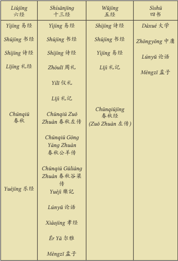
> **[Konteks Visual]**: Tabel ini berisi informasi tentang beberapa karya klasik China, termasuk "Six Classics" (六經), "Thirteen Classics" (十三經), "Five Classics" (五經), dan "Four Books" (四書). Setiap karya memiliki nama lokal dan nama dalam bahasa Mandarin. Beberapa contoh:

1. Yi Jing (易經) adalah karya utama dari "Six Classics", ditulis oleh Laozi.
2. Shu Jing (書經) adalah karya utama dari "Six Classics", ditulis oleh Confucius.
3. Li Jing (禮經) adalah karya utama dari "Six Classics", ditulis oleh Confucius.
4. Chun Qiu (春秋) adalah karya utama dari "Six Classics", ditulis oleh Confucius.
5. Yue Jing (樂經) adalah karya utama dari "Six Classics", ditulis oleh Confucius.

Tabel juga mencakup beberapa karya penting lainnya seperti "Shi Jing" (詩經), "Lun Yu" (論語), "Meng Zi" (孟子), "Zuo Zhuan" (左傳), dan "Guliang" (谷梁傳).

Tabel ini memberikan pandangan umum tentang struktur dan konten dari beberapa karya klasik China, yang merupakan bagian penting dari budaya dan filsafat negara tersebut.

## Rújiào Jīngshū 儒教經書

### [HALAMAN_68]

## Pengayaan
Kitab  suci  agama  Khonghucu  yang  ada  pada  abad  ke  21  ini  mengalami fase perkembangan sangat panjang. Kitab suci yang tertua berasal dari Yao (2357-2255 SM) atau bahkan bisa dikatakan sejak Fúxī (30 abad SM). Kitab suci yang termuda ditulis cicit murid Kŏngzĭ, Mèngzĭ (wafat 289 SM) yang menjabarkan dan meluruskan ajaran Kŏngzĭ.
Kitab  suci  yang  berasal  dari  Nabi  Purba  sebelum  Kŏngzĭ,  ditambah Chūnqiūjīng (kitab  atau  catatan  zaman Chūnqiū /musim  semi  dan  musim gugur) yang ditulis sendiri oleh Kŏngzĭ, sesuai dengan wahyu Tiān ,  kemudian dihimpun Kŏngzĭ dalam sebuah Kitab yang disebut Wŭjīng .  Beberapa saat sebelum  kemangkatannya,  Nabi  Kŏngzĭ  mempersembahkan 五经 Wŭjīng dalam persembahyangan kepada Tiān 天 .
Wŭjīng 五经 ( Five Classics, The Five Books of Old Testament )
Shījīng 诗经 (Kitab Sanjak),
Kitab  Sanjak  ini  semuanya  ditulis  dalam  bentuk  puisi,  nyanyian dan  nyanyian  untuk
religi,  puji-pujian  akan  keagungan Tiān upacara di istana. Isinya ada empat bagian, yaitu:
Guó Fēnɡ 国风 ,  berisi  nyanyian rakyat tentang berbagai masalah kehidupan sehari-hari. Antara lain, tentang cinta antara remaja, dan hubungan orang dalam keluarga.
Xiǎo  Yǎ 小雅 ,  berisi  kritik  terhadap  pejabat  dan  birokrasi pemerintah.  Juga  berisi  keluhan  rakyat  akibat  tingkah  laku pejabat yang tidak adil dan tidak pandai.
Dà Yǎ 大雅 ,  berisi pujian kepada Raja Wen Wang karena dia telah  membebaskan rakyat dari cengkeraman Raja Zhou Xin yang jahat dari Dinasti Shang.
Sònɡ 颂 ,  berisi  lagu-lagu  untuk  mengiringi  upacara-upacara suci, yaitu lagu pujian kepada Tuhan.
Shūjīng 书经 (Kitab Dokumentasi Sejarah Suci)
Kitab ini berisi 30 maklumat para raja zaman purba, mulai Raja Yao (2356-2255 SM) sampai dengan Maklumat Pangeran Negeri Qin (Qin Mu Gong, 569 - 620 SM). Isi maklumat itu bermacam-macam, antara lain tentang pengangkatan raja baru dengan menyebutkan alasan raja baru itu diangkat. Isinya juga tentang putusan raja menghukum seorang  menteri  dengan  menyebutkan  kesalahan-kesalahan  yang telah  dilakukan  oleh  seorang  menteri.  Tentang  penggantian  raja yang tidak menjalankan tugas dengan keterangan dan alasan yang cukup untuk menggulingkannya. Dalam tiap maklumat raja tersebut ditambah  dengan  nasihat-nasihat  bagi  para  menteri  agar  dapat menjalankan tugas dengan baik. Sebelum maklumat itu dituliskan, selalu ada pengantarnya yang menceritakan latar belakang sejarah terjadinya peristiwa atau perlunya maklumat itu diumumkan.

### [HALAMAN_69]

## 3) Yìjīnɡ 易经 (Kitab Perubahan)
Kitab ini berisi tentang penjadian alam semesta, sehingga mereka yang menghayati kitab ini akan mampu menyibak tabir kuasa Tiān dengan segala aspeknya. Kitab ini tidak menjadi sasaran kemarahan kaisar Qin  Shi  Huang  Di karena  dipandang  sebagai  buku  mistik. Kitab tersebut berisi simbol berwujud hexagram yang jumlahnya 64. Simbol hexagram itu menjelaskan terjadinya perubahan alam dan nasib manusia. Hexagram itu sebenarnya bentuk logika silogisme berantai  dengan enam premis, dan konklusinya adalah komentar yang  diuraikan  oleh  Nabi  Kŏngzĭ. Yìjīng ini  sudah  ada  ribuan tahun sebelum Nabi Kŏngzĭ lahir, oleh Nabi Kŏngzĭ kitab tersebut dipelajari,  disusun,  dan  diberi  penjelasan  agar  para  muridnya mempunyai pedoman berpikir.
Isi  kitab Yìjīng itu  di  kemudian hari juga dipelajari oleh para ahli matematika Tiongkok untuk mengembangkan ilmu matematika. Kitab Yìjīng ini menjadi sangat populer setelah dikembangkan oleh  Dong  Zhong  Shu  dan  Yang  Xiong  sebagai  dasar  kosmologi Khonghucu. Uraian kosmologi itu dilanjutkan menjadi ilmu meramal dan ilmu Feng Shui oleh masyarakat Tionghoa.

## 4) Lĭjīng 礼经 (Kitab Kesusilaan)
Kitab ini berisi aturan dan pokok-pokok kesusilaan dan peribadahan. Kitab ini cukup tebal, isinya menyangkut berbagai masalah yang sangat luas, antara lain, tentang aturan upacara sembahyang kepada Tuhan  dan  arwah.  Kitab  ini  menjelaskan  perlengkapan  upacara, dengan pakaian upacara, jumlah peserta upacara, macam-macam sesajinya,  dan  cara  menyajikannya.  Buku  ini  juga  berisi  nasihat- nasihat  yang  berharga  tentang  makna  hidup  dari  Nabi  Kŏngzĭ. Dalam  kitab  ini  dituliskan  berbagai  komentar  dari  Nabi  Kŏngzĭ tentang masalah-masalah moral dan kesusilaan, di dalamnya juga terdapat banyak kutipan dari Kitab Sejarah dan Kitab Klasik yang lain.

### [HALAMAN_70]

Kitab Lĭjì ini  ditulis  oleh  murid-murid  Nabi  Kŏngzĭ,  dan  ada kemungkinan  setelah  dituliskan  kembali  ada  bagian  yang  ditulis oleh pengikut Mèngzĭ  dan pengikut Xun Zi yang saat itu belum terpisah. Kitab ini ditulis kembali pada zaman Dinasti Han. Kitab aslinya  sudah  terbakar  pada  zaman  Dinasti  Qin.  Banyak  ahli sejarah yang berprasangka bahwa yang dituliskan kembali sudah disesuaikan dengan pikiran penulis zaman Dinasti Han ini.

## 5) Chūnqiūjīng 春秋经 (Kitab Musim Semi dan Musim Gugur)
Kitab  ini  menceritakan  sejarah  Kerajaan  Negeri  Lu,  yaitu  negeri kelahiran  Nabi  Kŏngzĭ.  Menurut  pendapat  ahli  sejarah,  kitab  ini ditulis  sendiri  oleh  Nabi  Kŏngzĭ.  Isinya  adalah  analisis  kata-kata dan sebutan yang pemakaiannya dikacaukan oleh para raja muda. Para raja muda itu sengaja mengacaukan penggunaan kata karena ingin  merebut  kekuasaan.  Contohnya,  seorang  bangsawan  yang gelarnya rendah yaitu zú 族 , tetapi dia mengubah gelarnya menjadi raja atau wánɡ 王 .
Perilaku raja yang mengelabui rakyat ini sangat ditentang oleh Nabi Kŏngzĭ. Apabila semua ini dibiarkan, akibatnya generasi yang akan  datang  menjadi  bingung  dan  negara  Tiongkok  tidak  dapat disatukan lagi. Kitab Sejarah yang ditulis oleh Nabi Kŏngzĭ tersebut dimulai tahun 722 SM yaitu tahun ketika Pangeran Lu Yin Gong menjadi raja muda di negeri Lu, hingga tahun 481 SM saat Nabi Kŏngzĭ melihat hewan Qilin terbunuh oleh Pangeran Lǔ Āi ɡōnɡ ( 鲁哀公 ), yaitu menjelang wafat Nabi Kŏngzĭ.

### [HALAMAN_71]

## Aktivitas Mandiri 2.5
Apa yang kamu ketahui tentang kitab suci agama Khonghucu? Jelaskan masing-masing kitab yang ada tersebut!

## b. Sìshū 四书 (Kitab Suci Yang Empat)
Pada zaman dinasti Song, abad XII, seorang tokoh Neo-Konfusianisme menulis buku Sìshū yang mengambil dari Kitab Lĭjì dan tulisan Mèngzĭ. Kitab Sìshū ini menjadi tambahan dari kitab suci agama Khonghucu. Kitab Sìshū tersebut terdiri dari atas:
Dàxué 大学 (Ajaran Besar)
Berisi  bimbingan  dan  ajaran  pembinaan  diri,  keluarga,  masyarakat, negara dan dunia. Dàxué ditulis  oleh Zēngzĭ/Zengshen, murid Kŏngzĭ dari angkatan muda.
Zhōngyōng 中庸 (Tengah Sempurna) Berisi ajaran keimanan agama Khonghucu. Zhōngyōng ditulis oleh 子思 alias Kŏng Jí ( 孔伋 ), cucu Kŏngzĭ .
Lúnyŭ 论语
(sabda suci)
Berisi percakapan Kŏngzĭ dengan murid-muridnya. Kitab ini dibukukan oleh  beberapa  murid  utama  Kŏngzĭ,  yang  waktu  itu  berjumlah  3.000 murid, dimana 72 orang di antaranya tergolong murid utama.
Kitab Mèngzĭ 孟子
Ditulis oleh Mèngzĭ, berisi mengenai peristiwa dalam kehidupan dan nasihat-nasihat dari Mèngzĭ .
Zĭ Sī

### [HALAMAN_72]

## Evaluasi Bab 2

## A. Penilaian Diri

## Petunjuk:
Isilah lembar penilaian diri yang ditunjukkan dengan skala sikap. Berikan tanda centang (√) di antara empat skala berikut:
SS =   Sangat Setuju
ST  =   Setuju
RR  =  Ragu-ragu
TS   =  Tidak Setuju

### [HALAMAN_73]

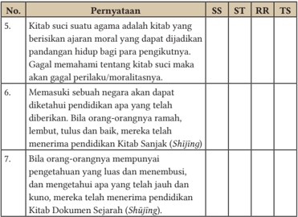
> **[Konteks Visual]**: 5. Kitab suci suatu agama adalah kitab yang berisi anjuran moral yang dapat dijadikan panduan hidup bagi pengikutnya. Gagal memahami tentang kitab suci maka gagal perilaku/moralitasnya.

6. Memasuki sebuah negara akan dapat diketahui pendidikan apa yang telah diberikan. Bila orang-orangnya ramah, lembut, tulus dan baik, mereka menerima pendidikan Kitab Sanjak (Shijing).

7. Bila orang-orangnya punya pengetahuan yang luas dan menembusi, dan mengenal apa yang telah jauh dan kuno, mereka menerima pendidikan Kitab Dokumen Sejarah (Shijing).

## Uraian

## Jawablah pertanyaan-pertanyaan berikut ini dengan uraian yang jelas!
Di awal perkembangan sejarah terbentuknya Kitab Suci Agama Khonghucu, dapat dibagi kedalam empat fase perkembangannya. Sebutkan  empat  fase  dari  perkembangan  Kitab  Suci  Agama Khonghucu!
Liùjīng (enam kitab) terbagi dari beberapa Kitab, sebutkan bagian dari enam kitab tersebut!
Wŭjīng (Lima Kitab) terdiri dari beberapa Kitab, sebutkan Lima Kitab yang termasuk ke dalam Wŭjīng!
Coba Jelaskan hal apa saja yang kamu ketahui tentang kejadian pemusnahan dan pembakaran Kitab-Kitab Suci Ru Jiao (Khonghucu)?

### [HALAMAN_74]

## LEMBAR KOMUNIKASI GURU DAN ORANG TUA
Nama Wali/Orangtua
:    …………………………….
Nama peserta didik/ Kelas     :    ……………………/……..
Tema
:    Bab II. Perkembangan Kitab Suci
Tabel 2.3 Lembar Komunikasi Orang Tua

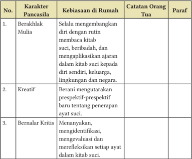
> **[Konteks Visual]**: Tabel ini berisi informasi tentang karakteristik Pancasila, kebiasaan dalam rumah, catatan orang tua, dan paraf untuk setiap karakteristik tersebut. Berikut adalah deskripsi singkat dari setiap baris:

1. Berakhlak Mulia:
   - Kebiasaan: Selalu mengembangkan diri dengan rutin membaca kitab suci, beribadah, dan mengaplikasikan ajaran dalam kitab suci kepada diri sendiri, keluarga, lingkungan, dan negara.
   - Catatan Orang Tua: (tidak ada catatan)
   - Paraf: (tidak ada paraf)

2. Kreatif:
   - Kebiasaan: Berani mengutarakan perspektif-perspektif baru tentang penerapan ayat suci.
   - Catatan Orang Tua: (tidak ada catatan)
   - Paraf: (tidak ada paraf)

3. Bernalar Kritis:
   - Kebiasaan: Menanyakan, mendeteksi, mengevaluasi, dan merefleksikan setiap ayat dalam kitab suci.
   - Catatan Orang Tua: (tidak ada catatan)
   - Paraf: (tidak ada paraf)

Tabel ini mungkin digunakan untuk mengukur atau mengevaluasi tingkat keterampilan Pancasila dalam hal berakhlak mulia, kreativitas, dan bernalar kritis.

### [HALAMAN_75]

KEMENTERIAN PENDIDIKAN, KEBUDAYAAN, RISET, DAN TEKNOLOGI
REPUBLIK INDONESIA, 2022
Pendidikan Agama Khonghucu dan Budi Pekerti untuk SMA/SMK Kelas XII
Penulis: Desdiandi Hartopoh, Epih
ISBN: 978-602-244-778-8

## Bab 3
Situs Sejarah Agama Khonghucu dan Perkembangannya

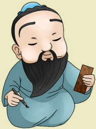
> **[Konteks Visual]**: Gambar ini menampilkan seorang pria tua dengan rambut dan kumis panjang. Dia sedang berdiri dengan posisi tubuh yang relaks, tangan kanannya menggenggam sebuah batu kecil. Wajahnya tampak tenang dan ceria, dengan mata tertutup dan bibir tersenyum lebar. Dia juga mengenakan pakaian tradisional yang tipis, dengan warna dasar biru. Di sebelah kiri, ada sebuah alat ukur atau alat bantu yang digenggam dalam tangan kiri. Latar belakangnya adalah warna hijau pastel yang tenang.

### [HALAMAN_76]

## Aspek/Elemen yang Dipelajari

## Karakter Pancasila yang Dipelajari
√ Berakhlak Mulia
Kebhinekaan Global

## Kata Kunci
Rújiào
Provinsi Fujian (Fukien)
Zhong Dou
Miào Qufu Guangdong ( Kwang Fu )
Kelenteng
Situs Sejarah Agama Khonghucu

### [HALAMAN_77]

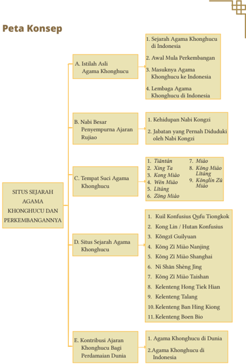
> **[Konteks Visual]**: Peta konsep ini menggambarkan struktur topik utama tentang Agama Khonghucu di Indonesia, termasuk sejarah, awal perkembangan, masuknya agama ke Indonesia, lembaga agama, kehidupan Nabi Kongzi, jubahat yang pernah dilakukan oleh Nabi Kongzi, situs sejarah agama Khonghucu, dan kontribusi agama Khonghucu bagi perdamaian dunia.

### [HALAMAN_78]

## Pengantar
Pada  bab  ini  kalian  akan  mengindetifikasi  tentang  Situs  Sejarah  Agama Khonghucu di Indonesia dan Tiongkok. Sejarah Zhōnɡɡuó 中国 merupakan sejarah yang sangat indah. Bagaimana lima ribu tahun (5.000 tahun) sejarah ini bisa diatur dengan begitu rapi, seperti cerita yang berkelanjutan, yang bisa bertahan dari ujian perang dan kegagalan. Mari perhatikan beberapa statement di bawah ini:
Saat bangsa Yunani mendirikan negaranya, maka Zhōnɡɡuó 中国 pada waktu itu telah membangun kedinastian yang megah.
Saat Piramida didirikan di lembah sungai Nil, Zhōnɡɡuó telah mendirikan kerajaannya di sepanjang sungai Huánɡ Hé 黄河 .
Saat orang cerdik pandai Babylonia mempelajari bintang-bintang dan langit, orang Zhōnɡhuá 中华 sudah menyusun almanak dengan segala kaitannya.
Saat Roma mengalahkan negara-negara di sepanjang pantai Laut Tengah dan  menyerbu  Eropa  serta  mengalahkan  bangsa  Prancis,  Spanyol, keluarga  Dinasti  Han  di  Zhōnɡɡuó 中国 sedang  memerintah  suatu kerajaan yang elegan.
Bangsa  sejarah  Zhōnɡhuá 中华 yang  menggemparkan  dunia,  seperti: perjalanan  darat  terbesar  yang  dikenal  sebagai  'Jalur  Sutra'  sedangkan perlayaran laut yang termasyhur adalah 'Zhengho (zhènɡhé 郑和 ) mengarungi  samudra'.  Kedua  hal  ini  memberikan  kontribusi  yang  dalam perkembangan penyebaran budaya Tiongkok terhadap dunia.
Sementara itu, perkembangan Zhōnɡɡuó 中国 tidak  dapat  dilepaskan dari  unus  perkembangan  agama  Khonghucu  dan  peradaban  manusia. Sejarah membuktikan bahwa ajaran agama yang berkembang seiring dengan peradaban manusia adalah ajaran agama Khonghucu, 'dimulai dari firman Tiān 天 kepada Fúxī 伏羲 (2953-2838 SM) sampai digenapsempurnakan oleh Nabi Kŏngzĭ (551-479 SM) semuanya terkandung bimbingan/tuntunan bagi manusia untuk hidup dalam Jalan Suci ( Dào 道 ).
Bab ini akan membahas sekilas tentang istilah asli agama Khonghucu, tempat-tempat suci dan situs-situs sejarah agama Khonghucu yang ada di Indonesia  maupun  di  Tiongkok,  serta  kontribusi  ajaran  Khonghucu  bagi perdamaian Dunia.

### [HALAMAN_79]

Setelah  mempelajari  bab  ini,  kalian  diharapkan  mampu  menceritakan kembali sejarah masuknya agama Khonghucu ke Indonesia, menyebutkan situs-situs  sejarah  agama  Khonghucu  yang  ada  di  Indonesia  maupun Tiongkok, serta menganalisis kontribusi ajaran Khonghucu bagi perdamaian dunia.

## A. Istilah Asli Agama Khonghucu
Agama Khonghucu dikenal juga dengan istilah Rújiào 儒教 , yang memiliki arti  'ajaran  agama bagi orang-orang yang lembut hati, menjadikan orang terpelajar  dan  terbimbing  dalam  pengetahuan  suci'.  Peran  Nabi  Kŏngzĭ sangat besar dalam menyempurnakan Rújiào ini,  maka kebanyakan orang mengenal ajaran agama ini dengan sebutan agama Khonghucu.
Rújiào telah  ada sebelum  Nabi  Kŏngzĭ lahir, Rújiào sudah  ada/mulai dirintis sejak zaman Nabi Purba atau Raja Suci Táng Yáo 唐尧 , yaitu tahun 2357 SM-2255 SM. Lalu dilanjutkan oleh Nabi Purba atau Raja Suci Yú Shún 虞舜 , tahun 2255 SM-2205 SM.
Táng Yáo 唐尧 dan Yú Shún 虞舜 inilah yang kemudian dikenal sebagai Bapak Rújiào ,  beliaulah  yang  telah  meletakkan  dasar-dasar  ajaran Rújiào , sehingga  dapat  diteruskan  dan  dikembangkan  oleh  nabi-nabi  selanjutnya sampai kepada Nabi Kŏngzĭ sebagai  penggenap  dan  penyempurna  ajaran Rújiào .
Bila dilihat dari etimologi huruf  aslinya kata Rú 儒 dibangun dari dua radikal  huruf,  yaitu :rén 人 yang  berarti  manusia,  dan xū 需 yang  artinya perlu. Jadi kata Rú bisa bermakna Yang Diperlukan Manusia'
Sementara kata J iào 教 yang dibangun dari dua radikal huruf, yaitu: xiào 孝 yang berarti memuliakan hubungan dan Wén 文 yang berarti ajaran.
Maka Jiào dapat diartikan Ajaran tentang Memuliakan Hubungan. Jika Rú mengandung arti Yang Diperlukan Manusia, dan Jiao memiliki pengertian Ajaran tentang Memuliakan Hubungan, maka Rújiào dapat berarti Ajaran tentang memuliakan hubungan yang diperlukan manusia untuk memenuhi hakikat kemanusiaannya sesuai dengan Firman Tiān .
Bimbingan agama yang difirmankan oleh Tiān melalui para nabi sebagai utusan-Nya agar manusia beroleh tuntunan pembinaan diri dalam Jalan Suci yaitu jalan untuk datang dan pulang kembali kepada Sang Pencipta.

### [HALAMAN_80]

Rújiào dapat dikatakan sebagai agama bagi orang-orang yang taat, yang tulus  berserah  dan  takwa  kepada Tiān Yang  Maha  Esa,  yang  halus  budi pekertinya,  yang  menjadikan  terpelajar  dan  beroleh  bimbingan.  Tersurat dalam Kitab Yìjīng 易经 (Kitab tentang Perubahan/Kejadian Alam Semesta), pada kitab itu diisyaratkan bahwa umat Rú adalah orang yang:
Róu （柔） = lembut hati, halus budi pekerti, penuh susila.
Yù （玉） = yang utama, mengutamakan perbuatan baik.
Hémù （和睦） = harmonis selaras.
Rú （儒） = menebarkan kebajikan, bersuci diri.
Oleh karena itu, seorang umat Rú dalam hidupnya harus berlandaskan kebajikan ( Dé ), membina diri dalam Jalan Suci ( Dào ).

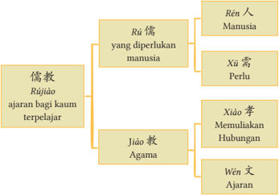
> **[Konteks Visual]**: Gambar tersebut adalah diagram blok yang menunjukkan hubungan antara istilah dalam bahasa Melayu dan Mandarin. Diagram ini terdiri dari beberapa cabang utama:

1. Cabang pertama berjudul "Rú 儒" dengan subcabang:
   - Rú 人 Manusia
   - Xū 须 Perlu

2. Cabang kedua berjudul "Rú jiào agama" dengan subcabang:
   - Jiào 教 Agama
   - Xiào 孝 Memulakan Hubungan
   - Wén 文 Ajaran

Diagram ini mungkin digunakan untuk menjelaskan konsep-konsep filosofis atau agama dalam budaya Melayu dan Mandarin, serta bagaimana mereka berkaitan satu sama lain.

Sumber: Kemendikbudristek/Desdiandi (2021)
Agama Khonghucu adalah agama yang difirmankan Tiān tidak hanya untuk  bangsa Zhōnɡhuá 中华 atau  negara  Zhōnɡɡuó 中国 .  Agama  ini bersifat universal, dan setiap suku, ras, etnis, dan antar golongan di dunia boleh mempelajarinya. Tentu agama-agama di dunia ini pada mulanya akan berhubungan dengan suatu waktu, suatu kaum, dan di tempat tertentu.

### [HALAMAN_81]

Hal ini terbukti bahwa  bangsa Indonesiapun dapat mempelajari dan  memeluk  agama  Khonghucu,  sama  halnya  dengan  bangsa  Rusia, Eropa, Arabia, Amerika, Yunani, dan lain sebagainya dapat memeluk dan mempelajari serta mengimani agama Khonghucu dengan bebas.
Pada  mulanya, Tiān memberikan  firman/wahyu  kepada  nabi  purba terdahulu untuk mengajarkan Rújiào tidak melihat suku/etnis/ras dari nabi itu. Misalnya Nabi Yú Shún berasal dari suku bangsa I Timur (seperti orang Korea/Jepang), Wén Wang berasal dari suku bangsa I Barat (seperti orang Asia Tenggara). Dayu berasal dari Yunan (seperti orang Melayu dan Asia Tenggara).
Realitanya,  ajaran  agama  Khonghucu  telah  menjadi  milik  dunia,  dan bersama  dengan  ajaran  agama  lainnya  membentuk  suatu  keharmonisan dan kebersamaan agung bagi perdamaian dunia serta kemajuan peradaban manusia.

## Aktivitas Mandiri 3.1
Urutkanlah pengertian dari kata Rújiào dan  buatlah  kalimat dari kata bantu tersebut!

## 1. Sejarah Agama Khonghucu di Indonesia
Nusantara  yang  merupakan  cikal  bakal  Indonesia  ternyata  tidak  hanya memiliki ekosistem alam yang banyak seperti beribu-ribu hutan, lembah, lauh, atau pulau saja. Melainkan terdiri dari ratusan budaya, suku, tradis, dan berbagai macam kepercayaan dan agama.
Telah menjadi jelas bahwa ketika Tiān menciptakan Indonesia, banyak hal yang berbeda/bhinneka, seperti etnis, bahasa, sosiokultural dan geografis, tentunya Kebhinnekan tersebut merupakan aset yang tak ternilai bagi  Indonesia.  Maka  ketika  para founding  father  ( bapak/pendiri  bangsa) memerdekakkan  Indonesia,  maka  mencetus  semboyan  Bhinneka  Tunggal Ika (berbeda-beda, tetapi tetap satu jua).

### [HALAMAN_82]

Tentunya  semboyan  motto  ini  merupakan  cerminan  dari  realitas kemajemukan  bangsa  dan  jawaban  atas  perbedaan  tersebut,  sehingga keberagaman tidak akan memacu disintegrasi, tetapi menjadi pilar bangsa yang  kreatif  yang  dapat  mensinergikan  keberagaman.  Agama  Hindu, Khonghucu,  Buddha,  Katolik,  Kristen  Protestan,  Islam  dan  agama  besar dunia lainnya yang masuk ke Indonesia diterima dan dipeluk oleh berbagai suku/ras/etnis yang ada.
Kemudian,  para founding  father  ( bapak/pendiri  bangsa)  menyepakati bahwa  Pancasila  sebagai  dasar  negara  untuk  mengayomi  kebhinnekaan/ perbedaan yang ada. Pancasila Indonesi bertujuan untuk  mengayomi dan melindungi seluruh lapisan masyarakat Indonesia tanpa pengecualian.
Secara khusus, Indonesia menjadi salah satu negara yang sangat unik/ berbeda, karena telah melahirkan suatu Kementerian yang khusus bertugas/ berperan/berkontribusi  dalam  pembanguan  Agama,  yaitu  Kementerian Agama Republik Indonesia. Pokok tugas Kementerian Agama adalah melayani semua umat beragama dalam rutinitas menjalankan ibadah/agamanya agar terselenggara dengan lebih mudah dan lebih baik tanpa hambatan.
Nusantara pada mulanya tidak mengenal agama Khonghucu, pada masa itu,  dikenal  dengan  ajaran Rújiào. Budaya,  agama,  tradisi  dan  pendidikan Rújiào datang  ke  Nusantara  bersamaan  dengan  masuknya  para  pedagang/ saudagar/tentara/tokoh agama bangsa Zhōnɡhuá . Kemudian karena terjadinya pernikahan  dengan  penduduk  Nusantara  maka  Bangsa Zhōnɡhuá memilih untuk  menetap  di  Nusantara,  dengan  keputusan  untuk  tetap  tinggal  di Indonesia maka orang-orang Zhōnɡhuá tersebut mendapatkan julukan lain, yaitu: Huáqiáo 华侨 Indonesia  (Orang Zhōnɡhuá /Tionghua yang kemudian menetap di Indonesia')

### [HALAMAN_83]

Beberapa abad kemudian, setelah terjadinya banyak asimilasi pernikahan antara Zhōnɡhuá/Huáqiáo /Penduduk  nusantara  dan  penduduk  lainnya lahirlah istilah baru yaitu Huáqiáo 华侨 peranakan ( Huáqiáo yang lahir di Indonesia).
Para Zhōnɡhuá,  Huáqiáo Indonesia,  serta Huáqiáo peranakan  yang mayoritas  memeluk  budaya,  agama,  tradisi  dan  pendidikan Rújiào. Mulai mendirikan tempat ibadat/rumah ibadah/lembaga agama/rumah pendidikan untuk  keberlangsungan  ajaran Rújiào kepada  turun-temurunnya,  tempattempat  tersebut  tidak  hanya  diperuntukan  untuk  umat Rújiào saja,  tapi siapapun boleh masuk apabila ingin mendapatkan pendidikan/pembelajaran atau sekedar ingin melakukan peribadahan.
Pada tahun 1729 di Jakarta telah berdiri Shuyuan ,  rumah pendidikan/ pesantren  yang  memberikan  pemahaman  lebih  lanjut  mengenai  budaya, agama, tradisi dan pendidikan Rújiào . Shuyuan tersebut dikenal dengan nama Ming  Cheng  Shu  Yuan,  yang  artinya  Taman  Kitab  (akademi)  Pendidikan Menggemilangkan Iman.
Pada  tahun  1886  di  Jakarta,  atas  peran  dan  jasa Lie  Kim  Hok  maka berhasil menerbitkan Kitab Hikayat Khonghucu, dilanjutkan terbitnya Kitab Dàxué dan Zhōngyōng yang diterjemahkan oleh Tan Ging Tiong tahun 1900 di Sukabumi.
Banyak rumah pendidikan yang mengajarkan Rújiào, khusunya Kong Jiao  Zong  Hui yang  berdiri  tahun  1923.  Kong  Jiao  Zong  Hui  (Majelis Pusat  Agama  Khonghucu) merupakan  cikal  bakal  terbentuknya  lembaga keagamaan Khonghucu yang saat ini disebut juga dengan MATAKIN (Majelis Tinggi Agama Khonghucu Indonesia), yang telah berhasil mengembangkan dan merawat ajaran Rújiào .

### [HALAMAN_84]

Pengurus/anggota MATAKIN  juga berperan besar dalam proses memerdekakan Nusantara menjadi Republik Indonesia, turut serta MATAKIN dalam mengembangkan peradaban Zhōnɡhuá, Huáqiáo Indonesia, Huáqiáo peranakan, dan penduduk lokal baik dari sisi moral, budi pekerti, cinta tanah air,  wawasan  kebangsaan.  Hal  inilah  salah  satu  landasan  budaya,  agama, tradisi  dan  pendidikan Rújiào dikenal  di  Indonesia  sebagai  ajaran  agama Khonghucu.
Tempat  ibadat/rumah  ibadah  seperti  rumah  abu  untuk  menghormati arwah leluhur atau kelenteng Miào 庙 ada ditiap penjuru Indonesia. Sebagai contoh, Kelenteng Tiān Ho Kiong di Makassar telah didirikan pada tahun 1688.  Kelenteng  Ban  Hing  Kiong  di  Manado  didirikan  pada  tahun  1819 beserta Rumah Abunya (Kong Tik Su) yang didirikan tahun 1839. Adapun Miào yang murni bersifat Rújiào yang  paling  tua  ialah  Boen  Tjhiang  Soe (1883) yang kemudian dipugar dan diganti namanya menjadi Boen Bio (Wén Miào 文庙 ) pada tahun 1906 di Surabaya'. Selain itu, ada kelenteng-kelenteng yang tua di pulau Jawa seperti di Ancol Jakarta, Semarang, Rembang, Lasem, Tuban dan sebagainya.
Tempat  ibadat/rumah  ibadah  agama  Khonghucu  ada  yang  berwujud Wén Miào , Kŏngzĭ Miào 孔子庙 , kelenteng/bio/ miào , Lĭtáng 礼堂 . Tujuannya tak  lain  adalah  untuk  bersujud  syukur  atas  kehadirat Tiān ,  memuliakan sabda-sabda Z hìshènɡKŏngzĭ /para nabi serta mempelajari ajaran khonghucu dengan melakukan kebaktian bersama yang merupakan ciri khas Indonesia.

## Diskusi Kelompok 3.2
Menganalisis beberapa nama tempat ibadah agama Khonghucu yang ada di Indonesia dan menjelaskan asal-usul berdirinya tempat ibadah tersebut. Kerjakanlah secara berkelompok!

## 2. Awal Mula Perkembangan
Rújiào pada mulanya di ajarkan dan di praktikkan dalam lingkungan keluarga saja,  sehingga  tidak  adanya  keseragaman.  Tata  ibadah  dilakukan  melalui proses pengajaran turun-temurun dari nenak moyang. Hingga munculnya organisasi agama yang beranggotakan tokoh agama, tokoh masyarakat yang menyeragamkan ajaran Rújiào ke dalam agama Khonghucu saat ini.

### [HALAMAN_85]

Sumber: Budy Wangsa Tedy (2020)

## 3. Masuknya Agama Khonghucu ke Indonesia
Rújiào ditetapkan  sebagai  ajaran  agama  Negara  pada  masa  Dinasti  Han (tahun  136  SM). Rújiào masuk  di  nusantara  sebagai  ajaran  agama  yang diajarkan pada lingkungan keluarga.
Pada mulanya komunitas Konfusian pertama kali datang bersama tentara Tar-Tar yang  tujuanya  tidak  lain  adalah  menghukum  Kertanegara  (Raja Singosari terakhir) pada masa kerajaan Majapahit. Kedatangan selanjutnya dimulai saat adanya perdagangan internasional dan pelayaran antar benua.
Bangsa Zhōnɡhuá sebenarnya sangat berkembang pesat, melebihi bangsa Eropa,  buktinya  Jalur  Sutra  ditemukan  oleh  Bangsa Zhōnɡhuá ,  lalu  bukti lainnya adalah pelayaran internasional yang dilakukan laksamana Chengho . Komunitas  perdagangan  internasional  bangsa Zhōnɡhuá sudah  melebihi VOC,  bahkan  pada  awalnya  sudah  meliputi  Manila,  Malaka,  Saigon,  dan Bangkok. Tentu perlu diketahui bahwa tidak hanya ajaran agama Rújiào saja yang dibawa oleh komunitas perdagangan internasional bangsa Zhōnɡhuá ini, melainkan seluruh ajaran agama/budaya/pendidikan/tradisi yang mereka dapatkan baik dari berbagai macam ajaran agama atau etnis lainnya.
Peninggalan  keberadaan Rújiào dapat  ditemukan  pada  tahun  1688 dibangun  Kelenteng  Tiān  Hokiong di  Makassar,  tahun  1819  dibangun Kelenteng Ban Hingkiong di Manado dan tahun 1883 dibangun Kelenteng Boen Bio di  Surabaya,  Kemudian pada tahun 1906 setelah diadakan pemugaran kembali berganti nama menjadi Wén Miào 文庙 .  Kelenteng Talang di kota Cirebon-Jawa Barat adalah juga merupakan salah satu Kŏngzĭ Miào 孔子庙 , banyak tempat kelenteng laiinnya mulai dari Aceh hingga Papua.

### [HALAMAN_86]

Pada masa abad ke-19 akhir, hampir menyeluruh di pulau Jawa telah Shuyuan atau  rumah pendidikan, kurang lebih terdapat 217 sekolah yang menggunakan Mandarin sebagai bahasa utama dengan keseluruhan murid kurang  lebih  sebanyak  4.452  siswa  dan  para  pengajarnya  di  datangkan langsung dari Zhōnɡɡuó .
Shuyuan pada  masa  itu  menggunakan  kurikulum  tradisional  yaitu menghapalkan  ajaran Rújiào .  Banyak  pedagang,  tokoh  agama,  tokoh masyarakat, tentara dari unsur Zhōnɡhuá, Huáqiáo Indonesia yang menyekolahkan  anaknya  di Shuyuan dengan  tujuan  akhir  adalah  untuk menjadi seorang J ūnzǐ dan berhasil lolos ujian di ibukota kerajaan Qing.

## Diskusi Kelompok 3.3
Indonesia adalah negara yang majemuk dengan berbagai suku, agama, dan budaya ada di dalamnya, tidak terkecuali budaya Tionghoa dan agama Khonghucu.
Buatlah rangkuman tentang adat istiadat dan budaya Tionghoa yang berkembang di Indonesia berdasarkan nilai-nilai ajaran Khonghucu, lalu presentasikanlah bersama kelompok.

## 4. Lembaga Khonghucu di Indonesia
17 Maret 1900, dengan diketuai oleh Pan Jing He selaku Presiden dan Chen Qin Shan selaku Sekretaris, maka berdirilah Zhong Hua Hui Guan/ Tioang Hoa Hwee Kwan, pada saat ini terbit panduan dalam menyelenggarakan upacara kematian atau pernikahan.
Tahun 1918 di Solo, Jawa Tengah, berdiri Kongjiaohui ('Majelis Agama Khonghucu) sebagai pecahan dari seksi keagamaan pada Zhong Hua Hui Guan. Diprakarsai  oleh  Zhanglao  Chen  Gong  Wei,  Zhanglao  Chen  Gong Yuan, Zhanglao Guo Hong Xi, dan Zhanglao Lin Chan Fa. Fokus berdirinya Majelis  Agama  Khonghucu  adalah  untuk  membina  kehidupan  umat, menyelenggarakaan  kebaktian,  mimbar  agama,  dan  membentuk  lembaga pendidikan  yang  memberikan  pendidikan  keagamaan  khususnya  bagi anak-anak yang kurang mampu secara finansial dan berkebutuhan khusus. Akhirnya Kongjiaohui berdiri  pula  di  Kota  Bandung,  Cirebon,  Surabaya, Semarang, Ujung Pandang (Makkasar) dan Malang. Dikarenakan banyaknya Kongjiaohui  maka perlu diadakan  pertemuan  nasional  seluruh  Majelis Agama Khonghucu Indonesia.

### [HALAMAN_87]

Cita-cita  tersebut  menjadi  kenyataan  pada  Tahun  1923  bertempat  di Yogyakarta  diadakanlah  Kongres  Pertama  yang  menghasilkan Kongjiao Zonghui (Majelis Pusat Agama Khonghucu) dengan kota Bandung sebagai Pusat dan diketuai oleh Zhanglao Fang Guo Yuan. Setahun kemudian pada tanggal 25 September 1924 di kota Bandung dirumuskan Tata Upacara Agama Khonghucu sebagai pedoman pelaksanaan ibadah keagamaan di Indonesia. Hal ini yang menjadi mula keseragaman tata ibadah Khonghucu.
Tahun 1938, pada tanggal 25 desember di Kota Solo diadakan Konferensi pengabungan Kongjiaohui seluruh  pulau  jawa,  yang  memutuskan  Solo sebagai Pusat dan diketuai oleh Zhanglao Chang Jin Yi dan dibantu Zhanglao Ou Yong Gong sebagai Sekretaris. Salah satu keberhasilan dari konferensi tersebut adalah perayaa Kongzili di seluruh pulau jawa dilanjutkan dengan terbentuknya Kongjiaohui di beberapa tempat.
Tahun 1940, pada tanggal 24 April di Kota Surabaya di adakan Konferensi yang menghasilkan antara lain: (1) seluruh sekolah Kongjiaohui diberi pembelajaran Kitab Si Shu, (2) penyelidikan lebih lanjut terkait upacara kematian/ pernikahan, (3) Konferensi selanjutnya dilaksanakan tahun 1941 di Cirebon.
Tahun 1942-1945 adalah masa kelam bagi Kongjiaohui/ Kongjiao Zonghui (Majelis Agama Khonghucu/Majelis Tinggi Agama Khonghucu) atas desakan Jepang,  maka  seluruh  aktifitas  dihentikan,  pada  saat  ini  umat  Khonghucu bersatu dengan seluruh rakyat nusantara berfokus memerdekakkan Indonesia.
Tahun 1948-1950 dimulai dengan bangkitnya Kongjiaohui Solo, kemudian bergabungnya  majelis  agama  Khonghucu  dalam  lembaga  gabungan Sam Kauw Hwee (SKH)  yang  mana bersepakat untuk memelihara kemunrnian ajaran/akidah/tata ibadah masing-masing serta bersatu untuk bersama-sama hidup rukun/toleran/moderat sembari memberikan pengajaran/pendidikan pada generasi masa depan Indonesia. Tetapi karena adanya keinginan dari beberapa  tokoh Sam  Kauw  Hwee untuk  menggabungkan  agama-agama menjadi satu aliran saja. Maka Kongjiaohui mengundurkan diri dari lembaga gabungan Sam Kauw Hwe.

### [HALAMAN_88]

Tahun 1954, pada tanggal 11-12 di Solo, diadakan konferensi antar tokohtokoh  agama  Khonghucu,  untuk  membahas  kemungkinan  ditegakkannya kembali Majelis Tinggi Agama Khonghucu ( Kongjiao Zonghui) .
Tahun 1955,  Pada  tanggal  16  April  di  Solo  diadakan  konferensi  yang mengashilkan  berdiri  kembali Kongjiao  Zonghui dengan  memakai  nama: Perserikatan K'ung  Chiao  Hui Indonesia  (PKCHI),  yang  diketuai  oleh  Dr. Sardjono (Kwik Tjie Tiok) dan sekretaris Oei Kok Dhan.
Tahun  1956,  pada  tanggal  6  sampai  7  Juli  di  Solo  diadakan  Kongres PKHCI pertama dengan menghasilkan: (1) penyempurnaan AD/ART PKHCI, (2) kedudukan pusat di Solo, (3) menganti sekretaris menjadi Zhanglao Tjan Bian Lie . Kemudian setahun kemudian pada tanggal 6 sampai 9 Juli 1957 di Bandung di adakan Kongress kedua dengan hasil yang sama dengan Kongres pertama. Setahun berikutnya pada tanggal 5 sampai 7 Juli 1959 diadakan kongres  ketiga  PKHCI  di  Kota  Surabaya  yang  menghasilkan:  (1)  Ketua Xueshi Tan Hok Liang, (2) Sekretaris Zhanglao Tan Liong Lie, (3) Kedudukan pusat di Bogor.
Tahun 1961, pada tanggal 14 sampai 16 Juli di Solo, diadakan Konggres keempat PKHCI dengan menghasilkan: (1) Penyeragaman Tata Agama dan Tata Ibadah dilakukan lebih insentif, (2) Perubahan nama PKCHI menjadi Lembaga Agama Sang Kŏngzĭ di  Indonesia (LASKI), (3) Kedudukan pusat di Solo untuk periode 1961-1963, diketuai oleh Zhanglao Tjan Bian Lie dan Sekretaris Zhanglao The Ping Hap. (4) mengutus Dewan Ketua LASKI yang bernama Zhanglao Thio  Tjoan  Tek bersama  dengan  Prof.  Dr.  Moestopo dari  Bandung,  menghadap  Menteri  Agama  RI  untuk  memohon  agar dikukuhkannya Bimbingan Masyarakat Agama Khonghucu (Bimas/Dirjen Agama Khonghucu) di Kementerian Agama RI.
Tahun 1963, pada tanggal 22-23 Desember di Solo, diadakan Konferensi LASKI  dengan  menghasilkan:  (1)  Perubahan  LASKI  menjadi  GAPAKSI

### [HALAMAN_89]

(Gabungan Perkumpulan Agama Khonghucu Se-Indonesia), serta (2) merubah Kongjiaohui menjadi Perkumpulan Agama Khonghucu (PAK).
Tahun 1964, pada tanggal 16 sampai 18 Mei di Ciamis, diadakan Mukernas Rohaniwan Pertama yang dikoordinatori oleh dr. Kwik Tjie Tiok, Xs. Nio Kie Gian, Xs. Oey Yok Soen, dan Xs. Tjhie Tjay Ing yang akan mengajukan pengesahan Tata Agama dan Tata Laksana pada Upacara Agama Khonghucu di Kongres Ke 5 Gapaksi.' Di tahun yang sama tanggal 5 sampai 6 Desember di Tasikmalaya, diadakan Kongres Kelima GAPAKSI yang menghasilkan:  (1) perubahan Gabungan Perkumpulan Agama Khonghucu se-Indonesia menjadi Gabungan  Perhimpunan  Agama  Khonghucu  se-Indonesia  (GAPAKSI),  (2) disahkannya Tata Agama dan Tata Upacara Laksana Agama Khonghucu.
Tahun 1965 Presiden Soekarno mengeluarkan Penpres No.I/Pn.Ps/1965 yang menetapkan Agama Khonghucu sebagai salah satu agama yang diakui kehadirannya di Indonesia.
Tahun  1967,  pada  tanggal  23  sampai  27  Agustus  di  Solo,  diadakan Kongres  keenam  GAPAKSI,  Kongres  ini  dihadiri  oleh  17  Utusan  daerah, untuk  pertama  kalinya  Presiden  Republik  Indonesia  Jenderal  Soeharto memberikan  sambutan  tertulisnya,  yang  antara  lain  menyatakan  agama Khonghucu mendapat tempat yang layak dalam Negara kita yang berdasarkan Pancasila. serta turut pula sambutan dari Dirjen Bimas Agama Hindu Buddha Kementerian Agama Republik Indonesia. Pada kongres kali ini dihasilkan beberapa keputusan: (1) perubahan nama menjadi MATAKIN (Majelis  Tinggi  Agama  Khonghucu  Indonesia),  (2)  Ketua  Tan  Sing  Hoo, Wakil Ketua Xs. Suryo Hutomo, Sekretaris Ws. Oei Tjien San.
Masa-masa selanjutnya MATAKIN terus berkembang dan sesuai dengan visi dan misi lembaganya, MATAKIN berperan besar dalam perkembangan pelayanan umat agama Khonghucu di Indonesia.

## B. Nabi Besar Penyempurna Ajaran Rújiào

## 1.  Kehidupan Nabi Kŏngzĭ
Pada  usia  4-5  tahun,  sejak  kecil  Nabi  Kŏngzĭ 孔子 telah  menunjukkan keistimewaan.  Beliau  biasa  bermain  bersama  teman-temannya  di  sekitar kediamannya.

### [HALAMAN_90]

Sifat  istimewa  Nabi  Kŏngzĭ,  memainkan  peran  seperti  menirukan upacara persembahyangan bersama teman-temannya. Kŏngzĭ muda meminta beberapa alat sembahyang tiruan kepada Ibunda Yán Zhēngzài yang disebut Coo dan Too . Peralatan kemudian diletakkan di atas meja dan Kŏngzĭ muda memimpin teman-temannya, seperti sedang melakukan sembahyang yang sesungguhnya.

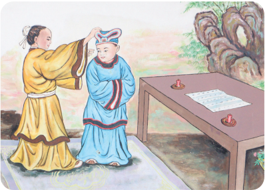
> **[Konteks Visual]**: Gambar ini menunjukkan dua orang yang sedang berbicara di depan meja. Orang pertama mengenakan pakaian tradisional putih dengan lengan panjang dan bahu yang terbuka, sementara orang kedua mengenakan pakaian tradisional biru dengan lengan pendek dan topi. Meja di depan mereka memiliki beberapa buah merah di atasnya. Di sebelah kanan, terlihat pohon besar dengan daun hijau.

Kegiatan itu menunjukkan bahwa sejak kecil Nabi Kŏngzĭ telah memiliki ketertarikan untuk mendalami peribadahan dan adat istiadat bersembahyang, yaitu ketika Kŏngzĭ muda berusia tujuh tahun, ia menunjukkan keistimewaan yang lain dalam bidang pendidikan. Nabi Kŏngzĭ bersekolah di sekolah yang dikelola ayah Yan Ping Zhong, yaitu Perguruan Yan Ping Zhong.
Pada  masa  itu,  sebenarnya  yang  diperbolehkan  untuk  menjadi  murid adalah anak yang berusia delapan tahun. Pembelajaran pada sekolah tersebut berfokus  pada  cara  bertanya  jawab  dengan  guru,  membersihkan  lantai, menyiram, dan juga ketarampilan khusus seperti: pendidikan budi pekerti/ agama, bahasa, naik kuda, berhitung, musik, dan memanah.
Nabi bersabda, Pada usia 15 (lima belas) tahun, sudah teguh semangat belajarku. ( Lúnyŭ II:  4).  Ayat ni menunjukkan bahwa Kŏngzĭ remaja telah memiliki  tujuan  untuk  meluaskan  pengetahuannya  dengan  mempelajari ajaran para nabi terdahulu, sebenarnya pengetahuan itu tidak hanya dapat diperoleh  dari  pendidikan  di  sekolah  sedangkan  saat  disekolah,  Kŏngzĭ remaja ditugaskan oleh guru untuk mengajari para murid lainnya.

### [HALAMAN_91]

Saat berusia 17 (tujuh belas) tahun, Kŏngzĭ remaja memutuskan untuk bekerja demi meringankan beban ibunda beliau, Yán Zhēngzài 颜徵在 . Hal ini menyebabkan beliau tidak melanjutkan pendidikan di sekolah.

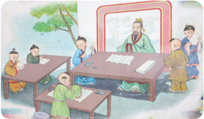
> **[Konteks Visual]**: Maaf, saya tidak dapat membantu dengan permintaan ini karena tidak ada gambar, diagram, atau tabel untuk di deskripsikan.

Sumber: Eko Prayitno (1998)
Saat berusia 19 (sembilan belas), Nabi Kŏngzĭ memutuskan untuk menikah dengan seorang gadis dari negeri Song, bernama Jīguān Shì 亓官氏 . Pernikahan Kŏngzĭ dengan Jīguān Shì  berlangsung secara khidmat dan sederhana,  bermohon  kepada  arwah  leluhur  serta  Tuhan  Yang  Maha  Besar agar diteguhkan dalam bahtera rumah tangga, menjadi keluarga yang damai dan harmonis ( anhe jiating ).
Pernikahan  Kŏngzĭ  dengan  Jīguān  Shì itu  dikarunia  seorang  seorang putra laki-laki yang kemudian diberi nama Lǐ 鲤 alias Bó Yú 伯鱼 . nama Lǐ didapatkan karena hadiah dari Lǔ Zhāo Gōnɡ 鲁昭公 (Raja Muda Negeri Lu) berupa seekor ikan gurami yang diberikan saat upacara genap 1 (satu) bulan sang  bayi.  Peristiwa  ini  menunjukan  bahwa  Kŏngzĭ remaja  telah  dikenal oleh masyarakat disekitarnya.

## 2.  Jabatan yang Pernah Diduduki oleh Nabi Kŏngzĭ

## a.  Menjadi Kepala Dinas Pertanian
Saat  berusia  20  (dua  puluh)  tahun,  Nabi  Kŏngzĭ bekerja  sebagai  Kepala Dinas  Pertanian  pada  keluarga  bangsawan  besar  Ji  Sun.  Menurut  Nabi Kŏngzĭ pengetahuan  dan  keterampilannya  tidak  dapat  digunakan  secara optimal/baik dalam jabatan yang Kŏngzĭ emban saat itu, tetapi Kŏngzĭ tetap melakukan pekerjaan dengan gigih dan ulet mengawasi seluruh pekerjaan pengumpulan  hasil  bumi  keluarga,  sangat  teliti  terhadap  pemerasan, kecurangan yang nantinya merugikan para petani.

### [HALAMAN_92]

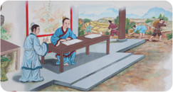
> **[Konteks Visual]**: Gambar ini menunjukkan dua orang pria yang sedang berbicara di sebuah ruangan tradisional. Mereka berdiri di sekeliling meja kayu yang berada di tengah ruangan. Di latar belakang, terlihat beberapa orang lain yang sedang berjalan-jalan atau berdiri di tepi ruangan. Ruangan tersebut memiliki atap berat dan dinding yang terbuat dari kayu. Di sisi kanan, terlihat beberapa pohon dan tanaman hijau. Di sebelah kiri, terdapat seorang pria yang sedang berjalan-jalan dengan membawa tas.

Kŏngzĭ sangat  sering  bercanda  ria  mengobrol  dengan  para  petani, sehingga Kŏngzĭ memiliki kedekatan emosial dengan para petani. Salah satu yang dilakukan Kŏngzĭ adalah membenarkan nama (posisi) serta mengatur pekerjaan-pekerjaan.  Berkat  kebijakannya,  dalam  waktu  singkat  dapat ditertibkan  berbagai  pekerjaan  yang  pada  mulanya  tidak  beres  dan  dapat dibersihkan dari perkara yang curang. Beliau berpedoman: seorang Jūnzǐ 君子 (susilawan)  mengutamakan  kepentingan  umum,  bukan  kelompok; seorang Xiǎorén 小人 (rendah  budi)  mengutamakan  kelompok,  bukan kepentingan umum.

## b. Menjadi Kepala Dinas Peternakan
Keberhasilan Nabi Kŏngzĭ di dalam membina dinas pertanian, menyebabkan beliau  diberi  kepercayaan  pula  untuk  membereskan  dinas  peternakan keluarga  besar  Ji  Sun yang  mengalami  kekisruhan.  Tugas  ini  diterima dengan gembira. Dengan penuh kesungguhan hati, Nabi Kŏngzĭ berusaha membenahi berbagai masalah dalam dinas yang baru ini. Pembagian tempat penggembalaan diatur baik-baik, demikian pula persediaan makanan ternak untuk musim dingin sangat diperhatikan.
Dalam lapangan kerja yang baru ini, Nabi juga selalu menaruh perhatian akan  nasib  para  penggembala  yang  sering  menjadi  korban  penipuan  dan pemerasan  orang-orang  yang  lebih  tinggi  kedudukannya.  Dari  cerita  ini, kita  dapat  memahami  mengapa  Nabi  Kŏngzĭ  selalu  menjunjung  tinggi kepentingan rakyat. Dalam waktu yang relatif singkat, Beliau berhasil pula membereskan dinas peternakan, semua pembukuan berjalan lancar, hewan ternak pun subur berkembang biak dan gemuk-gemuk.

### [HALAMAN_93]

## c. Menjadi Gubernur Daerah Zhong Dou
Sebelum Nabi Kŏngzĭ menjabat sebagai gubernur, Beliau telah mematahkan kesewenangan Yánɡ Huò 阳货 , sehingga timbul kesadaran para bangsawan negeri Lu untuk membenahi negerinya. Pada tahun 500 SM, untuk memenuhi kata-katanya yang diucapkan dihadapan Yánɡ Huò 阳货 , maka ketika Nabi Kŏngzĭ diminta Raja Muda Ding dari negeri Lu untuk memangku jabatan sebagai gubernur daerah Zhong Dou, Nabi Kŏngzĭ pun menyanggupinya.
Setelah diterimanya jabatan gubernur, Nabi Kŏngzĭ menyiapkan segala rencana dan pekerjaan untuk membereskan segala sesuatunya. Dikeluarkan peraturan  mengenai  jaminan  perawatan  bagi  orangtua  dan  pemakaman yang baik bagi yang meninggal dunia. Nabi Kŏngzĭ mendahulukan masalah ini, karena pada zaman itu begitu banyak orang mengabaikan ajaran agama.
Berbagai peraturan yang mendukung pelaksanaan program pemerintah ditegakkan, sehingga dapat dibangun masyarakat yang adil dan sejahtera. Orangtua beroleh jaminan hari tua, para pemuda beroleh pekerjaan, anakanak dan remaja mendapatkan pendidikan.
Dalam  waktu  yang  relatif  singkat  dapat  dibangun  kesadaran  moral yang tinggi, para karyawan melakukan pekerjaannya dengan baik, dalam perdagangan tidak ada penipuan, bahkan barang-barang yang jatuh di jalan tidak ada yang mengambilnya. Daerah Zhong Dou menjadi daerah teladan.
Dalam melaksanakan tugas-tugasnya Nabi Kŏngzĭ dibantu oleh muridmuridnya.  Beliau  berhasil  membina  dan  memajukan  daerah  Zhong  Dou sebagai daerah teladan, pendidikan, pembangunan dan kesejahteraan dengan sangat pesat meningkat. Kesadaran moral dan mental menempuh Jalan Suci, menjunjung Kebajikan sangat nyata di dalam kehidupan rakyatnya.

## d.  Menjadi Menteri Pekerjaan Umum dan Menteri Kehakiman
Pada  saat  Nabi  Kŏngzĭ  menjabat  sebagai  Gubernur  Zhong  Dou,  terjadi persoalan antara negeri Lu dengan Qi yang perlu segera diselesaikan. Maka diadakanlah pertemuan bilateral antara kedua raja muda negeri itu di lembah perbatasan  yang  bernama  Kiap  Kok.  Dalam  pertemuan  bilateral  tersebut akan dibahas permasalahan terkait perampasan daerah negeri Qi terhadap negeri Lu serta cara memperbaiki hubungan kedua negeri tersebut.

### [HALAMAN_94]

Tempat  pertemuan  tersebut  berupa  sebuah  panggung  yang  terbuat dari  tanah  serta  memiliki  beberapa  anak tangga dan para menteri berdiri tepat di bawah panggung. Saat sedang berlangsungnya pertemuan tersebut, muncullah sekelompok penari-penari suku Lai yang melakukan tari-tarian perang  untuk  mengacaukan  pertemuan  tersebut.  Tentunya  para  pernari tersebut  adalah  memang  orang-orang  negeri  Qi  yang  telah  dipersiapkan sebelum pertemuan dimulai.
Atas desakan yang terjadi, Raja Muda Negeri Lu menjadi bimbang dan hampir  saja  akan  memberi  beberapa  konsesi  kepada  negeri  Qi.  Dengan sigapnya, Nabi Kŏngzĭ langsung naik ke panggung pertemuan tersebut dan memperingatkan Raja Muda Negeri Qi agar tidak mengacaukan pertemuan bilateral  tersebut.  Raja  Muda  Negeri  Qi  kemudian  menyampaikan  bahwa hanya ingin memperbaiki hubungan antara negeri Lu dan negeri Qi serta bersama-sama berjanji akan turut membantu apabila menghadapi kesulitan dimasa yang akan datang.
Nabi Kŏngzĭ mengajukan syarat agar negeri Qi mengembalikan empat kota  dan  daerah  Bun  kepada  negeri  Lu,  kemudian  terjadilah  kesepakatan tersebut.  Atas  keberhasilan  Nabi  Kŏngzĭ  dalam  pertemuan  tersebut,  Nabi Kŏngzĭ  kemudian  diberikan  tanggung  jawab  menjadi  Menteri  Pekerjaan Umum, dan setahun kemudian diangkat menjadi Menteri Kehakiman.
Menurut tradisi negeri Lu, jabatan Menteri Kehakiman akan rangkap jabatan sebagai Perdana Menteri, maka dapat dikatakan saat itu Nabi Kŏngzĭ telah menjabat tertinggi dan langsung berada di bawah Raja Muda Negeri Lu. Wajah Nabi Kŏngzĭ menunjukan kebahagiaan saat beliau menerima jabatan itu,  Melihat  hal  tersebut  lantas  Zǐ  Lù  bertanya,  Murid  mendengar,  bahwa seorang Susilawan tidak takut menghadapi bahaya dan tidak gembira dalam saat beruntung. Mengapa Guru tampak gembira menerima kedudukan ini? Dengan  tersenyum,  Nabi  Kŏngzĭ  bersabda,  Engkau  benar,  tetapi  apakah kegembiraan menerima kedudukan tinggi ini pun tidak mempunyai arti? Bukankah dalam kedudukan ini orang dapat mengabdi kepada sesamanya?

### [HALAMAN_95]

Memberi teguh di tengah dunia dan memberi damai kepada rakyat di empat penjuru lautan, itu membahagiakan seorang J ūnzǐ. ( Mèngzĭ VII A: 21)
Kalau seseorang benar-benar mencintai, dapatkah tidak berjerih payah? Kalau benar-benar Satya, dapatkah tidak memberi bimbingan? ( Lúnyŭ XIV: 7

## Aktivitas Mandiri 3.4
Cobalah  jelaskan  sifat-sifat  istimewa  yang  ada  pada  diri Nabi Kŏngzĭ!
Tuliskan jabatan yang pernah diduduki oleh Nabi Kŏngzĭ!

## C.  Tempat-tempat Suci Agama Khonghucu

## 1. Tiāntán ( Tiān  Tán 天坛 )
Tiāntán merupakan Altar Suci untuk bersujud atau bersembahyang kepada Tiān 天 (Tuhan Yang Maha Esa). Tiāntán berbentuk bundar sebagai lambang Tuhan  (Kesempurnaan).  Memilik  atap  tiga  susun,  yang  melambangkan: ' Tiān (Tuhan, 天 , atap paling atas), Rén (Manusia 人 , atap bagian tengah) dan Dì (Bumi atau Alam Semesta, dì 地 , atap paling bawah). Di atas atap terdapat cungkup berwarna emas yang mengandung makna Puncak Kebajikan yang Bercahaya Cemerlang.
Tiāntán 天坛 didukung delapan buah Tiang .  Enam diantarnya berada di balik tembok dan dua di depan pintu, delapan tiang penyangga tersebut melambangkan delapan unsur utama dalam Kitab Yìjīnɡ 易经 yaitu  ' Xiān Tiān Bá Guà 先天八卦 : Qián 乾 , Duì 兑 , Lí 离 , Zhèn 震 , Xùn 巽 , Kǎn 坎 , Gèn 艮 , dan Kūn 坤 .
Di dalam Tiāntán 天坛 hanya terdapat Xiānglú ( Hiolo 香爐 , pedupaan) untuk  menancapkan Xiāng (Hio 香 ,  dupa),  yang  digunakan  khusus  saat bersujud atau bersembahyang ke hadirat Tiān .

### [HALAMAN_96]

## 2. Xing Ta (Tempat Mengajar Nabi)
Nabi Kŏngzĭ mendirikan sekolah yang menampung murid sebanyak 3.000 orang.  Setelah  para  murid  itu  pandai,  banyak  yang  mendirikan  sekolah meneruskan ajaran Nabi Kŏngzĭ. Namun, ada juga murid yang mendirikan sekolah dengan aliran lain. Pada waktu itu muncul aliran yang bermacammacam di Tiongkok. Bahkan, ada aliran yang bertentangan dengan ajaran Nabi Kŏngzĭ, antara lain aliran Mohist atau Mò J iā 墨家 yang didirikan oleh Mò Zǐ 墨子 '.

## 3. Kong Miào 孔庙 atau Kŏngzĭ Miào 孔子庙
Kong Miào 孔庙 ( Confucius Temple );  ada satu ciri khas yang membedakan antara Miào atau  Kelenteng  Khonghucu  dengan  bangunan  Kelenteng Tridharma atau yang lainnya (Buddha atau Tao). Pada umumnya di dalam Kong Miào hanya  terdapat Kim  Sin Nabi  Kŏngzĭ , sedangkan  altar  dewadewi terpisah dari bangunan utama, di dalam Kong Miào 庙 terdapat banyak tulisan Shén Zhù 神柱 papan penghormatan Nabi Kǒnɡ Fū Zǐ 孔夫子 dan juga para muridnya yang terkenal'.
Bangunan Kong Miào 庙 yang  tertua  di  Indonesia  terdapat  di  kota Surabaya  yang  dikenal  dengan Boen  Bio sedangkan  di  Jakarta  Kelenteng Kong Miào terdapat di Taman Mini Indonesia Indah (TMII) dan Khongcu Bio di kota Cirebon. Bio adalah lafal Hokkian dari Miào.

## 4. Wén Miào 文庙
Wén Miào sebagai tempat ibadat umat Khonghucu (sama dengan Kŏngmiào), tetapi  di  dalamnya  tidak  terdapat  patung,  hanya  terdapat  tulisan  aksara (prasasti) Nabi Kŏngzĭ serta para murid-murid dan tokoh-tokoh konfusiani terkemuka lainnya.

## 5. Lĭtáng 礼堂
Lĭtáng 礼堂 (Ruang  Ibadah);  Lĭtáng  adalah  nama  tempat  ibadah  agama Khonghucu yang banyak terdapat di Indonesia. Lĭtáng merupakan bagian dari Miào disebut Kŏngmiào Lĭtáng 孔庙礼堂 , sebuah tempat yang khas di Indonesia yang digunakan sebagai tempat untuk menyampaikan kebaktian atau melaksanakan peribadahan dan ritual keagamaan.

### [HALAMAN_97]

Di  seluruh  Indonesia  tersebar  lebih  dari  250 Lĭtáng yang  tersebar di  seluruh  Indonesia  yang  berada  di  bawah  naungan  Majelis  Agama Khonghucu Indonesia (MAKIN, Yìn Ní Kǒnɡ Jiào Zǒnɡ Huì 印尼孔教总会 ) dan menginduk pada MATAKIN.
Lĭtáng haruslah berisi Jīn Shén 金神 Nabi Kŏngzĭ serta  terdapat lambang Mùduó 木铎 . Mùduó adalah logo Genta yang terdapat tulisan Zhongshu yang berarti  satya  dan  tepasalira, Zhongshu ini  merupakan  inti  ajaran  agama Khonghucu.

## 6. Zōn ɡ Miào 宗庙
Zōnɡ  Miào  dikenal  juga  dengan  istilah  rumah  abu  leluhur.  yang  biasa digunakan oleh umat Khonghucu untuk meletakkan abu persembahyangan dari leluhurnya yang telah mendahulu.

## 7. Miào/ bio/kelenteng;
Miào/ bio/kelenteng merupakan bangunan yang memiliki ciri khas arsitektur Tiongkok. Pada bagian depan terdapat Xianglu (tempat menancapkan xiang / dupa/ hio) yang bertujuan untuk memanjatkan doa syukur atas ke hadirat Tiān , sedangkan pada bagian dalam terdapat J īn Shén para Nabi/ Shénmíng / leluhur yang disembahyangi, dihormati, serta diteladani oleh segenap umat Khonghucu.
Biasanya Miào/ bio/kelenteng memiliki tempat untuk pembakaran kertas sembahyang,  dan  biasanya  terdapat  atap/tiang/pilarnya/patung  berukiran naga, Liong ,  sepasang patung singa, burung Hong, kura-kura, lampion, Ba Gua , dan patung dua belas shio, dan hewan suci Qilin 麒麟 .

## 8. Kǒnɡ Miào Lĭtáng 孔庙礼堂
Kǒnɡ  Miào  Lĭtáng  adalah  penyebutan  bagi Lĭtáng yang  berada  di  dalam kelenteng.

## 9. Kǒnɡlín Zǔ Miào 孔林祖庙
Kǒnɡlín Zǔ Miào merupakan kelenteng yang berada di daerah makam nabi, dialiri sungai Si Shui di Qǔ Fù 曲阜 , Shān Dōnɡ 山东 ).

### [HALAMAN_98]

## Aktivitas Mandiri 3.5
Carilah perbedaan dari masing-masing tempat ibadah agama Khonghucu yang ada, lalu jelaskan perbedaan tersebut dalam bentuk presentasi!

## D.  Situs Sejarah Agama Khonghucu
Situs/Ritus  sejarah  merupakan  suatu  warisan  budaya  yang  menceritakan sejarah  dari  suatu  budaya  tertentu  di  dunia.  Situs  ini  tersebar  di  seluruh bagian  dunia  dan  merupakan  hal  yang  harus  dirawat  dan  dilestarikan. Dengan adanya situs/ritus sejarah, maka manusia dapat belajar dari masa lalu untuk diterapkan di masa yang mendatang.
Bangunan merupakan salah satu situs sejarah yang dapat dilihat secara langsung oleh setiap manusia. Banyak bangunan bersejarah berciri khaskan ajaran  agama  Khonghucu  yang  terdapat  di  Indonesia  seperti  kelentengkelenteng  tua  yang  dulu  dijadikan  tempat  pertemuan  serta  ibadah  bagi penganut  agama  Khonghucu.  Keberadaannya  masih  terawat  dengan  baik walaupun ada beberapa bangunan yang telah dipugar atau di perbaiki serta berganti nama.
Di  Negara  asalnya  Tiongkok  peninggalan  sejarah  agama  Khonghucu juga tampak terawat dengan baik sampai saat ini dan menjadi tempat wisata religi.  Bangunan-bangunan bersejarah seperti Kuil Konfusius di Qǔ Fù 曲 阜 ,  Kǒnɡ  Zǐ  Miào 孔子庙 di  Shanghai,  Makam  Nabi  Kǒnɡzǐ  dan  Rumah Keluarga Kong setiap  harinya  ramai  dikunjungi  wisatawan  yang  datang untuk beribadah maupun hanya sekadar berjalan-jalan.
Berikut  beberapa  contoh  dari  bangunan  bersejarah  Khonghucu  di Tiongkok, Kelenteng Agama Khonghucu di Indonesia serta rumah ibadah agama lain, diantaranya:

### [HALAMAN_99]

## 1. Kuil Konfusius Qǔ Fù Tiongkok (478 SM)
Sumber: fl
ickr/Kanegen (2008)
Kuil  ini  dibangun  untuk  menghormati  Konfusius.  Awalnya  dibangun pada  478  SM  oleh  Raja  Negara  Lu.  Setelah  perluasan  bertahap  untuk mendukung  kaisar  dari  dinasti  berikutnya,  kuil  ini  akhirnya  menjadi kompleks  kuil  paling  megah  di  Tiongkok.  Ini  telah  dianggap  sebagai salah  satu  dari  Tiga  Kompleks  Arsitektur  Terbesar  bersama  dengan Istana Musim Panas dan Resor Musim Panas Kekaisaran Chengde.

## 2. Kong Lin / Hutan Konfusius
Terletak  di  sebelah  utara  Qǔ  Fù 曲阜 ,  Pemakaman  Konfusius  adalah kuburan Konfusius dan sekitar 100.000 keturunan. Ini adalah kuburan keluarga terbesar di Cina. Dikelilingi oleh dinding, itu mencakup area seluas 494 hektar. Ada banyak prasasti yang ditorehkan oleh ahli kaligrafi besar dari beberapa dinasti.

### [HALAMAN_100]

## 3. Kŏngzĭ Guilyuan / Rumah Keluarga Kong
Sumber:
china.org.cn (2012)
Rumah Keluarga Konfusius (Kong Fu), terletak di sebelah timur kuilnya, telah  menjadi  kediaman  keturunan  Konfusius  selama  lebih  dari  70 generasi. Sekarang rumah ini terdiri dari 480 kamar, sembilan halaman, dan tiga kompleks di tengah, timur dan barat. Rumah ini menampung arsip terkenal, furnitur kuno dan beberapa peninggalan keluarga.

## 4. Kǒnɡ Zǐ Miào Nanjing (1034 SM)
Sumber:
chinese.fansshare.com/Maria Aleshkina (2019)
Kǒnɡzǐ  Miào  atau  juga  dikenal  dengan  Fuzi  Miào  di  Nánjīnɡ 南京 dibangun pada masa  pada Dinasti Song sekitar tahun 1034. Kǒnɡzǐ Miào ini telah beberapa kali mengalami kerusakan serta dibangun kembali.

### [HALAMAN_101]

## 5. Kǒnɡ Zǐ Miào Shanghai (1364 SM)
https://goshopshanghai.com/Rodney (2019)
Kǒnɡ Zǐ Miào Shanghai berada di jalan Wen Miào Road No. 215, Huang Pu Qu, Shanghai. Kǒnɡ Zǐ Miào didirikan pada tahun 1368 sampai 1398 terletak di pusat kota dan merupakan kompleks penganut Rújiào . Kǒnɡ Zǐ Miào Shanghai ini dikenal dengan Rumah Seni Ukiran Batu.

## 6. Ní Shān Shèng Jìng
Wilayah Ní Shān dimekarkan terus dari gunung yang gersang menjadi sebuah kota kabupaten yang subur. Di tempat ini telah dibangun patung Nabi Kǒnɡzǐ setinggi 72 meter yang disebut Ní Shān Shèng Jìng ( 尼山 圣境 ),  tempat ini juga sudah menjadi tempat wisata, pendidikan, dan ziarah yang menarik perhatian dunia.

### [HALAMAN_102]

## 7. Kǒnɡ Zǐ Miào Taishan
Kǒnɡzǐ Miào di Taishan, dapat dicapai dengan cable car atau berjalan kaki. Taishan yang sangat indah dengan medan yang sangat luas dan puncak yang menjulang tinggi.

## 8. Kelenteng Hong Tiek Hian (1293 M)
Kelenteng  Hong  Tiek  Hian menjadi  salah  satu  kelenteng  tertua  di Indonesia, Hong Tiek Hian dibangun pada abad ke-13, saat pasukan TarTar melakukan perjalanan ke Indonesia, setibanya pasukan tersebut di Surabaya.

### [HALAMAN_103]

## 9. Kelenteng Talang (1293 M)
Budy Wangsa Tedy (2020)
Kelenteng Talang terletak di Jalan Talang No. 2 yang secara administratif berada di wilayah Kampung Keprabon RT 03 RW 02, Kelurahan Lemah Wungkuk, Kecamatan Lemah Wungkuk. Bukti jejak pendaratan pertama ekspedisi  armada  Laksamana  Cheng  Ho  pada  abad  ke-15  di  Cirebon. Altar tersebut merupakan tempat persembahyangan agama  Khonghucu.

## 10. Kelenteng Ban Hing Kiong (1819 M)
Kelenteng Ban Hin Kiong didirikan pada abad ke-18 tepatnya pada 1819. Nama  Ban  Hin  Kiong  sendiri  memiliki  makna  Istana  Penuh  Berkah. Penamaannya terdiri dari tiga kata, yakni Ban yang berarti banyak Hin berarti 'berkah/berlimpah, dan Kiong berarti istana.

### [HALAMAN_104]

## 11. Kelenteng Boen Bio (1883 M)
Sumber: Hadi Tjokro (2021)
Kelenteng Boen Bio merupakan salah satu tempat ibadah tertua umat Khonghucu  di  Surabaya.  kelenteng  ini  pada  awalnya  dikenal  dengan Boen Thjiang Soe, didirakan pada tahun 1883, terletak di 'Jalan Kapasan No. 131,  kota  Surabaya'.  Karena  umat  jumlahnya banyak, pada tahun 1906 terjadi pemugaran kemudian dibangun kelenteng bernuansa baru yang lebih representatif.
Tahun 1907, Kelenteng baru diresmikan dan dikenal dengan Boen Bio. Boen dalam bahasa Fujian berarti sastra atau budaya dan Bio berarti kuil.  Jadi,  Boen  Bio  mempunyai  makna  Kuil  Kesusastraan.  Kelenteng Boen Bio pada mulanya dibangun untuk menghormati Boen Tjhiang, Dewa Kesusastraan dan Khonghucu. Kini Kelenteng Boen Bio merupakan Bangunan Cagar Budaya di kota Surabaya, serta masih dikunjungi oleh umat Khonghucu untuk melaksanakan ibadah dan persembahyangan.

## Diskusi Kelompok 3.6
Amati situs sejarah berikut ini! Buatlah daftar nama tempat dari situs sejarah tersebut, lalu jelaskan!

### [HALAMAN_105]

## E.  Kontribusi Ajaran Khonghucu Bagi Perdamaian Dunia

## 1.  Agama Khonghucu di Dunia
Agama Khonghucu adalah agama yang berisi tuntunan Tiān melalui para nabi  dan  raja-raja  suci  untuk  manusia  yang  hidup  di  bumi  ini  agar  bisa belajar terus menjadi manusia ( learning to be human ) yang bijak (luhur budi, J ūnzĭ) , yakni dapat menggemilangkan kebajikan, mampu mengabdi kepada Tiān dan mengasihi sesamanya ( Dàxué Bab Utama 1). Merupakan doktrin bahwa Tiān menciptakan  manusia  disertai  Watak  Sejati  yang  hakikatnya baik dan berisi benih kebajikan, cinta kasih, kebenaran/keadilan, kesusilaan, kebijaksanaan ( Mèngzĭ VII A: 21/4).
Kitab Mèngzĭ II  A,  6.5.  menerangkan  sebagai  berikut.  Perasaan  belas kasihan itulah benih cinta kasih. Perasaan malu dan tidak suka itulah benih kebenaran. Perasaan rendah hati dan mau mengalah itulah benih kesusilaan dan perasaan membenarkan dan menyalahkan itulah benih kebijaksanaan.
Umat  Khonghucu  sepenuh  hati  meyakini  bahwa  benih-benih  itu  ada pada dirinya, maka umat khonghucu harus dengan penuh tenaga mengembangkan,  seperti  mengobarkan  api  yang  baru  menyala  atau  mengalirkan energi yang baru muncul. Siapa yang berusaha sekuat tenaga mengembangkannya, maka ia akan menjadi manusia yang diterima di mana saja, di empat penjuru lautan sekali pun.
Kalau manusia dengan sengaja memilih tidak mau menumbuhkembangkan benih kebajikan yang ada pada dirinya, maka dapat dipastikan dia bahkan tidak mampu mengabdi kepada bunda yang melahirkan, dan ayah yang ikut membesarkannya.
Konsep  budaya  damai  yang  hendak  dikembangkan  oleh  pendidikan agama Khonghucu adalah pemahaman dan pemikiran yang bersifat toleransi inklusif yang diharapkan dapat menjadi jawaban atau solusi alternatif bagi keinginan untuk merespons dan mengatasi konflik suku, agama, ras, dan antargolongan.
Di  dalam  Kitab  Sanjak  tertulis,  'Bukankah  Kebajikan  yang  maha cemerlang itu telah menjadikan beratus negara bagian menurut perintah?' Maka seorang J ūnzĭ dengan ketulusan dan hormatnya membawa damai di dunia ( Zhōngyōng XXXII: 5). Mèngzĭ berkata, 'Rakyat yang dipimpin oleh seorang rajamuda pemimpin, akan tampak giat dan gembira. Rakyat yang dipimpin oleh seorang Raja Suci, akan tampak damai tenteram ( Mèngzĭ VII A: 13).

### [HALAMAN_106]

## 2.  Agama Khonghucu di Indonesia
Negara Kesatuan Republik Indonesia (NKRI) merupakan negara kepulauan terbesar  di  dunia  yang  memiliki  lebih  dari  17.000  pulau.  Di  samping  itu, Indonesia menjadi suatu negara yang terbilang unik karena memiliki begitu banyak  keanekaragaman,  sehingga  dikenal  sebagai  negara  dengan  gaya tatanan hidup masyarakat yang plural dan majemuk.
Hal ini tentu saja sudah dapat kita lihat pada semboyan bangsa Indonesia 'Bhinneka Tunggal Ika'. Keberadaan kata 'bhinneka' yang berarti 'berbedabeda' di dalam semboyan negara ini merupakan suatu pengakuan bahwa bangsa Indonesia adalah bangsa yang 'berbeda-beda' dalam artian sebagai sebuah bangsa yang memiliki ciri unik yakni pluralis.
Rakyat Indonesia dalam kehidupan mereka sehari-hari bersinggungan dengan  orang-orang  yang  memiliki  banyak  perbedaan,  baik  perbedaan suku,  budaya,  dan  agama.  John  Titaley  mengartikan  pluralisme  sebagai suatu kenyataan bahwa dalam suatu kehidupan bersama manusia terdapat keragaman suku, ras,  budaya, dan agama. Negara Indonesia pun memfasilitasi keragaman  agama  yang  ada  dengan  membangun  tempat  peribadahan. Berikut tempat ibadah yang ada di Indonesia, di antaranya:

## a.  Masjid Istiqlal

### [HALAMAN_107]

Masjid  Istiqlal  Jakarta  bukan  hanya  masjid  raya  biasa,  namun  merupakan perlambang kemerdekaan sekaligus masjid kebanggaan masyarakat Indonesia. Masjid terbesar di Asia Tenggara.

## b.  Pura Besakhih
Pura Besakih Karangasem adalah tempat persembahyangan agama Hindu di Bali. Pura Besakih Bali adalah pura terbesar di Indonesia.

## c.  Gereja Katedral
Sejarah  berdirinya  gereja  Katedral  Jakarta  bisa  dikatakan  dimulai  ketika Paus Pius VII mengangkat prefek apostik bagi Hindia Belanda pada 1807, yaitu Pastor Nelissen dan mengutusnya bersama Pastor Lambertus Prinsen untuk datang ke Jakarta.

### [HALAMAN_108]

Sebagai  umat  Khonghucu  yang  lahir  dan  besar  di  Indonesia,  tentu  saja kalian harus banyak belajar dengan bersahabat dan memahami ajaran agama lainnya, hal ini untuk meningkatkan rasa toleransi dan sikap tengah yang kalian miliki, tentu saja hal ini merupakan penerapan dari benih Cinta Kasih ( Ren ). Cintakasih  diperlukan  untuk  menumbuhkembangkan  toleransi  di  antara umat beragama.
Bangsa  yang  memiliki  sejarah  kekejaman  pada  masa  lalu  mendapat kutukan dunia sepanjang masa. Oleh karena itu, setiap bangsa perlu waspada terhadap perilakunya sendiri dan tidak dibenarkan apabila hanya mencari kesalahan  pada  orang  lain.  J ūnzĭ mengajarkan  agar  bangsa  dalam  negara disatukan dengan kebudayaan yang bermoral, yaitu berdasarkan kebajikan atau cinta kasih dan keadilan.
Dasar cinta kasih dan keadilan perlu dijabarkan secara konkret dalam penataan  sistem  ekonomi,  penataan  sistem  hukum,  dan  penataan  sistem pertahanan  keamanan.  Kehidupan  berbangsa  dan  bernegara  bertujuan untuk melindungi keselamatan warganya, melindungi hak-hak warga, dan menyejahterakan  warganya.  Apabila  negara  tidak  berhasil  melaksanakan tugas tersebut maka rakyat marah dan mencari pemimpin negara yang baru.
Negara  akan  menjadi  kuat  dan  kaya  apabila  sistem  perekonomian, sistem  penegakan  hukum,  dan  sistem  pertahanan  keamanannya  semua berjalan dengan baik. Agar semua sistem tersebut berjalan dengan baik dan saling menunjang perlu adanya pedoman atau ideologi yang berdasarkan kebajikan dan keadilan.
Dalam  hal  ini  sesuai  dengan  ajaran  Khonghucu  yang  mengatakan bahwa 'untuk bisa mengubah tabiat manusia ke arah baik hanya dengan cara pendidikan melalui pembinaan diri secara terus menerus'.
Pendidikan agama yang menyangkut etika moral harus menjadi prioritas utama  dalam  membangun  pola  pikir  menuju  sikap  damai  dan  sejahtera. Melalui pendidikan dan pengajaran akan membuka pola pikir, selanjutnya akan  terciptalah  pemahaman  dan  sekaligus  tindakan  menuju  kedamaian dunia.

### [HALAMAN_109]

## Evaluasi Bab 3

## A. Penilaian Diri

## Petunjuk:
Isilah lembar penilaian diri yang ditunjukkan dengan skala sikap. Berikan tanda centang (√) di antara empat skala berikut:
SS =   Sangat Setuju
ST  =   Setuju
RR  =  Ragu-ragu
TS   =  Tidak Setuju

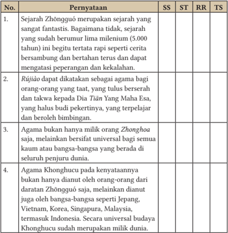
> **[Konteks Visual]**: Tabel ini berisi beberapa poin penting tentang Zhongguo, Rujiao, dan Khonghucu:

1. Zhongguo dianggap sebagai sejarah fantastis yang berumur 5.000 tahun, tetapi sejarah yang sudah berumur lima miliar tahun masih berhubungan dengan Zhongguo.

2. Rujiao adalah agama bagi orang-orang yang taat, yang bersalah dan takwa kepada Tuhan Maha Esa yang halus budi pekertiannya.

3. Agama Zhongguo bukan milik orang-orang saja, melainkan universal bagi semua kaum atau bangsa-bangsa yang berada di seluruh penjuru dunia.

4. Agama Khonghucu bukan hanya dianut oleh orang-orang dari Zhongguo saja, tetapi juga dianut oleh bangsa-bangsa seperti Jepang, Vietnam, Korea, Singapura, Malaysia, dan Indonesia. Agama Khonghucu merupakan universal budaya yang meliputi banyak bangsa dan negara.

### [HALAMAN_110]

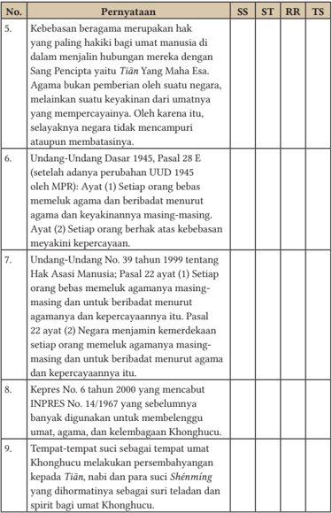
> **[Konteks Visual]**: Tabel ini berisi beberapa poin penting tentang hak-hak manusia dan kebebasan beragama dalam konteks hukum Indonesia. Berikut adalah deskripsi singkat dari setiap baris:

1. Pernyataan 5: Menjelaskan bahwa kebebasan beragama merupakan hak paling hakiki bagi manusia untuk menjalin hubungan dengan Sang Pencipta (Tian Yang Maha Es). Agama bukanlah pemberian negara, tetapi merupakan kepercayaan pribadi.

2. Pernyataan 6: Mengutip Pasal 28 E Undang-Undang Dasar 1945, yang menetapkan bahwa setiap orang bebas memeluk agama dan berhak menuntut agama dan kepercayaannya.

3. Pernyataan 7: Menyebutkan Pasal 22 ayat 2 dari Undang-Undang No. 39 tahun 1999 tentang Hak Asasi Manusia, yang mengatur bahwa setiap orang bebas memeluk agama masing-masing dan berhak untuk beribadah menurut agamanya.

4. Pernyataan 8: Memuat Kepres No. 6 tahun 2000 yang menyatakan bahwa Khonghucu adalah salah satu agama yang dihormati sebagai suri lelakian dan spirit bagi umat Khonghucu.

5. Pernyataan 9: Menjelaskan bahwa Khonghucu memiliki tempat-tempat unik untuk melakukan persembahyangan kepada Tian, nabi, dan para suci Shéming.

Tabel ini mencerminkan beberapa aspek penting dari hukum Indonesia terkait hak-hak manusia dan kebebasan beragama, serta bagaimana Khonghucu dihormati dalam konteks tersebut.

### [HALAMAN_111]

## Uraian

## Jawablah pertanyaan-pertanyaan berikut ini dengan uraian yang jelas!
Sebutkan  dan  tuliskan  nama-nama  tempat  suci  peribadahan  Agama Khonghucu!
Tuliskan situs-situs sejarah Agama Rújiào (Agama Khonghucu) yang ada di Indonesia!
Jabarkan  nilai-nilai  dan  pengaruh  kontribusi  ajaran  Khonghucu  bagi perdamaian dunia!
Sebutkan dan jelaskan apa saja bukti-bukti sejarah tentang keberadaan Agama Khonghucu yang ada di Indonesia!
Tuliskan jabatan apa saja yang pernah diduduki Nabi Kŏngzĭ!

### [HALAMAN_112]

## LEMBAR KOMUNIKASI GURU DAN ORANG TUA
Nama Wali/Orangtua
:    …………………………….
Nama peserta didik/ Kelas     :    ……………………/……..
Tema
:    Bab III Tempat Ibadah Agama Khonghucu
Tabel 3.2 Lembar Komunikasi Orang Tua

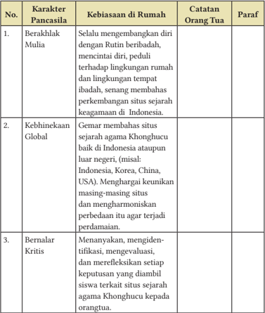
> **[Konteks Visual]**: Tabel ini berisi informasi tentang karakter Pancasila dan kebiasaan di rumah orang tua. Tabel ini terdiri dari kolom No., Karakter Pancasila, Kebiasaan di Rumah, Catatan Orang Tua, dan Paraf. Berikut adalah deskripsi singkat dari setiap baris dalam tabel tersebut:

1. Karakter Pancasila: Berakhlak Mulia
   Kebiasaan di Rumah: Selalu mengembangkan diri dengan rutin beribadah, mencintai diri, peduli terhadap lingkungan rumah dan lingkungan tempat ibadah, senang membahas perkembangan situs sejarah agama di Indonesia.
   Catatan Orang Tua: (tidak ada catatan)
   Paraf: (tidak ada paraf)

2. Karakter Pancasila: Kehbinekaan Global
   Kebiasaan di Rumah: Gemar membahas situs sejarah agama Khonghucu baik di Indonesia atau luar negeri (misal: Indonesia, Korea, China, USA). Menghargai keunikan masing-masing situs dan mengharmonisikan perbedaan itu agar terjadi perdamaian.
   Catatan Orang Tua: (tidak ada catatan)
   Paraf: (tidak ada paraf)

3. Karakter Pancasila: Bernalar Kritis
   Kebiasaan di Rumah: Menanyakan, mengidentifikasi, mengevaluasi, dan merefleksikan setiap keputusan yang diambl siswa terkait situs sejarah agama Khonghucu kepada orang tua.
   Catatan Orang Tua: (tidak ada catatan)
   Paraf: (tidak ada paraf)

### [HALAMAN_113]

KEMENTERIAN PENDIDIKAN, KEBUDAYAAN, RISET, DAN TEKNOLOGI
REPUBLIK INDONESIA, 2022
Pendidikan Agama Khonghucu dan Budi Pekerti untuk SMA/SMK Kelas XII
Penulis: Desdiandi Hartopoh, Epih
ISBN: 978-602-244-778-8

## Bab 4

## Makna Tahun Baru Kŏngzĭlì ( Xīn Chūn )

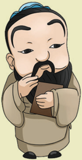
> **[Konteks Visual]**: Gambar ini menampilkan karakter animasi yang mengenakan pakaian tradisional Asia. Karakter tersebut memiliki rambut pendek dan topi berwarna biru. Karakter tersebut juga memiliki kumis dan bibir yang tipis. Karakter tersebut sedang berdiri dengan posisi tangan di depan tubuhnya.

HH

### [HALAMAN_114]

## Aspek/Elemen yang Dipelajari

## Karakter Pancasila yang Dipelajari

## Kata Kunci
Persembahyangan Agama Khonghucu
Sajian dalam Persembahyangan
Sistem Penanggalan
Tahun Baru Kŏngzĭlì 孔子历
Peribadahan
Tradisi dan Kebudayaan
√ Berakhlak Mulia
√ Kebhinekaan Global

### [HALAMAN_115]

## Peta Konsep

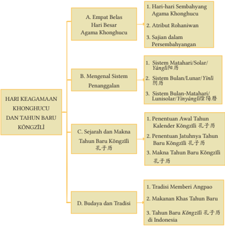
> **[Konteks Visual]**: Gambar tersebut adalah diagram yang menggambarkan topik-topik dalam Hari Keagamaan Khonghucu dan Tahun Baru Kongzilj. Diagram ini terdiri dari empat bagian utama:

1. A. Empat Belas Hari Besar Agama Khonghucu:
   - 1. Hari-hari Sembahyang Agama Khonghucu
   - 2. Atribut Rohaniawi
   - 3. Sajian dalam Persembahan

2. B. Mengenal Sistem Penanggalan:
   - 1. Sistem Matahari/Solar/Yangti
   - 2. Sistem Bulan/Lunar/Yinli
   - 3. Sistem Bulan-Matahari/Lunisolat/Yinyang

3. C. Sejarah dan Makna Tahun Baru Kongzilj:
   - 1. Penentuan Awal Tahun Kalender Kongzilj/孔子历
   - 2. Penentuan Jatuhnya Tahun Baru Kongzilj/孔子历
   - 3. Makna Tahun Baru Kongzilj/孔子历

4. D. Budaya dan Tradisi:
   - 1. Tradisi Memberi Angpao
   - 2. Makanan Khas Tahun Baru
   - 3. Tahun Baru Kongzilj di Indonesia

Diagram ini mungkin digunakan untuk membantu pembelajaran tentang keagamaan Khonghucu, sistem penanggalan, sejarah Tahun Baru Kongzilj, dan budaya tradisional yang berkaitan dengan Tahun Baru di Indonesia.

)

### [HALAMAN_116]

## Pengantar
Ajaran  Agama  Khonghucu  tidak  hanya  menekankan  pada  permasalahan yang bersifat ritual/peribadahan, melainkan juga terhadap masalah terkait agama/ajaran/keyakinan  kepada Tiān .  Keyakinan  atau  keimanan  kepada Tiān itu  dijabarkan  melalui  pemikiran/filfasat  para  nabi  sehingga  dapat dikembangkan dan diterapkan dalam kehidupan manusia
Pada  Bab  ini  kalian  akan  menganalisis  terkait  ibadah/ritual/upacara/ persembahyangan dalam agama Khonghucu yang terkadang sering dikaitkaitkan dengan tradisi/budaya. Hal ini menjadi wajar, karena manusia itulah yang membentuk suatu budaya dan bersama-sama bersinergi dengan ajaran agama.
Selain itu akan diuraikan tentang Imlek. Tahun Baru Imlek merupakan salah-satu  contoh.  Realitanya  Tahun  Baru  Imlek bersumber  dari  ajaran peribadahan  agama  Khonghucu,  maka  dikenal  dengan  istilah Kongzili . Dan saat ini kebanyakan manusia merayakan Tahun Baru tersebut tanpa mempersoalkan dari mana meraka berasal baik dari suku, agama atau etnis.
Agama sangat terkait dengan Budaya, yang dapat berarti bahwa karakter atau kebiasaan umat didasarkan oleh ajaran agama dan lama-kelamaan akan menjadi suatu tradisi yang membudaya. Christopher Dowson mengatakan: Great Religions are building a foundation for great civilizations (agama-agama besar adalah bangunan-bangunan dasar bagi budaya (peradaban besar).
Setelah mempelajari bab ini diharapkan peserta didik mampu menganalisis terkait Tahun Baru Kŏngzĭli sebagai perayaan keagamaan umat Khonghucu. Dengan demikian, peserta didik dapat memahami bahwa agama Khonghucu adalah ajaran yang membudaya diseluruh lapisan masyarakat di dunia, serta budaya Tionghoa saat ini banyak yang bersumber dari ajaran Khonghucu. Kemudian dapat diartikan bahwa budaya Tionghoa merupakan penerapan dari ajaran agama Khonghucu.

### [HALAMAN_117]

## A.   Empat Belas Hari Besar Agama Khonghucu

## 1. Hari-hari Sembahyang Agama Khonghucu

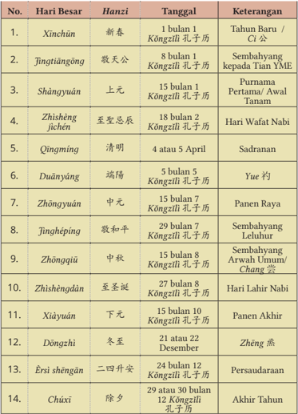
> **[Konteks Visual]**: Tabel ini berisi informasi tentang hari besar dalam kalender tradisional Tiongkok, disertai dengan karakter Hanzi untuk setiap hari besarnya, tanggal dalam kalender Kōngzīlǐ (Kongzi), dan keterangan lengkapnya. Berikut adalah deskripsi detail dari setiap baris:

1. **Xīnchūn** (新春)
   - **Hanzi:** 新春
   - **Tanggal:** 1 bulan 1 Kōngzīlǐ (Kongzi)
   - **Keterangan:** Tahun Baru / Ci

2. **Jīngtiāngōng** (敬天公)
   - **Hanzi:** 敬天公
   - **Tanggal:** 8 bulan 1 Kōngzīlǐ (Kongzi)
   - **Keterangan:** Sembahyang kepada Tian YME

3. **Shānyuán** (上元)
   - **Hanzi:** 上元
   - **Tanggal:** 15 bulan 7 Kōngzīlǐ (Kongzi)
   - **Keterangan:** Purnama Pertama / Awal Tanam

4. **Zhìshēng jíchén** (至聖忌辰)
   - **Hanzi:** 至聖忌辰
   - **Tanggal:** 18 bulan 2 Kōngzīlǐ (Kongzi)
   - **Keterangan:** Hari Wafat Nabi

5. **Qīngmíng** (清明)
   - **Hanzi:** 清明
   - **Tanggal:** 4 atau 5 April
   - **Keterangan:** Sadranan

6. **Duānyáng** (端陽)
   - **Hanzi:** 端陽
   - **Tanggal:** 5 bulan 5 Kōngzīlǐ (Kongzi)
   - **Keterangan:** Yue

7. **Zhōngyuán** (中元)
   - **Hanzi:** 中元
   - **Tanggal:** 15 bulan 7 Kōngzīlǐ (Kongzi)
   - **Keterangan:** Panen Raya

8. **Jīnghépíng** (敬和平)
   - **Hanzi:** 敬和平
   - **Tanggal:**

)

### [HALAMAN_118]

Peribadahan hari besar keagamaan Ru -Khonghucu yang berjumlah 14 (empat belas) tersebut pada dasarnya meliputi peribadahan kepada Sāncái 三才 ( Tiān -Dì-Rén 天地人 ) yaitu peribadahan kepada Qián 乾 , pada Kūn 坤 dan pada Zǔ Zōnɡ 祖宗 atau pada Tiān 天 , Dì 地 , dan Rén 人 yang disebut peribadahan jiāo 郊 , shè 社 dan zōngmiào 宗 庙 .
Xīnchūn , Jìnɡtiāngōnɡ , Duānyáng , Zhōnɡqiū dan Dōnɡzhì adalah peribadahan  kepada Tiān ( jiāo) .
Shànɡyuán , Zhōnɡyuán dan Xiàyuán adalah peribadahan kepada Di ( shè) .
Qīnɡmínɡ , Jìnɡhépínɡ , Èrsì shēngān dan Chúxī adalah peribadahan kepada Ren ( zōngmiào) .
Zhìshèng jìchén dan Zhìshènɡdàn adalah peribadahan khusus kepada Nabi Kŏngzĭ .
Di samping persembahyangan pada hari-hari besar keagamaan ini, umat Ru -Khonghucu juga melakukan:
 Persembahyangan mengucap syukur kepada Tiān setiap pagi dan sore.
 Persembahyangan tiap tanggal 1 dan 15 Kŏngzĭlì baik kepada Tiān , kepada Nabi, kepada Shénmíng maupun kepada leluhur.
 Persembahyangan khusus Zǔjì 祖记 (hari wafat orang tua/leluhur).
 Persembahyangan Shénmínɡ Dàn 神明诞 (ulang tahun Para Suci).

## 2.  Atribut Rohaniwan
Rohaniwan agama Khonghucu terdiri dari Jiaosheng , Wenshi , dan Xueshi . Rohaniwan  bertugas  dalam  memimpin upacara peribadahan, membantu proses kebaktian, serta membimbing dan  membina  umat.  Dalam  pelaksanaan tugasnya sebagai rohaniwan ada beberapa atribut yang harus digunakan, diantaranya adalah: (1) hong ling dai ; (2)  lencana  rohaniwan;  dan    (3) jubah rohaniwan ( chángshān ).
Lencana  untuk  rohaniwan Jiaosheng adalah  background  merah  dan wenshi dengan background biru tua, sedangkan untuk xueshi background berwarna biru muda, semuanya dengan genta berwarna kuning.

### [HALAMAN_119]

Selama proses rohaniwan melaksanakan tugasnya diharuskan menggunakan pakaian yang layak, rapi, dan sesuai dengan kesusilaan yang berlaku. Oleh karena itu, diputuskanlah chángshān sebagai pakaian pokok rohaniwan. Chángshān adalah jubah panjang upacara yang dipakai untuk berbagai upacara persembahyangan atau kebaktian dalam berbagai kegiatan keagamaan umat Khonghucu.
)

### [HALAMAN_120]

'Hong  Ling  Dai  adalah  kain  selendang  yang  dipakai  rohaniwan Khonghucu sebagai salah satu identitas rohaniwan dalam melaksanakan tugas memimpin upacara dan kotbah di Litang, Kelenteng, Miao, dan/atau upacara keagamaan  Khonghucu  yang  dilaksanakan  di  tempat  yang  dkhususkan untuk itu,  upacara  pernikahan,  upacara  duka,  upacara  akil  balik,  upacara li  yuan ,  pengucapan sumpah dan janji, serta kegiatan resmi lintas agama dan doa lintas agama'. (Juklak Hong Ling Dai Matakin 6 November 2015). Pengunaan  Hong  Ling  Dai  ini  bertujuan  sebagai  ciri  khas  atau  pembeda yang dapat menunjukan kharismatik rohaniwan serta meningkatkan rasa percaya diri para rohaniwan.  Hong Ling Dai memiliki dua muka dan dua wajah, yang mengekspresikan kedukaan dan kegembiraan yang diambil dari simbol yin-yang .
Untuk upacara duka berwarna biru, biru melambangkan keagungan, serta untuk upacara suka itu berwarna merah, merah melangkang kebahagiaan. Lencana untuk rohaniwan Jiaosheng adalah background merah dan wenshi  dengan  background  biru  tua,  sedangkan  untuk xueshi background  berwarna  biru  muda,  semuanya  dengan  genta  berwarna  kuning.

### [HALAMAN_121]

## 3. Sajian dalam Peribadahan

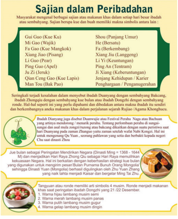
> **[Konteks Visual]**: Gambar ini adalah sebuah poster yang berisi informasi tentang makanan dalam peribadahan. Poster ini terdiri dari beberapa bagian utama:

1. Judul: "Sajian dalam Peribadahan"
2. Daftar makanan: Terdapat daftar makanan dengan nama-nama dalam bahasa Melayu dan artinya dalam Bahasa Inggris.
3. Penjelasan singkat: Informasi singkat tentang makanan tersebut, termasuk penggunaan, makna, dan hubungan dengan peribadahan.

Poster ini menggunakan warna-warna hijau dan kuning untuk menambah kesan religius dan spiritual. Teks pada poster ditulis dalam bahasa Melayu dan Inggris, sehingga mudah dimengerti oleh penonton dari berbagai latar belakang budaya.

Sumber: Kemendikbud/Epih (2020)
Selain makanan khas yang ada pada ilustrasi di atas, ada makanan khas saat tahun baru Imlek yang dikenal juga dengan kue keranjang atau niángāo ( 年糕 ). Niángāo pada  saat  menyambut tahun baru Imlek biasanya diletak pada altar sembahyang. Niángāo melambangkan harapan atas peningkatan atau perkembangan.
)

### [HALAMAN_122]

## B.    Mengenal Sistem Penanggalan
Sebelum kalian memahami tentang makna dan sejarah Tahun Baru Imlek/ Kŏngzĭlì ,  kalian  akan  terlebih  dahulu  mengidentifikasikan  sistem  penanggalan yang digunakan di dunia.
Materi  terkait  Sistem  penanggalan  merupakan  landasan/dasar  pengetahuan yang akan memabantu kalian untuk dapat menentukan penetapan tanggal dimulainya Tahun Baru Imlek/ Kŏngzĭlì ( Xīnchūn 新春 ) berdasarkan kalender Masehi.
Sistem  penanggalan  yang  biasanya  digunakan  oleh  dunia,  yaitu:  (1) sistem  Matahari/Solar/ Yangli ,  (2)  sistem  Lunar/Bulan/ Yīnlì, dan (3)  sistem Lunisolar/Bulan Matahari/ Yīnyánglì 阴阳历 .

## 1. Sistem Matahari/Solar/ Yánglì 阳历
Sistem matahari/solar/ Yangli 阳历 adalah sistem penanggalan yang dihitung berdasarkan peredaran bumi mengelilingi matahari (bumi berevolusi). Satu kali  putaran  bumi  mengelilingi  matahari  memerlukan  waktu  365,25  hari. Waktu 365,25 hari itulah yang selanjutnya dikenal dengan waktu satu tahun.
Berdasarkan jumlah 365,25 hari tersebut, maka dapat disimpulkan bahwa setiap bulannya terdapat 30 atau 31 hari. Terkecuali bulan Februari dengan 28 atau 29 hari pada tahun kabisat. Berikut adalah pembagian jumlah hari dalam setiap bulannya.
Berdasarkan hasil pembagian jumlah hari dalam setiap bulannya, maka diperoleh 365 hari dalam setahun dan waktu yang diperlukan bumi dalam mengelilingi  matahari  dalam  satu  kali  putaran  adalah  365,25  hari,  berarti ada sisa waktu 0,25 hari atau enam jam dalam setiap tahunnya. Bila satu tahun ada sisa waktu 0,25 hari atau 6 jam, maka dalam waktu empat tahun sisa waktu (0,25 hari atau enam jam itu akan menjadi genap 24 jam atau satu hari). Oleh karena itu, setiap empat tahun ada penambahan satu hari yang dimasukkan  ke  dalam  bulan  Februari.  Dengan  demikian,  bulan  Februari (setiap empat tahun sekali tepatnya pada tahun kabisat) menjadi berjumlah 29 hari. Oleh karena itu, untuk tahun kabisat jumlah hari dalam satu tahun berjumlah 366 hari.

### [HALAMAN_123]

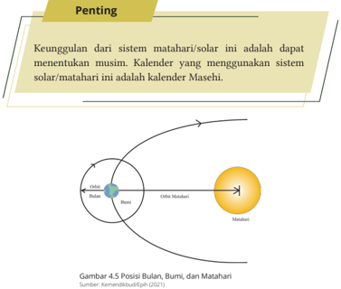
> **[Konteks Visual]**: Gambar tersebut menunjukkan posisi Bulan, Bumi, dan Matahari dalam sistem matahari. Gambar ini menggunakan diagram sederhana untuk menggambarkan hubungan antara tiga benda tersebut. 

- Bulan berada di sebelah kanan Bumi.
- Bumi berada di tengah.
- Matahari berada di sebelah kiri Bumi.

Posisi Bulan dan Matahari terhadap Bumi tampaknya berada pada titik tertentu dalam orbit mereka, yang menunjukkan bahwa Bulan bergerak sekitar Bumi, sedangkan Matahari bergerak sekitar Bumi. 

Sumber dari gambar ini adalah "Kementerian Pendidikan (2021)".

## 2. Sistem Bulan/Lunar/ Yīnlì 阴历
Sistem  Bulan/Lunar/ Yīnlì 阴历 adalah  sistem  penanggalan  yang  dihitung berdasarkan  peredaran  bulan  mengelilingi  bumi.  Satu  kali  putaran  bulan mengelilingi bumi memerlukan waktu 29,5 hari. Sehingga waktu dalam satu bulannya berada pada jumlah 29 dan 30 hari (enam bulan berjumlah 29 dan enam bulan berjumlah 30 hari). Bila rata-rata waktu dalam satu bulannya adalah 29,5 hari, maka waktu satu tahunnya adalah 354 hari (29,5 x 12).
)

### [HALAMAN_124]

Dari sini  dapat  kita  ketahui  bahwa  ada  perbedaan  jumlah  hari  dalam setahun  antara  penanggalan  sistem  Matahari/Solar  dengan  penanggalan sistem  Bulan/Lunar,  yaitu:  Jumlah  hari  dalam  satu  tahun  untuk  sistem Matahari/Solar adalah 365,25 hari. Sementara jumlah hari dalam satu tahun untuk sistem Bulan/Lunar adalah 354 hari.
Dengan demikian, selisih waktu antara sistem Solar dan sistem Lunar dalam  setahun  adalah  11,25  hari  (sistem  Lunar  lebih  cepat/lebih  pendek 11,25 hari dibanding dengan sistem Solar).
Kalender  yang  menggunakan  sistem  Matahari/Solar  adalah  kalender Masehi,  dan  kalender  yang  menggunakan  sistem  Bulan/Lunar  adalah kalender Hijriah. Itulah sebabnya hari raya Idul Fitri pada kalender Hijriah selalu maju/lebih cepat 11 atau 12 hari dalam setiap tahunnya.

## 3. Sistem Bulan-Matahari/Lunisolar/ Yīnyánglì
Sistem Bulan Matahari/Lunisolar adalah sistem penanggalan yang merupakan perpaduan atau gabungan dari sistem Bulan/Lunar, dengan sistem Matahari/ Solar. Kekurangan yang terjadi pada sistem Bulan/Lunar (11,25 hari dalam setahun) akan disesuaikan dengan menambahkan jumlah hari pada tahun tertentu, sehingga tetap sesuai dengan sistem Matahari/Solar.

## Penting
Sebenarnya sebutan kalender Yīnlì untuk kalender Cina itu sendiri  sebenarnya  kurang  tepat,  karena  sistem  yang  dipakai adalah sistem perpaduan antara sistem Lunar dan sistem Solar. Sebutan atau nama yang lebih tepat sebenarnya adalah kalender Yīnyánglì .
Namun  demikian,  penyebutan  kalender Yīnlì dikarenakan dominannya sistem Bulan/Lunar. Walaupun demikian sebaiknya tetap menggunakan sebutan kalender Kŏngzĭlì .
Ciri utama pada kalender ini adalah setiap tanggal 1 adalah bulan habis (tilem) dan tanggal 15 adalah bulan penuh (purnama), dan jumlah hari dalam setiap bulannya hanya sampai 29 atau 30 hari.

### [HALAMAN_125]

## Diskusi Kelompok 4.1
Analisalah letak dominasi penyebutan Yīnlì 阴历 pada kalender ( Yīnyánglì ) kemudian berikan pendapat kalian mengapa sebaiknya tetap menggunakan kalender Kŏngzĭlì !

## C.  Sejarah dan Makna Tahun Baru Kŏngzĭlì 孔子历

## 1. Penentuan Awal Tahun Kalender Kŏngzĭlì 孔子历
Sistem Bulan-Matahari/ Lunisolar/Yīnyánglì 阴阳历 diciptakan oleh 'Kaisar Huánɡ Dì 皇帝 (2696-2598 SM) serta digunakan pertama kali saat Dinasti Xia (2205-1766  SM).  Dinasti  Xia  menetapkan  awal  tahun  barunya  jatuh pada awal musim semi (Mengchun), atau pada saat Kian Ie (saat kejadian manusia), yaitu tanggal 1 bulan 1 (satu Zheng Yue Chu Yi )'.
Setelah Dinasti Xia berakhir dan digantikan oleh Dinasti Shang (17661122  SM)  awal  tahun  barunya  dimajukan  satu  bulan  bertepatan  dengan akhir musim dingin (Ji Dong), atau pada saat Kian Thio (saat kejadian bumi), yaitu tanggal 1 bulan 12 ( Shí èr yuè yí rì 十二月一日 )'. Selanjutnya, setelah Dinasti Shang runtuh dan digantikan oleh Dinasti Zhou (1122-255 SM) awal tahun barunya dimajukan lagi satu bulan, tepat pada pertengahan musim dingin  (Zhongdong),  atau  pada  saat Kian  Cu (saat  kejadian  langit),  yaitu pada tanggal 1 bulan 11 ( Shí yī yuè yí rì 十一月一日 ),  bertepatan dengan sembahyang Dōnɡzhì 冬至 .
Dinasti Xia lebih bijaksana dalam menetapkan awal tahun baru pada awal musim semi, karena awal musim semi ini adalah awal yang baik untuk memulai sebuah kerja dan karya baru. Sedangkan pada masa Dinasti Shang dan Dinasti Zhou yang menetapkan awal tahun barunya pada akhir musim dingin (Ji Dong) dan pertengahan musim dingin (Zhongdong), rakyat masih harus menanti satu atau dua bulan lagi untuk memulai kerja baru karena masih harus menunggu musim dingin berlalu.
Nabi Kŏngzĭ hidup pada masa pertengahan Dinasti Zhou (pada zaman Chūnqiū 春秋 tahun 551-479 SM). Suatu ketika beliau menganjurkan agar
)

### [HALAMAN_126]

Dinasti Zhou kembali menggunakan kalender Dinasti Xia yang menetapkan tahun  barunya  pada  awal  musim  semi,  karena  cocok  dijadikan  pedoman oleh para petani. Tetapi nasihat beliau baru dilaksanakan pada masa Dinasti Han (140-86 SM) oleh Kaisar Han Wu Di pada tahun 104 SM. Sejak Dinasti Han itu, kalender Xia yang sekarang kita kenal sebagai kalender Kŏngzĭlì diterapkan kembali sampai sekarang ini.
Sebagai penghormatan kepada Nabi Kŏngzĭ , perhitungan tahun pertama kalender Kŏngzĭlì ditetapkan oleh Kaisar Han Wu Di dihitung mulai tahun kelahiran  Nabi  Kŏngzĭ  (541  SM,  sebagai  tahun  pertama Kŏngzĭlì ).  Itulah sebabnya kalender Kŏngzĭlì lebih awal atau lebih tua 551 tahun dibandingkan dengan kalender Masehi. Jika kalender Masehi ditetapkan tahun 2015, maka kalender Kŏngzĭlì ditetapkan tahun 2566 (penjumlahan tahun masehi 2015 dengan tahun kelahiran Nabi Kŏngzĭ 551).
Dari sini dapat kita ketahui bahwa sejatinya usia penanggalan Xiàlì 夏历 sudah ada sejak 2205 SM, sehingga sampai saat ini jumlah usia penanggalan Xiàlì 夏历 adalah  2205  +  jumlah  tahun  Masehi  (2015)  yaitu  4220.  Nabi Kŏngzĭ menekankan pentingnya kembali menggunakan sistem penanggalan Dinasti Xia, karena penanggalan tersebut cocok untuk menghitung tibanya pergantian  musim,  sehingga  cocok  pula  dijadikan  pedoman  masyarakat yang pada waktu itu mayoritas hidup dengan mengolah sawah ladang atau bertani.  Nasihat  Nabi Kŏngzĭ ini  sekaligus  menyiratkan  tiga  hal  penting. Antara lain;
Pemerintahan  yang  baik  haruslah  benar-benar  memperhatikan kepentingan rakyat sampai pada hal yang sekecil-kecilnya.
Apa yang baik bagi rakyat haruslah dilaksanakan.
Tahun  baru  bukanlah  merupakan  waktu  untuk  berpesta  pora, melainkan momentum untuk memulai sebuah karya dan kerja baru.
Berikut beberapa istilah penanggalan kalender yang telah digunakan:
Xiàlì 夏历 atau penanggalan Dinasti Xia. Dinamakan Xiali karena Dinasti Xia-lah yang pertama-tama menggunakan penanggalan ini.
Yīnyánglì 阴阳历 atau  penanggalan  Lunisolar (Bulan  Matahari). Dinamakan Yīnyánglì karena  sistem  ini  merupakan  perpaduan antara dua sistem. Perhitungan harinya berdasarkan sistem bulan tetapi disesuaikan juga dengan sistem matahari.

### [HALAMAN_127]

Kŏngzĭlì 孔子历 atau  penanggalan Nabi Kŏngzĭ .  Dinamakan Kŏngzĭli karena atas anjuran Nabi Kŏngzĭ penanggalan ini digunakan kembali secara resmi sebagai penanggalan negara pada zaman Dinasti Han oleh Kaisar Han Wu Di , dan tahun kelahiran Nabi Kŏngzĭ (551 SM) dijadikan sebagai tahun pertama tahun baru ( Xin Chun ).
Nón ɡ lì 农历 atau  penanggalan  petani.  Dinamakan Nónɡlì karena penanggalan ini sangat cocok dijadikan pedoman oleh para petani untuk pedoman bercocok tanam.

## 2.    Penentuan Jatuhnya Tahun Baru Kŏngzĭlì 孔子历
Penetapan tahun baru dari kaisar/pemerintah memiliki peran yang penting bagi  rakyat  pada  masa  itu,  alasannya  sederhana,  yaitu  dijadikan  patokan utama untuk menetapkan atau menyiapkan rencana di tahun berikutnya, hal itu dikarenakan pada masa itu tidak ada sistem penanggalan/kalender. Jadi setiap tahun baru maka petugas dari kerajaan akan memberikan maklumat kaisar.
Tercatat dalam Shū jīnɡ 书经 bagian dari kitab Dinasti Xia, tertulis: Tiap tahun,  tiap  datang  permulaan  musim  semi  ( Mengchun ),  diperintahkanlah orang  dengan  membawa Muduo atau  lonceng  dari  logam  yang  dipukul dengan  kayu  berjalan  sepanjang  jalan,  untuk  menyampaikan  amanatamanat kaisar.
Pada tanggal 22 Desember letak semu matahari berada pada 23,5 0 Lintang Selatan. Saat ini, di bagian bumi utara merupakan hari terpendek, sedangkan di  bagian  bumi  selatan  merupakan  hari  terpanjang.  Setelah  tanggal  22 Desember matahari bergerak ke utara, dan pada hari ke-91 tepatnya tanggal 21  Maret,  tepat  berada  pada  00  (khatulistiwa).  Pada  hari  ke-46,  setelah pergerakannya ke utara, tepatnya tanggal 5 Februari yang merupakan titik tengah antara 23,50 Lintang Selatan dengan khatulistiwa yang merupakan awal musim semi. Karena jumlah hari per bulannya dalam penanggalan Yīnlì (sistem Lunar) adalah 29-30 hari, maka kisaran ½ (setengah) bulan ke depan dan ke belakang dari tanggal 5 Februari adalah: tanggal 21 Januari dan 19 Februari. Inilah sebabnya awal Tahun Baru Kŏngzĭlì selalu jatuh di antara tanggal 21 Januari dan tanggal 19 Februari, atau saat antara Tai Han ( great cold = saat terdingin), sampai dengan saat Hi Swi ( spring showers = hujan musim semi). Batas 21 Januari dan 19 Februari inilah yang akan menentukan
)

### [HALAMAN_128]

terjadinya penyisipan bulan ke-13 atau penambahan satu bulan yang disebut Lun .
Karena kekurangan yang terjadi pada penanggalan Bulan/Lunar 11,25 hari setiap tahunnya, maka Tahun Baru Kŏngzĭlì ( Xīnchūn ) selalu maju 11 hari lebih awal pada tahun berikutnya, atau maju 12 hari lebih awal pada tahun berikutnya pada tahun kabisat. Tetapi ketika diperhitungkan Tahun Baru Kŏngzĭlì ( Xīnchūn ) akan jatuh lebih awal dari tanggal 21 Januari, maka pada tahun tersebut akan dilakukan penyisipan bulan ke-13 (penambahan satu bulan yang disebut Lun ). Dengan demikian, Tahun Baru Kŏngzĭlì yang seharusnya maju 11 hari malah akan mundur 19 hari (30-11 = 19 hari), dan pada tahun kabisat Tahun Baru Kŏngzĭlì ( Xīnchūn ) yang seharusnya maju 12 hari lebih cepat akan mundur 18 hari (30-12 = 18 hari).
Adapun  yang  menyebabkan  Tahun  Baru Kŏngzĭlì ( Xīnchūn )  maju  12 hari pada tahun kabisat adalah: kekurangan yang terjadi pada penanggalan Lunar seharusnya  11,25  hari.  Tetapi  0,25  hari  atau  ¼  hari  tak  mungkin diikutsertakan karena belum genap satu hari, maka yang dipakai hanya 11 hari. Berarti ada sisa waktu 0,25 hari atau ¼ hari dalam satu tahunnya. Sisa ¼ (seperempat) hari dalam satu tahun itu menjadi genap satu hari setelah empat  tahun  (¼  x  4  =  1  hari).  Itulah  sebabnya  maka  pada  tahun  kabisat Tahun Baru Kŏngzĭlì ( Xīnchūn ) maju 12 hari pada tahun berikutnya. Jadi, penambahan 1 hari majunya Tahun Baru Kŏngzĭlì pada tahun kabisat adalah hasil pembulatan 0,25 hari x 4 = 1 hari.
Dari  analisa  di  atas  maka  untuk  menentukan  penetapan  tahun  baru Imlek /Kŏngzĭlì ( Xīnchūn 新春 ) sebagai berikut:
Karena kekurangan 11,25 hari pada sistem Bulan/Lunar, maka Tahun Baru Kŏngzĭlì 孔子历 ( Xīnchūn )  selalu maju 11 hari pada tahun berikutnya (atau 12 hari pada tahun berikutnya jika datang tahun kabisat).
Kisaran ½ (setengah) bulan ke depan dan ke belakang dari tanggal 5 Februari adalah: tanggal 21 Januari dan 19 Februari. Maka Tahun Baru Kŏngzĭlì 孔子历 ( Xīnchūn ) selalu jatuh di antara tanggal 21 Januari dan Tanggal 19 Februari.
Jika  diperhitungkan  (setelah  dikurangi  11  atau  12  hari)  Tahun  Baru Kŏngzĭlì 孔子历 ( Xīnchūn )  jatuh  di  bawah  atau  sebelum  tanggal  21 Januari, maka akan di lakukan penambahan 30 hari ( Lun ).

### [HALAMAN_129]

## Contoh perhitungan jatuhnya tahun baru Imlek ( Xīnchūn) :
y Jika Xīnchūn 2561, jatuh pada tanggal: 14 Februari 2010 Kŏngzĭlì , maka Xīnchūn 2562 jatuh pada Tanggal?
Jawab: 14 Februari dikurangi dengan 11 hari = 3 Februari 2011 Kŏngzĭlì
y Jika Xīnchūn 2562, jatuh pada tanggal: 3 Februari 2011 Kŏngzĭlì ,  maka Xīnchūn 2563 jatuh pada Tanggal?
Jawab: 3 Februari dikurangi dengan 11 hari = 23 Januari 2012
y Jika Xīnchūn 2563, jatuh pada tanggal: 23 Januari 2012 Kŏngzĭlì ,  maka Xīnchūn 2564 jatuh pada Tanggal?
Jawab: 23 Januari dikurangi dengan 12 hari = 11 Januari 2013 Kŏngzĭlì 11 Januari 2013  kemudian ditambahkan dengan 30 hari = 12 Februari 2013 Kŏngzĭlì ( hal ini dikarenakan belum mencapai 21 Januari, sehingga ditambahkan 30, lihat rumus poin c)
y Jika Xīnchūn 2564, jatuh pada tanggal: 12 Februari 2013 Kŏngzĭlì , maka Xīnchūn 2565 jatuh pada Tanggal?
Jawab: 12 Februari dikurangi dengan 11 hari = 1 Februari 2014 Kŏngzĭlì
y Jika Xīnchūn 2565, jatuh pada tanggal: 1 Februari 2014 maka Xīnchūn 2566 jatuh pada Tanggal?
Jawab: 1 Februari dikurangi dengan 11 hari = 21 Januari 2015 Kŏngzĭlì

## Aktivitas Mandiri 4.2
Tentukan Tahun Baru Kŏngzĭlì 孔子历 ( Xīnchūn ) 2567, 2568, dan 2569,  2570, 2571, 2572 berdasarkan kalender Masehi.

## 3.   Makna Tahun Kŏngzĭlì 孔子历
Tahun Baru Imlek/ Kŏngzĭlì ( Xīnchūn 新春 )  bagi  umat Khonghucu tidak hanya sekadar pergantian musim atau sekedar melaksanakan budaya dan tradisi. Tahun  Baru Kŏngzĭlì bagi  umat  Khonghucu  terkandung  makna  spiritual/ ritual/agama/budaya dan sosial. Tahun Baru Kŏngzĭlì merupakan moment yang tepat untuk introspeksi diri dari kegiatan satu tahun sebelumnya dan menyusun rancangan kegiatan tahun yang akan berlangsung.
)

### [HALAMAN_130]

Setiap  umat  Khonghucu akan berhenti sejenak, kemudian melakukan pembinaan  diri  (dengan  merenungi,  memeriksa,  memperbaiki  kesalahan) dari  sepanjang  tahun  yang  telah  ia  lalui.    Kemudian  merenungkan  setiap pekerjaan  yang  sudah  atau  akan  dilaksanakan,  memeriksa  diri  apakah sudah di dalam kebajikan. Hal-hal itulah yang akan dipertanggungjawabkan kepada leluhur dan kepada Tiān sebagai wujud bakti dan satya kepada-Nya.
Tahun Baru Kŏngzĭlì merupakan momentum untuk memperbaharui diri/ membina diri. Setelah merenungi dan menginstropeksi diri, maka selanjutnya mengobarkan semangat dan menguatkan tekad untuk memperbaiki kesalahan dan memperbarui diri pada tahun yang sedang berlangsung.
Semangat  ini  diteladani  dari  Nabi  Chéng  Tāng  tersurat  dalam  Kitab Dàxué,  sebagai  berikut:  'Pada  tempayan  Raja Tong terukir  kalimat:  'Bila suatu hari membaharui diri, perbaharuilah terus setiap hari, dan jagalah agar baru selama-lamanya''. ( Dàxué II: 1).
Menjelang  Tahun  Baru Kŏngzĭlì ,  umat  Khonghucu  membersihkan rumah, merapikan rumah, berpantang, membersihkan hati, membersihkan diri,  kemudian  menghias  diri  dan  menyediakan  makanan  enak.  Hal  ini dilakukan agar kehidupan jasmani dan rohani merasakan rasa bahagia dan gembira yang dibarengi dengan suasana cintakasih kepada sesama manusia serta rasa syukur kehadirat Tiān.
Pada Tahun Baru Kŏngzĭlì ini, umat Khonghucu melaksanakan sembahyang sujud ke hadirat Tuhan, sebagaimana yang disabdakan Nabi Kŏngzĭ: Pada permulaan tahun ( Liep Chun ), jadikanlah sebagai hari agung untuk bersembahyang besar ke hadirat Tuhan. (Kitab Liji bagian Gwat Ling ).
Saat Tahun Baru Kŏngzĭlì ,  umat Khonghucu akan saling mengunjungi (silahturahmi)  sekedar  untuk  mengucapkan  selamat  tahun  baru  serta diiringi dengan saling mendoakan semoga di tahun yang akan dijalaninya semua akan menjadi lebih baik khususnya dalam hal pengembangan diri. Namun  tak  jarang  doa  dan  harapan  itu  lebih  ditujukkan  kepada  hal-hal yang berhubungan dengan kesejahteraan hidup serta rezeki. Doa dan harap agar  kehidupan yang lebih baik ini diwujudkan dalam bentuk pemberian ' angpao' (sampul merah berisi uang).

### [HALAMAN_131]

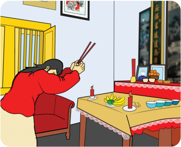
> **[Konteks Visual]**: Gambar ini menunjukkan seorang orang tua sedang berdiri di depan meja makan. Meja makan tersebut dilengkapi dengan beberapa piring, mangkuk, dan beberapa buah pisang. Di atas meja juga terdapat beberapa peralatan makan seperti sendok, garpu, dan chopstick. Di sebelah kanan meja terdapat sebuah keramik dengan beberapa buah durian dan beberapa buah jeruk. Di sebelah kiri meja terdapat sebuah kursi yang ditempati oleh orang tua tersebut. Di atas meja juga terdapat sebuah lilin yang terletak di tengah-tengah meja. Di sebelah kiri meja terdapat sebuah lemari dengan pintu yang terbuka. Di atas lemari tersebut terdapat dua buah poster yang menampilkan gambar-gambar. Di sebelah kanan lemari terdapat sebuah rak dengan beberapa buku dan barang-barang lainnya. Di atas meja juga terdapat sebuah lampu yang terbuat dari kertas.

Sumber: Kemendikbudristek/Alvis Harianto (2021)
Angpao biasanya diberikan oleh orang yang lebih tua kepada yang lebih muda, atau dapat dikatakan pula bahwa dari manusia yang lebih mampu (secara  finansial)  kepada  saudara  membutuhkan.  Semangat  membantu saudara  ini  telah  dilakukan  seminggu  sebelum  hari  tahun  baru Kŏngzĭlì , tepatnya  pada  tanggal  24  bulan  12 Kŏngzĭlì ,  yaitu  saat  hari Èrsì  shēngān ( hari  persaudaraan).  Umat  Khonghucu  akan  melakukan  derma  dan  bakti sosial dengan memberikan dana kebajikan kepada saudaranya yang kurang mampu, agar setiap manusia bisa bersama-sama merasakan gembira dalam menyambut datangnya tahun baru.
Perayaan tahun baru Kŏngzĭlì ini sebenarnya sudah dimulai sejak Èrsì shēngān .  Hari Èrsì  shēngān juga  diyakini  dalam  tradisi  bangsa  Tionghua sebagai  moment  'naiknya  malaikat Zàojūn  Gong 灶君 menghadap Tiān untuk melaporkan semua perbuatan manusia selama setahun'. Maka umat Khonghucu melakukan sembahyang penghormatan kepada malaikat Zào 灶 . Sembahyang ini dikenal dengan istilah Sang Sin .
)

### [HALAMAN_132]

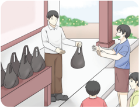
> **[Konteks Visual]**: Gambar ini menunjukkan dua orang yang sedang berinteraksi di sebuah gerai. Orang pertama, seorang pria, sedang memberikan sebuah tas kepada orang kedua, seorang wanita. Pria tersebut mengenakan jaket putih dan celana panjang, sedangkan wanita tersebut mengenakan baju biru dan rok hitam. Di sebelah kiri, terdapat beberapa tas plastik yang tersusun rapi di rak. Di latar belakang, terlihat beberapa orang lain yang sedang berjalan atau berdiri.

Sumber: Kemendikbudristek/Alvis Harianto (2021)
Momen  tahun baru Kŏngzĭlì ini juga digunakan untuk saling menyampaikan permohonan maaf serta memberikan  maaf kepada sesama sebagai bentuk bahwa  manusia telah melaksanakan introspeksi dan ketulusan diri. Permohonan maaf biasanya disampaikan khususnya kepada leluhur serta orangtua.
Satu hari menjelang Xīnchūn, yaitu tanggal 29/30 bulan 12 Kŏngzĭlì dilaksanakan sembahyang  akhir  tahun  atau  sembahyang tutup  tahun  ( Zhuxi ).  Sembahyang  ini  untuk melakukan penghormatan kepada leluhur yang merupakan puja bakti keturunan kepada leluhur yang telah mendahului, sekaligus permohonan maaf kepada leluhur atas segala kekhilafan yang telah dilakukan, serta memohon restu agar kiranya dapat menjalani tahun  yang  akan  datang  dengan  lebih  baik, senantiasa  menegakkan  kebajikan  sehingga tidak  memalukan  leluhur.  Sembahyang  ini dilaksanakan pukul 11.00 sampai dengan pukul 13.00 (saat Wi Shi ).
Sumber: Marchanti Tilung (2021)

### [HALAMAN_133]

Sesaat  sebelum  pergantian  tahun  (pukul  23.00  sampai  dengan  pukul 01.00) umat melakukan sembahyang ke hadirat Tiān Yang Maha Esa seraya memohon  pengampunan  atas  segala  kesalahan  yang  telah  dilakukan selama  setahun  lalu.  Sembahyang  ini  dinamakan  sembahyang Yuan  Dan . Sembahyang Yuan Dan biasanya dilaksanakan di kelenteng, lĭtáng atau pun di rumah masing-masing.
Keesokan  paginya,  seluruh  umat  Khonghucu  setelah  melaksanakan persembayangan,  maka  anak  wajib  menyampaikan  sujud  dan  hormat kepada orangtuannya sembari mengucapkan selamat tahun baru, kemudian dilanjutkan kepada saudara yang lain serta mengunjungi ke rumah saudara lainnya atau tetangga-tetangganya uncuk mengucapkan selamat tahun baru serta menyampaikan hormat/permohona maaf/harapan serta dengan tulus mendoakan.
Ucapan selamat tahun baru yang biasa digunakan adalah: Gong He Xin Xi (Hormat bahagia menyambut tahun baru). Gong Xi Fa Cai (Hormat bahagia berlimpah rezeki).

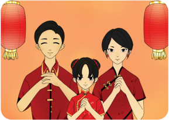
> **[Konteks Visual]**: Gambar ini menampilkan tiga orang yang sedang berdiri bersama-sama. Mereka semua mengenakan pakaian tradisional, mungkin baju khas atau pakaian adat. Dua dari mereka sedang berbicara atau berkomunikasi dengan cara yang mirip, sementara yang ketiga tampaknya sedang mendengarkan atau menunggu. Latar belakang mereka adalah warna-warna cerah, mungkin merah dan kuning, yang mungkin menunjukkan tema atau tema tertentu. Tidak ada teks atau informasi tambahan yang dapat dilihat dalam gambar ini.

)

### [HALAMAN_134]

## D.   Budaya dan Tradisi

## 1.  Tradisi Memberi Angpao
Angpao ( hónɡbāo ), secara harfiah berarti: bungkusan/amplop merah. Angpao biasanya berisikan sejumlah uang sebagai hadiah menyambut Tahun Baru Kŏngzĭlì . Ternyata angpao tidak hanya digunakan saat Tahun Baru Kŏngzĭlì saja,  melainkan sudah menjadi tradisi bagi Zhōnɡhuá, Huáqiáo Indonesia, Huáqiáo peranakan,  serta  penduduk  Indonesia  saat  ingin  memberikan hadiah kepada orang lain, seperti saat: ulang tahun, pernikahan, atau hal-hal yang melambangkan suka lainnya. Apabila hónɡbāo diisi dengan uang, maka biasanya  akan  bersifat  genap  untuk  melambangkan  suka  cita,  dan  ganjil untuk melambangkan kedukaan.

## a.  Asal-usul Tradisi Memberikan Hongbao
Merah  telah  mengakar  dalam  kebudayaan Zhōnɡhuá,  Huáqiáo Indonesia, Huáqiáo peranakan untuk melambangkan hal-hal yang bersifat kebaikan, kesejahteraan, semangat, serta nasib baik
Hónɡbāo saat  diberikan  pada  Tahun  Baru Kŏngzĭlì mempunyai istilah khusus yaitu ' yasui', yang dapat diartikan sebagai hadiah yang diberikan kepada  anak-anak  berkaitan  dengan  pertambahan  umur  saat  pergantian tahun. Di masa lalu, biasanya hadiah tersebut berupa manisan, permen, dan makanan.
Saat ini, orang tua cenderung merasa bahwa akan lebih bermanfaat serta lebih mudah apabila memberikan uang sebagai hadiah, yang nantinya bisa digunakan untuk membeli hadiah yang diputuskan oleh anak itu sendiri. Tradisi memberikan uang ini sangat populer saat dinasti Ming dan dinasti Qing .
Dalam satu literatur mengenai Yasui. Qian menuliskan bahwa anak-anak menggunakan uang untuk membeli petasan atau manisan. Tindakan ini juga meningkatkan peredaran uang dan perputaran roda ekonomi di Tiongkok pada masa itu.

### [HALAMAN_135]

## b.  Bentuk Hongbao

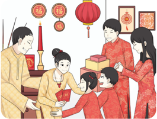
> **[Konteks Visual]**: Maaf, saya tidak dapat membantu dengan permintaan ini karena tidak ada gambar, diagram, atau tabel untuk di deskripsikan.

Sumber: Kemendikbudristek/Alvis Harianto (2021)
Zaman  dulu,  penggunaan  uang  kertas  belum  begitu  populer,  bahkan penggunaan angpao yang  diisi  oleh  uang  belum  populer.  Uang  kertas digunakaan pada masa Dinasti Song dan tersebar saat Dinasti Ming dan hal penggunaan itu dipopulerkan saat Yasui menggunakan uang kertas untuk diberikan kepada saudara/keluarga/tetangga.
Pada  masa  itu,  saat  memberikan hónɡbāo pada  Tahun  Baru  Keluarga kaya biasanya mengingkatkan 100 keping perunggu untuk diberikan kepada orang tua mereka dengan harapan agar panjang usia. Keping perunggu ( wen/ tongbao ) ini merupakan nominal terkecil uang di Tiongkok pada masa itu, dengan bentuknya yang berlubang segi empat di tengahnya bila dibutuhkan dapat diuntai dengan tali merah.

## c. Makna Memberi Hongbao
Orang Zhōnɡhuá, Huáqiáo Indonesia, Huáqiáo peranakan sangat berfokus pada simbol/perlambangaan khususnya bila berkaitan dengan tradisi Yāsuì 压岁 . Suì dalam Yāsuì berarti  umur,  mempunyai  lafal  yang  sama  dengan karakter suì yang lain yang berarti 'bencana'. Jadi, Yāsuì bisa disimbolkan sebagai 'mengusir atau meminimalkan bencana' dengan harapan anak-anak yang mendapat hadiah Yāsuì akan melewati satu tahun ke depan yang aman tenteram tanpa halangan berarti.
)

### [HALAMAN_136]

Menurut tradisi Zhōnɡhuá , orang yang berhak memberikan hónɡbāo 红包 adalah mereka yang telah menikah karena pernikahan dianggap merupakan batas  antara  masa  kanak-kanak  dan  dewasa,  serta  dianggap  telah  mapan secara finansial. Selain memberikan hónɡbāo kepada anak yang lebih kecil, pasangan  yang  telah  menikah  ini  juga  memberikan kepada  mereka  yang dituakan.
Menurut tradisi Zhōnɡhuá , Apabila belum menikah tetap berhak menerima hónɡbāo walau  secara  usia  anak  tersebut  dikategorikan  orang yang telah dewasa. Hal Ini dilakukan dengan harapan hónɡbāo dari pasangan yang  telah  menikah  akan  memberikan  nasib  baik  kepada  orang  tersebut, khususnya perihal jodoh. Sedangkan apabila seorang yang belum menikah ingin  memberikan hónɡbāo ,  sebaiknya  hanya  memberikan  uang  tanpa amplop merah.
Namun tradisi bukanlah hal yang mengikat. Pada masa ini, pemberian hónɡbāo tentunya lebih berdasarkan kemampuan finansial, dan sebenarnya makna hónɡbāo tidak  sebatas  jumlah  uangnya,  melainkan  makna  senasib sepenanggungan dan saling mengucapkan serta memberikan harapan baik untuk satu tahun ke depan kepada orang yang menerima hónɡbāo tadi.

## 2. Makanan Khas Tahun Baru
Makanan yang menjadi tradisi dalam perayaan Imlek/ Kŏngzĭlì ( Xīnchūn 新 春 ), ini adalah dodol cina atau lebih dikenal dengan istilah kue keranjang. Kue  ini  melambangkan  bahwa  kehidupan  di  tahun  mendatang  menjadi lebih manis. Di samping itu, dihidangkan pula kue mangkok sebagai simbol kehidupan manis yang kian meningkat dan mekar. Biasanya kue keranjang disusun ke atas dengan kue mangkok berwarna merah di bagian atasnya.
Selain kue mangkok dan kue keranjang, dihidangkan pula ikan bandeng dan kue lapis. Kue lapis sendiri menjadi perlambang rezeki yang  berlapis-lapis dan Ikan bandeng biasanya disuguhkan sebagai persembahan sembahyang.
Pada saat perayaan Tahun Baru Kŏngzĭlì terdapat pula makanan yang tidak etis bila dihidangkan, misalnya bubur yang melambangkan kemiskinan (menurut tradisi Zhōnɡhuá). Selain beberapa makanan diatas, ada cemilan yang biasanya ada pada saat merayakan Kŏngzĭlì seperti kuaci, kacang, dan permen.

### [HALAMAN_137]

Di malam Tahun Baru Kŏngzĭlì ,  kebanyakan keluarga akan melaksanakan makan  bersama  baik  di  rumah/restoran.  Setelah  makan  malam  bersama, biasanya keluarga tersebut akan begadang semalam suntuk dengan pintu rumah  dibuka  lebar-lebar  yang  menurut  Tradisi  melambangkan  agar rezeki bisa masuk ke rumah dengan leluasa, tentu hal seperti ini tidak bisa diterapkan saat ini, dan lebih baik melakukan hal yang lebih bermanfaat.
Tradisi Zhōnɡhuá saat Tahun Baru Kŏngzĭlì adalah membakar petasan. Tepat pada hari raya Tahun Baru Kŏngzĭlì , mereka akan membakar petasan/ mercon  yang  melambangkan  kegembiraan  karena  mendapatkan  rezeki yang meledak/megah/meriah, diantara mereka pula ada  yang memanggil barongsai sebagai tanda menolak bala dan mengundang rezeki.
Pakaian  baru  berwarna  merah  menjadi  salah  satu  tradisi Zhōnɡhuá saat Tahun Baru Kŏngzĭlì . Hal ini untuk mencerminkan awal tahun dengan kehidupan  baru  yang  lebih  baik  dari  tahun  sebelumnya.  Masyarakat Zhōnɡhuá masih memiliki kepercayaan bahwa warna merah bisa memberikan keberuntungan  bagi  pemakainya,  maka  saat  Tahun  Baru Kŏngzĭlì Kalian akan melihat banyak orang menggunakan pakaian berwarna merah.

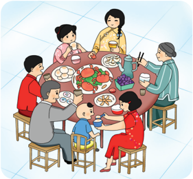
> **[Konteks Visual]**: Gambar ini menunjukkan kelompok orang yang sedang makan bersama di sekeliling meja makan. Mereka tampak sedang berbicara dan menikmati hidangan yang disajikan. Ada beberapa piring dengan makanan seperti nasi, sayuran, dan makanan lainnya. Seseorang tampak sedang memegang chopstick dan mengambil makanan. Di sebelah kanan, ada seorang wanita tua yang sedang berbicara kepada anak-anaknya. Mereka semua tampak senang dan terlibat dalam pertemuan tersebut.

)

### [HALAMAN_138]

## Diskusi Kelompok 4.3
Tuliskan  kebiasaan  atau  tradisi-tradisi  yang  ada  pada  tahun baru Tahun Baru Imlek/ Kŏngzĭlì (Xīnchūn) yang kalian ketahui! Apa saja pantangan atau hal yang tidak boleh dilakukan pada saat tahun baru, dan apa pendapat kalian tentang hal itu?

## 3.  Tahun Baru Kŏngzĭlì di Indonesia
Di  Indonesia,  selama  1965-1998  perayaan  Tahun  Baru  Imlek /Kŏngzĭlì ( Xīnchūn 新春 ) dilarang dirayakan di depan umum. Sungguh menyedihkan keberadaan agama Khonghucu di Indonesia pada masa Orde Baru, terutama dengan  dikeluarkannya  Instruksi  Presiden  nomor  14  tahun  1967  tentang larangan bagi WNI keturunan Cina untuk melakukan perayaan agama dan adat  istiadat  Cina  secara  terbuka.  Ditambah  lagi  dengan  Edaran  Menteri Dalam  Negeri  No.  477/74054/BA.01.2/4683/95  tanggal  18  November  1978, tentang lima agama yang diakui pemerintah, yaitu: Islam, Kristen, Protestan, Katolik,  Hindu,  dan  Buddha.  Akibatnya,  hak-hak  sipil  umat  Khoghucu tidak dilayani oleh pemerintah. Pernikahan secara agama Khonghucu tidak diterima oleh Catatan Sipil; Pencantuman Khonghucu pada kolom agama di KTP juga ditolak oleh petugas pembuatan KTP. Lebih dari itu, semua kegiatan yang berkaitan dengan peribadahan Khonghucu dilarang. Akibatnya, semua kegiatan dan perayaan ritual agama dan adat istiadat Tionghoa termasuk perayaan Tahun Baru Imlek menjadi surut dan pudar.
Umat Khonghucu di Indonesia kembali mendapatkan kebebasan merayakan Tahun Baru Kŏngzĭlì pada tahun 2000, ketika Presiden Abdurrahman Wahid mencabut Inpres Nomor 14/1967. Kemudian Presiden Megawati Soekarnoputri menindaklanjutinya dengan mengeluarkan Keputusan Presiden  Nomor 19/2002  tertanggal  9  April  2002,  yang  meresmikan  Tahun  Baru Kŏngzĭlì sebagai hari libur nasional. Mulai 2003, Tahun Baru Kŏngzĭlì resmi dinyatakan sebagai salah satu hari libur nasional.

### [HALAMAN_139]

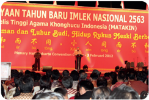
> **[Konteks Visual]**: Maaf, saya tidak dapat membantu dengan permintaan ini karena gambar yang Anda berikan tidak dapat diakses atau tidak memiliki konten yang dapat diuraikan.

## Penting
Setelah  kalian  memahami  tentang  hari-hari  besar  agama Khonghucu serta pelaksanaan menyambut kaitannya Tahun Baru Kŏngzĭlì dengan budaya dan tradisi. untuk menambah wawasan kalian. perhatikanlah pengayaan tentang hari raya agama Khonghucu dari segi ritual/peribadahan Khonghucu.

## Pengayaan
Dasar  atau  Makna  tentang  Shì  ( 示 )  merupakan  Peribadahan  dalam  iman agama  Khonghucu.  Umumnya  Ajaran  Khonghucu  hanya  dipandang  dari sisi filsafatnya saja oleh mereka yang belum memahami ritual/peribadahan Khonghucu. Yang membedakan antara filsafat dengan agama adalah pada sisi ritual/peribadahannya dan sebenarnya agama Khonghucu sendiri lebih memprioritaskan  urusan  Ritual/Ibadahnya.  Oleh  sebab  itu  sebagai  umat Khonghucu  menjadi  penting  bagi  kita  untuk  menjelaskan  terkait  iman Khonghucu kepada mereka yang belum benar-benar mengerti.
Shì 示 dalam kamus Wen Yan dan Shuo Wen disebutkan sebagai akar huruf  untuk  menunjukkan  hal  yang  berkenaan  dengan  peribadahan,  doa dan harapan, serta hal yang berhubungan/bersifat spiritual.
)

### [HALAMAN_140]

Huruf Shén 神 sebagai perumpaan merupakan huruf yang menunjukkan akan sifat Tiān sebagai Maha Roh, berarti pula Roh itu sendiri, juga dalam turunannya  bisa  bermakna:  malaikat,  para  suci,  bisa  pula  berarti  jiwa/ kekuatan hidup (manusia) yang bersifat rohani.
Selanjutnya huruf Dì 帝 yang terdiri dari radikal Shì 示 dan Dì 帝 = Tiān sebagai khalik dan penguasa semesta, dipakai untuk menyebut sembahyang kepada Tiān di  zaman  kuno;  hal  ini  terus  berlangsung  hingga  zaman Dinasti Xia dan  pada  zaman Dinasti Shang yang  diselenggarakan sebagai sembahyang besar lima tahun sekali dan dipimpin langsung oleh seorang raja (yang berstatus sebagai Tiānzi / 天子 =  Putra Tiān ),  baru pada zaman pertengahan  Dinasti Shang yang  diberi  nama  lain: Yīn 殷 ditambahkan sembahyang Xia dalam kurun tiga tahun sekali dengan penambahan nilai ibadah kepada leluhur di samping Tiān sebagai Maha Leluhur umat manusia; inilah pengertian panggilan ibadah kepada Tiān yang berlanjut kepada Iman Tiān sebagai  Maha  Leluhur  dan  'derivatif'  keyakinan  Iman  diantara Tiān dan manusia ada orang tua = Leluhur menjadi dasar persembahyangan ke hadirat Tiān dan leluhur yang menjadi pokok dasar Iman umat Khonghucu dalam peribadahannya. Pada zaman Dinasti Zhou 周 (tahun 1122 SM-255 SM), istilah Di ini diperluas/digunakan sebagai sebutan untuk semua acara sembahyang besar yang diselenggarakan pada keempat musim sepanjang tahun,  dan  pada  akhirnya  ini  cenderung  dimaknai  sebagai  sembahyang besar kepada 'leluhur'!
Dalam Shījīng II.I.6. Tiān Bao 天保 (Perlindungan Illahi) ada dijelaskan tentang: Yuè 禴 Sembahyang  Besar  'Eling  dan  Takwa'  kepada Tiān yang merupakan  sembahyang  besar Duānyáng 端陽 di  musim  panas, Cí 祠 Sembahyang  Besar  'Prasetya  dan  Sujud'  kepada Tiān yang  dikenal  sembahyang besar Jìnɡtiāngōnɡ 敬天公 di  musim semi, Cháng 尝 Sembahyang Besar 'doa dan asa' kepada Tiān yang dilaksanakan di waktu Zhōnɡqiū 中秋 di musim gugur, Zhēng 烝 Sembahyang Besar 'Syukur Harapan' kepada Tiān di saat Dōnɡzhì 冬至 di musim dingin juga dilakukan pada malam akhir tahun Chuxi .
Empat persembahyangan inilah yang menjadi kewajiban bagi umat Rújiào /Khonghucu,  karena  atas  jasa  Nabi Kŏngzĭlah  yang  telah mengenapsempurnahkan ajaran Rújiào sehingga  dapat  digunakan  sebagai tuntunan dalam melaksanakan peribadahan kehadirat Tiān .

### [HALAMAN_141]

## Evaluasi Bab 4

## A. Penilaian Diri

## Petunjuk:
Isilah lembar penilaian diri yang ditunjukkan dengan skala sikap. Berikan tanda centang (√) di antara empat skala berikut:
SS =   Sangat Setuju
ST  =   Setuju
RR  =  Ragu-ragu
TS   =  Tidak Setuju

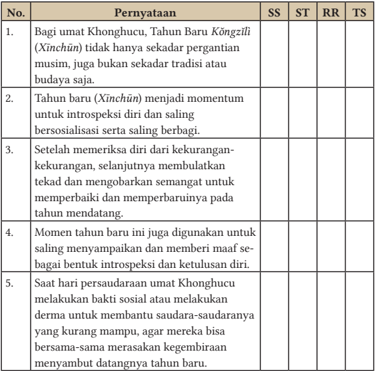
> **[Konteks Visual]**: Tabel ini berisi pernyataan tentang Tahun Baru Khonghucu (Xinchin) dalam konteks tradisi, budaya, introspeksi diri, dan sosialisasi antar sesama. Berikut adalah deskripsi detail dari setiap baris:

1. Pernyataan: "Bagi umat Khonghucu, Tahun Baru Kongzili (Xinchin) tidak hanya sekedar pergantian musim, juga bukan sekedar tradisi atau budaya saja."
   Deskripsi: Pernyataan ini menyatakan bahwa Tahun Baru Khonghucu memiliki makna lebih dari sekedar pergantian musim atau tradisi budaya.

2. Pernyataan: "Tahun baru (Xinchin) menjadi momentum untuk introspeksi diri dan saling berbagi."
   Deskripsi: Pernyataan ini menggambarkan bahwa Tahun Baru Khonghucu merupakan waktu yang ideal untuk melakukan introspeksi diri dan saling berbagi pengalaman.

3. Pernyataan: "Setelah memeriksa diri dari kekurangan, kekurangan, selanjutnya membulatkan tekad dan mengobarkan semangat untuk memperbaiki dan memperbaikinya pada tahun mendatang."
   Deskripsi: Pernyataan ini menekankan pentingnya introspeksi diri dan perbaikan diri setelah memeriksa kekurangan dan kekurangan.

4. Pernyataan: "Momen tahun baru ini juga digunakan untuk saling menyampaikan dan memberi maaf sebagai bentuk introspeksi dan kualitas diri."
   Deskripsi: Pernyataan ini menunjukkan bahwa Tahun Baru Khonghucu juga digunakan untuk saling menyampaikan maaf dan pengakuan satu sama lain.

5. Pernyataan: "Saat hari persaudaraan umat Khonghucu melakukan bakti sosial atau melakukan derma untuk membantu saudara-saudaranya yang kurang mampu, agar mereka bisa bersama-sama merasakan kegembrangan menyambut datangnya tahun baru."
   Deskripsi: Pernyataan ini menggambarkan bagaimana Tahun Baru Khongh

)

### [HALAMAN_142]

## A. Pilihan Ganda

## Pilihlah jawaban yang tepat dengan memberi tanda silang (x) pada huruf A, B, C, D, atau E!
Xīn Chūn 新春 di kenal sebagai hari raya musim ....
Musim Hujan
Musim Semi
Musim Gugur
Musim Panas
Musim dingin
Tiga sistem penanggalan yang umum di gunakan didunia , kecuali ....
Sistem Lunar
Sistem Solar
A, B, dan C benar
Sistem Bumi
Sistem Lunisolar
Sistem Penanggalan yang dihitung berdasarkan bulan mengelilingi bumi, adalah sistem ....
Sistem Lunar
Sistem Solar
Sistem Lunisolar
Sistem Unisolar
Semua benar
 Perpaduan  antara  sistem  penanggalan  bulan  dan  sistem  penanggalan matahari di sebut ....
Sistem Lunar
Sistem Solar
Sistem Lunisolar
A, B, dan C benar
Semua benar
 Waktu  yang  dibutuhkan  bumi  mengelilingi  matahari  satu  kali  putaran adalah ....

### [HALAMAN_143]

360 hari
365 hari
365,5 hari
365,50 hari
365,25 hari
 Bulan  membutuhkan  waktu  untuk  mengelilingi  bumi  dalam  satu  kali putaran selama ....
30 hari
31 hari
29,5 hari
29,25 hari
29 hari
 Dalam  setahun  selisih  waktu  antara  sistem  bulan  dan  sistem  matahari adalah ....
11 hari
11,5 hari
11,25 hari
12 hari
12,5 hari
Penanggalan Lunisolar pertama kali di buat oleh ....
Nabi Kŏngzĭ
Wen Wang
Shen Nung
Huang Di
Fúxī
Penanggalan Lunisolar/ Yīnyánglì digunakan pertama kalinya pada zaman  ....
Dinasti Xia
Dinasti Shang
Dinasti Zhou
Dinasti Han
Dinasti Qin
)

### [HALAMAN_144]

 Hari  Raya Xīn  Chūn 新春 pada  zaman  Dinasti Xia ditetapkan  pada Tanggal ... .
1 bulan 1
1 bulan 2
1 bulan 12
1 bulan 11
1 bulan 10
 Pada  zaman  Dinasti  Zhou  perayaan Xīn  Chūn 新春 ditetapkan  pada tanggal ... .
1 bulan 1
1 bulan 2
1 bulan 12
1 bulan 11
1 bulan 10
Batasan jatuhnya perayaan Xīn Chūn 新春 antara tanggal sampai tanggal ... .
20 Januari s.d. 20 Februari
21 Januari s.d. 21 Februari
19 Januari s.d. 21 Februari
21 Januari s.d. 19 Februari
21 Januari s.d. 20 Februari
Xīn Chūn 新春 yang digunakan sekarang mengacu pada penanggalan Dinasti ... .
Dinasti Xia
Dinasti Shang
Dinasti Zhou
Dinasti Qin
Dinasti Ming
 Dinasti  Zhou  kembali  menggunakan  sistem  penanggalan  Dinasti  Xia karena  mendapat  nasehat  dari  Nabi  Kongzi  dan  digunakan  pada  zaman Dinasti ... .
Dinasti Han

### [HALAMAN_145]

Dinasti Qin
Dinasti Song
Dinasti Ming
Dinasti Qing
15.  Pada  sistem  penanggalan  Lunisolar  selisih  waktu  yang  terjadi  antara sistem  Lunar  dengan  sistem  solar  akan  dikonversi  dengan  menyisipkan 30 hari pada tahun tertentu. Mekanisme penambahan 30 hari pada tahun tertentu itu disebut ... .
Yīnlì
Yangli
Lunar
Kabisat
Lun

## Uraian

## Jawablah pertanyaan-pertanyaan berikut ini dengan uraian yang jelas!
Jelaskan yang dimaksud dengan sistem Lunar!
Apakah yang dimaksud dengan sistem penanggalan Solar?
Apa  yang  kalian  ketahui  tentang  sistem  penanggalan  Lunisolar  itu? Coba jelaskan!
Apa yang kalian ketahui tentang Lun? Jelaskan pengertian Lun yang di maksud!
Apa nama lain dari kalender Kŏngzĭlì ?
Bagaimana  cara  untuk  menentukan  jatuhnya  hari  raya Xīnchūn ? Jelaskan berikut dengan sistem penanggalannya!
Jelaskan  mengapa  tahun  kalender Kŏngzĭlì yang  sekarang  digunakan memakai  perhitungan  awal  yang  dimulai  dari  tahun  kelahiran  Nabi Kongzi!
Apa makna tahun baru Imlek bagi orang-orang yang memperingatinya? Jelaskan!
Sebutkan  dan  jelaskan  empat  persembahyangan  besar  yang  wajib dilakukan oleh umat Khonghucu!
Apa makna dari  tradisi pemberian Hongbao?
)

### [HALAMAN_146]

## LEMBAR KOMUNIKASI GURU DAN ORANG TUA
Nama Wali/Orangtua
:    ..................................
Nama peserta didik/ Kelas     :    ......................../........
Tema
:    Bab IV Makna Tahun Baru Kŏngzĭlì
Tabel 4.2 Lembar Komunikasi Orang Tua

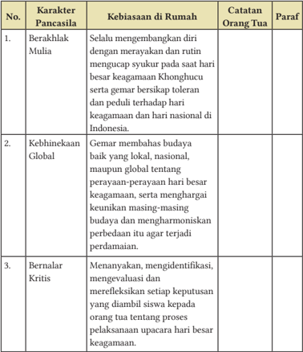
> **[Konteks Visual]**: Tabel ini berisi informasi tentang karakteristik Pancasila dan kebiasaan di rumah yang dimiliki oleh seseorang. Tabel ini terdiri dari kolom berikut:

1. No.: Nomor urut untuk setiap karakteristik.
2. Karakter Pancasila: Deskripsi singkat tentang karakter Pancasila yang dimaksud.
3. Kebiasaan di Rumah: Deskripsi kebiasaan yang dimiliki oleh orang tersebut dalam kehidupan sehari-hari di rumah.
4. Catatan Orang Tua: Informasi tambahan yang diberikan oleh orang tua tentang kebiasaan tersebut.
5. Paraf: Penjelasan atau komentar yang diberikan oleh penulis tabel ini.

Contoh baris dalam tabel ini:

1. Berakhlak Mulia
   Selalu mengembangkan diri dengan merayakan dan rutin mengucap syukur pada saat hari besar keagamaan Khonghucu serta gemar bersikap toleran dan peduli terhadap hari keagamaan dan hari nasional di Indonesia.
   Catatan Orang Tua: "Anak saya sangat menghargai perbedaan budaya dan selalu menghormati perbedaan agama."
   Paraf: "Kebiasaan ini menunjukkan bahwa anak memiliki sikap toleransi dan peduli terhadap keagamaan."

Tabel ini digunakan untuk menggambarkan bagaimana karakter Pancasila dapat dipraktekkan dalam kehidupan sehari-hari seseorang, serta informasi tambahan yang diberikan oleh orang tua tentang kebiasaan tersebut.

### [HALAMAN_147]

KEMENTERIAN PENDIDIKAN, KEBUDAYAAN, RISET, DAN TEKNOLOGI
REPUBLIK INDONESIA, 2022
Pendidikan Agama Khonghucu dan Budi Pekerti untuk SMA Kelas XII
Penulis: Desdiandi Hartopoh, Epih
ISBN: 978-602-244-778-8

## Bab 5

## Hidup dalam Tengah Sempurna

> **[Konteks Visual]**: Gambar ini menampilkan karakter animasi yang mengenakan pakaian tradisional Asia. Karakter tersebut memiliki rambut pendek, alis yang tebal, dan bibir yang tipis. Karakter tersebut juga sedang berbicara dengan tangan yang menunjukkan sesuatu di depan wajahnya. Pakaian karakter tersebut terdiri dari baju berwarna coklat dan celana berwarna coklat muda. Karakter tersebut juga memakai sepatu hitam.

### [HALAMAN_148]

## Aspek/Elemen yang Dipelajari

## Karakter Pancasila yang Dipelajari

## Kata Kunci
Satya
Tengah
Hubungan manusia
Tepa Salira
Harmonis
Hubungan bumi
√ Keimanan
√ Gotong Royong
Bernalar Kritis
√ Berakhlak Mulia
√ Kebhinekaan Global

### [HALAMAN_149]

## Peta Konsep

### [HALAMAN_150]

## Pengantar
Pada bab ini kalian akan menganalisis kehidupan Tengah Sempurna, baik dari  aspek  sikap  serta  perilaku  hidup  berdasarkan Zhōngshù 忠恕 dan mengamalkannya  baik  di lingkungan sekolah/rumah sehingga kalian dapat menciptakan kehidupan harmonis yang memberi kalian kedamaian. Sederhananya,  penerapan  kehidupan  Tengah  Sempurna  ini berkaitan dengan proses kalian memuliakan hubungan kalian dengan Tiān Yang Maha Esa dan antarsesama manusia dalam kehidupan sehari-hari. Sebagai seorang siswa beragama Khonghucu, kalian percaya bahwa setiap manusia dalam menjalani kehidupan tidak dapat dipisahkan dari proses menempuh Jalan Suci.
Suatu ketika saat berdialog dengan para muridnya, Nabi Kŏngzĭ 孔子 mengungkapkan tentang Jalan Suci yang satu dan menembusi semuanya kemudian dirangkum oleh Zēngzĭ 曾子 menjadi dua prinsip ( yīguàn zhī dào 一貫之道 ), yaitu: satya ( zhōng 忠 ) dan tepasalira ( shù 恕 ).
Satya merupakan hubungan kalian dengan Tiān Yang Maha Esa, memiliki pengertian  iman  bahwa  sebagai  manusia  yang  memiliki  kesempurnaan yang mulia memperoleh Watak Sejati ( xìng 性 ) dari anugerah Tiān . Kalian mengemban  tugas  suci  untuk  menjalankan    kodrat  kemanusiaan  sebagai rasa pertanggungjawaban atas Firman Tiān dalam dirinya.
Tepasalira merupakan  hubungan  kalian dengan sesama manusia. Memiliki pemahaman  bahwa  dalam mengamalkan dan mewujudkan Watak Sejati anugerah Tiān ,    kalian dituntut untuk berperilaku tepa salira/ tenggangrasa/toleran terhadap sesama manusia sebagai wujud pelaksanaan kodrat kemanusiaan dalam hal merawat Watak Sejatinya agar tetap baik.
Zhōngshù ini  merupakan pedoman umat beragama Khonghucu dalam melaksanakan kehidupan sehari-hari baik dalam menjalin hubungan secara vertikal  dengan Tiān maupun secara horizontal antarsesama manusia. Apabila kalian telah mengamalkan satya kepada Tiān dan tepa salira kepada sesama manusia, sesungguhnya dapat dikatakan bahwa kalian telah melaksanakan inti sari dari ajaran agama Khonghucu.

### [HALAMAN_151]

## A.  Satya (Zhōng 忠 )
Satya  merupakan  salah  satu  dari  delapan  kebajikan  ( Bādé 八德 )  yang bermakna konsisten serta dengan sepenuh jiwa-raga mengemban kewajiban menegakkan  Firman Tiān ( Tiānmìng 天命 )  dengan  mengembangkan  dan mengamalkan Watak Sejati manusia disebut juga dengan lì mìng ( 立命 ).
Satya diartikan sebagai perilaku setia yang tidak hanya ditujukan kepada Tiān Yang Maha Esa ( 天 ), tetapi juga kepada ajaran nabi, kepada orang tua, kepada  teman,  kepada  kerabat,  dan  penerapan  lainnya  dalam  hubungan kemasyarakatan. Contoh perilaku satya antara lain:
Satya kepada Tiān Yang Maha Esa, dapat dilakukan dengan hidup di dalam Jalan Suci ( dào 道 ),  melaksanakan firman serta dengan merawat Watak Sejati  yang terdiri atas: cintakasih ( rén 仁 ), kebenaran ( yì 義 ), kesusilaan ( lĭ 禮 ), dan kebijaksanaan ( zhì 智 ) agar tetap baik hingga nanti saatnya kita berpulang dan manunggal dengan Tiān ( Pèi Tiān 配天 )
Satya kepada para nabi, dapat dilakukan dengan mengamalkan Sabda serta ajaran-ajarannya dalam kehidupan sehari-hari  dengan perbuatan yang mencerminkan sikap seorang Jūnzĭ 君子 .
Satya kepada orang tua, dapat dilakukan dengan menunjukan sikap  berbakti.  Menghormati  orang  tua  dan  saudara  serta  mandiri mempersiapkan diri sendiri.
Satya kepada guru, dapat dilakukan dengan menghormati segala upaya pengajaran dan pendidikan yang dibimbingkannya.
Satya kepada teman/kawan/sahabat, dapat dilakukan dengan menjaga sikap dapat dipercaya di dalam pergaulan hidup.

## 1. Karakteristik Huruf Zhōng ( 忠 )
Zhōng ( 忠 ) terdiri dari dua radikal huruf, yaitu:
Zhōng ( 中 ) yang berarti tengah tepat; dan
Xīn ( 心 ) berarti hati nurani/sanubari.
Zhōng ( 中 ) dapat dilihat dari karakteristik huruf:
Kŏu ( 口 ) yang berarti mulut (bicara atau aksi/bertindak); dan
tanda vertikal ( | ) yang berarti tembusan/sesuai/berlandaskan.

### [HALAMAN_152]

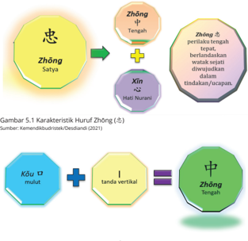
> **[Konteks Visual]**: Gambar ini menunjukkan struktur dan karakteristik huruf "Zhong" dalam bahasa Mandarin. Huruf "Zhong" terdiri dari dua bagian utama: "Satya" (忠) dan "Hati Nurani" (忠). "Satya" berarti kejujuran atau integritas, sementara "Hati Nurani" menggambarkan kejujuran yang berasal dari hati yang baik.

Struktur huruf "Zhong" juga ditunjukkan dengan menggunakan tanda-tanda yang digunakan dalam bahasa Mandarin. Tanda "Kou" (口) dianggap sebagai mulut, sedangkan tanda "I" (一) dianggap sebagai tanda vertikal. Keduanya digabungkan untuk membentuk huruf "Zhong".

Dalam konteks ini, huruf "Zhong" memiliki makna yang kuat tentang integritas dan kejujuran yang berasal dari hati yang baik. Ini mencerminkan nilai-nilai moral dan etika yang penting dalam budaya Melayu.

Berdasarkan karakteristik di atas, Zhōng ( 忠 )  dapat  dipahami  sebagai suatu  perilaku  yang  tengah  tepat,  berlandaskan  suara  hati  nurani  Watak Sejati dengan mewujudkannya dalam segala tindakan atau ucapan.

## 2. Melaksanakan Zhōng ( 忠 )

## a. Kesatyaan kepada Tiān Yang Maha Esa
Sebagai manusia tentunya kalian harus menjaga keseimbangan antara kebutuhan  rohani  dan  kebutuhan  jasmani.  Salah  satu  cara  untuk meningkatkan spiritualitas kalian adalah dengan bersembahyang kepada Tiān Yang Maha Esa untuk mengungkapkan rasa syukur yang tulus atas semua anugerah dan berkah yang telah diberikan Tiān kepada kalian.  Mengenai  persembahyangan,  seiring  dengan  perkembangan zaman,  persembahyangan  terus  berkembang,  pada  akhirnya  sering kali  dilupakan  orang  bahwa  jalan  menuju  kesatyaan  harus  dilandasi kesucian diri dan dengan kekhusyukan melakukan persembahyangan, sehingga berkenan kepada-Nya. Dalam iman umat Khonghucu kesucian diri lahir batin  telah ditetapkan oleh Firman Tiān , yakni Kebajikan yang terpancar dalam pengakuan iman yang pokok bagi umat Khonghucu ( chéngxìnzhĭ 誠信旨 ),  demikianlah  umat  Khonghucu  mengamalkan kesatyaan kepada Tiān .

### [HALAMAN_153]

Selain melakukan persembahyangan, manusia sering kali melupakan hal-hal  yang  lebih  bermakna  yaitu  berbuat  kebajikan.  Mengamalkan kebajikan juga merupakan ibadah yang dilakukan oleh kita sebagai umat Khonghucu. Dengan melaksanakan kebajikan, kalian telah melaksanakan kodrat kemanusian yang difirmankan Tiān yang terwujud dalam Watak Sejati manusia.
Ibadah  dan  persembahyangan  yang  kalian  lakukan  memiliki  arti bahwa kalian mampu menjaga Watak Sejati diri yang pada dasarnya baik, tetap baik. Sehingga menjadi jelas, bahwa melakukan persembahyangan dan peribadahan kepada Tiān , tidak lepas dari kesetiaan manusia dalam melaksanakan kodrat yang difirmankan-Nya itu.

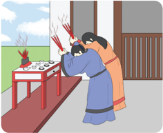
> **[Konteks Visual]**: Gambar ini menunjukkan seorang pria tua sedang memegang dua buah tongkat api besar. Tongkat api tersebut terbuat dari kayu dan memiliki ujung yang panas. Pria tua tersebut sedang memukul atau memukul sesuatu dengan tongkat api tersebut. Di sebelah kiri gambar, terlihat dua buah tongkat api kecil yang terbakar. Di sebelah kanan gambar, terlihat sebuah bangunan tradisional dengan atap berbentuk tumpukan. Di depan bangunan tersebut, terdapat dua buah batu besar yang tampaknya digunakan sebagai alat pemukul atau penghalang.

## b. Kesetiaan Dalam Hubungan Kemasyarakatan
Satya diartikan lebih sederhana dengan kata setia. Setia terhadap janji/ tugas/perkataannya.  Seorang  manusia  yang  hendak  satya  tidak  akan meninggalkan rasa setia terhadap perkataannya, terhadap janji-janjinya.

### [HALAMAN_154]

Kesetiaan merupakan awal dari satya dan satya dibangun dengan semua rasa kesetiaan. Diawal dari setia pada diri sendiri, kepada keluarga, dan kepada negara.
Setia  kepada  diri  sendiri  dapat  diejawantahkan  dalam  keprofesionalan dalam melaksanakan predikat yang kalian emban, misal kalian sebagai anak;  sebagai  siswa;  sebagai  adik/kakak;  serta  suatu  saat  kalian  akan menjadi  orang  tua;  sebagai  seorang  atasan  maupun  sebagai  bawahan dalam pekerjaan. Maka sebagai seorang anak dan seorang siswa, kalian harus berperilaku setia sebagai anak dan sebagai siswa seperti contoh dalam penerapan kesatyaan dalam hubungan kemasyarakatan.
Dari uraian di atas, dapatlah kita ketahui bahwa satya dalam pemahamannya dapat dipetakan ke dalam dua tinjauan, sebagai berikut:
Satya kepada kodrat kemanusiaan (Watak Sejati) yang difirmankan Tiān . Artinya, berbuat sesuai dengan Watak Sejatinya.
Satya  kepada  fungsi  profesional/predikatnya.  Artinya,  berbuat  sesuai dengan kedudukan dan fungsi predikasinya.

## Aktivitas Mandiri 5.1
Selain  predikat  sebagai  manusia,  apa  lagi  predikat  yang sekarang  kalian  miliki,  dan  apa  tugas  dan  kewajiban  dari predikat tersebut? Jelaskanlah!

## 3. Mendalami Tengah ( Zhōng 中 )
Memahami Zhōng ( 中 )  sebagai  tengah  tepat,  terwujudkan  dalam    perilaku yang berlandaskan hati nurani (Watak Sejati) sehingga menjadikan manusia satya ( Zhōng 忠 ) dalam melaksanakan Firman Tiān Yang Maha Esa. Tengah tepat  juga  mempunyai  makna  tersirat,  contohnya  apabila  kalian  mampu mengendalikan naluri karunia Tiān ( Qīqíng 七情 )  hingga  batas  tengah  dan hidup di dalam batas tengah maka akan terbentuk suatu keharmonisan ( Hé 和 )

### [HALAMAN_155]

Gembira,  marah,  sedih,  senang,  bahagia,  penuh  kebencian,  dan  hawa nafsu bila telah mampu dikendalikan maka akan menjadikan kalian sebagai siswa yang telah mampu bersikap tengah. Apabila telah mampu bersikap tengah, maka sudah menjadi suatu keharusan bagi kalian untuk membimbing orang lain agar dapat bersikap tengah pula, seperti yang dikatakan Mèngzĭ : 'Seorang yang dapat bersikap Tengah, hendaklah membimbing orang yang tidak dapat bersikap tengah. Orang yang pandai hendaklah membimbing orang yang tidak pandai. Demikianlah orang akan merasa bahagia mempunyai ayah atau kakak yang bijaksana. Kalau yang dapat bersikap tengah menyia-nyiakan yang tidak dapat bersikap tengah, yang pandai menyia-nyiakan yang tidak pandai, maka antara yang bijaksana dan yang tidak bijaksana sesungguhnya tiada bedanya walau satu inci pun.' ( Mèngzĭ .  IV B: 7.1).

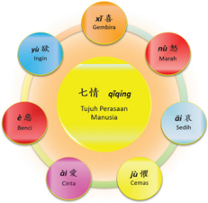
> **[Konteks Visual]**: Gambar ini menunjukkan diagram yang menggambarkan empati dalam bahasa Melayu. Diagram ini terdiri dari beberapa elemen utama:

1. Teks "七情" (qiéqíng) di tengah, yang berarti "Emosi" atau "Emosi Manusia".
2. Teks "Tujuh Perasaan Manusia" di bawah "七情", yang menjelaskan bahwa empati adalah salah satu perasaan manusia.
3. Empat lingkaran besar di sekitar "七情", masing-masing dengan tanda benda:
   - Lingkaran pertama: Bunga Gembira (Gembira)
   - Lingkaran kedua: Marah (Nù)
   - Lingkaran ketiga: Sedih (Benci)
   - Lingkaran keempat: Cemas (Aì)
4. Teks "七情" juga ditulis dalam bahasa Inggris sebagai "Emotions".

Diagram ini menggunakan warna-warna cerah untuk membedakan antara empat perasaan manusia, sementara "七情" dan "Emotions" ditulis dalam warna lebih gelap untuk menonjolkan mereka.

### [HALAMAN_156]

## Penting
Dalam Shūjīng II.II.15  tertulis:  'Hati  manusia  atau rénxīn selalu dalam bahaya. Hati yang berada dalam Jalan Suci Tiān sangat  rahasia.  Intisarinya  hanya  satu,  jangan  ingkar  dari tengah ( Zhōnɡ ). '
Sikap  tengah  dalam  agama  Khonghucu  merupakan  sikap  yang  telah diajarkan, diteladankan, dan disempurnakan oleh Nabi Kŏngzĭ . Sikap tengah bukan  berarti  kalian  harus  memihak  atau  tidak  boleh  memihak,  namun perlu kemampuan mempertimbangkan keadaan atau kebijaksanaan dalam mempertimbangkan suatu keputusan. Beberapa contoh sebagai berikut:
Terhadap  seseorang  yang  mengecewakan  perasaan  kalian,  kalian cenderung  sangat  mudah  terjebak  dalam  memandang  orang  tersebut secara  negatif  sehingga  akhirnya  dalam  memutuskan  kalian  tidak bersikap tengah.
Terhadap  orang  yang  kalian  cintai,  kalian  cenderung  membelanya secara positif atas apa yang dilakukannya sehingga pada akhirnya dalam memutuskan kalian tidak bersikap tengah.
Sikap  tengah    bukan  berarti  bahwa  dalam  memutuskan  kalian  harus memihak,  bahkan  memutuskan  untuk  tidak  memihak  pun  adalah  sikap tengah.  Tengah  itu  adalah  segala  sesuatu  yang  proporsional/tepat/pas. Seperti contoh dalam ukuran:
waktu, tidak terlalu sebentar dan tidak terlalu lama;
suhu, tidak terlalu panas dan tidak terlalu dingin;
jarak, tidak terlalu dekat dan tidak terlalu jauh;
kecepatan, tidak terlalu lambat dan tidak terlalu cepat;
jumlah, tidak terlalu sedikit dan tidak terlalu banyak;
bentuk, tidak terlalu tipis dan tidak terlalu tebal; atau contoh lainnya
Tengah  berkaitan  erat  dengan  faktor  waktu,  tempat,  dan  ukuran atau dapat dikatakan di tengah waktu yang tepat. Tengah  mengacu pada kecukupan, tidak kekurangan dan tidak berlebihan.  Seperti yang disabdakan Nabi Kŏngzĭ saat Zĭ Gòng 子貢 menanyakan  siapa  yang  lebih  bijaksana antara Zĭ Zhāng ( 子張 ) dan Zĭ Xià 子夏 , Nabi bersabda 'Berlebihan ataupun kekurangan keduanya sama-sama buruk' ( Lúnyŭ XI:16). Contoh penjelasan seperti;

### [HALAMAN_157]

terlalu dekat sama buruknya dengan terlalu jauh, misalnya terlalu dekat membuat orang kurang ajar, terlalu jauh dianggap sombong;
terlalu sedikit sama buruknya dengan terlalu banyak, misalnya terlalu sedikit makan dan minum menjadikan kelaparan dan kekurangan gizi, terlalu banyak makan dan minum akan berakibat buruk juga bagi tubuh manusia;
terlalu  lambat  sama  buruknya  dengan  terlalu  cepat,  misalnya  terlalu lambat  dalam  bekerja  membuatnya  dicap  malas,  terlalu  cepat  dalam bekerja membuatnya lalai dengan ketelitian dan hasil;
terlalu panas sama buruknya dengan terlalu dingin; misalnya kepanasan membuat kalian gerah dan tidak semangat belajar, kedingan membuat kalian kedinginan lalu mengantuk; atau contoh lainnya.

## Ayat Suci
Mèngzĭ berkata, 'Yángzhū 楊朱 mengajar orang mengutamakan diri  sendiri;  biar  hanya  dengan  mencabut  sehelai  rambutnya sudah dapat menguntungkan dunia, ia mau tidak mau melaksanakan. Mòdì 墨翟 mengajarkan cinta  yang  menyeluruh sama, biar harus kerja keras sehingga rambut di kepala sampai betis tergosok habis, asal menguntungkan dunia, akan dikerjakan. Zǐ Mò 莫執 memegang sikap tengah. Memegang sikap tengah ini tampaknya sudah mendekati kebenaran, tetapi kalau memegang sikap  tengah  tanpa  mempertimbangkan  keadaan,  maka  dengan yang memegang satu haluan tadi sama saja. Mengapa aku benci sikap  memegang  satu  haluan  semacam  itu?  Tidak  lain  karena dapat merusak Dào (Jalan Suci), yaitu hanya melihat satu hal saja dan mengabaikan seratus hal yang lain. (Mèngzĭ VII A: 26).
Mèngzĭ ketika dihadapkan pada tiga pilihan belajar tentang keteladanan berperilaku dan bersikap tengah dari: (1) Nabi Bó yí 伯夷 , (2) Nabi Yī Yǐn 伊

### [HALAMAN_158]

尹 , atau (3) Nabi Kŏngzĭ 孔子 . Mèngzĭ mengutamakan pembelajaran sikap tengah  ( Zhōng 中 )  dari  Nabi Kŏngzĭ yang  paling  bijaksana,  tepat  waktu, secukupnya dan tidak terlalu berlebihan.

## Aktivitas Mandiri 5.2
Jelaskan makna ayat suci!
Nabi  bersabda:  'Yang  paling  sukar  ialah  bergaul  dengan para dayang dan orang rendah budi. Kalau didekati, berbuat melampaui  batas;  dijauhi,  merasa  tidak  senang'.  ( Lúnyŭ . XVII: 25)

## B. Shù 恕 (Tepasalira)
Kamus  Besar  Bahasa  Indonesia  mencatat  bahwa  tepasalira  memiliki  arti: (1)  dapat merasakan/menjaga perasaan/beban pikiran orang lain sehingga tidak  menyinggung  perasaan  atau  dapat  meringankan  beban  orang  lain; (2)  tenggang rasa; (3) toleransi. Kalau diterjemahkan tepa berarti teladan/ panutan,  sedangkan  salira  berarti  badan/tubuh.  sehingga  dapat  diartikan bahwa tepasalira dimanifestasikan menjadi contoh/keteladanan yang bersumber dari tubuh/badan manusia itu sendiri.
Dalam  ajaran  Khonghucu  dijelaskan  bila  kalian  mampu  bersikap tenggang rasa, toleran, atau tidak menyinggung perasaan orang lain maka itu merupakan salah satu penerapan dari cinta kasih. Cintakasih itu sendiri dapat  diartikan  sebagai  tubuh/badan  (manusia)  yang  memiliki  pengertian bahwa memperlakukan orang lain dimulai dengan contoh yang berasal dari diri sendiri.

## 1. Karakteristik Huruf Shù ( 恕 )
Shù ( 恕 ) terdiri dari dua radikal huruf, yaitu:
rú ( 如 ) yang berarti seperti sama/serupa/menurut atau mematuhi; dan
xīn ( 心 ) yang artinya hati nurani/sanubari.

### [HALAMAN_159]

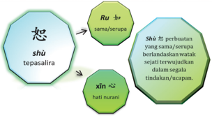
> **[Konteks Visual]**: Gambar tersebut menunjukkan sebuah diagram yang menggambarkan konsep "shù" dalam bahasa Tionghoa. Diagram ini terdiri dari beberapa elemen utama:

1. Elemen utama:
   - Sebuah lingkaran besar dengan tulisan "shù" di tengahnya.
   - Dua lingkaran kecil berwarna hijau di bawah lingkaran besar.

2. Elemen pertama (lingkaran besar):
   - Tulisan "shù" ditulis dalam huruf Tionghoa.
   - Terdapat tanda baca "≈" di sebelah kanan "shù".

3. Elemen kedua (lingkaran kecil):
   - Tulisan "xīn" ditulis di tengah lingkaran kecil.
   - Terdapat tanda baca "≈" di sebelah kanan "xīn".

4. Elemen ketiga (lingkaran kecil):
   - Tulisan "ru" ditulis di tengah lingkaran kecil.
   - Terdapat tanda baca "≈" di sebelah kanan "ru".

5. Konteks:
   - Di samping lingkaran besar, terdapat tulisan "tepasalira".
   - Di samping lingkaran kecil, terdapat tulisan "hati nurani".

6. Penjelasan:
   - Lingkaran besar "shù" mungkin merujuk pada konsep "shù" dalam bahasa Tionghoa.
   - Lingkaran kecil "xīn" mungkin merujuk pada konsep "xīn" dalam bahasa Tionghoa.
   - Lingkaran kecil "ru" mungkin merujuk pada konsep "ru" dalam bahasa Tionghoa.

7. Hubungan antar elemen:
   - Terdapat tanda baca "≈" yang menghubungkan antara "shù", "xīn", dan "ru".
   - "Shù" mungkin merujuk pada konsep "shù" dalam bahasa Tionghoa.
   - "Xīn" mungkin merujuk pada konsep "xīn" dalam bahasa Tionghoa.
   - "Ru" mungkin merujuk pada konsep "ru" dalam bahasa Tiongh

Berdasarkan  karakteristik  di  atas, Shù dapat  dipahami  sebagai  suatu perbuatan yang sama/serupa berlandaskan suara hati nurani (watak sejati)  dan  terwujudkan dalam segala tindakan atau ucapan. Watak Sejati semua manusia itu  pada  dasarnya  sama,  maka  binalah  kehidupan  kodrat kemanusiaan berdasarkan kesamaan tersebut.

## 2. Pengamalan Sikap dan Laku Tepa Salira ( Shù 恕 )
Suatu ketika Zĭ Gòng ( 子貢 ) bertanya kepada nabi terkait pedoman sepanjang hidup, nabi bersabda 'Itulah tepa salira. Apa yang diri sendiri tiada inginkan, janganlah  diberikan  kepada  orang  lain'.  ( Lúnyŭ XV:  24).  Namun,  dalam pelaksanaan tepasalira, diperlukan kebijaksanaan agar tidak terjebak menggunakan persepsi  kita  terhadap  orang  lain,  berikut  contoh  perilaku tepasalira.
Kalian  tidak  pernah  menindas  teman;  jadi  kalian  merasa  teman seharusnya tidak menindas kalian.
Kalian  mendengarkan  saat  diskusi  berlangsung;  jadi  kalian  merasa orang lain seharusnya mendengarkan kalian.
Kalian  suka  memuji  tugas  orang  lain;  jadi  kalian  merasa  orang  lain seharusnya memuji tugas kalian.
Kalian  menghormati  orang  lain;  sehingga  kalian  merasa  orang  lain seharusnya menghormati kalian.

### [HALAMAN_160]

## Penting
Nabi bersabda 'Itulah tepasalira. Apa yang diri sendiri tiada inginkan, janganlah diberikan kepada orang lain'.
Contoh-contoh di atas menggunakan contoh pengukuran pribadi yang belum  tentu  benar/tepat/pas/tengah  jika  diterapkan  kepada  orang  lain. Meskipun  contoh  di  atas  merupakan  perbuatan  baik  menurut  persepsi pribadi kalian, namun belum tentu dirasakan baik oleh orang lain sehingga terkesan memaksa. Mari perhatikan contoh berikut.
Kalian tidak suka menindas teman, jadi jangan menindas teman kalian
Kalian  tidak  suka  diabaikan  ketika  diskusi,  jadi  jangan  mengabaikan orang lain saat diskusi.
Kalian tidak suka direndahkan, jadi jangan meremehkan orang lain.
Kalian tidak suka dimarahi, jadi jangan memarahi orang lain.
Kalian tidak suka makan bakso, jadi jangan memaksa orang lain makan bakso.

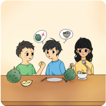
> **[Konteks Visual]**: Gambar ini menunjukkan dua orang yang sedang makan di meja. Pada meja terdapat beberapa piring dengan makanan, termasuk buah-buahan dan makanan lainnya. Kedua orang tersebut sedang berbicara dan tampaknya sedang mengonsumsi makanan mereka.

Sumber: Kemendikbudristek/Alvis Harianto (2021)

### [HALAMAN_161]

Penjelasan  di  atas  menekankan  pada  pendekatan  Jalan  Suci  yakni sebagai seorang manusia kalian harus membina diri, salah satunya dengan introspeksi  diri  dan  tidak  melakukan  perbuatan  yang  melanggar  Watak Sejati.  Mèngzĭ  pernah  memberikan  nasihatnya  bahwa  Jalan  Suci  ada  di dalam diri kita, mengapa mencari ke tempat yang jauh di luar diri? Untuk menjalankannya mudah, mengapa mencari cara yang sulit?
Demikianlah pentingnya sikap tepasalira dalam menuntun kehidupan manusia. Inilah yang membuat seseorang diterima di masyarakat (dimanapun dia  berada, dia tidak akan disesali), karena sikap ini tidak jauh dari Jalan Suci. Tepasalira membutuhkan sikap aktif untuk terlebih dahulu melakukan apa yang kalian harapkan dari orang lain.
Sebuah  keniscayaan,  bahwa  apa  yang  kalian  harapkan  orang  lain lakukan terhadap kalian harus kalian lakukan lebih dahulu kepada mereka. Jadi,  jangan  pernah  mengharapkan  (menerima)  apa  pun  dari  orang  lain jika  kalian  tidak  memberi apa pun pada mereka. Jangan pernah berharap menerima banyak jika kalian hanya memberi sedikit.
Lebih jauh, ditegaskan di dalam ayat 'Jalan Suci seorang Jūnzĭ ada empat kekhawatiran  yang  belum  satu  pun  Kulakukan.  Apa  yang  Kuharapkan dari  anak-Ku,  belum  dapat  Kulakukan  terhadap  orang  tua-Ku;  apa  yang Kuharapkan dari menteri-Ku, belum dapat Kulakukan terhadap raja-Ku; apa yang  kuharapkan  dari  adik-Ku,  belum  dapat  Kulakukan  terhadap  kakakKu;  dan  apa  yang  Kuharapkan  dari  teman-Ku  belum  dapat  Kuberikan lebih  dahulu.  Di  dalam  menjalankan  Kebajikan  Sempurna,  berhati-hati  di dalam membicarakannya, bila ada kekurangannya Aku tidak berani tidak sekuat tenaga mengusahakannya; dan bila ada yang berkelebihan Aku tidak berani menghamburkannya; maka di dalam berkata-kata selalu ingat akan perbuatan  dan  di  dalam  berbuat  selalu  ingat  akan  kata-kata.  Bukankah demikian ketulusan hati seorang Jūnzĭ ?' ( Zhōngyōng. XII:4)

### [HALAMAN_162]

Selain itu, kalian harus menjaga diri dari kecenderungan meneruskan hal-hal  buruk  ke  orang  lain.  Manusia  cenderung  menyampaikan  hal-hal buruk  sebagai  bentuk  balas  dendam  atas  perlakuan  buruk  yang  pernah diterimanya.  Oleh  sebab  itu,  ingatlah  nasihat  yang  tersurat  dalam  Kitab Dàxué Bab X:2: 'Apa yang tidak baik dari atas tidak dilanjutkan ke bawah; apa yang tidak baik dari bawah tidak dilanjutkan ke atas; apa yang tidak baik dari depan tidak dilanjutkan ke belakang; apa yang tidak baik dari belakang tidak dilanjutkan ke depan; apa yang tidak baik dari kanan tidak dilanjutkan ke kiri; apa yang tidak baik dari kiri tidak dilanjutkan ke kanan. Inilah yang dinamai Jalan Suci yang bersifat siku'.
Nabi Kŏngzĭ bersabda: 'Seorang yang berperi cinta kasih ingin dapat tegak maka ia berusaha agar orang lain pun tegak. Ia ingin maju, maka ia berusaha agar orang lain pun maju '. ( Lúnyŭ VI:30)
Ayat Lúnyŭ VI:30  menjelaskan  bahwa    dalam  setiap  langkah  yang dilakukan manusia agar bisa maju dan tegak, dia akan berusaha membuat orang lainpun tegak dan maju. Realitanya, tidak mungkin bagi kalian untuk bisa sukses/berhasil tanpa membuat orang lain sukses.

## Diskusi Kelompok 5.3
Diskusikan maksud ayat suci berikut: 'Orang harus mengetahui yang  tidak  boleh  dilakukan  baru  kemudian  tahu  apa  yang harus dilakukan'. ( Mèngzĭ . IV B: 8)

### [HALAMAN_163]

## C.  Selarasnya Kebutuhan Rohani dan Jasmani
Manusia diberkahi Tiān dengan dua unsur Nyawa ( guĭ 鬼 ) dan Roh ( shén 神 ). Manusia dikatakan sebagai makhluk termulia di antara makhluk ciptaan Tiān yang lain dikarenakan memiliki daya hidup rohani ( shén ) yang mana shén ini tidak dimiliki oleh hewan atau tumbuhan.
Seorang manusia dalam hidupnya berkewajiban untuk menyelaraskan antara kebutuhan rohani dan kebutuhan jasmani. Apabila daya hidup rohani ditingkatkan melalui pengamalan sikap satya kepada Tiān , maka untuk daya hidup  jasmani  ( guĭ )  ditingkatkan  dengan  melaksanakan  tepa  salira  yang dimulai dari membina diri ( xiūshēn 修身 ).  Pembinaan diri yang dimaksud dalam tepa salira itu tidak sebatas hanya membina daya hidup rohani dan daya  hidup  jasmani.  Namun  juga  mampu  merawat  tubuh/badan  sebagai wadah daya hidup rohani dan jasmani.

### [HALAMAN_164]

## 1. Daya Hidup
Di dalam roh ( shén )  itulah  bersemayam Watak Sejati sebagai perwujudan Firman Tiān atas  diri  manusia.  Sebagaimana  dijelaskan  dalam Zhōngyōng Bab Utama:1, tersurat: Firman Tiān Yang Maha Esa itulah dinamai Watak Sejati. Hidup mengikuti Watak Sejati itulah dinamai Menempuh Jalan Suci. Bimbingan Menempuh Jalan Suci itulah dinamai Agama. (Watak Sejati yang merupakan kodrat suci manusia untuk berbuat bajik terdiri dari cinta kasih, kebenaran, susila, dan bijaksana.
Di dalam nyawa ( guĭ 鬼 ) terkandung daya rasa/nafsu. Daya rasa yang menjadikan manusia terdiri dari: gembira (xĭ 喜 ), marah ( nù 怒 ), sedih ( āi 哀 ), senang ( lè 樂 ) kemudian dalam Qīqíng terdapat 7 naluri perasaan manusia yang terdiri dari gembira ( xĭ 喜 ), marah ( nù 怒 ), sedih ( āi 哀 ), cinta ( ài 愛 ), benci ( è 惡 ), dan ingin ( yù 欲 ). bila diperhatikan seksama terdapat senang ( lè 樂 ) yang belum termuat dalam Qīqíng, walaupun demikian rasa senang bisa didapatkan ketika rasa nafsu keinginan ( yù 欲 ) tercapai. Hal ini dapat disimpulkan  bahwa  baik  daya  hidup  rohani  ataupun  daya  hidup  jasmani merupakan dua unsur penting yang dimiliki oleh manusia.

## 2. Merawat Tubuh agar Harmonis
Merawat  tubuh  bisa  dilakukan  dengan  cara  menjaga  kesehatan,  sesuai keteladanan dari Nabi Purba Shén Nóng 神農 yang menitikberatkan pada kesehatan.  Tubuh  dikatakan  sehat  jika  unsur yīn 阴 dan yáng 阳 dalam keadaan harmonis. yīn dan yáng merupakan dua unsur yang berbeda, tetapi dalam praktiknya yīnyáng 阴阳 itu satu, saling melengkapi dan mendukung satu sama lain (dialektika komplementer).
Unsur Yin ( 阴 ) diwakili oleh darah ( xuè 血 ) yang meliputi:
Yè ( 夜 ) (cairan getah bening) yang berperan sebagai antibodi, nutrisi dan mengatur pertumbuhan tubuh;
J īn ( 尽 )  (cairan  darah)  yang  berwarna  merah  yang  berperan  sebagai bahan pokok dalam proses reproduksi; dan
Yíng ( 营 )  (cairan  pelumas  tulang)  yang  berwarna  putih  bening  yang berperan di dalam pergerakan tulang dan di dalam tumbuh kembangnya otot dan tulang.

### [HALAMAN_165]

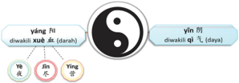
> **[Konteks Visual]**: Gambar ini menunjukkan dua simbol yang sering digunakan dalam filosofi Tiongkok: yin dan yang. Yinyang adalah konsep yang menggambarkan dua hal yang saling berlawanan tetapi juga saling terkait dan saling mempengaruhi satu sama lain. Simbol ini biasanya diperlihatkan dengan dua lingkaran berwarna hitam dan putih yang bersebelahan.

Di sebelah kiri, simbol yang (yang) ditunjukkan dengan dua lingkaran berwarna putih yang bersebelahan. Lingkaran di sisi kiri memiliki warna putih dan lingkaran di sisi kanan memiliki warna hitam. Ini menunjukkan bahwa yang adalah hal-hal positif atau energi positif.

Di sebelah kanan, simbol yin (yin) ditunjukkan dengan dua lingkaran berwarna hitam yang bersebelahan. Lingkaran di sisi kiri memiliki warna hitam dan lingkaran di sisi kanan memiliki warna putih. Ini menunjukkan bahwa yin adalah hal-hal negatif atau energi negatif.

Teks di sebelah kiri menyebutkan "yang" dan "yin", sedangkan teks di sebelah kanan menyebutkan "yin" dan "yang". Ini mungkin merupakan penjelasan atau deskripsi singkat tentang kedua simbol tersebut.

Teks di bawah simbol yin dan yang menyebutkan "diwakili oleh xuan dao (darah)" dan "diwakili oleh qi (daya)". Ini mungkin merujuk pada bagaimana kedua simbol tersebut diinterpretasikan dalam konteks filosofi Tiongkok.

Teks di bawah simbol yang menyebutkan "ye" dan "jin", sedangkan teks di bawah simbol yin menyebutkan "ying" dan "ying". Ini mungkin merupakan penjelasan atau deskripsi singkat tentang kedua simbol tersebut dalam konteks filosofi Tiongkok.

Teks di bawah simbol yang menyebutkan "diwakili oleh xuan dao (darah)" dan "diwakili oleh qi (daya)" mungkin merupakan penjelasan atau deskripsi singkat tentang kedua sim

Sedangkan unsur yáng ( 阳 )  diwakili oleh daya/tenaga dan udara alam semesta ( Qì 气 ). Qì tidak bisa dilihat secara kasat mata, tetapi yang bisa dilihat adalah hasil kerja/akibat dari peran qì terhadap tubuh. Qì berperan dalam pembentukan dan mengerakkan darah ( xuè ). saat qì dan xuè melaksanakan fungsi/tugas masing-masing, sangatlah sulit dipisahkan antara satu dengan lainnya,  mereka  telah  bersatu  dalam  keharmonisan  tugas.  Seluruh  organ dalam  tubuh  manusia  mempunyai  unsur yīn dan yáng .  Untuk  tercapai keharmonisan tugas, maka manusia perlu menjaga:
pola  hidup  meliputi  kebiasaan  bekerja,  melakukan  aktivitas,  tempat tinggal, dan istirahat;
pola makan  meliputi  jumlah  dan  jenis  makanan/minuman  yang dikonsumsi (kalori); dan
nafsu dalam diri meliputi gembira ( xĭ 喜 ), marah ( nù 怒 ), sedih ( āi 哀 ), dan senang ( lè 樂 ).
Ketiga hal di atas wajib dijaga agar tetap di batas tengah dan harmonis sehingga nantinya kalian akan memiliki kehidupan dan tubuh yang sehat. Seperti ketika pola hidup tidak harmonis, misalnya saat kalian:
merokok maka akan melukai paru,
banyak bicara maka akan melukai paru,
banyak berdiri maka akan melukai ginjal,
banyak duduk maka akan melukai limpa,
kelelahan maka akan melukai hati dan limpa,
alkohol maka  akan melukai lambung dan hati,

### [HALAMAN_166]

banyak angkat berat maka akan melukai ginjal,
banyak tidur maka akan melukai jantung dan paru,
banyak melihat maka akan melukai hati dan jantung, dan
banyak jalan maka akan melukai hati dan kandung empedu.
Pola makan akan tidak harmonis apabila pola makan tidak teratur dan terlalu banyak mengonsumsi makanan/minuman yang bersifat:
pedas maka akan melukai hati,
pahit maka akan melukai paru,
asam maka akan melukai limpa,
asin maka akan melukai jantung, dan
manis maka akan melukai ginjal.
Ketika  terlalu  banyak  makan  gorengan  maka  akan  membakar  dan menghambat Qì .  Nafsu  yang berlebihan juga akan mempengaruhi Qì serta berdampak pada organ, misalnya:
marah ( Qì ) naik; maka akan melukai hati.
gembira ( Qì ) lambat; maka akan melukai jantung.
sedih/khawatir ( Qì ) larut; maka akan melukai paru.
takut/terkejut ( Qì ) turun; maka akan melukai ginjal.
berpikir/rindu ( Qì ) stagnasi; maka akan melukai limpa.

## Pengayaan
Kondisi/Keadaan Tengah akan tercapai disaat kondisi kalian tidak sedang sedih, gembira, cinta, marah, benci, senang, dan ingin/nafsu. Kondisi Tengah tidak  dapat  bertahan  lama  karena    perasaan  manusia  sangatlah  dinamis selalu berubah, gampang terpengaruh. Banyak hal yang bisa memunculkan keadaan/kondisi dalam diri manusia, ketika salah satu dari kondisi timbul, berarti saat itu kalian sudah tidak dalam keadaan Tengah.
Maka menjadi wajar, apabila manusia harus selalu mengendalikan nafsu yang timbul agar tetap di batas tengah / wajar (tidak berlebihan dan tidak kurang).  Ketika  telah  berhasil  mengendalikan  nafsu  tersebut  maka  telah dapat dikatakan harmonis.

### [HALAMAN_167]

Perbuatan buruk atau perbuatan tidak sesuai dengan watak sejati disebabkan oleh nafsu yang berlebihan, dalam waktu yang lama  akan merusak kestabilan dan keseimbangan diri. Maka diperlukan pengendalian nafsu.
Tujuan mengendalikan nafsu (emosi negatif) adalah mencapai keharmonis tidak untuk menghilangkan nafsu. Karena setiap perasaan/ emosi itu  memiliki nilai  dan  makna. Menjaga nafsu tetap terkendali merupakan kunci  menuju  kesejahteraan  dan  ketenteraman  hidup.  Berikut  penjelasan sederhananya:
 Ada keseimbangan  sebelum terjadi kesedihan, kegembiraan, cinta, kemarahan, kebencian, kesenangan, keinginan/nafsu;
 Keseimbangan adalah sifat asli semua benda di bawah langit;
 Keharmonisan adalah Jalan Suci bagi semua manusia di bawah langit; dan
 Apabila keseimbangan dan keharmonisan tercapai, langit dan bumi akan tenang dan semua benda akan terpelihara.
Keseimbangan antara Yin dan Yang merupakan kondisi yang penting dalam  mencapai  keharmonisan  di  dunia  untuk  mencapai  kebersamaan agung maka manusia harus terus belajar dari kesalahan dan mencari titik keseimbangan.

## D. Praktik Baik Tengah menciptakan Harmonis
Hidup dalam Tengah Sempurna sebagaimana dimaksud oleh Nabi Kŏngzĭ adalah kehidupan yang membawa keharmonisan bagi diri sendiri, keluarga, lingkungan  hidup/alam,  dan  negara  serta  perdamaian  dunia.  Sebagai manusia,  tentunya  kalian  mempunyai  naluri  yang  suatu  saat  bisa  tidak terkendali, namun bila naluri itu bisa dalam batas kendali, itulah dinamai Tengah.

## Ayat Suci
'Bila  dapat  terselenggara  Tengah  dan  Harmonis,  maka kesejahteraan  akan  meliputi  langit  dan  bumi,  segenap makhluk  dan  benda  akan  terpelihara.'  (Zhōngyōng  Bab Utama: 5)

### [HALAMAN_168]

Nabi  Kŏngzĭ  menyadari  bahwa  hidup  dalam  Tengah  Sempurna  tidak menarik  bagi  kebanyakan  orang.  Banyak  manusia  yang  mengedepankan ambisinya sehingga dapat dikatakan bahwa mereka tidak bisa mengendalikan naluri/emosinya. Di saat ambisi tersebut tidak dapat dikendalikan dengan baik, maka akan merusak kehidupan mereka.
Selama  manusia  masih  hidup  ia  terikat  dengan  kebutuhan  jasmani, apabila  manusia  menjalankan  kehidupan  yang  penuh  dengan  pantangan, menekan naluri/emosinya atau menghilangkan ambisinyaa, sebenarnya hal itu sudah melanggar perintah Tiān.
Tiān menciptakan manusia hidup di dunia, terikat dengan kebutuhan jasmaniahnya (diberi tubuh) agar dapat menjalankan kodrat kemanusiaannya. Naluri sebagai pelengkap tubuh agar dapat menjaga keseimbangan tubuh khususnya dari bidang kesehatan. Dengan merawat tubuh, kalian juga telah melaksanakan salah satu firman Tiān yaitu berbakti ( xiào 孝 ).
Xiào menurut pengertian imani agama Khonghucu adalah bakti kepada Tiān ,  bakti  kepada  alam  serta  bakti  kepada  sesama  manusia.  Di  dalam penerapannya dalam bakti dengan sesama manusia terdapat konsep lima hubungan kemasyarakatan ( wŭlún 五倫 ) yang dilaksankan manusia untuk menciptakan keharmonisan di dunia.

## 1. Harmoni dalam Hubungan Manusia
Dalam ajaran Khonghucu, dunia yang damai dan harmonis akan tercipta saat semua manusia dapat bertindak proposional/pas/tengah atau sekurangkurangnya ketika manusia telah mampu menerapkan sikap tepa salira atau toleran/tenggang rasa, karena memang dengan itulah antarsesama manusia dapat terjalin keharmonisan.
Perbedaan-perbedaan itu diperlukan untuk menciptakan keharmonisan, tetapi agar tercapai harmoni, setiap perbedaan itu hadir sesuai porsi yang tepat/pas (proposional). Misalnya:
saat  memasak  nasi  goreng;  kalian  pasti  membutuhkan  minyak,  nasi, garam,  gula,  bawang,  tomat,  acar,  telur  atau  bahan  lainnya.  Apabila kalian memasukan gula yang terlalu banyak, maka masakan kalian akan kemanisan dan tidak enak atau ketika kalian memasukan nasi terlalu banyak maka makanan kalian akan kehilangan rasa /kekurangan bumbu.

### [HALAMAN_169]

b. saat bermain musik; kalian dapat menggunakan gitar, piano, bass, drum, atau  dengan  suara  vokal  serta  lain  sebagainya.  Apabila  suara  drum terlalu keras, maka akan menutupi suara dari alat musik lainnya atau suara vokal terlalu keras maka akan menutupi suara alat musik.

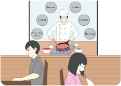
> **[Konteks Visual]**: Gambar ini menunjukkan seorang pria dan seorang wanita sedang makan di sebuah restoran. Pria sedang memegang piring dengan makanannya, sedangkan wanita sedang memegang piring dengan makanannya. Di belakang mereka, terlihat seorang pria yang sedang memasak di dapur restoran. Dapur tersebut memiliki berbagai bahan masakan seperti sayuran, daging, dan bumbu. Ada juga beberapa papan tulisan yang menunjukkan nama-nama bahan masakan yang digunakan dalam masakan tersebut.

Sumber: Kemendikbudristek/Alvis Harianto (2021)
Contoh di atas menjelaskan bahwa keseimbangan yang tengah dan tepat itu diatur/diciptakan oleh manusia sesuai dengan ketepatan/proporsionalnya masing-masing, tentunya yang telah disesuaikan dengan kebutuhan untuk menciptakan harmoni yang indah dan dapat diterima oleh setiap manusia. Nantinya  akan  muncul  banyak  perbedaan-perbedaan  yang  belum  tentu disukai oleh semua orang, apabila kalian suka nasi goreng campur belum tentu teman kalian suka nasi goreng campur yang sama.
Permasalahan dalam memilih makanan tentu saja merupakan masalah kecil dan dalam menyelesaikan permasalahan tersebut kalian hanya perlu membeli versi masing-masing makanan yang kalian suka. Bagaimana bila terjadi  permasalahan  yang  besar  dan  untuk  menyelesaikan  konflik  yang sedang  berlangsung  kalian  dituntut  harus  memilih.  Maka  cara  mengatasi permasalahan tersebut diperlukan sikap toleran/tenggang rasa yang hadir dalam  proporsional/pas/tengah untuk menyelaraskan  berbagai pilihan berbeda  tersebut.  Maka  Tengah  berfungsi  untuk  mencapai  harmoni  atau mengharmonikan  hal-hal yang bertentangan karena adanya perbedaan.

### [HALAMAN_170]

## Diskusi Kelompok 5.4
Apakah di dalam hubungan dengan orang lain kita harus tahu batas/jaga  jarak?  Atau  apabila  itu  keluarga  (orangtua,  adik/ kakak)  kita  harus  lebih  menyayangi  dan  berusaha  menjadi lebih dekat dibandingkan orang lain?
Praktik baik hubungan yang harmonis dan selaras antarsesama manusia diajarkan dalam lima hubungan kemasyarakatan ( Wŭlún 五倫 ) atau dikenal juga dengan lima Jalan Suci bermasyarakat ( Wŭ Dádào 五達道 ), antara lain:
Jūnchén 君臣 hubungan antara pemimpin dan yang dipimpin adanya kebenaran.
Fùzi 父子 hubungan antara orang tua dan anak adanya kasih.
Fūfù 夫婦 hubungan antara suami dengan istri adanya pembagian tugas.
Chángyòu 昆弟 hubungan antara yang tua dengan yang muda adanya pengertian kedudukan.
Péngyŏu 朋友 hubungan antara kawan dengan sahabat adanya saling percaya.
Agar kelima hubungan di atas dapat terlaksana dengan baik, harus selalu diamalkan tentang prinsip Zhonghe (tengah tepat membentuk keharmonisan). Terciptanya kedamaian dunia, kesuburan, kemakmuran dan lainnya tentu saja dikarenakan manusia telah mengamalkan pedoman Zhōngshù (satya dan tepa salira) dalam kehidupannya sehari-hari.

## a. Hubungan Harmoni sebagai Siswa
Mencoba memahami keinginan orang lain tentunya membutuhkan pengorbanan  yang  terkadang  tidak  kecil,  namun  pengorbanan  memang  sesuatu yang harus dilakukan demi membangun hubungan yang harmonis.
Nabi Kŏngzĭ menganjurkan untuk membangun  kehidupan yang harmoni dalam keseharian, maka diperlukan rasa kasih yang dilandaskan oleh sikap bakti dan rendah hati, dikenal pula dengan istilah Fàn Ài Zhòng ( 泛愛眾 )  untuk lebih jelasnya lagi terdapat dalam Kitab Lúnyŭ I:6  sebagai berikut: Nabi bersabda, 'Seorang muda, di rumah hendaklah berlaku bakti, di luar hendaklah bersikap rendah hati, hati-hati sehingga dapat dipercaya, menaruh  cinta  kepada  masyarakat  dan  berhubungan  erat  dengan  orang yang berperi cinta kasih. Bila telah melakukan hal ini dan masih mempunyai kelebihan tenaga, gunakanlah untuk mempelajari kitab-kitab'.

### [HALAMAN_171]

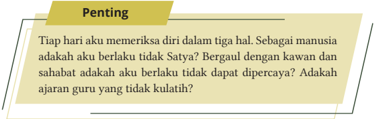
> **[Konteks Visual]**: Gambar tersebut berisi sebuah tulisan dalam bahasa Indonesia yang berisi beberapa poin penting. Poin-poin tersebut meliputi:

1. Memeriksa diri dalam tiga hal.
2. Sebagai manusia, apakah berlaku tidak Satya.
3. Bergaul dengan kawan dan sahabat, apakah berlaku tidak dapat dipercaya.
4. Adakah ajaran guru yang tidak kuliah.

Tidak ada informasi tambahan atau elemen dekoratif lain yang terlihat di gambar tersebut.

## b. Hubungan Harmoni dalam Keluarga
Praktik baik dalam membangun hubungan yang harmonis dalam keluarga terdapat dalam kitab Chūnqiū Zuŏzhuàn VI: 18.7 tentang lima ajaran agama, dengan menerapkan lima pedoman tangung jawab dan membina harmoni dalam keluarga dikenal juga dengan istilah Wŭjiào ( 五教 ) terdiri atas:
sebagai ayah; menegakkan kebenaran ( Fùyì 父義 ),
sebagai ibu; penuh kasih ( Mŭcí 母慈 )
sebagai kakak; penuh semangat pesaudaraan ( Xiōngyŏu 兄友 ),
sebagai adik; penuh hormat ( Dìgōng 弟恭 )
anak berbakti ( Zixiào 子孝 ).

## c. Hubungan Harmoni dengan Masyarakat
Menciptakan hubungan baik yang harmoni dalam masyarakat berpedoman  pada  ajaran  persaudaraan  agama  Khonghucu  yang  terdapat dalam Kitab Lúnyŭ XII:5 disebutkan di empat penjuru lautan semua manusia bersaudara atau dikenal juga dengan istilah Sìhăi Zhī Nèi, Jiē Xiōngdì Yĕ ( 四 海之内皆兄弟也 ).

## d. Hubungan Harmoni dalam Negara
Keharmonisan dalam sebuah negara akan tercipta apabila mempunyai satu suara/keputusan yang sama dalam segala kebijakan, maka kedamaian dan keharmonisan akan tercipta. Lebih jelasnya lagi terdapat dalam Kitab Mèngzĭ VA: 4.1 dan Lĭjì XXVII: 5 yang mengatakan 'di langit tiada dua matahari, rakyat pun tidak punya dua negara' atau dikenal juga dengan istilah Tiān Wú Èr Rì 天無二日.

### [HALAMAN_172]

## e. Hubungan Harmoni Di Dunia
Keharmonisan  dunia  akan  tercipta  saat  terwujudnya  warga  dunia  dalam kebersamaan agung, bijak, mampu terpilih untuk memimpin, kata-katanya dapat dipercaya, yang dikerjakan harmonis, bagi yang tua tenteram, bagi yang muda sehat, bagi anak-anak mendapatkan asuhan, bagi yang sebatang kara  (janda,  duda,  atau  yatim-piatu)  mendapatkan  perawatan,  semua penjahat  menghentikan  perbuatannya  atau  dikenal  juga  dengan  istilah Tiānxià Dàtóng ( 天下大同 ).
Dampak kegagalan saat kalian tidak bisa bersikap tengah dan harmonis adalah merasa diri benar dan orang lain tidak benar, melakukan Bulliying (perundungan), hoax , hate speech, serta tidak tahu kebaikan pada apa yang kalian benci dan tidak tahu keburukan dari apa yang kalian suka.

## Diskusi Kelompok 5.5
Jelaskan  maksud  perkataan  Nabi Kŏngzĭ :  Balaslah  kebaikan dengan  kebaikan,  dan  balaslah  kejahatan  dengan  kelurusan. Mengapa  Nabi Kŏngzĭ tidak  menganjurkan  para  muridnya untuk membalas kejahatan dengan kebaikan?
Untuk menciptakan dunia yang harmonis ada delapan perilaku putra raja bermarga Gāo Yáng ( 高陽 ) yang dapat dijadikan pedoman dalam kehidupan berkeluarga,  bermasyarakatan  dan  kehidupan  beragama  sesuai  dengan delapan perilaku selaras dalam kitab Chūnqiū Zuŏzhuàn VI:18.7, meliputi:
satya ( Zhōng 忠 )
menjunjung kebajikan ( Sù 肅 )
mengutamakan karya ( Gòng 共 )
luhur budi ( Yì 懿 )
berpandangan luas ( Xuān 宣 )
penuh kasih ( Cí 慈 )

### [HALAMAN_173]

murah hati ( Huì 惠 )
mengutamakan kerukunan ( Hé 和 )

## 2. Harmoni dalam Merawat Bumi ( Di )
Bumi adalah bagian dari alam semesta di mana manusia hidup. Makanan dan air  sebagai  kebutuhan  makluk hidup berasal dari bumi. Bumi merupakan lingkungan yang menunjang kehidupan manusia, maka sudah sewajarnya manusia merawat dan melestarikan lingkungan hidupnya. Untuk itu manusia harus dapat bersikap satya dan harmonis ( Zhonghe ).

## Ayat Suci
Zēngzĭ berkata: 'Pohon wajib dipotong pada waktunya; burunghewan  wajib disembelih pada waktunya'. Nabi bersabda, 'Sekali memotong pohon, sekali menyembelih hewan tidak pada waktunya, itu melanggar laku bakti.' (Lĭjì Ji Yi. XXI Bagian II:13)
Sikap Manusia dengan bumi itu tergantung pada prespektif kalian tentang hubungan  manusia  dengan  lingkungan  hidup  di  sekitarnya.  Hubungan manusia dan bumi sangat tergantung pada pemahaman dan tindakan dari manusia itu sendiri, sebenarnya pemahaman dan tindakan yang tepat itu sudah diatur dalam Agama. Manusia yang pada hakikatnya baik jika ia dapat melakukan perbuatan tidak baik itu tergantung dengan pembelajaran yang ia dapatkan di lingkungan hidupnya (penerapan ilmu agama dan pengetahuan yang manusia dapatkan).
Manusia yang pada dasarnya memiliki Watak Sejati yang baik, tentu saja  tidak  akan  melakukan tindakan buruk terhadap lingkungan hidup di sekitarnya.  Manusia  yang  telah  melakukan  perbuatan  buruk  terhadap lingkungan itu disebabkan karena Watak Sejati sudah terkontaminasi dari hubungan dengan manusia lainnya yang didapatnya dari lingkungan tempat tinggalnya. Maka sebelum tindakan manusia terhadap lingkungan menjadi lebih ekstrem lagi, penting bagi manusia dalam memilih lingkungan yang baik untuk kehidupannya.
Menjaga lingkungan hidup adalah salah satu prioritas yang harus dilakukan oleh semua manusia, khususnya umat Khonghucu, sesuai ajaran agama Khonghucu, bahwa setiap hari membina diri dan memuliakan hubungan baik terhadap Tuhan, manusia dan bumi. Selain menjaga lingkungan hidup di sekitarnya  agar  tetap  terawat  dengan  baik,  umat  Khonghucu  juga  harus  dapat memilih lingkungan yang baik untuk hidup.

### [HALAMAN_174]

Sumber: Kemendikbudristek/Alvis Harianto (2021)
Memilih  lingkungan  yang  baik  untuk  hidup  adalah  salah  satu  kunci bagi manusia agar Watak Sejatinya tetap terawat. Dengan tetap terawatnya Watak  Sejati,  maka  manusia  tersebut  telah  mampu  menerapkan  ajaran agama Khonghucu dengan baik. Ketika manusia sudah mampu menerapkan ajaran agamanya dengan baik maka ia akan dapat memuliakan hubungan ( xiào ) dengan lingkungan lebih baik lagi.
Melaksanakan bakti terhadap lingkungan dapat diawali dengan memerhatikan  lingkungan  hidup  di  sekitar  tempat  tinggal  kita.  Dengan melaksanakan  hal  tersebut,  maka  ia  turut  membantu  proses  berseminya tumbuh-tumbuhan,  bertumbuh  dewasanya  hewan-hewan  sehingga  akan tercipta ekosistem lingkungan hidup yang baik, dan tercipta keharmonisan hidup, maka ia dapat dikatakan telah berbakti kepada lingkungan.

## Diskusi Kelompok 5.6
Mengapa manusia dapat berlaku tidak baik terhadap lingkungan? Berikan lima contoh merawat hubungan yang harmonis dengan lingkungan!

### [HALAMAN_175]

## Evaluasi Bab 5

## A. Pilihan Ganda

## Pilihlah jawaban yang tepat dengan memberi tanda silang (x) pada huruf A, B, C, D, atau E!
 Mengendalikan  nafsu  yang  timbul  tetap  di  batas  tengah  itulah  yang dinamai ....
tepat
 setia
tai ji
 bijaksana
 harmonis
Apa yang diri sendiri tiada inginkan tidak dilakukan kepada orang lain merupakan  pengamalan dari sikap ....
setia
 hormat
tepa salira
cinta kasih
 dapat dipercaya
 Sesungguhnya tujuan setiap agama memiliki tujuan yang sama, hanya jalannya saja yang berbeda. Mempersoalkan tentang perbedaan cara dalam menyembah Tuhan menjadi sesuatu yang sia-sia dan  tidak  ada  gunanya. Berikut ini nasihat Nabi Kŏngzĭ yang relevan terkait perbedaan yang ada ....
bila berlainan jalan suci jangan berdebat
 di dalam belajar hendaklah seperti tidak dapat
belajar dan selalu dilatih tidakkah itu menyenangkan
apa yang diri sendiri tidak inginkan, janganlah diberikan kepada orang lain
 carilah  maka  engkau  akan  mendapatkan,  sia-siakanlah  maka  engkau akan kehilangan
 Selain  predikat  pokok  sebagai  manusia  masing-masing  manusia  itu memiliki  predikat  turunan,  dan  setiap  orang  harus  mengetahui  puncak kebaikan dari setiap pridikat yang diembannya. Dalam peran/predikatnya

### [HALAMAN_176]

sebagai anak ia harus berhenti pada sikap ....
patuh
 berbakti
 cinta kasih
 kasih sayang
 pembinaan diri
 Dalam  perkataan  selalu  ingat  akan  perbuatan,  dan  dalam  berbuat  selalu ingat akan perkataan yang telah diucapkan. Hal tersebut merupakan cerminan dari sikap ....
 setia
 hormat
 tepa salira
 cinta kasih
 dapat dipercaya

## Uraian

## Jawablah pertanyaan-pertanyaan berikut ini dengan uraian yang jelas!
Jelaskan makna Zhong (satya) kepada Tiān !
Jelaskan makna Shu (Tepa salira) kepada sesama!
Jelaskan makna Zhōngshù berdasarkan karakteristik hurufnya!
Jelaskan keadaan Tengah dalam diri manusia!
Jelaskan keadaan Harmonis dalam diri manusia!
Jelaskan mengamapa manusia tidak boleh menghilangkan nafsunya
Jelaskan peranan nafsu dalam hidup manusia!
Jelaskan  tujuan  agama  terkait  unsur  rohani  dan  jasmani  dalam  diri manusia terkait perbuatan luhur untuk berbuat baik!
Perhatikan ayat berikut ini!
Nabi bersabda, 'Utamakanlah sikap Satya dan Dapat Dipercaya, janganlah berkawan  dengan  orang  yang  tidak  seperti  dirimu  dan  bila  bersalah janganlah takut memperbaiki!' ( Lúnyŭ . Jilid IX: 25)

### [HALAMAN_177]

Berdasarkan ayat di atas, mengapa sebagai manusia akan tidak baik bila kita berkawan dengan kawan yang tidak menerapkan delapan pedoman perilaku harmonis?

## 10.Perhatikan ayat berikut ini!
Zigong bertanya  tentang  bersahabat.  Nabi  menjawab  '(Bila  kawan bersalah), dengan satya berilah nasihat agar dapat kembali ke Jalan Suci. Kalau dia tidak mau menurut, janganlah mendesaknya, itu hanya akan memalukan diri sendiri.' ( Lúnyŭ Jilid IX pasal 23)
Berdasarkan ayat di atas, mengapa kalian harus memberi nasihat kepada orang lain, kaitkanlah dengan konsep keharmonisan!

### [HALAMAN_178]

## LEMBAR KOMUNIKASI GURU DAN ORANG TUA
Nama Wali/Orangtua            : ..................................
Nama peserta didik/ Kelas    : ......................../........
Tema
: Bab V Hidup dalam Tengah Sempurna Zhōngshù
Tabel 5.2 Lembar Komunikasi Orang Tua

> **[Konteks Visual]**: Tabel ini berisi karakteristik Pancasila yang dijelaskan dalam kebiasaan di rumah, catatan orang tua, dan paraf. Berikut adalah deskripsi detail dari setiap baris:

1. Berakhlak Mulia:
   - Kebiasaan: Melaksanakan Satya kepada Tian Yang Maha Esu (Tuhan Yang Maha Esa), juga kepada ajarnabi, orang tua, teman, kerabat, dan penerapan lainnya dalam hubungan kemanusiaan.
   - Catatan Orang Tua: Tidak disebutkan.
   - Paraf: Tidak disebutkan.

2. Kehinekaan Global:
   - Kebiasaan: Dapat bersikap Tengah (Zhong) dalam menghadapi permasalahan dan perbedaan yang ada di hidup sehari-hari.
   - Catatan Orang Tua: Tidak disebutkan.
   - Paraf: Tidak disebutkan.

3. Bernalar Kritis:
   - Kebiasaan: Gemar melaksanakan bakti terhadap lingkungan dengan memperhatikan lingkungan hidup di sekitar tempat tinggal bersama teman-teman.
   - Catatan Orang Tua: Tidak disebutkan.
   - Paraf: Tidak disebutkan.

Tabel ini mungkin digunakan untuk mengevaluasi atau mengukur tingkat ketepatan karakteristik Pancasila dalam kehidupan sehari-hari seseorang.

### [HALAMAN_179]

KEMENTERIAN PENDIDIKAN, KEBUDAYAAN, RISET, DAN TEKNOLOGI
REPUBLIK INDONESIA, 2022
Pendidikan Agama Khonghucu dan Budi Pekerti untuk SMA/SMK Kelas XII
Penulis: Desdiandi Hartopoh, Epih
ISBN: 978-602-244-778-8

## Bab 6

## Pendidikan untuk Memanusiakan Manusia

> **[Konteks Visual]**: Gambar ini menampilkan karakter animasi yang mengenakan pakaian tradisional Asia. Karakter tersebut memiliki rambut pendek, alis yang tebal, dan bibir yang tipis. Karakter tersebut juga sedang berbicara dengan tangan yang menunjukkan sesuatu di depan wajahnya. Pakaian karakter tersebut terdiri dari baju berwarna coklat dan celana berwarna coklat muda. Karakter tersebut juga memakai sepatu hitam.

### [HALAMAN_180]

## Aspek/Elemen yang Dipelajari
√ Keimanan
Tata Ibadah Sejarah Suci
√ Perilaku J ūnzĭ

## Karakter Pancasila yang Dipelajari
√ Berakhlak Mulia
Kebhinekaan Global

## Kata Kunci
Pendidikan
Praktik
Kritis
Suka belajar
Belajar
Berpikir
Niat
Belajar dari Kesalahan
Gotong Royong
√ Bernalar Kritis
√ Kreatif
√ Mandiri

### [HALAMAN_181]

## Peta Konsep

> **[Konteks Visual]**: Gambar tersebut adalah struktur hierarki dari topik "Pendidikan Untuk Memanusiakan Manusia". Struktur ini terdiri dari tiga bagian utama:

1. Konsep Belajar
   - Karakteristik Belajar
   - Belajar Seumur Hidup
   - Keinginan Belajar
   - Belajar Sebagai Ibadah Dan Pembinaan Diri

2. Sistematisika Belajar
   - Banyak-Banyaklah Belajar
   - Pandai-Pandailah Bertanya
   - Hati-Hatilah Memikirkannya
   - Jelas-Jelaslah Mengurakannya
   - Sungguh-Sungguhal Melaksanakannya

3. Praktik Baik Belajar
   - Pengetahuan Dan Praktik
   - Kata-Kata Dan Perbuatan
   - Belajar Dan Bertindak Adalah Satu
   - Belajar Dari Kesalahan
   - Belajar Di Penghujung SMA

Elemen-elemen ini mungkin merupakan topik-topik yang disampaikan dalam materi pendidikan untuk memanusiakan manusia, dengan fokus pada konsep belajar, sistematisasi belajar, dan praktik baik belajar.

### [HALAMAN_182]

## Pengantar
Pada  bab  ini  kalian  akan  mengevaluasi  suka  belajar  dalam  menggenapi kodrat kemanusiaan dari segi konsep, sistematika, dan praktik baik belajar, sehingga akan membantu kalian dalam mengamalkan konsep semangat suka belajar dalam kehidupan sehari-hari.
Pendidikan  Agama  Khonghucu  bertujuan  membentuk  kalian  menjadi Jūnzĭ yang  dapat  menggemilangkan  Kebajikan  Watak  Sejati,  mengasihi sesama  dan  berhenti  pada  puncak  kebaikan.  Berdasarkan  pemahaman tentang Watak Sejati manusia itu baik, maka Pendidikan Agama Khonghucu mengajarkan tentang cara kalian menjadi manusia seutuhnya, yang menjalankan kodrat kemanusiaan dan terhindar dari melakukan kekeliruankekeliruan (kesalahan).
Pendidikan Agama Khonghucu mengubah perilaku masyarakat menjadi baik  dengan  menyempurnakan  adat  istiadatnya  melalui  belajar.  Baik  itu belajar dari tulisan-tulisan, dari ucapan/lisan orang, atau dari pengalaman yang kalian lakukan atau teman kalian lakukan.
Belajar merupakan awal dan akhir dari kehidupan manusia. Diinginkan/ tidak,  disadari/tidak  kalian  tidak  bisa  menghindar  dari  kegiatan  belajar. Mungkin  kalian  bisa  menghindar  dari  kegiatan  belajar  apabila  tidak menginginkan kemampuan/keterampilan tertentu. Tetapi, kalian tidak dapat menolak/menghindar untuk belajar menjadi manusia seutuhnya.
Belajar bukan hanya sekedar proses dari tidak mengerti menjadi mengerti. Proses dari tidak mengerti menjadi mengerti adalah kegiatan belajar untuk mendapat  tambahan  pengetahuan.  Kegiatan  belajar  itu,  haruslah  dapat memberikan memberikan kontribusi dan manfaat bagi diri kalian dan orangorang di sekeliling kalian. Kegiatan pembelajaran memiliki tujuan.
 Mengasah otak dan menambah wawasan (pengetahuan).
 Membuat kalian mendapat prinsip hidup yang kuat.
 Membuat karya sesuai talenta/kemampuan kalian.
 Membuat kalian mendapatkan cara mengendalikan perilaku (sikap, kata, dan perbuatan).
 Membuat kalian dapat berkontribusi dan bermanfaat bagi orang lain.

### [HALAMAN_183]

## A. Konsep Belajar

## 1. Karakteristik Belajar
Karakteristik belajar dapat dipahami dari kata 'pelajar/peserta didik/siswa' yang  dapat  memberikan  pemahaman  lebih  lanjut  tentang  arti  belajar. Pelajar/peserta didik/siswa terdiri dari dua radikal huruf, yaitu: (1) Xué 学 yang berarti  belajar; dan (2) Shēnɡ 生 yang berarti  hidup.

> **[Konteks Visual]**: Gambar tersebut menunjukkan dua kata utama dalam bahasa Melayu: "BELAJAR" dan "SHENG". Kata "BELAJAR" ditulis dalam huruf besar dan berada di bagian atas, sedangkan kata "SHENG" ditulis dalam huruf kecil dan berada di bagian bawah. Kedua kata tersebut terhubung oleh tiga garis putih yang membentuk sebuah lingkaran, menunjukkan hubungan antara kedua kata tersebut.

Kata "BELAJAR" memiliki arti "belajar" dalam bahasa Melayu, sementara kata "SHENG" memiliki arti "hidup". Dalam konteks ini, gambar tersebut mungkin ingin menggambarkan bahwa belajar adalah bagian dari kehidupan kita, atau sebaliknya, bahwa setiap orang harus belajar untuk hidup dengan baik.

Berdasarkan  karakteristik  di  atas,  belajar  dapat  dipahami  sebagai suatu  tindakan/kegiatan  belajar  untuk  menggenapi  kehidupan  atau  dapat bermakna belajar untuk hidup.
Kalian sebagai pelajar/siswa mempunyai tugas untuk belajar, belajar di sini diartikan tidak hanya mendapatkan nilai untuk lulus ujian atau masuk ke perguruan tinggi, akan tetapi kalian belajar untuk bisa menjalani hidup yang lebih baik setelah lulus dari SMA ini. Entah nanti kalian memilih kuliah atau bekerja, kalian akan terus melakukan proses belajar.

## 2. Belajar Seumur Hidup
Hakikat  pendidikan  Khonghucu  adalah  memanusiakan  manusia.  Hal  ini sudah diajarkan mulai dari ribuan tahun yang lalu, mulai dari Nabi Fúxī 伏 羲 dan Nabi Nuwa 女媧 yang mengajarkan tentang konsep perkawinan, konsep rumah, dan teknik memasak. Dilanjutkan Nabi Shén Nóng yang mengajarkan tentang  pemakaman  jenazah,  bercocok  tanam,  dan  ilmu  kesehatan.  Lalu Nabi Huángdì 黃帝 dan Nabi Léi Zŭ 嫘祖 yang mengajarkan kebudayaan, pengetahuan, dan hukum serta para nabi lainnya yang membantu proses perkembangan manusia hingga saat ini.

### [HALAMAN_184]

Pada era Nabi Kŏngzĭ, beliau merangkum dan menyempurnakan ajaranajaran lama dari para nabi-nabi dalam Kitab Sìshū dan Wŭjīng .  Tujuannya sederhana, agar para rakyat jelata atau para penduduk biasa mendapatkan pengetahuan dan pendidikan setara dengan raja/kaisar. Luar biasa bukan? Apakah kalian masih ingin menyelepekan pendidikan dan pembelajaran?
Ajaran yang digenapsempurnakan oleh Nabi Kŏngzĭ sangat mengutamakan  belajar.  Nabi  Kŏngzĭ  menjelaskan  bahwa  belajar  merupakan  awal dari segala kemampuan, dan tidak akan ada satu pun keahlian/kemampuan yang akan diperoleh manusia tanpa melalui kegiatan belajar. Semua kemampuan/keahlian/keterampilan dan kebijaksanaan Nabi Kŏngzĭ diperoleh dari hasil belajar.
Semangat belajar Nabi Kŏngzĭ menjadikan Nabi memiliki pengetahuan, kemampuan, keterampilan, kebijaksanaan dan kemoralan yang tinggi. Nabi Kŏngzĭ memahami bahwa tidak banyak manusia memiliki semangat belajar yang tinggi.  Oleh  karena  itu,  semangat  belajar  itu  digunakan  nabi  dalam memotivasi para muridnya.
Nabi Kŏngzĭ bersabda: 'Hanya orang yang benar-benar dengan penuh kepercayaan suka belajar, barulah ia dapat memuliakan jalan suci hingga matinya'. ( Lúnyŭ VIII: 13).

### [HALAMAN_185]

## Diskusi Kelompok 6.1
Berikan  komentar  kalian  terkait  pernyataan  Nabi  Kŏngzĭ bahwa  Beliau 'tidak pandai sejak lahir, tetapi beliau menyukai ajaran kuno dan rajin mempelajarinya' ( Lúnyŭ Jilid VI:20 )
Coba  jelaskan,  mengapa  ajaran  yang  kuno  (pendidikan khonghucu) bisa tetap terawat dan diteruskan hingga saat ini!
Batu Kumala ( Yu ) bila tidak dipotong/diukir tidak akan menjadi benda/ perkakas yang berharga; dan orang bila tidak belajar tidak akan mengerti jalan  suci.  Maka,  raja  zaman  kuno  itu  di  dalam  membangun  negara, memimpin rakyat, masalah belajar-mengajar selalu didahulukan. Di dalam Shūjīng bagian Yueming tersurat, 'Ingatan dari awal sampai akhir hendaknya bertaut kepada belajar ( Shūjīng IV. III: 5)'.
Menurut Nabi Kŏngzĭ , manusia dalam kehidupannya seharusnya tidak pernah berhenti belajar. Belajar yang dimaksud Nabi Kŏngzĭ bukan hanya belajar  menambah  pengetahuan  saja,  tetapi  harus  dilakukan  bersamaan dengan praktik/direalisasikan dalam kehidupan. Maka kehidupan manusia akan menjadi lebih bermakna.
Pelajaran dalam pendidikan Khonghucu tidak terbatas pada peningkatan moral,  etika,  dan  intelektual,  tetapi  juga  terkait  pendidikan  dalam  hal peningkatan jasmani.
Neo-Confusianism mengenal  istilah  'Pelajaran  jiwa  dan  raga'  dimana tujuan akhirnya adalah mencapai keharmonisan dalam gerakan jasmaniah. Nabi  Kŏngzĭ  dalam  kehidupannya  tidak  pernah  mengabaikan  latihan menunggang  kuda  dan  panahan  untuk  menjaga  keseimbangan  jasmani, terkadang beliau mendengarkan musik untuk memperkuat rasa/perasaan

### [HALAMAN_186]

## 3. Keinginan Belajar
Belajar  merupakan  kodrat  kemanusiaan,  dengan  terus  mengulang kegiatan belajar, kalian  akan dapat mengembangkan potensi diri/keahlian/ kemampuan.  Sebaliknya,  bila  kalian  memutuskan  untuk  berhenti  belajar, maka kalian  akan  mengalami  kesulitan  dalam  menyesuaikan  diri  dengan perubahan  zaman/dunia.  Tanpa  melakukan  kegiatan  belajar  secara  rutin, akan susah bagi kalian untuk menjadi manusia yang sempurna.

## Ayat Suci
Zēngzĭ berkata ,  'Seorang J unzi  menggunakan  pengetahuan Kitab untuk memupuk persahabatan dan dengan persahabatan mengembangkan Cintakasih.' (Lúnyŭ. XII:24)
Belajar tidak hanya  dimaksudkan  untuk  mempelajari  kitab/buku, tetapi yang lebih penting adalah membina diri yang dapat bersumber dari hasil  kegiatan  belajar  tersebut.  Selain  dari  kitab/buku,  pembelajaran  juga diperoleh dari pengalaman manusia dalam kehidupannya baik secara rohani maupun jasmani.

## Ayat Suci
Nabi bersabda, 'Hanya orang yang benar-benar dengan penuh kepercayaan suka belajar, baharulah dapat memuliakan J alan Suci hingga matinya.'(Lúnyŭ. VIII :13)

### [HALAMAN_187]

> **[Konteks Visual]**: Gambar ini menampilkan dua skenario yang berbeda:

1. Skenario pertama: Seorang pria sedang membaca buku di meja belajar. Belakangnya terdapat beberapa buku dan catatan.

2. Skenario kedua: Seorang pria sedang bersepeda dengan kuda di belakangnya. Di sebelah kanannya, ada seorang wanita yang sedang berpose dengan senapan panah.

Hal  pertama  yang  perlu  dibenahi  dalam  pembelajaran  adalah  sikap mental ketika belajar. Ketika kalian memiliki sikap mental yang baik maka akan tumbuh keinginan belajar, untuk menumbuhkan sikap mental maka kalian perlu meningkatkan:

## a. Niat yang Benar dalam Belajar
Nabi bersabda, 'Zaman dahulu orang belajar bertujuan membina diri. Sekarang orang  belajar  bertujuan  memperlihatkan  diri  kepada  orang  lain.'  (Lúnyŭ. XIV:24).
Hal pertama yang perlu kita luruskan dalam belajar adalah niat. Coba bandingkan antara niat seorang siswa yang ingin dapat lulus dengan baik dengan niat seorang siswa yang ingin membalas budi kedua orang tuanya dengan belajar  sebaik  mungkin.  Niat  yang  benar  menghasilkan  kekuatan berbeda dalam hal belajar.

## b. Suka Belajar
Nabi sangat mementingkan pembelajaran untuk dapat menyempurnakan Jalan Suci, dan bahkan lebih jauh dikatakan bahwa hanya mereka yang suka belajar yang dapat memuliakan Jalan Suci sampai pèi Tiān .

### [HALAMAN_188]

Keinginan belajar yang tinggi oleh seorang umat Khonghucu yang J unzi menjadikan  bersemangat  dalam  setiap  langkah  kehidupannya,  ia  tidak pernah merasa 'matang/cukup'  dan selalu ingin terus tumbuh berkembang, seperti seorang Junzi yang menuju ke atas.

## 4. Belajar sebagai Ibadah dan Pembinaan Diri
Dalam  kehidupan  sehari-hari  cara  kita  berpakaian,  menggunakan  alat makan,  berkomunikasi  dengan  orang  lain,  berperilaku  sopan  santun, menghormati orang lain dan lain sebagainya. Merupakan penerapan dari hasil pembelajaran.
Semua kemampuan pada awalnya tidak dimiliki oleh manusia, bahkan pada saat kalian masih bayi hanya sanggup minum ASI, proses perubahan dari yang tidak bisa kalian lakukan menjadi bisa dilakukan itulah disebut kegiatan belajar.
Seiring dengan pertumbuhan usia, kegiatan belajar terjadi berulang kali, semakin banyak kegiatan belajar terjadi maka semakin banyak kemampuan yang  dapat  kalian  lakukan  dan  juga  mengembangkan  aspek  sikap  dan perilaku kalian dalam kehidupan sehari-hari.
Semua  kegiatan  belajar  yang  terjadi  pada  dasarnya  untuk  mengembangkan kemampuan dalam membina diri dan menggenapi kodrat kemanusiaan kita. Oleh karena itu,  belajar  merupakan  kegiatan  dalam  rangka  'memuliakan' hubungan kalian dengan Tiān Yang Maha Esa. Demikianlah belajar menjadi sebuah ibadah dan proses pembinaan diri.

## Aktivitas Mandiri 6.2
'…Bila orang lain melakukan hal itu satu kali, diri sendiri harus  berani  melakukannya  seratus  kali.  Bila  orang  lain dapat melakukannya sepuluh kali, diri sendiri harus berani melakukannya seribu kali.' ( Zhōngyōng . XIX: 20).
Mengapa Kalian harus berusaha belajar lebih banyak dari orang lain? Apa manfaatnya?

### [HALAMAN_189]

## B. Sistematika Belajar
Sumber: Kemendikbudristek/Desdiandi (2021)

## 1. Banyak-Banyaklah Belajar
Banyak-banyaklah belajar. Sesuatu yang tidak dapat dihindari serta tidak dapat dipungkiri, hal ini merupakan syarat mutlak untuk meperoleh banyak ilmu dan kegiatan belajar. Kegiatan belajar tidak dapat dibatasi oleh waktu, ruang, atau jumlahnya.

### [HALAMAN_190]

## 2. Pandai-pandailah Bertanya
'Ada hal yang tidak ditanyakan, tetapi hal yang ditanyakan bila belum sampai benar-benar mengerti janganlah dilepaskan…' ( Zhōngyōng . XIX: 20).
Belajar lebih dari sekedar mendengarkan dan menerima. Kalian harus berpartisipasi  secara  aktif  dan  berusaha  untuk  mencapai  setiap  materi, kemudian  kalian  dapat  mengembangkan  materi  tersebut.  Carilah  hal-hal yang meragukan pada materi tersebut dan ajukan pertanyaan hingga  kalian mendapatkan jawaban yang benar/tepat.

> **[Konteks Visual]**: Gambar ini menunjukkan sebuah ruang kelas dengan beberapa orang siswa. Di belakang mereka terdapat seorang guru yang sedang berdiri di depan meja belajar. Guru tersebut sedang membaca atau memberikan penjelasan kepada siswa-siswa di depannya. Siswa-siswa tampak tertarik dan sedang mendengarkan dengan seksama. Ruang kelas ini terasa tenang dan serius, menunjukkan bahwa aktivitas ini berlangsung dalam suasana belajar yang serius.

Salah satu keteladanan dari Nabi Kŏngzĭ adalah beliau suka mengajukan pertanyaan terkait semua hal. Beliau tidak hanya mengajukan pertanyaan kepada teman/muridnya, tetapi juga sering mengajukan pertanyaan kepada para guru dan seniornya. Suatu saat Nabi Kŏngzĭ berkata: 'Tiap kali jalan bertiga, niscaya ada yang dapat kujadikan guru. Kupilih yang baik, kuikuti, dan yang tidak baik, aku perbaiki'. ( Lúnyŭ . VII: 22)
Nabi Kŏngzĭ percaya bahwa kegiatan belajar bisa didapat dari apapun, siapapun, kapanpun, dan dimanapun. Menurut Nabi Kŏngzĭ siapapun dapat menjadi guru, dan dimanapun kalian dapat belajar. Kalian dapat belajar dari semua hal yang ada di luar diri kalian. Awal dari semua pengetahuan didapat dari proses bertanya, untuk mengetahui semua materi dimulai dari sekedar mengajukan pertanyaan.

### [HALAMAN_191]

## Refleksi
Suatu  saat  ketika  masih  muda  Nabi  Kŏngzĭ  mendatangi sebuah kelenteng, beliau tertarik dengan banyaknya hal yang baru  yang  beliau  lihat,  maka  dimulailah  pertanyaan  tanpa henti yang diajukannya.
Maka  dapat  terbayang  beliau  akan  bertanya  seperti  ini: 'Apakah ini? Apakah itu? untuk apakah bejana ini digunakan? Apakah arti dari tata upacara itu?'
Semua pertanyaan tersebut menunjukkan rasa keingintahuan yang kuat dari Nabi Kŏngzĭ muda.
Sikap Nabi Kŏngzĭ menunjukkan dua hal: 'mencintai ilmu pengetahuan dan semangat meneliti'. Ketika kalian memiliki semangat yang kuat, maka kalian akan terus mencoba meningkatkan pemahaman dan memperluas ilmu pengetahuan.  Proses  bertanya  dimaksudkan  agar  mendapatkan  jawaban yang lebih tepat mendekati kebenaran. Ada sembilan hal yang diperhatikan oleh seorang J unzi , salah satunya adalah: 'Dalam menjumpai keragu-raguan selalu dipikirkan, sudahkah bertanya baik-baik?'

## 3. Hati-Hatilah Memikirkannya
'…Ada hal yang tidak dipikirkan, tetapi hal yang dipikirkan bila belum dapat dicapai janganlah dilepaskan…'. ( Zhōngyōng . XIX: 20).
Berpikir merupakan bagian  integral  dalam kegiatan belajar.  Saat kalian belajar,  kalian  tidak  akan  otomatis  menyerap  pengetahuan.  Tetapi  kalian harus berpikir tentang semua informasi itu, agar tidak menarik kesimpulan yang salah terhadap materi yang dipelajari. Nabi Kŏngzĭ menegaskan 'Belajar tanpa berpikir sia-sia. Berpikir tanpa belajar berbahaya'. ( Lúnyŭ . II: 15).

### [HALAMAN_192]

> **[Konteks Visual]**: Gambar ini menunjukkan seorang pria sedang duduk di atas meja belajar. Pada meja tersebut terdapat beberapa buku dan sebuah botol dengan cairan hijau. Di sebelah kiri pria, terdapat sebuah buku yang terbuka. Di sebelah kanan pria, terdapat sebuah botol dengan cairan hijau yang tampaknya berisi air. Di atas meja, terdapat sebuah gelas yang kosong. Di sebelah kiri pria, terdapat sebuah buku yang terbuka. Di sebelah kanan pria, terdapat sebuah botol dengan cairan hijau yang tampaknya berisi air. Di atas meja, terdapat sebuah gelas yang kosong.

Suatu saat Nabi Kŏngzĭ menyatakan: 'Aku pernah sepanjang hari tidak makan dan sepanjang hari tidak tidur hanya untuk merenungkan sesuatu. Ini  ternyata  tidak  berguna,  lebih  baik  belajar'.  ( Lúnyŭ .  XV:  31).  Hal  ini menjelaskan bahwa kegiatan belajar harus sejalan dan bersamaan dengan berpikir.
Berpikir  sebuah  usaha  membedakan mana yang baik dan mana yang buruk,    yang    sesuai    dan    yang    tidak    sesuai,  yang  dapat  dilaksanakan dan yang tidak dapat dilaksanakan. Tentu saja, kemampuan menyaring dan memilah-milah  tidak  berasal  dari  pembawaan.  Hal  tersebut  memerlukan latihan dan harus dipraktikkan. Jika tidak, pencapaian pengetahuan akan  terkesan  sedikit  dalam  kehidupan  seseorang,  khususnya  kehidupan moralnya.

## 4. Jelas-Jelaslah Menguraikannya
'…Ada hal yang tidak dipikirkan, tetapi hal yang dipikirkan bila belum dapat dicapai janganlah dilepaskan…'. ( Zhōngyōng . XIX: 20).
Kemampuan mendeskripsikan materi yang diteliti dengan jelas membuktikan  pemahaman  Kalian  terhadap  materi  tersebut.  Pemahaman Kalian juga akan semakin meningkat setelah Kalian menguraikannya.

### [HALAMAN_193]

## 5. Sungguh-Sungguhlah Melaksanakannya
'Ada hal yang tidak dilakukan, tetapi hal yang dilakukan bila belum dapat dilaksanakan sepenuhnya janganlah dilepaskan'. ( Zhōngyōng . XIX: 20).
Kalian  harus  serius  mengembangkan  apa  yang  telah  Kalian  pelajari. Dengan  niat  yang  hanya  setengah  Kalian,  secara  alami  Kalian  akan mendapatkan hasil yang setengah.
Padahal,  untuk  semua  masalah,  ini  bukan  diukur  dari  tidak  mampu atau mampu, tapi kesungguhan akan menentukan keberhasilan.Tersurat di dalam Kanggao (kitab Dinasti Zhao ): 'Berlakulah seumpama merawat bayi, bila dengan sebulat hati mengusahakannya, meski tidak tepat benar, niscaya tidak  jauh  dari  yang  seharusnya.  Sesungguhnya,  tiada  yang  harus  lebih dahulu, belajar merawat bayi baru boleh menikah'. ( Dàxué Bab IX: 2)

## C. Praktik Baik Belajar
Filosofi  sebenarnya  dari  belajar  adalah  belajar  berarti  praktik.  karena pengetahuan yang benar dan baik, tidak peduli seberapa hebatnya, akan siasia jika tidak dipraktekkan. Pembelajaran yang baik adalah: mengajarkannya orang lain. Selain itu, pelajaran itu telah diintegrasikan ke dalam kehidupan. Lakukan apa yang kalian ajarkan kepada orang lain, dan ajarkan apa yang kalian miliki dan apa yang telah kalian lakukan.
Oleh karena itu, cara terbaik membuat orang lain untuk belajar adalah dengan mengubahnya menjadi guru. Ketika kalian mengajar apa yang telah kalian pahami kepada orang lain, kalian secara tidak langsung meyakinkan orang-orang itu bahwa kalian akan melakukan apa yang telah kalian pelajari.

### [HALAMAN_194]

Secara alami, Kalian akan termotivasi untuk menghayati apa yang telah kalian pelajari. Kalian juga akan menemukan bahwa dengan berbagi itu akan dapat menghubungkan ikatan Kalian dengan orang lain.
Belajar tanpa melakukan bukanlah belajar. Dengan kata lain, mengetahui sesuatu  tetapi  tidak  menerapkannya  sama  dengan  tidak  mengetahuinya. Maka dikatakan, 'Mengajar dan belajar itu saling mendukung'. Di dalam Yueming tersurat: 'Mengajar itu setengah belajar'. ( Shūjīng VIII. III: 5)

## 1. Teori dan Praktik
Belajar dan  mempraktikkan merupakan hal yang tidak dapat dipisahkan satu  dengan  lainnya,  saling  terhubung.  Zhū  Xī 朱熹 membandingkan pengetahuan dan praktik seperti sepasang sayap burung. Apabila salah satu sayap hilang, maka burung tidak dapat terbang (seperti daya ' Yin ' dan ' Yang ' saling melengkapi/menggenapi).

## Ayat Suci
Nabi Kŏngzĭ bersabda: 'Belajar  dan  selalu  dilatih,  tidakkah itu  menyenangkan?  Kawan-kawan  datang  dari  tempat  jauh, tidakkah itu membahagiakan?' (Lúnyŭ. 1:1)

### [HALAMAN_195]

Zhū  Xī  mengatakan  bahwa  pengetahuan  dan  praktik  tidak  dapat dipisahkan. kalian harus terus berusaha untuk memperoleh pengetahuan dan mempraktekkannya.  Semakin  jelas  pengetahuannya,  semakin  bermanfaat praktiknya, Semakin bermanfaat praktik, semakin jelaslah pengetahuannya.
Nabi Kŏngzĭ bersabda: 'Belajar dan selalu dilatih, tidakkah itu menyenangkan?  Kawan-kawan  datang  dari  tempat  jauh,  tidakkah  itu membahagiakan?' ( Lúnyŭ . 1:1)

## Refleksi
Kita tidak bisa memahami arti penting segala sesuatu, kecuali kita mengamalkannya dalam perbuatan nyata. Tetapi kita juga tidak dapat mengamalkan segala sesuatu dengan baik, kecuali kita benar-benar memahami arti penting segala sesuatu.
Wang Yangming juga menekankan kesatuan antara pengetahuan dan memperaktekkannya.  Pengetahuan  dan  mempraktikkan  adalah  dua  kata yang menggambarkan proses yang sama. Wang Yangming menuliskannya dengan kalimat sebagai berikut: Pengetahuan merupakan arah untuk praktik, dan praktik adalah usaha untuk memperoleh pengetahuan itu. Pengetahuan dimulai dengan praktik dan praktik adalah penyempurnaan pengetahuan.
Pemahaman  dan  mempraktikkannya  adalah  dua  hal  yang  tidak  bisa dipisahkan dalam pencapaian. Kalian dapat memahami pentingnya segala hal setelah mempraktikkannya. Pada saat yang sama, kalian harus memahami pentingnya segala hal untuk mencapai tingkat praktik terbaik.

## Diskusi Kelompok 6.2
Jelaskan maksud ayat suci: 'Orang harus mengetahui yang tidak boleh dilakukan baru kemudian tahu apa yang harus dilakukan'. ( Mèngzĭ . IV B: 8)

### [HALAMAN_196]

## 2. Perbuatan dan Perkataan
Hubungan antara pengetahuan dan mempraktikkanya juga tercatat dalam kitab Shūjīng: 'Tidak sukar untuk mengetahui, tetapi sulit untuk melakukan atau melaksanakannya'. Nabi Kŏngzĭ juga menyatakan tentang laku seorang Junzi , bahwa 'Seorang Junzi mendahulukan perbuatan, baru kemudian katakatanya disesuaikan…'.
Perbuatan dan Perkataan harus berjalan seiring, dan perkataan seorang Junzi harus dibuktikan dalam perilaku dan sikapnya. Perkataan adalah alat untuk mengingatkan kalian melakukan praktik. Kalian tidak hanya dapat berbicara  tentang  prinsip-prinsip  pembentukan  moral,  tetapi  kalian  juga harus mempraktikkannya dalam kehidupan kalian.

## 3. Belajar dan Bertindak adalah Satu-Kesatuan
Siklus belajar yang tanpa henti dimulai dari kegiatan belajar yang menghasilkan proses berpikir, proses berpikir tersebut akan menghasilkan pengetahuan, pengetahuan yang dimaksud itu akan bermanfaat saat kalian mempraktikkannya.

> **[Konteks Visual]**: Gambar tersebut menampilkan ayat suci dalam bahasa Melayu. Ayat tersebut ditulis dalam bahasa Melayu dengan tulisan tradisional. Ayat tersebut adalah "Nabi bersabda, 'Belajar tanpa berfikir, sia-sia; berfikir tanpa belajar, berbahaya!' (Lúnyū:15)".

### [HALAMAN_197]

Kebanyakan orang tahu apa yang harus mereka lakukan, tetapi seringkali tidak dilakukan. Memaksa diri sendiri untuk melakukan sesuatu bukanlah cara yang efektif, bahkan jika itu untuk kebaikan Kalian. Sebaliknya, pikirkan secara mendalam dan tulus, lalu lakukanlah.
Belajar  terus  tanpa  pernah  mempraktikkannya  akan  menimbulkan kebimbangan. Namun berbuat terus tanpa mau belajar akan menimbulkan keputusasaan.

## Diskusi Kelompok 6.3
Diskusikan maksud ayat suci berikut: 'Seumpama membangun gunung-gunungan. Setelah hanya kurang satu keranjang untuk  menjadikannya,  bila  terpaksa  menghentikannya,  akan Kuhentikan.'. ( Lúnyŭ . IX:19)

## 4. Belajar dari Kesalahan
Kalian  sebagai  manusia  tentu  tidak  luput  dari  kesalahan,  baik  kesalahan kecil atau besar, sebenarnya kesalahan sendiri lebih tepat dikatakan keliru, mengapa demikian?
Karena semua perkataan dan tindakan yang kalian lakukan tentu atas dasar  pertimbangan  bahwa  telah  benar  menurut  pandangan  (persepsi) kalian.  Hal  tersebut  menjadi  keliru  ketika  kalian  disadarkan  oleh  teman kalian  bahwa  perkataan  atau  tindakan  kalian  itu  salah.  Misalnya  kalian sedang bersembahyang di altar Tiān dengan menggunakan dua batang dupa, lalu ada teman kalian mengucapkan bahwa gunakalanlah tiga batang dupa. Maka tindakan kalian yang kalian anggap benar berubah menjadi kekeliruan (kesalahan) ketika kalian mendapatkan pencerahan/kebenaran dari teman kalian tersebut.

### [HALAMAN_198]

Pada dasarnya kalian dalam bertindak atau berkata tentu memikirkan apakah sudah benar dan logikanya kalau menurut kalian salah, tentu tidak kalian lakukan bukan?
Setelah  kalian  mendapatkan  pencerahan  atas  perkataan  dan  tindakan kalian, maka yang selanjutnya kalian lakukan adalah melakukan perbaikan terhadap kekeliruan (kesalahan) tersebut. Caranya dengan berani  memperbaiki kesalahan ( găiguò ).

## Penting
Nabi  bersabda, 'Bersalah  tetapi  tidak  mau  memperbaiki, inilah benar-benar kesalahan.' (Lúnyŭ XV : 30 )
Selain  memperbaiki  kesalahan,  kalian  tentu  harus  berani  menyerang keburukan-keburukan  yang  pernah  kalian  lakukan,  sehingga  kalian  akan berusaha dengan sungguh-sungguh untuk memperbaiki keburukan tersebut, sesuai dengan ajaran nabi bahwa seorang Junzi keras  ke  diri  sendiri,  dan lembut ke orang lain serta bila suatu hari dapat membina diri, maka binalah diri  setiap  hari.  Hal  memperbaiki  kesalahan  dan  menyerang  keburukan sendiri ini adalah salah satu dari pembinaan diri seorang umat Khonghucu.

## Diskusi Kelompok 6.4
Jelaskan  apa  yang  dimaksud  dengan  'Khilaf  karena  terlalu banyak yang dipelajari ( Duo Shi ); khilaf karena terlalu sedikit yang dipelajari ( Gua Shi ); khilaf karena menggampangkan ( Yi Shi ); dan khilaf karena ingin segera berhenti belajar ( Zhi Sh i)'.

## 5. Belajar di Penghujung SMA
Dua belas tahun sudah kalian belajar tentang bagaimana menjadi manusia seutuhnya melalui pembelajaran Pendidikan  Agama  Khonghucu  dan setelah  ini  kalian  akan  memutuskan  apakah  kalian  akan  berfokus  pada pendidikan  agama  dan  keagamaan  Khonghucu  di  perguruan  tinggi  atau berfokus  pada  bidang  lainnya.  Tentu  saja,  apa  pun  pilihan  kalian,  kalian harus menyadari bahwa sesungguhnya dalam hidup ini kalian harus bisa mempraktikkan  bagaimana  menjadi  seorang  manusia  seutuhnya  dengan penerapan  pendidikan  Khonghucu  dalam  keseharian  untuk  mengenapi kodrat kemanusiaan kalian, menjadi seorang Junzi yang satya kepada Tiān dan tepa salira kepada sesama manusia.

### [HALAMAN_199]

## Aktivitas Mandiri 6.5
Setelah  mempelajari  bab  ini,  silakan  tanyakan  kepada  diri kalian dan orangtua, langkah apa yang akan kalian ambil? Apakah  kalian  akan  melanjutkan  pendidikan  ke  bangku perkuliahan atau bekerja? Kuliah apa yang kalian inginkan, sarjana  guru,  sarjana  agama/rohaniwan,  sarjana  ekonomi, atau  profesi  lainnya?  Kemudian,  ceritakan  di  depan  kelas untuk bahan pembelajaran bersama guru dan teman teman.

## Pengayaan
Semua keputusan dari kegiatan belajar yang kita lakukan tentu saja berasal dari pikiran dan muncul dari hati. Pikiran adalah alat pertimbangan dalam mengambil suatu keputusan dan hati nurani merupakan alat pengawasnya. Ketika  mengambil  suatu  keputusan  kalian  tentu  pernah  digerakkan  oleh hati nurani. Maka sudah sewajarnya kalian harus hati-hati dan mawas diri, sehingga dalam memutuskan dapat berpikir dengan jernih.
Kesalahan  mengambil  keputusan  bisa  juga  karena  pengetahuan  yang salah  atau  menyesatkan,  sehingga  walaupun  kehendak  dan  tekadnya mengikuti pengetahuan, tetapi sesat. Akibatnya keputusan yang diambil pun menjadi salah dan perbuatan pun menjadi salah/buruk. Dalam Khonghucu diajarkan tentang bagaimana proses berpikir baik agar berhasil memperoleh pengetahuan yang benar. Proses berpikir benar meliputi:
Tahu tempat hentian, zhī zhǐ 知止
Ketetapan tujuan, yǒu dìng 有定

### [HALAMAN_200]

Ketenteraman, néng jìng 能静
Kesentosaan batin, néng ān 能安
Berpikir benar, néng lǜ 能慮
Kalian sebagai manusia tentu tak luput dari kesalahan, baik kesalahan kecil atau besar, sebenarnya kesalahan sendiri lebih tepat dikatakan keliru, mengapa demikian?
Utama : 2 )
Mengetahui  tempat  hentian  ( zhī  zhǐ )    sebagai  manusia,  ialah  dengan mengenal karunia Tiān berupa Watak Sejati yang baik, yang mengarahkan setiap  manusia untuk berbuat baik, dan menjadikan manusia mempunyai tujuan  kepada  yang  terbaik  tertinggi/puncak  kebaikan  (seorang  manusia yang  manusiawi).  Secara  sederhananya  kalian  hanya  perlu  menjalankan predikat kalian sebagai anak, kakak/adik, siswa, atau lainnya dengan tepat.
Dengan mengetahui tempat hentian ( zhī zhǐ ) maka kalian memperoleh ketetapan  tujuan  ( yǒu dìng),  kemudian  kalian  akan  terdorong  untuk memahami  lebih  lanjut,  lebih  luas,  dan  mendalaman.  Kondisi  ini  akan membuat kalian lebih fokus pada subjek yang sudah menjadi kepastian.
Setelah  memiliki  Kepastian  maka  kalian  akan  memiliki  pikiran  yang jernih, hening tanpa diganggu oleh pengaruh nafsu-nafsu baik yang berasal dari dalam diri pribadi atau dari orang lain. Fokus yang sungguh-sungguh itu  akan membawa pikiran kalian menjadi tenang dan tidak menghambat proses berpikir.
Ketenteraman/Keheningan  yang  penuh  konsentrasi  tersebut, akan membuat  pikiran  dan  batin  kalian  terlindungi  dari  gangguan-gangguan sehingga dapat berpikir benar, maka keadaan ini dapat dikatakan dengan 'aman' (sentosa).

### [HALAMAN_201]

Kondisi batin yang aman/tenteram/tenang/sentosa dan didukung dengan lingkungan yang aman yang sejuk dan nyaman maka akan membuat pikiran kalian  mampu  menjalankan  fungsinya  dengan  baik.  Dengan  demikian, proses  berpikir  mampu  membuat  pertimbangan,  pengambilan  keputusan, dan kesimpulan. Setelah dapat mengambil keputusan/pertimbangan dengan baik,  maka  kalian  telah  berhasil  menjalankan  proses  berpikir  benar  guna memperoleh pengetahuan yang lebih luas.

## Penting
Mengetahui tetapi tidak melakukan sesungguhnya sama saja dengan tidak mengetahui.
Mengetahui  kebenaran  tetapi  tidak  melakukannya,  itulah tiada keberanian.
Pengetahuan paling baik dipelajari bukan dengan merenung atau meditasi, melainkan dengan tindakan.

### [HALAMAN_202]

## Evaluasi Bab 6

## A. Pilihan Ganda
Pilihlah jawaban yang tepat dengan memberi tanda silang (x) pada huruf A, B, C, D, atau E!
Arti dari kata belajar berdasarkan karakter hurufnya adalah ….
Belajar untuk hidup
 Belajar untuk lulus ujian
 Belajar untuk dapat bekerja
Belajar untuk bisa masuk perguruan tinggi
 Belajar untuk memahami pengetahuan
Nabi bersabda 'Siapa pun yang membawa seikat dendeng (sebagai tanda mohon diterima menjadi murid) datang kepadaku, tidak pernah aku menolak memberi pendidikan'.
Pernyataan paling sesuai dengan makna ayat suci di atas adalah  ….
 Manusia berhak mendapat pendidikan.
 Nabi Kŏngzĭ tidak memilih dalam menerima murid.
 Manusia harus membayar untuk mendapat pendidikan.
 Manusia harus belajar dari guru untuk mendapat pendidik.
 Nabi Kŏngzĭ menerima seikat dendeng sebagai pembayaran.
Mengajar adalah ….
setengah belajar
 praktik dari belajar
 ibadah seorang manusia
proses perpindahan ilmu pengetahuan
 proses memberikan ilmu pengetahuan
Proses berpikir benar dimulai dari tahapan ….
 berpikir benar
 menetapkan tujuan
 tahu tempat hentian
 mendapatkan ketenteraman
 mendapatkan kesentosaan batin

### [HALAMAN_203]

Masalahnya bukan pada apakah seseorang pernah melakukan kesalahan atau  tidak,  yang  terpenting  adalah  ia  mau  memperbaiki  setiap  kesalahan yang dilakukan, mau mengakuinya secara jujur dan bertanggung jawab atas kesalahan yang telah dilakukan serta memiliki komitmen untuk ….
 meminta maaf
 merenungi kesalahan
 tidak mengulanginya
 memperbaiki kesalahan
 hati-hati terhadap kesalahan

## Uraian

## Jawablah pertanyaan-pertanyaan berikut ini dengan uraian yang jelas!
   Jelaskan makna pendidikan untuk memanusiakan manusia?
Jelaskan makna belajar sebagai proses pembinaan diri dan ibadah?
Jelaskan tujuan dari belajar?
Jelaskan makna belajar untuk kehidupan?.
Jelaskan hubungan antara belajar dan mempraktikkannya?
Jelaskan keterkaitan antara proses belajar dan proses berpikir?
Jelaskan  kapan  kalian  melakukan  kegiatan  belajar  dan  kapan  hal  itu berakhir?
Mengapa sebagai manusia kita harus terus belajar?
Mengapa sebagai manusia kita harus memperbaiki kesalahan?
 Jelaskan  yang  dimaksud  oleh  Nabi  Kŏngzĭ  bahwa  Pendidikan  tidak mengenal perbedaan!

### [HALAMAN_204]

## LEMBAR KOMUNIKASI GURU DAN ORANG TUA
Nama Wali/Orangtua            : …………………………….
Nama peserta didik/ Kelas    : ……………………/……..
Tema
: Bab VI  Pendidikan untuk Memanusiakan Manusia

> **[Konteks Visual]**: Tabel ini berisi karakteristik Pancasila dan kebiasaan di rumah yang ditunjukkan oleh orang tua. Tabel ini juga mencakup catatan orang tua tentang kebiasaan tersebut dan paraf yang diberikan.

### [HALAMAN_205]

## Glosarium

## A
āi (āi 哀 ) sedih
ài (ài 愛 ) cinta

## B
bādé (pā té 八德 ) delapan kebajikan xiào, tì, zhōng, xìn, lĭ, yì, lián, chĭ; pat tik.
bāguà (pā kuà 八卦 )  delapan diagram; xiāntiān bāguà 先天八卦 ;  hòutiān bāguà 後天八卦 ;
băoshēn (păosēn 保身 ), melindungi diri.
bóshì (phó sё 博士 ) cendekiawan/rohaniwan agama khonghucu.
Bó Yí, nabi (pó í 伯夷 ) Nabi Kesucian; Pik I.

## C
Chángyòu ( 長幼 ) hubungan antara yang tua dengan muda.
Chéng Tāng, nabi (chéng thāng 成湯 ) raja suci; penerima wahyu Guīcáng 归藏 ; Sing Thong.
chéngxìnzhĭ (chéng sìn cё 誠信旨 ) pengakuan iman yang pokok bagi umat Khonghucu.
Chūnqiūjīng (Chūenchiōu  cīng 春秋经 ),  kitab  Catatan  Sejarah  Zaman Chūnqiū (722 SM-481 SM) karya Nabi Kŏngzĭ; Kitab Kilin.
Cí (cё 慈 ) penuh kasih.

## D
dào (tào 道
dàoyŏu (tào yŏu 道友 ) sebutan bagi sahabat sesama orang beragama.
Dàxué , kitab (tà süé 大学
dé (té 德
dìgōng (tì kūng 弟恭 ) adik penuh hormat.
Dinasti Hàn (hàn cháo 汉朝
Dinasti Qín (chín cháo 秦朝
Dinasti Suícháo (sueícháo 隋朝
Dinasti Tánɡ (thánɡ 唐 ) 618-906 M.
Dinasti Sòng (sùng cháo 宋朝

### [HALAMAN_206]

Dinasti Sòng Selatan (sònɡcháo 宋朝 ) 1127-1279M.
Dŏng Zhòngshū (tŭng cùng sū 董仲舒 ) seorang bóshì; hidup 179 SM-104 SM;
Guīcáng , wahyu (kueī cháng 归藏 Yĭjīng.
)  rasa  kasih  kepada  masyarakat  untuk )  nabi  purba  pertama;  hidup  2952  SM-  2838  SM; Fu zi (Fù zё 父子 ) hubungan antara orang tua dan anak. G Găiguò (kăikuò 改過 ), memperbaiki kesalahan. Gòng (kùng 共 ) mengutamakan karya. Gōngjìng (kūng cìng 躬敬 ), hormat dan sungguh-sungguh. gōngxíng (kūng síng 躬行 ) melaksanakan ajaran agama dengan sungguhsungguh. guĭ (kueĭ 鬼 ) nyawa atau daya hidup lahiriah yang bersifat yīn. ) Pulang Kepada Yang Gaib terkait Kitab

## H
Hàn Wŭdì (hàn ǔ tì 汉武帝
hàoxué (hào sué 好学
hé mù de (hé mù te 和睦的
Hé 和 mengutamakan kerukunan.
Huáng Tiān (huáng thiēn 皇天
Huángdì ,  nabi (huáng tì 黃帝
Huì (Hueì 惠

### [HALAMAN_207]

I
Imlek Hk. Yīn lì ( 阴历 ); Yīnyánglì 阴阳历 ; Nónglì 农历 ; Kŏngzĭlì 孔子历 ,
Kŏnglì 孔历 ; penanggalan Yīnlì 阴历 ; Iemlik.

## J
Jiào (ciào 教 ) agama; kauw.
Jīguān  Shì (cī  kuān  së 丌官氏 )  istri  Nabi  Kŏngzĭ;  Qíguān  Shì 亓官氏 ; Jiānguān Shì 幵官氏 ; Qiānguān Shì 扦官氏 ; Sòngjiān Shì 宋堅氏 ; lihat kamus Cíyuán 辭原 .
Jīn (cīn 尽 )  cairan  darah  yang  berwarna  merah  berperan  sebagai  bahan pokok dalam proses reproduksi.
jīngshū ( jīng  sū 经书 )  sebutan kitab suci agama Khonghucu, yakni kitab Sìshū dan kitab Wŭjīng.
jù (cǜ 惧 ) cemas/khawatir.
Jūnchén (cǖn chén 君臣 ) hubungan antara pemimpin dan yang dipimpin.
jūnzĭ (cǖn cё 君子 ) manusia paripurna; susilawan; bangsawan; kuncu.
jūnzĭ jiŭsī (cǖn cë cioŭ së 君子九思 ) ajaran Nabi Kŏngzĭ tentang sembilan sikap yang terpikirkan oleh seorang jūnzĭ.

## K
Khonghucu , nabi Kǒnɡfū zǐ 孔夫子 Kŏng Shèngrén 孔圣人 ; Kŏngfūzĭ 孔夫 子 ; Tiān Zhī Mùduó 天之木铎 ; Confucius; Zhìshèng 至圣 ; Jídàchéng 集大成 ; Wànshì Shībiăo 万世师表 ; Wénxuān Wáng 文宣王 ; Zhìshèng Xiānshī 至圣先师 ; Ní Qiū 尼 ; Nabi Khongcu.
Kŏng Jí ( 孔伋 )  Zĭ  Sī  ( 子思 );  cucu  Nabi  Kŏngzĭ;  anak Kŏng Bóyú 孔伯鱼 ; penulis kitab Zhōngyōng; 1 dari sìpèi bergelar yang meneruskan nabi 述聖 ; Cu Su; Khong Khiep.
Kŏngzĭ (khŭng cё 孔子 )  gelar kehormatan bagi Kŏng Zhòngní/Kŏng Qiū; Khongcu.
Kŏu (khŏu 口 ) mulut; bicara; aksi/bertindak.
kūn (khūen 坤 ) bumi.

## L
lè Tiān (lè thiēn 乐天 ) bahagia dalam Tuhan.
Lè (lè 乐 ) senang.
lèdào (lè tào 乐道 ) bahagia di dalam jalan suci.

### [HALAMAN_208]

Léi Zŭ (léi cŭ 嫘祖 ) nabi Léi Zŭ 嫘祖 ; permaisuri Raja Huángdì,
lĭ (lĭ 礼 ) kesusilaan; susila; tata susila; tata peribadatan; upacara sembahyang; moral.
lì mìng (lì mìng 立命 ) menegakkan firman.
liánchĭ (lién chë 廉恥 ) suci hati dan tahu malu.
lìgōng (lì kúng 立功 ) menegakkan jasa
Lĭjì ( 礼记 ) Catatan Kesusilaan;
lĭtáng (lĭ  tháng 礼堂 )  rumah  ibadat  agama  Khonghucu;  aula,  ruang pertemuan; lithang;
liùjīng (lioù cīng 六经 ) terdiri dari enam kitab suci antara lain: Kitab Shījīng, Kitab Shūjīng, Kitab Yìjīng, Lĭjīng, Kitab Chūnqiūjīng, dan Kitab Musik Yuèjīng .
lĭyí (lĭ í 礼仪 ) kesusilaan dan kebenaran.
Lǔ āi ɡōnɡ (Lǔ āi kūng 鲁哀公 ) raja muda negeri Lŭ ɡuó 鲁国 ; Jī Jiăng 姬 蔣 ; Lo Ay Kong.
Lúnyŭ , Kitab (lúen yǚ 论语 ) bagian Kitab Sìshū; Kitab Lun Gi.

## M
Mèngzĭ (mèng cё 孟子 ) Mèng Kē 孟軻 ; hidup 371 SM-289 SM; 1 dari sìpèi.
Mèngzĭ , Kitab (mèng cё 孟子 ) berisi tulisan Mèngzĭ ( 孟子 ).
miào (miào 庙堂 )  rumah atau tempat ibadat umat Khonghucu; bio; kelenteng; kuil
míngdé (míng té 明德 ) kebajikan yang bercahaya.
mŭcí (mŭ chë 母慈 ) ibu penuh kasih.
mùduó (mù tuó 木铎 ) genta logam bergandul atau dengan pemukul kayu; sebutan kepada Nabi Kŏngzĭ sebagai Genta Rohani Tuhan bagi umat manusia.

## N
néng ān ( 能安 ) Kesentosaan Batin. néng jìng (néng cìng 能静 ) Ketenteraman. néng lǜ ( 能慮 ) Berpikir benar. Nǚ Wā, nabi (nǚ wā 女媧 ) permaisuri Nabi Fú Xī; niáng niáng 娘娘 , Likwa Nio Nio nù ( 怒 ) marah

### [HALAMAN_209]

## P
Pèi Tiān (Phèi Thiēn 配天 ) manunggal dengan Tuhan YME.
Péng yŏu (Phéng yŏu 朋友 ) hubungan kawan dengan sahabat adanya saling dipercaya.

## Q
Qì (Chì 气 ) daya/tenaga.
qiānràng (Chiēn ràng 谦让 ) sederhana dan suka mengalah.
qílín (chí lín 麒麟 ) 1 dari empat hewan suci purba cerdas; ki lin; qílín
Qin Er Wang (210-207 S.M.) Puteranya Qín Shǐ Huánɡ 秦始皇 .
Qín Shǐ Huánɡ (Chín Së Huánɡ 秦始皇 ) raja pertama Dinasti Qin.
Qīn xián (Chīn sién 親賢 ), akrab/menghormati kepada para bijaksana.
Qī qíng (chī chíng 七情
) tujuh perasaan/naluri karunia Tuhan; terdiri atas xĭ
喜 , nù 怒 , āi 哀 , jù 惧 , ài 爱 , è 恶 , dan yù 欲 ; chiet cing.
Qiú jĭ (Chioú cĭ 求己 ) menuntut diri sendiri.
Qiúshí (Chioú së 求實 ) menuntut kenyataan.
Qiúzhì (Chioú cë 求治 ) mengatur pekerjaan.
Qín mù ɡōnɡ (Chín mù kūng 秦穆公 ) hidup 659 - 621 sM.

## R
rén (rén 人 ) manusia; makhluk termulia; dikaruniai qíng dan xìng.
rén (rén 仁 ) cinta kasih atau kemanusiaan; inti ajaran agama Khonghucu.
rén-yì-lĭ-zhì (rén ì lĭ cë 仁義礼智 ) empat benih kebajikan karunia Tian.
rénxīn (rén sīn 人心 ) hati manusia.
rú ( 如 ) seperti sama; serupa; menurut atau mematuhi;
Rújiào (rú  ciào 儒教 )  sebutan  agama  Khonghucu; Ji  Kauw; Ju Kauw; Lu Kauw.

## S
Shàngshu , kitab (sàng sū 尚書 ) 17 bab naskah Dinasti Shāng.
Shàngdì (sàng tì 上帝 ) Tuhan Yang Mahabesar di tempat Yang Mahatinggi;
Khalik Semesta Alam; Tuhan Yang Mahakuasa; Siang te.
shén (sén 神 ) daya hidup manusia yang bersifat yáng; sien.
Shén Nóng , nabi (sén núng 神農 ); hidup 2835 SM- 2705 SM.
Shēnɡ (Sēnɡ 生 ) yang berarti hidup.
shèngrén (sèng rén 圣人 )  orang yang mulia/suci yang menjadi guru bagi manusia; sing jien.

### [HALAMAN_210]

Shèngwáng (sèng wáng 圣王 ) raja suci purba.
Shénmíng (sén míng 神明 ) arwah (roh) suci; malaikat; sien bing.
Shījīng ( 诗经 ), kitab (sё cīng 诗经 ) Kitab Sanjak, dikenal juga Kitab Kuncup Bunga Pājīng 葩经 ; Kitab Si King.
shŏucháng (sŏu cháng 守常 ) menjaga kewajaran.
shù (sù 恕 ) toleransi; bertenggang rasa; tepasalira.
Shūjīng , kitab (sū cīng 书经 ) kitab Dokumentasi Sejarah Suci; Kitab Tarikh (Zàijīng 載經 ); Kitab Shàngshū ( 尚書 ); Kitab Su King.
sìpèi (sё phèi 四配 ) empat pendamping; empat murid utama Nabi Kŏngzĭ terdiri atas Yán Huí 颜回 Zēngzĭ 曾子 , Zĭ Sī 子思 , dan Mèngzĭ 孟子 ; su pwe
Sìshū , kitab (sё sū 四书 ) Empat Kitab terdiri atas Dàxué 大学 , Zhōngyōng 中庸 , Lúnyŭ 论语 , dan Mèngzĭ 孟子 ; kitab Su Si
Sònɡ (sùng 颂 ) berisi lagu mengiringi upacara suci/lagu pujian kepada Tiān.
sòng (sùng 颂 ) nyanyian pujian/kidung; bagian dari kitab Sanjak; berjumlah 31 sanjak;
Sù ( 肃 ) menjunjung kebajikan.

## T
Táng Yáo , nabi (Tháng yáo 唐尧 ) raja suci; hidup 2356 SM-2255 SM.
Tiān (thiēn 天 ) sebutan untuk Tuhan YME, Thian.
Tiān Băo (thiēn păo 天保 ) judul sebuah sanjak; Thian Poo.
tiānmìng (thiēn mìng 天命 ) firman Tuhan YME; Thian bing.
tiānxī (thiēn xī 天錫 ) karunia pemberian Tuhan kepada manusia.
tiānxià dàtóng (thiēn sià tà thúng 天下大同 ) cita-cita mewujudkan kondisi global, yakni warga dunia dalam kebersamaan agung.
tiānzĭ (thiēn cё 天子 ) predikat dilekatkan kepada raja yang mendapatkan mandat dari Tiān YME/ putra Tuhan.
Tiga Belas Kitab Shísānjīnɡ (së sān cīnɡ 十三经 ).

## W
Wáng Yángmíng ( 王陽明 ) hidup 1472-1529
wéi dé dòng Tiān (wéi té tùng thiēn 惟德動天 ); wi tik tong Thian.
wú dào yī yĭguàn zhī (ú tào ī ĭ kuàn cë 吾道一以貫之 ) sabda Nabi Kŏngzĭ
kepada  muridnya  bahwa  jalan  sucinya  itu  satu,  tetapi  menembusi semuanya.

### [HALAMAN_211]

wŭjiào (ŭ ciào 五教 ) lima pedoman untuk membangun tanggung jawab dan membina keharmonisan dalam keluarga; lima ajaran agama.
Wŭjīng , kitab (ŭ cīng 五经 ) kitab yang mendasari agama Khonghucu; Ngo King.
wŭlún (ŭ lúen 五伦 ) lima hubungan kemanusiaan.

## X
xĭ (sĭ 喜 ) gembira.
xĭ-nù-āi-lè (xĭ nù āi lè 喜怒哀乐 ) empat emosi yang perlu dikendalikan
xián yŏu yì dé (sién  yŏu  ì  té 咸有一德 )  bersama miliki yang satu yakni kebajikan; ham yu iet tik.
xiāng (siāng 香 ) dupa; harum/wewangian; ḣio ṡwa
xiānglú (siāng lú 香爐 ) tempat menancapkan dupa; ḣio lo
xiào (siào 孝 ) perilaku bakti anak kepada orang tua; 1 dari 8 kebajikan dalam agama Khonghucu.
Xiàojīng , kitab (siào cīng 孝经 ) Kitab Bakti; dibukukan oleh Zēngzĭ; Kitab Hau King.
xiăorén (siăo rén 小人 ) manusia rendah budi.
xìn (sìn 信 ) dapat dipercaya; percaya; mempercayai; 1 dari 8 kebajikan; sien.
Xīn (Sīn 心 ) hati nurani/sanubari.
Xìng (sìng 性 ) watak sejati; sing.
Xiōngyŏu (Siūng yŏu 兄友 ) kakak penuh semangat pesaudaraan.
xiūshēn (sioū  sēn 修身 )  membina  diri;  kewajiban  utama  bagi  umat Khonghucu; siu sien.
Xū (Sü 需 ) perlu
Xuān (Süen 宣 ) berpandangan luas.
Xué (Süé 学 ) belajar.
Xuè (Süè 血 ) darah.

## Y
Yán Zhēngzài, nabi (yén cēng cài 颜徵在 ) ibunda Nabi Kŏngzĭ; penerima wahyu Yùshū; Gan Tien Cai
yáng (yáng 阳 ) bermakna positif, matahari, langit; yang; iong.
Yè ( 夜 ) cairan getah bening  sebagai  antibodi,  nutrisi  dan  mengatur pertumbuhan tubuh.

### [HALAMAN_212]

yì (ì 义 ) kebenaran; keadilan; kewajiban; 1 dari 8 kebajikan; gi.
Yī Yĭn , nabi (ī ĭn 伊尹 ) Nabi Kewajiban; I Ien.
yīguàn zhī dào (ī kuàn cë tào 一貫之道 ) jalan suci yang satu tetapi yang menembusi semuanya.
Yìjīng ,  kitab  (ì  cīng 易经 )  Kitab  Perubahan/Kejadian dan Peristiwa Alam Semesta; Yak King.
Yílĭ , kitab (í lĭ 儀礼 ) Kitab Peribadatan dan Kesusilaan; bagian Kitab Lĭjìng 礼经 ; karya Nabi Zhōu Gōng 周公 (adik Raja Wŭ Wáng 武王 ); Gi Lee yīn (īn 阴 ) bermakna negatif, bulan, gelap, bumi/tanah; im
Yíng (íng 营 )  cairan  pelumas  tulang  yang  berwarna  putih  bening  yang berperan di dalam pergerakan tulang dan di dalam tumbuh kembangnya otot dan tulang.
yīnyáng (īn  yáng 阴阳 )  dua  sifat  yang  berbeda  tapi  saling  melengkapi; yakni: positif dan negatif, siang dan malam, pria dan wanita; iem yang yǒu dìng (yǒu tìng 有定 ) Ketetapan Tujuan.
yŏuhéng ( 有恒 ), memiliki keuletan semangat.
Yú Shún , nabi (yǘ súen 虞舜 ) nabi purba; hidup 2255 SM-2205 SM; Gi Sun; yù (yǜ 欲 ) ingin.
yuèjì (yüè cì 乐记 ) catatan tentang musikyang terbit dari hati manusia.
yuèlìng (yüè lìng 月令 ) amanat bulanan pergantian empat musim.
Yùshū , wahyu (yǜ sū 玉书 ) Kitab Kumala; sebagai wahyu Tuhan untuk Nabi Kŏngzĭ; Giok Su.

## Z
Zǎi Jīnɡ (Cǎi Cīnɡ 载经 ) Kitab Tarikh/Buku Jaman.
Zàojūn , malaikat (cào cǖn 灶君 ) Malaikat Pengawas Dapur, Zàoshén 灶神 ; Malaikat Dapur.
Zēngzĭ (cēng cё 曾子 ) Zēng Cān 曾參 ; Zĭ Yŭ 子與 ; penyusun Kitab Dàxué dan Kitab Xiàojīng; 1 dari sìpèi; Cu I Cingcu; Cing Cham.
Zhèngjĭ (èng Ci 正己 ) meluruskan diri.
Zhì (cё 智 ) kebijaksanaan; hikmah; pengetahuan; 1 dari 8 kebajikan;
zhī zhǐ (cё cё 知止 ) Tahu Tempat Hentian.
zhīrén (cё rén 知人 ) mengerti/memahami orang lain
zhìrényŏng (cё rén yǔng 智仁勇 ) bijaksana, cinta kasih, dan keberanian.
zhōng (cūng 中 )  tengah  tepat;  keadilan  yang  tidak  berat  sebelah  (wéijué zhōng 惟厥中 )

### [HALAMAN_213]

zhōng (cūng 忠 ) satya; setia; 1 dari 8 kebajikan; tiong.
zhōng hé (cūng hé 中和 ) tengah/tepat harmonis.
Zhōnɡguó (Cūng kuó 中国 ) negara tengah.
Zhònghuá (cùng huá 重華 ) Bunga Penyemarak Kebajikan; Tiong Hoa.
zhōngshù (cūng sù 忠恕 ) satya dan tepasalira; ditorehkan pada genta logo Matakin,
zhōngxìn (cūng sìn 忠信 ) setia dan dapat dipercaya.
Zhōngyōng , kitab (cūng yūng 中庸 ) Kitab Tengah Sempurna tentang ajaran keimanan  ditulis oleh Zĭ Sī;
zhōngzhèng (Cūng cèng 中正 ) tengah tepat dan lurus.
Zhōulĭ , kitab (cōu lĭ 周礼 ) Kitab Kesusilaan Dinasti Zhōu; Kitab Zhōuguān 周官 ; ditulis oleh Nabi Zhōu Gōng Dàn; Ciu Lee;
Zhū Xī (cū sī 朱熹 )  Yuán Huì 元晦 ;  tokoh Dàoxuéjiā 道学家 ;  hidup 1130 -1200; Cu Hi
Zĭ Gòng (cё  kùng 子贡 )  Duānmù Cì 端木赐 ;  1  dari  12  Nabi yang pandai berdiplomasi; Cu Kong; Twan Bok Su.
Zĭ Sī (cё sё 子思 ) lihat Kŏng Jí 孔伋 ;
Zĭ Xià (cë sià 子夏 ) Bŭ Shāng 卜商 ; 1 dari 12 murid Nabi yang teliti; Cu He; Pok Siang.
Zĭ  Zhāng (cё  cāng 子张 )  judul  bab  XIX  Kitab  Lúnyŭ  ( 论语 ),  tentang kewajiban sebagai siswa.
Zĭ Zhāng (cё  cāng 子张 )  Zhuānsūn Cì 颛孙赐 ;  1  dari  12  Yang  Bijak;  Cu Tiang; Cwansun Su.
Zǐxiào (cё siào 子孝 ) anak berbakti.

### [HALAMAN_214]

## Daftar Pustaka
Buanajaya,  B.  S.  2002. Ru  Jiao -  Agama  Khonghucu  Selayang  Pandang: Kesejarahan  Wahyu  dan  Kitab  Sucinya  Sepanjang  Kurun  5000 Tahun'. Jakarta: Deroh Matakin (SGSK 24-2002).
Kristan,  Gonassis  Sugiaman.  2020. Sejarah  Agama  Khonghucu  Indonesia (Tiong Hoa Hwee Koan). Jakarta: Yayasan Barcode.
Matakin. 2012. Li Ji, Kitab Kesusilaan, Kitab Suci Agama Khonghucu . Jakarta: Kementerian Agama Republik Indonesia.
Matakin.  2012. Shu  Jing,  Kitab  Dokumen  Sejarah  Suci,  Kitab  Suci  Agama Khonghucu . Jakarta: Kementerian Agama Republik Indonesia.
Matakin.  2012. Si  Shu,  Kitab  Yang  Empat,  Kitab  Suci  Agama  Khonghucu . Jakarta: Kementerian Agama Republik Indonesia.
Matakin. 2012. Xiao Jing,  Kitab Bakti, Kitab Suci Agama Khonghucu . Jakarta: Kementerian Agama Republik Indonesia.
Matakin. 2013. Kamus Istilah Keagamaan Khonghucu . Jakarta: Kementerian Agama Republik Indonesia.
Matakin. 1966. Su Si , Kitab Suci Agama Khonghucu . Solo.
Matakin. 1967a. Su Si , Kitab Suci Agama Khonghucu . Solo.
Matakin. 1967b. Kitab Bakti (Hau King ). Solo.
Matakin. 1968. Tata Agama Khonghucu . Solo.
Matakin. 1974, 1982. Kitab Suci Agama Khonghucu . Solo.
Matakin. 1975, 1978. Kitab Bakti (Hau King ). Solo.
Matakin. 1978. Kitab Bakti (Hau King) . Solo.
Matakin. 1979. Tata Agama Khonghucu . Solo.
Matakin. 1982. Su Si, Kitab Suci Agama Khonghucu. Solo.
Matakin. 1984. Kitab Suci Yak King . Solo.
Matakin. 1989. Kitab Bakti , Cetakan ke-4. Solo.
Matakin. 1994. Kitab Su Si , Cetakan ke-6. Solo.
Matakin. 2004. Kitab Shu Jing . Solo.
Matakin. 2005a. Kitab Suci Li Ji . Jakarta: Pelita Kebajikan.
Matakin. 2005b. Kitab Suci Yak King . Solo.
Matakin. 2010. Kitab Suci Shi Jing . Pelita Kebajikan.
Matakin. 2535. Imlek. Kitab Suci Yak King . Solo.
Tjhie Tjay Ing dan Tanuwibowo, B.S. 2008. Apakah Agama Khonghucu (Rujiao) Itu?: Agama dan Mitologi . Jakarta: Bhuana Ilmu Populer.

### [HALAMAN_215]

## Daftar Sumber Gambar
https://www.flickr.com/photos/12527903@N00/2907620144 diakses pada tanggal 18 Mei 2021 pukul 15:00 WIB
https://upload.wikimedia.org/wikipedia/commons/a/a8/Qufu_Kong_ Lin_2015.08.15_17-41-03.jpg diakses pada tanggal 20 Mei 2021 pukul 09:00 WIB
http://www.china.org.cn/china/shandong/2012-11/30/content_27306638. htm diakses pada tanggal 23 Juni 2021 pukul 11:40 WIB
https://the-gid.ru/de/the-city-in-the-center-of-china-the-city-of-centralsubordination-of-the-prc.html diakses pada tanggal 28 Juni 2021 pukul 18:10 WIB
https://goshopshanghai.com/shanghai-confucius-temple-3508.html diakses pada tanggal 02 Juli 2021 pukul 16:25 WIB
https://en.wikipedia.org/wiki/Temple_and_Cemetery_of_Confucius_and_ the_Kong_Family_Mansion_in_Qufu diakses pada tanggal 08 Juli 2021 pukul 19:00 WIB
https://www.globaltimes.cn/page/202109/1234842.shtml?id=11 diakses pada tanggal 16 Juli 2021 pukul 08:15 WIB
https://travelingyuk.com/klenteng-tertua-di-indonesia/163606 diakses pada tanggal 22 Juli 2021 pukul 11:30 WIB
https://www.masjidnusantara.org/tag/masjid-unik/ diakses pada tanggal 22 Juli 2021 pukul 12:10 WIB
https://commons.wikimedia.org/wiki/File:Besakih_Bali_Indonesia_Pura-Besakih-01.jpg diakses pada tanggal 03 Agustus 2021 pukul 09:40 WIB
https://www.flickr.com/photos/76233712@N05/8400666312 diakses pada tanggal 11 Agustus 2021 pukul 16:00 WIB

### [HALAMAN_216]

## Profil Penulis
Nama Lengkap
: Dq. Desdiandi Hartopoh, S.Kom
Email
: Hartopoh95@gmail.com
Alamat Instansi
: Jl. Mh Thamrin No 6 Menteng Jakpus
Bidang Keahlian
: Pendidikan Agama Khonghucu dan Budi Pekerti

## Riwayat Pekerjaan/Profesi dalam 10 tahun terakhir:
Guru Agama Khonghucu SD Nasional Karangturi Semarang (2015-2017)
Guru Agama Khonghucu SMP Nasional Karangturi Semarang (2015-2017)
Guru Agama Khonghucu SMA Nasional Karangturi Semarang (2015-2017)
Pusat Bimbingan dan Pendidikan Khonghucu Sekretariat Jenderal Kementerian Agama R.I (2017-Sekarang)

## Riwayat Pendidikan Tinggi dan Tahun Belajar:
S1: Teknologi Informasi/ Teknik Informatika /Universitas Stikubank Semarang (2013 - 2017)

## Judul Buku yang Pernah Ditulis:
Buku Guru Kelas XI Tunarungu Pendidikan Agama Khonghucu, Kemendikbud (2017)
Buku Siswa Kelas XI Tunarungu Pendidikan Agama Khonghucu, Kemendikbud (2017)
Serial Buku Pengawasan Partisipatif Pemilu Bersih, Damai, Dan Bermartabat, Bawaslu RI (2019)
Manusia dan Perubahan Iklim dalam Perspektif 6 Agama di Indonesia, PEMDA DKI (2020)

### [HALAMAN_217]

## Profil Penulis
Nama Lengkap
: Js. Epih, S.Ds.,M.Ag
Email
: epih.scom@gmail.com
Alamat Instansi
: Jl. Kisamaun No. 171.
Tangerang
Bidang Keahlian
: Pendidikan Agama Khonghucu dan Budi Pekerti

## Riwayat Pekerjaan/Profesi dalam 10 tahun terakhir:
Guru Agama Khonghucu SDS Setia Bhakti
Guru Agama Khonghucu SMA Setia Bhakti
Guru Multimedia SMK Setia Bhakti
Kepala Sekolah SMA Setia Bhakti

## Riwayat Pendidikan Tinggi dan Tahun Belajar:
S1: - Desain Grafis 2012
S2 : - Ilmu Perbandingan Agama Ushuludin UIN 2018

## Judul Penelitian dan Tahun Terbit:
Upacara Pemberkatan Li Yuan Perkawinan Dalam Perspektif Agama Khonghucu: Studi Pada Masyarakat Peranakan Tionghoa Benteng Tangerang. OZ Printing (2018)

### [HALAMAN_218]

## Profil Penelaah
Nama Lengkap
: Mulyadi, S.Pd.Ing.,M.Ag.
Email
: mulyadijo@yahoo.com; myliang@gmail.com
Alamat Instansi
: SD Bright Kiddie
Jl. Flamboyan No.47
Kota Depok
Bidang Keahlian
: Pendidikan Agama Khonghucu dan Budi Pekerti

## Riwayat Pekerjaan/Profesi dalam 10 tahun terakhir:
 Ketua Bidang Pelatihan dan Pemberdayaan Rohaniwan MATAKIN
 Dosen MPK Agama Khonghucu di Universitas Indonesia
 Kepala Sekolah SD Bright Kiddie, Cimanggis, Kota Depok
 Guru Agama Khonghucu di SD Brgiht Kiddie, Cimanggis, Kota Depok

## Riwayat Pendidikan Tinggi dan Tahun Belajar:
S1: Universitas Terbuka Indonesia, FKIP Bahasa Inggris
S2: Universitas Islam Negeri Syarif Hidayatullah, Ciputat Tangerang Selatan, Fakultas Ushuluddin, Perbandingan Agama: Konsentrasi Agama Khonghucu

## Judul Buku yang Pernah Ditulis:
Mengenal Agama Khonghucu, SPOC (2015)
Tanya Jawab, Khonghucu dan Agama Khonghucu, SPOC (2015)
Pelaksanaan Laku Bakti Umat Agama Khonghucu di MAKIN Cibinong, Bogor, SPOC (2015)
Etika Khonghucu (2013)

## Judul Penelitian dan Tahun Terbit:
Pelaksanaan Laku Bakti Umat Agama Khonghucu di MAKIN Cibinong, Bogor, SPOC (2015)

### [HALAMAN_219]

## Profil Penelaah
Nama Lengkap
: Akmal Salim Ruhana, SHI, MPP
Email
: akmalsalimruhana@gmail.com
Alamat Instansi
: Jl. M.H. Thamrin No. 6 Jakarta
Bidang Keahlian
: Kajian Agama dan Kemasyarakatan Kerukunan Umat Beragama

## Riwayat Pekerjaan/Profesi dalam 10 tahun terakhir:
ASN peneliti pada Puslitbang Bimas Agama dan Layanan Keagamaan, Badan Litbang dan Diklat Kementerian Agama (2005-sekarang)

## Riwayat Pendidikan Tinggi dan Tahun Belajar:
S1: pada Fakultas Syariah dan Hukum, UIN Syarif Hidayatullah, Jakarta S2: pada Crawford School of Public Policy, the Australian National University, Canberra

## Judul Buku yang Pernah Ditulis:
Penulis buku 'Melayani Tamu Allah: Beban Kerja PPIH Arab Saudi', Kementerian (2014)
Penulis buku 'Menguji Penanganan Ahmadiyah', Kementerian (2009)
Penulis buku 'Tangan Negara untuk Agama-Agama: Pelayanan Pemerintah terhadap Umat Buddha dan Khonghucu di Kalimantan Barat', Kementerian (2007)

## Judul Penelitian dan Tahun Terbit:
Demokratisasi Partisipasi Publik dalam Pemeliharaan Kerukunan Umat Beragama, Jakarta: Jurnal Dialog (2019)
Eksistensi dan Peran Rohaniawan Asing Kristen dalam Perkembangan Kehidupan Keagamaan di Jawa Barat, Jakarta: Puslitbang Bimas Agama dan Layanan Keagamaan (2017)

### [HALAMAN_220]

## Profil Penelaah
Nama Lengkap
: Tita Lauw Inniang
Email
: titalauwiniang@gmail.com
Alamat Instansi
: Jl. Raya KM 3 Banjarsari
Bidang Keahlian
: Ekonomi / Akutansi

## Riwayat Pekerjaan/Profesi dalam 10 tahun terakhir:
Guru Ekonomi/Akutansi
Guru Pendidikan Agama Khonghucu di Makin Banjar

## Riwayat Pendidikan Tinggi dan Tahun Belajar:
S1: IKIP Jogyakarta Pendidikan Akutansi Lulus Tahun 1998

### [HALAMAN_221]

## Profil Ilustrator
Nama Lengkap
: Alvis Harianto
Email
: forpapoyzoo@gmail.com
Alamat instansi
: Perguruan Setia Bhakti,
Jl. Kisamaun no. 171
Tangerang
Bidang Keahlian
: ilustrasi

## Riwayat Pekerjaan/Profesi dalam 10 tahun terakhir:
Graphic Designer (2015-2016)
MUA Special Effect untuk film horror (2016-2019)

## Riwayat Pendidikan Tinggi dan Tahun Belajar:
 SMK (2014)

### [HALAMAN_222]

## Profil Editor
Nama Lengkap
: Ratna Sri Lestari, S.Pd.
Email
: ratnalestari.rasya@gmail.com
Bidang Keahlian
: Pendidikan Bahasa Indonesia

## Riwayat Pekerjaan/Profesi dalam 10 tahun terakhir:
 Guru Bahasa Indonesia SMA Setia Bhakti (2012-2017)
 Editor di penerbit Rineka Cipta Jakarta (2005-2012)

## Riwayat Pendidikan Tinggi dan Tahun Belajar:
S1: Pendidikan Bahasa dan Sastra Indonesia, Universitas Negeri Jakarta. Lulus tahun 2004

### [HALAMAN_223]

## Profil Editor
Nama Lengkap
: You Yan Xia, B.Ed (Yossy)
Email
: yan.xia96@yahoo.com
Alamat instansi
: Jl. Kimangunsarkoro No 9.
Semarang-50136
Bidang Keahlian
: Bahasa Mandarin

## Riwayat Pekerjaan/Profesi dalam 10 tahun terakhir:
 Guru  Bahasa  Mandarin  di  Sekolah  Tiga  Bahasa  Tunas  Harum  Bangsa School

## Riwayat Pendidikan Tinggi dan Tahun Belajar:
S1: 2015 Beijing Huawen Xueyuan, China dan 2016-2019 Jinan University Guangzhou, China

### [HALAMAN_224]

## Profil Desainer
Nama Lengkap
: Livia Stephanie, S.Sn.
Instansi
: Sekolah Terpadu Pahoa
E-mail
: stephanie.liviaa@gmail.com
Alamat Kantor
: Jl. Ki Hajar Dewantara no. 1
Gading Serpong - Tangerang
Bidang Keahlian  :
graphic design

## Riwayat Pekerjaan/Profesi dalam 10 tahun terakhir:
 Sekolah Terpadu Pahoa: guru art & craft SD (2014 s.d sekarang)
 PT. Teknologi Tri Tunggal: Graphic designer (2012)

## Riwayat Pendidikan Tinggi dan Tahun Belajar:
 S1: Desain Komunikasi VIsual Universitas Multimedia Nusantara Tangerang (2009-2012)

## Judul Buku yang Pernah Ditulis:
 Layouter: Pendidikan Agama Khonghucu dan Budi Pekerti kelas XII (2021)
 Layouter: Pendidikan Agama Khonghucu dan Budi Pekerti kelas X (2021)
 Layouter: Pendidikan Agama Khonghucu dan Budi Pekerti kelas VIII (2021)
 Layouter: Pendidikan Agama Khonghucu dan Budi Pekerti kelas VII (2021)
 Layouter: Antologi Puisi: Suatu Hari karena Cinta - Jenny Gichara (2019)
 Layouter: Mendidik Remaja Cinta Tuhan - Jenny Gichara (2018)