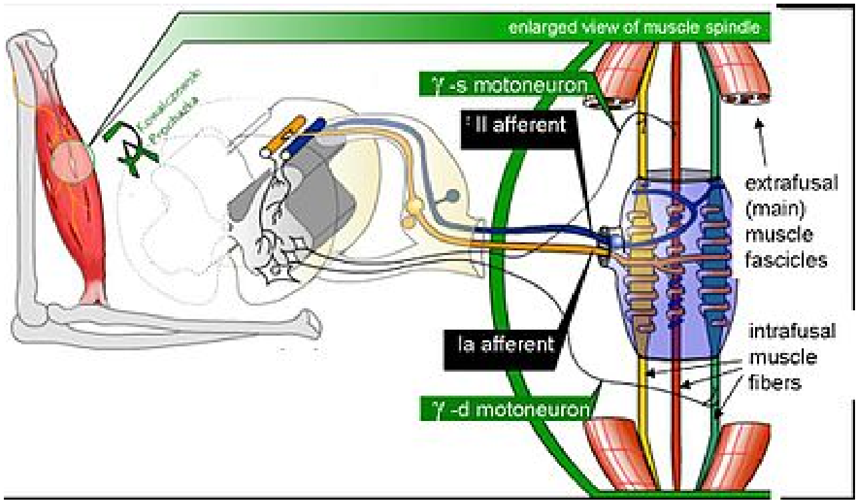

# somatosensory

*Diekstrak: 08 June 2026, 00:17*

---

---
## 📄 Halaman 1

### Anatomy of the Somatosensory System

FROM WIKIBOOKS 1

Our somatosensory system consists of sensors in the skin and sensors in our muscles, tendons, and joints. The receptors in the skin, the so called cutaneous receptors, tell us about temperature ( thermoreceptors ), pressure and surface  texture  ( mechano  receptors ),  and  pain  ( nociceptors ). The receptors in muscles and joints provide information about muscle length, muscle tension, and joint angles.

### Cutaneous receptors

Sensory information from Meissner corpuscles and rapidly adapting afferents leads to adjustment of grip force when objects  are  lifted.  These  afferents  respond  with  a  brief burst of action potentials when objects move a small distance  during  the  early  stages  of  lifting.  In  response  to

---
**🖼️ Gambar/Diagram**

> **Deskripsi Visual:** Gambar ini adalah ilustrasi yang menunjukkan struktur kulit manusia, termasuk bagian epidermis dan dermis. Gambar ini secara keseluruhan memperlihatkan berbagai komponen sensorik dan struktural pada kulit, seperti rambut, kelenjar sebaceous, dan berbagai jenis receptor.

Elemen-elemen utama yang terdapat dalam gambar termasuk papillary ridges (puncak papillae), septa (septum), Meissner's corpuscle (korpuskul Meissner), Ruffini's corpuscle (korpuskul Ruffini), Pacinian corpuscle (korpuskul Pacinian), Merkel's receptor (receptor Merkel), dan free nerve ending (ujung saraf bebas). Semua elemen ini terletak di dermis, yang merupakan lapisan kulit bawah.

Teks penting yang muncul dalam gambar meliputi "Hairy skin", "Glabrous skin", "Epidermis", "Dermis", "Free nerve ending", "Merkel's receptor", "Meissner's corpuscle", "Ruffini's corpuscle", "Pacinian corpuscle", dan "Hair receptor". Label-label ini membantu dalam mengidentifikasi posisi dan fungsi setiap komponen.

Informasi kunci yang dapat diambil dari gambar adalah bahwa struktur kulit terdiri dari berbagai jenis sensorik dan mekanoreceptor, termasuk Meissner's corpuscle untuk deteksi sentuhan lembut, Ruffini's corpuscle untuk perubahan tekanan, Pacinian corpuscle untuk percepatan, Merkel's receptor untuk rasa sentuh kasar, dan free nerve ending untuk sensasi panik. Gambar ini juga menunjukkan bahwa kulit berambut (hairy skin) memiliki struktur yang lebih kompleks dibandingkan kulit bebas rambut (glabrous skin).

This is a sample document to showcase page-based formatting. It contains a chapter from a Wikibook called Sensory Systems. None of the content has been changed in this article, but some content has been removed.

 

---
## 📄 Halaman 2

### From Wikibooks

---
**🖼️ Gambar/Diagram**

> **Deskripsi Visual:** Gambar ini adalah ilustrasi yang menunjukkan struktur dan fungsi sistem refleks otot tulang belakang (muscle spindle) dalam tubuh manusia, khususnya bagian otot-otot eksternal. Ilustrasi ini merupakan diagram yang memperlihatkan hubungan antara neuron motor (motoneuron), afferent (serabut saraf pengirim), dan struktur intrafusal dan extrafusal dalam sistem refleks otot tulang belakang.

1. Apa yang ditampilkan secara keseluruhan: Ilustrasi ini menunjukkan bagaimana serabut saraf motorik (motoneuron) berinteraksi dengan otot-otot eksternal melalui afferent dan intrafusal muscle fibers untuk mengontrol gerakan dan refleks otot.

2. Elemen-elemen utama dan relasinya: Ilustrasi ini menunjukkan motoneuron γ-s, la afferent, II afferent, serta extrafusal (main) muscle fascicles dan intrafusal muscle fibers. Motoneuron γ-s mengontrol intrafusal muscle fibers, sedangkan la afferent dan II afferent menerima informasi dari otot eksternal.

3. Teks, angka, atau label penting yang terlihat: Gambar ini memiliki beberapa label penting seperti "enlarged view of muscle spindle", "γ-s motoneuron", "II afferent", "la afferent", dan "extrafusal (main) muscle fascicles". Selain itu, ada juga penunjuk pada intrafusal muscle fibers.

4. Informasi kunci yang dapat diambil pembaca: Ilustrasi ini memberikan gambaran tentang bagaimana sistem refleks otot tulang belakang bekerja untuk mengontrol gerakan dan refleksi otot. Ini menunjukkan interaksi antara neuron motorik, serabut saraf pengirim, dan struktur intrafusal dan extrafusal dalam konteks kontrol otot.

rapidly adapting afferent activity, muscle force increases reflexively until the gripped object no longer moves. Such a rapid response to a tactile stimulus is a clear indication of the role played by somatosensory neurons in motor activity.

The slowly adapting Merkel's receptors are responsible for form and texture perception. As would be expected for receptors  mediating  form  perception,  Merkel's  receptors are present at high density in the digits and around the mouth (50/mm² of skin surface), at lower density in other glabrous surfaces, and at very low density in hairy skin. This  innervations  density  shrinks  progressively  with  the passage of time so that by the age of 50, the density in human digits is reduced to 10/mm². Unlike rapidly adapting axons, slowly adapting fibers respond not only to the initial indentation of skin, but also to sustained indentation up to several seconds in duration.

Activation of the rapidly adapting Pacinian corpuscles gives  a  feeling  of  vibration,  while  the  slowly  adapting Ruffini  corpuscles respond  to  the  lataral  movement  or stretching of skin.

### Nociceptors

Nociceptors  have  free  nerve  endings.  Functionally,  skin nociceptors  are  either  high-threshold  mechanoreceptors or polymodal receptors .  Polymodal receptors respond not

 

---
## 📄 Halaman 3

---
**📊 Tabel**

Tabel ini membahas jenis-jenis receptor kulit berdasarkan kecepatan adaptasi dan lokasinya. Kolom pertama menunjukkan apakah receptor tersebut berada di permukaan (surface) atau dalam (deep), dengan ukuran field reseptornya yang kecil atau besar. Kolom kedua membedakan antara receptor yang cepat adaptasi (rapidly adapting) dan lambat adaptasi (slowly adapting). Untuk receptor pada permukaan, hair receptor dan Meissner’s corpuscle digunakan untuk mendeteksi serangga atau vibrasi halus serta mengenali tekstur. Sementara itu, Merkel’s receptor yang termasuk dalam kelompok receptor lambat adaptasi digunakan untuk detail spasial seperti tepi permukaan bulat atau simbol "X" pada Braille. Pada receptor dalam, Pacinian corpuscle berfungsi untuk deteksi vibrasi luas seperti ketukan dengan pensil, sedangkan Ruffini’s corpuscle yang termasuk dalam kelompok lambat adaptasi digunakan untuk merasakan penarikan kulit dan posisi jari-jari.

only to intense mechanical stimuli, but also to heat and to noxious chemicals. These receptors respond to minute punctures of the epithelium, with a response magnitude that depends on the degree of tissue deformation. They also respond to temperatures in the range of 40-60°C, and change their response rates as a linear function of warming (in contrast with the saturating responses displayed by non-noxious thermoreceptors at high temperatures).

Pain signals can be separated into individual components,  corresponding  to  different  types  of  nerve  fibers used for transmitting these signals. The rapidly transmitted  signal,  which  often  has  high  spatial  resolution,  is called fi rst pain or cutaneous pricking pain . It is well localized and easily tolerated. The much slower, highly affective component is called second pain or burning pain ; it is poorly  localized  and  poorly  tolerated.  The  third  or deep pain , arising from viscera, musculature and joints, is also poorly  localized,  can  be  chronic  and  is  often  associated with referred pain.

### Muscle Spindles

Scattered throughout virtually every striated muscle in the body are long, thin, stretch receptors called muscle spindles. They are quite simple in principle, consisting of a few small muscle fibers with a capsule surrounding the middle third of the fibers. These fibers are called intrafusal fibers , in contrast to the ordinary extrafusal fibers . The ends of the intrafusal fibers are attached to extrafusal fibers, so whenever the muscle is stretched, the intrafusal fibers are also stretched. The central region of each intrafusal fiber has

Notice how figure captions and sidenotes are shown in the outside margin (on the left or right, depending on whether the page is left or right). Also, figures are floated to the top/ bottom of the page. Wide content, like the table and Figure 3, intrude into the outside margins.

 

---
## 📄 Halaman 4

### From Wikibooks

---
**🖼️ Gambar/Diagram**

> **Deskripsi Visual:** Gambar ini adalah diagram yang menunjukkan mekanisme kontrol otot dan tendon dalam sistem saraf perifer manusia, terutama fokus pada pengaturan kekuatan otot melalui interaksi antara neuron intermedier, otot, tendon organ, dan spindel. 

1. **Apakah yang ditampilkan secara keseluruhan**: Diagram ini menggambarkan bagaimana sistem saraf perifer berinteraksi untuk mengontrol kekuatan otot dan reaksi terhadap beban eksternal.

2. **Elemen-elemen utama dan relasinya**:
   - **Interneurons**: Menerima sinyal dari tendon organ dan spindel, serta memberikan sinyal ke otot.
   - **Muscle (Otot)**: Berinteraksi dengan tendon organ untuk menghasilkan kekuatan otot.
   - **Tendon organs (Organ Tendon)**: Memberikan feedback tentang kekuatan otot melalui Golgi tendon organ.
   - **Spindles**: Menerima sinyal dari spindel otot dan memberikan feedback tentang panjang dan kecepatan otot.
   - **Load (Beban)**: Menghasilkan sinyal ke otot berdasarkan beban eksternal yang diterima.

3. **Teks, angka, atau label penting**:
   - "Force control signal" (Sinyal kontrol kekuatan)
   - "Driving signal" (Sinyal penggerak)
   - "Length error (primary muscle-spindle afferents)" (Saluran aferen spindel otot utama)
   - "Velocity (primary muscle-spindle afferents)" (Kecepatan (saluran aferen spindel otot utama))
   - "Gamma bias" (Biass Gamma)

4. **Informasi kunci yang dapat diambil pembaca**:
   - Diagram ini menunjukkan bagaimana sistem saraf perifer berfungsi untuk mengontrol kekuatan otot dan reaksi terhadap beban eksternal.
   - Interneurons memainkan peran penting dalam menerima sinyal dari tendon organ, spindel, dan memberikan sinyal ke otot.
   - Spindel otot memberikan feedback tentang panjang dan kecepatan otot, yang digunakan untuk meng

few myofilaments and is non-contractile, but it does have one or more sensory endings applied to it. When the muscle is stretched, the central part of the intrafusal fiber is stretched and each sensory ending fires impulses.

Muscle spindles also receive a motor innervation. The large motor neurons that supply extrafusal muscle fibers are called alpha motor neurons , while the smaller ones supplying  the  contractile  portions  of  intrafusal  fibers  are called gamma neurons .  Gamma motor neurons can regulate the sensitivity of the muscle spindle so that this sensitivity can be maintained at any given muscle length.

### Joint receptors

The joint  receptors  are  low-threshold  mechanoreceptors and have been divided into four groups. They signal different characteristics of joint function (position, movements, direction and speed of movements). The free receptors or type 4 joint receptors are nociceptors.

For more examples of how to use HTML and CSS for paper-based publishing, see css4.pub.